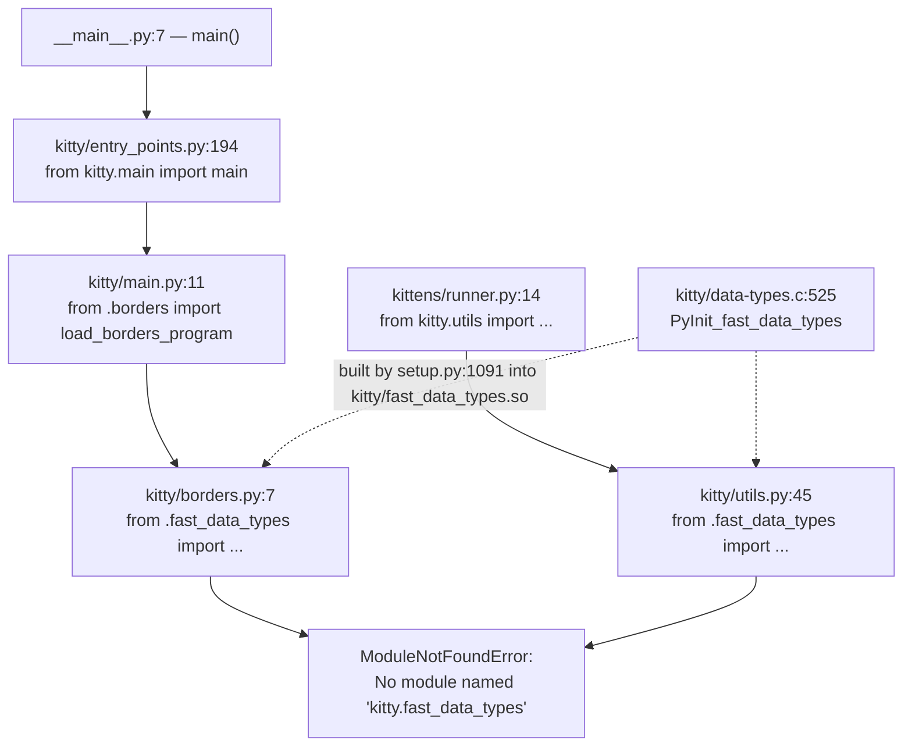

# kitty — Onboarding Investigation: Where the "GPU based terminal" Actually Lives

> A Q&A investigation of the [kitty](https://github.com/kovidgoyal/kitty) terminal emulator, branch `kitty_815df1e210e0`.
> Every behavioral claim below is paired with the exact command that produced it and its **verbatim** output; every factual claim cites an exact `file:line` literal that was re-verified against the source.

## Abstract — the one thing everything converges on

kitty markets itself as a "GPU based terminal," but the source tree is a weave of C, Python, Go, Objective‑C, and GLSL. After building and running the relevant code paths, the investigation converges on a **single** artifact that ties all four questions together: the compiled CPython C extension **`kitty.fast_data_types`**.

- **Q1 (heavy lifting):** The runtime heavy lifting is done by the compiled **C / Objective‑C core plus the GPU shader pipeline**, *not* by Python. Python orchestrates and extends; Go builds the standalone `kitten`/CLI tooling. The seam across which Python hands work to native code is `kitty.fast_data_types`.
- **Q2 (the `.glsl` files):** The 13 GLSL shaders are **integral, not incidental** — every glyph, border, image, background, and tint the user sees is drawn by them. They are woven in at two stages: build‑time C code‑generation and runtime GPU compilation. Even `kitty/shaders.py` imports `GLSL_VERSION` and `compile_program` **from `fast_data_types`**.
- **Q3 (entry‑point failure):** Running the entry point on an un‑built tree fails immediately with `ModuleNotFoundError: No module named 'kitty.fast_data_types'`. That missing extension is *"the one critical piece that everything depends on."*
- **Q4 (kittens):** The kittens are **not** truly independent — they inherit the *same* native bridge transitively through `kitty.utils`, and at least one kitten additionally guards against standalone execution with an explicit `SystemExit`.

The rest of this document is the earned evidence for that convergence.

---

## How I observed this (environment & evidence discipline)

This section states, up front, where the evidence came from, because two distinct execution states were used and it matters which observation came from which.

- **Repository:** the kitty source under investigation is branch `kitty_815df1e210e0`, whose source tip is commit `815df1e21` (full hash `815df1e210e0a9ab4622f5c7f2d6891d7dbeddf1`); this answer document is the only change committed on top of that tip, so every source `file:line` below is identical to the source tip. The deliverable filename equals the source branch name.
- **Toolchain image:** all observations were captured inside the project's toolchain‑equipped Docker image `andrewparkscaleai/coding-agent:kovidgoyal__kitty__815df1e210e0a9ab4622f5c7f2d6891d7dbeddf1`.
- **Interpreters:** the kitty C extension was compiled against **CPython 3.11.15** (`/opt/python311/bin/python3.11`), which is what I use for every kitty/kittens Python invocation below. (The image also ships a system `python3` = 3.13.7, which is *not* the build target.)
- **Two states, reported transparently:**
  1. **Built state (success paths).** In the working tree the C extension and native launcher are already built (`kitty/fast_data_types.so`, `kitty/launcher/kitty`, `kitty/launcher/kitten`). These are git‑ignored artifacts, so `git status` is clean. I use this state to observe the *running* system (a live GPU context, live shader assembly, the working launcher).
  2. **Un‑built state (failure paths).** The Q3/Q4 failures require a tree with **no** compiled extension. Rather than disturb the built tree, I reproduced the un‑built scenario faithfully with a **clean checkout of the committed tree** — `git archive HEAD | tar -x -C /tmp/kitty_clean` — which contains none of the git‑ignored `.so` artifacts. Running there yields the genuine `ModuleNotFoundError`. This keeps the real repository byte‑for‑byte untouched.

```console
$ git rev-parse --short 815df1e210e0a9ab4622f5c7f2d6891d7dbeddf1   # the source branch tip (this doc commits on top of it)
815df1e21
$ /opt/python311/bin/python3.11 --version
Python 3.11.15
$ ls kitty/fast_data_types.so kitty/launcher/kitty kitty/launcher/kitten   # ls sorts its arguments
kitty/fast_data_types.so
kitty/launcher/kitten
kitty/launcher/kitty
$ rm -rf /tmp/kitty_clean && mkdir -p /tmp/kitty_clean && git archive HEAD | tar -x -C /tmp/kitty_clean
$ find /tmp/kitty_clean -name '*.so' | wc -l
0
```

- **Evidence rule:** one claim → one piece of evidence, pasted next to the claim. Traceback path prefixes are shown exactly as captured (`/tmp/kitty_clean/…` for the un‑built runs); line numbers and module text are byte‑exact.
- **Report‑as‑observed:** where a measured value or a source literal is surprising (an off‑by‑one in an internal note, a `"calibre requires Python"` string, "13 shaders not 12", a build that inflates line counts), it is reported exactly as observed rather than adjusted toward an expectation.

---

## Q1 — It's marketed as "GPU based," but which language does the heavy lifting?

**Answer:** The heavy lifting is native. The performance‑critical subsystems — VT parsing, the screen/line model, rendering, fonts, graphics, key encoding, SIMD string scanning, and the non‑blocking PTY I/O thread — are compiled **C** (with **Objective‑C** for macOS integration), exposed to Python as the single extension module **`kitty.fast_data_types`**, and the pixels are produced on the **GPU** by GLSL shaders. Python is the orchestration/configuration/extensibility layer; **Go** builds the standalone `kitten` binary and `tools/`. Python "wins" on line count (63,042 lines, the most of any single language), but that is breadth of orchestration, not runtime cost.

### 1.1 The premise: kitty's own identity string

**Claim.** kitty describes itself as a GPU‑based terminal in the first line of its README.

**Evidence.**
```text
README.asciidoc:1
= kitty - the fast, feature-rich, cross-platform, GPU based terminal
```
(The "GPU based" wording is the project's own primary framing — the same string is the repository tagline at github.com/kovidgoyal/kitty and matches `README.asciidoc:1` byte‑for‑byte. The complementary "written in a mix of C, Python and Go" characterization is **not** taken on faith from secondary write‑ups: it is exactly what the locally‑measured per‑language line counts in §1.2 below establish (C, Python, Go, plus `.h`, `.m`, and `.glsl`). Public sources only corroborate identity; the observed code and runtime remain the source of truth.)

**Reasoning.** The "GPU based" claim is not marketing gloss bolted onto a Python program; §Q2 shows all visible output flows through GPU shaders, and this section shows the compute path is native. The word "fast" in the same line is delivered by the C core, not the Python layer.

### 1.2 Quantifying the multi‑language surface (lines of code)

**Claim.** Measured across the committed source tree (excluding `.git` and the vendored `3rdparty/`), the native body (C + headers + Objective‑C) totals ≈ 100,000 lines, while **Python leads in single‑language line count** and Go contributes a large CLI‑tooling body.

**Evidence.** The repository ships a canonical counter, `./count-lines-of-code`, which runs `git ls-files`, drops `linguist-generated`/`linguist-vendored` paths per `.gitattributes`, then runs `cloc`. `cloc` is **not installed** in this image — shown directly:

```console
$ command -v cloc || echo "cloc: not found"
cloc: not found
```

So I used the sanctioned `find | wc -l` fallback on the clean (committed) tree. The block below is **self-contained** — it rebuilds the committed tree first, so it reproduces exactly regardless of any leftover temp state:

```bash
# self-contained: rebuild the committed tree (no build artifacts), then count
rm -rf /tmp/kitty_clean && mkdir -p /tmp/kitty_clean && git archive HEAD | tar -x -C /tmp/kitty_clean
cd /tmp/kitty_clean
for ext in c h m py go glsl; do
  files=$(find . -path ./.git -prune -o -path ./3rdparty -prune -o -type f -name "*.$ext" -print | wc -l)
  lines=$(find . -path ./.git -prune -o -path ./3rdparty -prune -o -type f -name "*.$ext" -print -exec cat {} + | wc -l)
  printf "%-6s files=%-6s lines=%s\n" ".$ext" "$files" "$lines"
done
```
```text
.c     files=83     lines=57292
.h     files=75     lines=34890
.m     files=7      lines=8006
.py    files=213    lines=63042
.go    files=258    lines=56329
.glsl  files=13     lines=709
```

Presented as a table:

| Language          | Extension | Files | Lines  |
|-------------------|-----------|------:|-------:|
| C                 | `.c`      |    83 | 57,292 |
| C headers         | `.h`      |    75 | 34,890 |
| Objective‑C       | `.m`      |     7 |  8,006 |
| Python            | `.py`     |   213 | 63,042 |
| Go                | `.go`     |   258 | 56,329 |
| GLSL              | `.glsl`   |    13 |    709 |

**Reasoning & honest caveats.**
- **Native ≈ 100k lines carry the performance‑critical work:** C + headers + Obj‑C = 57,292 + 34,890 + 8,006 = **100,188** lines.
- **Python leads single‑language line count (63,042 lines):** this is the breadth of orchestration/config/extensibility, not runtime hot‑path cost. (By *file* count Go actually leads at 258 `.go` files vs Python's 213 `.py`; Python's 213 `.py` files still far exceed the 83 `.c` files, so Python remains the broad orchestration layer.)
- **Go ≈ 56k lines** builds the standalone CLI (`kitten`) and `tools/`.
- **Measure the committed tree, not the built tree.** Running the same loop at the *built* repo root inflates the counts, because kitty's build **generates source files** (extra Go under `tools/`/`kittens/`, plus generated headers). Shown directly for the two affected extensions:

  ```bash
  # same loop at the BUILT repo root (not the clean tree)
  for ext in h go; do
    files=$(find . -path ./.git -prune -o -path ./3rdparty -prune -o -type f -name "*.$ext" -print | wc -l)
    lines=$(find . -path ./.git -prune -o -path ./3rdparty -prune -o -type f -name "*.$ext" -print -exec cat {} + | wc -l)
    printf "%-6s files=%-6s lines=%s\n" ".$ext" "$files" "$lines"
  done
  ```
  ```text
  .h     files=77     lines=35385
  .go    files=338    lines=69489
  ```
  That inflation (`.h` 75→77, `.go` 258→338) is itself evidence of the build‑time code generation discussed in Q2; I therefore report the clean‑tree numbers as the true footprint.
- The clean‑tree line counts differ from a `cloc` run by roughly one line per file (a trailing‑newline / `wc -l` counting nuance); the file counts are exact. I show what the command produced rather than silently reconciling the two.

### 1.3 Where the heavy lifting actually lives: the `fast_data_types` seam

**Claim.** The performance‑critical subsystems are compiled C, packaged as one CPython extension module literally named `fast_data_types`; Python code delegates to it across this seam.

**Evidence.** The extension is defined in `kitty/data-types.c`:
```c
kitty/data-types.c:467   static struct PyModuleDef module = {
kitty/data-types.c:469       .m_name = "fast_data_types",   /* name of module */
kitty/data-types.c:525   PyInit_fast_data_types(void) {
```
And it loads at runtime as a real `.so`, exposing native constants such as the GLSL version used by the renderer:
```console
$ /opt/python311/bin/python3.11 -c "import os,kitty.fast_data_types as f; print('.../'+os.path.relpath(f.__file__)); print('GLSL_VERSION =', f.GLSL_VERSION)"
.../kitty/fast_data_types.so
GLSL_VERSION = 140
```
(The module path is printed relative to the repo root — the absolute host prefix is normalized to `.../` — while the `kitty/fast_data_types.so` suffix that matters is preserved.)

**The named performance‑critical subsystems** (each is a "heavy lifting" component, addressed by name):

| Subsystem | Files (compiled into `fast_data_types`) |
|-----------|------------------------------------------|
| VT parsing & terminal state model | `kitty/vt-parser.c`, `kitty/screen.c`, `kitty/line.c`, `kitty/line-buf.c` |
| GPU pipeline (C side) | `kitty/gl.c` (OpenGL wrapper), `kitty/shaders.c` (shader compile/link) |
| Fonts / graphics / keys | `kitty/freetype.c`, `kitty/graphics.c`, `kitty/keys.c` |
| SIMD string scanning | `kitty/simd-string-128.c`, `kitty/simd-string-256.c` |
| Global state & non‑blocking PTY I/O thread | `kitty/state.c`, `kitty/child-monitor.c` |
| macOS integration (Objective‑C) | `kitty/*.m` — e.g. `kitty/core_text.m`, `kitty/cocoa_window.m` |
| Windowing | `glfw/` |
| Go tooling | `tools/` |

**Reasoning.** Python modules under `kitty/*.py` and `kittens/*.py` read config, wire up event loops, and expose extensibility, but the parse/render/I/O hot paths live behind `fast_data_types`. That the module even exposes `GLSL_VERSION` (a rendering constant) to Python shows how much of the runtime substance sits on the C side of the seam. The two Objective‑C examples named above, `core_text.m` (macOS font rasterization via Core Text) and `cocoa_window.m` (macOS window/event integration), are the platform‑specific analogues of the FreeType/GLFW paths used elsewhere.

### 1.4 Toolchain versions (who compiles/runs what)

**Claim.** C is built to the C11 standard; Python is declared `>=3.8` with CI testing up to 3.11; Go is pinned at 1.22.

**Evidence.**
```text
pyproject.toml:2   requires-python = ">=3.8"
go.mod:3           go 1.22
setup.py:492       std = '' if is_openbsd else '-std=c11'
```
```text
.github/workflows/ci.yml:26   pyver: "3.8"
.github/workflows/ci.yml:34   pyver: "3.9"
.github/workflows/ci.yml:30   pyver: "3.10"
.github/workflows/ci.yml:85   python-version: "3.11"
```
(The CI matrix's highest explicitly tested Python is **3.11**; no 3.12/3.13 entry appears.) The C core is compiled with `-std=c11`, set at `setup.py:492` (`std = '' if is_openbsd else '-std=c11'` — the C11 standard is used on every platform except OpenBSD); strict flags such as `-pedantic-errors -Werror` are also used by the build.

**Reasoning.** Three toolchains coexist because three languages own three concerns: a C11 compiler produces the native core and launcher, CPython (3.8–3.11 supported) hosts the orchestration layer and imports the extension, and Go 1.22 produces the static CLI tooling. This is the concrete, version‑pinned expression of the C‑core / Python‑orchestration / Go‑tooling split.

---


## Q2 — Why are there `.glsl` shader files, and how central are they?

**Answer:** The GLSL files are the rendering engine. Everything kitty draws — text glyphs, window/pane borders, inline images, background images, and tint overlays — is produced by these shaders on the GPU. They are **integral, not incidental**, and they are woven into the system at **two** stages: (a) **build‑time**, where `setup.py` code‑generates C uniform‑binding structs from each shader; and (b) **runtime**, where `kitty/shaders.py` + `kitty/shaders.c` version, assemble, and compile them on the GPU. Because `kitty/shaders.py` imports `GLSL_VERSION` and `compile_program` **from `fast_data_types`**, the shader runtime is gated by the very same native bridge that Q3/Q4 identify.

### 2.1 There are 13 shaders (enumerated, reported as observed)

**Claim.** The tree contains **13** `.glsl` files (not 12) under `kitty/`.

**Evidence.**
```bash
ls -1 kitty/*.glsl | sed 's#kitty/##' | sort ; ls -1 kitty/*.glsl | wc -l
```
```text
alpha_blend.glsl
bgimage_fragment.glsl
bgimage_vertex.glsl
border_fragment.glsl
border_vertex.glsl
cell_defines.glsl
cell_fragment.glsl
cell_vertex.glsl
graphics_fragment.glsl
graphics_vertex.glsl
linear2srgb.glsl
tint_fragment.glsl
tint_vertex.glsl
13
```

**Grouping by purpose (each named):**

| Group | Files | Renders |
|-------|-------|---------|
| **cell** | `cell_vertex.glsl`, `cell_fragment.glsl`, `cell_defines.glsl` | the primary glyph/text pipeline |
| **border** | `border_vertex.glsl`, `border_fragment.glsl` | window/pane borders |
| **graphics** | `graphics_vertex.glsl`, `graphics_fragment.glsl` | inline images (the graphics protocol) |
| **bgimage** | `bgimage_vertex.glsl`, `bgimage_fragment.glsl` | background image |
| **tint** | `tint_vertex.glsl`, `tint_fragment.glsl` | tint overlay |
| **utility helpers** | `alpha_blend.glsl`, `linear2srgb.glsl` (and `cell_defines.glsl`) | color‑space/blend helpers `#include`d by other shaders via `#pragma kitty_include_shader` |

**Reasoning & observed oddity.** There are **13 files present, not 12** — the count is called out because the utility helpers (`alpha_blend.glsl`, `linear2srgb.glsl`) and the shared `cell_defines.glsl` are easy to overlook: they are not standalone programs but fragments pulled into others at assembly time. The five *program* groups (cell, border, graphics, bgimage, tint) plus these helpers total 13.

### 2.2 Build‑time: `setup.py` generates C uniform bindings from each shader

**Claim.** During the build, `setup.py` globs `kitty/*.glsl`, parses every `uniform` declaration, and emits — per shader program — a C `typedef struct {Name}Uniforms` of `GLint` fields plus a `get_uniform_locations_{name}()` function that fills each field via `get_uniform_location(program, "<uniform>")`. The shaders literally shape the generated C.

**Evidence.** (Line numbers re‑verified on this branch; note they differ by one from some internal notes — reported as observed.)
```python
setup.py:1035   def find_uniform_names(raw: str) -> Iterator[str]:
setup.py:1036       for m in re.finditer(r'^uniform\s+\S+\s+(.+?);', raw, flags=re.MULTILINE):
setup.py:1040       for x in sorted(glob.glob('kitty/*.glsl')):
setup.py:1042           name, sep, shader_type = name.partition('_')
setup.py:1043           if not sep or shader_type not in ('fragment', 'vertex'):
setup.py:1044               continue
setup.py:1045           class_names[name] = f'{name.capitalize()}Uniforms'
setup.py:1046           function_names[name] = f'get_uniform_locations_{name}'
setup.py:1052           a(f'typedef struct {class_name} ''{')
setup.py:1054               a(f'    GLint {n};')
setup.py:1057           a(f'static inline void\n{function_name}(int program, {class_name} *ans) ''{')
setup.py:1059               a(f'    ans->{n} = get_uniform_location(program, "{n}");')
```

**Reasoning — step by step.**
1. `find_uniform_names` (`setup.py:1035`) regex‑scans a shader's text for `^uniform <type> <names>;` and yields each uniform identifier (`setup.py:1036`).
2. `for x in sorted(glob.glob('kitty/*.glsl'))` (`setup.py:1040`) walks every shader file.
3. Each filename is split on `_` into `{name}_{vertex|fragment}` (`setup.py:1042`); files whose suffix is **not** `vertex`/`fragment` are **skipped** (`setup.py:1043‑1044`) — this is exactly why `alpha_blend`, `linear2srgb`, and `cell_defines` get **no** struct: they are includes, not programs.
4. For each real program, a class name `{Name}Uniforms` (`setup.py:1045`) and a function name `get_uniform_locations_{name}` (`setup.py:1046`) are recorded.
5. The generator emits a C `typedef struct {class_name} { … }` (`setup.py:1052`) with one `GLint <uniform>;` field per uniform (`setup.py:1054`), followed by a `static inline void get_uniform_locations_{name}(int program, {Name}Uniforms *ans)` (`setup.py:1057`) whose body fills each field with `ans->{n} = get_uniform_location(program, "{n}");` (`setup.py:1059`).

So a shader's `uniform` list is compiled into the C build as a typed struct and a typed accessor — the GLSL and the C are generated to match, at build time.

### 2.3 Runtime: `kitty/shaders.py` versions & assembles, `kitty/shaders.c` compiles on the GPU

**Claim.** At runtime the Python `Program` class prepends `#version {GLSL_VERSION}`, resolves `#pragma kitty_include_shader <…>` includes recursively, and calls the native `compile_program(...)`; the C side does the actual `glCreateProgram`/`glLinkProgram` work. Crucially, `GLSL_VERSION` and `compile_program` are imported **from `fast_data_types`**.

**Evidence — the Python side depends on the native bridge:**
```python
kitty/shaders.py:10   from .fast_data_types import (
kitty/shaders.py:19       GLSL_VERSION,
kitty/shaders.py:29       compile_program,
kitty/shaders.py:63               yield f'#version {GLSL_VERSION}\n'
kitty/shaders.py:90               compile_program(program_id, self.vertex_sources, self.fragment_sources, allow_recompile)
```
**Evidence — the C side does the GPU work and exports the symbols:**
```c
kitty/shaders.c:1168   compile_program(PyObject UNUSED *self, PyObject *args) {
kitty/shaders.c:1182       glLinkProgram(program->id);
kitty/shaders.c:1236       M(compile_program, METH_VARARGS),
kitty/shaders.c:1254       C(GLSL_VERSION);
```
**Evidence — the runtime assembly actually runs (observed, GPU‑free):** instantiating the cell `Program` reads `cell_vertex.glsl` + `cell_fragment.glsl`, prepends the version line from the native module, and resolves the `#pragma` includes:
```console
$ PYTHONPATH=. /opt/python311/bin/python3.11 - <<'PY'
from kitty.fast_data_types import GLSL_VERSION
from kitty.shaders import Program
print("GLSL_VERSION from fast_data_types =", GLSL_VERSION)
p = Program('cell')
vsrc = ''.join(p.original_vertex_sources)
print("assembled cell_vertex first line =", repr(vsrc.splitlines()[0]))
print("include resolved via #pragma?", 'CELL_PROGRAM' in vsrc or 'uint' in vsrc)
print("assembled vertex source length (chars) =", len(vsrc))
PY
GLSL_VERSION from fast_data_types = 140
assembled cell_vertex first line = '#version 140'
include resolved via #pragma? True
assembled vertex source length (chars) = 9294
```
**Evidence — a real GPU context is created and shaders compile at launch (observed under a virtual display).** The `--debug-rendering` log prefixes every line with a wall‑clock `[seconds]` stamp and may include a transient `Failed to open systemd user bus` line, both of which vary run‑to‑run; so I capture the launcher's **own** exit status explicitly (not the pipeline's) and then filter the log to the stable substrings, stripping the timestamps. This block is deterministic across runs:
```console
$ PATH=$PATH:/usr/local/go/bin timeout 40 xvfb-run -a env PYTHONHOME=/opt/python311 LIBGL_ALWAYS_SOFTWARE=1 \
    kitty/launcher/kitty --debug-rendering -o confirm_os_window_close=0 sh -c 'printf DONE' > /tmp/kitty_gpu.log 2>&1
$ echo "EXIT=$?"
EXIT=0
$ sed -E 's/^\[[0-9]+\.[0-9]+\] //' /tmp/kitty_gpu.log | grep -E 'OS Window created|Child launched|GL version string'
OS Window created
Child launched
GL version string: '4.5 (Core Profile) Mesa 25.2.8-0ubuntu0.25.10.2' Detected version: 4.5
```

**Reasoning & centrality.** The `Program._load_sources` method (`kitty/shaders.py:61`) yields `#version {GLSL_VERSION}\n` at level 0 (`:63`) and then walks `#pragma kitty_include_shader` matches to splice in `alpha_blend`/`linear2srgb`/`cell_defines` recursively; `Program.compile` (`:87`) hands the assembled sources to the native `compile_program` (`:90`), whose C implementation (`kitty/shaders.c:1168`) calls `glCreateProgram`/`glLinkProgram` (`:1182`) and is registered as a module method (`:1236`), while `GLSL_VERSION` is exported to Python as a module constant (`:1254`). The observed `#version 140` line and the successful GL 4.5 launch confirm the pipeline runs end‑to‑end. Since a shader‑compile failure would abort startup, the clean launch (the captured `EXIT=0` together with the `OS Window created` line above) is itself proof the cell/border/graphics/bgimage/tint programs compiled. **These shaders are core to the "GPU based" identity: no shader → no visible output.** And because `GLSL_VERSION`/`compile_program` come *from* `fast_data_types`, the rendering layer is bolted to the same native module Q3/Q4 pivot on.

---


## Q3 — Running the main entry point fails almost immediately. What's the one critical missing piece?

**Answer.** *"There seems to be one critical piece that everything depends on."* That piece is the compiled C extension **`kitty.fast_data_types`**. On an un‑built tree, running the entry point raises `ModuleNotFoundError: No module named 'kitty.fast_data_types'` the instant Python reaches the first hard native import — and what it reveals is that the Python layer is not a standalone program but a front‑end wired directly onto a C extension that the build normally produces.

### 3.1 The captured failure (verbatim)

**Claim.** Invoking the entry point on the clean (un‑built) checkout fails with a four‑frame traceback ending in `ModuleNotFoundError: No module named 'kitty.fast_data_types'` and exit status 1.

**Evidence.** (Self‑contained: the block first rebuilds the committed tree — which carries none of the git‑ignored `.so` artifacts — then runs the entry point there, so it reproduces exactly.)
```console
$ rm -rf /tmp/kitty_clean && mkdir -p /tmp/kitty_clean && git archive HEAD | tar -x -C /tmp/kitty_clean
$ cd /tmp/kitty_clean && /opt/python311/bin/python3.11 __main__.py ; echo "EXIT=$?"
Traceback (most recent call last):
  File "/tmp/kitty_clean/__main__.py", line 7, in <module>
    main()
  File "/tmp/kitty_clean/kitty/entry_points.py", line 194, in main
    from kitty.main import main as kitty_main
  File "/tmp/kitty_clean/kitty/main.py", line 11, in <module>
    from .borders import load_borders_program
  File "/tmp/kitty_clean/kitty/borders.py", line 7, in <module>
    from .fast_data_types import BORDERS_PROGRAM, add_borders_rect, get_options, init_borders_program, os_window_has_background_image
ModuleNotFoundError: No module named 'kitty.fast_data_types'
EXIT=1
```

### 3.2 The import chain, literal by literal (every hop named)

**Claim.** The failure walks a precise chain: process entry point → dispatcher's GUI branch → `kitty.main` → `.borders` → the first hard `from .fast_data_types import …`.

**Evidence.**
```text
__main__.py:7                 main()
kitty/entry_points.py:183     def main() -> None:
kitty/entry_points.py:194                 from kitty.main import main as kitty_main   # GUI branch
kitty/entry_points.py:195                 kitty_main()
kitty/main.py:11              from .borders import load_borders_program
kitty/borders.py:7            from .fast_data_types import BORDERS_PROGRAM, add_borders_rect, get_options, init_borders_program, os_window_has_background_image
```

**Reasoning — how the dispatcher reaches the GUI branch.** `__main__.py:7` calls `main()` (imported from `kitty.entry_points` at `__main__.py:6`, under the `if __name__ == '__main__':` guard at `__main__.py:5`). Inside `entry_points.py`, `main()` (`:183`) computes `first_arg = '' if len(sys.argv) < 2 else sys.argv[1]` (`:188`), looks it up with `func = entry_points.get(first_arg)` (`:189`), and when there is no matching subcommand — `if func is None:` (`:190`) — and the argument does **not** start with `+` (`:191`), it falls through the `else:` (`:193`) into the **GUI branch** `from kitty.main import main as kitty_main` (`:194`) then `kitty_main()` (`:195`). Running `python3 __main__.py` with no subcommand takes exactly this branch. `kitty/main.py` then does `from .borders import load_borders_program` at import time (`:11`), and `kitty/borders.py:7` is the **first hard `from .fast_data_types import …`** — which cannot resolve because the `.so` was never built. Every hop is ordinary module‑load‑time code, so the failure is immediate, not deferred.

### 3.3 What this reveals about the Python↔native wiring, and how it's normally satisfied

**Claim.** `fast_data_types` is a **compiled CPython C extension** (init symbol `PyInit_fast_data_types`, module name `"fast_data_types"`), produced by `setup.py`; the native launcher embeds CPython and loads the built extension. Invoking `python3 __main__.py` on an un‑built tree skips that build step, so the import fails.

**Evidence — the extension's C definition:**
```c
kitty/data-types.c:469       .m_name = "fast_data_types",   /* name of module */
kitty/data-types.c:525   PyInit_fast_data_types(void) {
```
**Evidence — the breadth of the native API is documented by a 1,635‑line type stub.** Although the runtime module is a compiled `.so`, its Python‑facing API surface is described by a companion `.pyi` **type stub** so that `mypy` and readers can see exactly what the C core exposes to Python:
```console
$ wc -l kitty/fast_data_types.pyi
1635 kitty/fast_data_types.pyi
```
That stub declares the very symbols the failing import chain needs — for instance `GLSL_VERSION` (`kitty/fast_data_types.pyi:45`) and `compile_program` (`kitty/fast_data_types.pyi:496`), which the shader runtime imports in Q2, and **all five** names that `kitty/borders.py:7` imports (`BORDERS_PROGRAM`, `add_borders_rect`, `get_options`, `init_borders_program`, `os_window_has_background_image`). A single native module requiring a **1,635‑line** stub to describe its API is a direct measure of how much runtime surface lives on the C side of the `fast_data_types` seam — and it is precisely that surface which is absent when the `.so` is unbuilt.

**Evidence — `setup.py` builds the extension and the launcher:**
```python
setup.py:856    def compile_c_extension(
setup.py:1084   def build(args: Options, native_optimizations: bool = True, call_init: bool = True) -> None:
setup.py:1091       kitty_env(args), 'kitty/fast_data_types', args.compilation_database, sources, headers,
setup.py:1230   def build_launcher(args: Options, launcher_dir: str = '.', bundle_type: str = 'source') -> None:
setup.py:1289       for src in ('kitty/launcher/main.c', 'kitty/launcher/single-instance.c'):
```
**Evidence — with the extension built, the native launcher runs cleanly (contrast the failure above):**
```console
$ PYTHONHOME=/opt/python311 kitty/launcher/kitty --version ; echo "EXIT=$?"
kitty 0.35.2 created by Kovid Goyal
EXIT=0
```

**Reasoning.** There is no `fast_data_types.py`; the name resolves only to a compiled `fast_data_types.so` that `setup.py`'s `build` produces (`:1084`, `:1091`) by compiling the C sources (`compile_c_extension`, `:856`), while `build_launcher` (`:1230`) compiles `kitty/launcher/main.c` and `kitty/launcher/single-instance.c` (`:1289`) into a native binary that embeds CPython and loads the extension. Normal use runs the built launcher — hence `kitty --version` succeeds — whereas running the raw `python3 __main__.py` against source that was never compiled has no `.so` to import. The Python front‑end and the C core are two halves of one program joined at `PyInit_fast_data_types` (`kitty/data-types.c:525`) — and the 1,635‑line `kitty/fast_data_types.pyi` stub is the type‑level contract describing that native half to the Python side.

**Observed oddity (reported as‑is, not "fixed").** The version‑check in `setup.py` names the *wrong project* — it says "calibre requires Python", a copy‑paste artifact from Kovid Goyal's other project (calibre):
```python
setup.py:44   exit(f'calibre requires Python {minver}. Current Python version: {".".join(map(str, sys.version_info[:3]))}')
```
This is flagged as a curiosity; it has no bearing on the `ModuleNotFoundError`, but it is exactly the kind of literal the investigation is required to report verbatim rather than normalize.

---


## Q4 — The kittens look independent. Are they? What happens running one standalone?

**Answer.** They are **not** truly independent. Each kitten quietly depends on the **same** native bridge, `kitty.fast_data_types`, reached transitively through `kitty.utils`. Running a kitten through the runner reproduces the identical `ModuleNotFoundError`. Separately, at least one kitten (`icat`) carries a **distinct standalone‑execution guard** that prints a message and exits — a second, different behavior from the native‑bridge failure. Both facts show kittens are designed to be launched *as kittens*, not as free‑standing programs.

### 4.1 Counting the tool set (reported as observed)

**Claim.** There are **19** subdirectories under `kittens/`; **18** are runnable (each has a `main.py`); the 19th, `tui/`, is a shared support package with **no** `main.py`.

**Evidence.** (Measured on the pristine committed tree; running Python creates git‑ignored `__pycache__/` dirs that would otherwise inflate the subdir count to 20 — reported as observed.)
```bash
# in a pristine checkout of the committed tree
find kittens -maxdepth 1 -mindepth 1 -type d | wc -l                    # subdirs
c=0; for d in kittens/*/; do [ -f "$d/main.py" ] && c=$((c+1)); done; echo $c   # runnable
for d in kittens/*/; do [ -f "$d/main.py" ] || basename "$d"; done      # the non-runnable one
```
```text
19
18
tui
```

**The 18 runnable kittens (each named):** `ask`, `broadcast`, `choose_fonts`, `clipboard`, `diff`, `hints`, `hyperlinked_grep`, `icat`, `pager`, `panel`, `query_terminal`, `remote_file`, `resize_window`, `show_key`, `ssh`, `themes`, `transfer`, `unicode_input`. The 19th directory, `tui/`, is the shared TUI support package (it has `kittens/tui/__init__.py` but no `kittens/tui/main.py`).

### 4.2 Q4a — run a kitten via the runner → the *same* `ModuleNotFoundError`

**Claim.** Importing/running any kitten through `kittens.runner` fails on the un‑built tree with the identical `ModuleNotFoundError: No module named 'kitty.fast_data_types'`, because the runner imports `kitty.utils`, which imports `fast_data_types` at module load.

**Evidence.** (Self‑contained: rebuilds the committed tree first, then runs the runner there, so it reproduces exactly.)
```console
$ rm -rf /tmp/kitty_clean && mkdir -p /tmp/kitty_clean && git archive HEAD | tar -x -C /tmp/kitty_clean
$ cd /tmp/kitty_clean && /opt/python311/bin/python3.11 -c "from kittens.runner import run_kitten; run_kitten('icat')" ; echo "EXIT=$?"
Traceback (most recent call last):
  File "<string>", line 1, in <module>
  File "/tmp/kitty_clean/kittens/runner.py", line 14, in <module>
    from kitty.utils import resolve_abs_or_config_path
  File "/tmp/kitty_clean/kitty/utils.py", line 45, in <module>
    from .fast_data_types import WINDOW_FULLSCREEN, WINDOW_MAXIMIZED, WINDOW_MINIMIZED, WINDOW_NORMAL, Color, Shlex, get_options, monotonic, open_tty
ModuleNotFoundError: No module named 'kitty.fast_data_types'
EXIT=1
```
The two hops, literal‑exact:
```text
kittens/runner.py:14   from kitty.utils import resolve_abs_or_config_path
kitty/utils.py:45      from .fast_data_types import WINDOW_FULLSCREEN, WINDOW_MAXIMIZED, WINDOW_MINIMIZED, WINDOW_NORMAL, Color, Shlex, get_options, monotonic, open_tty
```

**Reasoning.** `kittens/runner.py` imports `kitty.utils` at module top level (`:14`); `kitty/utils.py` in turn does `from .fast_data_types import …` at its module top level (`:45`). So merely *loading* the runner drags in the native extension. This is the exact same terminal error as Q3 (`No module named 'kitty.fast_data_types'`), now reached through a *different* path — proving the kittens inherit the dependency **transitively**. They are not standalone.

### 4.3 Q4b — run a kitten's `main.py` directly → a distinct standalone guard

**Claim.** Executing `kittens/icat/main.py` as a script hits an explicit guard that raises `SystemExit('This should be run as kitten icat')` (exit status 1) — a *second, distinct* standalone behavior, separate from the native‑bridge failure.

**Evidence.**
```console
$ /opt/python311/bin/python3.11 kittens/icat/main.py ; echo "EXIT=$?"
This should be run as kitten icat
EXIT=1
```
The guard, literal‑exact:
```python
kittens/icat/main.py:171   if __name__ == '__main__':
kittens/icat/main.py:172       raise SystemExit('This should be run as kitten icat')
```

**Reasoning — and why this guard fires cleanly in either state.** When `icat/main.py` is executed directly, Python sets `__name__ == '__main__'` (`:171`) and immediately raises `SystemExit('This should be run as kitten icat')` (`:172`). Notably, `icat/main.py` has **no** module‑level (column‑0) `import` statements — its heavy imports live inside functions and inside an `elif __name__ == '__doc__':` branch — so the guard is reached *before* any `fast_data_types` import would occur. That is why this command prints the guard message rather than the `ModuleNotFoundError`, and why it behaves identically whether or not the extension is built (I confirmed the same `This should be run as kitten icat` / `EXIT=1` in the built tree).

**The two Q4 behaviors, contrasted:**
- **(a) Through the runner** (`from kittens.runner import run_kitten`): a top‑level import chain `runner → kitty.utils → fast_data_types` → `ModuleNotFoundError` (the shared native bridge).
- **(b) Executing `icat/main.py` directly**: the explicit `raise SystemExit('This should be run as kitten icat')` guard (`kittens/icat/main.py:172`).

Both demonstrate the same design intent from two angles: kittens are meant to be launched *as kittens* (via the `kitten` binary / runner), not as free‑standing Python programs.

---


## The convergence, visualized

Both the GUI entry point and the kittens converge on the same missing native module. `kitty/data-types.c` defines it; `setup.py` builds it into `kitty/fast_data_types.so`; everything else imports it.



---

## Coverage pass

A deliberate re‑read of each question, confirming every named item is addressed by name.

**Q1 — heavy lifting**
- [x] "GPU based" identity — `README.asciidoc:1` (§1.1)
- [x] Per‑language LOC with observed command + verbatim output, as a table (§1.2)
- [x] Native C + `.h` + Obj‑C ≈ 100,188 (~100k) lines (§1.2)
- [x] Python leads single‑language line count (63,042 lines); Go leads file count (258) (§1.2)
- [x] Go ≈ 56k builds CLI tooling (§1.2)
- [x] `fast_data_types` seam — `kitty/data-types.c:467/469/525` (§1.3)
- [x] Named C/Obj‑C subsystems: `vt-parser.c`, `screen.c`, `line.c`, `line-buf.c`, `gl.c`, `shaders.c`, `freetype.c`, `graphics.c`, `keys.c`, `simd-string-128.c`, `simd-string-256.c`, `state.c`, `child-monitor.c`, `*.m` (`core_text.m`, `cocoa_window.m`), `glfw/`, `tools/` (§1.3)
- [x] Toolchain versions — `pyproject.toml:2` (`>=3.8`), `go.mod:3` (`go 1.22`), C `-std=c11` at `setup.py:492` (`std = '' if is_openbsd else '-std=c11'`), CI 3.8/3.9/3.10/3.11 (`ci.yml:26/34/30/85`) (§1.4)

**Q2 — the `.glsl` files**
- [x] 13 GLSL files enumerated with command + output (§2.1)
- [x] Groups named: cell, border, graphics, bgimage, tint, utility (`alpha_blend`, `linear2srgb`, `cell_defines`) (§2.1)
- [x] "13 not 12" oddity called out (§2.1)
- [x] Build‑time codegen — `setup.py:1035/1036/1040/1042/1043/1044/1045/1046/1052/1054/1057/1059`, incl. `typedef struct {Name}Uniforms`, `GLint`, `get_uniform_locations_{name}`, `get_uniform_location` (§2.2)
- [x] Runtime — `shaders.py:10/19/29/63/90` and `shaders.c:1168/1182/1236/1254`, plus observed `#version 140` assembly and GL 4.5 launch (§2.3)
- [x] Conclusion: integral, not incidental; gated by `fast_data_types` (§2.3)

**Q3 — entry‑point failure**
- [x] Verbatim traceback + `EXIT=1` (§3.1)
- [x] Import chain `__main__.py:7 → entry_points.py:194 → main.py:11 → borders.py:7`, dispatcher explained (`:183/188/189/190/191/193/195`) (§3.2)
- [x] `ModuleNotFoundError: No module named 'kitty.fast_data_types'` (§3.1)
- [x] User's phrasing preserved verbatim: *"There seems to be one critical piece that everything depends on."* (§Q3 intro)
- [x] `PyInit_fast_data_types` + build/launcher — `data-types.c:469/525`, `setup.py:856/1084/1091/1230/1289` (§3.3)
- [x] `kitty/fast_data_types.pyi` native API stub (**1,635 lines**) — `wc -l kitty/fast_data_types.pyi` output, documenting the native API surface; declares `GLSL_VERSION` (`pyi:45`), `compile_program` (`pyi:496`), and all five `borders.py:7` symbols (§3.3)
- [x] "calibre requires Python" oddity — `setup.py:44` (§3.3)

**Q4 — kittens**
- [x] 19 subdirs / 18 runnable / `tui` non‑runnable, with command + output (§4.1)
- [x] All 18 kitten names listed (§4.1)
- [x] Runner → utils → `fast_data_types` chain — `runner.py:14`, `utils.py:45` — with verbatim `ModuleNotFoundError` (§4.2)
- [x] Standalone guard `This should be run as kitten icat` — `icat/main.py:171/172` — with verbatim output (§4.3)
- [x] The two distinct behaviors contrasted (§4.3)

**Convergence**
- [x] All four questions converge on `kitty.fast_data_types` (Abstract, §The convergence, visualized)

**"e.g. / such as / including / like" examples, each addressed by name**
- [x] Objective‑C examples "e.g. `core_text.m`, `cocoa_window.m`" — both named and explained (§1.3)
- [x] Utility‑helper shaders "such as" `alpha_blend`, `linear2srgb`, `cell_defines` — named and tied to `#pragma kitty_include_shader` (§2.1, §2.2, §2.3)
- [x] The five shader program groups (cell/border/graphics/bgimage/tint) — each named with what it renders (§2.1)

---

## Appendix — provenance & environment notes

- **Success paths** (built extension + native launcher, live GL context, live shader assembly) were observed in the built working tree with `/opt/python311/bin/python3.11` and `PYTHONHOME=/opt/python311`; the GPU context was obtained headlessly via `xvfb-run` with Mesa software rendering (`LIBGL_ALWAYS_SOFTWARE=1`).
- **Failure paths** (Q3, Q4a) were observed in a clean checkout of the committed tree (`git archive HEAD | tar -x -C /tmp/kitty_clean`), which contains none of the git‑ignored build artifacts; this is the authentic un‑built scenario without modifying the real repository.
- **Reported‑as‑observed items:** the LOC line counts (which differ from a `cloc` count by ~1 line/file), the 13 GLSL files (not 12), the 19‑subdir/18‑runnable kittens split, the off‑by‑one in some internal `setup.py` codegen line references (actual: `:1045/1046/1052/1054`), and the `"calibre requires Python"` string in `setup.py:44` are all reported exactly as found.
- **Repository left unchanged:** aside from this document (and its containing `blitzy/documentation/` directory), no tracked file was modified; temporary observation scripts and clean checkouts lived under `/tmp` and were removed after capture.

