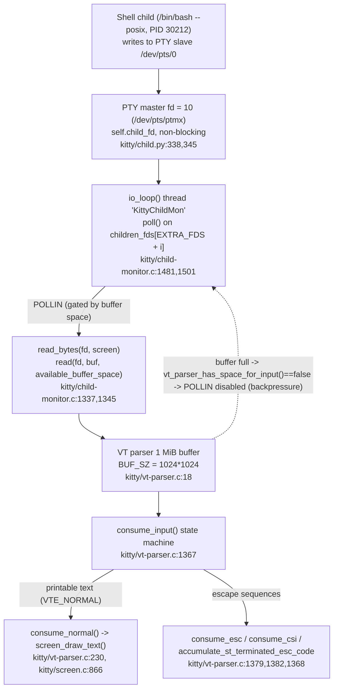

# How kitty spawns a shell and reads from it over a PTY

**Answer document for branch `kitty_815df1e210e0` (HEAD `815df1e210e0a9ab4622f5c7f2d6891d7dbeddf1`).**

This document answers six questions about how kitty's C code (with its supporting Python
layer) spawns a shell process and communicates with it over a pseudo‑terminal (PTY). Every
answer pairs an **exact source citation** (`file:line`) with **verbatim runtime output** that I
captured by building kitty from source and observing a live shell session with `ps`,
`/proc/<pid>/fd`, and `strace`. Values that are inherently process‑specific (the child PID, the
`/dev/pts/N` slave path, and the PTY‑master file‑descriptor number) are reported **exactly as
observed**, and I show the command that produced each so the method is reproducible. Where the
observed behaviour differs from a naive expectation (notably the per‑read byte count under a
high‑volume stream), I report what the system **actually did** rather than what it "would" do.

The six questions:

1. **Q1** – When kitty starts a shell: what process is spawned, its PID, the exact command line
   in the process list, and the PTY device path connecting them.
2. **Q2** – For `echo test123`: which `read` syscalls kitty makes on the PTY, the buffer size,
   and how many bytes come back.
3. **Q3** – For `yes hello` (continuous output): how the reading behaviour changes, the read
   frequency, and the typical bytes per read.
4. **Q4** – The file‑descriptor number kitty uses to read from the PTY master side.
5. **Q5** – The C function that reads from the PTY file descriptor.
6. **Q6** – The function that parses incoming data to separate printable text from escape
   sequences.

---

## Environment / How this was produced

All build and observation steps were run **inside the user‑provided Docker image**
(`ghcr.io/scaleapi/swe-atlas:swe_atlas_QnA_kovidgoyal_kitty_1.0`, i.e.
`andrewparkscaleai/coding-agent:kovidgoyal__kitty__815df1e210e0a9ab4622f5c7f2d6891d7dbeddf1`),
extended with `strace` and `xvfb` for syscall tracing and headless GUI launch. The kitty source
tree (this repository, at commit `815df1e210e0a9ab4622f5c7f2d6891d7dbeddf1`) is bind‑mounted
into the container.

**Build** (produces the runnable `kitty` binary). The build was run capturing its output to a log
(`python3 setup.py build > build.log 2>&1; echo "=== EXIT: $? ==="` reported `=== EXIT: 0 ===`).
A full rebuild compiles 122 C translation units and then links 5 targets. The captured log
begins (note that units 7 and 10 are the very files this document investigates,
`kitty/child-monitor.c` and `kitty/vt-parser.c`):

```
$ cd /work && export LANG=C.UTF-8 LC_ALL=C.UTF-8 TMPDIR=/testtmp GOTMPDIR=/testtmp
$ python3 setup.py build            # output captured to build.log
[1/122] Compiling kitty/screen.c ...
[2/122] Compiling kitty/unicode-data.c ...
[3/122] Compiling [wayland] glfw/wl_window.c ...
[4/122] Compiling [x11] glfw/x11_window.c ...
[5/122] Compiling kitty/glfw.c ...
[6/122] Compiling kitty/graphics.c ...
[7/122] Compiling kitty/child-monitor.c ...
```

Intermediate compile steps 8–121 are omitted from this excerpt; the log ends with the final
compile step, the five link steps, and `done`:

```
[122/122] Compiling kitty/gl-wrapper.c ...
 done
[1/5] Linking kitty/fast_data_types ...
[2/5] Linking [x11] kitty/glfw-x11 ...
[3/5] Linking [wayland] kitty/glfw-wayland ...
[4/5] Linking kittens/transfer/rsync ...
[5/5] Linking launcher ...
 done
```

The build exits 0; the launcher then runs and reports its version:

```
$ ./kitty/launcher/kitty --version
kitty 0.35.2 created by Kovid Goyal
```

**Launch** (kitty is a GPU terminal, so it runs headless under Xvfb with software OpenGL; remote
control is enabled so text can be sent to the window programmatically):

```
$ export LIBGL_ALWAYS_SOFTWARE=1 GALLIUM_DRIVER=llvmpipe LANG=C.UTF-8 LC_ALL=C.UTF-8
$ xvfb-run -a -s "-screen 0 1280x800x24" ./kitty/launcher/kitty \
      -o allow_remote_control=yes -o enable_audio_bell=no -o confirm_os_window_close=0 \
      --listen-on unix:/testtmp/obs/kitty.sock --title blitzyobs
```

**Observation tools.** Process facts came from `ps -o pid,ppid,args` and kitty's own
`kitty @ ls`; the PTY device path from `ps -o tty=` and `readlink /proc/<pid>/fd/0`; the PTY
master fd from `ls -l /proc/<kitty_pid>/fd`; and the `read` syscalls from
`strace -f -e trace=read -y` (adding `-T -tt` for per‑call durations and microsecond timestamps,
and `-c` for a call‑count summary). `-f` is required because the PTY read runs on a **dedicated
kitty thread**, not the main thread (see Q5). `-y` annotates each descriptor with its target, so
the PTY master appears as `read(10</dev/pts/ptmx>, …)`.

> The exact PIDs, the `/dev/pts/N` number, and the fd integer below are specific to this one
> launch. They were read directly from the live process; a different launch will show different
> numbers, but the *shape* of the answer (a bash child on a `/dev/pts` slave, read from a single
> low‑numbered master fd) is stable.

---

## PTY → screen data‑flow overview

kitty allocates the PTY in Python and hands the two ends to a small C `spawn()` routine that
`fork()`s the shell. The child gets the **slave** end wired to its stdin/stdout/stderr; kitty
keeps the **master** end (a single non‑blocking file descriptor, `self.child_fd`). A dedicated
C thread (`io_loop`, reported by the OS as the `KittyChildMon` thread) `poll()`s that master fd
and, on `POLLIN`, calls `read_bytes()` to `read()` bytes into a **1 MiB** buffer owned by the VT
parser. The parser's `consume_input()` state machine then classifies those bytes into printable
text (routed to `screen_draw_text`) versus escape sequences (CSI/OSC/DCS/APC/PM/SOS handlers).



The rest of this document walks each question with its citations and captured output.

---

## Q1 — The spawned process, its PID, the exact command line, and the PTY device path

**Answers (this launch):**

| Sub‑part | Value (observed) |
|---|---|
| (a) process spawned | `/bin/bash` (the user's login shell) |
| (b) PID | **30212** |
| (c) exact command line | **`/bin/bash --posix`** |
| (d) PTY device path | **`/dev/pts/0`** (kitty's master end is `/dev/pts/ptmx`) |

### How kitty gets there (source)

PTY allocation and the shell fork happen in Python in `kitty/child.py`. A PTY pair is created
with `os.openpty()` and the fork is delegated to the C `spawn()` primitive:

- `kitty/child.py:170‑171` — the `openpty()` helper: `master, slave = os.openpty()`
  (with the inline comment *"Note that master and slave are in blocking mode"*).
- `kitty/child.py:276` — `def fork(self)`; `kitty/child.py:281` — `master, slave = openpty()`.
- `kitty/child.py:333‑335` — `pid = fast_data_types.spawn(final_exe, cwd, tuple(argv), env,
  master, slave, …)`; then `kitty/child.py:336` `os.close(slave)`, `:337` `self.pid = pid`,
  `:338` `self.child_fd = master`.

The C side, in `kitty/child.c`, is what actually creates the process and wires up the terminal:

- `kitty/child.c:81` — `spawn(...)` entry point.
- `kitty/child.c:88` — `ttyname_r(slave, name, sizeof(name) - 1)` resolves the PTY **slave**
  path (this is what becomes `/dev/pts/0`).
- `kitty/child.c:97` — `pid_t pid = fork();`.
- `kitty/child.c:123` — `setsid()` (new session); `:129` — `ioctl(tfd, TIOCSCTTY, 0)`
  establishes the controlling terminal.
- `kitty/child.c:138‑145` — `safe_dup2(slave, …)` redirects the child's `STDOUT`/`STDERR`/`STDIN`
  onto the slave.
- `kitty/child.c:159` — `execvp(exe, argv)` replaces the child image with the shell.

**Why the command line is `/bin/bash --posix` (rationale).** The shell itself is resolved by
`resolved_shell()` (`kitty/utils.py:768`); for the default `shell` option value `.`
(`kitty/options/definition.py:2896`) it is the user's passwd shell — here `root`'s shell,
`/bin/bash`. The `--posix` flag and the absence of a login
`-bash` form are a consequence of **shell integration**: kitty injects its bash integration by
launching bash in POSIX mode and pointing bash's `$ENV` startup file at kitty's integration
script. The child's environment confirms this exactly (see command below). Note that
`kitty/child.py:314` shows the *alternative* form kitty uses in other configurations —
`argv = [kitten_exe(), 'run-shell', '--shell', shlex.join(argv), '--shell-integration', ksi]` —
which is **not** what happened here; the observed command line is a direct `bash` invocation.
This is why the exact command line is runtime/config dependent and must be read from the live
process rather than assumed.

### Runtime evidence

The live process tree — kitty (PID 30144) and its single child shell:

```
$ ps -o pid,ppid,args --ppid 30144
    PID    PPID COMMAND
  30212   30144 /bin/bash --posix
```

The exact argv, byte‑for‑byte (NUL separators shown as `|`), and kitty's own view of the window:

```
$ cat /proc/30212/cmdline | tr "\0" "|"; echo
/bin/bash|--posix|

$ ./kitty/launcher/kitty @ --to unix:/testtmp/obs/kitty.sock ls \
    | python3 -c "import json,sys; w=json.load(sys.stdin)[0]['tabs'][0]['windows'][0]; print('pid=', w['pid']); print('cmdline=', w['cmdline']); print('cwd=', w['cwd'])"
pid= 30212
cmdline= ['/bin/bash', '--posix']
cwd= /work
```

The PTY device path, confirmed three independent ways (the shell's controlling tty, and the
targets of the shell's stdin/stdout/stderr, which are the PTY **slave**):

```
$ ps -o tty= -p 30212
pts/0
$ readlink /proc/30212/fd/0     # shell stdin  = PTY slave
/dev/pts/0
$ readlink /proc/30212/fd/1     # shell stdout = PTY slave
/dev/pts/0
$ readlink /proc/30212/fd/2     # shell stderr = PTY slave
/dev/pts/0
```

The environment markers that explain the `--posix` command line:

```
$ tr "\0" "\n" < /proc/30212/environ | grep -E "KITTY_SHELL_INTEGRATION|^ENV=|KITTY_INSTALLATION_DIR"
KITTY_INSTALLATION_DIR=/work
KITTY_SHELL_INTEGRATION=enabled
ENV=/work/shell-integration/bash/kitty.bash
```

So: kitty spawned **`/bin/bash --posix`** (PID **30212**), connected to kitty through the PTY
whose **slave** is **`/dev/pts/0`**; kitty holds the corresponding **master** end (`/dev/pts/ptmx`,
fd 10 — see Q4).

---

## Q2 — `echo test123`: the read syscalls, the buffer size, and the byte count

**Answers:**

| Sub‑part | Value (observed) |
|---|---|
| (a) read syscall(s) on the PTY | `read(10</dev/pts/ptmx>, buf, count)` — the `read()` in `read_bytes()` |
| (b) buffer size (the `count` argument) | **1048576** bytes = **1 MiB** = `BUF_SZ` (first read), then `BUF_SZ − offset` |
| (c) bytes returned | **23** bytes for the echoed command line, then **47**, **114**, **185** for shell‑integration escapes (4 reads, 369 bytes total) |

### Source

- The `read()` happens in `read_bytes(int fd, Screen *screen)` at
  `kitty/child-monitor.c:1337`; the syscall itself is `len = read(fd, buf,
  available_buffer_space)` at `kitty/child-monitor.c:1345`.
- The buffer is owned by the VT parser and is **1 MiB**:
  `#define BUF_SZ (1024u*1024u)` at `kitty/vt-parser.c:18`.
- The `count` passed to `read()` is vended by `vt_parser_create_write_buffer()`
  (`kitty/vt-parser.c:1451`) as `*sz = BUF_SZ - self->write.offset`
  (`kitty/vt-parser.c:1457`) — i.e. the full 1 MiB minus whatever the parser has not yet
  drained.

### Runtime evidence

Attaching `strace` to kitty and typing `echo test123` <Enter> (sent via remote control as
`send-text $'echo test123\r'`), the reads on the PTY master fd 10 were:

```
$ strace -f -e trace=read -y -p 30144 -o echo.strace &
$ ./kitty/launcher/kitty @ --to unix:/testtmp/obs/kitty.sock send-text $'echo test123\r'
$ grep -E "read\(10<" echo.strace
30211 read(10</dev/pts/ptmx>, "echo test123\r\n\33[?2004l\r", 1048576) = 23
30211 read(10</dev/pts/ptmx>, "\33]2;echo test123\7\33]133;C;cmdline"..., 1048553) = 47
30211 read(10</dev/pts/ptmx>, "\1\33]133;k;start_kitty\7\2\1\33]133;k;e"..., 1048506) = 114
30211 read(10</dev/pts/ptmx>, "\33[?2004h\33]133;k;start_kitty\7\33]13"..., 1048392) = 185
```

**Reading the trace (rationale).**

- **(a) The syscall.** kitty reads the PTY with a plain `read(fd, buf, count)`; `-y` annotates
  the descriptor, so it appears as `read(10</dev/pts/ptmx>, …)`. This is exactly the `read()`
  call at `kitty/child-monitor.c:1345`, executed on thread `30211` (the `KittyChildMon` /
  `io_loop` thread — see Q5).
- **(b) The buffer size.** The third argument is the `count` — the space kitty offers. The very
  first read offers **`1048576`** bytes, which is exactly `BUF_SZ` = `1024*1024` = 1 MiB
  (`kitty/vt-parser.c:18`). The subsequent reads offer `1048553`, `1048506`, `1048392`: each is
  `BUF_SZ` minus the bytes the parser has accepted but not yet drained, matching
  `*sz = BUF_SZ - self->write.offset` at `kitty/vt-parser.c:1457`.
- **(c) The byte count.** `echo test123` is a *small* input, so the returns are small. The first
  read returns **23** bytes — the shell's echo of the typed line `echo test123\r\n` (14 bytes)
  plus the bracketed‑paste‑off sequence `\33[?2004l\r` (9 bytes). The next three reads (**47**,
  **114**, **185** bytes) are the shell‑integration escape sequences emitted around the command
  (OSC 2 window‑title `\33]2;echo test123\7`, and the OSC 133 semantic‑prompt markers
  `\33]133;…`), which also carry the command's own output. In total the command produced just
  **4** reads on the PTY master, **369 bytes** altogether — orders of magnitude below the 1 MiB
  buffer that was offered each time.

---


## Q3 — `yes hello`: how reading behaviour changes, read frequency, and bytes per read

**Answers (observed over a ~2 s sample):**

| Sub‑part | Value (observed) |
|---|---|
| (a) how behaviour changes | From **4 discrete reads** (Q2) to **tens of thousands of back‑to‑back reads**; the io_loop reads continuously as long as data streams, gated by parser buffer space |
| (b) read frequency | **30,216 reads in 2.034 s ≈ 14,856 reads/second**; mean gap **67.3 µs** between reads; each `read()` call takes **~7–12 µs** (`strace -c`: 11 µs/call) |
| (c) typical bytes per read | **median 530 bytes, mean 716 bytes** (min 2, max 8,666) — a few hundred bytes per read, **not** ~1 MiB, even though the buffer *offered* is up to 1 MiB |

### Source — why reads batch and what paces them

- Child I/O runs on a **dedicated thread**, `io_loop` (declared at
  `kitty/child-monitor.c:229`, defined at `kitty/child-monitor.c:1481`), separate from
  rendering. `poll()` watches every child PTY‑master fd plus **two** `EXTRA_FDS`
  (`#define EXTRA_FDS 2` at `kitty/child-monitor.c:35`) — the wakeup and signal pipes at slots 0
  and 1.
- **Backpressure gate.** A child fd's `POLLIN` interest is enabled **only when the parser
  reports space**:
  `children_fds[EXTRA_FDS + i].events = vt_parser_has_space_for_input(screen->vt_parser) ?
  POLLIN : 0` at `kitty/child-monitor.c:1501`, and the read is dispatched when `POLLIN` fires at
  `kitty/child-monitor.c:1531`. Space is computed by `vt_parser_has_space_for_input()`
  (`kitty/vt-parser.c:1476‑1485`) as `self->read.sz + self->write.pending < BUF_SZ`. If the 1 MiB
  buffer ever fills, `POLLIN` is cleared and reads pause until the parser drains.
- **`input_delay` throttle.** When wakeups are pending, the poll timeout is derived from
  `OPT(input_delay)` — `monotonic_t time_delta = OPT(input_delay) - (now -
  last_main_loop_wakeup_at)` at `kitty/child-monitor.c:1508`. The default is **3 ms**:
  `opt('input_delay', '3', …)` at `kitty/options/definition.py:878`, and
  `input_delay: int = 3` at `kitty/options/types.py:536`.

### Runtime evidence

`strace -f -e trace=read -y -T -tt` while running `yes hello`, then Ctrl‑C. A representative
window of *consecutive* reads on fd 10 (note the microsecond timestamps ~42–60 µs apart and the
`<duration>` of ~7–12 µs each):

```
$ strace -f -e trace=read -y -T -tt -p 30144 -o yes.strace &
$ ./kitty/launcher/kitty @ --to unix:/testtmp/obs/kitty.sock send-text $'yes hello\r'
   # ... stream for ~2 s, then send Ctrl-C (send-text $'\x03') ...
$ grep -E "read\(10<" yes.strace | sed -n '200,209p'
30211 06:05:45.964478 read(10</dev/pts/ptmx>, "\r\nhello\r\nhello\r\nhello\r\nhello\r\nhe"..., 963232) = 462 <0.000010>
30211 06:05:45.964527 read(10</dev/pts/ptmx>, "\r\nhello\r\nhello\r\nhello\r\nhello\r\nhe"..., 962770) = 401 <0.000010>
30211 06:05:45.964574 read(10</dev/pts/ptmx>, "hello\r\nhello\r\nhello\r\nhello\r\nhell"..., 1048175) = 404 <0.000011>
30211 06:05:45.964621 read(10</dev/pts/ptmx>, "\r\nhello\r\nhello\r\nhello\r\nhello\r\nhe"..., 1047771) = 324 <0.000008>
30211 06:05:45.964667 read(10</dev/pts/ptmx>, "hello\r\nhello\r\nhello\r\nhello\r\nhell"..., 1047447) = 392 <0.000008>
30211 06:05:45.964709 read(10</dev/pts/ptmx>, "hello\r\nhello\r\nhello\r\nhello\r\nhell"..., 1047055) = 355 <0.000007>
30211 06:05:45.964754 read(10</dev/pts/ptmx>, "\r\nhello\r\nhello\r\nhello\r\nhello\r\nhe"..., 1046700) = 317 <0.000012>
30211 06:05:45.964810 read(10</dev/pts/ptmx>, "hello\r\nhello\r\nhello\r\nhello\r\nhell"..., 1046383) = 642 <0.000010>
30211 06:05:45.964870 read(10</dev/pts/ptmx>, "\r\nhello\r\nhello\r\nhello\r\nhello\r\nhe"..., 1045741) = 618 <0.000007>
30211 06:05:45.964919 read(10</dev/pts/ptmx>, "hello\r\nhello\r\nhello\r\nhello\r\nhell"..., 1045123) = 383 <0.000012>
```

Aggregate per‑call cost (a separate `strace -c` run over the same kind of stream). Note this
`-c` summary counts `read()` on **all** of kitty's descriptors — the PTY master plus the
wakeup/signal/eventfd descriptors — so its `calls` total (and the `errors`, which are `EAGAIN`
on the non‑blocking descriptors) is larger than the PTY‑master‑only count reported below; the
figure used in the answer is the **11 µs/call** average:

```
$ strace -f -e trace=read -c -p 30144 -o yes_c.strace &   # run yes hello, Ctrl-C, detach
$ cat yes_c.strace
% time     seconds  usecs/call     calls    errors syscall
------ ----------- ----------- --------- --------- ----------------
100.00    0.354114          11     31094       234 read
------ ----------- ----------- --------- --------- ----------------
100.00    0.354114          11     31094       234 total
```

The summary statistics below were computed from `yes.strace` with the small script `stats.py`
shown here. It counts **every** `read()` on the PTY master fd — including reads that `strace -f`
split into `<unfinished ...>` / `<... read resumed>` fragments (paired by thread id) — and reports
the returned‑byte distribution, the `count` argument offered, and the read cadence derived from
the `-tt` timestamps:

```python
#!/usr/bin/env python3
# stats.py <strace_file> <master_fd> - read distribution + cadence for the PTY master fd.
import sys, re, statistics
path, fd = sys.argv[1], sys.argv[2]
def secs(h, m, s): return int(h)*3600 + int(m)*60 + float(s)
complete = re.compile(r'^\s*(\d+)\s+(\d\d):(\d\d):(\d\d\.\d+)\s+read\(' + re.escape(fd) +
                      r'</dev/pts/ptmx>,\s*.*,\s*(\d+)\)\s*=\s*(-?\d+)(.*)$')
unfin = re.compile(r'^\s*(\d+)\s+(\d\d):(\d\d):(\d\d\.\d+)\s+read\((\d+)<[^>]*>,\s*<unfinished')
resumed = re.compile(r'^\s*(\d+)\s+(\d\d):(\d\d):(\d\d\.\d+)\s+<\.\.\. read resumed>.*,\s*(\d+)\)\s*=\s*(-?\d+)(.*)$')
eagain = 0; rets = []; counts = []; times = []; pending = {}
def record(ret, count, t, tail):
    global eagain
    if ret < 0:
        if 'EAGAIN' in tail: eagain += 1
        return
    rets.append(ret); counts.append(count); times.append(t)
for line in open(path, errors='replace'):
    m = complete.match(line)
    if m:
        record(int(m.group(6)), int(m.group(5)), secs(m.group(2), m.group(3), m.group(4)), m.group(7)); continue
    m = unfin.match(line)
    if m:
        pending[m.group(1)] = (m.group(5) == fd, secs(m.group(2), m.group(3), m.group(4))); continue
    m = resumed.match(line)
    if m:
        info = pending.pop(m.group(1), None)
        if info and info[0]:
            record(int(m.group(6)), int(m.group(5)), info[1], m.group(7))
N = len(rets); span = max(times) - min(times)
print('returned bytes/read : N=%d min=%d max=%d mean=%d median=%d   (EAGAIN on fd %s = %d)' %
      (N, min(rets), max(rets), round(sum(rets)/N), round(statistics.median(rets)), fd, eagain))
print('count arg (offered) : min=%d max=%d mean=%d' % (min(counts), max(counts), round(sum(counts)/len(counts))))
print('cadence             : span_s=%.3f nreads=%d reads_per_s=%d mean_gap_us=%.1f' %
      (span, N, round(N/span), (span/(N-1))*1e6))
```

Running it on the `-T -tt` capture (master fd `10`) produced, verbatim:

```
$ python3 stats.py yes.strace 10
returned bytes/read : N=30216 min=2 max=8666 mean=716 median=530   (EAGAIN on fd 10 = 0)
count arg (offered) : min=192952 max=1048576 mean=984961
cadence             : span_s=2.034 nreads=30216 reads_per_s=14856 mean_gap_us=67.3
```

The `N=30216` reads the script accounts for equal the total number of `read(10<…>` lines in
`yes.strace` — all 30,216 were single‑line completions (no `<unfinished>`/`<... read resumed>` splits occurred on the master fd in this capture) — so
every read on the master fd is included.

**Rationale — how this differs from Q2, and why.**

- **Behaviour change.** Under `yes hello` the io_loop stops waiting on human input and instead
  drains the PTY continuously: **30,216** reads versus **4** for `echo test123`. Reads are issued
  back‑to‑back (`06:05:45.964478`, `.964527`, `.964574`, … — ~42–60 µs apart) for as long as the
  stream runs.
- **Frequency.** ~**14,856 reads/second** in this sample, each call costing ~**11 µs** on average
  (`strace -c`). The 3 ms `input_delay` is the *"Delay before input from the program running in
  the terminal is processed"* (`kitty/options/definition.py:878`, default `3` there and
  `input_delay: int = 3` at `kitty/options/types.py:536`); it sets the `poll()` timeout at
  `kitty/child-monitor.c:1508` to coalesce newly‑read input before the render path is woken — it
  is **not** a cap on how often the io_loop `read()`s. The io_loop keeps reading whenever `poll()`
  reports `POLLIN` and the parser has space; fittingly, the option is documented as *"ignored when
  the input buffer is almost full"* — exactly the high‑volume case measured here.
- **Bytes per read.** The typical read returns only **~530 bytes (median)** — dozens of
  `hello\r\n` lines — even though the `count` offered climbs back toward **1,048,576** (`BUF_SZ`).
  The reason: kitty drains the PTY *faster than `yes` can fill it*, so each `read()` returns only
  what accumulated in the kernel PTY buffer since the previous read (a few hundred bytes), not the
  full megabyte on offer. This is the honest, measured result — the buffer **offered** approaches
  1 MiB, but the bytes **returned** are a few hundred per read.
- **Backpressure, observed.** The `count` argument is not constant: it falls (e.g.
  `1048175 → 1047771 → 1047447 → …`) as the parser accumulates undrained bytes
  (`BUF_SZ - write.offset`) and recovers toward `1048576` when the parser catches up. Over the
  sample it ranged from **192,952** (parser ~836 KB behind) up to **1,048,576**. Because the parser
  kept up, free space never hit zero, so `POLLIN` was never actually disabled in this run — the
  gate at `kitty/child-monitor.c:1501` exists and is exercised (the shrinking `count` is its
  accounting in action), but full backpressure would only stall reads if the parser fell a full
  1 MiB behind.

---

## Q4 — The file‑descriptor number kitty uses to read from the PTY master

**Answer:** kitty reads the PTY master through **file descriptor 10** in this launch (kitty
PID 30144). It is a process‑specific integer, obtained two ways below.

### Source

- The master end is stored as `self.child_fd = master` at `kitty/child.py:338`, and set
  non‑blocking by `os.set_blocking(self.child_fd, False)` at `kitty/child.py:345`.
- That fd is registered into the poll set at
  `children_fds[EXTRA_FDS + self->count].fd = children[self->count].fd`
  (`kitty/child-monitor.c:1286`), and read via `read_bytes()` at
  `kitty/child-monitor.c:1531`.

### Runtime evidence

The descriptor in kitty's fd table whose target is the PTY master (`/dev/pts/ptmx`):

```
$ ls -l /proc/30144/fd | grep -E "ptmx|pts"
lrwx------ 1 root root 64 Jul  1 06:05 10 -> /dev/pts/ptmx
```

Corroborated by the `-y` annotation on every PTY read in the strace captures for Q2 and Q3:

```
30211 read(10</dev/pts/ptmx>, ... , 1048576) = 23
```

Both agree: the master fd is **10**. For completeness, kitty's other descriptors in this launch
were `0 -> /dev/null`, `1`/`2 -> ` the launch log, `3`/`6 ->` unix sockets, `4`/`7`/`9 ->`
`eventfd`, `5 ->` a `memfd`, and `8 ->` a `signalfd`; fd **10** is the only PTY master. The
integer is not fixed by kitty — it is simply the descriptor `os.openpty()` returned for this
process — which is why it must be read from the live process rather than assumed.

---


## Q5 — The C function that reads from the PTY file descriptor

**Answer:** **`read_bytes()`** in `kitty/child-monitor.c` (defined at
`kitty/child-monitor.c:1337`), which performs the `read()` syscall at
`kitty/child-monitor.c:1345`.

### Source (with its error handling, verbatim)

```c
static bool
read_bytes(int fd, Screen *screen) {
    ssize_t len;
    size_t available_buffer_space;

    uint8_t *buf = vt_parser_create_write_buffer(screen->vt_parser, &available_buffer_space);
    if (!available_buffer_space) return true;

    while(true) {
        len = read(fd, buf, available_buffer_space);
        if (len < 0) {
            if (errno == EINTR || errno == EAGAIN) continue;
            if (errno != EIO) perror("Call to read() from child fd failed");
            vt_parser_commit_write(screen->vt_parser, 0);
            return false;
        }
        break;
    }
    vt_parser_commit_write(screen->vt_parser, len);
    return len != 0;
}
```

- `kitty/child-monitor.c:1341` — it first asks the VT parser for a write buffer and its size via
  `vt_parser_create_write_buffer(screen->vt_parser, &available_buffer_space)`.
- `kitty/child-monitor.c:1345` — the actual `read(fd, buf, available_buffer_space)`.
- `kitty/child-monitor.c:1347` — on `EINTR`/`EAGAIN` it `continue`s (retries the loop).
- `kitty/child-monitor.c:1348` — on other errors it reports via
  `perror("Call to read() from child fd failed")`, **except** `EIO`, which is treated as a normal
  child exit and silently swallowed (`if (errno != EIO) perror(...)`).
- `kitty/child-monitor.c:1354` — on success it publishes the bytes with
  `vt_parser_commit_write(screen->vt_parser, len)`.
- `kitty/child-monitor.c:1355` — `return len != 0`: a zero‑length read signals EOF / child death
  (the caller then reaps the child).

### Runtime tie‑in and rationale

The `read(10</dev/pts/ptmx>, buf, count)` lines quoted for Q2 and Q3 **are** this function's
`read()` at line 1345 — the `count` argument is the `available_buffer_space` handed back by
`vt_parser_create_write_buffer()` (i.e. `BUF_SZ - write.offset`), which is why it starts at
`1048576` and shrinks as the parser lags. The reads were all attributed by `strace` to thread
**30211**, whose OS thread name is **`KittyChildMon`** — the `io_loop()` child‑monitor thread —
confirming that `read_bytes()` runs on kitty's dedicated child‑I/O thread rather than the main or
render threads:

```
$ cat /proc/30144/task/30211/comm
KittyChildMon
$ for t in $(ls /proc/30144/task); do c=$(cat /proc/30144/task/$t/comm); \
    case "$c" in llvmpipe*|kitty) ;; *) echo "TID $t = $c";; esac; done
TID 30209 = kitty:disk$0
TID 30210 = KittyPeerMon
TID 30211 = KittyChildMon
```

(The 32 `llvmpipe-*` threads are the software‑OpenGL rasteriser used under Xvfb; they are
unrelated to PTY reading.)

---

## Q6 — The function that separates printable text from escape sequences

**Answer:** **`consume_input()`** in `kitty/vt-parser.c` (`kitty/vt-parser.c:1367`) — the VT
parser's state machine. It dispatches on `self->vte_state`, sending printable text one way and
escape sequences another.

### Source

```c
static void
consume_input(PS *self, PyObject *dump_callback UNUSED, id_type window_id UNUSED) {
#define consume(x) if (accumulate_st_terminated_esc_code(self, dispatch_##x)) { ... } break;
    ...
    switch (self->vte_state) {
        case VTE_NORMAL:
            consume_normal(self); self->read.consumed = self->read.pos; break;
        case VTE_ESC:
            if (consume_esc(self)) { self->read.consumed = self->read.pos; }
            break;
        case VTE_CSI:
            if (consume_csi(self)) { ... dispatch_csi(self); SET_STATE(NORMAL); }
            break;
        case VTE_OSC:
            consume(osc);
        ...
```

- `kitty/vt-parser.c:1367` — `consume_input()` entry; the `switch (self->vte_state)` routes each
  byte class.
- **Printable text** → `VTE_NORMAL` → `consume_normal(self)` (dispatched at
  `kitty/vt-parser.c:1377`; the function is defined at `kitty/vt-parser.c:230`). `consume_normal`
  ultimately inserts glyphs by calling `screen_draw_text()` at `kitty/screen.c:866`.
- **Escape sequences**:
  - `VTE_ESC` → `consume_esc()` (`kitty/vt-parser.c:1379`);
  - `VTE_CSI` → `consume_csi()` then `dispatch_csi()` (`kitty/vt-parser.c:1382`);
  - `VTE_OSC`/`VTE_APC`/`VTE_PM`/`VTE_DCS`/`VTE_SOS` → `accumulate_st_terminated_esc_code()` via
    the `consume(x)` macro defined at `kitty/vt-parser.c:1368`.
- The parser exposes a small **thread‑safe** API (used by `read_bytes()` on the io_loop thread)
  declared in `kitty/vt-parser.h`: the comment *"The following are thread safe, using an internal
  lock"* at `kitty/vt-parser.h:33`, then `vt_parser_create_write_buffer` (`:34`),
  `vt_parser_commit_write` (`:35`), `vt_parser_has_space_for_input` (`:36`) and `parse_worker`
  (`:37`).

### Runtime tie‑in and rationale

The split is visible directly in the captured byte streams. Printable text arrives as literal
runs such as `"hello\r\nhello\r\n…"` (Q3) — these are handled by `consume_normal` and drawn via
`screen_draw_text`. Interleaved control data arrives as escape sequences such as the OSC 133
semantic‑prompt markers `\33]133;…\7` and the OSC 2 title `\33]2;echo test123\7` seen in the Q2
trace — these begin with ESC (`\33`, i.e. `0x1b`) and are routed to the `consume_esc` /
`consume_csi` / `accumulate_st_terminated_esc_code` branches instead of being printed. Thus
`consume_input()` is the single function that classifies each incoming byte as *text to draw* vs
*escape sequence to act on*.

---

## Coverage checklist

Every sub‑part of the six questions, with the value and where it is substantiated:

- [x] **Q1(a) process spawned** — `/bin/bash` (`ps`/`kitty @ ls`; source `kitty/child.c:159`
  `execvp`).
- [x] **Q1(b) PID** — **30212** (`ps -o pid,ppid,args --ppid 30144`).
- [x] **Q1(c) exact command line** — **`/bin/bash --posix`** (`/proc/30212/cmdline`;
  `kitty @ ls`; rationale from `KITTY_SHELL_INTEGRATION`/`ENV` and `kitty/child.py:314`).
- [x] **Q1(d) PTY device path** — **`/dev/pts/0`** (`ps -o tty=`, `readlink /proc/30212/fd/{0,1,2}`;
  source `kitty/child.c:88` `ttyname_r`).
- [x] **Q2 read syscall(s)** — `read(10</dev/pts/ptmx>, buf, count)` (strace; source
  `kitty/child-monitor.c:1345`).
- [x] **Q2 buffer size** — **1048576 bytes = 1 MiB = `BUF_SZ`** (strace `count`; source
  `kitty/vt-parser.c:18`, `:1457`).
- [x] **Q2 byte count** — **23** bytes (echo), then **47/114/185** (4 reads, 369 bytes total)
  (strace).
- [x] **Q3 behaviour change** — from 4 discrete reads to **30,216** continuous reads; io_loop
  drains as fast as data arrives, gated by parser space (`kitty/child-monitor.c:1501`).
- [x] **Q3 frequency** — **≈14,856 reads/s**, mean gap **67.3 µs**, **~11 µs/call**
  (strace `-T -tt` and `-c`).
- [x] **Q3 bytes/read** — **median 530, mean 716** bytes (min 2, max 8,666); `count` offered up
  to **1,048,576** (computed over the strace capture).
- [x] **Q4 fd number** — **10** → `/dev/pts/ptmx` (`ls -l /proc/30144/fd`; strace `-y`; source
  `kitty/child.py:338`, `kitty/child-monitor.c:1286`).
- [x] **Q5 C read function** — **`read_bytes()`** (`kitty/child-monitor.c:1337`, `read()` at
  `:1345`), running on the `KittyChildMon` io_loop thread.
- [x] **Q6 parser function** — **`consume_input()`** (`kitty/vt-parser.c:1367`); text →
  `consume_normal`/`screen_draw_text`, escapes → `consume_esc`/`consume_csi`/
  `accumulate_st_terminated_esc_code`.

### Notes on verifiability

- The PID (30212), the `/dev/pts/0` slave number, and the master fd (10) are **specific to this
  launch** and were read from the live process; they will differ on another run. The commands
  that produced them are shown so they can be reproduced.
- Under `yes hello`, the bytes **returned** per read are a few hundred (median 530), while the
  buffer **offered** (`count`) approaches 1 MiB — reported from measurement, not assumption. Full
  `POLLIN` backpressure (reads pausing) was **not** triggered in this sample because the parser
  kept up; the shrinking `count` argument is the same gate's accounting in action.
- All static claims cite `file:line` at commit `815df1e210e0a9ab4622f5c7f2d6891d7dbeddf1`; all
  runtime claims are quoted verbatim from `ps`, `/proc`, and `strace` output captured as shown.

