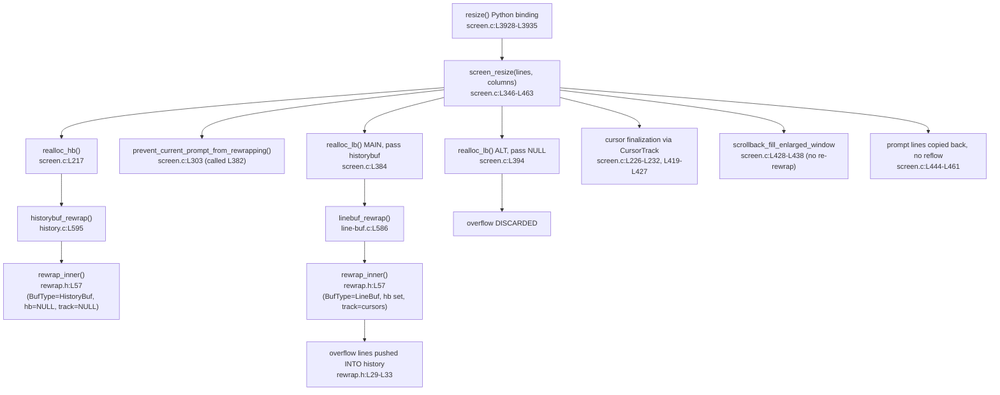
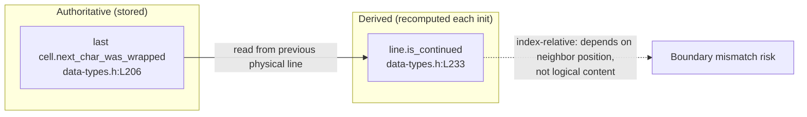

# kitty Terminal Reflow (Rewrap) on Resize — Code-Grounded Analysis

> **Analyzed branch / commit:** `kitty_815df1e210e0` @ `815df1e210e0a9ab4622f5c7f2d6891d7dbeddf1`
>
> **Nature of this document:** This is a **read-only code-comprehension** analysis. It explains *how* kitty implements terminal reflow (rewrap) when a window is resized; it does **not** propose or make any changes to kitty. Every behavioral claim is grounded in the source at the commit above and carries an inline citation of the form `` `kitty/<file>:Lnnn` ``. Where a claim is empirical, it is backed by kitty's own test suite (Section 8), which was executed for this analysis.

This document answers four questions plus one observation:

1. **Trace the rewrap implementation in C** — from the resize entry point down to the shared copy engine.
2. **How are line-continuation state and cursor positions preserved** across a resize?
3. **How do the visible screen buffer and the scrollback history interact** during a resize?
4. **What are the potential issues** in how continuation state propagates between those two buffers?
5. **Observation addressed:** reflow does not always preserve **logical line boundaries** correctly — this document maps that symptom to specific code locations and explains *why* it happens.

---

## TL;DR / Executive summary

- **One engine, two buffers.** A single header-only, macro-parameterized template — `kitty/rewrap.h` — contains the entire rewrap algorithm (`rewrap_inner`, `kitty/rewrap.h:L57`). It has **no `.c` counterpart**; it is `#include`d exactly twice: once by the visible-screen buffer (`kitty/line-buf.c:L583`) and once by the scrollback buffer (`kitty/history.c:L592`). The two buffers are just two macro specializations of the same code.
- **Wrap state is authoritatively per-cell.** The single source of truth for "this line soft-wrapped into the next" is the `next_char_was_wrapped` bit on the **last cell** of a line (`kitty/data-types.h:L206`). It is deliberately excluded from `SGR_MASK` (`kitty/data-types.h:L214`) so that resetting colors/styles never erases it.
- **The per-line flag is *derived*, not stored.** The line-level `is_continued` attribute (`kitty/data-types.h:L233`) is **recomputed on every line initialization** from the *previous physical line's* last-cell flag — `kitty/line-buf.c:L145` for the screen and `kitty/history.c:L168` for history. It is **index-relative**, so the first line of any buffer always derives `is_continued == false`.
- **History and screen are rewrapped as two *independent* sequences.** History is rewrapped first, entirely on its own, with **no overflow sink and no cursor tracking** (`rewrap_inner(self, other, self->count, NULL, NULL, ...)`, `kitty/history.c:L611`). The screen is rewrapped *afterward*, in a separate pass, with the live history as an overflow sink and with cursor trackers (`kitty/line-buf.c:L617`, invoked from `kitty/screen.c:L384`).
- **Overflow spills from screen into scrollback.** When the screen rewrap fills the destination grid, completed top lines are pushed into history via the `next_dest_line` macro's history path (`kitty/rewrap.h:L29-L33`, `historybuf_add_line` at `kitty/rewrap.h:L32`).
- **The alternate screen discards overflow.** The alt buffer is rewrapped with a `NULL` history sink (`kitty/screen.c:L394`), so its overflow is dropped — correct for full-screen apps whose content is transient.
- **Some paths skip rewrap entirely.** The enlarged-window scrollback fill copies history rows back onto the screen *without* re-running rewrap on the rejoined content (`kitty/screen.c:L428-L438`), and the current prompt is copied back verbatim, also without reflow (`kitty/screen.c:L444-L461`).
- **Trailing blanks are trimmed on hard-broken lines.** A line that does *not* soft-wrap has its trailing blank cells trimmed (`kitty/rewrap.h:L70`); legitimate trailing spaces on a hard-broken line are therefore dropped.
- **Net effect on the user's observation.** Because the two buffers reflow their fragments independently, and because two paths skip reflow, a single logical line that straddles the history↔screen boundary (or that is restored from history/prompt copy-back) is **not guaranteed to be rejoined and reflowed as one stream** — which is exactly why logical line boundaries are not always preserved.

---

## Table of contents

- [1. Resize entry point and orchestration trace](#1-resize-entry-point-and-orchestration-trace)
- [2. The shared rewrap engine (`kitty/rewrap.h`)](#2-the-shared-rewrap-engine-kittyrewraph)
- [3. Per-buffer macro specialization (`LineBuf` vs `HistoryBuf`)](#3-per-buffer-macro-specialization-linebuf-vs-historybuf)
- [4. The dual continuation model (the heart of the answer)](#4-the-dual-continuation-model-the-heart-of-the-answer)
- [5. Screen ↔ history coordination during resize](#5-screen--history-coordination-during-resize)
- [6. Cursor and prompt preservation](#6-cursor-and-prompt-preservation)
- [7. Inventory of potential continuation-propagation issues](#7-inventory-of-potential-continuation-propagation-issues)
- [8. Empirical confirmation (the test oracle)](#8-empirical-confirmation-the-test-oracle)

---

## Framing: soft wraps vs hard wraps

Terminal emulators distinguish two kinds of line endings. A **soft wrap** occurs when one logical line is too long for the current width and is automatically broken to fit; on resize it should be *reflowed* to the new width because the break was never intentional. A **hard wrap** is an intentional line break (the program emitted a newline); it must be *preserved* across a resize. kitty encodes this distinction at the cell level: the per-cell `next_char_was_wrapped` flag (`kitty/data-types.h:L206`) on the last cell of a line marks a **soft wrap**, while a line whose last cell lacks that flag is a **hard break**. The engine treats the two differently — most visibly, a hard-broken line has its trailing blanks trimmed (`kitty/rewrap.h:L70`), whereas a soft-wrapped line is concatenated with its continuation and re-flowed as one stream. The remainder of this document is grounded entirely in kitty's own source; the soft/hard framing is only background.

---

## 1. Resize entry point and orchestration trace

This section answers **Question 1** at the orchestration level: where does a resize begin, and in what order are the buffers rewrapped? (The algorithm itself is dissected in Sections 2–4.) All citations are to `kitty/screen.c`.

### 1.1 The entry point: the `resize()` Python binding

The C terminal core is driven from Python. The resize entry point is a thin binding that parses up to two unsigned integers (lines, columns) and forwards to the orchestrator:

```c
static PyObject*
resize(Screen *self, PyObject *args) {
    unsigned int a=1, b=1;
    if(!PyArg_ParseTuple(args, "|II", &a, &b)) return NULL;
    screen_resize(self, a, b);
    if (PyErr_Occurred()) return NULL;
    Py_RETURN_NONE;
}
```

This is `kitty/screen.c:L3928-L3935`; the function is registered as a method on the `Screen` type via `MND(resize, METH_VARARGS)` at `kitty/screen.c:L4842`. The real work happens in `screen_resize()`.

### 1.2 The orchestrator: `screen_resize()`

`screen_resize(Screen*, unsigned int lines, unsigned int columns)` is defined at `kitty/screen.c:L346` (body `kitty/screen.c:L345-L463`). It first clamps both dimensions to at least 1 (`lines = MAX(1u, lines); columns = MAX(1u, columns);`, `kitty/screen.c:L348`) and records whether the *main* screen is active (`bool is_main = self->linebuf == self->main_linebuf;`, `kitty/screen.c:L350`).

### 1.3 The buffer realloc helpers

Two helpers wrap the actual rewrap calls:

- **`realloc_hb()`** (`kitty/screen.c:L217`, body `kitty/screen.c:L216-L223`) allocates a new `HistoryBuf`, transfers ownership of the pager history (`ans->pagerhist = old->pagerhist; old->pagerhist = NULL;`, `kitty/screen.c:L220`), then rewraps the old history into the new one via `historybuf_rewrap(old, ans, as_ansi_buf)` (`kitty/screen.c:L221`).
- **`realloc_lb()`** (`kitty/screen.c:L235`, body `kitty/screen.c:L234-L242`) allocates a new `LineBuf`, seeds temporary cursor coordinates from the *before* coordinates (`a->temp.x = a->before.x; a->temp.y = a->before.y;`, `kitty/screen.c:L238-L239`), then calls `linebuf_rewrap(old, ans, nclb, ncla, hb, &a->temp.x, &a->temp.y, &b->temp.x, &b->temp.y, as_ansi_buf)` (`kitty/screen.c:L240`). The `hb` argument is the overflow sink — and crucially, the caller decides whether it is the live history or `NULL`.

### 1.4 The precise order inside `screen_resize` (the crux of Question 3)

The ordering of operations inside `screen_resize` is what makes the screen/history interaction work the way it does:

1. **Optional dummy-char insertion.** If the cursor sits at column 0 on a blank `OUTPUT_START` line, a dummy `'<'` char is inserted so reflow does not discard that line (`kitty/screen.c:L353-L361`, insertion at `kitty/screen.c:L358`). It is removed again near the end (`kitty/screen.c:L439-L442`).
2. **Cursor tracking seeded.** Three `CursorTrack` records are initialized from the *before* positions — the live cursor, the main saved cursor, and the alt saved cursor (`kitty/screen.c:L363-L365`).
3. **History rewrapped FIRST.** `realloc_hb(...)` rewraps the scrollback into a buffer of the new width (`kitty/screen.c:L375`); the old history is then replaced (`Py_CLEAR(self->historybuf); self->historybuf = nh;`, `kitty/screen.c:L377`).
4. **Prompt preservation.** When on the main screen, a `prompt_copy` buffer is allocated (`kitty/screen.c:L381`) and `prevent_current_prompt_from_rewrapping(...)` is called (`kitty/screen.c:L382`) to lift the current prompt out of the reflow (detailed in Section 6).
5. **MAIN `LineBuf` rewrapped, passing the LIVE `HistoryBuf`.** `realloc_lb(self->main_linebuf, ..., self->historybuf, &cursor, &main_saved_cursor, ...)` (`kitty/screen.c:L384`). Because the live history is passed as the overflow sink, lines that overflow off the top of the rewrapped screen are pushed into scrollback.
6. **ALT `LineBuf` rewrapped, passing `NULL` history.** `realloc_lb(self->alt_linebuf, ..., NULL, &cursor, &alt_saved_cursor, ...)` (`kitty/screen.c:L394`). With a `NULL` sink, alt-screen overflow is discarded.
7. **Cursor finalization.** The `setup_cursor` macro captures post-rewrap coordinates (`kitty/screen.c:L366-L370`); the `S(c, w)` macro clamps each cursor to the new bounds (`kitty/screen.c:L419-L423`); and the `is_beyond_content` case snaps the cursor down to the content tail (`kitty/screen.c:L424-L427`).
8. **Enlarged-window scrollback fill.** If the window grew and the option is enabled, lines are popped back from history onto the screen (`kitty/screen.c:L428-L438`) — *without* re-running rewrap (see Section 6/7).
9. **Prompt copy-back without reflow.** The saved prompt lines are copied back verbatim (`kitty/screen.c:L444-L461`, copy at `kitty/screen.c:L459`).

### 1.5 End-to-end data flow



### 1.6 Rationale

**Why is history rewrapped before the screen?** Because the screen rewrap can *push overflow into* history (step 5). For the overflow to land in a correctly-shaped scrollback, the history must already have been re-shaped to the new width. Rewrapping history first (`kitty/screen.c:L375`) guarantees that by the time `realloc_lb` runs with the live `self->historybuf` (`kitty/screen.c:L384`), the sink is the right width.

**Why the main-vs-alt distinction?** The alternate screen is used by full-screen applications (editors, pagers, TUIs) that own the entire viewport and redraw themselves. Their content is transient and is *not* part of the user's scrollback, so discarding overflow by passing a `NULL` sink (`kitty/screen.c:L394`) is the correct behavior; pushing alt-screen rows into the user's scrollback would corrupt history. The main screen, by contrast, represents the shell session whose output *should* accumulate in scrollback, hence the live-history sink at `kitty/screen.c:L384`.


---

## 2. The shared rewrap engine (`kitty/rewrap.h`)

This section dissects the single algorithm that performs *all* reflow, answering the core of **Question 1**.

### 2.1 A header-only, macro-parameterized template — no `.c` file

The central architectural fact is that `kitty/rewrap.h` is a **header-only template with no `.c` counterpart**. The entire algorithm is a single function, `rewrap_inner`, parameterized by a handful of preprocessor macros. It is `#include`d exactly twice:

- by the visible-screen buffer at `kitty/line-buf.c:L583` (using the default macros), and
- by the scrollback buffer at `kitty/history.c:L592` (after redefining the macros, `kitty/history.c:L582-L590`).

A single body of code therefore drives **both** the visible-screen rewrap and the scrollback rewrap; the per-buffer differences are injected purely through macros (Section 3).

### 2.2 The function signature

```c
static void
rewrap_inner(BufType *src, BufType *dest, const index_type src_limit, HistoryBuf UNUSED *historybuf, TrackCursor *track, ANSIBuf *as_ansi_buf) {
```

This is `kitty/rewrap.h:L57` (definition spans `kitty/rewrap.h:L56-L96`). Note the two parameters that the two call sites set differently: `historybuf` (the overflow sink) and `track` (the cursor tracker). Passing both as `NULL` produces a self-contained rewrap with no overflow and no cursor remapping — which is exactly what the history rewrap does (Section 5).

### 2.3 Cells are copied as CPU + GPU pairs

```c
static inline void
copy_range(Line *src, index_type src_at, Line* dest, index_type dest_at, index_type num) {
    memcpy(dest->cpu_cells + dest_at, src->cpu_cells + src_at, num * sizeof(CPUCell));
    memcpy(dest->gpu_cells + dest_at, src->gpu_cells + src_at, num * sizeof(GPUCell));
}
```

`copy_range` (`kitty/rewrap.h:L44-L48`) copies the **CPU cells** (character data, `kitty/rewrap.h:L46`) and the **GPU cells** (attributes, `kitty/rewrap.h:L47`) together. This matters because the wrap flag `next_char_was_wrapped` lives inside the GPU cell's `attrs` (`kitty/data-types.h:L206`, `kitty/data-types.h:L219`). Copying CPU+GPU in lockstep is *why* wrap state survives the copy at cell granularity.

### 2.4 The cursor tracker and the continuation predicate

The tracker type is small:

```c
typedef struct TrackCursor {
    index_type x, y;
    bool is_tracked_line, is_sentinel;
} TrackCursor;
```

(`kitty/rewrap.h:L50-L53`.) The continuation predicate, in its default (`LineBuf`) form, reads the wrap flag from the **last cell** of the current source line:

```c
#define is_src_line_continued() (src->line->gpu_cells[src->xnum-1].attrs.next_char_was_wrapped)
```

(`kitty/rewrap.h:L41`.) A source line is "continued" (soft-wrapped into the next) **iff** its last cell's `next_char_was_wrapped` bit is set. This is the engine's only notion of continuation — there is no separate per-line truth (Section 4).

### 2.5 Walking the algorithm body

The engine is a single outer `do { … } while (src_y < src_limit)` loop over source rows (`kitty/rewrap.h:L63-L94`):

```c
do {
    for (TrackCursor *t = track; !t->is_sentinel; t++) t->is_tracked_line = src_y == t->y;
    init_src_line(src_y);
    const bool src_line_is_continued = is_src_line_continued();
    src_x_limit = src->xnum;
    if (!src_line_is_continued) {
        // Trim trailing blanks since there is a hard line break at the end of this line
        while(src_x_limit && (src->line->cpu_cells[src_x_limit - 1].ch) == BLANK_CHAR) src_x_limit--;
    } else {
        src->line->gpu_cells[src->xnum-1].attrs.next_char_was_wrapped = false;
    }
    ...
    while (src_x < src_x_limit) {
        if (dest_x >= dest->xnum) { next_dest_line(true); dest_x = 0; }
        num = MIN(src->line->xnum - src_x, dest->xnum - dest_x);
        copy_range(src->line, src_x, dest->line, dest_x, num);
        ...
        src_x += num; dest_x += num;
    }
    src_y++; src_x = 0;
    if (!src_line_is_continued && src_y < src_limit) { init_src_line(src_y); next_dest_line(false); dest_x = 0; }
} while (src_y < src_limit);
dest->line->ynum = dest_y;
```

Step by step:

- **Mark the tracked line(s).** For each tracker, set `is_tracked_line = (src_y == t->y)` (`kitty/rewrap.h:L64`).
- **Load the source line** via the `init_src_line` macro (`kitty/rewrap.h:L65`) and **read its continuation flag** (`kitty/rewrap.h:L66`). `src_x_limit` starts at the full line width (`kitty/rewrap.h:L67`).
- **Hard break → trim trailing blanks.** If the line is *not* continued, trailing `BLANK_CHAR` cells are trimmed off the right edge (`kitty/rewrap.h:L68-L70`). This is the engine's handling of a hard line break: the blank padding to the old right margin is not meaningful, so it is dropped.
- **Soft wrap → clear the trailing wrap flag.** If the line *is* continued, the engine clears `next_char_was_wrapped` on the last source cell before copying (`kitty/rewrap.h:L71-L73`, clear at `kitty/rewrap.h:L72`). The flag has served its purpose (telling the engine to concatenate) and must not leak into the middle of the destination stream; the destination's own wrap markers will be reconstructed by `next_dest_line`.
- **Short-line cursor clamp.** Any tracked cursor whose `x` lies beyond the (possibly trimmed) `src_x_limit` is clamped back (`kitty/rewrap.h:L74-L76`).
- **First destination line** is initialized once (`kitty/rewrap.h:L77-L79`).
- **Inner copy loop** (`kitty/rewrap.h:L80-L91`): whenever `dest_x` reaches `dest->xnum`, a new destination line is begun via `next_dest_line(true)` — i.e. marked as a **soft continuation** (`kitty/rewrap.h:L81`); a maximal run is copied with `copy_range` (`kitty/rewrap.h:L83`); any tracked cursor falling inside the copied run is remapped to its new `(dest_x, dest_y)` (`kitty/rewrap.h:L84-L89`); and the offsets advance (`kitty/rewrap.h:L90`).
- **After a hard-broken row**, if more source remains, a fresh destination line is started via `next_dest_line(false)` — i.e. marked as a **hard break** (`kitty/rewrap.h:L92-L93`).
- **Finalize** the destination line count: `dest->line->ynum = dest_y;` (`kitty/rewrap.h:L95`).

### 2.6 Rationale

Two design decisions in this engine explain the whole continuation model:

1. **Wrap state survives because cells are copied whole.** Since `copy_range` memcpys the GPU cell (where `next_char_was_wrapped` lives) alongside the CPU cell (`kitty/rewrap.h:L46-L47`), the per-cell wrap bit is carried verbatim from source to destination. Reflow never has to "re-derive" wrap state from scratch — it reads it off the cells it is already moving.
2. **Destination wrap markers are *reconstructed*, not copied positionally.** The engine emits `next_dest_line(true)` for an internal wrap (`kitty/rewrap.h:L81`) and `next_dest_line(false)` for a hard break (`kitty/rewrap.h:L93`). In other words, it reads the *per-cell* continuation of the *source* and rebuilds the *per-line* wrap markers of the *destination* at the new width. This source-cell→destination-line reconstruction is the essence of reflow, and it is the basis of the dual continuation model dissected in Section 4.


---

## 3. Per-buffer macro specialization (`LineBuf` vs `HistoryBuf`)

The same `rewrap_inner` body behaves differently for the visible screen and the scrollback because each `#include` of `kitty/rewrap.h` is preceded by a different set of macro definitions.

### 3.1 The default (`LineBuf`) macros

`kitty/rewrap.h` defines defaults guarded by `#ifndef`, so a plain include gets the `LineBuf` behavior:

- `BufType` defaults to `LineBuf` (`kitty/rewrap.h:L10-L12`).
- `init_src_line(src_y)` defaults to `linebuf_init_line(src, src_y)` (`kitty/rewrap.h:L14-L16`).
- `set_dest_line_attrs(dest_y)` copies the source line's attrs into the destination's per-line attr array (`kitty/rewrap.h:L18`).
- `first_dest_line` initializes destination line 0 (`kitty/rewrap.h:L20-L22`).
- `next_dest_line(continued)` advances the destination cursor to a new line (`kitty/rewrap.h:L24-L38`).

### 3.2 Overflow-to-scrollback lives in the `LineBuf` `next_dest_line` macro

The mechanism by which screen overflow becomes scrollback is entirely inside the default `next_dest_line` macro:

```c
#define next_dest_line(continued) \
    linebuf_set_last_char_as_continuation(dest, dest_y, continued); \
    if (dest_y >= dest->ynum - 1) { \
        linebuf_index(dest, 0, dest->ynum - 1); \
        if (historybuf != NULL) { \
            linebuf_init_line(dest, dest->ynum - 1); \
            dest->line->attrs.has_dirty_text = true; \
            historybuf_add_line(historybuf, dest->line, as_ansi_buf); \
        }\
        linebuf_clear_line(dest, dest->ynum - 1, true); \
    } else dest_y++; \
    linebuf_init_line(dest, dest_y); \
    set_dest_line_attrs(dest_y);
```

(`kitty/rewrap.h:L24-L38`.) When the destination is already on its last row (`dest_y >= dest->ynum - 1`), the buffer is scrolled (`linebuf_index`, `kitty/rewrap.h:L28`) and — **only if `historybuf != NULL`** — the scrolled-off top line is pushed into scrollback via `historybuf_add_line(historybuf, dest->line, as_ansi_buf)` (`kitty/rewrap.h:L29-L33`, the key call at `kitty/rewrap.h:L32`). This single `historybuf != NULL` guard is the precise reason that **main-screen** overflow becomes scrollback (sink passed at `kitty/screen.c:L384`) while **alt-screen** overflow is discarded (`NULL` passed at `kitty/screen.c:L394`).

Also note `linebuf_set_last_char_as_continuation(dest, dest_y, continued)` (`kitty/rewrap.h:L26`): this is where the `continued` argument supplied by the engine (`true` for an internal wrap at `kitty/rewrap.h:L81`, `false` for a hard break at `kitty/rewrap.h:L93`) is written onto the destination's last cell — reconstructing the destination wrap markers described in Section 2.6.

The `LineBuf` include site has **no** macro redefinitions before it, so these defaults apply:

```c
#include "rewrap.h"
```

(`kitty/line-buf.c:L583`.)

### 3.3 The `HistoryBuf` specialization

`kitty/history.c` redefines the macros *before* its include so that the destination is a ring buffer rather than a 2D grid:

```c
#define BufType HistoryBuf
#define map_src_index(y) ((src->start_of_data + y) % src->ynum)
#define init_src_line(src_y) init_line(src, map_src_index(src_y), src->line);
#define next_dest_line(cont) { history_buf_set_last_char_as_continuation(dest, 0, cont); LineAttrs *lap = attrptr(dest, historybuf_push(dest, as_ansi_buf)); *lap = src->line->attrs; }
#define first_dest_line next_dest_line(false);
#include "rewrap.h"
```

(`kitty/history.c:L582-L592`.) Here:

- `BufType` becomes `HistoryBuf` (`kitty/history.c:L582`).
- `map_src_index` maps a logical row index onto the ring buffer's physical slot (`kitty/history.c:L584`).
- `init_src_line` loads a source line through that mapping (`kitty/history.c:L586`).
- **`next_dest_line(cont)`** (`kitty/history.c:L588`) marks the just-finished destination line's continuation and then **pushes** it onto the scrollback ring via `historybuf_push(dest, as_ansi_buf)` (the ring-buffer push is defined at `kitty/history.c:L276`), copying the source line's attrs onto the pushed slot.
- `first_dest_line` is simply `next_dest_line(false)` (`kitty/history.c:L590`).

### 3.4 Rationale: same engine, two sinks

The macro hooks — `init_src_line`, `next_dest_line`, `first_dest_line`, and `is_src_line_continued` — are the extension points of the template. `LineBuf` emits into a **fixed 2D grid** and optionally spills its overflowing top line into history (`kitty/rewrap.h:L29-L33`); `HistoryBuf` emits by **pushing onto a ring buffer** (`kitty/history.c:L588`). The traversal logic, the trailing-blank trim, the soft/hard handling, and the cursor remapping are identical — only the *sink* differs. This is a deliberate code-reuse design: one correct rewrap algorithm, specialized twice.


---

## 4. The dual continuation model (the heart of the answer)

This section answers the continuation half of **Question 2** and lays the groundwork for **Question 4**. kitty represents "this line wraps into the next" in **two** ways: one authoritative and stored, the other derived and recomputed. Understanding the difference is the key to understanding why logical line boundaries are not always preserved.

### 4.1 Authoritative, stored, per-cell: `next_char_was_wrapped`

The single source of truth is a one-bit field on the **last cell** of a physical line:

```c
typedef union CellAttrs {
    struct {
        uint16_t width : 2;
        uint16_t decoration : 3;
        uint16_t bold : 1;
        uint16_t italic : 1;
        uint16_t reverse : 1;
        uint16_t strike : 1;
        uint16_t dim : 1;
        uint16_t mark : 2;
        uint16_t next_char_was_wrapped : 1;
    };
    uint16_t val;
} CellAttrs;
```

`next_char_was_wrapped` is at `kitty/data-types.h:L206`, inside `CellAttrs`, which is the `attrs` member of a `GPUCell` (`kitty/data-types.h:L219`). It is stored on the cell at index `xnum-1` — the last cell of the line — and answers the question "did this line soft-wrap into the next?". The engine reads it through `is_src_line_continued()` (`kitty/rewrap.h:L41`) and writes it through `linebuf_set_last_char_as_continuation()` (`kitty/line-buf.c:L194`).

### 4.2 It deliberately survives SGR resets

```c
#define SGR_MASK (~(((CellAttrs){.width=WIDTH_MASK, .mark=MARK_MASK, .next_char_was_wrapped=1}).val))
```

(`kitty/data-types.h:L214`.) `SGR_MASK` is built by taking the complement of a `CellAttrs` value in which `width`, `mark`, **and `next_char_was_wrapped`** are set — i.e. those three fields are **excluded** from the SGR (color/style) attribute mask. The consequence is that resetting SGR attributes (e.g. `CSI 0 m`) does **not** clear the wrap flag. *Why this matters:* wrap state is **structural** (it describes line geometry), not **stylistic** (color, bold, underline). If a style reset could erase it, a logical line could silently lose its continuation in the middle, breaking reflow. Excluding it from `SGR_MASK` makes wrap state outlive any style change.

### 4.3 Derived, never independently stored, per-line: `is_continued`

```c
typedef union LineAttrs {
    struct {
        uint8_t is_continued : 1;
        uint8_t has_dirty_text : 1;
        uint8_t has_image_placeholders : 1;
        PromptKind prompt_kind : 2;
    };
    uint8_t val;
} LineAttrs ;
```

The per-line `is_continued` bit is at `kitty/data-types.h:L233` (the `LineAttrs` union ends at `kitty/data-types.h:L239`). The crucial property is that **`is_continued` is never persisted as an independent truth** — it is **recomputed on every line initialization** from a neighbor's last-cell flag.

### 4.4 The recomputation is index-relative

For the visible screen, `linebuf_init_line()` (`kitty/line-buf.c:L141`) derives it like this:

```c
self->line->attrs.is_continued = idx > 0 ? gpu_lineptr(self, self->line_map[idx - 1])[self->xnum - 1].attrs.next_char_was_wrapped : false;
```

(`kitty/line-buf.c:L145`.) That is: line `idx` is "continued" iff the **previous physical line** (`idx - 1`) has its last cell's `next_char_was_wrapped` set — and for `idx == 0` it is unconditionally `false`.

The history buffer mirrors this in `init_line()` (`kitty/history.c:L162`):

```c
l->attrs.is_continued = gpu_lineptr(self, num - 1)[self->xnum-1].attrs.next_char_was_wrapped;
```

(`kitty/history.c:L168`, the `num > 0` branch.) Again, the value is read from the *previous physical line by index*.

Because the derivation reads the previous line **by buffer index**, it is **index-relative, not content-relative**: it depends purely on a line's position within *its own buffer*, and has no knowledge of content living in the *other* buffer.

### 4.5 The pager-history special case for the oldest line

For the oldest history line (`num == 0`) there is no previous line, so `is_continued` defaults to `false` — but there is a heuristic override:

```c
} else {
    l->attrs.is_continued = false;
    size_t sz;
    if (self->pagerhist && self->pagerhist->ringbuf && (sz = ringbuf_bytes_used(self->pagerhist->ringbuf)) > 0) {
        size_t pos = ringbuf_findchr(self->pagerhist->ringbuf, '\n', sz - 1);
        if (pos >= sz) l->attrs.is_continued = true;  // ringbuf does not end with a newline
    }
}
```

(`kitty/history.c:L169-L176`.) If the pager-history ring buffer is non-empty and does **not** end in a newline, the oldest history line is forced to `is_continued = true` at `kitty/history.c:L174`. This is a *heuristic* — it guesses that the oldest visible history line continues content that has already scrolled out of the in-memory ring — and as a guess it can mislabel that boundary.

### 4.6 The continuation helpers

The engine's `next_dest_line` macros call two small helpers on `LineBuf`:

- `linebuf_line_ends_with_continuation()` reads the flag from the last cell of line `y` (`kitty/line-buf.c:L189`, read at `kitty/line-buf.c:L190`).
- `linebuf_set_last_char_as_continuation()` writes the flag onto the last cell of line `y` (`kitty/line-buf.c:L194`, write at `kitty/line-buf.c:L196`).

These are the read/write primitives for the *authoritative* per-cell representation.

### 4.7 The model, visualized



### 4.8 Rationale (critical)

The per-cell `next_char_was_wrapped` flag is **content-anchored and authoritative**: it travels with the cell it belongs to (carried by `copy_range`, `kitty/rewrap.h:L46-L47`) and survives style resets (`kitty/data-types.h:L214`). The per-line `is_continued` attribute is a **convenience view**, recomputed from a neighbor's position in the *current buffer layout* (`kitty/line-buf.c:L145`; `kitty/history.c:L168`).

Because that view is **index-relative**, a line at **index 0** of a buffer *always* reports `is_continued == false` (the ternary's `false` branch at `kitty/line-buf.c:L145`; the `else` branch at `kitty/history.c:L170`) — **regardless of whether, logically, it continues content that lives in another buffer.** Concretely: the **top line of the screen** that logically continues the **last line of history** will still derive `is_continued == false`, because within the screen buffer it is at index 0 and has no in-buffer predecessor. This index-relative derivation is the seed of the boundary-mismatch problem developed in Section 7.


---

## 5. Screen ↔ history coordination during resize

This section answers **Question 3** and proves the "two independent sequences" claim that underlies **Question 4**.

### 5.1 History is rewrapped first, as a self-contained sequence

`historybuf_rewrap()` (`kitty/history.c:L595`, body `kitty/history.c:L594-L614`) has a fast path for unchanged dimensions (`kitty/history.c:L597-L606`). When the width actually changes, it resets the destination and calls the engine:

```c
other->count = 0; other->start_of_data = 0;
if (self->count > 0) {
    rewrap_inner(self, other, self->count, NULL, NULL, as_ansi_buf);
    for (index_type i = 0; i < other->count; i++) attrptr(other, (other->start_of_data + i) % other->ynum)->has_dirty_text = true;
}
```

The pivotal line is `rewrap_inner(self, other, self->count, NULL, NULL, as_ansi_buf)` at `kitty/history.c:L611`. **Both** the `historybuf` (overflow sink) **and** the `track` (cursor tracker) arguments are `NULL`. This *proves* that the history is rewrapped with **no overflow target and no cursor tracking** — it is reflowed entirely on its own, as **one independent stream**, with no awareness of the screen that will be rewrapped afterward.

### 5.2 Then the main screen is rewrapped, fed the live history

`linebuf_rewrap()` (`kitty/line-buf.c:L586`, body `kitty/line-buf.c:L585-L622`) does its own housekeeping and then calls the engine with very different arguments:

```c
*num_content_lines_before = first + 1;
TrackCursor tcarr[3] = {{.x = *track_x, .y = *track_y }, {.x = *track_x2, .y = *track_y2}, {.is_sentinel = true}};
rewrap_inner(self, other, *num_content_lines_before, historybuf, (TrackCursor*)tcarr, as_ansi_buf);
*track_x = tcarr[0].x; *track_y = tcarr[0].y;
*track_x2 = tcarr[1].x; *track_y2 = tcarr[1].y;
*num_content_lines_after = other->line->ynum + 1;
```

Here the call passes the **live `historybuf`** as the overflow sink and a real `TrackCursor` array of three entries — the cursor, a saved cursor, and a sentinel (`kitty/line-buf.c:L616-L617`). The tracked coordinates are written back out after the rewrap (`kitty/line-buf.c:L618-L619`). The remaining housekeeping: the fast path for unchanged dimensions (`kitty/line-buf.c:L591-L598`), the scan to find the last content line (`kitty/line-buf.c:L600-L608`), `num_content_lines_before = first + 1` (`kitty/line-buf.c:L615`), and `num_content_lines_after` (`kitty/line-buf.c:L620`).

This is invoked from `screen_resize` via `realloc_lb(self->main_linebuf, ..., self->historybuf, ...)` (`kitty/screen.c:L384`). When the screen rewrap fills the destination grid, the overflowing top lines are pushed into scrollback by the engine's `next_dest_line` history path (`kitty/rewrap.h:L29-L33`), described in Section 3.2.

### 5.3 The alternate screen discards overflow

The alt buffer is rewrapped with a `NULL` history sink:

```c
n = realloc_lb(self->alt_linebuf, lines, columns, &num_content_lines_before, &num_content_lines_after, NULL, &cursor, &alt_saved_cursor, &self->as_ansi_buf);
```

(`kitty/screen.c:L394`.) With `NULL`, the `historybuf != NULL` guard in `next_dest_line` (`kitty/rewrap.h:L29`) is false, so the scrolled-off lines are simply cleared rather than pushed into history.

### 5.4 The pivotal consequence (answers Questions 3 and 4)

Putting the order from Section 1.4 together with the arguments above:

1. History is rewrapped **entirely on its own** (`kitty/screen.c:L375` → `kitty/history.c:L611` with `NULL, NULL`).
2. The screen is rewrapped **afterward, as a separate pass** (`kitty/screen.c:L384` → `kitty/line-buf.c:L617`).

Therefore a **single logical line that straddles the history↔screen boundary** — its head sitting in scrollback, its tail on the visible screen, joined logically by `next_char_was_wrapped` on the last history cell — is **never merged into one stream before rewrap**. Each buffer reflows *its own fragment* to the new width, independently. The boundary cell's wrap flag is preserved within history, but the screen's rewrap (a separate `rewrap_inner` invocation) begins at its own row 0 with no knowledge that row 0 logically continues the bottom of history; and as Section 4.8 showed, that screen row 0 will derive `is_continued == false` regardless.

### 5.5 Rationale: the design tradeoff

Treating the two buffers as independent passes is **simpler and cheaper**: history can be reflowed once into a fresh ring buffer and then treated as immutable, and the screen rewrap is a self-contained operation that only needs history as a downstream *sink* for overflow, never as an upstream *source* to be re-joined. The cost is that **perfect logical-line continuity across the history↔screen seam is sacrificed** — kitty does not reconstruct the single logical line that spans the boundary and reflow it as a unit. This is a deliberate engineering choice (favoring immutable, independently-shaped buffers), and it is the architectural root of the user's observation, developed concretely in Section 7.


---

## 6. Cursor and prompt preservation

This section answers the cursor half of **Question 2**: how the cursor (and the saved cursors) follow content across the rewrap, and how the current prompt is shielded from reflow.

### 6.1 The `CursorTrack` struct

`screen_resize` tracks cursors with a small per-cursor record:

```c
typedef struct CursorTrack {
    index_type num_content_lines;
    bool is_beyond_content;
    struct { index_type x, y; } before;
    struct { index_type x, y; } after;
    struct { index_type x, y; } temp;
} CursorTrack;
```

(`kitty/screen.c:L226-L232`.) It holds the cursor's coordinates `before` the rewrap, `after` the rewrap, and a `temp` staging pair, plus a content-extent snapshot. (The `Cursor` type itself is defined in `kitty/data-types.h`, its struct ending at `kitty/data-types.h:L300`.)

### 6.2 Seeding the trackers

Three `CursorTrack` records are seeded from the *before* coordinates of the live cursor, the main saved cursor, and the alt saved cursor:

```c
CursorTrack cursor = {.before = {self->cursor->x, self->cursor->y}};
CursorTrack main_saved_cursor = {.before = {self->main_savepoint.cursor.x, self->main_savepoint.cursor.y}};
CursorTrack alt_saved_cursor = {.before = {self->alt_savepoint.cursor.x, self->alt_savepoint.cursor.y}};
```

(`kitty/screen.c:L363-L365`.) `realloc_lb` then copies `before → temp` (`kitty/screen.c:L238-L239`) before invoking the rewrap, so `temp` is the live coordinate the engine actually remaps.

### 6.3 Threading the tracker into the engine

`linebuf_rewrap` packs the two tracked coordinates (plus a sentinel) into the `TrackCursor tcarr[3]` array and hands it to `rewrap_inner` (`kitty/line-buf.c:L616-L617`). Inside the engine, as each run of cells is copied, a tracked cursor that falls within the run is remapped to its new position:

```c
for (TrackCursor *t = track; !t->is_sentinel; t++) {
    if (t->is_tracked_line && src_x <= t->x && t->x < src_x + num) {
        t->y = dest_y;
        t->x = dest_x + (t->x - src_x + (t->x > 0));
    }
}
```

(`kitty/rewrap.h:L84-L89`.) The cursor's row becomes the current destination row `dest_y`, and its column is recomputed relative to where the run landed. There is also a short-line clamp earlier in the loop that pulls a cursor back if its column lies beyond the (possibly trimmed) source limit (`kitty/rewrap.h:L74-L76`). After the rewrap, `linebuf_rewrap` writes the remapped coordinates back (`kitty/line-buf.c:L618-L619`).

### 6.4 Finalization and clamping

Back in `screen_resize`, the `setup_cursor` macro records the post-rewrap coordinates and the content extent (`kitty/screen.c:L366-L370`). Then the `S(c, w)` macro clamps each cursor into the new bounds:

```c
#define S(c, w) c->x = MIN(w.after.x, self->columns - 1); c->y = MIN(w.after.y, self->lines - 1);
```

(`kitty/screen.c:L419`, applied to the live cursor and both saved cursors at `kitty/screen.c:L420-L422`.) Finally, if the cursor was *beyond* the content before the resize, it is snapped down to the content tail (`kitty/screen.c:L424-L427`).

### 6.5 Shielding the current prompt: `prevent_current_prompt_from_rewrapping()`

`prevent_current_prompt_from_rewrapping()` (`kitty/screen.c:L303`, body `kitty/screen.c:L302-L343`), called at `kitty/screen.c:L382`, lifts the current prompt out of the reflow. It walks **up** from the cursor row looking for a `PROMPT_START` or `SECONDARY_PROMPT` line, stopping if it hits an `OUTPUT_START` line (`kitty/screen.c:L307-L321`). Having found the prompt, it copies the prompt lines into the `prompt_copy` buffer and **blanks them on the live buffer**:

```c
for (; y < (int)self->main_linebuf->ynum; y++) {
    linebuf_init_line(self->main_linebuf, y);
    linebuf_copy_line_to(prompt_copy, self->main_linebuf->line, num_of_prompt_lines++);
    linebuf_clear_line(self->main_linebuf, y, false);
    ...
}
```

(`kitty/screen.c:L330-L341`, copy at `kitty/screen.c:L332`, clear at `kitty/screen.c:L333`.) The comment in the source explains the intent: the shell will redraw the prompt, and it gets confused if the cursor's vertical position relative to the first prompt line changes, so kitty blanks the prompt region and trusts the shell to repaint it (`kitty/screen.c:L324-L329`).

### 6.6 Two paths that skip rewrap

Two restoration paths copy content back onto the screen **without** re-running the rewrap engine — important for Section 7:

- **Enlarged-window scrollback fill.** Gated by the `scrollback_fill_enlarged_window` option (`kitty/screen.c:L428`). When the window grew, the loop pops lines back from history and places them on the screen:

  ```c
  while (self->cursor->y + 1 < self->lines && self->lines - self->cursor->y > lines_after_cursor_before_resize) {
      if (!historybuf_pop_line(self->historybuf, self->alt_linebuf->line)) break;
      INDEX_DOWN;
      linebuf_copy_line_to(self->main_linebuf, self->alt_linebuf->line, 0);
      self->cursor->y++;
      sp->cursor.y = MIN(sp->cursor.y + 1, self->lines - 1);
  }
  ```

  (`kitty/screen.c:L431-L437`; pop at `kitty/screen.c:L432`, `INDEX_DOWN` at `kitty/screen.c:L433`, copy at `kitty/screen.c:L434`.) The rejoined screen+history content is **not** reflowed — the lines are copied as they already were.

- **Prompt copy-back.** After everything else, the saved prompt lines are copied back verbatim (`kitty/screen.c:L444-L461`, `linebuf_copy_line_to(self->main_linebuf, src->line, y)` at `kitty/screen.c:L459`), explicitly to avoid prompt flicker, again **without** reflow.

### 6.7 Rationale

A naive reflow has two well-known hazards: it can leave the cursor pointing at the wrong cell, and it can drive the cursor into the immutable scrollback region so that a later prompt redraw corrupts history. kitty mitigates both. The `CursorTrack`/`TrackCursor` machinery (`kitty/screen.c:L226-L232`; `kitty/rewrap.h:L50-L53`, remap at `kitty/rewrap.h:L84-L89`) makes the cursor *follow its content* through the rewrap rather than being recomputed from scratch, and the final clamps (`kitty/screen.c:L419-L427`) keep it inside the new viewport. The prompt-blanking in `prevent_current_prompt_from_rewrapping` (`kitty/screen.c:L330-L341`) keeps the live prompt out of the reflow entirely, deferring its layout to the shell. The price of the prompt copy-back and the enlarged-window fill skipping reflow (Section 6.6) is paid in Section 7.


---

## 7. Inventory of potential continuation-propagation issues

This section answers **Question 4** and directly addresses the user's observation that reflow does not always preserve **logical line boundaries**. Each entry is a concrete, code-located reason that continuation state can fail to propagate as a user would expect. The task here is to **identify and explain**, *not* to fix — remediation is explicitly out of scope.

| # | Issue | Code location(s) | Why it can break a logical line boundary |
|---|-------|------------------|------------------------------------------|
| (a) | **Independent two-sequence rewrap** | `kitty/screen.c:L375`; `kitty/history.c:L611` (`NULL, NULL`); `kitty/screen.c:L384` | History and screen are reflowed in two separate passes; a logical line spanning the boundary is never merged before rewrap. **Primary cause.** |
| (b) | **No-re-rewrap enlarged-window fill** | `kitty/screen.c:L428-L438` | History rows are popped back onto the screen and copied as-is; the rejoined content is not reflowed to the new width. |
| (c) | **Prompt copy-back without reflow** | `kitty/screen.c:L444-L461` | Saved prompt lines are restored verbatim; if the width changed they are not reflowed. |
| (d) | **Index-relative `is_continued` derivation** | `kitty/line-buf.c:L145`; `kitty/history.c:L168-L170` | The first line of a buffer always derives `is_continued == false`, even when it logically continues content in the other buffer. |
| (e) | **Pager-history oldest-line heuristic** | `kitty/history.c:L174` | The oldest history line's continuation is *guessed* from whether the ring buffer ends in a newline; the guess can be wrong. |
| (f) | **Trailing-blank trimming on hard-broken lines** | `kitty/rewrap.h:L70` | Trailing spaces on a hard-broken line are dropped; the trim is "blunt" (no wide-char readjustment). |

### 7.1 (a) Independent two-sequence rewrap — the primary explanation

History is rewrapped alone, with `NULL` overflow sink and `NULL` cursor tracker (`kitty/history.c:L611`, dispatched from `kitty/screen.c:L375`), and the screen is rewrapped in a *separate* pass (`kitty/screen.c:L384` → `kitty/line-buf.c:L617`). As established in Section 5.4, a single logical line whose head is in scrollback and whose tail is on screen is **never concatenated into one stream before reflow**. Each fragment is reflowed to the new width on its own, so the column at which the logical line is broken after resize is determined *per fragment*, not for the line as a whole. This is the primary reason logical line boundaries are not always preserved.

### 7.2 (b) Enlarged-window fill copies without reflowing

When the window is enlarged and `scrollback_fill_enlarged_window` is on, the loop at `kitty/screen.c:L431-L437` pops rows out of history (`historybuf_pop_line`, `kitty/screen.c:L432`) and copies them onto the screen (`linebuf_copy_line_to`, `kitty/screen.c:L434`) **without** invoking `rewrap_inner` on the rejoined screen+history content. Those rows were shaped for the *previous* width during the earlier history rewrap; placing them back on a now-wider screen means their wrap boundaries reflect the old width, not the new one.

### 7.3 (c) Prompt copy-back is verbatim

The prompt lines saved by `prevent_current_prompt_from_rewrapping` are restored by a verbatim copy (`kitty/screen.c:L444-L461`, copy at `kitty/screen.c:L459`). The copy is intentional — it prevents prompt flicker (`kitty/screen.c:L445-L448`) — but it means that if the width changed, the restored prompt lines are not reflowed to the new width. (In practice the shell typically redraws the prompt, but the kitty-side restoration itself performs no reflow.)

### 7.4 (d) `is_continued` is index-relative, not content-relative

Both derivations read the *previous physical line by buffer index*: `kitty/line-buf.c:L145` (ternary returns `false` for `idx == 0`) and `kitty/history.c:L168` (with the `num == 0` branch returning `false` at `kitty/history.c:L170`). Consequently the **first line of any buffer always reports `is_continued == false`**, even when it logically continues content that lives in the other buffer — for instance the top screen line that continues the last history line. Any consumer that trusts `is_continued` at a buffer edge sees a hard break where the logical content is actually continued.

### 7.5 (e) The oldest-history-line heuristic

For the oldest history line, continuation is *inferred*: if the pager-history ring buffer does not end in a newline, the line is force-marked `is_continued = true` (`kitty/history.c:L174`). This is a best-effort guess about content that has already aged out of the in-memory ring; when the guess is wrong, the oldest line's continuation does not reflect the true logical boundary.

### 7.6 (f) Trailing-blank trimming drops legitimate spaces

For a non-continued (hard-broken) line, the engine trims trailing `BLANK_CHAR` cells (`kitty/rewrap.h:L70`). Legitimate trailing spaces on a hard-broken line are therefore lost across a rewrap. Note also that this trim is **blunt** relative to the rest of the codebase: the canonical content-extent helper `xlimit_for_line()` (`kitty/lineops.h:L39-L47`) performs a wide-character readjustment (`kitty/lineops.h:L44`) that the rewrap trim at `kitty/rewrap.h:L70` does not, so the two notions of "where does the content end" are not identical.

### 7.7 Synthesis: how these produce the user's symptom

The user's observation — *logical line boundaries are not always preserved* — is the combined effect of (a), (b), and (c). The architecture reflows **fragments independently** ((a), the two-pass design proven by the `NULL, NULL` history call at `kitty/history.c:L611` versus the live-history + tracker call at `kitty/line-buf.c:L617`), and two restoration paths **skip reflow entirely** ((b) at `kitty/screen.c:L428-L438` and (c) at `kitty/screen.c:L444-L461`). At exactly the seams where these behaviors meet — the history↔screen boundary, the lines refilled on enlargement, the restored prompt — a span that was one logical line at the old width can end up split (or, symmetrically, content can appear joined where it should break), because no single pass ever sees and reflows that logical line as a whole at the new width. Issues (d) and (e) compound the symptom by making the *derived* per-line `is_continued` disagree with the *authoritative* per-cell flag at buffer edges, and (f) can additionally alter content (dropped trailing spaces) on hard-broken lines.

To restate the scope boundary explicitly: this analysis **identifies and explains** these behaviors with exact locations; it proposes **no changes** to kitty, in keeping with the read-only mandate of this task.


---

## 8. Empirical confirmation (the test oracle)

kitty ships a reflow test suite that asserts **exact** continuation-flag tuples after a rewrap. Because the tests pin the precise outcome, they are an authoritative oracle for the per-cell → per-line derivation of Section 4 and the overflow-to-scrollback behavior of Section 5. The relevant tests were **built and executed** for this analysis (results in Section 8.4); the assertions cited below are read directly from the source.

### 8.1 Unit tests — `kitty_tests/datatypes.py`

The test helper constructs a destination buffer plus a `HistoryBuf` sink and calls the binding:

```python
def rewrap(self, lb, lb2):
    hb = HistoryBuf(lb2.ynum, lb2.xnum)
    cy = lb.rewrap(lb2, hb)
    return hb, cy[1]
```

(`kitty_tests/datatypes.py:L332-L335`.) Continuation flags are asserted via:

```python
def assertContinued(self, lb, *vals):
    self.ae(list(vals), [lb.is_continued(i) for i in range(len(vals))])
```

(`kitty_tests/datatypes.py:L371-L372`.) Note that `lb.is_continued(i)` reads the **derived per-line** value, while the source buffers are built with `create_lbuf` (`kitty_tests/datatypes.py:L29`), which marks a line continued exactly when the previous line filled the full width — i.e. it sets the previous line's **last-cell** `next_char_was_wrapped`. So the tests exercise precisely the per-cell → per-line relationship of Section 4.

- **`test_rewrap_simple`** (`kitty_tests/datatypes.py:L337`) rewraps equal-width buffers into taller and shorter destinations and asserts content is preserved.
- **`test_rewrap_wider`** (`kitty_tests/datatypes.py:L374`): `create_lbuf('0123 ', '56789')` rewraps to `'0123 5', '6789', ''` (`kitty_tests/datatypes.py:L377`) with continuation flags `(False, True)` (`kitty_tests/datatypes.py:L378`).
- **`test_rewrap_narrower`** (`kitty_tests/datatypes.py:L385`) — the headline example (`kitty_tests/datatypes.py:L390-L392`).

### 8.2 The headline narrower example, cell by cell

```python
lb = create_lbuf('123  ', 'abcde')
lb2 = self.line_comparison_rewrap(lb, '123', '  a', 'bcd', 'e')
self.assertContinued(lb2, False, True, True, True)
```

(`kitty_tests/datatypes.py:L390-L392`.) Walk it through against Section 4:

1. **Source construction.** `create_lbuf('123  ', 'abcde')` (`kitty_tests/datatypes.py:L29`) builds a width-5 buffer. Line 0 is `1 2 3 ␠ ␠` and line 1 is `a b c d e`. Because line 0 has length 5 == the buffer width, `create_lbuf` marks line 1 as continued — i.e. it sets the **last cell of line 0** (`gpu_cells[4]`) to `next_char_was_wrapped = true`. The two lines are therefore **one logical line**: `123  abcde` (the two trailing spaces are *interior* to the logical line).
2. **Engine reads continuation.** For source line 0, `is_src_line_continued()` (`kitty/rewrap.h:L41`) returns `true`. Because the line is continued, the trailing-blank trim at `kitty/rewrap.h:L70` is **skipped**, so the two spaces are kept; the engine then clears the wrap flag on the source's last cell (`kitty/rewrap.h:L72`) so it does not leak into the destination interior.
3. **Reflow to width 3.** The 10-cell logical line `1 2 3 ␠ ␠ a b c d e` is copied in runs into a width-3 destination, producing `'123'`, `'  a'`, `'bcd'`, `'e'`. Each time the destination row fills, `next_dest_line(true)` (`kitty/rewrap.h:L81`) sets the just-finished destination line's last cell `next_char_was_wrapped = true` via `linebuf_set_last_char_as_continuation` (`kitty/rewrap.h:L26`).
4. **Derived flags.** Reading back `is_continued(i)` (`kitty/line-buf.c:L145`): line 0 → `false` (index 0, ternary `false` branch); line 1 → `true` (line 0's last cell was wrapped); line 2 → `true`; line 3 → `true`. Hence `(False, True, True, True)` — exactly the asserted tuple. This is the per-cell flag *driving* the derived per-line value, demonstrated end to end.

For contrast, the first sub-case of the same test uses `create_lbuf('123', 'abcde')` (line 0 length 3 < width 5, so **not** continued — a hard break) and asserts `(False, False, True)` (`kitty_tests/datatypes.py:L387-L389`): here line 0 is *not* joined to line 1, confirming the hard-break path.

### 8.3 Integration tests — `kitty_tests/screen.py`

- **`test_resize`** (`kitty_tests/screen.py:L280`) draws content, resizes, and asserts (among other things) that screen overflow spills into scrollback: `self.ae(str(s.historybuf), '3\n3\n3\n3\n3\n2')` (`kitty_tests/screen.py:L289`). This is a direct empirical demonstration of the overflow-to-history path of Section 3.2 / Section 5.2.
- **`test_cursor_after_resize`** (`kitty_tests/screen.py:L308`) asserts the cursor row is preserved across a width change (`self.ae(y_before, s.cursor.y)`, `kitty_tests/screen.py:L319`), exercising the `CursorTrack`/`TrackCursor` machinery of Section 6.
- **`test_scrollback_fill_after_resize`** (`kitty_tests/screen.py:L343`) enables the `scrollback_fill_enlarged_window` option (`kitty_tests/screen.py:L345`) and exercises the enlarged-window fill path of Section 6.6 / Section 7.2.

### 8.4 Build/run results (actually executed)

These tests were executed inside the provided Docker container (`ghcr.io/scaleapi/swe-atlas:swe_atlas_QnA_kovidgoyal_kitty_1.0`) at commit `815df1e210e0`. The command and its real output:

```text
$ docker run --rm ghcr.io/scaleapi/swe-atlas:swe_atlas_QnA_kovidgoyal_kitty_1.0 \
    -c 'cd /app && python3 test.py rewrap_simple rewrap_wider rewrap_narrower \
        resize cursor_after_resize scrollback_fill_after_resize'

test_rewrap_narrower (kitty_tests.datatypes.TestDataTypes.test_rewrap_narrower)
New buffer narrower ... ok
test_rewrap_simple (kitty_tests.datatypes.TestDataTypes.test_rewrap_simple)
Same width buffers ... ok
test_rewrap_wider (kitty_tests.datatypes.TestDataTypes.test_rewrap_wider)
New buffer wider ... ok
test_cursor_after_resize (kitty_tests.screen.TestScreen.test_cursor_after_resize) ... ok
test_resize (kitty_tests.screen.TestScreen.test_resize) ... ok
test_scrollback_fill_after_resize (kitty_tests.screen.TestScreen.test_scrollback_fill_after_resize) ... ok

----------------------------------------------------------------------
Ran 6 tests in 0.030s

OK
```

All six reflow oracle tests pass (exit code 0). The build toolchain used is the container's pre-built environment (C11 compiler for the terminal core; Python for the test runner; Go for kitty's Go components) — these are pre-existing environment facts, not dependencies introduced by this read-only analysis.

### 8.5 Rationale

Because these tests assert *exact* continuation-flag tuples after rewrap (e.g. `(False, True, True, True)` at `kitty_tests/datatypes.py:L392`), they are an authoritative oracle for the per-cell → per-line derivation described in Section 4: if the derived `is_continued` did not faithfully track the per-cell `next_char_was_wrapped` reconstructed by `next_dest_line`, these assertions would fail. Likewise, the `historybuf` assertion in `test_resize` (`kitty_tests/screen.py:L289`) confirms the overflow-to-scrollback behavior of Section 5. The passing run in Section 8.4 confirms that the behavior described throughout this document is the behavior the code actually exhibits at commit `815df1e210e0`.

