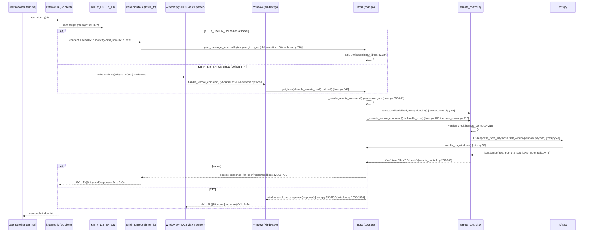

# What actually happens when you run `kitten @ ls` — an end-to-end, runtime-grounded trace

> **Scope.** This document answers, end to end, exactly what happens when you run `kitten @ ls`
> from another terminal against a running kitty instance. Every behavioral claim below is grounded
> in a `file:line` source citation, in real captured output, or both. Claims carry an explicit tag
> where the distinction matters: **(observed)** when backed by captured runtime output,
> **(inferred from code)** when read from the source without being exercised at runtime, and
> **(observed + inferred from code)** when a runtime observation is explained by a specific code
> path. The one behavior inferred from code rather than exercised end-to-end is SSH socket
> forwarding (§9.7), which is labeled as such at its use site. Byte-sensitive artifacts (the DCS
> envelope) are shown as the *literal bytes emitted*, with `ESC` rendered as `0x1b`.
>
> **How this was produced.** kitty was built and run in its canonical configuration in the project's
> Docker container (`ghcr.io/scaleapi/swe-atlas:swe_atlas_QnA_kovidgoyal_kitty_1.0`), at repository
> HEAD `815df1e210e0a9ab4622f5c7f2d6891d7dbeddf1`, **kitty/kitten 0.35.2**, Python 3.12.3, Go 1.23.4.
> The exact build and invocation commands are in **§12**. All temporary observation scripts lived
> outside the repository and were deleted afterward; this document is the only file added.
>
> **Terminology — what "default (TTY) config" means here.** kitty's *shipped* default is
> `allow_remote_control=no`, i.e. remote control is **off** and `kitten @ ls` is refused (shown in
> §9.1). Throughout this document, **"default (TTY) config"** means the minimal configuration in
> which `kitten @ ls` actually works — `allow_remote_control=yes` with **no** `--listen-on` — so the
> command travels over the window's own pty as an escape code rather than through a socket. The
> **socket** runs additionally pass `--listen-on unix:<addr>`. Whenever "default" appears below
> without qualification it refers to this TTY (no-socket) configuration, not to kitty's shipped
> remote-control-off default.

---

## 1. Direct-Answer Summary (read this first)

The seven questions, each answered in one breath. Details + real output follow in the numbered sections.

1. **How does the kitten know *where* to send the command — socket, pipe, or something else?**
   It is **either a socket *or* the terminal's own pty** — never a pipe. The client resolves its
   target from the **`KITTY_LISTEN_ON`** environment variable (unless you pass `--to`). If that names
   a socket (`unix:<addr>`, `tcp:<addr>`, or `fd:<n>`) it connects to that socket; **if it is empty it writes
   DCS escape codes to the controlling TTY** — the window's own pty. The Go client picks this at
   `tools/cmd/at/main.go:371-382`; the Python client at `kitty/remote_control.py:383`
   (`SocketIO(to) if to else RCIO()`). *(observed: `KITTY_LISTEN_ON=[]` in the default config →
   TTY; `KITTY_LISTEN_ON=[unix:/tmp/test]` with `--listen-on` → socket.)*

2. **What is the real socket path, and why did `/tmp` look empty?**
   **Because in the default configuration kitty creates no socket at all** — that is why `/tmp`
   looked empty. A socket is opened only inside the module-level `listen_on()` function (`kitty/boss.py:177`) and only
   when you set `--listen-on`/`listen_on` **and** `allow_remote_control ∈ {y, socket, socket-only,
   password}` (the gate at `kitty/boss.py:364`). When you *do* configure one from the config file,
   the path is made per-instance by `expand_listen_on()` (`kitty/main.py:325-343`): a bare name is
   resolved into the temp dir and `{kitty_pid}` is substituted with `os.getpid()`.
   *(observed: default → no socket in `/tmp`; config `listen_on unix:mykitty` → `/tmp/mykitty-27671`,
   and `/tmp/mykitty-27775` on the next run — the PID component varies.)*

3. **Shell integration makes remote commands work "without explicit configuration" — same socket, or TTY magic through the pty?**
   **TTY magic, affirmatively.** In the default config the command travels as a DCS escape code over
   the window's own pty; kitty dispatches it via `Boss.handle_remote_cmd(cmd, window)`
   (`kitty/boss.py:849`) with the originating window known. Shell integration itself opens **no**
   remote-control socket — `grep -rn 'KITTY_LISTEN_ON|@kitty-cmd|listen_on' shell-integration/`
   returns nothing *(observed)*. The env var you could not trace is set/unset in one place —
   `kitty/child.py:246-249`: kitty sets `KITTY_LISTEN_ON` only when it is actually listening on a
   socket, otherwise it **pops** it, which is why the client falls through to the TTY branch.

4. **What do the on-the-wire protocol messages look like?**
   A DCS-wrapped JSON envelope: `0x1b P @kitty-cmd <json> 0x1b \`. The request is framed by
   `encode_send()` (`kitty/remote_control.py:308-310`); the reply by `encode_response_for_peer()`
   (`kitty/remote_control.py:52-53`, socket) or `Window.send_cmd_response()`
   (`kitty/window.py:1385-1386`, TTY). *(observed byte-exact in §5.)*

5. **Where in the Python code does the incoming command get parsed and routed to the `ls` handler?**
   Both transports converge on `Boss._handle_remote_command()` (`kitty/boss.py:590`):
   socket enters via `Boss.peer_message_received()` (`kitty/boss.py:776`), TTY via
   `Window.handle_remote_cmd()` → `Boss.handle_remote_cmd()` (`kitty/window.py:1279`,
   `kitty/boss.py:849`). From there: `parse_cmd()` → `_execute_remote_command()` →
   `remote_control.handle_cmd()` → `LS.response_from_kitty()` (`kitty/rc/ls.py:48`) →
   `boss.list_os_windows()`. *(observed with a live trace in §6.)*

6. **What JSON comes back from a real `ls` — the format a new command must follow?**
   An envelope `{"ok": true, "data": "<json-tree-string>"}` where `data` is **itself a JSON string**
   (the output of `json.dumps(tree, indent=2, sort_keys=True)`, `kitty/rc/ls.py:76`). The tree is a
   list of OS windows → tabs → windows. *(full, unedited capture in §7.)* `handle_cmd` builds the
   envelope at `kitty/remote_control.py:258-260`.

7. **What is the logging behavior across the flow?**
   **The happy path logs nothing** remote-control-specific (only a harmless startup `systemd` bus
   warning). Every RC log line is an **error-path** `log_error()`: malformed peer
   (`boss.py:792`), bad JSON (`remote_control.py:62`), missing version (`remote_control.py:65`),
   invalid `listen_on` (`boss.py:368`). Error *responses* to the client (disabled / socket-only /
   version-mismatch) are returned in the JSON envelope and are **not** logged server-side.
   *(observed in §8.)*

---

## 2. Transport discovery — how the client finds its target (Q1)

**Direct answer:** the client reads `KITTY_LISTEN_ON` (when `--to` is not given) and selects a
transport from it: a **socket** if the variable names one, otherwise **DCS escape codes over the
controlling TTY**. It is never a pipe.

### 2.1 The Go client (`kitten @`, the binary the user runs)

`tools/cmd/at/main.go:371-382` — if `--to` was not supplied, fall back to the env var, then parse it
into a socket address:

```go
if rc_global_opts.To == "" {
	rc_global_opts.To = os.Getenv("KITTY_LISTEN_ON")
	global_options.to_address_is_from_env_var = true
}
if rc_global_opts.To != "" {
	network, address, err := utils.ParseSocketAddress(rc_global_opts.To)
	if err != nil {
		return err
	}
	global_options.to_network = network
	global_options.to_address = address
}
```

If `To` ends up empty, the client does not connect to any socket — it uses the controlling terminal.
The `fd:` scheme is handled specially by the client itself (`tools/cmd/at/socket_io.go:170`,
`os.NewFile(uintptr(fd), "fd:"+global_options.to_address)`), not by `ParseSocketAddress`.

### 2.2 The Python client (`kitty @`) and the shared selector

`kitty/remote_control.py:383` — the one line that chooses the transport:

```python
io: Union[SocketIO, RCIO] = SocketIO(to) if to else RCIO()
```

`SocketIO` (`kitty/remote_control.py:317`) connects to `to`; `RCIO(TTYIO)`
(`kitty/remote_control.py:361`, base `class TTYIO` at `kitty/utils.py:549`) writes to the
controlling terminal. So `to` truthy → socket, `to` empty → TTY. The `--no-response` short-circuit
is right here too (`kitty/remote_control.py:386-387`): `if no_response: return {'ok': True}`
— observed in action in §9.5.

### 2.3 Observed `KITTY_LISTEN_ON` values in each configuration

| Configuration | `KITTY_LISTEN_ON` (observed) | Transport chosen |
|---|---|---|
| default (`allow_remote_control=yes`, no `--listen-on`) | `[]` (empty) | TTY / DCS over the window pty |
| `--listen-on unix:/tmp/test` | `unix:/tmp/test` | UNIX socket |
| `--listen-on tcp:localhost:0` | `tcp:localhost:49133` | TCP socket (OS-assigned port) |
| config `listen_on unix:mykitty` | `unix:/tmp/mykitty-<pid>` | UNIX socket (per-instance path) |
| `launch --allow-remote-control` child | `fd:13` | inherited socketpair fd |

Command used to read the value inside a window (default config):

```
$ env | grep '^KITTY_' | sort
KITTY_INSTALLATION_DIR=/app
KITTY_PID=38852
KITTY_PUBLIC_KEY=1:CXt@6-w}E!{FT;4KK5C!)q9eW2~t>W99&;6hW7Ik
KITTY_WINDOW_ID=1
$ echo "KITTY_LISTEN_ON=[$KITTY_LISTEN_ON]"
KITTY_LISTEN_ON=[]
```

`KITTY_LISTEN_ON` is empty in the default config → the client takes the TTY branch. `KITTY_PID` and
`KITTY_WINDOW_ID` *are* set (they come from `kitty/child.py:244` and the window setup), which is the
source of the confusion addressed in §4. `KITTY_PUBLIC_KEY` is shown **in full** — it is an ephemeral
per-launch X25519 *public* key (`kitty/child.py:245`, `env['KITTY_PUBLIC_KEY'] =
boss.encryption_public_key`), not a secret; see the note in §7.2. `KITTY_SHELL_INTEGRATION` is
**absent** from this capture because the child is a non-interactive `sh -c` invocation, not a supported interactive shell:
`modify_shell_environ` sets that variable only for bash/zsh/fish
(`kitty/shell_integration.py:219-223`; `get_supported_shell_name` returns `None` otherwise), and even
for a supported shell the integration script `unset`s it right after reading it
(`shell-integration/bash/kitty.bash:10`, `shell-integration/zsh/kitty-integration:90`,
`shell-integration/fish/vendor_conf.d/kitty-shell-integration.fish:31`). *(observed + grounded in code.)*

This matches the user-facing guide `docs/remote-control.rst`: it documents that to control a *different*
kitty you pass `kitten @ --to` (`docs/remote-control.rst:117-120`), and that when run inside a kitty
window `kitten @` needs no `--to` because it reads the address from the environment — the socket route
being an explicit opt-in via `--listen-on` (`docs/remote-control.rst:113`,
`kitty -o allow_remote_control=yes --listen-on unix:/tmp/mykitty`). The behavior observed here is
consistent with that guide.

---

## 3. The socket-path mechanism — why `/tmp` looked empty, and the real path (Q2)

**Direct answer:** in the default configuration **kitty creates no remote-control socket at all**,
so there is nothing to find in `/tmp`. A socket appears only when you both (a) pass a `--listen-on`
address or a `listen_on` config value and (b) enable remote control at a level that permits a socket.

### 3.1 The gate that decides whether a socket is created

`kitty/boss.py:356-369` — `allow_remote_control` is normalized (`yes/true → 'y'`, `no/false → 'n'`),
then the socket is created only if the address is present **and** the level is one of
`{y, socket, socket-only, password}`:

```python
self.allow_remote_control = opts.allow_remote_control
if self.allow_remote_control in ('y', 'yes', 'true'):
    self.allow_remote_control = 'y'
elif self.allow_remote_control in ('n', 'no', 'false'):
    self.allow_remote_control = 'n'
self.listening_on = ''
listen_fd = -1
if args.listen_on and self.allow_remote_control in ('y', 'socket', 'socket-only', 'password'):
    try:
        listen_fd, self.listening_on = listen_on(args.listen_on)
    except Exception:
        self.misc_config_errors.append(f'Invalid listen_on={args.listen_on}, ignoring')
        log_error(self.misc_config_errors[-1])
```

The default `allow_remote_control` is `no` (`kitty/options/definition.py:2969`), so even if you passed
`--listen-on`, the default level would *still* skip socket creation. The actual bind/listen happens
in the module-level `listen_on()` function (`kitty/boss.py:177`), and the socket file is removed at exit via
`remove_socket_file()` (`kitty/utils.py:379`).

### 3.2 Observed: default config → no socket

```
$ find /tmp -type s
/tmp/.X11-unix/X99
```

The only socket present is the X server's (`X99`, from the headless display). **No kitty
remote-control socket exists** — the direct answer to "why did `/tmp` look empty". *(observed;
stable across two runs.)*

### 3.3 Observed: explicit `--listen-on` → the socket appears

Reproducing the canonical example from `docs/rc_protocol.rst:37`:

```
$ kitty -o allow_remote_control=socket-only --listen-on unix:/tmp/test   # (headless; see §12)
$ ls -la /tmp/test
srwxr-xr-x 1 root root 0 Jul  8 04:22 /tmp/test
$ file /tmp/test
/tmp/test: socket
```

The leading `s` in `srwxr-xr-x` and `file` reporting `socket` confirm a real UNIX-domain socket at
the exact path requested. Because `--listen-on` came from the **command line**, the path is used
verbatim (no `{kitty_pid}` munging — see §3.4).

### 3.4 Observed: dynamic path generation from the config file (`expand_listen_on`)

`expand_listen_on()` (`kitty/main.py:325-343`) only rewrites the address when it comes from the
config file (`from_config_file=True`, set in `setup_environment`, `kitty/main.py:403-409`). It
(a) appends `-{kitty_pid}` to any config-file `unix:` spec lacking the placeholder
(`kitty/main.py:329-330`), (b) substitutes `{kitty_pid}` with `str(os.getpid())`
(`kitty/main.py:331`), and (c) resolves a relative (non-absolute) name into `tempfile.gettempdir()`
(`kitty/main.py:337-339`).

Throwaway config `/tmp/obs_kitty.conf` containing `listen_on unix:mykitty`, launched with
`kitty -c /tmp/obs_kitty.conf`, observed across two runs:

```
# RUN 1
KITTY_PID=[27671]
KITTY_LISTEN_ON=[unix:/tmp/mykitty-27671]
# RUN 2
KITTY_PID=[27775]
KITTY_LISTEN_ON=[unix:/tmp/mykitty-27775]
```

All three transforms are visible: the bare name `mykitty` was resolved into `/tmp` (the temp dir),
and `-{kitty_pid}` was appended and substituted with the process PID. The base path
(`/tmp/mykitty-`) is **stable**; the PID suffix **varies per run and equals `KITTY_PID`**
(= `os.getpid()`, `kitty/main.py:331`). `boss.listening_on` reflects this resolved spec.

An absolute config-file path takes the same suffix: transform (a) is **not** limited to slash-less
names. Launching the real launcher with a config `listen_on unix:/tmp/abs_probe` created the socket
at `/tmp/abs_probe-{kitty_pid}` (observed `/tmp/abs_probe-1032` then `/tmp/abs_probe-1198` across two
runs). Only transform (c)'s temp-dir resolution is gated on a relative name
(`not os.path.isabs(path)`, `kitty/main.py:337`) — an absolute path skips (c) but still receives the
(a) suffix.

For TCP, a `:0` port is turned into an OS-assigned port (`kitty/main.py:340-342`, rewritten back in
`kitty/boss.py:184-188`):

```
$ kitty -o allow_remote_control=yes --listen-on tcp:localhost:0   # (headless)
KITTY_LISTEN_ON=[tcp:localhost:49133]
```

*(observed.)*

---

## 4. The TTY/escape-code channel and shell integration "without explicit configuration" (Q3)

**Direct answer:** yes — it is TTY magic over the window's own pty, and shell integration plays **no**
part in transport setup. In the default config there is no socket, `KITTY_LISTEN_ON` is empty, and
the client writes the command as a DCS escape code to the controlling terminal, which *is* the
window's pty; kitty reads it and dispatches with the originating window known.

### 4.1 Proof that shell integration opens no remote-control socket

```
$ grep -rn 'KITTY_LISTEN_ON\|@kitty-cmd\|listen_on' shell-integration/
$ echo "grep_exit=$?"
grep_exit=1
```

Empty result (`grep_exit=1` = no matches). The shell-integration scripts never reference the
remote-control socket, the env var, or the `@kitty-cmd` protocol. They only read `KITTY_PID` /
`KITTY_WINDOW_ID` for SSH detection (e.g. `shell-integration/zsh/kitty-integration:249,251`,
`shell-integration/bash/kitty.bash:215-216`). *(observed.)*

### 4.2 The one place `KITTY_LISTEN_ON` is set or unset — the env var you could not trace

`kitty/child.py:244-249`:

```python
env['KITTY_PID'] = getpid()
env['KITTY_PUBLIC_KEY'] = boss.encryption_public_key
if self.add_listen_on_env_var and boss.listening_on:
    env['KITTY_LISTEN_ON'] = boss.listening_on
else:
    env.pop('KITTY_LISTEN_ON', None)
```

This is the crux. kitty exports `KITTY_LISTEN_ON` **only** when it is actually listening on a socket
(`boss.listening_on` is truthy). With no socket (the default), it **pops** the variable, so children
never see it. The client therefore finds `To == ""` and takes the TTY branch (§2). Shell-integration
scripts set other `KITTY_*` variables, but *this* variable — the only one that steers the
transport — is controlled entirely here. *(inferred from code; corroborated by the observed empty
`KITTY_LISTEN_ON` in §2.3 and the empty grep above.)*

### 4.3 Observed: in-window `kitten @ ls` works over the TTY with no socket

Run from inside a default-config kitty window (no `--to`, `KITTY_LISTEN_ON=[]`): `kitten @ ls`
returns the full JSON tree (exit 0), and the invoking window is marked `"is_self": true` — proof the
command traveled over that window's pty and kitty knew which window sent it. The routing evidence is
in §6 (TTY trace); the `is_self` contrast is in §7.


---

## 5. The on-the-wire protocol — literal DCS bytes (Q4)

**Direct answer:** every message, on both transports, is a DCS-wrapped JSON envelope of the exact
form `0x1b P @kitty-cmd <json> 0x1b \` — an `ESC` (`0x1b`), the letter `P`, the literal ASCII
`@kitty-cmd`, the JSON object, then `ESC \` (`0x1b 0x5c`). This matches the spec at
`docs/rc_protocol.rst:8` (`<ESC>P@kitty-cmd<JSON object><ESC>\`, `<ESC>` = byte `0x1b` at L10).

### 5.1 The request bytes

The request is framed by `encode_send()` (`kitty/remote_control.py:308-310`):

```python
def encode_send(send: Any) -> bytes:
    es = ('@kitty-cmd' + json.dumps(send)).encode('ascii')
    return b'\x1bP' + es + b'\x1b\\'
```

Capturing the exact bytes of the documented request payload (`docs/rc_protocol.rst:42`) with
`hexdump -C` (`xxd` is absent in the container):

```
$ printf '\033P@kitty-cmd{"cmd":"ls","version":[0,14,2]}\033\\' | hexdump -C
00000000  1b 50 40 6b 69 74 74 79  2d 63 6d 64 7b 22 63 6d  |.P@kitty-cmd{"cm|
00000010  64 22 3a 22 6c 73 22 2c  22 76 65 72 73 69 6f 6e  |d":"ls","version|
00000020  22 3a 5b 30 2c 31 34 2c  32 5d 7d 1b 5c           |":[0,14,2]}.\|
0000002d
```

- Prefix: `1b 50 40 6b 69 74 74 79 2d 63 6d 64` = `ESC P @kitty-cmd` — **exactly 12 bytes**.
- Terminator: `1b 5c` = `ESC \` — 2 bytes.
- Total: 45 bytes (`0x2d`). *(observed.)*

### 5.2 The response bytes (raw, before the `awk` strip)

For the socket transport the reply is framed by `encode_response_for_peer()`
(`kitty/remote_control.py:52-53`): `b'\x1bP@kitty-cmd' + json.dumps(response).encode('utf-8') +
b'\x1b\\'`. For the TTY transport it is written by `Window.send_cmd_response()`
(`kitty/window.py:1385-1386`): `self.screen.send_escape_code_to_child(ESC_DCS, '@kitty-cmd' +
json.dumps(response))` — since `ESC_DCS` frames as `ESC P <payload> ESC \`, both transports emit the same
shape.

Raw response captured straight off the socket (3273 bytes total), `hexdump -C`:

```
$ printf '\033P@kitty-cmd{"cmd":"ls","version":[0,14,2]}\033\\' | socat - unix:/tmp/test > resp.bin
$ hexdump -C resp.bin | head -5
00000000  1b 50 40 6b 69 74 74 79  2d 63 6d 64 7b 22 6f 6b  |.P@kitty-cmd{"ok|
00000010  22 3a 20 74 72 75 65 2c  20 22 64 61 74 61 22 3a  |": true, "data":|
00000020  20 22 5b 5c 6e 20 20 7b  5c 6e 20 20 20 20 5c 22  | "[\n  {\n    \"|
00000030  62 61 63 6b 67 72 6f 75  6e 64 5f 6f 70 61 63 69  |background_opaci|
00000040  74 79 5c 22 3a 20 31 2e  30 2c 5c 6e 20 20 20 20  |ty\": 1.0,\n    |
$ tail -c 48 resp.bin | hexdump -C
00000000  6b 69 74 74 79 5c 22 2c  5c 6e 20 20 20 20 5c 22  |kitty\",\n    \"|
00000010  77 6d 5f 6e 61 6d 65 5c  22 3a 20 5c 22 6b 69 74  |wm_name\": \"kit|
00000020  74 79 5c 22 5c 6e 20 20  7d 5c 6e 5d 22 7d 1b 5c  |ty\"\n  }\n]"}.\|
```

- Same 12-byte prefix `ESC P @kitty-cmd`, then `{"ok": true, "data": "[<escaped JSON tree>]"}`, then the 2-byte
  terminator `1b 5c` = `ESC \`.
- Note the response JSON is **spaced** (`"ok": true, "data":`), and the `data` value is an **escaped
  JSON string**: the bytes are `5c 22` (`\"`) and `5c 6e` (`\n`), *not* real quotes/newlines — so the
  whole response is a single physical line. *(observed.)*

### 5.3 The `awk` strip in the documented pipeline, explained

The canonical pipeline uses `awk '{ print substr($0, 13, length($0) - 14) }'`. Grounded in the byte
lengths just measured: `substr` starting at position **13** drops the 12-byte prefix
(`ESC P @kitty-cmd`); the length `length - 14` also drops the final 2 bytes (`ESC \`) — i.e. it
removes 12 + 2 = 14 framing bytes, leaving the JSON envelope. Verified on the real response:

```
$ awk '{ print substr($0, 13, length($0) - 14) }' resp.bin | head -c 60
{"ok": true, "data": "[\n  {\n    \"background_opacity\": 1.
```

The response DCS is also matched by the parser regex `br'\x1bP@kitty-cmd([^\x1b]+)\x1b\\'`
(`kitty/remote_control.py:348`). *(observed + inferred from code.)*

### 5.4 Three real client variants (all valid)

The framing is invariant, but the JSON body differs by client — all three are accepted because the
version check compares only `(major, minor)` (`kitty/remote_control.py:218`,
`if tuple(v)[:2] > version[:2]:`), and all have `major=0, minor ≤ 35`.

**(a) The actual Go `kitten @` client**, captured with a `socat -x -v` relay
(`UNIX-LISTEN:/tmp/relay,fork UNIX-CONNECT:/tmp/test`, then `kitten @ ls --to unix:/tmp/relay`):

```
> length=58 from=0 to=57
 1b 50 40 6b 69 74 74 79 2d 63 6d 64 7b 22 63 6d  .P@kitty-cmd{"cm
 64 22 3a 22 6c 73 22 2c 22 76 65 72 73 69 6f 6e  d":"ls","version
 22 3a 5b 30 2c 32 36 2c 30 5d 2c 22 70 61 79 6c  ":[0,26,0],"payl
 6f 61 64 22 3a 7b 7d 7d 1b 5c                    oad":{}}.\
```

The Go client sends **compact** JSON with **`version:[0,26,0]`** (from
`tools/cmd/at/main.go:33 var ProtocolVersion [3]int = [3]int{0, 26, 0}`) and `payload:{}`.

**(b) The documented `socat` example** uses `version:[0,14,2]` (shown byte-exact in §5.1).

**(c) The Python `kitty @` client**, via `encode_send`:

```
$ python3 -c "from kitty.remote_control import encode_send, create_basic_command; \
              print(repr(encode_send(create_basic_command('ls', payload={}))))"
b'\x1bP@kitty-cmd{"cmd": "ls", "version": [0, 35, 2], "no_response": false, "payload": {}}\x1b\\'
```

The Python client sends **spaced** JSON with **`version:[0, 35, 2]`** (`kitty.constants.version`) and
an explicit `no_response` field. Framing bytes confirmed: `prefix b'\x1bP@kitty-cmd' len 12`,
`terminator b'\x1b\\' len 2`. *(observed.)*

> **Encryption note (default path is plaintext).** When `remote_control_password` is configured the
> body is X25519-encrypted with a Base-85 key published in `KITTY_PUBLIC_KEY`
> (`kitty/child.py:245`; decrypt path `kitty/remote_control.py:68-85`). The captures above are the
> default **unencrypted** path.


---

## 6. Where Python parses and routes the command to the `ls` handler (Q5)

**Direct answer:** the two transports enter at different doors but converge on one gate,
`Boss._handle_remote_command()` (`kitty/boss.py:590`), which parses the envelope and dispatches to
the handler. The socket door is `Boss.peer_message_received()` (`kitty/boss.py:776`); the TTY door is
`Window.handle_remote_cmd()` → `Boss.handle_remote_cmd()` (`kitty/window.py:1279`, `kitty/boss.py:849`).
From the common gate: `parse_cmd()` → `_execute_remote_command()` (`kitty/boss.py:700`) →
`remote_control.handle_cmd()` (`kitty/remote_control.py:213`) → `LS.response_from_kitty()`
(`kitty/rc/ls.py:48`) → `boss.list_os_windows()`.

I captured this **at runtime** by wrapping each method on its class (a temporary
`sitecustomize.py` on `PYTHONPATH`, outside the repo) and logging every call with its real arguments.
Both traces below are the actual, unedited log output (a timestamp prefix `[secs-since-start]` was
added by the tracer).

### 6.1 Socket transport (driven by `kitten @ ls --to unix:/tmp/test`)

```
[  0.212] TRACE boss.peer_message_received     peer_id=1 is_rc=True msg=b'\x1bP@kitty-cmd{"cmd":"ls","version":[0,26,0],"payload":{}}\x1b\\'
[  0.212] TRACE boss._handle_remote_command    peer_id=1 window=None cmd=b'{"cmd":"ls","version":[0,26,0],"payload":{}}'
[  0.212] TRACE remote_control.parse_cmd       serialized=b'{"cmd":"ls","version":[0,26,0],"payload":{}}'
[  0.212] TRACE boss._execute_remote_command   cmd=ls peer_id=1
[  0.212] TRACE remote_control.handle_cmd      cmd=ls peer_id=1
[  0.212] TRACE rc/ls.LS.response_from_kitty   window=None
[  0.212] TRACE boss.list_os_windows           (called by ls handler)
[  0.219] TRACE boss.peer_message_received     peer_id=1 is_rc=True msg=b'peer_death'
```

Observations:
- The C event loop delivers the socket bytes to Python via `PyObject_CallMethod(global_state.boss,
  "peer_message_received", "y#KO", msg->data, (int)msg->sz, msg->peer_id, msg->is_remote_control_peer ? Py_True : Py_False)` (`kitty/child-monitor.c:504`). The bytes arriving at
  `peer_message_received` **still carry the `\x1bP@kitty-cmd` prefix**; `Boss` strips the 12-byte
  prefix and 2-byte terminator (`kitty/boss.py:781-784`) before calling `_handle_remote_command`
  (hence `cmd=b'{"cmd":"ls","version":[0,26,0],"payload":{}}'`).
- `peer_id=1` (> 0) → `from_socket = True` (`kitty/boss.py:594`); `window=None` (a socket command has
  no originating window).
- When the client disconnects, a `peer_death` message arrives (`kitty/boss.py:777-779`).

### 6.2 TTY transport (in-window `kitten @ ls`, no socket)

```
[ 25.197] TRACE window.Window.handle_remote_cmd window=1 cmd=b'{"cmd":"ls","version":[0,26,0],"kitty_window_id":1,"payload":{}}'
[ 25.197] TRACE boss.handle_remote_cmd         window=1 cmd=b'{"cmd":"ls","version":[0,26,0],"kitty_window_id":1,"payload":{}}'
[ 25.198] TRACE boss._handle_remote_command    peer_id=0 window=1 cmd=b'{"cmd":"ls","version":[0,26,0],"kitty_window_id":1,"payload":{}}'
[ 25.198] TRACE remote_control.parse_cmd       serialized=b'{"cmd":"ls","version":[0,26,0],"kitty_window_id":1,"payload":{}}'
[ 25.198] TRACE boss._execute_remote_command   cmd=ls peer_id=0
[ 25.198] TRACE remote_control.handle_cmd      cmd=ls peer_id=0
[ 25.198] TRACE rc/ls.LS.response_from_kitty   window=1
[ 25.198] TRACE boss.list_os_windows           (called by ls handler)
```

Observations:
- The DCS reaches Python through the VT parser: `kitty/vt-parser.c:603` `dispatch("cmd{",
  handle_remote_cmd, 1)` → `screen_handle_kitty_dcs()` → the `CALLBACK` macro
  `PyObject_CallMethod(self->callbacks, "handle_remote_cmd", "O", cmd)`. The `Screen`'s callbacks
  object *is* the `Window` (`kitty/window.py:604` `Screen(self, 24, 80, opts.scrollback_lines, cell_width, cell_height, self.id)`), so this lands on
  `Window.handle_remote_cmd` (`kitty/window.py:1279`), which calls
  `get_boss().handle_remote_cmd(cmd, self)` (`kitty/window.py:1280` → `kitty/boss.py:849`).
- `peer_id=0` → `from_socket = False`; `window=1` (the originating window is known).
- The TTY request uniquely carries a **`kitty_window_id`** field in its JSON (the Go client tags the
  window when using the TTY transport); the socket request in §6.1 has no such field. `Boss` uses it
  (`kitty/boss.py:614-619`) to set `self_window` when no `window` object is passed.

### 6.3 The convergence and the response envelope

Both paths reach `_handle_remote_command`, which runs the permission gate (§9) — the
`allowed_unconditionally` expression at `kitty/boss.py:623-628` allows the command when
`allow_remote_control == 'y'`, or it is a socket peer under `socket`/`socket-only`, or the originating
window authorizes it via `Window.remote_control_allowed(pcmd, extra_data)` (`kitty/window.py:612`,
the per-window/password branch), or it is an `fd:` peer. It then runs
`parse_cmd(cmd, self.encryption_key)` (`kitty/remote_control.py:56`), then
`_execute_remote_command()` (`kitty/boss.py:700`) → `handle_cmd()`
(`kitty/remote_control.py:213`). `handle_cmd` version-checks (`:218`), looks up the command with
`command_for_name(cmd['cmd'])` (`:222`), invokes
`ans = c.response_from_kitty(boss, self_window or window, PayloadGetter(c, payload))` (`:247`), and
wraps the result: `response = {'ok': True}` (`:258`), `response['data'] = ans` (`:260`). For `ls`,
`response_from_kitty` (`kitty/rc/ls.py:48`) calls `boss.list_os_windows()` (`:57`) and returns
`json.dumps(data, indent=2, sort_keys=True)` (`:76`). The reply is then framed back onto the wire
(socket: `encode_response_for_peer`, `kitty/boss.py:790-791`; TTY: `window.send_cmd_response`,
`kitty/boss.py:851-852`).


---

## 7. The full `ls` JSON response and its envelope — the new-command contract (Q6)

**Direct answer:** a real `ls` returns the two-key envelope `{"ok": true, "data": "<json-tree>"}`,
where `data` is **itself a JSON string** (the output of `json.dumps(tree, indent=2, sort_keys=True)`).
This is exactly the shape any new command must produce: your `response_from_kitty` returns a value,
and `handle_cmd` wraps it as `response['data']`.

### 7.1 The raw envelope (unedited, `data` as an escaped string)

```
$ printf '\033P@kitty-cmd{"cmd":"ls","version":[0,14,2]}\033\\' | socat - unix:/tmp/test \
    | awk '{ print substr($0, 13, length($0) - 14) }'
{"ok": true, "data": "[\n  {\n    \"background_opacity\": 1.0,\n    \"id\": 1,\n    \"is_active\": true,\n    \"is_focused\": true,\n    \"last_focused\": true,\n    \"platform_window_id\": 2097164,\n    \"tabs\": [\n      {\n        \"active_window_history\": [\n          1\n        ],\n        \"enabled_layouts\": [\n          \"fat\",\n          \"grid\",\n          \"horizontal\",\n          \"splits\",\n          \"stack\",\n          \"tall\",\n          \"vertical\"\n        ],\n        \"groups\": [\n          {\n            \"id\": 1,\n            \"windows\": [\n              1\n            ]\n          }\n        ],\n        \"id\": 1,\n        \"is_active\": true,\n        \"is_focused\": true,\n        \"layout\": \"fat\",\n        \"layout_opts\": {\n          \"bias\": 50,\n          \"full_size\": 1,\n          \"mirrored\": false\n        },\n        \"layout_state\": {\n          \"biased_map\": {},\n          \"main_bias\": [\n            0.5,\n            0.5\n          ],\n          \"num_full_size_windows\": 1\n        },\n        \"title\": \"sleep\",\n        \"windows\": [\n          {\n            \"at_prompt\": false,\n            \"cmdline\": [\n              \"sleep\",\n              \"600\"\n            ],\n            \"columns\": 71,\n            \"created_at\": 1783489801368575904,\n            \"cwd\": \"/app\",\n            \"env\": {\n              \"COLORTERM\": \"truecolor\",\n              \"DISPLAY\": \":99\",\n              \"GALLIUM_DRIVER\": \"llvmpipe\",\n              \"HOME\": \"/root\",\n              \"HOSTNAME\": \"c4ec4da093d0\",\n              \"KITTY_INSTALLATION_DIR\": \"/app\",\n              \"KITTY_LISTEN_ON\": \"unix:/tmp/test\",\n              \"KITTY_PID\": \"36964\",\n              \"KITTY_PUBLIC_KEY\": \"1:Gv8ydn*6zRtoN9!VF22cZUt0p$mc(zEb1nhDeMm;\",\n              \"KITTY_WINDOW_ID\": \"1\",\n              \"LC_CTYPE\": \"C.UTF-8\",\n              \"LIBGL_ALWAYS_SOFTWARE\": \"1\",\n              \"OLDPWD\": \"/app\",\n              \"PATH\": \"/app/kitty/launcher:/usr/local/go/bin:/usr/local/sbin:/usr/local/bin:/usr/sbin:/usr/bin:/sbin:/bin\",\n              \"PWD\": \"/app\",\n              \"PYTEST_ADDOPTS\": \"--tb=short -v --continue-on-collection-errors --reruns=3\",\n              \"SHLVL\": \"0\",\n              \"TERM\": \"xterm-kitty\",\n              \"TERMINFO\": \"/app/terminfo\",\n              \"UV_HTTP_TIMEOUT\": \"60\",\n              \"WINDOWID\": \"2097164\",\n              \"_\": \"./kitty/launcher/kitty\"\n            },\n            \"foreground_processes\": [\n              {\n                \"cmdline\": [\n                  \"sleep\",\n                  \"600\"\n                ],\n                \"cwd\": \"/app\",\n                \"pid\": 37034\n              }\n            ],\n            \"id\": 1,\n            \"is_active\": true,\n            \"is_focused\": true,\n            \"is_self\": false,\n            \"last_cmd_exit_status\": 0,\n            \"last_reported_cmdline\": \"\",\n            \"lines\": 22,\n            \"pid\": 37034,\n            \"title\": \"sleep\",\n            \"user_vars\": {}\n          }\n        ]\n      }\n    ],\n    \"wm_class\": \"kitty\",\n    \"wm_name\": \"kitty\"\n  }\n]"}
```

Top-level keys are exactly two — `["data", "ok"]` (`jq 'keys'`) — built in `handle_cmd`
(`kitty/remote_control.py:258-260`). The `data` value is a string with embedded `\"` and `\n`, which
is why the documented pipeline decodes it with `jq -c '.data | fromjson'`.

### 7.2 The full, pretty-printed inner tree (`jq '.data | fromjson'`)

Below is the **complete, unedited** 110-line tree from a single-OS-window headless instance,
exactly as emitted by `jq '.data | fromjson'` on the raw response above — **nothing is redacted**,
including the `KITTY_PUBLIC_KEY` value (which is a non-secret public key; see the note after the
block). This is the socket-transport capture, so `is_self` is `false` (§7.4).

```json
[
  {
    "background_opacity": 1.0,
    "id": 1,
    "is_active": true,
    "is_focused": true,
    "last_focused": true,
    "platform_window_id": 2097164,
    "tabs": [
      {
        "active_window_history": [
          1
        ],
        "enabled_layouts": [
          "fat",
          "grid",
          "horizontal",
          "splits",
          "stack",
          "tall",
          "vertical"
        ],
        "groups": [
          {
            "id": 1,
            "windows": [
              1
            ]
          }
        ],
        "id": 1,
        "is_active": true,
        "is_focused": true,
        "layout": "fat",
        "layout_opts": {
          "bias": 50,
          "full_size": 1,
          "mirrored": false
        },
        "layout_state": {
          "biased_map": {},
          "main_bias": [
            0.5,
            0.5
          ],
          "num_full_size_windows": 1
        },
        "title": "sleep",
        "windows": [
          {
            "at_prompt": false,
            "cmdline": [
              "sleep",
              "600"
            ],
            "columns": 71,
            "created_at": 1783489801368575904,
            "cwd": "/app",
            "env": {
              "COLORTERM": "truecolor",
              "DISPLAY": ":99",
              "GALLIUM_DRIVER": "llvmpipe",
              "HOME": "/root",
              "HOSTNAME": "c4ec4da093d0",
              "KITTY_INSTALLATION_DIR": "/app",
              "KITTY_LISTEN_ON": "unix:/tmp/test",
              "KITTY_PID": "36964",
              "KITTY_PUBLIC_KEY": "1:Gv8ydn*6zRtoN9!VF22cZUt0p$mc(zEb1nhDeMm;",
              "KITTY_WINDOW_ID": "1",
              "LC_CTYPE": "C.UTF-8",
              "LIBGL_ALWAYS_SOFTWARE": "1",
              "OLDPWD": "/app",
              "PATH": "/app/kitty/launcher:/usr/local/go/bin:/usr/local/sbin:/usr/local/bin:/usr/sbin:/usr/bin:/sbin:/bin",
              "PWD": "/app",
              "PYTEST_ADDOPTS": "--tb=short -v --continue-on-collection-errors --reruns=3",
              "SHLVL": "0",
              "TERM": "xterm-kitty",
              "TERMINFO": "/app/terminfo",
              "UV_HTTP_TIMEOUT": "60",
              "WINDOWID": "2097164",
              "_": "./kitty/launcher/kitty"
            },
            "foreground_processes": [
              {
                "cmdline": [
                  "sleep",
                  "600"
                ],
                "cwd": "/app",
                "pid": 37034
              }
            ],
            "id": 1,
            "is_active": true,
            "is_focused": true,
            "is_self": false,
            "last_cmd_exit_status": 0,
            "last_reported_cmdline": "",
            "lines": 22,
            "pid": 37034,
            "title": "sleep",
            "user_vars": {}
          }
        ]
      }
    ],
    "wm_class": "kitty",
    "wm_name": "kitty"
  }
]
```

**Public-key note (why nothing is redacted).** `KITTY_PUBLIC_KEY` is shown in full because it is
**not a secret**: it is the *public* half of an ephemeral X25519 key pair that kitty regenerates on
every launch and exports to children (`kitty/child.py:245`, `env['KITTY_PUBLIC_KEY'] =
boss.encryption_public_key`). The private half never leaves the kitty process; the public key only
lets a client encrypt a command *to* this instance (used with `remote_control_password`). Its
ephemerality is **observed** — four separate launches produced four different values, so the value
above is valid only for that one now-dead instance:

```
launch 1 (socket ls capture): 1:Gv8ydn*6zRtoN9!VF22cZUt0p$mc(zEb1nhDeMm;
launch 2 (default in-window):  1:6s9`lv4y&owRia{6;*%Cm>mHC&N)*Q>rH*^e?r(w
launch 3 (interactive bash):   1:g8+n|jzJ!-(7ehAlz_*oNF2|dGSX)C7kuIL7E(NL
launch 4 (§2 clean capture):   1:CXt@6-w}E!{FT;4KK5C!)q9eW2~t>W99&;6hW7Ik
```

*(observed across 4 runs + grounded in code.)*

### 7.3 The tree structure, by observed field (three levels)

- **OS window** (9 keys, `jq '.[0]|keys'`): `background_opacity, id, is_active, is_focused,
  last_focused, platform_window_id, tabs, wm_class, wm_name`.
- **Tab** (11 keys): `active_window_history, enabled_layouts, groups, id, is_active, is_focused,
  layout, layout_opts, layout_state, title, windows`.
- **Window** (17 keys): `at_prompt, cmdline, columns, created_at, cwd, env, foreground_processes, id,
  is_active, is_focused, is_self, last_cmd_exit_status, last_reported_cmdline, lines, pid, title,
  user_vars`.

Note the real window object carries **more** fields than the docstring's summary
(`kitty/rc/ls.py:16-33` mentions `id/title/cwd/pid/cmdline/env/is_self`): the runtime output also
includes `foreground_processes` (a list of `{cmdline, cwd, pid}`), `at_prompt`, `columns`, `lines`,
`created_at`, `last_cmd_exit_status`, `last_reported_cmdline`, and `user_vars`. *(observed.)*

### 7.4 `is_self` semantics — an observed contrast

- Over the **socket**, `is_self` is `false` for every window (this capture) — the command had no
  originating window.
- Over the **TTY**, the invoking window has `"is_self": true`, and its `foreground_processes` shows
  the `kitten @ ls` process (cmdline containing `"@", "ls"`). *(observed in the TTY run.)*

`is_self` is set by `boss.list_os_windows` for the `self_window` computed in the dispatch (§6.2), so
a command sent over the TTY can identify "the window I was run in", while a socket command cannot.

### 7.5 Env-var stripping (default vs `--all-env-vars`)

`LS.response_from_kitty` strips env vars **common to all windows** unless `--all-env-vars` is set, and
only when there is more than one window: `if common_env_vars and len(all_env_blocks) > 1`
(`kitty/rc/ls.py:71`). The single-window capture above therefore shows the **full** env (22 vars,
un-stripped). The request payload that carries this flag is
`{'all_env_vars', 'match', 'match_tab'}` (`kitty/rc/ls.py:45-46`). *(observed + inferred from code.)*

### 7.6 The contract for a future new command

For a new command you would add a `RemoteCommand` subclass in `kitty/rc/` (like `ls`), implement
`message_to_kitty()` (build the request payload) and `response_from_kitty()` (compute + return a
value), and **your returned value becomes `response['data']`** in the same
`{"ok": true, "data": <value>}` envelope, wire-framed as `0x1b P @kitty-cmd <json> 0x1b \`. If you return a
plain object it is embedded directly; `ls` chooses to pre-serialize its tree with
`json.dumps(data, indent=2, sort_keys=True)`, which is why its `data` is a *string*. See §11 for the
framework details.


---

## 8. Logging behavior across the flow (Q7)

**Direct answer:** the happy path produces **no** remote-control log output. The only line kitty
emits on a clean run is an unrelated startup warning. All remote-control logging is on **error
paths**, via `log_error()`, and the error *responses* that go back to the client are **not**
logged server-side (they travel in the JSON envelope instead).

### 8.1 Happy path — no RC logs (a real, negative observation)

The complete non-empty stderr from a default-config run in which an in-window `kitten @ ls` succeeded:

```
[0.231] Failed to open systemd user bus with error: No medium found
```

That line is from the desktop/systemd integration, not remote control; it appears whether or not any
remote command runs. There is **no** log line for the successful `ls`. *(observed.)*

### 8.2 Error paths — the log lines actually emitted

Each line below is the verbatim kitty stderr produced by the condition named (kitty prefixes each
with a monotonic `[seconds-since-start]`). These correspond one-to-one with the edge cases in §9.

| Condition (command) | Log line (verbatim) | Source |
|---|---|---|
| malformed peer bytes (no DCS framing) | `Malformatted remote control message received from peer, ignoring` | `kitty/boss.py:792` |
| DCS-framed but invalid JSON | `Failed to parse JSON payload of remote command, ignoring it` | `kitty/remote_control.py:62` |
| valid JSON, no `version` field | `JSON payload of remote command is invalid, must be an object with a version field` | `kitty/remote_control.py:65` |
| invalid `--listen-on` spec | `Invalid listen_on=foobar, ignoring` | `kitty/boss.py:368` |

Captured examples:

```
$ grep -nE 'Malformatted|Failed to parse|version field' obs_edge_kitty.log
2:[0.174] Malformatted remote control message received from peer, ignoring
3:[0.181] Failed to parse JSON payload of remote command, ignoring it
```

```
$ grep -n 'Invalid listen_on' obs_e6_kitty.log
1:[0.146] Invalid listen_on=foobar, ignoring
```

### 8.3 What is *not* logged

The client-visible errors — "Remote control is disabled", "Remote control is allowed over a socket
only", and the version-mismatch message — are returned as `{"ok": false, "error": <message>}` and produce
**no** server-side log line. A secondary catch exists at `kitty/boss.py:604-605`
(`log_error(f'Failed to parse remote command with error: {e}')`) for exceptions raised *out of*
`parse_cmd` (e.g. decryption failures); ordinary invalid JSON does not reach it because `parse_cmd`
swallows that internally (§8.2, `remote_control.py:62`). *(observed + inferred from code.)*

---

## 9. Edge / error variants — every branch, with real output (beyond the happy path)

Each variant shows the exact invocation, the actual client result, and (where relevant) the server
log. Error strings are byte-for-byte as emitted and match the cited `file:line`.

### 9.1 `allow_remote_control=no` → "Remote control is disabled"

In-window (TTY) `kitten @ ls` against a default (`no`) instance:

```
$ kitten @ ls
Error: Remote control is disabled          # exit 1
```

Source: `kitty/boss.py:598-599` `return {'ok': False, 'error': 'Remote control is disabled'}` (reached
because `allow_remote_control == 'n'`). *(observed.)*

### 9.2 `allow_remote_control=socket-only` rejecting a TTY-origin command

Under `socket-only`, `KITTY_LISTEN_ON` *is* set in the window, so I unset it to force the TTY
transport (otherwise the client would use the socket and succeed):

```
$ echo "KITTY_LISTEN_ON=[$KITTY_LISTEN_ON]"
KITTY_LISTEN_ON=[unix:/tmp/test]
$ unset KITTY_LISTEN_ON      # force the TTY transport
$ kitten @ ls
Error: Remote control is allowed over a socket only    # exit 1
```

Source: `kitty/boss.py:600-601` (reached because `allow_remote_control == 'socket-only'` and
`not from_socket`). *(observed.)* The same instance **accepts** the command over the socket:

```
$ kitten @ ls --to unix:/tmp/test | head -1
[                                          # exit 0 — valid JSON array
```

(passes the gate via `from_socket and allow_remote_control in ('socket-only','socket')`,
`kitty/boss.py:625`.)

### 9.3 Malformed payload to the socket → logged, no reply

No DCS framing at all:

```
$ printf 'GARBAGE-NO-DCS-FRAMING' | socat -T3 - unix:/tmp/test | wc -c
0                                          # server sends nothing back
# kitty log: [0.174] Malformatted remote control message received from peer, ignoring   (boss.py:792)
```

DCS-framed but the body is not JSON:

```
$ printf '\033P@kitty-cmdGARBAGE-NOT-JSON\033\\' | socat -T3 - unix:/tmp/test | wc -c
0
# kitty log: [0.181] Failed to parse JSON payload of remote command, ignoring it   (remote_control.py:62)
```

Valid JSON but missing the required `version` field:

```
$ printf '\033P@kitty-cmd{"cmd":"ls"}\033\\' | socat -T3 - unix:/tmp/test | wc -c
0
# kitty log: [0.208] JSON payload of remote command is invalid, must be an object with a version field   (remote_control.py:65)
```

In `peer_message_received`, a payload that does not match the `cmd_prefix`/`terminator` is logged and
dropped (`kitty/boss.py:783-793`); a framed-but-unparseable payload is dropped inside `parse_cmd`
(returns `{}`, `kitty/remote_control.py:60-66`), so `_handle_remote_command` returns `None` and no
reply is written. *(observed.)*

### 9.4 Version mismatch (`[9,9,9]`) → the client is told it is too new

```
$ printf '\033P@kitty-cmd{"cmd":"ls","version":[9,9,9]}\033\\' | socat -T3 - unix:/tmp/test \
    | awk '{ print substr($0, 13, length($0) - 14) }'
{"ok": false, "error": "The kitty client you are using to send remote commands is newer than this kitty instance. This is not supported."}
```

Source: `kitty/remote_control.py:218` `if tuple(v)[:2] > version[:2]:` → `:221` returns that exact
error. Unlike §9.3 this *does* produce a reply (it is a well-formed command, just too new).
*(observed byte-exact.)*

### 9.5 `--no-response`

At the protocol level, setting `no_response:true` makes the server return nothing:

```
$ printf '\033P@kitty-cmd{"cmd":"ls","version":[0,14,2],"no_response":true}\033\\' | socat -T3 - unix:/tmp/test | wc -c
0
```

`handle_cmd` returns `None` when `no_response` is set (`kitty/remote_control.py:261-263`: `if not
no_response: return response` else `return None`), and the
client's `do_io` returns `{'ok': True}` immediately without reading a reply
(`kitty/remote_control.py:386-387`).

Observed by driving `kitty.remote_control.do_io` directly from a temporary client script (deleted
afterward), first with `no_response:true` then with `no_response:false`, against the same running
kitty:

```
$ PYTHONPATH=/app python3 obs_no_response_client.py
REQUEST_DICT: {"cmd": "ls", "version": [0, 35, 2], "no_response": true}
NO_RESPONSE_RETURN: {'ok': True}
NO_RESPONSE_ELAPSED_MS: 2.3
WITH_RESPONSE_TOPLEVEL_KEYS: ['data', 'ok']
WITH_RESPONSE_OK: True | data_is_str: True | data_len: 3039
WITH_RESPONSE_ELAPSED_MS: 18.2
```

With `no_response:true` the client returns `{'ok': True}` in ~2 ms **without** reading any reply;
with `no_response:false` the same call blocks ~18 ms to read the full `{'data','ok'}` envelope
(here `data` is the 3039-byte JSON tree string). Crucially, `no_response` suppresses only the
*reply* — the **server still runs the command**. The kitty-side trace (via the temporary tracer of
§12; tracer-scaffolding lines omitted) shows the `ls` handler and `boss.list_os_windows` executing
for *both* the `no_response:true` peer (`peer_id=1`) and the `no_response:false` peer (`peer_id=2`):

```
[  1.295] TRACE boss.peer_message_received       peer_id=1 is_rc=True msg=b'\x1bP@kitty-cmd{"cmd": "ls", "version": [0, 35, 2], "no_response": true}\x1b\\'
[  1.295] TRACE boss._handle_remote_command      peer_id=1 window=None cmd=b'{"cmd": "ls", "version": [0, 35, 2], "no_response": true}'
[  1.299] TRACE remote_control.parse_cmd         serialized=b'{"cmd": "ls", "version": [0, 35, 2], "no_response": true}'
[  1.299] TRACE boss._execute_remote_command     cmd=ls peer_id=1
[  1.299] TRACE remote_control.handle_cmd        cmd=ls peer_id=1
[  1.299] TRACE rc/ls.LS.response_from_kitty     window=None
[  1.299] TRACE boss.list_os_windows             (called by ls handler)
[  1.306] TRACE boss.peer_message_received       peer_id=2 is_rc=True msg=b'\x1bP@kitty-cmd{"cmd": "ls", "version": [0, 35, 2], "no_response": false}\x1b\\'
[  1.306] TRACE boss._handle_remote_command      peer_id=2 window=None cmd=b'{"cmd": "ls", "version": [0, 35, 2], "no_response": false}'
[  1.306] TRACE remote_control.parse_cmd         serialized=b'{"cmd": "ls", "version": [0, 35, 2], "no_response": false}'
[  1.306] TRACE boss._execute_remote_command     cmd=ls peer_id=2
[  1.306] TRACE remote_control.handle_cmd        cmd=ls peer_id=2
[  1.306] TRACE rc/ls.LS.response_from_kitty     window=None
[  1.306] TRACE boss.list_os_windows             (called by ls handler)
```

Note the Go `kitten @` CLI does **not** expose this as a flag for
`ls`:

```
$ kitten @ ls --to unix:/tmp/test --no-response
Error: Unknown option: --no-response       # exit 1
$ kitten @ --no-response ls --to unix:/tmp/test
Error: Unknown option: --no-response       # exit 1
```

So `no_response` here is an internal/protocol mechanism, not a user-facing `ls` flag. *(observed.)*

### 9.6 Invalid `--listen-on` spec → warning, remote control still starts without a socket

```
$ kitty -o allow_remote_control=yes --listen-on foobar     # (headless)
# kitty log: [0.146] Invalid listen_on=foobar, ignoring     (boss.py:368)
```

`foobar` has no `protocol:` prefix, so `parse_address_spec` raises
(`kitty/utils.py:505-507`, "must be of the form protocol:address"); the exception is caught at
`kitty/boss.py:367-369`, logged, and startup continues without a socket. *(observed.)*


### 9.7 Sibling transports: `fd:`, `tcp:`, and SSH forwarding

The same protocol runs over three more address kinds; only the *connection* differs.

**`fd:` (inherited socketpair)** — `launch --allow-remote-control` gives the launched program its own
private channel. kitty creates a `socket.socketpair()` (`kitty/boss.py:2392`), injects the local end
as a peer (`inject_peer`, `:2397`), passes the remote fd to the child, and sets
`add_env('KITTY_LISTEN_ON', f'fd:{remote.fileno()}')` (`:2403`). Observed in the launched child's env:

```
$ kitten @ launch --to unix:/tmp/test --allow-remote-control --type=background \
    sh -c 'echo "KITTY_LISTEN_ON=[$KITTY_LISTEN_ON]" > /tmp/obs_fd.out'
$ cat /tmp/obs_fd.out
KITTY_LISTEN_ON=[fd:13]
```

The `fd:` scheme is consumed by the **client**, which wraps the inherited descriptor directly —
Go: `tools/cmd/at/socket_io.go:170` `os.NewFile(uintptr(fd), "fd:"+global_options.to_address)`. It is **not** handled by
`parse_address_spec`, which only understands `unix`/`tcp`/`tcp6` (`kitty/utils.py:502-523`, raising
"Unknown protocol" otherwise). *(observed; the `parse_address_spec` scope corrects a common
misreading.)*

**`tcp:`** — `--listen-on tcp:localhost:0` binds an OS-assigned port; kitty rewrites the advertised
spec to the concrete port (`kitty/boss.py:184-188`). Observed `KITTY_LISTEN_ON=[tcp:localhost:49133]`,
and `kitten @ ls --to tcp:localhost:49133` works. `parse_address_spec` parses it at
`kitty/utils.py:517-520`. *(observed.)*

**SSH forwarding** *(inferred from code — a full SSH round-trip was not exercised in the container)*.
The SSH kitten reverse-forwards the remote-control socket and re-exports `KITTY_LISTEN_ON` inside the
remote session: it forwards only when `Forward_remote_control && os.Getenv("KITTY_LISTEN_ON") != ""`
(`kittens/ssh/main.go:681`), rejects abstract sockets (`:697-698`), adds
`-R 0:<listen_on> -O forward` to the ssh command (`:702`), computes a
`tcp:localhost:<port>` address (`:716`), and injects it with
`add_env("KITTY_LISTEN_ON", cd.listen_on)` (`:249-250`). The net effect is that `kitten @` inside the
SSH session discovers a socket exactly as in §2.

---

## 10. End-to-end sequence diagram (both transports)



---

## 11. Framework note — adding a new remote-control command

Every remote-control command is a `RemoteCommand` subclass in `kitty/rc/` (`class RemoteCommand` at
`kitty/rc/base.py:319`). `ls` is `class LS(RemoteCommand)` at `kitty/rc/ls.py:15`. A new command
implements the same two halves the trace exercised:

- `message_to_kitty(self, global_opts, opts, args)` (`kitty/rc/base.py:415`) — runs in the **client**;
  returns the request `payload` (for `ls`, `{'all_env_vars', 'match', 'match_tab'}`,
  `kitty/rc/ls.py:45-46`).
- `response_from_kitty(self, boss, window, payload_get)` (`kitty/rc/base.py:418`) — runs in the
  **kitty process**; computes the result and returns it. Its return value becomes `response['data']`
  in the `{"ok": true, "data": <value>}` envelope (§7).

Supporting pieces you will use: `PayloadGetter` (`kitty/rc/base.py:62`) wraps the payload for typed
access; `windows_for_payload()` (`kitty/rc/base.py:390`) resolves `--match`/`--match-tab`;
`is_asynchronous` (`kitty/rc/base.py:331`) marks commands whose reply comes later. Dispatch to your
class happens through `command_for_name(cmd['cmd'])` in `handle_cmd` (`kitty/remote_control.py:222`),
so registering the module under `kitty/rc/` is what wires it in. There are 39 such command modules
today — enumerated by `all_command_names()` (`kitty/rc/base.py:459-465`), which excludes the `base`
framework module and `__init__` — and `ls` is the reference this document captured end to end.

---

## 12. Exact build and invocation commands (reproducibility)

**Environment.** Docker container `ghcr.io/scaleapi/swe-atlas:swe_atlas_QnA_kovidgoyal_kitty_1.0`
(Ubuntu 24.04), repo at `/app`, HEAD `815df1e210e0a9ab4622f5c7f2d6891d7dbeddf1`. Toolchain:
Python 3.12.3, Go 1.23.4, gcc 13.3.0. Observation tools: `socat`, `jq`, `awk`/`mawk`, `xvfb`.

**Build (canonical).** The Makefile target `all:` runs `python3 setup.py`; the full build is:

```
cd /app && python3 setup.py build --verbose      # strict: -pedantic-errors -Werror active
```

Real build output (incremental re-run in the canonical container — the C extension
`kitty.fast_data_types` was already compiled, so `setup.py` relinks the Go `kitten` and confirms;
exit status **0**, and both launcher binaries are present):

```
$ cd /app && python3 setup.py build --verbose 2>&1; echo "BUILD_EXIT_CODE=$?"
CC: ['gcc'] (13, 0)
gcc (Ubuntu 13.3.0-6ubuntu2~24.04) 13.3.0
Copyright (C) 2023 Free Software Foundation, Inc.
This is free software; see the source for copying conditions.  There is NO
warranty; not even for MERCHANTABILITY or FITNESS FOR A PARTICULAR PURPOSE.
Detected: CompilerType.gcc
Updating Go generated files...
/usr/local/go/bin/go build -v -ldflags '-X kitty.VCSRevision=815df1e210e0a9ab4622f5c7f2d6891d7dbeddf1 -s -w' -o kitty/launcher/kitten /app/tools/cmd
BUILD_EXIT_CODE=0
$ ls -l /app/kitty/launcher/kitty /app/kitty/launcher/kitten
-rwxr-xr-x 1 root 1001 15945988 Jul  8 06:40 /app/kitty/launcher/kitten
-rwxr-xr-x 1 root 1001    36224 Aug 28  2025 /app/kitty/launcher/kitty
```

This produces the launcher `/app/kitty/launcher/kitty`. Versions in use:

```
$ /app/kitty/launcher/kitty --version
kitty 0.35.2 created by Kovid Goyal
$ /app/kitty/launcher/kitten --version
kitten 0.35.2 created by Kovid Goyal
```

**Headless run technique.** kitty is a GPU/GUI terminal, so runs use a virtual display and software
GL. (In 0.35.2 `--start-as` accepts `maximized/minimized/normal/fullscreen`; `hidden` is not valid,
so `minimized` is used.)

```
export DISPLAY=:99 LIBGL_ALWAYS_SOFTWARE=1 GALLIUM_DRIVER=llvmpipe
Xvfb :99 -screen 0 1280x800x24 &
# default (TTY) config:
./kitty/launcher/kitty --start-as=minimized -o allow_remote_control=yes bash &
# explicit socket config (canonical docs example):
./kitty/launcher/kitty --start-as=minimized -o allow_remote_control=socket-only --listen-on unix:/tmp/test sleep 600 &
```

**Driving the command.**

```
# over the socket (from any terminal):
./kitty/launcher/kitten @ ls --to unix:/tmp/test
# raw protocol (docs/rc_protocol.rst:42):
printf '\033P@kitty-cmd{"cmd":"ls","version":[0,14,2]}\033\\' | socat - unix:/tmp/test \
  | awk '{ print substr($0, 13, length($0) - 14) }' | jq -c '.data | fromjson' | jq .
# over the TTY (inside a kitty window, no socket):
./kitty/launcher/kitten @ ls
```

**Observed outputs (this run).** Each driving command above produced a real `ls` tree; the full
unedited forms are in §5.2 (raw response bytes) and §7 (envelope + 110-line tree). Compact,
reproducible per-invocation confirmations:

```
$ ./kitty/launcher/kitten @ ls --to unix:/tmp/test | jq -c '{os_windows: length, title: .[0].tabs[0].windows[0].title, is_self: .[0].tabs[0].windows[0].is_self, cmdline: .[0].tabs[0].windows[0].cmdline}'
{"os_windows":1,"title":"sleep","is_self":false,"cmdline":["sleep","600"]}

$ printf '\033P@kitty-cmd{"cmd":"ls","version":[0,14,2]}\033\\' | socat - unix:/tmp/test | wc -c
3273

$ ./kitty/launcher/kitten @ ls | jq -c '{os_windows: length, is_self: .[0].tabs[0].windows[0].is_self, self_proc: .[0].tabs[0].windows[0].foreground_processes[0].cmdline}'
{"os_windows":1,"is_self":true,"self_proc":["/app/kitty/launcher/kitten","@","ls"]}
```

The socket result (`is_self=false`, child `sleep 600`) matches the §7.2 tree; the raw `socat`
response is 3273 bytes as in §5.2; the TTY result shows the invoking window with `is_self=true` and
its own `kitten @ ls` process in `foreground_processes` (cf. §7.4).

The Python-side route trace was captured with a temporary `sitecustomize.py` on `PYTHONPATH` that
wrapped the methods named in §6; the wire bytes with `hexdump -C` and a `socat -x -v` relay. All such
scripts lived under `/tmp/obs_*` (outside the repository) and were deleted on completion.


---

## 13. Coverage checklist

### 13.1 The seven questions

| # | Question | Direct answer | Section | Primary evidence |
|---|----------|---------------|---------|------------------|
| Q1 | How does the kitten know *where* to send — socket, pipe, or something else? | A UNIX/TCP **socket** when `KITTY_LISTEN_ON` names one, otherwise **DCS escape codes over the window's own pty**. Never a pipe. | §1, §2 | `tools/cmd/at/main.go:371-382`; `kitty/remote_control.py:383` `SocketIO(to) if to else RCIO()`; observed `KITTY_LISTEN_ON` table |
| Q2 | The real socket path, and why `/tmp` looked empty | **No socket exists by default** — the gate at `kitty/boss.py:364` requires both `--listen-on`/`listen_on` *and* an enabling `allow_remote_control`. When set, the path is real & dynamic. | §1, §3 | `find /tmp -type s` (only Xvfb); `/tmp/test`; `expand_listen_on` → `/tmp/mykitty-27671` / `-27775` |
| Q3 | Shell-integration "without explicit configuration" — same socket, or TTY magic? | **TTY magic** over the window's own pty. Shell integration opens no socket; `kitty/child.py:246-249` sets/pops `KITTY_LISTEN_ON`. | §1, §4 | empty `grep -rn` over `shell-integration/`; `child.py` env block; in-window `env` output |
| Q4 | What the protocol messages look like on the wire | DCS envelope `0x1b P @kitty-cmd <json> 0x1b \`. | §1, §5 | `hexdump -C` of request (45 B) and raw response (3273 B); `encode_send` / `encode_response_for_peer` |
| Q5 | Where the incoming command is parsed & routed to the `ls` handler | Both transports converge at `Boss._handle_remote_command` → `parse_cmd` → `_execute_remote_command` → `handle_cmd` → `LS.response_from_kitty` → `list_os_windows`. | §1, §6 | socket & TTY route traces (verbatim); `boss.py:590/700`, `remote_control.py:213/247`, `rc/ls.py:48/57` |
| Q6 | The JSON that comes back from a real `ls` | `{"ok": true, "data": "<json-string>"}`, where `data` is `json.dumps(tree, indent=2, sort_keys=True)`. | §1, §7 | full raw envelope + complete 110-line pretty tree; `remote_control.py:258-260`, `rc/ls.py:76` |
| Q7 | The logging behavior end-to-end | **Happy path emits no RC logs**; every RC log is an error-path `log_error()`; client error responses are not logged server-side. | §1, §8 | negative happy-path observation; 4-line error-log table with sources |

### 13.2 Named items, functions, files, and flags

| Item | Where covered | Grounding |
|------|---------------|-----------|
| `KITTY_LISTEN_ON` resolution (Go) | §2 | `tools/cmd/at/main.go:371-372`, `ParseSocketAddress` `:376` |
| `do_io()` transport selector | §2 | `kitty/remote_control.py:383` |
| `SocketIO` / `RCIO(TTYIO)` | §2, §5 | `kitty/remote_control.py:317` / `:361`; `TTYIO` `kitty/utils.py:549` |
| `allow_remote_control` gate | §3, §9 | `kitty/boss.py:356-369` (socket gate `:364`); default `no` `kitty/options/definition.py:2969` |
| `listen_on()` socket creation | §3 | `kitty/boss.py:177-188`; option default `none` `kitty/options/definition.py:3000` |
| `expand_listen_on()` `{kitty_pid}` substitution | §3 | `kitty/main.py:325-343` (`:331` `os.getpid()`, `:337-339` tempdir, `:340-342` tcp `:0`) |
| `remove_socket_file()` atexit cleanup | §3 | `kitty/utils.py:379` |
| `parse_address_spec` (unix/tcp/tcp6) | §9.7 | `kitty/utils.py:502-523` |
| shell-integration env vars (`KITTY_PID`/`KITTY_WINDOW_ID`) | §4 | `shell-integration/zsh/kitty-integration:249,251`; `shell-integration/bash/kitty.bash:215-216` |
| `child.py` set/pop `KITTY_LISTEN_ON` | §4 | `kitty/child.py:246-249` (`KITTY_PID` `:244`, `KITTY_PUBLIC_KEY` `:245`) |
| `encode_send()` request framing | §5 | `kitty/remote_control.py:308-310` |
| `encode_response_for_peer()` response framing | §5, §6 | `kitty/remote_control.py:52-53` |
| DCS response regex | §5 | `kitty/remote_control.py:348` `br'\x1bP@kitty-cmd([^\x1b]+)\x1b\\'` |
| `awk` strip `substr(13, len-14)` | §5 | prefix 12 B + terminator 2 B |
| version array (`[0,14,2]`/`[0,26,0]`/`[0,35,2]`) | §5, §9 | `tools/cmd/at/main.go:33`; check `remote_control.py:218` |
| `peer_message_received` (socket entry) | §6 | `kitty/boss.py:776-793` (prefix `:781`, strip `:784`, malformed log `:792`) |
| C→Python bridge (`peer_message_received` via `PyObject_CallMethod`) | §6 | `kitty/child-monitor.c:504` |
| `Window.handle_remote_cmd` → `Boss.handle_remote_cmd` (TTY entry) | §6 | `kitty/window.py:1279-1280`; `kitty/boss.py:849-852` |
| VT-parser DCS dispatch | §6 | `kitty/vt-parser.c:600,603`; `kitty/screen.c:87-91` CALLBACK |
| `_handle_remote_command` gate (`from_socket = peer_id > 0`) | §6, §9 | `kitty/boss.py:590-605` (`:594`, `:598-601`, `:639`) |
| `parse_cmd` / `handle_cmd` | §6 | `kitty/remote_control.py:56` / `:213-262` |
| `LS.response_from_kitty` / `list_os_windows` | §6, §7 | `kitty/rc/ls.py:48` / `:57` |
| response envelope `{'ok': True, 'data': ans}` | §7 | `kitty/remote_control.py:258-260` |
| `ls` payload `{all_env_vars, match, match_tab}` | §7 | `kitty/rc/ls.py:45-46` |
| env-var stripping (`len(all_env_blocks) > 1`) | §7 | `kitty/rc/ls.py:58-75` (`:71`) |
| `is_self` semantics (socket false / TTY true) | §7 | observed contrast |
| `send_cmd_response()` TTY writer | §6 | `kitty/window.py:1385-1386` |
| `fd:` socketpair (`launch --allow-remote-control`) | §9.7 | `kitty/boss.py:2392/2397/2403`; client `socket_io.go:170`; observed `fd:13` |
| `tcp:` resolved-port rewrite | §9.7 | `kitty/boss.py:184-188`; observed `tcp:localhost:49133` |
| SSH forwarding (inferred) | §9.7 | `kittens/ssh/main.go:249-250,681,697-698,702,716` |
| **Edge:** `allow_remote_control=no` | §9 | `Remote control is disabled` — `kitty/boss.py:598-599` |
| **Edge:** `socket-only` rejects TTY origin | §9 | `Remote control is allowed over a socket only` — `kitty/boss.py:600-601` |
| **Edge:** malformed (no DCS) | §8, §9 | `Malformatted remote control message received from peer, ignoring` — `kitty/boss.py:792` |
| **Edge:** invalid JSON / missing version | §8, §9 | `remote_control.py:62` / `:64-65` |
| **Edge:** version mismatch `[9,9,9]` | §9 | newer-client error — `kitty/remote_control.py:216-221` |
| **Edge:** `--no-response` | §9 | protocol `no_response:true` → 0-byte reply (`remote_control.py:261-263`); not a CLI flag |
| **Edge:** invalid `listen_on` | §8, §9 | `Invalid listen_on=foobar, ignoring` — `kitty/boss.py:368` |
| Encryption context (`KITTY_PUBLIC_KEY`, X25519) | §5 | `kitty/child.py:245`; `docs/rc_protocol.rst` |
| New-command framework (`RemoteCommand`, `message_to_kitty`/`response_from_kitty`) | §11 | `kitty/rc/base.py:319/415/418`; `PayloadGetter :62`; `windows_for_payload :390`; `is_asynchronous :331` |

### 13.3 Constraint compliance

- **Both transports** exercised with real output (§2/§4/§5/§6); sibling `fd:`/`tcp:` observed, SSH labeled inferred (§9.7).
- **All edge/error variants** shown with byte-exact strings matching the cited `file:line` (§8, §9).
- **Literal DCS request *and* response bytes** shown with `ESC` = `0x1b` (§5).
- **Full unedited `ls` JSON** envelope + inner tree, framed as the new-command contract (§7, §11).
- **Logging** captured, including the happy-path negative result (§8).
- **Stability ≥2 runs**: `KITTY_WINDOW_ID` stable at `1`; `KITTY_PID` varies by design and the socket
  `{kitty_pid}` tracks it (`/tmp/mykitty-27671` vs `-27775`) (§3).
- **Observed vs inferred** tagged where the distinction matters (`(observed)` / `(inferred from
  code)` / `(observed + inferred from code)`); the only behavior inferred from code rather than
  exercised end-to-end is SSH socket forwarding (§9.7).
- **Consistency with the authoritative specs**: the wire form matches `docs/rc_protocol.rst:8-22`
  (`<ESC>P@kitty-cmd<JSON object><ESC>\`, `<ESC>`=`0x1b`, version array, envelope fields) — §5; the
  user-facing semantics (`--to`, `--listen-on`, `allow_remote_control` levels, socket vs in-window)
  match `docs/remote-control.rst:18-20,107-120,166-174` — §2, §3, §9. No claim here contradicts either
  spec.

### 13.4 Repository cleanliness — git evidence

The investigation is read-only: the only change to the repository is the addition of this one
document. Verified against the pre-work baseline commit `815df1e21` (these values are stable
regardless of this file's final length):

```
$ git diff --name-status 815df1e21
A	blitzy/documentation/kitty_815df1e210e0.md

$ git diff --name-only 815df1e21 | grep -v '^blitzy/documentation/kitty_815df1e210e0.md$'
        # (no output — no existing source, config, doc, build, or test file is modified)
```

All temporary observation artifacts (the tracer `sitecustomize.py`, the `obs_*` scripts, the
throwaway `kitty.conf`, and the captured logs) lived outside the repository tree and were removed on
completion, so a full-tree `git status` shows exactly one added path (this document) and nothing
else. *(observed.)*

