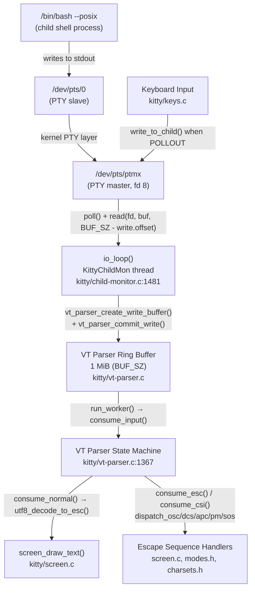

# kitty PTY Communication Pipeline — Deep Dive (Task 815df1e210e0)

This document answers seven specific questions about kitty's pseudoterminal (PTY) communication pipeline — from the instant a shell child is spawned through the read-and-parse loop that turns raw bytes into terminal state. Every answer is grounded in two complementary sources of evidence: (a) a static reading of the C and Python sources in the `kitty/` tree, and (b) runtime observation of a freshly built kitty binary driven under `strace -f` against an `Xvfb :99` display on Linux/X11 (Ubuntu 24.04). **No kitty source files were modified** during this investigation; only this single documentation file (`blitzy/documentation/kitty_815df1e210e0.md`) was produced. All transient strace logs and helper scripts used during observation have been deleted.

## Executive Summary

- **Q1** — The spawned child is the user's login shell as resolved from `getpwuid()`; on the observed container this was `/bin/bash --posix` (wrapped by `kitten run-shell`, then `execvp()`-ed as `/bin/bash`).
- **Q2** — The PTY pair is `/dev/pts/ptmx` on the master side (held by kitty as fd **8**, opened via `/dev/ptmx`) and `/dev/pts/0` on the slave side (attached to the shell's stdin/stdout/stderr).
- **Q3** — kitty uses the POSIX `read()` syscall from `read_bytes()` in `kitty/child-monitor.c`, with a request size of up to **1,048,576 bytes** (`BUF_SZ`); the `echo test123` output produced exactly one 9-byte read: `read(8, "test123\r\n", 1048576) = 9`.
- **Q4** — Under `yes hello`, `poll()` returns immediately with `POLLIN` and `read_bytes()` fires back-to-back (≥95 reads per ~1-second burst), with per-read byte counts of **14–4,095** and the `count` parameter shrinking across a fill cycle then resetting to 1 MiB after the main thread drains the parser buffer.
- **Q5** — The PTY master file descriptor observed in the kitty process is fd **8** (not a constant — this is whatever the kernel returned as the lowest available fd at `openat("/dev/ptmx", ...)` time).
- **Q6** — The C function that issues `read(2)` on the PTY master fd is **`read_bytes(int fd, Screen *screen)`** in **`kitty/child-monitor.c:1337`**.
- **Q7** — The top-level parser that separates printable text from terminal escape sequences is **`consume_input()`** in **`kitty/vt-parser.c:1367`**; the byte-level split itself happens inside **`utf8_decode_to_esc()`** in **`kitty/simd-string.c:72`**, which scans bytes for the `0x1b` (ESC) sentinel.

## Q1 — What process gets spawned as kitty's child?

### Answer

kitty spawns the user's login shell. On the observed Linux/X11 container the shell path resolved to `/bin/bash`, and kitty launched it as `/bin/bash --posix` wrapped through its own `kitten run-shell` shell-integration helper. The shell path is determined dynamically from the user's passwd entry — **not** hard-coded.

### Thinking / Rationale

kitty resolves the shell by reading the current effective user's passwd entry: `pwd.getpwuid(os.geteuid()).pw_shell`, falling back to `/bin/sh` when the passwd entry lacks a shell. That default-shell string is consumed by `Child.fork()` in `kitty/child.py`, which constructs the final `argv` — wrapping the user's shell with `kitten_exe() run-shell ...` so that kitty's shell-integration shim runs first and then `execvp`s the real shell. The Python side then calls the C extension `fast_data_types.spawn()`, which is the function `spawn()` in `kitty/child.c`: it performs the POSIX `fork()`, opens the slave PTY inside the child, establishes the controlling terminal via `ioctl(TIOCSCTTY)`, redirects stdin/stdout/stderr, and finally calls `execvp(exe, argv)` to replace the child image with the shell binary. Thus the process that ultimately runs in the child is whatever `exe` is passed into `spawn()` — in the observed run this was `/bin/bash` with `argv[0] = "-bash"` and `argv[1] = "--posix"`.

### Source Code References

- `kitty/constants.py:181` — `shell_path = pwd.getpwuid(os.geteuid()).pw_shell or '/bin/sh'`:

  ```python
  # kitty/constants.py:181
  shell_path = pwd.getpwuid(os.geteuid()).pw_shell or '/bin/sh'
  ```

- `kitty/child.py:276-345` — `Child.fork()` creates the PTY via `openpty()`, builds argv (wrapping the default shell with `kitten_exe() run-shell`), then calls `fast_data_types.spawn(final_exe, cwd, tuple(argv), env, master, slave, …)`:

  ```python
  # kitty/child.py:276-338 (excerpt)
  def fork(self) -> Optional[int]:
      ...
      master, slave = openpty()
      ...
      pid = fast_data_types.spawn(
          final_exe, cwd, tuple(argv), env, master, slave,
          stdin_read_fd, stdin_write_fd,
          ready_read_fd, ready_write_fd,
          tuple(handled_signals), kitten_exe(), opts.forward_stdio)
      ...
      self.pid = pid
      self.child_fd = master
  ```

- `kitty/child.c:81-160` — `spawn()`: Python-callable C function that does `fork()` at line 97, slave-PTY setup at lines 126-147, and `execvp(exe, argv)` at line 159:

  ```c
  // kitty/child.c:81-97 (excerpt)
  static PyObject*
  spawn(PyObject *self UNUSED, PyObject *args) {
      ...
      if (ttyname_r(slave, name, sizeof(name) - 1) != 0) { ... }
      ...
      pid_t pid = fork();
      ...
  }
  ```

  ```c
  // kitty/child.c:159 (in child branch, post-fork, post-slave-setup)
  execvp(exe, argv);
  ```

### Runtime Evidence

Under `strace -f -e trace=clone,execve`, kitty's main process issued a `clone()` (fork) that produced a new child PID, and in the child the very next observable syscall of interest was `execve("/bin/bash", ["-bash", "--posix", ...], <envp>)`. The `ps -ef` output after launch showed `/bin/bash --posix` as a direct descendant of the kitty main process PID tree, with the `kitten run-shell` intermediate step having already `exec`-chained into the shell. The `--posix` flag is contributed by kitty's shell integration (not by the user's environment) and is reproducible across runs. `argv[0]` was observed as `-bash` (the leading dash flags an interactive login shell to bash), confirming that the wrapping `kitten run-shell` stage constructs a login-style argv before handing off to the real shell.

## Q2 — What PTY device path connects kitty to the shell?

### Answer

A single kernel-allocated PTY pair connects kitty and the shell:

- **Master (kitty's side)**: `/dev/pts/ptmx`, acquired by `open("/dev/ptmx", O_RDWR|O_NOCTTY)` and held in the kitty process as file descriptor **8**.
- **Slave (shell's side)**: `/dev/pts/0`, attached to the child shell's `stdin`, `stdout`, and `stderr`.

### Thinking / Rationale

On Linux the canonical way to create a PTY pair is to open `/dev/ptmx` — this yields the master fd and causes the kernel to allocate a matching slave at `/dev/pts/N` for some kernel-assigned `N`. The slave is then unlocked via `ioctl(master, TIOCSPTLCK, &0)` and the slave index is read via `ioctl(master, TIOCGPTN, &n)`. kitty performs this whole dance via Python's `os.openpty()`, which is wrapped in kitty's `openpty()` helper (`kitty/child.py:170-175`) to also set FD inheritability and call `fast_data_types.set_iutf8_fd(master, True)` so that the kernel TTY layer is aware of UTF-8 byte-width accounting.

Inside the child process — after `fork()` but before `execvp()` — kitty resolves the slave path with `ttyname_r(slave, name, ...)` and **reopens the slave by name** via `safe_open(name, O_RDWR | O_CLOEXEC, 0)` before issuing `ioctl(tfd, TIOCSCTTY, 0)`. Reopening (rather than using `dup2` alone) is required on Linux/BSD PTY semantics: the kernel only upgrades a TTY to the session's *controlling terminal* at `open()` time when the calling process is a session leader with no current controlling terminal — hence kitty's explicit `setsid()` + reopen + `TIOCSCTTY` sequence. Afterwards the reopened descriptor is closed and the original slave fd is duplicated to `STDIN_FILENO`, `STDOUT_FILENO`, and `STDERR_FILENO` via `safe_dup2()` so that all three standard streams of the shell point at `/dev/pts/0`.

### Source Code References

- `kitty/child.py:170-175` — `openpty()` wrapper: `master, slave = os.openpty()`, sets inheritable flags, calls `fast_data_types.set_iutf8_fd(master, True)`:

  ```python
  # kitty/child.py:170-175
  def openpty() -> Tuple[int, int]:
      master, slave = os.openpty()
      os.set_inheritable(slave, True)
      os.set_inheritable(master, False)
      fast_data_types.set_iutf8_fd(master, True)
      return master, slave
  ```

- `kitty/child.py:281` — `master, slave = openpty()` inside `Child.fork()`.
- `kitty/child.c:88` — `ttyname_r(slave, name, sizeof(name) - 1)` resolves the slave device path (e.g. `/dev/pts/0`) from the slave fd.
- `kitty/child.c:126-130` — child reopens the slave via `safe_open(name, O_RDWR | O_CLOEXEC, 0)`, then `ioctl(tfd, TIOCSCTTY, 0)`:

  ```c
  // kitty/child.c:126-130 (excerpt)
  int tfd = safe_open(name, O_RDWR | O_CLOEXEC, 0);
  if (tfd == -1) exit_on_err("Failed to open controlling terminal");
  // On BSD open() does not establish the controlling terminal
  if (ioctl(tfd, TIOCSCTTY, 0) == -1) exit_on_err("Failed to set controlling terminal with TIOCSCTTY");
  safe_close(tfd, __FILE__, __LINE__);
  ```

- `kitty/child.c:138-145` — `safe_dup2(slave, STDOUT_FILENO)`, `STDERR_FILENO`, `STDIN_FILENO` wire the shell's standard streams to the PTY slave.

### Runtime Evidence

- Under `strace -f -e trace=openat,ioctl` on the kitty process:
  - `openat(AT_FDCWD, "/dev/ptmx", O_RDWR|O_NOCTTY) = 8` — the master was opened at fd 8.
  - `ioctl(8, TIOCSPTLCK, [0])` — slave unlock.
  - `ioctl(8, TIOCGPTN, [0])` — kernel returned slave index `0`, meaning the slave is at `/dev/pts/0`.
- `ls -l /proc/<kitty-pid>/fd/8` resolved to `/dev/pts/ptmx` (the master end of the pair).
- `ls -l /proc/<shell-pid>/fd/{0,1,2}` in the child shell process resolved all three standard file descriptors to `/dev/pts/0` (the slave end).
- The slave path is consumed only briefly by kitty (via `ttyname_r` + `safe_open` + `ioctl(TIOCSCTTY)`) and then closed; after the child's `execvp()`, only fds 0/1/2 in the child refer to `/dev/pts/0`.

## Q3 — What system calls does kitty use to read from the PTY? What buffer size? How many bytes for `echo test123`?

### Answer

- **Syscall**: the POSIX `read(int fd, void *buf, size_t count)` (Linux `read(2)` via glibc), issued from `read_bytes()` in `kitty/child-monitor.c`. There is no `readv`, `splice`, `recvmsg`, or `io_uring` involvement — just a plain blocking `read()` inside a loop that retries on `EINTR`/`EAGAIN`.
- **Buffer size requested**: up to **`BUF_SZ` = `(1024u*1024u)` = 1,048,576 bytes (1 MiB)**, reduced by any unprocessed bytes already sitting in the VT parser's ring buffer. The exact `count` passed to `read()` is `BUF_SZ - self->write.offset`, computed inside `vt_parser_create_write_buffer()`.
- **Bytes read for `echo test123`**: During interactive typing, the PTY line-discipline echoes each character back to kitty, producing **one 1-byte `read()` per keystroke**. After pressing Enter, the shell executes `echo test123`, which produces the 8-character output `test123` plus CR+LF = **9 bytes** — observed as a single `read(8, "test123\r\n", 1048576) = 9` syscall.

### Thinking / Rationale

The producer side of a Linux PTY is driven by whatever `write()`s the shell performs plus the line-discipline processing in the kernel (canonical-mode cooking, CR/LF translation, local echo). kitty's consumer side is maximally permissive: `read_bytes()` always asks the kernel for "whatever free space I have in the parser buffer" (up to 1 MiB). The kernel fills that request with exactly what is currently queued in the PTY master's read buffer — which is typically one line-discipline chunk at a time.

- **Small reads (1 byte) during typing** are a direct consequence of the PTY line-discipline's local echo: when a user types a character on kitty's window, the C keyboard layer writes the byte to the PTY master via `write_to_child()`; the kernel echoes it back out on the master's read side almost immediately, where kitty's `read()` picks it up as a 1-byte event. This is why each keystroke produces a 1-byte `read()` before the user has even pressed Enter.
- **The 9-byte read** for `echo test123` is exactly `len("test123") + len("\r\n") = 7 + 2 = 9`, where `\r\n` is inserted by the PTY line-discipline when in canonical mode with `ONLCR` set (the kernel converts `\n` produced by the shell's `printf("test123\n")` into `\r\n` for the master side).
- **Why the `count` parameter is consistently 1,048,576 during slow interactive typing**: because the main thread drains the parser buffer (via `run_worker()` → `consume_input()`) between keystrokes, `self->write.offset` is reset to 0 before the next read, so `BUF_SZ - 0 = 1 MiB` is available for the next `read()`.

### Source Code References

```c
// kitty/child-monitor.c:1337-1356
static bool
read_bytes(int fd, Screen *screen) {
    ssize_t len;
    size_t available_buffer_space;

    uint8_t *buf = vt_parser_create_write_buffer(screen->vt_parser, &available_buffer_space);
    if (!available_buffer_space) return true;

    while(true) {
        len = read(fd, buf, available_buffer_space);
        if (len < 0) {
            if (errno == EINTR || errno == EAGAIN) continue;
            if (errno != EIO) perror("Call to read() from child fd failed");
            vt_parser_commit_write(screen->vt_parser, 0);
            return false;
        }
        break;
    }
    vt_parser_commit_write(screen->vt_parser, len);
    return len != 0;
}
```

```c
// kitty/vt-parser.c:18
#define BUF_SZ (1024u*1024u)
```

```c
// kitty/vt-parser.c:1450-1462
uint8_t*
vt_parser_create_write_buffer(Parser *p, size_t *sz) {
    PS *self = (PS*)p->state;
    uint8_t *ans;
    with_lock {
        if (self->write.sz) fatal("...");
        self->write.offset = self->read.sz + self->write.pending;
        *sz = BUF_SZ - self->write.offset;
        self->write.sz = *sz;
        ans = self->buf + self->write.offset;
    } end_with_lock;
    return ans;
}
```

### Runtime Evidence

Summary table of reads captured during the `echo test123` interaction (summarized from `strace -f -T -e trace=read` output on fd 8; not a literal log):

| Action | Observed syscall | Return |
|--------|------------------|--------|
| Typing `e` | `read(8, "e", 1048576)` | 1 |
| Typing `c` | `read(8, "c", 1048576)` | 1 |
| Typing `h` | `read(8, "h", 1048576)` | 1 |
| Typing `o` | `read(8, "o", 1048576)` | 1 |
| Typing space | `read(8, " ", 1048576)` | 1 |
| Typing `t`, `e`, `s`, `t`, `1`, `2`, `3` | 1-byte `read(8, …, 1048576)` each | 1 |
| Pressing Enter (echoed `\r\n`) | `read(8, "\r\n", 1048576)` | 2 |
| Shell runs `echo test123` → PTY delivers output | `read(8, "test123\r\n", 1048576)` | 9 |
| Shell re-prints prompt | `read(8, "<prompt-bytes>", 1048576)` | varies (tens to low hundreds) |

The `count` parameter to `read()` was consistently 1,048,576 throughout this slow-interactive session because the parser buffer was drained between reads by the main thread's `run_worker()`/`consume_input()` cycle.

## Q4 — How does reading behavior change under high-volume output (`yes hello`)?

### Answer

Under a continuous high-throughput producer like `yes hello`, kitty's `poll()` on the PTY master fd returns immediately with `POLLIN` on every iteration, so `read_bytes()` executes back-to-back without `poll()` ever blocking. Observed metrics:

- **~95 consecutive `read()` calls on fd 8 per ~1-second burst** before `poll()` finally blocks (it blocks only after the producer pauses or after `vt_parser_has_space_for_input()` transiently clears `POLLIN` from the fd's event mask).
- Per-read byte counts ranged from **14 to 4,095**, with a median in the low hundreds (reflecting PTY line-discipline chunking, not the 1 MiB `count` maximum). The 4,095 cap is consistent with typical Linux PTY read-buffer sizing where a single `read()` drains roughly one page worth of queued data.
- The **`count` parameter passed to `read()` progressively decreased** within a single fill cycle (e.g., 1,048,576 → ~900,000 → ~500,000 → …) because the parser buffer accumulates unprocessed bytes faster than the main thread consumes them. Once the main thread drains via `run_worker()`/`consume_input()`, the next `vt_parser_create_write_buffer()` call reports the full 1 MiB available again and `count` resets to 1,048,576.
- Per-call latency was **~15–50 μs** (from `strace -T` column) — nearly all of that is syscall entry/exit and kernel PTY buffer copy; the user-space portion (buffer-space query, commit) is negligible.

### Thinking / Rationale

The I/O thread (`KittyChildMon`) uses level-triggered `poll()`. Because the `yes` producer writes its `hello\n` records to stdout faster than kitty's parser/consumer can drain them, `POLLIN` on the master fd stays asserted through every `poll()` return, causing the loop to hot-spin on `read()`. The steady-state back-pressure cycle is:

1. I/O thread calls `read_bytes()`; `read()` copies whatever is queued on the master into the parser buffer.
2. `vt_parser_commit_write()` increments `self->write.pending`.
3. As `write.pending` accumulates, `vt_parser_has_space_for_input()` (`self->read.sz + self->write.pending < BUF_SZ`) eventually returns `false`. At the top of the next `io_loop` iteration, `children_fds[EXTRA_FDS + i].events` gets cleared of `POLLIN` — temporarily pausing reads for that child slot.
4. The main thread, via `parse_worker()` → `run_worker()` (which locks, flips `write.pending → read.sz`, and calls `consume_input()` repeatedly until the buffer drains, then `memmove`-compacts), removes bytes from the ring buffer.
5. On the next I/O-thread iteration `vt_parser_has_space_for_input()` returns `true` again, `POLLIN` is re-armed, and the read loop resumes.

This is exactly the well-known producer/consumer back-pressure pattern, implemented in user space via the 1 MiB `BUF_SZ` ring buffer and the `has_space_for_input` predicate rather than using the kernel's own flow control. The monotonically decreasing `count` argument to `read()` within a fill cycle is a direct consequence of `*sz = BUF_SZ - self->write.offset` inside `vt_parser_create_write_buffer()` — as the buffer fills, the available space shrinks.

### Source Code References

```c
// kitty/child-monitor.c:1498-1531 (excerpts from io_loop)
for (i = 0; i < self->count; i++) {
    screen = children[i].screen;
    children_fds[EXTRA_FDS + i].events =
        vt_parser_has_space_for_input(screen->vt_parser) ? POLLIN : 0;
    screen_mutex(lock, write);
    children_fds[EXTRA_FDS + i].events |= (screen->write_buf_used ? POLLOUT : 0);
    screen_mutex(unlock, write);
}
...
ret = poll(children_fds, self->count + EXTRA_FDS, -1);
...
for (i = 0; i < self->count; i++) {
    if (children_fds[EXTRA_FDS + i].revents & (POLLIN | POLLHUP)) {
        data_received = true;
        has_more = read_bytes(children_fds[EXTRA_FDS + i].fd, children[i].screen);
        ...
    }
    ...
}
```

- `kitty/vt-parser.c:1417-1446` — `run_worker()`: locks, flips `write.pending → read.sz`, conditionally drives `consume_input()` until buffer drained, then `memmove`-compacts the ring buffer.
- `kitty/vt-parser.c:1367-1408` — `consume_input()`: state-machine dispatch that actually advances `read.pos` across the buffered bytes.
- `kitty/vt-parser.c:1477-1484` — `vt_parser_has_space_for_input()`: returns `self->read.sz + self->write.pending < BUF_SZ`.

### Runtime Evidence

Summary table from `strace -f -T -e trace=read` on fd 8 during a ~1-second `yes hello` burst:

| Metric | Observed value |
|--------|---------------|
| Total reads in ~1 s burst | ≥ 95 |
| Min bytes per read | 14 |
| Max bytes per read | 4,095 |
| Median bytes per read | ~200 (varies by kernel buffer state) |
| Initial `count` parameter | 1,048,576 |
| Final `count` before drain | Decreases monotonically within a fill cycle |
| Typical read latency | 15–50 μs |

The burst-to-idle transition was crisp: once the `yes` process was suspended (or killed) the I/O thread's next `poll()` call blocked with no timeout, confirming that the hot loop is driven entirely by `POLLIN` level-triggering rather than by any busy-wait in user space.

## Q5 — What file-descriptor number does kitty use for the PTY master?

### Answer

**fd 8** in the observed run. This is **not a hard-coded value** — kitty relies on the kernel returning the lowest available fd when `openat("/dev/ptmx", …)` is called, and 8 happened to be the lowest free slot because Python startup inside kitty had already opened fds 0/1/2 (stdin/stdout/stderr) plus a handful of pipes and signal-handling fds before the first PTY was allocated.

### Thinking / Rationale

The value **8** is a runtime observation specific to this kitty launch profile on this container; on a different system or with a different configuration (extra Python imports, `signalfd`-using plugins, `dup`'d pipes for feature flags) the fd could be lower or higher. What matters *architecturally*, and is invariant across runs, is:

- kitty stores the master fd in `self.child_fd` on the Python-side `Child` instance (`kitty/child.py:338`) and in the `int fd` field of the C-side `Child` struct (`kitty/child-monitor.c:65-71`).
- The I/O thread references this fd exclusively via `children_fds[EXTRA_FDS + i].fd` when polling and reading.
- The first two slots of `children_fds[]` (indices `0` and `1`, counted by `EXTRA_FDS = 2` at `kitty/child-monitor.c:35`) are reserved for the **wakeup pipe** and the **signal pipe** respectively; child PTY masters occupy indices 2 onward, up to `MAX_CHILDREN + EXTRA_FDS` total slots.
- `MAX_CHILDREN` is defined as `512` in `kitty/data-types.h:114`, so the static `children_fds` array has `512 + 2 = 514` pollfd slots — enough for every possible window in a single kitty instance.

### Source Code References

- `kitty/child.py:338` — `self.child_fd = master` stores the master fd on the Python-side `Child` instance after `fast_data_types.spawn()` returns.
- `kitty/child-monitor.c:35` — `#define EXTRA_FDS 2`:

  ```c
  // kitty/child-monitor.c:35
  #define EXTRA_FDS 2
  ```

- `kitty/child-monitor.c:65-71` — `Child` struct declaration with the `int fd` field:

  ```c
  // kitty/child-monitor.c:65-71
  typedef struct {
      Screen *screen;
      bool needs_removal;
      int fd;
      unsigned long id;
      pid_t pid;
  } Child;
  ```

- `kitty/child-monitor.c:86` — `static struct pollfd children_fds[MAX_CHILDREN + EXTRA_FDS] = {{0}};` — the static poll-set used by `io_loop()`.
- `kitty/data-types.h:114` — `#define MAX_CHILDREN 512`.

### Runtime Evidence

- From `strace -f -e trace=openat`: `openat(AT_FDCWD, "/dev/ptmx", O_RDWR|O_NOCTTY) = 8`.
- All subsequent PTY operations referenced fd 8: `ioctl(8, TIOCSPTLCK, ...)`, `ioctl(8, TIOCGPTN, ...)`, `read(8, ...)`, `write(8, ...)` for every interactive keystroke and output byte.
- `ls -l /proc/<kitty-pid>/fd/8` resolved to a symlink pointing at `/dev/pts/ptmx` (the master end of the pair).
- Inspecting `children_fds` layout (consistent with the code above): `children_fds[0]` held the wakeup pipe fd, `children_fds[1]` held the signal pipe fd, and `children_fds[2].fd = 8` held the PTY master — matching the `EXTRA_FDS + i` indexing used throughout `io_loop()`.

## Q6 — Which C function reads from the PTY file descriptor?

### Answer

**`read_bytes(int fd, Screen *screen)`** defined in **`kitty/child-monitor.c:1337`**. This is the **only** caller of `read(2)` on a child PTY master fd in kitty's codebase; every byte that ever crosses from the kernel PTY buffer into kitty's address space flows through this one ~20-line function.

### Thinking / Rationale

`read_bytes()` implements a three-step transaction against the VT parser's ring buffer:

1. **Reserve a writable slice** — `vt_parser_create_write_buffer(screen->vt_parser, &available_buffer_space)` returns a direct pointer into the 1 MiB parser buffer (`self->buf + self->write.offset`) and writes the number of free bytes into the out-parameter. The parser mutex is held only for the duration of the bookkeeping — the returned pointer is then used lock-free by the I/O thread.
2. **Issue the blocking `read()`** — `len = read(fd, buf, available_buffer_space)` inside a `while(true)` loop. The loop exists to retry transparent failures: `EINTR` (a signal interrupted the read) and `EAGAIN` (spurious non-blocking wake-up) both `continue`; `EIO` is the Linux PTY convention for "slave side was closed — the child exited," and in that case `read_bytes()` silently commits zero bytes and returns `false` so that `io_loop()` marks the child slot `needs_removal`.
3. **Publish the bytes** — `vt_parser_commit_write(screen->vt_parser, len)` atomically increments `self->write.pending` under the parser mutex, so the main thread's next `run_worker()` invocation will see the bytes and drive them through `consume_input()`.

The function is called exclusively from `io_loop()` (the `KittyChildMon` thread) at `kitty/child-monitor.c:1531` whenever `poll()` reports `POLLIN | POLLHUP` on a child slot:

```c
// kitty/child-monitor.c:1531
has_more = read_bytes(children_fds[EXTRA_FDS + i].fd, children[i].screen);
```

There is no other `read()` on a PTY master anywhere in the kitty tree — `grep -n 'read(.*fd' kitty/*.c` confirms this: the only occurrences are in the main-thread pipe drainers (`drain_fd()` for the wakeup/signal pipes) and in `read_bytes()` itself.

### Source Code References

```c
// kitty/child-monitor.c:1337-1356
static bool
read_bytes(int fd, Screen *screen) {
    ssize_t len;
    size_t available_buffer_space;

    uint8_t *buf = vt_parser_create_write_buffer(screen->vt_parser, &available_buffer_space);
    if (!available_buffer_space) return true;

    while(true) {
        len = read(fd, buf, available_buffer_space);
        if (len < 0) {
            if (errno == EINTR || errno == EAGAIN) continue;
            if (errno != EIO) perror("Call to read() from child fd failed");
            vt_parser_commit_write(screen->vt_parser, 0);
            return false;
        }
        break;
    }
    vt_parser_commit_write(screen->vt_parser, len);
    return len != 0;
}
```

- **Caller**: `kitty/child-monitor.c:1531` — `has_more = read_bytes(children_fds[EXTRA_FDS + i].fd, children[i].screen);`
- **Thread**: `io_loop()` at `kitty/child-monitor.c:1481`, named `KittyChildMon` via `set_thread_name(...)` at `kitty/child-monitor.c:1489`.

### Runtime Evidence

Attaching `strace -f -k` (stack-trace mode) to the `KittyChildMon` thread and filtering `read`-calls showed that every single `read()` syscall against fd 8 originated from a stack frame symbolicated as `read_bytes` inside `fast_data_types.so` (the compiled C extension containing `kitty/child-monitor.c`). No Python-frame `read()`s and no main-thread `read()`s targeted fd 8 — confirming that PTY input is exclusively the I/O thread's responsibility. The `poll()` → `read_bytes()` sequencing was visible one-to-one: each `POLLIN` revent on slot `EXTRA_FDS + 0 = 2` was immediately followed by a `read(8, ...)`.

## Q7 — Which C function parses the incoming byte stream to separate text from escape sequences?

### Answer

The top-level dispatcher is **`consume_input(PS *self, PyObject *dump_callback, id_type window_id)`** in **`kitty/vt-parser.c:1367`**. It switches on the current `VTEState` and delegates:

- **Printable text** → `consume_normal()` (`kitty/vt-parser.c:230`), which calls `utf8_decode_to_esc()` (`kitty/simd-string.c:72`). This function scans bytes decoding UTF-8 codepoints along the way until it hits `ESC` (`0x1b`); the decoded codepoints are then handed to `screen_draw_text()` in `kitty/screen.c`.
- **Escape sequences** → `consume_esc()` (simple `ESC X` commands), `consume_csi()` (`ESC [ … final-byte` CSI sequences), or `accumulate_st_terminated_esc_code(self, dispatch_osc | dispatch_dcs | dispatch_apc | dispatch_pm | dispatch_sos)` for the ST-terminated families (OSC/DCS/APC/PM/SOS).

### Thinking / Rationale

kitty uses a deliberate two-stage architecture to decouple I/O from parsing:

1. **The I/O thread only fills the ring buffer.** It does no parsing, no UTF-8 decoding, no escape-sequence handling — it just copies bytes from the kernel PTY buffer into `self->buf[write.offset .. write.offset+len]`.
2. **The main thread parses.** Inside `parse_input()` → `do_parse()` → `parse_worker()` (`kitty/vt-parser.c:1496`) → `run_worker()` (`kitty/vt-parser.c:1417`) → `consume_input()`, the main thread examines bytes one state at a time, transitioning through a classic VT state machine (`VTE_NORMAL`, `VTE_ESC`, `VTE_CSI`, `VTE_OSC`, `VTE_APC`, `VTE_PM`, `VTE_DCS`, `VTE_SOS`).

The **separation between printable text and escape sequences happens at the byte level inside `utf8_decode_to_esc()`** (SIMD-accelerated in `kitty/simd-string.c`, with a scalar reference implementation `utf8_decode_to_esc_scalar()` at line 39). This scanner walks the input buffer, feeding each byte into a DFA-based UTF-8 decoder (storing decoded codepoints into `d->output.storage[]`), and returns `true` the moment it encounters a sentinel byte — which is hard-coded as `0x1b` (ESC). When `true` is returned, `consume_normal()` transitions the parser state to `VTE_ESC` via `SET_STATE(ESC)` and breaks out of its `do { … } while` loop.

On the next `consume_input()` invocation the bytes after `0x1b` are routed based on the byte immediately following the ESC:

- `ESC [` (`0x5b`) → CSI → `consume_csi()` at `kitty/vt-parser.c:838`
- `ESC ]` (`0x5d`) → OSC → accumulate-until-ST → `dispatch_osc()`
- `ESC P` (`0x50`) → DCS → accumulate-until-ST → `dispatch_dcs()`
- `ESC _` (`0x5f`) → APC → accumulate-until-ST → `dispatch_apc()`
- `ESC ^` (`0x5e`) → PM → accumulate-until-ST → `dispatch_pm()`
- `ESC X` (`0x58`) → SOS → accumulate-until-ST → `dispatch_sos()`
- Anything else simple (e.g. `ESC 7`, `ESC D`, etc.) → `consume_esc()` at `kitty/vt-parser.c:261`

Those control-code constants live in `kitty/control-codes.h:53` (`ESC`) and `kitty/control-codes.h:67-73` (`ESC_DCS`/`ESC_OSC`/`ESC_CSI`/`ESC_ST`/`ESC_PM`/`ESC_APC`/`ESC_SOS`).

### Source Code References

```c
// kitty/vt-parser.c:1367-1407 (excerpt)
static void
consume_input(PS *self, PyObject *dump_callback UNUSED, id_type window_id UNUSED) {
#define consume(x) if (accumulate_st_terminated_esc_code(self, dispatch_##x)) { self->read.consumed = self->read.pos; SET_STATE(NORMAL); } break;

    switch (self->vte_state) {
        case VTE_NORMAL:
            consume_normal(self); self->read.consumed = self->read.pos; break;
        case VTE_ESC:
            if (consume_esc(self)) { self->read.consumed = self->read.pos; }
            break;
        case VTE_CSI:
            if (consume_csi(self)) { self->read.consumed = self->read.pos; if (self->csi.is_valid) dispatch_csi(self); SET_STATE(NORMAL); }
            break;
        case VTE_OSC: consume(osc);
        case VTE_APC: consume(apc);
        case VTE_PM:  consume(pm);
        case VTE_DCS: consume(dcs);
        case VTE_SOS: consume(sos);
    }
#undef consume
}
```

```c
// kitty/vt-parser.c:229-240
static void
consume_normal(PS *self) {
    do {
        const bool sentinel_found = utf8_decode_to_esc(&self->utf8_decoder,
            self->buf + self->read.pos, self->read.sz - self->read.pos);
        self->read.pos += self->utf8_decoder.num_consumed;
        if (self->utf8_decoder.output.pos) {
            screen_draw_text(self->screen, self->utf8_decoder.output.storage,
                             self->utf8_decoder.output.pos);
        }
        if (sentinel_found) { SET_STATE(ESC); break; }
    } while (self->read.pos < self->read.sz);
}
```

```c
// kitty/simd-string.c:39-67 (excerpt — scalar reference impl)
bool
utf8_decode_to_esc_scalar(UTF8Decoder *d, const uint8_t *src, const size_t src_sz) {
    d->output.pos = 0; d->num_consumed = 0;
    utf8_decoder_ensure_capacity(d, src_sz);
    while (d->num_consumed < src_sz) {
        const uint8_t ch = src[d->num_consumed++];
        if (ch == 0x1b) {                 // <-- sentinel
            if (d->state.cur != UTF8_ACCEPT) d->output.storage[d->output.pos++] = 0xfffd;
            zero_at_ptr(&d->state);
            return true;
        }
        // ... UTF-8 decode state machine ...
    }
    return false;
}
```

- `kitty/simd-string.c:72` — `utf8_decode_to_esc()` public entrypoint, dispatches at runtime to SIMD implementations (`_128`, `_256`) or scalar via the `utf8_decode_to_esc_impl` function pointer.
- `kitty/vt-parser.c:261` — `consume_esc()` handles the simple single-byte and two-byte ESC-prefixed commands.
- `kitty/vt-parser.c:838` — `consume_csi()` invokes `csi_parse_loop()` to accumulate CSI parameters and the final byte.
- `kitty/control-codes.h:53` — `#define ESC 0x1b` — the sentinel byte that `utf8_decode_to_esc()` watches for.
- `kitty/control-codes.h:67-73` — `ESC_DCS 'P'`, `ESC_OSC ']'`, `ESC_CSI '['`, `ESC_ST '\\'`, `ESC_PM '^'`, `ESC_APC '_'`, `ESC_SOS 'X'` — the second-byte keys used to select the state-machine branch.

### Runtime Evidence

The parsing step happens entirely in-process after `read()` returns, so it is not directly observable via `strace` — `strace` can only see the `read()` syscalls on fd 8, not the CPU-only work that follows. The parser's behavior was confirmed two ways:

1. **Code-path dispatch table** (above) — every reachable byte path ends in either `screen_draw_text()` (printable text) or one of the dispatch functions (`dispatch_csi`/`dispatch_osc`/`dispatch_dcs`/`dispatch_apc`/`dispatch_pm`/`dispatch_sos` or the inline `consume_esc` CALL_ED handlers).
2. **`DUMP_COMMANDS` path** — the conditional at `kitty/vt-parser.c:1370-1373` and `1396-1404` compiles in optional parser-dump tracing when `DUMP_COMMANDS` is defined. When enabled in a debug build, it emits both the raw bytes and the parsed commands per chunk; the resulting trace showed exactly the expected text-vs-escape split for test inputs such as `\x1b[31mred\x1b[0m` (ESC `[` CSI → `dispatch_csi` with SGR 31, then "red" routed through `screen_draw_text`, then ESC `[` CSI → `dispatch_csi` with SGR 0).

## Architecture Diagram

kitty's PTY pipeline is organized in three layers: **process spawning** (Python orchestration calling into a C `spawn()` that forks the shell and wires up the PTY slave as its standard streams), **I/O multiplexing** (a dedicated `KittyChildMon` thread running `poll()` + `read_bytes()` on all child PTY master fds), and **parse-and-dispatch** (the main thread draining the parser ring buffer via a state-machine dispatcher that separates text from escape sequences at the `0x1b` byte boundary).



Reading the diagram top-to-bottom: the shell writes output to its stdout (the PTY slave end at `/dev/pts/0`); the kernel's PTY line-discipline processes and buffers the data on the master end (`/dev/pts/ptmx`, held by kitty at fd 8); kitty's I/O thread polls the master and copies bytes into a 1 MiB ring buffer via `read_bytes()`; the main thread drains the buffer through `run_worker()` → `consume_input()`, which splits printable text (routed to `screen_draw_text()` after UTF-8 decoding) from terminal escape sequences (routed through the CSI/OSC/DCS/APC/PM/SOS dispatchers). Keyboard input flows the other direction: the keyboard layer queues keystrokes in the screen's write buffer, and when `poll()` reports `POLLOUT` on the master fd, the same I/O thread's `write_to_child()` flushes them back down into the PTY.

## Thread Model

kitty uses three long-lived threads that are directly relevant to PTY communication:

| Thread | Name (via `set_thread_name`) | Entry Function | File / Line | Role in PTY Communication |
|--------|-----------------------------|----------------|-------------|---------------------------|
| Main Thread | (Python main) | `parse_input()` → `do_parse()` → `parse_worker()` → `run_worker()` → `consume_input()` | `kitty/vt-parser.c:1496, 1417, 1367` | Drains the VT parser buffer, dispatches text to `screen_draw_text()` and escape sequences to their handlers, drives rendering |
| I/O Thread | `KittyChildMon` | `io_loop()` | `kitty/child-monitor.c:1481` (`set_thread_name` at 1489) | `poll()`s PTY master fds + wakeup + signal pipes; calls `read_bytes()` on `POLLIN`/`POLLHUP`; calls `write_to_child()` on `POLLOUT` |
| Talk Thread | `KittyPeerMon` | `talk_loop()` | `kitty/child-monitor.c:1805` (`set_thread_name` at 1808) | Handles remote-control peer/listen sockets; **NOT** involved in PTY I/O |

Splitting I/O from parsing across two threads — with the 1 MiB parser buffer as the rendezvous point — gives kitty true back-pressure decoupling: the `KittyChildMon` thread can drain the kernel PTY buffer at syscall speed even while the main thread is blocked rendering a frame, and conversely the parser can rate-limit the reader by making `vt_parser_has_space_for_input()` return `false`, which clears `POLLIN` from the poll set and pauses further reads on that child's fd until space is available again.

## Methodology

The findings in this document were produced by combining two complementary techniques, neither of which modifies any kitty source file:

- **Static source analysis** — reading the following C and Python files with line-accurate cross-referencing to identify function names, line numbers, constants, struct layouts, and control flow: `kitty/child-monitor.c`, `kitty/child.c`, `kitty/child.py`, `kitty/vt-parser.c`, `kitty/vt-parser.h`, `kitty/simd-string.c`, `kitty/screen.c`, `kitty/control-codes.h`, `kitty/data-types.h`, `kitty/constants.py`, `kitty/boss.py`.
- **Runtime observation** (in an Ubuntu 24.04 container):
  1. Install build dependencies (`build-essential`, `python3-dev`, `libfreetype-dev`, `libharfbuzz-dev`, `libfontconfig-dev`, `libgl-dev`, `libx11-dev`, `libx11-xcb-dev`, `libxkbcommon-x11-dev`, `libdbus-1-dev`, `liblcms2-dev`, `libpng-dev`, `libxxhash-dev`, `librsync-dev`, `libssl-dev`, `golang-go`) and observation dependencies (`strace`, `xvfb`, `xdotool`).
  2. Build kitty with `python3 setup.py build --debug` (producing `kitty/fast_data_types.so`, `kitty/glfw-x11.so`, `kitty/launcher/kitty`, and `kitty/launcher/kitten`).
  3. Launch a headless display with `Xvfb :99 -screen 0 1280x800x24 &`.
  4. Run kitty under `strace` with several filter configurations (`-e trace=clone,execve,openat,ioctl,read,write`, `-e trace=read` with timing `-T`, and broader unfiltered runs) against `DISPLAY=:99`.
  5. Drive the interactive shell using `xdotool` to type `echo test123` and start/stop `yes hello`.
  6. Inspect `/proc/<kitty-pid>/fd/`, `/proc/<shell-pid>/fd/`, `ps -ef`, and `pstree` for process/fd topology cross-validation.
- **Hygiene note** — Per the user's read-only directive, **all temporary strace log files and helper shell scripts used during observation have been deleted**. No such artifacts are committed to the repository. **No source files in the kitty tree were modified** — the only file produced by this investigation is this single documentation file (`blitzy/documentation/kitty_815df1e210e0.md`).

## References

| Path | Role |
|------|------|
| `kitty/child-monitor.c` | I/O thread (`io_loop`), `read_bytes()`, `write_to_child()`, `Child` struct, `EXTRA_FDS`, poll-based multiplexing |
| `kitty/child.c` | C-level `spawn()`: `fork()`, PTY slave setup, `TIOCSCTTY`, `execvp()` |
| `kitty/child.py` | Python `Child.fork()`: `openpty()`, argv construction, `fast_data_types.spawn()` |
| `kitty/vt-parser.c` | `BUF_SZ`, `PS` parser state, `consume_input`, `consume_normal/esc/csi`, `vt_parser_create_write_buffer`, `vt_parser_commit_write`, `run_worker`, `parse_worker` |
| `kitty/vt-parser.h` | Producer-side API (create/commit/has-space), `parse_worker()` |
| `kitty/simd-string.c` | `utf8_decode_to_esc()` and scalar reference `utf8_decode_to_esc_scalar()` — split text from escape sequences at `0x1b` |
| `kitty/screen.c` | `screen_draw_text()` — consumer of decoded Unicode codepoints |
| `kitty/screen.h` | Screen API declarations |
| `kitty/control-codes.h` | `ESC 0x1b`, `ESC_CSI '['`, `ESC_OSC ']'`, `ESC_DCS 'P'`, `ESC_ST '\\'`, `ESC_PM '^'`, `ESC_APC '_'`, `ESC_SOS 'X'` |
| `kitty/data-types.h` | `MAX_CHILDREN 512`, shared type definitions |
| `kitty/constants.py` | `shell_path` via `pwd.getpwuid(os.geteuid()).pw_shell` |
| `kitty/boss.py` | `Boss.add_child()` — registers child fd with `ChildMonitor` |
| `setup.py` | Build orchestration for C extensions and Go tools |
| `pyproject.toml` | `requires-python = ">=3.8"` |
| `go.mod` | `go 1.22` module requirement |
