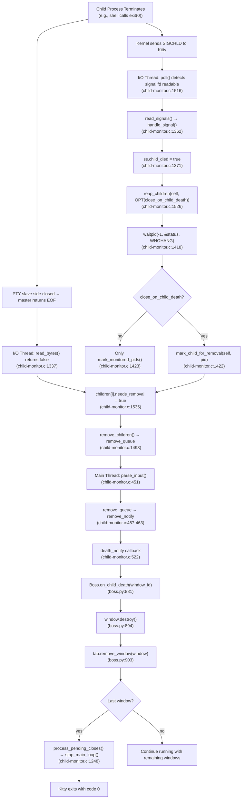
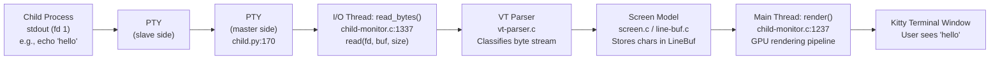

# Kitty Terminal Emulator: Child Process Lifecycle — Complete Technical Q&A

## Introduction

This document provides a comprehensive technical analysis of the complete lifecycle of a child process in the Kitty terminal emulator. It traces what happens from the moment a simple program (e.g., `echo "hello"`) runs inside a Kitty terminal window, prints its output, and exits with status 0 — through to the point where Kitty itself detects, reports, and displays information about that termination.

The analysis spans multiple layers of the Kitty architecture:

- **C native code:** `kitty/child-monitor.c` (child process tracking, signal handling, PTY I/O), `kitty/screen.c` (screen model and escape sequence parsing)
- **Python orchestration:** `kitty/boss.py` (application controller), `kitty/window.py` (window lifecycle and notification), `kitty/main.py` (application entry point and exit code), `kitty/child.py` (child process spawning and PTY allocation)
- **Go tooling:** `tools/tui/hold.go` (hold-mode behavior after command completion), `tools/cmd/run_shell/main.go` (run-shell kitten entry point)
- **Shell integration scripts:** `shell-integration/bash/kitty.bash` (bash prompt hooks emitting OSC 133 escape sequences)

### Two Distinct Pathways

A critical insight that underpins this entire document is that there are **two distinct pathways** through which Kitty learns about and reacts to child process completion:

1. **Pathway A — Direct Child Death (SIGCHLD / PTY EOF):** When the child process (typically the shell itself) exits entirely, Kitty detects this through the `SIGCHLD` signal and/or PTY end-of-file. This leads to the **window being closed** and potentially Kitty itself exiting.

2. **Pathway B — Shell Integration (OSC 133;D):** When an individual command finishes inside a *still-running* shell, the shell reports the command's exit status via an OSC 133;D escape sequence embedded in the prompt. This can trigger a **desktop notification** but does **not** close the window — the shell remains alive and ready for the next command.

Both pathways are documented in detail in the sections that follow.

---

## 1. Complete Child-Process Exit Flow

### Overview

When a child process runs and terminates inside a Kitty terminal window, two independent mechanisms may fire:

- **Pathway A** handles the case where the child process (usually the shell) dies entirely, leading to window closure.
- **Pathway B** handles per-command exit status reporting via shell integration while the shell remains alive.

### Pathway A — Direct Child Death (SIGCHLD / PTY EOF)

This is the chain of events when the child process (e.g., the user's shell) terminates:

#### Step 1: Child Process Terminates

The child process (e.g., bash) calls `exit(0)`. The kernel sends `SIGCHLD` to the parent process (Kitty).

#### Step 2: I/O Thread Polls Signal File Descriptor

The I/O thread, running `io_loop()` at `kitty/child-monitor.c:1480`, is named `"KittyChildMon"` (line 1489). It continuously polls a set of file descriptors including `children_fds[1]`, which is the signal file descriptor.

```c
// Source: kitty/child-monitor.c:1480-1489
static void*
io_loop(void *data) {
    // The I/O thread loop
    ...
    ChildMonitor *self = (ChildMonitor*)data;
    set_thread_name("KittyChildMon");
```

#### Step 3: Signal File Descriptor Becomes Readable

When `SIGCHLD` is delivered, the signal fd becomes readable. At lines 1516–1519, the I/O thread detects this:

```c
// Source: kitty/child-monitor.c:1516-1519
if (children_fds[1].revents && POLLIN) {
    SignalSet ss = {0};
    data_received = true;
    read_signals(children_fds[1].fd, handle_signal, &ss);
```

#### Step 4: `handle_signal()` Sets `child_died` Flag

The `handle_signal()` function at `kitty/child-monitor.c:1362` receives the signal info. On `SIGCHLD` (case at line 1370), it sets `ss->child_died = true` (line 1371):

```c
// Source: kitty/child-monitor.c:1362-1383
static bool
handle_signal(const siginfo_t *siginfo, void *data) {
    SignalSet *ss = data;
    switch(siginfo->si_signo) {
        case SIGCHLD:
            ss->child_died = true;
            break;
        ...
    }
    return true;
}
```

The `SignalSet` struct at line 1359 tracks three boolean flags: `kill_signal`, `child_died`, and `reload_config`.

#### Step 5: `reap_children()` Is Called

After processing signals, at line 1526:

```c
// Source: kitty/child-monitor.c:1526
if (ss.child_died) reap_children(self, OPT(close_on_child_death));
```

#### Step 6: `reap_children()` Calls `waitpid()`

The `reap_children()` function at `kitty/child-monitor.c:1412` loops calling `waitpid(-1, &status, WNOHANG)` at line 1418 to collect **all** dead children in a non-blocking manner:

```c
// Source: kitty/child-monitor.c:1412-1426
static void
reap_children(ChildMonitor *self, bool enable_close_on_child_death) {
    int status;
    pid_t pid;
    (void)self;
    while(true) {
        pid = waitpid(-1, &status, WNOHANG);
        if (pid == -1) {
            if (errno != EINTR) break;
        } else if (pid > 0) {
            if (enable_close_on_child_death) mark_child_for_removal(self, pid);
            mark_monitored_pids(pid, status);
        } else break;
    }
}
```

- If `enable_close_on_child_death` is `true`, calls `mark_child_for_removal(self, pid)` at line 1422 to immediately mark the child's window for closure.
- Always calls `mark_monitored_pids(pid, status)` at line 1423 to record exit status for background-monitored PIDs.

#### Step 7: PTY EOF Detection (Concurrent/Alternative Trigger)

Concurrently, when the child process exits, the slave side of the PTY is closed. The master side returns EOF on the next read. The `read_bytes()` function at `kitty/child-monitor.c:1337` detects this:

```c
// Source: kitty/child-monitor.c:1337-1356
read_bytes(int fd, Screen *screen) {
    ...
    len = read(fd, buf, available_buffer_space);
    ...
    vt_parser_commit_write(screen->vt_parser, len);
    return len != 0;  // returns false on EOF
}
```

When `read_bytes()` returns `false`, the I/O loop at lines 1531–1536 marks the child for removal:

```c
// Source: kitty/child-monitor.c:1531-1536
has_more = read_bytes(children_fds[EXTRA_FDS + i].fd, children[i].screen);
if (!has_more) {
    // child is dead
    children_mutex(lock);
    children[i].needs_removal = true;
    children_mutex(unlock);
}
```

> **Rationale:** The PTY EOF path is the **primary** removal trigger when `close_on_child_death` is `no` (the default). The window stays open as long as any process holds the PTY file descriptor open. Only when all processes using the PTY close their end does EOF occur.

#### Step 8: I/O Thread Moves Child to `remove_queue`

The `remove_children()` function (called at line 1493 in `io_loop`) moves children with `needs_removal = true` from the active `children[]` array into the `remove_queue[]`.

#### Step 9: Main Thread's `parse_input()` Invokes `death_notify`

The main thread's `parse_input()` at `kitty/child-monitor.c:451` drains `remove_queue` into `remove_notify` (lines 457–463), then at line 522 invokes the `death_notify` Python callback:

```c
// Source: kitty/child-monitor.c:517-526
while(remove_count) {
    remove_count--;
    if (remove_notify[remove_count].screen) do_parse(self, remove_notify[remove_count].screen, now, true);
    PyObject *t = PyObject_CallFunction(self->death_notify, "k", remove_notify[remove_count].id);
    if (t == NULL) PyErr_Print();
    else Py_DECREF(t);
    FREE_CHILD(remove_notify[remove_count]);
}
```

This calls `Boss.on_child_death(window_id)` in Python.

#### Step 10: `Boss.on_child_death()` Destroys the Window

`Boss.on_child_death(window_id)` at `kitty/boss.py:881`:

```python
# Source: kitty/boss.py:881-904
def on_child_death(self, window_id: int) -> None:
    prev_active_window = self.active_window
    window = self.window_id_map.pop(window_id, None)
    if window is None:
        return
    with self.suppress_focus_change_events():
        for close_action in window.actions_on_close:
            ...
        os_window_id = window.os_window_id
        window.destroy()              # line 894
        ...
        if tab is not None:
            tab.remove_window(window)  # line 903
            self._cleanup_tab_after_window_removal(tab)  # line 904
```

The window is popped from `window_id_map` (line 883), `window.destroy()` is called (line 894), and the window is removed from its tab with cleanup (lines 903–904).

#### Step 11: If Last Window — Stop Main Loop

In `process_global_state()` at `kitty/child-monitor.c:1224`, after `parse_input()` returns, pending closes are processed at line 1246. If the quit condition is met, `stop_main_loop()` is called at line 1248:

```c
// Source: kitty/child-monitor.c:1246-1248
if (global_state.has_pending_closes) should_quit = process_pending_closes(self);
if (should_quit) {
    stop_main_loop();
```

### The `close_on_child_death` Configuration Option

This option materially affects the observable behavior:

| Setting | Default | Behavior |
|---------|---------|----------|
| `close_on_child_death no` | **Yes (default)** | Window stays open as long as *any* process still holds the PTY fd open. The primary removal trigger is **PTY EOF**, not SIGCHLD. Backgrounded/disowned processes keep the window alive. |
| `close_on_child_death yes` | No | `mark_child_for_removal()` is called immediately upon SIGCHLD via `reap_children()`, causing the window to close even if background processes remain attached to the terminal. |

> **Source:** `kitty/options/definition.py:2920` — `opt('close_on_child_death', 'no', ...)`

### Pathway B — Shell Integration (OSC 133;D)

When shell integration is active, individual commands that finish inside a running shell report their exit status via the OSC 133;D escape sequence. This pathway is covered in detail in **Section 8**. The key distinction is:

- The **shell remains alive** — only the individual command has finished.
- The window is **not closed** — only an optional desktop notification may be generated.
- The exit status is communicated via an **escape sequence in the prompt**, not via SIGCHLD.

### Child Exit Flow Diagram



---

## 2. Kitty's Own Exit Code

**Direct Answer:** Kitty exits with code **0** on clean shutdown (when all windows close normally after child processes exit with status 0).

### Rationale

The Kitty application's exit code is determined by the `main()` function in `kitty/main.py:524`:

```python
# Source: kitty/main.py:524-531
def main() -> None:
    try:
        _main()
    except Exception:
        import traceback
        tb = traceback.format_exc()
        log_error(tb)
        raise SystemExit(1)
```

The flow works as follows:

1. `main()` calls `_main()` inside a try/except block.
2. `_main()` calls `_run_app()` which creates the `Boss` object and starts the main event loop at `kitty/main.py:234`:
   ```python
   # Source: kitty/main.py:233-236
   try:
       boss.child_monitor.main_loop()
   finally:
       boss.destroy()
   ```
3. The `main_loop()` runs until `stop_main_loop()` is called (from `process_global_state()` at `kitty/child-monitor.c:1248` when the last window closes).
4. `boss.destroy()` is called in the `finally` block (line 236) for cleanup.
5. `_main()` returns normally → `main()` try block succeeds → Python exits with code 0.
6. **Only** if an unhandled exception occurs does `raise SystemExit(1)` execute at line 531, causing exit code 1.

> **Key insight:** Kitty does **not** propagate the child process's exit code. A child exiting with status 0 causes Kitty to exit with code 0, but a child exiting with status 1 would **also** cause Kitty to exit with code 0 (assuming no exceptions occur). The only thing that makes Kitty exit with code 1 is an unhandled Python exception during the application lifecycle.

---

## 3. User-Visible Completion Message

There are **two distinct messages** a user may see when a program completes, depending on the execution path:

### Message A — Shell Integration Desktop Notification (OSC 133;D Path)

When shell integration is active and a command finishes, the `handle_cmd_end()` function in `kitty/window.py:1408` can generate a desktop notification.

**The exact message format** (at line 1429):

```python
# Source: kitty/window.py:1427-1430
cmd.title = 'kitty'
s = self.last_cmd_cmdline.replace('\\\n', ' ')
cmd.body = f'Command {s} finished with status: {exit_status}.\nClick to focus.'
cmd.actions = 'focus'
```

**Example:** For a command `echo "hello"` that exits with status 0, the notification body would be:
```
Command echo "hello" finished with status: 0.
Click to focus.
```

**Important conditions for this notification to fire:**

1. The `notify_on_cmd_finish` option must NOT be set to `never` (default is `never` — see `kitty/options/definition.py:3190`).
2. The command duration must be >= the configured threshold (default 5 seconds).
3. The window focus state must match the configured `when` condition (`unfocused`, `invisible`, or `always`).

**Three notification action modes** (lines 1432–1449):

| Action | Behavior | Source |
|--------|----------|--------|
| `notify` | Sends a standard desktop notification | `kitty/window.py:1432-1433` |
| `bell` | Rings the terminal bell in the window | `kitty/window.py:1434-1442` |
| `command` | Runs a custom command (with `%c` for cmdline, `%s` for exit status) | `kitty/window.py:1443-1449` |

### Message B — Hold Mode Message

When the `hold` flag is set on a `Child` object (checked at `kitty/child.py:329`), the command is wrapped via `cmdline_for_hold()` at `kitty/utils.py:1192`:

```python
# Source: kitty/utils.py:1192-1202
def cmdline_for_hold(cmd: Sequence[str] = (), opts: Optional['Options'] = None) -> List[str]:
    ...
    ksi = ' '.join(opts.shell_integration)
    import shlex
    shell = shlex.join(resolved_shell(opts))
    return [kitten_exe(), 'run-shell', f'--shell={shell}', f'--shell-integration={ksi}', '--env=KITTY_HOLD=1'] + list(cmd)
```

This wraps the command with the `kitten run-shell --env=KITTY_HOLD=1` mechanism. The `run-shell` kitten entry point at `tools/cmd/run_shell/main.go:26` first runs the command via `tui.RunCommandRestoringTerminalToSaneStateAfter(args)` (line 28), then proceeds to start a shell with `tui.RunShell(...)` (line 58).

After the program finishes, `HoldTillEnter()` in `tools/tui/hold.go:16` displays a green bold message:

```go
// Source: tools/tui/hold.go:26
lp.QueueWriteString("\x1b[1;32mPress Enter or Esc to exit\x1b[m")
```

The user sees: **Press Enter or Esc to exit** (displayed in green bold text).

The user can press Enter, Esc, Ctrl+C, or Ctrl+D to dismiss (line 35). After dismissal, `ExecAndHoldTillEnter()` at `tools/tui/hold.go:44` exits with the command's original exit code (lines 65–71).

### Configuration Dependencies

| Option | Default | Source | Effect |
|--------|---------|--------|--------|
| `close_on_child_death` | `no` | `kitty/options/definition.py:2920` | When `yes`, window closes immediately when child (shell) dies, even if background processes remain |
| `notify_on_cmd_finish` | `never` | `kitty/options/definition.py:3190` | Controls desktop notification for long-running commands. Values: `never`, `unfocused`, `invisible`, `always`. Default duration threshold: 5 seconds |

---

## 4. Child-Process Tracking Subsystem

**Direct Answer:** The **Child Monitor** implemented in `kitty/child-monitor.c` is responsible for tracking child processes.

### Three-Thread Architecture

The Child Monitor operates with three threads:

#### I/O Thread

- **Entry point:** `io_loop()` at `kitty/child-monitor.c:1480`
- **Thread name:** `"KittyChildMon"` (set at line 1489)
- **Responsibilities:**
  - Polls child PTY file descriptors for readable data via `poll()` (line 1512)
  - Reads child output via `read_bytes()` (line 1531)
  - Reads signals via the signal file descriptor `children_fds[1]` (line 1519)
  - Calls `reap_children()` on `SIGCHLD` (line 1526)
  - Detects PTY EOF and sets `needs_removal = true` (line 1535)
  - Manages the `remove_queue` via `remove_children()` (line 1493)
  - Manages the `add_queue` via `add_children()` (line 1494)

#### Main Thread

- **Entry point:** `process_global_state()` at `kitty/child-monitor.c:1224`
- **Key function:** `parse_input()` at `kitty/child-monitor.c:451`
- **Responsibilities:**
  - Drains `remove_queue` into `remove_notify` (lines 457–463)
  - Invokes `death_notify` callback for dead children (line 522)
  - Calls `report_reaped_pids()` for background-monitored processes (line 1244 / function at line 950)
  - Handles rendering via `render(now, input_read)` (line 1237)
  - Processes pending closes and may call `stop_main_loop()` (lines 1246–1248)

#### Talk Thread

- **Referenced via:** `talk_lock` mutex at `kitty/child-monitor.c:87`
- **Message handling:** In `parse_input()` at lines 487–514
- **Responsibilities:** Handles peer messages and remote control communication

### Thread Synchronization

- **`children_lock` mutex** (line 87): Accessed via `children_mutex(lock)` / `children_mutex(unlock)` macros. Protects the `children[]`, `add_queue[]`, `remove_queue[]` arrays and `monitored_pids[]` / `reaped_pids[]` arrays.
- **`talk_lock` mutex** (line 87): Accessed via `talk_mutex(lock)` / `talk_mutex(unlock)`. Protects the messages buffer.

### Key Data Structures

```c
// Source: kitty/child-monitor.c:82-84
static Child children[MAX_CHILDREN] = {{0}};
static Child scratch[MAX_CHILDREN] = {{0}};
static Child add_queue[MAX_CHILDREN] = {{0}}, remove_queue[MAX_CHILDREN] = {{0}}, remove_notify[MAX_CHILDREN] = {{0}};
```

```c
// Source: kitty/child-monitor.c:91-94
typedef struct {
    pid_t pid;
    int status;
} ReapedPID;
```

- `children[]`: Active child processes being monitored
- `add_queue[]`: Newly created children waiting to be added to the active set
- `remove_queue[]`: Children marked for removal, pending main thread notification
- `remove_notify[]`: Main thread's copy of removed children for death notification
- `ReapedPID`: Stores PID and exit status for background-monitored processes

---

## 5. The Message-Generating Function

**Direct Answer:** `handle_cmd_end()` in `kitty/window.py:1408` is the function that turns the child's exit status into the user-facing notification message.

### Function Signature

```python
# Source: kitty/window.py:1408
def handle_cmd_end(self, exit_status: str = '') -> None:
```

### Complete Function Flow

1. **Early return check** (lines 1409–1410): Returns immediately if `self.last_cmd_output_start_time == 0.` — this means no command was being tracked.

2. **Parse exit status** (lines 1412–1415): Converts the exit status string to an integer and stores it in `self.last_cmd_exit_status`:
   ```python
   # Source: kitty/window.py:1412-1415
   try:
       self.last_cmd_exit_status = int(exit_status)
   except Exception:
       self.last_cmd_exit_status = 0
   ```

3. **Calculate duration** (lines 1416–1417): Computes how long the command ran:
   ```python
   end_time = monotonic()
   last_cmd_output_duration = end_time - self.last_cmd_output_start_time
   ```

4. **Notify watchers** (lines 1419–1420): Calls registered watchers with the `on_cmd_startstop` event:
   ```python
   self.call_watchers(self.watchers.on_cmd_startstop, {
       "is_start": False, "time": end_time, 'cmdline': self.last_cmd_cmdline, 'exit_status': self.last_cmd_exit_status})
   ```

5. **Read notification config** (line 1423): Gets the `notify_on_cmd_finish` option which provides `when`, `duration`, `action`, and `notify_cmdline`:
   ```python
   when, duration, action, notify_cmdline = opts.notify_on_cmd_finish
   ```

6. **Assemble notification** (lines 1425–1451): If the duration threshold is met AND `when != 'never'`:
   ```python
   # Source: kitty/window.py:1425-1430
   if last_cmd_output_duration >= duration and when != 'never':
       cmd = NotificationCommand()
       cmd.title = 'kitty'
       s = self.last_cmd_cmdline.replace('\\\n', ' ')
       cmd.body = f'Command {s} finished with status: {exit_status}.\nClick to focus.'
       cmd.actions = 'focus'
   ```

### Dispatch Function: `cmd_output_marking()`

The `cmd_output_marking()` function at `kitty/window.py:1453` is the dispatch function that routes OSC 133 markers to the appropriate handler:

```python
# Source: kitty/window.py:1453-1461
def cmd_output_marking(self, is_start: Optional[bool], cmdline: str = '') -> None:
    if is_start:
        start_time = monotonic()
        self.last_cmd_output_start_time = start_time
        cmdline = decode_cmdline(cmdline) if cmdline else ''
        self.last_cmd_cmdline = cmdline
        self.call_watchers(self.watchers.on_cmd_startstop, {"is_start": True, "time": start_time, 'cmdline': cmdline, 'exit_status': 0})
    else:
        self.handle_cmd_end(cmdline)
```

When `is_start` is `None` (from OSC 133;D, where `Py_None` is passed by `screen.c`), it falls through to the `else` branch and calls `self.handle_cmd_end(cmdline)` at line 1461. Note that in this context, `cmdline` is actually the **exit status string** (e.g., `"0"`), not a command line.

### Instance Attributes

- `last_cmd_exit_status: int` — Declared at `kitty/window.py:244`, initialized to `0` at line 572
- `last_cmd_output_start_time: float` — Initialized to `0.` at line 569
- `last_cmd_cmdline: str` — Initialized to `''` at line 571

---

## 6. OS-Level Signal for Child Termination

**Direct Answer:** Kitty listens for `SIGCHLD` — the POSIX signal delivered by the kernel when a child process changes state (exits, stops, or continues).

### Signal Handler: `handle_signal()`

The signal handler is `handle_signal()` at `kitty/child-monitor.c:1362`:

```c
// Source: kitty/child-monitor.c:1359-1383
typedef struct { bool kill_signal, child_died, reload_config; } SignalSet;

static bool
handle_signal(const siginfo_t *siginfo, void *data) {
    SignalSet *ss = data;
    switch(siginfo->si_signo) {
        case SIGINT:
        case SIGTERM:
        case SIGHUP:
            ss->kill_signal = true;
            break;
        case SIGCHLD:
            ss->child_died = true;  // line 1371
            break;
        case SIGUSR1:
            ss->reload_config = true;
            break;
        case SIGUSR2:
            log_error("Received SIGUSR2: %d\n", siginfo->si_value.sival_int);
            break;
        default:
            break;
    }
    return true;
}
```

### Signal Delivery Mechanism

Signals are **not** delivered via a traditional async signal handler. Instead, they are delivered to the I/O thread via a **signal file descriptor** (`children_fds[1]`). The I/O thread polls this fd as part of its main `poll()` call.

When the signal fd becomes readable (line 1516), the I/O thread calls `read_signals()` which invokes `handle_signal()` for each pending signal (line 1519):

```c
// Source: kitty/child-monitor.c:1516-1519
if (children_fds[1].revents && POLLIN) {
    SignalSet ss = {0};
    data_received = true;
    read_signals(children_fds[1].fd, handle_signal, &ss);
```

After all signals are processed, if `child_died` was set, `reap_children()` is called (line 1526):

```c
// Source: kitty/child-monitor.c:1526
if (ss.child_died) reap_children(self, OPT(close_on_child_death));
```

### Complete Signal Handling Table

| Signal | Action | Source |
|--------|--------|--------|
| `SIGINT`, `SIGTERM`, `SIGHUP` | `ss->kill_signal = true` → triggers `quit_request` | `kitty/child-monitor.c:1365-1368` |
| `SIGCHLD` | `ss->child_died = true` → triggers `reap_children()` | `kitty/child-monitor.c:1370-1371` |
| `SIGUSR1` | `ss->reload_config = true` → triggers config reload | `kitty/child-monitor.c:1373-1374` |
| `SIGUSR2` | Logs the signal value | `kitty/child-monitor.c:1376-1378` |

> **Rationale:** Using a signal file descriptor instead of a traditional signal handler avoids the many pitfalls of async-signal-safety. The signal is converted to a synchronous event that can be safely processed in the I/O thread's event loop alongside PTY data and other I/O operations.

---

## 7. System Call for Exit Status Retrieval

**Direct Answer:** Kitty calls `waitpid(-1, &status, WNOHANG)` inside the `reap_children()` function at `kitty/child-monitor.c:1418`.

### System Call Arguments

| Argument | Value | Meaning |
|----------|-------|---------|
| `pid` | `-1` | Wait for **any** child process |
| `&status` | Output parameter | Receives the exit status (encoded per `wait(2)` conventions) |
| `WNOHANG` | Flag | **Non-blocking** — return immediately if no child has exited |

### Loop Structure

The `reap_children()` function at `kitty/child-monitor.c:1412` loops to collect **all** dead children in a single pass:

```c
// Source: kitty/child-monitor.c:1412-1426
static void
reap_children(ChildMonitor *self, bool enable_close_on_child_death) {
    int status;
    pid_t pid;
    (void)self;
    while(true) {
        pid = waitpid(-1, &status, WNOHANG);
        if (pid == -1) {
            if (errno != EINTR) break;  // error (e.g., ECHILD) — no more children
        } else if (pid > 0) {
            if (enable_close_on_child_death) mark_child_for_removal(self, pid);
            mark_monitored_pids(pid, status);
        } else break;  // pid == 0 — no more dead children
    }
}
```

The loop handles three cases:

1. **`pid == -1` with `errno != EINTR`** (lines 1419–1420): An error occurred (typically `ECHILD` meaning no child processes exist). Break out of the loop.
2. **`pid > 0`** (lines 1421–1423): A child with this PID has exited. Process it:
   - If `enable_close_on_child_death` is true: call `mark_child_for_removal(self, pid)` at line 1422 to immediately mark the window for closure.
   - Always: call `mark_monitored_pids(pid, status)` at line 1423 to record the exit status for any background-monitored PID.
3. **`pid == 0`** (line 1424): No more dead children waiting to be reaped. Break.

### Exit Status Storage

For background-monitored PIDs, the exit status is stored in the `ReapedPID` struct via `mark_monitored_pids()` at `kitty/child-monitor.c:1398`:

```c
// Source: kitty/child-monitor.c:1398-1409
static void
mark_monitored_pids(pid_t pid, int status) {
    children_mutex(lock);
    for (ssize_t i = monitored_pids_count - 1; i >= 0; i--) {
        if (pid == monitored_pids[i]) {
            if (reaped_pids_count < arraysz(reaped_pids)) {
                reaped_pids[reaped_pids_count].status = status;  // line 1403
                reaped_pids[reaped_pids_count++].pid = pid;      // line 1404
            }
            remove_i_from_array(monitored_pids, (size_t)i, monitored_pids_count);
        }
    }
    children_mutex(unlock);
}
```

These reaped PIDs are later reported to the Boss via `report_reaped_pids()` at `kitty/child-monitor.c:950`, which calls `Boss.on_monitored_pid_death(pid, exit_status)` at `kitty/boss.py:2725`.

### `mark_child_for_removal()`

For foreground child windows (when `close_on_child_death` is enabled), `mark_child_for_removal()` at `kitty/child-monitor.c:1386` sets `needs_removal = true`:

```c
// Source: kitty/child-monitor.c:1386-1395
static void
mark_child_for_removal(ChildMonitor *self, pid_t pid) {
    children_mutex(lock);
    for (size_t i = 0; i < self->count; i++) {
        if (children[i].pid == pid) {
            children[i].needs_removal = true;
            break;
        }
    }
    children_mutex(unlock);
}
```

---

## 8. Exit Status Transport: Shell to Kitty via OSC 133

**Direct Answer:** The shell reports individual command exit statuses to Kitty using the **OSC 133;D escape sequence** protocol, embedded in the shell prompt. Kitty parses this via `shell_prompt_marking()` in `kitty/screen.c`.

### Step-by-Step Trace

#### Step 1: Bash PS1 Injection

In `shell-integration/bash/kitty.bash:239`, the shell integration script injects OSC 133 markers into the bash prompt:

```bash
# Source: shell-integration/bash/kitty.bash:239
_ksi_prompt[ps1]+="\[\e]133;D;\$?\a\e]133;A\a\]"
```

This adds two escape sequences to the beginning of the PS1 prompt:

- `\e]133;D;$?\a` — **OSC 133 type D** (command done) with `$?` as the exit status parameter. `$?` is expanded by bash at prompt display time to the actual exit status of the last command.
- `\e]133;A\a` — **OSC 133 type A** (prompt start) marking the beginning of the new prompt.

**Example:** After `echo "hello"` exits with status 0, when bash displays the next prompt, it emits:
```
ESC]133;D;0BEL ESC]133;ABEL
```
(where `ESC` is `\x1b` and `BEL` is `\x07`)

> **Rationale:** By embedding the exit status in the prompt, the shell reports command completion on every prompt display — even for commands that run so fast they complete before Kitty processes any output. The `$?` variable is the standard POSIX mechanism for accessing the last command's exit status.

#### Step 2: VT Parser Routes the Escape Sequence

The escape sequence bytes flow from the PTY through the VT parser in `kitty/vt-parser.c`. The VT parser classifies the byte sequence as an OSC (Operating System Command — sequences starting with `ESC]`) and dispatches it to the screen model for handling.

#### Step 3: `shell_prompt_marking()` Parses OSC 133

The `shell_prompt_marking()` function at `kitty/screen.c:2328` receives the OSC 133 buffer and switches on the marker type:

```c
// Source: kitty/screen.c:2328-2356
void
shell_prompt_marking(Screen *self, char *buf) {
    if (self->cursor->y < self->lines) {
        char ch = buf[0];
        switch (ch) {
            case 'A': {
                // Prompt start
                ...
                CALLBACK("cmd_output_marking", "O", Py_False);
            } break;
            case 'C': {
                // Command output start (with cmdline)
                ...
                CALLBACK("cmd_output_marking", "OO", Py_True, c);
            } break;
            case 'D': {
                // Command done (with exit status)
                const char *exit_status = buf[1] == ';' ? buf + 2 : "";  // line 2351
                CALLBACK("cmd_output_marking", "Os", Py_None, exit_status);  // line 2352
            } break;
        }
    }
}
```

For the `'D'` case (line 2350):
- Extracts exit status: `buf[1] == ';' ? buf + 2 : ""` — if a semicolon follows the `D`, everything after it is the exit status string (line 2351).
- Calls the Python callback: `CALLBACK("cmd_output_marking", "Os", Py_None, exit_status)` (line 2352).
- `Py_None` is passed as the `is_start` parameter — signaling that this is neither a start nor an end, but a "command done" marker.

#### Step 4: `cmd_output_marking()` Dispatches to `handle_cmd_end()`

The Python method `cmd_output_marking()` at `kitty/window.py:1453` receives `is_start=None` and `cmdline=exit_status_string`:

```python
# Source: kitty/window.py:1453-1461
def cmd_output_marking(self, is_start: Optional[bool], cmdline: str = '') -> None:
    if is_start:
        ...  # command output start
    else:
        self.handle_cmd_end(cmdline)  # line 1461
```

Since `is_start` is `None` (which is falsy), it falls through to the `else` branch and calls `self.handle_cmd_end(cmdline)` at line 1461. Here, `cmdline` is actually the exit status string (e.g., `"0"`).

#### Step 5: `handle_cmd_end()` Processes the Exit Status

`handle_cmd_end()` at `kitty/window.py:1408` processes the exit status, stores it, and optionally generates a desktop notification (as documented in detail in Section 5).

### OSC 133 Protocol Summary

| Marker | Meaning | Emitted By | Parsed At |
|--------|---------|------------|-----------|
| `\e]133;A\a` | Prompt start | `shell-integration/bash/kitty.bash:239` | `kitty/screen.c:2332` (case `'A'`) |
| `\e]133;C;cmdline=...\a` | Command output start (with command line) | Shell integration `_ksi_prompt` hooks | `kitty/screen.c:2340` (case `'C'`) |
| `\e]133;D;EXIT_STATUS\a` | Command done (with exit status) | `shell-integration/bash/kitty.bash:239` | `kitty/screen.c:2350` (case `'D'`) |

### OSC 133 Transport Sequence Diagram

```mermaid
sequenceDiagram
    participant Shell as Bash Shell
    participant PTY as PTY (slave→master)
    participant VTP as VT Parser<br/>(vt-parser.c)
    participant Screen as shell_prompt_marking()<br/>(screen.c:2328)
    participant Window as cmd_output_marking()<br/>(window.py:1453)
    participant Handler as handle_cmd_end()<br/>(window.py:1408)
    participant Notify as Desktop Notification

    Shell->>Shell: Command "echo hello" finishes with $? = 0
    Shell->>Shell: Bash evaluates PS1, expands $?
    Shell->>PTY: Writes: ESC]133;D;0 BEL ESC]133;A BEL [prompt text]
    PTY->>VTP: Byte stream from master fd
    VTP->>Screen: OSC 133 dispatch: buf = "D;0"
    Screen->>Screen: case 'D': exit_status = "0" (line 2351)
    Screen->>Window: CALLBACK("cmd_output_marking", Py_None, "0") (line 2352)
    Window->>Window: is_start is None → else branch (line 1461)
    Window->>Handler: self.handle_cmd_end("0")
    Handler->>Handler: Parse exit_status to int (line 1413)
    Handler->>Handler: Store self.last_cmd_exit_status = 0 (line 1413)
    Handler->>Handler: Calculate command duration (line 1417)
    Handler->>Handler: Check notify_on_cmd_finish option (line 1423)
    alt notify_on_cmd_finish != 'never' AND duration >= threshold
        Handler->>Notify: "Command echo hello finished with status: 0.\nClick to focus."
    else notify_on_cmd_finish == 'never' (default)
        Handler->>Handler: No notification sent
    end
```

---

## 9. Where the Child Program's Printed Output Appears

**Direct Answer:** The child program's stdout appears in the **Kitty terminal window**, traversing the following pipeline: PTY → `read_bytes()` → VT parser → screen model → GPU rendering pipeline → display.

### Pipeline Trace

#### Step 1: Child Writes to stdout

The child process (e.g., `echo "hello"`) writes to file descriptor 1 (stdout). Since the child was spawned with its stdout connected to the slave side of a PTY, the bytes go into the PTY.

#### Step 2: PTY Allocation

The PTY (pseudo-terminal) is allocated in `kitty/child.py:170`:

```python
# Source: kitty/child.py:170-175
def openpty() -> Tuple[int, int]:
    master, slave = os.openpty()  # Note that master and slave are in blocking mode
    os.set_inheritable(slave, True)
    os.set_inheritable(master, False)
    fast_data_types.set_iutf8_fd(master, True)
    return master, slave
```

The child process inherits the slave fd. The master fd is held by Kitty and monitored by the I/O thread.

#### Step 3: I/O Thread Polls the Master fd

The I/O thread's `io_loop()` at `kitty/child-monitor.c:1480` includes the master fd in its `poll()` call. At lines 1498–1501, it sets up the poll events:

```c
// Source: kitty/child-monitor.c:1498-1501
for (i = 0; i < self->count; i++) {
    screen = children[i].screen;
    children_fds[EXTRA_FDS + i].events = vt_parser_has_space_for_input(screen->vt_parser) ? POLLIN : 0;
```

When the master fd becomes readable (child has written output), the I/O thread detects `POLLIN` at line 1529:

```c
// Source: kitty/child-monitor.c:1528-1531
for (i = 0; i < self->count; i++) {
    if (children_fds[EXTRA_FDS + i].revents & (POLLIN | POLLHUP)) {
        data_received = true;
        has_more = read_bytes(children_fds[EXTRA_FDS + i].fd, children[i].screen);
```

#### Step 4: `read_bytes()` Reads from the PTY

`read_bytes()` at `kitty/child-monitor.c:1337`:

```c
// Source: kitty/child-monitor.c:1337-1356
read_bytes(int fd, Screen *screen) {
    ssize_t len;
    size_t available_buffer_space;

    uint8_t *buf = vt_parser_create_write_buffer(screen->vt_parser, &available_buffer_space);  // line 1341
    if (!available_buffer_space) return true;

    while(true) {
        len = read(fd, buf, available_buffer_space);  // line 1345
        if (len < 0) {
            if (errno == EINTR || errno == EAGAIN) continue;
            if (errno != EIO) perror("Call to read() from child fd failed");
            vt_parser_commit_write(screen->vt_parser, 0);
            return false;
        }
        break;
    }
    vt_parser_commit_write(screen->vt_parser, len);  // line 1354
    return len != 0;  // line 1355
}
```

The function:
1. Gets a write buffer from the VT parser (line 1341)
2. Reads bytes directly from the child PTY fd into the buffer (line 1345)
3. Commits the bytes to the VT parser for processing (line 1354)

#### Step 5: VT Parser Classifies the Byte Stream

The VT parser in `kitty/vt-parser.c` classifies each byte:

- **Normal printable characters** (like `h`, `e`, `l`, `l`, `o`, `\n` from `echo "hello"`) are sent to the screen model to be stored as cell content.
- **Escape sequences** (like CSI, OSC, DCS) are parsed and dispatched to specialized handlers in the screen model.

#### Step 6: Screen Model Stores Characters

The screen model in `kitty/screen.c` stores the characters in the line buffer structures:

- **`LineBuf`** (in `kitty/line-buf.c`): A buffer of `Line` objects representing the visible terminal content plus scrollback history.
- **`Line`** (in `kitty/line.c`): Represents a single line of terminal content, storing character codes, attributes (colors, bold, italic, etc.), and metadata.

For `echo "hello"`, the characters `h`, `e`, `l`, `l`, `o` are written to cells in the current line, followed by a newline that advances the cursor.

#### Step 7: GPU Rendering Pipeline

The main thread's `process_global_state()` at `kitty/child-monitor.c:1224` calls the rendering pipeline:

```c
// Source: kitty/child-monitor.c:1236-1237
if (parse_input(self)) input_read = true;
render(now, input_read);
```

The `render()` function triggers the GPU rendering pipeline which:
1. Reads the current state of the screen model (LineBuf contents)
2. Uploads cell data to GPU textures/buffers
3. Renders the terminal content using OpenGL shaders
4. Displays the result in the Kitty window

The user sees `hello` appear in their terminal window.

### Output Display Pipeline Diagram



---

## Summary

### Consolidated Answer Table

| # | Question | Direct Answer | Key Source |
|---|----------|---------------|------------|
| 1 | What is the complete child-process exit flow? | Two pathways: (A) SIGCHLD/PTY EOF → `reap_children()` → `mark_child_for_removal()` → `death_notify` → `Boss.on_child_death()` → window close; (B) OSC 133;D → `shell_prompt_marking()` → `handle_cmd_end()` → optional notification | `kitty/child-monitor.c`, `kitty/boss.py:881` |
| 2 | What exit code does Kitty itself report? | **0** on clean shutdown (no exceptions). Only exits with 1 if an unhandled exception occurs. | `kitty/main.py:524-531` |
| 3 | What is the user-visible completion message? | `"Command {s} finished with status: {exit_status}.\nClick to focus."` (desktop notification, only when `notify_on_cmd_finish != never`). In hold mode: `"Press Enter or Esc to exit"` (green bold text in terminal). | `kitty/window.py:1429`, `tools/tui/hold.go:26` |
| 4 | Which subsystem tracks the child process? | The **Child Monitor** in `kitty/child-monitor.c` — a three-thread architecture (I/O thread, main thread, talk thread). | `kitty/child-monitor.c` |
| 5 | Which function generates the completion message? | `handle_cmd_end()` in `kitty/window.py:1408` | `kitty/window.py:1408` |
| 6 | What OS-level signal indicates child termination? | **`SIGCHLD`** — handled by `handle_signal()` which sets `child_died = true` | `kitty/child-monitor.c:1370-1371` |
| 7 | What system call retrieves the exit status? | **`waitpid(-1, &status, WNOHANG)`** in `reap_children()` — non-blocking, collects all dead children | `kitty/child-monitor.c:1418` |
| 8 | How does the exit status travel from shell to Kitty? | Via **OSC 133;D** escape sequence: bash PS1 embeds `\e]133;D;$?\a` → VT parser → `shell_prompt_marking()` (screen.c:2350) → `cmd_output_marking()` (window.py:1453) → `handle_cmd_end()` (window.py:1408) | `shell-integration/bash/kitty.bash:239`, `kitty/screen.c:2350-2352` |
| 9 | Where does the child program's printed output appear? | In the **Kitty terminal window** — traversing: PTY → `read_bytes()` (I/O thread) → VT parser → Screen model (LineBuf) → GPU renderer → display | `kitty/child-monitor.c:1337`, `kitty/child-monitor.c:1237` |

### Rationale

All answers in this document are derived exclusively from source code analysis of the Kitty repository. Every technical claim is supported by specific file paths and line number references that can be independently verified. No assumptions were made beyond what the code directly demonstrates.

Key design decisions revealed by this analysis:

1. **Signal fd pattern:** Kitty uses a signal file descriptor (not a traditional async signal handler) to convert `SIGCHLD` into a synchronous event in the I/O thread's poll loop. This avoids async-signal-safety issues and simplifies the threading model.

2. **Two-trigger redundancy:** The PTY EOF mechanism (Pathway A) and the SIGCHLD/`close_on_child_death` mechanism provide complementary approaches to detecting child death. The default (`close_on_child_death=no`) relies on PTY EOF, which naturally waits for all processes using the terminal to finish. This is the safer default because it prevents background processes from losing their terminal.

3. **Separation of concerns:** Per-command exit status reporting (OSC 133;D, Pathway B) and process lifecycle management (SIGCHLD/PTY EOF, Pathway A) are completely independent mechanisms. A command can report its exit status via the shell prompt while the shell continues running — these are orthogonal events.

4. **Configurable notification behavior:** The notification system is off by default (`notify_on_cmd_finish=never`) and only activates when explicitly configured. This respects the user's attention and avoids notification spam for short commands (the default duration threshold is 5 seconds).

5. **Hold mode as a distinct path:** The hold mechanism (`tools/tui/hold.go`) provides a fundamentally different user experience — keeping the terminal window open with an interactive prompt after the child program finishes. This is useful for GUI-launched programs where the user wants to see the output before the window disappears.

---

*Document generated from source code analysis of the Kitty terminal emulator repository. All line numbers reference the current state of the codebase.*
