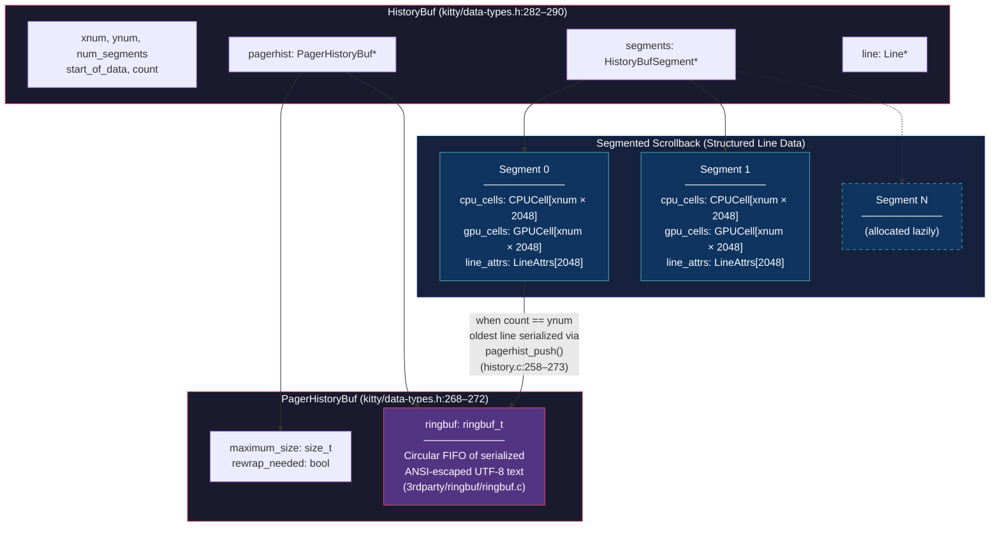
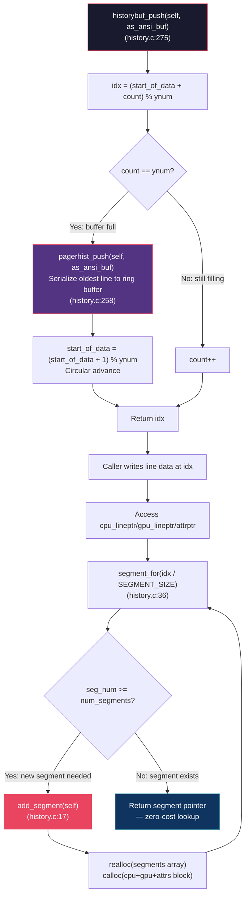
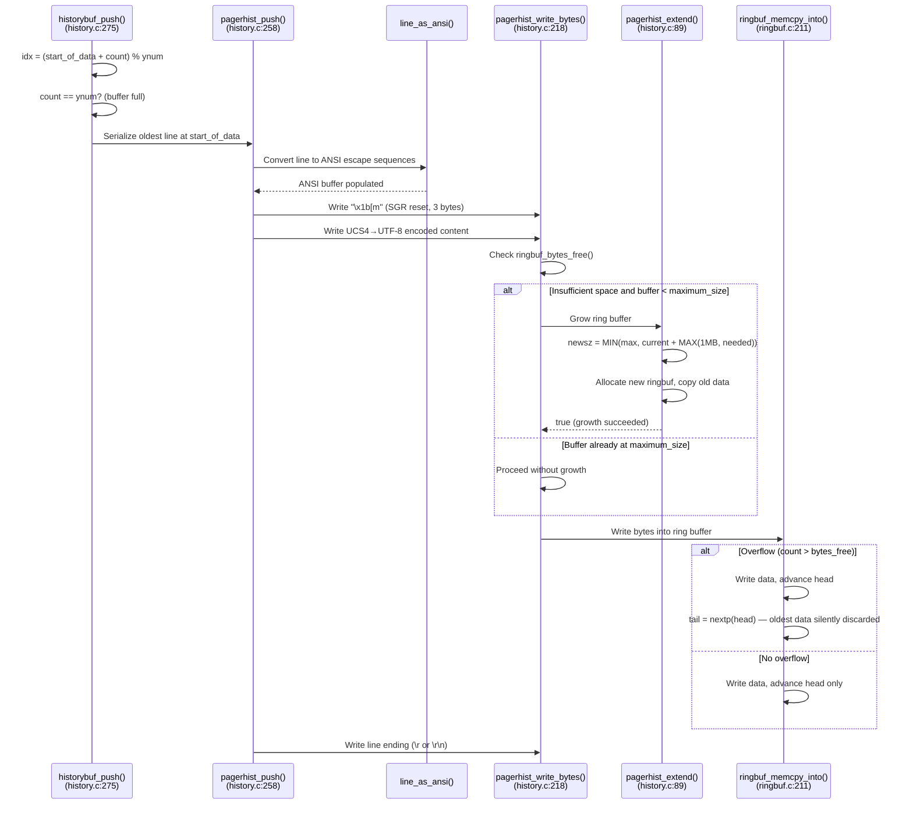

# Kitty HistoryBuf Internals: Deep-Dive Under Extreme Stress

## Introduction

This document is a code-grounded, Q&A-style exploration of what actually happens inside Kitty's scrollback machinery when it is pushed far beyond normal usage — millions of lines flooding in, the user scrolling while data is still arriving, and the buffer wrapping around itself under memory pressure. Every claim here is traced directly to source code, with exact file paths and line numbers so you can verify each statement yourself.

### The Dual-Buffer Architecture at a Glance

Kitty's scrollback is not a single flat array. It is a **two-tier system**:

1. **Segmented scrollback** (`HistoryBuf` → array of `HistoryBufSegment`): A circular buffer of structured line data — full `CPUCell` and `GPUCell` arrays per line, supporting rich text attributes, hyperlinks, and image placeholders. This is the primary scrollback visible to the user during interactive scrolling. Defined at `kitty/data-types.h:282–290`.

2. **Pager ring buffer** (`PagerHistoryBuf` → `ringbuf_t` FIFO): A secondary ring buffer that stores serialized ANSI-escaped UTF-8 text. When the segmented scrollback is full, the oldest structured line is serialized into this ring buffer before being overwritten. This data is only used when launching the scrollback pager (e.g., `less`). Defined at `kitty/data-types.h:268–272`.

**Target audience:** Developers and advanced users who want to understand Kitty's scrollback memory at a runtime level — not theory, but what the code actually does.

**Doctrine:** All answers are based on the code as the truth. No assumptions, only evidence from actual source.

### Configuration Context

Three parameters control every aspect of the behavior discussed in this document:

| Parameter | Default | Where Defined | What It Controls |
|-----------|---------|---------------|------------------|
| `scrollback_lines` | 2000 | `kitty/options/definition.py:372` | Maximum number of lines in the segmented scrollback (`ynum`). Memory is allocated on demand. Negative values give effectively infinite scrollback. |
| `scrollback_pager_history_size` | 0 (disabled) | `kitty/options/definition.py:406` | Maximum size in MB of the pager ring buffer (`PagerHistoryBuf.maximum_size`). Zero disables the pager ring buffer entirely. Maximum allowed is 4 GB. |
| `SEGMENT_SIZE` | 2048 | `kitty/history.c:15` | Lines per segment — hardcoded, not user-configurable. Determines the granularity of lazy allocation. |

> **Note:** Changes to `scrollback_lines` and `scrollback_pager_history_size` only affect newly created windows on config reload, not existing ones (Source: `kitty/options/definition.py:380–381,415–416`).

---

## Architecture Diagram



**Source references for struct fields:**
- `HistoryBufSegment`: `GPUCell *gpu_cells`, `CPUCell *cpu_cells`, `LineAttrs *line_attrs` — `kitty/data-types.h:262–266`
- `PagerHistoryBuf`: `void *ringbuf`, `size_t maximum_size`, `bool rewrap_needed` — `kitty/data-types.h:268–272`
- `HistoryBuf`: `index_type xnum, ynum, num_segments`, `HistoryBufSegment *segments`, `PagerHistoryBuf *pagerhist`, `Line *line`, `index_type start_of_data, count` — `kitty/data-types.h:282–290`

---

## Q1: What Unfolds Inside HistoryBuf When a Flood of Text Arrives?

### Thinking

When an enormous volume of text is written — say `seq 1 1000000` — lines scroll off the top of the terminal screen and enter the history buffer. The question is: what actually happens inside `HistoryBuf` as this flood progresses? Does it allocate memory for each line? Does it ever block? How does it handle the circular buffer being full?

The answer lies in a carefully staged lifecycle: initial creation allocates just one segment, lines fill the circular buffer without allocation, and only when the buffer is full does the system serialize the oldest line to the pager ring buffer and overwrite it. Segment allocation is lazy and amortized — triggered only once every 2048 lines when a new segment is needed.

### Step 1: Initial Creation

`create_historybuf()` at `kitty/history.c:116–133` sets up the buffer:

```c
self->xnum = xnum;           // columns (e.g., 80)
self->ynum = ynum;           // max history lines (e.g., 2000 from scrollback_lines)
self->num_segments = 0;      // start with zero segments
add_segment(self);           // immediately allocate the first one
self->line = alloc_line();
self->pagerhist = alloc_pagerhist(pagerhist_sz);
```

**Rationale:** The buffer starts with exactly one segment of `SEGMENT_SIZE = 2048` lines. Since the default `scrollback_lines` is 2000 (which is ≤ 2048), a single segment is sufficient for the default configuration. Additional segments are allocated lazily only if `ynum` exceeds one segment's capacity.

### Step 2: The Core Push — `historybuf_push()`

Source: `kitty/history.c:275–284`

```c
static index_type
historybuf_push(HistoryBuf *self, ANSIBuf *as_ansi_buf) {
    index_type idx = (self->start_of_data + self->count) % self->ynum;
    init_line(self, idx, self->line);
    if (self->count == self->ynum) {
        pagerhist_push(self, as_ansi_buf);
        self->start_of_data = (self->start_of_data + 1) % self->ynum;
    } else self->count++;
    return idx;
}
```

This is the hot path — called for every line entering history. Here is exactly what happens:

1. **Compute the write index:** `idx = (start_of_data + count) % ynum`. This is pure modular arithmetic — no allocation, no branching except the fullness check.

2. **If the buffer is full** (`count == ynum`):
   - Call `pagerhist_push()` to serialize the OLDEST line (at position `start_of_data`) to the pager ring buffer.
   - Advance `start_of_data = (start_of_data + 1) % ynum` — the circular buffer "rotates," overwriting the oldest line.
   - `count` stays at `ynum` (the buffer remains full).

3. **If the buffer is not yet full** (`count < ynum`):
   - Simply increment `count++`.
   - No serialization, no pager interaction.

4. **Return `idx`** for the caller to write the new line data into.

**Key insight:** The hot path is allocation-free. Once the buffer is full, every push is just arithmetic + a serialization call. No `malloc`, no `realloc`, no segment allocation.

### Step 3: Adding a Line — `historybuf_add_line()`

Source: `kitty/history.c:286–291`

```c
void
historybuf_add_line(HistoryBuf *self, const Line *line, ANSIBuf *as_ansi_buf) {
    index_type idx = historybuf_push(self, as_ansi_buf);
    copy_line(line, self->line);
    *attrptr(self, idx) = line->attrs;
}
```

This is called by the `INDEX_UP` macro in `kitty/screen.c:1552–1564`:

```c
#define INDEX_UP(add_to_history) \
    linebuf_index(self->linebuf, top, bottom); \
    INDEX_GRAPHICS(-1) \
    if (add_to_history) { \
        linebuf_init_line(self->linebuf, bottom); \
        historybuf_add_line(self->historybuf, self->linebuf->line, &self->as_ansi_buf); \
        self->history_line_added_count++; \
        ...
    } \
    linebuf_clear_line(self->linebuf, bottom, true); \
    ...
```

The chain is: `screen_index()` (line 1569) → `INDEX_UP` (line 1552) → `historybuf_add_line()` (line 286) → `historybuf_push()` (line 275) → `copy_line()` + `attrptr()`.

### Step 4: Lazy Segment Allocation — `segment_for()`

Source: `kitty/history.c:36–42`

```c
static index_type
segment_for(HistoryBuf *self, index_type y) {
    index_type seg_num = y / SEGMENT_SIZE;
    while (UNLIKELY(seg_num >= self->num_segments && SEGMENT_SIZE * self->num_segments < self->ynum))
        add_segment(self);
    if (UNLIKELY(seg_num >= self->num_segments))
        fatal("Out of bounds access to history buffer line number: %u", y);
    return seg_num;
}
```

This function is called every time a line is accessed (via `cpu_lineptr()`, `gpu_lineptr()`, or `attrptr()`). The `UNLIKELY()` compiler hint tells the branch predictor that allocation is the rare case. For the vast majority of accesses, `seg_num < num_segments` is true and the function returns immediately — just a division and a comparison.

When a new segment IS needed, `add_segment()` at `kitty/history.c:17–29` performs:

```c
static void
add_segment(HistoryBuf *self) {
    self->num_segments += 1;
    self->segments = realloc(self->segments, sizeof(HistoryBufSegment) * self->num_segments);
    if (self->segments == NULL) fatal("Out of memory allocating new history buffer segment");
    HistoryBufSegment *s = self->segments + self->num_segments - 1;
    const size_t cpu_cells_size = self->xnum * SEGMENT_SIZE * sizeof(CPUCell);
    const size_t gpu_cells_size = self->xnum * SEGMENT_SIZE * sizeof(GPUCell);
    s->cpu_cells = calloc(1, cpu_cells_size + gpu_cells_size + SEGMENT_SIZE * sizeof(LineAttrs));
    if (!s->cpu_cells) fatal("Out of memory allocating new history buffer segment");
    s->gpu_cells = (GPUCell*)(((uint8_t*)s->cpu_cells) + cpu_cells_size);
    s->line_attrs = (LineAttrs*)(((uint8_t*)s->gpu_cells) + gpu_cells_size);
}
```

**Design rationale:** Each segment allocates a single contiguous block for ALL three arrays (`cpu_cells`, `gpu_cells`, `line_attrs`). The `gpu_cells` and `line_attrs` pointers are carved from the same allocation via pointer arithmetic. This means one `calloc()` per segment rather than three, reducing allocator overhead and improving cache locality.

### Step 5: Circular Index Mechanics — `index_of()`

Source: `kitty/history.c:152–159`

```c
static index_type
index_of(HistoryBuf *self, index_type lnum) {
    // Reverse indexing: lnum = 0 is the *last* (most recent) line
    if (self->count == 0) return 0;
    index_type idx = self->count - 1 - MIN(self->count - 1, lnum);
    return (self->start_of_data + idx) % self->ynum;
}
```

**How it works:** Line number 0 means "the most recently pushed line." Line number `count - 1` means "the oldest line still in the buffer." The function converts this reverse index into a buffer position using modular arithmetic around `start_of_data`.

### Memory Cost Analysis

Each segment stores `SEGMENT_SIZE` (2048) lines. The per-segment memory cost is:

```
Per-segment = xnum × SEGMENT_SIZE × sizeof(CPUCell)
            + xnum × SEGMENT_SIZE × sizeof(GPUCell)
            + SEGMENT_SIZE × sizeof(LineAttrs)
```

With verified struct sizes (from `kitty/data-types.h`):
- `sizeof(CPUCell) == 12` — `static_assert` at line 228
- `sizeof(GPUCell) == 20` — `static_assert` at line 221
- `sizeof(LineAttrs) == 1` — union with `uint8_t val` at lines 231–239

**Concrete example at 80 columns:**

| Component | Calculation | Size |
|-----------|-------------|------|
| CPU cells | 80 × 2048 × 12 | 1,966,080 bytes |
| GPU cells | 80 × 2048 × 20 | 3,276,800 bytes |
| Line attrs | 2048 × 1 | 2,048 bytes |
| **Total per segment** | | **5,244,928 bytes ≈ 5.0 MB** |

| `scrollback_lines` | Segments needed (⌈lines/2048⌉) | Total memory at 80 cols |
|--------------------|---------------------------------|-------------------------|
| 2,000 (default) | 1 | ~5.0 MB |
| 10,000 | 5 | ~25.0 MB |
| 100,000 | 49 | ~245.0 MB |

**At 200 columns**, the per-segment cost rises to ~13.1 MB. At 500 columns (ultra-wide), ~32.8 MB per segment.

### Segment Allocation Lifecycle Flowchart



---

## Q2: How Do the Segmented Scrollback and Pager Ring Buffer Interact?

### Thinking

The segmented scrollback and the pager ring buffer serve fundamentally different purposes. The segmented scrollback stores structured, cell-by-cell line data for interactive rendering. The pager ring buffer stores flat ANSI text for piping to an external pager like `less`. The interaction between them is a one-way serialization path: when the segmented scrollback is full and the oldest line is about to be overwritten, that line is serialized to the pager ring buffer first.

The key question is: what does this serialization path look like, and what happens when the ring buffer itself runs out of space?

### The `pagerhist_push()` Serialization Path

Source: `kitty/history.c:258–273`

```c
static void
pagerhist_push(HistoryBuf *self, ANSIBuf *as_ansi_buf) {
    PagerHistoryBuf *ph = self->pagerhist;
    if (!ph) return;                           // pager disabled (scrollback_pager_history_size == 0)
    const GPUCell *prev_cell = NULL;
    Line l = {.xnum=self->xnum};
    init_line(self, self->start_of_data, &l);  // point at the about-to-be-overwritten line
    line_as_ansi(&l, as_ansi_buf, &prev_cell, 0, l.xnum, 0);  // convert to ANSI escapes
    pagerhist_write_bytes(ph, (const uint8_t*)"\x1b[m", 3);    // write SGR reset prefix
    if (pagerhist_write_ucs4(ph, as_ansi_buf->buf, as_ansi_buf->len)) {
        char line_end[2]; size_t num = 0;
        line_end[num++] = '\r';
        if (!l.gpu_cells[l.xnum - 1].attrs.next_char_was_wrapped)
            line_end[num++] = '\n';            // hard line break (not soft-wrapped)
        pagerhist_write_bytes(ph, (const uint8_t*)line_end, num);
    }
}
```

**What happens step by step:**

1. **Guard check:** If `ph` is `NULL` (pager history disabled), return immediately. This is the case when `scrollback_pager_history_size == 0` (the default).

2. **Initialize a temporary line:** `init_line(self, self->start_of_data, &l)` points a `Line` struct at the oldest slot — the one that is about to be overwritten by the new data.

3. **Convert to ANSI:** `line_as_ansi()` renders the line's content (characters, colors, attributes) as a sequence of ANSI escape codes and UTF-8 characters into `as_ansi_buf`.

4. **Write SGR reset:** `\x1b[m` is written first to ensure each line starts with a clean attribute state.

5. **Write the content:** `pagerhist_write_ucs4()` (line 248–256) encodes each `Py_UCS4` character as UTF-8 and writes it via `pagerhist_write_bytes()`.

6. **Write line ending:** A `\r` (carriage return) is always written. A `\n` (newline) is added ONLY if the line was not soft-wrapped — checked via `l.gpu_cells[l.xnum - 1].attrs.next_char_was_wrapped`.

**Rationale for the `\r`/`\n` distinction:** Soft-wrapped lines are logically one long line split across multiple rows. In the serialized form, they should remain joined (only `\r` separating them). Hard line breaks (where the original text had a newline) get both `\r\n`.

### Writing to the Ring Buffer — `pagerhist_write_bytes()`

Source: `kitty/history.c:218–226`

```c
static bool
pagerhist_write_bytes(PagerHistoryBuf *ph, const uint8_t *buf, size_t sz) {
    if (sz > ph->maximum_size) return false;   // line too large to ever fit
    if (!sz) return true;
    size_t space_in_ringbuf = ringbuf_bytes_free(ph->ringbuf);
    if (sz > space_in_ringbuf) pagerhist_extend(ph, sz);
    ringbuf_memcpy_into(ph->ringbuf, buf, sz);
    return true;
}
```

**Logic flow:**
1. If the data to write is larger than the entire `maximum_size`, give up (return false).
2. Check available space in the ring buffer.
3. If insufficient space, attempt to grow the ring buffer via `pagerhist_extend()`.
4. Write the data via `ringbuf_memcpy_into()` — whether or not the extend succeeded. If it didn't succeed (buffer is at maximum size), `ringbuf_memcpy_into()` will silently overwrite the oldest data.

### Ring Buffer Growth — `pagerhist_extend()`

Source: `kitty/history.c:89–101`

```c
static bool
pagerhist_extend(PagerHistoryBuf *ph, size_t minsz) {
    size_t buffer_size = ringbuf_capacity(ph->ringbuf);
    if (buffer_size >= ph->maximum_size) return false;  // already at max
    size_t newsz = MIN(ph->maximum_size, buffer_size + MAX(1024u * 1024u, minsz));
    ringbuf_t newbuf = ringbuf_new(newsz);
    if (!newbuf) return false;
    size_t count = ringbuf_bytes_used(ph->ringbuf);
    if (count) ringbuf_copy(newbuf, ph->ringbuf, count);
    ringbuf_free((ringbuf_t*)&ph->ringbuf);
    ph->ringbuf = newbuf;
    return true;
}
```

**Growth strategy:**
- Grows by at least **1 MB** at a time (`MAX(1024u * 1024u, minsz)`), capped at `maximum_size`.
- Allocates a completely new ring buffer and copies existing data into it.
- The initial size is `MIN(1 MB, maximum_size)` (from `initial_pagerhist_ringbuf_sz()` at line 66–67).
- Growth frequency is bounded: at most `maximum_size / 1MB` reallocation events total.

### The Silent Overflow — `ringbuf_memcpy_into()`

Source: `3rdparty/ringbuf/ringbuf.c:211–238`

```c
void *
ringbuf_memcpy_into(ringbuf_t dst, const void *src, size_t count)
{
    const uint8_t *u8src = src;
    const uint8_t *bufend = ringbuf_end(dst);
    int overflow = count > ringbuf_bytes_free(dst);
    size_t nread = 0;

    while (nread != count) {
        assert(bufend > dst->head);
        size_t n = size_t_min(bufend - dst->head, count - nread);
        memcpy(dst->head, u8src + nread, n);
        dst->head += n;
        nread += n;
        if (dst->head == bufend)
            dst->head = dst->buf;               // wrap head around
    }

    if (overflow) {
        dst->tail = ringbuf_nextp(dst, dst->head);  // silently discard oldest data
        assert(ringbuf_is_full(dst));
    }

    return dst->head;
}
```

**Critical overflow semantics:** When the write exceeds free space (`overflow == true`), the function does NOT reject the write. Instead, it:
1. Writes all the new data, advancing `head`.
2. Sets `tail = ringbuf_nextp(dst, head)` — the tail jumps forward to just past the head, **discarding whatever oldest data was in between**.
3. There is **no error, no notification, no callback**. The oldest serialized text simply vanishes.

**The one-byte sentinel:** `ringbuf_new()` at `3rdparty/ringbuf/ringbuf.c:56` allocates `capacity + 1` bytes (`rb->size = capacity + 1`). This extra byte distinguishes the full condition (`head` is one position behind `tail`) from the empty condition (`head == tail`). This is why `ringbuf_capacity()` returns `buffer_size - 1` (line 89–93).

### Data Flow Sequence Diagram



---

## Q3: Are There Hesitation Points at Segment Boundaries?

### Thinking

The user asks whether the system "hesitates, stalls, or shows observable latency" at segment boundaries. This is a question about the allocation profile of the hot path. The answer is: there IS a brief allocation cost at segment boundaries, but it is infrequent (once every 2048 lines), the expensive allocation is amortized, and the pointer-array `realloc()` is negligible.

### Lazy Allocation in `segment_for()`

Source: `kitty/history.c:36–42`

The `UNLIKELY()` macro tells the compiler's branch predictor that the allocation path is the rare case. In the overwhelmingly common case, `seg_num < num_segments` and the function returns immediately — just integer division and a comparison.

When a new segment IS needed:

1. **`realloc()` on the segments pointer array** — This array holds `HistoryBufSegment` values, each containing 3 pointers (24 bytes on 64-bit: `GPUCell*`, `CPUCell*`, `LineAttrs*` per `kitty/data-types.h:262–266`). Even with `scrollback_lines = 100,000` (49 segments), the array is only `49 × 24 = 1,176 bytes`. This `realloc()` is trivial.

2. **`calloc()` for the segment data block** — This is the expensive part. At 80 columns, one segment is ~5.0 MB. The `calloc()` zeros this memory, which may trigger page faults on first access. However:
   - This cost occurs **once per 2048 lines**, not per line.
   - The number of segments is bounded: `⌈ynum / SEGMENT_SIZE⌉`. For `scrollback_lines = 10,000`, that is 5 total `calloc()` calls, ever.
   - After all segments are allocated, `segment_for()` never calls `add_segment()` again — it is pure zero-cost lookup forever after.

### Ring Buffer Reallocation in `pagerhist_extend()`

Source: `kitty/history.c:89–101`

When the pager ring buffer needs to grow:

1. **`ringbuf_new(newsz)`** — Allocates the new buffer.
2. **`ringbuf_copy(newbuf, old, count)`** — Copies all existing data from old to new. This is O(n) in the current data size.
3. **`ringbuf_free(old)`** — Frees the old buffer.

The copy operation (`ringbuf_copy()` at `3rdparty/ringbuf/ringbuf.c:358–394`) iterates through the old buffer's data, handling the wrap-around correctly. For a ring buffer that has grown to, say, 50 MB, this means copying up to 50 MB of data during reallocation.

**However:** Growth happens in increments of at least 1 MB. So the total number of reallocations is bounded by `maximum_size / 1MB`. For a 100 MB pager history, that is at most 100 reallocations over the entire lifetime of the window. And once `maximum_size` is reached, **no further reallocations ever occur** — `ringbuf_memcpy_into()` silently overwrites instead.

### Summary of Hesitation Points

| Event | Frequency | Cost | Impact |
|-------|-----------|------|--------|
| `segment_for()` check | Every line access | Integer division + comparison | Negligible (branch predicted away) |
| `add_segment()` — `realloc` on pointer array | Once per 2048 lines | ~1 KB realloc | Negligible |
| `add_segment()` — `calloc` for segment data | Once per 2048 lines | ~5 MB calloc (at 80 cols) | Brief pause, amortized over 2048 lines |
| `pagerhist_extend()` | At most `max_size / 1MB` times | O(current_data_size) copy | Proportional to data size, infrequent |
| `ringbuf_memcpy_into()` overflow | Every push after ring buffer is full | memcpy + tail pointer advance | Negligible (no allocation) |

### Fatal Error Paths

The system has three unrecoverable error conditions:

1. **`add_segment()` line 21:** `if (self->segments == NULL) fatal("Out of memory allocating new history buffer segment")` — the `realloc()` for the segments pointer array failed. This indicates severe system-wide memory exhaustion.

2. **`add_segment()` line 26:** `if (!s->cpu_cells) fatal("Out of memory allocating new history buffer segment")` — the `calloc()` for the segment data block failed. For a 5 MB segment at 80 columns, this means the system cannot provide 5 MB of contiguous memory.

3. **`segment_for()` line 40:** `if (UNLIKELY(seg_num >= self->num_segments)) fatal("Out of bounds access to history buffer line number: %u", y)` — the while loop in `segment_for()` exited without allocating enough segments. This indicates a logic error (should never happen with valid `ynum`).

All three are `fatal()` calls that terminate the Kitty process immediately. There is no graceful degradation for OOM on the segmented scrollback path.

---

## Q4: What Happens When the User Is Scrolling While New Data Arrives?

### Thinking

This is perhaps the most subtle question. The user is scrolled up, viewing history, and new data continues to pour in from the child process. The data pushes new lines into history (via `INDEX_UP` → `historybuf_add_line()`), which means the history buffer is growing or wrapping. If the scroll position isn't adjusted, the user would see the content "shift" — they'd be looking at a different line than before.

Kitty handles this through a **render-time reconciliation mechanism**: the scroll position is adjusted atomically when the screen is rendered, not when lines are added. This is elegant because it avoids any locking between the I/O path and the scroll position.

### The `scrolled_by` Field

Source: `kitty/screen.h:91`

```c
unsigned int columns, lines, margin_top, margin_bottom, scrolled_by;
```

`scrolled_by` represents how many lines the user has scrolled up from the bottom of the terminal. `scrolled_by = 0` means the user is viewing the live output (not scrolled). `scrolled_by = N` means the user is viewing N lines into history.

### The `history_line_added_count` Counter

Source: `kitty/screen.h:108`

```c
unsigned int history_line_added_count;
```

This counter is incremented every time a line is pushed into history. In the `INDEX_UP` macro at `kitty/screen.c:1559`:

```c
self->history_line_added_count++;
```

This counter accumulates between render cycles. If 50 lines scroll off the screen before the next render, `history_line_added_count` will be 50.

### Render-Time Reconciliation — `screen_update_cell_data()`

Source: `kitty/screen.c:2756–2761`

```c
unsigned int history_line_added_count = self->history_line_added_count;
index_type lnum;
bool was_dirty = self->is_dirty;
screen_reset_dirty(self);
update_overlay_position(self);
if (self->scrolled_by)
    self->scrolled_by = MIN(self->scrolled_by + history_line_added_count, self->historybuf->count);
```

**What happens:**

1. **Snapshot the counter:** `history_line_added_count` is read once (line 2756). This captures all lines added since the last render.

2. **Adjust scroll position:** If the user is scrolled up (`scrolled_by > 0`), increase `scrolled_by` by `history_line_added_count`. This keeps the user looking at the **same content** — the new lines that entered history are "above" the current view, so the view must shift down in the buffer to compensate.

3. **Cap at history count:** `MIN(..., self->historybuf->count)` ensures `scrolled_by` never exceeds the actual number of lines in the history buffer. This handles the case where the history buffer wraps and discards old lines.

**Key insight:** The reconciliation is deferred to render time. Lines can be added to history at any rate, and `history_line_added_count` simply accumulates. At render time, a single addition adjusts the scroll position for the entire batch. This means:
- No lock contention between data arrival and scrolling.
- No per-line scroll position updates.
- The scroll position adjustment is O(1) regardless of how many lines arrived.

### The Render Loop Split

Source: `kitty/screen.c:2763–2788`

After adjusting `scrolled_by`, the render loop renders the screen in two phases:

**Phase 1 — History lines** (lines 2763–2774):
```c
for (index_type y = 0; y < MIN(self->lines, self->scrolled_by); y++) {
    lnum = self->scrolled_by - 1 - y;
    historybuf_init_line(self->historybuf, lnum, self->historybuf->line);
    // ... render, mark clean, update line data ...
}
```

**Phase 2 — Current screen lines** (lines 2776–2788):
```c
for (index_type y = self->scrolled_by; y < self->lines; y++) {
    lnum = y - self->scrolled_by;
    linebuf_init_line(self->linebuf, lnum);
    // ... render, mark clean, update line data ...
}
```

This means the display seamlessly shows a mix: the top `scrolled_by` rows show history lines, and the remaining rows show the live screen content.

### User Scroll Handling — `screen_history_scroll()`

Source: `kitty/screen.c:4091–4118`

```c
bool
screen_history_scroll(Screen *self, int amt, bool upwards) {
    switch(amt) {
        case SCROLL_LINE: amt = 1; break;
        case SCROLL_PAGE: amt = self->lines - 1; break;
        case SCROLL_FULL: amt = self->historybuf->count; break;
        default: amt = MAX(0, amt); break;
    }
    if (!upwards) {
        amt = MIN((unsigned int)amt, self->scrolled_by);
        amt *= -1;
    }
    if (amt == 0) return false;
    unsigned int new_scroll = MIN(self->scrolled_by + amt, self->historybuf->count);
    if (new_scroll != self->scrolled_by) {
        self->scrolled_by = new_scroll;
        dirty_scroll(self);
        return true;
    }
    return false;
}
```

Scroll amounts:
- **Line:** 1 line
- **Page:** `self->lines - 1` (one less than the visible screen height)
- **Full:** `self->historybuf->count` (jump to the top of history)

Downward scrolling is clamped: `amt = MIN(amt, scrolled_by)`. The new position is always capped at `historybuf->count`. If nothing changes, the function returns `false` (no redraw needed).

### The `input_delay` Batching Effect

Source: `kitty/child-monitor.c:1480–1571`

The I/O loop uses `OPT(input_delay)` to throttle main loop wakeups (lines 1506–1510, 1565–1569):

```c
if (has_pending_wakeups) {
    now = monotonic();
    monotonic_t time_delta = OPT(input_delay) - (now - last_main_loop_wakeup_at);
    if (time_delta >= 0) ret = poll(children_fds, ..., monotonic_t_to_ms(time_delta));
    else ret = 0;
}
```

After data is received (line 1565):
```c
if (data_received) {
    if ((now = monotonic()) - last_main_loop_wakeup_at > OPT(input_delay)) WAKEUP
    else has_pending_wakeups = true;
}
```

**Consequence for scroll behavior:** Data from the child process is batched. Between render cycles, dozens or hundreds of lines may arrive and be processed. All of these increment `history_line_added_count` individually, but the scroll position is adjusted **once** at render time for the entire batch. This is why the scroll reconciliation in `screen_update_cell_data()` is correct even under flood conditions — it aggregates the full count.

### Concurrent Scroll + Write Reconciliation Flowchart

```mermaid
flowchart LR
    subgraph IO ["I/O Path (child-monitor.c:1480)"]
        direction TB
        DataIn["Data arrives from child process"]
        Parse["VT parser processes escape sequences"]
        SIdx["screen_index() called for each newline<br/>(screen.c:1569)"]
        IdxUp["INDEX_UP macro<br/>(screen.c:1552)"]
        AddLine["historybuf_add_line()<br/>history_line_added_count++<br/>(screen.c:1559)"]
        DataIn --> Parse --> SIdx --> IdxUp --> AddLine
    end

    subgraph Render ["Render Path (screen.c:2756)"]
        direction TB
        Snap["Snapshot: history_line_added_count"]
        Check{"scrolled_by > 0?"}
        Adjust["scrolled_by += history_line_added_count<br/>Capped at historybuf->count<br/>(screen.c:2761)"]
        HistLines["Render history lines<br/>y = 0 .. scrolled_by-1<br/>(screen.c:2763)"]
        LiveLines["Render screen lines<br/>y = scrolled_by .. lines-1<br/>(screen.c:2776)"]
        Snap --> Check
        Check -->|Yes| Adjust --> HistLines
        Check -->|No| LiveLines
        HistLines --> LiveLines
    end

    AddLine -.->|"Accumulates between<br/>render cycles"| Snap

    style IO fill:#16213e,stroke:#0f3460,color:#fff
    style Render fill:#1a1a2e,stroke:#e94560,color:#fff
```



---

## Q5: How Do Allocation, Wrapping, and Retention Evolve Under Pressure?

### Thinking

Under sustained pressure — say, a continuous `cat /dev/urandom | base64` — the system reaches a steady state where:
1. The segmented scrollback is full (`count == ynum`) and every push is a circular overwrite.
2. The pager ring buffer is at its maximum size and every serialized line silently overwrites the oldest data.
3. The only allocation that ever happens is within the ring buffer's `memcpy` — no new memory is acquired.

The interesting edge cases are: (a) what happens to UTF-8 encoding when the ring buffer tail lands mid-character, (b) how the system handles terminal width changes under load, and (c) what configuration levers affect this behavior.

### Silent Overflow in the Ring Buffer

When the pager ring buffer has reached `maximum_size` and `pagerhist_extend()` returns `false`, `pagerhist_write_bytes()` at `kitty/history.c:224` still calls `ringbuf_memcpy_into()`. The overflow semantics (from `3rdparty/ringbuf/ringbuf.c:211–238`) are:

1. `overflow = count > ringbuf_bytes_free(dst)` — detects that the write will exceed free space.
2. The data is written anyway, with `head` advancing and wrapping around the buffer.
3. `dst->tail = ringbuf_nextp(dst, dst->head)` — the tail jumps to just past the head.

**What this means in practice:**
- The oldest serialized ANSI text vanishes without trace.
- There is no error, no partial write, no callback.
- The ring buffer always contains the **most recent** serialized data, with the oldest data discarded.
- The one-byte sentinel (from `ringbuf_new()` at `3rdparty/ringbuf/ringbuf.c:56`: `rb->size = capacity + 1`) ensures that `head == tail` means empty and `head` one behind `tail` means full — they can never be confused.

### UTF-8 Boundary Repair — `pagerhist_ensure_start_is_valid_utf8()`

Source: `kitty/history.c:228–246`

When the ring buffer overflows and the tail advances, it may land in the middle of a multi-byte UTF-8 sequence. For example, a 3-byte UTF-8 character (like `é` encoded as `0xC3 0xA9`) could have its first byte discarded by the tail advance, leaving `0xA9` as a dangling continuation byte at the start of the buffer.

```c
static bool
pagerhist_ensure_start_is_valid_utf8(PagerHistoryBuf *ph) {
    uint8_t scratch[8];
    size_t num = ringbuf_memcpy_from(scratch, ph->ringbuf, arraysz(scratch));
    uint32_t codep;
    UTF8State state = UTF8_ACCEPT;
    size_t count = 0;
    size_t last_reject_at = 0;
    while (count < num) {
        decode_utf8(&state, &codep, scratch[count++]);
        if (state == UTF8_ACCEPT) break;
        if (state == UTF8_REJECT) { state = UTF8_ACCEPT; last_reject_at = count; }
    }
    if (last_reject_at) {
        ringbuf_memmove_from(scratch, ph->ringbuf, last_reject_at);
        return true;
    }
    return false;
}
```

**How it works:**

1. Read the first 8 bytes from the ring buffer (non-destructively via `ringbuf_memcpy_from()` at `3rdparty/ringbuf/ringbuf.c:307–330`).
2. Feed them through a UTF-8 state machine byte by byte.
3. If any bytes are rejected (invalid continuation bytes at the start), record the position.
4. If there were rejects, consume them via `ringbuf_memmove_from()` (which advances the tail pointer, at `3rdparty/ringbuf/ringbuf.c:268–292`).

**Key insight:** This repair is **lazy**. It is NOT called during writes — only when the pager reads the data. Specifically, `pagerhist_as_bytes()` at `kitty/history.c:466` calls it:

```c
pagerhist_ensure_start_is_valid_utf8(ph);
```

This is before the pager's text content is returned. The rationale: repairing on every overflow would be wasteful, since the ring buffer may overflow many times between pager invocations. Doing it once, right before the data is read, is the efficient choice.

### Rewrap Under Width Change — `pagerhist_rewrap_to()`

Source: `kitty/history.c:391–432`

When the terminal width changes (e.g., window resize), the pager ring buffer's content needs to be reflowed to the new width:

```c
static void
pagerhist_rewrap_to(HistoryBuf *self, index_type cells_in_line) {
    PagerHistoryBuf *ph = self->pagerhist;
    if (!ph->ringbuf || !ringbuf_bytes_used(ph->ringbuf)) return;
    PagerHistoryBuf *nph = calloc(1, sizeof(PagerHistoryBuf));
    // ... allocate new ring buffer with slightly more capacity ...
    nph->ringbuf = ringbuf_new(MIN(ph->maximum_size, ringbuf_capacity(ph->ringbuf) + 4096));
    // ... character-by-character reflow ...
    while (ringbuf_bytes_used(ph->ringbuf)) {
        ch = pagerhist_remove_char(ph, &count, record);
        if (ch == '\n') {
            // Hard line break: write it, reset line counter
            WRITE_CHAR();
            num_in_current_line = 0;
        } else if (ch != '\r') {
            // Regular character: check if it fits in the current line
            ch_width = wcswidth_step(&wcs_state, ch);
            WRITE_CHAR();  // inserts \r if character would overflow cells_in_line
        }
        // \r characters from old stream are silently skipped (recomputed)
    }
    free_pagerhist(self);
    self->pagerhist = nph;
}
```

**Process:**
1. Allocate a new `PagerHistoryBuf` with a fresh ring buffer (slightly larger to accommodate potential line-break additions).
2. Read characters one at a time from the old ring buffer via `pagerhist_remove_char()`.
3. For each character, compute its display width via `wcswidth_step()`.
4. If adding the character would exceed `cells_in_line`, insert a `\r` (soft line break) first.
5. Old `\r` characters are ignored — they will be recomputed for the new width.
6. `\n` characters (hard line breaks) are preserved as-is.
7. The old `PagerHistoryBuf` is freed and replaced.

**When is this triggered?** The `rewrap_needed` flag is set in `historybuf_rewrap()` at `kitty/history.c:607–608`:

```c
if (other->pagerhist && other->xnum != self->xnum && ringbuf_bytes_used(other->pagerhist->ringbuf))
    other->pagerhist->rewrap_needed = true;
```

The actual rewrap is also deferred — it happens in `pagerhist_as_bytes()` at line 467:
```c
if (ph->rewrap_needed) pagerhist_rewrap_to(self, self->xnum);
```

This means the character-by-character reflow only happens when the pager is actually invoked, not at resize time. Under flood conditions with frequent resizes, the flag is simply set again; the rewrap will run once when the user finally opens the pager.

### The Segmented Scrollback Rewrap — `historybuf_rewrap()`

Source: `kitty/history.c:594–614`

```c
void
historybuf_rewrap(HistoryBuf *self, HistoryBuf *other, ANSIBuf *as_ansi_buf) {
    while(other->num_segments < self->num_segments) add_segment(other);
    if (other->xnum == self->xnum && other->ynum == self->ynum) {
        // Fast path: dimensions unchanged, just memcpy all segments
        for (index_type i = 0; i < self->num_segments; i++) {
            memcpy(other->segments[i].cpu_cells, ...);
            memcpy(other->segments[i].gpu_cells, ...);
            memcpy(other->segments[i].line_attrs, ...);
        }
        other->count = self->count;
        other->start_of_data = self->start_of_data;
        return;
    }
    // Slow path: dimensions changed, use rewrap_inner() to reflow
    if (other->pagerhist && other->xnum != self->xnum && ringbuf_bytes_used(other->pagerhist->ringbuf))
        other->pagerhist->rewrap_needed = true;
    other->count = 0; other->start_of_data = 0;
    if (self->count > 0) {
        rewrap_inner(self, other, self->count, NULL, NULL, as_ansi_buf);
        // ... mark all lines dirty ...
    }
}
```

**Two paths:**
1. **Fast path (same dimensions):** Pure `memcpy` of all segment data. O(total data size) but no character-by-character work.
2. **Slow path (dimensions changed):** Uses the generic `rewrap_inner()` engine from `kitty/rewrap.h:56–96`, which copies cell ranges from source to destination, handling line wrapping, continuation marks, and cursor tracking.

### Configuration Levers and Their Effects Under Stress

| Parameter | Effect Under Sustained Flood |
|-----------|------------------------------|
| `scrollback_lines = 2000` (default) | 1 segment, ~5 MB at 80 cols. Buffer fills after 2000 lines, then every push is a circular overwrite. Hot path is allocation-free. |
| `scrollback_lines = 100000` | 49 segments, ~245 MB at 80 cols. 49 lazy `calloc` events over the first 100,000 lines, then purely circular. |
| `scrollback_pager_history_size = 0` (default) | Pager ring buffer disabled. `pagerhist_push()` returns immediately (null check at line 261). No serialization overhead on the hot path at all. |
| `scrollback_pager_history_size = 100` (100 MB) | Ring buffer grows from 1 MB in ~100 steps up to 100 MB, then silently overwrites. At ~100 bytes/line, holds ~1 million lines of serialized ANSI text. |
| `SEGMENT_SIZE = 2048` (hardcoded) | Segment allocation granularity. Larger values would mean fewer but bigger allocations; smaller values would mean more frequent but smaller ones. 2048 is a reasonable balance for cache-line alignment and allocation overhead. |

---

## Observation Techniques

The following temporary Python scripts demonstrate how to probe `HistoryBuf` state at runtime using Kitty's Python API. These use `kitty.fast_data_types` — the compiled C extension that exposes `HistoryBuf`, `LineBuf`, and `Screen` types to Python.

> ⚠️ **These scripts are for temporary observation only.** Delete them after use. No repository modifications should persist.

### Script 1: Probing HistoryBuf State

This script can be run via Kitty's remote control mechanism (`kitty @ send-text`) or from a Kitten. It inspects the history buffer of the active window.

```python
#!/usr/bin/env python3
"""
Temporary observation script: Probe HistoryBuf state.
DELETE THIS FILE AFTER USE. No repository modifications should persist.

Usage from kitty remote control:
    kitty @ kitten /path/to/probe_historybuf.py
"""

def main(args):
    """Called when run as a kitten."""
    pass

def handle_result(args, answer, target_window_id, boss):
    """
    Called with access to the boss object, which provides
    access to all windows and their screens.
    """
    window = boss.window_id_map.get(target_window_id)
    if window is None:
        print("No active window found.")
        return

    screen = window.screen
    historybuf = screen.historybuf

    # Basic buffer state
    xnum = historybuf.xnum      # columns (Source: history.c:556)
    ynum = historybuf.ynum      # max capacity (Source: history.c:557)
    count = historybuf.count    # current line count (Source: history.c:558)

    fullness_pct = (count / ynum * 100) if ynum > 0 else 0

    report = []
    report.append(f"=== HistoryBuf State ===")
    report.append(f"Columns (xnum):         {xnum}")
    report.append(f"Max lines (ynum):       {ynum}")
    report.append(f"Current lines (count):  {count}")
    report.append(f"Fullness:               {fullness_pct:.1f}%")
    report.append(f"Scrolled by:            {screen.scrolled_by}")
    report.append(f"")

    # Inspect the most recent and oldest lines
    if count > 0:
        line_0 = historybuf.line(0)  # most recent line (Source: history.c:543)
        report.append(f"Most recent line (0):   '{str(line_0)[:60]}...'")
        if count > 1:
            line_last = historybuf.line(count - 1)  # oldest line
            report.append(f"Oldest line ({count-1}):  '{str(line_last)[:60]}...'")

    # Per-segment memory estimate
    cpu_per_seg = xnum * 2048 * 12    # sizeof(CPUCell) == 12
    gpu_per_seg = xnum * 2048 * 20    # sizeof(GPUCell) == 20
    attr_per_seg = 2048 * 1           # sizeof(LineAttrs) == 1
    seg_total = cpu_per_seg + gpu_per_seg + attr_per_seg
    num_segments = -(-ynum // 2048)   # ceil division
    total_mem = seg_total * num_segments

    report.append(f"")
    report.append(f"=== Memory Estimate ===")
    report.append(f"Segments needed:        {num_segments}")
    report.append(f"Per-segment size:       {seg_total / 1024 / 1024:.2f} MB")
    report.append(f"Total estimate:         {total_mem / 1024 / 1024:.2f} MB")

    # Print report
    print("\n".join(report))
```

**Cleanup:** Delete `probe_historybuf.py` after use.

### Script 2: Observing Pager Ring Buffer Content

This script retrieves the serialized ANSI text from the pager ring buffer, if any exists.

```python
#!/usr/bin/env python3
"""
Temporary observation script: Observe pager ring buffer state.
DELETE THIS FILE AFTER USE. No repository modifications should persist.

Requires scrollback_pager_history_size > 0 in kitty.conf.

Usage from kitty remote control:
    kitty @ kitten /path/to/probe_pagerhist.py
"""

def main(args):
    """Called when run as a kitten."""
    pass

def handle_result(args, answer, target_window_id, boss):
    """
    Called with access to the boss object.
    """
    window = boss.window_id_map.get(target_window_id)
    if window is None:
        print("No active window found.")
        return

    screen = window.screen
    historybuf = screen.historybuf

    report = []
    report.append("=== Pager Ring Buffer State ===")

    try:
        # pagerhist_as_text() returns the pager ring buffer content as a
        # UTF-8 string. This triggers:
        #   1. pagerhist_ensure_start_is_valid_utf8() — UTF-8 boundary repair
        #   2. pagerhist_rewrap_to() if rewrap_needed is set
        # Source: history.c:547, 486-494, 460-483
        pager_text = historybuf.pagerhist_as_text()

        if pager_text:
            text_bytes = len(pager_text.encode('utf-8'))
            line_count = pager_text.count('\n')
            report.append(f"Pager data size:       {text_bytes:,} bytes")
            report.append(f"Estimated line count:  {line_count:,}")
            report.append(f"")

            # Show first 3 lines
            lines = pager_text.split('\n')
            report.append(f"First 3 lines:")
            for i, line in enumerate(lines[:3]):
                report.append(f"  [{i}]: '{line[:80]}...'")

            # Show last 3 lines
            report.append(f"Last 3 lines:")
            for i, line in enumerate(lines[-3:]):
                report.append(f"  [{len(lines)-3+i}]: '{line[:80]}...'")

            # Check for clean UTF-8 start
            first_bytes = pager_text[:10].encode('utf-8')
            starts_with_esc = first_bytes[:1] == b'\x1b'
            report.append(f"")
            report.append(f"Starts with ESC:       {starts_with_esc}")
            report.append(f"(Expected: True — each line starts with \\x1b[m reset)")
        else:
            report.append("Pager ring buffer is empty.")
            report.append("(Is scrollback_pager_history_size > 0 in kitty.conf?)")
    except Exception as e:
        report.append(f"Error accessing pager history: {e}")

    print("\n".join(report))
```

**Cleanup:** Delete `probe_pagerhist.py` after use.

### API Reference for Observation

The Python-exposed `HistoryBuf` API (from the method table at `kitty/history.c:542–553` and member definitions at `kitty/history.c:555–559`):

| API | Type | Description |
|-----|------|-------------|
| `historybuf.xnum` | `unsigned int` (readonly) | Number of columns |
| `historybuf.ynum` | `unsigned int` (readonly) | Maximum line capacity |
| `historybuf.count` | `unsigned int` (readonly) | Current number of stored lines |
| `historybuf.line(n)` | method | Get line at index `n` (0 = most recent) |
| `historybuf.pagerhist_as_text()` | method | Return pager ring buffer as UTF-8 text |
| `historybuf.pagerhist_as_bytes()` | method | Return pager ring buffer as raw bytes |
| `historybuf.push(line)` | method | Push a line into the buffer |
| `historybuf.rewrap(other)` | method | Rewrap contents into another HistoryBuf |
| `historybuf.dirty_lines()` | method | List line numbers with dirty text |

---

## Summary of Key Insights

1. **The circular buffer wraps without allocation.** Once `ynum` lines are stored, `start_of_data` advances via modular arithmetic, overwriting the oldest line. The hot path in `historybuf_push()` (Source: `kitty/history.c:275–284`) is purely arithmetic — no memory allocation, no system calls.

2. **Segment allocation is lazy and amortized.** `add_segment()` (Source: `kitty/history.c:17–29`) is called once per 2048 lines (`SEGMENT_SIZE`), not per line. After all required segments are allocated, `segment_for()` is a zero-cost lookup forever.

3. **The pager ring buffer grows incrementally up to `maximum_size`, then silently overwrites.** Growth via `pagerhist_extend()` (Source: `kitty/history.c:89–101`) happens in 1 MB increments. Once the cap is reached, `ringbuf_memcpy_into()` (Source: `3rdparty/ringbuf/ringbuf.c:211–238`) advances the tail pointer, discarding the oldest serialized text with no error or notification.

4. **Concurrent scroll + data arrival is handled by render-time reconciliation.** `screen_update_cell_data()` (Source: `kitty/screen.c:2756–2761`) adjusts `scrolled_by` by the accumulated `history_line_added_count`, so the user's view stays fixed on the same content even as new lines flood into history.

5. **UTF-8 boundary repair is lazy.** `pagerhist_ensure_start_is_valid_utf8()` (Source: `kitty/history.c:228–246`) is called only when the pager reads data (at `kitty/history.c:466`), not on every ring buffer overflow. This avoids wasted work when the buffer overflows many times between pager invocations.

6. **Pager rewrap is also lazy.** `pagerhist_rewrap_to()` (Source: `kitty/history.c:391–432`) only runs when the pager is invoked and `rewrap_needed` is set. Terminal resizes during a flood simply set the flag; the actual character-by-character reflow is deferred.

7. **The system minimizes allocation on the hot path.** Under steady-state flood conditions with a full buffer and `scrollback_pager_history_size == 0` (the default), the hot path is: modular arithmetic → `copy_line()` → pointer write. No `malloc`, no `realloc`, no serialization, no pager interaction. With `scrollback_pager_history_size > 0`, the hot path adds: `line_as_ansi()` → `ringbuf_memcpy_into()` (still no allocation if the ring buffer is at capacity).

8. **OOM on the segmented scrollback is fatal.** The `fatal()` calls in `add_segment()` (Source: `kitty/history.c:21,26`) terminate the process. There is no graceful degradation — if the system cannot allocate a 5 MB segment, Kitty exits.
