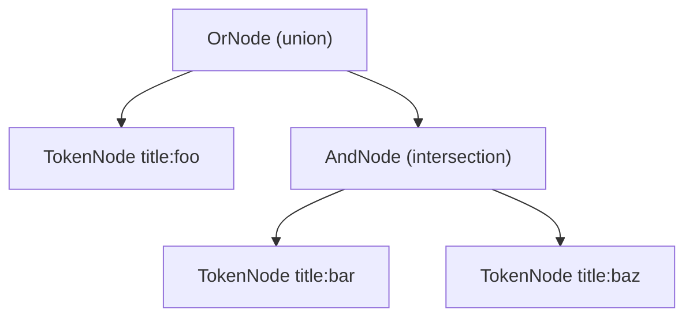

# kitty `--match` / search query parser: "or" + spaces excludes matches — bug or syntax?

> **TL;DR / Verdict — this is _not_ a bug; the parser is working exactly as designed.**
>
> kitty's `--match` search query parser requires every term to be written as **`field:query`** (e.g. `title:foo`), and alternatives must be joined by the **explicit keyword `or`**. **A space between two terms means AND (intersection), not OR.** Because AND binds *tighter* than OR, a query like `title:foo or title:bar title:baz` is read as `title:foo OR (title:bar AND title:baz)` — so items matching only one term get dropped. On top of that, **a bare word with no `field:` prefix raises a `ParseException`**, which is why the user's literal `foo or bar` returns *nothing useful at all* — it errors out on the first token `foo` before the `or` is ever reached. The fix is purely a matter of syntax: write **`title:foo or title:bar`** (union `{1,2,3}`), and use **parentheses** to group an OR before any adjacent term, e.g. `(title:foo or title:bar) and title:baz`.

---

## Document metadata

| | |
|---|---|
| **Repository** | `kovidgoyal/kitty` terminal emulator |
| **Commit (code-as-truth)** | `815df1e210e0a9ab4622f5c7f2d6891d7dbeddf1` (branch `kitty_815df1e210e0`) |
| **Parser under investigation** | `kitty/search_query_parser.py` (296 lines) |
| **Verdict** | Working as designed — *not* a defect. No source change required or made. |
| **Empirical method** | The real `search()` function was imported and executed against a controlled universe (see [Section E](#section-e--empirical-demonstration-r2) and the [Appendix](#section-i--evidence-index--appendix)). All eight outputs below were reproduced by running the actual parser. |

Every factual claim in this document is grounded in the checked‑out source at the commit above, cited in the form `path:Lstart-Lend`. Where the *live upstream* kitty documentation diverges from this commit, **the in‑repo code is treated as authoritative** — for example, the upstream docs mention a `session` match field, but **no such field exists in the window/tab field lists at this commit** (`kitty/boss.py:L493-495`, `kitty/boss.py:L529-531`), so it is deliberately not presented here.

---

## The user's question (restated faithfully)

> *I'm new to the kitty terminal emulator and I think I've found a bug in its **search query parser**. When I combine multiple search terms with **"or" and spaces** — for example **`foo or bar`** — items that should clearly match **at least one** of the terms are **excluded entirely** from the results. (R1) Can you investigate and explain what's happening? (R2) Could you run some test queries to demonstrate the behavior? (R3) And if this turns out to be me misusing the syntax rather than an actual bug, can you explain the correct way to write these queries?*

This document answers all three asks:

- **R1 — Mechanism:** [Section A](#section-a--mechanism-how-a-query-becomes-a-set) (grammar + set algebra), [Section B](#section-b--precedence--implicit-and-the-crux) (precedence + the implicit‑AND crux), [Section C](#section-c--every-term-needs-a-field-prefix) (mandatory `field:` prefix), and [Section D](#section-d--text-fields-match-by-regular-expression) (regex matching).
- **R2 — Demonstration:** [Section E](#section-e--empirical-demonstration-r2) — an eight‑row table produced by running the real parser, plus a parse‑tree diagram.
- **R3 — Correct syntax:** [Section G](#section-g--the-correct-syntax-r3).

The root‑cause verdict is in [Section F](#section-f--root-cause-verdict), the per‑conclusion rationale and edge cases in [Section H](#section-h--rationale-per-conclusion--edge-cases), and a claim‑to‑citation index in [Section I](#section-i--evidence-index--appendix).

---

## Section A — Mechanism: how a query becomes a set

The parser in `kitty/search_query_parser.py` is a small, classic **recursive‑descent Boolean parser**. It turns a query string into a **tree of nodes**, and each node evaluates itself using **set algebra** over a universe of candidate items (window ids or tab ids). Understanding the symptom requires understanding three things: the lexer, the node semantics, and (in [Section B](#section-b--precedence--implicit-and-the-crux)) the grammar that builds the tree.

### A.1 — The lexer discards whitespace

Tokenization is done by a `re.Scanner` built in `lex_scanner()` (`kitty/search_query_parser.py:L120-128`). It emits three meaningful token kinds — `WORD`, `QUOTED_WORD`, and `OPCODE` (the parentheses `(` / `)`) — and, crucially, the final scanner rule for whitespace maps to `None`:

```python
# kitty/search_query_parser.py:L127
(r'\s+',              None)
```

A `None` action in a `re.Scanner` means **"match this but emit no token."** So **spaces produce no token at all** — they are *not* an operator and carry *no* explicit meaning of their own. The operators `or` / `and` / `not` are not special lexer tokens either; they are ordinary `WORD` tokens that the *parser* recognizes by value (case‑insensitively — see [Section B](#section-b--precedence--implicit-and-the-crux)).

This is the first half of the surprise: because a space emits no token, the parser must *decide* what an adjacency of two terms means. As we will see, it decides **AND**.

### A.2 — The node types and their set-algebra semantics

The parser builds a tree from four node classes, each a `SearchTreeNode` whose `__call__(candidates, get_matches)` returns the subset of `candidates` it matches:

- **`OrNode` → UNION** (`kitty/search_query_parser.py:L57-69`). Its `__call__` (`kitty/search_query_parser.py:L63-65`) is literally:

  ```python
  # kitty/search_query_parser.py:L63-65
  def __call__(self, candidates, get_matches):
      lhs = self.lhs(candidates, get_matches)
      return lhs.union(self.rhs(candidates.difference(lhs), get_matches))
  ```

  > **Precision note (important):** the inner `candidates.difference(lhs)` is an **efficiency optimization**, *not* an exclusion. It simply means the right‑hand branch is only evaluated against candidates the left branch did **not** already match — there is no point re‑testing items already known to match. The outer `lhs.union(...)` makes the overall result the **union** of both branches. This `.difference()` must **not** be misread as a NOT/exclusion; `OrNode` is a pure union.

- **`AndNode` → INTERSECTION** (`kitty/search_query_parser.py:L72-85`). Its `__call__` (`kitty/search_query_parser.py:L79-81`) pipelines the right‑hand branch *over the left‑hand branch's matches*:

  ```python
  # kitty/search_query_parser.py:L79-81
  def __call__(self, candidates, get_matches):
      lhs = self.lhs(candidates, get_matches)
      return self.rhs(lhs, get_matches)
  ```

  Because the right side only searches *within* the set the left side already matched, the result is the **intersection** of the two branches. This is the mechanism that "drops" items: anything matching only one side is filtered out.

- **`NotNode` → SET DIFFERENCE** (`kitty/search_query_parser.py:L88-98`). Its `__call__` (`kitty/search_query_parser.py:L94-95`) returns everything in `candidates` that the inner branch did **not** match:

  ```python
  # kitty/search_query_parser.py:L94-95
  def __call__(self, candidates, get_matches):
      return candidates.difference(self.rhs(candidates, get_matches))
  ```

- **`TokenNode` → a single `field:query` match** (`kitty/search_query_parser.py:L101-112`). This is the leaf. Its `__call__` (`kitty/search_query_parser.py:L108-109`) delegates to the call‑site‑supplied matcher:

  ```python
  # kitty/search_query_parser.py:L108-109
  def __call__(self, candidates, get_matches):
      return get_matches(self.location, self.query, candidates)
  ```

  Here `self.location` is the field (e.g. `title`) and `self.query` is the value (e.g. `foo`). The actual per‑item comparison lives in the call site — for windows that is `kitty/window.py` (see [Section D](#section-d--text-fields-match-by-regular-expression)).

### A.3 — Entry points

A query is evaluated through `search()` (`kitty/search_query_parser.py:L292-296`), which delegates to the `@lru_cache(maxsize=64)`‑memoized `build_tree()` (`kitty/search_query_parser.py:L281-289`) and then calls `.search(universal_set, get_matches)` on the resulting root node. Parsing itself begins in `Parser.parse()` (`kitty/search_query_parser.py:L199-206`), which tokenizes the string and calls `or_expression()` (`kitty/search_query_parser.py:L203`) — i.e. the grammar starts at the OR level. That ordering is the heart of the precedence behavior, which we examine next.

---

## Section B — Precedence & implicit-AND (the crux)

This section is the core of the explanation. Two grammar facts combine to produce the user's symptom.

### B.1 — AND binds tighter than OR

The grammar is layered so that **OR sits at the top** and **AND sits beneath it**. `or_expression()` (`kitty/search_query_parser.py:L208-213`) first parses an AND‑expression as its left side, and only *then* looks for the keyword `or`:

```python
# kitty/search_query_parser.py:L208-213
def or_expression(self):
    lhs = self.and_expression()
    if self.lcase_token() == 'or':
        self.advance()
        return OrNode(lhs, self.or_expression())
    return lhs
```

Because `and_expression()` is consumed *before* an `or` is considered, **AND associates more tightly than OR**. In ordinary Boolean‑algebra terms this is the familiar "AND is like multiplication, OR is like addition" precedence — `a or b and c` means `a or (b and c)`.

### B.2 — A space between terms is an implicit AND, **not** an OR

This is the decisive, counter‑intuitive rule. `and_expression()` (`kitty/search_query_parser.py:L215-224`) first handles an *explicit* `and`, and then — critically — inserts an **implicit AND** whenever the next token is another `WORD`/`QUOTED_WORD`/`(` that is **not** the keyword `or`:

```python
# kitty/search_query_parser.py:L221-223
# Account for the optional 'and'
if ((self.token_type() in (TokenType.WORD, TokenType.QUOTED_WORD) or self.token() == '(') and self.lcase_token() != 'or'):
    return AndNode(lhs, self.and_expression())
```

Recall from [Section A.1](#a1--the-lexer-discards-whitespace) that whitespace emits **no token**. So when you write two terms separated only by a space, the parser — sitting on the second term with no operator in between — hits exactly this branch and wraps them in an `AndNode`. **The space is therefore an implicit AND (intersection).** The comment in the source, *"Account for the optional 'and'"*, says this explicitly: the `and` keyword is optional precisely because adjacency already means AND.

### B.3 — Operators are case-insensitive

The operator checks above use `lcase_token()` (`kitty/search_query_parser.py:L161-167`), which lower‑cases the token before comparing. So `or`/`OR`/`Or`, `and`/`AND`, and `not`/`NOT` are all recognized equivalently. (This is confirmed empirically in [Section E](#section-e--empirical-demonstration-r2), row 7: `title:foo OR title:bar` yields the same union as lowercase `or`.)

### B.4 — Putting B.1 and B.2 together

Combine "AND binds tighter than OR" with "a space is an implicit AND" and you get the surprising parse of the user's mixed query:

> `title:foo or title:bar title:baz` does **NOT** mean *"foo or bar or baz."*
>
> The trailing space between `title:bar` and `title:baz` is an implicit **AND**, and AND binds tighter than OR, so it parses as **`title:foo OR (title:bar AND title:baz)`**.

The parse tree (verified empirically via `build_tree()` introspection — see [Section E](#section-e--empirical-demonstration-r2)) is `OR(title:foo, AND(title:bar, title:baz))`. Any item that matches only `title:bar` (and not `title:baz`) is **excluded**, because it fails the inner intersection and is not picked up by the `title:foo` branch either. That is exactly the "items excluded entirely" symptom the user reported.

---

## Section C — Every term needs a `field:` prefix

The previous sections explain the *mixed* query. But the user's *literal* example, `foo or bar`, fails even earlier — and for a different, simpler reason.

### C.1 — The call sites disallow location-free terms

Every term must carry a `field:` (the code calls it a *location*) prefix. The parser supports an `allow_no_location` flag, but it **defaults to `False`** at every layer:

- `Parser.__init__(self, allow_no_location: bool = False)` — `kitty/search_query_parser.py:L148`
- `build_tree(..., allow_no_location: bool = False)` — `kitty/search_query_parser.py:L282`
- `search(..., allow_no_location: bool = False)` — `kitty/search_query_parser.py:L294`

And the real window call site in `kitty/boss.py` invokes `search(...)` **without** passing `allow_no_location`, so it takes the default `False`:

```python
# kitty/boss.py:L493-495
for wid in search(match, (
    'id', 'title', 'pid', 'cwd', 'cmdline', 'num', 'env', 'var', 'recent', 'state', 'neighbor',
), set(self.window_id_map), get_matches):
```

(The tab call site is parallel, also without `allow_no_location`, at `kitty/boss.py:L529-531`. The field tuples in these call sites are the authoritative list of valid fields at this commit — note that there is **no `session` field**, despite what the live upstream docs may show.)

### C.2 — A bare word raises `ParseException`

With `allow_no_location=False`, a `WORD` that does not resolve to a `location:value` form falls through to a raise in `base_token()`:

```python
# kitty/search_query_parser.py:L276-278
if self.allow_no_location:
    return TokenNode('all', ':'.join(words))
raise NoLocation(tt)
```

A token is only treated as having a location when it contains a colon *and* the part before the colon is a recognized field (`if len(words) > 1 and words[0].lower() in self.locations:` — `kitty/search_query_parser.py:L267`). A bare `foo` has no colon, so it raises `NoLocation` — a subclass of `ParseException` whose message is built in `kitty/search_query_parser.py:L136-143`:

```python
# kitty/search_query_parser.py:L136-143
class NoLocation(ParseException):
    def __init__(self, tt):
        a, sep, b = tt.partition(':')
        if sep == ':':
            super().__init__(f'{a} is not a recognized location in {tt}')
        else:
            super().__init__(f'No location specified before {tt}')
```

(A *quoted* word with no location raises analogously at `kitty/search_query_parser.py:L248-250`.) The repository's own canonical test asserts exactly this: bare `1` and quoted `"id:1"` both raise `ParseException` (`kitty_tests/search_query_parser.py:L29-30`).

### C.3 — Consequence for the user's `foo or bar`

Parsing is left‑to‑right and the very first token is the bare word `foo`. It has no `field:` prefix, so the parser raises **`ParseException: No location specified before foo`** *before it ever reaches the `or`*. The query does not return a "wrong" set — it does not evaluate at all. This is why "items that should match at least one term" appear "excluded entirely": from the user's vantage point, nothing matched. (See [Section E](#section-e--empirical-demonstration-r2), rows 1 and 2.)

---

## Section D — Text fields match by regular expression

The final ingredient explains why, once you *do* use `field:` prefixes, some items still appear or disappear in ways that can surprise.

### D.1 — The window matcher

For windows, the `get_matches` callback in `kitty/boss.py` delegates to `Window.matches_query()` (`kitty/window.py:L784-833`). After special‑casing numeric and enum fields (see [D.2](#d2--not-every-field-is-regex)), its **default branch** for text fields is:

```python
# kitty/window.py:L832-833
pat = compile_match_query(query, field not in ('env', 'var'))
return self.matches(field, pat)
```

`compile_match_query()` (`kitty/window.py:L213-222`) returns a compiled regular expression for simple fields — `re.compile(exp)` at `kitty/window.py:L215`. Then `matches()` (`kitty/window.py:L761-782`) applies it. For the **`title`** field it uses `re.search` (substring/regex search, *not* full‑string equality):

```python
# kitty/window.py:L773-774
if field == 'title':
    return pat.search(self.override_title or self.title) is not None
```

Because `re.search` looks for the pattern *anywhere* in the title, **`title:foo` also matches a window titled `foobar`.** This is why, in the demonstration universe, `title:foo` matches both `foo` (id 1) and `foobar` (id 3).

By contrast, `id`/`window_id` are matched by **exact** string equality, not regex (`pat.pattern == str(self.id)` — `kitty/window.py:L769-770`).

### D.2 — Not every field is regex

For completeness: a few fields are matched specially rather than by regex.

- **Numeric** fields `num` / `recent` are integer comparisons (`kitty/window.py:L785-795`).
- **`state`** is an enumerated comparison against values such as `active`, `focused`, `needs_attention`, etc. (`kitty/window.py:L796-816`).
- **`neighbor`** is an enumerated comparison (`left`/`right`/`top`/`bottom`) (`kitty/window.py:L817-830`).

The regex behavior in [D.1](#d1--the-window-matcher) applies to the *text* fields such as `title`, `cwd`, and `cmdline`.

### D.3 — Tabs are parallel

Tabs have their own `matches_query()` (`kitty/tabs.py:L800`) with the same shape; its `title` branch is `re.search(query, self.effective_title) is not None` (`kitty/tabs.py:L802`). The Boolean/precedence behavior is identical because tabs and windows share the *same* parser — only the per‑field matcher differs.


---

## Section E — Empirical demonstration (R2)

To satisfy the "build and run the source code" requirement, the **real** `search()` function was imported (with the repository root on `sys.path`) and executed against a small, controlled universe. No part of the kitty source was modified; the harness lived entirely in `/tmp` and was deleted afterward (its source is reproduced in the [Appendix](#section-i--evidence-index--appendix)).

**Universe (four windows):**

| id | title |
|---|---|
| 1 | `foo` |
| 2 | `bar` |
| 3 | `foobar` |
| 4 | `baz` |

The harness uses the exact **window** field tuple from `kitty/boss.py:L493-495` and a `get_matches` that mirrors `kitty/window.py`: **`title` is matched with `re.search`** and **`id` by exact string compare**. Under regex `search`, the single‑term matches are: `title:foo` → `{1,3}`, `title:bar` → `{2,3}`, `title:baz` → `{4}`, `title:foobar` → `{3}`.

### E.1 — Results table

| # | Query | Result | Why |
|---|-------|--------|-----|
| 1 | `foo` | `ParseException: No location specified before foo` | bare word, no `field:` prefix (`kitty/search_query_parser.py:L276-278`) |
| 2 | `foo or bar` | `ParseException: No location specified before foo` | fails on the **first** bare token, **before** `or` is parsed ([Section C.3](#c3--consequence-for-the-users-foo-or-bar)) |
| 3 | `title:foo title:bar` | `{3}` → `foobar` | **implicit‑AND** intersection: `{1,3} ∩ {2,3}` ([Section B.2](#b2--a-space-between-terms-is-an-implicit-and-not-an-or)) |
| 4 | `title:foo or title:bar` | `{1,2,3}` → `foo, bar, foobar` | explicit **OR = union** — the user's intended behavior (`kitty/search_query_parser.py:L63-65`) |
| 5 | `title:foo or title:bar title:baz` | `{1,3}` → `foo, foobar` | parses as `foo OR (bar AND baz)`; **bar‑only `id 2` is EXCLUDED** — the exact symptom ([Section B.4](#b4--putting-b1-and-b2-together)) |
| 6 | `(title:foo or title:bar) title:foobar` | `{3}` → `foobar` | parentheses force OR first: `(foo ∪ bar) ∩ foobar` |
| 7 | `title:foo OR title:bar` | `{1,2,3}` | operators are **case‑insensitive** — identical to lowercase `or` (`kitty/search_query_parser.py:L161-167`) |
| 8 | `all` (direct to parser) | `ParseException: No location specified before all` | `all` is intercepted by `kitty/boss.py` **before** the parser ever runs (`kitty/boss.py:L472-474`); see [Section H](#section-h--rationale-per-conclusion--edge-cases) |

> **The smoking gun is rows 3 and 5.** In both, a query the user expected to behave like OR instead **intersects**, dropping items that match only one term. Row 5 is the user's exact pattern: they intended `foo or bar or baz`, but `title:bar title:baz` collapsed into an AND, so the bar‑only window (`id 2`) vanished from the results. Row 4 shows the correctly‑written query returning the full union the user wanted.

### E.2 — Grounding against the repository's own test

The repository ships a canonical test, `kitty_tests/search_query_parser.py` (`L11-30`), which uses `locations='id'`, a universe of `{1,2,3,4,5}`, and an **exact**‑match `get_matches`. Re‑running those exact cases through the live parser reproduced every documented expectation:

| Query | Result | Test line |
|---|---|---|
| `id:1` | `{1}` | `L22` |
| `id:"1"` | `{1}` | `L23` |
| `id:1 and id:1` | `{1}` | `L24` |
| `id:1 or id:2` | `{1,2}` (union) | `L25` |
| `id:1 and id:2` | `∅` (empty intersection) | `L26` |
| `not id:1` | `{2,3,4,5}` (difference) | `L27` |
| `(id:1 or id:2) and id:1` | `{1}` | `L28` |
| `1` (bare) | `ParseException` | `L29` |
| `"id:1"` (quoted, no location) | `ParseException` | `L30` |

These confirm, against the project's own authoritative expectations, that OR is union (`L25`), AND is intersection (`L26`, empty here), NOT is set difference (`L27`), parentheses group as expected (`L28`), and location‑free terms raise (`L29-30`).

### E.3 — Parse-tree diagram (the crux query)

Introspecting the tree produced by `build_tree()` confirms the shape of the crux query `title:foo or title:bar title:baz` is `OR(title:foo, AND(title:bar, title:baz))`:



For contrast, the other two shapes (also verified via introspection) are:

- `(title:foo or title:bar) title:foobar` → `AND(OR(title:foo, title:bar), title:foobar)` — the parentheses force the OR to be evaluated first, then intersected with `title:foobar`.
- `title:foo title:bar` → `AND(title:foo, title:bar)` — two adjacent terms with no operator collapse straight into an AND.

---

## Section F — Root-cause verdict

**Working as designed — not a bug.** The reported symptom is the combined effect of **four** deliberate, documented behaviors, each proven above:

1. **A space between terms is an implicit AND / intersection** (not OR) — `kitty/search_query_parser.py:L221-223` ([Section B.2](#b2--a-space-between-terms-is-an-implicit-and-not-an-or)).
2. **AND binds tighter than OR** — the grammar layering `or_expression()` over `and_expression()` at `kitty/search_query_parser.py:L208-213` and `L215-224` ([Section B.1](#b1--and-binds-tighter-than-or)).
3. **Every term needs a `field:` prefix** — bare words raise `ParseException` because the call sites use the default `allow_no_location=False` (`kitty/search_query_parser.py:L276-278`, `kitty/boss.py:L493-495`) ([Section C](#section-c--every-term-needs-a-field-prefix)).
4. **Text fields match by regular expression** — so `title:foo` also matches `foobar` (`kitty/window.py:L832-833`, `L773-774`) ([Section D](#section-d--text-fields-match-by-regular-expression)).

Behaviors (1) and (2) turn `... or title:bar title:baz` into `... or (title:bar AND title:baz)`, dropping single‑term matches; behavior (3) makes the user's literal `foo or bar` error out before it even evaluates; and behavior (4) governs which items each term matches in the first place. None of these is a defect — they are the parser's defined semantics, corroborated by the project's own test suite and user documentation.

---

## Section G — The correct syntax (R3)

The behavior is a **syntax misuse**, not a bug, so the remedy is to write the queries the way the parser expects:

1. **Every term must be `field:query`.** Examples: `title:foo`, `id:43`, `cwd:/home`. A bare word with no field always raises (`kitty/search_query_parser.py:L276-278`).
2. **Join alternatives with the explicit keyword `or` — never a space.** A space is an implicit AND ([Section B.2](#b2--a-space-between-terms-is-an-implicit-and-not-an-or)).
3. **Use parentheses to group an OR** before any adjacent (implicit‑AND) term, so the grouping is unambiguous and the OR is evaluated first.
4. **Quote values that contain spaces**, e.g. `title:"My special window"`.

### G.1 — Fixing the user's queries

| The user wrote… | They meant… | Write this instead | Result |
|---|---|---|---|
| `foo or bar` | match items whose title is `foo` **or** `bar` | **`title:foo or title:bar`** | union `{1,2,3}` |
| `title:foo or title:bar title:baz` | `(foo or bar) and also baz` | **`(title:foo or title:bar) and title:baz`** | the intended grouped result |

The first correction is the direct answer to the user's example: replace the bare words with `field:` terms and keep the explicit `or`. The second shows that when you *do* want a mix of OR and AND, **parentheses** are required to override the default "AND binds tighter than OR" precedence.

### G.2 — Consistency with the official documentation and tests

This guidance matches kitty's own user‑facing documentation for `--match`, `docs/remote-control.rst` (the `.. _search_syntax:` section at `L327`). The docs define a criterion as an expression of the form `field:query` (`docs/remote-control.rst:L335`) and give these four canonical Boolean examples (`docs/remote-control.rst:L340-343`):

```text
title:"My special window" or id:43
title:bash and env:USER=kovid
not id:1
(id:2 or id:3) and title:something
```

Every one of these uses explicit `field:` prefixes, an explicit Boolean keyword between alternatives, parentheses to group an OR, and quoting for values with spaces — exactly the rules above. They are also consistent with the canonical test expectations in `kitty_tests/search_query_parser.py:L22-30`.


---

## Section H — Rationale per conclusion + edge cases

Per the project's "explain the thinking, not just the conclusion" rule, here is *how* each conclusion was reached, plus two edge cases discovered in the code.

### H.1 — Why each conclusion holds

- **"A space means AND."** We did not infer this from behavior alone — we read the grammar. `and_expression()` inserts an `AndNode` whenever the next token is a non‑`or` `WORD`/`QUOTED_WORD`/`(` (`kitty/search_query_parser.py:L221-223`), and the lexer emits no token for whitespace (`kitty/search_query_parser.py:L127`), so adjacency *is* the trigger. We then **confirmed** it empirically by introspecting the parse tree: `title:foo title:bar` → `AND(title:foo, title:bar)` ([Section E.3](#e3--parse-tree-diagram-the-crux-query)).
- **"AND binds tighter than OR."** `or_expression()` calls `and_expression()` for its left side *before* testing for `or` (`kitty/search_query_parser.py:L208-213`), so an AND‑group is always fully formed before an `or` can split it. The crux tree `OR(title:foo, AND(title:bar, title:baz))` is the direct, observed consequence.
- **"Bare words raise."** The default `allow_no_location=False` (`kitty/search_query_parser.py:L148`, `L282`, `L294`) is carried through unchanged by the window call site (`kitty/boss.py:L493-495`), and `base_token()` raises `NoLocation` for a location‑free word (`kitty/search_query_parser.py:L276-278`). The repository's own test pins this down (`kitty_tests/search_query_parser.py:L29`).
- **"Text fields are regex."** The default branch of `matches_query()` compiles the query into a regex (`kitty/window.py:L832-833` → `kitty/window.py:L215`) and `matches()` applies `re.search` for `title` (`kitty/window.py:L773-774`). That is why `title:foo` also matches `foobar`, observed directly in rows 3–6.
- **"OrNode is a union, not an exclusion."** `OrNode.__call__` is `lhs.union(self.rhs(candidates.difference(lhs), ...))` (`kitty/search_query_parser.py:L63-65`). The inner `.difference(lhs)` only narrows *which* candidates the right branch is tested against (an optimization); the outer `.union(...)` is what defines the result. Row 4 (`{1,2,3}`) confirms the union semantics.

### H.2 — Edge case: the special value `all`

There is a special match string `all` that selects every window/tab — but it is handled **outside** the parser. `match_windows()` short‑circuits it before any parsing happens:

```python
# kitty/boss.py:L472-474
if match == 'all':
    yield from self.all_windows
    return
```

`match_tabs()` does the same at `kitty/boss.py:L506-508`. The consequence is twofold: (a) `all` works **only as the entire match string**, never as a sub‑expression inside a Boolean query; and (b) if you feed `all` *directly* to the parser (bypassing `boss.py`), it is just a bare word with no `field:` and raises `ParseException: No location specified before all` — exactly what row 8 of [Section E.1](#e1--results-table) shows. This is why the demonstration treats row 8 as a parser‑level result while noting the real product never sends `all` to the parser.

### H.3 — Edge case: negative numeric ids

The window call site's `get_matches` normalizes **negative** ids to absolute ones before matching (`kitty/boss.py:L484-490`): a query like `id:-1` is converted to `id:(window_id_limit + (-1))`, letting users address windows from the end. This is a call‑site convenience, **not** parser behavior — the parser still just produces a `TokenNode('id', '-1')` and hands it to `get_matches`. It is mentioned here only so the field semantics are complete; it does not affect any of the `title`/`or`/space behaviors central to the user's question.

---

## Section I — Evidence index & appendix

### I.1 — Claim-to-citation index

| Claim | Citation |
|---|---|
| `OrNode` = union (with inner `.difference` as an optimization) | `kitty/search_query_parser.py:L63-65` |
| `AndNode` = intersection (RHS pipelined over LHS) | `kitty/search_query_parser.py:L79-81` |
| `NotNode` = set difference | `kitty/search_query_parser.py:L94-95` |
| `TokenNode` delegates to `get_matches` | `kitty/search_query_parser.py:L108-109` |
| Lexer discards whitespace (`\s+` → `None`) | `kitty/search_query_parser.py:L127` |
| OR at top level | `kitty/search_query_parser.py:L208-213` |
| AND beneath OR + **implicit‑AND** insertion | `kitty/search_query_parser.py:L215-224` (core `L221-223`) |
| Operators case‑insensitive (`lcase_token`) | `kitty/search_query_parser.py:L161-167` |
| `allow_no_location` defaults to `False` | `kitty/search_query_parser.py:L148`, `L282`, `L294` |
| Bare word → `NoLocation` (`ParseException`) | `kitty/search_query_parser.py:L276-278`; message `L136-143` |
| Quoted word, no location → raises | `kitty/search_query_parser.py:L248-250` |
| `search()` / `build_tree()` entry points | `kitty/search_query_parser.py:L292-296`, `L281-289` |
| Window call site (default `allow_no_location`) + field list (no `session`) | `kitty/boss.py:L493-495` |
| Tab field list | `kitty/boss.py:L529-531` |
| `all` short‑circuit (windows / tabs) | `kitty/boss.py:L472-474`, `L506-508` |
| Negative‑id normalization | `kitty/boss.py:L484-490` |
| Window text fields = regex; default branch | `kitty/window.py:L832-833` |
| `compile_match_query` → `re.compile` | `kitty/window.py:L213-222` (`L215`) |
| `title` via `re.search`; `id` exact | `kitty/window.py:L773-774`; `L769-770` |
| Tab `matches_query` / `title` regex | `kitty/tabs.py:L800`, `L802` |
| Canonical semantics (OR/AND/NOT/parens/raises) | `kitty_tests/search_query_parser.py:L22-30` |
| Documented `--match` syntax + Boolean examples | `docs/remote-control.rst:L327`, `L335`, `L340-343` |

All line numbers were verified against the checked‑out source at commit `815df1e210e0a9ab4622f5c7f2d6891d7dbeddf1`. All result sets were produced by executing the real parser on Python 3.13.7 (the parser uses only the standard library — `re`, `enum`, `functools.lru_cache`, `gettext`, `typing` — plus the stdlib‑backed in‑repo helper `from .types import run_once`, so its behavior is interpreter‑version‑invariant across kitty's supported range of Python `>=3.8`).

### I.2 — Reproducible methodology (transient harness)

The empirical results were produced by a small harness created **outside** the repository (in `/tmp`), run with `PYTHONDONTWRITEBYTECODE=1` so no `__pycache__`/`*.pyc` was written into the working tree (`*.pyc` and `__pycache__/` are gitignored at `.gitignore:L2` and `.gitignore:L20` in any case), and then **deleted**. No file in the kitty source tree was created, modified, or removed; `git status` reported a clean working tree before and after. The harness is reproduced below for transparency — it was **not** committed to the repository.

```python
# Run OUTSIDE the repo, e.g. saved to /tmp/sqp_harness.py and then deleted.
# Usage:  PYTHONDONTWRITEBYTECODE=1 python3 /tmp/sqp_harness.py /path/to/kitty/repo
import os, re, sys
REPO = sys.argv[1]
sys.path.insert(0, REPO)

from kitty.search_query_parser import (
    ParseException, search, build_tree, OrNode, AndNode, NotNode, TokenNode,
)

# --- Window call-site replication ---------------------------------------
# locations tuple verbatim from kitty/boss.py:L493-495
WINDOW_LOCATIONS = (
    'id', 'title', 'pid', 'cwd', 'cmdline', 'num', 'env', 'var', 'recent', 'state', 'neighbor',
)
UNIVERSE = {1: 'foo', 2: 'bar', 3: 'foobar', 4: 'baz'}

def get_matches(location, query, candidates):
    # mirrors kitty/window.py: title -> re.search, id -> exact str compare
    res = set()
    for wid in candidates:
        title = UNIVERSE[wid]
        if location == 'title' and re.search(query, title) is not None:
            res.add(wid)
        elif location == 'id' and query == str(wid):
            res.add(wid)
    return res

def run(q):
    try:
        r = search(q, WINDOW_LOCATIONS, set(UNIVERSE), get_matches)
        return f"{sorted(r)} -> " + ", ".join(UNIVERSE[i] for i in sorted(r))
    except ParseException as e:
        return f"ParseException: {e.msg}"

for q in ['foo', 'foo or bar', 'title:foo title:bar', 'title:foo or title:bar',
          'title:foo or title:bar title:baz', '(title:foo or title:bar) title:foobar',
          'title:foo OR title:bar', 'all']:
    print(f"{q!r:48} {run(q)}")

# --- Parse-tree introspection -------------------------------------------
def describe(n):
    if isinstance(n, OrNode):  return f"OR({describe(n.lhs)}, {describe(n.rhs)})"
    if isinstance(n, AndNode): return f"AND({describe(n.lhs)}, {describe(n.rhs)})"
    if isinstance(n, NotNode): return f"NOT({describe(n.rhs)})"
    if isinstance(n, TokenNode): return f"{n.location}:{n.query}"
    return "?"

for q in ['title:foo or title:bar title:baz',
          '(title:foo or title:bar) title:foobar', 'title:foo title:bar']:
    print(f"{q!r:46} -> {describe(build_tree(q, WINDOW_LOCATIONS))}")
```

Running the harness above reproduces the eight outputs in [Section E.1](#e1--results-table) and the three parse‑tree shapes in [Section E.3](#e3--parse-tree-diagram-the-crux-query) verbatim.

### I.3 — Final answer in one line

Your query isn't hitting a bug — kitty reads a **space as AND** and requires a **`field:` prefix** on every term, so write your "match either" query as **`title:foo or title:bar`** (and wrap an OR in parentheses when you mix it with other terms).

