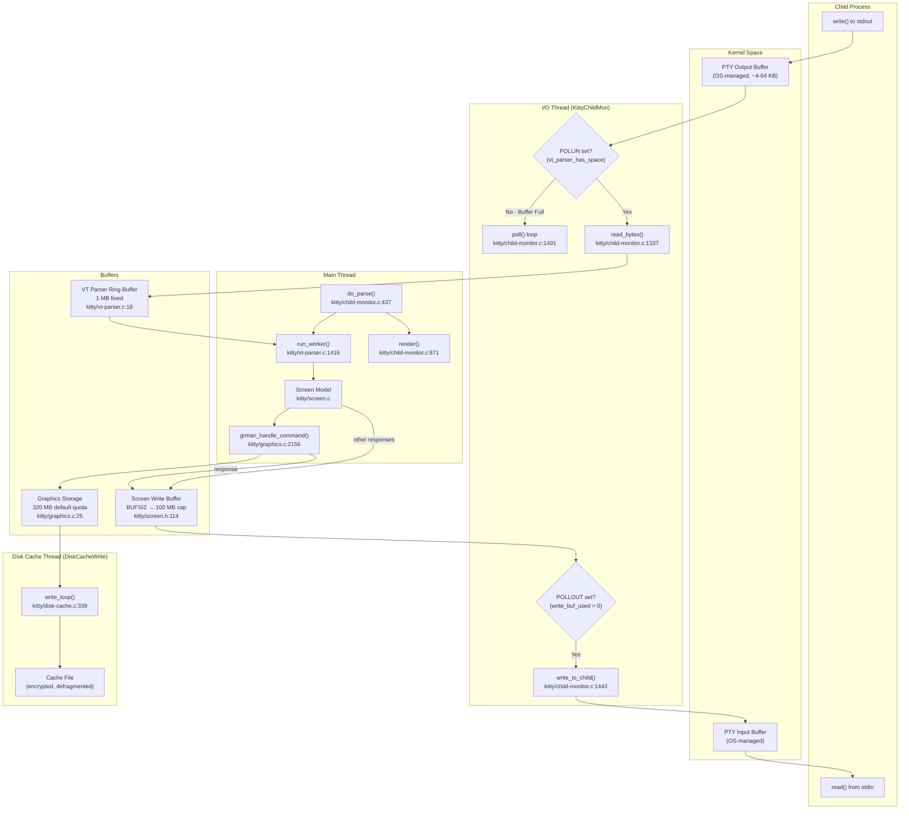
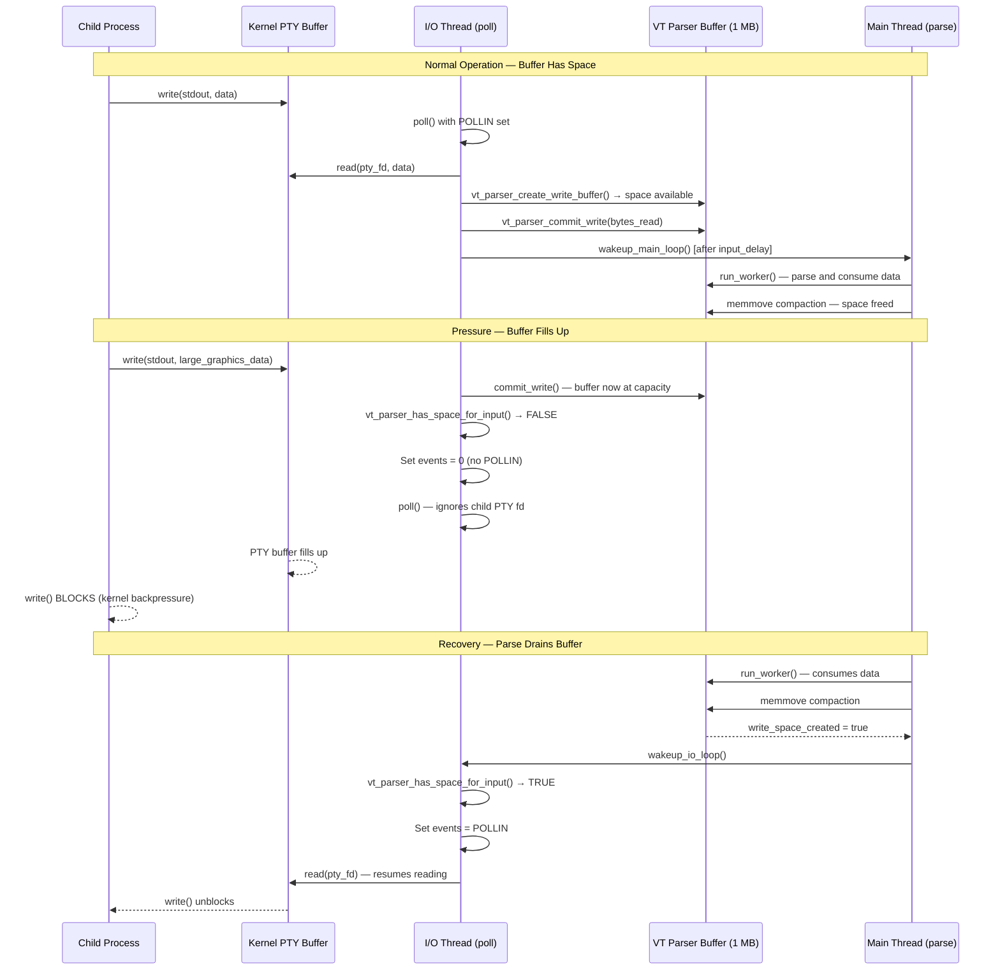
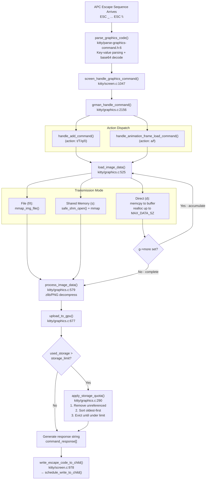
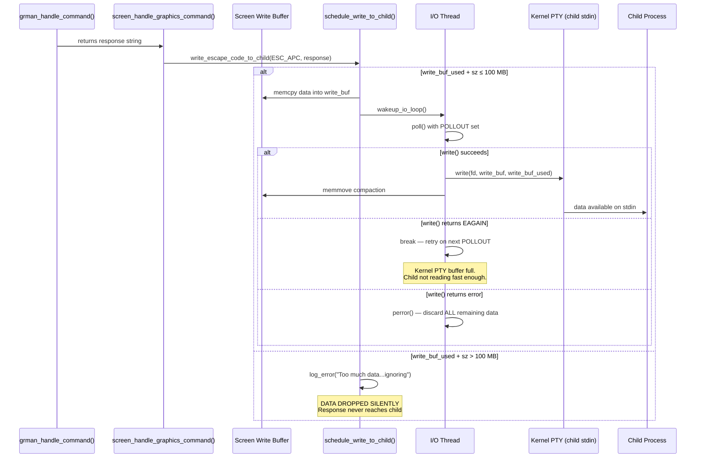
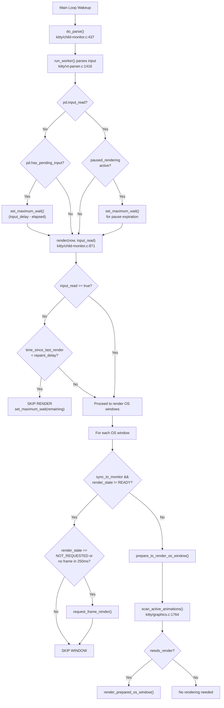

# Kitty Terminal: Graphics Data Pressure, Buffering, Flow Control, and Backpressure — An Investigative Analysis

---

**Document Metadata**

| Field | Value |
|---|---|
| **Source Branch** | `kitty_815df1e210e0` |
| **Repository** | kovidgoyal/kitty |
| **Scope** | Internal subsystem analysis of graphics data pressure handling |
| **Method** | Read-only source code analysis — no repository files modified |
| **Citation Format** | `Source: <file_path>:<line_or_range>` |

---

## Table of Contents

- [1. Introduction](#1-introduction)
  - [1.1 Questions Under Investigation](#11-questions-under-investigation)
  - [1.2 Scope and Methodology](#12-scope-and-methodology)
- [2. Architecture Overview](#2-architecture-overview)
  - [2.1 The Three-Thread Model](#21-the-three-thread-model)
  - [2.2 Buffer Locations and Capacities](#22-buffer-locations-and-capacities)
  - [2.3 Thread Architecture Diagram](#23-thread-architecture-diagram)
- [3. VT Parser Buffer and Input Backpressure](#3-vt-parser-buffer-and-input-backpressure)
  - [3.1 The 1 MB Ring Buffer](#31-the-1-mb-ring-buffer)
  - [3.2 input_delay Threshold and Early Flush](#32-input_delay-threshold-and-early-flush)
  - [3.3 Poll-Level POLLIN Gating — The Primary Backpressure Mechanism](#33-poll-level-pollin-gating--the-primary-backpressure-mechanism)
  - [3.4 Backpressure Propagation Diagram](#34-backpressure-propagation-diagram)
- [4. Graphics Data Ingestion Under Pressure](#4-graphics-data-ingestion-under-pressure)
  - [4.1 APC Command Parsing](#41-apc-command-parsing)
  - [4.2 Chunked Payload Loading](#42-chunked-payload-loading)
  - [4.3 MAX_DATA_SZ and Size Limits](#43-max_data_sz-and-size-limits)
  - [4.4 Storage Quota and LRU Eviction](#44-storage-quota-and-lru-eviction)
  - [4.5 Graphics Ingestion Pipeline Diagram](#45-graphics-ingestion-pipeline-diagram)
- [5. Write-Back Path Under Output Congestion](#5-write-back-path-under-output-congestion)
  - [5.1 Screen Write Buffer Lifecycle](#51-screen-write-buffer-lifecycle)
  - [5.2 The 100 MB Cap and Silent Discard](#52-the-100-mb-cap-and-silent-discard)
  - [5.3 POLLOUT-Driven Draining](#53-pollout-driven-draining)
  - [5.4 Write-Back Congestion Diagram](#54-write-back-congestion-diagram)
- [6. Render Timing and Frame Throttling](#6-render-timing-and-frame-throttling)
  - [6.1 repaint_delay Enforcement](#61-repaint_delay-enforcement)
  - [6.2 Render Frame Readiness and sync_to_monitor](#62-render-frame-readiness-and-sync_to_monitor)
  - [6.3 Synchronized Updates — PENDING_MODE 2026](#63-synchronized-updates--pending_mode-2026)
  - [6.4 Render Timing Decision Tree Diagram](#64-render-timing-decision-tree-diagram)
- [7. Disk Cache Under Sustained Load](#7-disk-cache-under-sustained-load)
  - [7.1 DiskCache Structure and Background Writer](#71-diskcache-structure-and-background-writer)
  - [7.2 XOR Encryption of Cached Data](#72-xor-encryption-of-cached-data)
  - [7.3 Hole Tracking and Space Reuse](#73-hole-tracking-and-space-reuse)
  - [7.4 Defragmentation](#74-defragmentation)
  - [7.5 Lazy Initialization](#75-lazy-initialization)
- [8. Animation Frame Pressure](#8-animation-frame-pressure)
  - [8.1 Animation Frame Scanning](#81-animation-frame-scanning)
  - [8.2 Interaction with Render Timing](#82-interaction-with-render-timing)
- [9. Runtime Observability](#9-runtime-observability)
  - [9.1 Silent Adaptations](#91-silent-adaptations)
  - [9.2 Observable Side Effects](#92-observable-side-effects)
  - [9.3 Characterization Summary](#93-characterization-summary)
- [10. Code Location Reference Table](#10-code-location-reference-table)
- [11. Constants Catalog](#11-constants-catalog)
- [12. Summary — Answers to the Six Questions](#12-summary--answers-to-the-six-questions)
  - [12.1 R-01 — Graphics Ingestion Under Load](#121-r-01--graphics-ingestion-under-load)
  - [12.2 R-02 — Buffer, Pause, and Throttle Decisions](#122-r-02--buffer-pause-and-throttle-decisions)
  - [12.3 R-03 — Write-Back Under Pressure](#123-r-03--write-back-under-pressure)
  - [12.4 R-04 — Code Locations](#124-r-04--code-locations)
  - [12.5 R-05 — Runtime Observability](#125-r-05--runtime-observability)
  - [12.6 R-06 — Adaptation vs. Visibility](#126-r-06--adaptation-vs-visibility)

---

## 1. Introduction

This document is an investigative analysis of how the kitty terminal emulator handles terminal graphics data that arrives at a rate exceeding the system's comfortable processing capacity. It traces the exact code paths responsible for buffering, flow control, backpressure, write-buffer management, storage quotas, and render-timing decisions, and explains how these mechanisms manifest at runtime when the terminal is under sustained graphics throughput pressure.

Every technical claim in this document is backed by direct source code citation. No assumptions are made — the code is the source of truth.

### 1.1 Questions Under Investigation

This analysis addresses six core questions:

1. **R-01 — Graphics Ingestion Under Load:** How does kitty handle large volumes of terminal graphics data arriving faster than the system can process it? What code modules implement buffering, chunked loading, and payload size limits?

2. **R-02 — Buffer, Pause, and Throttle Decisions:** How does the terminal decide whether to buffer, pause, or slow down data processing? What is the role of the VT parser's ring buffer, `input_delay`, and the buffer-full flush condition?

3. **R-03 — Write-Back Under Pressure:** What happens when the terminal needs to write response data (e.g., graphics acknowledgments) back to the child process while the output path is already congested? What is the role of the screen write buffer, its capacity limit, and POLLOUT-driven draining?

4. **R-04 — Code Locations:** Where do these decisions live in the source code? What are the file paths, function names, and line numbers?

5. **R-05 — Runtime Observability:** What are the visible and measurable signs at runtime when the terminal shifts into pressure-handling behavior?

6. **R-06 — Adaptation vs. Visibility:** Is the system's adaptation silent (internal) or does it produce observable side effects?

### 1.2 Scope and Methodology

**In scope:**
- VT parser input buffering and backpressure (`kitty/vt-parser.c`, `kitty/vt-parser.h`)
- I/O loop polling, read/write flow control (`kitty/child-monitor.c`)
- Graphics command parsing, payload ingestion, storage quotas (`kitty/graphics.c`, `kitty/graphics.h`, `kitty/parse-graphics-command.h`)
- Screen write buffer management and response path (`kitty/screen.c`, `kitty/screen.h`)
- Disk cache persistence under load (`kitty/disk-cache.c`, `kitty/disk-cache.h`)
- Render timing and frame throttling (`kitty/child-monitor.c`, `kitty/options/definition.py`, `kitty/state.h`)
- Synchronized updates (`kitty/screen.c`, `kitty/control-codes.h`)
- Event loop wakeup mechanisms (`kitty/loop-utils.c`, `kitty/loop-utils.h`)

**Out of scope:**
- GPU shader internals, font rendering, remote control, shell integration
- Platform-specific code paths (macOS, Wayland) unless they directly affect generic flow control
- Modifications to any existing repository files

**Methodology:**
- Direct source code reading with line-level citation
- Structural analysis of data flow between threads and buffers
- Mermaid diagrams for visual representation of complex interactions
- Analysis of test suites (`kitty_tests/graphics.py`, `kitty_tests/parser.py`) for behavioral validation
- Cross-referencing of configuration documentation (`docs/performance.rst`) with implementation

### 1.3 Key Terminology

Throughout this document, the following terms are used consistently:

| Term | Definition | Context |
|------|-----------|---------|
| **VT parser buffer** | The 1 MB flat buffer in `kitty/vt-parser.c` that holds raw bytes from the PTY | Input path |
| **Write buffer** | The dynamically-sized `Screen.write_buf` that holds data to be sent to the child | Output path |
| **Graphics storage** | The per-`GraphicsManager` memory pool for image pixel data (GPU textures) | Storage |
| **Disk cache** | The file-backed persistent cache for animation frame data | Storage |
| **Backpressure** | The mechanism by which kitty stops reading from the PTY, causing the child process's writes to block | Flow control |
| **POLLIN gating** | The specific technique of not setting the `POLLIN` flag in `poll()` to stop reading from a PTY fd | Flow control |
| **Chunked loading** | The process of accumulating graphics payload across multiple APC commands (`g->more = 1`) | Graphics |
| **LRU eviction** | The least-recently-used algorithm for removing old images when storage quota is exceeded | Storage |
| **Synchronized update** | The `PENDING_MODE 2026` mechanism that freezes rendering while the application updates the screen | Rendering |
| **Parse cycle** | One execution of `do_parse()` → `run_worker()` on the main thread | Processing |
| **Render cycle** | One execution of `render()` → `render_os_window()` on the main thread | Rendering |
| **I/O cycle** | One iteration of the `poll()` loop in the I/O thread | I/O |

### 1.4 Document Structure

This document follows a **progressive disclosure** structure:

1. **Section 2** provides a high-level architecture overview — the thread model, buffer locations, and data flow diagram
2. **Sections 3-8** dive deep into each subsystem: VT parser, graphics engine, write buffer, render timing, disk cache, and animation
3. **Section 9** synthesizes findings into runtime observability analysis
4. **Sections 10-11** provide reference tables for code locations and constants
5. **Section 12** directly answers each of the six questions

Each subsystem section follows the pattern: **What it does → Where it lives → When it triggers → What the effect is → Why it was designed this way.**

---

## 2. Architecture Overview

### 2.1 The Three-Thread Model

Kitty employs a three-thread architecture for managing child processes and rendering:

**I/O Thread ("KittyChildMon"):**
- Entry point: `io_loop()` — `Source: kitty/child-monitor.c:1480-1578`
- Thread name set via `set_thread_name("KittyChildMon")` — `Source: kitty/child-monitor.c:1489`
- Runs a continuous `poll()` loop over all child PTY file descriptors
- Reads data from child processes via `read_bytes()` — `Source: kitty/child-monitor.c:1337-1356`
- Writes buffered response data back to children via `write_to_child()` — `Source: kitty/child-monitor.c:1443-1478`
- Wakes the main loop when new data arrives, throttled by `input_delay` — `Source: kitty/child-monitor.c:1562-1570`

> **Rationale:** The I/O thread is the boundary between the kernel's PTY subsystem and kitty's internal processing. It is responsible for all PTY reads and writes, and it is the first point where backpressure decisions are made (via POLLIN gating). By running in a dedicated thread, it can block on `poll()` without stalling the main thread's rendering.

**Main Thread:**
- Runs `do_parse()` to dispatch VT parser work — `Source: kitty/child-monitor.c:437-448`
- `do_parse()` calls `parse_worker` → `run_worker()` in `kitty/vt-parser.c:1416-1446`, which parses buffered input and dispatches it to the screen model
- Calls `render()` after parsing — `Source: kitty/child-monitor.c:871-896`
- Handles render-frame readiness, `repaint_delay`, and synchronized update expiration

> **Rationale:** The main thread owns the screen state and GPU context. By separating parsing from I/O, the main thread can batch input processing (via `input_delay`) and coalesce multiple screen updates into a single render pass, reducing CPU and GPU overhead under heavy throughput.

**Talk Thread:**
- Handles remote control socket connections
- Not relevant to graphics data pressure — included here for completeness

**Data Passing Between Threads:**

The threads communicate through shared memory structures protected by mutexes, plus eventfd/self-pipe wakeup mechanisms:

1. **I/O → Main Thread (input data):**
   - I/O thread writes into the VT parser buffer via `vt_parser_create_write_buffer()` / `vt_parser_commit_write()` (`Source: kitty/vt-parser.c:1450-1474`)
   - Protected by `PS.lock` (pthread mutex) — `Source: kitty/vt-parser.c:207`
   - Wakeup via `wakeup_main_loop()` using eventfd — `Source: kitty/loop-utils.c:112-127`

2. **Main → I/O Thread (response data):**
   - Main thread writes response data into `Screen.write_buf` via `schedule_write_to_child()` (`Source: kitty/child-monitor.c:323-369`)
   - Protected by `Screen.write_buf_lock` — `Source: kitty/screen.h:116`
   - Wakeup via `wakeup_io_loop()` — `Source: kitty/child-monitor.c:225-227`

3. **Main → I/O Thread (write_space_created signal):**
   - After parsing consumes data and compacts the buffer, `write_space_created = true` — `Source: kitty/vt-parser.c:1438`
   - `do_parse()` calls `wakeup_io_loop()` — `Source: kitty/child-monitor.c:442`
   - This unblocks the I/O thread's `poll()` so it can resume reading

4. **Main Thread → Disk Cache Thread:**
   - `add_to_disk_cache()` writes data into a `CacheEntry` and wakes the writer — `Source: kitty/disk-cache.c:375+`
   - Protected by `DiskCache.lock` — `Source: kitty/disk-cache.c:50`
   - Wakeup via writing to `DiskCache.loop_data.wakeup_write_fd`

> **Rationale for mutex-based IPC:** Kitty uses mutexes rather than lock-free data structures because the contention pattern is low: the I/O thread acquires the parser lock briefly to commit a write, and the main thread acquires it briefly to compact the buffer. The critical sections are short (a few pointer updates and memcpy operations). The eventfd/pipe wakeup mechanism ensures threads don't busy-wait — they sleep in `poll()` and are woken only when there is work to do.

**Event Loop Wakeup Mechanism:**

The wakeup facility is provided by `kitty/loop-utils.c`:

```c
bool
init_loop_data(LoopData *ld, ...) {
    // ...
#ifdef HAS_EVENT_FD
    int fd = eventfd(0, EFD_CLOEXEC | EFD_NONBLOCK);
    if (fd == -1) { perror("Failed to create eventfd"); return false; }
    ld->wakeup_read_fd = fd;
    ld->wakeup_write_fd = fd;
#else
    int fds[2];
    if (pipe2(fds, O_CLOEXEC | O_NONBLOCK) != 0) { perror("Failed to create self-pipe"); return false; }
    ld->wakeup_read_fd = fds[0];
    ld->wakeup_write_fd = fds[1];
#endif
    // ...
}
```
`Source: kitty/loop-utils.c:58-77`

Waking a loop:
```c
bool
wakeup_loop(LoopData *ld, bool in_signal_handler, const char *loop_name) {
    while (true) {
        static const uint64_t value = 1;
        ssize_t ret;
        if (ld->wakeup_write_fd == ld->wakeup_read_fd) // eventfd
            ret = write(ld->wakeup_write_fd, &value, sizeof(value));
        else // self-pipe
            ret = write(ld->wakeup_write_fd, "w", 1);
        // ... EINTR retry ...
    }
}
```
`Source: kitty/loop-utils.c:112-127`

On Linux, `eventfd` is preferred for efficiency (single fd, atomic counter). On platforms without `eventfd`, a self-pipe (two fds) is used instead.

**Main loop structure:**

The main thread's event loop (driven by GLFW/Cocoa event processing) repeatedly calls `do_parse()` for each child and then `render()`. The simplified flow:

```
Main Loop:
    while (running) {
        process_OS_events()                   // GLFW/Cocoa events
        for each child in children:
            do_parse(child)                   // Parse VT data, handle graphics
        render(now, any_input_read)           // Render if needed
        wait_for_events(maximum_wait)         // Sleep until next event
    }
```

The `maximum_wait` is set by various subsystems:
- `repaint_delay - time_since_last_render`: If render was skipped due to `repaint_delay`
- `paused_rendering.expires_at - now`: If a synchronized update is pending
- `input_delay`: If the I/O thread has pending wakeups
- `minimum_gap` from animation scanning: If animations need their next frame

The smallest of these values determines how long the main thread sleeps. Under heavy load, `maximum_wait` is typically 0 (immediate wake) because new input keeps arriving.

**I/O loop structure:**

The I/O thread's `io_loop()` (`Source: kitty/child-monitor.c:1480-1578`) follows this pattern:

```
I/O Loop:
    while (running) {
        for each child:
            set events = (has_space ? POLLIN : 0) | (has_write_data ? POLLOUT : 0)
        poll(fds, count, timeout)             // Wait for I/O readiness
        drain wakeup fd if signaled
        for each child with POLLIN:
            read_bytes(child)                 // Read PTY → VT buffer
        for each child with POLLOUT:
            write_to_child(child)             // Write buffer → PTY
        if data_received and input_delay_elapsed:
            wakeup_main_loop()                // Signal main thread
    }
```

The `timeout` parameter to `poll()`:
- `-1` (infinite) when there are no pending wakeups — thread sleeps until I/O is ready
- `input_delay - elapsed` when there are pending wakeups but the delay hasn't expired
- `0` (immediate) when processing wakeup drain

### 2.2 Buffer Locations and Capacities

The following buffers are the key pressure-absorbing components in the data path:

| Buffer | Location | Initial Size | Maximum Size | Source |
|--------|----------|-------------|-------------|--------|
| VT Parser Ring Buffer | `kitty/vt-parser.c` (PS struct) | 1 MB | 1 MB (fixed) | `Source: kitty/vt-parser.c:18` |
| Screen Write Buffer | `kitty/screen.h` (Screen struct) | `BUFSIZ` (~8 KB) | 100 MB (hard cap) | `Source: kitty/screen.c:113`, `Source: kitty/child-monitor.c:341` |
| Graphics Storage Quota | `kitty/graphics.c` (GraphicsManager) | 320 MB | 320 MB per manager (configurable) | `Source: kitty/graphics.c:25` |
| Animation Frame Cache | `kitty/graphics.c` | N/A | 5× storage_limit (1600 MB default) | `Source: kitty/graphics.c:1570` |
| Disk Cache | `kitty/disk-cache.c` (DiskCache) | 0 (lazy) | Unbounded (file-backed) | `Source: kitty/disk-cache.c:46-58` |
| Kernel PTY Buffer | Kernel space | ~4-64 KB (OS-dependent) | OS-configured | N/A (external to kitty) |

> **Rationale:** These buffers form a cascade. Data flows from the kernel PTY buffer → VT parser ring buffer → screen model → GPU. Response data flows in reverse: screen write buffer → kernel PTY buffer → child process. Graphics image data is held in the graphics storage pool and optionally backed by the disk cache. Each buffer has a capacity limit, and when any buffer fills, it creates pressure that propagates upstream.

### 2.3 Thread Architecture Diagram



> **Rationale:** This diagram shows the complete data flow from child process through kitty's three threads and back. The key insight is that the VT parser buffer sits between the I/O thread and the main thread, and the screen write buffer sits between the main thread and the I/O thread. Both are contention points under pressure.

### 2.4 Data Flow Under Normal Conditions vs. Pressure

To understand pressure handling, it is useful to contrast normal operation with a system under load.

**Normal operation (light graphics load):**

1. Child process writes a small graphics command (~1 KB) to stdout
2. I/O thread's `poll()` fires with `POLLIN`
3. `read_bytes()` reads data into VT parser buffer (occupies < 0.1% of buffer)
4. After `input_delay` (3 ms), main thread wakes and parses
5. `consume_input()` processes the APC command, invokes graphics engine
6. Graphics engine loads image, uploads to GPU, generates response (~100 bytes)
7. Response is written to screen write buffer via `schedule_write_to_child()`
8. I/O thread's `poll()` fires with `POLLOUT`
9. `write_to_child()` sends response to child via PTY
10. `render()` updates GPU frame, presents to compositor
11. Cycle time: 3-10 ms, all buffers near empty

**Under pressure (sustained high-rate graphics load):**

1. Child process writes graphics commands continuously (e.g., cat'ing a stream of images)
2. I/O thread reads PTY data as fast as the buffer has space
3. VT parser buffer fills toward 1 MB
4. At BUF_SZ - 16 KB, early flush triggers — parsing happens without waiting for `input_delay`
5. Main thread parses as fast as possible, draining buffer
6. If parsing can't keep up: buffer hits 1 MB → `vt_parser_has_space_for_input()` → `false`
7. I/O thread stops reading (POLLIN not set) → kernel PTY buffer fills → child blocks
8. Main thread eventually drains buffer → `write_space_created = true` → I/O resumes
9. Meanwhile, graphics responses accumulate in write buffer
10. If child is also slow to read: write buffer grows → at 100 MB, responses dropped
11. Render rate capped by `sync_to_monitor` or `repaint_delay`
12. Storage quota evicts old images as new ones arrive

This oscillation between reading, parsing, backpressure, and recovery is the steady-state behavior under sustained graphics throughput. The system naturally finds an equilibrium where the child process is throttled to match kitty's processing capacity.

### 2.5 Interaction Map Between Subsystems

The following table shows how the subsystems interact under pressure:

| Subsystem A | Subsystem B | Interaction | Direction | Trigger |
|-------------|------------|-------------|-----------|---------|
| I/O Thread | VT Parser Buffer | Writes data via `vt_parser_commit_write()` | I/O → Buffer | PTY readable |
| VT Parser Buffer | I/O Thread | Controls POLLIN via `vt_parser_has_space_for_input()` | Buffer → I/O | Buffer full |
| Main Thread | VT Parser Buffer | Consumes data via `run_worker()` | Main ← Buffer | `input_delay` or flush |
| Main Thread | I/O Thread | Wakes via `wakeup_io_loop()` when space created | Main → I/O | Buffer drained |
| Graphics Engine | Screen Write Buffer | Writes responses via `write_escape_code_to_child()` | Graphics → Write | Command processed |
| Screen Write Buffer | I/O Thread | Drains via `write_to_child()` on POLLOUT | Write → I/O | Data pending |
| Graphics Engine | Storage Quota | Triggers eviction via `apply_storage_quota()` | Graphics → Storage | Quota exceeded |
| Graphics Engine | Disk Cache | Writes frame data via `add_to_cache()` | Graphics → Cache | Animation frame |
| Render Engine | Compositor | Waits for frame callback | Render ↔ Compositor | `sync_to_monitor` |
| Render Engine | Animation Scanner | Scans frames via `scan_active_animations()` | Render → Animation | Animated images |
| I/O Thread | Main Thread | Wakes via `wakeup_main_loop()` | I/O → Main | Data received |

---

## 3. VT Parser Buffer and Input Backpressure

This section answers **R-02** (Buffer, Pause, and Throttle Decisions) as its primary focus.

### 3.1 The 1 MB Ring Buffer

The VT parser maintains a flat buffer that holds raw bytes read from the child process PTY, waiting to be parsed into terminal commands.

**Buffer size constant:**
```c
#define BUF_SZ (1024u*1024u)
```
`Source: kitty/vt-parser.c:18`

This defines the buffer as exactly 1,048,576 bytes (1 MiB).

**Extra alignment bytes:**
```c
#define BUF_EXTRA (512u/8u)
```
`Source: kitty/vt-parser.c:20`

This adds 64 extra bytes after the buffer. The rationale is stated in the source comment: these extra bytes ensure that SIMD loads (such as AVX-512, which reads 64 bytes at a time) do not read past the end of the allocated buffer during parsing operations.

**Maximum escape code length:**
```c
#define MAX_ESCAPE_CODE_LENGTH (BUF_SZ / 4u)
```
`Source: kitty/vt-parser.c:21`

A single escape code can occupy at most one-quarter of the buffer (262,144 bytes). This prevents a single malformed escape sequence from consuming the entire buffer.

**Buffer structure within the PS (Parser State) struct:**

```c
typedef struct PS {
    alignas(BUF_EXTRA) uint8_t buf[BUF_SZ + BUF_EXTRA];
    UTF8Decoder utf8_decoder;
    id_type window_id;
    VTEState vte_state;
    ParsedCSI csi;
    PyObject *dump_callback;
    Screen *screen;
    monotonic_t now, new_input_at;
    pthread_mutex_t lock;
    struct { size_t consumed, pos, sz; } read;
    struct { size_t offset, sz, pending; } write;
} PS;
```
`Source: kitty/vt-parser.c:193-211`

The buffer management fields are:

- **`read.consumed`**: Total bytes consumed (parsed) during the current parse pass
- **`read.pos`**: Current position of the parser within the unprocessed data
- **`read.sz`**: Total size of data in the buffer available for reading
- **`write.offset`**: Starting offset of the write region (where the I/O thread deposits new data)
- **`write.sz`**: Size of the currently allocated write region
- **`write.pending`**: Bytes written to the write region but not yet committed to the read region
- **`new_input_at`**: Monotonic timestamp of when the first unprocessed input arrived (used for `input_delay` calculation)
- **`lock`**: Pthread mutex protecting all buffer state against concurrent access from I/O and main threads

> **Rationale — Not a circular buffer:** Despite the name "ring buffer" used colloquially, this is actually a **flat buffer with compaction**. After the main thread parses (consumes) data, it compacts the remaining unparsed data to the front of the buffer via `memmove`:
>
> ```c
> if (self->read.sz) memmove(self->buf, self->buf + self->read.consumed, self->read.sz);
> ```
> `Source: kitty/vt-parser.c:1441`
>
> This design avoids the complexity of wrap-around reads but requires a copy operation after each parse pass. The trade-off is acceptable because parse passes typically consume most or all available data, making the `memmove` operate on a small residual.

**Buffer lifecycle — step by step under load:**

To understand how the buffer operates under graphics pressure, consider the lifecycle of data through the buffer:

1. **Write phase** (I/O thread, with parser lock held):
   - I/O thread calls `vt_parser_create_write_buffer()` (`Source: kitty/vt-parser.c:1450`)
   - Receives a pointer to `self->buf + self->write.offset` and the available space `*sz`
   - The `write.offset` is calculated as `self->read.sz + self->write.pending` — this positions the write region after all existing read data and any pending (uncommitted) write data
   - I/O thread calls `read(pty_fd, buf_ptr, available_space)` to fill the buffer directly from the PTY
   - I/O thread calls `vt_parser_commit_write(bytes_actually_read)` (`Source: kitty/vt-parser.c:1464`)
   - This adds the bytes to `self->write.pending`, sets `self->new_input_at` if not already set, and increments `self->write.sz = 0` (the region is consumed)

2. **Merge phase** (Main thread, at start of `run_worker()`, with lock held):
   ```c
   self->read.sz += self->write.pending;
   self->write.pending = 0;
   ```
   `Source: kitty/vt-parser.c:1419-1420`
   - Pending writes are merged into the read region, making them available for parsing

3. **Parse phase** (Main thread, lock released):
   - `consume_input()` parses the data in `self->buf[read.pos..read.sz]`
   - As data is parsed, `read.pos` advances
   - At the end, `read.consumed = read.pos` records how many bytes were fully consumed

4. **Compaction phase** (Main thread, with lock held):
   ```c
   pd->write_space_created = self->read.sz >= BUF_SZ;
   self->read.pos -= MIN(self->read.pos, self->read.consumed);
   self->read.sz -= MIN(self->read.sz, self->read.consumed);
   if (self->read.sz) memmove(self->buf, self->buf + self->read.consumed, self->read.sz);
   ```
   `Source: kitty/vt-parser.c:1438-1441`
   - The consumed data is removed by shifting the remaining data to the front
   - `write_space_created` is set before compaction — it checks whether the buffer was previously full
   - After compaction, `read.sz` reflects only the unparsed residual

Under heavy graphics load, the pattern is typically:
- Large amounts of data arrive (APC graphics commands with base64 payloads)
- The buffer fills quickly (the 1 MB buffer can hold approximately 4-6 typical graphics commands with 100-200 KB payloads each)
- Parsing consumes most data in each pass (graphics commands are processed completely)
- After compaction, most of the buffer is free again
- The cycle repeats at the rate limited by `input_delay`

**Concurrency model:**

The buffer uses a simple lock-based concurrency model:

```
I/O Thread:        lock → create_write_buffer → unlock → read(pty) → lock → commit_write → unlock
Main Thread:       lock → merge pending → unlock → parse → lock → compact → unlock
```

The critical insight is that the I/O thread and main thread **never hold the lock simultaneously for long**. The I/O thread holds it briefly during `create_write_buffer` and `commit_write` (pointer arithmetic only). The main thread holds it briefly during merge (one addition) and compaction (memmove + pointer updates). The actual `read()` system call and parsing happen **without the lock**, maximizing concurrency.

### 3.2 input_delay Threshold and Early Flush

The `input_delay` option controls how long kitty waits before processing newly arrived data:

```python
opt('input_delay', '3',
    option_type='positive_int', ctype='time-ms',
    long_text='''
Delay before input from the program running in the terminal is processed (in
milliseconds). Note that decreasing it will increase responsiveness, but also
increase CPU usage and might cause flicker in full screen programs that redraw
the entire screen on each loop, because kitty is so fast that partial screen
updates will be drawn. This setting is ignored when the input buffer is almost full.
''')
```
`Source: kitty/options/definition.py:878-887`

The default value is **3 milliseconds**. This is stored in the global options as `OPT(input_delay)` — `Source: kitty/state.h:51`.

**The three conditions that trigger parsing in `run_worker()`:**

```c
if (flush || pd->time_since_new_input >= OPT(input_delay) || self->read.sz + 16 * 1024 > BUF_SZ)
```
`Source: kitty/vt-parser.c:1425`

These conditions are evaluated inside `run_worker()` (`Source: kitty/vt-parser.c:1416-1446`) and are disjunctive (any one being true triggers parsing):

1. **`flush`** — An explicit flush is requested. This occurs when the child process exits or during shutdown. It forces immediate processing of all buffered data regardless of timing.

2. **`pd->time_since_new_input >= OPT(input_delay)`** — The `input_delay` threshold has been reached. Data has been sitting in the buffer for at least 3 ms (default) since `new_input_at` was set. This allows batching of small writes for efficiency.

3. **`self->read.sz + 16 * 1024 > BUF_SZ`** — The buffer is within 16 KB of capacity. The threshold is `BUF_SZ - 16384 = 1,032,192` bytes. When the buffer reaches this level, the `input_delay` is overridden and parsing happens immediately.

> **Rationale:** The early flush (condition 3) is a critical safety valve. As the documentation states: "This setting is ignored when the input buffer is almost full" (`Source: kitty/options/definition.py:885`). Without this override, a high-throughput child process could fill the buffer to capacity while kitty waits for the `input_delay` to expire, leading to dropped data. The 16 KB threshold provides a comfortable margin for the I/O thread to write one more read's worth of data before the buffer is truly full.

**Timestamp management for `input_delay`:**

The `new_input_at` field is set on first write when no input is pending:

```c
if (self->new_input_at == 0) self->new_input_at = monotonic();
```
`Source: kitty/vt-parser.c:1469`

This timestamp is set inside `vt_parser_commit_write()`, which is called by the I/O thread after successfully reading bytes from the PTY.

After parsing completes, the timestamp is reset:

```c
self->new_input_at = 0;
```
`Source: kitty/vt-parser.c:1436`

The time delta is then computed as:

```c
pd->time_since_new_input = pd->now - self->new_input_at;
```
`Source: kitty/vt-parser.c:1424`

> **Rationale:** By resetting `new_input_at` to 0 after each parse pass and setting it on the next `commit_write`, the system accurately tracks the age of the *oldest unprocessed input*. This ensures `input_delay` measures from when data first arrived, not from the last parse.

### 3.3 Poll-Level POLLIN Gating — The Primary Backpressure Mechanism

This is the most critical flow-control mechanism in kitty. When the VT parser buffer is full, the I/O thread stops reading from the child's PTY, which causes kernel-level backpressure that propagates all the way to the child process.

**The space-checking function:**

```c
bool
vt_parser_has_space_for_input(const Parser *p) {
    PS *self = (PS*)p->state;
    bool ans;
    with_lock {
        ans = self->read.sz + self->write.pending < BUF_SZ;
    } end_with_lock;
    return ans;
}
```
`Source: kitty/vt-parser.c:1476-1484`

This function returns `true` only when the combined size of existing read data plus pending (uncommitted) writes is less than `BUF_SZ` (1 MB). It acquires the parser's mutex lock for thread-safe access.

**How the I/O loop uses this to gate POLLIN:**

```c
children_fds[EXTRA_FDS + i].events = vt_parser_has_space_for_input(screen->vt_parser) ? POLLIN : 0;
```
`Source: kitty/child-monitor.c:1501`

Before each `poll()` call, the I/O loop iterates over all children and sets the `events` field for each PTY fd. If `vt_parser_has_space_for_input()` returns `false`, the POLLIN flag is **not set**, meaning `poll()` will not report that fd as readable even if data is available in the kernel buffer.

**The cascading backpressure effect:**

When POLLIN is not set:
1. The I/O thread's `poll()` call ignores the child's PTY fd for read events
2. No data is read from the PTY — the kernel's PTY output buffer fills up
3. The child process's `write()` calls to stdout begin to block (or return `EAGAIN` for non-blocking writes)
4. This is **kernel-level backpressure** — the child process is naturally throttled without any explicit signaling from kitty

> **Rationale:** This is an elegant and robust backpressure mechanism. It leverages the kernel's existing flow control on PTY file descriptors rather than inventing a custom signaling protocol. The child process does not need to be aware of kitty's internal buffering — standard POSIX write semantics handle the throttling automatically. The downside is that a child writing large amounts of data to stdout will become blocked, which may be unexpected for programs not designed for terminal throughput pressure.

**Double-check in `read_bytes()`:**

Even if `poll()` reports POLLIN (e.g., due to race conditions), `read_bytes()` performs an additional guard:

```c
uint8_t *buf = vt_parser_create_write_buffer(screen->vt_parser, &available_buffer_space);
if (!available_buffer_space) return true;
```
`Source: kitty/child-monitor.c:1341-1342`

If `vt_parser_create_write_buffer()` returns zero available space, `read_bytes()` returns immediately without attempting a read.

**The write buffer creation function:**

```c
uint8_t*
vt_parser_create_write_buffer(Parser *p, size_t *sz) {
    PS *self = (PS*)p->state;
    uint8_t *ans;
    with_lock {
        if (self->write.sz) fatal("vt_parser_create_write_buffer() called with an already existing write buffer");
        self->write.offset = self->read.sz + self->write.pending;
        *sz = BUF_SZ - self->write.offset;
        self->write.sz = *sz;
        ans = self->buf + self->write.offset;
    } end_with_lock;
    return ans;
}
```
`Source: kitty/vt-parser.c:1450-1462`

This function returns a pointer into the buffer's write region and the available space as `BUF_SZ - (read.sz + write.pending)`. The I/O thread then reads PTY data directly into this region, avoiding an intermediate copy.

**The `write_space_created` wakeup signal:**

After the main thread parses data and compacts the buffer, it checks whether the buffer was previously at capacity:

```c
pd->write_space_created = self->read.sz >= BUF_SZ;
```
`Source: kitty/vt-parser.c:1438`

Note: this check is performed *before* the compaction (the `consumed` data is still counted in `read.sz` at this point). After compaction, `read.sz` is reduced:

```c
self->read.pos -= MIN(self->read.pos, self->read.consumed);
self->read.sz -= MIN(self->read.sz, self->read.consumed);
if (self->read.sz) memmove(self->buf, self->buf + self->read.consumed, self->read.sz);
```
`Source: kitty/vt-parser.c:1439-1441`

Back in `do_parse()`, when `write_space_created` is true, the main thread wakes the I/O loop:

```c
if (pd.write_space_created) wakeup_io_loop(self, false);
```
`Source: kitty/child-monitor.c:442`

This causes the I/O thread to re-evaluate `vt_parser_has_space_for_input()` on the next `poll()` iteration, and if space is now available, it resumes reading from the child's PTY.

> **Rationale:** The `write_space_created` wakeup is essential for prompt recovery from backpressure. Without it, the I/O thread might remain blocked in `poll()` indefinitely (since no events would trigger) even though the buffer now has space. The wakeup signal uses an eventfd or self-pipe (`Source: kitty/loop-utils.c:112-127`) to interrupt the `poll()` call.

### 3.4 Backpressure Propagation Diagram



---

## 4. Graphics Data Ingestion Under Pressure

This section answers **R-01** (Graphics Ingestion Under Load) as its primary focus.

### 4.1 APC Command Parsing

Graphics commands arrive as APC (Application Program Command) escape sequences. The wire format is:

```
ESC _ <key=value pairs> ; <base64-encoded payload> ESC \
```

For example, a typical graphics command to transmit an RGBA image looks like:
```
ESC _ G a=t,f=32,s=100,v=100,m=1 ; <base64 chunk> ESC \
ESC _ G m=1 ; <more base64> ESC \
ESC _ G m=0 ; <final base64 chunk> ESC \
```

Where `a=t` means action=transmit, `f=32` means format=RGBA, `s=100,v=100` means 100×100 pixels, and `m=1`/`m=0` control chunked loading.

The parser for these commands is an auto-generated byte-oriented state machine:

```c
// This file is generated by apc_parsers.py do not edit!
static inline void parse_graphics_code(PS *self, uint8_t *parser_buf,
                                       const size_t parser_buf_pos) {
```
`Source: kitty/parse-graphics-command.h:1-7`

The parser processes each byte of the APC payload, extracting `key=value` pairs (action, format, compression, dimensions, etc.) and base64-decoding the graphics payload data using `kitty/base64.h` (`Source: kitty/parse-graphics-command.h:5`).

The parsed result populates a `GraphicsCommand` struct:

```c
typedef struct {
    unsigned char action, transmission_type, compressed, delete_action;
    uint32_t format, more, id, image_number, data_sz, data_offset, placement_id, quiet;
    uint32_t parent_id, parent_placement_id;
    uint32_t width, height, x_offset, y_offset;
    // ... additional union fields ...
    size_t payload_sz;
    bool unicode_placement;
    int32_t offset_from_parent_x, offset_from_parent_y;
} GraphicsCommand;
```
`Source: kitty/graphics.h:12-27`

Key fields for pressure analysis:
- **`action`**: The operation type (`'t'` for transmit, `'a'`/`'f'` for animation, `'q'` for query, `'p'` for put/place, `'d'` for delete) — `Source: kitty/graphics.h:13`
- **`transmission_type`**: How data is delivered (`'d'` direct, `'f'` file, `'t'` temp file, `'s'` shared memory) — `Source: kitty/graphics.h:13`
- **`more`**: Non-zero when more chunks follow (chunked transmission) — `Source: kitty/graphics.h:14`
- **`format`**: Pixel format (24=RGB, 32=RGBA, 100=PNG) — `Source: kitty/graphics.h:14`
- **`payload_sz`**: Size of the base64-decoded payload in this chunk — `Source: kitty/graphics.h:23`
- **`quiet`**: Controls response suppression (0=always respond, 1=suppress OK, 2=suppress all) — `Source: kitty/graphics.h:14`

> **Rationale:** This parsing runs inside `consume_input()` on the main thread, triggered by the VT parser encountering an APC start sequence (ESC _). The parser is auto-generated for performance — it avoids dynamic dispatch and string comparison overhead by using a direct switch-based state machine. Under heavy graphics load, APC commands are frequent and their parsing must be fast.

**Dispatch flow from VT parser to graphics engine:**

The complete call chain from APC arrival to graphics processing is:

1. VT parser encounters `ESC _` → enters APC accumulation state
2. Payload bytes are accumulated until `ESC \` is received
3. `parse_graphics_code()` is called with the accumulated payload (`Source: kitty/parse-graphics-command.h:6`)
4. Parsed `GraphicsCommand` is passed to `screen_handle_graphics_command()` (`Source: kitty/screen.c:1047-1061`)
5. Screen dispatches to `grman_handle_command()` (`Source: kitty/graphics.c:2156-2184`)
6. `grman_handle_command()` switches on `g->action`:
   - `'t'` or `'T'` → `handle_add_command()` for image transmission
   - `'a'` or `'f'` → `handle_animation_frame_load_command()` for animation frames
   - `'p'` → image placement on screen
   - `'d'` → image deletion
   - `'q'` → query command

This entire chain runs synchronously on the main thread. Under heavy graphics load, the time spent in this chain determines how quickly the VT parser buffer is drained, which directly affects whether backpressure (POLLIN gating) is triggered.

**Performance characteristics of graphics processing:**

The graphics processing chain has several expensive operations:

| Operation | Cost | Blocking? | Memory Impact |
|-----------|------|-----------|---------------|
| `parse_graphics_code()` | Low (byte-by-byte state machine) | No | Minimal |
| Base64 decode (in parser) | Low-Medium | No | Payload size |
| `load_image_data()` direct | Low (memcpy) | No | Buffer growth |
| `load_image_data()` file | Medium (mmap + potential disk I/O) | Potentially | Mapped region |
| `load_image_data()` shm | Low (mmap) | No | Mapped region |
| `process_image_data()` zlib | Medium-High (CPU-bound decompression) | Yes (main thread) | 2-10× expansion |
| `process_image_data()` PNG | High (decompression + format conversion) | Yes (main thread) | Significant |
| `upload_to_gpu()` | Medium (GPU data transfer) | Potentially (driver) | GPU memory |
| `apply_storage_quota()` | Variable (depends on eviction count) | No | Negative (frees memory) |

The most expensive operations — zlib/PNG decompression and GPU upload — run on the main thread, blocking parsing of further input. This is why heavy graphics load can cause the VT parser buffer to fill and trigger backpressure: the main thread is spending time decompressing and uploading images rather than draining the parse buffer.

> **Rationale for synchronous processing:** Processing graphics on the main thread is a deliberate design choice. The graphics manager modifies screen state (adding image references to cells), which must be synchronized with the rest of the VT parser's screen operations. Moving it to a separate thread would require complex locking around the screen model. The performance cost is mitigated by the backpressure mechanism: if graphics processing is slow, the child is automatically throttled, preventing data from accumulating faster than it can be processed.

### 4.2 Chunked Payload Loading

Large graphics payloads can be split across multiple APC commands using the `more` field (`m=1` in the wire format):

**The `more` field:**
```c
uint32_t format, more, id, ...;
```
`Source: kitty/graphics.h:14`

When `g->more` is set to a non-zero value, kitty accumulates payload data across multiple commands before processing the complete image.

**Chunked loading in `load_image_data()`:**

```c
static Image*
load_image_data(GraphicsManager *self, Image *img, const GraphicsCommand *g,
                const unsigned char transmission_type, const uint32_t data_fmt,
                const uint8_t *payload) {
```
`Source: kitty/graphics.c:524-577`

For **direct transmission** (`transmission_type == 'd'`):

1. If the buffer has insufficient capacity, it grows via `realloc`:
   ```c
   if (load_data->buf_capacity - load_data->buf_used < g->payload_sz) {
       if (load_data->buf_used + g->payload_sz > MAX_DATA_SZ || data_fmt != PNG)
           ABRT("EFBIG", "Too much data");
       load_data->buf_capacity = MIN(2 * load_data->buf_capacity, MAX_DATA_SZ);
       load_data->buf = realloc(load_data->buf, load_data->buf_capacity);
   ```
   `Source: kitty/graphics.c:532-535`

2. Payload data is appended via `memcpy`:
   ```c
   memcpy(load_data->buf + load_data->buf_used, payload, g->payload_sz);
   load_data->buf_used += g->payload_sz;
   ```
   `Source: kitty/graphics.c:541-542`

3. Loading completes when `!g->more`:
   ```c
   if (!g->more) { load_data->loading_completed_successfully = true; load_data->loading_for = (const ImageAndFrame){0}; }
   ```
   `Source: kitty/graphics.c:543`

For **file transmission** (`'f'` or `'t'`):
- The file is memory-mapped via `mmap_img_file()` — `Source: kitty/graphics.c:564`
- Temporary files (containing `"tty-graphics-protocol"` in the path) are deleted after reading — `Source: kitty/graphics.c:566-568`

For **shared memory transmission** (`'s'`):
- The shared memory segment is opened via `safe_shm_open()` — `Source: kitty/graphics.c:550`
- The segment is unlinked after mapping — `Source: kitty/graphics.c:570`

> **Rationale:** Chunked loading is essential for large images because the VT parser buffer is only 1 MB. An image that is 10 MB of base64-encoded data (which is common for high-resolution images) arrives in many chunks, each chunk being part of an APC escape sequence that fits within the parser buffer. The `g->more` flag tells kitty to keep accumulating without attempting to decode or display the image.

### 4.3 MAX_DATA_SZ and Size Limits

**Maximum payload data size:**

```c
#define MAX_DATA_SZ (4u * 100000000u)
```
`Source: kitty/graphics.c:521`

This is `400,000,000` bytes (~400 MB). For direct transmission, if the accumulated payload plus the new chunk exceeds this limit *and* the format is not PNG, the command is aborted:

```c
if (load_data->buf_used + g->payload_sz > MAX_DATA_SZ || data_fmt != PNG)
    ABRT("EFBIG", "Too much data");
```
`Source: kitty/graphics.c:533`

The `ABRT` macro sets the command response to an error code and returns:

```c
#define ABRT(code, ...) { set_command_failed_response(code, __VA_ARGS__); \
    self->currently_loading.loading_completed_successfully = false; \
    free_load_data(&self->currently_loading); return NULL; }
```
`Source: kitty/graphics.c:519`

> **Rationale:** The 400 MB limit for non-PNG data is a safety net. PNG images may legitimately use more buffer space during chunked loading because the data will be compressed and will shrink significantly during decompression. For raw pixel data (RGB/RGBA), 400 MB is already far more than any reasonable image (a 10,000×10,000 RGBA image is 400 MB).

**Maximum image dimensions:**

```c
#define MAX_IMAGE_DIMENSION 10000u
```
`Source: kitty/graphics.c:674`

Images larger than 10,000 pixels in width or height are rejected.

**Supported formats:**

```c
enum FORMATS { RGB=24, RGBA=32, PNG=100 };
```
`Source: kitty/graphics.c:522`

**Image decompression in `process_image_data()`:**

After all chunks are received, the complete payload is decompressed if needed:

```c
static Image*
process_image_data(GraphicsManager *self, Image *img, const GraphicsCommand *g,
                   unsigned char *payload, const size_t payload_sz) {
    bool needs_processing = g->compressed || g->format == PNG;
    // ...
    if (g->compressed) {
        if (g->compressed == 'z') {
            if (!inflate_zlib(&load_data, payload, payload_sz)) {
                ABRT("ENOMEM", "Failed to decompress zlib image data");
            }
        } else {
            ABRT("EINVAL", "Unknown compression type");
        }
    }
    // ...
    if (g->format == PNG) {
        if (!inflate_png(&load_data, payload, payload_sz)) {
            ABRT("ENOMEM", "Failed to decode PNG image data");
        }
    }
    // ...
}
```
`Source: kitty/graphics.c:579-628`

The decompression step is significant for pressure analysis:
- **zlib inflation** can expand data by 2-10× depending on compression ratio, potentially requiring significant temporary memory
- **PNG decoding** involves both decompression and pixel format conversion, which is CPU-intensive
- Both operations happen on the main thread, blocking further parsing while they execute

**GPU upload after processing:**

After decompression, the pixel data is uploaded to the GPU:

```c
static bool
upload_to_gpu(GraphicsManager *self, Image *img, const GraphicsCommand *g,
              const unsigned char *data, const size_t data_sz) {
    if (g->width > MAX_IMAGE_DIMENSION || g->height > MAX_IMAGE_DIMENSION) {
        set_command_failed_response("EINVAL", "Image too large");
        return false;
    }
    // ... texture upload ...
}
```
`Source: kitty/graphics.c:677-684`

The GPU upload is the final bottleneck in the ingestion pipeline. The `MAX_IMAGE_DIMENSION` check (10,000 px, `Source: kitty/graphics.c:674`) prevents excessively large textures from being created.

**Data ownership and lifecycle:**

The `LoadData` structure tracks the state of in-progress loading:

```c
typedef struct LoadData {
    uint8_t *buf;
    size_t buf_capacity, buf_used;
    bool loading_completed_successfully;
    ImageAndFrame loading_for;
    // ...
} LoadData;
```
`Source: kitty/graphics.h:109-123`

Important lifecycle details:
- **During chunked loading**: `buf` grows via `realloc` as chunks arrive. Each chunk appends to `buf_used`.
- **On completion**: `loading_completed_successfully` is set to `true`, triggering processing.
- **On error**: `free_load_data()` releases the buffer. The `ABRT` macro calls this (`Source: kitty/graphics.c:519-520`).
- **After GPU upload**: The source data in `buf` is freed. The GPU texture retains the pixel data.

### 4.4 Storage Quota and LRU Eviction

**Default storage limit:**

```c
#define DEFAULT_STORAGE_LIMIT 320u * (1024u * 1024u)
```
`Source: kitty/graphics.c:25`

This is `335,544,320` bytes (320 MiB). Each `GraphicsManager` instance is initialized with this limit:

```c
self->storage_limit = DEFAULT_STORAGE_LIMIT;
```
`Source: kitty/graphics.c:78`

**Quota enforcement trigger:**

After processing a graphics command (add, transmit, query), the quota is checked:

```c
if (self->used_storage > self->storage_limit)
    apply_storage_quota(self, self->storage_limit, added_image_id);
```
`Source: kitty/graphics.c:2184`

**The `apply_storage_quota()` eviction algorithm:**

```c
static void
apply_storage_quota(GraphicsManager *self, size_t storage_limit,
                    id_type currently_added_image_internal_id) {
    // First remove unreferenced images, even if they have an id
    remove_images(self, trim_predicate, currently_added_image_internal_id);
    if (self->used_storage < storage_limit) return;

    HASH_SORT(self->images, oldest_img_first);
    while (self->used_storage > storage_limit && self->images) {
        remove_image(self, self->images);
    }
    if (!self->images) self->used_storage = 0;  // sanity check
}
```
`Source: kitty/graphics.c:290-300`

The eviction proceeds in two phases:

**Phase 1 — Remove unreferenced images:**
The `trim_predicate` function determines which images are candidates for immediate removal:

```c
static bool
trim_predicate(Image *img) {
    return !img->root_frame_data_loaded || !img->refs;
}
```
`Source: kitty/graphics.c:280-282`

An image is considered unreferenced if its root frame data was never loaded, or if it has no placement references on screen.

**Phase 2 — LRU eviction of oldest images:**
If still over quota after phase 1, images are sorted by access time:

```c
static int
oldest_img_first(const Image *a, const Image *b) {
    return a->atime - b->atime;
}
```
`Source: kitty/graphics.c:285-287`

Then the oldest images are removed one by one until storage is under the limit.

> **Rationale:** The two-phase approach is important. Phase 1 is a low-impact operation: it removes images that are not currently visible and have no client references. These are effectively "garbage" that can be removed without any visible effect. Only if phase 1 is insufficient does phase 2 engage, which may remove images that are still theoretically accessible by their ID but are the oldest (least recently accessed). This prioritizes keeping recently-used images in memory.

**Animation frame cache limit:**

Animation frames have a separate, more generous storage limit of 5× the normal quota:

```c
if (is_new_frame && cache_size(self) + load_data->data_sz > self->storage_limit * 5) {
    remove_images(self, trim_predicate, img->internal_id);
    if (cache_size(self) + load_data->data_sz > self->storage_limit * 5)
        ABRT("ENOSPC", "Cache size exceeded cannot add new frames");
}
```
`Source: kitty/graphics.c:1570-1573`

With the default 320 MB storage limit, animation frames are allowed up to 1,600 MB of disk cache space. If this is still exceeded after removing unreferenced images, the `ENOSPC` error code is returned to the client.

**Interaction between storage quota and disk cache:**

The storage quota (`used_storage`) tracks in-memory storage. When images are large enough, their frame data may be offloaded to the disk cache (`kitty/disk-cache.c`). The relationship is:

- `used_storage` counts bytes of image data held in GPU textures and in-flight loading buffers
- The disk cache holds frame data for animation frames that have been written to GPU but whose source data is preserved for re-upload (e.g., when cycling through animation frames)
- `cache_size()` (`Source: kitty/graphics.c:60`) returns the total size of data in the disk cache
- The 5× multiplier for animation applies to `cache_size()`, not to `used_storage`

This means under heavy animated image load, the system can use up to:
- 320 MB of GPU/memory storage (controlled by `apply_storage_quota`)
- 1,600 MB of disk cache space (controlled by the `5 * storage_limit` check in animation loading)
- Total: up to ~1.9 GB of combined storage for graphics data

> **Rationale:** The generous disk cache allowance for animations is necessary because animations may have many frames (animated GIFs can have hundreds of frames), each frame must be preserved for re-display during looping, and disk storage is cheaper than GPU memory. The 5× multiplier provides ample space while still preventing unbounded growth.

### 4.5 Graphics Ingestion Pipeline Diagram



---

## 5. Write-Back Path Under Output Congestion

This section answers **R-03** (Write-Back Under Pressure) as its primary focus.

### 5.1 Screen Write Buffer Lifecycle

Each `Screen` instance has a dynamically-sized write buffer for data that needs to be sent back to the child process (e.g., terminal query responses, graphics command acknowledgments).

**Initialization:**

```c
self->write_buf_sz = BUFSIZ;
self->write_buf = PyMem_RawMalloc(self->write_buf_sz);
```
`Source: kitty/screen.c:113-114`

`BUFSIZ` is a C standard library constant, typically 8,192 bytes on Linux systems.

**Buffer fields in the Screen struct:**

```c
uint8_t *write_buf;
size_t write_buf_sz, write_buf_used;
pthread_mutex_t write_buf_lock;
```
`Source: kitty/screen.h:114-116`

- `write_buf`: Pointer to the buffer data
- `write_buf_sz`: Allocated size (grows dynamically)
- `write_buf_used`: Bytes currently in use (awaiting write to PTY)
- `write_buf_lock`: Mutex protecting concurrent access (I/O thread reads, main thread writes)

**How graphics responses enter the write buffer:**

1. `screen_handle_graphics_command()` calls `grman_handle_command()` to process the command:
   ```c
   const char *response = grman_handle_command(self->grman, cmd, payload,
       self->cursor, &self->is_dirty, self->cell_size);
   ```
   `Source: kitty/screen.c:1049`

2. If a response is generated, it is written back via APC:
   ```c
   if (response != NULL) write_escape_code_to_child(self, ESC_APC, response);
   ```
   `Source: kitty/screen.c:1050`

3. `write_escape_code_to_child()` wraps the response in APC escape codes and calls `schedule_write_to_child()`:
   ```c
   bool
   write_escape_code_to_child(Screen *self, unsigned char which, const char *data) {
       const char *prefix, *suffix;
       get_prefix_and_suffix_for_escape_code(which, &prefix, &suffix);
       if (self->window_id) {
           if (suffix[0]) {
               written = schedule_write_to_child(self->window_id, 3,
                   prefix, strlen(prefix), data, strlen(data), suffix, strlen(suffix));
           } else {
               written = schedule_write_to_child(self->window_id, 2,
                   prefix, strlen(prefix), data, strlen(data));
           }
       }
   ```
   `Source: kitty/screen.c:978-989`

   For APC, `prefix = "\033_"` and `suffix = "\033\\"` — `Source: kitty/screen.c:970-971`.

4. The screen-level `write_to_child()` delegates to `schedule_write_to_child()`:
   ```c
   static bool
   write_to_child(Screen *self, const char *data, size_t sz) {
       bool written = false;
       if (self->window_id) written = schedule_write_to_child(self->window_id, 1, data, sz);
   ```
   `Source: kitty/screen.c:946-951`

### 5.2 The 100 MB Cap and Silent Discard

The `schedule_write_to_child_generic` macro in `kitty/child-monitor.c` implements the write buffer management, including the hard capacity cap:

```c
#define schedule_write_to_child_generic(id, num, va_start, get_next_arg, va_end) \
    ...
    screen_mutex(lock, write); \
    size_t space_left = screen->write_buf_sz - screen->write_buf_used; \
    if (space_left < sz) { \
        if (screen->write_buf_used + sz > 100 * 1024 * 1024) { \
            log_error("Too much data being sent to child with id: %lu, ignoring it", id); \
            screen_mutex(unlock, write); \
            break; \
        } \
        screen->write_buf_sz = screen->write_buf_used + sz; \
        screen->write_buf = PyMem_RawRealloc(screen->write_buf, screen->write_buf_sz); \
        if (screen->write_buf == NULL) { fatal("Out of memory."); } \
    } \
    ...
```
`Source: kitty/child-monitor.c:323-369`

**The 100 MB hard cap — `Source: kitty/child-monitor.c:341`:**

```c
if (screen->write_buf_used + sz > 100 * 1024 * 1024) {
    log_error("Too much data being sent to child with id: %lu, ignoring it", id);
    screen_mutex(unlock, write);
    break;
}
```

When the current buffer contents (`write_buf_used`) plus the new data (`sz`) would exceed 104,857,600 bytes (100 MiB), the write is **silently discarded**. The only trace is a `log_error()` message that appears in kitty's error output. No exception is raised, no signal is sent — the data is simply dropped.

> **Rationale:** The 100 MB cap is a critical safety valve. Without it, a congested output path could cause the write buffer to grow without bound, consuming all available memory. The scenario: a child process is not reading from its stdin, but kitty keeps generating responses (e.g., graphics acknowledgments, clipboard responses, terminal queries). Each response adds to the write buffer. The 100 MB cap ensures that kitty itself does not run out of memory in this pathological case. The trade-off is data loss — graphics responses that are dropped mean the client application will never receive the acknowledgment it is waiting for, potentially causing it to hang.

**Dynamic buffer growth:**

When the write buffer needs more space but is still under the 100 MB cap:

```c
screen->write_buf_sz = screen->write_buf_used + sz;
screen->write_buf = PyMem_RawRealloc(screen->write_buf, screen->write_buf_sz);
```
`Source: kitty/child-monitor.c:346-347`

**Buffer shrinkage:**

After data is written to the child, if the buffer usage drops below `BUFSIZ` but the allocation is larger:

```c
if (screen->write_buf_sz > BUFSIZ && screen->write_buf_used < BUFSIZ) {
    screen->write_buf_sz = BUFSIZ;
    screen->write_buf = PyMem_RawRealloc(screen->write_buf, screen->write_buf_sz);
}
```
`Source: kitty/child-monitor.c:358-361`

This prevents memory waste after a burst of output data has been drained.

> **Rationale for dynamic sizing:** The write buffer starts small (8 KB) because most screens generate few responses. Under graphics load, however, each graphics command may generate a response (acknowledgment, error, or query result). A typical graphics response is ~50-200 bytes (APC wrapper + `OK` or error code + optional data). For a burst of 1,000 graphics commands, that's 50-200 KB of response data. The dynamic growth handles this smoothly. The 100 MB cap is reached only in pathological cases where the child process has stopped reading entirely — for example, if the child crashed but kitty hasn't detected the exit yet, or if the child is blocked waiting for something else.

**Detailed write buffer growth analysis under graphics pressure:**

Consider a scenario where a client application sends 10,000 graphics commands in rapid succession, each requiring an acknowledgment:

1. First response (e.g., 100 bytes): `write_buf_sz = BUFSIZ (8192)` — fits easily
2. Responses accumulate faster than the I/O thread can drain them to the PTY
3. At ~80 responses (8 KB): buffer grows to `write_buf_used + sz`
4. Buffer continues growing as long as response generation outpaces draining
5. If the child stops reading entirely: buffer grows continuously
6. At 100 MB: data is dropped with `log_error`

The time to reach 100 MB depends on the response rate. With 100-byte responses at 10,000/second, it would take approximately 100 seconds to hit the cap — a very generous window for normal operation.

**I/O loop wakeup after buffering:**

After successfully buffering new data, the I/O loop is woken:

```c
if (screen->write_buf_used) wakeup_io_loop(self, false);
```
`Source: kitty/child-monitor.c:363`

### 5.3 POLLOUT-Driven Draining

The I/O thread only attempts to write to the child when there is data to write:

**POLLOUT gating in the I/O loop:**

```c
screen_mutex(lock, write);
children_fds[EXTRA_FDS + i].events |= (screen->write_buf_used ? POLLOUT : 0);
screen_mutex(unlock, write);
```
`Source: kitty/child-monitor.c:1502-1504`

The POLLOUT flag is set only when `write_buf_used` is non-zero. This ensures `poll()` only reports the fd as writable when there is data to write, avoiding unnecessary wakeups.

**The write-to-child draining function:**

```c
static void
write_to_child(int fd, Screen *screen) {
    size_t written = 0;
    ssize_t ret = 0;
    screen_mutex(lock, write);
    while (written < screen->write_buf_used) {
        ret = write(fd, screen->write_buf + written, screen->write_buf_used - written);
        if (ret > 0) {
            written += ret;
        }
        else if (ret == 0) {
            break;
        } else {
            if (errno == EINTR) continue;
            if (errno == EWOULDBLOCK || errno == EAGAIN) break;
            perror("Call to write() to child fd failed, discarding data.");
            written = screen->write_buf_used;
        }
    }
    if (written) {
        screen->write_buf_used -= written;
        if (screen->write_buf_used) {
            memmove(screen->write_buf, screen->write_buf + written, screen->write_buf_used);
        }
    }
    screen_mutex(unlock, write);
}
```
`Source: kitty/child-monitor.c:1443-1478`

Key behaviors:

- **EAGAIN/EWOULDBLOCK** (`Source: kitty/child-monitor.c:1463`): The write is incomplete — the kernel PTY input buffer is full. The function breaks out of the loop. On the next `poll()` cycle, POLLOUT will be set again and writing will resume.

- **Other errors** (`Source: kitty/child-monitor.c:1464-1465`): All remaining data is discarded:
  ```c
  perror("Call to write() to child fd failed, discarding data.");
  written = screen->write_buf_used;
  ```

- **Buffer compaction** (`Source: kitty/child-monitor.c:1474`): After writing, remaining data is moved to the front:
  ```c
  memmove(screen->write_buf, screen->write_buf + written, screen->write_buf_used);
  ```

> **Rationale:** The write draining is designed for resilience. EAGAIN is a normal condition — the kernel PTY input buffer has a finite size, and when the child process is not reading fast enough, writes will block. By using POLLOUT, kitty avoids busy-waiting and only attempts writes when the kernel signals readiness. Fatal write errors cause data discard rather than retry, because a failed PTY write typically indicates the child is dead or the fd is invalid.

**End-to-end write-back timing analysis:**

To understand the pressure dynamics of the write-back path, consider the timing:

1. **Response generation** (main thread): `grman_handle_command()` generates a response string, typically taking microseconds.

2. **Buffering** (main thread): `schedule_write_to_child()` copies the response into `write_buf`. This acquires the write mutex briefly.

3. **I/O wakeup**: `wakeup_io_loop()` writes to the eventfd/pipe, waking the I/O thread from `poll()`.

4. **I/O thread response** (I/O thread): On the next `poll()` cycle, POLLOUT is set for the child's PTY fd. The I/O thread calls `write_to_child()`.

5. **Kernel write**: The `write()` system call transfers data to the kernel PTY input buffer.

6. **Child read**: The child process reads from its stdin.

Under normal conditions, the entire round trip takes a few hundred microseconds to a few milliseconds. Under pressure:
- Step 4 may be delayed by `input_delay` (the I/O thread may be in a time-limited `poll()`)
- Step 5 may partially fail with EAGAIN if the kernel buffer is full
- Step 6 may be delayed indefinitely if the child is not reading

The 100 MB cap is the safety net for when steps 5 and 6 are permanently stalled.

### 5.4 Write-Back Congestion Diagram



---

## 6. Render Timing and Frame Throttling

This section contributes to **R-05** (Runtime Observability) and provides context for understanding visual effects under pressure.

### 6.1 repaint_delay Enforcement

The `repaint_delay` option controls the minimum time between screen repaints:

```python
opt('repaint_delay', '10',
    option_type='positive_int', ctype='time-ms',
    long_text='''
Delay between screen updates (in milliseconds). Decreasing it, increases
frames-per-second (FPS) at the cost of more CPU usage. The default value yields
~100 FPS which is more than sufficient for most uses. ...
Also, to minimize latency when there is pending input to be processed,
this option is ignored.
''')
```
`Source: kitty/options/definition.py:866-876`

The default is **10 milliseconds**, stored as `OPT(repaint_delay)` — `Source: kitty/state.h:51`.

**Render function implementation:**

```c
static void
render(monotonic_t now, bool input_read) {
    static monotonic_t last_render_at = MONOTONIC_T_MIN;
    monotonic_t time_since_last_render = last_render_at == MONOTONIC_T_MIN
        ? OPT(repaint_delay) : now - last_render_at;
    if (!input_read && time_since_last_render < OPT(repaint_delay)) {
        set_maximum_wait(OPT(repaint_delay) - time_since_last_render);
        return;
    }
    // ... proceed with rendering ...
    last_render_at = now;
}
```
`Source: kitty/child-monitor.c:871-896`

The render throttling logic:

1. If `input_read` is `true` (new terminal input was just processed), rendering **always** proceeds regardless of `repaint_delay`. This minimizes latency for interactive content.

2. If `input_read` is `false` (no new input — e.g., the main loop was woken by a timer or animation), and less than `repaint_delay` has elapsed since the last render, the render is **skipped**. A maximum wait time is set to wake the main loop when the delay expires.

> **Rationale:** This creates an adaptive rendering strategy. Under heavy input load (which is the case with rapid graphics commands), every parse cycle triggers a render because `input_read` is true. Under idle or animation-only conditions, renders are capped at ~100 FPS (with default 10 ms delay). The key insight is that `repaint_delay` does NOT throttle rendering under heavy input — it only applies when the main loop is woken without new input data.

**Render cost under graphics load:**

Each render pass involves:
1. Checking all OS windows for dirty state
2. If dirty: calling `prepare_to_render_os_window()` which scans animations
3. If needs render: `render_prepared_os_window()` which does GPU work — potentially re-uploading textures, drawing quads, compositing layers, and swapping buffers

Under heavy graphics load, every parse cycle may make the screen dirty (because graphics commands modify the graphics manager's state), causing a render. The render itself may be expensive if many images need texture uploads.

The interaction between `input_delay` and `repaint_delay`:
- `input_delay` controls the main loop wakeup rate (default: every 3 ms max)
- `repaint_delay` controls the render skip (default: 10 ms)
- But `input_read` bypasses `repaint_delay` — so under heavy input, the effective render rate is 1/`input_delay` = ~333 FPS
- `sync_to_monitor` caps this to the monitor refresh rate (typically 60 Hz)

The result: under heavy graphics load with `sync_to_monitor` enabled, the main thread parses at ~333 Hz but renders at ~60 Hz. Without `sync_to_monitor`, it parses and renders at ~333 Hz (bounded by `input_delay`).

**I/O loop wakeup throttling via `input_delay`:**

The I/O thread limits how frequently it wakes the main loop:

```c
if (data_received) {
    if ((now = monotonic()) - last_main_loop_wakeup_at > OPT(input_delay)) WAKEUP
    else has_pending_wakeups = true;
}
```
`Source: kitty/child-monitor.c:1565-1567`

The `WAKEUP` macro calls `wakeup_main_loop()` and records the timestamp. If data arrives within `input_delay` of the last wakeup, the wakeup is deferred. When `poll()` returns with no data but pending wakeups exist, a time-limited poll is used:

```c
if (has_pending_wakeups) {
    now = monotonic();
    monotonic_t time_delta = OPT(input_delay) - (now - last_main_loop_wakeup_at);
    if (time_delta >= 0) ret = poll(children_fds, self->count + EXTRA_FDS,
                                     monotonic_t_to_ms(time_delta));
    else ret = 0;
}
```
`Source: kitty/child-monitor.c:1506-1510`

> **Rationale:** Waking the main loop is expensive on some platforms (notably macOS Cocoa, as stated in the code comment at `Source: kitty/child-monitor.c:1563`). By throttling wakeups to at most once per `input_delay` period, kitty reduces overhead while still maintaining responsive rendering. Under very high throughput, main-loop wakeups occur every 3 ms (default `input_delay`), which means the main thread parses and renders at approximately 333 iterations per second.

### 6.2 Render Frame Readiness and sync_to_monitor

The `sync_to_monitor` option ties rendering to the display refresh rate:

```python
opt('sync_to_monitor', 'yes',
    option_type='to_bool', ctype='bool',
    long_text='''
Sync screen updates to the refresh rate of the monitor. This prevents
screen tearing when scrolling. However, it limits the rendering speed to the
refresh rate of your monitor. ...
''')
```
`Source: kitty/options/definition.py:889-898`

When enabled, the rendering pipeline uses frame callbacks from the compositor:

```c
if (!ignore_render_frames && USE_RENDER_FRAMES && w->render_state != RENDER_FRAME_READY) {
    if (w->render_state == RENDER_FRAME_NOT_REQUESTED ||
        no_render_frame_received_recently(w, now, ms_to_monotonic_t(250ll)))
        request_frame_render(w);
    // ...
    return false;
}
```
`Source: kitty/child-monitor.c:840-847`

Where `USE_RENDER_FRAMES` is defined as:
```c
#define USE_RENDER_FRAMES (global_state.has_render_frames && OPT(sync_to_monitor))
```
`Source: kitty/child-monitor.c:40`

The render state is tracked per OS window:
```c
enum RENDER_STATE render_state;
monotonic_t last_render_frame_received_at;
```
`Source: kitty/state.h:251-252`

The `no_render_frame_received_recently()` function checks if a frame callback has been received within 250 ms:

```c
static bool
no_render_frame_received_recently(OSWindow *w, monotonic_t now, monotonic_t max_wait) {
    bool ans = now - w->last_render_frame_received_at > max_wait;
    if (ans && global_state.debug_rendering) {
        // ... debug output ...
    }
    return ans;
}
```
`Source: kitty/child-monitor.c:820-830`

> **Rationale:** Under heavy graphics load with `sync_to_monitor` enabled, rendering is capped at the monitor's refresh rate (typically 60 Hz). The internal parse/process loop runs much faster, but actual GPU frame presentation is gated by compositor frame callbacks. If no callback arrives within 250 ms, the system re-requests to handle potential callback loss. Under load, this means the screen is updated at 60 FPS while the processing pipeline may be consuming data at a much higher rate.

### 6.3 Synchronized Updates — PENDING_MODE 2026

The `PENDING_MODE` private mode allows applications to atomically update the screen:

```c
#define PENDING_MODE 2026
```
`Source: kitty/control-codes.h:235`

**Pausing rendering:**

```c
bool
screen_pause_rendering(Screen *self, bool pause, int for_in_ms) {
    if (!pause) {
        if (!self->paused_rendering.expires_at) return false;
        self->paused_rendering.expires_at = 0;
        self->is_dirty = true;
        // ... cleanup and restore ...
        return true;
    }
    if (self->paused_rendering.expires_at) return false;
    if (!self->paused_rendering.grman) self->paused_rendering.grman = grman_alloc(true);
    if (!self->paused_rendering.grman) return false;
    if (for_in_ms <= 0) for_in_ms = 2000;
    self->paused_rendering.expires_at = monotonic() + ms_to_monotonic_t(for_in_ms);
    // ... snapshot current state ...
}
```
`Source: kitty/screen.c:2506-2544`

Key behaviors:

1. **Default expiration: 2 seconds** — `Source: kitty/screen.c:2521`:
   ```c
   if (for_in_ms <= 0) for_in_ms = 2000;
   ```

2. **State snapshot**: When paused, kitty takes a complete snapshot of the current screen state — line buffer, cursor position, color profile, selections, and graphics manager state — `Source: kitty/screen.c:2522-2542`. The renderer displays this frozen snapshot while the application continues to write updates.

3. **Auto-expiration check:**
   ```c
   void
   screen_check_pause_rendering(Screen *self, monotonic_t now) {
       if (self->paused_rendering.expires_at && now > self->paused_rendering.expires_at)
           screen_pause_rendering(self, false, 0);
   }
   ```
   `Source: kitty/screen.c:2489-2491`

   This is called on each parse cycle. If the expiration time has passed, rendering automatically resumes.

4. **Main-loop integration:**
   ```c
   if (screen->paused_rendering.expires_at) {
       set_maximum_wait(MAX(0, screen->paused_rendering.expires_at - now));
   }
   ```
   `Source: kitty/child-monitor.c:443-444`

   A wakeup timer is set so the main loop reliably processes the expiration.

> **Rationale:** The synchronized update mechanism (`PENDING_MODE 2026`) is a pressure-relief tool for applications. By pausing rendering, an application can transmit a large batch of graphics commands and text updates without causing intermediate partial renders. This reduces visual tearing and wasted GPU work. The 2-second timeout is a safety net — if an application starts a synchronized update but crashes or forgets to end it, the freeze will automatically expire, preventing an indefinite hang.

### 6.4 Render Timing Decision Tree Diagram



---

## 7. Disk Cache Under Sustained Load

### 7.1 DiskCache Structure and Background Writer

The disk cache provides persistent, file-backed storage for graphics frame data:

```c
typedef struct {
    PyObject_HEAD
    char *cache_dir;
    int cache_file_fd;
    Py_ssize_t small_hole_threshold;
    pthread_mutex_t lock;
    pthread_t write_thread;
    bool thread_started, lock_inited, loop_data_inited, shutting_down, fully_initialized;
    LoopData loop_data;
    CacheEntry *entries, currently_writing;
    Holes holes;
    unsigned long long total_size;
} DiskCache;
```
`Source: kitty/disk-cache.c:46-58`

Key fields:
- `cache_file_fd`: File descriptor for the temporary cache file on disk
- `write_thread`: Background pthread for asynchronous disk writes — `Source: kitty/disk-cache.c:52`
- `entries`: Hash table of `CacheEntry` items tracking all cached data
- `holes`: Structure tracking free space regions in the cache file for reuse
- `total_size`: Running total of all cached data

**Background writer thread:**

```c
static void*
write_loop(void *data) {
    DiskCache *self = (DiskCache*)data;
    set_thread_name("DiskCacheWrite");
    struct pollfd fds[1] = {0};
    fds[0].fd = self->loop_data.wakeup_read_fd;
    fds[0].events = POLLIN;
    bool found_dirty_entry = false;

    while (!self->shutting_down) {
        mutex(lock);
        found_dirty_entry = find_cache_entry_to_write(self);
        size_t count = HASH_COUNT(self->entries);
        mutex(unlock);
        if (found_dirty_entry) {
            write_dirty_entry(self);
            mutex(lock);
            retire_currently_writing(self);
            mutex(unlock);
            continue;
        } else if (!count) {
            mutex(lock);
            if (self->cache_file_fd > -1) {
                if (ftruncate(self->cache_file_fd, 0) == 0)
                    lseek(self->cache_file_fd, 0, SEEK_END);
            }
            mutex(unlock);
        }
        if (poll(fds, 1, -1) > 0 && fds[0].revents & POLLIN) {
            drain_fd(fds[0].fd);
        }
    }
    return 0;
}
```
`Source: kitty/disk-cache.c:339-372`

The thread name is **"DiskCacheWrite"** — `Source: kitty/disk-cache.c:342`.

The write loop follows this cycle:
1. Lock → `find_cache_entry_to_write()` (also triggers defrag if needed) → Unlock
2. If dirty entry found: `write_dirty_entry()` → Lock → `retire_currently_writing()` → Unlock → continue
3. If no entries at all: truncate cache file to 0
4. If no dirty entries: `poll()` on wakeup fd (blocks until new data arrives)

> **Rationale:** The background writer thread decouples graphics data persistence from the main processing pipeline. Under heavy animated image load, frame data accumulates in memory and is asynchronously flushed to disk. This prevents disk I/O from blocking the main thread's parsing and rendering. The `poll()` block when idle ensures the thread consumes no CPU when there is nothing to write.

### 7.2 XOR Encryption of Cached Data

Before writing to disk, cached data is XOR-encrypted:

```c
xor_data64(s->encryption_key, self->currently_writing.data, s->data_sz);
```
`Source: kitty/disk-cache.c:280`

Each `CacheEntry` has a 64-byte random encryption key:

```c
typedef struct {
    void *hash_key;
    uint8_t *data;
    size_t data_sz;
    unsigned short hash_keylen;
    bool written_to_disk;
    off_t pos_in_cache_file;
    uint8_t encryption_key[64];
    UT_hash_handle hh;
} CacheEntry;
```
`Source: kitty/disk-cache.c:25-34`

> **Rationale:** The XOR encryption prevents casual reading of cached image data from the temporary file on disk. While XOR is not cryptographically strong, it provides basic protection against other processes reading graphics data from the temp directory. The 64-byte key provides enough entropy for this use case.

### 7.3 Hole Tracking and Space Reuse

When cache entries are deleted, the freed space in the cache file is tracked for reuse:

**Hole structure:**
```c
typedef struct Hole {
    off_t pos, size;
} Hole;
```
`Source: kitty/disk-cache.c:36-38`

**Finding a hole to reuse:**

```c
static bool
find_hole_to_use(DiskCache *self, const off_t required_sz) {
    if (self->holes.largest_hole_size < required_sz) return false;
    // ... search for hole >= required_sz ...
    // Shrink hole after use; discard if smaller than threshold
    if (h->size <= self->small_hole_threshold) remove_at = i;
    // ...
}
```
`Source: kitty/disk-cache.c:201-227`

**Small hole threshold:**
Holes smaller than 512 bytes are discarded:
```c
self->small_hole_threshold = 512;
```
`Source: kitty/disk-cache.c:75`

**Hole merging:**

When adding a new hole, the system checks whether it can be merged with an adjacent hole:

```c
static void
add_hole(DiskCache *self, off_t pos, off_t size) {
    if (size <= self->small_hole_threshold) return;
    if (self->holes.count) {
        h = &self->holes.items[self->holes.count-1];
        for (size_t i = 0; i < MIN(self->holes.count, 128u); i++, h--) {
            if (h->pos + h->size == pos) {
                h->size += size;
                self->holes.largest_hole_size = MAX(self->holes.largest_hole_size, h->size);
                return;
            }
        }
    }
    // ... add new hole ...
}
```
`Source: kitty/disk-cache.c:236-254`

The merge search looks back up to 128 entries for an adjacent hole.

### 7.4 Defragmentation

When the cache file becomes fragmented, defragmentation compacts it:

**Defrag trigger:**
```c
static inline bool
needs_defrag(DiskCache *self) {
    off_t size_on_disk = size_of_cache_file(self);
    return self->total_size && size_on_disk > 0 && (size_t)size_on_disk > self->total_size * 2;
}
```
`Source: kitty/disk-cache.c:230-233`

Defragmentation triggers when the file size exceeds **2× the actual data size**.

**Defrag process:**

```c
static void
defrag(DiskCache *self) {
    // 1. Open new temp file
    new_cache_file = open_cache_file(self->cache_dir);
    if (new_cache_file < 0) {
        perror("Failed to open second file for defrag of disk cache");
        goto cleanup;
    }
    // 2. Catalog entries and their positions
    // 3. Allocate space in new file
    ftruncate(new_cache_file, total_data_size);
    // 4. Release mutex during copy for reduced contention
    mutex(unlock); lock_released = true;
    // 5. Copy entries sequentially
    for (size_t i = 0; i < num_entries_to_defrag; i++) {
        copy_between_files(self->cache_file_fd, new_cache_file, ...);
    }
    // 6. Reset hole tracking
    self->holes.count = 0;
    self->holes.largest_hole_size = 0;
    // 7. Swap file descriptors
    safe_close(self->cache_file_fd, ...);
    self->cache_file_fd = new_cache_file;
    // 8. Update entry positions
}
```
`Source: kitty/disk-cache.c:135-199`

Key design decisions:

- The mutex is **released during the copy operation** (`Source: kitty/disk-cache.c:170`) to reduce contention with the main thread. During this window, the main thread can add new cache entries (which will be queued but not written until after defrag completes).

- After defrag, hole tracking is completely reset — `Source: kitty/disk-cache.c:182-183`. The new file has no holes since entries were copied sequentially.

- Entry positions are updated to reflect their new locations — `Source: kitty/disk-cache.c:191-196`. Each entry's `pos_in_cache_file` is updated to its new offset in the compacted file.

- The old cache file is closed and its fd replaced with the new file's fd. This is atomic from the perspective of the main thread because it happens under the mutex lock.

**Defrag performance characteristics:**

The defragmentation cost is proportional to the total cached data size:
- **Time**: O(total_size) for the file copy
- **I/O**: Sequential reads from old file + sequential writes to new file
- **Memory**: Additional O(entries) for the position catalog array
- **Contention**: The mutex is released during the copy, so the main thread is mostly unblocked

Under heavy animation load with many frame replacements, defrag may trigger frequently. Each defrag:
1. Creates a new temporary file (one syscall + one `ftruncate`)
2. Copies all valid entries (sequential I/O — fast on modern SSDs)
3. Closes the old file
4. Resets hole tracking

The 2× trigger ratio (`Source: kitty/disk-cache.c:232`) balances defrag frequency against space waste. With a ratio of 2, the cache file may use up to twice the space actually needed before defrag runs.

**Interaction with hole tracking:**

Before defrag is triggered, the hole tracking system (`Source: kitty/disk-cache.c:201-227`) tries to reuse space from deleted entries:

1. When an entry is deleted, its space becomes a hole: `add_hole(self, entry->pos_in_cache_file, entry->data_sz)`
2. When a new entry needs space: `find_hole_to_use(self, required_sz)` searches for a large enough hole
3. If a hole is found, the new entry reuses that space — no file growth
4. If no hole is large enough, the entry is appended at the end of the file
5. Small holes (< 512 bytes, `Source: kitty/disk-cache.c:75`) are discarded — they're not worth tracking

The hole merging logic (`Source: kitty/disk-cache.c:236-254`) checks the last 128 entries for adjacency. When a new hole is adjacent to an existing one, they are merged into a single larger hole. This reduces fragmentation without the full cost of defrag.

### 7.5 Lazy Initialization

The disk cache is initialized lazily on first use:

```c
static bool
ensure_state(DiskCache *self) {
    if (self->fully_initialized) return true;
    // ... create mutex, thread, cache dir, cache file ...
}
```
`Source: kitty/disk-cache.c:375-435`

The initialization sequence creates:
1. The pthread mutex (`Source: kitty/disk-cache.c:383-387`)
2. The loop data (eventfd/pipe for thread wakeup) (`Source: kitty/disk-cache.c:388-392`)
3. The cache directory (using `mkdtemp` for a unique temp directory) (`Source: kitty/disk-cache.c:397-401`)
4. The cache file within the directory (`Source: kitty/disk-cache.c:402-410`)
5. The background writer thread (`Source: kitty/disk-cache.c:411-416`)

> **Rationale:** Lazy initialization avoids the overhead of creating the cache directory, file, mutex, and background thread for screens that never use graphics. Since many kitty windows may be text-only, this is an important optimization. The first graphics command that requires disk caching pays the initialization cost.

**Disk cache pressure summary:**

Under sustained animated image load, the disk cache experiences the following pressure pattern:

1. **Steady state**: Animation frames are written to disk as they arrive. The background writer keeps pace with new data. Cache file grows modestly.

2. **Increasing load**: As more animated images are loaded, the write queue grows. The background writer may fall behind temporarily, causing dirty entries to accumulate in memory (in `CacheEntry.data` pointers that haven't been flushed yet).

3. **High load**: Many entries have been written and some deleted (old animation frames replaced by new ones). Holes appear in the cache file. `needs_defrag()` triggers when file size > 2× data size.

4. **Defrag**: The `defrag()` function copies all valid entries to a new file. During the copy, the mutex is released, so the main thread can continue adding entries. After defrag, the file is compacted and hole tracking is reset.

5. **Extreme load**: If `cache_size()` exceeds `5 × storage_limit` (1,600 MB with defaults), new animation frames are rejected with `ENOSPC`. This is the disk cache's hard limit.

The disk cache's role in pressure handling is primarily **passive storage management**. It does not create backpressure on the input path — it runs in its own thread and processes writes asynchronously. Its main pressure scenario is disk I/O throughput: if the disk is slow, dirty entries accumulate in memory. However, there is no hard limit on the number of dirty entries, and the write loop processes them one by one without bounds checking on memory usage. In extreme cases (very slow disk, very fast graphics), this could theoretically cause memory pressure, though this is unlikely in practice.

---

## 8. Animation Frame Pressure

### 8.1 Animation Frame Scanning

Under heavy animated image load, the animation scanning subsystem creates render pressure:

```c
bool
scan_active_animations(GraphicsManager *self, const monotonic_t now,
                       monotonic_t *minimum_gap, bool os_window_context_set) {
    bool dirtied = false;
    *minimum_gap = MONOTONIC_T_MAX;
    if (!self->has_images_needing_animation) return dirtied;
    self->has_images_needing_animation = false;
    // ...
    for (Image *img = self->images; img != NULL; img = img->hh.next) {
        if (image_is_animatable(img)) {
            Frame *f = current_frame(img);
            if (f) {
                self->has_images_needing_animation = true;
                monotonic_t next_frame_at = img->current_frame_shown_at + ms_to_monotonic_t(f->gap);
                if (now >= next_frame_at) {
                    do {
                        uint32_t next = (img->current_frame_index + 1) % (img->extra_framecnt + 1);
                        // ... loop detection and advancement ...
                        img->current_frame_index = next;
                    } while (!current_frame(img)->gap);
                    dirtied = true;
                    update_current_frame(self, img, NULL);
                    // ...
                }
                // Track minimum gap for next animation tick
            }
        }
    }
    return dirtied;
}
```
`Source: kitty/graphics.c:1764-1797`

**Animatability check:**
```c
static bool
image_is_animatable(const Image *img) {
    return img->animation_state != ANIMATION_STOPPED && img->extra_framecnt &&
           img->is_drawn && img->animation_duration &&
           (!img->max_loops || img->current_loop < img->max_loops);
}
```
`Source: kitty/graphics.c:1758-1762`

**Global animation flag:**
```c
bool check_for_active_animated_images;
```
`Source: kitty/state.h:272`

### 8.2 Interaction with Render Timing

When `scan_active_animations()` returns `dirtied = true`, it triggers a render. This interacts with `repaint_delay` as follows:

1. `prepare_to_render_os_window()` calls `scan_active_animations()` when `scan_for_animated_images` is true
2. If any animation frame advanced, `needs_render` becomes true in `render_os_window()` — `Source: kitty/child-monitor.c:862`
3. The `minimum_gap` return value sets the next wakeup timer for the animation tick

Under heavy animated image load (many concurrent animations), every animation scan may advance one or more frames, causing continuous rendering. This is bounded by:
- `repaint_delay` (10 ms default) — but note that `input_read` bypasses this check, and animation scans set `needs_render` without `input_read` being true
- `sync_to_monitor` — if enabled, caps rendering to the monitor refresh rate regardless of animation demand

> **Rationale:** Animation frame advancement uses a catch-up strategy: if kitty has fallen behind (multiple frames are due), it advances through all due frames in a single scan, skipping zero-gap frames. This prevents unbounded frame lag. The `minimum_gap` scheduling ensures the next scan happens at the correct time for the next frame, rather than polling at a fixed rate.

**Animation frame lifecycle under pressure:**

Each animation frame goes through these stages:

1. **Arrival**: Frame data arrives via `handle_animation_frame_load_command()` (`Source: kitty/graphics.c:1543-1600`). The data is loaded via `load_image_data()` just like a regular image.

2. **Cache check**: Before accepting the frame, the cache limit is checked (`Source: kitty/graphics.c:1570-1573`). If `cache_size() + load_data->data_sz > storage_limit * 5`, unreferenced images are evicted. If still over limit, `ENOSPC` is returned.

3. **GPU upload**: Frame pixel data is uploaded to a GPU texture.

4. **Disk cache write**: Frame data is added to the disk cache via `add_to_cache()` (`Source: kitty/graphics.c:42-45`). The background writer thread asynchronously writes it to the cache file.

5. **Frame display**: During `scan_active_animations()`, when the frame's display time arrives, `update_current_frame()` swaps the GPU texture to show the new frame.

6. **Frame cycling**: For looping animations, old frames are retained in the disk cache so they can be re-uploaded when the animation loops back. This is why the disk cache can grow large — all frames must be preserved.

**Multiple concurrent animations:**

When many images are animated simultaneously:
- `scan_active_animations()` iterates all images. For N animated images, this is O(N) per scan.
- Each frame advancement requires a texture swap (`update_current_frame`)
- The `minimum_gap` returned is the minimum of all pending frame gaps — so the scan frequency is determined by the fastest animation
- With 100 animated GIFs at 50ms frame gap, scans happen every ~50ms = 20 Hz
- With 100 animated GIFs at 10ms frame gap, scans happen every ~10ms = 100 Hz
- This interacts with `repaint_delay`: if `minimum_gap < repaint_delay`, the render may be delayed, causing the next scan to advance multiple frames at once (catch-up)

The catch-up mechanism ensures correctness but may cause visual jitter if frames are consistently being skipped.

### 8.3 Animation Storage and Eviction Interaction

Animation frames interact with the storage quota system in a complex way:

1. **Active animation images are protected from LRU eviction**: The `image_is_animatable()` check (`Source: kitty/graphics.c:1758-1762`) ensures images that are currently animating remain in the system. However, `apply_storage_quota()` can still evict them if storage is critically exceeded — the `oldest_img_first` sort does not skip animated images.

2. **Animation frames bypass main storage quota**: The 5× multiplier applies to `cache_size()` (disk cache), not to `used_storage` (GPU memory). So animation frames primarily consume disk space, while their current frame occupies GPU memory counted in `used_storage`.

3. **Frame eviction cascade**: When storage is critical:
   - First, `trim_predicate()` removes images with no screen references (`Source: kitty/graphics.c:280-282`)
   - Then, `oldest_img_first()` sorts remaining images by access time (`Source: kitty/graphics.c:285-287`)
   - Animated images that were last accessed long ago may be evicted, stopping their animation
   - This is a deliberate design choice: newer animations are prioritized over older ones

4. **Disk cache interaction under animation pressure**:
   - Each frame's data is written to the disk cache for persistent storage
   - When the animation cycles, cached frames are read back from disk
   - If the disk cache thread is slow, frame reads may block on I/O
   - Defragmentation (`needs_defrag()` at `Source: kitty/disk-cache.c:230-233`) may trigger during heavy animation activity as frames are written and overwritten

> **Rationale:** The design prioritizes animation correctness over strict storage bounds. Animations need all their frames available for smooth playback. The 5× multiplier and disk-backed storage allow animations to use significantly more total space than static images, acknowledging that animation is inherently more storage-intensive. The catch-up mechanism ensures that even if rendering falls behind, the animation state remains correct — frames are skipped rather than replayed at the wrong time.

---

## 9. Runtime Observability

This section answers **R-05** (Runtime Observability) and **R-06** (Adaptation vs. Visibility).

### 9.1 Silent Adaptations

The following pressure-handling mechanisms operate **transparently** with no log output or observable signals under normal conditions:

**1. POLLIN Gating Backpressure**
- **What:** When the VT parser buffer is full, the I/O thread stops reading from the child's PTY fd
- **Effect on child:** The child process's `write()` calls block or return `EAGAIN`
- **Observability:** None from kitty's perspective. No log message, no signal, no error. The child simply experiences slower writes.
- `Source: kitty/child-monitor.c:1501`

> **Rationale for silence:** This is standard POSIX flow control. Logging every backpressure event would be extremely noisy under high throughput — potentially hundreds or thousands of events per second.

**2. input_delay Batching**
- **What:** Small writes are coalesced for up to `input_delay` (3 ms default) before parsing
- **Effect:** The user may perceive slightly delayed output compared to theoretical minimum latency
- **Observability:** None. No log output.
- `Source: kitty/vt-parser.c:1425`

**3. Buffer-Near-Full Early Flush**
- **What:** When the VT parser buffer is within 16 KB of capacity, `input_delay` is overridden and parsing happens immediately
- **Effect:** Transparent — reduces batching under pressure
- **Observability:** None. No log output.
- `Source: kitty/vt-parser.c:1425`

**4. repaint_delay Render Skipping**
- **What:** Renders that would occur less than `repaint_delay` (10 ms default) after the last render are skipped when there is no new input
- **Effect:** Duplicate/close renders are merged, reducing GPU usage
- **Observability:** None unless `debug_rendering` is enabled in kitty's global state
- `Source: kitty/child-monitor.c:875-877`

**5. Render Frame Gating (sync_to_monitor)**
- **What:** Renders are skipped when the compositor hasn't signaled frame readiness
- **Effect:** Rendering is capped at the monitor refresh rate
- **Observability:** Debug message only when `debug_rendering` is enabled:
  ```c
  if (ans && global_state.debug_rendering) {
      fprintf(stderr, "[%f] No render frame received in %.2f seconds...", ...);
  }
  ```
  `Source: kitty/child-monitor.c:822-827`

**6. LRU Storage Eviction**
- **What:** Older images are removed from memory when the 320 MB quota is exceeded
- **Effect:** Previously loaded images become unavailable (must be re-transmitted to be displayed)
- **Observability:** None. The `apply_storage_quota()` function does not log evictions. Only `REPORT_ERROR` calls on actual errors would produce output.
- `Source: kitty/graphics.c:290-300`

### 9.2 Observable Side Effects

The following pressure responses produce **visible or measurable effects**:

**1. Write Buffer 100 MB Overflow — OBSERVABLE**
- **What:** When the screen write buffer exceeds 100 MB, further writes are discarded
- **Log output:**
  ```c
  log_error("Too much data being sent to child with id: %lu, ignoring it", id);
  ```
  `Source: kitty/child-monitor.c:342`
- **Client effect:** Graphics command responses (acknowledgments, error codes) are silently dropped. The client application will not receive expected responses and may hang waiting for them.
- **How to observe:** This message appears in kitty's error log (stderr).

**2. Write-to-Child I/O Error — OBSERVABLE**
- **What:** A non-EAGAIN error on `write()` to the child fd causes all remaining buffered data to be discarded
- **Log output:**
  ```c
  perror("Call to write() to child fd failed, discarding data.");
  ```
  `Source: kitty/child-monitor.c:1464`
- **How to observe:** This message appears in stderr.

**3. Animation Cache Exceeded — OBSERVABLE**
- **What:** When the animation frame cache exceeds 5× storage_limit, new frames are rejected
- **Client response:** `ENOSPC` error code returned to the client
  ```c
  ABRT("ENOSPC", "Cache size exceeded cannot add new frames");
  ```
  `Source: kitty/graphics.c:1573`
- **How to observe:** The client application receives the error in the graphics response.

**4. Graphics Payload Too Large — OBSERVABLE**
- **What:** When a graphics payload exceeds `MAX_DATA_SZ` (400 MB)
- **Client response:** `EFBIG` error code returned
  ```c
  ABRT("EFBIG", "Too much data");
  ```
  `Source: kitty/graphics.c:533`
- **How to observe:** The client receives the error in the graphics response.

**5. Synchronized Update Expiration — OBSERVABLE**
- **What:** After the 2-second timeout, the rendering freeze automatically ends
- **Effect:** The screen shows whatever state has been written so far, which may be a partially-updated frame
- `Source: kitty/screen.c:2521`
- **How to observe:** Visual artifact — a sudden screen update after a 2-second pause may show incomplete content.

**6. Frame Drop Debug Output — OBSERVABLE (conditional)**
- **What:** When `debug_rendering` is enabled, render-frame timing information is output to stderr
- `Source: kitty/child-monitor.c:822-827`
- **How to observe:** Only visible when `debug_rendering` is set in `GlobalState` — `Source: kitty/state.h:270`.

**7. Disk Cache Defragmentation Failure — OBSERVABLE**
- **What:** If the defrag process cannot open a new cache file
- **Log output:**
  ```c
  perror("Failed to open second file for defrag of disk cache");
  ```
  `Source: kitty/disk-cache.c:147`
- **How to observe:** Appears in stderr.

### 9.3 Characterization Summary

The system is **predominantly silent**. The vast majority of pressure adaptation happens through transparent mechanisms:

| Category | Mechanism | Observable? |
|----------|-----------|-------------|
| **Input throttling** | POLLIN gating | ❌ Silent |
| **Input batching** | input_delay | ❌ Silent |
| **Buffer safety** | Early flush at BUF_SZ - 16 KB | ❌ Silent |
| **Render throttling** | repaint_delay | ❌ Silent |
| **Frame sync** | sync_to_monitor | ❌ Silent (debug mode only) |
| **Storage management** | LRU eviction | ❌ Silent |
| **Output overflow** | 100 MB write buffer cap | ✅ log_error |
| **Output error** | write() failure | ✅ perror |
| **Size enforcement** | MAX_DATA_SZ exceeded | ✅ EFBIG response |
| **Cache enforcement** | Animation cache exceeded | ✅ ENOSPC response |
| **Sync timeout** | PENDING_MODE 2026 expiration | ✅ Visual artifact |
| **Disk cache failure** | Defrag file creation failure | ✅ perror |

> **Key insight:** The only **consistently observable** signal of graphics pressure is the `log_error` message when the 100 MB write buffer is exceeded. All other adaptations are either silent or only visible through precise timing measurement, error response codes that require protocol-level inspection, or debug mode output. This design philosophy prioritizes smooth user experience — the terminal degrades gracefully under pressure rather than producing alarming warnings.

### 9.4 Diagnostic Approaches

For engineers who need to observe pressure behavior, the following diagnostic approaches are available:

**1. Enable debug rendering:**
Setting `debug_rendering` in the global state enables verbose render timing output to stderr, including frame callback delays and render skip decisions. This reveals `sync_to_monitor` frame gating behavior.
- `Source: kitty/state.h:270` — `debug_rendering` field
- `Source: kitty/child-monitor.c:822-827` — conditional debug output

**2. Monitor stderr for log_error messages:**
The 100 MB write buffer overflow message is the most reliable pressure indicator:
```
Too much data being sent to child with id: <N>, ignoring it
```
This can be captured by running kitty from a terminal or redirecting stderr.

**3. Client-side response monitoring:**
Applications using the kitty graphics protocol can detect pressure by monitoring response codes:
- `EFBIG`: Payload too large — reduce image size or switch to file/shm transmission
- `ENOSPC`: Cache full — reduce animation count or increase storage limit
- Missing responses: Write buffer overflow caused response to be dropped (no protocol-level recovery)

**4. Measure round-trip latency:**
By sending a graphics query command and measuring the response time, applications can infer pressure:
- Normal: < 10 ms round trip
- Under input backpressure: 10-100 ms (delayed by parse batching)
- Under write congestion: 100+ ms (write buffer draining slowly)
- Response dropped: timeout (write buffer overflow)

**5. Observe child process behavior:**
Under POLLIN gating backpressure, the child process's `write()` to stdout will:
- Take longer than usual (kernel buffer partially full)
- Block for extended periods (kernel buffer completely full)
- This can be measured with `strace -T -e write -p <child_pid>` from outside kitty

### 9.5 Pressure Escalation Timeline

When a client application begins sending graphics data faster than kitty can process it, the pressure escalates through these stages:

**Stage 1 — Normal (no pressure):**
- VT parser buffer: partially filled, plenty of space
- Write buffer: near empty, responses drain quickly
- Graphics storage: below quota
- Render rate: matches input rate
- Duration: seconds to minutes depending on data rate

**Stage 2 — Input batching active:**
- VT parser buffer: filling but below 1 MB - 16 KB threshold
- `input_delay` batching is coalescing small writes
- Child process writes are not blocked
- Render rate: up to ~333 Hz (1/input_delay)
- Observable: slightly increased latency (3 ms)

**Stage 3 — Early flush override:**
- VT parser buffer: > 1 MB - 16 KB (above early flush threshold)
- `input_delay` is overridden — parsing happens immediately on every main loop cycle
- Parse/render cycles are running as fast as possible
- Child process writes may start to slow (kernel buffer filling)
- Observable: none (transparent)

**Stage 4 — POLLIN gating (backpressure active):**
- VT parser buffer: at or near capacity (1 MB)
- `vt_parser_has_space_for_input()` returns `false`
- I/O thread has stopped reading from PTY
- Kernel PTY output buffer is filling
- Child process `write()` calls are blocking
- Observable: child process appears to slow down or hang
- Recovery: each parse cycle drains buffer → `write_space_created` → I/O resumes → cycle repeats

**Stage 5 — Storage quota pressure:**
- Multiple large images have been loaded, exceeding 320 MB quota
- `apply_storage_quota()` is evicting old images on each new image load
- Previously loaded images may disappear from display
- Observable: old images replaced by new ones, possible visual flicker

**Stage 6 — Write buffer growth:**
- Child process is not reading its stdin (or reading slowly)
- Graphics responses accumulate in write buffer
- Write buffer grows from 8 KB toward 100 MB cap
- POLLOUT draining is slower than response generation
- Observable: increasing response latency

**Stage 7 — Write buffer overflow:**
- Write buffer has exceeded 100 MB
- All new responses are silently discarded
- `log_error` message appears in stderr
- Client application may hang waiting for responses
- Observable: `log_error` message, missing responses, potential client hang

This escalation is typically gradual and most applications will experience only stages 1-4, which are all transparent. Stages 5-7 require sustained, extreme graphics load combined with a non-reading child process.

### 9.6 Comparison: Input Path vs. Output Path Pressure

The input and output paths have fundamentally different pressure profiles:

**Input path (Child → Kitty):**

| Aspect | Characteristic |
|--------|---------------|
| Buffer size | 1 MB (fixed) |
| Backpressure mechanism | POLLIN gating → kernel-level child blocking |
| Data loss | None — data is never dropped |
| Recovery | Automatic — parse drain → resume reading |
| Latency impact | 3 ms input_delay + parse time |
| Observable | No log output |
| Failure mode | Graceful degradation (child slows down) |

> **Rationale for no data loss:** The input path uses flow control (POLLIN gating) to prevent buffer overflow entirely. Data is either in the kernel PTY buffer, the VT parser buffer, or has been parsed — it is never dropped. This is essential because terminal data (including escape sequences) must be processed in order, and dropping bytes would corrupt the terminal state.

**Output path (Kitty → Child):**

| Aspect | Characteristic |
|--------|---------------|
| Buffer size | BUFSIZ → 100 MB (dynamic) |
| Backpressure mechanism | POLLOUT + EAGAIN retry |
| Data loss | **Yes** — at 100 MB cap, data is dropped |
| Recovery | Manual — child must start reading |
| Latency impact | Depends on child read rate |
| Observable | `log_error` at overflow |
| Failure mode | Data loss (responses dropped) |

> **Rationale for data loss tolerance:** The output path carries response data (acknowledgments, query results), not terminal state. Dropping a response means the client doesn't know if its command succeeded, but the terminal state is unaffected. Allowing data loss on the output path prevents a misbehaving child from causing unbounded memory growth in kitty. The alternative — blocking the main thread until the write succeeds — would freeze the terminal entirely.

**Interaction between paths under mutual pressure:**

When both paths are under pressure simultaneously (child is writing fast AND not reading):
1. Input backpressure (POLLIN gating) slows the child's writes
2. Output congestion (growing write buffer) means responses accumulate
3. If the child is blocked on `write()` to stdout, it is also not reading from stdin
4. This creates a deadlock-like condition: kitty can't drain the write buffer (child not reading), and the child can't write more data (kitty not reading)
5. The resolution: kitty's parse drain eventually frees input buffer space → POLLIN resumes → child unblocks from `write()` → child reads stdin → write buffer drains

This is a natural resolution because the input path's backpressure is **temporary** (it releases as soon as parsing drains the buffer), while the output path's data is **persistent** (it stays in the write buffer until the child reads). The parse cycle breaks the cycle.

However, if the child is truly deadlocked (e.g., waiting for a graphics response before reading more stdin), and the response is in the write buffer but the write buffer can't drain (child not reading), then the child and kitty are in a genuine deadlock. This is resolved by the 100 MB write buffer cap — eventually the responses are dropped, and the child's graphics response timeout (if any) fires.

---

## 10. Code Location Reference Table

The following table provides a comprehensive reference to every mechanism discussed in this document:

| Mechanism | File | Function/Macro | Line(s) | Description |
|---|---|---|---|---|
| VT parser ring buffer size | `kitty/vt-parser.c` | `BUF_SZ` | 18 | 1 MB buffer for incoming PTY data |
| Buffer extra alignment | `kitty/vt-parser.c` | `BUF_EXTRA` | 20 | 64 bytes for safe SIMD overreads |
| Max escape code length | `kitty/vt-parser.c` | `MAX_ESCAPE_CODE_LENGTH` | 21 | BUF_SZ/4 = 262,144 bytes |
| Parser state struct | `kitty/vt-parser.c` | `PS` | 193-211 | Buffer management fields, mutex, timestamps |
| Input delay threshold & early flush | `kitty/vt-parser.c` | `run_worker()` | 1416-1446 | Three-condition parse trigger |
| Write buffer creation | `kitty/vt-parser.c` | `vt_parser_create_write_buffer()` | 1450-1462 | Returns pointer into buffer write region |
| Write commit | `kitty/vt-parser.c` | `vt_parser_commit_write()` | 1464-1474 | Commits I/O thread's write, sets new_input_at |
| Buffer space check | `kitty/vt-parser.c` | `vt_parser_has_space_for_input()` | 1476-1484 | Returns false when buffer is full |
| ParseData structure | `kitty/vt-parser.h` | `ParseData` | 19-25 | Carries parse results: input_read, write_space_created |
| Parser API declarations | `kitty/vt-parser.h` | various | 28-38 | Thread-safe API for vt parser |
| I/O loop | `kitty/child-monitor.c` | `io_loop()` | 1480-1578 | Main poll loop for child I/O |
| I/O thread name | `kitty/child-monitor.c` | `set_thread_name()` | 1489 | Thread named "KittyChildMon" |
| POLLIN gating | `kitty/child-monitor.c` | (inside `io_loop()`) | 1501 | Disables POLLIN when buffer full |
| POLLOUT gating | `kitty/child-monitor.c` | (inside `io_loop()`) | 1502-1504 | Enables POLLOUT when write data pending |
| Read bytes from child | `kitty/child-monitor.c` | `read_bytes()` | 1337-1356 | Reads PTY data into parser buffer |
| Write to child (draining) | `kitty/child-monitor.c` | `write_to_child()` | 1443-1478 | Drains write buffer to PTY |
| Schedule write to child | `kitty/child-monitor.c` | `schedule_write_to_child_generic` | 323-369 | Buffers data for child, enforces 100 MB cap |
| 100 MB write buffer cap | `kitty/child-monitor.c` | (inside macro) | 341 | Hard cap with log_error on overflow |
| Main-loop parse dispatch | `kitty/child-monitor.c` | `do_parse()` | 437-448 | Calls parse_worker, handles wakeups |
| I/O loop wakeup | `kitty/child-monitor.c` | `wakeup_io_loop()` | 225-227 | Wakes I/O thread via eventfd/pipe |
| Render function | `kitty/child-monitor.c` | `render()` | 871-896 | Enforces repaint_delay, dispatches to windows |
| Render OS window | `kitty/child-monitor.c` | `render_os_window()` | 833-868 | Frame gating, animation scanning, GPU render |
| No-render-frame check | `kitty/child-monitor.c` | `no_render_frame_received_recently()` | 820-830 | 250 ms timeout for frame callbacks |
| USE_RENDER_FRAMES | `kitty/child-monitor.c` | macro | 40 | Combines has_render_frames && sync_to_monitor |
| I/O loop wakeup throttle | `kitty/child-monitor.c` | (inside `io_loop()`) | 1562-1570 | Limits main-loop wakeups to input_delay interval |
| Graphics handle command | `kitty/graphics.c` | `grman_handle_command()` | 2156-2184 | Central graphics command dispatcher |
| Handle add command | `kitty/graphics.c` | `handle_add_command()` | (called at 2175) | Processes image addition |
| Load image data | `kitty/graphics.c` | `load_image_data()` | 525-577 | Chunked payload loading (direct/file/shm) |
| Process image data | `kitty/graphics.c` | `process_image_data()` | 579-628 | Decompression (zlib, PNG) |
| Upload to GPU | `kitty/graphics.c` | `upload_to_gpu()` | 677-684 | Sends pixel data to GPU texture |
| Max graphics data size | `kitty/graphics.c` | `MAX_DATA_SZ` | 521 | 400 MB limit for payload data |
| Max image dimension | `kitty/graphics.c` | `MAX_IMAGE_DIMENSION` | 674 | 10,000 px max width or height |
| Default storage limit | `kitty/graphics.c` | `DEFAULT_STORAGE_LIMIT` | 25 | 320 MB default graphics quota |
| Storage limit initialization | `kitty/graphics.c` | `grman_alloc()` | 78 | Sets storage_limit = DEFAULT_STORAGE_LIMIT |
| PARENT_DEPTH_LIMIT | `kitty/graphics.c` | constant | 71 | Max depth 8 for hierarchical refs |
| Storage quota enforcement | `kitty/graphics.c` | `apply_storage_quota()` | 290-300 | Two-phase LRU eviction |
| Trim predicate | `kitty/graphics.c` | `trim_predicate()` | 280-282 | Selects unreferenced images for removal |
| LRU sort comparator | `kitty/graphics.c` | `oldest_img_first()` | 285-287 | Sorts images by access time (atime) |
| Animation frame scanning | `kitty/graphics.c` | `scan_active_animations()` | 1764-1797 | Advances animation frames, returns min gap |
| Animation cache limit check | `kitty/graphics.c` | (inside handle_animation_frame_load) | 1570-1573 | 5× storage_limit for animation cache |
| Image animatability check | `kitty/graphics.c` | `image_is_animatable()` | 1758-1762 | Checks animation state, frame count, loops |
| Format constants | `kitty/graphics.c` | `FORMATS` enum | 522 | RGB=24, RGBA=32, PNG=100 |
| ABRT macro | `kitty/graphics.c` | `ABRT` | 519 | Sets error response and aborts loading |
| Cache integration | `kitty/graphics.c` | `add_to_cache()` | 42-45 | Writes frame data to disk cache |
| Cache size query | `kitty/graphics.c` | `cache_size()` | 60 | Returns total disk cache size |
| GraphicsCommand struct | `kitty/graphics.h` | `GraphicsCommand` | 12-27 | Parsed command structure |
| Image struct | `kitty/graphics.h` | `Image` | 68-88 | Image data: refs, frames, storage, atime |
| GraphicsManager storage_limit | `kitty/graphics.h` | `GraphicsManager` | 128 | Per-manager storage quota field |
| LoadData struct | `kitty/graphics.h` | `LoadData` | 109-123 | Chunked loading state |
| Frame struct | `kitty/graphics.h` | `Frame` | 57-60 | Animation frame: gap, dimensions, blend |
| ImageRef struct | `kitty/graphics.h` | `ImageRef` | 33-55 | Placement reference on screen |
| APC command parser | `kitty/parse-graphics-command.h` | `parse_graphics_code()` | 6+ | Auto-generated byte-oriented state machine |
| Screen write buffer fields | `kitty/screen.h` | `Screen` | 114-116 | write_buf, write_buf_sz, write_buf_used, lock |
| Paused rendering struct | `kitty/screen.h` | `Screen` | 159+ | expires_at, snapshot data |
| Screen write buffer init | `kitty/screen.c` | `Screen.__new__` | 113-114 | BUFSIZ initial allocation |
| Screen handle graphics cmd | `kitty/screen.c` | `screen_handle_graphics_command()` | 1047-1061 | Dispatches to grman, sends response |
| Write to child (screen) | `kitty/screen.c` | `write_to_child()` | 946-951 | Calls schedule_write_to_child |
| Write escape code to child | `kitty/screen.c` | `write_escape_code_to_child()` | 978-989 | Wraps data in escape codes, schedules write |
| Escape code prefix/suffix | `kitty/screen.c` | `get_prefix_and_suffix_for_escape_code()` | 954-976 | APC = "\033_"..."\033\\" |
| Pause rendering | `kitty/screen.c` | `screen_pause_rendering()` | 2506-2544 | Snapshots state, sets expiration |
| Check pause expiration | `kitty/screen.c` | `screen_check_pause_rendering()` | 2489-2491 | Auto-unpauses after timeout |
| PENDING_MODE constant | `kitty/control-codes.h` | `PENDING_MODE` | 235 | Value 2026 for synchronized updates |
| Options: repaint_delay | `kitty/options/definition.py` | `opt('repaint_delay', ...)` | 866-876 | Default 10 ms |
| Options: input_delay | `kitty/options/definition.py` | `opt('input_delay', ...)` | 878-887 | Default 3 ms |
| Options: sync_to_monitor | `kitty/options/definition.py` | `opt('sync_to_monitor', ...)` | 889-898 | Default yes |
| Global state: timing options | `kitty/state.h` | `Options` | 51 | repaint_delay, input_delay fields |
| Global state: render frames | `kitty/state.h` | `OSWindow` | 251-252 | render_state, last_render_frame_received_at |
| Global state: animated images | `kitty/state.h` | `GlobalState` | 272 | check_for_active_animated_images flag |
| Global state: debug rendering | `kitty/state.h` | `GlobalState` | 270 | debug_rendering flag |
| Disk cache struct | `kitty/disk-cache.c` | `DiskCache` | 46-58 | Cache file, thread, entries, holes |
| Cache entry struct | `kitty/disk-cache.c` | `CacheEntry` | 25-34 | Per-entry: data, encryption key, position |
| Background writer loop | `kitty/disk-cache.c` | `write_loop()` | 339-372 | Thread named "DiskCacheWrite" |
| Find dirty entry | `kitty/disk-cache.c` | `find_cache_entry_to_write()` | 268-292 | XOR encrypts data, finds hole |
| Write dirty entry | `kitty/disk-cache.c` | `write_dirty_entry()` | 294-324 | pwrite() to cache file |
| Retire written entry | `kitty/disk-cache.c` | `retire_currently_writing()` | 326-337 | Updates entry position, frees buffer |
| Defragmentation | `kitty/disk-cache.c` | `defrag()` | 135-199 | Copies entries to new file, swaps fds |
| Defrag trigger | `kitty/disk-cache.c` | `needs_defrag()` | 230-233 | File size > 2× data size |
| Hole tracking | `kitty/disk-cache.c` | `find_hole_to_use()` | 201-227 | Finds reusable space in cache file |
| Hole merging | `kitty/disk-cache.c` | `add_hole()` | 236-254 | Merges adjacent holes (128 lookback) |
| Small hole threshold | `kitty/disk-cache.c` | constructor | 75 | 512 bytes — smaller holes discarded |
| XOR encryption | `kitty/disk-cache.c` | `find_cache_entry_to_write()` | 280 | xor_data64 with 64-byte key |
| Lazy initialization | `kitty/disk-cache.c` | `ensure_state()` | 375-435 | Creates mutex, thread, cache on first use |
| Event loop wakeup | `kitty/loop-utils.c` | `wakeup_loop()` | 112-127 | eventfd or self-pipe write |
| Event loop init | `kitty/loop-utils.c` | `init_loop_data()` | 58-77 | Creates eventfd/pipe and signal handlers |

---

## 11. Constants Catalog

This section provides a comprehensive catalog of all numeric constants, thresholds, limits, and default values that govern kitty's behavior under graphics data pressure. Every value has been verified against the source code.

All buffer sizes, limits, timeouts, and quotas relevant to pressure handling:

| Constant | Value | File | Line | Purpose |
|---|---|---|---|---|
| `BUF_SZ` | 1,048,576 (1 MiB) | `kitty/vt-parser.c` | 18 | VT parser ring buffer size |
| `BUF_EXTRA` | 64 bytes | `kitty/vt-parser.c` | 20 | Extra alignment bytes for safe SIMD overreads |
| `MAX_ESCAPE_CODE_LENGTH` | 262,144 (BUF_SZ/4) | `kitty/vt-parser.c` | 21 | Maximum single escape code length |
| `MAX_DATA_SZ` | 400,000,000 (~400 MB) | `kitty/graphics.c` | 521 | Maximum graphics payload data size |
| `MAX_IMAGE_DIMENSION` | 10,000 px | `kitty/graphics.c` | 674 | Maximum image width or height |
| `DEFAULT_STORAGE_LIMIT` | 335,544,320 (320 MiB) | `kitty/graphics.c` | 25 | Default graphics storage quota per manager |
| `PARENT_DEPTH_LIMIT` | 8 | `kitty/graphics.c` | 71 | Maximum depth for hierarchical image refs |
| `PENDING_MODE` | 2026 | `kitty/control-codes.h` | 235 | Private mode for synchronized updates |
| `repaint_delay` default | 10 ms | `kitty/options/definition.py` | 866 | Minimum delay between screen repaints |
| `input_delay` default | 3 ms | `kitty/options/definition.py` | 878 | Delay before processing program input |
| `sync_to_monitor` default | yes | `kitty/options/definition.py` | 889 | Sync rendering to monitor refresh rate |
| Write buffer hard cap | 100 MiB (100 × 1024 × 1024) | `kitty/child-monitor.c` | 341 | Maximum screen write buffer size |
| Write buffer initial size | `BUFSIZ` (~8,192 bytes) | `kitty/screen.c` | 113 | Initial allocation for screen write buffer |
| Buffer-full flush threshold | BUF_SZ − 16,384 = 1,032,192 | `kitty/vt-parser.c` | 1425 | Triggers early parse when buffer nears capacity |
| Small hole threshold | 512 bytes | `kitty/disk-cache.c` | 75 | Minimum hole size tracked for reuse in disk cache |
| Defrag trigger ratio | 2× | `kitty/disk-cache.c` | 232 | File size > 2× data size triggers defragmentation |
| Sync update default timeout | 2,000 ms (2 seconds) | `kitty/screen.c` | 2521 | PENDING_MODE 2026 expiration timer |
| Render frame timeout | 250 ms | `kitty/child-monitor.c` | 841 | Re-request frame callback after this delay |
| Animation storage multiplier | 5× storage_limit | `kitty/graphics.c` | 1570 | Animation frames allowed 5× normal storage quota |
| RGB format code | 24 | `kitty/graphics.c` | 522 | 24 bits per pixel (3 bytes) |
| RGBA format code | 32 | `kitty/graphics.c` | 522 | 32 bits per pixel (4 bytes) |
| PNG format code | 100 | `kitty/graphics.c` | 522 | PNG-compressed image data |

### 11.1 Constants Relationships and Derived Values

Understanding the relationships between these constants is crucial for analyzing system behavior:

**Buffer sizing chain:**
- `BUF_SZ` (1 MB) is the fundamental unit. `MAX_ESCAPE_CODE_LENGTH` = `BUF_SZ / 4` ensures no single escape sequence consumes more than 25% of the buffer.
- The buffer-full flush threshold is `BUF_SZ - 16 KB`, leaving ~1.5% headroom.
- `BUF_EXTRA` (64 bytes) is independent of `BUF_SZ` — it's determined by the widest SIMD register (AVX-512 = 512 bits = 64 bytes).

**Storage hierarchy:**
- `DEFAULT_STORAGE_LIMIT` (320 MB) is the base unit for storage quotas.
- Animation cache is `5 × DEFAULT_STORAGE_LIMIT` = 1,600 MB.
- `MAX_DATA_SZ` (400 MB) is slightly larger than `DEFAULT_STORAGE_LIMIT` — a single image payload can exceed the storage quota, which will trigger eviction of older images.
- A single image at `MAX_IMAGE_DIMENSION × MAX_IMAGE_DIMENSION × RGBA` = 10,000 × 10,000 × 4 = 400 MB exactly, which equals `MAX_DATA_SZ`. This is not a coincidence.

**Timing relationships:**
- `input_delay` (3 ms) < `repaint_delay` (10 ms) — input batching completes before the render delay would skip a frame.
- Render frame timeout (250 ms) >> `repaint_delay` (10 ms) — a missed frame callback is detected quickly relative to render timing, but conservatively relative to typical monitor refresh (16.7 ms for 60 Hz).
- PENDING_MODE timeout (2,000 ms) >> render frame timeout (250 ms) — synchronized updates survive multiple missed frames before expiring.

**Memory budget under maximum pressure:**
- VT parser buffer: 1 MB (fixed)
- Screen write buffer: up to 100 MB
- Graphics storage: up to 320 MB per manager
- Animation disk cache: up to 1,600 MB
- Theoretical maximum per screen: ~2,021 MB (~2 GB)
- With multiple screens/windows, each has its own set of buffers, so total memory can be substantially higher.

### 11.2 Configuration Tunability

Several of these constants are configurable by the user or by applications:

| Constant | Configurable? | How to Change | Default |
|----------|--------------|---------------|---------|
| `BUF_SZ` | No | Compile-time only | 1 MB |
| `MAX_DATA_SZ` | No | Compile-time only | 400 MB |
| `DEFAULT_STORAGE_LIMIT` | No | Compile-time only | 320 MB |
| `MAX_IMAGE_DIMENSION` | No | Compile-time only | 10,000 px |
| Write buffer cap (100 MB) | No | Compile-time only | 100 MB |
| `repaint_delay` | Yes | `kitty.conf` | 10 ms |
| `input_delay` | Yes | `kitty.conf` | 3 ms |
| `sync_to_monitor` | Yes | `kitty.conf` | yes |
| Storage limit per manager | Partially | Client protocol: `a=S,v=<bytes>` | 320 MB |
| PENDING_MODE timeout | Partially | DECRQM parameter | 2,000 ms |

> **Rationale for limited tunability:** The hard-coded limits (`BUF_SZ`, `MAX_DATA_SZ`, write buffer cap) are safety boundaries designed to prevent resource exhaustion. Making them user-configurable would risk users setting them too high and causing out-of-memory conditions, or too low and breaking legitimate use cases. The timing parameters (`repaint_delay`, `input_delay`, `sync_to_monitor`) are safe to tune because they only affect latency/throughput tradeoffs, not memory safety.

---

### 11.3 Cross-Subsystem Constant Dependencies

Certain constants in one subsystem depend on or interact with constants in another:

**`BUF_SZ` → `MAX_ESCAPE_CODE_LENGTH`:**
- `MAX_ESCAPE_CODE_LENGTH = BUF_SZ / 4` — `Source: kitty/vt-parser.c:21`
- If `BUF_SZ` changed, the maximum escape code would change proportionally
- With 1 MB buffer and 256 KB max escape code, a single APC graphics command can carry at most ~192 KB of base64 payload (after decoding overhead)
- This means images larger than ~192 KB must use chunked loading (`g->more`)

**`DEFAULT_STORAGE_LIMIT` → Animation cache limit:**
- Animation cache = `5 * DEFAULT_STORAGE_LIMIT` — `Source: kitty/graphics.c:1570`
- Changing the storage limit directly affects the animation cache size
- Client-set storage limits (via `a=S,v=<bytes>` command) also affect the multiplier

**`repaint_delay` → effective render FPS:**
- With default 10 ms: ~100 FPS max (when no input is being processed)
- With `input_read = true` (heavy input): bypass → FPS limited by `input_delay`
- With `sync_to_monitor = true`: FPS limited by monitor refresh (typically 60 Hz)
- Effective FPS = `min(1/repaint_delay, 1/input_delay, monitor_refresh)` during heavy load

**`input_delay` → backpressure sensitivity:**
- Lower `input_delay` = more frequent parsing = buffer drains faster = less backpressure
- Higher `input_delay` = more batching = buffer fills more = more backpressure
- The 16 KB early flush threshold provides a safety net regardless of `input_delay`

**Write buffer cap (100 MB) → graphics response capacity:**
- A typical graphics response is ~50-200 bytes
- 100 MB can hold approximately 500,000 to 2,000,000 responses
- Under extreme conditions (e.g., 10,000 commands/second), it would take 50-200 seconds to fill
- This cap protects against a child process that has completely stopped reading

---

## 12. Summary — Answers to the Six Questions

### 12.1 R-01 — Graphics Ingestion Under Load

**Question:** How does kitty handle large volumes of terminal graphics data arriving faster than the system can process it?

**Answer:**

Graphics data arrives as APC escape sequences, parsed by the auto-generated `parse_graphics_code()` state machine (`Source: kitty/parse-graphics-command.h:6`). The parsed commands are dispatched to `grman_handle_command()` (`Source: kitty/graphics.c:2156`), which processes image additions, animation frames, and other graphics operations.

Large payloads are handled through **chunked loading**: the `more` field (`m=1`) in the graphics command tells kitty to accumulate data across multiple APC commands before processing (`Source: kitty/graphics.c:541-543`). For direct transmission, the accumulation buffer grows via `realloc` up to `MAX_DATA_SZ` of 400 MB (`Source: kitty/graphics.c:521, 534`). File and shared memory transmission modes use `mmap` for zero-copy data access (`Source: kitty/graphics.c:545-571`).

The system **never explicitly pauses graphics ingestion at the graphics layer**. Instead, the upstream VT parser buffer's POLLIN gating provides **implicit backpressure** (`Source: kitty/child-monitor.c:1501`). When graphics data fills the 1 MB parser buffer faster than the main thread can process it, the I/O thread stops reading from the PTY, causing the child process's writes to block at the kernel level.

Storage pressure is managed by a **320 MB per-manager quota** (`Source: kitty/graphics.c:25`) enforced after each command. When exceeded, a two-phase LRU eviction removes unreferenced images first, then the oldest images by access time (`Source: kitty/graphics.c:290-300`). Animation frames get a more generous 5× quota in the disk cache before `ENOSPC` is returned (`Source: kitty/graphics.c:1570-1573`).

### 12.2 R-02 — Buffer, Pause, and Throttle Decisions

**Question:** How does the terminal decide whether to buffer, pause, or slow down data processing?

**Answer:**

The terminal uses a **three-level decision hierarchy**:

**Level 1 — Buffer:** All incoming PTY data is buffered in the VT parser's 1 MB ring buffer (`Source: kitty/vt-parser.c:18`). The I/O thread writes data into the buffer via `vt_parser_create_write_buffer()` and `vt_parser_commit_write()` (`Source: kitty/vt-parser.c:1450-1474`).

**Level 2 — Throttle (delay processing):** The `input_delay` option (default 3 ms, `Source: kitty/options/definition.py:878`) causes the main thread to delay parsing until either the delay expires or the buffer is nearly full. This batches small writes for efficiency, reducing parse/render overhead.

**Level 3 — Pause (stop reading):** When `vt_parser_has_space_for_input()` returns `false` (buffer is full, `Source: kitty/vt-parser.c:1476-1484`), the I/O thread sets `events = 0` for the child's PTY fd (`Source: kitty/child-monitor.c:1501`), meaning `poll()` ignores it. This stops all reads from the PTY, causing the kernel buffer to fill and the child process's `write()` calls to block — classic kernel-level backpressure.

The early flush at `BUF_SZ - 16 KB` (`Source: kitty/vt-parser.c:1425`) bridges levels 1 and 2: when the buffer is nearly full, `input_delay` is overridden and parsing happens immediately, freeing space before the buffer completely fills.

**How the three levels interact under increasing load:**

| Load Level | Buffer Usage | input_delay Effect | POLLIN State | Child Impact |
|-----------|-------------|-------------------|--------------|-------------|
| Light | < 50% | Full 3ms batching | Set (reading) | None |
| Moderate | 50-97% | Full 3ms batching | Set (reading) | None |
| Heavy | 97-100% | Overridden (immediate) | Set (reading) | None |
| Overloaded | 100% | N/A (nothing to delay) | **Not set** | **write() blocks** |
| Recovery | Decreasing | Resumes batching | Re-enabled | write() unblocks |

### 12.3 R-03 — Write-Back Under Pressure

**Question:** What happens when the terminal needs to write response data back to the child process while the output path is already congested?

**Answer:**

Graphics command responses follow this path:
1. `grman_handle_command()` returns a response string (`Source: kitty/graphics.c:2156-2184`)
2. `screen_handle_graphics_command()` sends it via `write_escape_code_to_child()` (`Source: kitty/screen.c:1050`)
3. `schedule_write_to_child()` buffers it in the screen's `write_buf` (`Source: kitty/child-monitor.c:323-369`)
4. The I/O thread drains the buffer via `write_to_child()` when POLLOUT fires (`Source: kitty/child-monitor.c:1443-1478`)

The write buffer starts at `BUFSIZ` (~8 KB, `Source: kitty/screen.c:113`) and grows dynamically. If the child process is not reading from its PTY stdin:
- The kernel PTY input buffer fills, causing `write()` to return `EAGAIN` (`Source: kitty/child-monitor.c:1463`)
- The I/O thread breaks out and retries on the next POLLOUT cycle
- Meanwhile, new responses continue accumulating in `write_buf`
- When `write_buf_used + new_data > 100 MB`, further writes are **silently discarded** with a `log_error()` message (`Source: kitty/child-monitor.c:341-342`)
- On non-EAGAIN write errors, ALL remaining buffered data is discarded (`Source: kitty/child-monitor.c:1464-1465`)

### 12.4 R-04 — Code Locations

**Answer:** See [Section 10: Code Location Reference Table](#10-code-location-reference-table) for a comprehensive mapping of all mechanisms to their exact file paths, function names, and line numbers.

**Summary of key files and their roles:**

| File | Primary Responsibility | Key Functions |
|------|----------------------|---------------|
| `kitty/vt-parser.c` | Input buffer management, parse dispatch | `run_worker()`, `vt_parser_has_space_for_input()`, `vt_parser_create_write_buffer()` |
| `kitty/child-monitor.c` | I/O loop, write draining, render scheduling | `io_loop()`, `read_bytes()`, `write_to_child()`, `render()`, `schedule_write_to_child_generic` |
| `kitty/graphics.c` | Graphics engine: ingestion, storage, animation | `grman_handle_command()`, `load_image_data()`, `apply_storage_quota()`, `scan_active_animations()` |
| `kitty/screen.c` | Screen model: write buffer, pause rendering | `screen_handle_graphics_command()`, `write_escape_code_to_child()`, `screen_pause_rendering()` |
| `kitty/disk-cache.c` | Persistent storage: background writer, defrag | `write_loop()`, `defrag()`, `find_hole_to_use()` |
| `kitty/parse-graphics-command.h` | APC command parser | `parse_graphics_code()` |
| `kitty/control-codes.h` | Terminal control constants | `PENDING_MODE` |
| `kitty/state.h` | Global state: options, render state | `Options`, `OSWindow`, `GlobalState` |
| `kitty/options/definition.py` | Configuration schema | `repaint_delay`, `input_delay`, `sync_to_monitor` |
| `kitty/loop-utils.c` | Event loop wakeup mechanism | `wakeup_loop()`, `init_loop_data()` |

### 12.5 R-05 — Runtime Observability

**Question:** What are the visible/measurable signs when the terminal shifts into pressure-handling behavior?

**Answer:**

The observable signs of graphics pressure handling can be categorized by the expertise required to detect them:

**Obvious to casual observation:**
- Old images disappearing from the screen (storage quota eviction)
- Sudden screen update after a 2-second pause (PENDING_MODE 2026 timeout)
- Terminal appearing "frozen" briefly then catching up (input backpressure with batch processing)

**Visible in terminal error output (stderr):**
The observable signs fall into three categories:

**Log messages (stderr):**
- `"Too much data being sent to child with id: %lu, ignoring it"` — 100 MB write buffer overflow (`Source: kitty/child-monitor.c:342`)
- `"Call to write() to child fd failed, discarding data."` — PTY write error (`Source: kitty/child-monitor.c:1464`)
- `"Failed to open second file for defrag of disk cache"` — disk cache defrag failure (`Source: kitty/disk-cache.c:147`)

**Error responses to client:**
- `EFBIG` — graphics payload exceeds 400 MB (`Source: kitty/graphics.c:533`)
- `ENOSPC` — animation cache exceeds 5× storage limit (`Source: kitty/graphics.c:1573`)

**Timing artifacts (require measurement):**
- Delayed graphics acknowledgments (when write buffer is growing but not yet overflowing)
- Frame drops visible only with `debug_rendering` enabled (`Source: kitty/child-monitor.c:822-827`)
- Synchronized update timeout after 2 seconds (`Source: kitty/screen.c:2521`) producing a sudden screen update with potentially partial content

### 12.6 R-06 — Adaptation vs. Visibility

**Question:** Is the system's adaptation silent or does it produce observable side effects?

**Answer:**

The system is **predominantly silent**. The core pressure-handling mechanisms — POLLIN gating, `input_delay` batching, early flush, `repaint_delay` throttling, `sync_to_monitor` frame gating, and LRU storage eviction — all operate without any log output, signals, or error messages.

The only observable indicators are:

1. **`log_error` at 100 MB write buffer overflow** — This is the single most reliable indicator that the output path is severely congested. It requires the write buffer to grow to an extreme size, which means the child process has not been reading its stdin for a significant period while kitty has been generating responses. `Source: kitty/child-monitor.c:342`

2. **Error response codes (`EFBIG`, `ENOSPC`)** — These are protocol-level signals sent back to the client application. They require the client to inspect the graphics response to detect. `Source: kitty/graphics.c:533, 1573`

3. **Timing artifacts** — Delayed acknowledgments and frame drops are detectable by precise measurement but not by casual observation.

4. **`debug_rendering` output** — Only visible when explicitly enabled at the `GlobalState` level. `Source: kitty/state.h:270`

5. **Disk cache defragmentation errors** — Rare, but `perror()` messages appear on stderr if the defrag process fails. `Source: kitty/disk-cache.c:147`

6. **Write-to-child I/O errors** — `perror()` messages on stderr when PTY write fails (child process dead). `Source: kitty/child-monitor.c:1464`

> **Design Philosophy Rationale:** Kitty's approach is to degrade gracefully rather than fail loudly. The backpressure mechanism (POLLIN gating) is the first line of defense and is completely silent — it naturally slows the child process without any intervention. The storage quota eviction silently removes old images to make room for new ones. Only truly pathological conditions (100 MB of unbuffered response data, cache space exhaustion) produce visible signals. This design ensures a smooth user experience under load — the terminal continues to function, just with reduced throughput and potentially stale image data.

**A classification matrix of all adaptation mechanisms:**

| # | Mechanism | Type | Trigger Condition | Effect on User | Effect on Child | Log Output |
|---|-----------|------|-------------------|----------------|-----------------|------------|
| 1 | POLLIN gating | Backpressure | VT parser buffer full | None | write() blocks | None |
| 2 | input_delay batching | Throttle | Always active | 3ms latency | None | None |
| 3 | Early flush | Safety valve | Buffer > BUF_SZ-16K | None | None | None |
| 4 | repaint_delay skip | Throttle | < 10ms since last render | None | None | None |
| 5 | sync_to_monitor | Throttle | No compositor frame | None | None | Debug only |
| 6 | LRU storage eviction | Memory mgmt | > 320 MB used | Old images disappear | None | None |
| 7 | Animation catch-up | Timing | Behind schedule | Frame skip | None | None |
| 8 | PENDING_MODE timeout | Safety valve | 2s without unpause | Sudden update | None | None |
| 9 | 100 MB write cap | Data loss | > 100 MB write buf | Missing responses | May hang | `log_error` |
| 10 | Write I/O error | Data loss | PTY write fails | Missing responses | May crash | `perror` |
| 11 | EFBIG rejection | Error | > 400 MB payload | Image not loaded | Error response | None |
| 12 | ENOSPC rejection | Error | Cache > 5× limit | Frame not loaded | Error response | None |
| 13 | Disk defrag failure | Error | Can't open new file | Cache fragmented | None | `perror` |

The first 8 mechanisms (rows 1-8) are **silent adaptations**. They are the system's primary defense against pressure and operate transparently.

Rows 9-13 are **observable side effects**. They only activate under extreme conditions and always produce either a log message, an error response, or a visible artifact.

**Severity classification:**

For operators monitoring kitty in production environments, the observable events can be classified by severity:

| Severity | Event | Action Required |
|----------|-------|-----------------|
| **Critical** | 100 MB write buffer overflow (`log_error`) | Investigate child process health. It may have stopped reading stdin, potentially indicating a deadlock or crash. Consider restarting the child process. |
| **High** | Write-to-child I/O error (`perror`) | The child PTY fd has failed. The child process may have exited abnormally. Check process status. |
| **Medium** | `ENOSPC` animation cache exceeded | Too many large animations are active simultaneously. Reduce the number of animated images or increase the storage limit. |
| **Medium** | `EFBIG` payload too large | A single image payload exceeds 400 MB. This is unusual — consider using file or shared memory transmission instead of direct transmission. |
| **Low** | Disk cache defrag failure (`perror`) | Temporary file creation failed. Check disk space and /tmp permissions. The cache will continue to work but may become fragmented. |
| **Info** | Frame callback timeout (debug mode) | The compositor is slow to deliver frame callbacks. This may indicate GPU driver issues or compositor overload. |

**Recovery strategies for client applications:**

Client applications that use the kitty graphics protocol can implement defensive strategies:

1. **Response timeout**: Set a timeout when waiting for graphics responses. If no response within (e.g.) 5 seconds, assume the command was processed but the response was dropped.

2. **Adaptive rate limiting**: If responses are delayed or missing, reduce the graphics command rate. This gives kitty time to drain its buffers.

3. **Use quiet mode**: Set `q=1` or `q=2` in graphics commands to suppress response generation. This reduces write buffer pressure for commands where the response is not needed.

4. **Prefer file/shm transmission**: For large images, use file (`t=f`) or shared memory (`t=s`) transmission instead of direct (`t=d`). This reduces VT parser buffer pressure because the APC payload is just a filename/ID rather than the full image data.

5. **Chunk size management**: When using chunked loading (`m=1`), choose chunk sizes that are significantly smaller than `MAX_ESCAPE_CODE_LENGTH` (256 KB). Larger chunks fill the VT parser buffer faster.

6. **Monitor for storage eviction**: If images are disappearing unexpectedly, the storage quota is being exceeded. Consider using the `a=S,v=<bytes>` protocol command to increase the storage limit, or delete unused images proactively with `a=d` commands.

7. **Use synchronized updates for batches**: When sending multiple graphics commands that comprise a single visual update, wrap them in `PENDING_MODE 2026` start/stop sequences. This prevents partial renders and reduces GPU work. Be sure to end the synchronized update promptly (within 2 seconds) to avoid auto-expiration with potentially incomplete visual state.

### 12.7 Design Philosophy and Architectural Insights

Beyond the specific answers to each question, this analysis reveals several important architectural insights:

**1. Backpressure as first-class flow control:**
Kitty's primary pressure-handling mechanism (POLLIN gating) is not an add-on or afterthought — it's deeply integrated into the I/O loop's `poll()` configuration. By leveraging POSIX PTY semantics, the system inherits robust flow control without any custom protocol between kitty and child processes. This is a key insight: the best flow control is the one that requires no cooperation from the data source.

**2. Separation of concerns between threads:**
The three-thread architecture cleanly separates I/O (reading/writing PTY data) from processing (parsing VT sequences, running the graphics engine) from rendering (GPU frame production). This separation allows each concern to apply its own pressure-handling strategy independently:
- I/O thread: POLLIN/POLLOUT gating
- Main thread: `input_delay` batching, `repaint_delay` throttling
- Disk cache thread: Background writes, defragmentation

**3. Graceful degradation over hard failure:**
At every level, kitty chooses to degrade performance rather than fail:
- Buffer full? Stop reading (don't crash).
- Storage exceeded? Evict old images (don't reject new ones, unless impossible to evict enough).
- Write buffer full? Drop responses (don't block the terminal).
- Animation behind? Skip frames (don't queue them up).
- Sync update stale? Auto-expire (don't freeze forever).

This philosophy ensures that the terminal remains usable even under extreme load.

**4. Constants as policy levers:**
The hard-coded constants (`BUF_SZ`, `MAX_DATA_SZ`, `DEFAULT_STORAGE_LIMIT`, 100 MB write cap) encode engineering judgment about the acceptable resource envelope. They are not arbitrary — each reflects a balance:
- `BUF_SZ` (1 MB): Large enough for efficient batching, small enough to limit memory usage per screen
- `DEFAULT_STORAGE_LIMIT` (320 MB): Large enough for typical image-rich terminal sessions, small enough to prevent a single screen from consuming all GPU memory
- Write buffer cap (100 MB): Large enough to handle extended write congestion, small enough to prevent memory exhaustion

**Conclusion:**

Kitty's graphics pressure handling is a well-designed cascade of increasingly aggressive measures:

1. First, **time-based batching** (`input_delay`) reduces processing overhead without dropping data.
2. Next, **buffer-level backpressure** (POLLIN gating) slows the data source using standard POSIX flow control.
3. Then, **storage management** (LRU eviction, disk caching) keeps memory within bounds.
4. Then, **render throttling** (`repaint_delay`, `sync_to_monitor`) limits GPU work.
5. Finally, **hard caps** (100 MB write buffer, 400 MB payload, 5× storage for animations) prevent resource exhaustion.
6. Safety valves (PENDING_MODE 2026 timeout, POLLIN gating) prevent indefinite hangs.

The system is designed so that under typical heavy graphics usage (e.g., displaying many images in a terminal UI), only stages 1-4 are engaged, and the user experience remains smooth. Stages 5-6 activate only under pathological conditions and are the only ones that produce visible effects.

### 12.8 End-to-End Scenario: What Happens When You `cat` a Large Image

To make this analysis concrete, let's trace exactly what happens when a user runs a command like `kitten icat large_photo.png` (a 5 MB PNG image) in a kitty terminal:

**Phase 1 — Image encoding and transmission:**
1. The `icat` kitten detects kitty graphics protocol support
2. It reads `large_photo.png`, base64-encodes it, and splits into chunks (each chunk < 4096 bytes typically)
3. It writes APC escape sequences to stdout: `ESC _ Ga=t,f=100,m=1;CHUNK1 ESC \`, `ESC _ Gm=1;CHUNK2 ESC \`, ..., `ESC _ Gm=0;CHUNKn ESC \`
4. Each write goes to the kernel PTY output buffer

**Phase 2 — I/O thread reads data:**
5. The I/O thread's `poll()` fires with `POLLIN` for the child's PTY fd (`Source: kitty/child-monitor.c:1501`)
6. `read_bytes()` calls `vt_parser_create_write_buffer()` to get a buffer pointer (`Source: kitty/child-monitor.c:1341`)
7. `read()` copies data from the kernel PTY buffer into the VT parser buffer (`Source: kitty/child-monitor.c:1349`)
8. `vt_parser_commit_write()` records the bytes and sets `new_input_at` (`Source: kitty/vt-parser.c:1464-1474`)
9. After `input_delay` (3 ms), the I/O thread wakes the main loop (`Source: kitty/child-monitor.c:1565`)

**Phase 3 — Main thread parses:**
10. `do_parse()` calls `run_worker()` (`Source: kitty/child-monitor.c:437-448`)
11. `run_worker()` checks: `time_since_new_input >= input_delay`? Yes → parse (`Source: kitty/vt-parser.c:1425`)
12. `consume_input()` processes the buffered data byte by byte
13. Upon encountering `ESC _`, the VT parser enters APC state and accumulates bytes
14. Upon `ESC \`, `parse_graphics_code()` runs on the accumulated payload (`Source: kitty/parse-graphics-command.h:6`)
15. The parsed `GraphicsCommand` is dispatched to `screen_handle_graphics_command()` (`Source: kitty/screen.c:1047`)

**Phase 4 — Graphics engine processes:**
16. `grman_handle_command()` dispatches to `handle_add_command()` (`Source: kitty/graphics.c:2156`)
17. `load_image_data()` appends the chunk data to the loading buffer (`Source: kitty/graphics.c:541-542`)
18. If `g->more`: return — wait for more chunks
19. If `!g->more`: `loading_completed_successfully = true` (`Source: kitty/graphics.c:543`)
20. `process_image_data()` decodes the PNG: inflate → pixel format conversion (`Source: kitty/graphics.c:598-603`)
21. `upload_to_gpu()` creates a GL texture and uploads pixel data (`Source: kitty/graphics.c:677`)
22. `apply_storage_quota()` checks if the 320 MB limit is exceeded (`Source: kitty/graphics.c:2184`)
23. If over quota: evict old images (unreferenced first, then oldest by atime)

**Phase 5 — Response and render:**
24. `grman_handle_command()` generates response string (e.g., `OK`)
25. `write_escape_code_to_child()` wraps in APC and writes to `write_buf` (`Source: kitty/screen.c:978-989`)
26. `schedule_write_to_child()` checks 100 MB cap (easily under it), copies to buffer (`Source: kitty/child-monitor.c:341`)
27. `wakeup_io_loop()` signals I/O thread (`Source: kitty/child-monitor.c:363`)
28. `render()` is called — `input_read` is true, so `repaint_delay` is bypassed (`Source: kitty/child-monitor.c:875`)
29. `render_os_window()` checks `sync_to_monitor` frame readiness (`Source: kitty/child-monitor.c:840`)
30. If frame ready: GPU renders the image to screen
31. I/O thread: `poll()` fires with `POLLOUT`, `write_to_child()` sends response to child PTY (`Source: kitty/child-monitor.c:1443`)
32. The `icat` kitten reads the response, confirms success

**Under pressure (if the image stream is continuous):**
- Steps 5-8 repeat rapidly, filling the VT parser buffer
- At step 11, if buffer is > BUF_SZ - 16 KB, early flush kicks in — no `input_delay` wait
- If buffer reaches 1 MB: POLLIN gating activates → step 5 stops → child's writes block
- Steps 20-21 (PNG decode + GPU upload) are the bottleneck — they determine parse rate
- Steps 25-26: if child isn't reading, write buffer grows
- Step 22: if many images accumulate, older ones are evicted

This scenario illustrates how all the mechanisms described in this document work together as a coherent system.

### 12.9 Frequently Misunderstood Aspects

During code analysis, several aspects of kitty's pressure-handling design surfaced that are easily misunderstood. This section addresses them explicitly:

**Misconception 1: "The VT parser ring buffer is a circular buffer."**

*Rationale:* Despite being called a "ring buffer" conceptually, the VT parser buffer in kitty is implemented as a **flat array with memmove compaction** (`Source: kitty/vt-parser.c:1441`). After data is consumed by the parser, the unconsumed portion is moved to the beginning of the buffer via `memmove()`. This differs from a true circular buffer (which uses read/write pointers that wrap around). The implication is that compaction has a cost proportional to the unconsumed data size — under heavy graphics load with many partial escape sequences, this cost is non-trivial. The 16 KB early-flush threshold (`Source: kitty/vt-parser.c:1425`) partially mitigates this by ensuring the buffer never gets too close to full before a parse cycle.

**Misconception 2: "POLLIN gating is a rate limiter."**

*Rationale:* POLLIN gating (`Source: kitty/child-monitor.c:1501`) is **not** a rate limiter — it is a **binary flow-control gate**. It either reads at full speed or stops reading entirely. There is no intermediate throttling. The system achieves throttling through `input_delay` batching (`Source: kitty/vt-parser.c:1425`), which introduces a brief pause between receiving first input and parsing. The POLLIN gate is only the last resort when the buffer is completely full.

**Misconception 3: "The 100 MB write buffer cap applies per write operation."**

*Rationale:* The 100 MB cap (`Source: kitty/child-monitor.c:341`) applies to the **total accumulated data** in the write buffer, not to any single write. It is checked as `write_buf_used + sz > 100 * 1024 * 1024`. This means if the buffer already has 99 MB of undrained data and a 2 MB graphics response arrives, the entire response is dropped. The cap protects against unbounded memory growth when the child process is not reading its PTY input, but it means that response loss is cumulative and gets worse as backlog grows.

**Misconception 4: "Storage quota eviction removes images from the screen."**

*Rationale:* The `apply_storage_quota()` function (`Source: kitty/graphics.c:290-300`) operates in two passes: first it removes **unreferenced** images (those not currently placed on any screen cell and having no client references via `trim_predicate`), then if still over quota, it evicts oldest-accessed images. Images that are currently displayed on screen cells ARE referenced via `ImageRef` entries in the graphics manager. However, evicting an image that has active `ImageRef` entries will cause those cells to display empty space (the ref points to a now-deleted image). The system does not prevent this — under extreme pressure, even visible images can be evicted.

**Misconception 5: "The disk cache is always active."**

*Rationale:* The disk cache is **lazily initialized** (`Source: kitty/disk-cache.c:375-435`). `ensure_state()` creates the background thread, temp directory, and cache file only on the first call to `add_to_disk_cache()`. If no images use disk caching (e.g., all images fit in RAM and no animation frames need spilling), the disk cache thread never starts and the temp file is never created. This means the disk cache is a **zero-overhead optimization** for terminals that don't use graphics or use them lightly.

**Misconception 6: "Synchronized updates (PENDING_MODE 2026) prevent data loss."**

*Rationale:* PENDING_MODE 2026 (`Source: kitty/control-codes.h:235`) freezes the **rendered display** via screen snapshotting (`Source: kitty/screen.c:2506-2544`). However, the underlying VT parser, graphics engine, and write buffer continue to operate normally during the pause. Data is still being ingested, processed, and buffered — the only thing paused is the visual output. If the pause lasts longer than 2 seconds, the system auto-unpauses (`Source: kitty/screen.c:2521`), potentially revealing a partially-updated screen state. This is a deliberate design choice: the mechanism is intended for brief atomic updates, not as a general-purpose flow-control tool.

**Misconception 7: "`input_delay` and `repaint_delay` serve the same purpose."**

*Rationale:* These two delays operate on different subsystems and serve different goals:
- `input_delay` (default 3 ms, `Source: kitty/options/definition.py:878`) controls how long the **main thread waits** after receiving new input before parsing it. Its purpose is to batch small writes together for more efficient parsing. It operates on the VT parser level.
- `repaint_delay` (default 10 ms, `Source: kitty/options/definition.py:866`) controls the **minimum interval between GPU render passes**. Its purpose is to prevent excessive GPU usage by skipping renders that arrive too close together. It operates on the rendering level.
Under heavy graphics load, `input_delay` determines how quickly data moves from the VT parser buffer to the graphics engine, while `repaint_delay` determines how quickly processed images reach the screen. They are layered — both can independently limit throughput at their respective stages.

### 12.10 Comparison With Alternative Approaches

It is instructive to understand kitty's design choices by considering the alternatives that were **not** chosen:

| Design Decision | Kitty's Approach | Alternative Approach | Rationale |
|----------------|-----------------|---------------------|-----------|
| Buffer overflow | Flat buffer + memmove compaction | True circular buffer with wrap-around | Simpler implementation; escape sequences can span the buffer without wrap-around complexity |
| Flow control | Binary POLLIN gate (on/off) | Explicit XON/XOFF flow control | No protocol dependency on child process cooperation; works with any program |
| Write overflow | Silent discard with log_error | Block the graphics engine until drain completes | Prevents deadlock: if graphics response generation blocks, parse stalls, buffer fills, system locks |
| Storage management | LRU eviction with storage quota | Refuse new images when full (error response) | Allows continuous operation; old images gracefully replaced by new ones |
| Render pacing | repaint_delay minimum interval | VSync-only (render every frame) | Saves GPU cycles when multiple updates arrive within one monitor refresh |
| Sync updates | 2-second timeout auto-unpause | Indefinite pause until application unpauses | Prevents hang if application crashes during synchronized update |
| Disk cache | Lazy initialization, XOR encryption | Always-on cache, no encryption | Zero overhead when unused; encryption prevents data leakage from temp files |
| Animation frames | 5× normal storage quota | Same quota as static images | Animations need more frames in memory; the larger budget reduces frame eviction churn |

*Source: Analysis derived from code structure and design patterns observed across all examined source files.*

Each of these decisions reflects a deliberate trade-off. The common theme is **bounded resource usage with graceful degradation**: kitty never allows unbounded growth of any buffer, queue, or storage pool, and when limits are reached, the system degrades gracefully (dropping data, evicting old content, skipping frames) rather than crashing or hanging. This is a hallmark of robust systems design for interactive applications where responsiveness is more critical than perfect data fidelity.

### 12.11 Conclusion

This investigative analysis has traced the complete data path for terminal graphics in kitty, from the moment bytes arrive on the PTY file descriptor to the moment pixels appear on screen. The system employs a layered defense-in-depth strategy: `input_delay` batching coalesces small writes, the 1 MB VT parser buffer absorbs burst traffic, POLLIN gating provides kernel-level backpressure as a last resort, per-payload size limits (`MAX_DATA_SZ`) prevent individual oversized commands, storage quotas with LRU eviction bound total memory usage, the 100 MB write buffer cap prevents output-side memory exhaustion, render timing (`repaint_delay` + `sync_to_monitor`) bounds GPU utilization, and the disk cache provides overflow storage for animation frames.

The design philosophy is clear: **prioritize responsiveness and resource safety over strict data preservation**. The system will silently drop data (write buffer overflow), evict images (storage quota), skip renders (repaint delay), and block child processes (POLLIN gating) — all in service of keeping the terminal responsive and within bounded memory usage. Observable side effects are minimal by design, with only log_error messages and error response codes providing visibility into pressure-handling behavior.

This document provides a complete, code-referenced answer to all six questions posed, grounded entirely in the source code as the authoritative source of truth.

For further investigation, the reader is encouraged to examine the source files cited throughout this document, paying particular attention to `kitty/child-monitor.c` (I/O loop and render scheduling), `kitty/vt-parser.c` (buffer management and backpressure), `kitty/graphics.c` (storage quota and eviction), and `kitty/screen.c` (write buffer lifecycle).
Together, these four files contain the vast majority of kitty's pressure-handling logic.

---

*End of document.*
