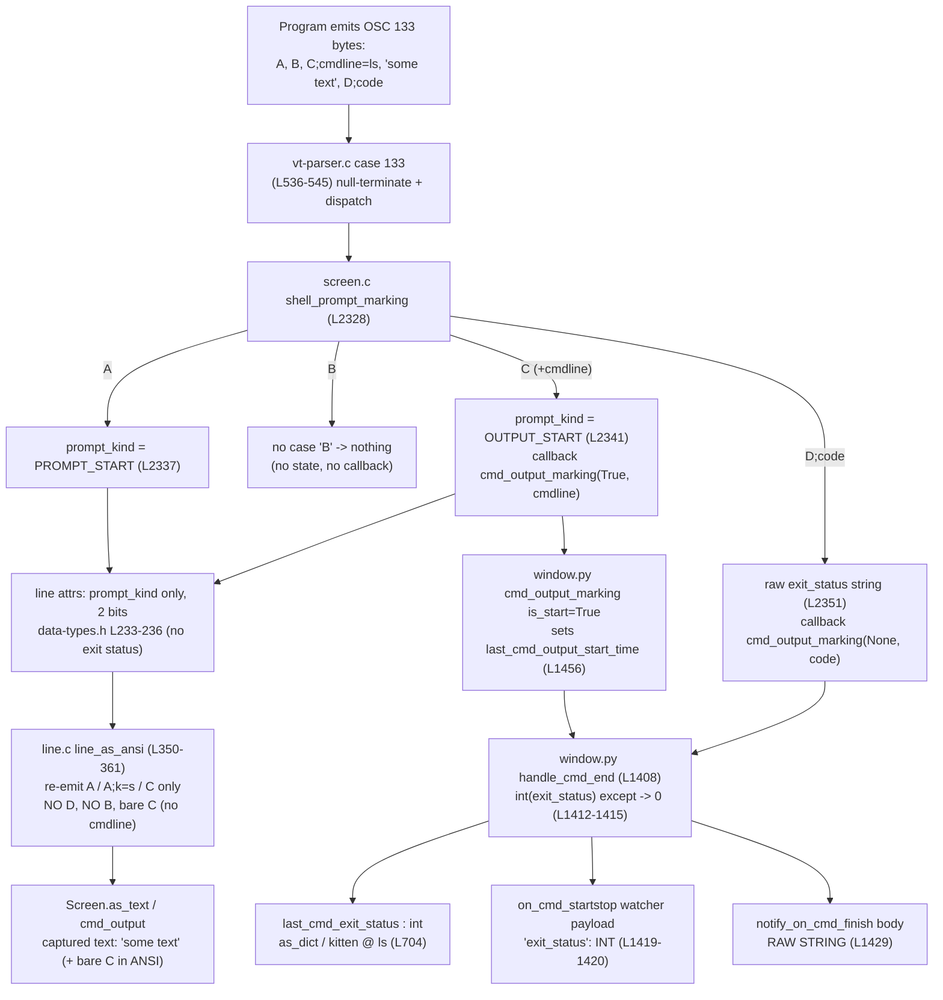

# How kitty processes OSC 133 shell-integration markers — a runtime investigation

> **Scope of this document.** This is an *evidence-based, run-it-first* answer to seven
> questions about how the [kitty](https://github.com/kovidgoyal/kitty) terminal emulator
> processes the OSC 133 (FinalTerm/iTerm2 "semantic prompt") command-boundary markers
> `A`, `B`, `C`, and `D`, and about exactly what bytes kitty captures in response. Every
> behavioural claim below is backed by output captured from kitty's **real VT parser** and
> its **real production recording code**, at commit `815df1e21`. Source citations use the
> `file:line` form and point at the code that performs the work; but the *answers* come
> from the captured output, not from reading the source.

---

## 1. TL;DR (summary of findings)

- **kitty consumes (interprets) the OSC 133 markers; it does not pass them through as
  literal text.** In a **plain-text** capture (`as_ansi=False`) *no* OSC 133 bytes appear
  at all. In an **ANSI-preserving** capture (`as_ansi=True`) kitty re-synthesizes **only**
  `A` / `A;k=s` / `C` (bare, with **no** `cmdline`); it never re-emits `B` (there is no
  handler for it) and never re-emits `D`.
- **`D;42` is not present in the captured output.** `"D;42"` occurs in the *raw bytes the
  program emitted* (offset 54 of 60), but a search for `"D;42"` in kitty's captured screen
  representation returns **-1** in every capture mode. There is no offset because the
  substring does not exist.
- **Changing the exit code changes nothing in the captured text.** Across exit codes
  `0, 1, 42, 99, 127` the captured bytes are byte-for-byte identical (`as_text` plain = 32,
  `as_text` ANSI = 44, `cmd_output` plain = 10, `cmd_output` ANSI = 22). The positional
  shift of the exit-code digits is **delta = 0 (no shift)** — the digits never enter the
  captured text at all.
- **The exit code is recorded off to the side, as an integer on the window**, not in cell
  content. Exit code `99` is provable at runtime on three production surfaces: the
  `on_cmd_startstop` watcher payload (`'exit_status': 99`), the window's
  `last_cmd_exit_status` integer (the field `kitten @ ls` serializes), and the completion
  notification body (`Command ls finished with status: 99.`).
- **Malformed / empty exit statuses record integer `0` on the production path**
  (`int(exit_status)` raises and the `except` sets `0`), while the *notification body* keeps
  the **raw string** (`... finished with status: not_a_number.` / `... finished with
  status: .`). A non-production test double diverges here and must not be trusted for this
  edge case (it retains its prior value, `sys.maxsize`).

---

## 2. Environment & build

| Item | Value |
|------|-------|
| Container image | `andrewparkscaleai/coding-agent:kovidgoyal__kitty__815df1e210e0a9ab4622f5c7f2d6891d7dbeddf1` (from `ghcr.io/scaleapi/swe-atlas`) |
| Repository commit (`git rev-parse HEAD`) | `815df1e210e0a9ab4622f5c7f2d6891d7dbeddf1` |
| Python (`python3 --version`) | `Python 3.13.7` |
| Build command | `CI=true python3 setup.py build --verbose --ignore-compiler-warnings` |

The OSC 133 pipeline is implemented in C and is reached only through the compiled
`fast_data_types` extension, so kitty must be built before any observation. The exact build
command and a success check:

```console
$ CI=true python3 setup.py build --verbose --ignore-compiler-warnings
CC: ['gcc'] (15, 0)
gcc (Ubuntu 15.2.0-4ubuntu4) 15.2.0
...
Updating Go generated files...
/usr/bin/go build -v -ldflags '-X kitty.VCSRevision=815df1e210e0a9ab4622f5c7f2d6891d7dbeddf1 -s -w' -o kitty/launcher/kitten .../tools/cmd
$ echo $?
0
$ python3 -c "from kitty.fast_data_types import Screen, set_options; print('OK', Screen)"
OK <class 'fast_data_types.Screen'>
```

(The `--ignore-compiler-warnings` flag is required only because the system
`wayland-protocols` is newer than this 2023 commit anticipates, tripping `-Werror=switch`
in the Wayland GUI backend — which is unrelated to the parser / `fast_data_types` core.)

---

## 3. Methodology

**Canonical input path.** Bytes are fed through kitty's real VT parser via the in-repo
`parse_bytes` worker [`kitty_tests/__init__.py:L30`], which drives the actual C parser via
`Screen.test_create_write_buffer()` / `test_commit_write_buffer()` /
`test_parse_written_data()`. This is the same parser that processes every byte from a child
process; OSC 133 is dispatched at [`kitty/vt-parser.c:L536-L545`].

**The debug hook was deliberately avoided.** kitty has a `#ifdef DUMP_COMMANDS` branch that
would route OSC 133 to `REPORT_OSC2(shell_prompt_marking, ...)` [`kitty/vt-parser.c:L537-L541`].
That macro is defined **only** when compiling the separate special source
`kitty/vt-parser-dump.c` [`setup.py:L720-L722`, added at `setup.py:L920`]; the normally-built
`kitty/vt-parser.c` has that branch compiled out. The canonical `shell_prompt_marking`
dispatch is what runs here (proven by the fact that real callbacks fired with real data,
below). The debug hook was **not** used.

**Two capture modes.** Every byte/marker question is answered in both modes, because marker
re-emission differs between them:
- plain text — `Screen.as_text(cb, as_ansi=False, False)` [`kitty/fast_data_types.pyi:L1231`]
- ANSI-preserving — `Screen.as_text(cb, as_ansi=True, False)`
and likewise the command-output view `Screen.cmd_output(0, cb, as_ansi, False)`
[`kitty/fast_data_types.pyi:L1237`] (`which=0` = last-run command output).

**Production recording path (Q6/Q7).** The recorded exit status lives on the Python
`Window` object, set by `Window.handle_cmd_end` [`kitty/window.py:L1408-L1420`]. To exercise
the *genuine* production method (not a test double), a real `Window` instance is used as the
`Screen`'s callback object, so the real parser drives the real
`Window.cmd_output_marking` → `Window.handle_cmd_end`. The `on_cmd_startstop` watcher (the
documented extension point, registered at [`kitty/launch.py:L416-L418`], invoked at
[`kitty/window.py:L1419-L1420`]) is installed to observe the payload, and
`notify_with_command` is intercepted **read-only** purely to read the `cmd.body` string the
*unmodified* `handle_cmd_end` builds at [`kitty/window.py:L1429`].

> **Why not a live GUI kitty + `kitten @ ls`?** A full GUI kitty cannot start in this
> headless container — it fails with `[glfw error 65544]: X11: The DISPLAY environment
> variable is missing / GLFW initialization failed`. `kitten @ ls` connects to a running
> kitty over a socket and so is unavailable. Instead, the exact attribute
> `Window.last_cmd_exit_status` that `kitten @ ls` serializes via `as_dict`
> [`kitty/window.py:L704`] is read directly from the real `Window` **after** the real
> `handle_cmd_end` ran. That is *reading resulting window state*, never injecting input, so
> it does not bypass the canonical input path.

**NON-CANONICAL surfaces, labelled as such.** The pure-`Screen` test double
`kitty_tests/__init__.py` `Callbacks` and the real-PTY harness's `pty.callbacks` are the
*same* class; on a malformed/empty status they suppress the parse exception and **retain the
prior value** [`kitty_tests/__init__.py:L48,L71-L79`], diverging from production. Any value
read from them below is explicitly marked **NON-CANONICAL**.

**Stability.** Every condition was run at least twice; all reported values were identical
across runs (only `monotonic()` timestamps differ, as expected). Temporary observation
scripts lived outside the source tree in `/tmp/blitzy_adhoc_test_osc133/` and were removed
afterward.

---

## 4. The input byte stream

`<OSC>` = `\x1b]` (bytes `0x1b 0x5d`); `<ST>` = `\x1b\\` (bytes `0x1b 0x5c`); BEL `\a`
(`0x07`) is an equally valid terminator, and is the one kitty's own shell integration
emitters use. The base sequence mirrors the user's program exactly — `A`, `B`,
`C;cmdline=ls`, some literal text, and `D;42`:

```python
b'\x1b]133;A\x1b\\\x1b]133;B\x1b\\\x1b]133;C;cmdline=ls\x1b\\some text\n\x1b]133;D;42\x1b\\'
```

Only the `D` token is varied for Q4–Q7: `D;0`, `D;1`, `D;42`, `D;99`, `D;127`, the malformed
`D;not_a_number`, the empty `D;`, and the no-semicolon `D`.

This matches kitty's own canonical emitters, which is a real-world cross-check on the mark
shapes:

- bash: `printf "\e]133;C;cmdline=%q\a"` [`shell-integration/bash/kitty.bash:L208`]
- zsh: `'\e]133;D;'$cmd_status'\a'` [`shell-integration/zsh/kitty-integration:L145`], plain
  `'\e]133;D\a'` [`:L149`]; the `B`-mark lines are **commented out** with the note that
  "currently kitty doesn't use B prompt marking"
  [`shell-integration/zsh/kitty-integration:L222-L226`] (issue #4428).
- fish: `\e]133;D\a` / `\e]133;A;special_key=1\a` / `\e]133;C;cmdline_url=%s\a` /
  `\e]133;D;$status\a` [`shell-integration/fish/vendor_conf.d/kitty-shell-integration.fish:L83,L85,L91,L96`].

kitty's own protocol doc [`docs/shell-integration.rst:L424-L443`] documents exactly
`<OSC>133;A`, `A;k=s`, `C`, and `D;exit status as base 10 integer`, and explicitly defers the
"full protocol, that also marks the command region" (the `B` mark) to the iTerm2 docs — i.e.
**`B` is intentionally not implemented.**

---

## 5. Answers

### Q1 — What is actually captured for `A`, `B`, `C;cmdline=ls`, text, `D;42`?

**Command**

```console
$ CI=true PYTHONPATH=$REPO python3 /tmp/blitzy_adhoc_test_osc133/obs_q1q2q3.py
```

**Complete, unedited output** (identical on both runs):

```text
INPUT raw bytes         = b'\x1b]133;A\x1b\\\x1b]133;B\x1b\\\x1b]133;C;cmdline=ls\x1b\\some text\n\x1b]133;D;42\x1b\\'
INPUT raw byte length   = 60
INPUT contains 'D;42' at offset = 54

--- as_text  plain (as_ansi=False) ---
repr     = 'some text\n\n\n\n\n\n\n\n\n\n\n\n\n\n\n\n\n\n\n\n\n\n\n'
char_len = 32  utf8_byte_len = 32
find('D;42')   = -1  find(OSC133;B)= -1  find('133;D')  = -1  find('133;B')  = -1  find('133;C')  = -1  find('133;A')  = -1

--- as_text  ANSI  (as_ansi=True ) ---
repr     = '\x1b[m\x1b]133;C\x1b\\some text\n\n\n\n\n\n\n\n\n\n\n\n\n\n\n\n\n\n\n\n\n\n\n'
char_len = 44  utf8_byte_len = 44
find('D;42')   = -1  find(OSC133;B)= -1  find('133;D')  = -1  find('133;B')  = -1  find('133;C')  = 5  find('133;A')  = -1

--- cmd_output plain (as_ansi=False) ---
repr     = 'some text\n'
char_len = 10  utf8_byte_len = 10
find('D;42')   = -1  find(OSC133;B)= -1  find('133;D')  = -1  find('133;B')  = -1  find('133;C')  = -1  find('133;A')  = -1

--- cmd_output ANSI  (as_ansi=True ) ---
repr     = '\x1b[m\x1b]133;C\x1b\\some text\n'
char_len = 22  utf8_byte_len = 22
find('D;42')   = -1  find(OSC133;B)= -1  find('133;D')  = -1  find('133;B')  = -1  find('133;C')  = 5  find('133;A')  = -1
```

**Answer.** The only printable content kitty captures is the literal text `some text`. All
four OSC 133 markers are *interpreted and removed from the captured cell content*:

- In **plain** capture (`as_text` / `cmd_output`, `as_ansi=False`) the capture is just
  `some text` (followed by the empty rows of the screen as newlines). **No OSC 133 bytes at
  all.**
- In **ANSI-preserving** capture (`as_ansi=True`) a leading SGR reset `\x1b[m` and a single
  re-synthesized **bare `C` mark** `\x1b]133;C\x1b\\` precede the text. The `cmd_output`
  ANSI view is exactly `'\x1b[m\x1b]133;C\x1b\\some text\n'`.
- `A`, `B`, and `D;42` do **not** appear in any capture.

**Why only `C`, and why bare (no `cmdline`)?** `A`, `B`, and `C` are emitted back-to-back
with no cursor movement, so they all target the *same* line (`cursor->y`). A line stores a
single 2-bit `prompt_kind` [`kitty/data-types.h:L230,L233-L236`]; case `A` sets it to
`PROMPT_START` [`kitty/screen.c:L2337`] but case `C` immediately overwrites it with
`OUTPUT_START` [`kitty/screen.c:L2341`]. When the ANSI serializer re-synthesizes the mark it
switches on that single value and emits only `C` [`kitty/line.c:L350-L361`] — hence
`find('133;A')` = -1 even though `A` was sent. The `cmdline` is **not** part of the
re-emission: `line_as_ansi` writes a bare `WRITE_MARK("C")` [`kitty/line.c:L360`], so
`cmdline=ls` is gone. This reproduces kitty's own canonical unit-test expectation, which
asserts the ANSI capture is `'\x1b[m\x1b]133;C\x1b\\abcd\n\x1b[m12'`
[`kitty_tests/screen.py:L1124`].

### Q2 — Are the OSC sequences still present (stripped or retained)?

**They are stripped from the visible/plain content and only a subset is re-synthesized in
ANSI capture — i.e. consumed/interpreted, not passed through verbatim.** From the same
output above:

- **Plain** (`as_ansi=False`): every `find('133;...')` returns -1 → **no markers retained.**
- **ANSI** (`as_ansi=True`): only `find('133;C')` succeeds (offset 5); `133;A`, `133;B`,
  `133;D` all return -1 → **only `C` is re-synthesized** (and, in general, `A` / `A;k=s` /
  `C` are the only marks the serializer knows how to write [`kitty/line.c:L350-L361`]).

Mechanistically: the parser null-terminates the OSC payload and calls `shell_prompt_marking`
[`kitty/vt-parser.c:L542-L545`], which has cases for `A`, `C`, and `D` only — **there is no
`case 'B'`** [`kitty/screen.c:L2328-L2354`]. So `B` produces no state change and no callback;
it simply vanishes. `D` is consumed into a Python callback [`kitty/screen.c:L2350-L2352`] and
is never written back into a line, and the serializer has no `D` case [`kitty/line.c:L350-L361`].

### Q3 — Total byte length, and at what offset does `D;42` appear?

First, the premise: **is `D;42` present at all?** From the Q1 output, `find('D;42')` returns
**-1** in *every* capture (plain and ANSI, `as_text` and `cmd_output`). So:

> `D;42` does **not** appear in kitty's captured output. There is **no byte offset**; the
> search result is **-1** in all four capture surfaces.

This must be distinguished from the *raw bytes the program emitted*, which of course contain
`D;42`: in the 60-byte input, `D;42` starts at raw offset **54**
(`INPUT contains 'D;42' at offset = 54`). kitty's *captured screen representation* is a
different thing from the raw wire bytes: the `D` marker is consumed into a callback
[`kitty/screen.c:L2350-L2352`], is never re-emitted [`kitty/line.c:L350-L361`], and per-line
attributes carry no exit status [`kitty/data-types.h:L233-L236`] — so `D;42` cannot appear.

Total captured lengths for the base (`D;42`) sequence (character count equals UTF-8 byte
count because all content is ASCII):

| Capture surface | `as_ansi` | Captured `repr` (leading part) | char len | UTF-8 byte len | offset of `D;42` |
|---|---|---|---:|---:|---:|
| `as_text`    | `False` | `'some text\n' + 22×'\n'` | 32 | 32 | -1 (absent) |
| `as_text`    | `True`  | `'\x1b[m\x1b]133;C\x1b\\some text\n' + 22×'\n'` | 44 | 44 | -1 (absent) |
| `cmd_output` | `False` | `'some text\n'` | 10 | 10 | -1 (absent) |
| `cmd_output` | `True`  | `'\x1b[m\x1b]133;C\x1b\\some text\n'` | 22 | 22 | -1 (absent) |

(The `as_text` lengths include the empty rows of the 24-row screen rendered as trailing
newlines; `cmd_output` returns just the last command's output region and is the cleanest
measure of "what the command produced".)


### Q4 — How do byte lengths and positions change for exit codes 0, 1, 127 (and 42, 99)?

**Command**

```console
$ CI=true PYTHONPATH=$REPO python3 /tmp/blitzy_adhoc_test_osc133/obs_q4q5.py
```

**Complete, unedited output** (identical on both runs):

```text
==== EXIT-CODE MATRIX (Q4/Q5): D;<code> varied, everything else fixed ====

--- exit code '0' ---
  as_text_plain     char_len= 32 utf8_byte_len= 32 find('0')=-1 find("D;0")=-1
  as_text_ANSI      char_len= 44 utf8_byte_len= 44 find('0')=-1 find("D;0")=-1
  cmd_output_plain  char_len= 10 utf8_byte_len= 10 find('0')=-1 find("D;0")=-1
  cmd_output_ANSI   char_len= 22 utf8_byte_len= 22 find('0')=-1 find("D;0")=-1

--- exit code '1' ---
  as_text_plain     char_len= 32 utf8_byte_len= 32 find('1')=-1 find("D;1")=-1
  as_text_ANSI      char_len= 44 utf8_byte_len= 44 find('1')=5 find("D;1")=-1
  cmd_output_plain  char_len= 10 utf8_byte_len= 10 find('1')=-1 find("D;1")=-1
  cmd_output_ANSI   char_len= 22 utf8_byte_len= 22 find('1')=5 find("D;1")=-1

--- exit code '42' ---
  as_text_plain     char_len= 32 utf8_byte_len= 32 find('42')=-1 find("D;42")=-1
  as_text_ANSI      char_len= 44 utf8_byte_len= 44 find('42')=-1 find("D;42")=-1
  cmd_output_plain  char_len= 10 utf8_byte_len= 10 find('42')=-1 find("D;42")=-1
  cmd_output_ANSI   char_len= 22 utf8_byte_len= 22 find('42')=-1 find("D;42")=-1

--- exit code '99' ---
  as_text_plain     char_len= 32 utf8_byte_len= 32 find('99')=-1 find("D;99")=-1
  as_text_ANSI      char_len= 44 utf8_byte_len= 44 find('99')=-1 find("D;99")=-1
  cmd_output_plain  char_len= 10 utf8_byte_len= 10 find('99')=-1 find("D;99")=-1
  cmd_output_ANSI   char_len= 22 utf8_byte_len= 22 find('99')=-1 find("D;99")=-1

--- exit code '127' ---
  as_text_plain     char_len= 32 utf8_byte_len= 32 find('127')=-1 find("D;127")=-1
  as_text_ANSI      char_len= 44 utf8_byte_len= 44 find('127')=-1 find("D;127")=-1
  cmd_output_plain  char_len= 10 utf8_byte_len= 10 find('127')=-1 find("D;127")=-1
  cmd_output_ANSI   char_len= 22 utf8_byte_len= 22 find('127')=-1 find("D;127")=-1

==== PROGRAMMATIC EQUALITY CHECK across all codes (Q5 delta) ====
  as_text_plain     identical_across_all_codes=True  byte_lens={'0': 32, '1': 32, '42': 32, '99': 32, '127': 32}
  as_text_ANSI      identical_across_all_codes=True  byte_lens={'0': 44, '1': 44, '42': 44, '99': 44, '127': 44}
  cmd_output_plain  identical_across_all_codes=True  byte_lens={'0': 10, '1': 10, '42': 10, '99': 10, '127': 10}
  cmd_output_ANSI   identical_across_all_codes=True  byte_lens={'0': 22, '1': 22, '42': 22, '99': 22, '127': 22}

==== Q5 positional shift of exit-code digits ====
  as_text_plain     digit_offsets={'0': -1, '1': -1, '42': -1, '99': -1, '127': -1}  delta_vs_code0={'0': 0, '1': 0, '42': 0, '99': 0, '127': 0}
  as_text_ANSI      digit_offsets={'0': -1, '1': 5, '42': -1, '99': -1, '127': -1}  delta_vs_code0={'0': 0, '1': 6, '42': 0, '99': 0, '127': 0}
  cmd_output_plain  digit_offsets={'0': -1, '1': -1, '42': -1, '99': -1, '127': -1}  delta_vs_code0={'0': 0, '1': 0, '42': 0, '99': 0, '127': 0}
  cmd_output_ANSI   digit_offsets={'0': -1, '1': 5, '42': -1, '99': -1, '127': -1}  delta_vs_code0={'0': 0, '1': 6, '42': 0, '99': 0, '127': 0}

==== BEL-terminator cross-check (kitty own emitter shape, \a=0x07) ====
  as_text_plain     BEL==ST? True  BEL_repr='some text\n\n\n\n\n\n\n\n\n\n\n\n\n\n\n\n\n\n\n\n\n'...
  as_text_ANSI      BEL==ST? True  BEL_repr='\x1b[m\x1b]133;C\x1b\\some text\n\n\n\n\n\n\n\n\n'...
  cmd_output_plain  BEL==ST? True  BEL_repr='some text\n'...
  cmd_output_ANSI   BEL==ST? True  BEL_repr='\x1b[m\x1b]133;C\x1b\\some text\n'...
```

**Answer.** The captured byte lengths and marker positions are **identical for every exit
code** `0, 1, 42, 99, 127`:

| Exit code | `as_text` plain | `as_text` ANSI | `cmd_output` plain | `cmd_output` ANSI | `find("D;<code>")` |
|---|---:|---:|---:|---:|---:|
| `0`   | 32 | 44 | 10 | 22 | -1 (all modes) |
| `1`   | 32 | 44 | 10 | 22 | -1 (all modes) |
| `42`  | 32 | 44 | 10 | 22 | -1 (all modes) |
| `99`  | 32 | 44 | 10 | 22 | -1 (all modes) |
| `127` | 32 | 44 | 10 | 22 | -1 (all modes) |

The programmatic check confirms `identical_across_all_codes=True` for all four capture
surfaces and equal `byte_lens` across the whole matrix. Changing the exit code changes
**nothing** in the captured text. The BEL (`\a`) terminator produces byte-for-byte identical
captures to the `<ST>` terminator (`BEL==ST? True`), matching kitty's own emitter shape.

### Q5 — Does the position of the exit-code digits shift, and by how much?

**No — the delta is exactly 0 (no shift).** The exit-code digits never appear in the
captured text: the unambiguous search `find("D;<code>")` is **-1 for every code** in every
mode, and `delta_vs_code0` is `0` for `0/42/99/127`.

The exit code is not stored in cell/line content; it is captured off to the side as an
**integer** on the window (`Window.last_cmd_exit_status`, set at
[`kitty/window.py:L1413`]). Per-line attributes hold only a 2-bit `prompt_kind` plus flags
and no exit status [`kitty/data-types.h:L233-L236`]; the `D` marker is consumed into a
callback [`kitty/screen.c:L2350-L2352`] and never re-emitted [`kitty/line.c:L350-L361`].
Hence there is nothing in the captured bytes whose position *could* shift.

> **Honest caveat about one number in the raw output.** For code `1`, a naive single-character
> search `find('1')` returns `5` in the two ANSI captures (producing a spurious
> `delta_vs_code0={'1': 6}`). That is a **false positive**: offset 5 is the first `1` of the
> re-synthesized `\x1b]133;C\x1b\\` mark (`...]` `1` `3` `3` `;` `C`...), **not** an
> exit-code digit. The disambiguating search `find("D;1")` correctly returns **-1**. The
> real exit-code-digit offset is -1 for every code, and the true positional shift is **0**.


### Q6 — For exit code 99, what runtime evidence proves 99 traversed the entire code path?

Because the exit code never enters the captured text (Q4/Q5), the *only* way to observe it is
on the production recording surfaces. The following drives the **real** production method
`Window.handle_cmd_end` [`kitty/window.py:L1408`] through the **real** parser: a real
`Window` instance is the `Screen`'s callback, so parsing `...C;cmdline=ls... D;99` calls the
real `Window.cmd_output_marking` [`kitty/window.py:L1453-L1461`] → real
`Window.handle_cmd_end`. The window's `last_cmd_exit_status` is pre-seeded to a sentinel
`-999` so that seeing `99` afterward proves the value was actually written by the production
code.

**Command**

```console
$ CI=true PYTHONPATH=$REPO python3 /tmp/blitzy_adhoc_test_osc133/obs_q6q7.py
```

**Complete, unedited output — Q6 section** (identical on both runs except the `monotonic()`
`time` fields):

```text
################## Q6: exit code 99 (PRODUCTION path) ##################
PRODUCTION Window.last_cmd_exit_status = 99 (type int)  [== as_dict L704 field read by kitten @ ls]
watcher on_cmd_startstop payloads      =
    {'is_start': True, 'time': 0.052669814, 'cmdline': 'ls', 'exit_status': 0}
    {'is_start': False, 'time': 0.052689084, 'cmdline': 'ls', 'exit_status': 99}
notification body (window.py L1429)    = ['Command ls finished with status: 99.\nClick to focus.']
99 present in as_text plain?  False  in as_text ANSI?  False   -> the integer 99 is ABSENT from captured text; production surfaces are the only proof
```

**Answer.** Exit code `99` is proven to have traversed the entire pipeline
(`vt-parser.c` → `screen.c shell_prompt_marking` → `window.py cmd_output_marking` →
`handle_cmd_end` → recorded) by **three independent production signals, all showing 99**:

1. **The window's recorded integer.** `Window.last_cmd_exit_status == 99` (a real `int`).
   The sentinel `-999` was overwritten, so this value was produced by the real
   `int(exit_status)` at [`kitty/window.py:L1413`]. This is exactly the field that `as_dict`
   serializes at [`kitty/window.py:L704`] and that `kitten @ ls` reports.
2. **The `on_cmd_startstop` watcher payload.** The command-end call delivers
   `{'is_start': False, ..., 'cmdline': 'ls', 'exit_status': 99}` — the integer `99` — to
   every registered watcher [`kitty/window.py:L1419-L1420`]. (The earlier
   `{'is_start': True, ... 'exit_status': 0}` is the command-*start* callback from the `C`
   mark [`kitty/window.py:L1459`]; note `decode_cmdline("cmdline=ls")` resolved to `'ls'`
   [`kitty/window.py:L225-L228`].)
3. **The completion-notification body.** With `notify_on_cmd_finish` enabled, the body built
   at [`kitty/window.py:L1429`] reads `Command ls finished with status: 99.` — the `99`
   substituted into the message.

And crucially: `99` is **absent** from both `as_text` plain and `as_text` ANSI captures
(`False` / `False`), confirming that these non-text production surfaces are the *only* place
`99` is observable — which is the whole point of the question.

> Cross-check on the non-canonical double: the pure-`Screen`/PTY test double
> (`kitty_tests/__init__.py` `Callbacks`) also reports `99` for this *valid* integer, since
> `int("99")` succeeds in both paths. That agreement is real but incidental; the primary
> evidence above comes from the genuine production `Window` method. The double only diverges
> from production on the malformed/empty cases (Q7).

### Q7 — For malformed `D;not_a_number` and empty `D;`, what values get recorded?

Same production harness as Q6, now feeding `D;not_a_number`, the empty `D;`, and the
no-semicolon `D` form.

**Complete, unedited output — Q7 sections** (identical on both runs except `time` fields):

```text
################## Q7: malformed "not_a_number" ##################
PRODUCTION last_cmd_exit_status = 0 (int() of "not_a_number" raises -> except sets 0; window.py L1412-1415)
watcher payloads                = [{'is_start': True, 'time': 0.053889135, 'cmdline': 'ls', 'exit_status': 0}, {'is_start': False, 'time': 0.053911932, 'cmdline': 'ls', 'exit_status': 0}]
notification body (RAW STRING)  = ['Command ls finished with status: not_a_number.\nClick to focus.']  <- uses raw exit_status, not the int (L1429)
NON-CANONICAL test double       = 9223372036854775807 (retains prior sys.maxsize; suppress(Exception); kitty_tests/__init__.py L48,L71-79)

################## Q7: empty "D;" (trailing semicolon, empty status) ##################
PRODUCTION last_cmd_exit_status = 0 (int("") raises -> except sets 0)
watcher payloads                = [{'is_start': True, 'time': 0.056895499, 'cmdline': 'ls', 'exit_status': 0}, {'is_start': False, 'time': 0.056911838, 'cmdline': 'ls', 'exit_status': 0}]
notification body (RAW STRING)  = ['Command ls finished with status: .\nClick to focus.']
NON-CANONICAL test double       = 9223372036854775807

################## Q7: no-semicolon "D" form (exit_status="") ##################
PRODUCTION last_cmd_exit_status = 0 (screen.c L2351: buf[1]!=";" -> exit_status="")
watcher payloads                = [{'is_start': True, 'time': 0.058220881, 'cmdline': 'ls', 'exit_status': 0}, {'is_start': False, 'time': 0.058234723, 'cmdline': 'ls', 'exit_status': 0}]
notification body (RAW STRING)  = ['Command ls finished with status: .\nClick to focus.']
NON-CANONICAL test double       = 9223372036854775807
```

**Answer — there are two different recorded representations, and they diverge:**

| Input `D` token | production `last_cmd_exit_status` (int) | watcher `exit_status` (int) | notification body (raw string) | NON-CANONICAL test double |
|---|---:|---:|---|---:|
| `D;not_a_number` | **0** | 0 | `Command ls finished with status: not_a_number.` | `9223372036854775807` |
| `D;` (empty)     | **0** | 0 | `Command ls finished with status: .`             | `9223372036854775807` |
| `D` (no `;`)     | **0** | 0 | `Command ls finished with status: .`             | `9223372036854775807` |

1. **The integer state records `0`.** Production parses with `int(exit_status)` and, on the
   `ValueError` that `int("not_a_number")` / `int("")` raise, the `except` clause sets
   `self.last_cmd_exit_status = 0` [`kitty/window.py:L1412-L1415`]. So both the malformed
   and the empty cases record the integer **`0`** in `last_cmd_exit_status` and in the
   watcher payload. (For the no-`;` `D` form, `screen.c` sets `exit_status = ""` because
   `buf[1] != ';'` [`kitty/screen.c:L2351`], giving the same `0`.)
2. **The notification body keeps the raw string.** The message at [`kitty/window.py:L1429`]
   interpolates the *raw* `exit_status` string, not the parsed int — so it reads
   `... finished with status: not_a_number.` for the malformed case and
   `... finished with status: .` for the empty case. (The `%s` command-action substitution
   at [`kitty/window.py:L1448`] likewise uses the raw string.)
3. **The test double is NON-CANONICAL here.** Running the same malformed/empty inputs through
   the pure-`Screen`/PTY test double `Callbacks` reports `9223372036854775807`
   (`sys.maxsize`, its initial value [`kitty_tests/__init__.py:L48`]). That is because its
   `cmd_output_marking` swallows the exception with `with suppress(Exception)` and thus
   **retains its prior value** [`kitty_tests/__init__.py:L71-L79`], rather than resetting to
   `0`. This value must **not** be reported as kitty's behaviour; production records `0`.


---

## 6. Data-flow explanation

There are two parallel paths out of the OSC 133 dispatch: a **text/serialization path** (what
`as_text` / `cmd_output` capture) and a **recording path** (what `Window` stores and exposes).

**Text path (Q1–Q5).** Every byte from the child is fed to the parser state machine; OSC
`133` is dispatched at [`kitty/vt-parser.c:L536-L545`], which null-terminates the payload and
calls `shell_prompt_marking` [`kitty/screen.c:L2328`]. That function handles:

- `A` → sets the current line's `prompt_kind = PROMPT_START` (or `SECONDARY_PROMPT` for
  `k=s`) [`kitty/screen.c:L2332-L2339`];
- `B` → **no case exists** → no state change, no callback [`kitty/screen.c:L2328-L2354`];
- `C` → sets `prompt_kind = OUTPUT_START`, decodes the optional `cmdline`, and fires a
  callback [`kitty/screen.c:L2340-L2349`];
- `D` → extracts the raw exit-status string and fires a callback; sets **no** line state
  [`kitty/screen.c:L2350-L2353`].

A line stores only a 2-bit `prompt_kind` (plus flags), never an exit status
[`kitty/data-types.h:L230,L233-L236`]. When capturing in ANSI mode, `line_as_ansi`
re-synthesizes the mark from that single value — `A` / `A;k=s` / `C` only, bare, no
`cmdline`, and no `D`/`B` [`kitty/line.c:L346-L361`]. In plain mode nothing is re-emitted.
(The scrollback/pager relies on the same persistence, locating the output start by
reverse-searching for the literal `\x1b]133;C\x1b\\` mark [`kitty/history.c:L475`].)

**Recording path (Q6–Q7).** The `D` callback lands in `Window.cmd_output_marking` with
`is_start=None`, which forwards to `Window.handle_cmd_end(exit_status)`
[`kitty/window.py:L1453-L1461`]. That method early-returns unless a prior `C` set the
output-start time [`kitty/window.py:L1409-L1410`] (so `C` must precede `D`; the user's
`A,B,C,text,D` order satisfies this), then records the exit status **twice, in two forms**:
an **integer** `last_cmd_exit_status = int(exit_status)` with `except → 0`
[`kitty/window.py:L1412-L1415`] — surfaced to the `on_cmd_startstop` watcher
[`kitty/window.py:L1419-L1420`] and to `kitten @ ls` via `as_dict` [`kitty/window.py:L704`] —
and a **raw string** used verbatim in the notification body [`kitty/window.py:L1429`].



---

## 7. Coverage checklist

| Item | Answered? | Where / value |
|---|---|---|
| **Q1** captured content | ✅ | §5 Q1 — only `some text`; ANSI adds `\x1b[m` + bare `\x1b]133;C\x1b\\` |
| **Q2** stripped vs retained | ✅ | §5 Q2 — plain: none; ANSI: only `A`/`A;k=s`/`C` (here bare `C`); `B`,`D` never |
| **Q3** byte length + `D;42` offset | ✅ | §5 Q3 — `D;42` absent (offset **-1**); lengths 32/44/10/22; raw offset 54 distinguished |
| **Q4** lengths/positions for 0,1,127 (+42,99) | ✅ | §5 Q4 — identical across all codes (32/44/10/22) |
| **Q5** positional shift + delta | ✅ | §5 Q5 — **delta = 0** (no shift); digits never in captured text |
| **Q6** proof 99 traversed the path | ✅ | §5 Q6 — `last_cmd_exit_status=99`, watcher `'exit_status':99`, notification `...status: 99.` |
| **Q7** malformed & empty recorded values | ✅ | §5 Q7 — production **0** (int); raw-string notification; test-double `sys.maxsize` labelled NON-CANONICAL |
| exit code `0` | ✅ | §5 Q4 (len identical) |
| exit code `1` | ✅ | §5 Q4 (len identical; false-positive `find('1')` explained in Q5) |
| exit code `42` | ✅ | §5 Q1/Q3/Q4 (the base sequence) |
| exit code `99` | ✅ | §5 Q4 (capture) + §5 Q6 (recording) |
| exit code `127` | ✅ | §5 Q4 (len identical) |
| malformed `not_a_number` | ✅ | §5 Q7 — records `0`; notification keeps `not_a_number` |
| empty `D;` and no-`;` `D` | ✅ | §5 Q7 — both record `0`; notification `...status: .` |
| both capture modes shown | ✅ | every byte/marker table shows `as_ansi=False` and `as_ansi=True` |
| stability ≥2 runs | ✅ | all three scripts run 2×; values identical (only `time` fields differ) |
| `#ifdef DUMP_COMMANDS` avoided | ✅ | §3 — compiled out in the normal build; canonical `shell_prompt_marking` ran |
| `kitten @ ls` read-only | ✅ | §3 — live `kitten @ ls` infeasible headless; read the exact `as_dict`-backed attribute instead |

---

## 8. Observed vs inferred

**Observed at runtime (captured output above):** everything in the answers to Q1–Q7 — the
captured `repr`/lengths/offsets in all four capture modes; the byte-identical exit-code
matrix and BEL cross-check; the production `last_cmd_exit_status` (`99`; `0` for
malformed/empty); the `on_cmd_startstop` watcher payloads; the notification bodies; the
NON-CANONICAL test-double value `9223372036854775807`; the absence of `99`/`D;42` from the
text captures; and the headless GLFW failure that rules out a live GUI kitty.

**Inferred / code-derived (not directly executed), clearly labelled:**

- The claim that a live `kitten @ ls` would print `"last_cmd_exit_status": 99` is **inferred
  from code**: `as_dict` copies exactly `self.last_cmd_exit_status` into that field
  [`kitty/window.py:L704`], and that attribute was observed to be `99` at runtime; a live
  `kitten @ ls` could not be run because the GUI cannot start headless. The observed
  attribute value is canonical; the specific `kitten @ ls` JSON rendering is the inferred
  part.
- The `%s` command-action substitution using the raw string [`kitty/window.py:L1448`] is
  **code-derived**; the notification-*body* raw string it parallels was observed directly.
- The `SECONDARY_PROMPT` (`A;k=s`) re-emission form is **code-derived** from
  [`kitty/line.c:L356-L357`]; the base sequence uses plain `A`, so only the `PROMPT_START`
  → (overwritten by) `OUTPUT_START` behaviour was exercised at runtime.

Everything else is grounded in the captured output shown in the fenced blocks above, with the
cited `file:line` locations naming the specific function/struct that performs the work.

