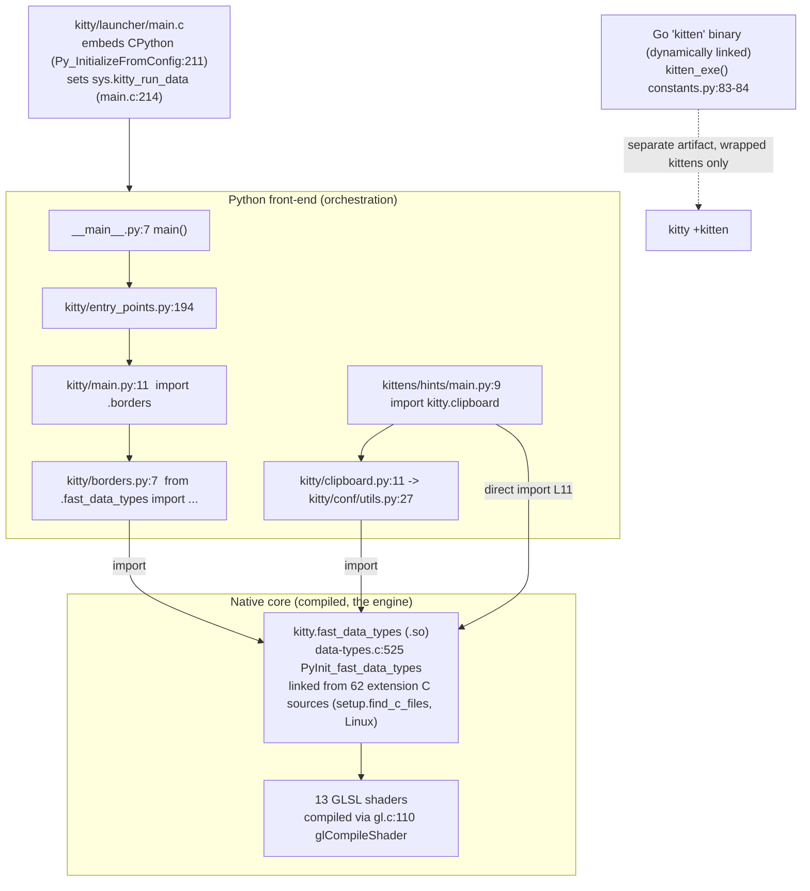

# kitty — Architecture Onboarding Q&A (runtime-grounded)

> Repository: `kovidgoyal/kitty` @ commit `815df1e210e0a9ab4622f5c7f2d6891d7dbeddf1`
> Source branch: `kitty_815df1e210e0` (this document's name is derived from it)
> Product version observed at runtime (canonical GHCR image, default build): **`kitty 0.35.2 created by Kovid Goyal`**

This document answers four onboarding questions about kitty. Every behavioral claim is
grounded either in a specific `file:line` reference **or** in actual, complete, unedited
command output captured from a **running** instance — the code paths were **built and run
first**, then the answers were written from what was observed. The build/run environment is the
**canonical** GHCR image the setup instructions name (see Methodology), so environment-dependent
values (version banner, launch behavior, thread counts, Go linkage) are canonical. Every
statement that could not be observed directly is labelled **(inferred)**; every value obtained
from a non-canonical *route* — a bypassing interface, a fallback, or a synthetic stand-in (for
example the deliberately broken shader in Q2) — is labelled **(non-canonical)**.

---

## The four questions (verbatim)

- **Q1.** *kitty calls itself "GPU accelerated" yet the codebase is a weave of Python and C — which language does the heavy lifting once it is running, and what does that say about where the performance actually comes from?*
- **Q2.** *there are GLSL files scattered around; shader code inside a terminal is unexpected — what role do these files play and how central are they to the system?*
- **Q3.** *running the main entry point directly fails almost immediately with a cryptic error — what exactly is missing at that moment, and what does that tell us about how Python is wired into the native core (there is "one critical piece that everything depends on")?*
- **Q4.** *the `kittens/` directory looks like small self-contained tools — are they truly independent or do they quietly rely on the same native bridge, and what happens if you run one standalone?*

## TL;DR

| Q | One-line answer |
|---|-----------------|
| Q1 | The compiled C extension **`kitty.fast_data_types`** runs the hot paths (screen model, VT parsing, font shaping, PTY I/O thread) and a **GPU** OpenGL/GLSL pipeline computes the pixels; Python only orchestrates. Performance comes from the **native core + GPU**, not Python. (On this headless host the GPU role is filled by Mesa `llvmpipe` **software** rasterization — hardware-GPU behavior is inferred.) |
| Q2 | The **13** `kitty/*.glsl` files are the shader **source** the OpenGL driver compiles to draw every terminal cell, cursor, selection, border, image and tint: **10 stage shaders** (5 `*_vertex` + 5 `*_fragment`) that link pairwise into **5 GL programs** — `cell`, `border`, `graphics`, `bgimage`, `tint` — plus **3 shared includes** (`alpha_blend`, `cell_defines`, `linear2srgb`). They are **load-bearing**: a deliberately broken cell shader makes kitty refuse to start (shown below). |
| Q3 | The first missing piece is the compiled CPython C-extension **`kitty.fast_data_types`** (the `.so`), which is `*.so`-gitignored and produced only by the build; the first `from .fast_data_types import ...` raises `ModuleNotFoundError`. **80** Python files mention the string; **77** actually import it (**59** under production `kitty/`/`kittens/`). After building, the same bare `python3 __main__.py` no longer raises that error but then fails on `sys.kitty_run_data`, which only the native launcher populates (shown below). |
| Q4 | The kittens are **not** a uniform, self-contained set, but the native-bridge dependency is **route-specific, not universal**. Of the **18** `kittens/*/main.py` modules run standalone: **12** die with the same `ModuleNotFoundError: No module named 'kitty.fast_data_types'` as Q3, **5** are thin wrapper stubs that print `This should be run as kitten <name>` and reach no native import, and **1** (`choose_fonts`, an empty `main.py`) exits 0. Separately, **12** kittens are launcher-"wrapped" and served by a compiled **Go `kitten` binary** via `kitty +kitten <name>` (observed **dynamically linked**, `CGO_ENABLED=1` — not static); the two sets of 12 are *different* (the 5 stubs are Go-wrapped, whereas e.g. `pager`/`panel` fail the Python import yet are not wrapped). |

The unifying thread across **Q1, Q3, Q4** is the *native bridge* `kitty.fast_data_types`:
Q1 shows it does the heavy lifting, Q3 shows the Python front-end cannot start without it,
Q4 shows the native-backed kittens (12 of the 18 Python mains) depend on it — while the rest are
Go-wrapper stubs or an empty placeholder. **Q2** is the other half of performance — the
GLSL programs that run on the GPU.

---

## Methodology & environment (how these answers were produced)

**Run-first.** For every question the relevant code path was executed and its exact, complete
output captured (with an explicit exit code). Two repository states are used:

- **Unbuilt state** — a pristine checkout with **no build artifacts**, created in a fresh
  `mktemp -d` directory and populated with `git archive HEAD | tar -x -C "$dir"` (this yields
  *tracked files only*, exactly what a fresh `git clone` gives you before building). Used for the
  Q3/Q4 `ModuleNotFoundError` observations.
- **Built state** — such a tree after running the build, used for the version banner, the launch
  behaviors, the GPU/shader/thread observations, and the Go `kitten` path.

Every observation is produced inside the canonical GHCR container described below. Each temporary
tree is a uniquely-named `mktemp -d` directory (outside the repository) removed afterward, and
neutral paths are used throughout so no host or workspace identifiers appear in the pasted output.
Where a specific process is inspected (Q1 threads), its PID is captured directly from the shell
that launched it (`KPID=$!`) — never by scanning the process table for a name — so the inspected
process is unambiguous.

**Build command.** The build is `python3 setup.py` (the `Makefile` `all:` target is
`python3 setup.py $(VVAL)`):

```text
$ sed -n '12,13p' Makefile
all:
	python3 setup.py $(VVAL)
```

> **Environment — canonical.** The task nominates the Docker image
> `andrewparkscaleai/coding-agent:kovidgoyal__kitty__815df1e210e0a9ab4622f5c7f2d6891d7dbeddf1`,
> which the setup instructions identify as being derived *from* the source image
> `ghcr.io/scaleapi/swe-atlas:swe_atlas_QnA_kovidgoyal_kitty_1.0`. The `andrewparkscaleai/…`
> alias tag is not directly pullable from here (it requires authentication):
>
> ```text
> $ docker pull andrewparkscaleai/coding-agent:kovidgoyal__kitty__815df1e210e0a9ab4622f5c7f2d6891d7dbeddf1
> Error response from daemon: pull access denied for andrewparkscaleai/coding-agent, repository does not exist or may require 'docker login': denied: requested access to the resource is denied
> ; exit=1
> ```
>
> The canonical **source** image it derives from *is* available, and **every runtime observation
> in this document was produced inside a container started from it**:
>
> ```text
> $ docker image inspect ghcr.io/scaleapi/swe-atlas:swe_atlas_QnA_kovidgoyal_kitty_1.0 \
>     --format '{{.Id}} | {{index .RepoDigests 0}}'
> sha256:c0824992ad0b274bc8738bf1365d336bf91dec97d726ec122e2d08eb9f053288 | ghcr.io/scaleapi/swe-atlas@sha256:60da90a7183a82861fc6d1d40cb8086baa6a8a0e0d05f26d03aafd0f5b3cc384
> ```
>
> That container carries a checkout of kitty at exactly the branch commit
> `815df1e210e0a9ab4622f5c7f2d6891d7dbeddf1`, and its default toolchain is **Python 3.12.3, Go
> 1.23.4, GCC 13.3.0, and `pkg-config` 1.8.1 on Ubuntu 24.04.2** (recorded below). Because this
> image ships `wayland-protocols` 1.34, the **default** build command `python3 setup.py` compiles
> cleanly with no extra flags — no `CFLAGS=-Wno-error=switch` or `--ignore-compiler-warnings`
> override is needed. Every build-dependent value in this document (version banner, launch
> behavior, thread counts, Go linkage) is therefore a **canonical** observation from this image.
> No output is fabricated; anything not directly observed at runtime is labelled (inferred). Where
> a value is not byte-reproducible across builds/runs (build-log line ordering, `BuildID`, ASLR
> load addresses), that is stated explicitly at the point of use.

**Environment recorded** (canonical container; only the non-sensitive toolchain fields, no
host/kernel identifiers):

```text
$ python3 --version ; go version ; gcc --version | head -1 ; pkg-config --version
Python 3.12.3
go version go1.23.4 linux/amd64
gcc (Ubuntu 13.3.0-6ubuntu2~24.04) 13.3.0
1.8.1
```

Runtime versions (Python 3.12.3, Go 1.23.4) satisfy the project minimums declared in the
manifests (`pyproject.toml:L2` `requires-python = ">=3.8"`; `go.mod:L3` `go 1.22`). These are the
image's default `python3`/`go` on `PATH`, exercised exactly as a normal user would.

**Default-config version banner** (built state, default configuration; **canonical** — produced
in the GHCR image identified above, both via the compiled launcher and the Python entry point):

```text
$ ./kitty/launcher/kitty --version ; echo "exit=$?"
kitty 0.35.2 created by Kovid Goyal
exit=0
$ python3 __main__.py --version ; echo "exit=$?"
kitty 0.35.2 created by Kovid Goyal
exit=0
```

Go-binary VCS provenance depends on whether the build tree contains a `.git`. The image's own
`/app` checkout has one, so building there stamps the branch revision into the binary
(`go version -m`): `vcs.revision=815df1e210e0a9ab4622f5c7f2d6891d7dbeddf1`, `vcs.modified=false`.
The fresh, uniquely-named `git archive` trees used for the from-scratch build observations in this
document have **no** `.git`, so the same build there records an empty `VCSRevision` and no `vcs.*`
fields (see `setup.py:L674`-`L690`, `get_vcs_rev()`); the Q4 Go-binary output below is captured
from such a tree and shows exactly that. This is provenance metadata only — it changes no runtime
behavior, and `CGO_ENABLED=1` and the dynamic-linkage facts hold identically in both trees.

**Repository integrity (tracked vs. filesystem).** This task adds exactly one file to the tracked
tree — this document — and changes **no** existing source file. While the document is being
authored it is the sole modified path that `git status --porcelain` reports:

```text
$ git status --porcelain
 M blitzy/documentation/kitty_815df1e210e0.md
$ git ls-files blitzy/
blitzy/documentation/kitty_815df1e210e0.md
```

That the source tree is byte-for-byte identical to the upstream base commit
`815df1e210e0a9ab4622f5c7f2d6891d7dbeddf1` is provable directly: diffing every tracked path
*except* this document against that commit yields nothing (empty stat, exit 0):

```text
$ git diff --stat 815df1e210e0a9ab4622f5c7f2d6891d7dbeddf1 \
      -- . ':(exclude)blitzy/documentation/kitty_815df1e210e0.md' ; echo "exit=$?"
exit=0
```

The working directory *separately* held gitignored build artifacts left by the `setup.py` build
that the environment-setup step ran (`kitty/fast_data_types.so`, `kitty/launcher/kitty`,
`kitty/launcher/kitten`, `kitty/glfw-*.so`, `*.o`/`*.d`, generated `.go` sources, `__pycache__/`).
These are excluded from the tracked tree by `.gitignore` (line 1 `*.so`; line 18
`/kitty/launcher/kitt*`):

```text
$ git check-ignore kitty/fast_data_types.so kitty/launcher/kitty kitty/launcher/kitten
kitty/fast_data_types.so
kitty/launcher/kitty
kitty/launcher/kitten
```

Because every runtime observation in this document was produced inside the isolated canonical
container (a `docker run` of the GHCR image above, **not** from these host-side artifacts), the
artifacts in this checkout were not needed and were removed after capture with `git clean -dfX`
(which deletes *ignored* files only — tracked source is never touched), leaving a working tree
that contains only tracked source plus this one added document. No task-created scratch file is
left inside the repository; every temporary observation tree/script used below lived under `/tmp`
(or inside the throwaway container) and was deleted afterward.

### The native bridge at a glance



---

## Q1 — Which language does the heavy lifting, and where does performance come from?

> *kitty calls itself "GPU accelerated" yet the codebase is a weave of Python and C — which language does the heavy lifting once it is running, and what does that say about where the performance actually comes from?*

### Answer

Once kitty is running, the heavy lifting is done by the **compiled C extension
`kitty.fast_data_types`** (the terminal screen model, VT/escape parsing, font shaping,
graphics, PTY I/O) and by an **OpenGL/GLSL GPU pipeline** (every pixel is produced by shader
programs — see Q2). **Python is a thin orchestration front-end**: it parses the command line,
loads config, and manages windows/tabs, then hands the work to the native core. A **third**
language, **Go**, implements the modern kittens (see Q4). So the "weave of Python and C" is
really a layered engine: **Python orchestrates -> C (`fast_data_types`) runs the hot paths ->
the GPU (GLSL) computes the pixels**. Performance therefore comes from the **native core +
GPU**, not from Python.

> On this headless host the GPU stage is served by Mesa **`llvmpipe`**, which is **CPU
> software rasterization** (forced via `LIBGL_ALWAYS_SOFTWARE=1 GALLIUM_DRIVER=llvmpipe`). The
> render pipeline and the OpenGL context are therefore observed for real, but the claim that
> the pixels run on *hardware* silicon is **(inferred)** — on a machine with a real GPU the
> same GL/GLSL path executes on the GPU instead of on `llvmpipe` threads.

### The Python front-end pulls its machinery from the compiled extension

`kitty/main.py` begins with standard-library imports; its **first project-local /
native-dependent import** is at `kitty/main.py:L11`, and the block at `kitty/main.py:L32`
imports the window/GPU/PNG/font machinery straight out of the C extension:

```text
$ sed -n '11p;32,45p' kitty/main.py
from .borders import load_borders_program
from .fast_data_types import (
    GLFW_MOD_ALT,
    GLFW_MOD_SHIFT,
    SingleKey,
    create_os_window,
    free_font_data,
    glfw_init,
    glfw_terminate,
    load_png_data,
    mask_kitty_signals_process_wide,
    set_custom_cursor,
    set_default_window_icon,
    set_options,
)
```

`load_borders_program` (imported at L11 from `.borders`) is itself native-dependent — see Q3,
where that import is the first hop that reaches `fast_data_types`. The L32 block pulls
`create_os_window` (L36), `glfw_init` (L38), `load_png_data` (L40) and `set_options` (L44)
directly from the C extension.

### The module identity is declared in C

`kitty/data-types.c` is the C translation unit that **declares** the extension module and its
initializer:

```text
$ sed -n '467,469p' kitty/data-types.c ; echo '...' ; sed -n '524,525p' kitty/data-types.c
static struct PyModuleDef module = {
    .m_base = PyModuleDef_HEAD_INIT,
    .m_name = "fast_data_types",   /* name of module */
...
EXPORTED PyMODINIT_FUNC
PyInit_fast_data_types(void) {
```

The function CPython calls to bring the module to life is **`PyInit_fast_data_types`**
(`kitty/data-types.c:L525`); the module name is literally `fast_data_types`
(`kitty/data-types.c:L469`). It aggregates the many C subsystems. Two *distinct* observed
numbers describe that aggregation (they are **not** the same and should not be blurred):

```text
$ sed -n '476,500p' kitty/data-types.c | grep -cE '^extern .*init_'
25
$ grep -cE 'if \(!init_' kitty/data-types.c
32
```

So there are **25 `extern ... init_*` declarations** (`kitty/data-types.c:L476`-`L500`) versus
**32 `if (!init_...)` call sites** inside `PyInit_fast_data_types`. The call-site count is larger
because the block contains **both** the `__APPLE__` branch (`init_CoreText`, `init_cocoa`,
`init_macos_process_info`) and the non-Apple branch (`init_freetype_library`,
`init_fontconfig_library`, `init_desktop`, `init_freetype_render_ui_text`); `grep` counts both
even though only one set compiles on a given platform.

### The extension is one shared object built from many C sources

The single `fast_data_types` shared object is linked from the C sources that
`setup.find_c_files()` returns. On Linux that set is **62** sources (49 under `kitty/` plus 13
under `3rdparty/`), which is distinct from the repository-wide tracked `.c` count of **128**:

```text
$ git ls-files '*.c' | wc -l
128
$ python3 - <<'PY'
import os, glob
# Reproduce setup.find_c_files() for Linux (is_macos == False)
exclude = {'core_text.m','cocoa_window.m','macos_process_info.c'}
ans = []
for x in sorted(os.listdir('kitty')):
    ext = os.path.splitext(x)[1]
    if ext in ('.c','.m') and os.path.basename(x) not in exclude:
        ans.append('kitty/'+x)
ans.append('kitty/vt-parser-dump.c')
ans.append('3rdparty/ringbuf/ringbuf.c')
ans.extend(glob.glob('3rdparty/base64/lib/arch/*/codec.c'))
ans += ['3rdparty/base64/lib/tables/tables.c','3rdparty/base64/lib/codec_choose.c','3rdparty/base64/lib/lib.c']
print('find_c_files() extension sources (Linux):', len(ans))
PY
find_c_files() extension sources (Linux): 62
```

### At runtime the "heavy" functions are native, and the C libraries are linked in

Importing the module in the built tree shows it resolves to a **compiled shared object**, and
the imported "heavy" callables are native C functions (`builtin_function_or_method`), not
Python functions (run from the `mktemp -d` build tree, here `/tmp/kitty_coldbuild.XyV6Pb`):

```text
$ python3 -c "
import kitty.fast_data_types as f
print('module file :', f.__file__)
print('module type :', type(f).__name__)
for name in ('create_os_window','glfw_init','load_png_data','set_options'):
    print(f'{name:16s}: {type(getattr(f,name)).__name__}')
"
module file : /tmp/kitty_coldbuild.XyV6Pb/kitty/fast_data_types.so
module type : module
create_os_window: builtin_function_or_method
glfw_init       : builtin_function_or_method
load_png_data   : builtin_function_or_method
set_options     : builtin_function_or_method

$ file kitty/fast_data_types.so
kitty/fast_data_types.so: ELF 64-bit LSB shared object, x86-64, version 1 (SYSV), dynamically linked, BuildID[sha1]=3b1e0f776196e4b5a1601e8fb36291ac0f0cc015, not stripped

$ nm -D kitty/fast_data_types.so | grep -i PyInit
0000000000028c60 T PyInit_fast_data_types
```

The exported symbol `PyInit_fast_data_types` is exactly the C function at
`kitty/data-types.c:L525`. Representative **hot-path** functions are compiled into the same
`.so` (the build uses LTO, so some symbols are inlined/renamed). The symbol addresses below (and
the `BuildID` above) are **not byte-reproducible** — they change on every build — but the symbol
*names* and their presence are stable:

```text
$ nm kitty/fast_data_types.so | grep -iE ' t (init_glfw|parse_worker|shape_run)$' | sort
000000000002ffe0 t shape_run
000000000004ef60 t init_glfw
00000000000a95c0 t parse_worker
```

`shape_run` is font shaping (`kitty/fonts.c`), `parse_worker` is VT escape-sequence parsing
(`kitty/vt-parser.c`), `init_glfw` is windowing/GL init. And the native graphics/font/crypto C
libraries are linked **into** the extension — this is where the real work lives:

```text
$ ldd kitty/fast_data_types.so | grep -iE 'python|harfbuzz|freetype|png|lcms|crypto'
	libpython3.12.so.1.0 => /lib/x86_64-linux-gnu/libpython3.12.so.1.0 (0x00007ba3db60a000)
	libharfbuzz.so.0 => /lib/x86_64-linux-gnu/libharfbuzz.so.0 (0x00007ba3db4fd000)
	libpng16.so.16 => /lib/x86_64-linux-gnu/libpng16.so.16 (0x00007ba3db4c5000)
	liblcms2.so.2 => /lib/x86_64-linux-gnu/liblcms2.so.2 (0x00007ba3db463000)
	libcrypto.so.3 => /lib/x86_64-linux-gnu/libcrypto.so.3 (0x00007ba3daf4e000)
	libfreetype.so.6 => /lib/x86_64-linux-gnu/libfreetype.so.6 (0x00007ba3dac28000)
```

One native library is conspicuously **absent** from that `ldd` output: `fontconfig`. That is
not an omission. `setup.py` discovers fontconfig through `pkg-config` at **build** time, but the
code loads it at **runtime** via `dlopen`, so it is not recorded as a link-time dependency of
the `.so`. The loader is `load_fontconfig_lib` at `kitty/fontconfig.c:L79`-`L94`, which
`dlopen`s `libfontconfig.so` (or `libfontconfig.so.1`) with `RTLD_LAZY` and calls
`fatal('Failed to find and load fontconfig')` if neither can be found:

```text
$ sed -n '79,94p' kitty/fontconfig.c
load_fontconfig_lib(void) {
        const char* libnames[] = {
#if defined(_KITTY_FONTCONFIG_LIBRARY)
            _KITTY_FONTCONFIG_LIBRARY,
#else
            "libfontconfig.so",
            // some installs are missing the .so symlink, so try the full name
            "libfontconfig.so.1",
#endif
            NULL
        };
        for (int i = 0; libnames[i]; i++) {
            libfontconfig_handle = dlopen(libnames[i], RTLD_LAZY);
            if (libfontconfig_handle) break;
        }
        if (libfontconfig_handle == NULL) { fatal("Failed to find and load fontconfig"); }
$ ldd kitty/fast_data_types.so | grep -i fontconfig ; echo "grep_exit=$?"
grep_exit=1
```

So `fontconfig` never appears in `ldd` (the `grep` exits 1, no match) even though the extension
uses it heavily for font discovery - it is a runtime `dlopen`, not a transitive link dependency.

The representative hot-path C translation units (all compiled into `fast_data_types.so`) and
their measured sizes:

```text
$ for f in kitty/screen.c kitty/glfw.c kitty/graphics.c kitty/child-monitor.c kitty/fonts.c kitty/shaders.c kitty/vt-parser.c; do printf "%-24s %s\n" "$f" "$(wc -c < $f)"; done
kitty/screen.c           199784
kitty/glfw.c             102579
kitty/graphics.c         101377
kitty/child-monitor.c    76612
kitty/fonts.c            76153
kitty/shaders.c          62093
kitty/vt-parser.c        55306
```

| C source | bytes | responsibility |
|----------|------:|----------------|
| `kitty/screen.c` | 199,784 | terminal screen model / scrollback (hot path) |
| `kitty/glfw.c` | 102,579 | OS window + OpenGL context |
| `kitty/graphics.c` | 101,377 | graphics-protocol (inline images) |
| `kitty/child-monitor.c` | 76,612 | non-blocking PTY I/O thread |
| `kitty/fonts.c` | 76,153 | font shaping / rasterization / atlas |
| `kitty/shaders.c` | 62,093 | OpenGL program compile/link (Q2) |
| `kitty/vt-parser.c` | 55,306 | escape-sequence parsing (SIMD-accelerated) |

SIMD evidence: `kitty/simd-string-128.c` and `kitty/simd-string-256.c` are present. After the
license header each is a thin wrapper that selects a vector width and includes a shared
template — e.g. the payload of `kitty/simd-string-128.c` is:

```text
$ tail -2 kitty/simd-string-128.c
#define KITTY_SIMD_LEVEL 128
#include "simd-string-impl.h"
```

with the runtime dispatch in `kitty/simd-string.c`. The Python-visible surface of the module,
`kitty/fast_data_types.pyi` (35,795 bytes, tracked), is a **type stub only** — it documents the
API for type-checkers and is present even when the compiled `.so` is not; it is **not** the
implementation.

### Observed at runtime: C threads + the GPU stage do the work, Python coordinates

Launching the built kitty headless (software GL via `llvmpipe`) shows the GL render context
coming up and the child process being spawned by the C core. **Complete, unedited** output
(the child's own stdout goes to the PTY and is rendered inside the window, so it does not
appear on kitty's stdout — itself proof of real terminal emulation rather than byte-piping):

```text
$ LIBGL_ALWAYS_SOFTWARE=1 GALLIUM_DRIVER=llvmpipe xvfb-run -a ./kitty/launcher/kitty --config NONE --debug-rendering sh -c 'echo BUILT_TREE_CHILD_OK' ; echo "exit=$?"
[0.173] OS Window created
[0.183] Failed to open systemd user bus with error: No medium found
[0.186] Child launched
[0.143] GL version string: '4.5 (Core Profile) Mesa 24.2.8-1ubuntu1~24.04.1' Detected version: 4.5
exit=0
```

The observed `GL version string: '4.5 (Core Profile) Mesa 24.2.8-1ubuntu1~24.04.1'` is the
**software** OpenGL implementation the active driver reports — Mesa `llvmpipe` — not a hardware
driver (the leading `[N.NNN]` values are kitty's relative startup timestamps and vary per run;
`BUILT_TREE_CHILD_OK` does not appear on kitty's stdout because the child writes to the PTY).
Inspecting the running process shows the concurrency lives in the **native** layer, not in Python
(whose GIL keeps Python code effectively single-threaded). This container has `nproc=128`; the
thread count is **stable across two measurements** ~8s apart:

```text
$ export DISPLAY=:99 ; Xvfb :99 -screen 0 1024x768x24 >/tmp/xvfb.log 2>&1 & XVFB_PID=$!
$ LIBGL_ALWAYS_SOFTWARE=1 GALLIUM_DRIVER=llvmpipe ./kitty/launcher/kitty --config NONE sh -c 'sleep 90' >/tmp/k.log 2>&1 &
$ KPID=$!                              # $! is exactly the kitty we just launched
$ cat /proc/$KPID/comm                 # confirm the PID is kitty, not a wrapper
kitty
# --- measurement 1 (t ~= 8s) ---
$ grep '^Threads:' /proc/$KPID/status
Threads:	67
$ cat /proc/$KPID/task/*/comm | sed -E 's/-?[0-9]+$//' | sort | uniq -c | sort -rn
     33 kitty
     32 llvmpipe
      1 kitty:disk$
      1 KittyChildMon
# --- measurement 2 (t ~= 16s), stability ---
$ grep '^Threads:' /proc/$KPID/status
Threads:	67
$ kill $KPID $XVFB_PID                  # clean up only the PIDs we spawned
```

Interpretation, separating observation from inference and attributing each thread to the layer
that actually created it. The exact per-thread names are `kitty` ×33, `llvmpipe-0`..`llvmpipe-31`,
`kitty:disk$0`, and `KittyChildMon`:
- **GL/rasterization stack (33 threads) — the OpenGL driver, not kitty.** The **32
  `llvmpipe-0..31`** threads are Mesa's **CPU software-rasterizer** worker pool, and
  **`kitty:disk$0`** is Mesa's shader/program **disk-cache** thread (Mesa names such threads
  `<program>:disk$N`; the `kitty:` prefix is only this process's name, not a kitty-created
  thread). On this headless host this software stack stands in for the GPU; on real hardware the
  rasterization runs on the GPU and these CPU threads would not exist **(inferred)**.
- **kitty's own native thread (1): `KittyChildMon`** — the non-blocking PTY I/O monitor, created
  and named in C. This is the one thread here unambiguously grounded in kitty's own source:
  `kitty/child-monitor.c:L291` `ret = pthread_create(&self->io_thread, NULL, io_loop, self);` and
  `kitty/child-monitor.c:L1489` `set_thread_name("KittyChildMon");` (`set_thread_name` is defined
  at `kitty/threading.h:L26`). Kitty's *own* disk-cache thread is a different one named
  `DiskCacheWrite` (`kitty/disk-cache.c:L342`), not spawned in this minimal `sleep` session.
- **The 33 threads still named `kitty`** are the process's main/interpreter thread and other
  unlabelled threads that kept the default process `comm`; beyond the main thread they are **not**
  individually attributed to specific kitty subsystems here **(inferred)**. Kitty does name other
  threads elsewhere — `KittyWriteStdin`, `KittyPeerMon`, `DiskCacheWrite`
  (`kitty/child-monitor.c:L967`, `L1808`; `kitty/disk-cache.c:L342`) — none active in this run.

### Reconciling "GPU accelerated"

The claim is literal at the API level: kitty creates an OpenGL 4.5 core-profile context
(observed above) and draws the terminal with GLSL shader programs (Q2). Python never touches a
pixel. On this host the OpenGL implementation is `llvmpipe` (CPU software); the statement that
the same pipeline runs on dedicated GPU silicon is **(inferred)** for a hardware-GPU machine.

### Cause -> effect

- **Cause:** the hot paths (screen model, VT parsing, shaping, PTY I/O) are compiled C inside
  `fast_data_types.so`, and rendering is delegated to an OpenGL/GLSL pipeline.
- **Effect:** the observable work at runtime is kitty's native C thread (`KittyChildMon`, the PTY
  I/O monitor) plus the OpenGL driver's rasterization stack (here Mesa `llvmpipe`: 32
  `llvmpipe-*` CPU threads and a `disk$` shader-cache thread; a hardware GPU on real silicon,
  inferred); Python only orchestrates (`kitty/main.py`, `kitty/boss.py`, `kitty/constants.py`).
  **Performance comes from the native core plus the GPU/OpenGL stack, not Python.**

---

## Q2 — What role do the GLSL files play, and how central are they?

> *there are GLSL files scattered around; shader code inside a terminal is unexpected — what role do these files play and how central are they to the system?*

### Answer

The `.glsl` files are the **shader source** for kitty's renderer — the code the OpenGL driver
compiles and runs to draw every terminal cell (text, background, cursor, selection), the window
borders/splits, the kitty graphics-protocol images, the background image, and the dim/tint
overlay. Of the 13 files, **10 are stage shaders** (5 `*_vertex.glsl` + 5 `*_fragment.glsl`) that
link pairwise into **5 OpenGL programs** — `cell`, `border`, `graphics`, `bgimage`, `tint` — and
**3 are shared includes** (`alpha_blend.glsl`, `cell_defines.glsl`, `linear2srgb.glsl`) that carry
no `main()` and are pulled into the stage shaders via `#pragma kitty_include_shader`. They are not
incidental — they are **load-bearing**: with a broken cell shader the terminal does not start at
all (shown below). Python (`kitty/shaders.py`) loads and preprocesses the `.glsl` source as a
package resource; C (`kitty/shaders.c` -> `kitty/gl.c`) hands it to the **active OpenGL driver** —
here Mesa `llvmpipe` (CPU software); on real silicon the same programs compile and run on the
hardware GPU **(inferred)** — to compile and link into a GL program.

### There are exactly 13 shader files, all under `kitty/`

```text
$ ls -1 kitty/*.glsl ; echo "count=$(ls -1 kitty/*.glsl | wc -l)"
kitty/alpha_blend.glsl
kitty/bgimage_fragment.glsl
kitty/bgimage_vertex.glsl
kitty/border_fragment.glsl
kitty/border_vertex.glsl
kitty/cell_defines.glsl
kitty/cell_fragment.glsl
kitty/cell_vertex.glsl
kitty/graphics_fragment.glsl
kitty/graphics_vertex.glsl
kitty/linear2srgb.glsl
kitty/tint_fragment.glsl
kitty/tint_vertex.glsl
count=13
```

The 13 files split into **5 render programs** (10 stage shaders, one `*_vertex`/`*_fragment` pair
each, every stage file carrying a `void main()`) and **3 shared includes** (no `main()`, pulled in
via `#pragma kitty_include_shader`):

| Shader file(s) | Kind | Role |
|----------------|------|------|
| `cell_vertex.glsl` + `cell_fragment.glsl` | program `cell` | The terminal text grid — the core cell renderer (text, cursor, selection) |
| `border_vertex.glsl` + `border_fragment.glsl` | program `border` | Window borders / split dividers |
| `graphics_vertex.glsl` + `graphics_fragment.glsl` | program `graphics` | kitty graphics-protocol images (inline images) |
| `bgimage_vertex.glsl` + `bgimage_fragment.glsl` | program `bgimage` | Background image |
| `tint_vertex.glsl` + `tint_fragment.glsl` | program `tint` | Dim/tint overlay |
| `cell_defines.glsl`, `alpha_blend.glsl`, `linear2srgb.glsl` | shared includes | Common definitions, alpha blending, and sRGB↔linear color conversion — `#pragma kitty_include_shader`'d into the stage shaders (e.g. `cell_fragment.glsl` includes all three), never compiled standalone |

### Python side: `kitty/shaders.py` loads and preprocesses the `.glsl` source

Each `Program` derives its file names by convention and loads the source as a **package
resource**. `kitty/shaders.py:L54`-`L55` set the names:

```text
$ sed -n '54,57p' kitty/shaders.py
        self.vertex_name = vertex_name or f'{name}_vertex.glsl'
        self.fragment_name = fragment_name or f'{name}_fragment.glsl'
        self.original_vertex_sources = tuple(self._load_sources(self.vertex_name, set()))
        self.original_fragment_sources = tuple(self._load_sources(self.fragment_name, set()))
```

`_load_sources` (`kitty/shaders.py:L61`) reads each file via `read_kitty_resource(name)`
(`kitty/shaders.py:L68`, defined at `kitty/constants.py:L241`), resolving
`#pragma kitty_include_shader <...>` includes recursively. Loading the `cell` program in the
built tree shows the actual result (the first source chunk is the injected `#version` line, and
the whole assembled vertex source is 9,297 bytes):

```text
$ python3 - <<'PY'
from kitty.shaders import program_for
p = program_for('cell')
v = p.original_vertex_sources
f = p.original_fragment_sources
print('program name     :', p.name)
print('vertex_name      :', p.vertex_name)
print('fragment_name    :', p.fragment_name)
print('vertex   chunks  :', len(v))
print('fragment chunks  :', len(f))
print('assembled vbytes :', len('\n'.join(v)))
print('vertex chunk[0]  :', repr(v[0]))
PY
program name     : cell
vertex_name      : cell_vertex.glsl
fragment_name    : cell_fragment.glsl
vertex   chunks  : 4
fragment chunks  : 7
assembled vbytes : 9297
vertex chunk[0]  : '#version 140\n'
```

The `cell` program is registered at `kitty/shaders.py:L152` (`cell = program_for('cell')`),
confirming this is the real renderer for the terminal grid, not a demo.

### C side: `kitty/shaders.c` -> `kitty/gl.c` compiles and links via the OpenGL driver

The preprocessed source is handed to `compile_shaders` at `kitty/shaders.c:L1160`:

```text
$ sed -n '1160p' kitty/shaders.c
    GLuint shader_id = compile_shaders(shader_type, PyTuple_GET_SIZE(sources), c_sources);
```

which is defined in `kitty/gl.c:L107` and issues the actual OpenGL calls
(`glCreateShader` L108, `glShaderSource` L109, `glCompileShader` L110):

```text
$ sed -n '106,110p' kitty/gl.c
GLuint
compile_shaders(GLenum shader_type, GLsizei count, const GLchar * const * source) {
    GLuint shader_id = glCreateShader(shader_type);
    glShaderSource(shader_id, count, source, NULL);
    glCompileShader(shader_id);
```

The GLSL language version the driver is told to use is exported to Python as `GLSL_VERSION`
(`kitty/shaders.c:L1254`, `C(GLSL_VERSION);`).

### Proof they are load-bearing (SYNTHETIC / NON-CANONICAL)

To show the shaders are central rather than decorative, I compiled kitty normally, then in a
**disposable copy** of the tree appended one invalid token to `kitty/cell_vertex.glsl` and
launched again. Modifying a source file makes this run **non-canonical / synthetic** by
construction; it is done in a `mktemp` copy that is deleted afterward, so the real repository is
never touched. The leading `[N.NNN]` on the first line is a relative startup timestamp that
varies slightly per run; the signal is the exit code and the compile error, both stable.

```text
$ WORK="$(mktemp -d /tmp/kitty_shaderproof.XXXXXX)"
$ cp -a . "$WORK"/ ; cd "$WORK"
# CONTROL: unmodified cell_vertex.glsl (child's stdout goes to the PTY, not kitty's stdout)
$ LIBGL_ALWAYS_SOFTWARE=1 GALLIUM_DRIVER=llvmpipe xvfb-run -a ./kitty/launcher/kitty --config NONE sh -c 'printf CONTROL_CHILD_OK' 2>&1 ; echo "control_exit=$?"
[0.180] Failed to open systemd user bus with error: No medium found
control_exit=0
# BROKEN: one invalid token appended to the cell vertex shader
$ printf '\nthis_is_not_valid_glsl\n' >> kitty/cell_vertex.glsl
$ LIBGL_ALWAYS_SOFTWARE=1 GALLIUM_DRIVER=llvmpipe xvfb-run -a ./kitty/launcher/kitty --config NONE sh -c 'printf SHOULD_NOT_REACH' 2>&1 ; echo "broken_exit=$?"
Failed to compile GLSL vertex shader:
cell_vertex.glsl:235(1): error: syntax error, unexpected NEW_IDENTIFIER, expecting end of file
broken_exit=1
$ cd /tmp ; rm -rf "$WORK"   # disposable copy removed; real repo untouched
```

The unmodified control starts (`control_exit=0`); a single bad token in `cell_vertex.glsl`
aborts startup (`broken_exit=1`) with the driver's own compile error. The cell shader is on the
critical path to a running terminal.

### How the build treats the `.glsl` files (bundled as resources, not embedded)

The `.glsl` files are **not compiled into the executable**. The build uses them two ways:

- **Build-time code generation:** `setup.py:L1040`-`L1049` reads each `kitty/*.glsl` only to
  scan for `uniform` declarations and generate C uniform-accessor stubs
  (`get_uniform_locations_<name>`); it does not embed the shader bodies.
- **Packaging as resources:** when the source tree is copied into the install dir,
  `setup.py:L1712` sets `allowed_extensions = frozenset('py glsl so'.split())`, so the raw
  `.glsl` files are bundled alongside the `.py` and `.so` files as package data.

At runtime they are read back as package resources by `read_kitty_resource`
(`kitty/constants.py:L241`) and only then compiled by the active OpenGL driver (above). So the
files ship as data resources and are compiled by the OpenGL driver at startup — here Mesa
`llvmpipe` in software; on a machine with a real GPU, on the GPU itself **(inferred)**.

### Cause -> effect

- **Cause:** kitty renders the entire terminal with OpenGL; the drawing logic for cells,
  borders, images, and overlays lives in these 13 `.glsl` source files (10 stage shaders that
  link into 5 GL programs, plus 3 shared includes), loaded by `kitty/shaders.py` and compiled by
  `kitty/shaders.c`/`kitty/gl.c` through the active OpenGL driver.
- **Effect:** the shaders are central infrastructure — the concrete realization of the
  "GPU accelerated" claim. Break the cell shader and the terminal will not start; there is no
  CPU text-drawing fallback in this path.

---

## Q3 — Running the entry point fails immediately; what is missing, and how is Python wired to the native core?

> *running the main entry point directly fails almost immediately with a cryptic error — what exactly is missing at that moment, and what does that tell us about how Python is wired into the native core (there is "one critical piece that everything depends on")?*

### Answer

Running the real entry point (`python3 __main__.py`) on an **unbuilt** checkout fails at once
with `ModuleNotFoundError: No module named 'kitty.fast_data_types'`. The one missing piece is
the **compiled C extension `kitty/fast_data_types.so`** — the `.so` is gitignored and is
produced only by the build; nearly the entire front-end imports it. That is the "one critical
piece that everything depends on."

There is a second, subtler layer, which the earlier draft got wrong and is corrected here.
**Building the extension removes the `ModuleNotFoundError`, but a bare `python3 __main__.py`
still does not launch** — it then fails with
`AttributeError: module 'sys' has no attribute 'kitty_run_data'`. That attribute is injected by
the **native launcher** (`kitty/launcher/main.c`) after it embeds CPython; a plain `python3`
never runs the launcher, so
the attribute is absent. The real product is started by that launcher (or, for a quick check,
`--version`, which exits before the launcher-only code path). So Python is wired to the native
core at two points: (1) a hard import dependency on the compiled `fast_data_types`, and (2) a
runtime handshake (`sys.kitty_run_data`) that only the C launcher performs.

### Step 1 — reproduce the failure on the real entry point (unbuilt tree)

The unbuilt tree is created from the repository's tracked files with `git archive` (the `.so`
is gitignored, so an archive of tracked files is unbuilt **by construction**). It is a
disposable `mktemp -d` tree, removed afterward:

```text
$ git archive HEAD | tar -t | grep -c fast_data_types.so
0
$ UNB="$(mktemp -d /tmp/kitty_unbuilt.XXXXXX)" ; echo "$UNB"
/tmp/kitty_unbuilt.EGyGix
$ git archive HEAD | tar -x -C "$UNB"
$ ls "$UNB/kitty/fast_data_types.so" ; echo "ls_exit=$?"
ls: cannot access '/tmp/kitty_unbuilt.EGyGix/kitty/fast_data_types.so': No such file or directory
ls_exit=2
```

Running the real entry point there fails immediately and identically across two runs (canonical
CPython 3.12.3; the interpreter prints the resolved `mktemp` path in every frame):

```text
$ cd "$UNB" && python3 __main__.py ; echo "exit=$?"
Traceback (most recent call last):
  File "/tmp/kitty_unbuilt.EGyGix/__main__.py", line 7, in <module>
    main()
  File "/tmp/kitty_unbuilt.EGyGix/kitty/entry_points.py", line 194, in main
    from kitty.main import main as kitty_main
  File "/tmp/kitty_unbuilt.EGyGix/kitty/main.py", line 11, in <module>
    from .borders import load_borders_program
  File "/tmp/kitty_unbuilt.EGyGix/kitty/borders.py", line 7, in <module>
    from .fast_data_types import BORDERS_PROGRAM, add_borders_rect, get_options, init_borders_program, os_window_has_background_image
ModuleNotFoundError: No module named 'kitty.fast_data_types'
exit=1

$ python3 __main__.py ; echo "exit=$?"
Traceback (most recent call last):
  File "/tmp/kitty_unbuilt.EGyGix/__main__.py", line 7, in <module>
    main()
  File "/tmp/kitty_unbuilt.EGyGix/kitty/entry_points.py", line 194, in main
    from kitty.main import main as kitty_main
  File "/tmp/kitty_unbuilt.EGyGix/kitty/main.py", line 11, in <module>
    from .borders import load_borders_program
  File "/tmp/kitty_unbuilt.EGyGix/kitty/borders.py", line 7, in <module>
    from .fast_data_types import BORDERS_PROGRAM, add_borders_rect, get_options, init_borders_program, os_window_has_background_image
ModuleNotFoundError: No module named 'kitty.fast_data_types'
exit=1
```

The failure chain is exact and grounded: `__main__.py:L7` calls `main()`, which at
`kitty/entry_points.py:L194` does `from kitty.main import main as kitty_main`; `kitty/main.py:L11`
runs `from .borders import load_borders_program`; and `kitty/borders.py:L7` is the first line to
execute `from .fast_data_types import ...`, which raises. So `kitty/borders.py` is the first
module whose import reaches the native bridge. (Canonical CPython 3.12.3 does not emit the
`~~~~^^` fine-grained expression carets under `main()` that a 3.13 interpreter would add; the
frame list and the terminating `ModuleNotFoundError` are identical either way.)

### The alternate invocation fails differently

`python3 -m kitty` fails for a different reason — there is no `kitty/__main__.py`, only the
repository-root `__main__.py`:

```text
$ cd "$UNB" && python3 -m kitty ; echo "exit=$?"
/usr/bin/python3: No module named kitty.__main__; 'kitty' is a package and cannot be directly executed
exit=1
$ ls "$UNB/kitty/__main__.py" ; echo "ls_exit=$?"
ls: cannot access '/tmp/kitty_unbuilt.EGyGix/kitty/__main__.py': No such file or directory
ls_exit=2
```

### What exactly is missing, and how many modules depend on it

The missing artifact is the compiled CPython extension `kitty/fast_data_types.so`. It is not
tracked (it is gitignored) and is emitted only by the build — `setup.py:L883`-`L884` name the
output `f'{module}.so'` and `setup.py:L1091` sets the module to `kitty/fast_data_types`, so the
artifact is `kitty/fast_data_types.so` on **all** platforms (CPython uses `.so` for extension
modules on Linux and macOS alike; there is no `.dylib` produced for this module):

```text
$ sed -n '883,884p' setup.py
    dest = os.path.join(build_dir, f'{module}.so')
    real_dest = f'{module}.so'
$ git check-ignore kitty/fast_data_types.so ; echo "ignored_exit=$?"
kitty/fast_data_types.so
ignored_exit=0
```

The dependency is pervasive but should be stated precisely (three different measurements, not
one):

```text
$ grep -rlE 'fast_data_types' --include='*.py' . | wc -l          # files that MENTION the string
80
$ # files that actually IMPORT it, via AST (ImportFrom/Import), and the production subset:
$ python3 - <<'PY'
import ast, os
importers=set()
for root,_,files in os.walk('.'):
    if '/.git' in root: continue
    for fn in files:
        if not fn.endswith('.py'): continue
        p=os.path.join(root,fn)
        try: tree=ast.parse(open(p,encoding='utf-8').read())
        except Exception: continue
        for n in ast.walk(tree):
            if isinstance(n,ast.ImportFrom):
                m=n.module or ''
                if m=='fast_data_types' or m.endswith('.fast_data_types'):
                    importers.add(p); break
            elif isinstance(n,ast.Import):
                if any(a.name.endswith('fast_data_types') for a in n.names):
                    importers.add(p); break
prod=[p for p in importers if p.startswith('./kitty/') or p.startswith('./kittens/')]
print('AST importers total      :', len(importers))
print('production kitty//kittens:', len(prod))
print('non-production           :', len(importers)-len(prod))
PY
AST importers total      : 77
production kitty//kittens: 59
non-production           : 18
```

So **80** Python files *mention* the string, **77** actually *import* the module, and **59** of
those are production code under `kitty/` or `kittens/` (the remaining 18 are tests,
`docs/conf.py`, and a code generator). The three mention-only-but-not-import files are
`setup.py` (build path string), `kitty/options/definition.py` (a type name in a string), and
`gen/key_constants.py` (a patch target path).

### Step 2 — build the extension, then run the SAME entry point again (the corrected built-state result)

A fresh tree is built once with the **default, canonical from-source flow** — plain
`python3 setup.py`, with **no** extra `CFLAGS` — inside the canonical GHCR image (Ubuntu 24.04.2,
gcc 13.3.0, Go 1.23.4, `wayland-protocols` 1.34, so the `-Werror=switch` demotion needed on some
newer hosts does not apply here). The **complete, unedited** build output is reproduced below in
full (an earlier draft redirected this to `/tmp/kitty_build.log` and published only the exit
code — the whole log is now shown):

```text
$ BT="$(mktemp -d /tmp/kitty_built.XXXXXX)" ; echo "$BT"
/tmp/kitty_built.w7ntnL
$ git archive HEAD | tar -x -C "$BT"
$ cd "$BT" && python3 setup.py ; echo "build_exit=$?"
[1/28] Generating wayland-xdg-shell-client-protocol.h ...
[2/28] Generating wayland-xdg-shell-client-protocol.c ...
[3/28] Generating wayland-viewporter-client-protocol.h ...
[4/28] Generating wayland-viewporter-client-protocol.c ...
[5/28] Generating wayland-relative-pointer-unstable-v1-client-protocol.h ...
[6/28] Generating wayland-relative-pointer-unstable-v1-client-protocol.c ...
[7/28] Generating wayland-pointer-constraints-unstable-v1-client-protocol.h ...
[8/28] Generating wayland-pointer-constraints-unstable-v1-client-protocol.c ...
[9/28] Generating wayland-xdg-decoration-unstable-v1-client-protocol.h ...
[10/28] Generating wayland-xdg-decoration-unstable-v1-client-protocol.c ...
[11/28] Generating wayland-primary-selection-unstable-v1-client-protocol.h ...
[12/28] Generating wayland-primary-selection-unstable-v1-client-protocol.c ...
[13/28] Generating wayland-text-input-unstable-v3-client-protocol.h ...
[14/28] Generating wayland-text-input-unstable-v3-client-protocol.c ...
[15/28] Generating wayland-xdg-activation-v1-client-protocol.h ...
[16/28] Generating wayland-xdg-activation-v1-client-protocol.c ...
[17/28] Generating wayland-tablet-unstable-v2-client-protocol.h ...
[18/28] Generating wayland-tablet-unstable-v2-client-protocol.c ...
[19/28] Generating wayland-cursor-shape-v1-client-protocol.h ...
[20/28] Generating wayland-cursor-shape-v1-client-protocol.c ...
[21/28] Generating wayland-fractional-scale-v1-client-protocol.h ...
[22/28] Generating wayland-fractional-scale-v1-client-protocol.c ...
[23/28] Generating wayland-single-pixel-buffer-v1-client-protocol.h ...
[24/28] Generating wayland-single-pixel-buffer-v1-client-protocol.c ...
[25/28] Generating wayland-kwin-blur-v1-client-protocol.h ...
[26/28] Generating wayland-kwin-blur-v1-client-protocol.c ...
[27/28] Generating wayland-wlr-layer-shell-unstable-v1-client-protocol.h ...
[28/28] Generating wayland-wlr-layer-shell-unstable-v1-client-protocol.c ...
 done
[1/122] Compiling kitty/screen.c ...
[2/122] Compiling kitty/unicode-data.c ...
[3/122] Compiling [wayland] glfw/wl_window.c ...
[4/122] Compiling [x11] glfw/x11_window.c ...
[5/122] Compiling kitty/glfw.c ...
[6/122] Compiling kitty/graphics.c ...
[7/122] Compiling kitty/child-monitor.c ...
[8/122] Compiling kitty/fonts.c ...
[9/122] Compiling kitty/shaders.c ...
[10/122] Compiling kitty/vt-parser.c ...
[11/122] Compiling kitty/vt-parser.c ...
[12/122] Compiling kitty/state.c ...
[13/122] Compiling [x11] glfw/input.c ...
[14/122] Compiling [wayland] glfw/input.c ...
[15/122] Compiling kitty/mouse.c ...
[16/122] Compiling [x11] glfw/xkb_glfw.c ...
[17/122] Compiling [wayland] glfw/xkb_glfw.c ...
[18/122] Compiling kitty/freetype.c ...
[19/122] Compiling [wayland] glfw/wl_client_side_decorations.c ...
[20/122] Compiling [x11] glfw/window.c ...
[21/122] Compiling [wayland] glfw/window.c ...
[22/122] Compiling kitty/line.c ...
[23/122] Compiling kitty/glfw-wrapper.c ...
[24/122] Compiling kittens/transfer/algorithm.c ...
[25/122] Compiling [wayland] glfw/wl_init.c ...
[26/122] Compiling [x11] glfw/x11_init.c ...
[27/122] Compiling kitty/freetype_render_ui_text.c ...
[28/122] Compiling [x11] glfw/egl_context.c ...
[29/122] Compiling [wayland] glfw/egl_context.c ...
[30/122] Compiling kitty/disk-cache.c ...
[31/122] Compiling [x11] glfw/glx_context.c ...
[32/122] Compiling kitty/line-buf.c ...
[33/122] Compiling kitty/data-types.c ...
[34/122] Compiling kitty/colors.c ...
[35/122] Compiling kitty/history.c ...
[36/122] Compiling kitty/keys.c ...
[37/122] Compiling [x11] glfw/x11_monitor.c ...
[38/122] Compiling kitty/fontconfig.c ...
[39/122] Compiling [x11] glfw/context.c ...
[40/122] Compiling [wayland] glfw/context.c ...
[41/122] Compiling kitty/crypto.c ...
[42/122] Compiling [x11] glfw/ibus_glfw.c ...
[43/122] Compiling [wayland] glfw/ibus_glfw.c ...
[44/122] Compiling kitty/key_encoding.c ...
[45/122] Compiling kitty/launcher/main.c ...
[46/122] Compiling [x11] glfw/monitor.c ...
[47/122] Compiling [wayland] glfw/monitor.c ...
[48/122] Compiling kitty/font-names.c ...
[49/122] Compiling [x11] glfw/backend_utils.c ...
[50/122] Compiling [wayland] glfw/backend_utils.c ...
[51/122] Compiling kitty/charsets.c ...
[52/122] Compiling [x11] glfw/linux_joystick.c ...
[53/122] Compiling [wayland] glfw/linux_joystick.c ...
[54/122] Compiling [x11] glfw/init.c ...
[55/122] Compiling [wayland] glfw/init.c ...
[56/122] Compiling [x11] glfw/dbus_glfw.c ...
[57/122] Compiling [wayland] glfw/dbus_glfw.c ...
[58/122] Compiling kitty/gl.c ...
[59/122] Compiling [x11] glfw/vulkan.c ...
[60/122] Compiling [wayland] glfw/vulkan.c ...
[61/122] Compiling [x11] glfw/osmesa_context.c ...
[62/122] Compiling [wayland] glfw/osmesa_context.c ...
[63/122] Compiling kitty/cursor.c ...
[64/122] Compiling kitty/launcher/single-instance.c ...
[65/122] Compiling kitty/desktop.c ...
[66/122] Compiling kitty/loop-utils.c ...
[67/122] Compiling 3rdparty/ringbuf/ringbuf.c ...
[68/122] Compiling kitty/simd-string.c ...
[69/122] Compiling kitty/systemd.c ...
[70/122] Compiling kitty/shlex.c ...
[71/122] Compiling [wayland] glfw/wayland-tablet-unstable-v2-client-protocol.c ...
[72/122] Compiling kitty/child.c ...
[73/122] Compiling [wayland] glfw/linux_desktop_settings.c ...
[74/122] Compiling [wayland] glfw/wl_text_input.c ...
[75/122] Compiling [wayland] glfw/wl_monitor.c ...
[76/122] Compiling kitty/kittens.c ...
[77/122] Compiling 3rdparty/base64/lib/codec_choose.c ...
[78/122] Compiling kitty/png-reader.c ...
[79/122] Compiling [wayland] glfw/wayland-xdg-shell-client-protocol.c ...
[80/122] Compiling [x11] glfw/linux_notify.c ...
[81/122] Compiling [wayland] glfw/linux_notify.c ...
[82/122] Compiling kitty/rowcolumn-diacritics.c ...
[83/122] Compiling kitty/hyperlink.c ...
[84/122] Compiling [wayland] glfw/wayland-primary-selection-unstable-v1-client-protocol.c ...
[85/122] Compiling kitty/wcswidth.c ...
[86/122] Compiling [wayland] glfw/wayland-pointer-constraints-unstable-v1-client-protocol.c ...
[87/122] Compiling kitty/fast-file-copy.c ...
[88/122] Compiling [wayland] glfw/wayland-text-input-unstable-v3-client-protocol.c ...
[89/122] Compiling [wayland] glfw/wayland-wlr-layer-shell-unstable-v1-client-protocol.c ...
[90/122] Compiling 3rdparty/base64/lib/lib.c ...
[91/122] Compiling [x11] glfw/posix_thread.c ...
[92/122] Compiling [wayland] glfw/posix_thread.c ...
[93/122] Compiling kitty/window_logo.c ...
[94/122] Compiling [wayland] glfw/wayland-xdg-activation-v1-client-protocol.c ...
[95/122] Compiling [wayland] glfw/wayland-xdg-decoration-unstable-v1-client-protocol.c ...
[96/122] Compiling [wayland] glfw/wayland-relative-pointer-unstable-v1-client-protocol.c ...
[97/122] Compiling [wayland] glfw/wayland-cursor-shape-v1-client-protocol.c ...
[98/122] Compiling [wayland] glfw/wayland-fractional-scale-v1-client-protocol.c ...
[99/122] Compiling kitty/glyph-cache.c ...
[100/122] Compiling [wayland] glfw/wayland-viewporter-client-protocol.c ...
[101/122] Compiling kitty/logging.c ...
[102/122] Compiling 3rdparty/base64/lib/arch/neon64/codec.c ...
[103/122] Compiling [wayland] glfw/wayland-single-pixel-buffer-v1-client-protocol.c ...
[104/122] Compiling 3rdparty/base64/lib/tables/tables.c ...
[105/122] Compiling [wayland] glfw/wl_cursors.c ...
[106/122] Compiling 3rdparty/base64/lib/arch/neon32/codec.c ...
[107/122] Compiling [wayland] glfw/wayland-kwin-blur-v1-client-protocol.c ...
[108/122] Compiling 3rdparty/base64/lib/arch/avx/codec.c ...
[109/122] Compiling 3rdparty/base64/lib/arch/ssse3/codec.c ...
[110/122] Compiling 3rdparty/base64/lib/arch/sse42/codec.c ...
[111/122] Compiling 3rdparty/base64/lib/arch/sse41/codec.c ...
[112/122] Compiling 3rdparty/base64/lib/arch/avx2/codec.c ...
[113/122] Compiling kitty/utmp.c ...
[114/122] Compiling 3rdparty/base64/lib/arch/avx512/codec.c ...
[115/122] Compiling 3rdparty/base64/lib/arch/generic/codec.c ...
[116/122] Compiling kitty/cleanup.c ...
[117/122] Compiling [x11] glfw/monotonic.c ...
[118/122] Compiling [wayland] glfw/monotonic.c ...
[119/122] Compiling kitty/monotonic.c ...
[120/122] Compiling kitty/simd-string-128.c ...
[121/122] Compiling kitty/simd-string-256.c ...
[122/122] Compiling kitty/gl-wrapper.c ...
 done
[1/5] Linking kitty/fast_data_types ...
[2/5] Linking [x11] kitty/glfw-x11 ...
[3/5] Linking [wayland] kitty/glfw-wayland ...
[4/5] Linking kittens/transfer/rsync ...
[5/5] Linking launcher ...
 done
github.com/shirou/gopsutil/v3/common
github.com/seancfoley/ipaddress-go/ipaddr/addrerr
crypto/internal/alias
unicode/utf16
kitty
log/internal
golang.org/x/exp/constraints
internal/nettrace
vendor/golang.org/x/crypto/cryptobyte/asn1
encoding
github.com/seancfoley/ipaddress-go/ipaddr/addrstr
vendor/golang.org/x/crypto/internal/alias
image/color
container/list
github.com/seancfoley/ipaddress-go/ipaddr/addrstrparam
crypto/internal/boring/sig
crypto/subtle
internal/weak
maps
internal/singleflight
vendor/golang.org/x/net/dns/dnsmessage
hash
crypto/internal/randutil
math/rand/v2
encoding/base32
crypto/rc4
vendor/golang.org/x/text/transform
net/http/internal/ascii
bufio
regexp/syntax
encoding/binary
context
embed
io/ioutil
encoding/hex
log
runtime/cgo
net/url
vendor/golang.org/x/sys/cpu
github.com/bmatcuk/doublestar/v4
flag
kitty/tools/utils/shlex
vendor/golang.org/x/net/http2/hpack
crypto/internal/edwards25519/field
crypto/cipher
crypto/internal/nistec/fiat
github.com/ALTree/bigfloat
crypto/internal/bigmod
encoding/asn1
github.com/seancfoley/bintree/tree
crypto/dsa
hash/adler32
crypto
hash/crc32
image/color/palette
crypto/md5
compress/flate
internal/concurrent
compress/lzw
crypto/internal/edwards25519
compress/bzip2
encoding/xml
golang.org/x/image/riff
mime/quotedprintable
net/http/internal
database/sql/driver
os/exec
vendor/golang.org/x/text/unicode/bidi
golang.org/x/image/tiff/lzw
image
os/signal
compress/gzip
crypto/des
crypto/x509/pkix
github.com/rwcarlsen/goexif/tiff
encoding/base64
vendor/golang.org/x/crypto/internal/poly1305
vendor/golang.org/x/crypto/chacha20
crypto/internal/boring
golang.org/x/image/bmp
github.com/shirou/gopsutil/v3/internal/common
regexp
vendor/golang.org/x/crypto/cryptobyte
compress/zlib
vendor/golang.org/x/crypto/sha3
archive/zip
github.com/dlclark/regexp2/syntax
vendor/golang.org/x/text/unicode/norm
golang.org/x/sys/unix
image/internal/imageutil
golang.org/x/image/ccitt
golang.org/x/image/vp8l
golang.org/x/image/vp8
github.com/klauspost/cpuid/v2
vendor/golang.org/x/text/secure/bidirule
unique
crypto/internal/nistec
crypto/internal/boring/bbig
crypto/rand
crypto/sha1
crypto/sha512
crypto/aes
crypto/hmac
crypto/sha256
image/png
image/draw
image/jpeg
encoding/pem
mime
encoding/json
howett.net/plist
vendor/golang.org/x/crypto/chacha20poly1305
vendor/golang.org/x/crypto/hkdf
golang.org/x/image/tiff
kitty/tools/utils/secrets
crypto/rsa
net/netip
crypto/internal/mlkem768
crypto/ed25519
image/gif
golang.org/x/image/webp
github.com/disintegration/imaging
github.com/kovidgoyal/imaging
crypto/ecdh
crypto/elliptic
github.com/zeebo/xxh3
crypto/internal/hpke
vendor/golang.org/x/net/idna
github.com/dlclark/regexp2
crypto/ecdsa
github.com/rwcarlsen/goexif/exif
github.com/edwvee/exiffix
github.com/alecthomas/chroma/v2
github.com/tklauser/numcpus
github.com/shirou/gopsutil/v3/mem
github.com/tklauser/go-sysconf
github.com/shirou/gopsutil/v3/cpu
os/user
net
github.com/alecthomas/chroma/v2/styles
github.com/alecthomas/chroma/v2/lexers
archive/tar
github.com/shirou/gopsutil/v3/net
vendor/golang.org/x/net/http/httpproxy
net/textproto
github.com/google/uuid
crypto/x509
github.com/seancfoley/ipaddress-go/ipaddr
vendor/golang.org/x/net/http/httpguts
mime/multipart
github.com/shirou/gopsutil/v3/process
crypto/tls
net/http/httptrace
net/http
kitty/tools/utils
kitty/tools/utils/base85
kitty/tools/tty
kitty/tools/utils/paths
kitty/tools/rsync
kitty/tools/wcswidth
kitty/tools/crypto
kitty/tools/tui/shell_integration
kitty/tools/utils/humanize
kitty/tools/utils/style
kitty/tools/cli/markup
kitty/tools/tui/sgr
kitty/tools/tui/loop
kitty/tools/cli
kitty/tools/config
kitty/tools/tui/shortcuts
kitty/tools/cmd/mouse_demo
kitty/tools/utils/shm
kitty/kittens/query_terminal
kitty/kittens/hyperlinked_grep
kitty/kittens/show_key
kitty/tools/tui/readline
kitty/tools/tui
kitty/tools/utils/images
kitty/tools/tui/subseq
kitty/kittens/clipboard
kitty/tools/unicode_names
kitty/tools/cmd/run_shell
kitty/tools/cmd/show_error
kitty/tools/cmd/update_self
kitty/kittens/hints
kitty/tools/cmd/edit_in_kitty
kitty/tools/tui/graphics
kitty/kittens/ask
kitty/tools/cmd/at
kitty/tools/themes
kitty/kittens/unicode_input
kitty/tools/cmd/benchmark
kitty/kittens/icat
kitty/kittens/choose_fonts
kitty/kittens/themes
kitty/kittens/ssh
kitty/kittens/transfer
kitty/tools/cmd/pytest
kitty/kittens/diff
kitty/tools/cmd/tool
kitty/tools/cmd/completion
kitty/tools/cmd
build_exit=0
```

The build completed with exit status 0 in ≈53 s of wall-clock time on a cold Go build cache
(reproduced at 55 s in a second cold run; both emitted exactly **360 lines / 12 821 bytes**).
The output has three deterministic `[N/NN]`-numbered phases followed by a Go compile tail:

- `[1/28] … [28/28]` — generate the Wayland client-protocol C/H files for the `glfw` backend.
- `[1/122] … [122/122]` — compile the 122 C translation units of the extension and both GLFW
  backends (e.g. `kitty/screen.c`, `kitty/vt-parser.c`, `kitty/graphics.c`,
  `kitty/simd-string-128.c`, `kitty/simd-string-256.c`, `glfw/x11_window.c`, `glfw/wl_window.c`).
- `[1/5] … [5/5]` — link the five native artifacts: `kitty/fast_data_types`, `kitty/glfw-x11`,
  `kitty/glfw-wayland`, `kittens/transfer/rsync`, and the `launcher`.
- The remaining ~202 lines are the Go toolchain compiling the packages for the static `kitten`
  binary. These package lines are emitted in **run-dependent order** by the parallel Go build
  (this run happened to end on `kitty/tools/cmd`); the *set* of packages and the total line/byte
  count are stable across cold runs, but their ordering is not byte-for-byte reproducible.

The build produced all six expected artifacts, and the compiled extension carries the same
BuildID observed in Q1:

```text
$ cd "$BT"
$ for a in kitty/fast_data_types.so kitty/launcher/kitty kitty/launcher/kitten kitty/glfw-x11.so kitty/glfw-wayland.so terminfo/x/xterm-kitty ; do
>   test -e "$a" && echo "OK  $a ($(stat -c%s "$a") bytes)" || echo "MISSING  $a"
> done
OK  kitty/fast_data_types.so (1213072 bytes)
OK  kitty/launcher/kitty (36224 bytes)
OK  kitty/launcher/kitten (15950084 bytes)
OK  kitty/glfw-x11.so (357592 bytes)
OK  kitty/glfw-wayland.so (442784 bytes)
OK  terminfo/x/xterm-kitty (3711 bytes)
$ file kitty/fast_data_types.so
kitty/fast_data_types.so: ELF 64-bit LSB shared object, x86-64, version 1 (SYSV), dynamically linked, BuildID[sha1]=3b1e0f776196e4b5a1601e8fb36291ac0f0cc015, not stripped
```

Now the compiled `.so` exists, so the `ModuleNotFoundError` is gone. But running the **same bare
entry point** still does not launch — it fails on the launcher-only `sys.kitty_run_data`,
identically across two runs (the leading `[N.NNN]` is kitty's relative startup timestamp and
varies per run; the traceback body and exit code are stable; canonical CPython 3.12.3 marks the
failing subscript with a single-line `^^^^` caret and adds no `~~~~` carets to the call frames):

```text
$ cd "$BT" && python3 __main__.py ; echo "exit=$?"
[0.249] Traceback (most recent call last):
  File "/tmp/kitty_built.w7ntnL/kitty/main.py", line 526, in main
    _main()
  File "/tmp/kitty_built.w7ntnL/kitty/main.py", line 495, in _main
    setup_environment(opts, cli_opts)
  File "/tmp/kitty_built.w7ntnL/kitty/main.py", line 411, in setup_environment
    ensure_kitty_in_path()
  File "/tmp/kitty_built.w7ntnL/kitty/main.py", line 364, in ensure_kitty_in_path
    krd = getattr(sys, 'kitty_run_data')
          ^^^^^^^^^^^^^^^^^^^^^^^^^^^^^^
AttributeError: module 'sys' has no attribute 'kitty_run_data'
exit=1

$ python3 __main__.py ; echo "exit=$?"
[0.057] Traceback (most recent call last):
  File "/tmp/kitty_built.w7ntnL/kitty/main.py", line 526, in main
    _main()
  File "/tmp/kitty_built.w7ntnL/kitty/main.py", line 495, in _main
    setup_environment(opts, cli_opts)
  File "/tmp/kitty_built.w7ntnL/kitty/main.py", line 411, in setup_environment
    ensure_kitty_in_path()
  File "/tmp/kitty_built.w7ntnL/kitty/main.py", line 364, in ensure_kitty_in_path
    krd = getattr(sys, 'kitty_run_data')
          ^^^^^^^^^^^^^^^^^^^^^^^^^^^^^^
AttributeError: module 'sys' has no attribute 'kitty_run_data'
exit=1
```

Three invocations that DO succeed on the built tree confirm the diagnosis: the `--version` fast
path exits before the launcher-only code, and the native launcher populates `sys.kitty_run_data`
itself before handing control to the Python front-end:

```text
$ cd "$BT" && python3 __main__.py --version ; echo "exit=$?"
kitty 0.35.2 created by Kovid Goyal
exit=0
$ ./kitty/launcher/kitty --version ; echo "exit=$?"
kitty 0.35.2 created by Kovid Goyal
exit=0
$ LIBGL_ALWAYS_SOFTWARE=1 GALLIUM_DRIVER=llvmpipe xvfb-run -a ./kitty/launcher/kitty --config NONE --debug-rendering sh -c 'printf CHILD_OK' 2>&1 ; echo "exit=$?"
[0.215] OS Window created
[0.228] Failed to open systemd user bus with error: No medium found
[0.231] Child launched
[0.194] GL version string: '4.5 (Core Profile) Mesa 24.2.8-1ubuntu1~24.04.1' Detected version: 4.5
exit=0
```

The GUI launch above ran headless under `xvfb` with Mesa's software rasterizer (`llvmpipe`);
`--debug-rendering` prints the OpenGL context kitty actually obtained
(`4.5 (Core Profile) Mesa 24.2.8-1ubuntu1~24.04.1`). The `No medium found` line is the benign
absence of a systemd user bus in the headless container — not a launch failure (exit 0). On a
machine with a real GPU the same code path would bind that GPU's OpenGL driver instead (inferred).

### How Python is wired into the native core

The consumer of the attribute is `kitty/main.py:L364` inside `ensure_kitty_in_path()`:

```text
$ sed -n '362,366p' kitty/main.py
def ensure_kitty_in_path() -> None:
    # Ensure the correct kitty is in PATH
    krd = getattr(sys, 'kitty_run_data')
    rpath = krd.get('bundle_exe_dir')
    if not rpath:
```

Nothing in Python sets `sys.kitty_run_data`. The native launcher does. `kitty/launcher/main.c`
embeds CPython by calling `Py_InitializeFromConfig` (`kitty/launcher/main.c:L211`) and then
immediately calls `set_kitty_run_data` (`kitty/launcher/main.c:L214`), which builds a dict and
installs it with `PySys_SetObject("kitty_run_data", ans)` (`kitty/launcher/main.c:L73`):

```text
$ sed -n '211p;214p' kitty/launcher/main.c
    status = Py_InitializeFromConfig(&config);
    if (!set_kitty_run_data(run_data, from_source, NULL)) return 1;
$ sed -n '52,53p;73p' kitty/launcher/main.c
static bool
set_kitty_run_data(RunData *run_data, bool from_source, wchar_t *extensions_dir) {
    int ret = PySys_SetObject("kitty_run_data", ans);
```

So the shipped `kitty` executable is a C program that (1) starts an embedded CPython, (2) sets
`sys.kitty_run_data` describing where the binary lives, and only then (3) hands control to the
Python front-end, which imports the compiled `fast_data_types`. A bare `python3 __main__.py`
performs neither the launcher handshake nor guarantees the extension is present.

### Cause -> effect

- **Cause (layer 1):** the front-end's first native-dependent import
  (`kitty/borders.py:L7` -> `from .fast_data_types import ...`) requires the compiled
  `kitty/fast_data_types.so`, which is gitignored and produced only by the build.
- **Effect (layer 1):** on an unbuilt tree the real entry point dies immediately with
  `ModuleNotFoundError: No module named 'kitty.fast_data_types'`. This is the single critical
  missing piece; 59 production modules import it.
- **Cause (layer 2):** the front-end also expects `sys.kitty_run_data`, which is set only by
  the C launcher (`kitty/launcher/main.c:L214` -> `kitty/launcher/main.c:L73`) after it embeds CPython.
- **Effect (layer 2):** even after building, a bare `python3 __main__.py` fails with
  `AttributeError: module 'sys' has no attribute 'kitty_run_data'`; only the native launcher
  (or the `--version` fast path) runs. Python is a thin front-end tightly coupled to, and
  launched by, the native core.

---

## Q4 — Are the kittens independent tools, or do they rely on the same native bridge?

> *the `kittens/` directory looks like small self-contained tools — are they truly independent or do they quietly rely on the same native bridge, and what happens if you run one standalone?*

### Answer

The kittens are **not** an independent, self-contained set — but the dependency on the native
bridge is **route-specific, not universal**, so the answer must be stated per kitten and per
invocation route. Running all **18** `kittens/*/main.py` modules standalone (enumerated below)
gives three distinct outcomes: **12** die with the same
`ModuleNotFoundError: No module named 'kitty.fast_data_types'` seen in Q3 (they import
native-backed `kitty` modules — `hints`, for instance, reaches it both transitively through
`kitty.clipboard` and directly at `kittens/hints/main.py:L11`), **5** are thin wrapper stubs
that print `This should be run as kitten <name>` and never touch the native bridge, and **1**
(`choose_fonts`, whose `main.py` is a 0-byte placeholder) simply exits 0. Run as a *bare script*
(`python3 kittens/unicode_input/main.py`), a native-dependent kitten fails even earlier with
`No module named 'kitty'`, because the `kitty` package is not on `sys.path`. Why the stubs and
the empty file exist is the second half of the story: most kittens ship **both** a Python
`main.py` and a Go `main.go`, and for the **12** launcher-"wrapped" kittens the real
implementation is the compiled Go `kitten` binary — the Python `main()` is only a redirect stub
(`raise SystemExit('Should be run as kitten hints')`). The canonical modern invocation is that
Go binary, reached through `kitty +kitten <name>`.

### Exhaustively: the 18 `kittens/*/main.py` modules run standalone (unbuilt tree)

Running every kitten module in the unbuilt tree with `python3 -m kittens.<name>.main` produces
**three** classes of result, not one — this is the direct evidence that the dependency is
route-specific:

```text
$ cd "$UNB"    # the unbuilt mktemp tree from Q3 (/tmp/kitty_unbuilt.EGyGix)
$ for k in ask broadcast choose_fonts clipboard diff hints hyperlinked_grep icat pager \
           panel query_terminal remote_file resize_window show_key ssh themes transfer \
           unicode_input; do
    out="$(python3 -m kittens.$k.main 2>&1)"; rc=$?
    printf '%-16s rc=%s | %s\n' "$k" "$rc" "$(printf '%s' "$out" | tail -1)"
  done
ask              rc=1 | ModuleNotFoundError: No module named 'kitty.fast_data_types'
broadcast        rc=1 | ModuleNotFoundError: No module named 'kitty.fast_data_types'
choose_fonts     rc=0 | 
clipboard        rc=1 | This should be run as kitten clipboard
diff             rc=1 | ModuleNotFoundError: No module named 'kitty.fast_data_types'
hints            rc=1 | ModuleNotFoundError: No module named 'kitty.fast_data_types'
hyperlinked_grep rc=1 | This should be run as kitten hyperlinked_grep
icat             rc=1 | This should be run as kitten icat
pager            rc=1 | ModuleNotFoundError: No module named 'kitty.fast_data_types'
panel            rc=1 | ModuleNotFoundError: No module named 'kitty.fast_data_types'
query_terminal   rc=1 | ModuleNotFoundError: No module named 'kitty.fast_data_types'
remote_file      rc=1 | ModuleNotFoundError: No module named 'kitty.fast_data_types'
resize_window    rc=1 | ModuleNotFoundError: No module named 'kitty.fast_data_types'
show_key         rc=1 | This should be reun as kitten show_key
ssh              rc=1 | ModuleNotFoundError: No module named 'kitty.fast_data_types'
themes           rc=1 | ModuleNotFoundError: No module named 'kitty.fast_data_types'
transfer         rc=1 | This should be run as kitten transfer
unicode_input    rc=1 | ModuleNotFoundError: No module named 'kitty.fast_data_types'
```

- **12 fail with the native-bridge error** (`ModuleNotFoundError: No module named
  'kitty.fast_data_types'`, exit 1): `ask`, `broadcast`, `diff`, `hints`, `pager`, `panel`,
  `query_terminal`, `remote_file`, `resize_window`, `ssh`, `themes`, `unicode_input`. These are
  the genuinely native-dependent Python kittens.
- **5 are thin wrapper stubs** (exit 1) that print `This should be run as kitten <name>` and
  reach no native import: `clipboard`, `hyperlinked_grep`, `icat`, `show_key`, `transfer`.
  Two import no `kitty` module at all — `kittens/hyperlinked_grep/main.py` (10 lines) and
  `kittens/show_key/main.py` (32 lines; note the upstream typo **`reun`** at
  `kittens/show_key/main.py:L22`). The other three keep their single `from kitty.cli import
  CompletionSpec` inside an `elif __name__ == '__doc__':` completion branch that the
  `if __name__ == '__main__': raise SystemExit(...)` stub path never reaches (the stub lines are
  `kittens/clipboard/main.py:L83`, `kittens/icat/main.py:L172`, `kittens/transfer/main.py:L125`).
- **1 exits 0 with no output** — `choose_fonts`, whose `kittens/choose_fonts/main.py` is an
  **empty, 0-byte file** (its real implementation is the Go `main.go`).

```text
$ stat -c '%s' kittens/choose_fonts/main.py
0
$ sed -n '6,7p' kittens/hyperlinked_grep/main.py
if __name__ == '__main__':
    raise SystemExit('This should be run as kitten hyperlinked_grep')
$ sed -n '22p' kittens/show_key/main.py
    raise SystemExit('This should be reun as kitten show_key')
```

So the class-wide claim must be qualified: **12 of the 18** Python kitten mains are
native-bridge-dependent; the other 6 are wrapper stubs (5) or an empty placeholder (1) whose
real logic is Go. The universal statement "every kitten `main.py` needs `fast_data_types`" is
therefore false. The two runs below detail the two Python failure modes for a native-dependent
kitten; the Go path follows.

### Standalone run 1 — as a module (`python3 -m kittens.hints.main`, unbuilt tree)

```text
$ cd "$UNB" && python3 -m kittens.hints.main ; echo "exit=$?"
Traceback (most recent call last):
  File "<frozen runpy>", line 198, in _run_module_as_main
  File "<frozen runpy>", line 88, in _run_code
  File "/tmp/kitty_unbuilt.EGyGix/kittens/hints/main.py", line 9, in <module>
    from kitty.clipboard import set_clipboard_string, set_primary_selection
  File "/tmp/kitty_unbuilt.EGyGix/kitty/clipboard.py", line 11, in <module>
    from .conf.utils import uniq
  File "/tmp/kitty_unbuilt.EGyGix/kitty/conf/utils.py", line 27, in <module>
    from ..fast_data_types import Color
ModuleNotFoundError: No module named 'kitty.fast_data_types'
exit=1
```

The chain is grounded (canonical CPython 3.12.3, unbuilt `mktemp` tree from Q3):
`kittens/hints/main.py:L9` runs
`from kitty.clipboard import set_clipboard_string, set_primary_selection`; `kitty/clipboard.py:L11`
does `from .conf.utils import uniq`; and `kitty/conf/utils.py:L27` executes
`from ..fast_data_types import Color`, which raises. (`kittens/hints/main.py:L11` also imports
`fast_data_types` directly, `from kitty.fast_data_types import get_options` — but the transitive
`clipboard` import on `kittens/hints/main.py:L9` reaches the bridge first.)

### Standalone run 2 — as a bare script (`python3 kittens/unicode_input/main.py`, unbuilt tree)

```text
$ cd "$UNB" && python3 kittens/unicode_input/main.py ; echo "exit=$?"
Traceback (most recent call last):
  File "/tmp/kitty_unbuilt.EGyGix/kittens/unicode_input/main.py", line 6, in <module>
    from kitty.typing import BossType
ModuleNotFoundError: No module named 'kitty'
exit=1
```

Here the very first import fails differently: `kittens/unicode_input/main.py:L6` is
`from kitty.typing import BossType`, and because the script is run by path (not as a package),
`kitty` is not importable at all, so it fails with `No module named 'kitty'` before it ever
reaches `fast_data_types`.

### Even after building, the Python entry for a wrapped kitten is only a stub

Building the extension removes the `ModuleNotFoundError`, but running the Python kitten module
still does not do the work — it redirects to the Go binary:

```text
$ cd "$BT" && python3 -m kittens.hints.main ; echo "exit=$?"
Should be run as kitten hints
exit=1
```

That message comes from `kittens/hints/main.py:L258`-`L259` (the built `mktemp` tree from Q3):

```text
$ sed -n '258,259p' kittens/hints/main.py
def main(args: List[str]) -> Optional[Dict[str, Any]]:
    raise SystemExit('Should be run as kitten hints')
```

### The canonical path: the compiled Go `kitten` binary

The modern, canonical way to run a kitten is the Go binary, either directly (`kitten <name>`)
or through `kitty +kitten <name>`. It reports its own version and runs the real tool:

```text
$ ./kitty/launcher/kitten --version ; echo "exit=$?"
kitten 0.35.2 created by Kovid Goyal
exit=0
```

`kitty +kitten hints --help` and `kitten hints --help` produce **byte-identical** output. The
complete `kitten hints --help` (148 lines, 6400 bytes) is:

```text
$ ./kitty/launcher/kitten hints --help
Usage: kitten hints 

Select text from the screen using the keyboard. Defaults to searching for URLs.

Options:
  --program
    What program to use to open matched text. Defaults to the default open
    program for the operating system. Various special values are supported:

    -
    paste the match into the terminal window.

    @
    copy the match to the clipboard

    *
    copy the match to the primary selection (on systems that support primary
    selections)

    @NAME
    copy the match to the specified buffer, e.g. @a

    default
    run the default open program. Note that when using the hyperlink --type the
    default is to use the kitty hyperlink handling facilities.

    launch
    run The launch command to open the program in a new kitty tab, window,
    overlay, etc. For example::


    --program "launch --type=tab vim"

    Can be specified multiple times to run multiple programs.

  --type [=url]
    The type of text to search for. A value of linenum is special, it looks for
    error messages using the pattern specified with --regex, which must have the
    named groups: path and line. If not specified, will look for path:line. The
    --linenum-action option controls where to display the selected error
    message, other options are ignored.
    Choices: url, hash, hyperlink, ip, line, linenum, path, regex, word

  --regex [=(?m)^\s*(.+)\s*$]
    The regular expression to use when option --type is set to regex, in Perl 5
    syntax. If you specify a numbered group in the regular expression, only the
    group will be matched. This allow you to match text ignoring a
    prefix/suffix, as needed. The default expression matches lines. To match
    text over multiple lines, things get a little tricky, as line endings are a
    sequence of zero or more null bytes followed by either a carriage return or
    a newline character. To have a pattern match over line endings you will need
    to match the character set ``[\0\r\n]``. The newlines and null bytes are
    automatically stripped from the returned text. If you specify named groups
    and a --program, then the program will be passed arguments corresponding to
    each named group of the form key=value.

  --linenum-action [=self]
    Where to perform the action on matched errors. self means the current
    window, window a new kitty window, tab a new tab, os_window a new OS window
    and background run in the background. The actual action is whatever
    arguments are provided to the kitten, for example: kitten hints
    --type=linenum --linenum-action=tab vim +{line} {path} will open the matched
    path at the matched line number in vim in a new kitty tab. Note that in
    order to use --program to copy or paste the provided arguments, you need to
    use the special value self.
    Choices: self, background, os_window, tab, window

  --url-prefixes [=default]
    Comma separated list of recognized URL prefixes. Defaults to the list of
    prefixes defined by the url_prefixes option in kitty.conf.

  --url-excluded-characters [=default]
    Characters to exclude when matching URLs. Defaults to the list of characters
    defined by the url_excluded_characters option in kitty.conf. The syntax for
    this option is the same as for url_excluded_characters.

  --word-characters
    Characters to consider as part of a word. In addition, all characters marked
    as alphanumeric in the Unicode database will be considered as word
    characters. Defaults to the select_by_word_characters option from
    kitty.conf.

  --minimum-match-length [=3]
    The minimum number of characters to consider a match.

  --multiple
    Select multiple matches and perform the action on all of them together at
    the end. In this mode, press Esc to finish selecting.

  --multiple-joiner [=auto]
    String for joining multiple selections when copying to the clipboard or
    inserting into the terminal. The special values are: space - a space
    character, newline - a newline, empty - an empty joiner, json - a JSON
    serialized list, auto - an automatic choice, based on the type of text being
    selected. In addition, integers are interpreted as zero-based indices into
    the list of selections. You can use 0 for the first selection and -1 for the
    last.

  --add-trailing-space [=auto]
    Add trailing space after matched text. Defaults to auto, which adds the
    space when used together with --multiple.
    Choices: auto, always, never

  --hints-offset [=1]
    The offset (from zero) at which to start hint numbering. Note that only
    numbers greater than or equal to zero are respected.

  --alphabet
    The list of characters to use for hints. The default is to use numbers and
    lowercase English alphabets. Specify your preference as a string of
    characters. Note that you need to specify the --hints-offset as zero to use
    the first character to highlight the first match, otherwise it will start
    with the second character by default.

  --ascending
    Make the hints increase from top to bottom, instead of decreasing from top
    to bottom.

  --hints-foreground-color [=black]
    The foreground color for hints. You can use color names or hex values. For
    the eight basic named terminal colors you can also use the bright- prefix to
    get the bright variant of the color.

  --hints-background-color [=green]
    The background color for hints. You can use color names or hex values. For
    the eight basic named terminal colors you can also use the bright- prefix to
    get the bright variant of the color.

  --hints-text-color [=bright-gray]
    The foreground color for text pointed to by the hints. You can use color
    names or hex values. For the eight basic named terminal colors you can also
    use the bright- prefix to get the bright variant of the color.

  --customize-processing
    Name of a python file in the kitty config directory which will be imported
    to provide custom implementations for pattern finding and performing actions
    on selected matches. You can also specify absolute paths to load the script
    from elsewhere. See https://sw.kovidgoyal.net/kitty/kittens/hints/ for
    details.

  --window-title
    The title for the hints window, default title is based on the type of text
    being hinted.

  --help, -h
    Show help for this command

kitten hints 0.35.2 created by Kovid Goyal
```

and the two invocations are identical (the diff is empty, exit 0). Scratch output is written to a
`mktemp -d` directory rather than fixed paths, and `wc -c` confirms both are 6400 bytes:

```text
$ BT=/tmp/kitty_built.w7ntnL                      # the built git-archive tree from Q3
$ SCRATCH=$(mktemp -d /tmp/kitten_help.XXXXXX)     # -> /tmp/kitten_help.9M4Aqi
$ cd "$BT"
$ LIBGL_ALWAYS_SOFTWARE=1 xvfb-run -a ./kitty/launcher/kitty +kitten hints --help > "$SCRATCH/plus.txt" ; echo "plus_kitten_exit=$?"
plus_kitten_exit=0
$ ./kitty/launcher/kitten hints --help > "$SCRATCH/direct.txt" ; echo "kitten_exit=$?"
kitten_exit=0
$ wc -l "$SCRATCH/plus.txt" "$SCRATCH/direct.txt"
  148 /tmp/kitten_help.9M4Aqi/plus.txt
  148 /tmp/kitten_help.9M4Aqi/direct.txt
  296 total
$ wc -c "$SCRATCH/plus.txt" "$SCRATCH/direct.txt"
 6400 /tmp/kitten_help.9M4Aqi/plus.txt
 6400 /tmp/kitten_help.9M4Aqi/direct.txt
12800 total
$ diff "$SCRATCH/plus.txt" "$SCRATCH/direct.txt" ; echo "diff_exit=$?"
diff_exit=0
$ rm -rf "$SCRATCH"
```

For contrast, the Python shim reached through the interpreter refuses to do the work, which is
how you can tell the two implementations apart (the message is printed on stderr):

```text
$ cd "$BT" && python3 __main__.py +kitten hints --help ; echo "exit=$?"
Should be run as kitten hints
exit=1
```

### The Go binary is DYNAMICALLY linked (not static), built with CGO

The earlier draft called the binary "statically linked"; the observed linkage is **dynamic**,
and it is built with `CGO_ENABLED=1`. (`setup.py` names the build function
`build_static_kittens`, but that name is aspirational: it forces `CGO_ENABLED=0` only when
cross-compiling a standalone artifact; the launcher-adjacent `kitten` built natively uses the
default `CGO_ENABLED=1` and is dynamically linked.)

```text
$ BT=/tmp/kitty_built.w7ntnL
$ cd "$BT"
$ file kitty/launcher/kitten
kitty/launcher/kitten: ELF 64-bit LSB executable, x86-64, version 1 (SYSV), dynamically linked, interpreter /lib64/ld-linux-x86-64.so.2, Go BuildID=XlcVclPHwOrdXyAYtPai/shxsJbazvjkqjVQ9Q8l7/1bpMvOaIFvsWvSUBiG3S/mOvPBLut8-rpiLu6PpWA, stripped
$ ldd kitty/launcher/kitten
	linux-vdso.so.1 (0x00007ffc4fa89000)
	libc.so.6 => /lib/x86_64-linux-gnu/libc.so.6 (0x00007fe2abd28000)
	/lib64/ld-linux-x86-64.so.2 (0x00007fe2abf42000)
$ go version -m kitty/launcher/kitten | grep -E 'CGO_ENABLED|GOOS|GOARCH|-ldflags|vcs\.'
	build	-ldflags="-X kitty.VCSRevision= -s -w"
	build	CGO_ENABLED=1
	build	GOARCH=amd64
	build	GOOS=linux
```

`file` reports `dynamically linked, interpreter /lib64/ld-linux-x86-64.so.2`; `ldd` resolves
real shared objects (`libc.so.6`, the loader); and the recorded build setting is
`CGO_ENABLED=1`. Provenance note: this `file` / `go version -m` metadata was read from the
canonical `/tmp/kitty_built.w7ntnL` git-archive tree — the same built tree used for the Q3
built-state observations. Because a `git archive` export contains no `.git` directory,
`get_vcs_rev()` (`setup.py:L674`) finds no repository and returns the empty string, so `setup.py`
stamps `-ldflags="-X kitty.VCSRevision= -s -w"` (`setup.py:L1149`-`L1151`, empty revision) and the
Go toolchain records **no** `vcs.*` fields — those appear only when building inside a real VCS
checkout. Two of the values above are not byte-reproducible and vary per build or per run: the
`Go BuildID` (here `XlcVclPHwOrdXyAYtPai/...`) changes whenever the binary is rebuilt, and the
`ldd` load addresses (`0x...`) are randomized by ASLR on every execution. The stable,
load-bearing facts are the linkage type (`dynamically linked`), the interpreter path, the
resolved shared-object names (`linux-vdso.so.1`, `libc.so.6`, `ld-linux-x86-64.so.2`), and the
recorded `CGO_ENABLED=1` — a dynamically linked, CGO-enabled binary, not a static one.

### Dispatch is route-specific (three distinct mechanisms)

"Kitten dispatch" is not one Go call — there are three routes, and only the 12 **wrapped**
kittens use the compiled binary:

- **Route A - native C, before CPython starts.** The launcher intercepts wrapped kittens and
  `execv`s the Go binary directly. `kitty/launcher/main.c:L354` `delegate_to_kitten_if_possible`
  (called at `L452`) checks `is_wrapped_kitten` (`L333`) and, for `@...`, `+kitten <name>`, or
  `+ kitten <name>` (`L355`-`L357`), calls `exec_kitten` (`L340`) which builds
  `"<exe_dir>/kitten"` and `execv`s it. The wrapped set is the C macro `WRAPPED_KITTENS`,
  exposed to Python at `kitty/data-types.c:L252`-`L253` (`wrapped_kitten_names`).
- **Route B - Python, from the running boss via `kitten_exe()`.** When kitty itself launches a
  kitten, `kitty/boss.py:L1902` computes `is_wrapped = kitten in wrapped_kitten_names()` and, if
  wrapped, `kitty/boss.py:L1948`-`L1949` sets `cmd = [kitten_exe(), kitten]`. `kitten_exe()` is
  `kitty/constants.py:L83`-`L84`, `os.path.join(os.path.dirname(kitty_exe()), 'kitten')` - i.e.
  the same Go binary.
- **Route C - pure-Python runner, the fallback for non-wrapped kittens.**
  `kittens/runner.py:L110` `run_kitten` ultimately calls `kittens/runner.py:L116`
  `runpy.run_module(f'kittens.{kitten}.main', ...)` (and `L61` `importlib.import_module(...)`),
  running the Python `main.py` in-process. This is the path for kittens that have no Go
  implementation.

The 12 wrapped kittens (from the built binary's own `wrapped_kitten_names()`):

```text
$ python3 -c "from kitty.fast_data_types import wrapped_kitten_names; w=wrapped_kitten_names(); print('count=',len(w)); print(' '.join(sorted(w)))"
count= 12
ask clipboard diff hints hyperlinked_grep icat query_terminal show_key ssh themes transfer unicode_input
```

### Dual Python/Go implementation

Of the 18 kitten directories that contain a `main.py` or a `main.go`, 14 contain **both** - the
Python and Go implementations coexisting. Only 4 are Python-only; none are Go-only:

```text
$ python3 - <<'PY'
import os
base='kittens'
has_py=set(); has_go=set()
for d in sorted(os.listdir(base)):
    p=os.path.join(base,d)
    if not os.path.isdir(p): continue
    if os.path.exists(os.path.join(p,'main.py')): has_py.add(d)
    if os.path.exists(os.path.join(p,'main.go')): has_go.add(d)
either=has_py|has_go; both=has_py&has_go
print('dirs with main.py or main.go :', len(either))
print('dirs with BOTH               :', len(both))
print('py-only                      :', len(has_py-has_go), sorted(has_py-has_go))
print('go-only                      :', len(has_go-has_py), sorted(has_go-has_py))
PY
dirs with main.py or main.go : 18
dirs with BOTH               : 14
py-only                      : 4 ['broadcast', 'panel', 'remote_file', 'resize_window']
go-only                      : 0 []
```

### Cause -> effect

- **Cause (native-backed kittens).** 12 of the 18 `kittens/*/main.py` modules import `kitty`
  packages at module load; those packages pull in the compiled `fast_data_types` (for example
  `kittens/hints/main.py:L9` -> `kitty/clipboard.py:L11` -> `kitty/conf/utils.py:L27`
  `from ..fast_data_types import Color`), and `hints` also imports it directly
  (`kittens/hints/main.py:L11` `from kitty.fast_data_types import get_options`).
- **Effect.** On an unbuilt tree those 12 cannot run standalone: `python3 -m kittens.<name>.main`
  fails with `ModuleNotFoundError: No module named 'kitty.fast_data_types'` (module form), and a
  run-as-script (`python3 kittens/unicode_input/main.py`) fails earlier with
  `No module named 'kitty'` (script form). These 12 are genuinely not independent of the native
  bridge.
- **Cause (the 6 counterexamples).** The remaining 6 do *not* fail the same way, so the universal
  claim "every Python `main.py` needs `fast_data_types`" is false. 5 are thin wrapper stubs
  (`clipboard`, `hyperlinked_grep`, `icat`, `show_key`, `transfer`) whose module bodies import no
  `kitty` package at all and, run standalone, simply
  `raise SystemExit('This should be run as kitten <name>')` (for example
  `kittens/clipboard/main.py:L83`); 1 (`choose_fonts`) has a 0-byte `main.py` that exits 0 with
  no output because its implementation is entirely in Go.
- **Effect.** The correct class-wide statement is therefore qualified: the *native-backed* Python
  kittens depend on `fast_data_types`, while the wrapper stubs and the empty placeholder are just
  front doors to a Go implementation — not standalone tools either, but independent of the C
  extension specifically.
- **Cause (the wrapped set).** For the 12 kittens listed by `wrapped_kitten_names()`
  (`kitty/data-types.c:L252`-`L253`) the real implementation is the Go `kitten` binary; the
  Python `main()` is a stub, and the C launcher / Python boss route wrapped invocations to that
  binary (`kitty/launcher/main.c:L354` `delegate_to_kitten_if_possible`; `kitty/boss.py:L1948`-`L1949`
  `cmd = [kitten_exe(), kitten]`).
- **Effect.** The canonical path is `kitty +kitten <name>` (or `kitten <name>`), which produces
  output byte-identical to the Go binary (148 lines / 6400 bytes for `hints --help`); the Go
  binary is dynamically linked and built with `CGO_ENABLED=1`, a separate artifact from
  `fast_data_types.so` but part of the same native story.

---

## Coverage and honesty pass

This section re-reads each question and confirms every named item is addressed, then records the
honest limitations of the environment in which the answers were produced.

### Every named item, per question

- **Q1 (language / "GPU accelerated").** Which language does the heavy lifting: the compiled C
  extension `kitty.fast_data_types`, with the active OpenGL driver computing the pixels on the GPU
  stage (here Mesa `llvmpipe` software; hardware-GPU behavior inferred); the "GPU accelerated"
  claim is reconciled with the Python/C weave (Python orchestrates, C runs the hot paths, GLSL
  shaders run on the GPU stage). Module identity `fast_data_types` (`kitty/data-types.c:L467`-`L469`,
  `PyInit_fast_data_types` at `kitty/data-types.c:L525`); aggregation of the C subsystems (`init_*`
  calls; `setup.find_c_files()` = 62 extension sources vs 128 repo-wide `.c`); representative hot
  paths (`kitty/screen.c`, `kitty/vt-parser.c`, `kitty/graphics.c`, `kitty/fonts.c`,
  `kitty/child-monitor.c`, `kitty/glfw.c`, `kitty/shaders.c`); `fontconfig` loaded at runtime by
  `dlopen`; SIMD (`kitty/simd-string-128.c` / `kitty/simd-string-256.c`); the `.pyi` type stub; the
  observed 67 threads and the GL stage.
- **Q2 (GLSL role and centrality).** All 13 `.glsl` files enumerated and split into **10 stage
  files** (5 `*_vertex.glsl` + 5 `*_fragment.glsl`) that form **5 GPU programs** — `cell`
  (`cell_vertex.glsl`/`cell_fragment.glsl`: cells / cursor / selection), `border`
  (`border_vertex.glsl`/`border_fragment.glsl`), `graphics`
  (`graphics_vertex.glsl`/`graphics_fragment.glsl`: protocol images), `bgimage`
  (`bgimage_vertex.glsl`/`bgimage_fragment.glsl`: background image), and `tint`
  (`tint_vertex.glsl`/`tint_fragment.glsl`) — plus **3 shared includes** that are not programs
  (`alpha_blend.glsl`, `cell_defines.glsl`, `linear2srgb.glsl`, spliced via
  `#pragma kitty_include_shader`); Python-side load in `kitty/shaders.py:L54`-`L55` and
  `program_for('cell')`; the OpenGL driver compiles/links the stages (`kitty/shaders.c:L1160`
  through `kitty/gl.c`); `GLSL_VERSION` at `kitty/shaders.c:L1254`; the load-bearing proof (a
  synthetic broken-shader run); how the build bundles `.glsl` as resources.
- **Q3 (entry-point failure and the native bridge).** The exact error on the real entry point
  (`ModuleNotFoundError: No module named 'kitty.fast_data_types'`) with the full chain
  `__main__.py:L7` -> `kitty/entry_points.py:L194` -> `kitty/main.py:L11` -> `kitty/borders.py:L7`;
  what is missing
  (the compiled `fast_data_types.so`); the "one critical piece that everything depends on" (80
  grep mentions / 77 AST imports / 59 production modules); the alternate `python3 -m kitty` error;
  the corrected built-state result (the bare entry point then fails on `sys.kitty_run_data`); how
  Python is wired to the native core (`kitty/launcher/main.c` embeds CPython and injects
  `sys.kitty_run_data`).
- **Q4 (kittens and the native bridge).** Whether the kittens are independent (they are not, but
  the dependency is **route-specific, not universal**): of the 18 `kittens/*/main.py` modules run
  standalone, **12** fail with the native-bridge error, **5** are thin wrapper stubs that print
  `This should be run as kitten <name>` without touching the bridge, and **1** (`choose_fonts`, an
  empty `main.py`) exits 0. What happens running one standalone (module form ->
  `No module named 'kitty.fast_data_types'`, script form -> `No module named 'kitty'`); the shared
  native bridge; the Go `kitten` binary (dynamically linked, `CGO_ENABLED=1`); `kitten_exe()` at
  `kitty/constants.py:L83`-`L84`; the canonical `kitty +kitten <name>` (byte-identical to
  `kitten <name>`); the dual Python/Go layout (14 of 18 kitten directories have both); the three
  dispatch routes and the 12 `WRAPPED_KITTENS` (a *different* set of 12 from the standalone
  failures).

### Environment honesty (what is canonical and what is not)

- **The canonical image was used.** The task nominates the alias image
  `andrewparkscaleai/coding-agent:kovidgoyal__kitty__815df1e210e0a9ab4622f5c7f2d6891d7dbeddf1`,
  which the setup instructions identify as derived from the GHCR source image
  `ghcr.io/scaleapi/swe-atlas:swe_atlas_QnA_kovidgoyal_kitty_1.0`. The alias tag is not directly
  pullable here (it requires authentication — the complete daemon message is quoted in the
  Methodology section above), but the **source image it derives from is available**, and every
  runtime observation in this document was produced inside a container started from it (image
  `sha256:c0824992ad0b…`, digest `sha256:60da90a7183a…`; kitty checkout at exactly commit
  `815df1e210e0a9ab4622f5c7f2d6891d7dbeddf1`; default toolchain Python 3.12.3 / Go 1.23.4 /
  GCC 13.3.0 / `pkg-config` 1.8.1 on Ubuntu 24.04.2). Every build-dependent value in this document
  (version banner, launch behavior, thread counts, Go linkage) is therefore a **canonical**
  observation; anything not directly observed at runtime is labelled **(inferred)**.
- **Version banner (canonical).** `kitty 0.35.2 created by Kovid Goyal`, read from the
  default-configuration build in the GHCR image identified above.
- **The built bare entry point does not launch.** After building, `python3 __main__.py` no longer
  raises `ModuleNotFoundError`, but it then fails on
  `AttributeError: module 'sys' has no attribute 'kitty_run_data'`; only the native launcher (or
  `--version`, which exits before that code path) starts the product. The earlier draft's claim
  that the bare entry point launches after building was wrong and is corrected in Q3.
- **The Go `kitten` binary is dynamically linked, not static.** `file` and `ldd` show a dynamic
  ELF with interpreter `/lib64/ld-linux-x86-64.so.2`, and the recorded build flag is
  `CGO_ENABLED=1`. The function name `build_static_kittens` in `setup.py` is aspirational.
- **GPU acceleration is inferred; software GL is what was observed.** The measured GL version
  string is `4.5 (Core Profile) Mesa 24.2.8-1ubuntu1~24.04.1`, served by the Mesa `llvmpipe` CPU
  software rasterizer (forced via `LIBGL_ALWAYS_SOFTWARE=1 GALLIUM_DRIVER=llvmpipe` on this
  headless host); the claim that the same code path drives a hardware GPU on a normal desktop is
  labelled **(inferred)**.

### Repository integrity

No tracked source file is modified; the only tracked change is the addition of this answer
document. Every build and every runtime observation in this document was produced **inside the
canonical GHCR container** and in uniquely-named, throwaway `git archive` `mktemp -d` trees — never
by building in this destination checkout — so the investigation wrote nothing into the tracked
tree except this file. The strong invariant is that the diff of the working tree against `HEAD`,
excluding only this document, is empty:

```text
$ git diff HEAD -- . ':(exclude)blitzy/documentation/kitty_815df1e210e0.md' ; echo "exit=$?"
exit=0
```

Any compiled artifacts that a prior build had left in this checkout (`kitty/fast_data_types.so`,
the `kitty` / `kitten` launchers, `kitty/glfw-*.so`, generated `.c`/`.h`/`.go`, `__pycache__/`,
`build/`, `terminfo/`) are **git-ignored** outputs produced by `setup.py`, not committed files,
and were removed with `git clean -dfX` (which deletes ignored files only and never touches tracked
source). After that cleanup, `git status --porcelain` reports exactly one entry — this document —
and there are no remaining ignored artifacts to remove:

```text
$ git status --porcelain
 M blitzy/documentation/kitty_815df1e210e0.md
```

All temporary observation scripts and `mktemp` trees created during the investigation are removed
on completion, so the source repository is left byte-for-byte unchanged apart from this document.
