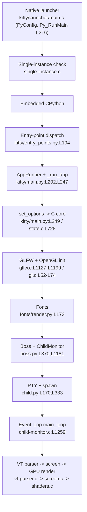

# kitty Terminal Emulator — Startup Investigation

**A code-grounded, evidence-backed walkthrough of everything that happens when kitty starts up, from process launch until the terminal is ready to communicate with and render output from a shell.**

- **Subject:** the [kitty](https://github.com/kovidgoyal/kitty) GPU-accelerated terminal emulator.
- **Exact source state:** commit `815df1e210e0a9ab4622f5c7f2d6891d7dbeddf1`, kitty **v0.35.2** (`appname='kitty'` [kitty/constants.py:L23], `version: Version = Version(0, 35, 2)` [kitty/constants.py:L25]).
- **Platform exercised for live evidence:** Linux / X11 under a virtual framebuffer (Xvfb) with Mesa **llvmpipe** software OpenGL. macOS/CoreText and Wayland paths are described only as *code-present alternatives*, never as exercised targets.

This document answers four question clusters about kitty's cold start:

1. **Q1 — Startup systems (headless):** which subsystems come online on the path to a working terminal, and what is *seen in the logs* that proves each one started.
2. **Q2 — Initial configuration:** how kitty decides its initial configuration, which sources/defaults it uses on first launch, how those drive the window, and what output proves the settings were applied.
3. **Q3 — Terminal↔shell communication readiness:** how kitty readies the terminal to talk to the shell, and what concrete behavior on the shell's first output proves the bytes were understood and drawn.
4. **Q4 — Display system evidence:** as the first characters appear, what visible/logged evidence about fonts, layout, scrolling, and screen updates confirms the display system is active.

Every factual claim below carries a concrete source citation and, where applicable, a quoted block of **real captured runtime output**. Nothing is assumed; where naive expectations diverge from the code at this commit, the divergence is called out explicitly (see [Code-as-truth corrections](#3-code-as-truth-corrections)).

---

## Table of Contents

1. [Methodology & Headless Harness](#1-methodology--headless-harness)
2. [Citation legend](#2-citation-legend)
3. [Code-as-truth corrections](#3-code-as-truth-corrections)
4. [Q1 — Startup systems (headless)](#4-q1--startup-systems-headless)
5. [Q2 — Initial configuration](#5-q2--initial-configuration)
6. [Q3 — Terminal↔shell communication readiness](#6-q3--terminalshell-communication-readiness)
7. [Q4 — Display system evidence](#7-q4--display-system-evidence)
8. [Limitations & Honesty](#8-limitations--honesty)

---

## 1. Methodology & Headless Harness

kitty is a GPU-accelerated terminal: it **hard-requires a desktop OpenGL context** and aborts startup if it cannot obtain one (the version gate `fatal("OpenGL version is %d.%d, version >= %d.%d required for kitty", ...)` [kitty/gl.c:L74] and the GLFW temp-window `fatal(...)` "kitty requires working OpenGL %d.%d drivers." [kitty/glfw.c:L1199]). A headless run therefore needs two things that a bare server lacks:

1. **A virtual X11 display** — provided by **Xvfb**.
2. **A software OpenGL implementation** — because **Xvfb has no GPU**, the OpenGL context must be created by Mesa's **llvmpipe** CPU rasterizer, forced on with `LIBGL_ALWAYS_SOFTWARE=1`.

### Environment

The build/run was performed in the user-specified Docker analysis container. The build toolchain plus the font/render stack (`libfontconfig-dev libfreetype-dev libharfbuzz-dev libpng-dev liblcms2-dev`), `libxxhash-dev`, `libsimde-dev`, the X11 dev libraries, `libdbus-1-dev`, and the headless stack (`xvfb mesa-utils libgl1-mesa-dri`) are present.

- **Build command:** `python3 setup.py` (the build entry point; the `Makefile` `all:` target invokes it). This compiles the `fast_data_types` C extension, the vendored GLFW (X11 backend), and the native launcher `kitty/launcher/kitty`. On a toolchain where GLFW's `-Werror` trips over newer `wayland-protocols` enum values, `python3 setup.py --ignore-compiler-warnings` is the project-native escape hatch (it disables warnings-as-errors only; it modifies no source). Only the **X11** GLFW backend is needed for the Xvfb target.
- **No tracked repository changes:** all build outputs (`*.so`, `build/`, generated files) are gitignored; `git status --porcelain` reported **0** entries after building.

### Headless harness commands (reproducible)

```bash
Xvfb :99 -screen 0 1920x1080x24 &
export DISPLAY=:99
export LIBGL_ALWAYS_SOFTWARE=1     # force Mesa software renderer (no GPU under Xvfb)
glxinfo -B                          # confirm the active renderer
kitty/launcher/kitty --debug-rendering  <child-command>
```

### Why `LIBGL_ALWAYS_SOFTWARE=1`

Xvfb provides no GPU, so Mesa must fall back to its **llvmpipe** software rasterizer to create the OpenGL context kitty needs. `glxinfo -B` confirmed the active renderer:

```
Vendor: Mesa (0xffffffff)
Device: llvmpipe (LLVM 20.1.2, 256 bits) (0xffffffff)
Version: 25.2.8
Max core profile version: 4.5
OpenGL renderer string: llvmpipe (LLVM 20.1.2, 256 bits)
OpenGL core profile version string: 4.5 (Core Profile) Mesa 25.2.8-0ubuntu0.24.04.2
```

This **4.5 core** context comfortably exceeds kitty's Linux floor of **OpenGL 3.1** (see [correction #1](#3-code-as-truth-corrections)).

### Diagnostic flags actually available

From the CLI option declarations [kitty/cli.py:L985-L1002]:

- `--dump-bytes <file>` — raw bytes received from the child process, written to a file [kitty/cli.py:L985].
- `--debug-rendering` / `--debug-gl` — GL/render diagnostics; **causes all OpenGL calls to be error-checked** instead of ignored, and prints miscellaneous debug info [kitty/cli.py:L989-L994].
- `--debug-input` / `--debug-keyboard` (`dest=debug_keyboard`) — prints key and mouse events as received [kitty/cli.py:L996-L1000].
- `--debug-font-fallback` — dumps the resolved font matches [kitty/cli.py:L1002].

> **There is no `--debug-config` command-line flag** (see [correction #6](#3-code-as-truth-corrections)).

---

## 2. Citation legend

- Citations use inline `[path:locator]` form, e.g. `[kitty/gl.c:L72]` (single line) or `[kitty/main.py:L226-L234]` (line range). All paths are relative to the repository root and all line numbers are pinned to commit `815df1e2`.
- Fenced code blocks labeled **Evidence** quote **real captured runtime output** from the headless harness above. Captured text is reproduced verbatim (timestamps and absolute paths are environment-specific and left as-captured).
- The investigation's live platform is Linux/X11 under Xvfb with Mesa llvmpipe; any macOS/Wayland references are noted as code-present, not exercised.

---

## 3. Code-as-truth corrections

These are the places where a naive reading (or general kitty lore) diverges from what the code at commit `815df1e2` actually does. They are stated up front because they materially affect the answers below.

### Correction #1 — The OpenGL floor is platform-specific: Linux = 3.1, macOS = 3.3

The required version is **not** a flat "3.3 everywhere." The header defines the major as 3 and the minor conditionally:

```c
// kitty/data-types.h:L20-L26
#define OPENGL_REQUIRED_VERSION_MAJOR 3
#ifdef __APPLE__
#define OPENGL_REQUIRED_VERSION_MINOR 3
#else
#define OPENGL_REQUIRED_VERSION_MINOR 1
#endif
#define GLSL_VERSION 140
```

So for the **live Linux/Xvfb run the required version is OpenGL 3.1**; 3.3 is the macOS floor. The fatal version check is `[kitty/gl.c:L74]`; GLFW's temp-window fatal is `[kitty/glfw.c:L1199]`. llvmpipe reported **4.5 ≥ 3.1**, so neither fatal fired and the run exited 0. **Do not blanket-state "3.3 required" for the Linux run.**

### Correction #2 — No explicit core-profile request on Linux

kitty sets only the version hints and forward-compatibility; it does **not** request a core profile:

```c
// kitty/glfw.c:L1127-L1129
glfwWindowHint(GLFW_CONTEXT_VERSION_MAJOR, OPENGL_REQUIRED_VERSION_MAJOR);
glfwWindowHint(GLFW_CONTEXT_VERSION_MINOR, OPENGL_REQUIRED_VERSION_MINOR);
glfwWindowHint(GLFW_OPENGL_FORWARD_COMPAT, true);
```

There is **no** `glfwWindowHint(GLFW_OPENGL_PROFILE, GLFW_OPENGL_CORE_PROFILE)` call. The `GLFW_OPENGL_CORE_PROFILE` symbol that appears at `[kitty/glfw.c:L2505]` is merely a Python-module constant registration (`ADDC(GLFW_OPENGL_CORE_PROFILE);`). The "(Core Profile)" token observed in the GL version string is therefore **Mesa's own choice** for a forward-compatible ≥3.0 context, not an explicit kitty request.

### Correction #3 — kitty does NOT print `GL_VENDOR`/`GL_RENDERER` at startup (this commit)

The lines around `[kitty/shaders.c:L1252-L1258]` are **`PyModule_AddIntConstant` registrations** of the GL enum *constants* (`GL_VERSION` [kitty/shaders.c:L1255], `GL_VENDOR` [kitty/shaders.c:L1256], `GL_RENDERER` [kitty/shaders.c:L1258]) inside `init_shaders`, via the macro `#define C(x) if (PyModule_AddIntConstant(module, #x, x) != 0) {...}` [kitty/shaders.c:L1252] — **not prints**. The only `glGetString` call in the C core is `[kitty/gl.c:L46]`, and it queries `GL_VERSION` only. Therefore the startup `--debug-rendering` evidence is the **GL version string** `[kitty/gl.c:L72]` (which itself contains the vendor token "Mesa"); the **"llvmpipe"** renderer name is confirmed via the external `glxinfo -B`, **not** by kitty.

### Correction #4 — There are 13 `*.glsl` files in `kitty/` (not 12)

The full set: `alpha_blend`, `bgimage_fragment`, `bgimage_vertex`, `border_fragment`, `border_vertex`, `cell_defines`, `cell_fragment`, `cell_vertex`, `graphics_fragment`, `graphics_vertex`, `linear2srgb`, `tint_fragment`, `tint_vertex`. The one most often missed is `cell_defines.glsl`.

### Correction #5 — The config tempfile fallback is conditional

`_get_config_dir()` `[kitty/constants.py:L87-L131]` only uses `tempfile.mkdtemp(prefix='kitty-conf-')` on a `PermissionError` or a read-only filesystem (`errno.EROFS`) when creating the config directory `[kitty/constants.py:L104-L130]`. Otherwise it creates/returns `${XDG_CONFIG_HOME:-~/.config}/kitty`. The precise precedence is stated in [Q2](#5-q2--initial-configuration); `mkdtemp` is the conditional last resort, not the normal path.

### Correction #6 — There is no `--debug-config` CLI flag

`debug_config` exists only as a **keyboard action** bound to `kitty_mod+f6`:

```
# kitty/options/definition.py:L4256
'debug_config kitty_mod+f6 debug_config',
```

A grep of `kitty/cli.py` finds **no** `--debug-config` option, and at runtime the flag is rejected (see [Q2 Evidence #2](#evidence-2--the-guardrail-no---debug-config)). Config-applied evidence therefore comes from startup bad-line warnings, the interactive `debug_config` overlay, and observable window characteristics — never from a non-existent CLI flag.

---

## 4. Q1 — Startup systems (headless)

**Goal:** identify which systems start up on the path to a working terminal, and show what is actually seen in the logs proving each came online. The chain is traced **in source order**, and each stage is tied to the code that runs it and the log line that proves it.

### The cold-start chain

1. **Native launcher** `[kitty/launcher/main.c]` — the compiled `kitty/launcher/kitty` binary embeds CPython via the `PyConfig` API. It initializes the config `[kitty/launcher/main.c:L192-L194]` with `config.parse_argv = 0`, sets argv/executable/run_filename/home, then runs the interpreter with `return Py_RunMain();` `[kitty/launcher/main.c:L216]`. The companion `[kitty/launcher/launcher.h]` holds the `CLIOptions` struct (session, single-instance, version flags), and `[kitty/launcher/single-instance.c]` implements the single-instance UNIX-socket IPC used for `--single-instance`.

2. **Entry-point dispatch** `[kitty/entry_points.py:L183]` (`def main()`); for the bare `kitty` invocation it executes `from kitty.main import main as kitty_main` `[kitty/entry_points.py:L194]` then `kitty_main()` `[kitty/entry_points.py:L195]`.

3. **`main()` / `AppRunner` orchestration** `[kitty/main.py]`. `AppRunner.__call__` `[kitty/main.py:L247]` calls `set_scale(...)` and then `set_options(opts, is_wayland(), args.debug_rendering, args.debug_font_fallback)` `[kitty/main.py:L249]`. This last call pushes the debug flags into the C core: `set_options` stores them in `global_state.debug_rendering` / `global_state.debug_font_fallback` `[kitty/state.c:L728-L739]`, which the gating macros `debug_rendering(...)` `[kitty/state.h:L14]` and `debug_fonts(...)` `[kitty/state.h:L16]` consult. It then calls `set_font_family(opts)` and `_run_app(...)`.

4. **`_run_app`** `[kitty/main.py:L202]`: creates startup sessions, then **creates the OS window** via `create_os_window(...)` (passing the `load_all_shaders` callback), constructs the **`Boss`** controller `boss = Boss(opts, args, ...)` `[kitty/main.py:L226]`, calls `boss.start(window_id, startup_sessions)` `[kitty/main.py:L227]`, optionally `dump_font_debug()` `[kitty/main.py:L229]` (under `if args.debug_font_fallback:`), optionally `boss.show_bad_config_lines(...)` `[kitty/main.py:L231]`, and finally hands off to the event loop: `boss.child_monitor.main_loop()` `[kitty/main.py:L234]`.

5. **GLFW + OpenGL init** `[kitty/glfw.c]`: GL context hints are set at `[kitty/glfw.c:L1127-L1129]` (`GLFW_CONTEXT_VERSION_MAJOR/MINOR = OPENGL_REQUIRED_VERSION_*`, `GLFW_OPENGL_FORWARD_COMPAT = true`); an sRGB output buffer is requested (non-Wayland) at `[kitty/glfw.c:L1144]` (`GLFW_SRGB_CAPABLE`); failure to create the temp GL window is fatal at `[kitty/glfw.c:L1199]`. The GL loader/version check lives in `gl_init()` `[kitty/gl.c:L52]`; it prints the version under `--debug-rendering` at `[kitty/gl.c:L72]` and aborts if the context is too old at `[kitty/gl.c:L74]`.

6. **Font subsystem** — `set_font_family(opts)` `[kitty/fonts/render.py:L173]` initializes fonts before the app runs (detail in [Q4](#7-q4--display-system-evidence)).

7. **`Boss` controller** `[kitty/boss.py]` — the `__init__` at `[kitty/boss.py:L325]` creates the threaded child monitor `self.child_monitor = ChildMonitor(...)` `[kitty/boss.py:L370]`, wires OS windows (`add_os_window` `[kitty/boss.py:L402]`), and registers children via `add_child` `[kitty/boss.py:L585-L587]`. `Boss.start()` `[kitty/boss.py:L1181]` starts the monitor thread (`self.child_monitor.start()` `[kitty/boss.py:L1183]`).

8. **PTY + child spawn** `[kitty/child.py]` (full detail in [Q3](#6-q3--terminalshell-communication-readiness)): the PTY is allocated via `os.openpty()` `[kitty/child.py:L170-L171]` and the child is started via `fast_data_types.spawn(...)` `[kitty/child.py:L333]`.

9. **Child-monitor event loop** `[kitty/child-monitor.c:L1259]` (`main_loop`): the threaded loop that reads child output (`read_bytes` `[kitty/child-monitor.c:L1337]`), parses it (`parse_input` `[kitty/child-monitor.c:L451]`), and drives rendering; the `global_state.debug_rendering` gate appears, for example, at `[kitty/child-monitor.c:L822]`.

### Evidence

Captured with `--debug-rendering` (file `launch_rendering.log`):

```
[0.514] OS Window created
[0.541] Failed to open systemd user bus with error: Connection refused
[0.552] Child launched
[0.404] GL version string: '4.5 (Core Profile) Mesa 25.2.8-0ubuntu0.24.04.2' Detected version: 4.5
```

Each line maps to its source:

- **`OS Window created`** ⇒ `debug("OS Window created\n");` `[kitty/glfw.c:L1321]`, where `#define debug debug_rendering` `[kitty/glfw.c:L34]` gates the message on `global_state.debug_rendering` `[kitty/state.h:L14]`. **Proves the GLFW / OS-window subsystem is online.**
- **`GL version string: '4.5 (Core Profile) Mesa ...' Detected version: 4.5`** ⇒ `[kitty/gl.c:L72]`. **Proves the OpenGL context was created (in software via llvmpipe) and passed the version gate** `[kitty/gl.c:L74]`. The vendor token "Mesa" is embedded in this string (see [correction #3](#3-code-as-truth-corrections)).
- **`Child launched`** ⇒ `print(f'[{now:.3f}] Child launched', file=sys.stderr)` `[kitty/window.py:L871]`, gated on `boss.args.debug_rendering`. **Proves the PTY child was forked/spawned and the terminal is ready to talk to it.**
- **`Failed to open systemd user bus ...`** ⇒ `log_error("Failed to open systemd user bus with error: %s", ...)` `[kitty/systemd.c:L87]` — **benign** in a container with no systemd user bus; an informational message, not a startup failure (see [Limitations](#8-limitations--honesty)).

### Rationale: the ordering subtlety proves source order

Notice that the GL line carries the *earliest* timestamp (`[0.404]`) yet appears *last* in the combined stream. This is because the GL version string is written with `printf` to **stdout** (block-buffered when piped), while the other three lines are written to **stderr** (unbuffered). The earliest timestamp on the GL line is direct evidence that **OpenGL initialization happens before** the window is fully created and the child is launched — exactly as the source order (step 5 before steps 7–8) predicts. The clean **exit code 0** confirms the entire chain succeeded headlessly.

> This ordering was reproduced during this investigation: a fresh `--debug-rendering` run produced the same four lines with the GL line bearing the earliest timestamp but printed last, and exit code 0.

### Startup flowchart



---

## 5. Q2 — Initial configuration

**Goal:** explain how kitty decides its initial configuration at startup, which sources/defaults it uses for the first launch, how those affect the window, and what output proves the settings were applied.

### Config-source precedence — `_get_config_dir()` `[kitty/constants.py:L87-L131]`

The configuration directory is resolved deterministically:

1. If `KITTY_CONFIG_DIRECTORY` is set → use it (abspath/expanduser) `[kitty/constants.py:L88-L89]`.
2. Otherwise build a list of candidate locations: `XDG_CONFIG_HOME` (if set), then `~/.config`, then (macOS only) `~/Library/Preferences`, then each `XDG_CONFIG_DIRS` entry `[kitty/constants.py:L92-L98]`.
3. Return the **first** `<loc>/kitty` that is **writable and already contains a `kitty.conf`** `[kitty/constants.py:L99-L103]`.
4. Otherwise create and return `${XDG_CONFIG_HOME:-~/.config}/kitty` via `os.makedirs(...)`; **only** on a `PermissionError` or read-only filesystem (`errno.EROFS`) does it fall back to `tempfile.mkdtemp(prefix='kitty-conf-')` (registered for `atexit` cleanup) `[kitty/constants.py:L104-L130]`. The module-level `config_dir = _get_config_dir()` is resolved at import time `[kitty/constants.py:L131]`.

(The `mkdtemp` fallback is the conditional last resort — see [correction #5](#3-code-as-truth-corrections).)

### Loading and defaults

- **Built-in defaults** are imported as `from .options.types import Options, defaults, option_names` `[kitty/config.py:L13]`. The generated `Options` dataclass and its `defaults` instance live in `kitty/options/types.py`, generated from the canonical declarations in `kitty/options/definition.py` via the parser `kitty/options/parse.py` and the value converters `kitty/options/utils.py`.
- `load_config(*paths, overrides=..., accumulate_bad_lines=...)` `[kitty/config.py:L163]` merges file values **over** `defaults`, constructs `Options(opts_dict)`, then finalizes keys and mouse mappings. **When no `kitty.conf` exists, the effective options are exactly the built-in `defaults`.**
- Bad lines are collected as `BadLine` records (via `accumulate_bad_lines`) and surfaced by `Boss.show_bad_config_lines(...)` `[kitty/boss.py:L2759]`, invoked from `[kitty/main.py:L231]`.
- CLI overrides `-o key=value` and `--config` are parsed by `kitty/cli.py`; resolved options are pushed into the C core through `kitty/options/to-c-generated.h`.
- A default that matters downstream: `opt('term', 'xterm-kitty', ...)` `[kitty/options/definition.py:L3242]` (used in [Q3](#6-q3--terminalshell-communication-readiness)).

### How options drive the first window

The effective `Options` feed `create_os_window(...)` and the `Boss` in `_run_app` `[kitty/main.py:L202-L234]` — window size/class, font family/size, colors, cursor, scrollback, etc., are all read from the resolved `Options`.

### Evidence #1 — settings parsed/applied

A `kitty.conf` was placed in a directory pointed at by `KITTY_CONFIG_DIRECTORY` containing a valid `font_size 20.0`, an **invalid** `this_is_not_a_real_option foobar`, and a valid `scrollback_lines 5000`. The launch printed (file `launch_badconfig.log`):

```
[0.056] Ignoring unknown config key: this_is_not_a_real_option
```

**Rationale:** the *valid* keys were accepted **silently** (no warning), while the *unknown* key produced a warning. This proves the config file at the resolved directory was actually **read, parsed, and validated against the option schema** — the warning travels the `BadLine` → `show_bad_config_lines` `[kitty/boss.py:L2759]` path described above. (This was reproduced during the investigation, printing the identical message modulo timestamp.)

### Evidence #2 — the guardrail (no `--debug-config`)

The flag does not exist; at runtime kitty rejects it:

```
$ kitty --debug-config sh -c 'true'
Unknown option: --debug-config        (exit code 1)
```

**Rationale:** `debug_config` is a *keyboard action* bound to `kitty_mod+f6` `[kitty/options/definition.py:L4256]`, not a CLI option (see [correction #6](#3-code-as-truth-corrections)). Config-applied confirmation at startup therefore comes from (a) bad-line warnings (Evidence #1), (b) the interactive `debug_config` overlay, and (c) observable window characteristics — e.g., a requested `font_size`/`scrollback_lines` taking effect on the rendered window.

---

## 6. Q3 — Terminal↔shell communication readiness

**Goal:** explain how kitty readies the terminal to talk to the shell, and what concrete behavior on the shell's first output shows the data was understood and drawn.

### Setup steps

- **PTY allocation:** `master, slave = os.openpty()` `[kitty/child.py:L170-L171]` (the slave is marked inheritable). The child runs on the PTY slave.
- **Child environment:** `env['TERM'] = opts.term` `[kitty/child.py:L242]` (default `xterm-kitty` `[kitty/options/definition.py:L3242]`) and `env['COLORTERM'] = 'truecolor'` `[kitty/child.py:L243]`.
- **terminfo provisioning:** kitty points the child at its bundled terminfo. When `opts.terminfo_type == 'path'` and the on-disk terminfo dir exists, it sets `env['TERMINFO'] = tdir` `[kitty/child.py:L258]`; with `terminfo_type == 'direct'` it passes the database inline via `env['TERMINFO'] = base64_terminfo_data()` `[kitty/child.py:L260]`. The database itself is `terminfo/kitty.terminfo` / `terminfo/kitty.termcap` / `terminfo/x/xterm-kitty`; its entry header is `xterm-kitty|KovIdTTY,` and it declares `Su,` and `Tc,` (truecolor) `[terminfo/kitty.terminfo:L1-L3]`.
- **Child spawn:** `pid = fast_data_types.spawn(final_exe, cwd, tuple(argv), env, master, slave, ...)` `[kitty/child.py:L333]` — the C `spawn` forks and execs the shell connected to the PTY.
- **Shell integration:** `modify_shell_environ(opts, env, argv)` `[kitty/shell_integration.py:L218]` sets `env['KITTY_SHELL_INTEGRATION']` `[kitty/shell_integration.py:L223]` and (if enabled) runs the per-shell modifier — `setup_bash_env` `[kitty/shell_integration.py:L70]`, `setup_zsh_env` `[kitty/shell_integration.py:L49]`, `setup_fish_env` `[kitty/shell_integration.py:L16]`. The integration scripts emit OSC 133 prompt marks and OSC 7 CWD reports — e.g. fish's `\e]133;A` (prompt start), `\e]133;C` (command start), `\e]133;D;$status` (command end), and `\e]7;kitty-shell-cwd://$hostname$PWD` `[shell-integration/fish/vendor_conf.d/kitty-shell-integration.fish]`; the zsh equivalents live in `[shell-integration/zsh/kitty-integration]`.

### The read → parse → draw pipeline

The event loop `main_loop` `[kitty/child-monitor.c:L1259]` reads child bytes (`read_bytes` `[kitty/child-monitor.c:L1337]`) and feeds the VT parser `parse_input` `[kitty/child-monitor.c:L451]` → `kitty/vt-parser.c` (state machine `typedef enum VTEState` `[kitty/vt-parser.c:L160]`, CSI states `typedef enum { CSI_START, CSI_BODY, CSI_POST_SECONDARY } CSIState` `[kitty/vt-parser.c:L181]`, `consume_normal` `[kitty/vt-parser.c:L230]`, `consume_esc` `[kitty/vt-parser.c:L261]`, `dispatch_osc` `[kitty/vt-parser.c:L457]`). The parser dispatches into the screen model `kitty/screen.c` (`screen_draw_text` `[kitty/screen.c:L866]`, `screen_carriage_return` `[kitty/screen.c:L1638]`, `screen_linefeed` `[kitty/screen.c:L1643]`, `screen_index`/`screen_scroll` `[kitty/screen.c:L1570,L1590]`), backed by line buffers (`kitty/line.c` / `kitty/line-buf.c`), scrollback (`kitty/history.c`), cursor (`kitty/cursor.c`), and modes (`kitty/modes.h`).

### Evidence #1 — child env actually set

Captured by a shell running *inside* kitty, writing its own environment to a file (`child_env.txt`):

```
COLORTERM=truecolor
PATH=/tmp/blitzy/kitty/kitty_815df1e210e0_77c5cb/kitty/launcher:/usr/local/sbin:...
TERM=xterm-kitty
TERMINFO=/tmp/blitzy/kitty/kitty_815df1e210e0_77c5cb/terminfo
/dev/pts/0
#	Reconstructed via infocmp from file: .../terminfo/x/xterm-kitty
xterm-kitty|KovIdTTY,
	am,
```

**Rationale:** this confirms `TERM=xterm-kitty`, `COLORTERM=truecolor`, and `TERMINFO` pointing at kitty's bundled directory (matching the source above), that the child is attached to a real PTY slave (`/dev/pts/0`), and that `infocmp` can read the bundled `xterm-kitty` entry — i.e., the shell has a working terminal definition. (Reproduced during the investigation; `TERM`/`COLORTERM`/`TERMINFO`/`/dev/pts/0` matched exactly.)

### Evidence #2 — the data was understood and drawn (`--dump-bytes`)

The child printed `PROMPT$ hello\033[1;32mGREEN\033[0m done\r\n`. The raw dump file (`child_bytes.dump`) captured the exact bytes (escape sequences visible via `cat -v`):

```
PROMPT$ hello^[[1;32mGREEN^[[0m done^M^M
```

and the parsed-command log (`launch_dumpbytes.log`) shows kitty's VT parser interpreting them and dispatching to the screen:

```
draw PROMPT$ hello
select_graphic_rendition 1 32
draw GREEN
select_graphic_rendition 0
draw  done
screen_carriage_return
screen_carriage_return
screen_linefeed
```

**Rationale (the crux of Q3):** the SGR sequence `ESC[1;32m` was parsed into `select_graphic_rendition 1 32` (bold + green foreground), the text between was issued as `draw GREEN`, the reset `ESC[0m` became `select_graphic_rendition 0`, and `\r\n` became `screen_carriage_return` + `screen_linefeed`. Each parsed command maps to a `kitty/screen.c` function — `screen_carriage_return` `[kitty/screen.c:L1638]`, `screen_linefeed` `[kitty/screen.c:L1643]`, text via `screen_draw_text` `[kitty/screen.c:L866]`, and SGR handling via `select_graphic_rendition` `[kitty/vt-parser.c:L868]`. This proves the bytes were **understood correctly** (escape codes decoded, not printed literally) and **drawn** into the screen line buffer. (This sequence was reproduced byte-for-byte and command-for-command during the investigation.)

> `--debug-input` / `--debug-keyboard` `[kitty/cli.py:L996-L1000]` would surface *inbound* key/mouse events. In a non-interactive headless run there is no keyboard input to capture, so this flag is documented for completeness rather than illustrated with fabricated key logs.

---

## 7. Q4 — Display system evidence

**Goal:** as the first characters appear, identify the visible/logged evidence about fonts, layout, scrolling, and screen updates that confirms the display system is active.

### Font discovery & rasterization

Font selection is orchestrated in `kitty/fonts/render.py` / `kitty/fonts/common.py` (with `fontconfig.py`, `list.py`, `box_drawing.py`, `core_text.py`). On Linux, font *discovery* goes through fontconfig (`kitty/fontconfig.c`) and glyph *rasterization* through FreeType (`kitty/freetype.c`). The font debug dump is `dump_font_debug()` `[kitty/fonts/render.py:L161]`, whose first line is `log_error('Text fonts:')` `[kitty/fonts/render.py:L163]`; it is invoked from `[kitty/main.py:L229]` under `--debug-font-fallback`. Fonts are initialized before the app runs via `set_font_family(opts)` `[kitty/fonts/render.py:L173]`.

### Glyph cache → GPU texture atlas

Rasterized glyphs are cached and packed into a GPU sprite atlas: `find_or_create_sprite_position(...)` `[kitty/glyph-cache.c:L34]` maps glyph runs to sprite positions / atlas layers.

### GLSL shader pipeline

`kitty/shaders.py` loads the GLSL sources and prepends the version directive `yield f'#version {GLSL_VERSION}\n'` `[kitty/shaders.py:L63]` (`GLSL_VERSION = 140`, from `[kitty/data-types.h:L26]`). `kitty/shaders.c` compiles and links the programs (cell/border/bgimage/graphics/tint), registered as module constants inside `init_shaders` `[kitty/shaders.c:L1252-L1253]`. There are **13** `*.glsl` files (see [correction #4](#3-code-as-truth-corrections)): `alpha_blend`, `bgimage_fragment`, `bgimage_vertex`, `border_fragment`, `border_vertex`, `cell_defines`, `cell_fragment`, `cell_vertex`, `graphics_fragment`, `graphics_vertex`, `linear2srgb`, `tint_fragment`, `tint_vertex`. Color management/sRGB involves the `GLFW_SRGB_CAPABLE` request `[kitty/glfw.c:L1144]`, plus `kitty/srgb_gamma.h`, `kitty/gl-wrapper.h`, and `linear2srgb.glsl`.

### Scrolling / scrollback

Line advancement and scrolling are handled by `screen_index`/`screen_scroll` `[kitty/screen.c:L1570,L1590]`, with scrollback in `kitty/history.c`.

### Evidence #1 — font subsystem online (`--debug-font-fallback`)

Captured in `launch_fontfallback.log`:

```
[0.159] Text fonts:
[0.159]   Normal: DejaVuSansMono: /usr/share/fonts/truetype/dejavu/DejaVuSansMono.ttf:0
[0.159]   Bold: DejaVuSansMono-Bold: /usr/share/fonts/truetype/dejavu/DejaVuSansMono-Bold.ttf:0
[0.159]   Italic: DejaVuSansMono-Oblique: /usr/share/fonts/truetype/dejavu/DejaVuSansMono-Oblique.ttf:0
[0.159]   Bold-Italic: DejaVuSansMono-BoldOblique: /usr/share/fonts/truetype/dejavu/DejaVuSansMono-BoldOblique.ttf:0
[0.174] U+1f600 emoji_presentation Face(family=DejaVu Sans style=Book ps_name=DejaVuSans path=/usr/share/fonts/truetype/dejavu/DejaVuSans.ttf ttc_index=0 variant=False named_instance=False scalable=True color=False)
```

**Rationale:** the font system reports the concrete faces fontconfig resolved for the default monospace family (Normal/Bold/Italic/Bold-Italic = DejaVuSansMono variants) and a **fallback** chosen for an emoji codepoint (U+1F600) not present in the primary face. This proves font discovery (`kitty/fontconfig.c`), face loading (`kitty/freetype.c`), and the fallback path are live. The `Text fonts:` header ties directly to `[kitty/fonts/render.py:L163]`. (The four monospace faces and their exact `/usr/share/fonts/truetype/dejavu/` paths were reproduced during the investigation.)

### Evidence #2 — GPU render path online (`--debug-rendering`)

Reusing the GL version line from [Q1](#4-q1--startup-systems-headless):

```
[0.404] GL version string: '4.5 (Core Profile) Mesa 25.2.8-0ubuntu0.24.04.2' Detected version: 4.5
```

**Rationale:** a valid GL context (software llvmpipe) was created and accepted by the version gate `[kitty/gl.c:L72-L74]`, which is the prerequisite for compiling shaders (`kitty/shaders.c`) and uploading the glyph atlas (`kitty/glyph-cache.c`). With `--debug-rendering`, GL calls are additionally error-checked — the post-callback `gladSetGLPostCallback(check_for_gl_error)` is installed in `gl_init` `[kitty/gl.c:L52-L62]` — so a run that completes without a GL-error abort is itself evidence the render pipeline is functioning. Per [correction #3](#3-code-as-truth-corrections), kitty prints the **version** (which contains "Mesa"); the **"llvmpipe"** renderer string is confirmed by the external `glxinfo -B`, not by kitty.

### Evidence #3 — drawing/scrolling (reusing the Q3 dump)

The `draw ...`, `screen_carriage_return`, and `screen_linefeed` commands from the `--dump-bytes` log (see [Q3 Evidence #2](#evidence-2--the-data-was-understood-and-drawn---dump-bytes)) demonstrate that screen-buffer updates — cell writes plus line advancement — are occurring. In other words, the layout/scroll machinery in `kitty/screen.c` is actively updating what would be displayed.

---

## 8. Limitations & Honesty

- **Software OpenGL caveat.** All GL evidence is from **Mesa llvmpipe** (a CPU rasterizer) under Xvfb. This satisfies kitty's Linux floor of OpenGL 3.1 (see [correction #1](#3-code-as-truth-corrections)) but is **not** hardware-accelerated. Performance characteristics are therefore *not* representative of a real GPU; only the **correctness** of the startup/render path is demonstrated.
- **Not exercised live.** The **Wayland** and **macOS/CoreText** paths are described only as code-present alternatives, not run. Interactive **keyboard input** (`--debug-input` capture) was not exercised because the harness ran a non-interactive, self-terminating child. The standalone Go `kitten` binary is orthogonal to core terminal startup (the path investigated here) and is not part of this analysis.
- **Benign messages.** The `Failed to open systemd user bus with error: Connection refused` line `[kitty/systemd.c:L87]` is expected in a container without a systemd user bus and is **not** a startup failure.
- **Environment determinism.** Live evidence was captured with Mesa llvmpipe (the `glxinfo`/GL version strings include the Mesa build suffix and an LLVM patch level that are environment-specific). All **source citations and behavior** are pinned to commit `815df1e2` / kitty v0.35.2 `[kitty/constants.py:L25]`; re-running the harness on a different Mesa/Ubuntu build changes only the cosmetic version suffix and per-run timestamps, not the mechanism or the source it exercises.
- **No repository modification.** `git status --porcelain` reported **0** tracked changes after building (all build outputs are gitignored). The only repository addition is this document, `blitzy/documentation/kitty_815df1e210e0.md`.
- **Cleanup.** All temporary scripts, logs, and config directories created for this investigation (the Xvfb display, the `--dump-bytes`/`--debug-*` capture logs, and the throwaway `kitty.conf`) were removed after evidence capture; nothing transient was left behind in the repository or committed.
