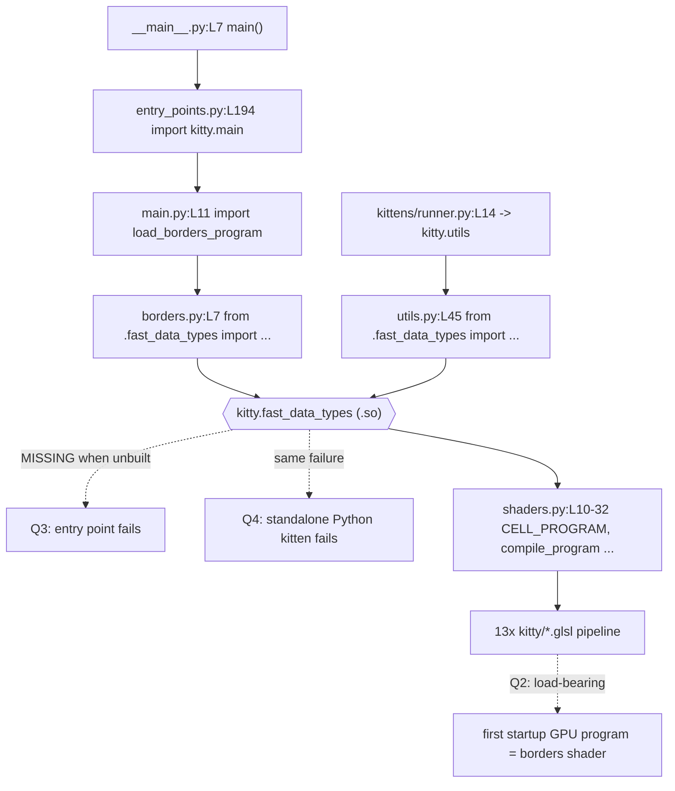

# kitty Architecture — Onboarding Q&A (branch: `kitty_815df1e210e0`)

This document answers four interlocking questions about the [kitty](https://sw.kovidgoyal.net/kitty/) terminal emulator, an onboarding engineer's first questions about how the codebase is put together. Every answer is grounded in code that was **actually built and run** in the project's container, with the producing command and its **verbatim output** quoted inline, plus exact `file:line` citations. Where the raw environment differs from a naive expectation, the difference is stated explicitly rather than glossed over.

## How this was investigated (methodology)

The investigation was **run-first**: the relevant code paths were exercised before a single conclusion was written, and each conclusion is backed by captured output.

- **Environment.** Built and run inside the project's container (`ghcr.io/scaleapi/swe-atlas:swe_atlas_QnA_kovidgoyal_kitty_1.0`) with the toolchain observed as `Python 3.13.7`, `go version go1.22.12 linux/amd64`, and `gcc 15.2.0`. These satisfy the project's declared floors — `pyproject.toml:L2` `requires-python = ">=3.8"` and `go.mod:L3` `go 1.22`. The build produces the native extension `kitty/fast_data_types.so`, the C launcher `kitty/launcher/kitty`, and the Go binary `kitty/launcher/kitten`. kitty's own version reported as `kitty 0.35.2 created by Kovid Goyal`.
- **Negative → positive control.** To reproduce the "unbuilt" failures the four questions hinge on, the git-ignored native extension `kitty/fast_data_types.so` was temporarily relocated (it is covered by `*.so` in `.gitignore`, so this never affects `git status`), the failures were captured, and then the extension was rebuilt with `python3 setup.py` so the very same commands could be shown succeeding. This isolates a single variable — the presence of one compiled file.
- **Exactness.** Measured counts are taken from `git ls-files` (the human-authored source of truth) and cross-checked against `find`; identifiers, error strings, and line numbers are quoted literally.
- **Read-only.** No tracked file was modified. Temporary observation artifacts were written only under `/tmp` and removed. The sole artifact added to the repository is this document. `git status --porcelain` was verified empty after building and running (see [Repository left unchanged](#repository-left-unchanged-read-only-proof)).

> Note on Python 3.13: tracebacks below include the `~~~~^^` caret annotations that Python 3.13 prints under the offending expression. They are cosmetic error-location markers and are quoted as observed.

## The unifying component: `kitty.fast_data_types` (the native bridge)

The four questions look independent but converge on **one** component: the compiled C extension **`kitty.fast_data_types`** (built to `kitty/fast_data_types.so`). It is, simultaneously:

- the **missing piece** whose absence makes the entry point fail (Q3);
- the **shared dependency** that makes the Python "kittens" non-independent (Q4);
- the **provider of the GPU shader-program constants** (`CELL_PROGRAM`, `BORDERS_PROGRAM`, `GLSL_VERSION`, …) that drive the GLSL pipeline (Q2);
- and, as compiled C, the **runtime hot path** that does the heavy lifting (Q1).



Keep this linkage in mind: the same `.so` is the answer's center of gravity in all four sections.

---

## Q1 — Which language does the heavy lifting, and where performance comes from

**The question has two sub-parts:** (a) which language is really doing the heavy lifting once everything is running, and (b) what that says about where performance actually comes from. The premise — "a tight weave of Python and C" — is also worth correcting: there are **four** implementation languages, not two.

### Language census (measured)

Counts are taken from `git ls-files` so they reflect hand-authored source, not build byproducts. Command and verbatim output:

```console
$ echo "C  : $(git ls-files 'kitty/*.c' 'kitty/**/*.c' | wc -l) files"; \
  echo "H  : $(git ls-files 'kitty/*.h' 'kitty/**/*.h' | wc -l) files"; \
  echo "ObjC: $(git ls-files 'kitty/*.m' 'kitty/**/*.m' | wc -l) files"; \
  echo "C+H+ObjC lines: $(git ls-files 'kitty/*.c' 'kitty/**/*.c' 'kitty/*.h' 'kitty/**/*.h' 'kitty/*.m' 'kitty/**/*.m' | xargs cat | wc -l)"
C  : 51 files
H  : 48 files
ObjC: 2 files
C+H+ObjC lines: 62359
$ echo "kitty py: $(git ls-files 'kitty/*.py' 'kitty/**/*.py' | wc -l) files, $(git ls-files 'kitty/*.py' 'kitty/**/*.py' | xargs cat | wc -l) lines"
kitty py: 109 files, 39355 lines
$ git ls-files 'kittens/*.py' 'kittens/**/*.py' | wc -l
53
$ echo "go: $(git ls-files 'tools/*.go' 'tools/**/*.go' | wc -l) files, $(git ls-files 'tools/*.go' 'tools/**/*.go' | xargs cat | wc -l) lines"
go: 193 files, 38155 lines
$ git ls-files 'kitty/*.glsl' | wc -l
13
```

| Language | Location | Files | Lines |
|----------|----------|------:|------:|
| C + headers + Objective-C | `kitty/` | 101 (51 `.c`, 48 `.h`, 2 `.m`) | **62,359** |
| Python | `kitty/` | 109 | 39,355 |
| Python | `kittens/` | 53 | — |
| Go | `tools/` | 193 | 38,155 |
| GLSL | `kitty/` | 13 | — |

The single largest body of code is **C** at **62,359** lines — larger than the Python (`kitty/` = 39,355) and Go (`tools/` = 38,155) bodies. (Note: a naive `find` on this *already-built* tree reports higher numbers — `50` `.h` files and `255` `.go` files — because the build emits git-ignored generated files: exactly `+2` headers (`kitty/docs_ref_map_generated.h`, `kitty/uniforms_generated.h`) and `+62` `tools/cmd/**/cmd_*_generated.go` files, all matched by `.gitignore` patterns `*_generated.h` / `*_generated.go`. The `git ls-files` numbers above are the human-authored source of truth.)

### (a) Which language does the heavy lifting

**C does the heavy lifting at runtime**, compiled into the single native extension `kitty.fast_data_types`. The performance-critical hot paths live there:

- **VT/escape-sequence parsing** — `kitty/vt-parser.c` (1,596 lines).
- **The screen grid / line buffer** — `kitty/screen.c` (4,932 lines, the largest single C file) and `kitty/line.c` (1,003 lines).
- **Font rasterization** — `kitty/freetype.c` (1,037 lines); macOS uses Objective-C `kitty/core_text.m` (1,064 lines).
- **SIMD string scanning** — `kitty/simd-string.c` (249 lines) + `simd-string-impl.h`, compiled at two SIMD levels through the thin wrappers `kitty/simd-string-128.c` and `kitty/simd-string-256.c`; the latter is 9 lines — `simd-string-256.c:L8` `#define KITTY_SIMD_LEVEL 256` then `L9` `#include "simd-string-impl.h"`.
- **OpenGL command submission** — `kitty/gl.c` (400 lines) and `kitty/shaders.c`.
- **The threaded architecture** — `kitty/child-monitor.c` (2,016 lines) runs the I/O + render loop off the Python thread.
- **The graphics protocol / image handling** — `kitty/graphics.c` (2,431 lines).

**Python is the orchestration / extensibility layer, not the hot path.** It wires things together and stays out of the per-byte, per-pixel work: the `Boss` (`kitty/boss.py`), configuration (`kitty/options/`), the kittens framework (`kittens/`), window layouts (`kitty/layout/`), remote control (`kitty/rc/`), child-process management (`kitty/child.py`), and window bookkeeping (`kitty/window.py`). That Python leans on C is directly visible: **59** Python modules import the native extension (see Q3/Q4).

**The actual pixel work is offloaded to the GPU.** C submits OpenGL draw calls that run GLSL shader programs on the GPU (Q2). So even within the "C does the heavy lifting" answer, the *rendering* heavy lifting is pushed off-CPU entirely.

### Correcting the premise: four languages, not two

- **Go** is a first-class third language: `tools/` is **193** files / **38,155** lines and compiles into the standalone `kitten` CLI binary (`tools/cmd/main.go:L3` `package main`, `L14` `func main()`; its root command describes itself as `"Fast, statically compiled implementations of various kittens (command line tools for use with kitty)"`). `go.mod:L3` pins `go 1.22`.
- **Objective-C** (`kitty/core_text.m`, `kitty/cocoa_window.m`, 1,064 lines each) handles macOS-native text and windowing.
- **GLSL** (13 files) is the shader language that runs on the GPU (Q2).

### (b) What this says about where performance comes from

Performance does **not** come from Python. It comes from the combination of: **compiled C hot paths** (parsing, grid, fonts, I/O), **SIMD** string scanning, **GPU-offloaded rendering** via GLSL shaders, and a **threaded architecture** (`child-monitor.c`) that keeps the interpreter off the critical path. Python's contribution to speed is essentially *staying out of the way* — it configures, coordinates, and extends, then delegates the tight loops to C and the pixels to the GPU. The self-description "GPU based" is accurate for rendering; "GPU accelerated Python+C" undersells the fact that C (plus SIMD and threads) carries the CPU-side load and Go carries the CLI tooling.


---

## Q2 — The role and centrality of the GLSL shader files

**Two sub-parts:** (a) what role do the `kitty/*.glsl` files play, and (b) how central are they to the system? Short answer: they are the GPU rendering programs, and they are **load-bearing** — kitty compiles a GLSL program before it can draw anything.

### The 13 files: 5 program stage-pairs + 3 shared includes

```console
$ find kitty -maxdepth 1 -name '*.glsl' | sort
kitty/alpha_blend.glsl
kitty/bgimage_fragment.glsl
kitty/bgimage_vertex.glsl
kitty/border_fragment.glsl
kitty/border_vertex.glsl
kitty/cell_defines.glsl
kitty/cell_fragment.glsl
kitty/cell_vertex.glsl
kitty/graphics_fragment.glsl
kitty/graphics_vertex.glsl
kitty/linear2srgb.glsl
kitty/tint_fragment.glsl
kitty/tint_vertex.glsl
```

The naming convention `{name}_{stage}.glsl` divides these 13 into **10 stage files forming 5 vertex/fragment program pairs**, plus **3 shared includes** that carry no `_vertex`/`_fragment` suffix:

| Group | Files | Kind |
|-------|-------|------|
| `cell` | `cell_vertex.glsl`, `cell_fragment.glsl` | stage pair — draws terminal cells (text + backgrounds) |
| `border` | `border_vertex.glsl`, `border_fragment.glsl` | stage pair — window borders |
| `bgimage` | `bgimage_vertex.glsl`, `bgimage_fragment.glsl` | stage pair — background image |
| `graphics` | `graphics_vertex.glsl`, `graphics_fragment.glsl` | stage pair — the graphics/image protocol |
| `tint` | `tint_vertex.glsl`, `tint_fragment.glsl` | stage pair — tint/overlay |
| *(shared)* | `alpha_blend.glsl`, `cell_defines.glsl`, `linear2srgb.glsl` | **includes**, not standalone stages |

This reconciles "13 files" against "5 rendering programs": three files are `#include`-style fragments pulled into the others. `cell_defines.glsl` is a **31-line** `#define` header — e.g. `cell_defines.glsl:L2` `#define PHASE_BACKGROUND 2`, `L4` `#define PHASE_FOREGROUND 4`, `L6` `#define PHASE {WHICH_PHASE}` (a templated macro), and `L19` `#define NUM_COLORS 256`.

### The `#pragma kitty_include_shader` mechanism

The shared includes are stitched in by a kitty-specific pragma. For example, `kitty/cell_fragment.glsl:L1-3`:

```glsl
#pragma kitty_include_shader <alpha_blend.glsl>
#pragma kitty_include_shader <linear2srgb.glsl>
#pragma kitty_include_shader <cell_defines.glsl>
```

and `kitty/cell_vertex.glsl:L1-2`:

```glsl
#extension GL_ARB_explicit_attrib_location : require
#pragma kitty_include_shader <cell_defines.glsl>
```

### Two-layer orchestration: Python loads/preprocesses, C compiles/links

**Python side — `kitty/shaders.py`.** A `Program` (class at `shaders.py:L43`) is named after a stage pair: `shaders.py:L54-55` set `self.vertex_name = vertex_name or f'{name}_vertex.glsl'` and the matching `_fragment.glsl`. The include pragma is resolved by a regex compiled at `shaders.py:L53` — `re.compile(r'^#pragma\s+kitty_include_shader\s+<(.+?)>', re.MULTILINE)` — inside the recursive loader `_load_sources` (`shaders.py:L61`), which prepends `#version {GLSL_VERSION}` (`L63`) and expands each include (`L72` `finditer`, `L78` `yield from self._load_sources(iname, seen, level+1)`). The preprocessed source is handed to C at `shaders.py:L90` `compile_program(program_id, self.vertex_sources, self.fragment_sources, allow_recompile)`. The program IDs and `compile_program` itself are imported from the native extension at `shaders.py:L10-32` (`from .fast_data_types import ( CELL_PROGRAM, ... compile_program, init_cell_program, GLSL_VERSION, ... )`).

**C side — `kitty/shaders.c`.** The actual OpenGL calls live here: `compile_program` at `shaders.c:L1168`, which runs `program->id = glCreateProgram();` (`shaders.c:L1179`) and `glLinkProgram(program->id);` (`shaders.c:L1182`); `init_cell_program` is at `shaders.c:L217`.

The constants are real integers exported by the extension (read at runtime):

```console
$ python3 -c "from kitty.fast_data_types import GLSL_VERSION, CELL_PROGRAM, BORDERS_PROGRAM; \
print('GLSL_VERSION =', GLSL_VERSION); print('CELL_PROGRAM =', CELL_PROGRAM); print('BORDERS_PROGRAM =', BORDERS_PROGRAM)"
GLSL_VERSION = 140
CELL_PROGRAM = 0
BORDERS_PROGRAM = 4
```

So shaders get `#version 140`, and `BORDERS_PROGRAM` is program slot `4`.

### Build-time codegen treats only stage pairs as programs

`setup.py` scans the GLSL files and generates C uniform-accessor structs, but **only** for the vertex/fragment stage pairs — `setup.py:L1040` `for x in sorted(glob.glob('kitty/*.glsl')):`, `L1042` `name, sep, shader_type = name.partition('_')`, `L1043-1044` `if not sep or shader_type not in ('fragment', 'vertex'): continue`, then `L1045` `class_names[name] = f'{name.capitalize()}Uniforms'` and `L1046` `function_names[name] = f'get_uniform_locations_{name}'`. The generated header proves the filter at runtime — it contains exactly five structs, one per stage pair, and none for the three includes:

```console
$ grep -nE "Uniforms \{|get_uniform_locations_" kitty/uniforms_generated.h
3:typedef struct BgimageUniforms {
13:get_uniform_locations_bgimage(int program, BgimageUniforms *ans) {
22:typedef struct BorderUniforms {
32:get_uniform_locations_border(int program, BorderUniforms *ans) {
41:typedef struct CellUniforms {
52:get_uniform_locations_cell(int program, CellUniforms *ans) {
62:typedef struct GraphicsUniforms {
73:get_uniform_locations_graphics(int program, GraphicsUniforms *ans) {
83:typedef struct TintUniforms {
89:get_uniform_locations_tint(int program, TintUniforms *ans) {
```

### (b) Centrality: the first GPU program at startup is a GLSL program

Shader compilation is not deferred to "when you display an image" — it happens as kitty comes up. `kitty/borders.py:L63-65`:

```python
def load_borders_program() -> None:
    program_for('border').compile(BORDERS_PROGRAM)
    init_borders_program()
```

is invoked from `kitty/main.py:L85` (`load_borders_program()`), inside `load_all_shaders()` (defined at `main.py:L82`), during startup. In other words the **first GPU program kitty initializes is a GLSL shader program** (the border program, slot `4`). `borders.py:L7` even imports `BORDERS_PROGRAM` and `init_borders_program` straight from the native extension, and `borders.py:L8` imports `program_for` from `shaders.py`.

**Answering both sub-parts:** (a) the GLSL files *are* kitty's GPU rendering programs — cells, borders, background image, the graphics protocol, and tint — with three of them acting as shared `#include` fragments; (b) they are **central / load-bearing**, not cosmetic: they are compiled and linked as part of bringing kitty up, and there is no non-GLSL fallback renderer for cells. Without them, kitty cannot draw its grid.


---

## Q3 — Why the entry point fails, and the one critical piece

**Three sub-parts:** (a) what exactly is missing when the entry point fails, (b) what that tells us about how Python is wired into the native core, and (c) what the one critical piece everything depends on is.

### Reproduction (unbuilt tree) — verbatim

With the native extension absent (`kitty/fast_data_types.so` relocated; the tree then has no `fast_data_types*.so`, only the `fast_data_types.pyi` type stub, which is not importable at runtime), running the main entry point directly:

```console
$ python3 __main__.py
Traceback (most recent call last):
  File ".../__main__.py", line 7, in <module>
    main()
    ~~~~^^
  File ".../kitty/entry_points.py", line 194, in main
    from kitty.main import main as kitty_main
  File ".../kitty/main.py", line 11, in <module>
    from .borders import load_borders_program
  File ".../kitty/borders.py", line 7, in <module>
    from .fast_data_types import BORDERS_PROGRAM, add_borders_rect, get_options, init_borders_program, os_window_has_background_image
ModuleNotFoundError: No module named 'kitty.fast_data_types'
```

(Exit code `1`. Absolute paths redacted to `.../` for readability.)

### (a) What exactly is missing

The literal error is `ModuleNotFoundError: No module named 'kitty.fast_data_types'`. What is missing is the compiled C extension module **`kitty.fast_data_types`** — on disk, `kitty/fast_data_types.so`. It does not exist until the project is built; the source tree ships only a type stub `kitty/fast_data_types.pyi` (for type checkers) and no `.py` fallback, so Python has nothing to import.

### (b) How Python is wired into the native core (the import chain)

The failure is not cryptic once you follow the chain — the entry point pulls the native core in *at import time*, four hops deep:

1. `__main__.py:L7` `main()` — the whole file is 7 lines; `L6` is `from kitty.entry_points import main`.
2. `kitty/entry_points.py:L194` `from kitty.main import main as kitty_main` (then `L195` `kitty_main()`).
3. `kitty/main.py:L11` `from .borders import load_borders_program`.
4. `kitty/borders.py:L7` `from .fast_data_types import BORDERS_PROGRAM, add_borders_rect, get_options, init_borders_program, os_window_has_background_image`.

That last line is where it dies. The wiring pattern is telling: kitty's Python modules import **names directly from the C extension** (constants like `BORDERS_PROGRAM`, functions like `add_borders_rect`, `get_options`, `init_borders_program`) at module top level. Because these are ordinary `from .fast_data_types import ...` statements evaluated on import, the Python layer cannot even be *loaded* — let alone run — without the compiled core present. Python is not a self-sufficient layer that "calls into" C on demand; it is fused to C at import time.

### (c) The one critical piece

That one piece is the native extension **`kitty.fast_data_types`** (`kitty/fast_data_types.so`), produced by `setup.py`: `setup.py:L1084` `def build(...)` calls `compile_c_extension(...)` (`setup.py:L856`) with the module target `'kitty/fast_data_types'` (`setup.py:L1090-1091`); the `.so` destination is set at `setup.py:L883-884` (`dest = os.path.join(build_dir, f'{module}.so')` / `real_dest = f'{module}.so'`). It is the same `.so` that Q2's shader constants and Q4's kittens depend on.

### Positive control — build, then the failure is gone

Rebuilding the single missing file and re-running the exact same entry point:

```console
$ CFLAGS=-Wno-error=switch python3 setup.py
[1/1] Linking kitty/fast_data_types ...
 done
$ ls -la kitty/fast_data_types.so
-rwxr-xr-x 1 root root 1253792 ... kitty/fast_data_types.so
$ python3 __main__.py --version
kitty 0.35.2 created by Kovid Goyal
```

(The build is incremental here — the object files were already present — so it only re-links. `--version` is used because the container is headless; the point is that the import chain through `borders.py:L7` now resolves and the program runs. `import kitty.fast_data_types` likewise succeeds and resolves to `.../kitty/fast_data_types.so`.) The only variable changed between the failure and the success is the presence of that one compiled file — which is exactly the diagnosis.


---

## Q4 — Are the kittens really independent, or do they share the native bridge?

**Three sub-parts:** (a) are the kittens really independent, or do they quietly rely on the same native bridge; (b) if you run one on its own, what actually happens; and (c) what that reveals about how modular the system really is.

### (b) Running a kitten on its own — two failure modes, both real

There are two ways to "run a kitten standalone," and they fail *differently*. Both were reproduced on the unbuilt tree.

**Via the dispatcher** (`kittens/runner.py`, the same module the `kitten` launcher uses to find a kitten by name):

```console
$ python3 -m kittens.runner hints
Traceback (most recent call last):
  File "<frozen runpy>", line 198, in _run_module_as_main
  File "<frozen runpy>", line 88, in _run_code
  File ".../kittens/runner.py", line 14, in <module>
    from kitty.utils import resolve_abs_or_config_path
  File ".../kitty/utils.py", line 45, in <module>
    from .fast_data_types import WINDOW_FULLSCREEN, WINDOW_MAXIMIZED, WINDOW_MINIMIZED, WINDOW_NORMAL, Color, Shlex, get_options, monotonic, open_tty
ModuleNotFoundError: No module named 'kitty.fast_data_types'
```

This is the **identical** `fast_data_types` failure as Q3, reached through a different path: `kittens/runner.py:L14` `from kitty.utils import resolve_abs_or_config_path` → `kitty/utils.py:L45` `from .fast_data_types import ...`. So the kitten dispatcher transitively depends on the native bridge.

**Running the kitten's script file directly:**

```console
$ python3 kittens/hints/main.py
Traceback (most recent call last):
  File ".../kittens/hints/main.py", line 8, in <module>
    from kitty.cli_stub import HintsCLIOptions
ModuleNotFoundError: No module named 'kitty'
```

This fails **earlier and differently**: `No module named 'kitty'` at `kittens/hints/main.py:L8`. The reason is `sys.path`, not the native bridge: running a script file directly puts that file's own directory (`kittens/hints/`) at `sys.path[0]`, so the top-level `kitty` package (at the repo root) is not importable at all. The failure happens at the first `from kitty...` line (`L8`) — *before* the file's own native-bridge import at `kittens/hints/main.py:L11` (`from kitty.fast_data_types import get_options`) is ever reached. Both failures are real; they are simply at different layers (package resolution vs. missing compiled module).

### (a) Do they rely on the same native bridge? — yes, the Python kittens do

The Python kittens are **not** independent of the native core. Measured:

```console
$ grep -rlE "(from|import).*fast_data_types" kitty kittens --include=*.py | wc -l
59
$ grep -rlE "(from|import).*fast_data_types" kittens --include=*.py | wc -l
13
$ grep -rlE "(from|import).*fast_data_types" kittens --include=*.py | sort
kittens/hints/main.py
kittens/panel/main.py
kittens/query_terminal/main.py
kittens/remote_file/main.py
kittens/runner.py
kittens/tui/handler.py
kittens/tui/images.py
kittens/tui/line_edit.py
kittens/tui/loop.py
kittens/tui/operations.py
kittens/tui/path_completer.py
kittens/tui/spinners.py
kittens/tui/utils.py
```

**59** Python modules import `fast_data_types` overall; **13** of them are under `kittens/`. Crucially, the dispatcher (`kittens/runner.py`) and the shared TUI framework the kittens are built on (`kittens/tui/handler.py`, `loop.py`, `operations.py`, `images.py`, `line_edit.py`, `path_completer.py`, `spinners.py`, `utils.py`) are in that list — so even a kitten that does not import the bridge itself pulls it in through the framework or the dispatcher.

### The exception: the Go "wrapped" kittens do not need the Python bridge

Not every kitten is Python. A set of **Go**-implemented "wrapped" kittens lives under `tools/cmd/` — `at`, `benchmark`, `completion`, `edit_in_kitty`, `mouse_demo`, `pytest`, `run_shell`, `show_error`, `tool`, `update_self` (plus `tools/cmd/main.go`) — and is compiled into the **standalone `kitten` binary**. This wiring is in `setup.py`: `wrapped_kittens()` at `setup.py:L1075` (referenced at `L726` and `L1233`), and the default build compiles the binary via `build_static_kittens(...)` at `setup.py:L2121` (after `build(args)` at `L2116`). These are statically compiled Go and do **not** import `kitty.fast_data_types`; they run without the Python native bridge.

### (c) What this reveals about modularity

The `kittens/` directory *looks* like a set of small, self-contained tools, but the Python kittens' modularity is **organizational, not a hard runtime boundary**: they share the same native bridge (`kitty.fast_data_types`) through `kitty.utils` and the `kittens/tui` framework, so an unbuilt/native-less checkout cannot run them at all (the dispatcher dies exactly where the main program does). The genuine runtime independence sits with the **Go** wrapped kittens compiled into the `kitten` binary, which carry no Python-native-core dependency. So the system is modular in its code layout and in the Go tooling, but the Python kittens are best understood as extensions layered on the same core rather than free-standing programs.


---

## Repository left unchanged (read-only proof)

The investigation built kitty and ran the entry point and a kitten, but modified no tracked file. All build/run byproducts (`kitty/*.so`, `build/`, `__pycache__/`, `*.pyc`, generated `*_generated.{h,go}`) are matched by `.gitignore`, so relocating and rebuilding `kitty/fast_data_types.so` never registered as a change. Throughout the build-and-run work, before this document was added, the working tree was clean:

```console
$ git status --porcelain
$
```

(empty output — no tracked file added, modified, or deleted). The **only** change introduced by this task is this document:

```console
$ git status --porcelain -uall
?? blitzy/documentation/kitty_815df1e210e0.md
```

## Coverage pass

Re-reading each question and confirming every sub-part is addressed:

- **Q1 — performance attribution.**
  - (a) *Which language does the heavy lifting?* → **C**, in `kitty.fast_data_types` (hot paths listed with file refs; **62,359** C+headers+ObjC lines, the largest body). Answered in [Q1 (a)](#a-which-language-does-the-heavy-lifting).
  - (b) *What that says about where performance comes from* → C hot paths + SIMD + GPU-offloaded GLSL rendering + threaded architecture (`child-monitor.c`); not Python. Answered in [Q1 (b)](#b-what-this-says-about-where-performance-comes-from).
  - Premise correction (Go for the CLI, Objective-C for macOS, GLSL for the GPU — four languages, not two): [Correcting the premise](#correcting-the-premise-four-languages-not-two).

- **Q2 — role and centrality of the GLSL files.**
  - (a) *What role do they play?* → the GPU rendering programs (5 stage pairs: cell, border, bgimage, graphics, tint) plus 3 shared `#include` fragments; loaded/preprocessed by `kitty/shaders.py`, compiled/linked by `kitty/shaders.c`. Answered across the Q2 subsections.
  - (b) *How central are they?* → load-bearing; the first GPU program compiled at startup is the border GLSL program (`borders.py:L63-65` via `main.py:L85`). Answered in [Q2 (b)](#b-centrality-the-first-gpu-program-at-startup-is-a-glsl-program).

- **Q3 — entry-point failure and the one critical piece.**
  - (a) *What exactly is missing?* → `ModuleNotFoundError: No module named 'kitty.fast_data_types'` — the compiled C extension `kitty/fast_data_types.so`. Answered in [Q3 (a)](#a-what-exactly-is-missing).
  - (b) *How Python is wired into the native core* → the four-hop import chain `__main__.py:L7 → entry_points.py:L194 → main.py:L11 → borders.py:L7`, importing names directly from the extension at import time. Answered in [Q3 (b)](#b-how-python-is-wired-into-the-native-core-the-import-chain).
  - (c) *The one critical piece* → `kitty.fast_data_types`, built by `setup.py`; proven by the negative→positive control. Answered in [Q3 (c)](#c-the-one-critical-piece) and [Positive control](#positive-control--build-then-the-failure-is-gone).

- **Q4 — are the kittens independent?**
  - (a) *Independent, or reliant on the same bridge?* → the Python kittens rely on it (**13** of the **59** importers are under `kittens/`, including the dispatcher and the `kittens/tui` framework). Answered in [Q4 (a)](#a-do-they-rely-on-the-same-native-bridge--yes-the-python-kittens-do).
  - (b) *If you run one on its own, what happens?* → two distinct, reproduced failure modes (dispatcher → `fast_data_types`; direct script → earlier `No module named 'kitty'`). Answered in [Q4 (b)](#b-running-a-kitten-on-its-own--two-failure-modes-both-real).
  - (c) *What that reveals about modularity* → organizational, not a hard runtime boundary for the Python kittens; the Go "wrapped" kittens in the `kitten` binary are the genuinely independent ones. Answered in [the exception](#the-exception-the-go-wrapped-kittens-do-not-need-the-python-bridge) and [Q4 (c)](#c-what-this-reveals-about-modularity).

### Limits of what was verified

- Rendering "heavy lifting" being offloaded to the GPU is established from the code path (C submits OpenGL/GLSL programs) and from the shader constants read out of the extension; it was **not** measured with a GPU frame profile, because the container is headless (no display/GPU). The CPU-side attribution (C hot paths, SIMD, threading) and the import-time dependencies (Q3/Q4) are all directly demonstrated by executed commands above.
- All measured counts and `file:line` citations reflect this checkout at commit/branch `kitty_815df1e210e0` (`kitty 0.35.2`); on a different revision the line numbers may shift.

