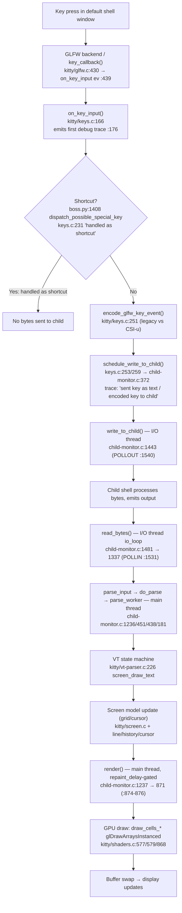

# How Kitty Moves Keyboard Input Through Its Core Components

**Subject:** the [kitty](https://github.com/kovidgoyal/kitty) terminal emulator by Kovid Goyal
**Pinned commit:** `815df1e210e0a9ab4622f5c7f2d6891d7dbeddf1` (git‑confirmed `HEAD`, *"Wire up applying of font config"*)
**Method:** runtime‑grounded — the conclusions below are derived from behaviour that **consistently appears** while a freshly built Kitty is running under its `--debug-input` trace. Source code is consulted only to *interpret and confirm* what was observed; every claim is anchored to a `file:line` at the commit above.

---

## Summary (the three sub‑questions, answered up front)

When you press a key in the default shell inside Kitty, the observable runtime behaviour reveals a clear, repeatable pipeline:

1. **Which parts receive the input first?** The **OS / display server → GLFW windowing backend** receive the key first. On Linux this is the X11/XKB layer inside `glfw/`, whose callback (`key_callback`, `kitty/glfw.c:430`) hands the event to `on_key_input` (`kitty/glfw.c:439`). This is demonstrable because the *first* per‑key lines in the trace are the low‑level XKB lines (`Loading new XKB keymaps`, `Press xkb_keycode: …`), immediately followed by Kitty's own `on_key_input:` line.
2. **Which parts handle the intermediate processing?** Kitty's **keyboard layer** `kitty/keys.c` (`on_key_input`, `kitty/keys.c:166`) tests the event against shortcuts (via the Python **Boss**, `kitty/boss.py:1408`), then **encodes** it (`encode_glfw_key_event`, `kitty/keys.c:251`) and **schedules a write to the child PTY**. The bytes are flushed to the shell on a dedicated **I/O thread** (`kitty/child-monitor.c`), the shell's response is **read back** on that same thread, and the bytes are **parsed** by the VT state machine (`kitty/vt-parser.c`) which updates the **in‑memory screen model** (`kitty/screen.c`).
3. **How is the updated display produced?** On the **main thread**, `render()` (`kitty/child-monitor.c:871`, coalesced by `repaint_delay`) walks the screen model and issues GPU draw calls in `kitty/shaders.c` (`draw_cells_*` → `glDrawArraysInstanced`, `kitty/shaders.c:579`), drawing glyph textures produced by `kitty/freetype.c`/`kitty/glyph-cache.c`; a buffer swap then makes the change visible.

A key structural insight that the runtime makes obvious: **PTY write/read happen on the I/O thread while parse/render happen on the main thread, and rendering is rate‑limited by `repaint_delay`** (`kitty/child-monitor.c:874-876`). That is *why the screen update is decoupled from, and slightly delayed after, the key press.*

---

## (a) How the question was investigated

The analysis was performed by **building Kitty from this repository and observing it while running**, not by reading code alone.

### Build

From the repository root, Kitty was compiled with its standard build entry point:

```bash
python3 setup.py build      # Makefile `all:` delegates to this; `make debug` adds --debug
```

The build (`def build()`, `setup.py:1084`) compiles the C extension and the launcher (`build_launcher`, `setup.py:1230`, compiling `kitty/launcher/main.c` + `single-instance.c`, `setup.py:1289`) and runs `go build` for the kittens (`setup.py:1148`). It produces the runnable binary **`./kitty/launcher/kitty`** (reported version: `kitty 0.35.2 created by Kovid Goyal`). Build dependencies are listed in `docs/build.rst:76` (harfbuzz ≥ 2.2.0 `docs/build.rst:84`, libpng, liblcms2, openssl, freetype, fontconfig, pkg-config, simde, etc.).

### Run under tracing, headless

The container has no physical display, so the GUI (GLFW + OpenGL) was launched inside a virtual X display, with the trace redirected to a file **outside** the repository tree:

```bash
DISPLAY=:99 LIBGL_ALWAYS_SOFTWARE=1 \
  ./kitty/launcher/kitty --config NONE --debug-input bash 2>/tmp/kitty-trace.log
```

* `--debug-input` (alias `--debug-keyboard`, defined `kitty/cli.py:996`, doc string *"Print out key and mouse events as they are received."* `kitty/cli.py:999`) is the primary tracing mechanism.
* `bash` is launched as the **child** process — the "default shell" (resolved to the user's login shell, else `/bin/sh`, `kitty/constants.py:181`).
* The trace is emitted to **STDERR** — `log_error` calls `fprintf(stderr, …)` (`kitty/logging.c:56`, `kitty/logging.c:61`), prefixing each line with a `[seconds]` timestamp — which is why `2>` redirection is mandatory to capture it.

Two supplementary signals were also captured:

* `--debug-rendering` (`kitty/cli.py:989`) — forces every OpenGL call to be error‑checked and prints miscellaneous startup/render info.
* `--dump-bytes /tmp/kitty-bytes.bin` (`kitty/cli.py:985`) — writes the **raw bytes the child emits back**, letting us observe the downstream read→parse stage directly.

### Generate a consistent signal

A few simple keys were injected into the running default‑shell window (via `xdotool` under the virtual display): the letter **`a`**, then **Enter**, then typing **`echo`** and **Enter**. The whole sequence was repeated **three times** so that consistency — not a one‑off — could be confirmed. The same trace lines reappeared every round (21 `PRESS` / 21 `RELEASE` events; the printable keys `a e c h o` each produced a `sent key as text to child` line all three rounds; every Enter produced `sent encoded key to child: 0xd`; every release produced the same `ignoring …` line). **Consistency across repeats is the evidentiary bar this document relies on.**

### Correlate, then clean up

Each recurring trace line was matched to the exact function that emits it (see §(e)), and the downstream stages were corroborated with `--dump-bytes` and with a read‑back of the in‑memory screen grid via Kitty's own remote control (`kitten @ get-text`). All temporary capture artifacts lived under `/tmp/` and were deleted afterwards; **no file inside the repository was modified**, and the only file added is this document.

---

## (b) Which components receive the input first

**Answer: the operating system / display server, surfaced through the GLFW windowing backend embedded in Kitty's `glfw/` tree.** On Linux this is the X11 + **XKB** layer (`glfw/xkb_glfw.c`), with optional IME composition (`glfw/ibus_glfw.c`).

**What the runtime shows.** With `--debug-input`, the *earliest* lines for every key press are the low‑level windowing/XKB lines, which appear **before** anything Kitty‑specific:

```
[4.569] Loading new XKB keymaps
[4.576] Press xkb_keycode: 0x26 clean_sym: a composed_sym: a text: a mods: none glfw_key: 97 (a) xkb_key: 97 (a)
```

These originate in the GLFW/XKB backend; they are made visible because the `--debug-keyboard` option sets the `GLFW_DEBUG_KEYBOARD` init hint (`kitty/glfw.c:1444`). The backend translates the hardware *keycode* (`xkb_keycode: 0x26`) into a symbol/`text` and a GLFW key id (`glfw_key: 97 (a)`).

**Hand‑off into Kitty.** GLFW then invokes the key callback that Kitty registered with `glfwSetKeyboardCallback(glfw_window, key_callback)` (`kitty/glfw.c:1292`). That callback, `key_callback` (`kitty/glfw.c:430`), forwards the event to Kitty's own keyboard entry point **only once the window is ready** — `if (is_window_ready_for_callbacks() && !ev->fake_event_on_focus_change) on_key_input(ev);` (`kitty/glfw.c:439`, guard at `kitty/glfw.c:202`). The application reaches this state by handing control to the C event loop at startup via `boss.child_monitor.main_loop()` (`kitty/main.py:234`).

**Rationale.** Because the XKB `Press …` line and then the `on_key_input:` line are emitted *in that order, immediately, for every key*, the windowing/GLFW layer is demonstrably the first receiver: the OS delivers the raw event to GLFW, GLFW decodes it, and only then is Kitty's code invoked.

---

## (c) Which components handle the intermediate processing

Between "key received" and "pixels changed" the event passes through several components. The trace makes the boundaries between them explicit.

### 1. Keyboard handling and encoding — `kitty/keys.c`

The first thing Kitty itself does is emit, from inside `on_key_input` (`kitty/keys.c:166`, guarded by `OPT(debug_keyboard)` at `kitty/keys.c:172`), the per‑key trace line (`kitty/keys.c:176`):

```
on_key_input: glfw key: 0x61 native_code: 0x61 action: PRESS mods: none text: 'a' state: 0
```

`on_key_input` then performs, in order:

* **Active‑window lookup.** If there is no active window it logs `no active window, ignoring` and returns (`kitty/keys.c:182`).
* **Shortcut test.** For `PRESS`/`REPEAT` it dispatches the event to the Python orchestrator — `dispatch_key_event(dispatch_possible_special_key)` (`kitty/keys.c:228`) calls `Boss.dispatch_possible_special_key` (`kitty/boss.py:1408`). If the key *is* a Kitty shortcut, the trace prints `handled as shortcut` (`kitty/keys.c:231`) and `on_key_input` **returns without writing anything to the child**. (In our simple‑key runs this never fired — `handled as shortcut` count was 0 — which is itself evidence that ordinary keys fall through to the child.)
* **Encoding.** Otherwise the event is encoded by `encode_glfw_key_event(ev, screen->modes.mDECCKM, screen_current_key_encoding_flags(screen), encoded_key)` (`kitty/keys.c:251`). The arguments are the crux of **legacy vs. Kitty keyboard‑protocol (CSI‑u) selection**: the encoding depends on the cursor‑key mode (`mDECCKM`) and the *current key‑encoding flags the running program asked for* (the Kitty Keyboard Protocol lives in `kitty/key_encoding.c` / `kitty/key_encoding.py`, with mapping logic in `kitty/keys.py`). The return value then routes to one of three observable outcomes:
  * **Printable text** (`SEND_TEXT_TO_CHILD`): `schedule_write_to_child(...)` followed by `sent key as text to child: a` (`kitty/keys.c:253-254`). This is what the letter `a` produced.
  * **Encoded/functional key** (`size > 0`): `schedule_write_to_child(...)` followed by `sent encoded key to child: 0xd` (`kitty/keys.c:259-261`). This is what **Enter** produced — encoded to the single carriage‑return byte `0x0d`. (For single‑byte keys with `TERMIOS` signal handling, e.g. Ctrl‑C, a signal may be sent instead, `kitty/keys.c:256-257`.)
  * **Nothing encodable** (`else`): `ignoring as keyboard mode does not support encoding this event` (`kitty/keys.c:271`). This is what every **key release** produced under the default keyboard mode.

### 2. Writing to the child PTY — `kitty/child-monitor.c` (I/O thread)

`schedule_write_to_child` (`kitty/child-monitor.c:372`) only **queues** the bytes; it does not touch the PTY directly. The actual write to the child file descriptor is performed by `write_to_child` (`kitty/child-monitor.c:1443`), which runs on the dedicated **I/O thread** when the PTY fd becomes writable (`POLLOUT`, `kitty/child-monitor.c:1540`).

### 3. Reading the child's response — `kitty/child-monitor.c` (I/O thread)

The child shell processes the bytes and emits output, which the **same I/O thread** reads. The I/O thread is `io_loop` (`kitty/child-monitor.c:1481`, created with `pthread_create(&self->io_thread, …)` at `kitty/child-monitor.c:291`); on `POLLIN` it calls `read_bytes` (`kitty/child-monitor.c:1531`, defined at `kitty/child-monitor.c:1337`). The `--dump-bytes` capture is exactly this byte stream — for our run it contained the bash prompt, shell‑integration escape sequences (`\e]133;…`, `\e]7;kitty-shell-cwd://…`), bracketed‑paste enable (`\e[?2004h`), and (because pressing `a`+Enter ran the command `a`) the text `bash: a: command not found`.

### 4. Parsing — `kitty/vt-parser.c` (main thread)

Parsing of the read bytes happens back on the **main thread**: the main loop calls `parse_input(self)` (`kitty/child-monitor.c:1236`) → `parse_input` (`kitty/child-monitor.c:451`) → `do_parse` (`kitty/child-monitor.c:438`), which drives `parse_func`, set to `parse_worker` (`kitty/child-monitor.c:181`) and defined in `kitty/vt-parser.c:1496`. The VT/escape‑sequence state machine routes printable characters to the screen via `screen_draw_text(self->screen, &ch, 1)` (`kitty/vt-parser.c:226`, inside `consume_normal`, `kitty/vt-parser.c:230`), and interprets control/escape sequences (modes in `kitty/modes.h`, character sets in `kitty/charsets.c`).

### 5. Screen model — `kitty/screen.c`

The parser updates the in‑memory grid of cells and the cursor in `kitty/screen.c` (backed by `kitty/line.c`, `kitty/line-buf.c`, `kitty/history.c`, `kitty/cursor.c`). That this model genuinely reflects the child's output was confirmed directly: after typing `echo hello` + Enter, a read‑back of the grid via remote control returned

```
…# echo hello
hello
…#
```

i.e. both the **echoed command** and its **output** are present in the screen model — and that model is precisely what the renderer draws next.

---

## (d) How the updated display is produced

**Answer: on the main thread, `render()` walks the screen model and issues GPU draw calls, then a buffer swap makes the frame visible.**

The same main loop that parses input also renders: right after `parse_input`, it calls `render(now, input_read)` (`kitty/child-monitor.c:1237`). `render` (defined at `kitty/child-monitor.c:871`) is **rate‑limited by `repaint_delay`**: if no new input was read and too little time has elapsed since the last frame, it defers — `if (!input_read && time_since_last_render < OPT(repaint_delay))` (`kitty/child-monitor.c:874-876`). When it does render, it calls `render_os_window` (`kitty/child-monitor.c:833`), which is split into `prepare_to_render_os_window` (`kitty/child-monitor.c:705`) and `render_prepared_os_window` (`kitty/child-monitor.c:788`).

The actual GPU work is in `kitty/shaders.c`. The dispatcher `draw_cells` (`kitty/shaders.c:1009`) sets up the cell uniforms (`cell_update_uniform_block`, `kitty/shaders.c:293`) and then draws every cell as an instanced quad — `draw_cells_simple` (`kitty/shaders.c:577`) issuing

```c
glDrawArraysInstanced(GL_TRIANGLE_FAN, 0, 4, screen->lines * screen->columns);   // kitty/shaders.c:579
```

(or the multi‑pass `draw_cells_interleaved`, `kitty/shaders.c:868`, for transparent/background‑image windows). The glyphs sampled by the fragment shader are rasterized by `kitty/freetype.c` and cached as GPU textures by `kitty/glyph-cache.c`; the GLSL programs are `cell_vertex.glsl` / `cell_fragment.glsl` (plus `border_*`, `bgimage_*`, `graphics_*`, `tint_*`, `alpha_blend.glsl`, `linear2srgb.glsl`), built on the GL infrastructure in `kitty/gl.c` / `kitty/gl-wrapper.c` and global state in `kitty/state.c`. After the draw calls a buffer swap presents the new frame.

**Rationale / how this was observed.** `--debug-rendering` forces every OpenGL call to check for errors and prints startup/render info; in our runs it reported `OS Window created` and `Child launched` and produced **no GL errors**, confirming the render path executes cleanly each cycle. The per‑frame `glDrawArraysInstanced` is not individually logged, so its role is anchored in code (`kitty/shaders.c:579`); but the *input* to that draw — the screen grid — was directly observed to contain the post‑keystroke content (§(c).5), which closes the loop from key press to visible update.

---

## (e) Observed trace evidence and the rationale per stage

Each row pairs a **consistently observed** signal with the code that produces it and the reason it supports the conclusion. Trace lines are quoted verbatim (de‑colourised; the logger prefixes each with a `[seconds]` timestamp, `kitty/logging.c:56`).

### Stage 1 — windowing / XKB receives first
> `Loading new XKB keymaps`
> `Press xkb_keycode: 0x26 clean_sym: a composed_sym: a text: a mods: none glfw_key: 97 (a) xkb_key: 97 (a)`

* **Code:** `glfw/xkb_glfw.c`; visible via `GLFW_DEBUG_KEYBOARD` (`kitty/glfw.c:1444`); callback `key_callback` (`kitty/glfw.c:430`) → `on_key_input` (`kitty/glfw.c:439`).
* **Rationale:** these lines precede every `on_key_input:` line, proving the windowing layer decodes the hardware event before Kitty's logic runs.

### Stage 2 — keyboard handling / encoding
> `on_key_input: glfw key: 0x61 native_code: 0x61 action: PRESS mods: none text: 'a' state: 0 sent key as text to child: a`
> `on_key_input: glfw key: 0xe001 native_code: 0xff0d action: PRESS mods: none text: '' state: 0 sent encoded key to child: 0xd`
> `on_key_input: … action: RELEASE … ignoring as keyboard mode does not support encoding this event`

* **Code:** trace at `kitty/keys.c:176`; shortcut test → `kitty/boss.py:1408`; encode at `kitty/keys.c:251`; the three outcomes at `kitty/keys.c:253-254`, `:259-261`, `:271`.
* **Rationale:** the printable `a` is sent as its literal byte; **Enter** is *encoded* (to `0x0d`) rather than sent literally — observable proof that this stage transforms the event into a terminal byte sequence. Releases are dropped, showing the active keyboard mode governs what is emitted.
* **Note on formatting:** the `on_key_input:` line and the following `sent …`/`ignoring …` text appear on one physical line because the `on_key_input` format string ends with a trailing space and no newline (`kitty/keys.c:176`); the dispatch `debug(...)` call supplies the terminating newline (`kitty/keys.c:254`/`:261`).

### Stage 3–5 — write to child, child echoes, read back (I/O thread)
> raw bytes captured by `--dump-bytes`: bash prompt, `\e]133;…` / `\e]7;kitty-shell-cwd://…` shell‑integration sequences, `\e[?2004h`, and `bash: a: command not found`

* **Code:** queue `schedule_write_to_child` (`kitty/child-monitor.c:372`) → flush `write_to_child` (`kitty/child-monitor.c:1443`, `POLLOUT` `:1540`); read `read_bytes` (`kitty/child-monitor.c:1337`, `POLLIN` `:1531`) inside `io_loop` (`kitty/child-monitor.c:1481`).
* **Rationale:** the dump contains the child's *reply* to our keystrokes, confirming bytes left Kitty, were processed by the shell, and came back for Kitty to consume.

### Stage 6–7 — parse and screen‑model update (main thread)
> screen grid read back via `kitten @ get-text`:
> `…# echo hello` / `hello` / `…#`

* **Code:** `parse_input` (`kitty/child-monitor.c:1236` → `:451` → `do_parse` `:438` → `parse_worker` `kitty/vt-parser.c:1496`); text routed via `screen_draw_text` (`kitty/vt-parser.c:226`); grid in `kitty/screen.c`.
* **Rationale:** the grid contains both the echoed command and its output, proving the parser fed the child's bytes into the screen model — the state the renderer consumes.

### Stage 8 — render (main thread, GPU)
> `--debug-rendering`: `OS Window created`, `Child launched`, no GL errors

* **Code:** `render` (`kitty/child-monitor.c:1237` → `:871`, gated by `repaint_delay` `:874-876`) → `render_os_window` (`:833`) → `draw_cells_*` → `glDrawArraysInstanced` (`kitty/shaders.c:579`).
* **Rationale:** error‑checked GL with no errors confirms the draw path runs every cycle; combined with the observed screen‑model content, this accounts for the visible update.

### The threading insight (why the update lags the key press)
The trace timestamps and the code together show a deliberate split:

| Thread | Responsibilities | Anchors |
|---|---|---|
| **I/O thread** (`io_loop`) | flush queued bytes to the PTY; read the child's output | `kitty/child-monitor.c:291`, `:1481`, `:1443` (write/`POLLOUT` `:1540`), `:1337` (read/`POLLIN` `:1531`) |
| **Main thread** (event loop) | parse the read bytes; render frames | `kitty/child-monitor.c:1236` (parse), `:1237`→`:871` (render) |

Because writing/reading the PTY happen on a separate thread from parsing/rendering, and because `render()` is **coalesced by `repaint_delay`** (`kitty/child-monitor.c:874-876`), the screen update is intentionally **decoupled from, and slightly delayed after, the key press** — and several rapid state changes can collapse into a single rendered frame.

---

## (f) Pipeline diagram



---

## Edge cases and caveats

* **Keys consumed as Kitty shortcuts produce no child write.** If `Boss.dispatch_possible_special_key` (`kitty/boss.py:1408`) handles the event, the trace shows `handled as shortcut` (`kitty/keys.c:231`) and `on_key_input` returns early — no bytes reach the shell. (Our simple keys were never shortcuts, so this path was not exercised; the count of `handled as shortcut` was 0.)
* **Releases and modifier‑only events are usually ignored.** Under the default keyboard mode, key *releases* yield `ignoring as keyboard mode does not support encoding this event` (`kitty/keys.c:271`); only when a program enables the Kitty Keyboard Protocol (CSI‑u) do release/modifier events get encoded.
* **Encoding depends on the running program's requested mode.** `encode_glfw_key_event` (`kitty/keys.c:251`) chooses legacy escape sequences vs. CSI‑u based on `mDECCKM` and the current key‑encoding flags, so the *same* physical key can produce different bytes depending on what the child requested.
* **Rendering is coalesced.** Because `render()` is gated by `repaint_delay` (`kitty/child-monitor.c:874-876`) and runs on a different thread from the PTY I/O, multiple screen‑model changes can be batched into a single frame; the visible update therefore lags the key press slightly and is not one‑frame‑per‑keystroke.
* **The default shell is resolved at runtime.** The child is the user's login shell (`pwd.getpwuid(...).pw_shell`), falling back to `/bin/sh` (`kitty/constants.py:181`); here `bash` was launched explicitly as the child.
* **Mouse events share the same trace.** `--debug-input` also prints mouse events (handled in `kitty/mouse.c`); this analysis focuses on the keyboard path.

---

## Notes on method and fidelity

* All line references are anchored to commit `815df1e210e0a9ab4622f5c7f2d6891d7dbeddf1`. The commit hash is git‑confirmed; the repository's root readme is `README.asciidoc`.
* Conclusions rest on behaviour that **recurred identically across repeated key presses**; code was used to interpret and confirm those observations, not to substitute for them.
* The investigation used only temporary artifacts outside the repository (a launch/capture helper, a STDERR trace log, a `--dump-bytes` file), all removed afterward. No source file in the repository was modified, and this Markdown document is the only file added.

