# How Kitty Handles Keyboard Input During Normal Use — A Runtime-Observed Walkthrough

> **Scope of this document.** This answers the question: *"If I start Kitty from this
> repository with whatever debugging or tracing options are available and press a few
> simple keys inside the default shell, what does the observable runtime behavior reveal
> about how input moves through Kitty's core components before the screen updates?"* —
> specifically **(1) which parts receive the input first, (2) which parts handle the
> intermediate processing, and (3) how the updated display is produced.**
>
> **Everything below was produced by actually building Kitty and running it with its
> own built-in tracing flags, pressing keys through the real windowing path, and
> capturing the output.** Each behavioral claim is placed next to the raw captured
> evidence that produced it and a concrete `file:line` reference. Where a link in the
> chain is not directly printed by the running program, it is explicitly labeled
> **(inferred from reading)** and is bracketed by runtime observations on both sides.
> All captures in this document come from the runs described in §2 and are reproduced
> **complete and unedited**; the only normalization ever applied is explicitly named
> (e.g. `cat -v` to make an ESC byte visible as `^[`, or `cat -A` to make a trailing
> space visible — under `cat -A` a trailing space prints as a literal space immediately
> before the `$` end-of-line marker, e.g. `0xd $`).

---

## 1. Direct answer (the three stages at a glance)

When you press a key in Kitty's default shell, the observable runtime behavior shows the
input travelling through three consistently-appearing stages:

1. **Receipt (who sees it first).** The physical key is delivered by the operating
   system to the **GLFW platform backend** inside Kitty (the X11 backend here), which
   resolves it through **XKB** and hands a normalized key event to Kitty's C core. On
   X11 the native `KeyPress` event is turned into a GLFW key event at
   `glfw/x11_window.c:1254` (`glfw_xkb_handle_key_event(... GLFW_PRESS)`; the matching
   `KeyRelease` at `:1293`). The first thing the running program prints for every
   keypress is an **XKB-layer line** from `glfw/xkb_glfw.c:875`, immediately followed by
   Kitty's core input handler **`on_key_input`** (`kitty/keys.c:166`, trace at
   `kitty/keys.c:176`). So the platform backend + `kitty/glfw.c`'s `key_callback`
   (`kitty/glfw.c:430`) → `on_key_input` (`kitty/glfw.c:439`) receive the input first.

2. **Intermediate processing (who transforms it).** `on_key_input` **encodes** the key
   (`encode_glfw_key_event`, `kitty/keys.c:251`) and **writes the resulting bytes to the
   child shell's PTY**. Three different observable branches fire depending on the key:
   a *text* branch (`keys.c:252-254`), an *encoded* branch (`keys.c:255-268`), and an
   *unencodable* branch (`keys.c:270-271`). The child echoes bytes back; Kitty's
   **Child Monitor** reads those bytes on its **I/O thread** (`read_bytes`,
   `kitty/child-monitor.c:1337`) and parses them on the **main thread** (`parse_input`,
   `kitty/child-monitor.c:451`) via the **VT parser** (`run_worker`,
   `kitty/vt-parser.c:1417`). The parser classifies the bytes into screen commands —
   observed directly at runtime as e.g. `draw a` — and the printable-text command runs
   `screen_draw_text` (`kitty/vt-parser.c:236`, the C function defined at
   `kitty/screen.c:865-868`) → `draw_text` (`kitty/screen.c:849`), which marks the screen
   dirty on its first statement (`self->is_dirty = true`, `kitty/screen.c:850`).

3. **Display production (how the screen updates).** A dirty screen causes the next
   render cycle to re-upload the changed cells to the GPU and present a new frame:
   `render()` (`kitty/child-monitor.c:871`) → the dirty guard in `kitty/shaders.c:418`
   fires → `send_cell_data_to_gpu` (`kitty/shaders.c:970`) → `draw_cells`
   (`kitty/shaders.c:1009`) → `swap_window_buffers` (`kitty/child-monitor.c:810`). At
   runtime this manifested as the GPU pipeline initializing (`GL version string: '4.5
   (Core Profile) Mesa ...'`, `kitty/gl.c:72`), zero GL errors across all renders, and a
   measured, reproducible **85-pixel** change in the window's framebuffer — confined to a
   single 11×18 glyph cell — the moment the typed character appeared on screen.

A useful mental model that the traces confirm: **reading the child's bytes happens on a
separate thread (the I/O thread) from parsing + rendering (the main thread)**, which is
why input capture and screen updates are decoupled and why the frame appears a few
milliseconds after the byte is parsed (`input_delay` = 3 ms `kitty/options/definition.py:878`,
`repaint_delay` = 10 ms `:866`).

```mermaid
flowchart LR
    A["Physical keypress"] --> B["GLFW backend + XKB<br/>glfw/x11_window.c:1254, glfw/xkb_glfw.c:875"]
    B --> C["kitty/glfw.c:430 key_callback<br/>-> :439 on_key_input"]
    C --> D["kitty/keys.c:166 on_key_input<br/>:176 trace, :251 encode"]
    D --> E["write encoded bytes to child PTY"]
    E --> F["child (/bin/bash) echoes bytes"]
    F --> G["child-monitor.c:1337 read_bytes (I/O thread)"]
    G --> H["child-monitor.c:451 parse_input (main thread)<br/>vt-parser.c:1417 run_worker"]
    H --> I["vt-parser.c:236 screen_draw_text -> screen.c:849 draw_text<br/>screen.c:850 is_dirty = true"]
    I --> J["child-monitor.c:871 render()<br/>shaders.c:418 dirty guard"]
    J --> K["shaders.c:970 send_cell_data_to_gpu<br/>:1009 draw_cells"]
    K --> L["child-monitor.c:810 swap_window_buffers<br/>(new frame on screen)"]
```



---

## 2. How Kitty was built and launched (exact commands + environment)

**Environment.** All build-run-observe steps were performed inside the user-provided
container image (`kitty-qna-runtime:local`, derived from
`ghcr.io/scaleapi/swe-atlas:swe_atlas_QnA_kovidgoyal_kitty_1.0`), which supplies the C11
compiler (gcc), Go, Python 3.12, and a headless GUI/OpenGL context. The repository
checkout is at commit `815df1e21` ("Wire up applying of font config"), verified with
`git -C /app log -1 --oneline`. A virtual X display was already running:

```text
DISPLAY=:99   (Xvfb :99 -screen 0 1280x800x24 -ac +extension GLX +render -noreset)
LIBGL_ALWAYS_SOFTWARE=1  GALLIUM_DRIVER=llvmpipe   (Mesa software OpenGL, llvmpipe)
```

**Default, canonical configuration.** No user or system Kitty configuration file exists,
so Kitty runs with its built-in defaults (exact command + exact output):

```text
$ ls -l ~/.config/kitty/kitty.conf
ls: cannot access '/root/.config/kitty/kitty.conf': No such file or directory
$ ls -l /etc/xdg/kitty/kitty.conf
ls: cannot access '/etc/xdg/kitty/kitty.conf': No such file or directory
```

**Build command (canonical debug build).** This is the `debug:` target from the project's
own `Makefile:22-23` (`python3 setup.py build $(VVAL) --debug`):

```text
$ cd /app
$ python3 setup.py clean
$ python3 setup.py build --debug
```

The build exited `0` and compiled every component on the input-to-display path (122
compile units). The complete build log is 380 lines; the following are the verbatim
progress lines for the pipeline files (excerpted from that log and clearly marked as an
excerpt — the complete per-condition runtime captures in §6 and §10 are shown in full):

```text
[1/122] Compiling kitty/screen.c ...
[5/122] Compiling kitty/glfw.c ...
[7/122] Compiling kitty/child-monitor.c ...
[9/122] Compiling kitty/shaders.c ...
[10/122] Compiling kitty/vt-parser.c ...
[11/122] Compiling kitty/vt-parser.c ...
[15/122] Compiling kitty/mouse.c ...
[36/122] Compiling kitty/keys.c ...
```

It is genuinely a *debug* build. The exact compile command recorded in
`build/compile_commands.json` for `kitty/keys.c` (complete and unedited) is:

```text
gcc -MMD -DDEBUG -Wextra -Wfloat-conversion -Wno-missing-field-initializers -Wall
-Wstrict-prototypes -std=c11 -pedantic-errors -Werror -g3 -Og -fwrapv
-fstack-protector-strong -pipe -fvisibility=hidden -fno-plt -fPIC -D_FORTIFY_SOURCE=2
-DKITTY_DEBUG_BUILD -fno-omit-frame-pointer -fcf-protection=full -march=native
-mtune=native -pthread -I/usr/include/libpng16 -I/usr/include/freetype2
-I/usr/include/harfbuzz -I/usr/include/glib-2.0
-I/usr/lib/x86_64-linux-gnu/glib-2.0/include -I/usr/include/python3.12
-c kitty/keys.c -o build/fast_data_types-kitty-keys.c.o
```

The debug flags in that command come from the **C-extension** compile path in `setup.py`,
not the launcher: `-g3` (`setup.py:476`), `-Og` (`setup.py:479`, appended for gcc ≥ 5.0
and selected because `optimize = df if debug or sanitize else '-O3'` at `setup.py:482`),
`-DDEBUG` (`setup.py:485`, `'-D{}DEBUG'.format('' if debug else 'N')`), and
`-DKITTY_DEBUG_BUILD` (`setup.py:528-529`, `if debug: cflags.append('-DKITTY_DEBUG_BUILD')`).
(The separate `setup.py:1246` `-g3`/`-O3` line lives in `build_launcher()` and governs only
the launcher binary, not the `fast_data_types` extension where `kitty/keys.c` is compiled.)
The build produced the launcher binary `kitty/launcher/kitty` (source
`kitty/launcher/main.c`) and the compiled `kitty/fast_data_types.so` C extension. The
resulting binary reports (exact command + output):

```text
$ ./kitty/launcher/kitty --version
kitty 0.35.2 created by Kovid Goyal
```

**Launch command (the real GUI binary with built-in tracing flags).** All three of
Kitty's own debug/tracing options were enabled (definitions verified at
`kitty/cli.py:985-999`):

```text
$ DISPLAY=:99 ./kitty/launcher/kitty \
      --debug-input \
      --debug-rendering \
      --dump-bytes /tmp/kitty_dump.bytes \
      -o confirm_os_window_close=0 \
      --title kitty-dbg  > /tmp/kitty_trace.log 2>&1 &
```

- `--debug-input` / `--debug-keyboard` (`dest=debug_keyboard`, `cli.py:996-999`) — *"Print
  out key and mouse events as they are received."*
- `--debug-rendering` / `--debug-gl` (`cli.py:989-993`) — *"Debug rendering commands. This
  will cause all OpenGL calls to check for errors instead of ignoring them. Also prints
  out miscellaneous debug information."*
- `--dump-bytes /tmp/kitty_dump.bytes` (`cli.py:985-986`) — *"Path to file in which to
  store the raw bytes received from the child process."*

**Where the trace output goes (important for reading the evidence below).** Kitty's
keyboard/XKB debug lines are emitted by `timed_debug_print` (`kitty/monotonic.h:99-108`),
which writes to **stderr** and prefixes each logical line with a monotonic timestamp
`[seconds]` (re-armed after any line containing a newline, `monotonic.h:107`). These
stderr lines are **unbuffered**, so they appear in real time and in emission order. By
contrast, two kinds of lines are written to **stdout**, which is *block-buffered* when
redirected to a file and therefore flushed only at process exit:

- the GL-version banner (`printf`, `kitty/gl.c:72`), and
- the parsed VT-command dump (`safe_print`, `kitty/boss.py:239-250`).

Consequently those stdout lines appear *clustered at the end of the combined log file*
even though their `[seconds]` timestamps show they were emitted earlier — the file order
reflects buffer-flush order, not emission time. The `--dump-bytes` file, separately, is
opened in binary mode (`open(args.dump_bytes, 'wb')`, `kitty/boss.py:237`) and receives
the **raw echoed bytes** verbatim (`kitty/boss.py:242-244`). All byte-sensitive output
below is shown as captured with `cat -v` / `cat -A` / `od -c`, so an ESC (0x1b) byte
appears as `^[` and a trailing space is made visible under `cat -A` as a literal space
immediately before the `$` end-of-line marker (e.g. `0xd $`).

**The default shell that Kitty spawned.** Kitty resolves the child command from the
`shell` option whose default is `.` = *"whatever shell is set as the default shell for the
current user"* (`kitty/options/definition.py:2896-2899`; see also `is_default_shell`
`kitty/child.py:229`). Observed here (exact command + output):

```text
$ echo $SHELL
/bin/bash
# child process spawned by kitty (ps --ppid <kitty_pid>):
   6321 /bin/bash --posix
```

**Startup trace actually captured** (run 1, `cat -v`; the `^[[35m...^[[m` around
`on_focus_change` are literal ANSI color bytes). This is the complete stderr startup
banner — all 8 lines, nothing elided:

```text
[0.119] Loading new XKB keymaps
[0.127] Modifier indices alt: 0x3 super: 0x6 hyper: 0xffffffff meta: 0xffffffff numlock: 0x4 shift: 0x0 capslock: 0x1
[0.360] OS Window created
[0.380] Failed to open systemd user bus with error: No medium found
[0.383] Child launched
[0.384] ^[[35mon_focus_change^[[m: window id: 0x1 focused: 1
handle_remote_print aWdub3JlYm90aCBvciBpZ25vcmVzcGFjZSBwcmVzZW50IGluIGJhc2ggSElTVENPTlRST0wgc2V0dGluZywgc2hvd2luZyBydW5uaW5nIGNvbW1hbmQgd2lsbCBub3QgYmUgcm9idXN0Cg==}
ignoreboth or ignorespace present in bash HISTCONTROL setting, showing running command will not be robust
```

The banner already exhibits the receipt and transport subsystems: the **XKB keyboard
layer** (`Loading new XKB keymaps`, `Modifier indices ...`) and the **child/PTY layer**
(`Child launched`, plus the child's own `handle_remote_print` / `HISTCONTROL` shell-startup
chatter). The **GPU/rendering layer** banner is on stdout and therefore flushed at exit;
its real emission time is `[0.316]` (see §5).

**How keys were injected (the canonical input path).** Keys were sent with `xdotool key`
(X11 XTEST), which generates *real* X key events delivered by the X server to the focused
Kitty window. Those events flow through the genuine
`GLFW → kitty/glfw.c key_callback → on_key_input` path — the same path a physical keyboard
uses. The window was focused first with `xdotool search --sync --name kitty-dbg`, then
`windowactivate --sync` + `windowfocus --sync`, then e.g. `xdotool key a`. This is the
**canonical** path; see §9 for why the `show-key` kitten and remote-control `send-text`
were deliberately *not* used.

---

## 3. Stage 1 — Which components receive the input first (receipt)

**Claim.** The input is received first by the **GLFW platform backend** (the X11 backend
here) together with its **XKB** key resolver, and then by Kitty's C core function
`key_callback` in `kitty/glfw.c`, which immediately calls `on_key_input`.

**Observed evidence (pressing `a`, run 1).** The very first two lines Kitty printed for the
keypress were:

```text
[2.163] ^[[31mPress^[[m xkb_keycode: 0x26 clean_sym: a composed_sym: a text: a mods: none glfw_key: 97 (a) xkb_key: 97 (a)
[2.163] ^[[33mon_key_input^[[m: glfw key: 0x61 native_code: 0x61 action: PRESS mods: none text: 'a' state: 0 sent key as text to child: a
```

**Cause → effect.**

- On Linux/X11 the native X event is delivered and translated by the X11 backend in
  `glfw/x11_window.c`: `case KeyPress:` (`glfw/x11_window.c:1251`) calls
  `glfw_xkb_handle_key_event(window, &_glfw.x11.xkb, event->xkey.keycode, GLFW_PRESS)`
  (`glfw/x11_window.c:1254`); the matching `case KeyRelease:` (`:1258`) calls the same
  function with `GLFW_RELEASE` (`:1293`). (Wayland/macOS would use
  `glfw/wl_window.c` / `glfw/cocoa_window.m` instead; those backends were not exercised in
  this X11 run and are covered here as read-only references.)

- The **first** printed line (`Press xkb_keycode: 0x26 clean_sym: a ...`) is emitted by the
  GLFW backend's XKB layer inside `glfw_xkb_handle_key_event` at **`glfw/xkb_glfw.c:875`**:
  `debug("%s xkb_keycode: 0x%x ", action == GLFW_RELEASE ? "\x1b[32mRelease\x1b[m" : "\x1b[31mPress\x1b[m", xkb_keycode)`.
  This line only appears because `--debug-input` turned on the GLFW keyboard-debug hint —
  `glfwInitHint(GLFW_DEBUG_KEYBOARD, debug_keyboard)` at **`kitty/glfw.c:1444`** (and
  `OPT(debug_keyboard) = debug_keyboard != 0` at `:1446`). Its presence *before* any
  Kitty-core line is the runtime proof that **the platform/XKB backend physically
  receives and resolves the hardware keycode first** (raw X11 keycode `0x26`) into a clean
  keysym (`a`).

- **Optional IME/preedit (covered as a read-only reference; not exercised here).** After
  resolving the keysym, `glfw_xkb_handle_key_event` gives an input-method a chance to
  consume the event before it becomes a GLFW key: at **`glfw/xkb_glfw.c:958-966`** it builds
  a `_GLFWIBUSKeyEvent` and calls `ibus_process_key(&ibus_ev, &xkb->ibus)`
  (defined in **`glfw/ibus_glfw.c:505`**); only if IBus does **not** consume it does it fall
  through to `_glfwInputKeyboard(window, &glfw_ev)` (the `} else {` at `:965`, calling
`_glfwInputKeyboard` at `:966`). No IBus
  daemon was running in this headless container, so the event went straight down the
  `_glfwInputKeyboard` path and no `↳ to IBUS` line appeared — but this is the point where
  an IME would intercept input on a desktop.

- The **second** printed line (`on_key_input: glfw key: 0x61 ...`) is the first *Kitty-core*
  trace, printed at **`kitty/keys.c:176`** inside `on_key_input` (`kitty/keys.c:166`).
  `on_key_input` is reached because `kitty/glfw.c`'s keyboard callback forwards to it:
  `key_callback` is registered at **`kitty/glfw.c:1292`**
  (`glfwSetKeyboardCallback(glfw_window, key_callback)`), defined at
  **`kitty/glfw.c:430`**, and calls `on_key_input(ev)` at **`kitty/glfw.c:439`**
  (guarded by `is_window_ready_for_callbacks() && !ev->fake_event_on_focus_change`). So
  `key_callback` is the first Kitty-side C function to see the event, and `on_key_input`
  is where core handling begins.

**A value worth reporting exactly.** For the `a` key the observed `on_key_input` values were
`glfw key: 0x61` and `native_code: 0x61`, while the XKB layer separately reported the
hardware keycode `xkb_keycode: 0x26`. (The AAP's illustrative example had shown
`native_code: 0x26`; the value actually observed at runtime is `0x61`, and the runtime
value is what is reported here.)

**Focus is a precondition for receipt.** At startup Kitty logged
`^[[35mon_focus_change^[[m: window id: 0x1 focused: 1`, i.e. the window held X input focus,
which is why the injected key events were delivered to it.

---

## 4. Stage 2 — Intermediate processing (encode → PTY → child echo → parse → screen model)

**Claim.** `on_key_input` maps and **encodes** the key, **writes bytes to the child
shell's PTY**, the child echoes bytes back, and Kitty's **Child Monitor** reads those bytes
on its **I/O thread** while the **main thread** parses them through the **VT parser**, which
classifies them into screen commands and mutates the **Screen model**, marking it **dirty**.

### 4a. Encoding and the write to the child (`kitty/keys.c`)

For the same `a` keypress, the captured `on_key_input` line was (complete, `cat -v`):

```text
[2.163] ^[[33mon_key_input^[[m: glfw key: 0x61 native_code: 0x61 action: PRESS mods: none text: 'a' state: 0 sent key as text to child: a
```

**Cause → effect.** After the trace at `keys.c:176`, `on_key_input` calls
`encode_glfw_key_event(...)` at **`kitty/keys.c:251`** (implemented in
`kitty/key_encoding.c`; shortcut/mapping is resolved via `kitty/keys.py`). The return
value selects one of three branches — and the `--debug-input` trace tells us *which one
fired*:

- **Text branch** (`if (size == SEND_TEXT_TO_CHILD)`, `keys.c:252`): the key's Unicode
  text is written to the child (`schedule_write_to_child`, `keys.c:253`) and the program
  prints `sent key as text to child: %s` (**`keys.c:254`**). That is exactly the tail of
  the line above — so `a` took the **text** branch and the byte `a` was written to the PTY.
  (The text branch prints the raw text with no per-byte legend, so there is no trailing
  space here — contrast the encoded branch in §6.)

(The other two branches — *encoded* and *unencodable* — are demonstrated in §6 with
Enter, Ctrl-C, arrows, F-keys, and a bare modifier.)

### 4b. The child echoes, and the Child Monitor reads it

The byte written to the PTY is received by the child shell (`/bin/bash --posix`), which
**echoes** it back over the PTY. That echoed byte is what `--dump-bytes` captured. For `a`
the dump grew by exactly one byte (complete `od -An -c` of the per-`a` byte slice):

```text
   a
```

**Cause → effect (why reading and rendering are decoupled).** The Child Monitor implements
a **Main thread** plus an **I/O thread**, and — *optionally* — a **Talk thread** for peer
sockets / remote control. The Talk thread is **not** part of the normal keyboard path: it
is started only when a talk/listen fd exists (`start()`, `kitty/child-monitor.c:281-293`:
`if (self->talk_fd > -1 || self->listen_fd > -1) { pthread_create(&self->talk_thread, ...) }`,
conditional `:285`, talk `pthread_create` `:286`), or later on demand via `inject_peer`
(`:256`); the I/O thread
(`pthread_create(&self->io_thread, ...)`, `:291`) is always started. For the observed
normal keyboard path the relevant decoupling is therefore **I/O-thread PTY read/write vs
main-thread parse + render scheduling**: the echoed bytes are read on the **I/O thread** by
`read_bytes(int fd, Screen *screen)` at **`kitty/child-monitor.c:1337`**, and are parsed on
the **main thread** by `parse_input(ChildMonitor *self)` at **`kitty/child-monitor.c:451`**.
Because the byte read (I/O thread) and the parse + screen update (main thread) live on
different threads, input capture is decoupled from display update — which is also why the
frame appears a short, bounded time *after* the byte arrives (see §5 timing).

### 4c. The VT parser classifies bytes and mutates the Screen model (observed)

**Cause → effect.** `parse_input` drives the VT parser. `--dump-bytes` selects the
*dumping* worker: Kitty's `Boss` wires a `DumpCommands` callback when `--dump-bytes` is
given — `ChildMonitor(self.on_child_death, DumpCommands(args) if args.dump_commands or
args.dump_bytes else None, ...)` at **`kitty/boss.py:370-372`** — and the Child Monitor
therefore selects `self->parse_func = parse_worker_dump` at **`kitty/child-monitor.c:180`**
(vs. `parse_worker` at `:181` in the non-dumping case). Both
`parse_worker_dump` (**`kitty/vt-parser.c:1493`**) and `parse_worker`
(**`kitty/vt-parser.c:1496`**) call `run_worker(...)` (**`kitty/vt-parser.c:1417`**), which
classifies the incoming bytes (printable text vs. control vs. escape sequences) and drives
the corresponding mutations into the **Screen model** in `kitty/screen.c` (with the grid /
line / cursor / history state in `kitty/line.c`, `kitty/line-buf.c`, `kitty/cursor.c`,
`kitty/history.c`).

Because `--dump-bytes` selects the dumping worker, the parser's per-command classification
is **directly observable at runtime**: `DumpCommands.__call__` (`kitty/boss.py:239-250`)
prints each parsed command via `safe_print`. Immediately after the `a`-then-Enter sequence,
the captured stdout showed the parser turning the child's echoed bytes into concrete screen
operations. The following is a **contiguous, gap-free slice** of that parsed-command stream
(the complete stream — every line, unedited — is reproduced in §10.4b):

```text
draw a
screen_carriage_return
screen_linefeed
screen_reset_mode 2004 1
screen_carriage_return
set_title a
shell_prompt_marking 133 C;cmdline=a
shell_prompt_marking 133 k;start_kitty
shell_prompt_marking 133 k;end_kitty
shell_prompt_marking 133 k;start_suffix_kitty
screen_set_cursor 0 32
shell_prompt_marking 133 k;end_suffix_kitty
draw bash: a: command not found
```

The key line is **`draw a`** — the parser classified the echoed `a` byte as printable text
and issued a *draw* command. In the C code that command runs
`screen_draw_text(self->screen, ...)` at **`kitty/vt-parser.c:236`** (inside `consume_normal`;
the `REPORT_DRAW(...)` at `:235` is what surfaces as the `draw` line). The C function
`screen_draw_text` (defined at **`kitty/screen.c:865-868`**) in turn calls `draw_text`
(**`kitty/screen.c:849`**), and `draw_text` sets the screen dirty on its very first
statement: `self->is_dirty = true` at **`kitty/screen.c:850`**. So the printable-text dirty
path is `draw` → `screen_draw_text` (`vt-parser.c:236` → `screen.c:866`) → `draw_text`
(`screen.c:849`) → `is_dirty = true` (`screen.c:850`).

> **Note on `is_dirty`.** `kitty/screen.c` sets `self->is_dirty = true` at many sites; the
> ones at `screen.c:119`, `:197`, and `:415` are the **init / reset / resize** paths, *not*
> the printable-text path. The path exercised by typing a character is the `draw_text` one
> (`screen.c:849`, setting `is_dirty = true` at **`screen.c:850`**), reached from the
> `screen_draw_text` wrapper (`screen.c:865-868`) via the parser's `draw` command
> (`vt-parser.c:235-236`). The `draw a` command itself is observed
> in the dump; the interior `is_dirty = true` C assignment behind it is the code path that
> connects the observed `draw a` to the observed screen update in §5.

### 4d. What the full round-trip looks like (pressing Enter after typing `a`)

Pressing **Enter** submits the line `a` to bash; the child runs it, prints an error, and
redraws its prompt — and *all of that echoed output* was captured by `--dump-bytes`,
demonstrating the complete write→execute→echo→read→parse round-trip. The Enter keypress
trace (byte-exact, `cat -A`; the space immediately before the `$` end-of-line marker is a
source-emitted trailing space) and the full 352 bytes the child echoed back appear in §6b
and §10.4a; the single encoded keypress byte is:

```text
[3.286] ^[[33mon_key_input^[[m: glfw key: 0xe001 native_code: 0xff0d action: PRESS mods: none text: '' state: 0 sent encoded key to child: 0xd $
```

**Cause → effect.** Enter is a functional key (`glfw key: 0xe001`, X11 `native_code:
0xff0d`) with no directly-printable text, so it takes the **encoded** branch and Kitty
writes a single carriage-return byte `0x0d` to the PTY (`sent encoded key to child: 0xd `,
`keys.c:261-268`). bash receives the `\r`, executes the buffered line `a`, and echoes back
`bash: a: command not found` plus a freshly-drawn prompt (the `\033 ] 133 ; ...` sequences
are bash's OSC 133 shell-integration marks). Those echoed bytes are exactly what the parser
consumes to update the screen model (§4c) and then the display (§5).

---


## 5. Stage 3 — How the updated display is produced

**Claim.** A dirty screen triggers a render cycle that re-uploads the changed cells to the
GPU and presents a new frame. The runtime-observable facts are: the GPU/GL pipeline
initialized successfully, GL calls ran without error across every render, and the window's
framebuffer measurably changed — by an exact, reproducible amount confined to one glyph
cell — the instant a typed character appeared.

**Observed evidence.**

1. **The GPU pipeline is real and initialized** — captured from `kitty/gl.c:72`, which only
   prints when `--debug-rendering` is on (this line is on stdout, so it is flushed at exit,
   but its `[seconds]` stamp shows it was emitted during startup at `[0.316]`):

   ```text
   [0.316] GL version string: '4.5 (Core Profile) Mesa 25.2.8-0ubuntu0.24.04.2' Detected version: 4.5
   ```

2. **Every OpenGL call was error-checked and none failed.** `--debug-rendering` keeps
   GLAD's debug post-callback installed and routes it to `check_for_gl_error`
   (`kitty/gl.c:59-62`); i.e. it *"cause[s] all OpenGL calls to check for errors instead of
   ignoring them"* (`kitty/cli.py:991-992`). Across the entire session (startup + all
   keypresses + all renders, all three runs) **no GL error line was ever printed** — a
   grep for GL-error patterns over every run's log returned nothing — which means the
   cell-upload and draw calls in the render path executed successfully.

3. **The framebuffer measurably changed when the character appeared (exact, auditable).**
   In a dedicated before/after run, the same 1280×800 window framebuffer was grabbed with
   Pillow before and after pressing `a`, and compared pixel-by-pixel. The exact code and
   its exact output:

   ```python
   # PIL.ImageGrab against the Xvfb display :99, then exact per-pixel RGB compare
   from PIL import ImageGrab
   before = ImageGrab.grab(xdisplay=":99").convert("RGB")   # capture BEFORE
   # (between the two grabs: run `xdotool key a`, then a short settle delay)
   after  = ImageGrab.grab(xdisplay=":99").convert("RGB")   # capture AFTER
   pb, pa = before.load(), after.load()
   changed = sum(1 for y in range(800) for x in range(1280) if pb[x,y] != pa[x,y])
   ```

   ```text
   BEFORE: dump_bytes=383 framebuffer=(1280, 800)
   AFTER:  dump_bytes=384 framebuffer=(1280, 800)
   DUMP_GREW_BY=1 byte(s)
   PIXELS_CHANGED_before_vs_after=85
   CHANGED_BBOX=x[216..226] y[2..19]  w=11 h=18
   ```

   **85 pixels** changed, and *every one* of them lay inside an 11×18 bounding box — exactly
   one monospace glyph cell (a cross-check counting changed pixels outside that box returned
   `0`). The dump grew by exactly **1 byte** (the echoed `a`). This is the observable proof
   that the display was re-rendered as a direct result of the keypress, and it is stable:
   the identical metric (`PIXELS_CHANGED=85`, same bounding box) was observed again in a
   second before/after run.

**Cause → effect (the render chain).** The dirty flag set by the parser (§4c) is what makes
the next render cycle re-upload cell data instead of reusing the previous frame:

- `render(monotonic_t now, bool input_read)` at **`kitty/child-monitor.c:871`** orchestrates
  the per-window render.
- Inside cell preparation, the guard at **`kitty/shaders.c:418`** is
  `... else if (screen->reload_all_gpu_data || screen->scroll_changed || screen->is_dirty ||
  screen_resized || ...) update_cell_data;` — so when `screen->is_dirty` is true, the
  `update_cell_data` macro (defined at **`kitty/shaders.c:408`**) runs and re-computes the
  cell data (calling `screen_update_cell_data`).
- `send_cell_data_to_gpu(...)` at **`kitty/shaders.c:970`** uploads that cell data to the
  GPU; `draw_cells(...)` at **`kitty/shaders.c:1009`** runs the shader programs. Those shader
  programs were compiled at startup by the Python shader loader `kitty/shaders.py` —
  `LoadShaderPrograms` (`kitty/shaders.py:131`), instantiated as `load_shader_programs`
  (`kitty/shaders.py:204`) and invoked from `kitty/main.py:84` (`load_all_shaders` →
  `load_shader_programs(semi_transparent)`); it reads the GLSL sources and calls
  `compile_program(...)` (the `fast_data_types` symbol implemented in `kitty/shaders.c`) to
  build the `CELL_PROGRAM` etc. that `draw_cells` later runs. Glyphs come from the sprite
  atlas built by `kitty/glyph-cache.c` / `kitty/freetype.c` / `kitty/fonts.c`; OpenGL
  submission goes through `kitty/gl.c` / `kitty/gl-wrapper.c`.
- Finally the frame is presented by `swap_window_buffers(os_window)` at
  **`kitty/child-monitor.c:810`** (inside `render_prepared_os_window`, `:788`), i.e. GLFW
  swaps the window's buffers and the new frame becomes visible.

> **(Inferred from reading, confirmed at the endpoints.)** The interior chain
> `is_dirty → update_cell_data → send_cell_data_to_gpu → draw_cells → swap_window_buffers`
> does not print a per-frame debug line in the default `--debug-rendering` output (that flag
> mainly adds the GL-version banner, per-call GL error checking, and frame-timeout
> warnings). It is therefore labeled inferred-from-reading — but it is tightly bracketed by
> runtime observations on both sides: the parser input (dumped bytes) and the observed
> `draw a` command on one side, and the parser/render output (the exact 85-pixel framebuffer
> change confined to one glyph cell, plus zero GL errors) on the other.

**Why the frame appears a few milliseconds after the byte — timing.** Kitty intentionally
coalesces input before repainting, governed by two default timing knobs:
`input_delay` = **3 ms** (`kitty/options/definition.py:878`) and `repaint_delay` = **10 ms**
(`kitty/options/definition.py:866`). In the captured traces the keypress and the resulting
screen change occur within a few milliseconds of each other (e.g. the `a` press is stamped
`[2.163]` and the echoed byte + screen update follow immediately), consistent with these
small delays. This is why the display updates *just after* — not exactly simultaneously
with — the keypress.

---

## 6. Secondary and edge conditions (every implied input mode, exercised)

The question's "a few simple keys" was treated as the primary path, and the "such
as / including" variants were all exercised at runtime. Each sub-section shows the raw
captured `on_key_input` line first, then the branch it took. All byte values are shown
exactly as emitted (ESC = `^[`, per the byte-print legend at `kitty/keys.c:262-268`:
`27 → "^[ "`, space `→ "SPC "`, printable `→ "<char> "`, otherwise `→ "0x%x "`). Because
that legend prints **every** encoded byte followed by a space, the encoded lines end in a
trailing space before the newline; to make that byte-exact, the encoded lines are also
shown in a `cat -A` view where end-of-line is marked `$`, so a trailing space appears as a
literal space immediately before that `$` (e.g. `0xd $`).

### 6a. Printable character `a` — text branch (`keys.c:252-254`)

```text
[2.163] ^[[33mon_key_input^[[m: glfw key: 0x61 native_code: 0x61 action: PRESS mods: none text: 'a' state: 0 sent key as text to child: a
```
Byte-exact (`cat -A`): the text branch prints the raw text with **no** legend, so there is
no trailing space:
```text
[2.163] ^[[33mon_key_input^[[m: glfw key: 0x61 native_code: 0x61 action: PRESS mods: none text: 'a' state: 0 sent key as text to child: a$
```
Echoed byte (complete `od -An -c`): `a`. The key has printable text, so
`encode_glfw_key_event` returns `SEND_TEXT_TO_CHILD` and the text is written directly
(`keys.c:253-254`).

### 6b. Enter (Return) — encoded branch, single byte (`keys.c:255-268`)

```text
[3.286] ^[[33mon_key_input^[[m: glfw key: 0xe001 native_code: 0xff0d action: PRESS mods: none text: '' state: 0 sent encoded key to child: 0xd 
```
Byte-exact (`cat -A`, note the trailing space before `$`):
```text
[3.286] ^[[33mon_key_input^[[m: glfw key: 0xe001 native_code: 0xff0d action: PRESS mods: none text: '' state: 0 sent encoded key to child: 0xd $
```
Encoded output: `0xd` (carriage return). No printable text, so it is encoded; `0x0d` is a
non-printable byte, hence the legend prints it as `0xd ` (`keys.c:266`, with the trailing
space the legend appends to every byte). The complete 352 echoed bytes appear in §10.4a.

### 6c. Ctrl-C — encoded branch producing a control byte (`keys.c:255-268`)

Two `on_key_input` lines fire — first the bare Ctrl press (not encodable), then `c` with
the Ctrl modifier:

```text
[4.412] ^[[33mon_key_input^[[m: glfw key: 0xe062 native_code: 0xffe3 action: PRESS mods: ctrl text: '' state: 0 ignoring as keyboard mode does not support encoding this event
[4.419] ^[[33mon_key_input^[[m: glfw key: 0x63 native_code: 0x63 action: PRESS mods: ctrl text: '' state: 0 sent encoded key to child: 0x3 
```
Byte-exact (`cat -A`) of the encoded line:
```text
[4.419] ^[[33mon_key_input^[[m: glfw key: 0x63 native_code: 0x63 action: PRESS mods: ctrl text: '' state: 0 sent encoded key to child: 0x3 $
```
Encoded output: `0x3` (ETX, the interrupt character). The complete 214 echoed bytes appear
in §10.4a; they begin with `^ C` (the terminal's echo of the interrupt) followed by a fresh
prompt.

**Cause → effect for the signal.** The encoded output is a single byte
(`size == 1`), so `keys.c:256` checks `screen->modes.mHANDLE_TERMIOS_SIGNALS`. That private
mode is **off in the default configuration**, so the signal route
`screen_send_signal_for_key(...)` (`keys.c:257`, `kitty/screen.c:2404`) is **not** taken —
which is exactly why the trace shows the byte-write path `sent encoded key to child: 0x3 `
(`keys.c:259-268`) rather than an early return. The `0x03` byte is written to the PTY, and
the kernel's terminal line discipline (termios `ISIG`) converts it into `SIGINT` for bash's
foreground process group. The observable result — `^C` echoed and a new prompt whose OSC 133
`D;130` marks the exit status — confirms the interrupt happened. *(The
`mHANDLE_TERMIOS_SIGNALS`/`screen_send_signal_for_key` branch not being taken is inferred
from reading the mode's default; the byte-write path actually taken is directly observed in
the trace.)*

### 6d. Arrow key (Up) — encoded branch, multi-byte CSI sequence (`keys.c:255-268`)

```text
[5.552] ^[[33mon_key_input^[[m: glfw key: 0xe008 native_code: 0xff52 action: PRESS mods: none text: '' state: 0 sent encoded key to child: ^[ [ A 
```
Byte-exact (`cat -A`):
```text
[5.552] ^[[33mon_key_input^[[m: glfw key: 0xe008 native_code: 0xff52 action: PRESS mods: none text: '' state: 0 sent encoded key to child: ^[ [ A $
```
Encoded output: `^[ [ A ` — i.e. the three bytes `ESC` `[` `A` (the classic ANSI cursor-up
sequence, CSI A), each followed by the legend's space. The legend prints ESC as `^[ `
(`keys.c:263`) and the printable `[` and `A` as `%c ` (`keys.c:265`). This is a
**special/functional key** that *is* encodable, so it produces a multi-byte escape sequence
rather than being dropped. Echoed byte (complete `od -An -c`): `a` — in this session bash's
line editor recalled the previous command from history when Up was pressed on an empty line,
echoing the single recalled character.

### 6e. Function key (F1) — encoded branch, SS3 sequence (`keys.c:255-268`)

```text
[6.678] ^[[33mon_key_input^[[m: glfw key: 0xe014 native_code: 0xffbe action: PRESS mods: none text: '' state: 0 sent encoded key to child: ^[ O P 
```
Byte-exact (`cat -A`):
```text
[6.678] ^[[33mon_key_input^[[m: glfw key: 0xe014 native_code: 0xffbe action: PRESS mods: none text: '' state: 0 sent encoded key to child: ^[ O P $
```
Encoded output: `^[ O P ` — the three bytes `ESC` `O` `P` (the SS3-style F1 sequence). This
demonstrates a second special-key encoding shape distinct from the CSI form used by arrows.
Echoed byte (complete `od -An -c`): `\a` — bash rang the terminal bell on the unrecognized
sequence, so the child echoed a single `\a` (BEL) byte. *(In every run this BEL attempt also
produced 8 lines of unrelated `ALSA lib ...` stderr noise from the sound library; that noise
is environmental, not part of Kitty's pipeline, and is shown verbatim in §10.4.)*

### 6f. Bare modifier (Shift alone) — unencodable branch (`keys.c:270-271`)

```text
[7.806] ^[[33mon_key_input^[[m: glfw key: 0xe061 native_code: 0xffe1 action: PRESS mods: shift text: '' state: 0 ignoring as keyboard mode does not support encoding this event
```
Echoed bytes: **none (0 bytes)** — the complete byte slice for this condition is empty. A
bare modifier press has no text and no encodable representation in the active
(default/legacy) keyboard mode, so `encode_glfw_key_event` returns a non-positive size and
control reaches the `else` at `keys.c:270`, printing
`ignoring as keyboard mode does not support encoding this event` (`keys.c:271`). This is
the honest edge case: **not every key produces child output** — a bare modifier is
consumed with nothing sent, and correspondingly nothing was captured by `--dump-bytes`.

### 6g. Release events are also "ignored" for encoding

Every key's `RELEASE` event reached the same unencodable branch (no text, nothing to
encode), e.g. for `a`:

```text
[2.166] ^[[33mon_key_input^[[m: glfw key: 0x61 native_code: 0x61 action: RELEASE mods: none text: '' state: 0 ignoring as keyboard mode does not support encoding this event
```
So in the default legacy keyboard mode, it is the **PRESS** (and REPEAT) events that
produce bytes; RELEASE events are received and traced but produce no child output.

**Summary of the branch taken per condition (all runtime-observed, identical across 3 runs):**

| Condition (`xdotool key ...`) | Branch (`kitty/keys.c`) | Encoded/text output (byte-exact) | Bytes to child |
|---|---|---|---|
| `a` (printable) | text `:252-254` | `sent key as text to child: a` | `a` (1 byte) |
| `Return` (Enter) | encoded `:255-268` | `sent encoded key to child: 0xd ` | `0x0d`; 352 echoed |
| `ctrl+c` | encoded `:255-268` | `sent encoded key to child: 0x3 ` | `0x03` (→ SIGINT); 214 echoed |
| `Up` (arrow) | encoded `:255-268` | `sent encoded key to child: ^[ [ A ` | `ESC [ A`; echoed `a` |
| `F1` (function) | encoded `:255-268` | `sent encoded key to child: ^[ O P ` | `ESC O P`; echoed `\a` |
| `Shift_L` (bare mod) | unencodable `:270-271` | `ignoring as keyboard mode does not support encoding this event` | *(none, 0 bytes)* |

---


## 7. Before / during / after the state change

Because typing changes state, the target screen cell was observed **before**, **during**,
and **after** a single `a` keypress, in a dedicated run (the same run that produced the
pixel metric in §5).

- **Before** — the prompt is drawn and the target cell is empty. The dump file held only
  the 383 startup bytes. The captured framebuffer region (bounding box `x[216..226]
  y[2..19]`) was entirely background: a grayscale readout of that region returned
  `min/mean/max = 0/0.0/0` (all black), i.e. no glyph. Conceptually:

  ```text
  root@b6e195005451:/app#      (cursor after "# ", no character typed; target cell empty)
  ```

- **During** — the `a` key is pressed. `on_key_input` takes the text branch and writes `a`
  to the PTY; the child echoes it back (the dump grew from **383 → 384** bytes, i.e. exactly
  the one echoed `a`). The parser consumes that byte and issues the observed `draw a`
  command (§4c), which runs `screen_draw_text` (`vt-parser.c:236`) → `draw_text`
  (`screen.c:849`), setting `is_dirty = true` (`screen.c:850`). Captured trace for
  this instant:

  ```text
  [2.163] ^[[31mPress^[[m xkb_keycode: 0x26 clean_sym: a composed_sym: a text: a mods: none glfw_key: 97 (a) xkb_key: 97 (a)
  [2.163] ^[[33mon_key_input^[[m: glfw key: 0x61 native_code: 0x61 action: PRESS mods: none text: 'a' state: 0 sent key as text to child: a
  ```
  *(The `draw a` command and the byte growth are directly observed; the interior
  `is_dirty = true` C assignment behind `draw a` is the code path, per §4c.)*

- **After** — the render cycle re-uploads the cell and swaps the buffer; the glyph is now
  on screen. The same framebuffer region now contained glyph pixels: its grayscale readout
  returned `min/mean/max = 0/76.2/220` with 81 non-background pixels — i.e. the `a` glyph.

  ```text
  root@b6e195005451:/app# a     (the "a" is now displayed, cursor advanced one cell)
  ```

  A pixel comparison of the before and after framebuffers reported **exactly 85 changed
  pixels**, *all* inside the single 11×18 glyph cell (`0` changed pixels outside it) — the
  observable proof that the display was re-rendered as a direct result of the keypress.

This before → during → after transition is the concrete, observed demonstration of the
whole pipeline: the cell is unchanged (all-black) until the echoed byte is parsed into a
`draw a` command (setting `is_dirty`), and only after the subsequent render cycle does the
character appear on screen (85 changed pixels in one cell).

---

## 8. Stability across identical runs (consistently observed)

The identical keypress sequence (`a`, `Return`, `ctrl+c`, `Up`, `F1`, `Shift_L`) was run
**three** times (run 1, run 2, run 3) with the same build and launch command. Two
independent, auditable equality checks confirm the behavior is consistently observed.

**1. The raw echoed bytes are byte-for-byte identical across all three runs.** MD5 of each
run's complete `--dump-bytes` file, and of each per-condition byte slice, matched exactly
(`md5sum` output, complete):

```text
$ md5sum run1/dump.bytes run2/dump.bytes run3/dump.bytes
597ecacb6b5ef01117c1c683f862f14e  run1/dump.bytes
597ecacb6b5ef01117c1c683f862f14e  run2/dump.bytes
597ecacb6b5ef01117c1c683f862f14e  run3/dump.bytes

# per-condition byte-slice md5 (run1 / run2 / run3 all equal):
01_printable_a: 0cc175b9c0f1b6a831c399e269772661   # == md5("a")
02_enter:       31235a5f1f72b10afe9d6e117ec3982d
03_ctrl_c:      f554fdd2e448ef58e686c34368be1495
04_arrow_up:    0cc175b9c0f1b6a831c399e269772661   # == md5("a")
05_fkey_f1:     89e74e640b8c46257a29de0616794d5d
06_bare_shift:  d41d8cd98f00b204e9800998ecf8427e   # == md5("") empty
```

**2. The core `on_key_input` decision lines are identical across all three runs.** After
stripping the per-line `[seconds]` timestamp, the 14 `on_key_input` lines (one PRESS + one
RELEASE per key, four for Ctrl-C) were diffed between runs (complete command + output):

```text
$ for r in run1 run2 run3; do grep -h on_key_input $r/*.trace.raw \
      | sed -E 's/^\[[0-9]+\.[0-9]+\] //' > $r.onkey.txt; done
$ diff -q run1.onkey.txt run2.onkey.txt && echo IDENTICAL
IDENTICAL
$ diff -q run1.onkey.txt run3.onkey.txt && echo IDENTICAL
IDENTICAL
$ wc -l run1.onkey.txt run2.onkey.txt run3.onkey.txt
 14 run1.onkey.txt
 14 run2.onkey.txt
 14 run3.onkey.txt
```

So the encoded/text output per key is the same every run:

```text
  a       -> "sent key as text to child: a"       (run1, run2, run3)
  Enter   -> "sent encoded key to child: 0xd "     (run1, run2, run3)
  Ctrl-C  -> "sent encoded key to child: 0x3 "     (run1, run2, run3)
  Up      -> "sent encoded key to child: ^[ [ A "  (run1, run2, run3)
  F1      -> "sent encoded key to child: ^[ O P "  (run1, run2, run3)
  Shift_L -> (no encoded output)                   (run1, run2, run3)
```

**One honest run-to-run difference (reported, not hidden).** The *only* structural
difference between runs is in the surrounding XKB housekeeping, not in the input pipeline:
in **run 1**, the very first synthetic keypress emitted a one-time pair of lines —
`Loading new XKB keymaps` and `Modifier indices ...` — that run 2 and run 3 did not repeat.
The cause is that the single Xvfb X server is **shared across all three kitty launches**, so
it reloads the keymap once (an `XkbNewKeyboardNotify`) the first time a synthetic key
arrives; subsequent kitty processes see the already-loaded keymap. This affects neither the
`on_key_input` behavior nor the emitted bytes (both proven identical above). Apart from that
one-time reload and the expected per-line timestamp variation, no lines were dropped, added,
or reordered, and no byte value changed. The behavior described in this document is
therefore **consistently observed**, not incidental to one run.

---

## 9. Canonical vs. non-canonical: how the input was driven

All evidence above came from the **canonical** input path. Keys were injected with
`xdotool key` (X11 XTEST), which generates real X key events; the X server delivers them to
the focused Kitty window; and they flow through
`GLFW platform backend → glfw/x11_window.c:1254 → glfw/xkb_glfw.c (XKB) → kitty/glfw.c:430
key_callback → kitty/glfw.c:439 on_key_input → kitty/keys.c:166` — the exact same path a
physical keyboard uses. The `on_key_input` traces and the `--dump-bytes` capture confirm the
bytes originated from that path.

Two other facilities were deliberately **not** used to drive the measured keys, because
they would bypass the real path and would therefore be **non-canonical** for this question:

- **`kitten show-key`** reads its *own* stdin as a standalone TUI; it does not exercise
  Kitty's internal `on_key_input`, so it cannot represent "input during normal use."
- **Remote control `send-text`** (e.g. `kitten @ send-text`) injects text directly toward
  the child, bypassing the GLFW/`kitty/keys.c` encoding path. It would show bytes at the
  child without any `on_key_input` receipt/encoding — i.e. it skips the very stages the
  question asks about.

They are mentioned only to contrast; every trace and byte in this document is from the
genuine GLFW → `keys.c` → PTY → VT parser → screen → GPU path.

---


## 10. Appendix — complete captured evidence, with the commands that produced it

### 10.1 Build (canonical debug build)

```text
$ cd /app
$ python3 setup.py clean
$ python3 setup.py build --debug        # == Makefile:22-23 debug target
# ... 380 lines of build output; pipeline-file progress lines: ...
[1/122] Compiling kitty/screen.c ...
[5/122] Compiling kitty/glfw.c ...
[7/122] Compiling kitty/child-monitor.c ...
[9/122] Compiling kitty/shaders.c ...
[10/122] Compiling kitty/vt-parser.c ...
[11/122] Compiling kitty/vt-parser.c ...
[15/122] Compiling kitty/mouse.c ...
[36/122] Compiling kitty/keys.c ...
# build exit code: 0
# exact debug compile command for keys.c (build/compile_commands.json):
gcc -MMD -DDEBUG ... -g3 -Og ... -D_FORTIFY_SOURCE=2 -DKITTY_DEBUG_BUILD ... \
    -c kitty/keys.c -o build/fast_data_types-kitty-keys.c.o
$ ./kitty/launcher/kitty --version
kitty 0.35.2 created by Kovid Goyal
```

(The complete keys.c compile command, unedited, is reproduced in §2. The `...` above appear
only in this build-log summary, which is explicitly an excerpt of the 380-line log; every
per-condition *runtime* capture below is shown in full.)

### 10.2 Launch (real GUI binary + built-in tracing flags)

```text
$ DISPLAY=:99 ./kitty/launcher/kitty --debug-input --debug-rendering \
      --dump-bytes /tmp/kitty_dump.bytes -o confirm_os_window_close=0 \
      --title kitty-dbg > /tmp/kitty_trace.log 2>&1 &
# window focused, then keys sent:
$ WID=$(xdotool search --sync --name kitty-dbg | head -1)
$ xdotool windowactivate --sync "$WID"; xdotool windowfocus --sync "$WID"
$ xdotool key a         # (and Return, ctrl+c, Up, F1, Shift_L)
# child spawned:  /bin/bash --posix
```

### 10.3 Full startup trace (run 1, `cat -v`) — complete, 8 stderr lines

```text
[0.119] Loading new XKB keymaps
[0.127] Modifier indices alt: 0x3 super: 0x6 hyper: 0xffffffff meta: 0xffffffff numlock: 0x4 shift: 0x0 capslock: 0x1
[0.360] OS Window created
[0.380] Failed to open systemd user bus with error: No medium found
[0.383] Child launched
[0.384] ^[[35mon_focus_change^[[m: window id: 0x1 focused: 1
handle_remote_print aWdub3JlYm90aCBvciBpZ25vcmVzcGFjZSBwcmVzZW50IGluIGJhc2ggSElTVENPTlRST0wgc2V0dGluZywgc2hvd2luZyBydW5uaW5nIGNvbW1hbmQgd2lsbCBub3QgYmUgcm9idXN0Cg==}
ignoreboth or ignorespace present in bash HISTCONTROL setting, showing running command will not be robust
```

The stdout `GL version string ...` line (real emission time `[0.316]`) is flushed at exit
(block-buffered stdout) and appears at the end of the combined log, not in this stderr
banner; it is shown in §5.

### 10.4 Per-condition captures (run 1)

Each block is the exact stderr-trace delta (`cat -v`) for the keypress, followed by the
exact bytes the child echoed (`od -An -c`), produced by `xdotool key <spec>` after focusing
the window. Nothing is elided.

**`xdotool key a`** *(the first two lines are the one-time XKB keymap reload described in §8,
present only on run 1's first synthetic keypress):*
```text
[2.158] Loading new XKB keymaps
[2.163] Modifier indices alt: 0x3 super: 0x6 hyper: 0xffffffff meta: 0xffffffff numlock: 0x4 shift: 0x0 capslock: 0x1
[2.163] ^[[31mPress^[[m xkb_keycode: 0x26 clean_sym: a composed_sym: a text: a mods: none glfw_key: 97 (a) xkb_key: 97 (a)
[2.163] ^[[33mon_key_input^[[m: glfw key: 0x61 native_code: 0x61 action: PRESS mods: none text: 'a' state: 0 sent key as text to child: a
[2.166] ^[[32mRelease^[[m xkb_keycode: 0x26 clean_sym: a mods: none glfw_key: 97 (a) xkb_key: 97 (a)
[2.166] ^[[33mon_key_input^[[m: glfw key: 0x61 native_code: 0x61 action: RELEASE mods: none text: '' state: 0 ignoring as keyboard mode does not support encoding this event
--- echoed bytes (od -An -c, 1 byte) ---
   a
```

**`xdotool key Return`**
```text
[3.286] ^[[31mPress^[[m xkb_keycode: 0x24 clean_sym: Return composed_sym: Return mods: none glfw_key: 57345 (ENTER) xkb_key: 65293 (Return)
[3.286] ^[[33mon_key_input^[[m: glfw key: 0xe001 native_code: 0xff0d action: PRESS mods: none text: '' state: 0 sent encoded key to child: 0xd 
[3.292] ^[[32mRelease^[[m xkb_keycode: 0x24 clean_sym: Return mods: none glfw_key: 57345 (ENTER) xkb_key: 65293 (Return)
[3.292] ^[[33mon_key_input^[[m: glfw key: 0xe001 native_code: 0xff0d action: RELEASE mods: none text: '' state: 0 ignoring as keyboard mode does not support encoding this event
--- echoed bytes: 352 total; complete dump in §10.4a ---
```

**`xdotool key ctrl+c`**
```text
[4.412] ^[[31mPress^[[m xkb_keycode: 0x25 clean_sym: Control_L composed_sym: Control_L mods: none glfw_key: 57442 (LEFT_CONTROL) xkb_key: 65507 (Control_L)
[4.412] ^[[33mon_key_input^[[m: glfw key: 0xe062 native_code: 0xffe3 action: PRESS mods: ctrl text: '' state: 0 ignoring as keyboard mode does not support encoding this event
[4.419] ^[[31mPress^[[m xkb_keycode: 0x36 clean_sym: c composed_sym: c mods: ctrl glfw_key: 99 (c) xkb_key: 99 (c)
[4.419] ^[[33mon_key_input^[[m: glfw key: 0x63 native_code: 0x63 action: PRESS mods: ctrl text: '' state: 0 sent encoded key to child: 0x3 
[4.425] ^[[32mRelease^[[m xkb_keycode: 0x25 clean_sym: Control_L mods: ctrl glfw_key: 57442 (LEFT_CONTROL) xkb_key: 65507 (Control_L)
[4.425] ^[[33mon_key_input^[[m: glfw key: 0xe062 native_code: 0xffe3 action: RELEASE mods: none text: '' state: 0 ignoring as keyboard mode does not support encoding this event
[4.431] ^[[32mRelease^[[m xkb_keycode: 0x36 clean_sym: c mods: none glfw_key: 99 (c) xkb_key: 99 (c)
[4.431] ^[[33mon_key_input^[[m: glfw key: 0x63 native_code: 0x63 action: RELEASE mods: none text: '' state: 0 ignoring as keyboard mode does not support encoding this event
--- echoed bytes: 214 total; complete dump in §10.4a ---
```

**`xdotool key Up`**
```text
[5.552] ^[[31mPress^[[m xkb_keycode: 0x6f clean_sym: Up composed_sym: Up mods: none glfw_key: 57352 (UP) xkb_key: 65362 (Up)
[5.552] ^[[33mon_key_input^[[m: glfw key: 0xe008 native_code: 0xff52 action: PRESS mods: none text: '' state: 0 sent encoded key to child: ^[ [ A 
[5.558] ^[[32mRelease^[[m xkb_keycode: 0x6f clean_sym: Up mods: none glfw_key: 57352 (UP) xkb_key: 65362 (Up)
[5.558] ^[[33mon_key_input^[[m: glfw key: 0xe008 native_code: 0xff52 action: RELEASE mods: none text: '' state: 0 ignoring as keyboard mode does not support encoding this event
--- echoed bytes (od -An -c, 1 byte) ---
   a
```

**`xdotool key F1`** *(the 8 `ALSA lib ...` lines are environmental stderr noise from bash's
bell attempt on the unrecognized SS3 sequence, not part of Kitty's pipeline):*
```text
[6.678] ^[[31mPress^[[m xkb_keycode: 0x43 clean_sym: F1 composed_sym: F1 mods: none glfw_key: 57364 (F1) xkb_key: 65470 (F1)
[6.678] ^[[33mon_key_input^[[m: glfw key: 0xe014 native_code: 0xffbe action: PRESS mods: none text: '' state: 0 sent encoded key to child: ^[ O P 
[6.692] ^[[32mRelease^[[m xkb_keycode: 0x43 clean_sym: F1 mods: none glfw_key: 57364 (F1) xkb_key: 65470 (F1)
[6.692] ^[[33mon_key_input^[[m: glfw key: 0xe014 native_code: 0xffbe action: RELEASE mods: none text: '' state: 0 ignoring as keyboard mode does not support encoding this event
ALSA lib confmisc.c:855:(parse_card) cannot find card '0'
ALSA lib conf.c:5204:(_snd_config_evaluate) function snd_func_card_inum returned error: No such file or directory
ALSA lib confmisc.c:422:(snd_func_concat) error evaluating strings
ALSA lib conf.c:5204:(_snd_config_evaluate) function snd_func_concat returned error: No such file or directory
ALSA lib confmisc.c:1342:(snd_func_refer) error evaluating name
ALSA lib conf.c:5204:(_snd_config_evaluate) function snd_func_refer returned error: No such file or directory
ALSA lib conf.c:5727:(snd_config_expand) Evaluate error: No such file or directory
ALSA lib pcm.c:2721:(snd_pcm_open_noupdate) Unknown PCM default
--- echoed bytes (od -An -c, 1 byte) ---
  \a
```

**`xdotool key Shift_L`**
```text
[7.806] ^[[31mPress^[[m xkb_keycode: 0x32 clean_sym: Shift_L composed_sym: Shift_L mods: none glfw_key: 57441 (LEFT_SHIFT) xkb_key: 65505 (Shift_L)
[7.806] ^[[33mon_key_input^[[m: glfw key: 0xe061 native_code: 0xffe1 action: PRESS mods: shift text: '' state: 0 ignoring as keyboard mode does not support encoding this event
[7.812] ^[[32mRelease^[[m xkb_keycode: 0x32 clean_sym: Shift_L mods: shift glfw_key: 57441 (LEFT_SHIFT) xkb_key: 65505 (Shift_L)
[7.812] ^[[33mon_key_input^[[m: glfw key: 0xe061 native_code: 0xffe1 action: RELEASE mods: none text: '' state: 0 ignoring as keyboard mode does not support encoding this event
--- echoed bytes (od -An -c): 0 bytes (empty) ---
```

### 10.4a Complete (un-truncated) echoed-byte dumps for the multi-byte conditions

The two conditions whose echoed output spans many bytes (Enter and Ctrl-C) are reproduced
here **in full, unedited** — every byte the child echoed, exactly as `od -An -c` rendered it
(ESC shown as its octal escape `033`, `\r`/`\n`/`\a` as C escapes, control bytes such as
`001`/`002` as octal). The large volume is the shell's prompt-redraw / OSC 133
shell-integration output; the keypress encoding itself (`0x0d` for Enter, `0x03` for Ctrl-C)
is the single byte shown in the corresponding trace line in §6.

**`xdotool key Return` — complete echoed bytes (352 total):**
```text
# od -An -c run1/02_enter.bytes
  \r  \n 033   [   ?   2   0   0   4   l  \r 033   ]   2   ;   a
  \a 033   ]   1   3   3   ;   C   ;   c   m   d   l   i   n   e
   =   a  \a 001 033   ]   1   3   3   ;   k   ;   s   t   a   r
   t   _   k   i   t   t   y  \a 002 001 033   ]   1   3   3   ;
   k   ;   e   n   d   _   k   i   t   t   y  \a 002 001 033   ]
   1   3   3   ;   k   ;   s   t   a   r   t   _   s   u   f   f
   i   x   _   k   i   t   t   y  \a 002 001 033   [   0       q
 002 001 033   ]   1   3   3   ;   k   ;   e   n   d   _   s   u
   f   f   i   x   _   k   i   t   t   y  \a 002   b   a   s   h
   :       a   :       c   o   m   m   a   n   d       n   o   t
       f   o   u   n   d  \r  \n 033   [   ?   2   0   0   4   h
 033   ]   1   3   3   ;   k   ;   s   t   a   r   t   _   k   i
   t   t   y  \a 033   ]   1   3   3   ;   D   ;   1   2   7  \a
 033   ]   1   3   3   ;   A  \a 033   ]   1   3   3   ;   k   ;
   e   n   d   _   k   i   t   t   y  \a 033   ]   0   ;   r   o
   o   t   @   b   6   e   1   9   5   0   0   5   4   5   1   :
       /   a   p   p  \a   r   o   o   t   @   b   6   e   1   9
   5   0   0   5   4   5   1   :   /   a   p   p   #     033   ]
   1   3   3   ;   k   ;   s   t   a   r   t   _   s   u   f   f
   i   x   _   k   i   t   t   y  \a 033   [   5       q 033   ]
   2   ;   /   a   p   p  \a 033   ]   1   3   3   ;   k   ;   e
   n   d   _   s   u   f   f   i   x   _   k   i   t   t   y  \a
```

**`xdotool key ctrl+c` — complete echoed bytes (214 total):**
```text
# od -An -c run1/03_ctrl_c.bytes
   ^   C 033   [   ?   2   0   0   4   l  \r 033   [   ?   2   0
   0   4   h 033   [   ?   2   0   0   4   l  \r  \r  \n 033   [
   ?   2   0   0   4   h 033   ]   1   3   3   ;   k   ;   s   t
   a   r   t   _   k   i   t   t   y  \a 033   ]   1   3   3   ;
   D   ;   1   3   0  \a 033   ]   1   3   3   ;   A  \a 033   ]
   1   3   3   ;   k   ;   e   n   d   _   k   i   t   t   y  \a
 033   ]   0   ;   r   o   o   t   @   b   6   e   1   9   5   0
   0   5   4   5   1   :       /   a   p   p  \a   r   o   o   t
   @   b   6   e   1   9   5   0   0   5   4   5   1   :   /   a
   p   p   #     033   ]   1   3   3   ;   k   ;   s   t   a   r
   t   _   s   u   f   f   i   x   _   k   i   t   t   y  \a 033
   [   5       q 033   ]   2   ;   /   a   p   p  \a 033   ]   1
   3   3   ;   k   ;   e   n   d   _   s   u   f   f   i   x   _
   k   i   t   t   y  \a
```

The first two bytes of the Ctrl-C dump (`^ C`) are the terminal's echo of the interrupt
character, confirming the `0x3` byte from the trace reached the child; the `D;130` OSC 133
mark is the post-`SIGINT` exit status (130 = 128 + SIGINT), and everything after is the
shell's prompt redraw.

### 10.4b Complete parser-command stream (run 1), un-truncated

Because `--dump-bytes` selects the dumping worker (`parse_worker_dump`,
`kitty/child-monitor.c:180-181`), the VT parser's per-command classification is emitted to
stdout by `DumpCommands.__call__` (`kitty/boss.py:239-250`) via `safe_print`. Below is the
**complete stream** for the `a` → Enter → Ctrl-C → `a` portion of the session — **every
line, unedited**, exactly as captured (the §4c slice `draw a … draw bash: a: command not
found` is a contiguous middle section of this). Because stdout is block-buffered and flushed
at process exit, this stream appears in the trace file after the stderr `on_key_input`
lines even though the parsing happens on the main thread as the bytes arrive; the
`[seconds]`-timestamped stderr lines in §10.4 establish the true emission order. The last
two lines of the block are **not** parser commands but two other block-buffered stdout
prints that flushed into the same tail, shown here so the block is reproduced exactly as
captured: the `[0.316] GL version string …` line (emitted at startup by `kitty/gl.c:72` — as
its `[0.316]s` timestamp confirms — but flushed here because stdout is block-buffered, per
§3 and §8) and the one-time `Got XkbNewKeyboardNotify` (the shared-Xvfb keymap event
discussed in §8):

```text
process_cwd_notification 7 kitty-shell-cwd://b6e195005451/app
screen_set_mode 2004 1
shell_prompt_marking 133 k;start_kitty
shell_prompt_marking 133 D;0
shell_prompt_marking 133 A
shell_prompt_marking 133 k;end_kitty
set_title root@b6e195005451: /app
set_icon root@b6e195005451: /app
draw root@b6e195005451:/app# 
shell_prompt_marking 133 k;start_suffix_kitty
screen_set_cursor 5 32
set_title /app
shell_prompt_marking 133 k;end_suffix_kitty
draw a
screen_carriage_return
screen_linefeed
screen_reset_mode 2004 1
screen_carriage_return
set_title a
shell_prompt_marking 133 C;cmdline=a
shell_prompt_marking 133 k;start_kitty
shell_prompt_marking 133 k;end_kitty
shell_prompt_marking 133 k;start_suffix_kitty
screen_set_cursor 0 32
shell_prompt_marking 133 k;end_suffix_kitty
draw bash: a: command not found
screen_carriage_return
screen_linefeed
screen_set_mode 2004 1
shell_prompt_marking 133 k;start_kitty
shell_prompt_marking 133 D;127
shell_prompt_marking 133 A
shell_prompt_marking 133 k;end_kitty
set_title root@b6e195005451: /app
set_icon root@b6e195005451: /app
draw root@b6e195005451:/app# 
shell_prompt_marking 133 k;start_suffix_kitty
screen_set_cursor 5 32
set_title /app
shell_prompt_marking 133 k;end_suffix_kitty
draw ^C
screen_reset_mode 2004 1
screen_carriage_return
screen_set_mode 2004 1
screen_reset_mode 2004 1
screen_carriage_return
screen_carriage_return
screen_linefeed
screen_set_mode 2004 1
shell_prompt_marking 133 k;start_kitty
shell_prompt_marking 133 D;130
shell_prompt_marking 133 A
shell_prompt_marking 133 k;end_kitty
set_title root@b6e195005451: /app
set_icon root@b6e195005451: /app
draw root@b6e195005451:/app# 
shell_prompt_marking 133 k;start_suffix_kitty
screen_set_cursor 5 32
set_title /app
shell_prompt_marking 133 k;end_suffix_kitty
draw a
screen_bell
[0.316] GL version string: '4.5 (Core Profile) Mesa 25.2.8-0ubuntu0.24.04.2' Detected version: 4.5
Got XkbNewKeyboardNotify event with changes: key codes: 1 geometry: 1 device id: 0
```

The `draw` commands (`draw a`, `draw bash: a: command not found`, `draw ^C`, and the
prompt redraws) are the parser's printable-text mutations; each runs `screen_draw_text`
(`kitty/vt-parser.c:236`) → `draw_text` (`kitty/screen.c:849`) → `is_dirty = true`
(`kitty/screen.c:850`), which is what drives the display update in §5. The `D;127`
(command-not-found exit status) and `D;130` (post-`SIGINT` exit status) OSC 133 marks
corroborate the Enter and Ctrl-C round-trips respectively.

### 10.5 Component → source reference map (all consulted read-only)

| Pipeline role | Function / site | `file:line` |
|---|---|---|
| Debug flag: `--dump-bytes` | option definition | `kitty/cli.py:985-986` |
| Debug flag: `--debug-rendering`/`--debug-gl` | option definition | `kitty/cli.py:989-993` |
| Debug flag: `--debug-input`/`--debug-keyboard` | option definition | `kitty/cli.py:996-999` |
| Build: extension debug flags `-g3 -Og -DDEBUG` | `setup()` C-extension flags | `setup.py:476, :479, :482, :485` |
| Build: extension debug flag `-DKITTY_DEBUG_BUILD` | `if debug:` cflags | `setup.py:528-529` |
| Build: launcher-only `-g3`/`-O3` (not the extension) | `build_launcher()` | `setup.py:1246` |
| Receipt (platform, X11) native event | `case KeyPress:` → `glfw_xkb_handle_key_event(... GLFW_PRESS)` | `glfw/x11_window.c:1251, :1254` (KeyRelease `:1258`, `:1293`) |
| Receipt (platform, other) | Wayland / macOS backends (not exercised) | `glfw/wl_window.c`, `glfw/cocoa_window.m` |
| Receipt (XKB trace) | `debug("%s xkb_keycode ...")` | `glfw/xkb_glfw.c:875` |
| Receipt (optional IME/preedit, not exercised) | `ibus_process_key(...)` gate → else `_glfwInputKeyboard` | `glfw/xkb_glfw.c:958-966`; def `glfw/ibus_glfw.c:505` |
| Receipt (kitty core) | `key_callback` | `kitty/glfw.c:430` (registered `:1292`) |
| Receipt (dispatch) | `on_key_input(ev)` call | `kitty/glfw.c:439` |
| Debug wiring | `GLFW_DEBUG_KEYBOARD` hint | `kitty/glfw.c:1444` / `:1446` |
| Intermediate (handler) | `on_key_input` | `kitty/keys.c:166` (trace `:176`) |
| Intermediate (encode) | `encode_glfw_key_event` | `kitty/keys.c:251` (impl `kitty/key_encoding.c`, mapping `kitty/keys.py`) |
| Branch: text | `sent key as text to child` | `kitty/keys.c:252-254` |
| Branch: encoded + byte legend (trailing space per byte) | `sent encoded key to child` | `kitty/keys.c:255-268` (legend `:263-266`) |
| Branch: signal route (default off) | `screen_send_signal_for_key` | `kitty/keys.c:256-257`, `kitty/screen.c:2404` |
| Branch: unencodable | `ignoring as keyboard mode does not support encoding this event` | `kitty/keys.c:270-271` |
| Parallel input path | mouse events | `kitty/mouse.c` |
| Transport (worker select) | `parse_worker_dump` / `parse_worker` | `kitty/child-monitor.c:180-181` |
| Output (I/O thread read) | `read_bytes` | `kitty/child-monitor.c:1337` |
| Output (main thread parse) | `parse_input` | `kitty/child-monitor.c:451` |
| Thread model (Main + I/O always; Talk optional) | `start()` conditional talk thread / io thread | `kitty/child-monitor.c:281-293` (conditional `:285`, talk `:286`, io `:291`, `inject_peer` `:256`) |
| Parser | `run_worker` (via `parse_worker(_dump)`) | `kitty/vt-parser.c:1417` (`:1493`/`:1496`) |
| Parser → screen (printable draw) | `REPORT_DRAW` / `screen_draw_text` | `kitty/vt-parser.c:235-236` |
| Screen model: draw + dirty (printable text) | `screen_draw_text` dispatch → `draw_text` sets `is_dirty` | `kitty/screen.c:865-868` (`screen_draw_text`), `:849` (`draw_text`), `:850` (`is_dirty = true`) |
| Screen model: dirty on init/reset/resize (not typed text) | `is_dirty = true` | `kitty/screen.c:119, :197, :415` |
| Screen model buffers | grid / line / cursor / history | `kitty/line.c`, `kitty/line-buf.c`, `kitty/cursor.c`, `kitty/history.c` |
| Display (render orchestration) | `render()` | `kitty/child-monitor.c:871` |
| Display (dirty guard + upload) | `update_cell_data` guard | `kitty/shaders.c:418` (macro `:408`) |
| Display (GPU upload) | `send_cell_data_to_gpu` | `kitty/shaders.c:970` |
| Display (draw) | `draw_cells` | `kitty/shaders.c:1009` |
| Display (shader-program build, startup) | `LoadShaderPrograms` / `load_shader_programs` → `compile_program` | `kitty/shaders.py:131, :204` (invoked `kitty/main.py:84`) |
| Display (present) | `swap_window_buffers` | `kitty/child-monitor.c:810` (`render_prepared_os_window` `:788`) |
| Display (glyph/sprite atlas) | glyph cache / rasterizer / fonts | `kitty/glyph-cache.c`, `kitty/freetype.c`, `kitty/fonts.c` |
| Display (GL submission) | OpenGL wrappers | `kitty/gl.c`, `kitty/gl-wrapper.c` |
| Display (GL init/version + error check) | `gl_init` / GL version print / `check_for_gl_error` | `kitty/gl.c:52` / `:72` / `:59-62` |
| Timing knobs | `input_delay` / `repaint_delay` | `kitty/options/definition.py:878` / `:866` |
| Debug output primitive | `timed_debug_print` (→ stderr, `[secs]`) | `kitty/monotonic.h:99-108` |
| `--dump-bytes` sink + command dump | `DumpCommands` (binary bytes + `safe_print` commands) | `kitty/boss.py:237, :242-244`, `:239-250` (wired `:370-372`) |
| Default shell resolution | `is_default_shell` / shell default `.` | `kitty/child.py:229` / `kitty/options/definition.py:2896-2899` |
| Docs corroboration | `--debug-input` prints per-key text | `docs/mapping.rst:115, :338` |

### 10.6 Launch → event-loop orchestration chain

The launch path that reaches the `on_key_input` → parser → render machinery above is:

| Step | Function / site | `file:line` |
|---|---|---|
| Native launcher entry | `main()` → `run_embedded(&run_data)` | `kitty/launcher/main.c:439-466` (`run_embedded` call `:464`) |
| Python entry point dispatch | `main()` → `kitty.main.main()` | `kitty/entry_points.py:183-195` (`kitty_main()` `:195`) |
| Kitty main → event loop | `boss.child_monitor.main_loop()` | `kitty/main.py:234` (shaders loaded `:84`) |
| Boss creates the Child Monitor | `self.child_monitor = ChildMonitor(...)` | `kitty/boss.py:370-372` |

### 10.7 Notes on methodology and integrity

- **Runtime-first.** The code paths were built and run before this answer was written; every
  behavioral claim is backed by the captured output shown next to it.
- **Complete output.** Every per-condition runtime capture — the `on_key_input` trace
  slices (§6, §10.4), the full multi-byte echoed-byte dumps (§10.4a), and the complete
  parser-command stream (§10.4b) — is shown complete and unedited. No block presented as a
  complete runtime capture is elided. The `...` tokens that remain in this document fall
  into exactly three non-elision categories: (1) **verbatim build output** — `setup.py`
  itself prints each progress line as `Compiling <file> ...` with a literal ellipsis, so the
  §2 and §10.1 progress lines reproduce that character-for-character; (2) the §10.1
  **abbreviated compile command** (`gcc … -g3 -Og …`), which is reproduced in full,
  unedited, in §2; and (3) **inline source/prose notation** — function-signature shorthand
  (e.g. `encode_glfw_key_event(...)`, `run_worker(...)`), quoted C-source fragments (e.g. the
  `kitty/shaders.c:418` guard), ANSI-escape shorthand (`^[[35m...^[[m`), and short prose
  pointers to trace lines that are themselves reproduced complete elsewhere (e.g. `Modifier
  indices ...`, shown in full in §10.4). None of these elides a captured-output block.
- **Byte-exact.** Byte-sensitive values are shown as emitted. The encoded-branch legend at
  `kitty/keys.c:263-266` prints every byte followed by a space (`^[ `, `SPC `, `%c `,
  `0x%x `), so encoded trace lines end in a trailing space; that trailing space is made
  visible with `cat -A` as a literal space immediately before the `$` end-of-line marker
  (e.g. `0xd $`). Raw bytes come from `od -An -c` of the `--dump-bytes` file.
- **Inferred vs. observed.** The parser → screen mutation is now shown as **observed** (the
  `draw a` command in the `--dump-bytes` command stream, §4c); only the interior C
  assignment `is_dirty = true` behind `draw a`, and the interior render chain, are labeled
  *(inferred from reading)*, and both are bracketed by observed endpoints (dumped bytes /
  `draw a` on one side, the exact 85-pixel one-cell framebuffer change on the other).
- **Read-only + cleanup.** No Kitty source file was modified. All tracing used Kitty's own
  built-in flags; all helper scripts, the trace log, the `--dump-bytes` file, and the
  before/after screenshots lived outside the repository (or were deleted), leaving the
  checkout unchanged except for this document.

