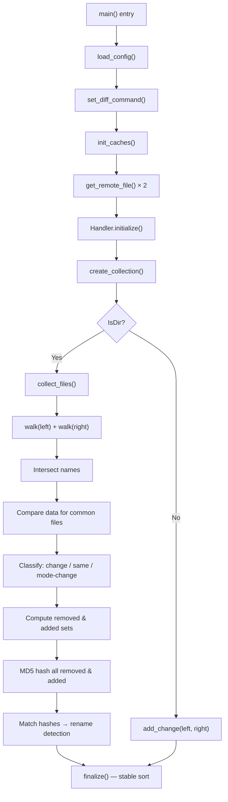
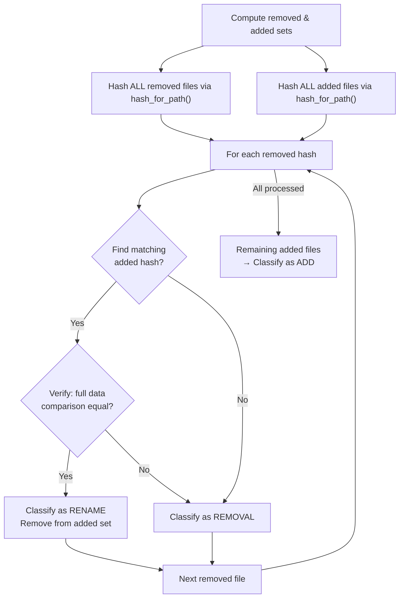
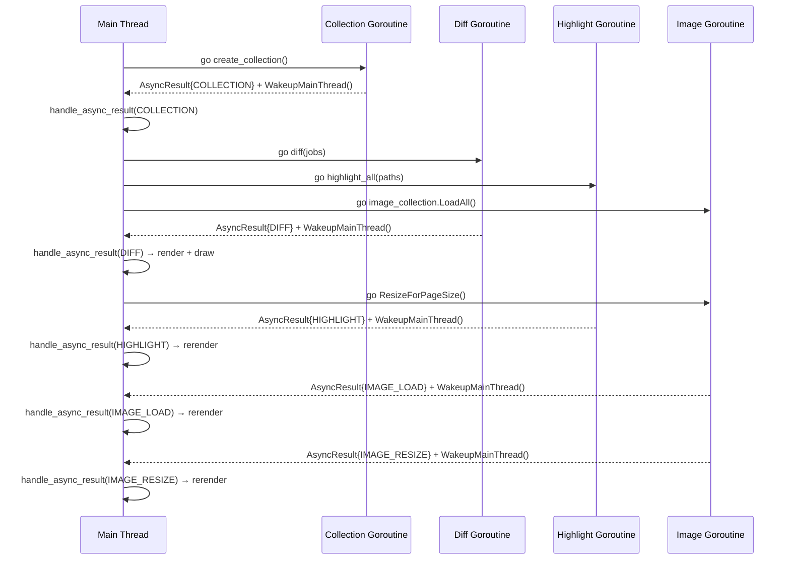
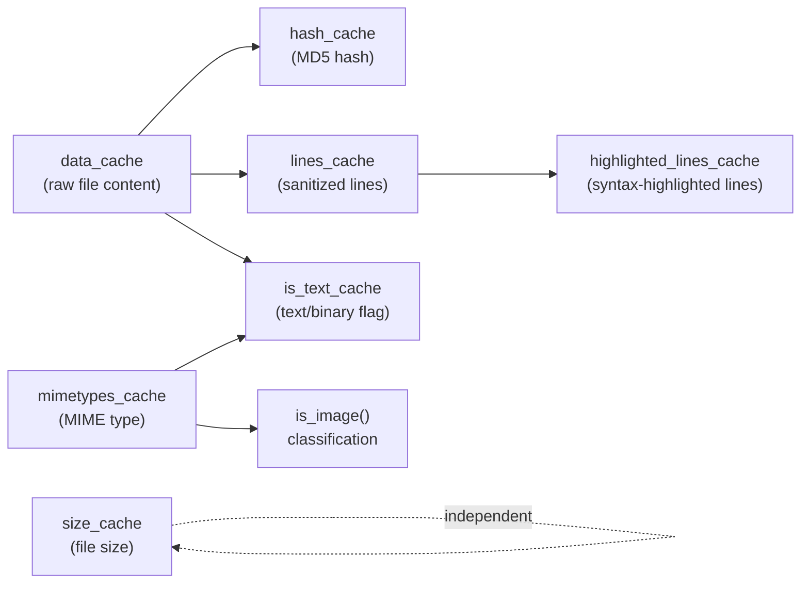
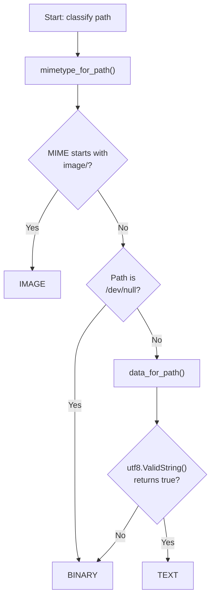

# Kitty Diff Kitten: Internal Runtime Deep-Dive

## About This Document

**Audience:** Developers onboarding into the Kitty terminal emulator repository who need a runtime-oriented understanding of the diff kitten's internal behavior.

**Scope:** This document provides a code-grounded technical walkthrough of how the diff kitten — Kitty's built-in terminal-based diff viewer — compares directories, detects renames, manages caches, parallelizes syntax highlighting, handles heterogeneous file types, and orchestrates its asynchronous pipeline. Every claim is traced to specific source files and line numbers.

**Conventions:**

- Source citations appear inline as `Source: path/to/file.go:line` references.
- Mermaid diagrams visualize complex flows and relationships.
- The codebase's own type and function names are used throughout: `Collection`, `Patch`, `Hunk`, `Chunk`, `Center`, `LogicalLine`, `ScreenLine`, etc.
- Rationale sections explain *why* the code is designed a particular way, not just what it does.

---

## 1. Introduction and Scope

The diff kitten is a terminal-based diff viewer that renders side-by-side comparisons of files and directories directly inside the Kitty terminal, leveraging Kitty's graphics protocol for inline image rendering. It supports text diffs with syntax highlighting, binary file metadata display, and image comparison — all within a keyboard- and mouse-driven TUI.

### 1.1 Source File Map

The diff kitten is implemented across 10 Go source files in `kittens/diff/`, plus 2 Python files for CLI and configuration:

| File | Role |
|---|---|
| `main.go` | Entry point, config loading, SSH remote file retrieval, terminal loop setup |
| `collect.go` | File collection, directory walking, rename detection, seven LRU caches |
| `diff.go` | Built-in anchored diff algorithm (adapted from Go stdlib) |
| `patch.go` | Diff execution backends, unified diff parsing, parallel batch diffing, character-level change detection |
| `highlight.go` | Chroma-based syntax highlighting, parallel execution, ANSI formatting |
| `ui.go` | Async pipeline controller, `Handler` state machine, wakeup-driven event processing |
| `render.go` | Display rendering — text/binary/image dispatch, side-by-side line layout |
| `search.go` | Regex search across rendered lines, parallel matching |
| `mouse.go` | Mouse selection, wheel scrolling, clipboard integration |
| `main.py` | CLI definition, configuration options (syntax_aliases, diff_cmd, ignore_name, etc.) |
| `__init__.py` | `syntax_aliases()` helper |
| `collect_test.go` | Unit tests for `walk()` traversal |

Two supporting utility modules outside `kittens/diff/` are essential infrastructure:

| File | Role |
|---|---|
| `tools/utils/cache.go` | Generic `LRUCache[K, V]` with `sync.RWMutex` thread-safety |
| `tools/utils/images/utils.go` | `Context.Parallel()` goroutine pool for concurrent work distribution |

---

## 2. Runtime Lifecycle: From Two Directories to a Classified Collection

This section traces the complete runtime flow from the moment two directory paths are accepted through to a fully classified `Collection` of changes, renames, additions, and removals.

### 2.1 Entry Point and Initialization

The diff kitten's entry point is `main()` in `kittens/diff/main.go:102`. The initialization sequence proceeds in a carefully ordered series of steps:

1. **Config loading:** `load_config(opts)` reads `diff.conf` via the Kitty config parser, resolving keyboard shortcuts. *(Source: kittens/diff/main.go:24–33)*
2. **Diff backend selection:** `set_diff_command(conf.Diff_cmd)` selects which diff engine to use (builtin, git, diff, or custom). *(Source: kittens/diff/main.go:111)*
3. **Cache initialization:** `init_caches()` allocates all seven LRU caches with capacity 4096. *(Source: kittens/diff/main.go:114)*
4. **Formatter setup:** `create_formatters()` prepares ANSI formatting functions for syntax-highlighted output. *(Source: kittens/diff/main.go:115)*
5. **SSH remote resolution:** `get_remote_file()` checks if either argument is prefixed with `ssh:`. If so, `get_ssh_file()` SSHs into the remote host, runs `tar -c -f -` to stream the file or directory, extracts it into a local temp directory, and returns the local path. *(Source: kittens/diff/main.go:92–100, 51–90)*
6. **Input validation:** Both paths must be the same type (both files or both directories) and must exist. *(Source: kittens/diff/main.go:129–137)*
7. **Event loop creation:** A `loop.New()` terminal loop is created and a `Handler{left, right, lp}` is initialized. Callbacks are registered: `OnInitialize` → `h.initialize()`, `OnWakeup` → `h.on_wakeup`, `OnResize`, `OnKeyEvent`, `OnText`, `OnMouseEvent`. *(Source: kittens/diff/main.go:138–162)*
8. **Run:** `lp.Run()` starts the event loop. *(Source: kittens/diff/main.go:163)*

**Rationale:** The entry point cleanly separates concerns — config first, then validation, then caches, then the event loop. SSH remote support via tar extraction into temp directories means the rest of the pipeline can treat all inputs as local filesystem paths, dramatically simplifying downstream logic. Temp directories are cleaned up on exit via a deferred function at line 116–120.

### 2.2 Directory Traversal (`walk`)

The `walk()` function at `kittens/diff/collect.go:260–294` performs recursive directory traversal. It accepts a `base` directory path, a list of ignore `patterns`, a `names` set (to be populated), and maps for path-to-name resolution.

Key behavior:

1. The base path is resolved to an absolute path via `filepath.Abs(base)`. *(Source: collect.go:261)*
2. `filepath.WalkDir(base, ...)` traverses recursively. *(Source: collect.go:265)*
3. For each entry, `allowed(path, patterns...)` checks the file's basename against `conf.Ignore_name` glob patterns using `filepath.Match()`. *(Source: collect.go:269, 230–238)*
4. If disallowed **and** a directory → `fs.SkipDir` (skip the entire subtree). *(Source: collect.go:271–273)*
5. If disallowed **and** a file → silently skip just that file. *(Source: collect.go:274)*
6. Directories that pass the filter are simply traversed further. *(Source: collect.go:276–278)*
7. Files get an absolute path, a relative name computed via `filepath.Rel(base, path)`, and are added to both the `names` set and the path map. *(Source: collect.go:279–291)*

**Rationale:** Using `filepath.WalkDir` (not the older `filepath.Walk`) avoids unnecessary `os.Stat` calls on every entry, since `WalkDir` provides a `fs.DirEntry` with cached type information. The glob-based ignore pattern operates on basenames only, making it simple and efficient — a tradeoff that prioritizes speed over complex gitignore-style path matching.

### 2.3 Set-Intersection Classification

The core directory comparison algorithm lives in `collect_files()` at `kittens/diff/collect.go:296–369`:

1. **Walk both sides:** Both left and right directories are walked into `left_names`/`right_names` sets and their respective path maps. *(Source: collect.go:297–305)*
2. **Intersect:** `common_names := left_names.Intersect(right_names)` identifies files present in both directories. *(Source: collect.go:306)*
3. **Compare common files:** For each common name, file content is loaded via `data_for_path()` for both sides and compared:
   - If content differs → `self.add_change(left, right)` *(Source: collect.go:317–319)*
   - If content is identical but file mode differs → still classified as a change *(Source: collect.go:321–329)*
4. **Compute asymmetric sets:** `removed := left_names.Subtract(common_names)` (files only in left), `added := right_names.Subtract(common_names)` (files only in right). *(Source: collect.go:332–333)*



**Rationale:** Set-intersection is the classic algorithm for directory comparison. By comparing actual file content (not just metadata like timestamps or sizes), the diff kitten correctly handles cases where timestamps differ but content is identical — common in build artifacts or files copied across systems.

### 2.4 Rename Detection via MD5 Hashing

After the set-intersection step classifies files as "removed" or "added," the rename detection algorithm at `kittens/diff/collect.go:334–367` attempts to match removed files with added files:

1. **Hash everything:** MD5 hashes are computed for ALL added files (into `ahash`) and ALL removed files (into `rhash`) using `hash_for_path()`. *(Source: collect.go:334–346)*
2. **`hash_for_path()`** at lines 106–116 reads file data via `data_for_path()`, computes `md5.Sum()`, and caches the result in `hash_cache`.
3. **Match by hash:** For each removed file's hash, scan all added files for a matching hash. *(Source: collect.go:347–363)*
4. **Verify:** If a hash match is found, perform a full data comparison (`ld == rd`) to guard against MD5 collisions. *(Source: collect.go:351–353)*
5. **Classify:** If verified → `self.add_rename(left_path, right_path)`, remove matched file from the `added` set. *(Source: collect.go:354–356)*
6. **No match:** If no matching hash is found → `self.add_removal(left_path)`. *(Source: collect.go:362)*
7. **Remaining adds:** All files still in the `added` set are classified as additions. *(Source: collect.go:365–367)*



**Rationale:** MD5 is chosen as a fast, widely-available hash that provides sufficient collision resistance for file identity matching in interactive diff sessions. The two-phase approach (hash first, then full byte comparison only on matches) avoids O(n²) full-content comparisons across all removed × added pairs. In practice, hash collisions on distinct files are astronomically unlikely, so the full verification is a safety net rather than a performance bottleneck.

After classification, `finalize()` stable-sorts `all_paths` by their display names to ensure deterministic output ordering. *(Source: collect.go:203–207)*

---

## 3. The Asynchronous Pipeline

The diff kitten uses a four-stage asynchronous pipeline to overlap expensive operations. This section documents the pipeline architecture from `kittens/diff/ui.go`.

### 3.1 Pipeline Architecture Overview

The pipeline is coordinated through a buffered channel and a wakeup signal mechanism:

- **`ResultType` enum:** Defines five result types — `COLLECTION`, `DIFF`, `HIGHLIGHT`, `IMAGE_LOAD`, `IMAGE_RESIZE`. *(Source: ui.go:22–30)*
- **`AsyncResult` struct:** Carries an `err`, `rtype`, and stage-specific payloads (`collection`, `diff_map`, `page_size`). *(Source: ui.go:44–50)*
- **`async_results` channel:** A buffered channel of size 32 created in `initialize()`. *(Source: ui.go:132)*



### 3.2 Stage 1 — Collection

`Handler.initialize()` at `ui.go:114–140` launches the first goroutine:

```go
go func() {
    r := AsyncResult{}
    r.collection, r.err = create_collection(self.left, self.right)
    self.async_results <- r
    self.lp.WakeupMainThread()
}()
```

The goroutine calls `create_collection()`, which performs all directory traversal, set-intersection classification, and rename detection. The result is sent on the channel and the main thread is woken up. *(Source: ui.go:133–138)*

### 3.3 Stage 2 — Diff Generation

`Handler.generate_diff()` at `ui.go:142–159` is triggered when the COLLECTION result arrives. It builds a list of `diff_job` structs containing left/right file pairs (only text files), then launches a goroutine:

```go
go func() {
    r := AsyncResult{rtype: DIFF}
    r.diff_map, r.err = diff(jobs, self.current_context_count)
    self.async_results <- r
    self.lp.WakeupMainThread()
}()
```

The `diff()` function in `kittens/diff/patch.go:352–377` uses `images.Context.Parallel()` to distribute `do_diff()` calls across multiple goroutines. Results are collected via a buffered channel and assembled into a `map[string]*Patch`. *(Source: patch.go:352–377)*

### 3.4 Stage 3 — Syntax Highlighting

`Handler.highlight_all()` at `ui.go:179–188` is triggered concurrently with diff generation. It filters the collection's `paths_to_highlight` to text files only, then launches a goroutine calling `highlight_all(text_files)` from `highlight.go:217–228`. This stage also uses `images.Context.Parallel()` for concurrent highlighting. *(Source: ui.go:179–188)*

### 3.5 Stage 4 — Image Loading and Resizing

`Handler.load_all_images()` at `ui.go:190–211` iterates the collection, adds image paths to `image_collection`, and launches a goroutine calling `image_collection.LoadAll()`.

After the DIFF result arrives and the logical lines are rendered, `resize_all_images_if_needed()` at `ui.go:213–232` calculates available pixel dimensions and, if needed, launches another goroutine calling `image_collection.ResizeForPageSize()`. This sends an `IMAGE_RESIZE` result when complete.

### 3.6 Wakeup-Driven Result Processing

`Handler.on_wakeup()` at `ui.go:161–177` drains the `async_results` channel using a `select` loop:

```go
for {
    select {
    case r = <-self.async_results:
        // handle result
    default:
        return nil
    }
}
```

`Handler.handle_async_result()` at `ui.go:245–276` dispatches on `r.rtype`:

| Result Type | Action |
|---|---|
| `COLLECTION` | Store collection, trigger `generate_diff()` + `highlight_all()` + `load_all_images()` |
| `DIFF` | Store diff_map, calculate statistics, render diff, draw screen |
| `HIGHLIGHT` | Rerender diff (highlighted lines now available in cache) |
| `IMAGE_LOAD` | Rerender diff (image data now loaded) |
| `IMAGE_RESIZE` | Store resized dimensions, rerender diff |

**Rationale:** The pipeline design allows collection, diff computation, syntax highlighting, and image loading to overlap in time. The wakeup mechanism avoids polling — goroutines signal the main thread only when results are ready, minimizing CPU usage while idle. The buffered channel (size 32) prevents goroutines from blocking on sends even if multiple results arrive before the main thread processes them.

---

## 4. Caching Architecture

The diff kitten maintains seven LRU caches to avoid redundant I/O and computation. All caches are initialized in `init_caches()` at `kittens/diff/collect.go:26–37`.

### 4.1 The Seven LRU Caches

| Cache Variable | Key Type | Value Type | Capacity | Purpose | Populated By |
|---|---|---|---|---|---|
| `mimetypes_cache` | `string` (path) | `string` (MIME type) | 4096 | Avoid repeated MIME type detection | `mimetype_for_path()` *(collect.go:50–63)* |
| `data_cache` | `string` (path) | `string` (file content) | 4096 | Avoid re-reading file data from disk | `data_for_path()` *(collect.go:65–70)* |
| `hash_cache` | `string` (path) | `string` (MD5 hex) | 4096 | Cache MD5 hashes for rename detection | `hash_for_path()` *(collect.go:106–116)* |
| `size_cache` | `string` (path) | `int64` (size) | 4096 | Cache file sizes for binary metadata display | `size_for_path()` *(collect.go:72–80)* |
| `lines_cache` | `string` (path) | `[]string` (lines) | 4096 | Cache sanitized, split lines | `lines_for_path()` *(collect.go:138–146)* |
| `highlighted_lines_cache` | `string` (path) | `[]string` (highlighted) | 4096 | Cache syntax-highlighted line output | `highlight_all()` *(highlight.go:224)* |
| `is_text_cache` | `string` (path) | `bool` | 4096 | Cache text vs. binary classification | `is_path_text()` *(collect.go:86–104)* |

All caches use a constant capacity of `sz = 4096`. *(Source: collect.go:29)*

### 4.2 Thread-Safety and Eviction

The `LRUCache[K, V]` generic type is defined in `tools/utils/cache.go:13–72`. Its fields are:

- `data map[K]V` — the actual cache store
- `lock sync.RWMutex` — provides thread-safe concurrent access
- `max_size int` — capacity limit
- `lru *list.List` — doubly-linked list for LRU eviction tracking

Key methods:

| Method | Locking | Behavior |
|---|---|---|
| `Get(key)` | `RLock` (read lock) | Returns value from map. Multiple goroutines can read concurrently. *(cache.go:25–30)* |
| `Set(key, val)` | `RLock` (read lock) | Writes to map under read lock. *(cache.go:32–37)* |
| `GetOrCreate(key, create)` | `RLock` for check, `Lock` for insert | Check-then-create pattern. On miss: creates value, acquires full `Lock`, inserts into map, pushes key to front of LRU list, and evicts the back element if over capacity. *(cache.go:39–58)* |
| `MustGetOrCreate(key, create)` | `RLock` for check, `Lock` for insert | Infallible variant (no error return). Unlike `GetOrCreate`, it does **not** call `lru.PushFront()` to track the entry in the LRU list and does **not** evict the oldest entry when capacity is exceeded. *(cache.go:60–72)* |

**Unbounded cache growth via `MustGetOrCreate`:** Because `MustGetOrCreate` bypasses LRU list tracking and eviction, the two caches that use it — `mimetypes_cache` (populated by `mimetype_for_path()`) and `is_text_cache` (populated by `is_path_text()`) — can grow beyond the nominal 4096-entry capacity within a single diff session. Their entries are inserted into the `data` map but never added to the `lru` linked list, so the eviction check `self.lru.Len() > self.max_size` never triggers for these entries. In practice, this is unlikely to matter for typical diff sessions, but for very large directory comparisons with thousands of unique file paths, these two caches will consume proportionally more memory than the other five.

**Notable design choice:** `Set()` uses `RLock` (read lock) rather than the exclusive `Lock`. This is safe in the diff kitten's specific usage pattern because `Set()` is only called from within `highlight_all()` after `Parallel()` completes — meaning writes happen sequentially from the goroutine pool, not concurrently with other writes to the same key. However, this would not be safe for general-purpose concurrent `Set()` calls on overlapping keys.

**Rationale:** The LRU uses Go's `container/list` (doubly-linked list) for O(1) eviction. The `sync.RWMutex` allows concurrent reads with exclusive writes, which is the optimal concurrency pattern for a read-heavy cache. The 4096 capacity is generous enough to avoid eviction during typical diff sessions (most sessions involve far fewer than 4096 unique file paths).

### 4.3 Cache Interaction Patterns

The caches form a layered dependency graph:



The key insight is that `data_cache` is the foundation. When `data_for_path()` reads a file from disk, the raw content is cached once. All downstream computations — hashing (`hash_for_path` reads from `data_cache`), line splitting (`lines_for_path` reads from `data_cache`), and text classification (`is_path_text` reads from `data_cache`) — reuse this cached data.

**Rationale:** This layered design means each file is read from disk at most once per path, regardless of how many different operations need its content. The cost of caching raw file content (potentially large strings) is offset by the elimination of redundant I/O, which is critical for a responsive TUI.

---

## 5. The Diff Algorithm: Anchored Unified Diff

The diff kitten includes a built-in diff algorithm adapted from the Go standard library. This section explains how it works and why it was chosen.

### 5.1 Why Anchored (Patience) Diff

The `Diff()` function at `kittens/diff/diff.go:49–167` is adapted from `golang.org/src/internal/diff/diff.go` (cited at line 1–2: [Go stdlib source](https://github.com/golang/go/raw/master/src/internal/diff/diff.go)).

The function comment at lines 21–48 explains the core distinction:

- **Standard diff:** Finds the smallest number of lines inserted/removed. Can take O(n²) time in the worst case. Many implementations either hang on adversarial inputs or cut off the search after a time budget.
- **Anchored diff:** Finds the smallest number of *unique* lines inserted/removed, where "unique" means a line appearing exactly once in both old and new. This guarantees O(n log n) time.

The term "anchored" reflects that unique lines serve as fixed anchor points that pin down matching regions. Some systems call this a "patience diff" (named after patience sorting), but the Kitty source avoids that term because it has been applied to multiple algorithm variants and is often misinterpreted as meaning the diff is *slower*, when it is actually *faster*.

**Rationale:** The O(n log n) time guarantee is essential for a terminal UI — the diff must complete quickly even for large files, without risk of hanging. The anchored approach also produces cleaner, more readable diffs because it avoids reusing unrelated blank lines or closing braces as match points.

### 5.2 Unique-Line Matching via `tgs()`

The `tgs()` function at `kittens/diff/diff.go:192–264` implements the core longest-common-subsequence algorithm. It is based on:

> Thomas G. Szymanski, "A Special Case of the Maximal Common Subsequence Problem," Princeton TR #170 (January 1975), available at [https://research.swtch.com/tgs170.pdf](https://research.swtch.com/tgs170.pdf).

*(Source: diff.go:184–191)*

The algorithm proceeds in three phases:

**Phase 1 — Count occurrences (lines 193–207):** A map `m` counts occurrences of each string in both `x` and `y` using a clever negative-number encoding:
- Each occurrence in `x` subtracts 1 (values: 0 → -1 → -2)
- Each occurrence in `y` subtracts 4 (values: 0 → -4 → -8)
- A string appearing exactly once in both `x` and `y` has count `-1 + -4 = -5`

This encoding uses a single map and a single pass over each input to simultaneously detect uniqueness in both sequences.

**Phase 2 — Gather unique-line indexes (lines 215–227):** Three arrays are built:
- `xi[i]` — position of the i-th unique string in `x`
- `yi[i]` — position of the i-th unique string in `y`
- `inv[i]` — maps xi index to the corresponding yi index

**Phase 3 — Longest increasing subsequence (lines 229–263):** Szymanski's Algorithm A is applied to `inv` to find the longest increasing subsequence. This uses a patience-sort-like approach with binary search (`sort.Search`) to maintain array `T[]` (smallest tail values) and `L[]` (subsequence lengths). The subsequence is reconstructed by backtracking through `L[]`.

The function returns pairs with sentinel `{0, 0}` at the start and `{len(x), len(y)}` at the end to simplify the expansion loop in `Diff()`.

### 5.3 Match Expansion and Chunk Emission

`Diff()` at lines 49–167 iterates over the `tgs()` match pairs and:

1. **Expands each match bidirectionally:** backward (lines 85–88) and forward (lines 90–93) while lines are equal. This extends unique-line anchors to include surrounding identical lines.
2. **Emits mismatches:** Lines between expanded match regions are emitted as `-` (removed) and `+` (added). *(Source: diff.go:97–104)*
3. **Manages context:** Uses `num_of_context_lines` (the `C` variable) to decide whether to merge adjacent chunks or start a new one. If the gap between matches is less than `C` (or `2*C` when continuing a chunk), the common lines are included in the chunk as context. *(Source: diff.go:108–118)*
4. **Formats output:** Emits unified diff headers `@@ -start,count +start,count @@` with 1-indexed line numbers. *(Source: diff.go:142)*

### 5.4 External Backend Fallback

The `set_diff_command()` function at `kittens/diff/patch.go:44–62` selects the diff backend:

| Config Value | Behavior |
|---|---|
| `auto` | Tries `git diff` first, then `diff`, falls back to builtin *(patch.go:46–47, 34–42)* |
| `builtin` or `""` | Uses the built-in `Diff()` function *(patch.go:48–49)* |
| `diff` | Uses system `diff -p -U _CONTEXT_ --` *(patch.go:50–51)* |
| `git` | Uses `git diff --no-color --no-ext-diff --exit-code -U_CONTEXT_ --no-index --` *(patch.go:52–53)* |
| Custom string | Shell-lexed into a command array *(patch.go:54–59)* |

`run_diff()` at lines 282–328 dispatches based on whether `diff_cmd` is empty (use builtin) or populated (run external subprocess). Symlinks are resolved via `filepath.EvalSymlinks()` before diffing to ensure consistent behavior regardless of backend. *(Source: patch.go:286–293)*

**Rationale:** The fallback chain provides flexibility — developers who prefer git's diff output or need specific features of an external diff tool can configure it, while the builtin provides a zero-dependency default that is fast and predictable.

---

## 6. Parallel Syntax Highlighting

The diff kitten highlights source code using Chroma v2.14.0 (`github.com/alecthomas/chroma/v2`), distributing the work across multiple goroutines.

### 6.1 Lexer Selection Pipeline

`highlight_file()` at `kittens/diff/highlight.go:161–215` performs lexer selection:

1. **Extract filename:** Get the basename for detection. *(Source: highlight.go:162)*
2. **Apply syntax aliases:** If the file extension matches a configured alias (from `conf.Syntax_aliases`), the detection filename is rewritten. *(Source: highlight.go:164–170)*
3. **Filename-based matching:** `lexers.Match(filename_for_detection)` attempts to find a lexer by filename pattern. *(Source: highlight.go:175)*
4. **Content-based analysis:** If no match, `lexers.Analyse(text)` inspects file content for shebang lines and language markers. *(Source: highlight.go:178)*
5. **No lexer:** If both methods fail, returns `ErrNoLexer`. *(Source: highlight.go:181–183)*
6. **Coalesce:** `chroma.Coalesce(lexer)` merges adjacent same-type tokens to reduce the number of formatting operations. *(Source: highlight.go:184)*

### 6.2 Chroma Tokenization and ANSI Formatting

Style selection at lines 185–204:
- Uses `conf.Pygments_style` to look up a Chroma style.
- If set to `"default"`, uses a custom-registered default style defined at lines 26–71.
- Falls back to `"monokai"` when the background is dark **and** the foreground is not dark (i.e., `conf.Background.IsDark() && !conf.Foreground.IsDark()`), then tries `"github-dark"`, and ultimately falls back to `styles.Fallback`. *(Source: highlight.go:192–203)*

Tokenization is performed via `lexer.Tokenise(nil, text)`. *(Source: highlight.go:205)*

The custom `ansi_formatter` function at lines 84–159 converts tokens to ANSI escape codes:
- Each token's style entry (bold, italic, underline, color) is translated to SGR codes.
- Multi-line tokens are split at newline boundaries so each output line is independently formatted — this is essential because pagers like `less` reset SGR at line boundaries. *(Source: highlight.go:138–156)*
- Token text is sanitized via `sanitize()` (control code replacement + tab expansion). *(Source: highlight.go:140)*

### 6.3 Goroutine Pool Execution

`highlight_all()` at `kittens/diff/highlight.go:217–228` parallelizes highlighting:

```go
func highlight_all(paths []string) {
    ctx := images.Context{}
    ctx.Parallel(0, len(paths), func(nums <-chan int) {
        for i := range nums {
            path := paths[i]
            raw, err := highlight_file(path)
            if err == nil {
                highlighted_lines_cache.Set(path, text_to_lines(raw))
            }
        }
    })
}
```

The `Context.Parallel()` method at `tools/utils/images/utils.go:27–56` implements a self-balancing goroutine pool:

1. **Thread count:** Uses `self.NumberOfThreads()` if set, otherwise defaults to `runtime.NumCPU()`. *(Source: utils.go:33–36)*
2. **Cap at work count:** `procs` is capped at the number of work items to avoid idle goroutines. *(Source: utils.go:37–39)*
3. **Buffered channel:** All work indices (`start` to `stop-1`) are pre-loaded into a buffered channel, which is then closed. *(Source: utils.go:41–45)*
4. **Spawn goroutines:** `procs` goroutines are launched, each reading from the shared channel until it is drained. *(Source: utils.go:48–53)*
5. **Synchronization:** A `sync.WaitGroup` ensures all goroutines complete before `Parallel()` returns. *(Source: utils.go:47, 49, 51, 55)*

**Rationale:** Pre-loading all indices into a buffered channel means goroutines self-balance: faster workers automatically pick up more items without explicit work partitioning. This avoids the common pitfall of static chunk assignment where one goroutine finishes early while another handles disproportionately expensive files. The same pattern is reused for parallel diff execution in `patch.go:361` and parallel search in `search.go`, providing a consistent concurrency model throughout the diff kitten.

---

## 7. Handling Binary Files and Images

The diff kitten handles three categories of files: text, binary, and images. This section documents the classification pipeline and rendering dispatch.

### 7.1 File Classification

The classification chain in `kittens/diff/collect.go` determines how each file is handled:

1. **`mimetype_for_path(path)`** at lines 50–63: Uses `utils.GuessMimeTypeWithFileSystemAccess()` to detect the MIME type. Defaults to `application/octet-stream` if detection fails. Normalizes known textual MIME types (e.g., `application/json`) to `text/*` prefixes.
2. **`is_image(path)`** at lines 82–84: Returns `true` if the MIME type starts with `image/`.
3. **`is_path_text(path)`** at lines 86–104:
   - Returns `false` if `is_image(path)` is true.
   - Returns `false` if the path points to `/dev/null` (detected via `os.SameFile`).
   - Otherwise, reads file data via `data_for_path()` and returns `utf8.ValidString(d)` — if the content is valid UTF-8, it is considered text.



**Rationale:** The classification is deliberately conservative — only valid UTF-8 content is treated as text. This prevents the diff engine from attempting to diff binary files (which would produce meaningless output), while correctly handling all Unicode text files regardless of their MIME type detection accuracy.

### 7.2 Render Dispatch Logic

The `render()` function at `kittens/diff/render.go:696–770` iterates over the collection and dispatches each item to the appropriate rendering path:

For each item from `collection.Apply()`:

1. **Determine binary flag:** `is_binary := !is_path_text(path)`. For diff items, also checks the changed path. *(Source: render.go:706–709)*
2. **Determine image flag:** The expression at `render.go:710` is `is_img := is_binary && is_image(path) || (item_type == "diff" && is_image(changed_path))`. Due to Go's operator precedence (`&&` binds tighter than `||`), this evaluates as two independent conditions joined by `||`: **(a)** `is_binary && is_image(path)` — the file is binary and its path has an image MIME type, OR **(b)** `item_type == "diff" && is_image(changed_path)` — for diff items, the changed path has an image MIME type. Critically, the second condition does **not** require `is_binary` to be true — a diff item whose `changed_path` is an image will be classified as an image regardless of the binary status of the primary path. *(Source: render.go:710)*
3. **Dispatch by item type and file category:**

| Item Type | Binary? | Image? | Renderer |
|---|---|---|---|
| `"diff"` | No | — | `lines_for_diff()` — full side-by-side text diff |
| `"diff"` | Yes | Yes | `image_lines()` — inline image comparison |
| `"diff"` | Yes | No | `binary_lines()` — size metadata display |
| `"add"` | No | — | `all_lines()` — full text with `+` markers |
| `"add"` | Yes | Yes | `image_lines()` — single image display |
| `"add"` | Yes | No | `binary_lines()` — size display |
| `"removal"` | No | — | `all_lines()` — full text with `-` markers |
| `"removal"` | Yes | Yes | `image_lines()` — single image display |
| `"removal"` | Yes | No | `binary_lines()` — size display |
| `"rename"` | — | — | `rename_lines()` — rename notification |

*(Source: render.go:712–756)*

### 7.3 Binary Metadata Display

`binary_lines()` displays file sizes for both sides of a binary file comparison, allowing users to see at a glance whether a binary file changed in size.

### 7.4 Inline Image Rendering via Graphics Protocol

`image_lines()` uses Kitty's graphics protocol to render images inline in the terminal. Images are loaded asynchronously (Stage 4 of the pipeline), resized to fit within the available column/row space, and transmitted to the terminal as graphics commands. This enables visual comparison of image files directly within the diff view — a capability unique to Kitty among terminal-based diff tools.

---

## 8. Character-Level Change Detection

Beyond line-level diffs, the diff kitten identifies exactly which characters within a line changed, enabling precise highlighting in the UI.

The `changed_center()` function at `kittens/diff/patch.go:86–99` computes the character-level change region for a pair of lines:

1. **Common prefix:** Scan from the left, incrementing `offset` while characters are equal. *(Source: patch.go:90–91)*
2. **Common suffix:** Scan from the right, incrementing `suffix_count` while characters are equal. *(Source: patch.go:93–94)*
3. **Change region:** `left_size = len(left) - suffix_count - offset`, `right_size = len(right) - suffix_count - offset`. *(Source: patch.go:95–96)*
4. **Result:** Returns `Center{offset, left_size, right_size}` — the offset marks where the change begins, and the sizes indicate how many characters changed on each side.

This is invoked from `Chunk.finalize()` at lines 101–107: for each non-context chunk where `left_count == right_count` (meaning lines can be paired 1:1), `changed_center()` is called for each matching line pair.

**Rationale:** Character-level change detection enables the UI to highlight only the specific portion of a line that changed, rather than marking the entire line as modified. This dramatically improves readability for lines with small edits (e.g., a variable rename or a single-character typo fix), which are the most common type of change in real-world diffs.

---

## 9. Summary

The diff kitten's architecture reflects five key design patterns:

1. **Async pipeline with goroutine-channel coordination:** The four-stage pipeline (COLLECTION → DIFF → HIGHLIGHT → IMAGE_LOAD) allows expensive operations to overlap. The wakeup mechanism avoids polling and minimizes CPU usage while idle. *(Source: ui.go:114–276)*

2. **Layered LRU caching to minimize I/O:** Seven caches with a shared 4096-entry capacity form a dependency graph rooted in `data_cache`. Each file is read from disk at most once; all derived computations reuse cached data. *(Source: collect.go:20–37, tools/utils/cache.go)*

3. **O(n log n) anchored diff with external backend fallback:** The built-in diff algorithm, adapted from the Go standard library and based on Szymanski's 1975 paper, guarantees fast execution even on large files. External backends (git, diff) provide compatibility when needed. *(Source: diff.go, patch.go:44–62)*

4. **Self-balancing goroutine pool for parallel work:** `Context.Parallel()` distributes work via a pre-loaded buffered channel, allowing faster goroutines to automatically pick up more items. This pattern is reused consistently for diff computation, syntax highlighting, and search. *(Source: tools/utils/images/utils.go:27–56)*

5. **MIME-based file classification for heterogeneous handling:** The `mimetype_for_path()` → `is_image()` → `is_path_text()` classification chain routes files to the appropriate rendering path (text diff, binary metadata, or inline image), ensuring correct handling regardless of file type. *(Source: collect.go:50–104, render.go:696–770)*

Together, these patterns create a responsive, feature-rich terminal diff viewer that handles real-world codebases with thousands of files, mixed file types, and large individual files — all within the constraints of a terminal-based UI.
