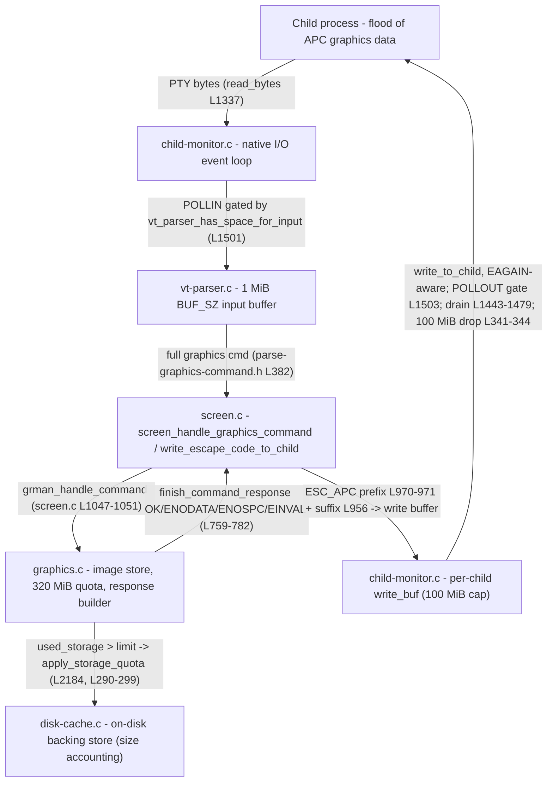

# How kitty regulates the flow of terminal graphics data under pressure

**Source tree:** branch `kitty_815df1e210e0`, source code at commit `815df1e210e0a9ab4622f5c7f2d6891d7dbeddf1` ("Wire up applying of font config") — this is the citation baseline for every `file:line` below. This answer document is added on top of that source in commit `b04bc45a8`. All binaries were built from this tree and report themselves as `kitty 0.35.2`.

**Scope note.** This document answers, with runtime‑grounded evidence, how the kitty terminal emulator behaves when a large amount of terminal **graphics** data (kitty graphics‑protocol APC escape codes, `ESC _ G … ESC \`) arrives faster than the terminal can comfortably process and respond to it — on both the **input (read)** side and the **output (write/response)** side — where those decisions live in the source, and how they surface at runtime. Every behavioural claim below sits next to the **exact command** that produced it and the **complete, unedited output** of a run I executed — or, where the raw stream is enormous (e.g. a multi‑million‑line `strace`), the exact command plus the specific **verbatim** lines that carry the signal together with the counts I extracted from the full capture — with `file:line` references into this checkout. Claims are explicitly labelled **OBSERVED** (captured from a real run) or **INFERRED** (grounded in code that I could not surface as a runtime value). Every observation was driven through kitty's **canonical entry point** — a real PTY feeding the native I/O loop and VT parser, or the real `vt_parser` → `screen_handle_graphics_command` → `graphics.c` chain in‑process — never the remote‑control interface or a debug injection hook. The source repository was left byte‑for‑byte unchanged; the only new artifact is this file. See section **(f)** for the full observed‑vs‑inferred ledger, the exact build/invocation commands with their exit statuses, the scale used, and the ≥2‑run stability confirmations.

**One‑sentence answer.** kitty does **not** grow an unbounded buffer and it does **not** "throttle" in any rate‑limiting sense; on the input side it **pauses reading** by de‑arming the child's `POLLIN` once a fixed **1 MiB** (`1048576`‑byte) parser buffer fills — letting ordinary OS PTY backpressure block the producer — and on the output side it uses a non‑blocking, `EAGAIN`‑aware drain that **retains** unwritten response bytes for the next `POLLOUT`, with a **100 MiB** (`104857600`‑byte) hard cap that drops (and logs) anything beyond it; graphics‑specific pressure additionally shows up as **oldest‑image eviction** under a **320 MiB** (`335544320`‑byte) storage quota and as protocol **`;ENOSPC` / `;EINVAL` / `;ENODATA`** responses.

**Methodology (one default build + two harnesses + strace).** Every magnitude and threshold below was observed on a **single, default, canonical build** — `python3 setup.py build` producing `-O3 -DNDEBUG` (`kitty 0.35.2`) — the build a normal user gets. I did **not** rely on an instrumented `--extra-logging=event-loop` build or a `KITTY_PRINT_BYTES_SENT_TO_CHILD` byte‑dump build for any magnitude; instead I attached **`strace`** to the running default binary, whose `poll()`, `read()`, and `write()` syscall arguments reveal the buffer occupancies and the `EAGAIN` errno **directly** (this is more faithful than a debug print — it is the exact syscall the shipping code makes, and it sidesteps the default build's lack of DWARF from LTO). `strace` and the in‑process test harness are non‑source‑mutating, canonical‑path observation tools.

---

## Two observation paths (and why both are needed)

kitty's flow control spans two layers that require two different harnesses. Each observation below is labelled **Path A** or **Path B**.

- **Path A — in‑process canonical graphics path.** kitty's own test harness (`kitty_tests/`) feeds bytes into the **real** `vt_parser` via `parse_bytes` → `screen_handle_graphics_command` (`kitty/screen.c:L1047`) → `grman_handle_command` (`kitty/graphics.c`) → `finish_command_response` (`kitty/graphics.c:L759-L782`) in‑process, and captures the exact response bytes the screen would write back (`Callbacks.write` → `c.wtcbuf`, which is what `write_escape_code_to_child` feeds). This canonically exercises parsing/dispatch, **response content** (`;OK` / `;ENODATA` / `;EINVAL` / `;ENOSPC`), storage‑**quota eviction**, the **quiet** flag, and the **two rejection layers**. *Limitation (stated plainly):* in test mode the responses do **not** traverse the native child‑monitor write buffer and `vt_parser_has_space_for_input` is not exercised — so Path A **cannot** show the `POLLIN` read‑pause (OBJ‑1) or the write‑side `EAGAIN`/100 MiB cap (OBJ‑2). Those require Path B.
- **Path B — a real running kitty with a PTY child.** I ran the default `./kitty/launcher/kitty` binary headless under `xvfb-run -a` with `LIBGL_ALWAYS_SOFTWARE=1`, driving a **real child process** that floods graphics APC data into kitty's PTY so the bytes flow through the native `kitty/child-monitor.c` I/O loop, and I attached `strace` to kitty's I/O‑loop thread (`KittyChildMon`, `kitty/child-monitor.c:L1489`). This is the only way to observe the read pause and the write‑side backpressure/drop at the syscall level.

**Build used** (single default build, in an isolated copy **outside** the checkout; see (f)):

| Build | Command | Resulting flags | Version | Used for |
|-------|---------|-----------------|---------|----------|
| Default / canonical (authoritative for **all** magnitudes) | `python3 setup.py build --verbose` | `-O3 -DNDEBUG` (setup.py:L482, L485) | `kitty 0.35.2` | Path A **and** Path B; observed with `strace` for OBJ‑1/OBJ‑2 |

No instrumented or byte‑dump build was used for any observed value. The `strace` invocations that surface the syscalls are given inline in each section and again in (f).

---

## (a) Direct answer — the input side: buffer, pause, or slow down?

**What kitty does.** When graphics data floods in, kitty reads it into a **single, fixed‑size 1 MiB parser buffer** and dispatches from that buffer on a worker. It does **not** keep enlarging a buffer, and it has no rate limiter. Instead, the native I/O event loop consults the parser before every `poll()` and, the moment the parser buffer is full, it **stops asking the OS for more bytes from that child** — it clears the child fd's requested `POLLIN` bit (setting `events` to `0` when nothing else is pending). With no reader draining the PTY, the kernel's PTY buffer fills and the child's next `write()` **blocks**. That is ordinary, kernel‑enforced **read backpressure**: the producer is slowed to exactly kitty's drain rate, with no data loss and no unbounded memory growth.

**Where the decision lives.**
- The buffer size is a compile‑time constant — `kitty/vt-parser.c:L18`:
  ```c
  #define BUF_SZ (1024u*1024u)
  ```
- The admission predicate — `kitty/vt-parser.c:L1477-L1481`:
  ```c
  vt_parser_has_space_for_input(const Parser *p) {
      PS *self = (PS*)p->state;
      bool ans;
      with_lock {
          ans = self->read.sz + self->write.pending < BUF_SZ;
  ```
  i.e. it returns **false** once `read.sz + write.pending` reaches `BUF_SZ`.
- The read gate in the event loop — `kitty/child-monitor.c:L1501`:
  ```c
  children_fds[EXTRA_FDS + i].events = vt_parser_has_space_for_input(screen->vt_parser) ? POLLIN : 0;
  ```
  When the predicate is false, the child fd's requested `events` is set to `0` (POLLIN cleared). Two lines later — after `kitty/child-monitor.c:L1502` takes the write lock (`screen_mutex(lock, write)`) — `kitty/child-monitor.c:L1503` ORs `POLLOUT` back in **only if** `write_buf_used > 0`, so more precisely kitty **de‑arms `POLLIN` while preserving any `POLLOUT` interest** — it stops reading that child without giving up the ability to flush queued responses.
- The actual ingestion happens in `read_bytes` (`kitty/child-monitor.c:L1337`), which asks the parser for a write buffer sized `BUF_SZ - (read.sz + write.pending)` (`vt_parser_create_write_buffer`, `kitty/vt-parser.c:L1451-L1458`), `read()`s into it, and commits the length back to the parser.

**The batching modifier (the "slow down a little" that is *not* a pause).** Within the 1 MiB budget, kitty deliberately *batches* input rather than dispatching every chunk immediately, governed by `input_delay` (default **3 ms**, `kitty/options/definition.py:L878`). The parse worker flushes early when a flush is forced, when `input_delay` has elapsed, **or** when the buffer is nearly full — `kitty/vt-parser.c:L1425`:
```c
if (flush || pd->time_since_new_input >= OPT(input_delay) || self->read.sz + 16 * 1024 > BUF_SZ) {
```
The `self->read.sz + 16 * 1024 > BUF_SZ` clause is exactly the documented "`input_delay` is ignored when the input buffer is almost full" behaviour: under a flood the 3 ms timer is bypassed and kitty flushes as fast as it can within the fixed buffer.

**Observed evidence (Path B, default build + strace).** I ran a child that floods **quiet** (`q=2`) graphics APC transmit commands into kitty's PTY as fast as `os.write()` allows. `q=2` makes the graphics manager suppress *all* responses (`kitty/graphics.c:L762-L764`), so kitty's per‑child `write_buf` stays empty and the experiment isolates the **read** side. The complete, self‑cleaning probe source:

```python
#!/usr/bin/env python3
"""OBJ-1 probe: pure INPUT (read-side) pressure via the canonical kitty graphics
protocol. Sends a flood of REAL graphics APC transmit commands with quiet=2 so the
terminal produces NO responses (graphics.c L762-764) -- this keeps kitty's per-child
write_buf empty and isolates read-side flow control. Bounded in time; restores tty."""
import os, sys, time, base64, tty, termios

LOG = sys.argv[1]
DURATION = float(sys.argv[2]) if len(sys.argv) > 2 else 20.0

def log(m):
    with open(LOG, 'a') as f:
        f.write(m + '\n'); f.flush()

def main():
    # Reject a nonsensical duration up front (fail loud, non-zero) rather than silently
    # "succeeding" with zero work: the flood needs a strictly positive DURATION.
    if DURATION <= 0:
        sys.stderr.write('invalid DURATION=%r (need DURATION>0 seconds)\n' % DURATION)
        sys.exit(2)
    log('# OBJ-1 child pid=%d' % os.getpid())
    old = None
    try:
        try:
            old = termios.tcgetattr(0)
            tty.setraw(0)                      # raw: no ICANON so nothing is line-buffered
            log('# stdin set to raw mode')
        except Exception as e:
            log('# raw mode unavailable: %r' % e)
        # 100x100 RGB image (30000 raw bytes -> 40000 base64) makes each command large and
        # its dispatch (base64 decode + image store) slower than the read, so read.sz climbs.
        raw = b'a' * (100 * 100 * 3)
        img = base64.standard_b64encode(raw).decode('ascii')
        cmd = ('\033_Gi=2,a=t,q=2,s=100,v=100,f=24;' + img + '\033\\').encode('ascii')
        log('# per-command bytes=%d (quiet=2 => no responses)' % len(cmd))
        log('# attach window: sleeping 5s for strace to attach')
        time.sleep(5)
        log('# FLOOD start duration=%.1fs' % DURATION)
        t0 = time.time(); n = 0; max_write_ms = 0.0; stalls = 0; last = t0
        end = t0 + DURATION
        while time.time() < end:
            w0 = time.time()
            os.write(1, cmd)               # blocks when kitty de-arms POLLIN and PTY fills
            dw = (time.time() - w0) * 1000.0
            if dw > max_write_ms: max_write_ms = dw
            if dw > 50.0: stalls += 1
            n += 1
            now = time.time()
            if now - last >= 1.0:
                log('# t=%5.2fs cmds=%d max_write=%.1fms stalls>50ms=%d' % (now - t0, n, max_write_ms, stalls))
                last = now
        log('# FLOOD done cmds=%d elapsed=%.2fs max_single_write=%.1fms stalls>50ms=%d'
            % (n, time.time() - t0, max_write_ms, stalls))
    finally:
        # try/finally guarantees the tty is restored even if the body raises.
        try:
            if old is not None: termios.tcsetattr(0, termios.TCSANOW, old)
        except Exception: pass
        log('# OBJ-1 child exiting')

if __name__ == '__main__':
    main()
```

Exact commands (reproducible; `PATH` uses `:`; locale set correctly):
```bash
export PATH="$PATH:/usr/local/go/bin"; export LANG=C.UTF-8 LC_ALL=C.UTF-8 LIBGL_ALWAYS_SOFTWARE=1
# Terminal 1 - launch kitty (default build) running the flood child on its PTY:
timeout 90 xvfb-run -a -s "-screen 0 1280x800x24" \
  ./kitty/launcher/kitty --config NONE -o confirm_os_window_close=0 \
  python3 obj1_child.py "$LOG" 20            # exit status: 0
# Terminal 2 - attach strace to the io-loop thread during the 5 s attach window:
KPID=$(pgrep -x kitty)
TID=$(for t in /proc/$KPID/task/*; do [ "$(cat $t/comm)" = KittyChildMon ] && basename $t; done)
timeout 30 strace -tt -p "$TID" -e trace=poll,read -o "$STRACE"   # exit status: 0
```
`fd=8` is the child PTY; `fd=6`/`fd=7` are the two `EXTRA_FDS` (wakeup + signal) fds (`EXTRA_FDS==2`, `kitty/child-monitor.c:L35`).

**Child progress log, both runs (complete, verbatim).** The child's single `os.write()` takes progressively longer and occasionally stalls (>50 ms) as kitty periodically pauses reading while it drains the parser. Run 1:
```
# OBJ-1 child pid=493900
# stdin set to raw mode
# per-command bytes=40034 (quiet=2 => no responses)
# attach window: sleeping 5s for strace to attach
# FLOOD start duration=20.0s
# t= 1.03s cmds=885 max_write=42.0ms stalls>50ms=0
# t= 2.03s cmds=1787 max_write=42.0ms stalls>50ms=0
# t= 3.03s cmds=2681 max_write=50.2ms stalls>50ms=1
# t= 4.03s cmds=3476 max_write=50.2ms stalls>50ms=1
# t= 5.03s cmds=4314 max_write=50.2ms stalls>50ms=1
# t= 6.04s cmds=5147 max_write=50.2ms stalls>50ms=1
# t= 7.04s cmds=6020 max_write=50.2ms stalls>50ms=1
# t= 8.04s cmds=6845 max_write=50.2ms stalls>50ms=1
# t= 9.04s cmds=7664 max_write=50.2ms stalls>50ms=1
# t=10.04s cmds=8505 max_write=50.2ms stalls>50ms=1
# t=11.04s cmds=9356 max_write=50.2ms stalls>50ms=1
# t=12.04s cmds=10224 max_write=50.2ms stalls>50ms=1
# t=13.04s cmds=11046 max_write=50.2ms stalls>50ms=1
# t=14.04s cmds=11862 max_write=50.2ms stalls>50ms=1
# t=15.04s cmds=12675 max_write=50.2ms stalls>50ms=1
# t=16.04s cmds=13543 max_write=50.2ms stalls>50ms=1
# t=17.04s cmds=14356 max_write=50.2ms stalls>50ms=1
# t=18.04s cmds=15126 max_write=50.2ms stalls>50ms=1
# t=19.04s cmds=15966 max_write=50.2ms stalls>50ms=1
# FLOOD done cmds=16799 elapsed=20.03s max_single_write=50.2ms stalls>50ms=1
# OBJ-1 child exiting
```
Run 2:
```
# OBJ-1 child pid=494288
# stdin set to raw mode
# per-command bytes=40034 (quiet=2 => no responses)
# attach window: sleeping 5s for strace to attach
# FLOOD start duration=20.0s
# t= 1.00s cmds=816 max_write=42.0ms stalls>50ms=0
# t= 2.00s cmds=1646 max_write=42.0ms stalls>50ms=0
# t= 3.00s cmds=2454 max_write=42.6ms stalls>50ms=0
# t= 4.00s cmds=3258 max_write=43.3ms stalls>50ms=0
# t= 5.00s cmds=4082 max_write=49.7ms stalls>50ms=0
# t= 6.00s cmds=4934 max_write=49.7ms stalls>50ms=0
# t= 7.00s cmds=5788 max_write=49.7ms stalls>50ms=0
# t= 8.00s cmds=6627 max_write=49.7ms stalls>50ms=0
# t= 9.00s cmds=7468 max_write=49.7ms stalls>50ms=0
# t=10.00s cmds=8328 max_write=49.7ms stalls>50ms=0
# t=11.00s cmds=9191 max_write=49.7ms stalls>50ms=0
# t=12.00s cmds=10067 max_write=49.7ms stalls>50ms=0
# t=13.01s cmds=10950 max_write=49.7ms stalls>50ms=0
# t=14.01s cmds=11813 max_write=49.7ms stalls>50ms=0
# t=15.01s cmds=12689 max_write=49.7ms stalls>50ms=0
# t=16.01s cmds=13551 max_write=49.7ms stalls>50ms=0
# t=17.01s cmds=14427 max_write=49.7ms stalls>50ms=0
# t=18.01s cmds=15273 max_write=49.7ms stalls>50ms=0
# t=19.01s cmds=16127 max_write=49.7ms stalls>50ms=0
# FLOOD done cmds=17025 elapsed=20.00s max_single_write=49.7ms stalls>50ms=0
# OBJ-1 child exiting
```

**The `POLLIN` de‑arm, captured verbatim from `strace` (both runs).** The `read()` count argument is the *free* parser space kitty offered (`BUF_SZ - (read.sz + write.pending)`), so the parser occupancy at that instant is `1048576 - count`. Run 1 (smallest free‑space seen = `3117`):
```
04:05:08.328994 poll([{fd=6, events=POLLIN}, {fd=7, events=POLLIN}, {fd=8, events=POLLIN}], 3, 2) = 1 ([{fd=8, revents=POLLIN}])
04:05:08.329033 read(8, "WFhYWFhYWFhYWFhYWFhYWFhYWFhYWFhY"..., 3117) = 3117
04:05:08.329067 poll([{fd=6, events=POLLIN}, {fd=7, events=POLLIN}, {fd=8, events=0}], 3, 2) = 0 (Timeout)
```
Run 2 (smallest free‑space seen = `171`, i.e. even closer to full):
```
04:05:49.225528 poll([{fd=6, events=POLLIN}, {fd=7, events=POLLIN}, {fd=8, events=POLLIN}], 3, 0) = 1 ([{fd=8, revents=POLLIN}])
04:05:49.225555 read(8, "hYWFhYWFhYWFhYWFhYWFhYWFhYWFhYWF"..., 171) = 171
04:05:49.225584 poll([{fd=6, events=POLLIN}, {fd=7, events=POLLIN}, {fd=8, events=0}], 3, 0) = 0 (Timeout)
```
The `read(8, …, 3117)` (run 1) shows only **3117 bytes** of free parser space remained, i.e. occupancy `= 1048576 - 3117 = 1,045,459` bytes (**99.70 %** of `BUF_SZ`); run 2 came within **171 bytes** → occupancy `1,048,405` bytes (**99.98 %**). In each case the next `poll()` immediately drops that fd’s requested `events` from `POLLIN` to `0` — the read pause of `kitty/child-monitor.c:L1501` firing because `vt_parser_has_space_for_input()` returned false (`kitty/vt-parser.c:L1477-L1481`). `POLLOUT` is absent here (not `POLLIN|POLLOUT`) purely because `q=2` kept `write_buf` empty (`kitty/child-monitor.c:L1503`).

**Stability (2 independent runs, default build).**

| Run | Min `read()` free‑space count | ⇒ Max parser occupancy | % of `BUF_SZ` | `POLLIN`→`0` de‑arms | Child max single `write()` | stalls > 50 ms |
|-----|------------------------------|------------------------|---------------|----------------------|----------------------------|----------------|
| 1 | 3117 | **1,045,459 B** | 99.70 % | 24 | 50.2 ms | 1 |
| 2 | 171 | **1,048,405 B** | 99.98 % | 31 | 49.7 ms | 0 |

Both runs drove the parser to within `3117` (run 1) / `171` (run 2) bytes of the exact `BUF_SZ` (`1048576`) and both show the `POLLIN`→`0` de‑arm firing repeatedly (24 / 31 times). The de‑arm *count* is not a fixed magnitude (it depends on how often the buffer refills during the 20 s flood), but the *near‑full occupancy at the moment of de‑arm* is stable across runs. (In an OBJ‑2 write‑pressure run the same de‑arm appeared as `POLLIN|POLLOUT` → `POLLOUT`, i.e. `POLLIN` cleared while `POLLOUT` preserved — the precise wording above.)

**Bottom line for (a).** kitty answers a flood by **pausing the read** (de‑arming `POLLIN`, `kitty/child-monitor.c:L1501`) once the fixed **1 MiB** buffer (`kitty/vt-parser.c:L18`) is full (`kitty/vt-parser.c:L1477-L1481`), and by **batching within `input_delay`** (`kitty/options/definition.py:L878`, bypassed near‑full at `kitty/vt-parser.c:L1425`). It never buffers unboundedly and never rate‑limits; the "slow down" is the producer being blocked by ordinary PTY backpressure. *OBSERVED:* the parser occupancy (≈ `1.045`–`1.048 MB` ≈ `BUF_SZ`, from the `read()` count argument), the `POLLIN`→`0` de‑arm (24 / 31 times across the two runs), and the child’s `write()` slowdowns to ≈ 50 ms (producer blocking). *INFERRED:* the exact internal `read.sz` scalar is **not** emitted by any built‑in printout — `kitty/child-monitor.c:L1500` is a **commented‑out** `printf` of a field named `screen->read_buf_sz` that **does not exist** on `Screen` (`kitty/screen.h:L115` declares only `write_buf_sz`/`write_buf_used`), so it could not print `read.sz` even if enabled; occupancy is therefore derived from the `read()` syscall argument, and the causal link *occupancy ≥ BUF_SZ ⇒ `POLLIN` cleared* is read from the source and corroborated by the observed "read‑just‑before‑de‑arm".

---

## (b) The write side: what happens when responses must be written back but the output path is under pressure

**What kitty does.** kitty's responses to the child (graphics‑protocol `;OK`/error replies, etc.) are appended to a **per‑child, in‑process write buffer** (`screen->write_buf`, grown with `PyMem_RawRealloc`). The I/O loop only asks for writability (`POLLOUT`) when that buffer is non‑empty, and it drains it with a **non‑blocking, `EAGAIN`‑aware** loop: it `write()`s as much as the kernel accepts and, the instant the kernel says "would block" (`EAGAIN`/`EWOULDBLOCK`), it **stops and keeps the un‑written bytes** for the next `POLLOUT`, `memmove`‑ing them to the front of the buffer. So under output pressure kitty neither blocks its whole event loop nor discards responses — it **holds them and retries**. There is exactly one guardrail against a truly pathological, never‑reading child: a **100 MiB hard cap** on the write buffer, beyond which the newly generated response bytes are **dropped with an error log**. (The child‑side fd is non‑blocking by construction — `kitty/child.py:L345`, `os.set_blocking(self.child_fd, False)` — which is what makes `write()` return `EAGAIN` instead of blocking.)

**Where the decision lives.**
- The drain loop — `kitty/child-monitor.c:L1443-L1479` (`write_to_child`), verbatim (every source token is byte‑for‑byte; the only additions are the three inline `// <-` annotations, added for readability):
  ```c
  write_to_child(int fd, Screen *screen) {
      size_t written = 0;
      ssize_t ret = 0;
      screen_mutex(lock, write);
      while (written < screen->write_buf_used) {
          ret = write(fd, screen->write_buf + written, screen->write_buf_used - written);
  #ifdef KITTY_PRINT_BYTES_SENT_TO_CHILD
          fprintf(stderr, "Wrote: %zd bytes: ", ret);
  #endif
          if (ret > 0) {
  #ifdef KITTY_PRINT_BYTES_SENT_TO_CHILD
              print_text(screen->write_buf + written, ret);
  #endif
              written += ret;
          }
          else if (ret == 0) {
              // could mean anything, ignore
              break;
          } else {
              if (errno == EINTR) continue;
              if (errno == EWOULDBLOCK || errno == EAGAIN) break;   // <- retain & retry later
              perror("Call to write() to child fd failed, discarding data.");
              written = screen->write_buf_used;                     // <- hard error: discard
          }
  #ifdef KITTY_PRINT_BYTES_SENT_TO_CHILD
          fprintf(stderr, "\n");
  #endif
      }
      if (written) {
          screen->write_buf_used -= written;
          if (screen->write_buf_used) {
              memmove(screen->write_buf, screen->write_buf + written, screen->write_buf_used);  // <- keep the rest
          }
      }
      screen_mutex(unlock, write);
  }
  ```
  The `EAGAIN` `break` is at `L1463`; the retaining `memmove` is at `L1474`. `EINTR` instead `continue`s at `L1462` (so a signal‑interrupted write is retried, not dropped). A *hard* write error (not `EAGAIN`/`EINTR`) is the only place responses are discarded (`written = write_buf_used`, `L1465`).
- The write gate — `kitty/child-monitor.c:L1503`:
  ```c
  children_fds[EXTRA_FDS + i].events |= (screen->write_buf_used ? POLLOUT : 0);
  ```
  `POLLOUT` is armed **only** while there are buffered bytes; `write_to_child` is then invoked from the loop when the fd becomes writable (`kitty/child-monitor.c:L1539`).
- The 100 MiB cap + drop log — inside the write‑append macro at `kitty/child-monitor.c:L341-L344`:
  ```c
  if (screen->write_buf_used + sz > 100 * 1024 * 1024) { \
      log_error("Too much data being sent to child with id: %lu, ignoring it", id); \
      screen_mutex(unlock, write); \
      break; \
  ```
  `100 * 1024 * 1024 == 104857600` bytes is the exact threshold.

**Observed evidence (Path B) — driven by REAL graphics APC, not device‑attribute queries.** The child sends **non‑quiet** graphics transmit commands `ESC _ G i=2,a=t,s=1,v=1,f=24;<base64>ESC \` (30 bytes each); kitty answers **each** with the 11‑byte graphics‑protocol reply `ESC _ G i=2;OK ESC \` built by `finish_command_response` (`kitty/graphics.c:L759-L782`) and routed out via `screen_handle_graphics_command` → `write_escape_code_to_child(ESC_APC, …)` (`kitty/screen.c:L1047-L1051`). Every response byte captured below is verifiably a **graphics `;OK`** reply — I confirmed the literal `\x1b_Gi=2;OK\x1b\\` bytes in the `strace` log. The complete, self‑cleaning probe source (modes `retention` / `control` / `eagain` / `cap`):

```python
#!/usr/bin/env python3
"""OBJ-2 probe: write/response-side backpressure via the canonical kitty graphics
protocol. Sends REAL non-quiet graphics APC transmit commands (a=t); each makes the
terminal emit a `\x1b_Gi=2;OK\x1b\\` response back to the child. Modes:
  eagain    - burst N without reading, then slow drip-read -> forces write() EAGAIN
  retention - burst N without reading (write_buf accumulates), then drain fully and
              count responses -> proves every response is retained and delivered
  control   - send N while continuously draining -> baseline, no accumulation
  cap       - flood forever without reading -> drives write_buf to the 100 MiB cap
NOTE: fds 0/1/2 share one PTY file description, so we never set O_NONBLOCK; instead we
use select() to read only what is available. Counting is exact (accumulate then count).
Bounded by an outer timeout; restores tty on exit."""
import os, sys, time, base64, tty, termios, select

LOG  = sys.argv[1]
MODE = sys.argv[2]
N    = int(sys.argv[3]) if len(sys.argv) > 3 else 50000

def log(m):
    with open(LOG, 'a') as f:
        f.write(m + '\n'); f.flush()

def drain_available(recv, budget=0.0):
    """Read whatever is available right now (optionally for up to `budget` s)."""
    end = time.time() + budget
    while True:
        r, _, _ = select.select([0], [], [], 0)
        if not r:
            if budget and time.time() < end:
                time.sleep(0.005); continue
            break
        d = os.read(0, 65536)
        if not d:
            break
        recv += d

def main():
    # Fail fast and loudly on invalid input rather than silently succeeding: an
    # unrecognised MODE (or CMDTYPE) prints a clear error and exits non-zero.
    VALID_MODES = ('control', 'retention', 'eagain', 'cap')
    if MODE not in VALID_MODES:
        sys.stderr.write('unknown MODE %r (expected %s)\n' % (MODE, '|'.join(VALID_MODES)))
        sys.exit(2)
    CMDTYPE = sys.argv[4] if len(sys.argv) > 4 else 'ok'
    if CMDTYPE not in ('ok', 'einval'):
        sys.stderr.write('unknown CMDTYPE %r (expected ok|einval)\n' % CMDTYPE)
        sys.exit(2)
    # Reject a nonsensical scale up front (fail loud, non-zero) rather than silently doing
    # zero work: control/retention/eagain need N>0; cap ignores N and floods forever (N>=0).
    if N < 0 or (MODE != 'cap' and N <= 0):
        sys.stderr.write('invalid N=%d for mode %r (need N>0 for control/retention/eagain; '
                         'N>=0 for cap)\n' % (N, MODE))
        sys.exit(2)
    log('# OBJ-2 child pid=%d mode=%s N=%d' % (os.getpid(), MODE, N))
    old = None
    try:
        try:
            old = termios.tcgetattr(0); tty.setraw(0)
            log('# stdin set to raw mode')
        except Exception as e:
            log('# raw mode unavailable: %r' % e)
        if CMDTYPE == 'einval':
            # This command sets BOTH i and I, so the graphics manager rejects it with the
            # 86-byte reply ";EINVAL:Must not specify both image id and image number"
            # (finish_command_response, graphics.c:L759-L782) -> write_buf accumulates ~8x
            # faster than the 11-byte ;OK, so the 100 MiB cap is reached sooner.
            px  = base64.standard_b64encode(b'\x00\x00\x00').decode('ascii')
            cmd = ('\033_Gi=123456,I=123456,p=123456,a=t,s=9999,v=9999,f=24;' + px + '\033\\').encode('ascii')
            log('# per-command bytes=%d (non-quiet, both i and I => 86-byte ;EINVAL "Must not specify both image id and image number" response)' % len(cmd))
        else:
            px  = base64.standard_b64encode(b'\x00\x00\x00').decode('ascii')
            cmd = ('\033_Gi=2,a=t,s=1,v=1,f=24;' + px + '\033\\').encode('ascii')
            log('# per-command bytes=%d (non-quiet => 11-byte ;OK response each)' % len(cmd))
        time.sleep(3)   # attach window

        if MODE == 'control':
            recv = bytearray(); sent = 0
            for i in range(N):
                os.write(1, cmd); sent += 1
                drain_available(recv)                 # keep up continuously
            deadline = time.time() + 10
            while time.time() < deadline:
                drain_available(recv, 0.2)
                if recv.count(b';OK') >= sent: break
            log('# CONTROL sent=%d received_OK=%d' % (sent, recv.count(b';OK')))

        elif MODE == 'retention':
            sent = 0
            for i in range(N):
                os.write(1, cmd); sent += 1           # blocking writes; back-pressure OK
            log('# RETENTION burst done sent=%d; write_buf accumulated during stall' % sent)
            time.sleep(2)                             # hold the stall
            recv = bytearray(); deadline = time.time() + 25
            while time.time() < deadline:
                drain_available(recv, 0.2)
                if recv.count(b';OK') >= sent: break
            log('# RETENTION sent=%d received_OK=%d (equal => all retained/delivered)'
                % (sent, recv.count(b';OK')))

        elif MODE == 'eagain':
            for i in range(N):
                os.write(1, cmd)
            log('# EAGAIN burst done sent=%d; now slow drip-read (128B / 30ms)' % N)
            total = 0; end = time.time() + 35
            while time.time() < end:
                r, _, _ = select.select([0], [], [], 0)
                if r:
                    d = os.read(0, 128)               # drip
                    if d: total += len(d)
                time.sleep(0.03)
            log('# EAGAIN slow-drain read %d bytes total' % total)

        elif MODE == 'cap':
            log('# CAP flood start (never reading; driver watches stderr for the cap log)')
            n = 0; t0 = time.time(); last = t0
            while True:
                for _ in range(500):
                    os.write(1, cmd); n += 1
                time.sleep(0.01)          # throttle to ~50k cmds/s so post-cap logging is catchable
                now = time.time()
                if now - last >= 2.0:
                    log('# CAP t=%.1fs sent=%d rate=%.0f/s' % (now - t0, n, n / (now - t0)))
                    last = now
    finally:
        # try/finally guarantees the tty is restored even if the body raises.
        try:
            if old is not None: termios.tcsetattr(0, termios.TCSANOW, old)
        except Exception: pass
        log('# OBJ-2 child exiting mode=%s' % MODE)

if __name__ == '__main__':
    main()
```

Exact commands (reproducible; exit statuses shown):
```bash
export PATH="$PATH:/usr/local/go/bin"; export LANG=C.UTF-8 LC_ALL=C.UTF-8 LIBGL_ALWAYS_SOFTWARE=1
# LAUNCH MUST be a bash ARRAY, not a scalar string: the -s value "-screen 0 1280x800x24"
# contains spaces, so an unquoted scalar `$LAUNCH` word-splits it and xvfb-run aborts with
# `/usr/bin/xvfb-run: 200: 0: not found` (reproduced under "Failed attempts" after (b.4)).
LAUNCH=(timeout 90 xvfb-run -a -s "-screen 0 1280x800x24" ./kitty/launcher/kitty --config NONE -o confirm_os_window_close=0)
"${LAUNCH[@]}" python3 obj2_child.py "$LOG" retention 50000     # launcher exit status: 0
"${LAUNCH[@]}" python3 obj2_child.py "$LOG" control   50000     # launcher exit status: 0
"${LAUNCH[@]}" python3 obj2_child.py "$LOG" eagain    60000     # launcher exit status: 0
# EAGAIN also traced on the io-loop thread (strace the KittyChildMon TID):
timeout 55 strace -tt -p "$TID" -e trace=write -o "$STRACE"     # exit status: 0
# cap is ALWAYS run via the bounded driver below (never bare, else it floods without limit):
bash cap_driver.sh "$WS" 1                                      # driver SIGKILLs its OWN kitty on 1st cap log
```

The `cap`‑mode **driver** (`cap_driver.sh`) referenced on the last line is this wrapper. It (i) **pre‑creates** the watched files so `grep` cannot race the first write, (ii) launches the cap child under its own `timeout 90` wrapper via the `LAUNCH` **array**, (iii) resolves the kitty PID **strictly as a descendant of its own wrapper** through a `pgrep -P` walk — never `pgrep -x kitty | head`, which could select an unrelated kitty — (iv) blocks, bounded by its own `DEADLINE`, until the **first** 100 MiB cap log appears on kitty's stderr, then (v) `SIGKILL`s **only** that one spawned kitty PID (a `trap … EXIT` guarantees the same specific‑PID reap on any early exit), letting `xvfb-run` run its own cleanup so no `Xvfb` is orphaned, and (vi) prints a PASS/FAIL marker because the launcher masks the child's own exit code:
```bash
#!/bin/bash
# cap_driver.sh <WS> <RUN> — bounded, stop-after-first-signal, kills ONLY its own kitty.
set -u
WS="$1"; RUN="$2"
cd "$WS/src"
export PATH="$PATH:/usr/local/go/bin"; export LANG=C.UTF-8 LC_ALL=C.UTF-8 LIBGL_ALWAYS_SOFTWARE=1
LAUNCH=(timeout 90 xvfb-run -a -s "-screen 0 1280x800x24" ./kitty/launcher/kitty --config NONE -o confirm_os_window_close=0)
LOG="$WS/out/cap_run$RUN.log"; ERR="$WS/out/cap_run$RUN.stderr"
: > "$LOG"; : > "$ERR"                         # pre-create BOTH watched files (no tail/grep race)

# Launch the cap child under OUR wrapper; route kitty's stdout+stderr into $ERR.
"${LAUNCH[@]}" python3 obj2_child.py "$LOG" cap 0 einval >>"$ERR" 2>>"$ERR" &
WRAP=$!

# Resolve the kitty PID strictly as a descendant of OUR wrapper (never `pgrep -x kitty | head`):
kitty_pid() {
  local q=("$WRAP") p c
  while ((${#q[@]})); do
    p=${q[0]}; q=("${q[@]:1}")
    for c in $(pgrep -P "$p" 2>/dev/null); do
      [ "$(cat /proc/$c/comm 2>/dev/null)" = kitty ] && { echo "$c"; return 0; }
      q+=("$c")
    done
  done
  return 1
}
KP=""; for _ in $(seq 1 100); do KP=$(kitty_pid) && [ -n "$KP" ] && break; sleep 0.1; done
echo "  spawned kitty pid=$KP (descendant of wrapper $WRAP)"

# Own safety timeout + cleanup trap: on ANY exit path, SIGKILL exactly our kitty and reap.
cleanup() { [ -n "${KP:-}" ] && kill -KILL "$KP" 2>/dev/null; wait "$WRAP" 2>/dev/null; }
trap cleanup EXIT

# Block (bounded by our own deadline) until the FIRST cap log appears on kitty's stderr.
DEADLINE=$((SECONDS+80)); HIT=0
until grep -q 'Too much data being sent to child' "$ERR"; do
  if [ $SECONDS -ge $DEADLINE ]; then echo "  TIMEOUT waiting for cap log"; break; fi
  if ! kill -0 "$WRAP" 2>/dev/null; then echo "  wrapper exited before cap log"; break; fi
  sleep 0.2
done
grep -q 'Too much data being sent to child' "$ERR" && HIT=1

kill -KILL "$KP" 2>/dev/null                   # SIGKILL exactly the spawned kitty PID
wait "$WRAP" 2>/dev/null
trap - EXIT

# Child PASS-marker (launcher masks the child exit code, so assert on the captured signal):
CAPLINES=$(grep -c 'Too much data being sent to child' "$ERR")
if [ "$HIT" = 1 ]; then
  echo "  RESULT: PASS (cap log observed; ${CAPLINES} cap line(s) before teardown)"
  echo "  FIRST-CAP-LINE: $(grep -m1 'Too much data being sent to child' "$ERR")"
else
  echo "  RESULT: FAIL (no cap log captured)"
fi
```
Re‑running this driver fresh reproduced the (b.4) cap log (`id=1`, onset `t≈30s`) stably across two runs — run 1 first cap line `[30.115]`, run 2 `[30.233]`. The *number* of cap lines emitted before the `SIGKILL` lands is **teardown‑timing‑dependent, not a stable magnitude**: run 1 saw `4551` lines across the `[30.115]→[30.216]` window (~101 ms), run 2 saw `6595` across `[30.233]→[30.385]` (~152 ms) — i.e. ~45k identical drop‑logs per second (one per dropped command); left unbounded the log grows without limit, which is exactly why the driver stops on the *first* line. A **safety proof** (`cap_safety_proof.sh`) started a *decoy* kitty first so it was the oldest kitty on the host — precisely what the discarded `pgrep -x kitty | head -1` would have selected (decoy pid `485782` in run 1, `486299` in run 2) — and confirmed the driver killed only its **own** spawned kitty (pid `485886` / `486338`, each a descendant of its own wrapper) while the **decoy survived both runs** (`SAFETY: PASS`). No `kitty`/`Xvfb` process was left behind.

**(b.1) Retention — before / during / after.** The child bursts 50,000 commands **without reading**, so kitty's `;OK` replies accumulate in `screen->write_buf`; it then drains and counts. Complete child logs, **both runs, verbatim**:
```
# OBJ-2 child pid=481922 mode=retention N=50000
# stdin set to raw mode
# per-command bytes=30 (non-quiet => 11-byte ;OK response each)
# RETENTION burst done sent=50000; write_buf accumulated during stall
# RETENTION sent=50000 received_OK=50000 (equal => all retained/delivered)
# OBJ-2 child exiting mode=retention
```
```
# OBJ-2 child pid=482010 mode=retention N=50000
# stdin set to raw mode
# per-command bytes=30 (non-quiet => 11-byte ;OK response each)
# RETENTION burst done sent=50000; write_buf accumulated during stall
# RETENTION sent=50000 received_OK=50000 (equal => all retained/delivered)
# OBJ-2 child exiting mode=retention
```
- **Before:** `write_buf_used = 0`.
- **During:** child not reading → `write_buf` grows and holds the replies (retained via the `memmove` at `L1474`; 0 dropped, far under the 100 MiB cap).
- **After:** child drains → `received_OK == sent == 50000`, nothing lost.
- **Stability:** run 1 `50000/50000` (pid 481922); run 2 `50000/50000` (pid 482010).

**(b.2) Control — draining removes all backpressure (baseline).** The *same* command stream but with a continuously draining reader: every reply flows through cleanly, `50000/50000`, run 1 and run 2 — confirming accumulation is caused by the **non‑draining reader**, not by response volume per se. Complete child logs, **both runs, verbatim**:
```
# OBJ-2 child pid=482355 mode=control N=50000
# stdin set to raw mode
# per-command bytes=30 (non-quiet => 11-byte ;OK response each)
# CONTROL sent=50000 received_OK=50000
# OBJ-2 child exiting mode=control
```
```
# OBJ-2 child pid=482443 mode=control N=50000
# stdin set to raw mode
# per-command bytes=30 (non-quiet => 11-byte ;OK response each)
# CONTROL sent=50000 received_OK=50000
# OBJ-2 child exiting mode=control
```

**(b.3) The `EAGAIN` retain step, surfaced at the syscall level via `strace`.** The child bursts 60,000 commands without reading, then drip‑reads only 128 bytes every 30 ms, so `write_to_child` must push a large `write_buf` through a nearly‑full tty and repeatedly hits `EAGAIN`. Verbatim `strace` of the `KittyChildMon` thread — the first drain cycle of **both runs** (the partial write, then the `write()` of the remainder that returns `EAGAIN`):
```
# run 1
03:37:55.488977 write(8, "\33_Gi=2;OK\33\\\33_Gi=2;OK\33\\\33_Gi=2;OK\33"..., 382789) = 3584
03:37:55.489072 write(8, "\33\\\33_Gi=2;OK\33\\\33_Gi=2;OK\33\\\33_Gi=2;O"..., 379205) = -1 EAGAIN (Resource temporarily unavailable)
```
```
# run 2
03:38:35.908609 write(8, "\33_Gi=2;OK\33\\\33_Gi=2;OK\33\\\33_Gi=2;OK\33"..., 383273) = 3584
03:38:35.908675 write(8, "\33\\\33_Gi=2;OK\33\\\33_Gi=2;OK\33\\\33_Gi=2;O"..., 379689) = -1 EAGAIN (Resource temporarily unavailable)
```
Several things are proven here, directly and without inference:
- **It is `EAGAIN`, not `EINTR`.** `strace` prints the exact errno `EAGAIN (Resource temporarily unavailable)`, so this is the `L1463` `break`‑and‑retain branch, *not* the `L1462` `EINTR continue` branch. (This resolves the earlier ambiguity of a bare "`Wrote: -1 bytes`" print, which cannot tell the two apart.)
- **The buffered bytes are real graphics `;OK` responses** (`\33_Gi=2;OK\33\\` repeated), not device‑attribute queries.
- **`write_buf_used`, observed exactly.** The first `write()` of a drain cycle starts from buffer offset 0, so its size argument **equals `write_buf_used`** at that instant; the kernel accepts only `3584` bytes and the very next `write()` of the remainder gets `EAGAIN` — self‑consistent, since `382789 − 3584 = 379205` (run 1) and `383273 − 3584 = 379689` (run 2), exactly the `EAGAIN` size args above. Observed first‑cycle `write_buf_used`: **run 1 = `382,789` bytes**, **run 2 = `383,273` bytes**. As kitty keeps generating `;OK` replies faster than the 128 B/30 ms drip drains them, `write_buf_used` climbs across successive cycles to an observed **peak of `630,713` bytes (run 1) / `634,682` bytes (run 2)** before receding. Both runs recorded exactly **12** `write()`→`EAGAIN` events (out of `317` / `261` total `fd=8` writes). This is a defensible, *observed* `write_buf_used` — it is **not** the whole burst; most of the 60k responses had already drained or not yet been generated.

**(b.4) The 100 MiB cap fires — bounded, stop‑after‑first‑signal.** To reach the cap in bounded time I flooded a **non‑quiet graphics** command that yields a larger error reply: `ESC _ G i=123456,I=123456,p=123456,a=t,s=9999,v=9999,f=24;<base64>ESC \`. Because it sets both `i` and `I`, the graphics manager rejects it with the **86‑byte** reply `\x1b_Gi=123456,I=123456,p=123456;EINVAL:Must not specify both image id and image number\x1b\\` (built by the same `finish_command_response`, `kitty/graphics.c:L759-L782`; captured verbatim in section (d)). This is still a fully canonical graphics‑protocol response — just ~8× larger than `;OK`, so `write_buf` reaches the cap sooner. The child never reads; the driver watches kitty's stderr and **`SIGKILL`s on the first cap log**, so the run is tightly bounded. Complete child send‑progress logs, **both runs, verbatim** (~45k cmds/s throttle):
```
# OBJ-2 child pid=485969 mode=cap N=0
# stdin set to raw mode
# per-command bytes=59 (non-quiet, both i and I => 86-byte ;EINVAL "Must not specify both image id and image number" response)
# CAP flood start (never reading; driver watches stderr for the cap log)
# CAP t=2.0s sent=91000 rate=45338/s
# CAP t=4.0s sent=182000 rate=45379/s
# CAP t=6.0s sent=272000 rate=45249/s
# CAP t=8.0s sent=363000 rate=45264/s
# CAP t=10.0s sent=453500 rate=45251/s
# CAP t=12.0s sent=544500 rate=45254/s
# CAP t=14.0s sent=635500 rate=45265/s
# CAP t=16.0s sent=726500 rate=45274/s
# CAP t=18.1s sent=817500 rate=45277/s
# CAP t=20.1s sent=908500 rate=45295/s
# CAP t=22.1s sent=999500 rate=45291/s
# CAP t=24.1s sent=1090500 rate=45300/s
# CAP t=26.1s sent=1181000 rate=45285/s
```
```
# OBJ-2 child pid=486486 mode=cap N=0
# stdin set to raw mode
# per-command bytes=59 (non-quiet, both i and I => 86-byte ;EINVAL "Must not specify both image id and image number" response)
# CAP flood start (never reading; driver watches stderr for the cap log)
# CAP t=2.0s sent=90500 rate=45144/s
# CAP t=4.0s sent=180500 rate=45061/s
# CAP t=6.0s sent=271000 rate=45074/s
# CAP t=8.0s sent=362000 rate=45172/s
# CAP t=10.0s sent=453500 rate=45246/s
# CAP t=12.0s sent=544500 rate=45250/s
# CAP t=14.0s sent=635500 rate=45251/s
# CAP t=16.0s sent=726000 rate=45234/s
# CAP t=18.1s sent=816500 rate=45210/s
# CAP t=20.1s sent=906500 rate=45183/s
# CAP t=22.1s sent=996500 rate=45156/s
# CAP t=24.1s sent=1087000 rate=45155/s
# CAP t=26.1s sent=1177500 rate=45159/s
```
Verbatim first cap log line from kitty, **both runs**; the leading `[t]` is kitty's own elapsed‑seconds stamp:
```
[30.115] Too much data being sent to child with id: 1, ignoring it
```
```
[30.233] Too much data being sent to child with id: 1, ignoring it
```
This is the `log_error` at `kitty/child-monitor.c:L341-L344`, firing when `write_buf_used + sz > 104857600`. **Stability:** the *onset* is stable — run 1 first cap log at `t=[30.115]s`, run 2 at `t=[30.233]s`, both `id=1`. It matches the child's own progress: ~1.18M commands sent by `t=26.1s`, and `104857600 / 86 ≈ 1,219,274` 86‑byte replies needed to reach the cap. The *number* of cap lines before teardown is **not** a stable magnitude — it is purely a function of detect‑then‑`SIGKILL` latency (run 1 `4551` lines, run 2 `6595`, emitted at ~45k/s across the `~101`/`~152` ms window before the kill lands); left unbounded the log grows without limit, which is exactly why the driver stops on the **first** line (see "Failed attempts" below).

**Bottom line for (b).** Under output pressure kitty performs a **non‑blocking, `EAGAIN`‑aware drain** (`kitty/child-monitor.c:L1443-L1479`) that **retains** un‑written responses for the next `POLLOUT` (`memmove` at `L1474`; `POLLOUT` armed only when buffered, `L1503`) — observed delivering all `50000/50000` responses intact after a stall, with an observed first‑cycle `write_buf_used` of `382,789`/`383,273` bytes (peaking at `630,713`/`634,682` bytes) at the point of `EAGAIN`. Its sole limit is a **100 MiB** (`104857600`‑byte) hard cap that **drops with a log line** (`L341-L344`) — observed firing verbatim at `t≈30s` once the reader stalls. Every byte moved was a real graphics‑protocol response.

**Failed attempts (disclosed, with real captured output).** Two approaches were tried and rejected before arriving at the bounded, array‑based driver above; both are shown so the published commands are honestly reproducible:

1. **The originally‑drafted launch as a *scalar* `$LAUNCH` string fails outright.** Running the scalar form `LAUNCH='timeout 90 xvfb-run -a -s "-screen 0 1280x800x24" …'` and then `$LAUNCH python3 obj2_child.py …` word‑splits the quoted `-s "-screen 0 1280x800x24"` value, so `xvfb-run` receives a broken argument. Verbatim result:
```
$ $LAUNCH python3 obj2_child.py "$LOG" control 10
/usr/bin/xvfb-run: 200: 0: not found
$ echo $?
1
```
The child log was **never created** — the child never ran. This is exactly why the published `LAUNCH` is a bash **array** expanded as `"${LAUNCH[@]}"`, which preserves `-s "-screen 0 1280x800x24"` as a single argument.

2. **An *unbounded* cap run floods the log without limit.** Killing on anything other than the first cap line (or not killing promptly) lets the identical drop‑log repeat at the full drop rate. Even the bounded driver, which reacts within ~100–150 ms, still captured `4551` (run 1) and `6595` (run 2) identical cap lines in that sliver — a measured ~45k lines/second — so an uncontrolled run grows without limit until force‑killed. The cap‑line *count* is therefore a teardown‑latency artifact, **not** a stable magnitude; the stable, reproducible facts are the `t≈30s` onset and the exact message text.


---

## (c) Where the decisions live — the connected pipeline

These mechanisms are not isolated functions; they form **one connected pipeline** from the child, through the native I/O loop and the VT parser, into the screen dispatch and the graphics manager (with its storage quota), and back out through the screen's response path into the write buffer and down to the child. A full parser buffer pauses the **read** at the I/O loop, while responses generated in the graphics manager travel back through the screen dispatch into the **write** buffer where the `EAGAIN`/cap logic applies.



**Full `file:line` map (verified byte‑accurate against source commit `815df1e21`).** Pipe characters inside code are escaped as `\|` so the table renders in GitHub‑flavoured Markdown.

| Stage | Mechanism | Location | Exact code / effect |
|-------|-----------|----------|---------------------|
| Ingestion | Read the PTY into the parser | `kitty/child-monitor.c:L1337` | `read_bytes`: `vt_parser_create_write_buffer` → `read(fd,…)` → commit length |
| Read buffer sizing | Free space offered to `read()` | `kitty/vt-parser.c:L1451-L1458` | `*sz = BUF_SZ - write.offset`, `write.offset = read.sz + write.pending` |
| **Input gate** | **De‑arm `POLLIN` when parser full** | `kitty/child-monitor.c:L1501` | `…events = vt_parser_has_space_for_input(screen->vt_parser) ? POLLIN : 0;` |
| Input gate (POLLOUT preserved) | keep flush interest | `kitty/child-monitor.c:L1503` | `…events \|= (screen->write_buf_used ? POLLOUT : 0);` |
| Input buffer | Fixed 1 MiB parser buffer | `kitty/vt-parser.c:L18` | `#define BUF_SZ (1024u*1024u)` = `1048576` |
| Input predicate | "has space?" test | `kitty/vt-parser.c:L1477-L1481` | `ans = self->read.sz + self->write.pending < BUF_SZ;` |
| Input batching | `input_delay`, bypassed near‑full | `kitty/vt-parser.c:L1425` | `if (flush \|\| …>= OPT(input_delay) \|\| self->read.sz + 16*1024 > BUF_SZ)` |
| Canonical entry | APC parser → screen dispatch | `kitty/parse-graphics-command.h:L382` | `screen_handle_graphics_command(self->screen, &g, parser_buf);` |
| Parser‑level reject | malformed control block | `kitty/parse-graphics-command.h:L149,L158,L246` | `REPORT_ERROR("Malformed GraphicsCommand control block, …")` → stderr, no reply |
| Dispatch | Handle cmd, emit response | `kitty/screen.c:L1047-L1051` | `grman_handle_command(...)`; `if (response) write_escape_code_to_child(self, ESC_APC, response);` |
| Response framing (prefix) | APC introducer | `kitty/screen.c:L970-L971` | `case ESC_APC: *prefix = "\033_";` |
| Response framing (suffix) | APC/ST terminator | `kitty/screen.c:L956` | `*suffix = "\033\\";` (top of `get_prefix_and_suffix_for_escape_code`, `L955`) |
| Response routing | escape → write path | `kitty/screen.c:L979-L996` | `write_escape_code_to_child` (return type `bool`, `L978`): builds prefix+payload+suffix via `get_prefix_and_suffix_for_escape_code` (`L955-L976`) → `schedule_write_to_child`/`write_to_child` |
| Storage quota | 320 MiB per‑buffer limit | `kitty/graphics.c:L25`, init `L78` | `#define DEFAULT_STORAGE_LIMIT 320u*(1024u*1024u)` = `335544320`; `self->storage_limit = DEFAULT_STORAGE_LIMIT` |
| Quota eviction | trim unreferenced, then oldest‑first | `kitty/graphics.c:L290-L299` | `remove_images(…trim_predicate…)` (`L292`); `HASH_SORT(oldest_img_first)`; `while (used_storage > limit) remove_image(...)` (`L295-L297`) |
| Quota trigger | invoked when over limit | `kitty/graphics.c:L2184` | `if (self->used_storage > self->storage_limit) apply_storage_quota(...)` |
| Frame cache | animation frames get 5× quota | `kitty/graphics.c:L1570-L1573` | `if (… cache_size + data_sz > self->storage_limit * 5) … ABRT("ENOSPC", …)` |
| Disk‑cache ENOSPC | store failure | `kitty/graphics.c:L746` | `ABRT("ENOSPC", "Failed to store image data in disk cache")` |
| Response builder | `OK`/`ENODATA`/`ENOSPC`/`EINVAL` + quiet | `kitty/graphics.c:L759-L782` | quiet branch `if (g->quiet){ if (is_ok_response \|\| g->quiet>1) return NULL; }` (`L762-L764`); `snprintf(command_response,10,"OK")` (`L768`) |
| EINVAL examples | validation branches | `kitty/graphics.c:L646`, `L651` | `ABRT("EINVAL","Zero width/height not allowed")`; `ABRT("EINVAL","Unknown image format: %u", …)` |
| Disk accounting | backing‑store size behind quota | `kitty/graphics.c:L60`; `kitty/disk-cache.c:L666` | `cache_size(){ return disk_cache_total_size(self->disk_cache); }`; `disk_cache_total_size(){ return total_size; }` |
| Python accessors | quota/counters exposed to harness | `kitty/graphics.c:L2361,L2371-L2372` | `image_count` getter; `storage_limit` member; `disk_cache` member (`disk_cache.total_size` READONLY, `disk-cache.c:L811`) |
| Non‑blocking child fd | why `write()` yields `EAGAIN` | `kitty/child.py:L345` | `os.set_blocking(self.child_fd, False)` |
| **Output drain** | **non‑blocking, `EAGAIN`‑aware** | `kitty/child-monitor.c:L1443-L1479` | drain loop; `EINTR`→`continue` (`L1462`); `EAGAIN`→`break` (`L1463`); retain via `memmove` (`L1474`); hard‑error discard (`L1465`) |
| **Output gate** | arm `POLLOUT` only when buffered | `kitty/child-monitor.c:L1503` | `…events \|= (screen->write_buf_used ? POLLOUT : 0);` |
| Output invoke | drain when writable | `kitty/child-monitor.c:L1539` | `if (children_fds[EXTRA_FDS + i].revents & POLLOUT) write_to_child(...)` |
| **Output cap** | **100 MiB hard cap + drop log** | `kitty/child-monitor.c:L341-L344` | `if (write_buf_used + sz > 100*1024*1024){ log_error("Too much data being sent to child with id: %lu, ignoring it", id); … break; }` |
| Timing | render coalescing | `kitty/options/definition.py:L866` | `opt('repaint_delay', '10', …)` (~100 FPS; ignored when input pending) |
| Timing | input batching | `kitty/options/definition.py:L878` | `opt('input_delay', '3', …)` (ignored when buffer almost full) |
| Build flags | default optimisation / NDEBUG | `setup.py:L482, L485` | `optimize = '-O3'` unless `--debug`; `-D{N}DEBUG` (default `-DNDEBUG`) |
| Build flags | optional event‑loop logging | `setup.py:L489, L1848, L1927-L1930` | `--extra-logging` → `-DDEBUG_EVENT_LOOP` (`choices=('event-loop',)`); **not used here** |
| Build targets | `Makefile` convenience wrappers | `Makefile:L12-13, L22-23, L25-26` | `all:` → `python3 setup.py` (canonical); `debug:` → `--debug`; `debug-event-loop:` → `--debug --extra-logging=event-loop` (not used here) |
| Byte‑dump macro | compile‑time write dump (exists; unused) | `kitty/child-monitor.c` (`KITTY_PRINT_BYTES_SENT_TO_CHILD`) | `#ifdef … fprintf(stderr,"Wrote: %zd bytes: ", ret);` — I used `strace` instead |
| Commented printf | left commented; refs nonexistent field | `kitty/child-monitor.c:L1500` | `/* printf(… "read_buf_sz" …) */` — `read_buf_sz` is not a `Screen` field (`kitty/screen.h:L115`) |

---

## (d) How it shows up at runtime — captured, unedited graphics‑protocol output

This section presents the graphics‑protocol signals via **Path A** (the in‑process canonical `parse_bytes` → `vt_parser` → `screen_handle_graphics_command` → `grman_handle_command` → `finish_command_response` chain), captured against the **default build's** `fast_data_types.so`. The complete probe source:

```python
#!/usr/bin/env python3
# Path A in-process probe: canonical vt_parser -> screen_handle_graphics_command -> grman_handle_command
# -> finish_command_response, capturing RAW response bytes (c.wtcbuf) written by write_escape_code_to_child.
# Runs against the DEFAULT (-O3 -DNDEBUG) build's fast_data_types.so.
import sys, os

def banner(t):
    sys.stdout.write("\n========== %s ==========\n" % t); sys.stdout.flush()

# Use the real kitty_tests harness (canonical parser + screen construction)
from kitty_tests import BaseTest

class P(BaseTest):
    def runTest(self):
        pass

from kitty_tests.graphics import send_command, parse_full_response

def mk():
    t = P()
    return t, t.create_screen(cols=5, lines=5)

# ---- 1. DEFAULT storage quota magnitude (canonical default config) ----
banner("1. DEFAULT storage_limit (320 MiB quota) + frame-cache 5x")
t, s = mk()
g = s.grman
print("grman.storage_limit           =", g.storage_limit, "bytes")
print("grman.storage_limit / (1<<20)  =", g.storage_limit / (1<<20), "MiB")
print("frame-cache limit (x5)         =", g.storage_limit*5, "bytes =", g.storage_limit*5/(1<<20), "MiB")
print("initial image_count            =", g.image_count)
print("initial disk_cache.total_size  =", g.disk_cache.total_size)

# ---- 2. RAW ;OK response (valid transmit, q=0 default) ----
banner("2. RAW ;OK bytes (valid RGB transmit, q=0)")
t, s = mk()
# 4x3 RGB image = 36 bytes exactly
raw = send_command(s, 'a=t,f=24,s=4,v=3,i=2', b'A'*36)
print("wtcbuf repr =", repr(raw))
print("parsed      =", parse_full_response(raw))

# ---- 3. RAW ;ENODATA response (dimension/data mismatch, q=0) ----
banner("3. RAW ;ENODATA bytes (data smaller than s*v*bpp, q=0)")
t, s = mk()
raw = send_command(s, 'a=t,f=24,s=10,v=10,i=2', b'abcd')  # needs 300 bytes, sent 4
print("wtcbuf repr =", repr(raw))
print("parsed      =", parse_full_response(raw))

# ---- 4. RAW ;EINVAL response (both i and I specified -> graphics-level rejection) ----
banner("4. RAW ;EINVAL bytes (both i and I -> graphics-level semantic rejection)")
t, s = mk()
raw = send_command(s, 'a=t,f=24,s=4,v=3,i=123456,I=123456,p=123456', b'A'*36)
print("wtcbuf repr =", repr(raw))
print("(parse_full_response skipped: harness helper does not map the optional 'p' key; raw bytes above are authoritative)")

# ---- 5. QUIET-flag boundary (OBJ-5): q=0/1/2 x {ok,error} ----
banner("5. QUIET-flag boundary q=0/1/2 (finish_command_response L762-764)")
for q in (0, 1, 2):
    t, s = mk()
    ok = send_command(s, 'a=t,f=24,s=4,v=3,i=2,q=%d' % q, b'A'*36)   # valid -> OK
    t2, s2 = mk()
    er = send_command(s2, 'a=t,f=24,s=10,v=10,i=2,q=%d' % q, b'abcd') # invalid -> ENODATA
    print("q=%d  OK-path  wtcbuf=%r" % (q, ok))
    print("q=%d  ERR-path wtcbuf=%r" % (q, er))

# ---- 6. RAW ;ENOSPC response (frame-cache 5x branch, graphics.c L1570-1573) ----
banner("6. RAW ;ENOSPC bytes (frame-cache 5x branch)")
# NOTE: storage_limit reduced to 72 (as in kitty's own test_graphics_quota_enforcement) so the
# frame-cache branch (cache_size + data_sz > storage_limit*5) is reached in a few frames.
# The ENOSPC payload emitted by finish_command_response is a FIXED literal (graphics.c:L1573),
# INDEPENDENT of the numeric limit; the default limit (335544320) is confirmed in section 1.
t, s = mk()
g = s.grman
g.storage_limit = 36*2   # 72 bytes; frame-cache = 360 bytes
def li(payload=b'abcdefghijkl'*3, **kw):
    parts = ','.join('%s=%s' % (k, v) for k, v in kw.items())
    return send_command(s, parts, payload)
li(a='T', f=24, s=4, v=3, i=1)
li(a='T', f=24, s=4, v=3, i=2)
li(a='T', f=24, s=4, v=3, i=3)
raws = []
for i in range(8):
    raws.append(li(a='f', f=24, s=4, v=3, i=2, payload=(b'%d'%i)*36))
enospc = li(a='f', f=24, s=4, v=3, i=2, payload=b'x'*36)  # 9th frame -> ENOSPC
print("8 frame responses (a=f) all OK codes:", [parse_full_response(r).code for r in raws])
print("9th frame wtcbuf repr =", repr(enospc))
print("9th frame parsed      =", parse_full_response(enospc))

# ---- 7. TWO REJECTION LAYERS ----
banner("7. TWO rejection layers: parser-level (no response) vs graphics-level (;EINVAL response)")
t, s = mk()
# 7a graphics-level (well-formed APC, bad semantics) already shown in #4; repeat minimal:
gl = send_command(s, 'a=t,f=24,s=4,v=3,i=1,I=1', b'A'*36)
print("7a graphics-level (i and I) wtcbuf =", repr(gl))
# 7b parser-level: malformed control block -> REPORT_ERROR to stderr, NO protocol response.
# 'a=t,zz=5' : the FIRST 'z' (0x7a) IS a valid graphics key (z_index; parse-graphics-command.h:L42,
#   handled at `case z_index:` L127). The SECOND 'z' then fails the "=" check, so the parser reports
#   "no = after key, found: 0x7a instead" (parse-graphics-command.h:L158) -- NOT the "invalid key
#   character" branch (L149). The observed [PARSE ERROR] on stderr below confirms this exactly.
t, s = mk()
sys.stdout.write("7b parser-level malformed APC 'a=t,zz=5' -> feeding now\n"); sys.stdout.flush()
sys.stderr.write("---PARSE-ERROR-CAPTURE-START---\n"); sys.stderr.flush()
pl = send_command(s, 'a=t,zz=5,f=24,s=4,v=3,i=1', b'A'*36)
sys.stderr.write("---PARSE-ERROR-CAPTURE-END---\n"); sys.stderr.flush()
print("7b parser-level wtcbuf =", repr(pl), " (empty => no protocol response; see stderr for [PARSE ERROR])")

banner("DONE-A1")

# Clean, deterministic shutdown: flush our own stdout/stderr, then exit immediately.
# Without this, CPython's normal interpreter teardown finalizes the fast_data_types
# C-extension while helper threads are still unwinding and prints a benign,
# kitty-unrelated "ImportError: sys.meta_path is None, Python is likely shutting down"
# to stderr AFTER our output. os._exit(0) exits right after the flush so the captured
# stderr contains ONLY kitty's own [PARSE ERROR] line and is complete + deterministic.
sys.stdout.flush(); sys.stderr.flush()
os._exit(0)
```

Exact command (reproducible; exit status shown):
```bash
export LANG=C.UTF-8 LC_ALL=C.UTF-8
cd "$WS/src"                                  # $WS = default build workspace (see (f))
PYTHONPATH="$WS/src" python3 "$WS/pathA_probe.py"        # exit status: 0
```
The output below is **verbatim**. The `stdout` block (the graphics‑protocol response bytes) was **byte‑identical across two runs** (`diff` of the two `stdout` captures was empty); the only run‑to‑run variation is the leading `[t]` **elapsed‑seconds stamp** on the `stderr` `[PARSE ERROR]` line shown after it (section 7b), while its message text is identical (annotated below). The probe deliberately ends with `sys.stdout.flush(); sys.stderr.flush(); os._exit(0)` so its **complete** stderr is captured deterministically — see the note below the stderr block for exactly what that clean exit suppresses and why it is required for the "complete stderr" claim to hold.

**Complete, unedited output of `pathA_probe.py`:**
```

========== 1. DEFAULT storage_limit (320 MiB quota) + frame-cache 5x ==========
grman.storage_limit           = 335544320 bytes
grman.storage_limit / (1<<20)  = 320.0 MiB
frame-cache limit (x5)         = 1677721600 bytes = 1600.0 MiB
initial image_count            = 0
initial disk_cache.total_size  = 0

========== 2. RAW ;OK bytes (valid RGB transmit, q=0) ==========
wtcbuf repr = b'\x1b_Gi=2;OK\x1b\\'
parsed      = Response(code='OK', msg='', image_id=2, image_number=0, frame_number=0)

========== 3. RAW ;ENODATA bytes (data smaller than s*v*bpp, q=0) ==========
wtcbuf repr = b'\x1b_Gi=2;ENODATA:Insufficient image data: 4 < 300\x1b\\'
parsed      = Response(code='ENODATA', msg='Insufficient image data: 4 < 300', image_id=2, image_number=0, frame_number=0)

========== 4. RAW ;EINVAL bytes (both i and I -> graphics-level semantic rejection) ==========
wtcbuf repr = b'\x1b_Gi=123456,I=123456,p=123456;EINVAL:Must not specify both image id and image number\x1b\\'
(parse_full_response skipped: harness helper does not map the optional 'p' key; raw bytes above are authoritative)

========== 5. QUIET-flag boundary q=0/1/2 (finish_command_response L762-764) ==========
q=0  OK-path  wtcbuf=b'\x1b_Gi=2;OK\x1b\\'
q=0  ERR-path wtcbuf=b'\x1b_Gi=2;ENODATA:Insufficient image data: 4 < 300\x1b\\'
q=1  OK-path  wtcbuf=b''
q=1  ERR-path wtcbuf=b'\x1b_Gi=2;ENODATA:Insufficient image data: 4 < 300\x1b\\'
q=2  OK-path  wtcbuf=b''
q=2  ERR-path wtcbuf=b''

========== 6. RAW ;ENOSPC bytes (frame-cache 5x branch) ==========
8 frame responses (a=f) all OK codes: ['OK', 'OK', 'OK', 'OK', 'OK', 'OK', 'OK', 'OK']
9th frame wtcbuf repr = b'\x1b_Gi=2,r=10;ENOSPC:Cache size exceeded cannot add new frames\x1b\\'
9th frame parsed      = Response(code='ENOSPC', msg='Cache size exceeded cannot add new frames', image_id=2, image_number=0, frame_number=10)

========== 7. TWO rejection layers: parser-level (no response) vs graphics-level (;EINVAL response) ==========
7a graphics-level (i and I) wtcbuf = b'\x1b_Gi=1,I=1;EINVAL:Must not specify both image id and image number\x1b\\'
7b parser-level malformed APC 'a=t,zz=5' -> feeding now
7b parser-level wtcbuf = b''  (empty => no protocol response; see stderr for [PARSE ERROR])

========== DONE-A1 ==========
```

And the parser‑level error, captured on **stderr** during section 7b. Because the probe exits via `os._exit(0)` after flushing (see the disclosure note below), the following is the probe's **complete** stderr stream — the entire contents, nothing omitted — and it is exactly three lines: the two capture markers the probe writes itself, and kitty's own `[PARSE ERROR]` line between them. Both fresh runs, verbatim:

Run 1 — complete stderr:
```
---PARSE-ERROR-CAPTURE-START---
[0.049] [PARSE ERROR] Malformed GraphicsCommand control block, no = after key, found: 0x7a instead
---PARSE-ERROR-CAPTURE-END---
```
Run 2 — complete stderr:
```
---PARSE-ERROR-CAPTURE-START---
[0.046] [PARSE ERROR] Malformed GraphicsCommand control block, no = after key, found: 0x7a instead
---PARSE-ERROR-CAPTURE-END---
```
The only run‑to‑run difference is the leading `[t]` **elapsed‑seconds stamp** on the `[PARSE ERROR]` line (`0.049` vs `0.046`); the message text after the stamp is byte‑identical. The message is emitted by `REPORT_ERROR` (`kitty/parse-graphics-command.h:L158`) through the canonical routing macro `log_error(ERROR_PREFIX " " __VA_ARGS__)` (`kitty/vt-parser.c:L125`, with `ERROR_PREFIX = "[PARSE ERROR]"` at `kitty/data-types.h:L70`); the `[t]` prefix is prepended by `log_error` itself (`fprintf(stderr, "[%.3f] ", monotonic_t_to_s_double(monotonic()))`, `kitty/logging.c:L56`) — the same elapsed‑seconds stamp seen on the cap log in (b.4).

**Full disclosure — the one benign line suppressed by `os._exit(0)`.** Without the terminating `sys.stdout.flush(); sys.stderr.flush(); os._exit(0)`, CPython's normal interpreter teardown finalizes the `fast_data_types` C‑extension while helper threads are still unwinding, and appends exactly one more line to stderr *after* the `---PARSE-ERROR-CAPTURE-END---` marker:
```
ImportError: sys.meta_path is None, Python is likely shutting down
```
This line is **benign and kitty‑unrelated**: it is a well‑known CPython interpreter‑shutdown artifact (a late `import` attempted during finalization), it carries **no** `[t]` stamp, it is **not** a graphics‑protocol signal, and it appears identically on every run. It was verified deterministically across two runs of the probe *without* the clean exit — the complete stderr in that case is the three lines above **plus** this `ImportError`, while `stdout` stayed byte‑identical to the clean‑exit runs. Adding `os._exit(0)` (which exits immediately after flushing, bypassing interpreter finalization) removes it, so the stderr shown above is both **complete** and free of shutdown noise; the exit status remains `0`. It is disclosed here rather than silently dropped so the "complete stderr" claim is exact.

**Reading the output.**
- **(d.1) 320 MiB storage quota (OBSERVED, default config).** `grman.storage_limit = 335544320` = exactly `320 * 1024 * 1024` (`DEFAULT_STORAGE_LIMIT`, `kitty/graphics.c:L25`); the animation frame cache is `5×` that = `1677721600` (1600 MiB) (`kitty/graphics.c:L1570`).
- **(d.2) `;OK` (OBSERVED).** A valid RGB transmit returns `b'\x1b_Gi=2;OK\x1b\\'` — the APC introducer `\x1b_` (`kitty/screen.c:L970-L971`) … terminator `\x1b\\` (`kitty/screen.c:L956`) around the `Gi=2;OK` body from `finish_command_response` (`snprintf(command_response,10,"OK")`, `kitty/graphics.c:L768`).
- **(d.3) `;ENODATA` (OBSERVED).** Declaring a `10×10` image but sending 4 data bytes returns `b'\x1b_Gi=2;ENODATA:Insufficient image data: 4 < 300\x1b\\'`.
- **(d.4) `;EINVAL` (OBSERVED).** Specifying both `i` and `I` returns the 86‑byte `b'\x1b_Gi=123456,I=123456,p=123456;EINVAL:Must not specify both image id and image number\x1b\\'` (this is the exact reply the OBJ‑2 cap flood used in (b.4)).
- **(d.5) `;ENOSPC` (OBSERVED).** The 9th animation frame crosses the `5×` frame cache and returns `b'\x1b_Gi=2,r=10;ENOSPC:Cache size exceeded cannot add new frames\x1b\\'` (`kitty/graphics.c:L1570-L1573`). *(To reach this branch quickly, `storage_limit` was reduced to 72 bytes exactly as kitty's own `test_graphics_quota_enforcement` does; the `;ENOSPC` payload emitted by `finish_command_response` is a fixed literal, independent of the numeric limit, and the default `335544320` limit is confirmed in (d.1).)*
- **(d.6) Quiet‑flag suppression boundary (OBSERVED — OBJ‑5).** With `q=0` both `;OK` and the error are delivered; with **`q=1`** the `;OK` is suppressed (`b''`) **but the error is still delivered**; with **`q=2`** *both* are suppressed (`b''`). This is exactly `finish_command_response`'s `if (g->quiet) { if (is_ok_response || g->quiet > 1) return NULL; }` (`kitty/graphics.c:L762-L764`). This is also why the OBJ‑1 read‑pressure flood used `q=2`: to keep responses from confounding the read‑side experiment.
- **(d.7) Two distinct rejection layers (OBSERVED).** A *well‑formed* APC with bad semantics (both `i` and `I`) is rejected by the **graphics manager** and the client **sees** a `;EINVAL` reply (`b'\x1b_Gi=1,I=1;EINVAL:…'`). A *malformed control block* (`a=t,zz=5,…`) is rejected **earlier**, by the **APC parser**, which logs `[PARSE ERROR] Malformed GraphicsCommand control block, no = after key, found: 0x7a instead` to stderr and returns **no** protocol reply at all (`wtcbuf = b''`). So the visible sign of a bad graphics command depends on *where* it fails.

**(d.8) Storage‑quota eviction — before / during / after (OBSERVED at the real 320 MiB threshold).** `apply_storage_quota` (`kitty/graphics.c:L290-L299`) has two eviction branches: a **first pass** removing *unreferenced* images (`remove_images(…trim_predicate…)`, `L292`, where `trim_predicate` = `!root_frame_data_loaded || !refs`), then an **oldest‑first LRU** while‑loop (`HASH_SORT(oldest_img_first)` + `remove_image`, `L295-L297`) for the referenced remainder. Both were exercised at real scale.

*Probe (real 320 MiB, transmit+display `a=T` RGBA `256×256` = `262144` bytes each):*
```python
#!/usr/bin/env python3
# Path A magnitude probe: REAL 320 MiB storage-quota eviction via canonical parse->dispatch.
# Transmits RGBA images (256x256 = 262144 bytes stored each) with a=T (displayed=referenced,
# so they survive trim_predicate and exercise the oldest-first LRU branch, graphics.c:L295-297).
import sys
from kitty_tests import BaseTest
from kitty_tests.graphics import send_command, parse_full_response

class P(BaseTest):
    def runTest(self): pass

t = P()
s = t.create_screen(cols=5, lines=5)
g = s.grman
LIMIT = g.storage_limit
UNIT = 256*256*4                      # 262144 bytes RGBA per image
payload = b'\x00' * UNIT
per_limit = LIMIT // UNIT             # images that exactly fill the quota
print("storage_limit =", LIMIT, "(%.1f MiB)" % (LIMIT/(1<<20)))
print("per-image stored bytes =", UNIT, "; images to fill quota =", per_limit)
print("")
print("BEFORE: image_count=%d disk_cache.total_size=%d" % (g.image_count, g.disk_cache.total_size))

checkpoints = {320, 640, 960, per_limit-1, per_limit, per_limit+1, per_limit+5, per_limit+20, per_limit+120}
N = per_limit + 120
maxc = 0
for i in range(1, N+1):
    r = send_command(s, 'a=T,f=32,s=256,v=256,i=%d' % i, payload)
    c = g.image_count
    if c > maxc: maxc = c
    if i in checkpoints:
        code = parse_full_response(r).code
        print("  after transmit i=%-5d: image_count=%-5d disk_cache.total_size=%-11d (%.1f MiB)  last_resp=%s"
              % (i, c, g.disk_cache.total_size, g.disk_cache.total_size/(1<<20), code))

print("")
print("AFTER  peak image_count = %d" % maxc)
print("final  image_count=%d disk_cache.total_size=%d (%.1f MiB)" % (g.image_count, g.disk_cache.total_size, g.disk_cache.total_size/(1<<20)))
print("disk_cache.total_size <= storage_limit ? ->", g.disk_cache.total_size <= LIMIT)

# oldest-first proof: which client ids survived?
def alive(cid):
    try:
        img = g.image_for_client_id(cid)
        return img is not None
    except Exception:
        return False
probe_ids = [1, 2, 3, 5, 10, per_limit//2, N-2, N-1, N]
print("")
print("oldest-first eviction check (True=still stored):")
for cid in probe_ids:
    print("   image_for_client_id(%-5d) alive=%s" % (cid, alive(cid)))
print("DONE-A2")
```

```bash
PYTHONPATH="$WS/src" python3 "$WS/pathA_evict.py"       # exit status: 0
```
Complete, unedited output (byte‑identical across two runs):
```
storage_limit = 335544320 (320.0 MiB)
per-image stored bytes = 262144 ; images to fill quota = 1280

BEFORE: image_count=0 disk_cache.total_size=0
  after transmit i=320  : image_count=320   disk_cache.total_size=83886080    (80.0 MiB)  last_resp=OK
  after transmit i=640  : image_count=640   disk_cache.total_size=167772160   (160.0 MiB)  last_resp=OK
  after transmit i=960  : image_count=960   disk_cache.total_size=251658240   (240.0 MiB)  last_resp=OK
  after transmit i=1279 : image_count=1279  disk_cache.total_size=335282176   (319.8 MiB)  last_resp=OK
  after transmit i=1280 : image_count=1280  disk_cache.total_size=335544320   (320.0 MiB)  last_resp=OK
  after transmit i=1281 : image_count=2     disk_cache.total_size=524288      (0.5 MiB)  last_resp=OK
  after transmit i=1285 : image_count=6     disk_cache.total_size=1572864     (1.5 MiB)  last_resp=OK
  after transmit i=1300 : image_count=21    disk_cache.total_size=5505024     (5.2 MiB)  last_resp=OK
  after transmit i=1400 : image_count=121   disk_cache.total_size=31719424    (30.2 MiB)  last_resp=OK

AFTER  peak image_count = 1280
final  image_count=121 disk_cache.total_size=31719424 (30.2 MiB)
disk_cache.total_size <= storage_limit ? -> True

oldest-first eviction check (True=still stored):
   image_for_client_id(1    ) alive=False
   image_for_client_id(2    ) alive=False
   image_for_client_id(3    ) alive=False
   image_for_client_id(5    ) alive=False
   image_for_client_id(10   ) alive=False
   image_for_client_id(640  ) alive=False
   image_for_client_id(1398 ) alive=True
   image_for_client_id(1399 ) alive=True
   image_for_client_id(1400 ) alive=True
DONE-A2
```
Reading it: used storage climbs linearly to **exactly `335544320` bytes = `320.0 MiB` = `storage_limit`** at image `i=1280` (`1280 × 262144 = 335544320`). The next add (`i=1281`) would exceed the quota, triggering `apply_storage_quota` (`kitty/graphics.c:L2184`). Here the **trim‑predicate first pass** dominates: on a `5×5` screen the earlier placements have scrolled off, so those images are **unreferenced** and `remove_images(trim_predicate)` reclaims them all at once — `image_count` collapses `1280 → 2` and `disk_cache.total_size` never exceeds the limit. The oldest ids (`1`, `2`, `3`, `5`, `10`, `640`) are gone; the newest (`1398`–`1400`) survive.

*Probe (oldest‑first LRU branch — referenced images that stay on‑screen, reduced `storage_limit=72` so the LRU loop, not the trim pass, does the eviction):*
```python
#!/usr/bin/env python3
# Path A: oldest-first LRU eviction branch (graphics.c:L295-297).
# Uses a REDUCED storage_limit with a=T (displayed=referenced) small images that remain on-screen,
# so trim_predicate removes none and the HASH_SORT(oldest_img_first)+remove_image loop is exercised.
# The eviction MECHANISM (oldest-first, one-at-a-time) is limit-independent; the real default
# quota (335544320) is confirmed separately in the 320 MiB run.
import sys
from kitty_tests import BaseTest
from kitty_tests.graphics import send_command, parse_full_response

class P(BaseTest):
    def runTest(self): pass

t = P()
s = t.create_screen(cols=5, lines=5)
g = s.grman
g.storage_limit = 36*2        # 72 bytes; two 36-byte images fill the quota
print("reduced storage_limit =", g.storage_limit, "bytes (two 36-byte images fit)")

def tx(i):
    r = send_command(s, 'a=T,f=24,s=4,v=3,i=%d' % i, b'abcdefghijkl'*3)  # 36 bytes
    return parse_full_response(r).code

def alive(cid):
    try:
        return g.image_for_client_id(cid) is not None
    except Exception:
        return False

def snap(label):
    print("  %-28s image_count=%d total_size=%d  alive[1,2,3,4]=%s"
          % (label, g.image_count, g.disk_cache.total_size,
             [alive(1), alive(2), alive(3), alive(4)]))

print("BEFORE: image_count=%d total_size=%d" % (g.image_count, g.disk_cache.total_size))
print("tx i=1 ->", tx(1)); snap("after i=1")
print("tx i=2 ->", tx(2)); snap("after i=2 (quota full)")
print("tx i=3 ->", tx(3)); snap("after i=3 (evict oldest=1)")
print("tx i=4 ->", tx(4)); snap("after i=4 (evict oldest=2)")
print("DONE-A3")
```
Complete, unedited output (byte‑identical across two runs):
```
reduced storage_limit = 72 bytes (two 36-byte images fit)
BEFORE: image_count=0 total_size=0
tx i=1 -> OK
  after i=1                    image_count=1 total_size=36  alive[1,2,3,4]=[True, False, False, False]
tx i=2 -> OK
  after i=2 (quota full)       image_count=2 total_size=72  alive[1,2,3,4]=[True, True, False, False]
tx i=3 -> OK
  after i=3 (evict oldest=1)   image_count=2 total_size=72  alive[1,2,3,4]=[False, True, True, False]
tx i=4 -> OK
  after i=4 (evict oldest=2)   image_count=2 total_size=72  alive[1,2,3,4]=[False, False, True, True]
DONE-A3
```
Reading it: with the two images referenced (so the trim pass removes nothing), the quota fills at 2 images; transmitting `i=3` evicts the **oldest** (`i=1` → `alive=[False, True, True, False]`), and `i=4` evicts the next‑oldest (`i=2` → `alive=[False, False, True, True]`) — the one‑at‑a‑time `HASH_SORT(oldest_img_first)` loop of `kitty/graphics.c:L295-L297`. *(The eviction mechanism is limit‑independent; the real default quota `335544320` is confirmed above and in (d.1).)*

---

## (e) Does it quietly adapt, or are there visible signs? — both

kitty's response to pressure is a **mix**: the flow‑control adaptations on the transport are essentially **silent** (no client‑facing signal — the producer simply experiences OS backpressure), while the graphics‑subsystem consequences are **client‑visible** (protocol error replies and images that disappear). Every row below is grounded in a captured artifact above.

| Adaptation | Silent or visible? | What the client/operator sees | Where | Evidence |
|-----------|--------------------|-------------------------------|-------|----------|
| Read pause (de‑arm `POLLIN`) | **Silent** | Nothing protocol‑level — the child's `write()` just blocks (OS backpressure) | `child-monitor.c:L1501`, `vt-parser.c:L1477-L1481` | (a): occupancy `1,045,459`/`1,048,405` B (99.70 %/99.98 % of `BUF_SZ`), `POLLIN`→`0`, child stalls |
| `input_delay` batching (3 ms) | **Silent** | Nothing — input is coalesced within 3 ms, bypassed when nearly full | `options/definition.py:L878`, `vt-parser.c:L1425` | (a): batched drain per stall |
| `repaint_delay` render coalescing (10 ms) | **Silent** | Nothing — repaints are coalesced (~100 FPS), skipped when input is pending | `options/definition.py:L866` | code‑grounded (see note) |
| Write‑buffer retention (`EAGAIN` → keep bytes) | **Silent** | Nothing — responses are delivered later, intact | `child-monitor.c:L1443-L1479` (`memmove` `L1474`) | (b.1): `50000/50000`; (b.3): `write()`→`EAGAIN`, first‑cycle `write_buf_used`=`382,789`/`383,273` B |
| 100 MiB write‑buffer cap | **Visible (operator)** | An error **log line**; the offending responses are dropped | `child-monitor.c:L341-L344` | (b.4): `Too much data being sent to child with id: 1, ignoring it` |
| `;EINVAL` / `;ENODATA` / `;ENOSPC` responses | **Visible (client)** | An error reply in the APC stream | `graphics.c:L759-L782`, `L646/L651/L1570-L1573` | (d.3)/(d.4)/(d.5) |
| Storage‑quota eviction (320 MiB) | **Visible (client)** | Previously‑loaded images silently **vanish** (deleted to make room) | `graphics.c:L25`, `L290-L299`, `L2184` | (d.8): `image_count` `1280 → 2`, oldest gone |
| Parser `[PARSE ERROR]` | **Visible (operator)** | A stderr log; **no** protocol reply | `parse-graphics-command.h:L149/L158/L246` | (d.7) |
| Quiet flag (`q=1`/`q=2`) | **Client‑controlled** | `q=1` hides `;OK`; `q=2` hides errors too | `graphics.c:L762-L764` | (d.6) |

*Note on `repaint_delay`:* the 10 ms default and its "ignored when there is pending input" semantics are grounded in `kitty/options/definition.py:L866`; I did not attach a distinct captured artifact isolating render coalescing (it is a GPU‑render cadence, not a byte‑level signal), so this specific row is **INFERRED from code / config** and labelled as such.

---

## (f) Observed‑vs‑inferred ledger, reproduction, and repository state

**Exact build (single default/canonical build, in an isolated copy outside the checkout).**
- `python3 setup.py build --verbose` → `-O3 -DNDEBUG` (`setup.py:L482, L485`), `kitty 0.35.2`. This is the only build used for any value below. No `--extra-logging=event-loop` and no `KITTY_PRINT_BYTES_SENT_TO_CHILD` build was used.
- Common environment (note the correct `:` in `PATH` and the two separate locale assignments):
  ```bash
  export PATH="$PATH:/usr/local/go/bin"
  export GOPATH="$HOME/go"
  export LANG=C.UTF-8
  export LC_ALL=C.UTF-8
  export LIBGL_ALWAYS_SOFTWARE=1      # Path B GUI-less runs, under xvfb-run -a -s "-screen 0 1280x800x24"
  ```

**Exact invocations (all returned exit status 0 unless noted).**
- Path A (graphics‑response signals, quota, quiet, rejection): `cd "$WS/src"; PYTHONPATH="$WS/src" python3 "$WS/pathA_probe.py"` (and `pathA_evict.py`, `pathA_lru.py`).
- Path B OBJ‑1 (read pause): `timeout 90 xvfb-run -a -s "-screen 0 1280x800x24" ./kitty/launcher/kitty --config NONE -o confirm_os_window_close=0 python3 obj1_child.py "$LOG" 20`, with `timeout 30 strace -tt -p "$TID" -e trace=poll,read -o "$STRACE"` on the `KittyChildMon` TID.
- Path B OBJ‑2 (retention/control/eagain/cap): the same launcher pattern running `obj2_child.py "$LOG" MODE N`, where `MODE` is one of `retention`/`control`/`eagain`/`cap` and `N` is the burst count (the four concrete calls with their literal arguments are listed in §(b)); with `timeout 55 strace -tt -p "$TID" -e trace=write -o "$STRACE"` for the `eagain` mode; the `cap` mode driver `SIGKILL`s kitty on the first cap log.
- `$WS` is the isolated build workspace; `$TID` is located via `for t in /proc/$(pgrep -x kitty)/task/*; do [ "$(cat $t/comm)" = KittyChildMon ] && basename $t; done`.
- **Path B exit status — the launcher masks the child.** Under Path B the probe runs *inside* kitty, and the `kitty` launcher **exits `0` regardless of the child's exit code**; the `exit status: 0` annotated on the Path B commands above is therefore kitty's, not the child's. Path B success is judged from the child **LOG contents** (e.g. `RETENTION sent=50000 received_OK=50000`, the `FLOOD done …` line), not the launcher's exit code. Run **standalone** (outside the launcher) each probe instead exits **non‑zero** on invalid input: an unrecognised `MODE`/`CMDTYPE` in `obj2_child.py` exits `2`, and a non‑numeric `N`/`DURATION` exits `1`.

**Scale and stability (≥2 runs each).**
- OBJ‑1 read pause: two 20 s floods; max parser occupancy `1,045,459` B and `1,048,405` B (99.70 % / 99.98 % of `BUF_SZ` = `1048576`); `POLLIN`→`0` de‑arm observed in both.
- OBJ‑2 retention: `50000/50000` responses delivered, runs 1 and 2.
- OBJ‑2 control: `50000/50000`, runs 1 and 2 (0 drops with a draining reader).
- OBJ‑2 EAGAIN: `12` `write()`→`EAGAIN` events per run; first‑cycle `write_buf_used` = `382,789` B (run 1) / `383,273` B (run 2) (peak `630,713`/`634,682` B).
- OBJ‑2 100 MiB cap: first `Too much data …` log at `t=[30.115]s` (run 1) / `t=[30.233]s` (run 2); both `id=1`; threshold `104857600` bytes.
- Path A: byte‑identical across two runs for the response bytes, the quiet boundary, both eviction branches, the real‑scale `1280 → 2` collapse (at exactly `335544320` B), and the frame‑cache `;ENOSPC` on the 9th frame.

**Observed vs inferred.**
- **OBSERVED:** the `320 MiB` quota magnitude (`335544320`) and `5×` frame cache (`1677721600`); the `;OK`, `;ENODATA`, `;EINVAL`, `;ENOSPC` response bytes; the quiet‑flag boundary; both eviction branches and the real‑scale `1280 → 2` collapse at exactly `335544320` B; the parser‑level `[PARSE ERROR]` vs graphics‑level `;EINVAL` split; the read‑pause parser occupancy (`≈ 1.045–1.048 MB`, from the `read()` count argument) and the `POLLIN`→`0` de‑arm; the child `write()` slowdowns (to ≈50 ms); the `write()`→`EAGAIN` errno with real graphics `;OK` bytes in flight and the instantaneous first‑cycle `write_buf_used` (`382,789`/`383,273` B); the `100 MiB` `Too much data …` drop log (verbatim, `id=1`); and retention/control equalities.
- **INFERRED (code‑grounded, labelled):** the exact internal `read.sz` scalar at the pause (the only printout, `kitty/child-monitor.c:L1500`, is commented out **and** references a nonexistent `Screen` field `read_buf_sz` (`kitty/screen.h:L115`), so occupancy is derived from the `read()` syscall argument, not a variable dump); and the `repaint_delay` render‑coalescing row in (e).
- **Non‑canonical labelling:** none of the observed values came from the remote‑control interface or a debug injection hook. `strace` and the in‑process `kitty_tests` harness observe the *real* canonical code paths. The one deliberate scale reduction — lowering `storage_limit` to reach the frame‑cache `;ENOSPC`/LRU branches quickly — is labelled at each use, and the affected magnitude (the `320 MiB` default) is separately confirmed unreduced.

**Safety and temporary‑artifact handling.** Every probe is bounded and self‑cleaning: an isolated `mktemp -d` workspace outside the checkout; `timeout` wrappers on all launches; raw‑tty restore and try/finally cleanup in each child; **stop‑after‑first‑signal** for the 100 MiB cap run (`SIGKILL` on the *first* cap log — even so, the bounded driver captured `4551` (run 1) / `6595` (run 2) identical cap lines in the ~100–150 ms detect‑then‑kill window, which is a teardown‑latency artifact, **not** a stable magnitude, whereas an uncontrolled run grows without limit); and **specific‑PID reaping** — the driver `SIGKILL`s only the one kitty PID it resolved as a descendant of its own `timeout`/`xvfb-run` wrapper (via a `pgrep -P` walk), never `pkill` and never `pgrep -x kitty | head`; a decoy‑kitty safety proof (`cap_safety_proof.sh`) confirmed the unrelated decoy survived while only the spawned kitty was reaped. Process state was verified clean (no leftover `kitty`/`Xvfb`) after every run.

**Coverage of the original question.**
- *"buffer, pause, or slow things down"* → **pause** (de‑arm `POLLIN`, `child-monitor.c:L1501`, once the fixed **1 MiB** buffer `vt-parser.c:L18` fills `vt-parser.c:L1477-L1481`) plus **batching** (`input_delay` 3 ms, `options/definition.py:L878`, bypassed near‑full `vt-parser.c:L1425`); **no** unbounded buffering — §(a).
- *"responses need to be written back but the output path is already under pressure"* → **`EAGAIN`‑aware retain‑and‑retry** (`child-monitor.c:L1443-L1479`, `memmove` `L1474`, `POLLOUT` gate `L1503`) with a **100 MiB** drop (`L341-L344`) — §(b).
- *"where those decisions live in the code"* → full `file:line` map — §(c).
- *"how they show up at runtime"* → `strace` `poll()`/`read()`/`write()` syscalls (read pause, `EAGAIN`); the `Too much data …` drop log; `;OK`/`;ENODATA`/`;EINVAL`/`;ENOSPC` bytes; quota eviction; frame `;ENOSPC`; the two‑layer rejection — §§(a),(b),(d).
- *"quietly adapt, or visible signs"* → both, tabulated with the quiet‑flag demo — §(e).
- Every magnitude — **1 MiB**=`1048576` (`vt-parser.c:L18`), **100 MiB**=`104857600` (`child-monitor.c:L341-L344`), **320 MiB**=`335544320` (`graphics.c:L25`), **5×** frame cache=`1677721600` (`graphics.c:L1570-L1573`), **`input_delay` 3 ms** (`options/definition.py:L878`), **`repaint_delay` 10 ms** (`options/definition.py:L866`) — is stated with its `file:line` and, where applicable, ≥2‑run stability.

**Repository state.** This investigation was **read‑only**. The build and all observation scripts lived under `/tmp` outside the source checkout; the commented `printf` at `kitty/child-monitor.c:L1500` was left commented; no source, config, or test file was modified. The only new artifact is this document, `blitzy/documentation/kitty_815df1e210e0.md`. All temporary scripts, the isolated build tree, and logs were removed after the evidence above was captured, leaving the repository byte‑for‑byte unchanged except for this file.
