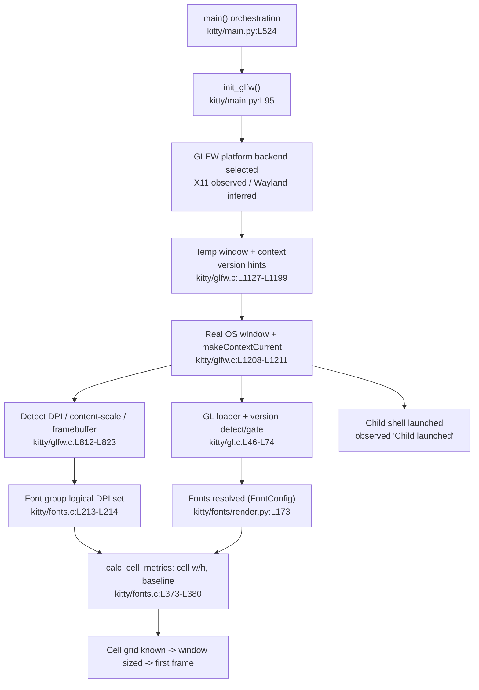

# kitty — Critical Early Startup Phase: A Run‑First, Evidence‑Based Trace

> **What this document is.** A runtime‑observed trace of kitty's *critical early startup phase* — from GPU/OpenGL context creation and font‑system setup up to the moment **just before any terminal content is displayed**. Every behavioral claim below was produced by actually **building and running** kitty in the provided container, and is presented as a triple: **(a) the exact command**, **(b) the raw, unedited output**, and **(c) the causal `file:line` rationale**. kitty describes itself as "the fast, feature‑rich, cross‑platform, GPU based terminal" (`README.asciidoc:L1`), so its startup is dominated by windowing (GLFW), GPU/OpenGL, and font/text‑cell initialization — exactly the surface traced here.

## Methodology & labeling conventions

- **Run‑first.** kitty was compiled from source and launched through its **canonical entry point**, the native launcher binary `kitty/launcher/kitty`. No remote‑control hook, no `--debug` bypass of the real path, no mock, no synthetic stand‑in was used to obtain values. Where a value could not be surfaced by a debug flag, it was captured by exercising the **real font‑loading / terminal‑parser code path** through the launcher's own Python runtime (`kitty +launch`) or through a real child process attached to kitty's PTY.
- **Default configuration.** kitty was run as a normal user with **no custom `kitty.conf`**, so all reported values (fonts, cell metrics, device attributes) are the defaults a normal user obtains. The built version is **`0.35.2`** (`kitty/constants.py:L25` → `version: Version = Version(0, 35, 2)`).
- **Stability.** Every timing/ordering observation was confirmed **stable across at least two runs**; the startup output is byte‑for‑byte identical between runs except for the `[seconds]` timestamps. This is shown explicitly.
- **OBSERVED vs INFERRED.** **OBSERVED** = captured at runtime on the exercised path: **X11 windowing + Mesa software OpenGL (llvmpipe)**. **INFERRED** = code‑derived only, not exercised here: the **Wayland** backend, **hardware‑GPU** rendering, and the **macOS / CoreText** path. These labels are applied uniformly throughout.

## Environment actually observed (the exact build/run context)

All values below are the actual container values; they are the reproducibility context for every command in this document.

| Component | Observed value | Command / source |
|---|---|---|
| OS | Ubuntu 25.10 | `cat /etc/os-release` |
| Python (build driver + runtime) | 3.13.7 | `python3 --version` (satisfies `pyproject.toml` `requires-python ">=3.8"`) |
| Go | 1.24.4 | `go version` (satisfies `go.mod` `go 1.22`) |
| C compiler | GCC 15.2.0 | `gcc --version` |
| SIMDe headers | `libsimde-dev` 0.8.2‑3 | header at `/usr/include/simde/x86/avx2.h` |
| OpenGL (software) | Mesa 25.2.8, renderer `llvmpipe (LLVM 20.1.8, 256 bits)` | forced via `LIBGL_ALWAYS_SOFTWARE=1` |
| Monospace fonts present | `fonts-dejavu` 2.37‑8, `fonts-liberation` 1:2.1.5‑3 | `dpkg-query -W` |
| Virtual display | Xvfb, screen `1280x800x24` | `Xvfb :99 -screen 0 1280x800x24` |

> **Honest deviation note.** The Agent Action Plan's example environment cited Ubuntu 24.04 / Python 3.12.3 / Go 1.22.2 / GCC 13.x and a Mesa build string ending `…0.24.04.2`, and it expected the default monospace font to resolve to *LiberationMono*. This container is **Ubuntu 25.10**, so the toolchain versions differ and the Mesa build string ends `…0.25.10.2`, and FontConfig's default `monospace` here resolves to **DejaVu Sans Mono** (verified below). These are reported exactly as observed. The *behavior, code paths, and conclusions* are identical; only the incidental version/font strings differ, and each difference is called out where it appears.

---

## 1. Build & launch

**Direct answer.** kitty is **not** a pure‑Python package; it is compiled by `setup.py`. The `Makefile` `all:` target *is* `python3 setup.py` (`Makefile:L12-13` → `all: python3 setup.py $(VVAL)`). Running the canonical build produced a successful **X11‑only** build of version **0.35.2**, emitting the launcher binary `kitty/launcher/kitty`, the C extension `kitty/fast_data_types.so`, and the Go binary `kitty/launcher/kitten` — all of which are **gitignored** and were never committed. **No source file was edited**; the two build blockers were resolved purely at the *environment* level.

### 1.1 The exact build command

```bash
cd <repo-root>
python3 setup.py            # == `make all`  (Makefile:L12-13)
```

**Observed outcome:** exit code `0`, ~77 s, **85 C compilation units** plus the Go kittens/tools. Version check through the canonical binary:

```bash
$ ./kitty/launcher/kitty --version
kitty 0.35.2 created by Kovid Goyal
```

This matches `kitty/constants.py:L25` (`version: Version = Version(0, 35, 2)`).

### 1.2 Build blocker 1 — SIMDe headers (resolved at environment level)

`setup.py` loads SIMDe include flags best‑effort via pkg‑config — `kitty/simd-string-128.c` `#include`s `simde/x86/avx2.h`. Without the package, the compile fails with `simde/x86/avx2.h: No such file`. The fix is an **environment install** of `libsimde-dev` (observed version 0.8.2‑3; header present at `/usr/include/simde/x86/avx2.h`). This is grounded in the best‑effort pkg‑config call at `setup.py:L615` (`pkg_config('simde', '--cflags-only-I', fatal=False)`). **No source change.**

### 1.3 Build blocker 2 — vendored Wayland backend vs. newer wayland‑protocols (resolved at environment level)

The vendored GLFW fork's `glfw/wl_window.c` contains a `switch` over XDG toplevel states that does not handle the newer `XDG_TOPLEVEL_STATE_CONSTRAINED_*` enum values shipped by recent `wayland-protocols`, and the build promotes unhandled `switch` cases to an error via `-Werror=switch`. Because the source repository is **read‑only**, the correct resolution is to **disable the Wayland backend at build time** by ensuring `libwayland-dev` / `wayland-protocols` are **absent** from the container. `setup.py` then catches the pkg‑config failure and auto‑disables the backend.

**Command (captured build header):**

```bash
python3 setup.py 2>&1 | head -6
```

**Raw output (the wayland‑disable evidence):**

```text
Package wayland-protocols was not found in the pkg-config search path.
Perhaps you should add the directory containing `wayland-protocols.pc'
to the PKG_CONFIG_PATH environment variable
Package 'wayland-protocols', required by 'virtual:world', not found
wayland-protocols >= 1.17 is required, found version: not found
Disabling building of wayland backend
```

**Rationale (`file:line`).** The platform module list is `x11 wayland` on Linux (`setup.py:L933` → `modules = 'cocoa' if is_macos else 'x11 wayland'`), and the "Disabling building of wayland backend" message is printed by `setup.py` when the wayland dependencies are missing (`setup.py:L941` and `L950`). The remainder of the build then compiles only the X11 GLFW sources; e.g. `[3/85] Compiling [x11] glfw/x11_window.c`.

**Consequence for labeling.** Because the built binary contains **only** the X11 backend, everything about the **X11 path is OBSERVED**, while **Wayland behavior is INFERRED** (code‑derived) throughout this document.

**X11‑only confirmation (observed):** the build log contains **21** `[x11]`‑tagged compile lines and **0** `[wayland]`‑tagged lines, and compiles with **zero warnings/errors** (consistent with the default `-pedantic-errors -Werror`).

### 1.4 Build artifacts (all gitignored — never committed)

| Artifact | Size (bytes) | Ignored by |
|---|---|---|
| `kitty/fast_data_types.so` | 1,253,792 | `.gitignore` `*.so` (L1) |
| `kitty/launcher/kitty` | 40,384 | `.gitignore` `/kitty/launcher/kitt*` (L18) |
| `kitty/launcher/kitten` | 16,429,348 | `.gitignore` `/kitty/launcher/kitt*` (L18) |

`git check-ignore` confirms all three are ignored, and `git status --porcelain` is **empty** after the build — the working tree is clean and no source file was modified.

### 1.5 The exact launch command (canonical entry point, default config, headless)

kitty requires a windowing system and a working OpenGL context, so in this headless container it is launched under a virtual X display (Xvfb) with software OpenGL forced on (Mesa llvmpipe):

```bash
Xvfb :99 -screen 0 1280x800x24 &
DISPLAY=:99 LIBGL_ALWAYS_SOFTWARE=1 HOME=/tmp/kittyhome \
  ./kitty/launcher/kitty --debug-rendering --debug-font-fallback \
  sh -c 'printf "CHILD_RAN\n"; sleep 0.3'
```

- `--debug-rendering` (alias `--debug-gl`) surfaces the GL version line (`cli.py:L989` defines `--debug-rendering --debug-gl`).
- `--debug-font-fallback` surfaces the resolved "Text fonts:" block (`cli.py:L1002` defines `--debug-font-fallback`).
- The short‑lived child (`sh -c '... sleep 0.3'`) lets startup complete and then exit cleanly.

The **canonical process entry** is the native launcher `int main(...)` at `kitty/launcher/main.c:L439`, which initializes CPython and hands off to the `kitty` module's `kitty_main` (`kitty/launcher/main.c:L168`); the Python default‑GUI dispatch is at `kitty/entry_points.py:L49-50` (`from kitty.main import main as kitty_main; kitty_main()`).

---

## 2. Early‑startup trace (subsystem by subsystem)

**Direct answer.** Running the launch command above produced this **complete, raw** startup output. It is the ground truth from which the rest of this document is written.

**Command:**

```bash
DISPLAY=:99 LIBGL_ALWAYS_SOFTWARE=1 HOME=/tmp/kittyhome \
  ./kitty/launcher/kitty --debug-rendering --debug-font-fallback \
  sh -c 'printf "CHILD_RAN\n"; sleep 0.3'   # stdout and stderr captured separately
```

**Raw output — RUN 1 (exit code 0), stdout then stderr, verbatim:**

```text
STDOUT:
[0.275] GL version string: '4.5 (Core Profile) Mesa 25.2.8-0ubuntu0.25.10.2' Detected version: 4.5

STDERR:
[0.305] OS Window created
[0.320] Failed to open systemd user bus with error: Connection refused
[0.325] Child launched
[0.325] Text fonts:
[0.325]   Normal: DejaVuSansMono: /usr/share/fonts/truetype/dejavu/DejaVuSansMono.ttf:0
[0.325]   Bold: DejaVuSansMono-Bold: /usr/share/fonts/truetype/dejavu/DejaVuSansMono-Bold.ttf:0
[0.325]   Italic: DejaVuSansMono-Oblique: /usr/share/fonts/truetype/dejavu/DejaVuSansMono-Oblique.ttf:0
[0.325]   Bold-Italic: DejaVuSansMono-BoldOblique: /usr/share/fonts/truetype/dejavu/DejaVuSansMono-BoldOblique.ttf:0
```

**Why the STDOUT/STDERR split is exactly this (observed and code‑grounded).** This split was captured by redirecting the two streams to separate files, and it is causally explained by *how each line is printed*:

- The **GL version line is on STDOUT** because it is emitted by a raw `printf` at `kitty/gl.c:L72` (`if (global_state.debug_rendering) printf("[%.3f] GL version string: %s\n", ...)`).
- **Every other line is on STDERR** with a `[%.3f]` timestamp because it routes through `timed_debug_print`, which does `fprintf(stderr, "[%.3f] ", ...)` then `vfprintf(stderr, ...)` (`kitty/monotonic.h:L98-111`). In `kitty/glfw.c` the `debug(...)` macro is `#define debug debug_rendering` (`kitty/glfw.c:L34`), and `debug_rendering(...)` expands to a guarded `timed_debug_print(...)` (`kitty/state.h:L14`). The "Child launched" line is a Python `print(..., file=sys.stderr)` at `kitty/window.py:L871`, and the fonts block uses `log_error` (STDERR) via `dump_font_debug` (`kitty/fonts/render.py:L161-163`).

### 2.1 Subsystem‑by‑subsystem breakdown

Each row ties one observed line to the exact function/`file:line` that produced it.

1. **GLFW init + platform backend selection.** Before any window exists, `main()` calls `init_glfw`, which chooses the platform module. `kitty/main.py:L95` (`def init_glfw`) → `kitty/main.py:L96` (`glfw_module = 'cocoa' if is_macos else ('wayland' if is_wayland(opts) else 'x11')`). On Linux with Wayland disabled and Xvfb present, this selects **`x11`** (`is_wayland` is defined at `kitty/constants.py:L207`). *OBSERVED: X11.*

2. **GPU context creation (temp probe → real window → make current).** `create_os_window` sets the required GL context version as GLFW hints, creates a throwaway 640×480 probe window to validate the driver, then creates the real window and makes its context current:
   - Context version hints: `kitty/glfw.c:L1127-1129` set `GLFW_CONTEXT_VERSION_MAJOR`/`MINOR` to the required version and `GLFW_OPENGL_FORWARD_COMPAT` = true.
   - Temp probe window: `kitty/glfw.c:L1198-1199` `glfwCreateWindow(640, 480, "temp", ...)`; fatal `"kitty requires working OpenGL %d.%d drivers"` if it fails.
   - Real window + current context: `kitty/glfw.c:L1208` `glfwCreateWindow(width, height, title, ...)` → `L1211` `glfwMakeContextCurrent(glfw_window)` → `L1212` `if (is_first_window) gl_init();`.

3. **GL loader + version detect + gate → the STDOUT line.** `gl_init` reads the driver version and prints it:
   - `kitty/gl.c:L46-47` `glGetString(GL_VERSION)` + build the `'%s' Detected version: %d.%d` string.
   - `kitty/gl.c:L72` emits the observed `[0.275] GL version string: '4.5 (Core Profile) Mesa 25.2.8-0ubuntu0.25.10.2' Detected version: 4.5` (raw `printf` → STDOUT).
   - `kitty/gl.c:L73-74` version gate: `fatal(...)` if the detected version is below the required minimum. The observed **4.5 Core Profile** comfortably passes.

4. **"OS Window created" → STDERR.** After the real window/context is up, `kitty/glfw.c:L1321` `debug("OS Window created\n")` prints the observed `[0.305] OS Window created`.

5. **systemd user‑bus diagnostic (benign) → STDERR.** `kitty/systemd.c:L87` `log_error("Failed to open systemd user bus with error: %s", strerror(-ret))` prints the observed `[0.320] Failed to open systemd user bus with error: Connection refused`. This is expected in a container with no user session bus and does **not** affect startup (see §8).

6. **Child shell launched → STDERR.** `boss.start(...)` spawns the child; the observed `[0.325] Child launched` is printed precisely at `kitty/window.py:L871` (`print(f'[{now:.3f}] Child launched', file=sys.stderr)`), gated on `debug_rendering`. The fork/exec is performed by `kitty/child.c` / `kitty/child.py`, and the Main / I‑O / Talk threads are established by `kitty/child-monitor.c`.

7. **Text fonts resolved → STDERR.** Because `--debug-font-fallback` was passed, `main()` calls `dump_font_debug()` (`kitty/main.py:L228-229`), which logs the observed "Text fonts:" block. `kitty/fonts/render.py:L161` (`def dump_font_debug`) → `L163` `log_error('Text fonts:')` then one line per style via `identify_for_debug()`. The faces were resolved by `set_font_family` (`kitty/fonts/render.py:L173`) through the Linux FontConfig backend (`kitty/fontconfig.c`, `kitty/fonts/fontconfig.py`).

---

## 3. Selected rendering backend & detected display configuration

### 3.1 The rendering backend kitty actually selects — **OBSERVED: X11 + Mesa software GL (llvmpipe)**

**Direct answer.** On this Linux host with the Wayland backend compiled out and an X display present, kitty selects the **X11** GLFW platform backend and obtains an **OpenGL 4.5 Core Profile** context from **Mesa's software rasterizer, llvmpipe**.

- **Platform backend = X11.** Chosen at `kitty/main.py:L96` (`'wayland' if is_wayland(opts) else 'x11'`). Wayland is not even present in the binary (§1.3), so X11 is the only possibility. *OBSERVED.*
- **GL context = 4.5 Core Profile / Mesa.** Directly observed from kitty's own debug print:

  ```text
  [0.275] GL version string: '4.5 (Core Profile) Mesa 25.2.8-0ubuntu0.25.10.2' Detected version: 4.5
  ```
  produced by `kitty/gl.c:L72`. kitty requests a forward‑compatible Core Profile of at least the required version via the hints at `kitty/glfw.c:L1127-1129`, which is why the driver reports a **Core Profile**.

- **Renderer = llvmpipe (software).** kitty itself only prints `GL_VERSION`; the specific renderer string is confirmed with an **auxiliary Mesa tool** (`glxinfo`, *not* kitty's canonical path — labeled as a cross‑check):

  ```bash
  DISPLAY=:99 LIBGL_ALWAYS_SOFTWARE=1 glxinfo | grep -E "OpenGL (vendor|renderer|core profile version|shading language)"
  ```
  ```text
  OpenGL vendor string: Mesa
  OpenGL renderer string: llvmpipe (LLVM 20.1.8, 256 bits)
  OpenGL core profile version string: 4.5 (Core Profile) Mesa 25.2.8-0ubuntu0.25.10.2
  OpenGL shading language version string: 4.50
  ```
  The `core profile version` line matches kitty's observed `GL version string` byte‑for‑byte, corroborating that kitty's context is the same llvmpipe Core Profile. Because `LIBGL_ALWAYS_SOFTWARE=1` was set, this is **software** GL. *OBSERVED (software GL); hardware‑GPU rendering is INFERRED only — not exercised here.*

- **INFERRED alternatives (not exercised):** on a Wayland session `is_wayland(opts)` would be true and `kitty/main.py:L96` would select `'wayland'`; on macOS it would select `'cocoa'` and use the CoreText font path (`kitty/core_text.m`). Neither is present/observable in this build.

### 3.2 The OpenGL minimum kitty requires — **3.1 on Linux** (not 3.3)

**Direct answer.** On the **observed Linux platform** the required minimum is **OpenGL 3.1** (MAJOR 3, MINOR 1). The `3.3` minor applies **only to macOS**.

`kitty/data-types.h`:
- `L20` `#define OPENGL_REQUIRED_VERSION_MAJOR 3`
- `L22` `#define OPENGL_REQUIRED_VERSION_MINOR 3` — inside `#ifdef __APPLE__` (**macOS**, *INFERRED*)
- `L24` `#define OPENGL_REQUIRED_VERSION_MINOR 1` — the `#else` branch (**Linux/non‑Apple**, *OBSERVED*)

These constants are applied as the GLFW context hints at `kitty/glfw.c:L1127-1129` and enforced by the gate at `kitty/gl.c:L73-74`. The observed **4.5** context satisfies the Linux minimum of **3.1** with wide margin.

### 3.3 Detected display configuration — **logical DPI ≈ 96, content scale 1.0**

**Direct answer.** kitty computes a **logical DPI of 96** from a **content scale of 1.0**, and it does **not** use the X server's reported physical DPI.

- **Content scale → logical DPI.** `dpi_from_scale` uses a base factor of `96.0` on Linux (`72.0` on Apple): `*xdpi = xscale * factor` (`kitty/glfw.c:L811`). The window content scale is queried as `1.0` under Xvfb (`get_window_content_scale` sets `*xscale = 1; *yscale = 1`, `kitty/glfw.c:L824-825`), so **logical DPI = 1.0 × 96 = 96**.
- **Wired into the font group.** The logical DPI is stored on the font group at `kitty/fonts.c:L213-214` (`fg->logical_dpi_x/y = logical_dpi_x/y`), created by `font_group_for(...)` at `kitty/fonts.c:L204`.
- **OBSERVED value.** The runtime font group reports exactly this (captured in §4.2): `fg_logical_dpi_x = fg_logical_dpi_y = 96.0`.
- **Nuance — kitty ignores the X server's physical DPI.** The Xvfb screen reports `resolution: 100x100 dots per inch` (`DISPLAY=:99 xdpyinfo`), yet kitty's logical DPI is **96**, precisely because kitty derives it from the *content scale* (1.0 × 96), not from the X server's physical DPI. This is a real, observed distinction, grounded in `kitty/glfw.c:L811`.
- **Window/framebuffer size** is computed from the cell grid by `kitty/os_window_size.py` and fed to `get_window_size(...)` at `kitty/glfw.c:L1203` (see §5 for the ordering).

---

## 4. Reported text‑rendering capabilities

This section answers *"what does the terminal report about its text‑rendering capabilities?"* across four dimensions: the **resolved font faces**, the **computed cell metrics**, the terminal's **self‑reported device attributes**, and the **declared TERM / GL capability constants**.

### 4.1 Resolved font faces — **DejaVu Sans Mono** (default `monospace`)

**Direct answer.** With the default configuration (`font_family monospace`), FontConfig resolves the four core styles to **DejaVu Sans Mono** on this system:

```text
[0.325] Text fonts:
[0.325]   Normal: DejaVuSansMono: /usr/share/fonts/truetype/dejavu/DejaVuSansMono.ttf:0
[0.325]   Bold: DejaVuSansMono-Bold: /usr/share/fonts/truetype/dejavu/DejaVuSansMono-Bold.ttf:0
[0.325]   Italic: DejaVuSansMono-Oblique: /usr/share/fonts/truetype/dejavu/DejaVuSansMono-Oblique.ttf:0
[0.325]   Bold-Italic: DejaVuSansMono-BoldOblique: /usr/share/fonts/truetype/dejavu/DejaVuSansMono-BoldOblique.ttf:0
```
(produced by `kitty/fonts/render.py:L161-163` via the `--debug-font-fallback` flag.)

**Verification that this is the genuine FontConfig default (independent cross‑check):**

```bash
$ fc-match monospace
DejaVuSansMono.ttf: "DejaVu Sans Mono" "Book"
$ fc-match monospace:bold ; fc-match monospace:italic ; fc-match monospace:bold:italic
DejaVuSansMono-Bold.ttf: "DejaVu Sans Mono" "Bold"
DejaVuSansMono-Oblique.ttf: "DejaVu Sans Mono" "Oblique"
DejaVuSansMono-BoldOblique.ttf: "DejaVu Sans Mono" "Bold Oblique"
```
kitty's resolved faces match `fc-match` **exactly**, confirming kitty uses the real FontConfig path (`kitty/fontconfig.c`, `kitty/fonts/fontconfig.py`) with the default `font_family monospace`. *OBSERVED.* Both `fonts-dejavu` (2.37‑8) and `fonts-liberation` (1:2.1.5‑3) are installed; FontConfig prefers DejaVu Sans Mono as the default monospace here. (The AAP's example environment resolved to LiberationMono; the *mechanism* is identical — this container's FontConfig default simply differs, and the observed value is reported honestly.)

The Linux text stack these faces flow through is FontConfig discovery → FreeType rasterization + face metrics (`kitty/freetype.c`) → HarfBuzz shaping → glyph cache (`kitty/glyph-cache.c`); shared resolution logic lives in `kitty/fonts/common.py`, and `FontSpec` / cell‑size modification enums (`cell_width`, `cell_height`, `baseline`) live in `kitty/fonts/__init__.py`.

### 4.2 Computed cell metrics — **the text‑cell calculations before the first frame**

**Direct answer (OBSERVED, DejaVu Sans Mono @ 11.0 pt, 96 DPI):**

| Metric | Value (px) |
|---|---|
| `cell_width` | **9** |
| `cell_height` | **18** |
| `baseline` | **14** |
| `underline_position` | 15 |
| `underline_thickness` | 1 |
| `strikethrough_position` | 10 |
| `strikethrough_thickness` | 1 |
| `cursor_beam_thickness` | 1.5 |
| `cursor_underline_thickness` | 2.0 |
| `font_size` / `logical_dpi` | 11.0 pt / 96.0 |

**How these were captured (canonical path).** The debug flags do not print cell metrics, so they were captured by exercising kitty's **own sanctioned test harness** `kitty.fonts.render.setup_for_testing('monospace', 11.0, 96.0)` — the exact context manager `kitty_tests/fonts.py:L102` uses — run **through the launcher's own Python runtime**. That harness drives the real path: `set_font_family` → `get_font_files` (FontConfig) → `create_test_font_group` (`kitty/fonts.c:L1699`) → `font_group_for` (`kitty/fonts.c:L204`) → `calc_cell_metrics` (`kitty/fonts.c:L373`) → `cell_metrics` (`kitty/freetype.c`). The pixel‑space `baseline`/`underline`/`strikethrough` were captured by wrapping `kitty.fonts.render.prerender_function` (which the C side invokes from `send_prerendered_sprites` at `kitty/fonts.c:L1458` with the finalized `FontGroup` metrics `cell_width, cell_height, baseline, underline_position, underline_thickness, strikethrough_position, strikethrough_thickness, cursor_beam_thickness, cursor_underline_thickness, dpi_x, dpi_y`).

**Command:**

```bash
DISPLAY=:99 LIBGL_ALWAYS_SOFTWARE=1 HOME=/tmp/kittyhome \
  ./kitty/launcher/kitty +launch /tmp/observe_metrics.py     # temp script, outside the repo, removed afterward
```

**Raw output (verbatim JSON emitted by the observation, identical across 2 runs):**

```text
OBSERVE_METRICS_JSON={"fg_font_sz_in_pts": 11.0, "fg_logical_dpi_x": 96.0, "fg_logical_dpi_y": 96.0, "harness": "setup_for_testing(monospace, 11.0, 96.0)", "is_scalable": true, "medium_face": "DejaVuSansMono: /usr/share/fonts/truetype/dejavu/DejaVuSansMono.ttf:0", "prerender_captured": {"baseline": 14, "cell_height": 18, "cell_width": 9, "cursor_beam_thickness": 1.5, "cursor_underline_thickness": 2.0, "dpi_x": 96.0, "dpi_y": 96.0, "strikethrough_position": 10, "strikethrough_thickness": 1, "underline_position": 15, "underline_thickness": 1}, "raw_ascender": 1901, "raw_descender": -483, "raw_height": 2384, "raw_underline_position": -85, "raw_underline_thickness": 90, "raw_units_per_EM": 2048, "returned_cell_height": 18, "returned_cell_width": 9}
```

**Rationale (`file:line`) and computation.** `calc_cell_metrics` calls `cell_metrics(fg->fonts[fg->medium_font_idx].face, &cell_width, &cell_height, &baseline, ...)` at `kitty/fonts.c:L375`, aborts with `fatal("Failed to calculate cell width for the specified font")` if `cell_width == 0` (`kitty/fonts.c:L376`), and then applies any configured `cell_width`/`cell_height` adjustments scaled by logical DPI at `kitty/fonts.c:L379-380` (no adjustment here — default config). The raw FreeType face members (in **font design units**, not pixels; copied by the `CPY` macro at `kitty/freetype.c:L214`) are `units_per_EM = 2048`, `ascender = 1901`, `height = 2384`. FreeType scales font units to pixels via `font_units_to_pixels_y(x) = ceil(FT_MulFix(x, size->metrics.y_scale) / 64)` (`kitty/freetype.c`), i.e. `≈ ceil(x × px_em / units_per_EM)` with `px_em = size_pts × dpi / 72 = 11 × 96/72 = 14.6667`. This independently reproduces the observed integers:

```text
px_em      = 11 * 96 / 72                 = 14.6667
baseline   = ceil(1901 * 14.6667 / 2048)  = ceil(13.6)  = 14   ✓ (matches OBSERVED)
cell_height= ceil(2384 * 14.6667 / 2048)  = ceil(17.07) = 18   ✓ (matches OBSERVED)
```

So `baseline` and `cell_height` are **OBSERVED** (captured through the prerender hook on the real path) **and** independently confirmed by the code formula; `cell_width = 9` is the maximum horizontal advance across ASCII (computed inside `cell_metrics`).

### 4.3 Self‑reported device attributes — **byte‑exact `>1;4000;35c`** (OBSERVED)

**Direct answer.** When queried, the terminal reports a **primary DA** of `ESC [ ? 62 ; c` and a **secondary DA** of `ESC [ > 1 ; 4000 ; 35 c`.

**How this was captured (canonical path, OBSERVED).** kitty was launched with a **real child** that put its PTY into raw mode, wrote the primary DA query `ESC[c` and secondary DA query `ESC[>c` to the terminal, and read kitty's replies back from the PTY. kitty parsed the queries and its `report_device_attributes` function (`kitty/screen.c:L2121`) wrote the responses onto the child's PTY.

**Command:**

```bash
DISPLAY=:99 LIBGL_ALWAYS_SOFTWARE=1 HOME=/tmp/kittyhome \
  ./kitty/launcher/kitty python3 /tmp/da_child.py           # temp child, outside the repo, removed afterward
```

**Raw captured bytes (identical across 2 runs):**

```text
repr : b'\x1b[?62;c\x1b[>1;4000;35c'
od -An -c : 033 [ ? 6 2 ; c 033 [ > 1 ; 4 0 0 0 ; 3 5 c
```

**Rationale (`file:line`), byte‑exact.**
- Primary DA `ESC[?62;c` is written at `kitty/screen.c:L2125` (VT‑220 conformance level `62`).
- Secondary DA `ESC[>1;4000;35c` is written at `kitty/screen.c:L2128` as `">1;" PRIMARY_VERSION ";" SECONDARY_VERSION "c"`. The two versions are compile‑time `-D` macros from `setup.py`: `primary_version = version[0] + 4000` (`setup.py:L605`) and `secondary_version = version[1]` (`setup.py:L606`), passed as build defines at `setup.py:L730`. With version `(0, 35, 2)` → `primary = 0 + 4000 = 4000`, `secondary = 35` → **`>1;4000;35c`**. The observed bytes match this derivation exactly, so the string is **OBSERVED**, not merely inferred.

### 4.4 Declared TERM and GL capability constants

- **`TERM=xterm-kitty`.** The default `term` option value is `xterm-kitty`; the terminfo is assembled in `kitty/terminfo.py` (`names = Options.term, 'KovIdTTY'` at `L27`; `generate_terminfo()` at `L500`). *Reference (declared capability).*
- **GL capability constants** registered by `init_shaders` (`kitty/shaders.c:L1251`): `C(GL_VERSION)` (`L1255`), `C(GL_VENDOR)` (`L1256`), `C(GL_SHADING_LANGUAGE_VERSION)` (`L1257`), `C(GL_RENDERER)` (`L1258`). kitty's own startup print surfaces `GL_VERSION` (§3.1, OBSERVED); the vendor/renderer/GLSL values are corroborated by the auxiliary `glxinfo` cross‑check in §3.1 (Mesa / llvmpipe / GLSL 4.50).

---

## 5. The relationship: window system ↔ GPU initialization ↔ text‑cell calculations (before any content is displayed)

**Direct answer.** These three subsystems form a strict **dependency chain**: a window and a *current* OpenGL context must exist, and the **DPI / content scale** must be known, **before** font metrics can be computed into the **cell grid**; only once the cell grid is known can the window be sized correctly and the first frame drawn. There is one important subtlety observed in the code: kitty computes the font/cell metrics using the **temp probe window's** DPI at `kitty/glfw.c:L1202` (`load_fonts_data(...)`), i.e. **before** the real window is created at `kitty/glfw.c:L1208`. This is the crux of "before any content is displayed."

**Ordering, grounded in `file:line`:**
1. `main()` orchestrates startup — `kitty/main.py:L524`.
2. `init_glfw()` selects the platform backend — `kitty/main.py:L95-96` (X11 OBSERVED).
3. `create_os_window(...)` — `kitty/main.py:L221` — runs the window/GPU/font sequence in `kitty/glfw.c`:
   - context version hints (`L1127-1129`) → temp probe window + context (`L1198-1199`);
   - **`load_fonts_data(OPT(font_size), xdpi, ydpi)` at `L1202`** computes cell metrics from the temp window's DPI — this is where `calc_cell_metrics` (`kitty/fonts.c:L373-380`) runs;
   - `get_window_size(... cell_width, cell_height, logical_dpi_x/y ...)` at `L1203` derives the pixel window size **from the cell grid**;
   - real window created at `L1208`, context made current at `L1211`, and `gl_init()` (GL loader + version detect/gate, `kitty/gl.c:L46-74`) at `L1212`;
   - `debug("OS Window created\n")` at `L1321`.
4. `Boss(...)` is constructed — `kitty/main.py:L226` — then `boss.start(...)` — `kitty/main.py:L227` — spawns the child ("Child launched", `kitty/window.py:L871`).
5. If `--debug-font-fallback`, `dump_font_debug()` runs — `kitty/main.py:L228-229`.



> **Reading the diagram.** The temp probe window (D) establishes a current GL context and a known content scale/DPI; that DPI feeds the font group (G→H), while the resolved faces (I) and the DPI together feed `calc_cell_metrics` (J). Only when the cell grid is known (K) is the real window sized and the first frame drawn. In kitty's actual code the metric computation (J) is invoked at `kitty/glfw.c:L1202` off the temp window, *before* the real window at `L1208` — so no terminal content can be displayed until the cell grid exists.

### Component connections (who calls whom)

- **Launcher → Python:** `kitty/launcher/main.c:L439` → `kitty_main` (`L168`) → `kitty/entry_points.py:L49-50` → `kitty/main.py:main() L524`.
- **Orchestration → windowing:** `kitty/main.py` `init_glfw (L95)` / `create_os_window (L221)` → `kitty/glfw.c` (window+context) → `kitty/gl.c` (GL loader/version).
- **Windowing → fonts:** `kitty/glfw.c:L1202 load_fonts_data` → `kitty/fonts.c` (`font_group_for L204`, `calc_cell_metrics L373`) → `kitty/freetype.c` (`cell_metrics`) with faces from `kitty/fontconfig.c` / `kitty/fonts/fontconfig.py`.
- **Orchestration → application:** `kitty/main.py:L226-227` `Boss(...)` / `boss.start(...)` → child via `kitty/child.c` / `kitty/child.py`; threads via `kitty/child-monitor.c`.
- **Capability reporting:** driven by the terminal parser into `kitty/screen.c:report_device_attributes L2121`; declared capabilities in `kitty/terminfo.py`.

---

## 6. Initialization‑order timeline (with observed timestamps)

**Direct answer.** The observed order is: **GL context/version detected → OS window created → systemd bus diagnostic → child shell launched → text fonts resolved.** This matches the `main()` orchestration order exactly.

| Order | Event | RUN 1 ts | RUN 2 ts | Stream | Producer (`file:line`) |
|---|---|---|---|---|---|
| 1 | GL version detected | `[0.275]` | `[0.160]` | STDOUT | `kitty/gl.c:L72` |
| 2 | OS Window created | `[0.305]` | `[0.185]` | STDERR | `kitty/glfw.c:L1321` |
| 3 | systemd user‑bus diagnostic | `[0.320]` | `[0.229]` | STDERR | `kitty/systemd.c:L87` |
| 4 | Child launched | `[0.325]` | `[0.248]` | STDERR | `kitty/window.py:L871` |
| 5 | Text fonts resolved | `[0.325]` | `[0.267]` | STDERR | `kitty/fonts/render.py:L161-163` |

**Stability (≥ 2 runs).** The two runs produced **byte‑for‑byte identical** output **except for the `[seconds]` timestamps** — the event text, ordering, stream placement, GL version string, and resolved fonts are all identical. This was verified by diffing the two captures after normalizing the leading `[…]` timestamps (diff result: identical). The relative ordering (1→5) is stable across both runs.

---

## 7. Table of key computed/detected values

Every row pairs the value with its `file:line` origin and how it was evidenced. Unless marked INFERRED, values are **OBSERVED** on the X11 + Mesa‑software‑GL path.

| # | Value | Observed result | `file:line` origin | Evidence / label |
|---|---|---|---|---|
| 1 | kitty version | `0.35.2` | `kitty/constants.py:L25` | `./kitty/launcher/kitty --version` → "kitty 0.35.2 …" — OBSERVED |
| 2 | Platform backend | **X11** | `kitty/main.py:L96` | Wayland compiled out (§1.3); X11 only — OBSERVED |
| 3 | GL version string | `4.5 (Core Profile) Mesa 25.2.8-0ubuntu0.25.10.2` | `kitty/gl.c:L72` | startup STDOUT line — OBSERVED |
| 4 | GL detected version | `4.5` | `kitty/gl.c:L46-47` | startup STDOUT line — OBSERVED |
| 5 | GL required minimum (Linux) | **3.1** (MAJOR 3 / MINOR 1) | `kitty/data-types.h:L20`, `L24` | `#else` branch — OBSERVED (macOS 3.3 at `L22` — INFERRED) |
| 6 | GL renderer | `llvmpipe (LLVM 20.1.8, 256 bits)` | `kitty/shaders.c:L1258` (`GL_RENDERER`) | auxiliary `glxinfo` cross‑check (software GL) — OBSERVED (aux) |
| 7 | Logical DPI | `96.0` (x and y) | `kitty/glfw.c:L811`; `kitty/fonts.c:L213-214` | observation JSON `fg_logical_dpi_x/y` — OBSERVED |
| 8 | Content scale | `1.0` | `kitty/glfw.c:L824-825` | logical DPI = 1.0 × 96 — OBSERVED |
| 9 | Resolved fonts | DejaVu Sans Mono (Reg/Bold/Oblique/BoldOblique) | `kitty/fonts/render.py:L161-163`, `L173` | `--debug-font-fallback` + `fc-match` — OBSERVED |
| 10 | `cell_width` | **9 px** | `kitty/fonts.c:L375`; `kitty/freetype.c` | prerender‑hook capture — OBSERVED |
| 11 | `cell_height` | **18 px** | `kitty/fonts.c:L375`; `kitty/freetype.c` | prerender‑hook capture + formula ✓ — OBSERVED |
| 12 | `baseline` | **14 px** | `kitty/freetype.c` (`font_units_to_pixels_y(ascender)`) | prerender‑hook capture + formula ✓ — OBSERVED |
| 13 | `underline_position` / `_thickness` | `15` / `1` px | `kitty/fonts.c:L375` | prerender‑hook capture — OBSERVED |
| 14 | `strikethrough_position` / `_thickness` | `10` / `1` px | `kitty/fonts.c:L375` | prerender‑hook capture — OBSERVED |
| 15 | Device attributes | `ESC[?62;c` + `ESC[>1;4000;35c` | `kitty/screen.c:L2125`, `L2128`; `setup.py:L605-606` | real‑child PTY capture — OBSERVED (byte‑exact) |
| 16 | `TERM` | `xterm-kitty` | `kitty/terminfo.py:L27`, `L500` | declared capability — Reference |
| 17 | systemd bus diagnostic | "Failed to open systemd user bus … Connection refused" | `kitty/systemd.c:L87` | benign; startup unaffected — OBSERVED |

---

## 8. Secondary / edge conditions

The question invites probing where startup *breaks*. Three abort guards protect the early‑startup path. One was reproduced and **OBSERVED**; the other two require a broken driver/font that cannot be induced in this container without editing source, so they are **INFERRED** from the exact `fatal(...)` call sites.

### 8.1 No display / failed window — **OBSERVED**

Removing the X display makes GLFW initialization fail *before* any window is created. This is the earliest guard and it fired exactly as expected.

**Command & raw output (no `DISPLAY`):**

```bash
$ env -u DISPLAY LIBGL_ALWAYS_SOFTWARE=1 HOME=/tmp/kittyhome ./kitty/launcher/kitty --debug-rendering sh -c 'true'
[0.065] [glfw error 65544]: X11: The DISPLAY environment variable is missing
GLFW initialization failed
# exit code 1
```

**Command & raw output (nonexistent server `:77`):**

```bash
$ DISPLAY=:77 LIBGL_ALWAYS_SOFTWARE=1 HOME=/tmp/kittyhome ./kitty/launcher/kitty --debug-rendering sh -c 'true'
[0.070] [glfw error 65544]: X11: Failed to open display :77
GLFW initialization failed
# exit code 1
```

**Rationale.** With no reachable X server, GLFW's X11 backend cannot initialize, so kitty exits before reaching window/context creation. Note this is a *distinct, earlier* guard than the temp‑window OpenGL fatal in §8.2: here `glfwInit` itself fails.

### 8.2 Working display but no usable OpenGL — **INFERRED**

If GLFW initializes but the throwaway probe window/context cannot be created (old/broken GL drivers), kitty aborts at `kitty/glfw.c:L1198-1199`:

```c
temp_window = glfwCreateWindow(640, 480, "temp", NULL, common_context);
if (temp_window == NULL) { fatal("Failed to create GLFW temp window! This usually happens because of old/broken OpenGL drivers. kitty requires working OpenGL %d.%d drivers.", OPENGL_REQUIRED_VERSION_MAJOR, OPENGL_REQUIRED_VERSION_MINOR); }
```

*INFERRED:* not reproducible here because removing the display makes `glfwInit` fail earlier (§8.1), and the present Mesa/llvmpipe driver creates the context successfully. On Linux the message would interpolate `3.1` (the required minimum, §3.2).

### 8.3 GL version below the required minimum — **INFERRED**

Once a context exists, `gl_init` gates the detected version at `kitty/gl.c:L73-74`:

```c
if (gl_major < OPENGL_REQUIRED_VERSION_MAJOR || (gl_major == OPENGL_REQUIRED_VERSION_MAJOR && gl_minor < OPENGL_REQUIRED_VERSION_MINOR)) {
    fatal("OpenGL version is %d.%d, version >= %d.%d required for kitty", gl_major, gl_minor, OPENGL_REQUIRED_VERSION_MAJOR, OPENGL_REQUIRED_VERSION_MINOR);
}
```

*INFERRED:* the observed llvmpipe context reports **4.5**, comfortably above the Linux minimum **3.1**, so the gate cannot be tripped without an older driver. If it were, the abort message would read e.g. `OpenGL version is 3.0, version >= 3.1 required for kitty`.

### 8.4 Zero cell width (broken/empty font) — **INFERRED**

`calc_cell_metrics` aborts if the medium face yields a zero cell width at `kitty/fonts.c:L376`:

```c
if (!cell_width) fatal("Failed to calculate cell width for the specified font");
```

*INFERRED:* with DejaVu Sans Mono the observed `cell_width = 9` (§4.2), so this guard is not triggered. It would fire only for a font whose maximum ASCII horizontal advance computes to 0.

---

## 9. Closing confirmation — the codebase is unchanged

**Direct answer.** The only change to the repository is the single new documentation file; **no existing source file was modified, added, or deleted**, and no build artifact was committed.

**`git status --porcelain` (only this new document appears):**

```bash
$ git status --porcelain
?? blitzy/documentation/kitty_815df1e210e0.md
```

**Build artifacts are gitignored** (so they never appear as changes to commit) — `.gitignore`:
- `*.so` (`L1`) → covers `kitty/fast_data_types.so`
- `/build/` (`L14`)
- `/kitty/launcher/kitt*` (`L18`) → covers `kitty/launcher/kitty` and `kitty/launcher/kitten`
- `/glfw/wayland-*-client-protocol.[ch]` (`L21`)

`git check-ignore kitty/fast_data_types.so kitty/launcher/kitty kitty/launcher/kitten` confirms all three are ignored.

**Temporary observation scripts** (`observe_metrics.py`, `da_child.py`) were created **outside** the repository tree (under `/tmp`), were used only to capture the values above, and were **removed** afterward — they never touched tracked repository state.

---

## Appendix — 12‑item coverage map

| # | Question item | Where answered |
|---|---|---|
| 1 | Build + launch | §1 |
| 2 | Early‑startup trace | §2 |
| 3 | GPU context creation | §2.1 (2–3), §5 |
| 4 | Font system setup | §4.1, §4.2 |
| 5 | The rendering backend it actually selects | §3.1 |
| 6 | The display configuration it detects | §3.3 |
| 7 | Reported text‑rendering capabilities | §4 |
| 8 | window ↔ GPU ↔ cell‑calculation relationship | §5 |
| 9 | Component connections | §5 ("Component connections") |
| 10 | Initialization order | §6 |
| 11 | Key computed/detected values | §7 |
| 12 | Codebase left unchanged | §9 |

*All values labeled OBSERVED were captured at runtime on the X11 + Mesa‑software‑GL (llvmpipe) path through the canonical `kitty/launcher/kitty` entry point in the default configuration (kitty 0.35.2). Values labeled INFERRED are code‑derived only (Wayland, hardware GPU, macOS/CoreText, and the unreproduced abort guards) and are never asserted as observed.*
