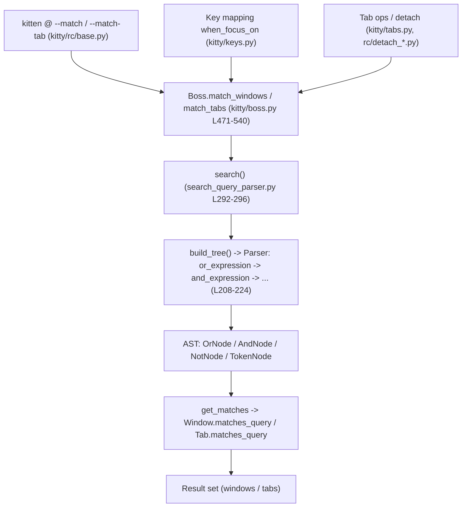

# kitty search-query parser: is `or` + spaces a bug? (Answer)

> **Your question:** *"When I combine multiple search terms with `or` and spaces, the results don't match what I expect. Items that should clearly match at least one term are being excluded entirely."*

> **Short answer — this is NOT a bug.** In kitty's match syntax a bare **space** between two terms is an **implicit `AND`**, and `AND` binds **tighter** than `OR`. So a query shaped like `A or B C` is parsed as `A OR (B AND C)` — written out, `OR(A, AND(B, C))`. An item that matches only `B` is therefore *correctly* excluded, because it fails the tighter‑binding `B AND C`. This is expected, correct‑by‑design operator precedence: a **syntax misunderstanding, not a parser defect.** The fix is to put an explicit `or` between *every* term (or use parentheses). Details, runtime proof, and copy‑pasteable correct syntax are below.

---

## Methodology & environment (how this answer was produced)

This answer follows a **run‑then‑write** method: every behavioral claim below was produced by **executing kitty's real parser** and pasting its complete, unedited output; code‑only (not‑executed) statements are explicitly labeled **[inferred]**.

**Canonical entry point.** The parser's public API is `search()` in `kitty/search_query_parser.py:L292-296`. **[inferred from `kitty/boss.py`]** This is *literally* the function kitty's match machinery imports and calls — `Boss.match_windows` does `from .search_query_parser import search` (`kitty/boss.py:L475`) and `Boss.match_tabs` does the same (`kitty/boss.py:L509`). Reproducing through `search()` — supplying a location tuple, a universal/candidate set, and a `get_matches` callback, with `allow_no_location=False` (the default) — is therefore a **faithful, canonical reproduction, not a bypass.**

**Environment (captured at *probe time* — i.e. before this answer document was authored or committed):**

```console
$ git rev-parse --abbrev-ref HEAD
blitzy-394b7c4e-73b4-4344-8f13-03fbcb089c03
$ git rev-parse HEAD
815df1e210e0a9ab4622f5c7f2d6891d7dbeddf1
$ python3 --version
Python 3.13.7
$ wc -c kitty/__init__.py
0 kitty/__init__.py
```

- **Source / commit.** The document name `kitty_815df1e210e0` derives from the source branch. The commands above were captured **at probe time — before this answer document was authored or committed** — when `HEAD` was still the baseline commit `815df1e210e0a9ab4622f5c7f2d6891d7dbeddf1` (short `815df1e21`), i.e. the `kitty_815df1e210e0` commit, so every `file:line` citation matches this branch. The delivered artifact is a **new commit stacked on top of that baseline** that adds only this one file, so the *delivered* `HEAD` is no longer equal to `815df1e21`; the invariant that matters for provenance is that the change **relative to the baseline** is exactly one added file — shown in the Appendix under *"Final repository state (verified after cleanup)"* via `git diff --name-status 815df1e21`.
- **Interpreter.** Behavior was reproduced on **CPython 3.13.7**. The repository declares `requires-python = ">=3.8"` (`pyproject.toml:L2`) and its CI runs the test matrix on Python 3.8 / 3.9 / 3.10 with a 3.11 docs job (`.github/workflows/ci.yml`, `pyver` at L26/L34/L30, docs `python-version` L85). The parse‑tree/precedence logic is **pure‑Python and version‑independent** across these — **[inferred]** from the fact that `kitty/__init__.py` is **0 bytes** (confirmed above), so `import kitty.search_query_parser` pulls in **no compiled modules**; it imports only the standard library plus `kitty.types` (`kitty/search_query_parser.py:L3-9`). No build step is required.
- **Read‑only.** No existing repository file was modified — the only change to the repository is this single answer document. The observation scripts (`/tmp/sqp_probe.py`, `/tmp/sqp_edge.py`, `/tmp/sqp_fulltuple.py`) were created **outside** the repository (under `/tmp`) and deleted after use; their source is reproduced in the Appendix so the results remain verifiable. The post-cleanup filesystem check and the final `git` state — exactly one added file relative to the baseline — are shown in the Appendix under *"Final repository state (verified after cleanup)"*.

**Model of the demo.** The probe uses a simulated window universe of `id → title`:

```text
{1: 'foo', 2: 'bar', 3: 'baz', 4: 'foobar', 5: 'qux'}
```

with `LOCATIONS = ('id', 'title')` — a subset of the real 11‑field window tuple (`kitty/boss.py:L494`). Only `id`/`title` appear in the demo queries. **[inferred — read from source]** the `get_matches` callback mirrors kitty's real per‑field matchers: **`id` → exact string equality** (`kitty/window.py:L770`, `pat.pattern == str(self.id)`) and **`title` → regex search** (`kitty/window.py:L774`, `pat.search(...) is not None`). That the result sets do **not** change when the real full 11-field tuple is used in place of the `('id','title')` subset is **not merely asserted — it is demonstrated at runtime** in Section 3 under *"Full-tuple equivalence (observed)"*. This is the canonical `search()` contract, not a bypass.

---

## Section 1 — Direct answer / Verdict

**This is not a bug. It is expected operator precedence.**

kitty's match grammar has two rules that together explain everything you observed:

1. **A space between two terms is an implicit `AND`.** Writing `title:bar title:baz` (with just a space) means exactly the same as `title:bar and title:baz`.
2. **`AND` binds tighter than `OR`.** Just like `a or b and c` means `a or (b and c)` in most languages, `title:foo or title:bar title:baz` means `title:foo OR (title:bar AND title:baz)`.

So the query you would naturally write to mean *"match foo, or bar, or baz"* —

```text
title:foo or title:bar title:baz
```

— does **not** mean *"foo OR bar OR baz"*. It parses as **`OR(title:foo, AND(title:bar, title:baz))`**, and running it through the canonical `search()` API returns:

```text
QUERY: 'title:foo or title:bar title:baz'
  AST : OR(TOK[title:foo], AND(TOK[title:bar], TOK[title:baz]))
  RSLT: [1, 4]  (titles: ['foo', 'foobar'])
```

Window **2** (`bar`) is **excluded** — not because of a bug, but because it matches only `title:bar` and therefore fails the tighter‑binding `AND(title:bar, title:baz)` (nothing is titled both `bar` *and* `baz`). This is precisely the "items that should clearly match at least one term are being excluded" symptom you reported, and it is the parser behaving as designed. The complete evidence for this and five other conditions is in Section 3; the exact grammar lines that cause it are in Section 2; and the corrected syntax is in Section 4.

---

## Section 2 — How the parser works (grammar & precedence)

The parser is a hand‑written **recursive‑descent** parser in `kitty/search_query_parser.py`. It first lexes the query into tokens, then parses tokens into an evaluation tree (AST) of set‑algebra nodes, then evaluates the tree against the candidate set. The following is **[inferred]** from reading the source (line numbers verified against this branch); the resulting *behavior* is confirmed by the runtime output in Section 3.

### 2.1 The grammar chain (where precedence lives)

`Parser.parse()` (`:L199-206`) tokenizes the input and calls the top of the grammar, `or_expression()`. The recursive‑descent chain is:

```text
parse()               :L199-206
  or_expression()     :L208-213   ← lowest precedence (OR)
    and_expression()  :L215-224   ← binds tighter than OR (AND, incl. implicit space-AND)
      not_expression() :L226-230  ← NOT
        location_expression() :L232-242  ← parentheses / grouping
          base_token()  :L244-278 ← a single field:query term
```

**Precedence crux #1 — why `AND` is tighter than `OR`.** `or_expression()` parses its left side by calling `and_expression()` **first** (`kitty/search_query_parser.py:L209`), and only *then* looks for the literal `or` (`:L210`), wrapping the two sides in an `OrNode` (`:L212`). Because a whole `and_expression` is consumed before `or` is ever considered, `AND` is nested *inside* `OR` — the standard arrangement that makes **`AND` bind tighter than `OR`**.

```python
    def or_expression(self) -> SearchTreeNode:
        lhs = self.and_expression()            # :L209  — consume a full AND-expression first
        if self.lcase_token() == 'or':         # :L210
            self.advance()
            return OrNode(lhs, self.or_expression())   # :L212
        return lhs
```

**Precedence crux #2 — why a space means `AND`.** Inside `and_expression()` (`:L215-224`), after parsing a term the parser first handles an explicit `and` (`:L217-219`). Then comes the branch that creates the *implicit* `AND` — the comment even calls it "*Account for the optional 'and'*" (`:L221`):

```python
        # Account for the optional 'and'                                   :L221
        if ((self.token_type() in (TokenType.WORD, TokenType.QUOTED_WORD)  # :L222
                or self.token() == '(') and self.lcase_token() != 'or'):
            return AndNode(lhs, self.and_expression())                     # :L223
        return lhs                                                         # :L224
```

In plain terms: **after a term, if the next token is another word / quoted word / opening `(` and it is *not* the literal `or`, the parser wraps both sides in an `AndNode`.** That is why a bare space behaves exactly like `and`.

### 2.2 The lexer: spaces are *discarded*, not operators

`lex_scanner()` (`:L120-128`) is a regex `Scanner`. A run of whitespace `\s+` maps to `None`, i.e. it is **discarded** (`:L127`); a bare word `[^"()\s]+` becomes a `WORD` token (`:L125`). So at the token level a space is *nothing* — it produces no token. The implicit‑`AND` behavior is therefore **not** in the lexer; it is created purely by the grammar branch at `:L221-224` recognizing two adjacent term‑tokens.

### 2.3 Evaluation nodes (set algebra) — why `AND` can only shrink the set

Each AST node is callable and operates on a candidate set:

- **`OrNode`** (class `:L57-69`) → **union**. `__call__` evaluates the left side, then the right side over the not‑yet‑matched candidates, and unions them (`:L65`: `return lhs.union(self.rhs(candidates.difference(lhs), get_matches))`). Result = everything matching *either* side.
- **`AndNode`** (class `:L72-85`) → **narrowing / intersection**. `__call__` evaluates the left side, then feeds *that result* as the candidate set into the right side (`:L80-81`: `lhs = self.lhs(...)` then `return self.rhs(lhs, get_matches)`). Because the right side can only ever return a subset of what the left side already matched, **`AND` can only shrink the set** — an item matching only one side is dropped. *This is the mechanical reason window 2 disappears in the user's query.*
- **`NotNode`** (class `:L88-98`) → **complement**. `:L95`: `return candidates.difference(self.rhs(candidates, get_matches))`.
- **`TokenNode`** (class `:L101-112`) → a single `field:query` term. `:L109`: `return get_matches(self.location, self.query, candidates)` — it delegates to the caller‑supplied matcher.

### 2.4 The public API and the `field:` requirement

- `search()` (`:L292-296`) has signature `search(query, locations, universal_set, get_matches, allow_no_location=False)` — the default `allow_no_location=False` is on `:L294`. It calls `build_tree()` (`:L281-289`), which is `@lru_cache(maxsize=64)` (`:L281`) and returns the parsed AST, then evaluates it via `.search(universal_set, get_matches)` (`:L296`).
- **Every term must carry a `field:` prefix on the real match path.** With `allow_no_location=False`, `base_token()` (`:L244-278`) raises **`NoLocation`** for a bare (unqualified) word — `:L278` for a plain word, `:L250` for a bare quoted word. `NoLocation` (`:L136-143`) is a subclass of `ParseException` (`:L12-20`); its message is `No location specified before {tt}` (`:L143`), or `{a} is not a recognized location in {tt}` (`:L141`) when a colon is present but the prefix is not a known field.

### 2.5 The canonical callers (why this is user‑facing)

**[inferred from `kitty/boss.py`]** Both real callers invoke `search()` **without** passing `allow_no_location`, so it defaults to `False`:

- **`Boss.match_windows`** (def `:L471`): imports `search` (`:L475`), defines a `get_matches` closure that calls `Window.matches_query` (`:L491`), and calls `search(match, ( 'id','title','pid','cwd','cmdline','num','env','var','recent','state','neighbor' ), set(self.window_id_map), get_matches)` (`:L493-495`).
- **`Boss.match_tabs`** (def `:L505`): imports `search` (`:L509`), calls `Tab.matches_query` (`:L526`), and calls `search(match, ( 'id','index','title','window_id','window_title','pid','cwd','env','var','cmdline','recent','state' ), set(tim), get_matches)` (`:L529-531`); if no tab matches directly, it falls back to **the tabs that contain windows matched by the same expression** — i.e. `self.match_windows(match)` mapped through `self.tab_for_window(...)` (`:L535-539`).

The per‑item matchers are `Window.matches_query` (`kitty/window.py:L784`, using `matches` at `:L761`, patterns compiled by `compile_match_query` at `:L213`) and `Tab.matches_query` (`kitty/tabs.py:L800`). The same match machinery is reached from several user‑facing surfaces — remote control `--match` / `--match-tab` (`kitty/rc/base.py`: `match_windows` `:L367` & `:L400`, `match_tabs` `:L377` & `:L404`), the `when_focus_on` key‑mapping condition (`kitty/keys.py:L123`, `:L125`, wrapper `:L223-224`), and tab/detach operations (`kitty/tabs.py:L995`, `kitty/rc/detach_tab.py:L38`, `kitty/rc/detach_window.py:L54`). So the precedence you hit applies everywhere kitty matches windows or tabs.

### 2.6 Evaluation‑path diagram



---

## Section 3 — Runtime demonstration (the evidence)

All output below is **complete and unedited**, captured through the canonical `search()` API. Each script was run **twice** and the two runs were verified **byte-identical**; the exact commands, exit statuses, `diff` result, and full `sha256sum` digests are shown at the end of this section under *"Stability & reproducibility (two runs, observed)"*.

### Command (conditions a–e, plus the fix form and a mixed variant)

```bash
REPO="$(git rev-parse --show-toplevel)"
python3 /tmp/sqp_probe.py "$REPO"
```

### Complete, unedited output

```text
QUERY: 'title:foo or title:bar'
  AST : OR(TOK[title:foo], TOK[title:bar])
  RSLT: [1, 2, 4]  (titles: ['foo', 'bar', 'foobar'])
QUERY: 'title:foo title:bar'
  AST : AND(TOK[title:foo], TOK[title:bar])
  RSLT: [4]  (titles: ['foobar'])
QUERY: 'title:foo or title:bar title:baz'
  AST : OR(TOK[title:foo], AND(TOK[title:bar], TOK[title:baz]))
  RSLT: [1, 4]  (titles: ['foo', 'foobar'])
QUERY: 'title:foo or title:baz or title:qux'
  AST : OR(TOK[title:foo], OR(TOK[title:baz], TOK[title:qux]))
  RSLT: [1, 3, 4, 5]  (titles: ['foo', 'baz', 'foobar', 'qux'])
QUERY: 'title:foo or title:baz title:qux'
  AST : OR(TOK[title:foo], AND(TOK[title:baz], TOK[title:qux]))
  RSLT: [1, 4]  (titles: ['foo', 'foobar'])
QUERY: '(title:foo or title:bar) and title:foobar'
  AST : AND(OR(TOK[title:foo], TOK[title:bar]), TOK[title:foobar])
  RSLT: [4]  (titles: ['foobar'])
QUERY: '(title:bar or title:baz) title:foobar'
  AST : AND(OR(TOK[title:bar], TOK[title:baz]), TOK[title:foobar])
  RSLT: [4]  (titles: ['foobar'])
QUERY: 'title:foo or title:bar or title:baz'
  AST : OR(TOK[title:foo], OR(TOK[title:bar], TOK[title:baz]))
  RSLT: [1, 2, 3, 4]  (titles: ['foo', 'bar', 'baz', 'foobar'])
```

**Condition‑by‑condition reading of the output above** (recall `foo`→{1,4}, `bar`→{2,4}, `baz`→{3}, `qux`→{5}, `foobar`→{4} under `re.search`):

- **(a) simple two‑term `or`** — `title:foo or title:bar` → `OR(TOK[title:foo], TOK[title:bar])` → **`[1, 2, 4]`**. Both terms contribute (`foo`→1,4; `bar`→2,4); the union is `{1,2,4}`. This is what "match at least one term" looks like when done correctly.
- **(b) two‑term implicit space‑`AND`** — `title:foo title:bar` (just a space) → `AND(TOK[title:foo], TOK[title:bar])` → **`[4]`**. Only `foobar` contains both `foo` and `bar`. This directly proves **a space = `AND`**: the space produced an `AndNode`, exactly as the grammar branch at `:L221-224` dictates.
- **(c) mixed `or` + space — YOUR EXACT CASE** — `title:foo or title:bar title:baz` → `OR(TOK[title:foo], AND(TOK[title:bar], TOK[title:baz]))` → **`[1, 4]`**. The space between `title:bar` and `title:baz` became a tighter‑binding `AND`, so the query means `foo OR (bar AND baz)`. Window **2** (`bar`) matches `title:bar` but **fails** `AND(title:bar, title:baz)` (no window is titled both), so it is excluded — the exact symptom you reported. **Not a bug: precedence.**
- **(d) all‑explicit `or` chain** — `title:foo or title:baz or title:qux` → `OR(TOK[title:foo], OR(TOK[title:baz], TOK[title:qux]))` → **`[1, 3, 4, 5]`** (every term's matches included). And the **fix form** for your case, `title:foo or title:bar or title:baz` → `OR(TOK[title:foo], OR(TOK[title:bar], TOK[title:baz]))` → **`[1, 2, 3, 4]`** — now window 2 (`bar`) *is* included, because every term is joined by an explicit `or`. This is the result you originally expected. *(The mixed variant `title:foo or title:baz title:qux` → `[1, 4]` reinforces (c): again the trailing space is an `AND`, dropping `baz` and `qux` unless something matches both.)*
- **(e) parenthesized group** — `(title:foo or title:bar) and title:foobar` → `AND(OR(TOK[title:foo], TOK[title:bar]), TOK[title:foobar])` → **`[4]`**; and `(title:bar or title:baz) title:foobar` → `AND(OR(TOK[title:bar], TOK[title:baz]), TOK[title:foobar])` → **`[4]`**. Parentheses force the `OR` to be grouped first, overriding the default precedence — note the second example uses a bare space for the outer `AND` and still groups the `OR` correctly.

### Full-tuple equivalence (observed)

The demonstration above uses `LOCATIONS = ('id', 'title')`, a subset of the real 11-field window tuple. To prove the subset does not alter the results, the same eight queries were re-run through the canonical `search()` twice: once with the `('id','title')` subset and once with the **exact** full window tuple that `Boss.match_windows` supplies — `('id','title','pid','cwd','cmdline','num','env','var','recent','state','neighbor')` (`kitty/boss.py:L494`) — comparing the two result sets per query.

#### Command

```bash
python3 /tmp/sqp_fulltuple.py "$REPO"
```

#### Complete, unedited output

```text
QUERY: 'title:foo or title:bar'
  subset(id,title) : [1, 2, 4]
  full 11-field    : [1, 2, 4]
  identical        : True
QUERY: 'title:foo title:bar'
  subset(id,title) : [4]
  full 11-field    : [4]
  identical        : True
QUERY: 'title:foo or title:bar title:baz'
  subset(id,title) : [1, 4]
  full 11-field    : [1, 4]
  identical        : True
QUERY: 'title:foo or title:baz or title:qux'
  subset(id,title) : [1, 3, 4, 5]
  full 11-field    : [1, 3, 4, 5]
  identical        : True
QUERY: 'title:foo or title:baz title:qux'
  subset(id,title) : [1, 4]
  full 11-field    : [1, 4]
  identical        : True
QUERY: '(title:foo or title:bar) and title:foobar'
  subset(id,title) : [4]
  full 11-field    : [4]
  identical        : True
QUERY: '(title:bar or title:baz) title:foobar'
  subset(id,title) : [4]
  full 11-field    : [4]
  identical        : True
QUERY: 'title:foo or title:bar or title:baz'
  subset(id,title) : [1, 2, 3, 4]
  full 11-field    : [1, 2, 3, 4]
  identical        : True
ALL_QUERIES_IDENTICAL: True
```

Every query reports `identical : True`, and the run ends with `ALL_QUERIES_IDENTICAL: True`. The `('id','title')` subset used in the demonstration is therefore faithful to the full window tuple — the equivalence is now **observed at runtime**, not merely asserted.

### (f) Bare‑word error path

### Command

```bash
python3 /tmp/sqp_edge.py "$REPO"
```

### Complete, unedited output

```text
'title:foo or bar': NoLocation(ParseException) -> No location specified before bar
'foo or bar': NoLocation(ParseException) -> No location specified before foo
```

- **(f) bare‑word error path** — On the real match path (`allow_no_location=False`), **every term needs a `field:` prefix**. A bare word raises `NoLocation` (a `ParseException`) with `No location specified before <word>`. This matters because the mental model "match at least one term" often includes *bare* words like `foo or bar` — but kitty rejects those outright (`base_token()` at `kitty/search_query_parser.py:L278`; message from `NoLocation.__init__` at `:L143`) rather than silently mishandling them.

### Stability & reproducibility (two runs, observed)

All three observation scripts were run **twice**, each run captured to a separate file, then compared with `diff` and `sha256sum`. The commands and their complete, unedited output:

#### Command

```bash
REPO="$(git rev-parse --show-toplevel)"
python3 /tmp/sqp_probe.py "$REPO" > /tmp/probe_run1.out; echo "exit=$?"
python3 /tmp/sqp_probe.py "$REPO" > /tmp/probe_run2.out; echo "exit=$?"
diff /tmp/probe_run1.out /tmp/probe_run2.out && echo "byte-identical (diff exit=$?)"
sha256sum /tmp/probe_run1.out /tmp/probe_run2.out
python3 /tmp/sqp_fulltuple.py "$REPO" > /tmp/fulltuple_run1.out; echo "exit=$?"
python3 /tmp/sqp_fulltuple.py "$REPO" > /tmp/fulltuple_run2.out; echo "exit=$?"
diff /tmp/fulltuple_run1.out /tmp/fulltuple_run2.out && echo "byte-identical (diff exit=$?)"
sha256sum /tmp/fulltuple_run1.out /tmp/fulltuple_run2.out
python3 /tmp/sqp_edge.py "$REPO" > /tmp/edge_run1.out; echo "exit=$?"
python3 /tmp/sqp_edge.py "$REPO" > /tmp/edge_run2.out; echo "exit=$?"
diff /tmp/edge_run1.out /tmp/edge_run2.out && echo "byte-identical (diff exit=$?)"
sha256sum /tmp/edge_run1.out /tmp/edge_run2.out
```

#### Complete, unedited output

```text
exit=0
exit=0
byte-identical (diff exit=0)
8520dc094b221176b4bd14926b5953343c84d3eee71165704e57eb7f3220cead  /tmp/probe_run1.out
8520dc094b221176b4bd14926b5953343c84d3eee71165704e57eb7f3220cead  /tmp/probe_run2.out
exit=0
exit=0
byte-identical (diff exit=0)
42d536135faab4fba5a0556d56a629d74d9e8826d37cef3e99ff4095eee51215  /tmp/fulltuple_run1.out
42d536135faab4fba5a0556d56a629d74d9e8826d37cef3e99ff4095eee51215  /tmp/fulltuple_run2.out
exit=0
exit=0
byte-identical (diff exit=0)
eb92d57c98b6504720886c60b58ed0fdf9d564d96dbd0e1e736fd9c92aedd6e5  /tmp/edge_run1.out
eb92d57c98b6504720886c60b58ed0fdf9d564d96dbd0e1e736fd9c92aedd6e5  /tmp/edge_run2.out
```

All three observation scripts' runs are byte-identical: `sqp_probe.py` (full SHA-256 `8520dc094b221176b4bd14926b5953343c84d3eee71165704e57eb7f3220cead`), `sqp_fulltuple.py` (`42d536135faab4fba5a0556d56a629d74d9e8826d37cef3e99ff4095eee51215`), and `sqp_edge.py` (`eb92d57c98b6504720886c60b58ed0fdf9d564d96dbd0e1e736fd9c92aedd6e5`); every run exited `0`. **This determinism was observed directly at runtime** — there is no run-to-run variability, and the only "inconsistency" is the precedence effect itself.

*Separately — a code-read note, and NOT the cause of the determinism observed above:* `build_tree` is decorated `@lru_cache(maxsize=64)` (`kitty/search_query_parser.py:L281`), so repeating an identical `(query, locations)` input returns the already-parsed AST object instead of re-parsing it. **[inferred]** this cache only memoizes the parse *result*; it does not change parse or evaluation semantics — the identical output above would hold even with the cache disabled, because the parser is a deterministic pure function of its input.

---

## Section 4 — Correct syntax (what to write instead)

Grounded in the Section 3 evidence, here is how to get "match at least one of these terms":

1. **Put an explicit `or` between EVERY term.** Do not rely on spaces.

   ```text
   title:foo or title:bar or title:baz
   ```

   Evidence (from Section 3): → `[1, 2, 3, 4]` — all three terms' matches are included, which is what you expected.

2. **Use parentheses to force grouping** whenever you mix `or` with `and` (or with spaces).

   ```text
   (title:foo or title:bar) and title:baz
   ```

   Evidence: `(title:foo or title:bar) and title:foobar` → `[4]`. The parentheses make the `OR` group first, then the `AND` narrows it.

3. **Prefix every term with its field** (e.g. `title:`, `id:`, `cwd:`, `env:`), because the real match path uses `allow_no_location=False`.

   Evidence: the bare‑word `NoLocation` errors in condition (f). `foo or bar` fails; `title:foo or title:bar` works.

**The pitfall to avoid:** mixing `or` with spaces, e.g. `A or B C`. The space is **not** another `or` — it is a tighter‑binding **implicit `AND`**, so the query means `A OR (B AND C)`. If you meant "A or B or C", write all three with explicit `or`.

**Documented baseline (for reference). [inferred — read from `kitty_tests/search_query_parser.py`, not executed here.]** kitty's own test suite encodes the expected‑behavior baseline in `kitty_tests/search_query_parser.py:L10-30`: `id:1 or id:2` → `{1, 2}` (`:L25`), `id:1 and id:2` → `{}` (`:L26`), `not id:1` → the complement (`:L27`), `(id:1 or id:2) and id:1` → `{1}` (`:L28`), and bare `1` / `"id:1"` → `ParseException` (`:L29-30`). Note that **no existing test mixes an implicit space‑`AND` with an explicit `or`** — i.e. the exact combination you hit (`A or B C`) is untested, which is consistent with it being an easy‑to‑miss, undocumented interaction rather than a defect.

---

## Section 5 — Documentation‑gap note (recommendation only — not applied here)

The behavior is correct, but the rule that **a space means implicit `AND`** appears to be **undocumented**, which is the most likely origin of the confusion:

- **[inferred — read from `docs/remote-control.rst`, not executed] User-facing syntax docs** — `docs/remote-control.rst` (`_search_syntax`, label at `:L327`; body `:L332-338`) describe match expressions of the form `field:query` (`:L335`) that can be "combined using Boolean operators" (`:L337`), and give examples at `:L340-343`:

  ```text
  title:"My special window" or id:43
  title:bash and env:USER=kovid
  not id:1
  (id:2 or id:3) and title:something
  ```

  **Every example uses an explicit operator or parentheses — none uses a bare space.** The implicit‑`AND` rule is never stated.

- **[inferred — read from `kitty/rc/base.py` and `docs/conf.py`, not executed] Per-field help strings** — `MATCH_WINDOW_OPTION` (`kitty/rc/base.py:L87`) and `MATCH_TAB_OPTION` (`kitty/rc/base.py:L131`) likewise reference "combined using Boolean operators" (`:L93` / `:L137`) but never mention that a space means `AND`. These strings are generated into `docs/generated/matching.rst` at build time by `docs/conf.py` (imports the options `:L594`, opens the file `:L595`, processes `MATCH_WINDOW_OPTION` `:L598` and `MATCH_TAB_OPTION` `:L602`).

**Recommendation (a suggestion only — this task does NOT modify any of these files):** the syntax docs and/or the `MATCH_*_OPTION` help text could add one clarifying sentence, e.g. *"A bare space between two terms is an implicit `and` that binds more tightly than `or`; to OR several terms, put an explicit `or` between each."* That single sentence would prevent exactly the misunderstanding reported here.

**Accuracy note (version drift). [inferred, external documentation — not from this checked-out branch.]** kitty's current *online* remote-control documentation lists an additional `session` match field for windows; there the window match fields are given as `id, title, pid, cwd, cmdline, num, env, var, state, neighbor, session and recent` (source: kitty official remote-control documentation, <https://sw.kovidgoyal.net/kitty/remote-control/>, accessed 2026-07-13). That `session` field is **not** present in this checked-out branch's window location tuple (`kitty/boss.py:L494`, which is `id, title, pid, cwd, cmdline, num, env, var, recent, state, neighbor`). This document treats the **checked-out code as authoritative**; the discrepancy is noted but does not affect the precedence conclusion.

---

## Appendix — Temporary observation scripts (created outside the repo, since deleted)

These scripts were created under `/tmp` (outside the repository), run to produce the output in Section 3, and then deleted, leaving the repository unchanged. They are reproduced here so the results can be independently re‑verified. Run with `python3 /tmp/sqp_probe.py "$(git rev-parse --show-toplevel)"`.

### Final repository state (verified after cleanup)

After the observation scripts had been run, they were removed and the repository state was checked against the baseline commit `815df1e21` (the `kitty_815df1e210e0` commit). Commands and complete, unedited output:

#### Command

```bash
BASE=815df1e210e0a9ab4622f5c7f2d6891d7dbeddf1
rm -f /tmp/sqp_probe.py /tmp/sqp_edge.py /tmp/sqp_fulltuple.py
ls -1 /tmp/sqp_*.py 2>&1              # confirm no observation script remains
git diff --name-status "$BASE"       # only difference vs the baseline commit
git diff --name-status "$BASE" HEAD  # ... same, against the committed HEAD
echo "STATUS_BEGIN"; git status --porcelain=v1; echo "STATUS_END"                        # clean working tree (empty between markers)
echo "UNTRACKED_BEGIN"; git ls-files --others --exclude-standard; echo "UNTRACKED_END"   # no untracked files (empty between markers)
```

#### Complete, unedited output

```text
ls: cannot access '/tmp/sqp_*.py': No such file or directory
A	blitzy/documentation/kitty_815df1e210e0.md
A	blitzy/documentation/kitty_815df1e210e0.md
STATUS_BEGIN
STATUS_END
UNTRACKED_BEGIN
UNTRACKED_END
```

The `ls` line confirms **no `/tmp/sqp_*.py` observation script remains**, and both `git diff` forms show that the **only** change relative to the baseline commit is a single **added** file — this answer document. No existing repository file was modified, added, or deleted. The empty block between `STATUS_BEGIN`/`STATUS_END` is the output of `git status --porcelain=v1` (a **clean working tree**, no other pending changes), and the empty block between `UNTRACKED_BEGIN`/`UNTRACKED_END` is `git ls-files --others --exclude-standard` (**no untracked files**); this reflects the delivered state, i.e. after this answer document is committed.

`/tmp/sqp_probe.py` (conditions a–e + fix form + mixed variant):

```python
#!/usr/bin/env python3
# Temporary observation script (OUTSIDE the repo). Exercises the CANONICAL
# search() API exactly as Boss.match_windows invokes it:
#   search(query, locations, universal_set, get_matches)  with allow_no_location=False
import sys, os, re
REPO = sys.argv[1] if len(sys.argv) > 1 else os.getcwd()
sys.path.insert(0, REPO)
from kitty.search_query_parser import search, build_tree, OrNode, AndNode, NotNode, TokenNode

# Simulated window universe: id -> title  (stands in for Boss.window_id_map)
WINDOWS = {1: 'foo', 2: 'bar', 3: 'baz', 4: 'foobar', 5: 'qux'}
LOCATIONS = ('id', 'title')          # subset of the real 11-field window tuple
UNIVERSAL = set(WINDOWS)

def get_matches(location, query, candidates):
    # Mirrors Boss.match_windows.get_matches -> Window.matches_query/matches:
    #   id    -> exact string equality  (kitty/window.py:770)
    #   title -> regex search           (kitty/window.py:774)
    out = set()
    for wid in candidates:
        if location == 'id' and query == str(wid):
            out.add(wid)
        elif location == 'title' and re.search(query, WINDOWS[wid]) is not None:
            out.add(wid)
    return out

def render(n):
    c = type(n).__name__
    if c == 'TokenNode':  return f"TOK[{n.location}:{n.query}]"
    if c == 'OrNode':     return f"OR({render(n.lhs)}, {render(n.rhs)})"
    if c == 'AndNode':    return f"AND({render(n.lhs)}, {render(n.rhs)})"
    if c == 'NotNode':    return f"NOT({render(n.rhs)})"
    return c

QUERIES = [
    'title:foo or title:bar',                       # (a) simple two-term OR
    'title:foo title:bar',                          # (b) two-term implicit space-AND
    'title:foo or title:bar title:baz',             # (c) mixed or+space  (USER'S EXACT CASE)
    'title:foo or title:baz or title:qux',          # (d) all-explicit OR chain
    'title:foo or title:baz title:qux',             #     mixed variant
    '(title:foo or title:bar) and title:foobar',    # (e) parenthesized group
    '(title:bar or title:baz) title:foobar',        # (e) parenthesized group + implicit AND
    'title:foo or title:bar or title:baz',          # (d) correct-syntax FIX (all terms explicit OR)
]
for q in QUERIES:
    tree = build_tree(q, LOCATIONS)                          # allow_no_location=False (default)
    res  = search(q, LOCATIONS, UNIVERSAL, get_matches)      # canonical call
    print(f"QUERY: {q!r}")
    print(f"  AST : {render(tree)}")
    print(f"  RSLT: {sorted(res)}  (titles: {[WINDOWS[i] for i in sorted(res)]})")
```

`/tmp/sqp_edge.py` (condition f — bare‑word error path):

```python
#!/usr/bin/env python3
# Temporary observation script (OUTSIDE the repo). Bare words on the CANONICAL
# match path (allow_no_location=False) must raise NoLocation (a ParseException).
import sys, os, re
REPO = sys.argv[1] if len(sys.argv) > 1 else os.getcwd()
sys.path.insert(0, REPO)
from kitty.search_query_parser import search, ParseException

WINDOWS = {1: 'foo', 2: 'bar', 3: 'baz', 4: 'foobar', 5: 'qux'}
LOCATIONS = ('id', 'title'); UNIVERSAL = set(WINDOWS)

def get_matches(location, query, candidates):
    out = set()
    for wid in candidates:
        if location == 'id' and query == str(wid):
            out.add(wid)
        elif location == 'title' and re.search(query, WINDOWS[wid]) is not None:
            out.add(wid)
    return out

for q in ['title:foo or bar', 'foo or bar']:
    try:
        res = search(q, LOCATIONS, UNIVERSAL, get_matches)   # allow_no_location=False
        print(f"{q!r}: OK -> {sorted(res)}")
    except ParseException as e:
        print(f"{q!r}: {type(e).__name__}(ParseException) -> {e.msg}")
```

`/tmp/sqp_fulltuple.py` (full 11-field tuple vs `(id,title)` subset — the Section 3 *Full-tuple equivalence* check):

```python
#!/usr/bin/env python3
# Temporary observation script (OUTSIDE the repo). Re-runs the SAME queries
# through the CANONICAL search() with (a) the (id,title) subset used in the
# demo and (b) the REAL full 11-field window location tuple from
# Boss.match_windows (kitty/boss.py:494), and compares the result sets.
import sys, os, re
REPO = sys.argv[1] if len(sys.argv) > 1 else os.getcwd()
sys.path.insert(0, REPO)
from kitty.search_query_parser import search

WINDOWS = {1: 'foo', 2: 'bar', 3: 'baz', 4: 'foobar', 5: 'qux'}
SUBSET = ('id', 'title')
FULL   = ('id', 'title', 'pid', 'cwd', 'cmdline', 'num', 'env', 'var', 'recent', 'state', 'neighbor')  # kitty/boss.py:494
UNIVERSAL = set(WINDOWS)

def get_matches(location, query, candidates):
    out = set()
    for wid in candidates:
        if location == 'id' and query == str(wid):
            out.add(wid)
        elif location == 'title' and re.search(query, WINDOWS[wid]) is not None:
            out.add(wid)
    return out

QUERIES = [
    'title:foo or title:bar',
    'title:foo title:bar',
    'title:foo or title:bar title:baz',
    'title:foo or title:baz or title:qux',
    'title:foo or title:baz title:qux',
    '(title:foo or title:bar) and title:foobar',
    '(title:bar or title:baz) title:foobar',
    'title:foo or title:bar or title:baz',
]
all_identical = True
for q in QUERIES:
    r_sub  = sorted(search(q, SUBSET, UNIVERSAL, get_matches))
    r_full = sorted(search(q, FULL,   UNIVERSAL, get_matches))
    same = (r_sub == r_full)
    all_identical = all_identical and same
    print(f"QUERY: {q!r}")
    print(f"  subset(id,title) : {r_sub}")
    print(f"  full 11-field    : {r_full}")
    print(f"  identical        : {same}")
print(f"ALL_QUERIES_IDENTICAL: {all_identical}")
```
