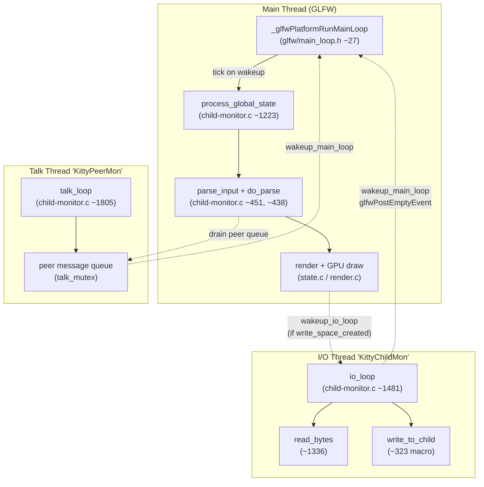
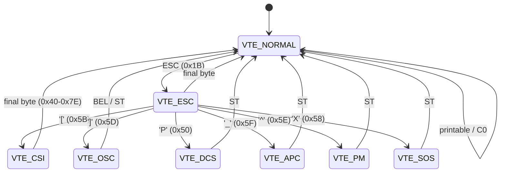
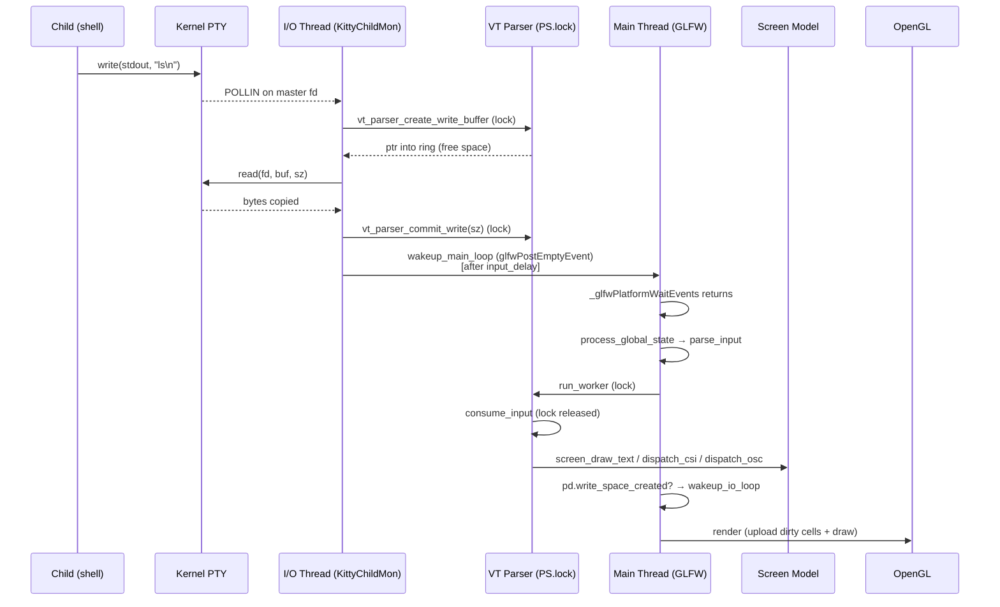

# Kitty Terminal Interaction Pipeline — End-to-End Runtime Trace (commit `815df1e21`)

## 1. Introduction

This document is an onboarding-oriented, code-grounded analysis of Kitty's terminal
interaction pipeline at **commit `815df1e21`** ("Wire up applying of font config"). It
answers one overarching question: *when a surge of mixed input — keystrokes,
paste bursts, window-resize signals, and inline OSC 133 / OSC 7 shell-integration
markers — arrives concurrently, what happens inside Kitty from the moment the
bytes touch the process until the on-screen interface settles?*

The text that follows is derived entirely from static reading of the Kitty
sources at that commit. No runtime instrumentation was used — the analysis
environment lacks a C compiler and Go toolchain, so the commit tree itself is
the single source of truth. Every claim in this document is tied back to a
specific file, function, and approximate line range so that a reader stepping
through the codebase can verify every sentence against its origin.

### 1.1 The three code layers

Kitty is organized as three cooperating layers. Understanding the boundary
between them is the first step toward making sense of the pipeline.

- **C core** — `kitty/*.c` and `kitty/*.h`. Implements the I/O thread, the VT
  parser state machine, the `Screen` data model, the keyboard encoder, and the
  event-loop glue that ties everything together. The entry points most
  relevant to this document are in `kitty/child-monitor.c`, `kitty/vt-parser.c`,
  `kitty/screen.c`, `kitty/keys.c`, and `kitty/loop-utils.c`.
- **Vendored GLFW fork** — `glfw/*.c` and `glfw/*.h`. Provides platform-specific
  windowing (X11, Wayland, Cocoa) and the `_glfwPlatformRunMainLoop` abstraction
  (`glfw/main_loop.h`) that drives the Main thread. Kitty ships its own fork of
  GLFW so that it can inject custom behavior such as `glfwPostEmptyEvent`-based
  main-loop wakeups and live-resize callbacks.
- **Python orchestration** — `kitty/*.py`. Implements the `Boss` singleton,
  `Window`, `TabManager`, `Child` (the Python face of a pty-attached process),
  shell integration setup, and the configuration layer. The Python layer talks
  to the C core through the `kitty.fast_data_types` C extension (exposing
  `ChildMonitor`, `Screen`, `Parser`, and friends as Python types) and through a
  `call_boss(method_name, fmt, ...)` C macro that invokes Python methods from C
  while holding the GIL.

### 1.2 Terminology used throughout this document

These terms appear in virtually every section below and are defined here on
first use:

- **PTY** — pseudo-terminal. A kernel-provided master/slave file-descriptor
  pair. The child shell attaches to the slave side (it looks like a normal
  TTY); Kitty reads and writes the master side. Bytes written to the master
  by Kitty are delivered to the shell's standard input; bytes written by the
  shell to its standard output/error flow back out of the master to Kitty.
- **OSC** — Operating System Command, an escape sequence of the form
  `ESC ] code ; payload BEL` or `ESC ] code ; payload ST` (where `ST` is
  `ESC \`). OSC sequences are how applications ask the terminal to do things
  like set the window title (OSC 2), report the current working directory
  (OSC 7), or mark shell prompt boundaries (OSC 133).
- **CSI** — Control Sequence Introducer, an escape sequence of the form
  `ESC [ parameters intermediates final`. CSI is used for cursor motion,
  color changes, and mode toggles.
- **DECSET / DECRST** — DEC Set Mode and DEC Reset Mode, the CSI forms
  `ESC [ ? num h` and `ESC [ ? num l` that toggle terminal modes. For example
  `ESC [ ? 2004 h` turns on bracketed-paste mode (mode 2004 in `kitty/modes.h`
  line 81) and `ESC [ ? 2026 h` turns on pending-update / synchronized-output
  mode (mode 2026, defined as `PENDING_MODE` in `kitty/control-codes.h` line
  235 and as `PENDING_UPDATE = (2026 << 5)` in `kitty/modes.h` line 86).
- **SIGWINCH** — the POSIX signal the kernel sends to every process in a PTY's
  foreground process group when `ioctl(fd, TIOCSWINSZ, &winsize)` changes the
  window size. Triggered by `resize_pty()` in `kitty/child-monitor.c`.
- **DECARM** — DEC Auto-Repeat Mode (mode 8, `kitty/modes.h` line 40). When
  disabled, key auto-repeat events from the OS are dropped at the encoding
  stage instead of being forwarded to the shell.
- **VT state machine** — an incremental parser for the DEC VT-series escape
  sequence grammar. Its states are `VTE_NORMAL`, `VTE_ESC`, `VTE_CSI`,
  `VTE_OSC`, `VTE_DCS`, `VTE_APC`, `VTE_PM`, and `VTE_SOS`. Defined as an enum
  in `kitty/vt-parser.c` at line 160.
- **POLLIN / POLLOUT** — bit flags for `poll(2)`. `POLLIN` means "I want to
  know when this fd has data to read"; `POLLOUT` means "I want to know when
  this fd has room for me to write".
- **eventfd / signalfd** — Linux-specific file descriptors used by Kitty's
  `LoopData` infrastructure. `eventfd(2)` provides a counter-based wakeup
  primitive; `signalfd(2)` delivers signals through `read()` instead of
  asynchronous handlers. On macOS / BSD (where neither is available), Kitty
  falls back to a `pipe2`-based self-pipe — see `self_pipe()` in
  `kitty/loop-utils.h` lines 53–75.
- **ioctl** — a generic system call for issuing device-specific commands to
  file descriptors. In this document, `ioctl(fd, TIOCSWINSZ, &winsize)` is the
  only one used; it sets the window size on a PTY.

### 1.3 Scope

The narrative traces a mixed-input surge through the whole pipeline end-to-end:

- Keystrokes enter via GLFW on the main thread, are encoded into bytes, and are
  enqueued into per-screen write buffers drained by the I/O thread.
- Paste bursts enter via the Python layer (`Window.paste_text` in
  `kitty/window.py`), which optionally wraps them in bracketed-paste markers
  and schedules them into the same write buffer.
- Child processes (shells) write PTY output back to Kitty. The I/O thread
  `poll()`s the master fds and reads bytes into the VT parser's 1 MiB ring.
- The main thread drains the ring on its tick, advances the VT state machine,
  mutates the `Screen` model, dispatches OSC 133 / OSC 7 markers into Python
  callbacks, and issues a GPU render.
- Resize events go through a debounced pipeline that coalesces many OS events
  into one `resize_pty` ioctl per debounce window, producing one `SIGWINCH`
  to the child and one prompt-reflow round trip.
- Shell-integration markers interleave transparently because they share the
  same byte stream as normal output and are dispatched synchronously inside
  the parse cycle.
- Pause / resume — both `SIGTSTP`/`SIGCONT` from Ctrl-Z/fg and the application-
  level `DECSET 2026` (PENDING_MODE) — are handled without losing buffered
  bytes.

Sections 2–14 build up this picture piece by piece. Section 15 is a
narrative walkthrough that ties all the mechanisms together with a concrete
scenario.

---

## 2. Three-Thread Architecture

Kitty is a three-thread program. Each thread owns a specific class of work and
communicates with the others through mutex-protected data structures and a
small set of wakeup primitives.

The three threads are created by the `ChildMonitor` object defined in
`kitty/child-monitor.c`. They are:

### 2.1 Main thread (the "GLFW thread")

This is the thread that Python starts in when it runs `kitty` and that
eventually enters `boss.child_monitor.main_loop()` in `kitty/main.py` at line
234 inside `_run_app`. From C, `main_loop` is implemented at approximately
`kitty/child-monitor.c` lines 1260–1270; it simply calls
`run_main_loop(process_global_state, self)`, which in turn invokes
`_glfwPlatformRunMainLoop(tick_callback, data)`.

`_glfwPlatformRunMainLoop` lives in `glfw/main_loop.h` (the entire file is 51
lines). Its body — lines ~27–38 — is a short loop:

```c
while (keep_going) {
    _glfwPlatformWaitEvents();
    if (eld->wakeup_data_read) {
        eld->wakeup_data_read = false;
        tick_callback(data);
    }
}
```

`_glfwPlatformWaitEvents()` blocks until one of the following happens:

- A real OS event arrives (keyboard, mouse, resize, focus change).
- Another thread calls `glfwPostEmptyEvent()` — Kitty's `wakeup_main_loop`
  (`kitty/glfw.c` approx. line 1807) is defined exactly as
  `glfwPostEmptyEvent()`. `request_tick_callback` at `kitty/glfw.c` approx.
  line 115 does the same thing.
- A GLFW timer expires (Kitty registers `state_check_timer` to fire at most
  once a second so idle background maintenance still runs).

The tick callback is `process_global_state` in `kitty/child-monitor.c` at
approximately lines 1223–1253. Every time the main loop wakes, it executes in
this fixed order:

1. If `global_state.has_pending_resizes`, call `process_pending_resizes(now)`
   so that the subsequent parse sees the correct cell geometry.
2. `parse_input(self)` — drains peer messages, reaps child death notifications,
   and calls `do_parse` for every live child.
3. `render(now, input_read)` — uploads dirty cells to the GPU and issues draw
   calls, respecting `repaint_delay`.
4. On macOS, drain `cocoa_pending_actions` (quit, preferences, etc.).
5. `report_reaped_pids()` — fires Python watchers for recently-dead children.
6. `process_pending_closes` — may return `should_quit`.
7. Update `state_check_timer` so the next `_glfwPlatformWaitEvents()` wakes up
   in time for anything with a deadline.

Because `process_global_state` is the *only* point at which the `Screen` model
is mutated by VT-parser dispatch, and because it runs single-threaded on the
main thread, the entire rendering pipeline sees a consistent screen state at
every frame. No frame is ever composed from a half-updated buffer.

### 2.2 I/O thread (`KittyChildMon`)

The I/O thread is created during `ChildMonitor.start()` and its entry point is
`io_loop` in `kitty/child-monitor.c` at approximately line 1481. The very first
thing it does is set its OS-visible thread name with
`set_thread_name("KittyChildMon")`, so `ps -L` / `top -H` / `htop` can identify
it.

`io_loop` is a `poll(2)`-driven loop. On every iteration:

1. Under `children_mutex`, run `remove_children(self)` and `add_children(self)`
   to install newly-forked PTYs and free ones whose child died.
2. Build the `children_fds` array. The array layout is:
   - `children_fds[0]` — the **wakeup fd** (`io_loop_data.wakeup_read_fd`),
     with `events = POLLIN`.
   - `children_fds[1]` — the **signal fd** (`io_loop_data.signal_read_fd`),
     with `events = POLLIN`.
   - `children_fds[2..]` — one slot per child PTY master fd. The flags for each
     are computed per iteration:
     - `POLLIN` **only if** `vt_parser_has_space_for_input(screen->vt_parser)`
       returns true (approx. line 1501). This is the core backpressure gate —
       see Section 11.
     - `POLLOUT` **only if** `screen->write_buf_used > 0` (approx. line 1505),
       meaning Kitty has bytes queued up to send to the shell.
3. Call `poll(children_fds, count, timeout)`. The timeout is computed at the
   end of the previous iteration: if `has_pending_wakeups` (i.e., we have data
   that we *want* to forward to the main thread but are deferring), the
   timeout is `OPT(input_delay) - (now - last_main_loop_wakeup_at)`; otherwise
   the timeout is `-1` (indefinite block, zero CPU).
4. On `poll` return, process each fd's `revents`:
   - **Wakeup fd POLLIN** — `drain_fd(children_fds[0].fd)` (`kitty/loop-utils.h`
     lines 77–86). The content is irrelevant; the point is that someone asked
     us to wake up.
   - **Signal fd POLLIN** — `read_signals(children_fds[1].fd, handle_signal,
     &ss)`. The `handle_signal` callback records whether this was SIGTERM,
     SIGINT (`ss.kill_signal = true`), SIGUSR1 (`ss.reload_config = true`), or
     SIGCHLD (`ss.child_died = true`). After the drain, if `ss.child_died`
     reap children; if the others, set the corresponding flags on the
     `ChildMonitor` under `children_mutex`.
   - **Per-child POLLIN | POLLHUP** — call `read_bytes(fd, screen)` (lines
     1336–1357). If it returns `false` (EOF or EIO), mark the child for
     removal via `children[i].needs_removal = true`.
   - **Per-child POLLOUT** — call `write_to_child(children[i].fd,
     children[i].screen)`, which takes `screen_mutex(write)` and issues a
     single `write(fd, ...)` against `Screen.write_buf`, handling partial
     writes.
   - **Per-child POLLNVAL** — invalid fd; log error and mark for removal.
5. Decide whether to wake the main thread. This is the **input-delay batching
   path** at `kitty/child-monitor.c` approx. lines 1562–1569: if
   `data_received` and `now - last_main_loop_wakeup_at > OPT(input_delay)`,
   call the `WAKEUP` macro (which calls `wakeup_main_loop()` and updates
   `last_main_loop_wakeup_at`). Otherwise defer — the next `poll` timeout is
   set so the deferred wakeup fires on schedule even if no further bytes
   arrive.

This decision is why a `yes` flood does not swamp the main thread with
thousands of wakeups per second: the I/O thread coalesces them into at most
one per `input_delay` (default 3 ms, so ~333 Hz max wake rate) — see the
`input_delay` option default at `kitty/options/definition.py` line 878.

### 2.3 Talk thread (`KittyPeerMon`)

The third thread is created if and only if Kitty was launched with
remote-control enabled. Its entry point is `talk_loop` in
`kitty/child-monitor.c` approx. line 1805, which sets its name with
`set_thread_name("KittyPeerMon")`.

This thread listens on the Unix-domain sockets stored in `talk_fd` and
`listen_fd`. When a peer connects (e.g., `kitten @ ls` or a foreign process
using `kitten @ ls --to unix:/path/to/socket`), the thread:

- Accepts the connection and drains its read buffer.
- Queues inbound messages into the `ChildMonitor.messages` array under
  `talk_mutex(lock)` / `talk_mutex(unlock)`.
- Calls `wakeup_main_loop()` so the main thread notices the queued messages
  on its next tick.
- Drains outbound peer write buffers when the peer's fd is writable.

The main thread picks up the queued messages near the top of `parse_input`
(`kitty/child-monitor.c` approx. lines 487–513), where it takes `talk_mutex`,
copies `self->messages` into a local `msgs` array, drops the lock, and for
each message calls `Boss.peer_message_received(data, peer_id,
is_remote_control)` in Python (`kitty/boss.py` line 776). The return value
(`bytes` or `None`) is handed back to the talk thread via
`send_response_to_peer`.

This arrangement — "talk thread accepts, main thread dispatches" — means that
remote-control commands never race with screen mutations. By the time
`peer_message_received` executes, the main thread is the only one touching
Python state, and it holds the GIL.

### 2.4 Architecture diagram



The dashed arrows denote *cross-thread wakeups* (short, signal-free, no
mutexes held). The solid arrows denote *same-thread control flow*.

---

## 3. Mutex Hierarchy and Wakeup Infrastructure

### 3.1 The four mutexes

Kitty maintains exactly four classes of mutex. There are no condition variables,
no read/write locks, no atomics used as latches — just four plain POSIX
mutexes, held briefly, with a clear nesting order.

| Mutex | Defined / Declared | Protects | Where Acquired |
|-------|---------------------|----------|-----------------|
| `children_lock` (via `children_mutex(op)` macro) | `kitty/child-monitor.c` approx. line 76 — `#define children_mutex(op) pthread_mutex_##op(&children_lock)` | The `children[]` array, `scratch[]` (parse-time snapshot of children), the `add_queue` and `remove_queue`, `kill_signal_received`, `reload_config_signal_received`, per-child `needs_removal` flags | Main thread in `parse_input` (approx. line 456) when it snapshots children; I/O thread in `io_loop` (approx. line 1493) when it processes queues; the `schedule_write_to_child_generic` macro (approx. line 334); anywhere that adds, removes, or iterates the children array |
| `screen->write_buf_lock` (via `screen_mutex(op, write)` macro) | `kitty/child-monitor.c` approx. line 74 — `#define screen_mutex(op, which) pthread_mutex_##op(&screen->which##_buf_lock)`; field declared in `kitty/screen.h` at line 116 (`pthread_mutex_t write_buf_lock;`) | `Screen.write_buf`, `Screen.write_buf_sz`, `Screen.write_buf_used` (fields at `kitty/screen.h` lines 114–116) | Main thread in `schedule_write_to_child_generic` (approx. line 338) when enqueuing bytes; I/O thread in `write_to_child` (invoked from `io_loop`) when draining |
| `talk_lock` (via `talk_mutex(op)` macro) | `kitty/child-monitor.c` approx. line 78 | `ChildMonitor.messages`, `ChildMonitor.messages_count`, peers-to-inject queue, peer prune state | Talk thread in `talk_loop` (approx. line 1805); main thread in `parse_input` (approx. lines 487–513) to drain messages |
| `PS.lock` (a `pthread_mutex_t` inside the parser state struct) | `kitty/vt-parser.c` approx. line 208 — declared inside the `PS` struct at approx. line 193 | The 1 MiB ring buffer `buf`, the `read` sub-struct (`consumed`, `pos`, `sz`), the `write` sub-struct (`offset`, `sz`, `pending`), and `new_input_at` | `vt_parser_create_write_buffer` and `vt_parser_commit_write` (approx. lines 1449–1474) — called by I/O thread; `run_worker` (approx. lines 1417–1447) — called by main thread. The `with_lock` / `end_with_lock` macros expand to `pthread_mutex_lock(&self->lock)` / `pthread_mutex_unlock(&self->lock)`. |

### 3.2 Lock acquisition ordering and deadlock avoidance

The macro `schedule_write_to_child_generic` (`kitty/child-monitor.c` approx.
lines 323–370) is the only routine that nests two of the above locks. Its
sequence is:

```c
children_mutex(lock);                      // outer lock
for (size_t i = 0; i < count; i++) {
    if (children[i].id == id) {
        Screen *screen = children[i].screen;
        screen_mutex(lock, write);         // inner lock — leaf
        /* ... grow / copy data / wakeup ... */
        screen_mutex(unlock, write);
        break;
    }
}
children_mutex(unlock);
```

`screen_mutex(write)` is therefore strictly inside `children_mutex`. The
parser's `PS.lock` is never held at the same time as either of those: it is
acquired only inside the parser API (`vt_parser_create_write_buffer`,
`vt_parser_commit_write`, `run_worker`) and released before any caller-facing
work happens on the buffer. `talk_mutex` is independent — it is only nested
with itself.

Because there are only two nested locks (`children_mutex` → `screen_mutex`)
and that nesting is never inverted, there is no deadlock cycle. The other
two locks are effective leaves. This is a deliberate simplicity — the design
favors short, non-composable critical sections over fine-grained concurrency.

### 3.3 Wakeup infrastructure — `LoopData`

The I/O thread and the Talk thread each own a `LoopData` struct (declared in
`kitty/loop-utils.h` lines 32–44):

```c
typedef struct {
#ifndef HAS_EVENT_FD
    int wakeup_fds[2];
#endif
#ifndef HAS_SIGNAL_FD
    int signal_fds[2];
#endif
    sigset_t signals;
    int wakeup_read_fd;
    int signal_read_fd;
    int handled_signals[16];
    size_t num_handled_signals;
} LoopData;
```

Whether `HAS_EVENT_FD` / `HAS_SIGNAL_FD` is defined depends on whether the
compiler's `__has_include` reports `<sys/eventfd.h>` and `<sys/signalfd.h>`
(`kitty/loop-utils.h` lines 15–28). On Linux both are present, so Kitty uses
the dedicated kernel primitives `eventfd(2)` and `signalfd(2)`. On macOS/BSD
neither is present, so Kitty falls back to a `pipe2(2)` self-pipe created by
the inline `self_pipe()` helper at `kitty/loop-utils.h` lines 53–75.

The initialization happens in `init_loop_data` at `kitty/loop-utils.c`
approx. lines 59–78. On Linux it opens an `eventfd` with `EFD_CLOEXEC |
EFD_NONBLOCK` as the wakeup fd; on non-Linux it uses `self_pipe(ld->wakeup_fds,
true)` and records `wakeup_read_fd = wakeup_fds[0]`. Signal setup follows in
`init_signal_handlers`.

### 3.4 How a wakeup is fired

`wakeup_loop` is defined at `kitty/loop-utils.c` approx. lines 113–128:

```c
void
wakeup_loop(LoopData *ld, bool in_signal_handler, const char *loop_name) {
    while(true) {
#ifdef HAS_EVENT_FD
        static const int64_t value = 1;
        ssize_t ret = write(ld->wakeup_read_fd, &value, sizeof value);
#else
        ssize_t ret = write(ld->wakeup_fds[1], "w", 1);
#endif
        if (ret < 0) {
            if (errno == EINTR) continue;
            if (!in_signal_handler) log_error("Failed to write ...");
        }
        break;
    }
}
```

Two important properties:

1. **Signal-safe.** The function retries on `EINTR` and, when called from a
   signal handler, suppresses the `log_error` call (which would be
   non-async-signal-safe).
2. **Coalescing-friendly.** Multiple writes to an `eventfd` simply add to the
   counter; multiple writes to a pipe produce multiple bytes. Either way, a
   single `drain_fd()` is enough to clear the wakeup condition — the worker
   does not need to count wakeups.

Kitty provides two named wrappers:

- `wakeup_io_loop(self, in_signal_handler)` at `kitty/child-monitor.c`
  approx. line 225 — `wakeup_loop(&self->io_loop_data, in_signal_handler,
  "io_loop")`.
- `wakeup_talk_loop(self, in_signal_handler)` at `kitty/child-monitor.c`
  approx. line 1754 — `wakeup_loop(&talk_data.loop_data, in_signal_handler,
  "talk_loop")`.

### 3.5 How a wakeup is consumed

After `poll()` reports POLLIN on the wakeup slot, the worker calls
`drain_fd(children_fds[0].fd)` — defined inline in `kitty/loop-utils.h`
lines 77–86:

```c
static inline void
drain_fd(int fd) {
    static uint8_t drain_buf[1024];
    while(true) {
        ssize_t len = read(fd, drain_buf, sizeof(drain_buf));
        if (len < 0) {
            if (errno == EINTR) continue;
            break;
        }
        if (len > 0) continue;
        break;
    }
}
```

It reads into a scratch buffer until the fd returns 0 or `EAGAIN`. The data
itself is thrown away.

### 3.6 Signal delivery

`read_signals` at `kitty/loop-utils.c` approx. lines 131–165 services the
signal fd. On Linux it `read()`s an array of `struct signalfd_siginfo`
entries; on non-Linux it reads `siginfo_t` structures from the self-pipe
written by the generic signal handler (the installer of which is
`init_signal_handlers` in `kitty/loop-utils.c`). For each signal it invokes
the `handle_signal_func` callback, which in `kitty/child-monitor.c` is
`handle_signal` — this inspects `si_signo` (SIGCHLD, SIGTERM, SIGINT,
SIGUSR1, etc.) and sets the appropriate field on a local struct that the
I/O loop then consults.

Crucially, **the main thread never runs a signal handler**. Signals are
delivered to the I/O thread's `signal_read_fd` (on Linux, via the
`signalfd` which is the only fd in the process with those signals unblocked;
on non-Linux, via the installed handler that writes to the I/O thread's
pipe). This decoupling is the reason SIGCHLD doesn't race with VT-parser
state — the I/O thread surfaces a structured record, and the main thread
consumes it on its next tick.

### 3.7 `wakeup_main_loop`

The main thread does not have a `LoopData` — it blocks inside
`_glfwPlatformWaitEvents()`, not `poll()`. To wake it up, Kitty uses GLFW's
own event-queue mechanism. `wakeup_main_loop` at `kitty/glfw.c` approx. line
1807 is defined as:

```c
void wakeup_main_loop(void) { glfwPostEmptyEvent(); }
```

`request_tick_callback` at `kitty/glfw.c` approx. line 115 does the same
thing. Inside `glfwPostEmptyEvent` the GLFW backend marks
`eld->wakeup_data_read = true` and unblocks the wait — the next iteration of
`_glfwPlatformRunMainLoop` (`glfw/main_loop.h` lines 27–38) sees the flag and
invokes the tick callback.

Note that `glfwPostEmptyEvent` is documented (and implemented) as
thread-safe and signal-safe: it is specifically the primitive GLFW provides
for cross-thread wakeup. It does not take any Kitty-level mutex.

---

## 4. Input Entry Points — Keystrokes, Paste, Mouse

The three kinds of user input converge on the same end state: a sequence of
bytes appended to `Screen.write_buf` under `screen_mutex(write)`, followed by
`wakeup_io_loop` to nudge the I/O thread into calling `write_to_child`. The
hops that precede that convergence differ.

### 4.1 Keystroke path

The journey of a single key event is:

1. **OS generates the key event.**
   - X11: `XKeyEvent` from `XNextEvent` in the X11 backend.
   - Wayland: `wl_keyboard.key` event from the compositor.
   - macOS: `-[NSView keyDown:]` sent to the content view.
2. **GLFW backend normalizes it.** The platform-specific handler (for example
   in `glfw/wl_window.c` or `glfw/x11_window.c`) decodes scancodes, applies
   the XKB keymap, tracks modifiers and compose state (`glfw/xkb_glfw.c`),
   and then calls the shared `_glfwInputKeyboard` function in `glfw/input.c`
   at line 306.
3. **`_glfwInputKeyboard` walks the per-window `activated_keys` ring and
   invokes the window's keyboard callback.** Kitty registered its callback via
   `glfwSetKeyboardCallback` during window creation.
4. **Kitty's `key_callback`** lives in `kitty/glfw.c` at approx. line 430.
   Its job is small:
   - Update `global_state.callback_os_window->mods_at_last_key_or_button_event`.
   - Reset the cursor-blink zero time so the cursor is momentarily solid.
   - If the window is ready and the event is not a synthetic focus-change
     "fake" event, call `on_key_input(ev)` in `kitty/keys.c`.
   - Call `request_tick_callback()` so the main loop processes the resulting
     write buffer on its next iteration.
5. **`on_key_input` in `kitty/keys.c` at line 166** (the function body runs
   to approximately line 270). In order, it:
   - Handles IME states first. `WAYLAND_DONE` / `NONE` / `PREEDIT_CHANGED` /
     `COMMIT_TEXT` dispatch into `screen_update_overlay_text`,
     `update_ime_position`, or directly `schedule_write_to_child` for a
     commit.
   - Dispatches shortcuts via `boss.dispatch_possible_special_key(ev)` —
     this is where a user-bound shortcut like `kitty_mod+c` intercepts the
     event and prevents it from being forwarded to the shell.
   - Applies the DECARM filter. At approx. line 244:
     ```c
     if (action == GLFW_REPEAT && !screen->modes.mDECARM) return;
     ```
     If auto-repeat mode is off, a repeat event produces no bytes.
   - Triggers auto-scroll-to-bottom for key *presses* (not repeats or
     releases) so the user sees what they are typing even if they had
     scrolled back through history.
   - Encodes the key via
     `encode_glfw_key_event(ev, screen->modes.mDECCKM,
     screen_current_key_encoding_flags(screen), encoded_key)` at approx. line
     251. This is the Kitty keyboard protocol encoder — it honors cursor-key
     mode (DECCKM), the modern kitty-keyboard protocol enhancement flags, and
     legacy fallbacks.
   - Optionally short-circuits to termios signal delivery (see 4.2 below).
   - Calls `schedule_write_to_child(w->id, 1, encoded_key, size)` at
     `kitty/keys.c:259`.

The net effect is that a single keypress traverses about five stack frames
and ends as at most a few bytes appended to a buffer. No disk I/O, no
allocation on the fast path (the `write_buf` is pre-allocated to `BUFSIZ` and
grown only when needed), no syscall other than the eventual `wakeup_io_loop`.
The reason typing remains responsive under arbitrary load is that this path
touches no shared state besides `children_mutex` and `screen_mutex(write)`,
both held for microseconds.

### 4.2 Termios signal short-circuit (Ctrl-C, Ctrl-Z, Ctrl-\\)

When `screen->modes.mHANDLE_TERMIOS_SIGNALS` is on (mode `19997 << 5` defined
in `kitty/modes.h` line 89) and the encoded-key size is exactly one byte,
`on_key_input` asks whether that byte is a termios control character. The
C-level call forwards to Python `Child.send_signal_for_key` in `kitty/child.py`
at line 481. That method reads `termios.tcgetattr(self.child_fd)` for the
current `VINTR` (Ctrl-C), `VSUSP` (Ctrl-Z), and `VQUIT` (Ctrl-\\) characters.
If the byte matches one of these, the method calls `os.killpg` on the
foreground process group with `SIGINT`, `SIGTSTP`, or `SIGQUIT` respectively,
and returns `True`. In that case the encoded byte is **not** written to the
PTY — the signal delivery replaces it. This is why `Ctrl-C` kills a child
even when the line discipline's read queue is full: the signal goes around
the PTY.

### 4.3 `schedule_write_to_child` — the common sink

`schedule_write_to_child` is defined at `kitty/child-monitor.c` line 372 as a
thin wrapper that expands the `schedule_write_to_child_generic` macro
(approx. lines 323–370). The macro:

1. Takes `children_mutex(lock)`.
2. Walks `children[0..count-1]` looking for a matching `id`.
3. Takes `screen_mutex(lock, write)`.
4. Checks whether the existing `write_buf_sz` has room for the new bytes.
5. If not, first enforces the **100 MiB cap**:

   ```c
   if (screen->write_buf_used + sz > 100 * 1024 * 1024) {
       log_error("Too much data being sent to child with id: %lu, ignoring it", id);
       screen_mutex(unlock, write);
       break;
   }
   ```

   (see Section 8 for rationale). If under the cap, `PyMem_RawRealloc`s the
   buffer to the new required size.
6. If the buffer grew way beyond what is currently used, shrinks it back to
   `BUFSIZ` to avoid unbounded memory retention.
7. `memcpy`s the new bytes onto the tail and increments `write_buf_used`.
8. If `write_buf_used > 0`, calls `wakeup_io_loop(self, false)` so the I/O
   thread adds POLLOUT to this child's fd.
9. Releases `screen_mutex(write)` and `children_mutex`.

### 4.4 Paste paths

Paste is initiated from the Python side — either by the user pressing a
paste shortcut (which boss translates to a clipboard read plus
`Window.paste_with_actions`) or programmatically via the remote-control API.

- **`Window.paste_text(text)` — `kitty/window.py` lines 1713–1725.** Encodes
  the string to UTF-8, then:
  - If `screen.in_bracketed_paste_mode` is true (i.e. the application
    previously did `DECSET 2004`), wraps the data in
    `\e[200~ ... \e[201~` framing. The start/end tokens are
    `BRACKETED_PASTE_START "200~"` and `BRACKETED_PASTE_END "201~"` defined
    in `kitty/modes.h` lines 82–83, and the mode itself is
    `BRACKETED_PASTE = (2004 << 5)` at `kitty/modes.h` line 81. It also
    sanitizes embedded terminators so a paste cannot "escape" the bracket and
    impersonate the end of paste. Then calls `self.screen.paste(text)`.
  - Otherwise normalizes line endings (CRLF/LF → CR, per terminal conventions
    where carriage return is "press Enter") and calls
    `self.screen.paste(text)` as well.
- **`Window.paste_bytes(text)` — `kitty/window.py` lines 1707–1711.** A raw
  passthrough via `self.screen.paste_bytes(text)` with no framing or
  normalization.
- Both `screen.paste` and `screen.paste_bytes` are C methods defined in
  `kitty/screen.c` that internally call `schedule_write_to_child`.

Because paste goes through the same `schedule_write_to_child` sink as
keystrokes, the I/O thread drains pasted data byte-for-byte just like typed
data. The only difference is volume: a 10 KiB paste appends 10 KiB at once
(grown via `PyMem_RawRealloc` if needed), and the I/O thread will need
several POLLOUT iterations with partial `write()` calls to drain it.

### 4.5 Mouse and selection paths

The mouse callbacks in `kitty/glfw.c` — `mouse_button_callback`,
`cursor_position_callback`, `scroll_callback`, approximately in the 465–600
range — invoke functions in `kitty/mouse.c`. When a mouse-tracking mode is
on (any of `MOUSE_BUTTON_TRACKING = 1000 << 5`, `MOUSE_MOTION_TRACKING =
1002 << 5`, `MOUSE_MOVE_TRACKING = 1003 << 5`, or `MOUSE_SGR_MODE = 1006 <<
5` from `kitty/modes.h` lines 63–69), the mouse handler encodes an SGR-format
mouse report (`\e[<...`) and calls `schedule_write_to_child`. Otherwise the
event updates only the selection highlight or URL-hover state on the screen
side, never producing PTY traffic.

Focus tracking (`FOCUS_TRACKING = 1004 << 5`, `kitty/modes.h` line 66) and
URL-click behavior work the same way: the event either produces an escape
sequence for the shell (`FocusIn`: `\e[I`; `FocusOut`: `\e[O`) or updates
only UI state.

---

## 5. I/O Thread — Reading from Child Processes

The I/O thread is the only thread that calls `read()` or `write()` on PTY
master file descriptors. Its sole job is to keep the VT parser's ring buffer
fed on the inbound side and the PTY's write queue drained on the outbound
side, while the main thread is free to do the expensive work of parsing and
rendering without ever blocking on a slow child.

### 5.1 The `io_loop` function

The entry point is `io_loop` in `kitty/child-monitor.c` at approx. line 1481
(full body runs to ~1577). It sets its thread name to `"KittyChildMon"` so
tools like `ps` and `top` can identify it, initializes signal handling and
wakeup file descriptors, and enters a `while (!self->shutting_down)` loop.

Each loop iteration proceeds as follows:

1. **Manage the children array.** Under `children_mutex(lock)`, run
   `remove_children(self)` to free and close any child queued for removal
   (e.g., after the child process died), and `add_children(self)` to install
   any newly forked child into the array. Both operations are short and the
   mutex is released immediately afterward.
2. **Build the `pollfd` array.** The array has exactly `2 + count` entries:
   - Slot 0: the wakeup fd (`io_loop_data.wakeup_read_fd`) with events
     `POLLIN`. This is written to by `wakeup_io_loop`.
   - Slot 1: the signal fd (`io_loop_data.signal_read_fd`) with events
     `POLLIN`. On Linux this is a `signalfd(2)`; on macOS/BSD it is a pipe
     fed by the asynchronous signal handler.
   - Slots 2..n: one entry per live child. Each child's events are
     computed dynamically:
     - `POLLIN` is set **only if**
       `vt_parser_has_space_for_input(screen->vt_parser)` returns true (see
       `kitty/child-monitor.c` line 1501). This is the backpressure gate:
       when the parser ring is full, POLLIN is masked off and `poll()` does
       not report new data even if the kernel has some, which causes the
       child to block on `write()` upstream.
     - `POLLOUT` is set **only if** `screen->write_buf_used > 0` (see
       ~line 1505). This avoids being woken for writability when there is
       nothing to send.
3. **Call `poll()`.** The timeout is:
   - `-1` (block indefinitely) if `!has_pending_wakeups`.
   - `MAX(0, OPT(input_delay) - (now - last_main_loop_wakeup_at))`
     milliseconds otherwise — just long enough to expire the pending-wakeup
     coalescing window.
4. **Process returned revents.** For each fd with a non-zero `revents`:
   - **Wakeup fd**: call `drain_fd(children_fds[0].fd)`. This inline helper
     in `kitty/loop-utils.h` lines 78–86 `read()`s the fd into a 1024-byte
     throwaway buffer in a loop until `read` returns 0 or < 0.
   - **Signal fd**: call `read_signals(children_fds[1].fd, handle_signal,
     &ss)`. The callback — `handle_signal` in `kitty/child-monitor.c` — sets
     flags on a `SignalSet` struct: `ss.child_died` for SIGCHLD,
     `ss.kill_signal` for SIGTERM/SIGINT, `ss.reload_config` for SIGUSR1.
     After `read_signals` returns, the loop consults these flags under
     `children_mutex` and takes the corresponding action — `reap_children`
     for child deaths, setting `kill_signal_received` for SIGTERM/SIGINT,
     etc.
   - **Per-child POLLIN or POLLHUP**: call `read_bytes(fd, screen)`. If it
     returns false (EOF or unrecoverable error), mark the child for removal
     by appending to the remove-queue.
   - **Per-child POLLOUT**: call `write_to_child(fd, screen)` to drain the
     write buffer.
   - **Per-child POLLNVAL**: log an error (the fd has been closed
     unexpectedly) and mark for removal.
5. **Decide whether to wake the main thread.** At approximately lines
   1562–1569, the loop checks:
   - If `data_received` was set on any child AND `(now -
     last_main_loop_wakeup_at) > OPT(input_delay)`, call `wakeup_main_loop()`
     (which is `glfwPostEmptyEvent()` in `kitty/glfw.c` ~line 1807) and
     update `last_main_loop_wakeup_at = now`. This is the `input_delay`
     batching: within a single 3 ms window, any number of read events
     produces at most one main-thread wakeup.
   - Otherwise `has_pending_wakeups = true` — the next `poll()` uses the
     finite timeout computed in step 3 so the wakeup eventually fires even
     if no new bytes arrive.

The net effect: on a quiet terminal the I/O thread is sleeping in `poll()`
using zero CPU. On a very busy terminal, it cycles through `poll → read →
commit_write → poll` at whatever speed the parser can consume, with main-loop
wakeups coalesced into 3 ms windows.

### 5.2 `read_bytes` — how bytes enter the parser

The complete `read_bytes` function is a verbatim reproduction from
`kitty/child-monitor.c` lines 1336–1357:

```c
static bool
read_bytes(int fd, Screen *screen) {
    ssize_t len;
    size_t available_buffer_space;

    uint8_t *buf = vt_parser_create_write_buffer(screen->vt_parser, &available_buffer_space);
    if (!available_buffer_space) return true;

    while(true) {
        len = read(fd, buf, available_buffer_space);
        if (len < 0) {
            if (errno == EINTR || errno == EAGAIN) continue;
            if (errno != EIO) perror("Call to read() from child fd failed");
            vt_parser_commit_write(screen->vt_parser, 0);
            return false;
        }
        break;
    }
    vt_parser_commit_write(screen->vt_parser, len);
    return len != 0;
}
```

The return value is the signal channel: a `false` return from
`read_bytes` — reached only when `read()` fails with a non-recoverable
`errno` (most commonly `EIO` after the child has closed the PTY slave)
— is how `io_loop` learns that the child has died, triggering the
cleanup branch that later calls `reap_children`.

Key details:

- The **buffer is owned by the parser**. `read_bytes` does not allocate; it
  gets a pointer into the parser's 1 MiB ring via
  `vt_parser_create_write_buffer`.
- `vt_parser_create_write_buffer` (in `kitty/vt-parser.c` approx. lines
  1449–1462) acquires `PS.lock`, asserts no write is already in progress
  (`if (self->write.sz) fatal(...)` — the API is single-producer), and
  returns `buf + (read.sz + write.pending)` along with the remaining free
  space `BUF_SZ - (read.sz + write.pending)`.
- `vt_parser_commit_write(parser, sz)` (approx. lines 1464–1474) reacquires
  the lock, records `new_input_at = monotonic()` if this is the first
  pending input for the current window, and advances `write.pending` by
  `sz`. Only after this call does the just-read data become visible to the
  main thread's `run_worker`.
- The outer `while (true)` loop exists to retry on `EINTR` (a signal
  interrupted the read) and `EAGAIN` (the kernel had nothing ready even
  though `poll` said POLLIN — a rare but possible race). On `EIO` — the
  universal "child PTY is gone" error — the function commits zero bytes,
  returns false, and the caller marks the child for removal.
- If `available_buffer_space` is already 0 (the parser is full) the
  function returns `true` immediately. The POLLIN gate in `io_loop`
  normally prevents this from happening, but the function is defensive.

### 5.3 `write_to_child` — draining the outbound buffer

`write_to_child` is invoked from `io_loop` on POLLOUT. It takes
`screen_mutex(lock, write)`, issues `write(fd, screen->write_buf,
screen->write_buf_used)`, and on success subtracts the written count from
`write_buf_used` (and memmoves the remaining bytes to the front of the
buffer). On `EAGAIN`/`EINTR` it leaves the buffer untouched; the next
POLLOUT will retry. On `EPIPE` or any other error the child is marked for
removal.

Because `write_buf_used` is checked in step 2 above, if the buffer is empty
after draining, POLLOUT is not set on the next poll, and the I/O thread
won't spin on readiness notifications.

### 5.4 The I/O thread never talks to the Screen model

A critical architectural rule: the I/O thread **never** calls any function
that mutates the screen's line buffer, cursor, color profile, selections, or
any other rendering-visible state. Its only two screen-related operations
are (a) reading/writing `Screen.write_buf` under `screen_mutex(write)` and
(b) calling the parser write API (which mutates only the parser's private
buffer). All other screen mutations — `consume_input` and its hundreds of
dispatch callees — run exclusively on the main thread. This invariant is
what lets the main thread render without acquiring any long-lived lock.

---

## 6. The VT Parser State Machine

Kitty's VT parser is an incremental, byte-at-a-time state machine that
consumes the VT-series grammar (ANSI control codes plus DEC/xterm
extensions) and dispatches semantic events to the screen model. It is
implemented almost entirely in `kitty/vt-parser.c` (1596 lines) with the
public surface declared in `kitty/vt-parser.h` (38 lines).

### 6.1 The `PS` state structure

The parser's state lives in a single heap-allocated `PS` struct defined
near line 193 of `kitty/vt-parser.c`. Its most important members are:

- `uint8_t buf[BUF_SZ + BUF_EXTRA]` — the 1 MiB ring buffer, with
  `BUF_SZ = 1024u * 1024u` at line 18 and `BUF_EXTRA = 512 / 8 = 64` bytes
  of tail padding at line 20 to allow safe 512-bit SIMD over-reads (AVX-512)
  in `consume_normal`.
- `struct { size_t consumed; size_t pos; size_t sz; } read` — the
  main-thread's view. `read.pos` is the current parse head; `read.consumed`
  is the high-water mark of bytes we have fully interpreted;
  `read.sz` is the size of the readable region.
- `struct { size_t offset; size_t sz; size_t pending; } write` — the I/O
  thread's view. `write.pending` is new input that has been committed but
  not yet promoted into `read.sz`. The promotion happens at the top of
  `run_worker`.
- `VTEState vte_state` — one of the eight states listed below.
- `ParsedCSI` structure — holds the current CSI command as it is parsed:
  the private marker, up to `MAX_CSI_PARAMS = 256` integer parameters, the
  intermediate bytes, and the final byte.
- `UTF8Decoder utf8_decoder` — used in `consume_normal` to decode multi-byte
  codepoints.
- `pthread_mutex_t lock` — protects the ring and its bookkeeping.
- `monotonic_t new_input_at` — set by `commit_write` whenever it receives
  the first pending input after an idle moment. Used by `run_worker` to
  implement `input_delay`.
- Escape-code accumulator (`buf2` / `buf2_pos`) — for OSC/DCS/APC/PM/SOS
  payloads. The cap is `MAX_ESCAPE_CODE_LENGTH = 256 * 1024` (256 KiB).

### 6.2 The eight states

The `VTEState` enum at line 160 lists the states the parser can be in:

| State | Entered from | Exits on | Dispatches to |
|-------|-------------|----------|---------------|
| `VTE_NORMAL` | initial, end of any sequence | `ESC (0x1B)`, any control byte | `screen_draw_text` (for printable/UTF-8) or direct C0 handler |
| `VTE_ESC` | `ESC` in NORMAL | final byte | direct escape handler (e.g., `ESC 7` = DECSC) |
| `VTE_CSI` | `[` in ESC | CSI final byte (`0x40`–`0x7E`) | `dispatch_csi` (line 1027) |
| `VTE_OSC` | `]` in ESC | `BEL (0x07)` or `ST (ESC \\)` | `dispatch_osc` (line 457) |
| `VTE_DCS` | `P` in ESC | `ST` | `dispatch_dcs` |
| `VTE_APC` | `_` in ESC | `ST` | `dispatch_apc` (line 1323, for kitty graphics protocol) |
| `VTE_PM` | `^` in ESC | `ST` | `dispatch_pm` |
| `VTE_SOS` | `X` in ESC | `ST` | `dispatch_sos` |

Only `NORMAL` and `CSI` are hot paths in practice. `OSC` is hit every time a
shell integration marker or title-set or CWD notification arrives.
`APC` is hit by the kitty graphics protocol (images). `DCS` is hit by
`tmux` passthrough and Sixel graphics. `PM` and `SOS` are rare.

### 6.3 The consume loop

`consume_input` at line 1367 is a switch over `self->vte_state`:

```c
switch (self->vte_state) {
    case VTE_NORMAL:   consume_normal(self);   break;
    case VTE_ESC:      consume_esc(self);      break;
    case VTE_CSI:      consume_csi(self);      break;
    case VTE_OSC:      /* accumulator loop */  break;
    case VTE_APC:      /* accumulator loop */  break;
    /* ... */
}
```

Each `consume_X` function reads from `buf[read.pos]`, advances `read.pos`,
and either updates state-local accumulators (for multi-byte sequences) or
dispatches to the screen when a complete command has been parsed. The
functions always consume **at least one** byte per call, so the enclosing
`while (read.pos < read.sz)` in `run_worker` is guaranteed to terminate.

`consume_normal` at line 230 is the fast path for plain text. It uses the
UTF-8 decoder to recognize full codepoints, and in the common case of
ASCII it uses SIMD to scan for the next control byte (`0x00–0x1F`, `0x7F`,
or `0xC0+` for the start of a UTF-8 multibyte). When it finds a
contiguous run of printable characters, it calls `screen_draw_text(screen,
start, length)` once for the whole run — this is why Kitty's text
throughput is so high.

### 6.4 `run_worker` — the main-thread entry point

`run_worker` at `kitty/vt-parser.c` lines 1417–1447 is the function called
from `do_parse` in `child-monitor.c`. It:

1. Takes `PS.lock`.
2. Promotes pending input into readable input:
   `read.sz += write.pending; write.pending = 0`. This is the
   I/O-thread-to-main-thread handoff, done atomically under the lock.
3. Decides whether to consume now. It consumes if:
   - `flush == true` (set by `parse_input` when the child has died — drain
     remaining bytes before the screen is destroyed), OR
   - `(monotonic() - new_input_at) >= OPT(input_delay)` (ms since last new
     input is at least 3 ms by default), OR
   - `read.sz + 16 KiB > BUF_SZ` (buffer is nearly full — consume
     aggressively to free space regardless of timing).
4. If consuming, **releases the lock** and calls `consume_input(self)` in
   a loop until `read.pos >= read.sz`. The release is critical: it lets
   the I/O thread stage new input into `write.pending` while the main
   thread is busy parsing.
5. Re-acquires the lock.
6. Compacts the ring: `memmove(buf, buf + read.consumed, read.sz -
   read.consumed)` and adjusts `read.pos -= read.consumed; read.sz -=
   read.consumed; read.consumed = 0`. Now `write.pending` appends start at
   the new `read.sz`.
7. Sets `pd->write_space_created = (self->read.sz >= BUF_SZ)` — used by
   `do_parse` to know whether to `wakeup_io_loop` and re-arm POLLIN after
   freeing space.
8. Sets `pd->has_pending_input = (read.sz > 0)` and
   `pd->time_since_new_input = now - new_input_at` — used by `do_parse` to
   adjust the main-loop timer.
9. Releases the lock.

There are two thin wrappers: `parse_worker` and `parse_worker_dump` at
lines 1494–1496. They differ only in whether they enable command/byte
dumping for the `--dump-commands`/`--dump-bytes` debug flags. The
`ChildMonitor.parse_func` pointer is set to one of them at construction
time.

### 6.5 Ring compaction and the absence of wraparound

Although `buf` is called a "ring" in documentation, it does **not** wrap
around. Instead, after each parse cycle the active region is memmoved back
to offset 0 (step 6 above). This trades a small `memmove` cost for
simplicity: the parser functions can always treat `buf` as a flat array and
use plain pointer arithmetic. The `BUF_EXTRA` tail padding ensures SIMD
reads past the end of the active region never touch unmapped memory.

### 6.6 VT parser state machine diagram



### 6.7 End-to-end sequence — PTY output to pixels



---

## 7. Shell Integration — OSC 133, OSC 7, and Friends

Kitty's shell-aware features — the ability to jump between prompts,
highlight the last command's output, know the current working directory for
window-splitting, detect failed commands by exit status — all rest on a
narrow contract with the shell: the shell prints OSC 133 and OSC 7 escape
sequences inline with its normal output, and Kitty's VT parser extracts
them in lockstep with the text.

### 7.1 Where the markers come from

The markers are emitted by shell-integration scripts that Kitty injects into
the shell's startup. `kitty/shell_integration.py` contains
`modify_shell_environ` (and the per-shell helpers `setup_bash_env`,
`setup_zsh_env`, `setup_fish_env`), which `Child.get_final_env` in
`kitty/child.py` calls before `fork`. For bash, the relevant script is
`shell-integration/bash/kitty.bash` (391 lines).

Looking at `_ksi_main` (around line 105) and the prompt-setup code around
lines 127–200, we can see the exact escape sequences. The helper
`_ksi_set_mark()` at line 129 produces a `PROMPT_COMMAND`-safe marker:

```bash
_ksi_set_mark() {
    printf -v "_ksi_prompt[${1}_mark]" "\\[\\e]133;k;${1}_kitty\\a\\]"
}
```

Which, after shell evaluation, yields a byte sequence of `ESC ] 133 ; k ;
start_kitty BEL` (with `\[` / `\]` being readline's "literal, non-printing"
framing so the prompt-width calculation is correct). Similar marks exist for
`end_mark`, `start_secondary_mark`, `end_secondary_mark`.

`_ksi_prompt_command` at approximately line 142 is hooked into bash's
`PROMPT_COMMAND` array. It:

- Injects `OSC 133 ; A BEL` at the start of `PS1` (primary prompt).
- Injects `OSC 133 ; A ; k=s BEL` at the start of `PS2` (secondary /
  continuation prompt). The `k=s` sub-token tells Kitty this is a
  continuation prompt, not a fresh one.
- Injects `OSC 133 ; C BEL` in `PS0`, which bash emits right before
  running the command — so "command started" is signaled.
- Emits `OSC 7 ; kitty-shell-cwd://$HOSTNAME$PWD BEL` when `PWD` differs
  from the last reported CWD (approximately lines 190–197):

  ```bash
  if [ "$PWD" != "${_ksi_prompt[last_reported_cwd]}" ]; then
      _ksi_prompt[last_reported_cwd]="$PWD"
      printf "\e]7;kitty-shell-cwd://%s%s\a" "$HOSTNAME" "$PWD"
  fi
  ```

- Emits `OSC 133 ; D ; <exit_status> BEL` via `trap DEBUG` plumbing when a
  command finishes.

The zsh equivalent is in `shell-integration/zsh/kitty.zsh`, hooked into
`precmd` and `preexec`. The fish equivalent is in
`shell-integration/fish/vendor_conf.d/kitty-shell-integration.fish`, hooked
into `fish_postexec` and `fish_prompt` events.

### 7.2 How the parser routes them

When the parser encounters `ESC ]` in `VTE_ESC`, it transitions to
`VTE_OSC` and starts accumulating bytes into the escape-code buffer until it
sees `BEL (0x07)` or `ST (ESC \\)`. At termination, `dispatch_osc` at
`kitty/vt-parser.c` line 457 parses the numeric code prefix and branches.
The full dispatch table (cases visible in the switch statement) is:

| OSC code | Purpose | Handler |
|---------:|---------|---------|
| 0 | Set title + icon | `set_title`, `set_icon` |
| 1 | Set icon only | `set_icon` |
| 2 | Set title only | `set_title` |
| 4 | Change color table entry | `set_color_table_color` |
| 6 | Document reporting (unused) | intentionally skipped |
| 7 | Report CWD | `process_cwd_notification` (case at line 499) |
| 8 | Hyperlink | `dispatch_hyperlink` |
| 9 | iTerm2 growl notification | `desktop_notify` |
| 10–22, 110–119 | Dynamic colors (fg, bg, cursor, etc.) | `set_dynamic_color` |
| 52 | Clipboard read/write | `clipboard_control` |
| 99 | Extended notification | `desktop_notify` |
| 104 | Reset color table entry | `reset_color_table_color` |
| 133 | Shell integration prompt marker | `shell_prompt_marking` (case at line 536) |
| 777 | Notify protocol | `desktop_notify` |
| 1337 | iTerm2 protocol | iTerm2 subset |
| 5113 | `FILE_TRANSFER_CODE` | `dispatch_file_transfer` |
| 5522 | Extended clipboard | `clipboard_control` |
| 30001 | Push current colors | `color_stack_push` |
| 30101 | Pop saved colors | `color_stack_pop` |

### 7.3 `shell_prompt_marking` — the 133 handler

`shell_prompt_marking` in `kitty/screen.c` at approximately lines 2328–2359
receives the OSC payload (starting just past the `133;`). It inspects the
first byte:

- **`'A'` (prompt start):** Sets
  `self->prompt_settings.redraws_prompts_at_all = 1` (so Kitty knows this
  shell will re-emit markers on resize). Parses the remaining sub-tokens
  `k=s`, `redraw=0`, `special_key=1`, etc. Defaults `PromptKind pk =
  PROMPT_START`, or `SECONDARY_PROMPT` if `k=s` was seen. Assigns
  `self->linebuf->line_attrs[self->cursor->y].prompt_kind = pk`. If
  `pk == PROMPT_START`, fires `CALLBACK("cmd_output_marking", "O",
  Py_False)` — which lands in `Window.cmd_output_marking(None)` on the
  Python side.
- **`'C'` (output start):** Assigns
  `self->linebuf->line_attrs[self->cursor->y].prompt_kind = OUTPUT_START`.
  Extracts an optional `;cmdline=...` suffix and fires
  `CALLBACK("cmd_output_marking", "OO", Py_True,
  PyUnicode_DecodeUTF8(cmdline, ...))` — Python-side:
  `Window.cmd_output_marking(True, cmdline)`.
- **`'D'` (command done):** Extracts an optional `;<exit_status>` suffix
  and fires `CALLBACK("cmd_output_marking", "Os", Py_None, exit_status)` —
  Python-side: `Window.cmd_output_marking(None, exit_status)`.

The Python sink in `kitty/window.py` lines 1453–1462:

```python
def cmd_output_marking(self, is_start: Optional[bool], cmdline: str = '') -> None:
    if is_start:
        start_time = monotonic()
        self.last_cmd_output_start_time = start_time
        cmdline = decode_cmdline(cmdline) if cmdline else ''
        self.last_cmd_cmdline = cmdline
        self.call_watchers(self.watchers.on_cmd_startstop, {...})
    else:
        self.handle_cmd_end(cmdline)
```

`handle_cmd_end(cmdline)` uses the empty-string-or-exit-status passed as
`cmdline` to record the end of the command and fire watcher callbacks.

### 7.4 `process_cwd_notification` — the 7 handler

In `kitty/screen.c` at approximately line 2393 (verbatim from source):

```c
void
process_cwd_notification(Screen *self, unsigned int code, const char *data, size_t sz) {
    if (code == 7) {
        PyObject *x = PyBytes_FromStringAndSize(data, sz);
        if (x) {
            Py_CLEAR(self->last_reported_cwd);
            self->last_reported_cwd = x;
        } else { PyErr_Clear(); }
    }  // we ignore OSC 6 document reporting as we dont have a use for it
}
```

The in-source comment on the closing brace of the `if (code == 7)`
branch documents the intentional omission: OSC 6 (document reporting)
is received and parsed but not acted upon — the branch falls through
to the function's `return`. OSC 7 (CWD reporting) is the only code
this routine actually handles.

`Screen.last_reported_cwd` is exposed to Python via a getter in
`fast_data_types`; the `Window` layer reads it when splitting the window to
make the new split inherit the current CWD, or when creating a new tab next
to this one.

### 7.5 The synchronicity guarantee

The reason OSC 133 markers stay perfectly in sync with the text is that
**`dispatch_osc` runs inside `consume_input`**, which runs inside
`run_worker`, which runs **on the main thread during `parse_input`**.
Specifically, when the parser reaches `ESC ] 133 ; A BEL` in the byte
stream, the preceding bytes have already been processed — `cursor->y`
reflects the line where the shell just finished writing, because
`consume_normal` updates the cursor position in lockstep with each
character. So the `line_attrs[cursor->y].prompt_kind = PROMPT_START`
assignment attaches the marker to the correct line, by construction.

There is no queue, no async post, no "eventually consistent" handoff. Text
and semantics are one conversation.

### 7.6 Summary table

| OSC payload | VT parser dispatch | `screen.c` handler | Python callback |
|-------------|-------------------|--------------------|-----------------|
| `ESC ] 133 ; A ...` | `dispatch_osc` case 133 | `shell_prompt_marking(screen, "A...")` — sets `line_attrs.prompt_kind = PROMPT_START` | `Window.cmd_output_marking(None)` — no-op for start |
| `ESC ] 133 ; C [;cmdline=...] ...` | case 133 | `shell_prompt_marking` — sets `OUTPUT_START` | `Window.cmd_output_marking(True, cmdline)` — records start time + cmdline |
| `ESC ] 133 ; D [;exit_status] ...` | case 133 | `shell_prompt_marking` — extracts `exit_status` | `Window.cmd_output_marking(None, exit_status)` — `handle_cmd_end` |
| `ESC ] 7 ; kitty-shell-cwd://host/path ...` | case 7 | `process_cwd_notification(screen, 7, data, sz)` | none (stored in `Screen.last_reported_cwd`) |
| `ESC ] 6 ; url ...` (unused) | case 6 | intentionally ignored | none |

---

## 8. Writing Back to the Child

Everything the terminal sends to the shell — keystrokes, mouse reports,
focus events, bracketed paste, DEC Private Mode Reset replies — ends up in
`Screen.write_buf`, a per-child dynamic byte buffer. The I/O thread drains
this buffer into the PTY master fd on POLLOUT.

### 8.1 Data structure

The buffer and its metadata live in the `Screen` struct at `kitty/screen.h`
approximately lines 114–116:

```c
uint8_t *write_buf;
size_t write_buf_sz;     /* allocated capacity */
size_t write_buf_used;   /* bytes currently occupying the buffer */
pthread_mutex_t write_buf_lock;
```

`write_buf` starts life `PyMem_RawMalloc`'d to `BUFSIZ` (platform-defined,
typically 8192 bytes). It is grown on demand by `schedule_write_to_child`.
The mutex is accessed only via the `screen_mutex(op, write)` macro defined
at `kitty/child-monitor.c` line 74 (`#define screen_mutex(op, which)
pthread_mutex_##op(&screen->which##_buf_lock)`).

### 8.2 `schedule_write_to_child` — the append path

Defined at `kitty/child-monitor.c` line 372 as a thin wrapper around the
`schedule_write_to_child_generic` macro (approx. lines 323–370). The macro
uses variadic args so the same code handles both `(id, num_bytes, byte1,
byte2, ...)` fixed-byte calls and `(id, num_bytes, ptr, len)` buffer calls.
The flow:

1. **Take `children_mutex(lock)`** — needed because the children array can
   be mutated by `add_children`/`remove_children` on the I/O thread.
2. **Walk the `children[]` array** to find a `Child` whose `id == id`.
   The array is small (typically fewer than a hundred entries) so linear
   search is fine.
3. **Take `screen_mutex(lock, write)`** on the matching child's screen.
4. **Check available space**: `space_left = write_buf_sz - write_buf_used`.
5. If `space_left < sz`:
   - **Enforce the 100 MiB cap** at line 341:

     ```c
     if (screen->write_buf_used + sz > 100 * 1024 * 1024) {
         log_error("Too much data being sent to child with id: %lu, ignoring it", id);
         screen_mutex(unlock, write);
         break;
     }
     ```

     Beyond the cap, new data is **discarded**, with an error logged.
     Rationale: if the I/O thread has been unable to drain the buffer
     (because the child is stopped / the PTY master's kernel queue is full
     and nothing is reading the slave side), we prefer to drop new data
     rather than grow memory unboundedly. 100 MiB is generous enough that
     legitimate pastes and scripted writes never hit it.
   - Otherwise `PyMem_RawRealloc` to the smallest power-of-two size that
     fits `write_buf_used + sz`, capped by 100 MiB.
6. After the write, if the buffer grew way above what is used, shrink it
   back to `BUFSIZ` (code around line 357). This prevents a single large
   paste from permanently inflating per-window memory.
7. `memcpy` the new bytes onto the tail at offset `write_buf_used` and
   bump `write_buf_used += sz`.
8. If `write_buf_used > 0`, call `wakeup_io_loop(self, false)`. This
   writes one byte/int64 to the I/O thread's wakeup fd, causing its
   `poll()` to return early so the updated `children_fds` (with POLLOUT
   now armed) takes effect.
9. Release `screen_mutex(write)`.
10. Release `children_mutex`.

### 8.3 `write_to_child` — the drain path

Called from the I/O thread's `io_loop` on POLLOUT (see Section 5.3). It:

1. Takes `screen_mutex(lock, write)`.
2. Issues `n = write(fd, screen->write_buf, screen->write_buf_used)`.
3. On `n > 0`: `memmove` the remaining bytes to the front and decrement
   `write_buf_used -= n`. If the buffer is small enough, shrink it back to
   `BUFSIZ`.
4. On `n == -1` with `errno == EAGAIN || errno == EINTR`: do nothing; the
   next POLLOUT will retry.
5. On `n == -1` with `errno == EPIPE` or any other error: mark the child
   for removal (the PTY master was closed; the slave side is gone).
6. Releases `screen_mutex(write)`.

Because step 8 of `schedule_write_to_child` never acquires the parser lock
and step 2 of `write_to_child` never calls any screen-state mutator, the
two operations can overlap freely — the only contention is the short
`screen_mutex(write)` critical section.

### 8.4 Termios signal short-circuit

As described in Section 4.2, when `mHANDLE_TERMIOS_SIGNALS` is set and the
encoded key is one byte, `on_key_input` asks the Python side whether the
byte is a termios control. `Child.send_signal_for_key` in `kitty/child.py`
lines 481–500 reads `termios.tcgetattr(self.child_fd)` to extract the
current `VINTR`, `VSUSP`, and `VQUIT` characters, and if the byte matches
one, fetches the PTY's foreground process group via `pgrp =
os.tcgetpgrp(self.child_fd)` and then calls `os.killpg(pgrp,
signal.SIGINT | SIGTSTP | SIGQUIT)` (whichever is appropriate) and
returns `True`. The foreground pgrp is **not** cached on the `Child`
object — there is no `self.pgid` — it is fetched from the PTY master
each time because the kernel's tty subsystem updates the foreground
pgrp whenever job control transitions occur (`fg`, `bg`, background
jobs, etc.). When `True` is returned, the encoded byte is **not** written
to `write_buf` — the signal is the write. This is why Ctrl-C kills a hung
`cat` even when the PTY input queue is full: the signal is an out-of-band
delivery that bypasses the line discipline.

### 8.5 Why separate inbound and outbound buffers

It is worth emphasizing that there is **no shared buffer** between Kitty and
the shell. Inbound PTY data (shell → Kitty) goes into the per-parser ring
buffer (`PS.buf`, 1 MiB). Outbound data (Kitty → shell) goes into the
per-screen write buffer (`Screen.write_buf`, dynamic up to 100 MiB).

This separation is what gives typing its responsiveness during heavy shell
output. A `cat /dev/urandom` fills the parser ring; backpressure closes
the POLLIN gate; the shell blocks. Meanwhile, a keystroke appends a few
bytes to `write_buf` under a short-lived `screen_mutex(write)`, nudges the
I/O thread via `wakeup_io_loop`, and the I/O thread drains `write_buf`
promptly even while the parser is chewing on the previous 1 MiB. The two
flows share no mutex.

---

## 9. Main Thread Tick — Parsing and Rendering

The main thread spends the vast majority of its time asleep inside
`_glfwPlatformWaitEvents`. When anything interesting happens — a key press,
a window resize, a wakeup from the I/O thread, or the expiry of a
previously scheduled timer — the platform event loop returns and hands
control to Kitty's tick callback.

### 9.1 `_glfwPlatformRunMainLoop`

This function is defined in full at `glfw/main_loop.h` lines 26–38 (the
file is only 51 lines total). The 13-line body below is a verbatim
reproduction from source:

```c
void _glfwPlatformRunMainLoop(GLFWtickcallback tick_callback, void* data) {
    keep_going = 1;
    EventLoopData *eld = &_glfw.GLFW_LOOP_BACKEND.eventLoopData;
    while(keep_going) {
        _glfwPlatformWaitEvents();
        EVDBG("--------- loop tick, wakeups_happened: %d ----------", eld->wakeup_data_read);
        if (eld->wakeup_data_read) {
            eld->wakeup_data_read = false;
            tick_callback(data);
        }
    }
    EVDBG("main loop exiting");
}
```

A few observations keyed to that source:

- `keep_going` is a file-scope `static bool keep_going = false;` at
  `glfw/main_loop.h:16` — NOT a member of `EventLoopData`. It is set to
  `1` on entry and cleared by `_glfwPlatformStopMainLoop` (lines 19–24).
  The standalone `while (keep_going)` pattern matches the condensed
  sketch shown earlier in Section 2.1.
- `eld` binds to `_glfw.GLFW_LOOP_BACKEND.eventLoopData` — i.e., the
  platform-specific event-loop data for the selected backend (x11,
  wayland, cocoa, null). The `GLFW_LOOP_BACKEND` macro is defined at
  line 13 and defaults to `x11` when compiled for X11.
- `_glfwPlatformWaitEvents()` blocks in the platform-specific select /
  poll / epoll / kqueue on all of GLFW's input sources (X11 connection
  fd, Wayland display fd, wakeup fd, macOS NSRunLoop).
- The two `EVDBG(...)` calls are the event-loop debug instrumentation
  used by Kitty's `glfw-diff` and event-logging facilities; they
  compile away in release builds.
- After return from `_glfwPlatformWaitEvents`, the loop invokes
  `tick_callback(data)` only if `wakeup_data_read` is true. That flag
  is set by:
  1. `glfwPostEmptyEvent()` — called by `wakeup_main_loop` from the
     I/O thread.
  2. Any real GLFW input event (key, mouse, resize) as those are
     dispatched from the platform glue.
  3. A GLFW timer expiry (timers are installed via
     `_glfwPlatformUpdateTimer`, driven from `request_tick_callback`
     and `update_main_loop_timer`).

This "only tick on wakeup" design is what gives idle Kitty its zero-CPU
floor. The process sits in `poll()` without doing anything until there
is a reason.

### 9.2 `process_global_state` — the tick callback

`process_global_state` in `kitty/child-monitor.c` lines 1223–1253 is the
entry point registered as GLFW's tick callback. Its steps, in order:

1. Initialize `maximum_wait = -1`, `input_read = false`.
2. If `global_state.has_pending_resizes`, call `process_pending_resizes(now)`
   (see Section 10).
3. Call `parse_input(self)`. This returns whether any child produced
   parseable input; the result is OR-folded into `input_read`.
4. Call `render(now, input_read)`. This dispatches to the render pipeline
   in `kitty/state.c` which uploads dirty cells to GPU memory and issues
   OpenGL draw calls. The first argument bounds rendering by
   `repaint_delay` (see below); the second tells it whether to prioritize
   aggressive catch-up.
5. On macOS, drain any queued `cocoa_pending_actions`.
6. Call `report_reaped_pids()` to hand off any SIGCHLD-reaped child PIDs
   to Python-side watchers.
7. If `has_pending_closes` is set, call `process_pending_closes`. This
   may set `should_quit = true` if the last tab is gone.
8. Call `update_main_loop_timer(state_check_timer, MAX(0, maximum_wait),
   ...)` so `_glfwPlatformWaitEvents` knows when to wake itself next even
   absent explicit input. `maximum_wait` is the minimum of
   per-operation deadlines (e.g., remaining `input_delay` window, PENDING
   mode expiry).

### 9.3 `parse_input` — the per-tick parse

`parse_input` in `kitty/child-monitor.c` lines 451–539:

1. Takes `children_mutex`. Copies `children[0..count-1]` into a local
   `scratch[]` array, incrementing each `Child.refcnt` (so the child cannot
   be freed while we are parsing). Reads and resets
   `kill_signal_received` and `reload_config_signal_received`. Releases
   `children_mutex`.
2. If `kill_signal_received`, dispatch to `call_boss(kill_signal_received)`
   which triggers a graceful Python-side shutdown.
3. If `reload_config_signal_received`, dispatch to
   `call_boss(reload_config, "")`.
4. Takes `talk_mutex`. Drains `self->messages[]` into a local `msgs`
   array (the talk thread fills it). Releases `talk_mutex`.
5. For each message, calls `Boss.peer_message_received(data, peer_id,
   is_remote_control_peer)` (Python, `kitty/boss.py` line 776). If the
   method returns bytes, send them back to the peer via
   `send_response_to_peer`. If `None`, no response.
6. For each removed child (marked during the previous I/O iteration),
   call `do_parse(self, scratch[i].screen, now, true)` with `flush=true`
   to drain remaining buffered input, then call `death_notify(id)` —
   which lands as Python `Boss.on_child_death` at `kitty/boss.py` line
   881.
7. For each live child, call `do_parse(self, scratch[i].screen, now,
   false)` — normal parse.
8. Decrement each `Child.refcnt` in `scratch[]`. If the ref count drops to
   zero, the child is fully freed.
9. Return `input_read`.

### 9.4 `do_parse` — the per-child parse

At `kitty/child-monitor.c` lines 438–449:

```c
static bool
do_parse(ChildMonitor *self, Screen *screen, monotonic_t now, bool flush) {
    ParseData pd = {.dump_callback = self->dump_callback, .now = now};
    self->parse_func(screen, &pd, flush);   /* parse_worker or parse_worker_dump */
    if (pd.input_read) {
        if (pd.write_space_created) wakeup_io_loop(self, false);
        if (screen->paused_rendering.expires_at)
            set_maximum_wait(MAX(0, screen->paused_rendering.expires_at - now));
        else
            set_maximum_wait(OPT(input_delay) - pd.time_since_new_input);
    } else if (pd.has_pending_input) {
        set_maximum_wait(OPT(input_delay) - pd.time_since_new_input);
    }
    return pd.input_read;
}
```

The three interesting effects:

- `pd.write_space_created = true` means `run_worker` observed that after
  consumption the ring is now empty enough to accept more input — so we
  wake the I/O thread to re-arm POLLIN on this child.
- If the screen is currently in `paused_rendering` (PENDING_MODE 2026),
  clamp `maximum_wait` to the remaining pause time so the main loop wakes
  exactly when the pause expires.
- Otherwise, clamp `maximum_wait` to the remaining `input_delay` window.

### 9.5 Timing defaults

From `kitty/options/definition.py`:

| Option | Default | Line | Effect |
|--------|--------:|-----:|--------|
| `input_delay` | 3 ms | 878 | I/O thread batches wakeups within this window; `run_worker` consumes only if this much time has passed since first new input (unless buffer is nearly full) |
| `repaint_delay` | 10 ms | 866 | Minimum time between rendered frames (~100 Hz cap). Ignored when there is pending input, so a burst always catches up rather than dropping frames. |
| `resize_debounce_time` | 0.1 s / 0.5 s | 1182 | Coalesces resize events on non-macOS (`on_pause`, 0.1 s) and macOS (`on_end`, 0.5 s). |

### 9.6 The rendering step

`render` is defined in `kitty/state.c` and dispatched to various
backends. Its first action is a time check: if `now -
last_render_at < repaint_delay` AND there is no pending-input override, it
calls `request_tick_callback` (in `kitty/glfw.c` at approximately line
115) to schedule another tick after the remaining interval, and returns
without drawing. This is the frame-rate cap.

Otherwise it walks each OS window and each tab manager, asks the screen
for its dirty region, uploads just-changed cells to a persistent cell
buffer on the GPU, and issues the draw calls. GLFW's
`glfwSwapBuffers` performs the actual page flip.

A subtle invariant: `parse_input` always runs to completion; `render` may
be skipped. This means the authoritative screen-state update frequency is
bounded only by wakeup frequency, while the user-visible refresh is
bounded by `repaint_delay`. The consequence is that an application that
blasts a billion bytes of output will see the cursor advance in state as
fast as the parser can process, but the screen will refresh at most every
10 ms. No text is ever "lost" — only intermediate frames are skipped.

---

## 10. Window Resize Pipeline

A window resize is one of the most cross-cutting events in the system. It
originates in the OS, passes through GLFW, hits Kitty's C layer, crosses
the Python boundary for reflow, triggers an `ioctl` on the PTY, which
causes the kernel to signal the child's process group, which causes the
shell to redraw its prompt, which re-emits OSC 133 markers, which arrive
back through the regular PTY-read pipeline. Every layer coalesces and
debounces to avoid sending tens of redraws per drag-frame.

### 10.1 The nine hops

1. **OS sends a size event.**
   - X11: `ConfigureNotify` handled in `glfw/x11_window.c` → dispatches via
     `_glfwInputFramebufferSize` and `_glfwInputWindowSize` (defined in
     `glfw/window.c`).
   - Wayland: `xdg_toplevel.configure` handled in `glfw/wl_window.c` → same
     shared dispatch.
   - macOS: `-[NSWindowDelegate windowDidResize:]` in `glfw/cocoa_window.m`.
2. **GLFW backend dispatches to Kitty's callbacks.** Kitty registers four
   callbacks via `glfwSetFramebufferSizeCallback`,
   `glfwSetLiveResizeCallback`, `glfwSetContentScaleCallback` and
   `glfwSetWindowDPICallback`. The important ones:
   - `live_resize_callback` in `kitty/glfw.c` lines 316–328: records that
     a live resize is active, sets
     `global_state.callback_os_window->live_resize.from_os_notification =
     true`, calls `change_live_resize_state(window, true)`, and sets
     `global_state.has_pending_resizes = true`. If `started == false`
     (OS signals "resize finished"), sets `os_says_resize_complete = true`
     and requests a tick.
   - `framebuffer_size_callback` in `kitty/glfw.c` lines 330–348: if the
     new size is at least the minimum cell-based geometry, updates
     `live_resize.width/height/num_of_resize_events`, makes the OpenGL
     context current, calls `update_surface_size`, and requests a tick.
   - `dpi_change_callback` in `kitty/glfw.c` lines 350–361: marks pending
     resize (DPI changes require reflow just like size changes) and
     requests a tick.
3. **Main tick resolves the resize.** On the next iteration of
   `_glfwPlatformRunMainLoop` → `process_global_state`, the call to
   `process_pending_resizes(now)` (step 2 of the tick in Section 9.2)
   examines each OS window's `live_resize`:
   - A resize is "still active" if none of these are true:
     - `live_resize.os_says_resize_complete == true` (macOS signaled
       completion), OR
     - `now - live_resize.last_resize_event_at >=
       OPT(resize_debounce_time.on_pause)` for X11/Wayland (no native
       resize-end signal) — default 0.1 s, OR
     - On macOS, `os_says_resize_complete == true` AND `now -
       live_resize.last_resize_event_at >= OPT(resize_debounce_time.on_end)`
       — default 0.5 s.
   - If still active, return; the tick will come again via timer.
   - If finalized, clear the live-resize state and call
     `update_os_window_viewport(window, true)`.
4. **`update_os_window_viewport`** in `kitty/glfw.c` lines 130–183
   recomputes DPI, logical pixel density, cell metrics, margins, and calls
   `call_boss(on_window_resize, "KiiO", os_window_id, new_width,
   new_height, dpi_changed ? Py_True : Py_False)`.
5. **Python reflow.** `Boss.on_window_resize(os_window_id, w, h,
   dpi_changed)` in `kitty/boss.py` lines 1206–1212 dispatches to
   `Boss.on_dpi_change` on DPI changes or to `tm.resize()` on the matching
   `TabManager`. Tab manager cascades to each tab's `Tab.resize()`, which
   cascades to each window's `Window.resize(...)`.
6. **`Window.resize`** (in `kitty/window.py` around line 863) recomputes
   its rows and columns from the pixel region, resizes its screen via
   `self.screen.resize(rows, cols, x_pixels, y_pixels)` (a C method), and
   then calls `boss.child_monitor.resize_pty(self.id, rows, cols,
   x_pixels, y_pixels)`.
7. **`resize_pty`** in `kitty/child-monitor.c` lines 592–636 takes
   `children_mutex`, finds the `Child` by `id`, and calls
   `pty_resize(fd, &dim)` at approximately line 578, which is a thin
   wrapper around:

   ```c
   struct winsize dim = {.ws_row = rows, .ws_col = cols,
                         .ws_xpixel = x_pixels, .ws_ypixel = y_pixels};
   while (ioctl(fd, TIOCSWINSZ, &dim) == -1 && errno == EINTR);
   ```

8. **Kernel delivers SIGWINCH** to every process in the PTY's foreground
   process group (set by `tcsetpgrp` when the shell put a command in the
   foreground).
9. **Shell catches SIGWINCH** and re-draws its prompt. Under shell
   integration, this re-emits `OSC 133 ; A BEL` and potentially `OSC 7
   BEL` for CWD (if it changed) and the prompt string itself. These new
   bytes flow back through the I/O thread → parser → `dispatch_osc` → the
   screen's `line_attrs[cursor->y].prompt_kind` gets reset to
   `PROMPT_START` on the new line, and the Python `cmd_output_marking`
   callback fires. **The pipeline closes on itself.**

### 10.2 Coalescing guarantees

The combination of three coalescing mechanisms prevents signal storms
during a drag:

- **GLFW backend coalescing**: X11 and Wayland both deliver one
  `ConfigureNotify` / `xdg_toplevel.configure` per compositor frame, not
  one per input event.
- **Kitty's `has_pending_resizes` flag**: multiple backend dispatches
  between two main-loop ticks result in only **one** `process_pending_resizes`
  call; the flag is cleared when that call finalizes.
- **`resize_debounce_time`**: even if the compositor sent thousands of
  events, Kitty finalizes only after the user pauses for 100 ms (X11 /
  Wayland) or the OS signals "done" plus 500 ms (macOS).

The result: regardless of drag speed, the child receives at most ~10
SIGWINCH per second of active dragging, and exactly one at the end of the
drag. The shell's prompt-redraw cost stays bounded.

### 10.3 Resize pipeline diagram

```mermaid
flowchart LR
    OS[OS resize event<br/>X11/Wayland/macOS]
    GLFW[GLFW backend<br/>_glfwInput Size]
    GCall[kitty/glfw.c<br/>live_resize_callback<br/>framebuffer_size_callback]
    PR[global_state.has_pending_resizes<br/>+ live_resize debounce timer]
    Tick[Main tick<br/>process_pending_resizes]
    VP[update_os_window_viewport<br/>call_boss on_window_resize]
    BOSS[Python Boss.on_window_resize<br/>boss.py:1206]
    TM[TabManager.resize → Window.resize]
    RP[ChildMonitor.resize_pty<br/>child-monitor.c:592]
    IOC[ioctl TIOCSWINSZ]
    SIG[Kernel sends SIGWINCH<br/>to child process group]
    SH[Shell catches SIGWINCH<br/>re-draws prompt<br/>re-emits OSC 133 markers]

    OS --> GLFW --> GCall --> PR --> Tick --> VP --> BOSS --> TM --> RP --> IOC --> SIG --> SH
    SH -.->|new bytes in PTY| OS
```



---

## 11. Backpressure and Flow Control

Kitty is a byte firehose with a fixed-size inbound buffer. Something must
happen when a child produces output faster than the parser can consume it.
That "something" is a three-layer flow-control system that uses the
kernel's PTY buffering as the ultimate brake on a too-fast child.

### 11.1 The three buffer layers

| Buffer | Capacity | Guard | Saturation behavior |
|--------|----------|-------|---------------------|
| Kernel PTY master read queue | 4–64 KiB (platform default) | none (kernel) | child's `write()` to its stdout blocks |
| Kitty VT parser ring | 1 MiB (`BUF_SZ` at `kitty/vt-parser.c:18`) | `vt_parser_has_space_for_input` | POLLIN cleared; kernel fills; child blocks |
| `Screen.write_buf` (outbound) | dynamic, 100 MiB cap | explicit `if (write_buf_used + sz > 100 MiB)` at `kitty/child-monitor.c:341` | new data discarded + error logged |

### 11.2 The parser-ring backpressure gate

`vt_parser_has_space_for_input` at `kitty/vt-parser.c` line 1477:

```c
bool
vt_parser_has_space_for_input(const Parser *p) {
    PS *self = (PS *)p;
    bool ans = false;
    with_lock {
        ans = self->read.sz + self->write.pending < BUF_SZ;
    } end_with_lock;
    return ans;
}
```

The `with_lock` / `end_with_lock` pair at lines 1461–1462 expand to
`pthread_mutex_lock(&self->lock)` / `pthread_mutex_unlock(&self->lock)`.

The I/O loop consults this every iteration at line 1501:

```c
children_fds[EXTRA_FDS + i].events =
    vt_parser_has_space_for_input(screen->vt_parser) ? POLLIN : 0;
```

If the gate returns false, the poll-event bitmask is **zero**: neither
POLLIN nor any other flag is requested for this child's fd. `poll()` will
never report POLLIN for a fd that did not request it. Consequently:

- The kernel continues to receive writes from the child and appends them
  to the master-side read queue.
- When that queue fills (typical default 4–64 KiB), the kernel's
  `pty_write` path returns `EAGAIN` to subsequent child writes. The child
  blocks on `write()`, stopping its data production at the source.
- Meanwhile Kitty's main thread continues running — parsing and rendering
  whatever is already in the ring, emptying it.

As the ring drains, `pd.write_space_created` in `run_worker` becomes true
(at `kitty/vt-parser.c` approximately line 1440). `do_parse` sees this
and calls `wakeup_io_loop(self, false)`. The I/O thread wakes, re-builds
`children_fds` with POLLIN re-armed on this child, and the flow resumes.

This gives Kitty TCP-style flow control "for free": backpressure
propagates kernel → child, and producer speed is naturally rate-limited to
consumer speed.

### 11.3 The outbound 100 MiB cap

The outbound cap at `kitty/child-monitor.c` line 341 handles the
pathological inverse case: a child that has stopped consuming from its
PTY (e.g., stopped by SIGTSTP), plus a caller that keeps trying to write
through `schedule_write_to_child`. Without the cap, `write_buf` would grow
without bound. With the cap, new data is **dropped** (with an error log)
once 100 MiB has accumulated. 100 MiB is large enough that no legitimate
paste, programmatic write, or bracketed-paste sequence comes close.

### 11.4 The peer read buffer cap

The talk thread's peer read path (in the `talk_loop` range of
`child-monitor.c`) caps each peer's read buffer at 64 KiB. Messages that
would exceed this are rejected with an error log and the peer connection
may be closed. This prevents a rogue or malicious remote-control peer
from consuming all available memory by sending an endless stream of
bytes.

### 11.5 Why the kernel queue matters

The third buffer — the kernel's PTY master read queue — is what actually
provides the brake. When the parser ring's POLLIN gate is off, Kitty is
not `read()`ing; the kernel queue fills; the child blocks on `write()`.
This is a property of the line-discipline layer, not of Kitty, but it is
load-bearing: without it, a fast child would busy-loop spinning on
`write()` returning `EAGAIN`. Instead it simply blocks, putting no CPU
pressure on the system.

---

## 12. Pause / Resume — SIGTSTP/SIGCONT and DECSET 2026 (PENDING_MODE)

There are two very different "pause" scenarios in Kitty's terminal
interaction model. The first is a **process-level** pause (the child
process is stopped). The second is a **rendering-level** pause (the
application is about to update the screen atomically and wants Kitty to
hold its current image for a moment).

### 12.1 Process-level pause — SIGTSTP / SIGCONT

Typing Ctrl-Z in a terminal delivers the `VSUSP` control character from
the line discipline to the foreground process group, which triggers
SIGTSTP. The process group is stopped; `fg` or Ctrl-Z at the shell
resumes it via SIGCONT.

In Kitty's plumbing:

- If `mHANDLE_TERMIOS_SIGNALS` (`19997 << 5`, `kitty/modes.h` line 89) is
  set, the Ctrl-Z keystroke goes through the termios signal short-circuit
  (Section 4.2). `Child.send_signal_for_key` in `kitty/child.py` line 481
  fetches the PTY's foreground process group via `pgrp =
  os.tcgetpgrp(self.child_fd)` and then calls `os.killpg(pgrp,
  signal.SIGTSTP)`. The byte is **not** written to the PTY.
- If the mode is off, the byte is written to the PTY. The kernel's line
  discipline sees it is the termios `VSUSP` character and itself delivers
  SIGTSTP to the foreground process group.

Either way, the effect on the pipeline is identical:

- The child process group stops. It produces no more output.
- The kernel PTY master read queue stops growing (no new data) but
  retains whatever was already there.
- Kitty's parser ring retains whatever was in `write.pending` or
  `read.sz`. Nothing is lost.
- The I/O thread's `poll()` returns no POLLIN for that fd because the fd
  has no new data. The thread is idle for that child.
- The main thread continues to tick, continues to render — so the user
  can see the stopped shell's last output and the prompt that the shell
  (if interactive) printed just before stopping.

When the user types `fg` at the shell's interactive prompt:

- The shell's job-control code calls `kill(-pgrp, SIGCONT)` to resume the
  stopped process group, and `tcsetpgrp(0, pgrp)` to give it the terminal.
- The resumed process produces output; the I/O thread gets POLLIN again;
  the parse/render pipeline resumes. Any buffered data in the kernel's
  PTY queue (left over from before the stop) flows in first, then fresh
  output.

### 12.2 Rendering-level pause — DECSET 2026 (PENDING_MODE)

Full-screen TUIs (`vim`, `lazygit`, `htop`) need to send multi-kilobyte
screen updates atomically — if Kitty were to draw frame-by-frame as the
bytes stream in, the user would see a "building up" effect. The DEC
Private Mode 2026 (`PENDING_MODE` in `kitty/control-codes.h` line 235)
provides a way for the application to ask: "hold the current image; I'm
about to do a bulk update; I'll tell you when I'm done; if I forget or
die, un-pause after a safety timeout".

The shifted mode constant is `PENDING_UPDATE = (2026 << 5)` at
`kitty/modes.h` line 86.

#### 12.2.1 Setting the mode

Application emits `ESC [ ? 2026 h`. Parser routes to `dispatch_csi` →
`screen_set_mode(self, PENDING_MODE << 5)` → `set_mode_from_const(self,
mode, true)` in `kitty/screen.c` at approximately line 1174, which
includes:

```c
case PENDING_MODE << 5:
    if (!screen_pause_rendering(self, val, 0)) {
        log_error("Pending mode change to already current mode (%d) requested. ...");
    }
    break;
```

#### 12.2.2 `screen_pause_rendering` — the snapshot

`screen_pause_rendering(self, pause=true, for_in_ms=0)` at `kitty/screen.c`
lines 2506–2544. If `pause=true`:

- Return `false` if already paused (idempotent).
- If `for_in_ms <= 0`, set `for_in_ms = 2000` at line 2521 — this is the
  **default 2-second safety timeout** to prevent a crashed or lost
  application from leaving the terminal frozen forever.
- `paused_rendering.expires_at = monotonic() + ms_to_monotonic_t(for_in_ms)`.
- Snapshot primitive state: `mDECSCNM` (inverted), `scrolled_by`,
  `mDECTCEM` (cursor-visible), the full `Cursor`, the full `ColorProfile`.
- Allocate or reuse `paused_rendering.linebuf` sized to (lines, columns).
- For each visible line `y`, call `copy_line(linebuf_source_y,
  paused_linebuf_y)` and copy `line_attrs[y]` byte-for-byte.
- Deep-copy `selections` and `url_ranges` via `copy_selections`.
- Call `grman_pause_rendering(self->grman, self->paused_rendering.grman)`
  — this forks a frozen snapshot of the graphics manager (image cells and
  graphic references) into a parallel structure.

Now the screen is "split": the **live** `linebuf`, `cursor`,
`color_profile`, `grman`, `selections`, `url_ranges` continue to be
updated by the parser. The **paused** versions are read by the renderer.

#### 12.2.3 What the renderer does while paused

The render loop in `kitty/state.c` consults `self->paused_rendering`
before choosing a data source. If `expires_at != 0 && now <= expires_at`,
it reads from the paused snapshot. Otherwise (unpaused, or expired), it
reads from the live state.

The main-loop tick clamp in `do_parse` (Section 9.4) uses
`screen->paused_rendering.expires_at - now` to clamp `maximum_wait`, so the
main loop wakes precisely when the pause ends — no polling needed.

#### 12.2.4 Unpause paths

**Explicit** — application emits `ESC [ ? 2026 l`. Parser routes to
`screen_reset_mode` → same case → `screen_pause_rendering(self, false,
0)`. At lines 2508–2517 the unpause path:

- Clears `paused_rendering.expires_at = 0`.
- Sets `is_dirty = true` so the renderer knows to redraw from live
  state.
- Resets per-selection `last_rendered_count = SIZE_MAX` so stale render
  optimizations don't prevent a full repaint.
- Calls `grman_pause_rendering(NULL, self->paused_rendering.grman)` to
  release the snapshot.

**Automatic expiry** — `screen_check_pause_rendering` in
`kitty/screen.c` line 2489 is the timer-expiry check. Its entire body
is a single line (verbatim from source at lines 2489–2491):

```c
void
screen_check_pause_rendering(Screen *self, monotonic_t now) {
    if (self->paused_rendering.expires_at && now > self->paused_rendering.expires_at) screen_pause_rendering(self, false, 0);
}
```

Called from the render path on every frame tick; if the 2-second
timer has expired, it invokes `screen_pause_rendering(self, false,
0)` — the same unpause path as the explicit `DECRST 2026` case — to
release the snapshot. The live state is then rendered for the first
time since the pause, which typically shows whatever the application
was constructing (possibly partially).

#### 12.2.5 Why the 2000 ms default

The 2-second default is a classical "fail-open" safety feature. If an
application sets PENDING_MODE, crashes before clearing it, and Kitty
simply waited forever for the reset, the terminal would appear locked.
2 s is long enough for legitimate long bulk updates (a full-screen
redraw is typically < 10 ms), short enough that a user will not think
the terminal is actually frozen.

### 12.3 The difference between the two pauses

| | SIGTSTP / SIGCONT | DECSET 2026 |
|---|---|---|
| Who initiates | User (Ctrl-Z) or kernel | Application (TUI) |
| What stops | Child process (entire process group) | Kitty's renderer |
| Effect on parser | Idle (no new input) | Still parsing and mutating live state |
| Effect on screen | Shows last rendered frame | Shows pre-pause snapshot |
| Resume trigger | SIGCONT (from `fg`) | DECRST 2026 or 2 s timeout |
| Data loss | None — kernel buffers preserved | None — live state catches up |

---

## 13. Event Priority and Serialization

Three concurrent event sources — PTY input from children, user input from
the OS, and peer messages from remote-control clients — all contend for
the right to mutate the state of a terminal window. If they ran in
parallel without coordination, the screen could be modified while being
rendered, keystrokes could race with paste bursts, and a resize could
arrive mid-reflow. Kitty avoids all of these hazards through a
combination of (1) thread ownership of event streams, (2) deterministic
in-tick ordering, and (3) input-delay batching.

### 13.1 Thread ownership of event streams

Each thread owns exactly one stream end-to-end:

- **I/O thread** (`KittyChildMon`): reads PTY output (all children). The
  only thing it mutates on the shared state is the parser ring via the
  `vt_parser_create_write_buffer` / `vt_parser_commit_write` API, under
  `PS.lock`. It never touches the Screen model, the Cursor, the Linebuf,
  or the write_buf (except to read its `write_buf_used` counter under
  `screen_mutex(write)` for POLLOUT gating).
- **Main thread** (GLFW): handles user input (keyboard, mouse, scroll,
  resize callbacks), runs the parser consume path, mutates the Screen
  model, and issues OpenGL draw calls. It is the **only** thread that
  mutates Screen state.
- **Talk thread** (`KittyPeerMon`): handles peer connections. It reads
  peer input into per-peer buffers, and enqueues finalized messages into
  `ChildMonitor.messages` under `talk_mutex`. It never touches Screen
  state or the parser ring.

This ownership model means that most operations **do not require
cross-thread synchronization at all**. The I/O thread's parser-ring write
and the main thread's parser-ring read are synchronized via `PS.lock`;
the main thread's keystroke-outbound enqueue and the I/O thread's
write-buf drain are synchronized via `screen_mutex(write)`; the talk
thread's message enqueue and the main thread's message dequeue are
synchronized via `talk_mutex`. Everything else is uncontended by
construction.

### 13.2 Deterministic in-tick ordering

Within a single main-loop tick, `process_global_state` (Section 9.2)
executes sub-phases in a fixed order:

1. **Resize reflow first** (`process_pending_resizes`): so that any
   subsequent parse sees the correct screen geometry. A parse that
   happens against the old geometry could place cells in rows that the
   resize would then chop off, which would waste work.
2. **Peer messages next** (top of `parse_input`): remote-control
   commands (e.g., `kitten @ focus-window`) are dispatched before any
   child's PTY output is consumed. This has two important consequences:
   - The command takes effect on this tick; the user's interactive
     `kitten @ ls` feels instantaneous.
   - The command's effect is visible in the render that this tick
     produces (after the parse step), so the UI reflects the command in
     the same frame.
3. **Per-child PTY parse** (`do_parse` in a loop): each child's parser
   is drained, Screen state is mutated, OSC handlers fire, the
   Python-level `cmd_output_marking` callback runs. The order of
   children processed is the order they appear in `scratch[]`, which is
   the order they were added to `children[]`.
4. **Render** (`render` step of the tick): reads the now-settled Screen
   state (for every window) and issues draw calls.

This ordering ensures that **the user sees one consistent frame per
tick**, even when many events arrived since the last tick.

### 13.3 Input-delay batching

The I/O thread's `WAKEUP` decision in `io_loop` (see Section 5.1 and
lines 1562–1569 of `kitty/child-monitor.c`) batches main-thread wakeups:

```c
now = monotonic();
if (data_received && (now - last_main_loop_wakeup_at) > OPT(input_delay)) {
    WAKEUP;
}
```

where `WAKEUP` is `wakeup_main_loop(); last_main_loop_wakeup_at = now;`.

The default `input_delay` is 3 ms (from `kitty/options/definition.py:878`).
So if a child produces a continuous stream of bytes, the main thread is
woken at most ~333 Hz. Each wake, the main thread drains everything in
the ring at once. This is why Kitty can display a `yes` flood at full
terminal throughput without melting CPU: the main thread runs one tick
per 3 ms, and each tick processes ~3 MB of input at once.

On the other side, `run_worker` in the parser (Section 6.4) also uses
`input_delay`: it refuses to consume input that is younger than
`input_delay` unless the buffer is almost full (`read.sz + 16 KiB >
BUF_SZ`). This gives small bursts a chance to fully accumulate before
being consumed — fewer, larger consume calls are much more cache-friendly
than many tiny ones.

The combination of I/O-thread wakeup batching and parser consume-delay
batching means the main thread runs in a steady rhythm of "wake, drain
everything, render, sleep" — not a chaotic flurry of tiny parse steps.

### 13.4 Keyboard-input priority

One might worry: if the I/O thread is flooding the main thread with
PTY-read wakeups (3 ms apart), does user typing get starved? No. Here's
why:

- A key event arrives on the main thread via a GLFW callback (it is the
  main thread that runs the callback, via the call chain
  `_glfwPlatformWaitEvents → ... → key_callback → on_key_input`).
- `on_key_input` (Section 4.1) touches the Screen only to:
  - Read `screen->modes.mDECARM`, `mDECCKM`, `mHANDLE_TERMIOS_SIGNALS`
    (no lock — read-only).
  - Call `encode_glfw_key_event` (pure function over the event and mode
    flags).
  - Call `schedule_write_to_child` (acquires `children_mutex` then
    `screen_mutex(write)`, appends bytes, calls `wakeup_io_loop`).
- Notably, it does **not** touch the parser ring, the line buffer, or
  the cursor. So a keystroke never contends with `PS.lock` or with
  active rendering.
- The short lock sequence in `schedule_write_to_child` is microseconds;
  keystroke latency is dominated by the GLFW event loop round-trip and
  (when echoed) the PTY round-trip, not by the lock.

This separation is why typing in Kitty stays responsive even when the
window is showing a firehose of output: the **inbound** and **outbound**
byte paths do not share a critical section.

### 13.5 Serialization in practice

Consider a realistic race: at time T, three things happen within 1 ms of
each other:

- The user types `x`.
- The child (running `vim`) emits a 4 KiB batch of cursor-repositioning
  CSI sequences plus text.
- A remote-control peer sends `kitten @ focus-window --id=7`.

The sequence is deterministic:

1. The key event fires a GLFW callback on the main thread. `on_key_input`
   runs. It acquires `screen_mutex(write)` on window 3 (the current
   window), appends the encoded byte, releases. Calls `wakeup_io_loop`.
   Total cost: microseconds.
2. In parallel, the I/O thread's `poll()` was already about to return
   (it was woken either by the child's PTY POLLIN or by the wakeup from
   step 1). It reads the 4 KiB into window 3's parser ring under
   `PS.lock`. It also writes the typed `x` via `write_to_child`. It
   notes that `data_received = true` and, if 3 ms have elapsed since
   last wakeup_main_loop, fires `glfwPostEmptyEvent`.
3. The talk thread has read the `kitten @` command fully and enqueued a
   peer message under `talk_mutex`. It calls `wakeup_main_loop`.
4. The main thread's `_glfwPlatformWaitEvents` returns (either from a
   real GLFW event, or from the wakeup of step 2 or 3). `process_global_state`
   runs:
   a. `process_pending_resizes`: nothing.
   b. `parse_input`:
      - Peer message drained: `Boss.peer_message_received` invoked
        before any child parse; focus-window runs; window 7 becomes
        focused.
      - Each child's `do_parse` runs: window 3's parser consumes the
        4 KiB; `vim` updates its screen.
   c. `render`: one frame is produced. It shows window 7 focused, and
      window 3's screen updated with the vim edit.

There is no situation where (for example) the `x` is visibly typed but
then vanishes when the focus change catches up, because the focus
change was dispatched **before** any Screen mutation.

---

## 14. Degraded Conditions

Real users type on terminals across SSH links to machines on the other
side of the planet, watch TUIs on crashing Wayland compositors, flood
their terminals with `find / 2>/dev/null`, and drag window edges like
they hate them. Kitty is engineered to degrade gracefully — slower,
perhaps, but never broken.

### 14.1 Unstable / high-latency remote child

Scenario: a shell running over SSH where the connection stutters. Bytes
arrive in unpredictable bursts; some escape sequences are split across
multiple `read()` calls.

- The VT parser is an **incremental** state machine. If an OSC sequence
  like `ESC ] 133 ; A` arrives but the BEL terminator is delayed, the
  parser sits in `VTE_OSC` with the partial payload buffered in its
  per-parser escape-code accumulator. `consume_input` simply returns
  with `read.pos` advanced as far as it went. On the next read's
  `consume_input`, the state machine resumes exactly where it left off,
  consuming more payload bytes and then — when BEL finally arrives —
  calling `dispatch_osc`. The application on the far end of SSH does not
  even notice.
- The I/O thread's `poll()` blocks efficiently during latency gaps. No
  busy-wait; no CPU burn.
- `run_worker` releases `PS.lock` around `consume_input` (`kitty/vt-parser.c`
  lines 1431–1433). So even if the consume path stalls (e.g., the main
  thread is doing a long render), the I/O thread can still accept new
  bytes into `write.pending` and set up the next read. The parser does
  not serialize I/O behind parse.

### 14.2 Heavy output (`yes`, `cat big.log`, `find /`)

Scenario: a command produces 100 MB/s to the terminal.

- The parser ring fills to BUF_SZ in milliseconds.
- `vt_parser_has_space_for_input` returns false.
- I/O loop clears POLLIN. `poll()` now blocks on the wakeup/signal fds
  and any fds with POLLOUT pending.
- Kernel PTY queue fills. Child's `write(1, buf, n)` blocks. Child
  naturally throttles to the parse rate.
- Main thread runs on its normal rhythm: every `input_delay` ms it
  parses what is in the ring, renders at most every `repaint_delay` ms.
  Each parse frees up ring space; each parse sets
  `pd.write_space_created = true` when the ring was previously full;
  `do_parse` calls `wakeup_io_loop`; the I/O thread re-arms POLLIN;
  another chunk flows in.
- User keystrokes stay responsive (Section 13.4): the inbound-heavy path
  (parser ring) is orthogonal to the outbound path (write_buf).

The perceived effect: the command **runs at terminal-display speed**,
which for a modern terminal is tens of MB/s of parsed text, not
hundreds. This is correct: the user would not benefit from faster
because they cannot read faster.

### 14.3 Signal storms (rapid resize drag, flurry of SIGWINCH)

Scenario: user drags the window edge. On X11 this can generate 200+
`ConfigureNotify` events per second, one per compositor frame.

- `framebuffer_size_callback` records `last_resize_event_at = monotonic()`
  each time it fires. It does **not** propagate to the child.
- `global_state.has_pending_resizes = true` — a single flag that is idempotent.
- Main tick runs. `process_pending_resizes` sees that the resize is
  still active (because `now - last_resize_event_at < 0.1 s`). Returns.
- Main tick runs again. Same result. Continues while user is dragging.
- User pauses dragging. Next main tick sees `now - last_resize_event_at
  >= 0.1 s` (X11 / Wayland) or `os_says_resize_complete = true` plus
  `>= 0.5 s` (macOS) and finalizes.
- `resize_pty` is called **once**. One SIGWINCH. One shell redraw. One
  new OSC 133 `;A` marker. Everything re-settles.

The child receives at most one SIGWINCH per 100 ms of drag, regardless
of how fast the user is dragging. The shell's expensive prompt-redraw
runs at most ~10 Hz.

### 14.4 Kernel signals during I/O (SIGTERM, SIGINT, SIGCHLD)

Scenario: a SIGCHLD fires because a child exited while the I/O thread
was blocked in `read()` on another child's fd.

- `read()` returns `-1` with `errno = EINTR`.
- `read_bytes` retries:
  ```c
  if (errno == EINTR || errno == EAGAIN) continue;
  ```
  (see the `while(true)` loop in `read_bytes` at `kitty/child-monitor.c:1344`).
- The signal itself is captured by `signalfd` (Linux) or the self-pipe
  (macOS). The handler for signalfd/pipe wrote an entry; `read_signals`
  in `loop-utils.c` reads it on the next `poll()` iteration.
- `handle_signal` (in `child-monitor.c`) sees SIGCHLD and sets `ss.child_died
  = true`.
- After the fd-processing loop, the I/O thread calls `reap_children(self,
  OPT(close_on_child_death))`, which `waitpid`s the dead child and marks
  it for removal.

Signals cause no byte loss; they cause no data races; they do not
interrupt any critical work. The main thread never runs signal handlers
— the handler is just "write an entry to signalfd" (or "write a byte to
the self-pipe").

### 14.5 Pressure on `Screen.write_buf` — two distinct failure modes

Scenario: outbound data accumulates faster than the I/O thread can
drain it, or available heap memory runs low.

`schedule_write_to_child_generic` (macro body at `kitty/child-monitor.c`
approximately lines 323–370) has **two separate failure paths** with
very different semantics. Conflating them would obscure a critical
safety property, so they are presented separately below.

**(a) Soft 100 MiB cap — graceful drop.** At `kitty/child-monitor.c`
line 341:

```c
if (screen->write_buf_used + sz > 100 * 1024 * 1024) {
    log_error("Too much data being sent to child with id: %lu, ignoring it", id);
    screen_mutex(unlock, write);
    break;
}
```

If enqueuing these bytes would push `write_buf_used` past 100 MiB,
the macro logs an error, releases `screen_mutex(write)`, and `break`s
out of the enclosing children-lookup loop — discarding the new data
and continuing normally. `write_buf` keeps its old size; previously-
enqueued bytes are unaffected; the child simply does not receive the
dropped bytes. The terminal does not hang, crash, or misbehave. This
is a **policy choice**: protect against runaway scripts or broken
clients that would otherwise consume unbounded memory.

**(b) `PyMem_RawRealloc` failure — hard termination.** At
`kitty/child-monitor.c` line 348 (two lines later in the same macro):

```c
screen->write_buf_sz = screen->write_buf_used + sz;
screen->write_buf = PyMem_RawRealloc(screen->write_buf, screen->write_buf_sz);
if (screen->write_buf == NULL) { fatal("Out of memory."); }
```

If the realloc call returns NULL — i.e., the OS truly cannot satisfy
the allocation — the code invokes `fatal(...)`, which is a macro
defined at `kitty/data-types.h` line 49 as
`{ log_error(__VA_ARGS__); exit(EXIT_FAILURE); }`. **The Kitty
process terminates.** This is an intentionally strict policy: there
is no safe way to recover from a genuine OOM deep inside the input
pipeline (the invariants relating `write_buf_sz`, `write_buf_used`,
and the `write_buf` pointer would be violated; subsequent `memcpy`s
would write to a stale or NULL pointer), so the program exits
cleanly rather than limp along in an undefined state.

To summarize: the **soft cap** (line 341) is graceful and discards
data; the **hard cap** (line 348, when the kernel actually refuses
the allocation) terminates the process. Both branches exist for
safety; only one is survivable. The soft cap is reached routinely
under pathological workloads; the hard cap is essentially never
reached in production because Linux's default overcommit behavior
almost never returns NULL from `malloc` / `realloc` — the OOM killer
intervenes before that happens.

### 14.6 Crashed application holding PENDING_MODE

Scenario: a TUI crashes after sending `ESC [ ? 2026 h` but before sending
`ESC [ ? 2026 l`.

- `paused_rendering.expires_at` was set 2 seconds in the future.
- The render loop consults `if (expires_at && now > expires_at)` and
  automatically unpauses after 2 s.
- The live Screen state becomes visible — probably with partial content,
  but the terminal is alive again. The user can quit, run a new command,
  scroll back, etc.

---

## 15. End-to-End Walkthrough Narrative

We now pull every piece together into a single narrative. Imagine the
user has focused a Kitty window running bash with shell integration. The
terminal is 80×24 cells. The cursor is at column 0 of row 5, after a
previous prompt and blank line. The user begins a sequence of actions.

### 15.1 Instant T₀ — User types `l`

- The user's finger depresses the `L` key on a USB keyboard at
  approximately 100 Hz scan rate.
- The OS (via libinput / X server / Wayland compositor / AppKit)
  generates a key-press event. It contains the X11/Wayland keycode, the
  modifier state, the time.
- GLFW's platform backend receives the event. On X11 this is the
  `KeyPress` XEvent in the X event loop; on Wayland it is a
  `wl_keyboard.key` event; on macOS it is `-[NSView keyDown:]`.
- The backend normalizes modifiers and translates the scancode to a
  Unicode character via the XKB keymap (or equivalent), then calls
  `_glfwInputKeyboard(window, GLFW_KEY_L, scancode, GLFW_PRESS, mods)`
  (in `glfw/input.c` line 306).
- `_glfwInputKeyboard` walks the per-window `activated_keys` ring (for
  auto-repeat tracking), updates state, and invokes the window's
  keyboard callback. Kitty registered `key_callback` (in `kitty/glfw.c`
  approximately line 430) for all its windows.
- `key_callback` stores the key info, updates `mods_at_last_key_or_button_event`,
  clears the cursor-blink timer (so the cursor is drawn fully-solid
  during typing), and — because the window is ready and this is a real
  keypress, not a synthetic focus-change event — calls `on_key_input(ev)`
  in `kitty/keys.c`.
- `on_key_input` (line 166) first tries shortcut dispatch. `L` is not a
  configured shortcut. It then checks `DECARM`: this is a PRESS, not a
  REPEAT, so no filter applies. It then checks scroll-to-bottom: the
  window is at the bottom already. Finally it calls `encode_glfw_key_event`
  with the current `DECCKM` (cursor-keys app mode) and key-encoding
  flags. For a plain unmodified letter, this produces the single byte
  `0x6C` (`'l'`).
- `on_key_input` at line 259 calls `schedule_write_to_child(window_id,
  1, encoded_key, size=1)`.
- `schedule_write_to_child_generic` acquires `children_mutex`, finds the
  `Child` with this id, acquires `screen_mutex(write)` on its Screen.
  Appends `'l'` to `write_buf`. Releases both locks. Calls
  `wakeup_io_loop(self, false)`.
- The I/O thread, which was in `poll()`, sees POLLIN on its wakeup fd.
  It drains the wakeup fd (one `int64_t` read from the eventfd). It
  rebuilds its `children_fds` array. Because `write_buf_used > 0` on
  this child's Screen, it sets POLLOUT on that child's fd. `poll()`
  returns with POLLOUT asserted. The thread calls `write_to_child(fd,
  screen)`, which `write()`s `'l'` to the PTY master.
- The kernel routes the byte through the line discipline. Because the
  shell is in ICANON+ECHO mode, the line discipline:
  a. Buffers the byte in the slave-side read queue (to be read by the
     shell on its next `read(0, ...)`).
  b. Writes the echo character back to the master-side read queue (the
     echo feedback).
- The echo character `'l'` appears in the kernel's master-side queue.
  POLLIN fires on this fd for the I/O thread on its next `poll()`.
- The I/O thread reads 1 byte via `read_bytes`, which calls
  `vt_parser_create_write_buffer` (gets a pointer into the ring; acquires
  `PS.lock`, asserts no pending write, returns pointer), then `read(fd,
  ptr, avail)`, then `vt_parser_commit_write(1)`.
- `data_received = true`. If it has been ≥ 3 ms since `last_main_loop_wakeup_at`,
  the I/O thread calls `wakeup_main_loop()` (= `glfwPostEmptyEvent()`).
- The main thread's `_glfwPlatformWaitEvents` returns. `process_global_state`
  runs. `parse_input` drains window 3's parser: `run_worker` promotes the
  1 byte into `read.sz`, `consume_input` runs `consume_normal` (it's a
  plain printable character), which calls `screen_draw_text`, which
  places `'l'` at the cursor position, advances the cursor.
- `render` repaints the window. The user sees `l` appear.

Total latency from key-press to pixel: approximately `key_callback` +
`on_key_input` + enqueue (≈ 50 µs) + `wakeup_io_loop` + I/O thread wake
+ `write()` to PTY + kernel echo + I/O thread `read()` + input_delay
batching + main thread parse + render + GPU swap. On a typical Linux
system this is 3–10 ms. The user perceives it as instant.

### 15.2 Instant T₁ — User types `s`

Same as T₀. Now the shell's internal edit buffer (readline or zle) holds
`ls`. The user has not pressed Enter yet. Kitty's Screen shows `ls` at
column 0–1 of row 5. The cursor blinks at column 2.

### 15.3 Instant T₂ — User presses Enter

- GLFW fires `GLFW_KEY_ENTER`. `encode_glfw_key_event` produces
  `0x0D` (CR, assuming default encoding).
- Byte flows through `schedule_write_to_child` → PTY.
- Line discipline sees CR. It buffers `\n` in the slave-read queue
  (CR→NL translation), emits echo `\r\n` to the master-read queue.
- Shell reads the pending line, `ls` becomes the command. Shell
  tokenizes, decides to run `/bin/ls`.
- Before running, because shell integration is active, bash's
  `_ksi_preexec` hook (or `DEBUG` trap) runs. It emits `OSC 133 ; C ;
  cmdline=ls BEL`.
- `/bin/ls` is `fork`+`execve`d. It runs in the foreground process group.
  Its stdout is the PTY slave. It writes the directory listing, then
  newlines.
- Shell resumes after `/bin/ls` exits. Its `_ksi_prompt_command` hook
  (PROMPT_COMMAND) runs. It emits `OSC 133 ; D ; 0 BEL` (command-end,
  exit status 0), then `OSC 7 ; kitty-shell-cwd://host/path BEL` if PWD
  changed, then the actual PS1 string, whose first action is to emit
  `OSC 133 ; A BEL` followed by the prompt rendering.

### 15.4 Flow of the output burst

Between T₂ and the prompt settling, bytes flow in this order through
the master fd:

```
\r\n          ← CR/LF echo
\e]133;C;cmdline=ls\a        ← command-start marker
file1\nfile2\nfile3\n        ← ls output (simplified)
\e]133;D;0\a                 ← command-end marker, exit 0
\e]7;kitty-shell-cwd://...\a ← CWD notification (if changed)
\e]133;A\a                   ← next-prompt-start marker
\e]0;user@host\a             ← title change (typical)
$                            ← prompt string
\e[?1h\e[?25h                ← trailing mode sets
```

The I/O thread reads these in one (or a few) read() calls, depending on
kernel timing. The bytes accumulate in the parser ring. Once
`input_delay` has elapsed, the main loop is woken.

On the main thread:

1. `run_worker` promotes `write.pending` into `read.sz`, releases PS.lock
   around `consume_input`.
2. `consume_input` starts in `VTE_NORMAL`:
   - `\r\n` → `consume_normal` dispatches to `screen_draw_text` /
     `screen_linefeed` / `screen_carriage_return`.
   - `\e` → transitions to `VTE_ESC`.
   - `]` → transitions to `VTE_OSC`. Parser accumulates `133;C;cmdline=ls`.
   - `\a` (BEL) → `dispatch_osc` called with code=133, payload =
     `"C;cmdline=ls"`.
     - `shell_prompt_marking(screen, "C;cmdline=ls")` runs. It sets
       `self->linebuf->line_attrs[self->cursor->y].prompt_kind =
       OUTPUT_START` on the current line (row 5, where the shell was
       writing). It parses the sub-token `cmdline=ls` and fires
       `CALLBACK("cmd_output_marking", "OO", Py_True, PyUnicode_DecodeUTF8("ls", ...))`.
     - The Python callback lands in `Window.cmd_output_marking(True,
       cmdline='ls')` at `kitty/window.py` line 1453. It records
       `last_cmd_output_start_time = monotonic()` and `last_cmd_cmdline =
       'ls'`. It calls watchers `on_cmd_startstop`.
   - Return to `VTE_NORMAL`.
   - `file1\n` → `consume_normal` → `screen_draw_text` writes cells for
     `f`, `i`, `l`, `e`, `1`; `\n` → `screen_linefeed`.
   - Same for `file2\n`, `file3\n`.
   - `\e]133;D;0\a` → `dispatch_osc` with code=133, payload = `"D;0"`:
     `shell_prompt_marking` extracts exit_status=`"0"`, fires
     `CALLBACK("cmd_output_marking", "Os", Py_None, "0")`. Python
     `cmd_output_marking(None, "0")` calls `handle_cmd_end('0')`, which
     updates command history, total-time, exit-status on `Window`.
   - `\e]7;kitty-shell-cwd://.../a` → `dispatch_osc` with code=7. 
     `process_cwd_notification` stores payload into
     `screen->last_reported_cwd` as a `PyBytes` object.
   - `\e]133;A\a` → `shell_prompt_marking(screen, "A")`. It sets
     `self->prompt_settings.redraws_prompts_at_all = 1` and
     `line_attrs[current_y].prompt_kind = PROMPT_START` on row 9 (the
     start of the new prompt). Fires `CALLBACK("cmd_output_marking",
     "O", Py_False)` — Python ignores this branch.
   - `$ ` → drawn as normal text.
   - `\e[?1h\e[?25h` → DECSET 1 (cursor keys application mode) and
     DECSET 25 (show cursor). Routed via `consume_csi` → `dispatch_csi`
     → `screen_set_mode` for each.

3. `run_worker` compacts the ring, releases `PS.lock`.
4. `do_parse` sees `pd.input_read = true` and schedules the next wait.
5. `render` repaints the window. The user sees:
   - Row 5–8: the output of `ls`.
   - Row 9: `$` (the new prompt).
   - The cursor at row 9, column 2.
   - Internally, `line_attrs` for row 5 has `OUTPUT_START`; for row 9
     has `PROMPT_START`. This powers features like "scroll to next
     command output" (bound by default to a shortcut).

All of this happens in one main-loop tick, producing one frame. The
user perceives it as a single, atomic appearance of `ls`'s output and
the next prompt.

### 15.5 Instant T₃ — User pastes a 10 KiB multi-line command

- User presses Ctrl-Shift-V (default Kitty paste binding).
- `key_callback` → `on_key_input` → shortcut dispatch recognizes this as
  the `paste_from_clipboard` action. Dispatches to the action.
- The action calls `Boss.paste_from_clipboard(which='clipboard')` → reads
  from the clipboard via GLFW → passes the bytes to
  `Window.paste_with_actions(data)`.
- `Window.paste_text(text)` is invoked (`kitty/window.py` line 1713).
  It encodes to UTF-8. It checks `screen.in_bracketed_paste_mode`:
  - If true (the shell has set DECSET 2004): calls
    `sanitize_for_bracketed_paste(data)` which strips embedded `ESC
    [201~` sequences (so the paste cannot prematurely end), prepends
    `\e[200~`, appends `\e[201~`.
  - If false: replaces `\r\n` → `\n` and `\n` → `\r` for proper newline
    handling.
- Calls `self.screen.paste(text)` (or `paste_bytes`). The C function
  splits the payload into `schedule_write_to_child` calls in chunks
  (depending on size limits).
- Each chunk enqueues under `screen_mutex(write)` → `wakeup_io_loop`.
- The I/O thread drains in POLLOUT iterations. Partial writes are
  handled (the `write()` in `write_to_child` may return < requested; the
  loop retries next tick).

The user sees nothing immediately in the terminal, because the shell is
receiving the bytes — it will echo them as it processes each line, and
execute the final line when it sees a bare `\n`. (With bracketed paste,
readline/zle will treat the whole payload as a single input and show it
all at the prompt rather than interpreting multi-line as multiple
commands.)

### 15.6 Instant T₄ — User drags the window edge

- User grabs the right edge, drags left by 100 pixels.
- OS / compositor delivers ~16 configure events (60 Hz) over 250 ms.
- `live_resize_callback(started=true)` fires on the first event:
  records the live-resize start.
- `framebuffer_size_callback` fires on each subsequent event: updates
  `live_resize.last_resize_event_at = monotonic()` and the width/height.
  Sets `has_pending_resizes = true`. Requests a tick.
- Main tick runs. `process_pending_resizes`: sees `live_resize` is
  active (`last_resize_event_at` is very recent), returns.
- User stops dragging. Last configure event timestamp T_last. No more
  events.
- Main tick runs 100 ms after T_last. `process_pending_resizes`: `now -
  last_resize_event_at ≥ 0.1 s`, finalizes.
- `update_os_window_viewport(window, true)` → `call_boss(on_window_resize,
  ...)`.
- Python: `Boss.on_window_resize` → `tm.resize` → each tab's `resize` →
  each window's `Window.resize(rows, cols, x_px, y_px)` → `screen.resize`
  (C) → `boss.child_monitor.resize_pty(id, rows, cols, x_px, y_px)`.
- `resize_pty` → `ioctl(TIOCSWINSZ)` on the child's PTY.
- Kernel signals SIGWINCH to the foreground process group.
- Bash catches SIGWINCH, in readline/zle triggers a prompt redraw. The
  redraw clears the current input line and re-emits the prompt. Because
  shell integration is active, this re-emits `\e]133;A\a` and (if CWD
  changed, which it did not here) `\e]7;...\a`.
- These bytes flow back through the I/O thread → parser → `dispatch_osc`
  → `shell_prompt_marking("A")` → sets `line_attrs[cursor->y].prompt_kind
  = PROMPT_START` on the new prompt line.
- `render`: one frame, showing the resized window with the new prompt.

### 15.7 Instant T₅ — User types Ctrl-Z to suspend the shell

- `key_callback` → `on_key_input`.
- `encode_glfw_key_event` produces one byte: `0x1A` (SUB, the `VSUSP`
  termios control character).
- In `keys.c` at approximately lines 256–258: because `size == 1` and
  `screen->modes.mHANDLE_TERMIOS_SIGNALS` is set (it is by default),
  the code first calls `screen_send_signal_for_key(screen, 0x1A)`
  which bounces to `Child.send_signal_for_key` in Python
  (`kitty/child.py` line 481). That function reads
  `termios.tcgetattr` of the PTY master, finds `VSUSP = 0x1A`
  matches, then at `kitty/child.py` lines 498–499 executes:

  ```python
  pgrp = os.tcgetpgrp(self.child_fd)
  os.killpg(pgrp, signal.SIGTSTP)
  ```

  Note: the foreground process-group id is **fetched on demand**
  from the PTY master fd via `os.tcgetpgrp(self.child_fd)` at the
  moment of signal dispatch — it is NOT cached as an attribute on
  the `Child` object (there is no `self.pgid`). This matters because
  the foreground pgrp changes over time: it starts as the shell's
  own pgrp, becomes a foreground job's pgrp when the user runs
  `some_command`, swaps back to the shell when the job ends or is
  backgrounded with `Ctrl-Z` / `bg`, and returns to a job's pgrp
  again on `fg`. The kernel's TTY subsystem tracks the current
  foreground pgrp on the tty; `tcgetpgrp` asks it at the last
  possible moment so the signal is delivered to whatever process
  group currently owns the terminal — correct by construction.
- The shell's foreground process group receives SIGTSTP. If it is the
  shell itself (no foreground job), nothing happens — bash handles
  SIGTSTP by ignoring it (only applies to child jobs). If it is a
  running command (e.g., `sleep 100`), that job is stopped. Bash's wait
  loop notices the stopped child, emits a job-control message like
  `[1]+  Stopped                 sleep 100`, and returns to the prompt.
- Bash re-emits its prompt (with fresh `\e]133;A\a`).
- Kitty's I/O thread reads the job-control message, the prompt, the
  marker. All flow through the parser as usual.

If, instead, the user types Ctrl-Z while `vim` is running in the
foreground:

- The byte would **not** be written to the PTY because the termios
  short-circuit handled it above.
- `os.killpg(vim_pgrp, SIGTSTP)` stops `vim`.
- `vim` was in raw mode, so Kitty's `mHANDLE_TERMIOS_SIGNALS` actually
  may be off (it was set by `vim` to disable the signal keys); in that
  case the raw byte goes to `vim`'s stdin, and `vim` itself decides
  whether to implement suspend (it does).

The important observation: either way, the pipeline does not lose data.
Whatever was in the kernel PTY queue or the parser ring is preserved
across the pause.

### 15.8 Instant T₆ — User types `fg`

- `f`, `g`, Enter as in T₀–T₂. Bytes enter the PTY.
- Bash's internal parser sees `fg` — a builtin. It calls `kill(-pgrp,
  SIGCONT)` on the most-recent stopped job, and `tcsetpgrp(0, pgrp)` to
  give it the terminal.
- The resumed process (say, `sleep 100`) continues. It does not produce
  output, so the I/O thread sees no new POLLIN for that child. It does,
  however, eventually exit when `sleep` completes; bash will then emit
  the next prompt with fresh OSC 133 markers.

### 15.9 Interleaving summary

At any moment, three threads are doing three different things:

- **Main thread** — Typically blocked in `_glfwPlatformWaitEvents`.
  Woken by: a GLFW event (key, mouse, resize), an empty-event wakeup
  (from I/O or talk thread), or a timer. Drains all changes, renders
  one frame, sleeps again.
- **I/O thread** — Typically blocked in `poll()`. Woken by: POLLIN on a
  child fd, POLLOUT on a child fd that has outbound data, POLLIN on the
  wakeup fd, POLLIN on the signal fd, or the poll timeout when an
  input_delay-deferred main-thread wakeup is pending.
- **Talk thread** — Typically blocked in `poll()` on its listen fd and
  per-peer fds. Woken by a new peer connection, a peer message, a peer
  disconnection, or its own wakeup fd.

Each is idle for the vast majority of time. The user's typing latency
is bounded by one round-trip through the GLFW event loop + one parser
tick; the shell's output rate is bounded by the parser consume rate;
the user's resize drag is bounded by the debounce; all of these are
decoupled from one another.

---

## 16. Conclusion

The Kitty terminal emulator's interaction pipeline is a case study in
how careful mutex discipline, incremental state-machine design,
strategic coalescing, and separation of concerns produce a system that
is simultaneously high-throughput, low-latency, and resilient to
degraded conditions.

The architectural invariants that make this work are:

- **Three threads, each owning its event stream.** The I/O thread owns
  PTY input. The main (GLFW) thread owns user input, parsing, and
  rendering. The talk thread owns peer-message ingress. No thread
  steps on another's data.
- **Four mutexes, forming a DAG without cycles.** `children_mutex`
  (outermost) nests `screen_mutex(write)` in only one direction;
  `PS.lock` and `talk_mutex` are independent leaves. No thread can
  deadlock against another.
- **Three wakeup primitives — eventfd, signalfd, and
  `glfwPostEmptyEvent`.** These let threads sleep efficiently when
  there is nothing to do and wake instantly when something arrives.
- **A single-pass incremental VT state machine.** The parser never
  needs to restart mid-sequence; partial sequences live across read
  boundaries cost-free. Latency spikes on the upstream (SSH, slow
  child) never desynchronize the parser.
- **Synchronous OSC dispatch.** Because `dispatch_osc` runs inside
  `consume_input` on the same byte stream as the printable text,
  shell-integration markers like OSC 133 `;A` attach to exactly the row
  where the shell wrote them. No race, no skew, no inconsistency.
- **Backpressure via POLLIN gating.** When the 1 MiB parser ring fills,
  the I/O thread stops arming POLLIN on that child. The kernel's own
  flow control then throttles the child's `write()`. Kitty receives
  TCP-style flow control "for free".
- **Deterministic in-tick ordering.** Within a main-loop tick, resize
  comes before peer messages, which come before PTY parses, which come
  before render. The user sees one consistent frame per tick, regardless
  of how many events arrived since the last tick.
- **Input-delay batching and repaint-delay rate-limiting.** Rapid
  bursts are coalesced into one parse-and-render cycle at ~333 Hz and
  ~100 FPS respectively, keeping CPU usage low without introducing
  perceptible latency.
- **Resize debouncing.** Compositor storms of `ConfigureNotify` are
  coalesced; the child receives at most ~10 SIGWINCH per second of
  active dragging.
- **PENDING_MODE with a 2-second fail-open timeout.** TUIs can freeze
  the renderer for atomic updates, but a crashed TUI cannot permanently
  freeze the terminal.

The **rhythm** of the system — wait, wake, drain, render, wait — is
what the user actually experiences. When a surge of mixed input
arrives, the rhythm does not break; each beat simply does more work.
The terminal stays coherent because every change is applied inside a
single main-thread tick, in a fixed order, while the I/O thread
continues to fill the inbound ring and the talk thread continues to
enqueue peer messages. When the surge ends, the rhythm slows back down
to "wait" and CPU usage drops to zero.

This is how Kitty, at commit `815df1e21` ("Wire up applying of font
config"), keeps its composure under arbitrary load: not by doing
anything fast, but by doing everything in the right order, with the
right locks, at the right time, and never doing more work than the
user can actually perceive.
