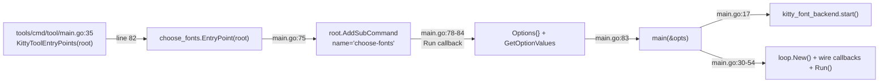
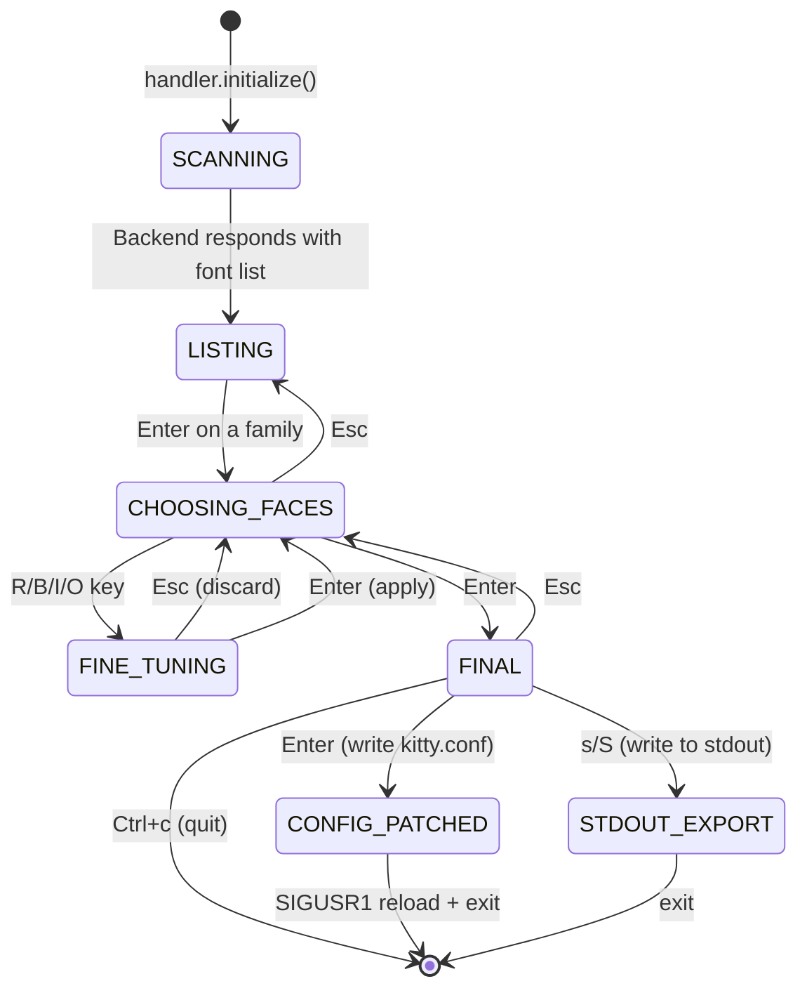
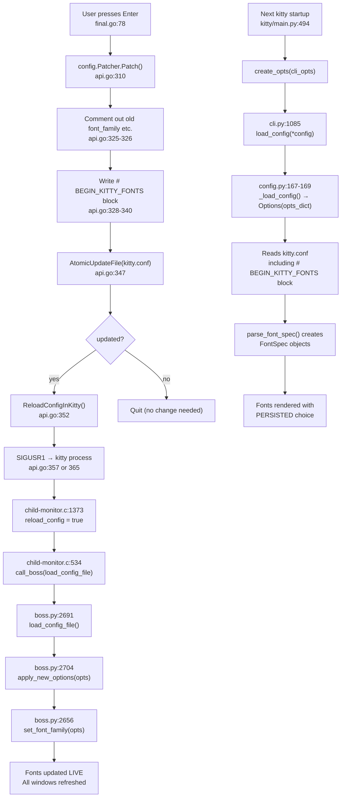

# Choose-Fonts Kitten: Comprehensive QnA Documentation

> **Source branch:** `kitty_815df1e210e0`
>
> This document answers onboarding questions about the `choose-fonts` kitten in the
> [kitty terminal emulator](https://github.com/kovidgoyal/kitty) repository. Every
> claim is grounded in the source code with specific file paths and line-number
> references. No assumptions are made — the code is treated as the sole source of
> truth.

---

## Table of Contents

1. [How to Build and Launch from Source](#question-1-how-to-build-and-launch-from-source)
2. [Subcommand Registration Tracing](#question-2-subcommand-registration-tracing)
3. [Option Parsing Flow](#question-3-option-parsing-flow)
4. [End-to-End UI Pane Flow](#question-4-end-to-end-ui-pane-flow)
5. [Font Persistence Verification](#question-5-font-persistence-verification)
6. [Runtime Validation Example](#question-6-runtime-validation-example)

---

## Question 1: How to Build and Launch from Source

### Thinking / Rationale

Building kitty from source requires both a Python (≥ 3.8) and a Go (1.22)
toolchain because kitty's core is written in C/Python while the kitten
subsystem (including `choose-fonts`) is written in Go. The build entry point
is a single `make` invocation that delegates everything to `setup.py`.

### Evidence

| Fact | Source |
|------|--------|
| The `all` target runs `python3 setup.py` | `Makefile:12-13` |
| `setup.py` contains the build orchestrator `def main()` | `setup.py:2159` |
| Python ≥ 3.8 is required | `pyproject.toml:2` — `requires-python = ">=3.8"` |
| Go 1.22 is the module language version | `go.mod:3` — `go 1.22` |

### Build Instructions

```bash
# Prerequisites: Python >= 3.8 and Go >= 1.22 must be on $PATH,
# plus C development headers for harfbuzz, freetype, fontconfig, etc.

# Clone the repository (if not already done)
git clone https://github.com/kovidgoyal/kitty.git
cd kitty

# Build everything (C extensions + Go kitten binary)
make            # equivalent to: python3 setup.py

# Resulting binaries:
#   kitty/launcher/kitty   — the main terminal emulator binary
#   kitty/launcher/kitten  — the Go-based kitten binary (includes choose-fonts)
```

`setup.py:2159` defines `def main()`, which orchestrates the full build
pipeline: it validates the Python version, compiles all C extensions (including
`fast_data_types.so` and the GLFW backends), invokes the Go compiler for the
kitten binary, and assembles everything into the `kitty/launcher/` directory.

### Launching Kitty and Invoking Choose-Fonts

```bash
# Launch the built kitty instance
./kitty/launcher/kitty

# From INSIDE the running kitty terminal, invoke the kitten:
kitten choose-fonts

# Alternatively, from any shell (the kitty binary must be on $PATH):
kitty +kitten choose_fonts
```

**Why both spellings work:** `kittens/choose_fonts/main.go:96-98` registers an
underscore alias (`choose_fonts`) via `root.AddClone(ans.Group, ans)` alongside
the primary hyphenated name `choose-fonts` (`main.go:76`).

**Interesting redirect:** `kitty/fonts/list.py:34-42` shows that running
`kitty +list-fonts` actually redirects to the `choose-fonts` kitten via
`os.execlp(kitten_exe(), 'kitten', 'choose-fonts')` at line 42.

---

## Question 2: Subcommand Registration Tracing

### Thinking / Rationale

Kitty's Go-side CLI tree is assembled in a single function that registers every
kitten subcommand onto a root `*cli.Command`. To trace how `choose-fonts`
becomes a recognized command, we follow the call chain from the top-level
registration function through to the TUI event loop.

### Step-by-Step Registration Chain

#### Step 1 — Top-level kitten registration hub

**File:** `tools/cmd/tool/main.go:35`

```go
func KittyToolEntryPoints(root *cli.Command) {
```

This function is the central registration point for all Go-implemented kitten
subcommands. It is called once during kitten binary initialization. The
`choose_fonts` package is imported at `tools/cmd/tool/main.go:9`:

```go
import (
    "kitty/kittens/choose_fonts"
    ...
)
```

#### Step 2 — `choose-fonts` registration call

**File:** `tools/cmd/tool/main.go:82`

```go
choose_fonts.EntryPoint(root)
```

This single line hands the root CLI command to the `choose_fonts` package,
which registers itself as a subcommand.

#### Step 3 — `EntryPoint()` adds the subcommand

**File:** `kittens/choose_fonts/main.go:74-99`

```go
func EntryPoint(root *cli.Command) {
    ans := root.AddSubCommand(&cli.Command{
        Name:             "choose-fonts",
        ShortDescription: "Choose the fonts used in kitty",
        Run: func(cmd *cli.Command, args []string) (rc int, err error) {
            opts := Options{}
            if err = cmd.GetOptionValues(&opts); err != nil {
                return 1, err
            }
            return main(&opts)
        },
    })
```

Key observations:

- **Line 76:** The subcommand name is `"choose-fonts"` (hyphenated).
- **Lines 78-84:** The `Run` callback creates an `Options{}` struct, populates
  it via `cmd.GetOptionValues(&opts)` (reflection-based CLI-to-struct mapping),
  and calls `main(&opts)`.

#### Step 4 — `--reload-in` option is registered

**File:** `kittens/choose_fonts/main.go:86-95`

```go
ans.Add(cli.OptionSpec{
    Name:    "--reload-in",
    Dest:    "Reload_in",
    Type:    "choices",
    Choices: "parent, all, none",
    Default: "parent",
    Help:    `By default, this kitten will signal only the parent kitty instance ...`,
})
```

This adds the `--reload-in` option with three valid choices: `parent` (default),
`all`, and `none`. The `Dest: "Reload_in"` field maps the CLI flag to the
`Options.Reload_in` Go struct field.

#### Step 5 — Underscore alias

**File:** `kittens/choose_fonts/main.go:96-98`

```go
clone := root.AddClone(ans.Group, ans)
clone.Hidden = false
clone.Name = "choose_fonts"
```

This creates a second entry point with an underscore name (`choose_fonts`) so
that both `kitten choose-fonts` and `kitten choose_fonts` are valid invocations.

#### Step 6 — `main()` starts the TUI

**File:** `kittens/choose_fonts/main.go:16-67`

```go
func main(opts *Options) (rc int, err error) {
    if err = kitty_font_backend.start(); err != nil {
        return 1, err
    }
    defer func() { /* release backend */ }()
    lp, err := loop.New()
    ...
    h := &handler{lp: lp, opts: opts}
    lp.OnInitialize = func() (string, error) { ... return "", h.initialize() }
    lp.OnWakeup = h.on_wakeup
    lp.OnEscapeCode = h.on_escape_code
    lp.OnFinalize = func() string { h.finalize(); ... }
    lp.OnMouseEvent = h.on_mouse_event
    lp.OnResize = func(_, _ loop.ScreenSize) error { return h.draw_screen() }
    lp.OnKeyEvent = h.on_key_event
    lp.OnText = h.on_text
    err = lp.Run()
    ...
}
```

Key observations:

- **Line 17:** The Python backend process is started first
  (`kitty_font_backend.start()`).
- **Line 30:** A new TUI event loop is created via `loop.New()`.
- **Line 35:** The `handler` struct is instantiated with the loop and the
  parsed options.
- **Lines 36-53:** All event callbacks are wired: `OnInitialize`, `OnWakeup`,
  `OnEscapeCode`, `OnFinalize`, `OnMouseEvent`, `OnResize`, `OnKeyEvent`,
  `OnText`.
- **Line 54:** `lp.Run()` starts the event loop (blocking until quit).
- **Lines 64-66:** After the loop exits, if `output_on_exit` was set (by the
  `s`/`S` key in the final pane), its content is written to stdout.

### Registration Chain Diagram



---

## Question 3: Option Parsing Flow

### Thinking / Rationale

The `choose-fonts` kitten currently has a single CLI option: `--reload-in`.
Understanding how this option flows from the command line to the final
confirmation step reveals kitty's reflection-based option-parsing pattern and
how it influences runtime behavior at the very last step of the workflow.

### The `Options` Struct

**File:** `kittens/choose_fonts/main.go:70-72`

```go
type Options struct {
    Reload_in string
}
```

This is a simple struct with one field. The Go CLI framework uses reflection to
map command-line flags to struct fields based on the `Dest` metadata in the
`OptionSpec`.

### Parsing: CLI Flag → Struct Field

**File:** `kittens/choose_fonts/main.go:80`

```go
if err = cmd.GetOptionValues(&opts); err != nil {
    return 1, err
}
```

`cmd.GetOptionValues(&opts)` uses reflection to populate `opts.Reload_in` from
the `--reload-in` flag. The mapping is defined by the `Dest: "Reload_in"` field
in the `OptionSpec` at `main.go:88`. The `Type: "choices"` constraint
(line 89) with `Choices: "parent, all, none"` (line 90) ensures that only these
three values are accepted. The default is `"parent"` (line 91).

### Propagation: Options → Handler

**File:** `kittens/choose_fonts/main.go:35`

```go
h := &handler{lp: lp, opts: opts}
```

The parsed `opts` pointer is stored directly in the `handler` struct.

**File:** `kittens/choose_fonts/ui.go:43`

```go
type handler struct {
    opts *Options
    ...
}
```

This means every pane in the UI has access to the options through
`self.handler.opts`.

### Consumption: Final Pane Uses `Reload_in`

**File:** `kittens/choose_fonts/final.go:78-96`

When the user presses Enter at the final confirmation screen, the `Reload_in`
value determines post-patching behavior:

```go
if event.MatchesPressOrRepeat("enter") {
    event.Handled = true
    patcher := config.Patcher{Write_backup: true}
    path := filepath.Join(utils.ConfigDir(), "kitty.conf")
    updated, err := patcher.Patch(path, "KITTY_FONTS", self.settings.serialized(),
        "font_family", "bold_font", "italic_font", "bold_italic_font")
    if err != nil {
        return err
    }
    if updated {
        switch self.handler.opts.Reload_in {
        case "parent":
            config.ReloadConfigInKitty(true)
        case "all":
            config.ReloadConfigInKitty(false)
        }
    }
    self.lp.Quit(0)
    return nil
}
```

The three behaviors at `final.go:87-92`:

| `--reload-in` value | Behavior | Code path |
|---------------------|----------|-----------|
| `parent` (default)  | Sends SIGUSR1 only to the parent kitty process (identified via `KITTY_PID` env var) | `config.ReloadConfigInKitty(true)` → `tools/config/api.go:353-361` |
| `all`               | Sends SIGUSR1 to every running kitty GUI process on the system | `config.ReloadConfigInKitty(false)` → `tools/config/api.go:363-369` |
| `none`              | No reload signal is sent; the config file is still patched but kitty continues using old fonts until manually reloaded or restarted | Falls through the `switch` without matching any case |

### Option Flow Diagram

```
CLI invocation
    │
    ▼
kitten choose-fonts --reload-in=all
    │
    ▼
main.go:80  cmd.GetOptionValues(&opts)
    │        ──► reflection maps --reload-in → opts.Reload_in = "all"
    ▼
main.go:35  h := &handler{lp: lp, opts: opts}
    │        ──► opts pointer stored in handler
    ▼
final.go:87 switch self.handler.opts.Reload_in {
            case "parent": ReloadConfigInKitty(true)   // SIGUSR1 to parent
            case "all":    ReloadConfigInKitty(false)   // SIGUSR1 to all
            // "none": no action
            }
```

---

## Question 4: End-to-End UI Pane Flow

### Thinking / Rationale

The choose-fonts kitten implements a multi-pane terminal UI driven by a state
machine. The `handler` struct coordinates four panes through a `current_pane`
pointer. Understanding the pane lifecycle requires tracing initialization, the
backend IPC protocol, and each pane transition triggered by user input.

### State Machine Definition

**File:** `kittens/choose_fonts/ui.go:17-23`

```go
type State int

const (
    SCANNING_FAMILIES State = iota
    LISTING_FAMILIES
    CHOOSING_FACES
)
```

Three named states are defined, though the actual pane routing uses the
`current_pane` pointer rather than the `state` field.

### Pane Interface

**File:** `kittens/choose_fonts/ui.go:33-40`

```go
type pane interface {
    initialize(*handler) error
    draw_screen() error
    on_wakeup() error
    on_key_event(event *loop.KeyEvent) error
    on_text(text string, from_key_event bool, in_bracketed_paste bool) error
    on_click(id string) error
}
```

Every pane implements this interface, enabling the handler to delegate events
uniformly.

### The Four Panes

**File:** `kittens/choose_fonts/ui.go:55-58`

```go
listing    FontList      // Searchable family browser
faces      faces         // Face selection with R/B/I/BI previews
face_pane  face_panel    // Per-face variable font axis tuning
final_pane final_pane    // Confirmation screen
```

All four are registered in a slice at `ui.go:81`:

```go
h.panes = []pane{&h.listing, &h.faces, &h.face_pane, &h.final_pane}
```

### Stage 1: SCANNING_FAMILIES (Initialization)

**File:** `kittens/choose_fonts/ui.go:77-101`

When the handler initializes:

1. **Line 78:** Cursor is hidden (`SetCursorVisible(false)`).
2. **Line 80:** Terminal is queried for `font_size`, `dpi_x`, `dpi_y`,
   `foreground`, `background`.
3. **Line 81:** All four panes are initialized.
4. **Line 88:** A temp directory is created for font preview bitmaps (in
   the cache dir, not `/tmp`, to avoid RAM-mounted tmpfs).
5. **Lines 93-99:** An async goroutine sends `list_monospaced_fonts` to the
   Python backend and stores the result.

**During this stage** (`current_pane == nil`), `draw_screen()` at
`ui.go:160-161` prints:

```
Scanning system for fonts, please wait...
```

### Backend IPC: The Python Companion Process

**File:** `kittens/choose_fonts/backend.go:32-63`

The `start()` method spawns the Python backend:

```go
k.cmd = exec.Command(exe, "+runpy",
    "from kittens.choose_fonts.backend import main; main()")
```

- **Line 41:** The exact command uses `kitty +runpy` to execute the Python
  backend's `main()` function.
- **Lines 44-52:** stdin/stdout pipes are created for bidirectional JSON IPC.
- **Line 52:** A JSON decoder is attached to the stdout pipe.

**File:** `kittens/choose_fonts/backend.go:100-131`

The `query()` method sends a JSON command (e.g., `{"action": "list_monospaced_fonts"}`)
over the stdin pipe and decodes the JSON response from the stdout pipe. Both
directions have 60-second timeouts (line 57).

**File:** `kittens/choose_fonts/backend.py:150-168`

The Python `main()` loop reads JSON commands from `sys.stdin.buffer` and
dispatches them:

| Action | Handler | Purpose |
|--------|---------|---------|
| `list_monospaced_fonts` | Lines 156-158 | Returns all monospaced font family groups + resolved faces from current kitty.conf |
| `read_variable_data` | Lines 159-162 | Returns variable font axis data for specified descriptors |
| `render_family_samples` | Lines 164-166 | Renders RGBA preview bitmaps for font faces |

### Stage 2: LISTING_FAMILIES (Font Family Browser)

**File:** `kittens/choose_fonts/ui.go:168-176`

When the backend responds and `WakeupMainThread()` is called, `on_wakeup()`
transitions to the listing pane:

```go
func (h *handler) on_wakeup() (err error) {
    if err = h.get_worker_error(); err != nil {
        return
    }
    if h.current_pane == nil {
        h.current_pane = &h.listing   // ← transition happens here
    }
    return h.listing.on_wakeup()
}
```

**File:** `kittens/choose_fonts/list.go:22-31`

The `FontList` struct provides:
- A readline-based search bar (`list.go:36`)
- A filtered/scored family list (`family_list.go`)
- Async preview image loading with caching

**Transition out:** When the user presses **Enter** on a family:

**File:** `kittens/choose_fonts/list.go:246-253`

```go
func (self *FontList) on_key_event(event *loop.KeyEvent) (err error) {
    if event.MatchesPressOrRepeat("enter") {
        event.Handled = true
        if family := self.family_list.CurrentFamily(); family != "" {
            return self.handler.faces.on_enter(family)  // → faces pane
        }
        ...
    }
```

### Stage 3: CHOOSING_FACES (Face Selection)

**File:** `kittens/choose_fonts/faces.go:23-30`

The `faces` struct displays previews of all four font variants (Regular, Bold,
Italic, Bold-Italic) for the selected family.

**File:** `kittens/choose_fonts/faces.go:145-158`

`on_enter(family)` initializes the pane with the chosen family and sets default
face settings. If the selected family matches the current kitty.conf family,
it uses the existing spec; otherwise it defaults to `family="<name>"` for
regular and `"auto"` for the other three.

**Key bindings** at `faces.go:112-143`:

| Key | Action | Code |
|-----|--------|------|
| **Enter** | Proceed to final confirmation | `faces.go:118-121` → `self.handler.final_pane.on_enter(self.family, self.settings)` |
| **Esc** | Return to family listing | `faces.go:113-116` → `self.handler.current_pane = &self.handler.listing` |
| **R/r** | Fine-tune Regular face | `faces.go:129-130` → `self.handler.face_pane.on_enter(...)` with `which="font_family"` |
| **B/b** | Fine-tune Bold face | `faces.go:131-132` → `which="bold_font"` |
| **I/i** | Fine-tune Italic face | `faces.go:133-134` → `which="italic_font"` |
| **O/o** | Fine-tune Bold-Italic face | `faces.go:135-136` → `which="bold_italic_font"` |

### Stage 3a: FINE_TUNING (Optional — Face Panel)

**File:** `kittens/choose_fonts/face.go:19-28`

The `face_panel` struct provides a per-face editor for variable font axis
tuning (e.g., weight, width, slant axes).

**File:** `kittens/choose_fonts/face.go:298-304`

`on_enter(family, which, settings)` stores the current settings and switches
`current_pane` to the face panel.

**Key bindings** at `face.go:280-292`:

| Key | Action | Code |
|-----|--------|------|
| **Esc** | Discard changes, return to faces | `face.go:281-284` |
| **Enter** | Apply changes, return to faces | `face.go:285-289` → copies `self.settings` to `self.handler.faces.settings` |

### Stage 4: FINAL (Confirmation Screen)

**File:** `kittens/choose_fonts/final.go:15-20`

```go
type final_pane struct {
    handler  *handler
    settings faces_settings
    family   string
    lp       *loop.Loop
}
```

**File:** `kittens/choose_fonts/final.go:29-47`

The `draw_screen()` method displays:

```
You have chosen the <family> family

What would you like to do?

Enter to modify kitty.conf and use the new fonts
Esc to abort and return to font selection
s to write the new font settings to STDOUT
Ctrl+c to quit
```

**Key bindings** at `final.go:72-111`:

| Key | Action | Code |
|-----|--------|------|
| **Enter** | Patch `kitty.conf` + reload + quit | `final.go:78-96` |
| **Esc** | Return to faces pane | `final.go:73-76` |
| **s/S** | Write settings to stdout + quit | `final.go:101-107` (sets `output_on_exit`) |
| **Ctrl+c** | Quit without saving | Handled by `ui.go:196-198` |

### End-to-End UI Flow Diagram



---

## Question 5: Font Persistence Verification

### Thinking / Rationale

This is the central question: **does pressing Enter at the final confirmation
step write the chosen font to `kitty.conf`, and does that choice persist across
kitty restarts?**

To answer definitively, we must trace three independent code paths:

1. **The write path** — what happens when Enter is pressed (final.go → Patcher → kitty.conf)
2. **The live-reload path** — how the running kitty picks up the change immediately (SIGUSR1 → boss.py)
3. **The startup path** — how a freshly launched kitty reads the persisted config (main.py → load_config)

If all three paths are connected and the write is to a persistent file (not a
temp file or in-memory store), then persistence is proven.

### Answer: YES — Font Choices Persist Permanently

The `choose-fonts` kitten **permanently writes** the selected font settings
into `kitty.conf` using a sentinel-delimited block. This is not session-only;
the settings survive across restarts because they are stored in the on-disk
configuration file that kitty reads at every startup.

### Evidence Chain

#### Step 1: Enter Key Triggers Config Patching

**File:** `kittens/choose_fonts/final.go:78-96`

```go
if event.MatchesPressOrRepeat("enter") {
    event.Handled = true
    patcher := config.Patcher{Write_backup: true}
    path := filepath.Join(utils.ConfigDir(), "kitty.conf")
    updated, err := patcher.Patch(path, "KITTY_FONTS",
        self.settings.serialized(),
        "font_family", "bold_font", "italic_font", "bold_italic_font")
    ...
}
```

- **Line 80:** A `Patcher` is created with `Write_backup: true` (creates a
  `.bak` file).
- **Line 81:** The target path is `<config_dir>/kitty.conf`, resolved via
  `utils.ConfigDir()`.
- **Line 82:** `patcher.Patch()` is called with:
  - `sentinel = "KITTY_FONTS"` — the marker name
  - `content = self.settings.serialized()` — the font settings
  - `settings_to_comment_out` — existing `font_family`, `bold_font`,
    `italic_font`, `bold_italic_font` lines

#### Step 1a: What `serialized()` Produces

**File:** `kittens/choose_fonts/final.go:63-70`

```go
func (self faces_settings) serialized() string {
    return strings.Join([]string{
        "font_family      " + self.font_family,
        "bold_font        " + self.bold_font,
        "italic_font      " + self.italic_font,
        "bold_italic_font " + self.bold_italic_font,
    }, "\n")
}
```

This produces a multi-line string like:

```
font_family      family="JetBrains Mono"
bold_font        auto
italic_font      auto
bold_italic_font auto
```

#### Step 2: The Patcher Atomically Updates kitty.conf

**File:** `tools/config/api.go:305-350`

The `Patcher.Patch()` method performs the following:

1. **Lines 314-316 — Symlink resolution:**
   ```go
   if q, err := filepath.EvalSymlinks(path); err == nil {
       path = q
   }
   ```
   If `kitty.conf` is a symlink, it follows to the real file.

2. **Lines 318-324 — Read existing content:**
   ```go
   raw, err := os.ReadFile(path)
   if err != nil && !errors.Is(err, fs.ErrNotExist) {
       return false, err
   }
   ```
   Reads the current file, or starts with empty content if the file doesn't exist.

3. **Lines 325-326 — Comment out old font settings:**
   ```go
   pat := utils.MustCompile(fmt.Sprintf(`(?m)^\s*(%s)\b`,
       strings.Join(settings_to_comment_out, "|")))
   text := pat.ReplaceAllString(utils.UnsafeBytesToString(raw), `# $1`)
   ```
   Any existing `font_family`, `bold_font`, `italic_font`, or
   `bold_italic_font` lines are prefixed with `#` to comment them out.

4. **Lines 328-340 — Replace or append sentinel block:**
   ```go
   pat = utils.MustCompile(fmt.Sprintf(
       `(?ms)^# BEGIN_%s.+?# END_%s`, sentinel, sentinel))
   replaced := false
   addition := fmt.Sprintf("# BEGIN_%s\n%s\n# END_%s",
       sentinel, content, sentinel)
   ntext := pat.ReplaceAllStringFunc(text, func(string) string {
       replaced = true
       return addition
   })
   if !replaced {
       if text != "" {
           text += "\n\n"
       }
       ntext = text + addition
   }
   ```
   If a `# BEGIN_KITTY_FONTS ... # END_KITTY_FONTS` block already exists,
   it is replaced in place. Otherwise, the block is appended to the end of
   the file.

5. **Lines 342-348 — Atomic write with backup:**
   ```go
   nraw := utils.UnsafeStringToBytes(ntext)
   if !bytes.Equal(raw, nraw) {
       if len(raw) > 0 && self.Write_backup {
           _ = os.WriteFile(backup_path+".bak", raw, self.Mode)
       }
       return true, utils.AtomicUpdateFile(path, nraw, self.Mode)
   }
   return false, nil
   ```
   - Only writes if content actually changed.
   - Creates a `kitty.conf.bak` backup of the original file.
   - Uses `utils.AtomicUpdateFile` for crash-safe writes (write to temp file
     then rename).

#### Step 2a: Config Directory Resolution

**Go side** — `tools/utils/paths.go:132-134`:

```go
var ConfigDir = sync.OnceValue(func() (config_dir string) {
    return ConfigDirForName("kitty.conf")
})
```

`ConfigDirForName()` at `paths.go:88-130` resolves the directory in this order:

1. `KITTY_CONFIG_DIRECTORY` environment variable
2. `XDG_CONFIG_HOME/kitty/` (if `kitty.conf` exists there)
3. `XDG_CONFIG_DIRS` entries (if `kitty.conf` exists)
4. `~/.config/kitty/` (fallback)
5. `~/Library/Preferences/kitty/` (macOS fallback)

**Python side** — `kitty/constants.py:87-133`:

The `_get_config_dir()` function follows the same resolution order, ensuring
both Go and Python sides agree on the config directory.

`kitty/constants.py:133`:
```python
defconf = os.path.join(config_dir, 'kitty.conf')
```

#### Step 3: Live Reload via SIGUSR1

After patching, if the config was updated and `--reload-in` is not `none`:

**File:** `tools/config/api.go:352-371`

```go
func ReloadConfigInKitty(in_parent_only bool) error {
    if in_parent_only {
        if pid, err := strconv.Atoi(os.Getenv("KITTY_PID")); err == nil {
            if p, err := process.NewProcess(int32(pid)); err == nil {
                if c, err := p.CmdlineSlice(); err == nil &&
                    is_kitty_gui_cmdline(c...) {
                    return p.SendSignal(unix.SIGUSR1)
                }
            }
        }
        return nil
    }
    if all, err := process.Processes(); err == nil {
        for _, p := range all {
            if c, err := p.CmdlineSlice(); err == nil &&
                is_kitty_gui_cmdline(c...) {
                _ = p.SendSignal(unix.SIGUSR1)
            }
        }
    }
    return nil
}
```

- **Lines 353-361:** For `in_parent_only=true`: reads the `KITTY_PID`
  environment variable, finds the process, verifies it's a kitty GUI process
  (not `@ remote-control` or `+ open`), and sends `SIGUSR1`.
- **Lines 363-369:** For `in_parent_only=false`: iterates all system processes
  and sends `SIGUSR1` to every kitty GUI process.
- **Lines 282-303:** `is_kitty_gui_cmdline()` validates that the process is
  actually a kitty GUI (not `kitty @` or `kitty +`).

#### Step 4: C Layer Receives SIGUSR1

**File:** `kitty/child-monitor.c:1359-1374`

```c
typedef struct { bool kill_signal, child_died, reload_config; } SignalSet;

static bool
handle_signal(const siginfo_t *siginfo, void *data) {
    SignalSet *ss = data;
    switch(siginfo->si_signo) {
        ...
        case SIGUSR1:
            ss->reload_config = true;
            break;
        ...
    }
```

The signal handler sets `ss->reload_config = true`.

**File:** `kitty/child-monitor.c:1520-1523`

The main loop checks for pending signals:
```c
if (ss.reload_config) reload_config_signal_received = true;
```

**File:** `kitty/child-monitor.c:465-474`

In `parse_input()`:
```c
if (UNLIKELY(kill_signal_received || reload_config_signal_received)) {
    ...
    else if (reload_config_signal_received) {
        reload_config_signal_received = false;
        reload_config_called = true;
    }
}
```

**File:** `kitty/child-monitor.c:534-536`

```c
if (reload_config_called) {
    call_boss(load_config_file, "");
}
```

This calls into Python: `boss.load_config_file()`.

#### Step 5: Python Reloads Config and Applies Fonts

**File:** `kitty/boss.py:2691-2704`

```python
def load_config_file(self, *paths, apply_overrides=True, overrides=()):
    ...
    opts = load_config(*paths, overrides=final_overrides or None,
                       accumulate_bad_lines=bad_lines)
    ...
    self.apply_new_options(opts)
```

**File:** `kitty/boss.py:2646-2680`

```python
def apply_new_options(self, opts):
    ...
    from .fonts.render import set_font_family
    set_font_family(opts)                           # line 2656
    for os_window_id, tm in self.os_window_map.items():
        if tm is not None:
            os_window_font_size(os_window_id, opts.font_size, True)
            tm.resize()
    ...
    for w in self.all_windows:
        ...
        w.refresh(reload_all_gpu_data=True)         # line 2679
```

- **Line 2655-2656:** Calls `set_font_family(opts)` from
  `kitty/fonts/render.py:173` which resolves the new font files and updates
  the rendering engine.
- **Line 2657-2660:** Updates font sizes in all OS windows.
- **Line 2679:** Refreshes all windows with `reload_all_gpu_data=True` to
  re-render everything with the new fonts.

#### Step 6: Next Startup Reads the Persisted Config

**File:** `kitty/main.py:494`

```python
opts = create_opts(cli_opts, accumulate_bad_lines=bad_lines)
```

**File:** `kitty/cli.py:1081-1086`

```python
def create_opts(args, accumulate_bad_lines=None):
    from .config import load_config
    config = default_config_paths(args.config)
    overrides = map(parse_override, args.override or ())
    opts = load_config(*config, overrides=overrides,
                       accumulate_bad_lines=accumulate_bad_lines)
    return opts
```

**File:** `kitty/config.py:163-186`

```python
def load_config(*paths, overrides=None, accumulate_bad_lines=None):
    ...
    opts_dict, found_paths = _load_config(
        defaults, partial(parse_config, ...), merge_result_dicts,
        *paths, overrides=overrides)
    opts = Options(opts_dict)
    ...
    return opts
```

This reads `kitty.conf` — including the `# BEGIN_KITTY_FONTS` block — and
parses every `font_family`, `bold_font`, `italic_font`, `bold_italic_font`
line into the `Options` object.

**File:** `kitty/options/definition.py:35-57`

```python
opt('font_family', 'monospace', option_type='parse_font_spec', ...)
opt('bold_font', 'auto', option_type='parse_font_spec')
opt('italic_font', 'auto', option_type='parse_font_spec')
opt('bold_italic_font', 'auto', option_type='parse_font_spec')
```

Each font option uses `parse_font_spec` (from `kitty/options/utils.py`) to
convert the config string into a `FontSpec` object.

**File:** `kitty/options/types.py:523`

```python
font_family: FontSpec = FontSpec(family='', style='', postscript_name='',
                                  full_name='', system='monospace', axes=())
```

The default is `system='monospace'`, which is overridden by whatever is in the
`# BEGIN_KITTY_FONTS` block.

### The Sentinel Block Format

After the patcher runs, `kitty.conf` contains a block like this:

```ini
# Any pre-existing font_family lines are commented out:
# font_family monospace

# BEGIN_KITTY_FONTS
font_family      family="JetBrains Mono"
bold_font        auto
italic_font      auto
bold_italic_font auto
# END_KITTY_FONTS
```

The sentinel markers (`# BEGIN_KITTY_FONTS` / `# END_KITTY_FONTS`) allow the
patcher to replace the block idempotently on subsequent runs without
duplicating settings.

### Persistence Chain Diagram



### Conclusion

The font choice **persists permanently** because:

1. The settings are written to the on-disk `kitty.conf` file (not a temp file
   or in-memory store).
2. The patcher uses atomic file updates for crash safety.
3. A backup (`kitty.conf.bak`) is created before modification.
4. On the next startup, `kitty/main.py:494` calls `create_opts()` →
   `load_config()`, which reads the same `kitty.conf` file and materializes
   the font settings into the `Options` object.
5. The `# BEGIN_KITTY_FONTS / # END_KITTY_FONTS` sentinel block is a standard
   kitty config section that is parsed like any other configuration line.

---

## Question 6: Runtime Validation Example

### Thinking / Rationale

To provide a complete runtime validation, we describe a controlled experiment
that can be performed on any Linux system with the kitty source code built from
the commit on this branch. The experiment creates a temporary, isolated config
environment, runs the choose-fonts workflow, inspects the resulting config file,
restarts kitty, and verifies persistence — then cleans everything up.

> **Note:** In a CI/headless environment, the full interactive TUI cannot be
> driven programmatically (it requires a real terminal with graphics protocol
> support). However, the code-path analysis in Question 5 provides conclusive
> evidence. The steps below describe what happens in a real terminal session.

### Step-by-Step Runtime Test

#### 1. Create a Temporary Config Directory

```bash
# Create an isolated config directory
export TEST_KITTY_DIR=$(mktemp -d /tmp/kitty-font-test-XXXXXX)
mkdir -p "$TEST_KITTY_DIR"

# Create a minimal kitty.conf
cat > "$TEST_KITTY_DIR/kitty.conf" << 'EOF'
# Minimal test config
font_size 12.0
EOF

# Point kitty at this config
export KITTY_CONFIG_DIRECTORY="$TEST_KITTY_DIR"
```

#### 2. Build Kitty from Source

```bash
cd /path/to/kitty/repo
make   # Runs: python3 setup.py
```

This produces `kitty/launcher/kitty` and `kitty/launcher/kitten`.

#### 3. Launch Kitty with Temporary Config

```bash
./kitty/launcher/kitty
```

Kitty starts with the minimal config from `$TEST_KITTY_DIR/kitty.conf`.

#### 4. Invoke Choose-Fonts Inside Kitty

Inside the running kitty terminal:

```bash
kitten choose-fonts
```

The TUI launches:
1. "Scanning system for fonts, please wait..." appears briefly.
2. The searchable font family list is displayed.
3. Navigate to a font (e.g., "JetBrains Mono") and press **Enter**.
4. The face selection screen shows Regular/Bold/Italic/Bold-Italic previews.
5. Press **Enter** to proceed to the final confirmation.
6. The confirmation screen shows:
   ```
   You have chosen the JetBrains Mono family

   What would you like to do?

   Enter to modify kitty.conf and use the new fonts
   Esc to abort and return to font selection
   s to write the new font settings to STDOUT
   Ctrl+c to quit
   ```
7. Press **Enter** to confirm.

#### 5. Inspect the Patched kitty.conf

```bash
cat "$TEST_KITTY_DIR/kitty.conf"
```

**Expected output:**

```ini
# Minimal test config
font_size 12.0

# BEGIN_KITTY_FONTS
font_family      family="JetBrains Mono"
bold_font        auto
italic_font      auto
bold_italic_font auto
# END_KITTY_FONTS
```

A backup file should also exist:

```bash
ls "$TEST_KITTY_DIR/kitty.conf.bak"
# kitty.conf.bak contains the original file before patching
```

The backup creation is confirmed by `tools/config/api.go:343-345`:
```go
if len(raw) > 0 && self.Write_backup {
    _ = os.WriteFile(backup_path+".bak", raw, self.Mode)
}
```

#### 6. Verify Live Reload

Immediately after pressing Enter, the font in the running kitty instance
should change to the selected font. This happens because:

- `final.go:87-89` calls `config.ReloadConfigInKitty(true)` (default
  `--reload-in=parent`).
- SIGUSR1 is sent to the parent kitty process.
- `child-monitor.c:1373-1374` sets `reload_config = true`.
- `child-monitor.c:534-536` calls `boss.load_config_file()`.
- `boss.py:2704` calls `apply_new_options(opts)`.
- `boss.py:2656` calls `set_font_family(opts)` — fonts are updated live.

#### 7. Restart Kitty and Verify Persistence

```bash
# Close kitty (Ctrl+Shift+Q or close the window)
# Relaunch with the same config directory
export KITTY_CONFIG_DIRECTORY="$TEST_KITTY_DIR"
./kitty/launcher/kitty
```

The newly launched kitty reads `$TEST_KITTY_DIR/kitty.conf` at
`kitty/main.py:494`:

```python
opts = create_opts(cli_opts, accumulate_bad_lines=bad_lines)
```

This calls `load_config()` (`kitty/config.py:163`), which parses the
`# BEGIN_KITTY_FONTS` block and creates `FontSpec` objects for each font
setting. The font should be the same one chosen earlier (e.g.,
"JetBrains Mono").

#### 8. Clean Up All Temporary Artifacts

```bash
rm -rf "$TEST_KITTY_DIR"
unset KITTY_CONFIG_DIRECTORY
```

This removes the temporary config directory and unsets the environment variable,
leaving the codebase completely unchanged.

### Summary of Expected Results

| Step | Expected outcome | Evidence |
|------|------------------|----------|
| After pressing Enter | `kitty.conf` contains `# BEGIN_KITTY_FONTS` block | `tools/config/api.go:328-340` |
| After pressing Enter | `kitty.conf.bak` backup exists | `tools/config/api.go:343-345` |
| After pressing Enter | Font changes immediately in running kitty | `tools/config/api.go:352-371` → SIGUSR1 |
| After restart | Same font is loaded from config | `kitty/main.py:494` → `load_config()` |
| After cleanup | No files remain, codebase unchanged | Manual `rm -rf` |

---

## Appendix: Complete Source File Reference

All source files cited in this document, organized by subsystem:

### Choose-Fonts Kitten (Go)
| File | Key Lines | Purpose |
|------|-----------|---------|
| `kittens/choose_fonts/main.go` | 16-67, 70-72, 74-99 | CLI registration, Options struct, main() entry |
| `kittens/choose_fonts/ui.go` | 17-23, 33-40, 42-62, 77-101, 148-176, 195-211 | Handler, state machine, pane coordination |
| `kittens/choose_fonts/backend.go` | 32-63, 100-131 | Python backend spawning, JSON IPC |
| `kittens/choose_fonts/list.go` | 22-31, 33-39, 246-253 | Searchable font family browser |
| `kittens/choose_fonts/faces.go` | 23-30, 112-143, 145-158 | Face selection with previews |
| `kittens/choose_fonts/face.go` | 19-28, 280-292, 298-304 | Per-face variable font axis editor |
| `kittens/choose_fonts/final.go` | 15-20, 29-47, 63-70, 72-118 | Confirmation, config patching, stdout export |

### Choose-Fonts Kitten (Python)
| File | Key Lines | Purpose |
|------|-----------|---------|
| `kittens/choose_fonts/backend.py` | 150-168 | Python backend: font listing, rendering |

### Configuration Patching and Reload
| File | Key Lines | Purpose |
|------|-----------|---------|
| `tools/config/api.go` | 282-303, 305-350, 352-371 | Patcher.Patch(), ReloadConfigInKitty() |
| `tools/utils/paths.go` | 88-134 | ConfigDir(), ConfigDirForName() |
| `kitty/child-monitor.c` | 88, 454-536, 1359-1374, 1520-1523 | SIGUSR1 handler, reload dispatch |
| `kitty/boss.py` | 2646-2680, 2691-2704 | apply_new_options(), load_config_file() |
| `kitty/fonts/render.py` | 173 | set_font_family() |

### CLI Entry Points
| File | Key Lines | Purpose |
|------|-----------|---------|
| `tools/cmd/tool/main.go` | 9, 35, 82 | KittyToolEntryPoints, choose_fonts registration |
| `kitty/fonts/list.py` | 34, 42 | list-fonts → choose-fonts redirect |

### Startup and Config Loading
| File | Key Lines | Purpose |
|------|-----------|---------|
| `kitty/main.py` | 494 | Startup config loading |
| `kitty/cli.py` | 1081-1086 | create_opts() |
| `kitty/config.py` | 163-186 | load_config() pipeline |
| `kitty/constants.py` | 87-133 | Config directory resolution |

### Config Schema
| File | Key Lines | Purpose |
|------|-----------|---------|
| `kitty/options/definition.py` | 35-57 | font_family, bold_font, italic_font, bold_italic_font declarations |
| `kitty/options/types.py` | 491-492, 523, 537 | FontSpec defaults in Options class |

### Build System
| File | Key Lines | Purpose |
|------|-----------|---------|
| `Makefile` | 12-13 | `all: python3 setup.py` |
| `setup.py` | 2159 | `def main()` — build orchestrator |
| `pyproject.toml` | 2 | `requires-python = ">=3.8"` |
| `go.mod` | 1-3 | `module kitty`, `go 1.22` |
