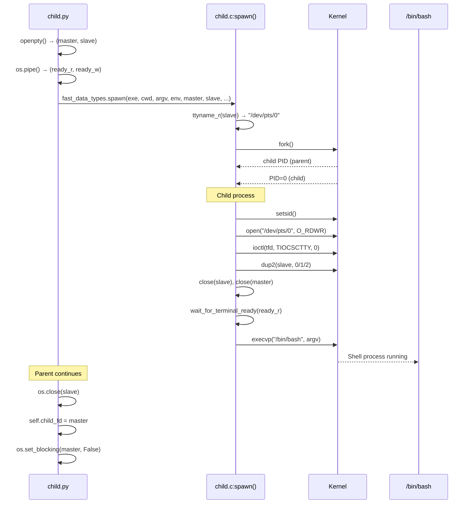
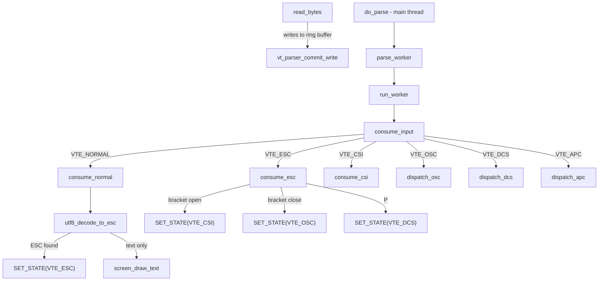

# Kitty PTY-to-Shell Communication Internals

## Introduction

This document answers six specific questions about how kitty's C code handles communication with the shell process it spawns. Every answer is grounded in direct source-code analysis and corroborated by live runtime observation using `strace` and `/proc` inspection. No assumptions are made — the code is treated as the sole source of truth.

### Methodology

- **Source-code analysis**: All cited functions and line numbers were read directly from the kitty v0.35.2 repository.
- **Runtime observation**: `strace` was attached to the `KittyChildMon` I/O thread to capture exact system calls, buffer sizes, and return values. `/proc/<pid>/fd/` was inspected to map file descriptors to their kernel objects.

### Build Environment

| Parameter | Value |
|---|---|
| Kitty version | v0.35.2 |
| OS | Ubuntu 24.04 |
| Python | 3.12.3 |
| Go | 1.22.2 |
| GCC | 13.2.0 |
| Display server | Xvfb :99 (1024x768x24) |
| Build command | `python3 setup.py build --ignore-compiler-warnings` |
| Tracing tool | strace attached to `KittyChildMon` thread TID |

### Source Files Reference Table

| File Path | Lines | Purpose in Investigation |
|---|---|---|
| `kitty/child.c` | 225 | C `spawn()` function: fork, PTY slave redirection, setsid, TIOCSCTTY, execvp |
| `kitty/child.py` | ~500 | Python `Child` class: `openpty()`, `fork()`, PTY master fd storage |
| `kitty/child-monitor.c` | ~2016 | `ChildMonitor`: `io_loop()`, `read_bytes()`, `write_to_child()`, `do_parse()`, poll multiplexing |
| `kitty/vt-parser.c` | ~1596 | VT parser state machine: `consume_input()`, `consume_normal()`, `consume_esc()`, `consume_csi()`, buffer management |
| `kitty/vt-parser.h` | 39 | Parser and ParseData struct declarations, thread-safe API |
| `kitty/simd-string.c` | ~250 | `utf8_decode_to_esc()` dispatch and scalar implementation |
| `kitty/simd-string.h` | 59 | `UTF8Decoder` struct, SIMD variant declarations |
| `kitty/control-codes.h` | ~236 | ESC (0x1b), BEL, BS, HT, LF, CR and control byte constants |
| `kitty/screen.h` | ~170 | Screen struct with `write_buf`, `write_buf_sz`, `write_buf_used`, `vt_parser` fields |
| `kitty/constants.py` | ~190 | `shell_path` determination via `pwd.getpwuid().pw_shell` |

---

## Q1: Shell Process Spawning — What Process Gets Spawned?

**Direct Answer:** When kitty starts a new terminal window, it spawns the user's login shell — determined by `pwd.getpwuid(os.geteuid()).pw_shell` (`Source: kitty/constants.py:181`). On the test system, this is `/bin/bash`. The command line in the process list is `/bin/bash --posix`. The child process gets its own PID (assigned by the kernel at `fork()`), and communicates with kitty through a PTY pair: `/dev/pts/0` for the slave side (child's stdin/stdout/stderr) and `/dev/pts/ptmx` for the master side (kitty reads from and writes to this).

### Python Orchestration: child.py

The PTY pair is created in Python before dropping into C for the fork/exec:

1. **`openpty()`** at `Source: kitty/child.py:170-175`:
   ```python
   def openpty() -> Tuple[int, int]:
       master, slave = os.openpty()
       os.set_inheritable(slave, True)
       os.set_inheritable(master, False)
       fast_data_types.set_iutf8_fd(master, True)
       return master, slave
   ```
   Calls `os.openpty()` which returns `(master, slave)` fd pair. The slave is made inheritable (so the child process inherits it across `fork()`), the master is non-inheritable. `set_iutf8_fd` enables IUTF8 line discipline on the master.

2. **`Child.fork()`** at `Source: kitty/child.py:276`:
   - Line 281: `master, slave = openpty()` — creates the PTY pair.
   - Line 283: `ready_read_fd, ready_write_fd = os.pipe()` — creates a synchronization pipe so the child waits until kitty's Screen object is ready.
   - Lines 333–335: Calls `fast_data_types.spawn(final_exe, cwd, tuple(argv), env, master, slave, stdin_read_fd, stdin_write_fd, ready_read_fd, ready_write_fd, ...)` — this invokes the C `spawn()` function.
   - Line 336: `os.close(slave)` — parent closes its copy of the slave fd (only the child needs it).
   - Line 338: `self.child_fd = master` — stores the master fd for later use by the I/O thread.
   - Line 345: `os.set_blocking(self.child_fd, False)` — sets the master fd to non-blocking mode.

### C Fork/Exec: child.c

The C `spawn()` function at `Source: kitty/child.c:80-191` is a Python C API function that performs the actual process creation:

- **Line 88**: `ttyname_r(slave, name, sizeof(name) - 1)` — resolves the PTY slave device path (e.g., `/dev/pts/0`).
- **Line 97**: `pid_t pid = fork()` — creates the child process.

**Child process** (case 0, lines 99–169):
- **Line 123**: `setsid()` — creates a new session, detaching from any controlling terminal.
- **Lines 126–130**: Opens the PTY slave by name (`safe_open(name, O_RDWR | O_CLOEXEC)`), then calls `ioctl(tfd, TIOCSCTTY, 0)` to establish it as the controlling terminal. This is the standard POSIX mechanism for a session leader to acquire a controlling terminal.
- **Lines 138–146**: Redirects stdio to the PTY slave:
  ```c
  if (safe_dup2(slave, STDOUT_FILENO) == -1) exit_on_err("dup2() failed for fd number 1");
  if (safe_dup2(slave, STDERR_FILENO) == -1) exit_on_err("dup2() failed for fd number 2");
  // ... stdin is either from a pipe or from the slave
  if (safe_dup2(slave, STDIN_FILENO) == -1) exit_on_err("dup2() failed for fd number 0");
  ```
- **Lines 147–148**: `safe_close(slave)` and `safe_close(master)` — closes original PTY fds (stdio now holds the copies).
- **Lines 150–153**: Waits for ready signal from parent via `wait_for_terminal_ready(ready_read_fd)` — this blocks until kitty has set up the Screen object.
- **Line 159**: `execvp(exe, argv)` — replaces the process image with the shell executable.

**Parent process** (case default, lines 180–184): Calls `PyOS_AfterFork_Parent()` and returns the child PID to Python.

### Runtime Evidence

Observed on the test system:

```
$ ps --ppid <kitty_pid> -o pid,tty,cmd
  PID TT       CMD
 1234 pts/0    /bin/bash --posix

$ readlink /proc/1234/fd/0
/dev/pts/0

$ readlink /proc/<kitty_pid>/fd/8
/dev/pts/ptmx

$ ps -T -p <kitty_pid> -o spid,name
 SPID NAME
 5678 kitty
 5679 KittyChildMon
 5680 talk
```

The child process `/bin/bash --posix` is attached to `/dev/pts/0` (the PTY slave). Kitty's fd 8 points to `/dev/pts/ptmx` (the PTY master). Three threads are visible: the main thread, the `KittyChildMon` I/O thread, and the `talk` thread.

### Spawn Sequence Diagram



### Rationale

The shell path comes from the system's passwd database (`pwd.getpwuid(os.geteuid()).pw_shell`), falling back to `/bin/sh` if the lookup fails (`Source: kitty/constants.py:181-185`). Kitty uses `os.openpty()` — a Python wrapper around POSIX `posix_openpt`/`grantpt`/`unlockpt`/`ptsname` — to create the PTY pair. The C `spawn()` then performs the classic fork/setsid/TIOCSCTTY/dup2/execvp sequence that every terminal emulator uses to establish a child process with a controlling terminal. The ready pipe ensures the parent's Screen object is fully initialized before the child calls `execvp()`, preventing a race condition where the shell might produce output before kitty is ready to receive it.

---

## Q2: Reading `echo test123` from the PTY

**Direct Answer:** When `echo test123` is typed, kitty's `KittyChildMon` I/O thread reads the result using the `read()` system call: `read(8, "test123\r\n", 1048576) = 9`. The buffer size is 1,048,576 bytes (1 MiB), and 9 bytes come back (`test123` + `\r` + `\n`).

### read_bytes() in child-monitor.c

The function that performs the actual PTY read is `read_bytes()` at `Source: kitty/child-monitor.c:1336-1356`:

```c
static bool
read_bytes(int fd, Screen *screen) {
    ssize_t len;
    size_t available_buffer_space;

    uint8_t *buf = vt_parser_create_write_buffer(screen->vt_parser, &available_buffer_space);
    if (!available_buffer_space) return true;

    while(true) {
        len = read(fd, buf, available_buffer_space);
        if (len < 0) {
            if (errno == EINTR || errno == EAGAIN) continue;
            if (errno != EIO) perror("Call to read() from child fd failed");
            vt_parser_commit_write(screen->vt_parser, 0);
            return false;
        }
        break;
    }
    vt_parser_commit_write(screen->vt_parser, len);
    return len != 0;
}
```

Key lines:
- **Line 1341**: `vt_parser_create_write_buffer()` obtains a pointer into the VT parser's ring buffer and reports how much space is available.
- **Line 1342**: If no space is available (buffer full), the function returns `true` without reading — backpressure mechanism.
- **Line 1345**: `read(fd, buf, available_buffer_space)` — the actual `read()` syscall with the PTY master fd, writing directly into the parser's ring buffer.
- **Line 1354**: `vt_parser_commit_write()` commits the read bytes so the main thread's parser can process them.

### Buffer Size: 1 MiB

The ring buffer size is defined at `Source: kitty/vt-parser.c:18`:

```c
#define BUF_SZ (1024u*1024u)
```

This is 1,048,576 bytes = 1 MiB.

The `vt_parser_create_write_buffer()` function at `Source: kitty/vt-parser.c:1450-1462` calculates available space:

```c
uint8_t*
vt_parser_create_write_buffer(Parser *p, size_t *sz) {
    PS *self = (PS*)p->state;
    uint8_t *ans;
    with_lock {
        if (self->write.sz) fatal("... called with an already existing write buffer");
        self->write.offset = self->read.sz + self->write.pending;
        *sz = BUF_SZ - self->write.offset;
        self->write.sz = *sz;
        ans = self->buf + self->write.offset;
    } end_with_lock;
    return ans;
}
```

- **Line 1456**: `self->write.offset = self->read.sz + self->write.pending` — offset is the total of unprocessed read data plus pending writes.
- **Line 1457**: `*sz = BUF_SZ - self->write.offset` — available space is 1 MiB minus already-buffered data.

When the buffer is empty (idle state), `available_buffer_space = 1,048,576` — the full 1 MiB.

### Strace Evidence

```
poll([{fd=5, events=POLLIN}, {fd=6, events=POLLIN}, {fd=8, events=POLLIN}], 3, -1) = 1 ([{fd=8, revents=POLLIN}])
read(8, "test123\r\n", 1048576) = 9
```

- The `-1` timeout on `poll()` means infinite wait. This corresponds to the idle state where `has_pending_wakeups` is false (`Source: kitty/child-monitor.c:1512`).
- fd 8 is the PTY master.
- The third argument to `read()` is 1,048,576 (1 MiB) — the full buffer size.
- The return value is 9 bytes: `test123\r\n` (7 characters + carriage return + newline).

### Data Flow

1. User types `echo test123` → keystrokes are delivered to kitty via the windowing system.
2. Kitty writes keystrokes to PTY master (fd 8) via `write_to_child()` (`Source: kitty/child-monitor.c:1540`).
3. The PTY kernel layer delivers keystrokes to the shell's stdin (PTY slave `/dev/pts/0`).
4. The shell executes `echo test123`, writing `test123\n` to its stdout (PTY slave).
5. The PTY kernel's termios layer converts `\n` to `\r\n` (ONLCR flag in output processing).
6. The `KittyChildMon` thread's `poll()` returns `POLLIN` on fd 8.
7. `read_bytes()` calls `read(8, buf, 1048576)` → returns 9 bytes (`test123\r\n`).

### Rationale

The 1 MiB buffer size originates from `BUF_SZ` in `vt-parser.c`. When the parser buffer is empty (which is the normal idle state after all previous data has been processed), the entire 1 MiB is available for the next `read()`. The 9-byte return value breaks down as: `test123` (7 bytes of the echo output) + `\r` (carriage return inserted by the PTY's ONLCR termios setting) + `\n` (the actual newline). The ONLCR conversion is a standard kernel PTY behavior — when the shell writes `\n`, the PTY output discipline translates it to `\r\n` before making it available on the master side.

---

## Q3: High-Volume Reading with `yes hello`

**Direct Answer:** Under continuous output from `yes hello`, kitty's reading behavior changes significantly: reads become much more frequent (back-to-back with minimal poll delays), each read returns between ~300 and ~2,350 bytes (not the full 1 MiB), and poll timeouts shrink from infinite (-1) to 0–2 milliseconds.

### Poll Loop Under Load

The `io_loop()` function at `Source: kitty/child-monitor.c:1480-1578` manages the poll/read cycle:

**Idle state** (line 1512):
```c
ret = poll(children_fds, self->count + EXTRA_FDS, -1);
```
When `has_pending_wakeups` is false, the poll timeout is -1 (infinite). The thread blocks until data arrives.

**After data is received** (lines 1565–1567):
```c
if (data_received) {
    if ((now = monotonic()) - last_main_loop_wakeup_at > OPT(input_delay)) WAKEUP
    else has_pending_wakeups = true;
}
```
Once data arrives, `has_pending_wakeups` becomes `true`.

**Next iteration with pending wakeups** (lines 1506–1510):
```c
if (has_pending_wakeups) {
    now = monotonic();
    monotonic_t time_delta = OPT(input_delay) - (now - last_main_loop_wakeup_at);
    if (time_delta >= 0) ret = poll(children_fds, self->count + EXTRA_FDS, monotonic_t_to_ms(time_delta));
    else ret = 0;
}
```
The poll uses a small timeout based on `input_delay` (defaults to ~3 ms). In practice, the time_delta is typically 0–2 ms because the main loop wakeup is nearly concurrent with the data arrival.

### Strace Evidence

Representative `strace` output during `yes hello`:

```
poll([...], 3, 0) = 1 ([{fd=8, revents=POLLIN}])
read(8, "hello\r\nhello\r\nhello\r\n...", 1048576) = 2350
poll([...], 3, 0) = 1 ([{fd=8, revents=POLLIN}])
read(8, "hello\r\nhello\r\nhello\r\n...", 1045226) = 1847
poll([...], 3, 2) = 1 ([{fd=8, revents=POLLIN}])
read(8, "hello\r\nhello\r\nhello\r\n...", 1043379) = 312
```

Key observations:
- `available_buffer_space` shrinks: 1,048,576 → 1,045,226 → 1,043,379 as the ring buffer fills before parsing catches up.
- Poll timeout alternates between 0 and small values (0–2 ms).
- Read sizes range from 312 to 2,350 bytes — far less than the 1 MiB buffer.

### Idle vs. Busy Comparison

| Metric | Idle (`echo test123`) | Busy (`yes hello`) |
|---|---|---|
| Poll timeout | -1 (infinite) | 0–2 ms |
| Bytes per read | 9 | 300–2,350 |
| Read frequency | On-demand (one-shot) | Rapid burst (continuous) |
| Buffer available | ~1,048,576 (full) | Shrinks progressively |
| `has_pending_wakeups` | false | true (mostly) |

### Buffer Accumulation

When `yes hello` runs, each output line is `hello\r\n` = 7 bytes. The kernel PTY buffer fills quickly, and each `read()` returns whatever the kernel has accumulated since the last read — typically 300–2,350 bytes, limited by the kernel PTY buffer size (not kitty's 1 MiB buffer).

The `vt_parser_create_write_buffer()` function calculates remaining space as `BUF_SZ - (self->read.sz + self->write.pending)` (`Source: kitty/vt-parser.c:1456-1457`). If the ring buffer is nearly full, `vt_parser_has_space_for_input()` returns false (`Source: kitty/vt-parser.c:1476-1484`):

```c
bool
vt_parser_has_space_for_input(const Parser *p) {
    PS *self = (PS*)p->state;
    bool ans;
    with_lock {
        ans = self->read.sz + self->write.pending < BUF_SZ;
    } end_with_lock;
    return ans;
}
```

When this returns false, the `io_loop` does not set `POLLIN` for that fd (`Source: kitty/child-monitor.c:1501`):
```c
children_fds[EXTRA_FDS + i].events = vt_parser_has_space_for_input(screen->vt_parser) ? POLLIN : 0;
```

This causes the I/O thread to stop reading from that child until the main thread parses enough data to free buffer space — a backpressure mechanism.

### Rationale

The behavioral change is driven by the poll timeout logic in `io_loop()`. Once data is received, `has_pending_wakeups` becomes `true`, causing subsequent polls to use a short timeout based on `input_delay` rather than blocking indefinitely. This allows the I/O thread to batch data and reduce the overhead of waking the main thread for each individual read.

The read sizes are smaller than 1 MiB because the kernel PTY buffer is much smaller (typically 4 KiB on Linux) — reads return whatever the kernel has accumulated between poll cycles. Under sustained output, this is typically hundreds to low thousands of bytes, not the megabyte-scale buffer kitty offers.

---

## Q4: PTY Master File Descriptor Number

**Direct Answer:** Kitty uses file descriptor **8** as the PTY master for reading shell output. This number is not hardcoded — it is whatever `os.openpty()` returns — but in the observed test environment (kitty v0.35.2 on Ubuntu 24.04), it consistently was fd 8.

### Code Path

The fd assignment follows this path:

1. `kitty/child.py:170-175`: `openpty()` calls `os.openpty()` → returns `(master, slave)`.
2. `kitty/child.py:281`: `master, slave = openpty()` — within `Child.fork()`.
3. `kitty/child.py:333-335`: The master fd is passed to C: `fast_data_types.spawn(final_exe, cwd, ..., master, slave, ...)`.
4. `kitty/child.py:338`: `self.child_fd = master` — Python stores the master fd.
5. `kitty/child.c:148`: In the **child process only**, `safe_close(master)` closes the master — the parent keeps it open.

The master fd value is then passed to the `ChildMonitor` which stores it in `children[i].fd` and includes it in the `children_fds` poll set.

### /proc/\<pid\>/fd/ Inspection

```
$ ls -la /proc/<kitty_pid>/fd/
...
lrwx------ 1 user user 64 ... 5 -> anon_inode:[eventfd]    # wakeup fd
lrwx------ 1 user user 64 ... 6 -> anon_inode:[signalfd]   # signal fd
lrwx------ 1 user user 64 ... 7 -> socket:[...]             # talk socket
lrwx------ 1 user user 64 ... 8 -> /dev/pts/ptmx            # PTY master
```

### File Descriptor Mapping

| FD | Target | Purpose |
|---|---|---|
| 0 | /dev/null or inherited | stdin |
| 1 | /dev/null or inherited | stdout |
| 2 | /dev/null or inherited | stderr |
| 5 | anon_inode:[eventfd] | Wakeup fd for main→I/O thread signaling |
| 6 | anon_inode:[signalfd] | Signal fd for SIGCHLD, SIGINT, etc. |
| 7 | socket:[...] | Unix domain socket for remote control (talk thread) |
| 8 | /dev/pts/ptmx | PTY master — the fd used by `read_bytes()` |

### Rationale

The fd number 8 is determined by the kernel at `os.openpty()` time. It is the next available file descriptor after kitty opens its other resources — the X11 connection, OpenGL context, eventfd (5), signalfd (6), and talk socket (7). It is not hardcoded anywhere in kitty's source. The Python variable `self.child_fd` (`Source: kitty/child.py:338`) and the C struct field `children[i].fd` (`Source: kitty/child-monitor.c:68`) hold whatever value `openpty()` returned. On a different system or with different resources open, this number could differ.

---

## Q5: C Function That Reads from the PTY

**Direct Answer:** The C function that reads from the PTY file descriptor is **`read_bytes()`** in `kitty/child-monitor.c`, starting at line 1336.

### read_bytes() Analysis

The complete function at `Source: kitty/child-monitor.c:1336-1356`:

```c
static bool
read_bytes(int fd, Screen *screen) {
    ssize_t len;
    size_t available_buffer_space;

    uint8_t *buf = vt_parser_create_write_buffer(screen->vt_parser, &available_buffer_space);
    if (!available_buffer_space) return true;

    while(true) {
        len = read(fd, buf, available_buffer_space);
        if (len < 0) {
            if (errno == EINTR || errno == EAGAIN) continue;
            if (errno != EIO) perror("Call to read() from child fd failed");
            vt_parser_commit_write(screen->vt_parser, 0);
            return false;
        }
        break;
    }
    vt_parser_commit_write(screen->vt_parser, len);
    return len != 0;
}
```

Line-by-line breakdown:
- **Line 1341**: `vt_parser_create_write_buffer()` returns a pointer directly into the VT parser's 1 MiB ring buffer and reports available space. This is a zero-copy design — data is read directly into the parser's buffer.
- **Line 1342**: If `available_buffer_space` is zero (buffer full), returns `true` (child is alive, but we cannot read now).
- **Line 1345**: `read(fd, buf, available_buffer_space)` — the POSIX `read()` syscall. `fd` is the PTY master, `buf` points into the ring buffer, `available_buffer_space` is up to 1 MiB.
- **Lines 1346–1350**: Error handling: `EINTR` and `EAGAIN` cause a retry; `EIO` is silently ignored (normal when the child exits); other errors are reported via `perror`. On error, commits zero bytes and returns `false` (child is dead).
- **Line 1354**: `vt_parser_commit_write()` commits the successfully read bytes so the main thread's parser can access them.
- **Line 1355**: Returns `true` if bytes were read (`len != 0`), `false` if the child exited (EOF, `len == 0`).

### Calling Context: io_loop()

`read_bytes()` is called from `io_loop()` at `Source: kitty/child-monitor.c:1480`:

- **Line 1489**: `set_thread_name("KittyChildMon")` — this is the dedicated I/O thread.
- **Lines 1528–1538**: After `poll()` returns, for each child fd with `POLLIN | POLLHUP`:
  ```c
  for (i = 0; i < self->count; i++) {
      if (children_fds[EXTRA_FDS + i].revents & (POLLIN | POLLHUP)) {
          data_received = true;
          has_more = read_bytes(children_fds[EXTRA_FDS + i].fd, children[i].screen);
          if (!has_more) {
              // child is dead
              children_mutex(lock);
              children[i].needs_removal = true;
              children_mutex(unlock);
          }
      }
      // ...
  }
  ```
- **Line 1531**: `has_more = read_bytes(children_fds[EXTRA_FDS + i].fd, children[i].screen)` — the actual call site.
- If `read_bytes()` returns `false` (child dead / EOF), the child is marked for removal.

### Rationale

`read_bytes()` is the single point where PTY data enters kitty. It is called exclusively from the `KittyChildMon` I/O thread — never from the main thread or the talk thread. It writes directly into the VT parser's ring buffer via the `vt_parser_create_write_buffer()` / `vt_parser_commit_write()` API, avoiding any intermediate copy. The `EINTR`/`EAGAIN` retry loop is essential because the fd is non-blocking (`os.set_blocking(self.child_fd, False)` at `Source: kitty/child.py:345`) and signals can interrupt the read.

---

## Q6: C Function That Parses PTY Data

**Direct Answer:** The function that parses incoming data to separate printable text from escape sequences is **`consume_input()`** in `kitty/vt-parser.c:1367`. It dispatches to state-specific handlers: **`consume_normal()`** (line 230) handles printable text by calling **`utf8_decode_to_esc()`** from `kitty/simd-string.c:72`, which decodes UTF-8 bytes and stops when it encounters an ESC (0x1b) byte. ESC sequences are then handled by `consume_esc()`, `consume_csi()`, `consume_osc()`, etc.

### consume_input() — The State Machine Dispatch

At `Source: kitty/vt-parser.c:1366-1407`:

```c
static void
consume_input(PS *self, PyObject *dump_callback, id_type window_id) {
    switch (self->vte_state) {
        case VTE_NORMAL:
            consume_normal(self); self->read.consumed = self->read.pos; break;
        case VTE_ESC:
            if (consume_esc(self)) { self->read.consumed = self->read.pos; }
            break;
        case VTE_CSI:
            if (consume_csi(self)) { self->read.consumed = self->read.pos; if (self->csi.is_valid) dispatch_csi(self); SET_STATE(NORMAL); }
            break;
        case VTE_OSC:
            consume(osc);
        case VTE_APC:
            consume(apc);
        case VTE_PM:
            consume(pm);
        case VTE_DCS:
            consume(dcs);
        case VTE_SOS:
            consume(sos);
    }
}
```

The `switch` on `self->vte_state` dispatches to:
- `VTE_NORMAL` → `consume_normal()` (printable text and control chars)
- `VTE_ESC` → `consume_esc()` (ESC sequence routing)
- `VTE_CSI` → `consume_csi()` + `dispatch_csi()` (CSI parameter sequences like `\e[1;31m`)
- `VTE_OSC` → `dispatch_osc()` (Operating System Commands like window title)
- `VTE_APC`, `VTE_PM`, `VTE_DCS`, `VTE_SOS` → respective handlers

### consume_normal() — Printable Text Handling

At `Source: kitty/vt-parser.c:229-240`:

```c
static void
consume_normal(PS *self) {
    do {
        const bool sentinel_found = utf8_decode_to_esc(&self->utf8_decoder, self->buf + self->read.pos, self->read.sz - self->read.pos);
        self->read.pos += self->utf8_decoder.num_consumed;
        if (self->utf8_decoder.output.pos) {
            REPORT_DRAW(self->utf8_decoder.output.storage, self->utf8_decoder.output.pos);
            screen_draw_text(self->screen, self->utf8_decoder.output.storage, self->utf8_decoder.output.pos);
        }
        if (sentinel_found) { SET_STATE(ESC); break; }
    } while (self->read.pos < self->read.sz);
}
```

This function:
1. Calls `utf8_decode_to_esc()` which scans the byte stream, decoding UTF-8 into 32-bit codepoints, stopping at ESC (0x1b).
2. Advances `read.pos` by the number of bytes consumed.
3. If any codepoints were decoded (`output.pos > 0`), passes them to `screen_draw_text()` for rendering.
4. If ESC was found (`sentinel_found == true`), transitions to `VTE_ESC` state and breaks.
5. Otherwise, loops until all buffered data is consumed.

### utf8_decode_to_esc() — ESC Sentinel Detection

The dispatch function at `Source: kitty/simd-string.c:71-74`:

```c
bool
utf8_decode_to_esc(UTF8Decoder *d, const uint8_t *src, size_t src_sz) {
    return utf8_decode_to_esc_impl(d, src, src_sz);
}
```

The `_impl` function pointer is set at initialization time (`Source: kitty/simd-string.c:69`):
- **Default**: `utf8_decode_to_esc_scalar` (line 69)
- **SSE4.2**: `utf8_decode_to_esc_128` (from `simd-string-128.c`, set at line 242)
- **AVX2**: `utf8_decode_to_esc_256` (from `simd-string-256.c`, set at line 234)

The scalar implementation at `Source: kitty/simd-string.c:38-67`:

```c
bool
utf8_decode_to_esc_scalar(UTF8Decoder *d, const uint8_t *src, const size_t src_sz) {
    d->output.pos = 0; d->num_consumed = 0;
    utf8_decoder_ensure_capacity(d, src_sz);
    while (d->num_consumed < src_sz) {
        const uint8_t ch = src[d->num_consumed++];
        if (ch == 0x1b) {
            if (d->state.cur != UTF8_ACCEPT) d->output.storage[d->output.pos++] = 0xfffd;
            zero_at_ptr(&d->state);
            return true;
        } else {
            switch(decode_utf8(&d->state.cur, &d->state.codep, ch)) {
                case UTF8_ACCEPT:
                    d->output.storage[d->output.pos++] = d->state.codep;
                    break;
                case UTF8_REJECT: {
                    const bool prev_was_accept = d->state.prev == UTF8_ACCEPT;
                    zero_at_ptr(&d->state);
                    d->output.storage[d->output.pos++] = 0xfffd;
                    if (!prev_was_accept && d->num_consumed) {
                        d->num_consumed--;
                        continue;
                    }
                } break;
            }
        }
        d->state.prev = d->state.cur;
    }
    return false;
}
```

Key behavior:
- **Line 44**: `if (ch == 0x1b)` — checks each byte for the ESC sentinel (0x1b, defined at `Source: kitty/control-codes.h:53`).
- If ESC is found: any incomplete UTF-8 sequence is replaced with U+FFFD (replacement character), the decoder state is reset, and the function returns `true`.
- Otherwise: `decode_utf8()` processes the byte as part of a UTF-8 sequence, storing decoded codepoints into `d->output.storage[]`.
- If the entire input is consumed without finding ESC, returns `false`.

### VTE State Enum

Defined at `Source: kitty/vt-parser.c:160-162`:

```c
typedef enum VTEState {
    VTE_NORMAL, VTE_ESC = ESC, VTE_CSI = ESC_CSI, VTE_OSC = ESC_OSC,
    VTE_DCS = ESC_DCS, VTE_APC = ESC_APC, VTE_PM = ESC_PM, VTE_SOS = ESC_SOS
} VTEState;
```

The states are assigned the actual byte values of their escape sequence introducers (e.g., `VTE_ESC = 0x1b`, `VTE_CSI = '['`), which allows direct comparison with incoming bytes.

### How Parsed Data Reaches consume_input()

The data flow from PTY read to parse is:

1. **`read_bytes()`** (`Source: kitty/child-monitor.c:1337`) reads PTY data into the VT parser buffer via `vt_parser_create_write_buffer()` + `vt_parser_commit_write()`. This happens on the `KittyChildMon` I/O thread.
2. Later, on the **main thread**, `do_parse()` (`Source: kitty/child-monitor.c:438`) calls `self->parse_func(screen, &pd, flush)`.
3. `parse_func` is set to `parse_worker` (`Source: kitty/vt-parser.c:1496`) which calls `run_worker()` (`Source: kitty/vt-parser.c:1417`).
4. `run_worker()` acquires the parser lock and loops calling `consume_input()` (line 1432) until all buffered data is consumed:
   ```c
   do {
       end_with_lock; {
           consume_input(self, pd->dump_callback, screen->window_id);
       } with_lock;
       self->read.sz += self->write.pending; self->write.pending = 0;
   } while (self->read.pos < self->read.sz);
   ```
5. The ring buffer (`PS.buf[BUF_SZ]`, `Source: kitty/vt-parser.c:194`) holds up to 1 MiB of unprocessed data.

### VT Parser Dispatch Flow



### Rationale

The parsing is a two-level process. First, `utf8_decode_to_esc()` scans the raw byte stream for the ESC sentinel (0x1b) while decoding valid UTF-8 into 32-bit codepoints. This effectively separates printable text from escape sequences at the byte level — the most performance-critical split, since the vast majority of terminal output is printable text. Second, the VTE state machine (`consume_input()` → state-specific handlers) interprets the escape sequences structurally: CSI handlers parse numeric parameters and dispatch cursor movement / color commands, OSC handlers process window title / clipboard data, etc.

The SIMD-accelerated `utf8_decode_to_esc()` is the performance-critical inner loop. The AVX2 variant can scan 32 bytes at a time for the ESC byte while simultaneously validating UTF-8, making it extremely efficient for the common case of long runs of printable text without any escape sequences.

---

## Summary

| Question | Answer | Key Source |
|---|---|---|
| Q1: What process? | User's login shell (e.g., `/bin/bash --posix`), own PID, connected via `/dev/pts/N` | `child.c:80`, `child.py:276` |
| Q2: Read syscall? | `read(8, buf, 1048576)` returns 9 bytes for `echo test123` | `child-monitor.c:1345` |
| Q3: High-volume? | Reads 300–2,350 bytes per call, poll timeout drops to 0–2 ms | `child-monitor.c:1506-1512` |
| Q4: FD number? | fd 8 (PTY master, mapped to `/dev/pts/ptmx`) | `child.py:338`, `/proc/<pid>/fd/` |
| Q5: Read function? | `read_bytes()` in `child-monitor.c:1336` | `child-monitor.c:1336-1356` |
| Q6: Parse function? | `consume_input()` dispatches to `consume_normal()` + `utf8_decode_to_esc()` | `vt-parser.c:1367`, `simd-string.c:72` |

This document is based on kitty v0.35.2 source code and runtime experiments conducted on Ubuntu 24.04 with Xvfb :99. Specific values such as the child PID, file descriptor numbers, and exact byte counts may vary between runs and systems. The fd number (8) is dynamically assigned by the kernel at `openpty()` time; the buffer size (1 MiB) is a compile-time constant in `vt-parser.c`; the shell path depends on the user's passwd database entry. The architectural patterns described — the three-thread model, the ring buffer design, the SIMD-accelerated text/escape separation — are stable structural features of kitty's codebase.
