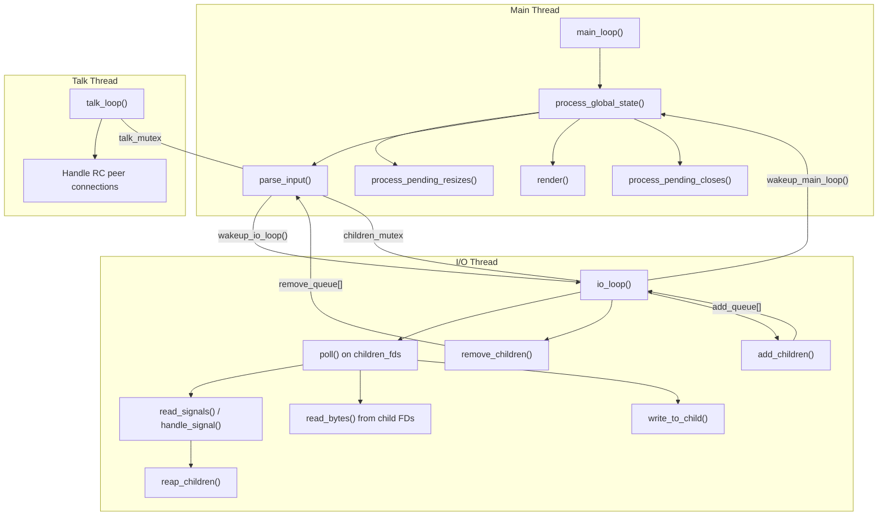
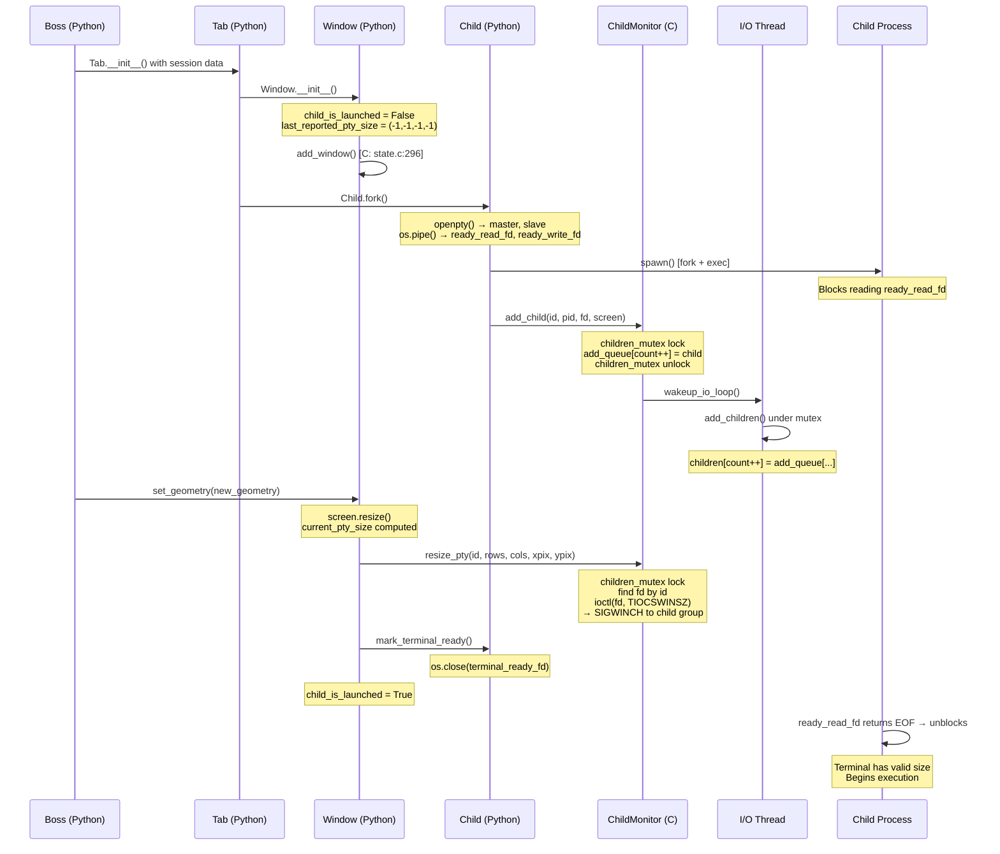
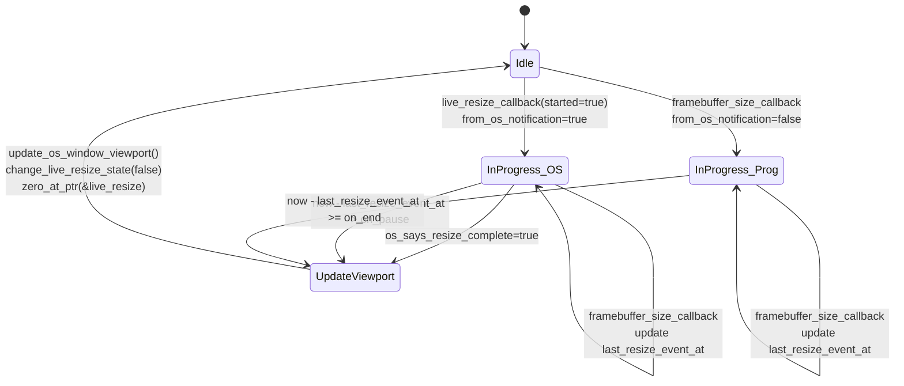
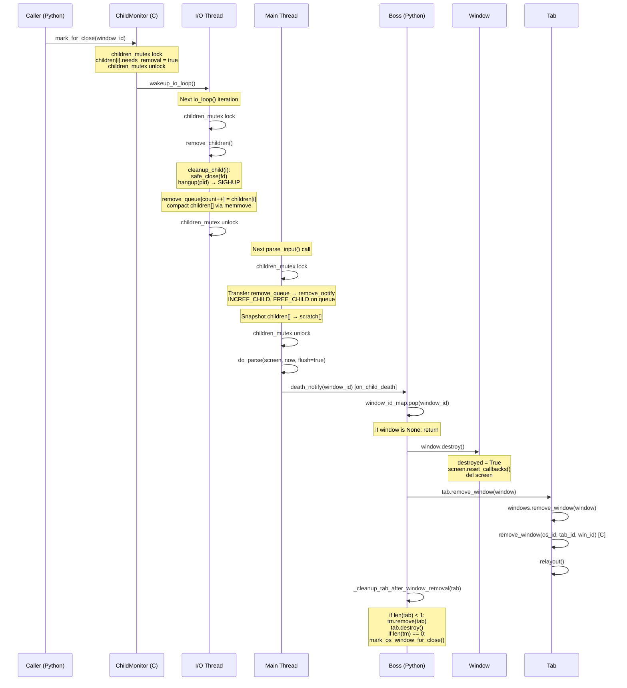
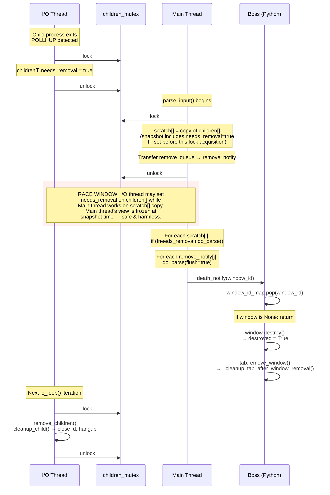

# Kitty Terminal Emulator: Internal State Consistency During Rapid Window Lifecycle Events

## 1. Introduction

This document provides a comprehensive, evidence-based analysis of how the **kitty terminal emulator** maintains internal state consistency during rapid window lifecycle events — creation, resize, and destruction in quick succession. Every assertion is derived directly from source code examination on branch `kitty_815df1e210e0`, with specific file paths and line ranges cited as evidence.

### 1.1 Questions Addressed

This document answers five interrelated questions:

1. **Window Creation and Immediate Use** — When a new terminal window is created and a command is immediately spawned, how do child process launch, PTY allocation, layout computation, and screen buffer initialization interleave? What happens when SIGWINCH and resize events arrive before all initialization is complete?

2. **Resize Event Propagation Under Rapid Succession** — When resize events and signals flow through the system during active window use, what mechanisms (debounce timers, the `LiveResizeInfo` struct, `input_delay` / `repaint_delay` parameters) throttle and coalesce these events to prevent inconsistency?

3. **Window Destruction Before Completion of Pending State Changes** — If a window is closed (or its child process terminates) while resize or signal delivery is still in progress, how does kitty decide what state to keep and what to discard?

4. **Signal Delivery Timing** — How does the three-thread architecture (Main, I/O, Talk) in `child-monitor.c` affect the timing of `SIGCHLD` reaping, `SIGWINCH` delivery via PTY `ioctl(TIOCSWINSZ)`, and child death notification? What synchronization primitives gate these transitions?

5. **Conflicting Views of Liveness** — Are there identifiable windows of time during which one thread considers a window alive while another has already marked it for removal? How does the system resolve such conflicting views?

### 1.2 Methodology

All answers are derived from direct source code analysis. The code is the single source of truth — no assumptions are made beyond what the code explicitly demonstrates. Key source files examined:

| File | Role |
|------|------|
| `kitty/child-monitor.c` | Three-thread architecture, signal handling, I/O loop, parse_input, child lifecycle |
| `kitty/boss.py` | Boss controller — window lifecycle orchestration, death callbacks |
| `kitty/window.py` | Window state, geometry, resize, destroy |
| `kitty/state.h` | Native data structures: GlobalState, OSWindow, LiveResizeInfo, Child |
| `kitty/state.c` | Native state operations: add/remove windows, tabs, OS windows |
| `kitty/glfw.c` | Platform callbacks: viewport updates, live resize, framebuffer changes |
| `kitty/child.py` | Child process: PTY allocation, fork, mark_terminal_ready |
| `kitty/window_list.py` | Window tracking: WindowList, WindowGroup management |
| `kitty/tabs.py` | Tab management: Tab.remove_window, TabManager.resize |

### 1.3 Scope Boundaries

**In scope:** Thread architecture, mutex coordination, signal delivery paths, resize debounce pipeline, window destruction cascades, liveness conflict resolution, and all defensive patterns that maintain state consistency.

**Out of scope:** GPU rendering pipeline, font subsystem, remote control protocol internals, shell integration, Go tools layer, macOS-specific Cocoa deep-dives (referenced only where relevant), and configuration parsing.

---

## 2. Architectural Context

**Summary:** Kitty uses a three-thread architecture where the Main thread handles rendering and state processing, the I/O thread multiplexes child process file descriptors and signals, and the Talk thread handles remote control peers. A single `children_mutex` protects the shared child data structures, while wakeup pipes and `poll()` multiplexing coordinate thread transitions.

### 2.1 Three-Thread Model (Main, I/O, Talk)

Kitty's concurrency model is built around three cooperating threads, all created in `kitty/child-monitor.c`:

**Main Thread** — Runs `process_global_state()` (line 1224), which is the main event loop callback driven by `main_loop()` at line 1259. Its responsibilities include:
- `process_pending_resizes()` — debounce and apply viewport changes
- `parse_input()` — snapshot children under lock, parse screen data, process death notifications
- `render()` — GPU rendering pass
- `process_pending_closes()` — handle OS window close requests

Source: `kitty/child-monitor.c:1224–1256`

**I/O Thread** — Runs `io_loop()` (line 1480), a `poll()` multiplexing loop. Its responsibilities include:
- Reading/writing child process file descriptors
- Handling signals via `read_signals()` / `handle_signal()`
- Calling `reap_children()` on SIGCHLD
- Managing `remove_children()` / `add_children()` under `children_mutex`

Source: `kitty/child-monitor.c:1480–1578`

**Talk Thread** — Runs `talk_loop()` (forward-declared at line 230), handling remote control peer connections and message routing.

**Thread Creation:** The `start()` function at line 281 creates the I/O thread via `pthread_create(&self->io_thread, NULL, io_loop, self)` (line 291). The talk thread is created conditionally when `talk_fd > -1 || listen_fd > -1` (line 285–289), or lazily via `inject_peer()` (line 256).

Source: `kitty/child-monitor.c:281–294`



### 2.2 Key Data Structures

The following native data structures govern window lifecycle state:

| Struct | Location | Key Fields | Role |
|--------|----------|------------|------|
| `GlobalState` | `kitty/state.h:259–280` | `os_windows[]`, `has_pending_resizes`, `has_pending_closes`, `quit_request`, `boss` | Singleton holding all OS window state and global flags |
| `OSWindow` | `kitty/state.h:216–256` | `live_resize` (LiveResizeInfo), `close_request` (CloseRequest), `viewport_size_dirty`, `viewport_resized_at`, `tabs[]` | Per-OS-window state including resize and close tracking |
| `LiveResizeInfo` | `kitty/state.h:196–202` | `last_resize_event_at`, `in_progress`, `from_os_notification`, `os_says_resize_complete`, `width`, `height`, `num_of_resize_events` | Debounce state for live resize operations |
| `CloseRequest` | `kitty/state.h:194` | Enum: `NO_CLOSE_REQUESTED`, `CONFIRMABLE_CLOSE_REQUESTED`, `CLOSE_BEING_CONFIRMED`, `IMPERATIVE_CLOSE_REQUESTED` | Close request state machine |
| `Child` | `kitty/child-monitor.c:65–71` | `screen` (Screen*), `needs_removal` (bool), `fd` (int), `id` (unsigned long), `pid` (pid_t) | Per-child process tracking in the I/O thread |

The `Child` struct definition:

```c
typedef struct {
    Screen *screen;
    bool needs_removal;
    int fd;
    unsigned long id;
    pid_t pid;
} Child;
```

Source: `kitty/child-monitor.c:65–71`

The `LiveResizeInfo` struct:

```c
typedef struct {
    monotonic_t last_resize_event_at;
    bool in_progress;
    bool from_os_notification;
    bool os_says_resize_complete;
    unsigned int width, height, num_of_resize_events;
} LiveResizeInfo;
```

Source: `kitty/state.h:196–202`

### 2.3 Synchronization Primitives

**`children_mutex`** — A pthread mutex (macro at lines 76–77 wrapping `children_lock`, initialized at line 164) that gates access to the shared arrays: `children[]`, `add_queue[]`, `remove_queue[]`, and the signal flags `kill_signal_received` and `reload_config_signal_received`.

```c
#define children_mutex(op) \
    pthread_mutex_##op(&children_lock);
```

Source: `kitty/child-monitor.c:76–77`

**`talk_mutex`** — A pthread mutex (macro at lines 78–79) that gates access to messages from remote control peers, protecting the `messages` array in the ChildMonitor struct.

Source: `kitty/child-monitor.c:78–79`

**`screen_mutex`** — A per-screen buffer lock (macro at lines 74–75) protecting the `write_buf` for each Screen object, used when the I/O thread writes data to child processes.

Source: `kitty/child-monitor.c:74–75`

**Wakeup Pipe** — `children_fds[0]` contains the wakeup read FD from the `io_loop_data` (set at line 183). The function `wakeup_io_loop()` (lines 224–227) writes to this pipe to wake the I/O thread's `poll()` call.

Source: `kitty/child-monitor.c:183, 224–227`

**Signal FD** — `children_fds[1]` contains the signal read FD (line 183). Signals are delivered via `signalfd` (or `kqueue` on macOS) and read via `read_signals()` in the I/O thread's `io_loop()` at line 1519.

Source: `kitty/child-monitor.c:183, 1516–1519`

**Main Loop Wakeup** — `wakeup_main_loop()` is called from the I/O thread to trigger the main thread's `process_global_state()` callback, but only after the `input_delay` coalescing interval has elapsed (lines 1562–1570).

Source: `kitty/child-monitor.c:1562–1570`

**Static Arrays** — The shared child tracking arrays are defined at lines 82–84:

```c
static Child children[MAX_CHILDREN] = {{0}};
static Child scratch[MAX_CHILDREN] = {{0}};
static Child add_queue[MAX_CHILDREN] = {{0}}, remove_queue[MAX_CHILDREN] = {{0}}, remove_notify[MAX_CHILDREN] = {{0}};
```

Source: `kitty/child-monitor.c:82–84`

The rationale for separate arrays: `add_queue` and `remove_queue` serve as lock-free transfer buffers between threads (written under `children_mutex` by one thread, consumed under the same mutex by the other), while `scratch` and `remove_notify` are main-thread-only copies created during the snapshot-under-lock pattern in `parse_input()`.

---

## 3. Window Creation and Immediate Use

**Summary:** Window creation follows a strict pipeline — Boss → Tab → Window → Child.fork() → ChildMonitor.add_child() — where the child process is blocked from executing until `mark_terminal_ready()` signals that the PTY has a valid size. This ensures the child never sees an uninitialized terminal. The `child_is_launched` flag prevents premature PTY operations, and the `last_reported_pty_size` tuple prevents redundant SIGWINCH delivery.

### 3.1 Creation Path (Boss → Tab → Window → Child → ChildMonitor)

The window creation path begins at the Boss controller:

1. **`Boss.add_os_window()`** at `kitty/boss.py:402+` — Creates the native OS window via `create_os_window()`, creates a `TabManager`, and calls `startup_first_child()` (line 383) which iterates session data.

2. **`Tab.__init__()`** creates windows from session data. Each window is created via `Tab._add_window()` which constructs `Window.__init__()`.

3. **`Window.__init__()`** at `kitty/window.py:544` — Initializes all fields, critically setting two guards:
   - `self.child_is_launched = False` (line 578) — prevents premature PTY resize
   - `self.last_reported_pty_size = (-1, -1, -1, -1)` (line 579) — forces first resize to always fire

   Calls `add_window()` (C function, `kitty/state.c:296`) to register the window ID in the native state.

Source: `kitty/window.py:544–587`, `kitty/state.c:295–305`

### 3.2 PTY Allocation and Signal Setup

**`Child.fork()`** at `kitty/child.py:276` performs the following sequence:

1. Opens a PTY pair: `master, slave = openpty()` (line 281)
2. Creates a readiness pipe: `ready_read_fd, ready_write_fd = os.pipe()` (line 283)
3. Calls `fast_data_types.spawn()` (lines 333–335) passing the `handled_signals` tuple — this forks the child process
4. After fork — parent closes the slave end (line 336), stores `self.child_fd = master` (line 338), sets non-blocking on master FD (line 345), stores `self.terminal_ready_fd = ready_write_fd` (line 343)

Source: `kitty/child.py:276–354`

The child process is then added to the ChildMonitor via `add_child()` (C function at `child-monitor.c:305`):

```c
children_mutex(lock);
// ... validate capacity, parse args, add to add_queue ...
INCREF_CHILD(add_queue[add_queue_count]);
add_queue_count++;
children_mutex(unlock);
wakeup_io_loop(self, false);
```

Source: `kitty/child-monitor.c:305–321`

**Rationale:** The child is added to `add_queue[]` (not directly to `children[]`) under the mutex, then the I/O thread is woken to pick it up. This ensures the I/O thread atomically transitions the child from the queue to its active array during its next `io_loop()` iteration, inside `add_children()` (line 1281–1290).

### 3.3 First Geometry Assignment and SIGWINCH

**`Window.set_geometry()`** at `kitty/window.py:850` is the critical function that connects window layout to PTY sizing:

```python
def set_geometry(self, new_geometry: WindowGeometry) -> None:
    if self.destroyed:
        return
```

Source: `kitty/window.py:850–851`

The function:

1. **Checks `self.destroyed` first** (line 851) — immediately returns if the window has been destroyed. This is a key defensive guard against resize events arriving for dying windows.

2. **Resizes the screen buffer** if dimensions changed: `self.screen.resize(max(0, new_geometry.ynum), max(0, new_geometry.xnum))` (line 854).

3. **Computes `current_pty_size`** tuple: `(self.screen.lines, self.screen.columns, pixel_width, pixel_height)` (lines 857–859).

4. **Deduplicates**: If `current_pty_size != self.last_reported_pty_size` (line 861), calls `boss.child_monitor.resize_pty(self.id, *current_pty_size)` (line 863).

5. **`resize_pty()`** in C invokes `pty_resize()` (line 577) which does `ioctl(fd, TIOCSWINSZ, dim)` with an EINTR retry loop — this causes the kernel to deliver SIGWINCH to the child's process group.

```c
static bool
pty_resize(int fd, struct winsize *dim) {
    while(true) {
        if (ioctl(fd, TIOCSWINSZ, dim) == -1) {
            if (errno == EINTR) continue;
            // ...
        }
        break;
    }
    return true;
}
```

Source: `kitty/child-monitor.c:577–588`

The FD lookup in `resize_pty()` is done under `children_mutex` (line 598) to safely find the child's FD, searching both `children[]` and `add_queue[]`.

Source: `kitty/child-monitor.c:591–610`

### 3.4 The `child_is_launched` Guard

At lines 865–867 in `window.py`:

```python
if not self.child_is_launched:
    self.child.mark_terminal_ready()
    self.child_is_launched = True
```

Source: `kitty/window.py:865–867`

**`mark_terminal_ready()`** at `kitty/child.py:362`:

```python
def mark_terminal_ready(self) -> None:
    os.close(self.terminal_ready_fd)
    self.terminal_ready_fd = -1
```

Source: `kitty/child.py:362–364`

**Rationale:** The child process blocks on reading from `ready_read_fd` until this pipe is closed. This means:

- The child **cannot execute** until the first `set_geometry()` call has completed
- By the time the child runs, the PTY already has a valid size from the `ioctl(TIOCSWINSZ)` call
- The child's very first `ioctl` query for terminal size will return correct dimensions
- Any SIGWINCH arriving before `set_geometry()` is irrelevant because the PTY has not yet been sized (the child hasn't started)

This is the key mechanism that prevents race conditions during window creation: the readiness pipe serializes child execution after PTY initialization.

### 3.5 Window Creation Sequence Diagram



---

## 4. Resize Event Propagation

**Summary:** Resize events flow through a multi-stage pipeline: GLFW platform callbacks record resize information in the `LiveResizeInfo` struct and set a global pending flag. The main thread's `process_pending_resizes()` applies a two-mode debounce (on_pause for OS-notified resizes, on_end for programmatic resizes). Once the debounce expires, the viewport is updated, Boss is notified, tabs relayout, and each window's `set_geometry()` resizes the screen buffer and delivers SIGWINCH to the child — but only if the PTY size actually changed, thanks to the `last_reported_pty_size` deduplication.

### 4.1 GLFW Callback to LiveResizeInfo Recording

**`framebuffer_size_callback()`** at `kitty/glfw.c:329–346`:

When the platform reports a framebuffer size change, this callback:
1. Sets `global_state.has_pending_resizes = true` (line 336)
2. Calls `change_live_resize_state(window, true)` (line 337) — sets `live_resize.in_progress = true`
3. Records `window->live_resize.last_resize_event_at = monotonic()` (line 338)
4. Stores `width` and `height` (line 339)
5. Increments `num_of_resize_events` (line 340)
6. Calls `update_surface_size()` and `request_tick_callback()` (lines 342–343)

Source: `kitty/glfw.c:329–346`

**`live_resize_callback()`** at `kitty/glfw.c:316–327`:

When the OS sends an explicit live-resize notification:
1. Sets `from_os_notification = true` (line 319)
2. Calls `change_live_resize_state()` (line 320)
3. Sets `has_pending_resizes = true` (line 321)
4. When resize ends (`!started`): sets `os_says_resize_complete = true` (line 323)

Source: `kitty/glfw.c:316–327`

**`dpi_change_callback()`** at `kitty/glfw.c:348–360`:

Similar to the framebuffer callback — sets `live_resize.in_progress`, records timestamp, flags pending resizes.

Source: `kitty/glfw.c:348–360`

### 4.2 Debounce Pipeline (on_pause vs on_end Timers)

**`process_pending_resizes()`** at `kitty/child-monitor.c:1043–1080` implements a two-mode debounce:

```c
static void
process_pending_resizes(monotonic_t now) {
    global_state.has_pending_resizes = false;
    for (size_t i = 0; i < global_state.num_os_windows; i++) {
        OSWindow *w = global_state.os_windows + i;
        if (w->live_resize.in_progress) {
            bool update_viewport = false;
            if (w->live_resize.from_os_notification) {
                if (w->live_resize.os_says_resize_complete) update_viewport = true;
                else {
                    if ((now - w->live_resize.last_resize_event_at) > OPT(resize_debounce_time).on_pause)
                        update_viewport = true;
                    else { /* keep pending, wait 50ms */ }
                }
            } else {
                if (now - w->live_resize.last_resize_event_at >= OPT(resize_debounce_time).on_end)
                    update_viewport = true;
                else { /* keep pending */ }
            }
            // ...
        }
    }
}
```

Source: `kitty/child-monitor.c:1043–1080`

**Two debounce modes explained:**

| Mode | Trigger | Timer | Behavior |
|------|---------|-------|----------|
| **on_pause** | `from_os_notification = true` | `OPT(resize_debounce_time).on_pause` | Wait for OS "resize complete" signal, OR if the user pauses resizing longer than `on_pause`, reflow screen to show preview. Prevents a "hang" if the OS never sends completion. |
| **on_end** | `from_os_notification = false` | `OPT(resize_debounce_time).on_end` | For programmatic/non-OS resizes, wait until no resize events have arrived for `on_end` duration before updating. |

The `resize_debounce_time` is defined in `kitty/state.h:82`:

```c
struct { monotonic_t on_end, on_pause; } resize_debounce_time;
```

Source: `kitty/state.h:82`

When the pending check hasn't expired, the code sets `global_state.has_pending_resizes = true` and calls `set_maximum_wait()` to schedule the next check at the appropriate time (50ms for on_pause, remaining debounce time for on_end).

### 4.3 Resize Debounce State Machine



### 4.4 Viewport Update and Boss Notification

When the debounce expires:

1. `update_os_window_viewport(w, true)` is called (line 1073)
2. `change_live_resize_state(w, false)` (line 1074) — resets `in_progress`
3. `zero_at_ptr(&w->live_resize)` (line 1075) — zeroes the entire LiveResizeInfo struct

Source: `kitty/child-monitor.c:1072–1076`

**`update_os_window_viewport()`** at `kitty/glfw.c:130–171`:

1. Gets framebuffer and window sizes from GLFW
2. **Early return** if nothing changed: `if (fw == window->viewport_width && fh == window->viewport_height && ...)` (line 138–139)
3. Updates viewport dimensions and ratios
4. Sets `viewport_size_dirty = true` (line 163)
5. Calls `call_boss(on_window_resize, "KiiO", window->id, ...)` (line 169) — notifies the Python Boss

Source: `kitty/glfw.c:130–171`

### 4.5 Tab Relayout → Window set_geometry → Screen Resize → PTY ioctl

**`Boss.on_window_resize()`** at `kitty/boss.py:1206–1212`:

```python
def on_window_resize(self, os_window_id: int, w: int, h: int, dpi_changed: bool) -> None:
    if dpi_changed:
        self.on_dpi_change(os_window_id)
    else:
        tm = self.os_window_map.get(os_window_id)
        if tm is not None:
            tm.resize()
```

Source: `kitty/boss.py:1206–1212`

**`TabManager.resize()`** at `kitty/tabs.py:963–969`:

```python
def resize(self, only_tabs: bool = False) -> None:
    if not only_tabs:
        if not self.tab_bar_hidden:
            self.tab_bar.layout()
            self.mark_tab_bar_dirty()
    for tab in self.tabs:
        tab.relayout()
```

Source: `kitty/tabs.py:963–969`

`Tab.relayout()` calls the layout engine which calls `Window.set_geometry()` for each window, completing the pipeline: GLFW callback → debounce → viewport update → Boss → TabManager → Tab → Window → Screen resize → PTY ioctl → SIGWINCH.

### 4.6 SIGWINCH Deduplication via `last_reported_pty_size`

At `kitty/window.py:861`:

```python
if current_pty_size != self.last_reported_pty_size:
    boss.child_monitor.resize_pty(self.id, *current_pty_size)
    # ...
    self.last_reported_pty_size = current_pty_size
```

Source: `kitty/window.py:861–874`

**Rationale:** Multiple relayout passes may produce the same PTY dimensions (e.g., when only padding changes, or when rapid resize events coalesce to the same final size). The `last_reported_pty_size` guard prevents redundant `ioctl(TIOCSWINSZ)` calls and therefore prevents redundant SIGWINCH signals from reaching the child process. This is critical during rapid resize scenarios where dozens of resize events may coalesce into a single actual dimension change.

---

## 5. Window Destruction Under Pending Changes

**Summary:** Window destruction follows a carefully orchestrated pipeline that spans both the I/O and Main threads. The `mark_for_close()` function sets `needs_removal = true` under `children_mutex`. The I/O thread's `remove_children()` closes the FD, sends SIGHUP, and moves the child to `remove_queue`. The Main thread's `parse_input()` transfers entries from `remove_queue` to `remove_notify` (under lock), then outside the lock calls the `death_notify` callback (Boss.on_child_death), which triggers cascading cleanup from window through tab through tab manager to the OS window itself. State that is discarded includes screen buffers, child FDs, PTY connections, and GPU resources; state that is preserved includes the window-size cache.

### 5.1 Marking for Close (mark_for_close → needs_removal)

**`mark_child_for_close()`** at `kitty/child-monitor.c:541–564`:

```c
static bool
mark_child_for_close(ChildMonitor *self, id_type window_id) {
    bool found = false;
    children_mutex(lock);
    for (size_t i = 0; i < self->count; i++) {
        if (children[i].id == window_id) {
            children[i].needs_removal = true;
            found = true;
            break;
        }
    }
    if (!found) {
        for (size_t i = 0; i < add_queue_count; i++) {
            if (add_queue[i].id == window_id) {
                add_queue[i].needs_removal = true;
                found = true;
                break;
            }
        }
    }
    children_mutex(unlock);
    wakeup_io_loop(self, false);
    return found;
}
```

Source: `kitty/child-monitor.c:541–564`

**Key design decisions:**
- The search checks **both** `children[]` and `add_queue[]` — this handles the case where `mark_for_close()` is called before the I/O thread has picked up the child from the add queue
- The mutex is released **before** waking the I/O loop — this prevents potential deadlock if the I/O thread tries to acquire the lock during its wakeup handler
- `needs_removal` is a **monotonic flag** — once set to `true`, it is never set back to `false`

The Python wrapper at lines 567–574 exposes this as `ChildMonitor.mark_for_close()`.

Source: `kitty/child-monitor.c:567–574`

### 5.2 I/O Thread Cleanup (remove_children → close fd → hangup)

At the top of each `io_loop()` iteration (lines 1492–1495):

```c
children_mutex(lock);
remove_children(self);
add_children(self);
children_mutex(unlock);
```

Source: `kitty/child-monitor.c:1492–1495`

**`remove_children()`** at lines 1312–1333 iterates `children[]` in reverse:

For each child with `needs_removal`:
1. Calls `cleanup_child(i)` (line 1319) which:
   - `safe_close(children[i].fd, ...)` (line 1307) — closes the PTY master FD
   - `hangup(children[i].pid)` (line 1308) — sends SIGHUP to process group

2. Moves the child struct to `remove_queue[remove_queue_count]` (lines 1320–1321)

3. Zeroes out the slot and compacts the array via `memmove` (lines 1322–1328)

Source: `kitty/child-monitor.c:1312–1333`

**`hangup()`** at lines 1294–1302:

```c
static void
hangup(pid_t pid) {
    errno = 0;
    pid_t pgid = getpgid(pid);
    if (errno == ESRCH) return;
    if (errno != 0) { perror("Failed to get process group id for child"); return; }
    if (killpg(pgid, SIGHUP) != 0) {
        if (errno != ESRCH) perror("Failed to kill child");
    }
}
```

Source: `kitty/child-monitor.c:1294–1302`

**`cleanup_child()`** at lines 1306–1309:

```c
static void
cleanup_child(ssize_t i) {
    safe_close(children[i].fd, __FILE__, __LINE__);
    hangup(children[i].pid);
}
```

Source: `kitty/child-monitor.c:1306–1309`

### 5.3 Queue Transfer (remove_queue → remove_notify)

In `parse_input()` at lines 456–463, the **Main thread** acquires `children_mutex` and transfers entries:

```c
children_mutex(lock);
while (remove_queue_count) {
    remove_queue_count--;
    remove_notify[remove_count] = remove_queue[remove_queue_count];
    INCREF_CHILD(remove_notify[remove_count]);
    remove_count++;
    FREE_CHILD(remove_queue[remove_queue_count]);
}
// ... also snapshot children[] to scratch[] ...
children_mutex(unlock);
```

Source: `kitty/child-monitor.c:456–483`

Then, **outside the lock** at lines 517–526:

```c
while(remove_count) {
    remove_count--;
    if (remove_notify[remove_count].screen) do_parse(self, remove_notify[remove_count].screen, now, true);
    PyObject *t = PyObject_CallFunction(self->death_notify, "k", remove_notify[remove_count].id);
    if (t == NULL) PyErr_Print();
    else Py_DECREF(t);
    FREE_CHILD(remove_notify[remove_count]);
}
```

Source: `kitty/child-monitor.c:517–526`

**Rationale:** The lock must be released before calling `death_notify` (which is `Boss.on_child_death()`) because the Python callback may call back into C functions that also acquire `children_mutex`. Since the mutex is non-recursive, holding it would cause deadlock. The `INCREF_CHILD` ensures the Screen object remains alive for the final `do_parse()` flush.

### 5.4 Main Thread Death Processing (parse_input → death_notify → on_child_death)

**`Boss.on_child_death()`** at `kitty/boss.py:881–918`:

```python
def on_child_death(self, window_id: int) -> None:
    prev_active_window = self.active_window
    window = self.window_id_map.pop(window_id, None)
    if window is None:
        return
    with self.suppress_focus_change_events():
        for close_action in window.actions_on_close:
            try:
                close_action(window)
            except Exception:
                traceback.print_exc()
        os_window_id = window.os_window_id
        window.destroy()
        tm = self.os_window_map.get(os_window_id)
        tab = None
        if tm is not None:
            for q in tm:
                if window in q:
                    tab = q
                    break
        if tab is not None:
            tab.remove_window(window)
            self._cleanup_tab_after_window_removal(tab)
        # ... removal actions ...
```

Source: `kitty/boss.py:881–918`

**Key design decisions:**
1. `self.window_id_map.pop(window_id, None)` — uses `pop` (not `get`) to atomically remove and retrieve, preventing double-processing
2. `if window is None: return` (line 884–885) — critical defensive check for the case where the window was already removed (e.g., by a concurrent `on_os_window_closed()` call)
3. `window.destroy()` is called **before** `tab.remove_window()` — ensures the window is marked destroyed before any further layout operations might reference it
4. Focus change events are suppressed during cleanup to prevent cascading focus callbacks during an unstable state

### 5.5 Cascading Cleanup (tab → tab_manager → OS window)

**`_cleanup_tab_after_window_removal()`** at `kitty/boss.py:859–867`:

```python
def _cleanup_tab_after_window_removal(self, src_tab: Tab) -> None:
    if len(src_tab) < 1:
        tm = src_tab.tab_manager_ref()
        if tm is not None:
            tm.remove(src_tab)
            src_tab.destroy()
            if len(tm) == 0:
                if not self.shutting_down:
                    self.mark_os_window_for_close(src_tab.os_window_id)
```

Source: `kitty/boss.py:859–867`

This creates a **cascading cleanup chain**: removing the last window from a tab empties the tab → the empty tab is removed from the tab manager → if the tab manager is now empty (and we're not shutting down), the entire OS window is marked for close.

**`Tab.destroy()`** at `kitty/tabs.py:850–854`:

```python
def destroy(self) -> None:
    evict_cached_layouts(self.id)
    for w in self.windows:
        w.destroy()
    self.windows = WindowList(self)
```

Source: `kitty/tabs.py:850–854`

**`Window.destroy()`** at `kitty/window.py:1560–1571`:

```python
def destroy(self) -> None:
    self.call_watchers(self.watchers.on_close, {})
    self.destroyed = True
    self.clipboard_request_manager.close()
    del self.kitten_result_processors
    if hasattr(self, 'screen'):
        if self.is_active and self.os_window_id == current_focused_os_window_id():
            update_ime_position_for_window(self.id, False, -1)
        self.screen.reset_callbacks()
        del self.screen
```

Source: `kitty/window.py:1560–1571`

**Key actions in `Window.destroy()`:**
- Sets `self.destroyed = True` — this is what `set_geometry()` checks at line 851 to bail out of resize operations for dying windows
- Resets screen callbacks and deletes screen reference to break reference cycles
- Cancels IME composition if the window was active

### 5.6 What State Is Kept vs Discarded

**Kept:**
- `cached_values['window-size']` is saved in `on_os_window_closed()` (line 1776 of boss.py) for use when creating new OS windows

Source: `kitty/boss.py:1775–1776`

**Discarded:**
- All window render data (VAOs, textures)
- Screen buffers (screen object deleted in `Window.destroy()`)
- Child FDs (closed in `cleanup_child()`)
- PTY connections (master FD closed, SIGHUP sent to process group)
- GPU resources (released in `destroy_window()` via `release_gpu_resources_for_window()`)

Source: `kitty/state.c:338–350`

The `WeakValueDictionary` for `window_id_map` provides automatic cleanup: window references are evicted from the map when the Window object's reference count drops to zero after `destroy()` and all references are released.

### 5.7 Window Destruction Sequence Diagram



---

## 6. Signal Delivery and Timing

**Summary:** Kitty handles signals through a dedicated signal FD mechanism (signalfd/kqueue) read by the I/O thread. SIGCHLD triggers `reap_children()` which marks dead children for removal under `children_mutex`. SIGWINCH is not *received* by kitty — it is *sent* by kitty to child processes via `ioctl(TIOCSWINSZ)`. The I/O thread coalesces main loop wakeups using the `input_delay` parameter to batch rapid events, reducing expensive cross-thread notifications.

### 6.1 SIGCHLD Path (handle_signal → reap_children → mark_child_for_removal)

Signals are delivered via `signalfd` (or `kqueue` on macOS) to `children_fds[1]`.

In `io_loop()` at lines 1516–1527:

```c
if (children_fds[1].revents && POLLIN) {
    SignalSet ss = {0};
    data_received = true;
    read_signals(children_fds[1].fd, handle_signal, &ss);
    if (ss.kill_signal || ss.reload_config) {
        children_mutex(lock);
        if (ss.kill_signal) kill_signal_received = true;
        if (ss.reload_config) reload_config_signal_received = true;
        children_mutex(unlock);
    }
    if (ss.child_died) reap_children(self, OPT(close_on_child_death));
}
```

Source: `kitty/child-monitor.c:1516–1527`

**`handle_signal()`** at lines 1362–1383 classifies signals:

| Signal | Action |
|--------|--------|
| SIGINT, SIGTERM, SIGHUP | `ss.kill_signal = true` → sets `kill_signal_received` under mutex → processed by main thread as `IMPERATIVE_CLOSE_REQUESTED` |
| SIGCHLD | `ss.child_died = true` → triggers `reap_children()` |
| SIGUSR1 | `ss.reload_config = true` → sets `reload_config_signal_received` under mutex → processed by main thread |

Source: `kitty/child-monitor.c:1362–1383`

**`reap_children()`** at lines 1412–1426:

```c
static void
reap_children(ChildMonitor *self, bool enable_close_on_child_death) {
    int status;
    pid_t pid;
    while(true) {
        pid = waitpid(-1, &status, WNOHANG);
        if (pid == -1) {
            if (errno != EINTR) break;
        } else if (pid > 0) {
            if (enable_close_on_child_death) mark_child_for_removal(self, pid);
            mark_monitored_pids(pid, status);
        } else break;
    }
}
```

Source: `kitty/child-monitor.c:1412–1426`

**`mark_child_for_removal()`** at lines 1386–1395:

```c
static void
mark_child_for_removal(ChildMonitor *self, pid_t pid) {
    children_mutex(lock);
    for (size_t i = 0; i < self->count; i++) {
        if (children[i].pid == pid) {
            children[i].needs_removal = true;
            break;
        }
    }
    children_mutex(unlock);
}
```

Source: `kitty/child-monitor.c:1386–1395`

**Important nuance:** `reap_children()` is called **without** holding `children_mutex`. The `waitpid()` loop does not need the lock. Only `mark_child_for_removal()` acquires the lock momentarily to set the flag, minimizing lock contention.

### 6.2 SIGWINCH Path (resize_pty → ioctl(TIOCSWINSZ))

**SIGWINCH is NOT received by kitty — it is SENT by kitty to its child processes.**

When `Window.set_geometry()` calls `resize_pty()`, the C function `pty_resize()` (lines 577–588) performs:

```c
ioctl(fd, TIOCSWINSZ, dim)
```

This `ioctl` causes the kernel to deliver SIGWINCH to the child's process group. The `ioctl` has an EINTR retry loop (lines 578–587).

Source: `kitty/child-monitor.c:577–588`

The FD lookup in `resize_pty()` is done under `children_mutex` to safely find the child's FD, searching both `children[]` and `add_queue[]`:

```c
children_mutex(lock);
FIND(children, self->count);
if (fd == -1) FIND(add_queue, add_queue_count);
```

Source: `kitty/child-monitor.c:598–607`

**Rationale for holding the lock during FD lookup:** The I/O thread may be concurrently closing FDs in `cleanup_child()`. Without the lock, we could attempt `ioctl` on a closed (or reused) FD. The lock ensures the FD is valid at the time of the `ioctl` call.

### 6.3 Input Delay and Main Loop Wakeup Coalescing

In `io_loop()` at lines 1562–1570:

```c
#define WAKEUP { wakeup_main_loop(); last_main_loop_wakeup_at = now; has_pending_wakeups = false; }
    if (data_received) {
        if ((now = monotonic()) - last_main_loop_wakeup_at > OPT(input_delay)) WAKEUP
        else has_pending_wakeups = true;
    } else {
        if (has_pending_wakeups && (now = monotonic()) - last_main_loop_wakeup_at > OPT(input_delay)) WAKEUP
    }
```

Source: `kitty/child-monitor.c:1562–1570`

**Coalescing mechanism:**
1. When data arrives, the I/O thread checks if enough time has elapsed since the last wakeup (`now - last_main_loop_wakeup_at > OPT(input_delay)`)
2. If yes: immediately wakes the main loop
3. If no: sets `has_pending_wakeups = true` and uses `poll()` timeout to wait for the remaining delay time (lines 1506–1509)
4. On the next `poll()` return (or timeout), if `has_pending_wakeups` is true and enough time has elapsed, the main loop is woken

**Rationale:** `wakeup_main_loop()` is an expensive operation on some platforms (especially macOS/Cocoa where it involves Cocoa event queue manipulation). By batching wakeups within the `input_delay` window, kitty reduces the overhead of rapid input events without introducing noticeable latency.

The `input_delay` option is defined at `kitty/state.h:51`:

```c
monotonic_t repaint_delay, input_delay;
```

Source: `kitty/state.h:51`

### 6.4 Race Between I/O Thread Reap and Main Thread Parse

The critical race occurs between these two operations:

1. **I/O thread** sets `needs_removal = true` under `children_mutex` (in `reap_children` → `mark_child_for_removal`, or in poll event handling at lines 1534–1536 for POLLHUP and 1544–1546 for POLLNVAL)

2. **Main thread's** `parse_input()` copies `children[]` to `scratch[]` under `children_mutex` (lines 477–481), then releases the lock

3. At line 529: `if (!scratch[i].needs_removal)` — the main thread skips children marked for removal in its snapshot

**The race window:**

Between when the main thread copies `children[]` and when it checks `needs_removal`, the I/O thread may set `needs_removal = true` on the **original** `children[]` entry. But since the main thread works on its `scratch[]` copy, it sees the value as of the snapshot time.

**Why this is safe:**
- The `needs_removal` flag is **monotonic**: it is only ever set from `false` to `true`, never back
- The worst case: the main thread processes one more frame of input for a dying child — this is harmless because `do_parse()` simply parses VT sequences into the screen buffer, which is about to be discarded anyway
- The next `parse_input()` call will see the flag and skip the child, and the child will appear in `remove_notify` for death processing

The POLLHUP/POLLNVAL paths in `io_loop()` also set `needs_removal` under `children_mutex`:

```c
if (children_fds[EXTRA_FDS + i].revents & (POLLIN | POLLHUP)) {
    has_more = read_bytes(children_fds[EXTRA_FDS + i].fd, children[i].screen);
    if (!has_more) {
        children_mutex(lock);
        children[i].needs_removal = true;
        children_mutex(unlock);
    }
}
// ...
if (children_fds[EXTRA_FDS + i].revents & POLLNVAL) {
    children_mutex(lock);
    children[i].needs_removal = true;
    children_mutex(unlock);
}
```

Source: `kitty/child-monitor.c:1529–1548`

---

## 7. Conflicting Views of Liveness

**Summary:** Yes, there are identifiable windows of time during which one thread considers a window alive while another has marked it for removal. The system resolves these through a layered defense-in-depth strategy: (1) the snapshot-then-release pattern in `parse_input()` creates a consistent view within each parse cycle; (2) the monotonic `needs_removal` flag ensures eventual convergence; (3) the `WeakValueDictionary` in `boss.py` auto-evicts dead window references; (4) pervasive null checks throughout `boss.py` handle stale references gracefully; and (5) the `destroyed` flag on Window objects prevents operations on dead windows.

### 7.1 The Snapshot-Then-Release Pattern in `parse_input()`

Lines 456–483 of `child-monitor.c` implement the core consistency mechanism:

```c
children_mutex(lock);
// Transfer remove_queue → remove_notify (lines 457-462)
// ...
count = self->count;
for (size_t i = 0; i < count; i++) {
    scratch[i] = children[i];
    INCREF_CHILD(scratch[i]);
}
children_mutex(unlock);
```

Source: `kitty/child-monitor.c:456–483`

**How it works:**
1. The main thread acquires `children_mutex`
2. It copies all children to the `scratch[]` array, incrementing reference counts via `INCREF_CHILD()` (which calls `Py_INCREF` on the Screen object)
3. It releases the lock
4. It works entirely from the `scratch[]` snapshot for the rest of the parse cycle

**Why this matters:** Even if the I/O thread modifies `children[]` (setting `needs_removal`, adding new children, removing children) during parsing, the main thread has a stable, consistent snapshot. The `INCREF_CHILD()` prevents the Screen object from being deallocated while it's being parsed.

### 7.2 `needs_removal` Skip Guard

After releasing the lock, at line 529:

```c
for (size_t i = 0; i < count; i++) {
    if (!scratch[i].needs_removal) {
        if (do_parse(self, scratch[i].screen, now, false)) input_read = true;
    }
    DECREF_CHILD(scratch[i]);
}
```

Source: `kitty/child-monitor.c:528–533`

Because `needs_removal` was copied under the lock, the main thread has a consistent view **as of the snapshot time**. If `needs_removal` was set **after** the copy, the main thread processes the child one more time — harmlessly. The next `parse_input()` call will see the updated flag and skip the child.

### 7.3 `WeakValueDictionary` Auto-Eviction in `boss.py`

```python
self.window_id_map: WeakValueDictionary[int, Window] = WeakValueDictionary()
```

Source: `kitty/boss.py:344`

When `Window.destroy()` is called and the Window object's reference count drops to zero, it is automatically evicted from `window_id_map`. This means:
- Any code doing `self.window_id_map.get(window_id)` returns `None` for destroyed windows
- `self.window_id_map.pop(window_id, None)` returns `None` for already-cleaned-up windows
- No explicit cleanup of the dictionary is needed — Python's garbage collector handles it

This provides a graceful resolution for stale references without requiring explicit bookkeeping.

### 7.4 Defensive Null Checks Throughout `boss.py`

The Boss controller is littered with defensive null checks that handle concurrent lifecycle events:

| Location | Check | Purpose |
|----------|-------|---------|
| `on_child_death()` line 884 | `if window is None: return` | Window already removed by another code path |
| `on_window_resize()` line 1210 | `if tm is not None` | TabManager already cleaned up for this OS window |
| `_cleanup_tab_after_window_removal()` line 861 | `if tm is not None` | Tab manager reference is stale (weak reference) |
| `on_os_window_closed()` line 1777 | `tm = self.os_window_map.pop(os_window_id, None)` | Safe pop — OS window may already be removed |

Source: `kitty/boss.py:884, 1210, 861, 1777`

**Rationale:** These patterns form a defense-in-depth strategy. Even if the cleanup cascade is triggered from multiple paths simultaneously (e.g., user closes window while child process exits), the null checks ensure each cleanup operation is idempotent and doesn't crash on already-cleaned-up state.

### 7.5 Identified Race Windows and Their Resolution

**Race Window 1: I/O thread marks `needs_removal` while Main thread is parsing**

- **Window:** Between the I/O thread setting `needs_removal = true` (under `children_mutex`) and the Main thread observing it in the next `parse_input()` call.
- **Duration:** One `parse_input()` cycle (bounded by `input_delay` + processing time).
- **Resolution:** The snapshot pattern ensures consistency within a single parse cycle. At worst, one extra frame of VT data is parsed for a dying child — this is harmless because the screen buffer is about to be freed.

**Race Window 2: Between `on_child_death()` being called and all code paths checking liveness**

- **Window:** After `Boss.on_child_death()` pops the window from `window_id_map` but before all async callbacks referencing this window ID complete.
- **Resolution:** `WeakValueDictionary` auto-eviction and pervasive null checks. Any callback looking up the window by ID will get `None` and return gracefully.

**Race Window 3: Between `mark_for_close()` and `remove_children()` executing**

- **Window:** After `mark_for_close()` sets `needs_removal = true` but before the I/O thread processes it in the next `io_loop()` iteration.
- **Duration:** Bounded by the `poll()` timeout (potentially up to `input_delay`).
- **Resolution:** During this window, the child's FD is still open and the process group is still alive. The I/O thread may still read data from the child. This data is processed normally, and when `remove_children()` runs, the FD is closed and SIGHUP is sent.

**Race Window 4: Resize event arriving for a window being destroyed**

- **Window:** A resize event propagates through `set_geometry()` for a window whose `destroy()` has already been called.
- **Resolution:** `Window.set_geometry()` checks `self.destroyed` at line 851 and returns immediately:

```python
def set_geometry(self, new_geometry: WindowGeometry) -> None:
    if self.destroyed:
        return
```

Source: `kitty/window.py:850–852`

### 7.6 Liveness Conflict Timeline



---

## 8. Summary

### Direct Answers to the Five Questions

**Q1: Window Creation and Immediate Use — How do child process launch, PTY allocation, and screen buffer initialization interleave?**

They are **strictly serialized** through the readiness pipe mechanism. The child process blocks on `ready_read_fd` until `mark_terminal_ready()` closes the pipe, which happens only after the first `set_geometry()` call has sized the PTY via `ioctl(TIOCSWINSZ)`. By the time the child starts executing, the terminal has a valid size. The `child_is_launched` flag (line 578 of `window.py`) ensures `mark_terminal_ready()` is called exactly once. SIGWINCH arriving before initialization is complete is irrelevant because the child hasn't started yet.

Source: `kitty/window.py:865–867`, `kitty/child.py:362–364`, `kitty/child.py:283–285`

**Q2: Resize Event Propagation — What mechanisms throttle and coalesce events?**

Three mechanisms work in concert:
1. **`LiveResizeInfo` debounce** (state.h:196–202) with two modes: `on_pause` for OS-notified resizes (waits for OS completion signal or user pause) and `on_end` for programmatic resizes (waits for quiescence). Processed in `process_pending_resizes()` (child-monitor.c:1043–1080).
2. **`input_delay` coalescing** (child-monitor.c:1562–1570): The I/O thread batches main loop wakeups, ensuring the main thread isn't overwhelmed by rapid resize events.
3. **`last_reported_pty_size` deduplication** (window.py:861–874): Prevents redundant `ioctl(TIOCSWINSZ)` and SIGWINCH when the final PTY dimensions haven't actually changed.

**Q3: Window Destruction Under Pending Changes — How does kitty decide what state to keep and what to discard?**

The destruction pipeline is: `mark_for_close()` → `needs_removal=true` → I/O thread `remove_children()` (close FD, SIGHUP) → `remove_queue` → Main thread `parse_input()` transfers to `remove_notify` → flushes final screen data → `Boss.on_child_death()` → `window.destroy()` → cascading tab/tab_manager cleanup.

**Kept:** `cached_values['window-size']` (boss.py:1776). **Discarded:** screen buffers, child FDs, PTY connections, GPU resources, window render data. The `WeakValueDictionary` auto-evicts dead window entries. Pending resize events for destroyed windows are harmlessly ignored by the `self.destroyed` check in `set_geometry()`.

**Q4: Signal Delivery Timing — How does the three-thread architecture affect timing?**

SIGCHLD is handled entirely in the I/O thread: `read_signals()` → `handle_signal()` → `reap_children()` → `mark_child_for_removal()`. The I/O thread sets `needs_removal` under `children_mutex`, making the change visible to the main thread on its next `parse_input()` cycle. SIGWINCH is **not received** by kitty — it is **sent** to child processes via `ioctl(TIOCSWINSZ)` from the main thread during `set_geometry()`. The `input_delay` coalescing in the I/O thread (line 1562–1570) ensures that rapid events don't cause excessive main loop wakeups. The `children_mutex` is the single synchronization point gating state transitions between the I/O and Main threads.

**Q5: Conflicting Views of Liveness — Are there identifiable race windows?**

Yes, there are four identifiable race windows:
1. Between I/O thread marking `needs_removal` and the main thread's next snapshot — resolved by the snapshot-under-lock pattern (at worst, one extra frame of harmless input parsing).
2. Between `on_child_death()` completion and other callbacks checking window liveness — resolved by `WeakValueDictionary` auto-eviction and pervasive null checks.
3. Between `mark_for_close()` call and `remove_children()` execution — resolved by the monotonic `needs_removal` flag and the bounded I/O loop cycle.
4. Between a resize event arrival and window destruction — resolved by the `self.destroyed` guard in `set_geometry()`.

### Key Defensive Patterns Summary

| Pattern | Location | Purpose |
|---------|----------|---------|
| Snapshot-under-lock | `parse_input()`, child-monitor.c:456–483 | Consistent view of children array within a parse cycle |
| Monotonic `needs_removal` flag | Child struct, child-monitor.c:67 | Never reset to false — ensures eventual convergence |
| `WeakValueDictionary` | boss.py:344 | Auto-eviction of dead window references |
| Pervasive null checks | Throughout boss.py | Idempotent handling of concurrent cleanup |
| `destroyed` flag | window.py:1562 | Prevents operations on dead windows |
| `child_is_launched` guard | window.py:578, 865–867 | Prevents premature PTY operations before child is ready |
| `last_reported_pty_size` dedup | window.py:579, 861 | Prevents redundant SIGWINCH delivery |
| Readiness pipe | child.py:283–285, 362–364 | Serializes child execution after PTY initialization |
| INCREF/DECREF on snapshot | child-monitor.c:109–110, 480 | Prevents Screen deallocation during parsing |
| Non-recursive mutex with queue transfer | child-monitor.c:517–526 | Prevents deadlock in Python → C callbacks |

---

*Document generated from source code analysis on branch `kitty_815df1e210e0`. All line references correspond to the codebase at this branch point. Future code changes may invalidate specific line numbers.*
