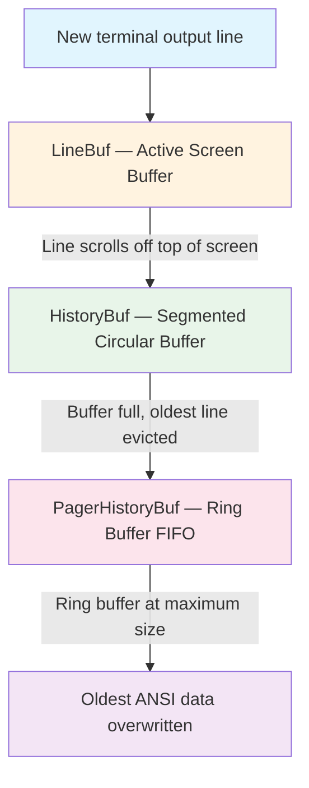
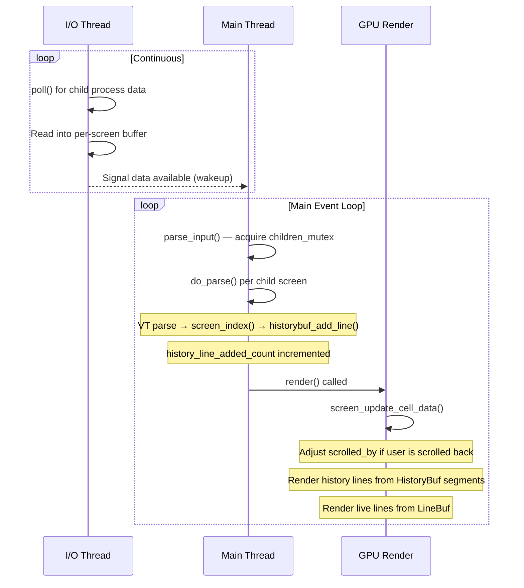
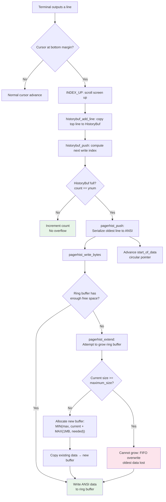

# Kitty Scrollback History Buffer: Technical Investigation

## Introduction and Question Summary

This document is a comprehensive technical investigation into the Kitty terminal emulator's scrollback history buffer behavior under heavy load conditions. Every conclusion presented here is derived directly from the source code, which serves as the single source of truth. No assumptions are made — all claims cite specific file paths and line numbers from the codebase.

The investigation addresses four interrelated questions:

1. **Memory Consumption Under Heavy Load** — How does memory consumption grow as the scrollback history buffer accumulates hundreds of thousands of lines of rapidly-generated terminal output? What are the actual per-structure sizes and allocation patterns?

2. **Scroll Responsiveness During Concurrent Output** — Does the terminal remain responsive when the user scrolls back through a very large history while new output is still being generated? What latency or lag is observable, and how does the system prioritize competing operations?

3. **Buffer Growth Boundaries and Allocation Transitions** — At what specific thresholds does the buffer's behavior change as it grows? When do new segments get allocated, when does the circular buffer overflow to pager history, and how does the ring buffer expand?

4. **Observation and Measurement Methodology** — What working scripts and commands can be used for memory monitoring and measurement, without modifying the repository?

### Key Source Files Analyzed

| File | Role |
|---|---|
| `kitty/history.c` | Primary scrollback buffer implementation: segmented allocation, pager history, push/pop/rewrap |
| `kitty/data-types.h` | Structure definitions: `CPUCell`, `GPUCell`, `LineAttrs`, `HistoryBuf`, `PagerHistoryBuf` |
| `kitty/screen.c` | Screen management: scroll handling, render integration, `scrolled_by` state |
| `kitty/screen.h` | Screen struct declaration with scrollback-related fields |
| `kitty/child-monitor.c` | Three-thread architecture: I/O, parse, render scheduling |
| `kitty/state.h` | Global state including timing parameters and scrollback configuration |
| `kitty/options/definition.py` | Scrollback configuration option definitions |
| `kitty/options/utils.py` | Configuration value parsers |
| `kitty/options/types.py` | Typed configuration defaults |
| `3rdparty/ringbuf/ringbuf.h` | Ring buffer FIFO API used by pager history |

---

## Q1: Memory Consumption Under Heavy Load

### Buffer Architecture Overview

Kitty's scrollback system is composed of three distinct buffer layers, each with a different storage strategy:



**Rationale for this architecture:** The three-tier design balances memory efficiency with access speed. The active screen (`LineBuf`) uses direct cell arrays for fast GPU rendering. The history buffer (`HistoryBuf`) uses the same cell-level storage for fast random access during scroll. The pager history (`PagerHistoryBuf`) switches to ANSI-serialized text in a ring buffer, trading random access speed for dramatically lower memory per line — this is acceptable because pager history is only accessed sequentially when piped to an external pager program.

#### HistoryBuf Structure

The `HistoryBuf` is defined at `kitty/data-types.h:282-290`:

```c
typedef struct {
    PyObject_HEAD

    index_type xnum, ynum, num_segments;
    HistoryBufSegment *segments;
    PagerHistoryBuf *pagerhist;
    Line *line;
    index_type start_of_data, count;
} HistoryBuf;
```

- `xnum` — terminal column width (number of cells per line)
- `ynum` — total capacity in lines (set from `scrollback_lines` config, default 2000)
- `num_segments` — number of allocated `HistoryBufSegment` blocks
- `segments` — pointer to dynamically-sized array of segments
- `pagerhist` — pointer to the pager history ring buffer (NULL if disabled)
- `start_of_data` — circular buffer read pointer (index of oldest line)
- `count` — number of lines currently stored (0 to `ynum`)

The buffer operates as a **circular buffer** with capacity `ynum`. When full, writing a new line overwrites the oldest line and advances `start_of_data`.

*Source: `kitty/data-types.h:282-290`*

#### HistoryBufSegment Structure

Each segment stores a contiguous block of `SEGMENT_SIZE = 2048` lines (defined at `kitty/history.c:15`):

```c
typedef struct {
    GPUCell *gpu_cells;
    CPUCell *cpu_cells;
    LineAttrs *line_attrs;
} HistoryBufSegment;
```

*Source: `kitty/data-types.h:262-266`*

#### PagerHistoryBuf Structure

The pager history overflow buffer:

```c
typedef struct {
    void *ringbuf;
    size_t maximum_size;
    bool rewrap_needed;
} PagerHistoryBuf;
```

- `ringbuf` — opaque pointer to a `ringbuf_t` from `3rdparty/ringbuf/ringbuf.h`
- `maximum_size` — configured upper bound in bytes (from `scrollback_pager_history_size` option)
- `rewrap_needed` — flag set when terminal column width changes and pager content needs re-wrapping

*Source: `kitty/data-types.h:268-272`*

### Per-Segment Memory Calculations

The exact struct sizes are enforced by compile-time assertions in the source code:

| Structure | Size | Assertion Location | Field Breakdown |
|---|---|---|---|
| `GPUCell` | **20 bytes** | `kitty/data-types.h:221` | `fg` (4B) + `bg` (4B) + `decoration_fg` (4B) + `sprite_x` (2B) + `sprite_y` (2B) + `sprite_z` (2B) + `attrs` (2B) |
| `CPUCell` | **12 bytes** | `kitty/data-types.h:228` | `ch` (4B) + `hyperlink_id` (2B) + `cc_idx[3]` (6B) |
| `LineAttrs` | **1 byte** | `kitty/data-types.h:231-239` | Union bitfield: `is_continued` (1 bit) + `has_dirty_text` (1 bit) + `has_image_placeholders` (1 bit) + `prompt_kind` (2 bits) |

**Thinking:** These sizes are not inferred — they are verified by `static_assert` statements that would cause a compilation failure if the sizes were different:
- `static_assert(sizeof(GPUCell) == 20, "Fix the ordering of GPUCell");` — line 221
- `static_assert(sizeof(CPUCell) == 12, "Fix the ordering of CPUCell");` — line 228

#### Per-Segment Memory Formula

The `add_segment()` function at `kitty/history.c:17-29` performs a **single contiguous allocation** for all three arrays within a segment:

```c
static void
add_segment(HistoryBuf *self) {
    self->num_segments += 1;
    self->segments = realloc(self->segments, sizeof(HistoryBufSegment) * self->num_segments);
    if (self->segments == NULL) fatal("Out of memory allocating new history buffer segment");
    HistoryBufSegment *s = self->segments + self->num_segments - 1;
    const size_t cpu_cells_size = self->xnum * SEGMENT_SIZE * sizeof(CPUCell);
    const size_t gpu_cells_size = self->xnum * SEGMENT_SIZE * sizeof(GPUCell);
    s->cpu_cells = calloc(1, cpu_cells_size + gpu_cells_size + SEGMENT_SIZE * sizeof(LineAttrs));
    if (!s->cpu_cells) fatal("Out of memory allocating new history buffer segment");
    s->gpu_cells = (GPUCell*)(((uint8_t*)s->cpu_cells) + cpu_cells_size);
    s->line_attrs = (LineAttrs*)(((uint8_t*)s->gpu_cells) + gpu_cells_size);
}
```

*Source: `kitty/history.c:17-29`*

**Rationale:** A single `calloc` call allocates the entire segment's data contiguously. Pointer arithmetic is then used to partition this block into three logical arrays (`cpu_cells`, `gpu_cells`, `line_attrs`). This approach has two benefits: (1) a single allocation call reduces system call overhead, and (2) contiguous memory layout improves cache locality when iterating over lines within a segment.

**Derivation of the per-segment memory formula:**

```
segment_bytes = cpu_cells_size + gpu_cells_size + line_attrs_size
              = (xnum × SEGMENT_SIZE × sizeof(CPUCell))
              + (xnum × SEGMENT_SIZE × sizeof(GPUCell))
              + (SEGMENT_SIZE × sizeof(LineAttrs))

              = (xnum × 2048 × 12) + (xnum × 2048 × 20) + (2048 × 1)
              = 2048 × (12 × xnum + 20 × xnum + 1)
              = 2048 × (32 × xnum + 1)
```

**Simplified formula:**

> **segment_bytes = 2048 × (32 × xnum + 1)**

Where `xnum` is the terminal column width.

#### Memory Calculation Table

The number of segments required is `ceil(ynum / SEGMENT_SIZE)` where `ynum` is the `scrollback_lines` configuration value.

| Terminal Width (xnum) | Per-Segment (bytes) | Per-Segment (MiB) | Segments for 10,000 lines | Total for 10,000 lines (MiB) | Segments for 100,000 lines | Total for 100,000 lines (MiB) |
|---|---|---|---|---|---|---|
| **80** | 80 × 2048 × 32 + 2048 = **5,244,928** | **~5.00** | ⌈10000/2048⌉ = **5** | **~25.00** | ⌈100000/2048⌉ = **49** | **~245.10** |
| **120** | 120 × 2048 × 32 + 2048 = **7,866,368** | **~7.50** | **5** | **~37.50** | **49** | **~367.60** |
| **200** | 200 × 2048 × 32 + 2048 = **13,109,248** | **~12.50** | **5** | **~62.50** | **49** | **~612.60** |

**Detailed calculation example for 80 columns, 100,000 lines:**

```
Per-segment = 2048 × (32 × 80 + 1) = 2048 × 2561 = 5,244,928 bytes
Segments needed = ceil(100000 / 2048) = ceil(48.828...) = 49
Total = 49 × 5,244,928 = 257,001,472 bytes ≈ 245.10 MiB
```

**Important note:** This calculation covers only the `HistoryBuf` cell data. Additional overhead includes:
- The `segments` array itself: `num_segments × sizeof(HistoryBufSegment)` ≈ `num_segments × 24 bytes` (3 pointers on 64-bit) — negligible
- The `HistoryBuf` struct overhead: ~80 bytes — negligible
- The `PagerHistoryBuf` if enabled: variable (see below)
- The `Line` object used as a cursor: ~80 bytes — negligible
- Per-process overhead (Python interpreter, GPU context, etc.) is separate and constant

### Memory Growth Model

**Thinking:** Memory does not grow linearly with each new line — it grows in discrete **step functions** at segment boundaries. This is because segments are allocated on-demand in blocks of 2048 lines. The `segment_for()` function at `kitty/history.c:36-42` controls this:

```c
static index_type
segment_for(HistoryBuf *self, index_type y) {
    index_type seg_num = y / SEGMENT_SIZE;
    while (UNLIKELY(seg_num >= self->num_segments && SEGMENT_SIZE * self->num_segments < self->ynum))
        add_segment(self);
    if (UNLIKELY(seg_num >= self->num_segments))
        fatal("Out of bounds access to history buffer line number: %u", y);
    return seg_num;
}
```

*Source: `kitty/history.c:36-42`*

The guard condition `SEGMENT_SIZE * self->num_segments < self->ynum` ensures that no segment is allocated beyond the buffer's configured capacity.

**Growth timeline for a buffer with `scrollback_lines = 10000` at 80 columns:**

| Lines Written | Segments Allocated | Memory (MiB) | Event |
|---|---|---|---|
| 0 (buffer created) | 1 | ~5.00 | First segment pre-allocated at `create_historybuf()` (line 127) |
| 1–2047 | 1 | ~5.00 | First segment filling, no new allocation |
| 2048 | 2 | ~10.00 | Second segment allocated by `segment_for()` |
| 4096 | 3 | ~15.00 | Third segment allocated |
| 6144 | 4 | ~20.00 | Fourth segment allocated |
| 8192 | 5 | ~25.00 | Fifth and final segment allocated (5 × 2048 = 10240 ≥ 10000) |
| 10001+ | 5 | ~25.00 | Buffer full, circular rotation begins (no new memory) |

**Key insight:** After all segments are allocated, memory consumption is **constant** regardless of how many more lines are generated. The buffer rotates circularly, overwriting oldest lines. The only additional memory growth comes from the pager history ring buffer (if enabled).

The first segment is pre-allocated during buffer creation in `create_historybuf()`:

```c
static HistoryBuf*
create_historybuf(PyTypeObject *type, unsigned int xnum, unsigned int ynum, unsigned int pagerhist_sz) {
    // ...
    self->num_segments = 0;
    add_segment(self);  // Pre-allocate first segment
    // ...
}
```

*Source: `kitty/history.c:116-133`, specifically line 127*

### Pager-History Overflow and Ring Buffer Growth

The `PagerHistoryBuf` subsystem provides extended scrollback beyond the `HistoryBuf` capacity, but only for sequential access through an external pager program (e.g., `less`).

#### Configuration

- **Controlled by:** `scrollback_pager_history_size` option
- **Default:** `0` (disabled) — *Source: `kitty/options/types.py:574`*
- **Unit:** Megabytes (converted to bytes internally)
- **Parser:** `kitty/options/utils.py:564-566`:
  ```python
  def scrollback_pager_history_size(x: str) -> int:
      ans = int(max(0, float(x)) * 1024 * 1024)
      return min(ans, 4096 * 1024 * 1024 - 1)
  ```
- **Maximum:** ~4 GB (`4096 * 1024 * 1024 - 1 = 4,294,967,295` bytes)
- **Option definition:** `kitty/options/definition.py:406-417`

#### Initial Allocation

When `scrollback_pager_history_size > 0`, the ring buffer is created with an initial size that is the **minimum of 1 MB and the configured maximum**:

```c
static size_t
initial_pagerhist_ringbuf_sz(size_t pagerhist_sz) {
    return MIN(1024u * 1024u, pagerhist_sz);
}
```

*Source: `kitty/history.c:67`*

The ring buffer is created in `alloc_pagerhist()` at `kitty/history.c:69-80`:

```c
static PagerHistoryBuf*
alloc_pagerhist(size_t pagerhist_sz) {
    PagerHistoryBuf *ph;
    if (!pagerhist_sz) return NULL;
    ph = calloc(1, sizeof(PagerHistoryBuf));
    if (!ph) return NULL;
    size_t sz = initial_pagerhist_ringbuf_sz(pagerhist_sz);
    ph->ringbuf = ringbuf_new(sz);
    if (!ph->ringbuf) { free(ph); return NULL; }
    ph->maximum_size = pagerhist_sz;
    return ph;
}
```

*Source: `kitty/history.c:69-80`*

#### Overflow Mechanism

When the `HistoryBuf` circular buffer is full (`count == ynum`) and a new line needs to be added, the **oldest line** is serialized to ANSI escape sequences and written to the pager history ring buffer before being overwritten. This happens in `historybuf_push()` at `kitty/history.c:276-284`:

```c
static index_type
historybuf_push(HistoryBuf *self, ANSIBuf *as_ansi_buf) {
    index_type idx = (self->start_of_data + self->count) % self->ynum;
    init_line(self, idx, self->line);
    if (self->count == self->ynum) {
        pagerhist_push(self, as_ansi_buf);
        self->start_of_data = (self->start_of_data + 1) % self->ynum;
    } else self->count++;
    return idx;
}
```

*Source: `kitty/history.c:276-284`*

The serialization in `pagerhist_push()` at `kitty/history.c:258-273` converts the cell data to ANSI text:
1. Initializes a `Line` from the oldest entry at `start_of_data`
2. Calls `line_as_ansi()` to convert cell data to ANSI escape sequences
3. Writes a reset sequence `\x1b[m` followed by the serialized content
4. Appends `\r` (if line was soft-wrapped) or `\r\n` (if line was not wrapped)

**Rationale:** ANSI serialization is used because the pager history is only consumed by external programs (like `less`) that understand ANSI escape sequences. This format is much more compact than raw cell data — approximately 10,000 lines per MB for plain ASCII text at 100 characters per line, according to the configuration documentation at `kitty/options/definition.py:413`.

#### Ring Buffer Growth

When the ring buffer needs more space, `pagerhist_extend()` at `kitty/history.c:90-101` handles growth:

```c
static bool
pagerhist_extend(PagerHistoryBuf *ph, size_t minsz) {
    size_t buffer_size = ringbuf_capacity(ph->ringbuf);
    if (buffer_size >= ph->maximum_size) return false;
    size_t newsz = MIN(ph->maximum_size, buffer_size + MAX(1024u * 1024u, minsz));
    ringbuf_t newbuf = ringbuf_new(newsz);
    if (!newbuf) return false;
    size_t count = ringbuf_bytes_used(ph->ringbuf);
    if (count) ringbuf_copy(newbuf, ph->ringbuf, count);
    ringbuf_free((ringbuf_t*)&ph->ringbuf);
    ph->ringbuf = newbuf;
    return true;
}
```

*Source: `kitty/history.c:90-101`*

**Growth formula:** `new_size = MIN(maximum_size, current_size + MAX(1 MB, needed_bytes))`

**Growth pattern for a 100 MB configured pager history:**
- Initial: 1 MB
- After first extend: MIN(100 MB, 1 MB + MAX(1 MB, needed)) ≈ 2 MB
- Subsequent extends: grows in ~1 MB increments
- Eventually reaches configured 100 MB maximum
- Once at maximum: ring buffer operates as FIFO — oldest data is overwritten automatically

When the ring buffer is at maximum capacity and `pagerhist_extend()` returns `false`, the `pagerhist_write_bytes()` function at `kitty/history.c:218-226` proceeds to write anyway via `ringbuf_memcpy_into()`, which overwrites the oldest data in the ring buffer (FIFO behavior built into the ring buffer API from `3rdparty/ringbuf/ringbuf.h`).

### Measurement Methodology

The following temporary script can be used to monitor Kitty's memory consumption in real-time. This script reads from `/proc` and does **not** modify the repository.

```bash
#!/bin/bash
# Memory monitoring script for Kitty scrollback investigation
# Usage: ./monitor_kitty_memory.sh <kitty_pid> [interval_seconds]
# Output: CSV to stdout
#
# This is a TEMPORARY observation script — do NOT commit to the repository.

PID=${1:?Usage: $0 <kitty_pid> [interval_seconds]}
INTERVAL=${2:-1}

echo "Timestamp,VmRSS_kB,VmSize_kB,VmData_kB"

while true; do
    if [ ! -d "/proc/$PID" ]; then
        echo "Process $PID exited" >&2
        exit 1
    fi
    TIMESTAMP=$(date +%s.%N)
    RSS=$(grep VmRSS /proc/$PID/status | awk '{print $2}')
    VSZ=$(grep VmSize /proc/$PID/status | awk '{print $2}')
    DATA=$(grep VmData /proc/$PID/status | awk '{print $2}')
    echo "$TIMESTAMP,$RSS,$VSZ,$DATA"
    sleep "$INTERVAL"
done
```

**What to observe:** As lines fill the history buffer, `VmRSS` should increase in step-function increments corresponding to segment allocations (~5 MiB per step at 80 columns). After all segments are allocated, `VmRSS` should stabilize unless pager history is enabled, in which case gradual growth up to the configured maximum will be observed.

### Rationale and Code Citations

**Why segmented allocation?** Kitty uses segmented allocation (`SEGMENT_SIZE = 2048` lines per segment) rather than a single monolithic array for two reasons:
1. **Amortized allocation cost** — Instead of allocating the full buffer upfront (which could be hundreds of megabytes for large `scrollback_lines` values), segments are allocated on demand as the buffer fills. A user who never generates more than 2048 lines of scrollback pays only one segment's worth of memory.
2. **Avoids reallocation** — A single contiguous buffer would require `realloc()` to grow, which copies all existing data. Segmented storage adds new blocks without copying.

**Why `SEGMENT_SIZE = 2048`?** This is a power of 2, which allows the division `y / SEGMENT_SIZE` in `segment_for()` (line 38) to be optimized by the compiler into a right shift operation, making segment lookup O(1) with minimal instruction cost.

**Why ANSI serialization for pager history?** The pager history stores text as ANSI escape sequences rather than cell-level data because:
1. It is only accessed by external pager programs (like `less`) that consume ANSI text
2. ANSI text is significantly more compact than cell data (~1 byte per character vs. 32 bytes per cell)
3. When the terminal is resized, pager history can be re-wrapped at the character level without needing to maintain cell-level metadata

**Key code citations for Q1:**
- `kitty/history.c:15` — `#define SEGMENT_SIZE 2048`
- `kitty/history.c:17-29` — `add_segment()` single-calloc allocation
- `kitty/history.c:25` — contiguous allocation: `calloc(1, cpu_cells_size + gpu_cells_size + SEGMENT_SIZE * sizeof(LineAttrs))`
- `kitty/history.c:36-42` — `segment_for()` on-demand allocation trigger
- `kitty/history.c:67` — `initial_pagerhist_ringbuf_sz()` returns `MIN(1MB, pagerhist_sz)`
- `kitty/history.c:69-80` — `alloc_pagerhist()` creates PagerHistoryBuf
- `kitty/history.c:90-101` — `pagerhist_extend()` ring buffer growth
- `kitty/history.c:116-133` — `create_historybuf()` pre-allocates first segment (line 127)
- `kitty/history.c:218-226` — `pagerhist_write_bytes()` with extend trigger
- `kitty/history.c:258-273` — `pagerhist_push()` ANSI serialization of evicted lines
- `kitty/history.c:276-284` — `historybuf_push()` circular buffer with pager overflow
- `kitty/data-types.h:216-221` — `GPUCell` definition, `static_assert(sizeof(GPUCell) == 20, ...)`
- `kitty/data-types.h:223-228` — `CPUCell` definition, `static_assert(sizeof(CPUCell) == 12, ...)`
- `kitty/data-types.h:231-239` — `LineAttrs` union definition (1 byte)
- `kitty/data-types.h:262-266` — `HistoryBufSegment` struct definition
- `kitty/data-types.h:268-272` — `PagerHistoryBuf` struct definition
- `kitty/data-types.h:282-290` — `HistoryBuf` struct definition

---

## Q2: Scroll Responsiveness During Concurrent Output

### Three-Thread Architecture

Kitty uses a multi-threaded architecture defined in `kitty/child-monitor.c` to separate I/O from parsing and rendering:



The three threads declared at `kitty/child-monitor.c:55`:

```c
pthread_t io_thread, talk_thread;
```

1. **I/O Thread** (`io_thread`) — Continuously polls child process file descriptors via `poll()`, reading raw byte data into per-screen buffers. This thread runs independently and is never blocked by scroll or render operations.

2. **Main Thread** — Executes the main event loop, which alternates between:
   - `parse_input()` (line 451) — acquires `children_mutex`, iterates all child screens, calls `do_parse()` for each
   - `render()` (line 871) — updates the display by calling `render_os_window()` → `screen_update_cell_data()`

3. **Talk Thread** (`talk_thread`) — Handles the remote control protocol. Not involved in scrollback or rendering.

*Source: `kitty/child-monitor.c:49-62`*

**Thinking:** The critical insight is that parsing and rendering share the **same thread** (the main thread). They are sequential, not concurrent. This means that during heavy output, rendering must wait for parsing to complete, and vice versa. Scroll events are processed in the main thread between parse-render cycles.

### scrolled_by State and Render Integration

The `scrolled_by` field in the `Screen` struct tracks how many lines the user has scrolled back from the bottom:

```c
unsigned int columns, lines, margin_top, margin_bottom, scrolled_by;
```

*Source: `kitty/screen.h:91`*

Related fields:
- `scroll_changed` (line 101) — flag indicating scroll position changed, triggers re-render
- `historybuf` (line 107) — pointer to the history buffer
- `history_line_added_count` (line 108) — count of lines added to history since last render

#### The Critical scrolled_by Adjustment

The most important line for understanding scroll behavior during concurrent output is at `kitty/screen.c:2761`:

```c
if (self->scrolled_by)
    self->scrolled_by = MIN(self->scrolled_by + history_line_added_count, self->historybuf->count);
```

*Source: `kitty/screen.c:2761`*

**Thinking:** This adjustment happens at the START of every render cycle in `screen_update_cell_data()`. Here is what it does and why:

1. When `scrolled_by > 0`, the user is viewing historical content (not the live output at the bottom)
2. If new lines were added to the history buffer since the last render (`history_line_added_count > 0`), the viewed content has shifted deeper into history
3. To keep the viewport at the **same logical position** (viewing the same lines), `scrolled_by` is increased by `history_line_added_count`
4. The `MIN(..., self->historybuf->count)` clamp prevents `scrolled_by` from exceeding the total number of lines in the history buffer

**Practical effect:** When you are scrolled back and new output is being generated, the terminal keeps your viewport stable — you continue seeing the same lines. New output accumulates below, pushing the buffer boundary further from your view.

#### Render Path: Mixing History and Live Lines

After adjusting `scrolled_by`, the render function fills the screen from two sources:

**History lines** (`kitty/screen.c:2763-2774`):
```c
for (index_type y = 0; y < MIN(self->lines, self->scrolled_by); y++) {
    lnum = self->scrolled_by - 1 - y;
    historybuf_init_line(self->historybuf, lnum, self->historybuf->line);
    // ... render line graphics, mark text, update line data ...
}
```

**Live lines** (`kitty/screen.c:2776-2787`):
```c
for (index_type y = self->scrolled_by; y < self->lines; y++) {
    lnum = y - self->scrolled_by;
    linebuf_init_line(self->linebuf, lnum);
    // ... render line, update line data ...
}
```

When `scrolled_by >= self->lines` (fully scrolled into history), ALL screen rows come from history. When `scrolled_by == 0` (at the bottom), ALL rows come from the live buffer. Intermediate values produce a mixed view.

*Source: `kitty/screen.c:2737-2797`*

#### Scroll Event Handling

User scroll requests are processed by `screen_history_scroll()` at `kitty/screen.c:4091-4118`:

```c
bool
screen_history_scroll(Screen *self, int amt, bool upwards) {
    switch(amt) {
        case SCROLL_LINE:  amt = 1; break;
        case SCROLL_PAGE:  amt = self->lines - 1; break;
        case SCROLL_FULL:  amt = self->historybuf->count; break;
        default:           amt = MAX(0, amt); break;
    }
    if (!upwards) {
        amt = MIN((unsigned int)amt, self->scrolled_by);
        amt *= -1;
    }
    if (amt == 0) return false;
    unsigned int new_scroll = MIN(self->scrolled_by + amt, self->historybuf->count);
    if (new_scroll != self->scrolled_by) {
        self->scrolled_by = new_scroll;
        dirty_scroll(self);
        return true;
    }
    return false;
}
```

*Source: `kitty/screen.c:4091-4118`*

The function supports three scroll granularities:
- `SCROLL_LINE` — 1 line (mouse wheel tick)
- `SCROLL_PAGE` — `self->lines - 1` lines (page up/down)
- `SCROLL_FULL` — `historybuf->count` lines (scroll to top/bottom)

After updating `scrolled_by`, it calls `dirty_scroll()` which sets `scroll_changed = true` and `is_dirty = true`, triggering a re-render on the next main thread cycle.

### Timing Parameters (input_delay, repaint_delay)

Two timing parameters in the global options control the responsiveness tradeoff:

#### input_delay

Referenced in `do_parse()` at `kitty/child-monitor.c:445`:

```c
else set_maximum_wait(OPT(input_delay) - pd.time_since_new_input);
```

*Source: `kitty/child-monitor.c:438-448`*

**Effect:** After new input arrives from the I/O thread, the main thread waits up to `input_delay` before processing it. This batches rapid input into larger parsing chunks, reducing the number of parse→render cycles per second and lowering CPU usage. However, it also introduces a minimum latency floor for scroll events that arrive during heavy output.

#### repaint_delay

Referenced in `render()` at `kitty/child-monitor.c:874-877`:

```c
monotonic_t time_since_last_render = last_render_at == MONOTONIC_T_MIN ? OPT(repaint_delay) : now - last_render_at;
if (!input_read && time_since_last_render < OPT(repaint_delay)) {
    set_maximum_wait(OPT(repaint_delay) - time_since_last_render);
    return;
}
```

*Source: `kitty/child-monitor.c:871-877`*

**Effect:** After a render, the next render is skipped if less than `repaint_delay` has elapsed (unless new input was read). This throttles the maximum frame rate, preventing the GPU render pipeline from consuming excessive resources during rapid updates.

Both parameters are declared in the global options state at `kitty/state.h:51`:

```c
monotonic_t repaint_delay, input_delay;
```

*Source: `kitty/state.h:51`*

### Observable Behavior and Prioritization

**Thinking:** Combining the thread architecture and timing parameters, here is the complete picture of what happens during concurrent scroll + heavy output:

1. **I/O is never blocked by scrollback.** The I/O thread runs on its own POSIX thread (`io_thread`) and continuously reads data from child processes via `poll()`. Scroll position, render state, and history buffer operations have no effect on I/O throughput.

2. **Parsing and rendering are sequential on the main thread.** The main event loop alternates: parse all pending input → render all windows. During heavy output, each parse cycle may process thousands of lines, all of which trigger `INDEX_UP` → `historybuf_add_line()` → segment allocation (if needed).

3. **Scroll events are processed between parse-render cycles.** When the user scrolls, the scroll event updates `scrolled_by` and sets `is_dirty = true`. On the next render cycle, `screen_update_cell_data()` adjusts `scrolled_by` for any lines added since the last render and draws the mixed history/live view.

4. **No priority distinction between scroll and I/O.** Both scroll events and parsed output are consumed in the same main thread loop. The system does not elevate scroll processing above output parsing. During sustained heavy output, scroll responsiveness is bounded by the time to complete a full parse→render cycle.

5. **Observable latency characteristics:**
   - **Minimum scroll latency:** `input_delay` (waiting for input batching) + parse time + render time
   - **During light output:** Scroll is near-instant because parse time is trivial
   - **During heavy output (thousands of lines/sec):** Scroll may feel sluggish because:
     - `input_delay` batches data, delaying the parse cycle
     - Parse time increases with the volume of buffered data
     - Render time increases when `scrolled_by > 0` because history lines require segment pointer arithmetic via `historybuf_init_line()` → `index_of()` → `segment_for()` → `cpu_lineptr()` / `gpu_lineptr()`
   - **When fully scrolled back:** The entire screen is rendered from history buffer segments, but this is still O(1) per line (direct index computation, no search)

6. **The viewport remains stable during concurrent output.** Thanks to the `scrolled_by += history_line_added_count` adjustment at line 2761, the user's view does not jump or flicker — it stays anchored to the same logical position in the history.

### Rationale and Code Citations

**Key code citations for Q2:**
- `kitty/child-monitor.c:55` — `pthread_t io_thread, talk_thread` (thread declarations)
- `kitty/child-monitor.c:438-448` — `do_parse()` with `input_delay` scheduling
- `kitty/child-monitor.c:451` — `parse_input()` main-thread loop entry
- `kitty/child-monitor.c:871-877` — `render()` with `repaint_delay` throttling
- `kitty/screen.c:1552-1567` — `INDEX_UP` macro: `historybuf_add_line()` + `history_line_added_count++`
- `kitty/screen.c:1569-1577` — `screen_index()` triggered at bottom margin
- `kitty/screen.c:1590-1598` — `screen_scroll()` calls INDEX_UP per line
- `kitty/screen.c:2737-2797` — `screen_update_cell_data()` full render path
- `kitty/screen.c:2756` — `history_line_added_count = self->history_line_added_count`
- `kitty/screen.c:2761` — `scrolled_by` adjustment: `MIN(self->scrolled_by + history_line_added_count, self->historybuf->count)`
- `kitty/screen.c:2763-2774` — Render history lines loop
- `kitty/screen.c:2776-2787` — Render live lines loop
- `kitty/screen.c:4091-4118` — `screen_history_scroll()` scroll handler
- `kitty/screen.h:91` — `scrolled_by` field
- `kitty/screen.h:101` — `scroll_changed` flag
- `kitty/screen.h:107` — `HistoryBuf *historybuf`
- `kitty/screen.h:108` — `unsigned int history_line_added_count`
- `kitty/state.h:51` — `monotonic_t repaint_delay, input_delay`

---

## Q3: Buffer Growth Boundaries and Allocation Transitions

### Segment Allocation Trigger (SEGMENT_SIZE = 2048)

The `SEGMENT_SIZE` constant at `kitty/history.c:15` defines the granularity of memory allocation:

```c
#define SEGMENT_SIZE 2048
```

*Source: `kitty/history.c:15`*

Segment allocation is triggered by the `segment_for()` function at `kitty/history.c:36-42`:

```c
static index_type
segment_for(HistoryBuf *self, index_type y) {
    index_type seg_num = y / SEGMENT_SIZE;
    while (UNLIKELY(seg_num >= self->num_segments && SEGMENT_SIZE * self->num_segments < self->ynum))
        add_segment(self);
    if (UNLIKELY(seg_num >= self->num_segments))
        fatal("Out of bounds access to history buffer line number: %u", y);
    return seg_num;
}
```

*Source: `kitty/history.c:36-42`*

**Thinking:** The allocation trigger works as follows:
1. For any line index `y`, compute `seg_num = y / 2048`
2. If `seg_num >= num_segments` (the line falls beyond allocated segments) **AND** `SEGMENT_SIZE * num_segments < ynum` (haven't reached capacity), allocate a new segment
3. The `while` loop handles the case where `y` is far beyond current allocation (could need multiple segments)
4. The `UNLIKELY` macro hints to the compiler that allocation is the rare path

**Allocation boundaries (for default `scrollback_lines = 2000`):**

| Event | Line Index | Segment | Action |
|---|---|---|---|
| Buffer creation | — | 0 | First segment pre-allocated (`create_historybuf()` line 127) |
| Line 0–2047 accessed | 0–2047 | 0 | No new allocation (fits in segment 0) |
| Note: default ynum=2000 | — | — | Only 1 segment ever needed (2000 < 2048) |

For `scrollback_lines = 10000`:

| Line Index Range | Segment Allocated | Cumulative Memory (80 cols) |
|---|---|---|
| 0–2047 | Segment 0 (at creation) | ~5.00 MiB |
| 2048–4095 | Segment 1 | ~10.00 MiB |
| 4096–6143 | Segment 2 | ~15.00 MiB |
| 6144–8191 | Segment 3 | ~20.00 MiB |
| 8192–10239 | Segment 4 | ~25.00 MiB |

### Circular Buffer Overflow to Pager History

The transition from "buffer filling" to "buffer rotating with pager overflow" occurs when `count` reaches `ynum` in `historybuf_push()` at `kitty/history.c:276-284`:

```c
static index_type
historybuf_push(HistoryBuf *self, ANSIBuf *as_ansi_buf) {
    index_type idx = (self->start_of_data + self->count) % self->ynum;
    init_line(self, idx, self->line);
    if (self->count == self->ynum) {
        pagerhist_push(self, as_ansi_buf);
        self->start_of_data = (self->start_of_data + 1) % self->ynum;
    } else self->count++;
    return idx;
}
```

*Source: `kitty/history.c:276-284`*

**Two distinct phases:**

**Phase A — Buffer Filling (`count < ynum`):**
- New lines are appended at index `(start_of_data + count) % ynum`
- `count` increments with each new line
- No data is lost, no pager history involvement
- Memory grows only when new segments are needed

**Phase B — Circular Rotation (`count == ynum`):**
- The buffer is full
- The oldest line (at `start_of_data`) is serialized to pager history via `pagerhist_push()`
- `start_of_data` advances: `(start_of_data + 1) % ynum`
- The new line overwrites the (now serialized) oldest slot
- `count` remains constant at `ynum`
- The **transition point** is when `count` first equals `ynum` (e.g., after 2000 lines with default config)

The serialization in `pagerhist_push()` at `kitty/history.c:258-273`:

```c
static void
pagerhist_push(HistoryBuf *self, ANSIBuf *as_ansi_buf) {
    PagerHistoryBuf *ph = self->pagerhist;
    if (!ph) return;
    const GPUCell *prev_cell = NULL;
    Line l = {.xnum=self->xnum};
    init_line(self, self->start_of_data, &l);
    line_as_ansi(&l, as_ansi_buf, &prev_cell, 0, l.xnum, 0);
    pagerhist_write_bytes(ph, (const uint8_t*)"\x1b[m", 3);
    if (pagerhist_write_ucs4(ph, as_ansi_buf->buf, as_ansi_buf->len)) {
        char line_end[2]; size_t num = 0;
        line_end[num++] = '\r';
        if (!l.gpu_cells[l.xnum - 1].attrs.next_char_was_wrapped)
            line_end[num++] = '\n';
        pagerhist_write_bytes(ph, (const uint8_t*)line_end, num);
    }
}
```

*Source: `kitty/history.c:258-273`*

**Key detail:** If the `pagerhist` pointer is NULL (pager history disabled, which is the default), the function returns immediately — the oldest line is simply overwritten without being preserved anywhere.

### Ring Buffer Growth Steps



**Ring buffer growth steps from `pagerhist_extend()` at `kitty/history.c:90-101`:**

The growth formula is: `newsz = MIN(ph->maximum_size, buffer_size + MAX(1024u * 1024u, minsz))`

For a configured `scrollback_pager_history_size = 100` (100 MB = 104,857,600 bytes):

| Step | Current Size | Growth Amount | New Size | Notes |
|---|---|---|---|---|
| Initial | 1 MB | — | 1 MB | `initial_pagerhist_ringbuf_sz()` at line 67 |
| 1st extend | 1 MB | +1 MB | 2 MB | `MAX(1MB, needed)` = 1 MB typically |
| 2nd extend | 2 MB | +1 MB | 3 MB | Growth in ~1 MB increments |
| ... | ... | +1 MB | ... | Linear growth continues |
| 99th extend | 99 MB | +1 MB | 100 MB | Reaches `maximum_size` |
| Next attempt | 100 MB | — | 100 MB | `pagerhist_extend()` returns `false` |

After reaching `maximum_size`, the ring buffer operates in pure FIFO mode — new writes overwrite the oldest data. The `ringbuf_memcpy_into()` function from `3rdparty/ringbuf/ringbuf.h` handles this automatically.

### Observable Allocation Events

Using the memory monitoring script from Q4, the following allocation events can be observed:

1. **Segment allocations (step-function increases):**
   - At buffer creation: immediate ~5 MiB jump (80 cols)
   - At line 2048: another ~5 MiB jump (if `scrollback_lines > 2048`)
   - At line 4096: another ~5 MiB jump (if `scrollback_lines > 4096`)
   - Pattern: discrete jumps every 2048 lines until all segments are allocated

2. **Pager history growth (gradual increases):**
   - Begins when `count` first reaches `ynum` (buffer full)
   - Ring buffer grows in ~1 MB increments
   - Appears as a gradual upward slope in `VmRSS` readings
   - Stops growing at `scrollback_pager_history_size` maximum

3. **Transition from filling to rotating:**
   - **Before transition:** `VmRSS` shows step-function increases (segment allocation)
   - **At transition:** Segment allocation stops (all needed segments exist), pager history begins writing
   - **After transition:** `VmRSS` growth is either zero (pager history disabled) or gradual (pager history enabled)

4. **Buffer clearing:**
   - When `historybuf_clear()` is called (e.g., `clear` command with reset), all segments except the first are freed
   - *Source: `kitty/history.c:209-216`*
   - This causes an immediate `VmRSS` decrease back to ~1 segment worth of memory

### Rationale and Code Citations

**Key code citations for Q3:**
- `kitty/history.c:15` — `#define SEGMENT_SIZE 2048`
- `kitty/history.c:17-29` — `add_segment()` allocation
- `kitty/history.c:36-42` — `segment_for()` on-demand allocation trigger with guard condition
- `kitty/history.c:67` — `initial_pagerhist_ringbuf_sz()` → `MIN(1MB, max)`
- `kitty/history.c:90-101` — `pagerhist_extend()` growth logic
- `kitty/history.c:116-133` — `create_historybuf()` with first segment pre-allocation at line 127
- `kitty/history.c:209-216` — `historybuf_clear()` frees all segments except first
- `kitty/history.c:218-226` — `pagerhist_write_bytes()` triggers extend when space is insufficient
- `kitty/history.c:258-273` — `pagerhist_push()` ANSI serialization of evicted lines
- `kitty/history.c:276-284` — `historybuf_push()` circular overflow logic (`count == ynum` branch)

---

## Q4: Observation and Measurement Scripts

All scripts in this section are **temporary observation tools**. They must NOT be committed to the repository. They are provided as copyable code blocks for use alongside a running Kitty instance.

### Memory Monitoring Script

This script polls `/proc/[pid]/status` to track Kitty's memory consumption over time:

```bash
#!/bin/bash
# =============================================================================
# monitor_kitty_memory.sh — Track Kitty memory consumption over time
# =============================================================================
# Usage: ./monitor_kitty_memory.sh <kitty_pid> [interval_seconds]
# Output: CSV to stdout (redirect to file for analysis)
# Example: ./monitor_kitty_memory.sh $(pgrep -x kitty) 0.5 > memory_log.csv
#
# TEMPORARY SCRIPT — Do NOT commit to the repository.
# =============================================================================

PID=${1:?Usage: $0 <kitty_pid> [interval_seconds]}
INTERVAL=${2:-1}

if [ ! -d "/proc/$PID" ]; then
    echo "Error: Process $PID does not exist" >&2
    exit 1
fi

PROC_NAME=$(cat /proc/$PID/comm 2>/dev/null)
echo "# Monitoring PID $PID ($PROC_NAME) every ${INTERVAL}s" >&2
echo "# Press Ctrl+C to stop" >&2
echo "Timestamp,Elapsed_s,VmRSS_kB,VmSize_kB,VmData_kB,VmStk_kB"

START=$(date +%s.%N)

while true; do
    if [ ! -d "/proc/$PID" ]; then
        echo "# Process $PID exited" >&2
        exit 0
    fi
    NOW=$(date +%s.%N)
    ELAPSED=$(echo "$NOW - $START" | bc)
    RSS=$(awk '/VmRSS/{print $2}' /proc/$PID/status 2>/dev/null)
    VSZ=$(awk '/VmSize/{print $2}' /proc/$PID/status 2>/dev/null)
    DATA=$(awk '/VmData/{print $2}' /proc/$PID/status 2>/dev/null)
    STK=$(awk '/VmStk/{print $2}' /proc/$PID/status 2>/dev/null)
    echo "$NOW,$ELAPSED,$RSS,$VSZ,$DATA,$STK"
    sleep "$INTERVAL"
done
```

**Expected output format:**
```
Timestamp,Elapsed_s,VmRSS_kB,VmSize_kB,VmData_kB,VmStk_kB
1700000000.123,0.000,45320,1234560,34200,136
1700000001.124,1.001,45320,1234560,34200,136
1700000002.125,2.002,50440,1239680,39320,136    # ← segment allocation jump
1700000003.126,3.003,50440,1239680,39320,136
```

### Output Generation Script

#### Bash Version

```bash
#!/bin/bash
# =============================================================================
# generate_scrollback_output.sh — Fill scrollback buffer with rapid output
# =============================================================================
# Usage: ./generate_scrollback_output.sh [num_lines] [chars_per_line]
# Example: ./generate_scrollback_output.sh 100000 80
#
# TEMPORARY SCRIPT — Do NOT commit to the repository.
# =============================================================================

NUM_LINES=${1:-100000}
CHARS=${2:-80}

echo "Generating $NUM_LINES lines of ~${CHARS} chars each..." >&2
echo "Start time: $(date)" >&2

# Pre-generate padding string
PADDING=$(printf '%0.s=' $(seq 1 "$CHARS"))

START_TIME=$(date +%s.%N)
for i in $(seq 1 "$NUM_LINES"); do
    PREFIX="${i}: "
    PAD_LEN=$((CHARS - ${#PREFIX}))
    if [ "$PAD_LEN" -gt 0 ]; then
        echo "${PREFIX}${PADDING:0:$PAD_LEN}"
    else
        echo "$PREFIX"
    fi
done
END_TIME=$(date +%s.%N)

DURATION=$(echo "$END_TIME - $START_TIME" | bc)
RATE=$(echo "$NUM_LINES / $DURATION" | bc)
echo "Completed: $NUM_LINES lines in ${DURATION}s (~${RATE} lines/s)" >&2
```

#### Python Version (with self-measurement)

```python
#!/usr/bin/env python3
"""
generate_scrollback_output.py — Fill scrollback buffer and measure process memory.

Usage: python3 generate_scrollback_output.py [num_lines] [chars_per_line]
Example: python3 generate_scrollback_output.py 100000 80

NOTE: This measures the SCRIPT's own memory, not Kitty's.
      For Kitty memory, use the companion monitor_kitty_memory.sh script.

TEMPORARY SCRIPT — Do NOT commit to the repository.
"""
import resource
import sys
import time


def get_memory_kb():
    """Get max resident set size in KB (Linux) or bytes (macOS)."""
    return resource.getrusage(resource.RUSAGE_SELF).ru_maxrss


def main():
    num_lines = int(sys.argv[1]) if len(sys.argv) > 1 else 100000
    cols = int(sys.argv[2]) if len(sys.argv) > 2 else 80

    before_mem = get_memory_kb()
    start_time = time.monotonic()

    padding = "X" * cols
    for i in range(num_lines):
        prefix = f"{i:>8}: "
        print(f"{prefix}{padding[:cols - len(prefix)]}")

    end_time = time.monotonic()
    after_mem = get_memory_kb()
    duration = end_time - start_time

    print(f"\n--- Generation Statistics ---", file=sys.stderr)
    print(f"Lines generated: {num_lines}", file=sys.stderr)
    print(f"Chars per line:  {cols}", file=sys.stderr)
    print(f"Duration:        {duration:.2f}s", file=sys.stderr)
    print(f"Rate:            {num_lines / duration:.0f} lines/s", file=sys.stderr)
    print(f"Script memory before: {before_mem} KB", file=sys.stderr)
    print(f"Script memory after:  {after_mem} KB", file=sys.stderr)
    print(f"Script memory delta:  {after_mem - before_mem} KB", file=sys.stderr)


if __name__ == "__main__":
    main()
```

### Scroll Latency Observation Script

Measuring scroll latency directly requires timing the interval between a scroll input event and the corresponding display update. The following approaches can be used:

#### Approach 1: Debug Rendering Flag

Start Kitty with the `--debug-rendering` flag to log render frame timing:

```bash
kitty --debug-rendering --config NONE -o scrollback_lines=100000
```

This outputs render timing information to stderr, including:
- Frame timestamps
- Render duration per frame
- Dirty state transitions

While scrolling during heavy output, observe the time gaps between successive render frames — larger gaps indicate scroll latency.

#### Approach 2: Interactive Timing with Python

```python
#!/usr/bin/env python3
"""
time_scroll_rendering.py — Estimate scroll render overhead.

Run this INSIDE a Kitty window after filling the scrollback buffer.
It measures the time to perform programmatic scroll operations via
Kitty's remote control protocol.

Usage:
  1. Enable remote control: kitty -o allow_remote_control=yes
  2. Fill scrollback: python3 generate_scrollback_output.py 100000
  3. Run: python3 time_scroll_rendering.py

TEMPORARY SCRIPT — Do NOT commit to the repository.
"""
import subprocess
import time
import sys


def kitty_scroll(direction="up", amount="1"):
    """Send a scroll command via kitten."""
    subprocess.run(
        ["kitten", "@", "scroll-window", f"{amount}" if direction == "up" else f"-{amount}"],
        capture_output=True,
        timeout=5,
    )


def measure_scroll_latency(num_iterations=100, scroll_amount="1"):
    """Measure round-trip time for scroll commands."""
    times = []
    for _ in range(num_iterations):
        start = time.monotonic()
        kitty_scroll("up", scroll_amount)
        elapsed = time.monotonic() - start
        times.append(elapsed * 1000)  # Convert to ms

    avg = sum(times) / len(times)
    min_t = min(times)
    max_t = max(times)
    print(f"Scroll latency over {num_iterations} iterations:")
    print(f"  Average: {avg:.2f} ms")
    print(f"  Min:     {min_t:.2f} ms")
    print(f"  Max:     {max_t:.2f} ms")


if __name__ == "__main__":
    iterations = int(sys.argv[1]) if len(sys.argv) > 1 else 100
    measure_scroll_latency(iterations)
```

### Usage Instructions

**Step-by-step measurement workflow:**

1. **Configure Kitty with desired scrollback settings:**
   ```bash
   kitty --config NONE \
       -o scrollback_lines=100000 \
       -o scrollback_pager_history_size=100
   ```
   This starts Kitty with 100,000 lines of scrollback and 100 MB pager history.

2. **Find the Kitty process PID:**
   ```bash
   pgrep -x kitty
   # or
   ps aux | grep '[k]itty'
   ```

3. **Start memory monitoring in a separate terminal:**
   ```bash
   ./monitor_kitty_memory.sh <PID> 0.5 > memory_log.csv
   ```

4. **Generate rapid output in the monitored Kitty window:**
   ```bash
   ./generate_scrollback_output.sh 200000 80
   ```

5. **Observe memory growth in the CSV output:**
   - Watch for step-function increases (~5 MiB at 80 columns) at segment boundaries
   - After all segments are allocated (~49 segments for 100,000 lines), growth should stabilize
   - Pager history ring buffer growth appears as gradual ~1 MB increments after the buffer is full

6. **Test scroll responsiveness during output generation:**
   - While output is being generated, scroll up using `Shift+PageUp` or mouse wheel
   - The viewport should stay stable at the scrolled-to position
   - New output continues below (invisible while scrolled back)
   - Return to live output with `Shift+End` or scroll to bottom

7. **Analyze the collected data:**
   ```bash
   # Plot memory over time (requires gnuplot)
   gnuplot -e "
       set datafile separator ',';
       set xlabel 'Elapsed (s)';
       set ylabel 'VmRSS (kB)';
       plot 'memory_log.csv' using 2:3 with lines title 'RSS'
   "
   ```

---

## Configuration Reference

The following configuration options affect scrollback buffer behavior. All default values and ranges are verified against the source code.

| Option | Default | Range | Memory Impact | Source |
|---|---|---|---|---|
| `scrollback_lines` | `2000` | 0 to 2³²−1 (negative → 2³²−1) | Directly determines `HistoryBuf` capacity (`ynum`). Memory = ⌈ynum/2048⌉ × segment_cost. At 80 cols: ~2.5 MiB per 1000 lines. | `kitty/options/definition.py:372-381`, `kitty/options/types.py:572`, `kitty/options/utils.py:557-561` |
| `scrollback_pager_history_size` | `0` (disabled) | 0 to 4096 MB | Enables `PagerHistoryBuf` ring buffer. Memory grows from MIN(1 MB, value) up to configured value. 0 = disabled. | `kitty/options/definition.py:406-417`, `kitty/options/types.py:574`, `kitty/options/utils.py:564-566` |
| `scrollback_fill_enlarged_window` | `no` (false) | boolean | When enabled, terminal resize pulls lines from history via `historybuf_rewrap()`, causing a transient memory spike (both old and new buffers exist during rewrap). | `kitty/options/definition.py:420-422`, `kitty/options/types.py:570` |
| `scrollback_indicator_opacity` | `1.0` | 0.0 to 1.0 | No memory impact. Controls opacity of the scroll position indicator. | `kitty/options/definition.py:384-389`, `kitty/options/types.py:571` |
| `wheel_scroll_multiplier` | `5.0` | any float | No memory impact. Multiplies scroll distance per mouse wheel event for low-precision scroll devices. | `kitty/options/definition.py:425-430` |

### scrollback_lines Parser Details

The parser at `kitty/options/utils.py:557-561`:
```python
def scrollback_lines(x: str) -> int:
    ans = int(x)
    if ans < 0:
        ans = 2 ** 32 - 1
    return ans
```

**Thinking:** Negative values are treated as "effectively infinite" by mapping to `2³²−1 = 4,294,967,295` lines. At 80 columns, this would require `⌈4294967295/2048⌉ = 2,097,152` segments × 5,244,928 bytes = ~10.5 TB. In practice, the system would run out of memory long before reaching this limit. The documentation at `kitty/options/definition.py:377-378` explicitly warns: "using very large scrollback is not recommended as it can slow down performance of the terminal and also use large amounts of RAM."

### scrollback_pager_history_size Parser Details

The parser at `kitty/options/utils.py:564-566`:
```python
def scrollback_pager_history_size(x: str) -> int:
    ans = int(max(0, float(x)) * 1024 * 1024)
    return min(ans, 4096 * 1024 * 1024 - 1)
```

Converts MB to bytes and caps at ~4 GB (`4096 * 1024 * 1024 - 1 = 4,294,967,295` bytes).

### Rewrap Overhead During Terminal Resize

When the terminal window is resized, the history buffer content must be rewrapped to match the new column width. This is handled by `historybuf_rewrap()` at `kitty/history.c:594-614`:

```c
void
historybuf_rewrap(HistoryBuf *self, HistoryBuf *other, ANSIBuf *as_ansi_buf) {
    while(other->num_segments < self->num_segments) add_segment(other);
    if (other->xnum == self->xnum && other->ynum == self->ynum) {
        // Fast path: same dimensions, just memcpy segments
        for (index_type i = 0; i < self->num_segments; i++) {
            memcpy(other->segments[i].cpu_cells, self->segments[i].cpu_cells,
                   SEGMENT_SIZE * self->xnum * sizeof(CPUCell));
            memcpy(other->segments[i].gpu_cells, self->segments[i].gpu_cells,
                   SEGMENT_SIZE * self->xnum * sizeof(GPUCell));
            memcpy(other->segments[i].line_attrs, self->segments[i].line_attrs,
                   SEGMENT_SIZE * sizeof(LineAttrs));
        }
        other->count = self->count; other->start_of_data = self->start_of_data;
        return;
    }
    // ... dimension change path: rewrap_inner() ...
}
```

*Source: `kitty/history.c:594-614`*

**Transient memory spike:** Line 596 pre-allocates segments in the destination buffer to match the source: `while(other->num_segments < self->num_segments) add_segment(other)`. During rewrap, **both** the old buffer and the new buffer exist simultaneously. For a 100,000-line buffer at 80 columns, this means a transient spike of ~245 MiB (the new buffer) on top of the existing ~245 MiB (the old buffer), totaling ~490 MiB during the rewrap operation. The old buffer is freed after rewrap completes.

**Fast path optimization:** When the terminal dimensions haven't changed (`other->xnum == self->xnum && other->ynum == self->ynum`), the function uses direct `memcpy` to copy segment data without re-wrapping — this is significantly faster and avoids the computational overhead of the rewrap algorithm.

If `scrollback_fill_enlarged_window` is enabled and the pager history ring buffer has data, the rewrap may also need to re-wrap the pager history content, setting `rewrap_needed = true` at `kitty/history.c:607-608`.
