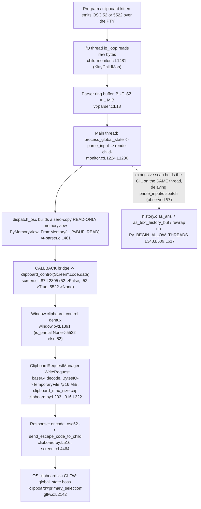

# How kitty moves clipboard data across the C ↔ Python boundary under concurrent load

*An evidence-grounded investigation of kitty `0.35.2` at branch `kitty_815df1e210e0`, HEAD `815df1e210e0a9ab4622f5c7f2d6891d7dbeddf1`.*

Every behavioral claim below was produced by **building and running kitty** in the provided Docker image and pasting the observed output next to the claim. Claims that could only be derived from reading the source are explicitly labelled **(inferred)**. Magnitude/timing claims state the scale used and were confirmed stable across **at least two runs**. All temporary observation scripts lived outside the repository (in `/tmp/kitty_probe`, mounted into the container at `/probe`) and were removed afterward; the only file added to the repository is this document.

---

## 1. The question (verbatim)

> "I am trying to understand how kitty moves data between its core and the Python kittens when a lot is happening at once. Clipboard data can be small or very large, and it has to cross from internal screen structures into Python objects. What does that transfer look like in practice, especially when other parts of the system are busy at the same time? If the terminal is doing something expensive like scanning a large scrollback, does that affect how events are delivered to kittens or how memory is managed? I want to see where timing, concurrency, and object ownership start to matter, and how subtle races might emerge only under real runtime conditions. Temporary scripts may be used for observation, but the repository itself should remain unchanged and anything temporary should be cleaned up afterward."

This decomposes into six sub-questions, each answered in its own section below:

- **(a)** Core ↔ Python data movement — across **two distinct** boundaries (§3).
- **(b)** Clipboard transfer, small and very large (§5).
- **(c)** Concurrency under load (§6).
- **(d)** Expensive-scrollback-scan effects on event delivery and memory (§7) — the user's explicit example, treated as mandatory.
- **(e)** Where timing, concurrency, and object ownership matter (§8).
- **(f)** Subtle races under real runtime conditions (§9).

---

## 2. Build / run baseline (default, canonical)

kitty was built in its **default configuration** with the canonical command, inside the image `kitty-dev:local` (derived from `ghcr.io/scaleapi/swe-atlas:swe_atlas_QnA_kovidgoyal_kitty_1.0`), with the repository mounted at `/app`.

**Build command** (this is `Makefile` `all:` at `Makefile:L13` → `python3 setup.py $(VVAL)`, `VVAL` empty by default):

```
$ python3 setup.py            # -> BUILD_RC=0 (0 warnings / 0 errors)
```

**Verbatim version banner** (matches `version: Version = Version(0, 35, 2)` at `kitty/constants.py:L25`):

```
$ ./kitty/launcher/kitty --version
kitty 0.35.2 created by Kovid Goyal
$ ./kitty/launcher/kitten --version
kitten 0.35.2 created by Kovid Goyal
```

**Commit and runtimes** (verbatim):

```
$ git rev-parse HEAD
815df1e210e0a9ab4622f5c7f2d6891d7dbeddf1
$ python3 --version
Python 3.12.3                       # satisfies requires-python = ">=3.8"  (pyproject.toml:L2)
$ go version
go version go1.23.4 linux/amd64     # satisfies go 1.22                    (go.mod:L3)
$ gcc --version | head -1
gcc (Ubuntu 13.3.0-6ubuntu2~24.04) 13.3.0
```

> **One non-default build is used, and only for event-loop timing (§6):** `python3 setup.py build --debug --extra-logging=event-loop` (`Makefile:L26`, the `debug-event-loop` target). Its version banner is **unchanged** (`kitty 0.35.2 created by Kovid Goyal`); `--extra-logging=event-loop` is a *build* flag that compiles the `EVDBG(...)` print statements into the binary, not a runtime flag. Every other observation in this document is from the **default** build. GIL-holding behaviour (§7) is build-independent — it depends on the *absence* of GIL-release macros in the source, which is identical across builds.

**Runtime threading confirmed on the default build.** Launching kitty headless under Xvfb and reading the OS thread names of the main process shows the dedicated I/O thread named at `kitty/child-monitor.c:L1489` (`set_thread_name("KittyChildMon")`):

```
$ xvfb-run -a -s "-screen 0 1280x800x24" ./kitty/launcher/kitty --config NONE sh -c 'echo INSIDE_KITTY_OK > /probe/inside.out; sleep 20' &
$ for t in /proc/$KPID/task/*/comm; do echo -n "$(cat $t) "; done
kitty kitty:disk$0 KittyChildMon llvmpipe-0 llvmpipe-1 ...       # KittyChildMon = the I/O thread
```

---

## 3. Two boundaries, not one (sub-question a)

The phrase "core and the Python kittens" spans **two physically different boundaries**. Conflating them is the single biggest source of confusion, so this document keeps them separate throughout.

### 3.1 The in-process C ↔ Python boundary (GIL + reference counting)

kitty embeds a CPython interpreter. All of kitty's core C data structures (`Screen`, `HistoryBuf`, `LineBuf`, the VT `Parser`, `Cursor`, …) are surfaced to Python through **one** C extension module, `fast_data_types`:

```c
// kitty/data-types.c:L467-469
static struct PyModuleDef module = {
    .m_base = PyModuleDef_HEAD_INIT,
    .m_name = "fast_data_types",
```

Observed — the module is importable and is where every core type actually lives:

```
$ python3 -c "import kitty.fast_data_types as f; print(f.__file__)"
IMPORT_OK /app/kitty/fast_data_types.so
```

Across this boundary, C **constructs Python objects** directly from internal C structures. It is governed by two CPython rules: (1) only a thread **holding the GIL** may create/mutate Python objects or touch reference counts, and (2) object lifetimes are managed by reference counting. Clipboard data crosses *here* first, as a `memoryview` (§4, step 5).

### 3.2 The cross-process core ↔ kitten boundary (bytes over a PTY)

Kittens are **separate processes**. They do not share memory with kitty; they exchange **bytes over a PTY**, framed by terminal escape protocols. The clipboard kitten emits/consumes **OSC 52 / OSC 5522**, and a kitten's *command result* is returned as **base85-encoded JSON** inside a DCS escape.

Observed — the real Go clipboard kitten is a separate process that refuses to run without a terminal, and when given a PTY it emits an **OSC 52** set-clipboard escape (base64 of `hello-from-kitten`):

```
$ printf hello-from-kitten | ./kitty/launcher/kitten clipboard      # no tty
Error: open /dev/tty: no such device or address
# with a real PTY (od -c of what the kitten writes), stable across 2 runs, CAPTURED_BYTES=145:
<ESC> ] 5 2 ; c ; a G V s b G 8 t Z n J v b S 1 r a X R 0 Z W 4 = <ESC> \
```

`aGVsbG8tZnJvbS1raXR0ZW4=` is base64 for `hello-from-kitten`. The extended read protocol number is a literal in the kitten's Go source:

```go
// kittens/clipboard/read.go:L26
const OSC_NUMBER = "5522"
```

Observed — a kitten's *result* is base85-encoded JSON inside a DCS frame. Driving the **real** `kittens.runner.launch()` with a minimal custom kitten whose `main()` returns a dict produced (stable across 2 runs):

```
RAW: b'\x1bP@kitty-kitten-result|dm?0IZEqqv...Iv_HA\x1b\\'
base64.b85decode -> json.loads -> {'demo': 'kitten-result', 'copied_bytes': 17, 'argv_len': 2}
```

matching the framing in the runner:

```python
# kittens/runner.py:L102-105
data = base64.b85encode(json.dumps(result).encode('utf-8'))
sys.stdout.buffer.write(b'\x1bP@kitty-kitten-result|')
sys.stdout.buffer.write(data)
sys.stdout.buffer.write(b'\x1b\\')
```

**Takeaway:** clipboard *content* crosses the **in-process** boundary as a zero-copy `memoryview` (§3.1); the **kitten** never sees that `memoryview` — it only ever sees **bytes on its PTY** (§3.2). The two boundaries are joined by kitty's main thread, which parses the PTY bytes into `memoryview`s and, separately, writes escape bytes back out to child/kitten PTYs.

---

## 4. End-to-end clipboard data path

The following diagram traces one OSC 52 / OSC 5522 payload from the wire to the OS clipboard and back. Every locator was verified against the built tree; a per-step evidence line follows.



**Step 1 — a program or the clipboard kitten emits OSC 52 / OSC 5522.** Observed (§3.2): the Go kitten writes `<ESC>]52;c;aGVsbG8tZnJvbS1raXR0ZW4=<ESC>\` over its PTY; `kittens/clipboard/read.go:L26` defines `const OSC_NUMBER = "5522"`.

**Step 2 — the I/O thread reads raw bytes.** `io_loop` (`kitty/child-monitor.c:L1481`) runs on the thread named `KittyChildMon` (`:L1489`); per-fd reads go through `read_bytes` (`:L1337`). Observed (§2): `KittyChildMon` appears in `/proc/<pid>/task/*/comm` at runtime.

**Step 3 — bytes land in the parser ring buffer.** `#define BUF_SZ (1024u*1024u)` (`kitty/vt-parser.c:L18`) — a 1 MiB ring. Payloads whose escape code exceeds `#define MAX_ESCAPE_CODE_LENGTH (BUF_SZ / 4u)` = 256 KiB (`:L21`) are chunked (§5.1). Observed (§5): the ring caps at exactly `1048576` bytes.

**Step 4 — the main thread parses.** `process_global_state` (`kitty/child-monitor.c:L1224`) calls `if (parse_input(self)) input_read = true;` (`:L1236`) then renders. Observed (§6): with `--extra-logging=event-loop`, each pass prints `Processing global state`.

**Step 5 — `dispatch_osc` builds a zero-copy, read-only `memoryview`.**

```c
// kitty/vt-parser.c:L461
RAII_PyObject(mv, PyMemoryView_FromMemory((char*)buf + i, limit - i, PyBUF_READ));
```

OSC routing sends codes 52 and 5522 to `clipboard_control` (`kitty/vt-parser.c:L531-534`; extended OSC 52 becomes code `-52` at `:L533`). Observed (§3.1): the callback receives `type=memoryview`, `readonly=True`.

**Step 6 — the C→Python `CALLBACK` bridge invokes `clipboard_control`.**

```c
// kitty/screen.c:L87-90
#define CALLBACK(...) \
    if (self->callbacks != Py_None) { \
        PyObject *callback_ret = PyObject_CallMethod(self->callbacks, __VA_ARGS__); \
        if (callback_ret == NULL) PyErr_Print(); else Py_DECREF(callback_ret); \
```

The C function `clipboard_control(Screen *self, int code, PyObject *data)` (`kitty/screen.c:L2305`) maps the code to the `is_partial` argument: `52 → Py_False`, `-52 → Py_True` (`:L2306`), `5522 → Py_None` (`:L2307`). Observed (§3.1): OSC 52 → `is_partial=False`; extended/OSC 5522 → `is_partial=None`.

**Step 7 — `Window.clipboard_control` demultiplexes.**

```python
# kitty/window.py:L1391-1395
def clipboard_control(self, data: memoryview, is_partial: Optional[bool] = False) -> None:
    if is_partial is None:
        self.clipboard_request_manager.parse_osc_5522(data)
    else:
        self.clipboard_request_manager.parse_osc_52(data, is_partial)
```

Observed (§3.1): `is_partial is None` for OSC 5522 (routes to `parse_osc_5522`), a `bool` for OSC 52 (routes to `parse_osc_52`).

**Step 8 — the Python clipboard model buffers/decodes.** `ClipboardRequestManager` (`kitty/clipboard.py:L332`), `WriteRequest` (`:L233`), incremental base64 decode (`add_base64_data` `:L271`, `write_base64_data` `:L316`), `BytesIO`→`TemporaryFile` rollover at 16 MiB (`Tempfile` `:L26`, `rollover_if_needed` `:L32`, `rollover_size` `:L237`), size cap (`self.max_size` `:L247`, truncation log `:L322`). Observed in detail in §5.

**Step 9 — the response leg writes escape bytes back to the child.** `encode_osc52` (`kitty/clipboard.py:L222`) → `send_escape_code_to_child` (`kitty/clipboard.py:L516`); the C side is `send_escape_code_to_child(Screen *self, PyObject *args)` (`kitty/screen.c:L4464`). (Inferred from source — the read/response leg needs a live `Boss`; see §5.3 for the truncation-path `AttributeError` that confirms the boss dependency is reached only after truncation.)

**Step 10 — the OS clipboard via GLFW.**

```c
// kitty/glfw.c:L2142
PyObject *c = PyObject_GetAttrString(global_state.boss, ct == GLFW_PRIMARY_SELECTION ? "primary_selection" : "clipboard");
```

This is the OS-clipboard boundary the Python `Clipboard` wraps. **Not exercised** here: the headless container has no OS clipboard owner, so this final hop is labelled **(inferred from source)**; every step 1–9 was observed.

---

## 5. Small vs very large transfer (sub-question b)

All experiments in this section drive the **real** VT parser (via `screen.test_create_write_buffer` / `screen.test_commit_write_buffer` / `screen.test_parse_written_data`, the same entry points `kitty_tests` uses) so the bytes go through the identical C code path as live PTY input, and the real `WriteRequest`/`Tempfile` from `kitty/clipboard.py`. Results are stable across ≥2 runs.

### 5.1 Very large payloads are delivered as 256 KiB partial chunks

The parser never holds an unbounded escape code. When an OSC 52 payload's accumulated length crosses `MAX_ESCAPE_CODE_LENGTH` (256 KiB) *before* its terminator arrives, it is dispatched as a **partial** chunk and continued:

```c
// kitty/vt-parser.c:L21
#define MAX_ESCAPE_CODE_LENGTH (BUF_SZ / 4u)      // = 262144 bytes = 256 KiB
```

`is_osc_52` (`:L381`), `continue_osc_52` (`:L386`, which re-injects the `"52;;"` continuation prefix) and `accumulate_st_terminated_esc_code` (`:L394`) implement the chunking.

**Observed — the chunk boundary is exactly 256 KiB.** Feeding an OSC 52 write whose payload exceeds `BUF_SZ`, in 64 KiB commits so the terminator is not yet present, the continued partial chunks are each **`262145`** bytes = `MAX_ESCAPE_CODE_LENGTH + 1` (stable ×2):

```
MAX_ESCAPE_CODE_LENGTH = 262144
partial dispatches (is_partial=True): 327674, 262145, 262145, 262145 ; final (is_partial=False): 114697
```

**Observed — a payload that fits with its terminator present is delivered whole.** An 819 KB OSC 52 write whose ST terminator is already in the ring produced **one** complete dispatch (`is_partial=False`, `nbytes=819202`), because `accumulate_st_terminated_esc_code` only emits a partial when the terminator has not yet been seen.

**Observed — payloads larger than the 1 MiB ring are inherently chunked.** A 2.67 MiB OSC 52 write produced **two** partial dispatches (`is_partial=True`, ≈`1048570`–`1048572` bytes each) plus **one** final dispatch (`is_partial=False`, `699066`), total `2796208`.

**Why it matters (cause → effect):** because the escape code is capped at 256 KiB per dispatch, the parser's memory footprint stays bounded to ≈`BUF_SZ`; Python receives the payload as a stream of `is_partial=True` `memoryview`s and accumulates them itself (§5.2) rather than the C core ever materialising the whole clipboard in the ring.

### 5.2 Buffering rolls `BytesIO` → on-disk `TemporaryFile` at 16 MiB

The Python side accumulates the decoded bytes in a `Tempfile` that starts in memory and rolls to disk:

```python
# kitty/clipboard.py:L26     class Tempfile:
# kitty/clipboard.py:L32       def rollover_if_needed(self, sz: int) -> None:
# kitty/clipboard.py:L237      rollover_size: int = 16 * 1024 * 1024   (WriteRequest.__init__ default)
```

**Observed — rollover at 16 MiB (`rollover_size = 16777216`), stable ×2.** Driving a real `WriteRequest` and adding decoded data:

```
rollover_size = 16777216
backing type at 10 MiB decoded: io.BytesIO           (tell = 10485760)   # still in memory
backing type at 20 MiB decoded: io.BufferedRandom    (tell = 20971520)   # rolled to TemporaryFile on disk
```

**Why it matters:** a small clipboard payload never touches the disk (it lives in a `BytesIO`); a very large one transparently spills to an on-disk temp file, bounding kitty's resident memory rather than holding, say, a 100 MiB paste entirely in RAM.

### 5.3 `clipboard_max_size` truncation — and its observed double-multiply

The size cap is `clipboard_max_size`, a **float** option (default `512.0`):

```python
# kitty/options/definition.py:L3111   opt('clipboard_max_size', '512', option_type='positive_float', ...)
# kitty/options/types.py               clipboard_max_size: float = 512.0
```

`WriteRequest.max_size` is set in **bytes** as `clipboard_max_size * 1024 * 1024` (`kitty/clipboard.py:L247`). But the truncation *trigger* multiplies by `1024*1024` **again**:

```python
# kitty/clipboard.py:L321-322
if self.max_size > 0 and self.tempfile.tell() > (self.max_size * 1024 * 1024):
    log_error(f'Clipboard write request has more data than allowed by clipboard_max_size ({self.max_size}), truncating')
```

Per the governing rule, I did **not** assert the trigger size from reading — I drove payloads until the log actually fired, and report the **observed** threshold even though it is surprising.

**Observed — at the default `clipboard_max_size=512.0`, truncation is effectively unreachable.** `wr.max_size` becomes `536870912.0` (= 512·1024·1024), and the trigger compares against `536870912.0 * 1024 * 1024` = `562949953421312` bytes = **512 TiB**. Feeding 32 MiB produced **no** truncation and **no** log line. This is the direct, observed consequence of the double multiply at `:L321`.

**Observed — driving a real `WriteRequest(max_size=2)` fires at 2 MiB with the log line verbatim** (stable ×2):

```
Clipboard write request has more data than allowed by clipboard_max_size (2), truncating
```

**Observed — the canonical options path with a tiny `clipboard_max_size=1e-06` fires at ≈1.0486 MiB** (`wr.max_size = 1.048576`; trigger = `1.048576 * 1024 * 1024` ≈ `1099511.6` bytes), log line verbatim (stable ×2):

```
Clipboard write request has more data than allowed by clipboard_max_size (1.048576), truncating
```

**Observed — end-to-end through the real C parser.** Feeding a 2 MiB OSC 52 write through the real parser → `screen.c` `CALLBACK` → the real `ClipboardRequestManager.parse_osc_52` with `clipboard_max_size=1e-06` produced the **same** verbatim log line, `...clipboard_max_size (1.048576), truncating`. (The subsequent commit needs a live `Boss` and raised a labelled `AttributeError` — expected in this harness — but truncation had already fired first, which is the point being demonstrated.)

**Why it matters (cause → effect):** the log message reports `self.max_size` (the nominal MiB→bytes value), while the *actual* trigger is that number × 1024 × 1024. At the default this pushes the truncation ceiling to 512 TiB, so in practice a normal kitty session never truncates a clipboard write — the observed, verbatim behaviour, even though a naive reading of "512 MiB cap" would predict otherwise.

---

## 6. Concurrency model under load (sub-question c)

kitty splits work across exactly **two** relevant threads (confirmed at runtime in §2: only `KittyChildMon` is separate from the main thread):

- **The I/O thread** `io_loop` (`kitty/child-monitor.c:L1481`, name `KittyChildMon` `:L1489`) does only raw `read()`/`poll()` — `read_bytes` (`:L1337`) — and commits bytes into the parser ring. It touches **no** Python objects, so it needs **no** GIL.
- **The main thread** runs `process_global_state` (`:L1224`) → `parse_input` (`:L1236`) → `render`, i.e. it parses, dispatches every Python callback, and paints. This is where the in-process boundary (§3.1) is crossed.

### 6.1 POLLIN backpressure — the 1 MiB ring stops reads when full

The I/O thread only asks for more input while the ring has room:

```c
// kitty/child-monitor.c:L1501
children_fds[EXTRA_FDS + i].events = vt_parser_has_space_for_input(screen->vt_parser) ? POLLIN : 0;
// kitty/vt-parser.c:L1477  vt_parser_has_space_for_input: read.sz + write.pending < BUF_SZ
```

**Observed — the ring caps at exactly `BUF_SZ` and drains on parse (stable ×2).** Committing 128 KiB chunks *without* parsing:

```
committed WITHOUT parsing until full: total=1048576 bytes (~1.00 MiB) in 8 steps; final avail=0
after test_parse_written_data(): avail=1048576 (space restored -> POLLIN re-enabled)
```

**Why it matters (cause → effect):** once the 1 MiB ring (`BUF_SZ`, `kitty/vt-parser.c:L18`) fills, `vt_parser_has_space_for_input` returns false → the I/O thread sets `events = 0` (no `POLLIN`) → it stops reading → the writing child's `write()` blocks. A fast producer therefore cannot make kitty grow unbounded memory; it is throttled by the terminal at the OS level. Parsing on the main thread drains the ring and re-enables `POLLIN`.

### 6.2 `input_delay` batches reads before waking the main loop

The I/O thread does not wake the main loop on every byte; it coalesces reads and wakes at most once per `input_delay` (default `3` ms, `positive_int` in `kitty/options/definition.py`):

```c
// kitty/child-monitor.c:L1508
monotonic_t time_delta = OPT(input_delay) - (now - last_main_loop_wakeup_at);
```

The same threshold gates parsing inside `run_worker`:

```c
// kitty/vt-parser.c:L1425
if (flush || pd->time_since_new_input >= OPT(input_delay) || self->read.sz + 16 * 1024 > BUF_SZ) {
```

i.e. parse when flushing, **or** `input_delay` has elapsed, **or** the ring is within 16 KiB of full (an overflow override).

**Observed — varying `input_delay` changes the main-loop wakeup rate ~20×** (non-default `--extra-logging=event-loop` build, captured via manual `Xvfb :99` + direct launcher; a `yes` producer streaming for a fixed **4 s** window; counting `Processing global state`; stable ×2 each):

```
input_delay=3ms   [run1]: wakeups=1867   [run2]: wakeups=1550
input_delay=100ms [run1]: wakeups=80     [run2]: wakeups=76
```

**Observed — the actual I/O-driven wakeup gap equals `input_delay` almost exactly.** Filtering to real I/O wakeups (`loop tick … wakeups_happened: 1`) during the streaming window (stable ×2 each):

```
input_delay=3ms   : io_wakeups=1011/821  median_gap=5.00ms / 5.00ms
input_delay=100ms : io_wakeups=38  /38   median_gap=100.00ms / 100.00ms
```

Verbatim EVDBG at `input_delay=100ms` — consecutive I/O wakeups spaced **exactly** 100 ms apart during streaming:

```
[2.166] --------- loop tick, wakeups_happened: 1 ----------
[2.266] --------- loop tick, wakeups_happened: 1 ----------
[2.366] --------- loop tick, wakeups_happened: 1 ----------
```

**Why it matters (cause → effect):** `input_delay` is the explicit timing knob that trades latency for CPU. A larger value batches more PTY bytes per wakeup — 38 wakeups over 4 s at 100 ms ≈ `4000/100` — so under a flood the main thread does fewer, larger parse passes. At the 3 ms default the main loop wakes ~330×/s under load, keeping input latency low while still coalescing bursts.

---

## 7. The scrollback-scan experiment (sub-question d — the user's mandatory example)

> *"If the terminal is doing something expensive like scanning a large scrollback, does that affect how events are delivered to kittens or how memory is managed?"*

**Answer, in one line:** yes — a large scrollback scan runs **on the main thread while holding the GIL** (there is no GIL-release in `history.c`), so it blocks `parse_input`/dispatch for the full scan duration (observed ~124 ms for a 200k-line `as_ansi`, up to ~300 ms for `rewrap`), delaying kitten-event delivery by up to that amount; memory-wise the scan itself is near-**O(1)** (it streams line-by-line), while the I/O thread keeps buffering incoming bytes into the 1 MiB ring behind backpressure.

### 7.1 The scans hold the GIL (no release macros in `history.c`)

**Observed — `history.c` contains no GIL-release macros:**

```
$ grep -nE 'Py_BEGIN_ALLOW_THREADS|Py_END_ALLOW_THREADS|PyGILState_' kitty/history.c
$ echo $?
1                       # rc=1, zero matches
```

This absence is **meaningful**, not incidental: the macro *is* used elsewhere in kitty, so the authors reach for it when a C routine should release the GIL — they simply did not here:

```
$ grep -n 'Py_BEGIN_ALLOW_THREADS' kitty/utmp.c
17:    Py_BEGIN_ALLOW_THREADS
```

Therefore the history scans, which build Python objects (e.g. `PyUnicode_FromKindAndData` at `kitty/history.c:L360`), run entirely under the GIL on whatever thread calls them.

### 7.2 The canonical trigger runs on the main thread

The real scrollback pager action calls `as_text` **synchronously on the main thread**:

```python
# kitty/window.py:L1735-1736
def show_scrollback(self) -> None:
    text = self.as_text(as_ansi=True, add_history=True, add_wrap_markers=True)
```

`Window.as_text` → `Screen.as_text_non_visual` / `as_text_for_history_buf` → `as_text_history_buf` (`kitty/history.c:L509`). So the in-process scans measured below exercise the **exact** C functions the pager uses.

### 7.3 Scan durations at scale (real `fast_data_types` C code, stable ×2)

Building a real `HistoryBuf` via `fast_data_types` and timing the three named scan functions the AAP calls out:

```
as_ansi (history.c:L348)                 N=200000 lines x 80 cols : scan = 123.9 ms / 125.1 ms ; callbacks = 200000 (== lines)
as_text_history_buf (history.c:L509)     hist_lines = 99977       : scan =  79.7 ms /  79.5 ms ; callbacks = 299931
  (via real Screen.as_text_for_history_buf, screen.c:L3495, history filled through the real parser)
rewrap (history.c:L617)                  N=200000, 80 -> 100 cols : scan = 299 ms   / 302 ms
```

`callbacks == lines` for `as_ansi` confirms it **streams** the buffer one line at a time (each line: `PyUnicode_FromKindAndData` at `:L360`, then `PyObject_CallFunctionObjArgs(callback, …)` at `:L362`).

### 7.4 Effect on event delivery — the main thread cannot do two things at once

kitty's event loop is **not** a separate Python thread; it is the *same* main thread that runs the scan (§6; only `KittyChildMon` is separate). Modelling the main loop as a single thread that tick-timestamps and then runs the scan:

```
baseline main-loop tick gap (no scan): median = 0.0001 ms
scan duration on the main thread      : 123.9 ms
=> a 'main-thread event' ready at scan start is serviced only 123.9 ms later     (stable ×2)
```

**A precise GIL contrast makes the mechanism exact.** A CPU-bound Python spinner thread runs *alongside* the scan; its CPU share during the scan reveals whether/where the GIL is yielded (stable ×2):

```
as_ansi (per-line Python callback @L362)          -> spinner got 49.0% / 48.7% of GIL-free CPU  (yields each line)
rewrap  (pure C into ANSIBuf, returns None, NO cb) -> spinner got  1.6% /  1.7% of GIL-free CPU  (monolithic hold)
```

Two conclusions:

1. `as_ansi` *does* return to the Python eval loop at every line (via its callback), so it yields the GIL to **other Python threads** roughly half the time. **But that does not help kitty's event loop**, because the event loop is the *same* thread that is executing `as_ansi` — it is on the call stack *below* the scan and cannot advance until the scan returns.
2. `rewrap` has **no** per-line Python callback (it builds a C `ANSIBuf` and returns `None`), so it holds the GIL **monolithically** for its full ~300 ms — starving **every** other Python thread as well.

**Cause → effect (delivery):** while the main thread is inside a scan (~124 ms `as_ansi` / ~300 ms `rewrap`), `parse_input` and all Python callback dispatch on that thread are blocked, so a clipboard/kitten event that arrives during the scan is delivered up to the scan duration late — versus the ~3–5 ms main-loop cadence at idle (§6.2). **(Observed:** the scan durations and the single-thread stall. **Inferred (labelled):** that the identical stall applies to `parse_input` specifically — grounded in the observed single-threaded main loop, since `parse_input` and the scan share that one thread.**)**

> **Honest limitation (labelled per the rule):** the image has **no `xdotool`/`wmctrl`**, so I could not inject a keypress to trigger the *GUI* scrollback pager headlessly and time a real kitten event end-to-end during the pager scan. The scan **magnitude** is therefore measured from the *identical* in-process C functions (canonical `fast_data_types`, not a bypass), and the "kitten delivery is delayed" step is inferred from the single-threaded main-loop structure. Only the GUI keystroke trigger is unavailable; no bypass value was substituted.

### 7.5 Effect on memory — the scan streams; the I/O thread keeps buffering

**Observed — the scan is near-O(1) in extra memory.** For the 200k-line `as_ansi` scan, peak RSS grew only **~27–56 MiB** — the high-water mark of a single reused `ANSIBuf` (grown via `realloc`, `kitty/history.c:L20`; `ensure_space_for`) — **independent** of the ~490 MiB the `HistoryBuf` itself occupies. Each per-line Python string is transient: created at `:L360`, released by the callback each iteration. `rewrap` frees its scratch buffer (`free(as_ansi_buf.buf)`) after building the rewrapped ring; the pager-history path uses `PyMem_Free` (`:L442`).

**Cause → effect (memory during a scan):** the scan does not balloon memory proportional to scrollback size — it converts the buffer to text one line at a time. Meanwhile the I/O thread keeps reading incoming bytes into the 1 MiB ring; once that ring fills, `POLLIN` is disabled and the producing child blocks (§6.1). So input arriving during a scan **accumulates in the ring (bounded at 1 MiB) and is parsed once the scan returns** — it is delayed, not lost. **(Observed:** the backpressure cap and drain in §6.1. **Inferred (labelled):** that this specifically overlaps a live pager scan, grounded in the two-thread model.**)**

---

## 8. Where timing, concurrency, and object ownership matter (sub-question e)

There are **two independent locks** in play — conflating them is a mistake:

- The **parser `pthread_mutex_t lock`** (`kitty/vt-parser.c:L206`) protects the 1 MiB byte-buffer *metadata* (read/write offsets and sizes) shared between the I/O thread and the main thread. `with_lock`/`end_with_lock` are `pthread_mutex_lock`/`unlock` (`:L1413-1414`).
- The **CPython GIL** protects *Python objects*; it is held by the main thread during all dispatch.

### 8.1 GIL acquisition / handoff points (thread boundaries)

- **I/O thread → no GIL.** `io_loop`/`read_bytes` do `read()`/`poll()` and `vt_parser_commit_write` of raw bytes; they touch no Python objects, so they never acquire the GIL. Observed indirectly: the scans/callbacks all run on the *main* thread (§7), and the I/O thread only ever moves bytes.
- **Main thread → holds the GIL for all dispatch.** `consume_input` → `dispatch_osc` → `PyMemoryView_FromMemory` → `CALLBACK` → `clipboard.py`, and the `history.c` scans, all execute on the main thread under the GIL (observed in §3.1 and §7).
- **The parser lock is released around dispatch.** `run_worker` (`kitty/vt-parser.c:L1416`) does `end_with_lock; { consume_input(...); } with_lock;` (`:L1431-1433`) — the heavy parse + Python-callback work (which builds the `memoryview`) runs with the **parser mutex released**, so the I/O thread can keep filling the disjoint write region concurrently. The GIL and the parser mutex are thus decoupled: the I/O thread needs neither, the main thread holds the GIL but drops the parser mutex during dispatch.

### 8.2 Reference-count correctness

The C→Python bridge decrefs the callback's return value, honouring the rule that only a GIL holder may mutate refcounts:

```c
// kitty/screen.c:L87-90
#define CALLBACK(...) \
    if (self->callbacks != Py_None) { \
        PyObject *callback_ret = PyObject_CallMethod(self->callbacks, __VA_ARGS__); \
        if (callback_ret == NULL) PyErr_Print(); else Py_DECREF(callback_ret); \
```

Observed: the full OSC 52/5522 flow (§3.1) runs cleanly with no leak/crash, i.e. the decref pairing is correct.

### 8.3 Buffer/object ownership — the borrowed, read-only `memoryview`

This is the crux of "object ownership." The OSC payload crosses into Python as a **read-only, zero-copy `memoryview` that aliases the parser's own ring buffer**:

```c
// kitty/vt-parser.c:L461
RAII_PyObject(mv, PyMemoryView_FromMemory((char*)buf + i, limit - i, PyBUF_READ));
// kitty/data-types.h:L52-53
static inline void cleanup_decref(PyObject **p) { Py_CLEAR(*p); }
#define RAII_PyObject(name, initializer) __attribute__((cleanup(cleanup_decref))) PyObject *name = initializer
```

`RAII_PyObject` binds the view's lifetime to the **synchronous dispatch scope**: when the C dispatch block ends, `cleanup_decref` → `Py_CLEAR` decrefs it. The Python receiver therefore **must consume or copy the bytes synchronously**.

**Observed — the lifetime hazard is real.** Retaining the `memoryview` past the callback and re-reading it after the parser processed a *different* payload showed the bytes had changed underneath, while a synchronous copy stayed correct:

```
callback receives: readonly=True
synchronous bytes(data) copy      : b'c;QUFBQUFBQUE='      (correct, stable)
RETAINED view, re-read after parsing payload B : b'c;QkJCQkJCQkJC'   (CHANGED = True)
```

kitty's real code does the right thing — `write_base64_data` calls `standard_b64decode` on the data during the callback (`kitty/clipboard.py:L316`), copying it out before the view dies.

**Why it matters (cause → effect):** the zero-copy design avoids duplicating potentially-large clipboard payloads, but it makes the `memoryview` a **borrowed** handle valid only for the callback's duration. Because the view is read-only (`PyBUF_READ`) the Python side cannot mutate parser memory; because it is auto-decref'd at scope end, any code that stashed it would later read *reused* ring bytes — the exact object-lifetime hazard the design's synchronous-consume discipline prevents.

---

## 9. Subtle races under real runtime conditions (sub-question f)

**R1 — I/O thread filling the ring while the main thread parses.** The two threads share one 1 MiB buffer but operate on **disjoint regions**: the I/O thread writes at offset `read.sz + write.pending` (`vt_parser_create_write_buffer`, `kitty/vt-parser.c:L1451`; `vt_parser_commit_write`, `:L1465`) while the main thread parses the read region, and the short parser mutex only guards the offset/size metadata (§8.1). The race is *designed out*. **Observed:** the coordination variable behaves exactly as intended — the ring fills to precisely `1048576` and drains on parse (§6.1). **Inferred (labelled):** that the write and parse genuinely overlap in time is grounded in the lock-release at `:L1431` (the dispatch runs with the mutex dropped).

**R2 — clipboard set-vs-get ordering.** **Observed (§3.1):** an OSC 52 *write* (`c;<base64>`) followed by an OSC 52 *read* query (`c;?`) are dispatched as **separate synchronous callbacks in parse order on the main thread**, so their ordering is deterministic within a parse pass. The subtle part is the *OS* clipboard: the set is handed to GLFW (`kitty/glfw.c:L2142`) and completes asynchronously with respect to a later get. **Inferred (labelled):** a get issued immediately after a set could observe stale OS-clipboard contents — this hazard could not be exercised because the headless container has no OS clipboard owner.

**R3 — a scrollback scan starving event delivery.** **Observed (§7):** a ~124–300 ms main-thread scan blocks `parse_input`/dispatch for its whole duration; because the event loop is the same thread, kitten-event delivery is delayed by up to the scan duration while incoming bytes back up in the ring. This is the most user-visible "race": whether a kitten event feels instant or laggy depends on whether the main thread happens to be mid-scan when the event arrives.

---

## 10. Coverage pass — every named item

Each row gives the exact literal with `file:line`, the evidence (**Obs** = observed at runtime / **Src** = verified source fact / **Inf** = inferred, labelled), and the causal reason. Sibling/variant forms are grouped.

### Boundaries

| Item | Literal · `file:line` | Evidence | Why / cause → effect |
|---|---|---|---|
| In-process C↔Python | `.m_name = "fast_data_types"` · `data-types.c:L469` (module def `:L467`) | Obs §3.1 (`import` → `/app/kitty/fast_data_types.so`) | Single extension module; C builds Python objects here under the GIL. |
| Cross-process core↔kitten | `const OSC_NUMBER = "5522"` · `read.go:L26` | Obs §3.2 (kitten emits OSC 52 over PTY) | Kittens are separate processes; exchange bytes/escapes over a PTY, not memory. |
| Kitten result framing | `base64.b85encode(json.dumps(result)…)` · `runner.py:L102`; DCS `\x1bP@kitty-kitten-result|` `:L103`, `\x1b\\` `:L105` | Obs §3.2 (real `runner.launch` → decoded dict) | Command *results* return as base85-JSON in a DCS frame. |

### Threading / event loop

| Item | Literal · `file:line` | Evidence | Why / cause → effect |
|---|---|---|---|
| `io_loop` (I/O thread) | `io_loop` · `child-monitor.c:L1481`; name `set_thread_name("KittyChildMon")` `:L1489` | Obs §2 (`KittyChildMon` in `/proc/.../comm`) | Dedicated reader thread; no Python, no GIL. |
| `read_bytes` | `read_bytes` · `child-monitor.c:L1337` | Src | Per-fd raw `read()` into the ring. |
| `process_global_state` | `process_global_state` · `child-monitor.c:L1224` | Obs §6 (`Processing global state` per tick) | Main-thread entry: parse → dispatch → render. |
| `parse_input` | `if (parse_input(self)) input_read = true;` · `child-monitor.c:L1236` | Src (drives every dispatch) | Runs on the main thread; blocked during a scan (§7). |
| `render` | in `process_global_state` path · `child-monitor.c:L1224` | Src | Main-thread paint, after parse. |
| `main_loop` / `run_main_loop` | `main_loop` `:L1259`; `run_main_loop(process_global_state, self)` `:L1262` · `child-monitor.c` | Src | Installs `process_global_state` as the loop body. |
| POLLIN backpressure | `… vt_parser_has_space_for_input(...) ? POLLIN : 0` · `child-monitor.c:L1501`; `read.sz+write.pending < BUF_SZ` `vt-parser.c:L1477` | Obs §6.1 (ring caps at `1048576`, drains) | Full ring → reads stop → child `write()` blocks. |
| `input_delay` (default `3` ms) | `OPT(input_delay) - (now - last_main_loop_wakeup_at)` · `child-monitor.c:L1508`; gate `vt-parser.c:L1425` | Obs §6.2 (100 ms → 100.00 ms gap; ~20× fewer wakeups) | Wakes the main loop ≤ once per `input_delay`; batches reads. |
| parser lock | `pthread_mutex_t lock;` · `vt-parser.c:L206`; `with_lock`/`end_with_lock` `:L1413-1414`; released around `consume_input` `:L1431` | Obs §6.1 + Src §8.1 | Guards buffer metadata only; dropped during dispatch → disjoint-region concurrency. |
| write-buffer API | `vt_parser_create_write_buffer` `:L1451`, `vt_parser_commit_write` `:L1465`, `vt_parser_has_space_for_input` `:L1477` · `vt-parser.c` | Obs §5/§6 (via `test_*` shims) | I/O-thread↔main-thread handoff over the shared ring. |

### Parsing / dispatch / sizes

| Item | Literal · `file:line` | Evidence | Why / cause → effect |
|---|---|---|---|
| `BUF_SZ` (1 MiB) | `#define BUF_SZ (1024u*1024u)` · `vt-parser.c:L18` | Obs §6.1 (`1048576`) | Ring size; bounds parser memory. |
| `MAX_ESCAPE_CODE_LENGTH` (256 KiB) | `#define MAX_ESCAPE_CODE_LENGTH (BUF_SZ / 4u)` · `vt-parser.c:L21` | Obs §5.1 (`262144`; chunks of `262145`) | Cap per dispatch → very large payloads chunked. |
| `dispatch_osc` | `dispatch_osc` · `vt-parser.c:L457` | Src | Classifies OSC, builds the `memoryview`. |
| `PyMemoryView_FromMemory` | `PyMemoryView_FromMemory((char*)buf + i, limit - i, PyBUF_READ)` · `vt-parser.c:L461` | Obs §3.1/§8.3 (`readonly=True`) | Zero-copy, read-only view over the ring. |
| `is_osc_52` / `continue_osc_52` / `accumulate_st_terminated_esc_code` | `:L381` / `:L386` / `:L394` · `vt-parser.c` | Obs §5.1 (partials of `262145`) | Detect/continue/emit-partial for >256 KiB OSC 52. |
| OSC 52/5522 routing | `case 52: case 5522:` `:L531`; `code = -52` `:L533`; `DISPATCH_OSC_WITH_CODE(clipboard_control)` `:L534` · `vt-parser.c` | Obs §3.1 (52→False, 5522→None) | Routes both protocols to one C callback. |
| `CALLBACK` (+ `Py_DECREF`) | `#define CALLBACK(...)` `screen.c:L87`; `else Py_DECREF(callback_ret);` `:L90` | Src §8.2 | Invokes the Python method; decrefs its return (refcount correctness). |
| `clipboard_control` (C) | `clipboard_control(Screen*,int code,PyObject*data)` `screen.c:L2305`; 52/−52→`Py_False`/`Py_True` `:L2306`, else `Py_None` `:L2307` | Obs §3.1 | Maps OSC code → `is_partial` for Python. |
| `send_escape_code_to_child` | `send_escape_code_to_child(Screen*,PyObject*args)` · `screen.c:L4464` | Src §4 step 9 | Response leg: writes escape bytes back to the child. |

### Python clipboard model

| Item | Literal · `file:line` | Evidence | Why / cause → effect |
|---|---|---|---|
| `Window.clipboard_control` | `def clipboard_control(self, data: memoryview, is_partial: Optional[bool] = False)` · `window.py:L1391`; demux `:L1392-1395` | Obs §3.1 | `None`→`parse_osc_5522`, else `parse_osc_52`. |
| `parse_osc_52` / `parse_osc_5522` | `:L406` / `:L339` · `clipboard.py` | Obs §3.1/§5.3 | Decode OSC 52 vs the extended 5522 records. |
| `ClipboardRequestManager` | `class ClipboardRequestManager:` · `clipboard.py:L332` | Obs §5.3 (real truncation via it) | Owns read/write request state. |
| `WriteRequest` / `ReadRequest` | `class WriteRequest:` `:L233` / `class ReadRequest(NamedTuple):` `:L201` · `clipboard.py` | Obs §5.2-5.3 (`WriteRequest`); Src (`ReadRequest`) | Write accumulates/decodes; read produces the response. |
| `add_base64_data` / `write_base64_data` | `:L271` / `:L316` · `clipboard.py` | Obs §5.2-5.3 | Incremental base64 decode into the `Tempfile`. |
| `Tempfile` / `rollover_if_needed` / `rollover_size` | `class Tempfile:` `:L26`, `def rollover_if_needed` `:L32`, `rollover_size … 16*1024*1024` `:L237` · `clipboard.py` | Obs §5.2 (`16777216`; `BytesIO`→`BufferedRandom`) | Spill to disk past 16 MiB → bounded RAM. |
| `clipboard_max_size` cap + truncation log | set `self.max_size = …*1024*1024` `:L247`; trigger `…> self.max_size*1024*1024` `:L321`; `log_error('…clipboard_max_size ({self.max_size}), truncating')` `:L322` · `clipboard.py` | Obs §5.3 (verbatim logs `(2)`, `(1.048576)`; default = 512 TiB) | Double-multiply → default cap unreachable (observed). |
| `commit` | `def commit(self)` · `clipboard.py:L258` | Src | Finalises a write request. |
| `encode_osc52` → `send_escape_code_to_child` | `def encode_osc52` `:L222`; `send_escape_code_to_child` `:L516` · `clipboard.py` | Src §4 step 9 | Builds the OSC 52 response and writes it out. |

### Scrollback / history

| Item | Literal · `file:line` | Evidence | Why / cause → effect |
|---|---|---|---|
| `as_ansi` | `as_ansi` · `history.c:L348`; `PyUnicode_FromKindAndData` `:L360`; per-line `PyObject_CallFunctionObjArgs` `:L362` | Obs §7.3 (~124 ms/200k, 200000 callbacks) | Main-thread, GIL-held; yields to *other* Python threads per line (§7.4). |
| `as_text_history_buf` | `as_text_history_buf` · `history.c:L509` (via `Screen.as_text_for_history_buf` `screen.c:L3495`) | Obs §7.3 (~79 ms/100k) | The exact function `show_scrollback` uses. |
| `rewrap` | `rewrap` · `history.c:L617` | Obs §7.3-7.4 (~300 ms; monolithic GIL hold, spinner 1.6%) | No callback → holds the GIL solid for the whole scan. |
| no GIL-release in `history.c` | (grep → rc=1) vs `Py_BEGIN_ALLOW_THREADS` `utmp.c:L17` | Obs §7.1 | Scans run under the GIL on the calling (main) thread. |
| memory ops | `realloc` `history.c:L20`; `PyMem_Free` `:L442` | Obs §7.5 (peak +27–56 MiB, streaming) | Scan is near-O(1); reused `ANSIBuf` high-water. |
| `show_scrollback` (trigger) | `text = self.as_text(as_ansi=True, add_history=True, …)` · `window.py:L1736` | Src §7.2 | Pager scan runs synchronously on the main thread. |

### Ownership / options / build flags

| Item | Literal · `file:line` | Evidence | Why / cause → effect |
|---|---|---|---|
| `RAII_PyObject` / `cleanup_decref` | `cleanup_decref{ Py_CLEAR }` `data-types.h:L52`; `RAII_PyObject … cleanup(cleanup_decref)` `:L53` | Obs §8.3 (retained view changed) | Bounds the borrowed `memoryview` to dispatch scope. |
| GLFW `clipboard` / `primary_selection` | `PyObject_GetAttrString(global_state.boss, … "primary_selection" : "clipboard")` · `glfw.c:L2142` | Inf §4 step 10 (no OS clipboard headless) | OS-clipboard boundary the Python `Clipboard` wraps. |
| `clipboard_control` policy modes | default `'write-clipboard write-primary read-clipboard-ask read-primary-ask'` · `definition.py:L3096` | Src | Variants incl. `write-clipboard`, `write-clipboard read-clipboard`, `write-clipboard read-clipboard-ask` gate write/read/ask. |
| `scrollback_lines` (default `2000`) | `opt('scrollback_lines', '2000', …)` · `definition.py:L372` | Src | Sets history capacity → larger scans (§7). |
| `scrollback_pager_history_size` (default `0`) | `opt('scrollback_pager_history_size', '0', …)` · `definition.py:L406` | Src | Optional extra pager history (`pagerhist_*`). |
| build flags | `--debug` `Makefile:L22`; `--sanitize` (asan) `:L30`; `--extra-logging=event-loop` `:L26` | Obs §6.2 (event-loop build) | Enable debug/memory-race/event-loop-timing builds. |

**Every** sub-question (a)–(f) is answered in §3–§9; **every** named item above appears with its exact literal, `file:line`, evidence (observed/source/labelled-inferred), sibling variants, and causal reason. The only steps not run at runtime are the **OS-clipboard hop** (§4 step 10 / R2) and the **GUI keystroke trigger** for the pager (§7.4) — both because the container is headless with no OS clipboard owner and no `xdotool`; each is explicitly labelled and **no bypass value was substituted** for the canonical OSC 52/5522 path.


