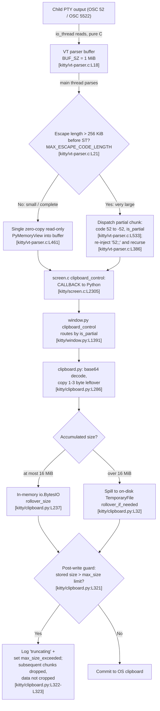

# How kitty Moves Data Between Its C Core and Python "kittens" Under Load

> A code-grounded behavioral analysis of the [kitty](https://github.com/kovidgoyal/kitty) terminal
> emulator at commit/branch `kitty_815df1e210e0`.

## Abstract

kitty splits its runtime between a performance-critical **C core** (screen state, the VT escape-code
parser, PTY I/O) and a **Python layer** (window/tab orchestration, features, and the "kittens"
subsystem); the two layers meet through a single compiled extension module, `kitty.fast_data_types`
[kitty/data-types.c:L469], built and linked by `compile_c_extension(...)` [setup.py:L1091]. This
document answers how data crosses that boundary while many things happen at once — high-throughput
child output, concurrent I/O, rendering, and remote control. The thesis, established from the source
and defended throughout, is fourfold: **(1)** *all* Python executes on a single GIL-holding **main
thread**, while the two pure-C worker threads declared together as `pthread_t io_thread, talk_thread;`
[kitty/child-monitor.c:L55] never call the Python C API; concurrency is delegated to those `pthread`
workers coordinated by mutexes such as `children_lock`/`talk_lock` [kitty/child-monitor.c:L87], **not**
by releasing the GIL — the sole `Py_BEGIN_ALLOW_THREADS` in the entire C core is the
data-path-irrelevant `num_users` syscall [kitty/utmp.c:L17], and the main loop never drops the GIL
while waiting for events [kitty/glfw.c:L2102]; **(2)** cross-boundary payloads (e.g. the clipboard)
move as a **transient, read-only, zero-copy `memoryview`** — `PyMemoryView_FromMemory(..., PyBUF_READ)`
[kitty/vt-parser.c:L461] — into the parser's 1 MiB buffer (`BUF_SZ` [kitty/vt-parser.c:L18]), so
anything the Python side wants to keep must be **copied** [kitty/clipboard.py:L286]; **(3)** small
versus very large clipboard transfers are the difference between a **single dispatch**
[kitty/vt-parser.c:L457] and a **chunked state machine** — a 256 KiB boundary (`MAX_ESCAPE_CODE_LENGTH`
[kitty/vt-parser.c:L21]), a partial-chunk code (`code = -52` [kitty/vt-parser.c:L533]), and `52;;`
re-injection (`continue_osc_52` [kitty/vt-parser.c:L386]) — with Python-side on-disk spill
[kitty/clipboard.py:L32] and a size limit that **stops accepting further data once crossed** (rather
than cropping to an exact size) [kitty/clipboard.py:L318,L323]; and **(4)** expensive main-thread
work — the user's example of scanning a huge scrollback [kitty/history.c:L348] — **serializes
everything behind it**, delaying in-process event delivery (`parse_input` cannot run
[kitty/child-monitor.c:L451]), stalling rendering [kitty/child-monitor.c:L1237], and ultimately
engaging I/O backpressure [kitty/child-monitor.c:L1501], while memory stays bounded by fixed-size
buffers [kitty/vt-parser.c:L18]. The only genuine race surface under load is therefore **C-level
buffer coordination** — the parser lock in `run_worker` [kitty/vt-parser.c:L1417] — **plus
latency/ordering effects**, not Python-level data races, which are foreclosed by the single
GIL-holding thread [kitty/utmp.c:L17], [kitty/glfw.c:L2102].

## Methodology note

Per the governing constraint that *code is the source of truth*, every factual claim about kitty below
carries an inline `[path:locator]` citation (for example `[kitty/screen.c:L87]`) pointing at the exact
file and line that substantiates it. Conclusions are derived by **static reading of the source**; the
reasoning ("why") behind each conclusion is stated explicitly. This document describes *observed
behavior only* — it does not propose fixes, refactors, or optimizations. Section 8 records the full
methodology and the handful of locator refinements discovered during verification.

## Table of contents

1. [Thread topology and the GIL](#1-thread-topology-and-the-gil)
2. [The C ↔ Python boundary](#2-the-c--python-boundary)
3. [Clipboard transfer — small vs. very large](#3-clipboard-transfer--small-vs-very-large)
4. [Event delivery to kittens](#4-event-delivery-to-kittens)
5. [The effect of expensive work — the scrollback example](#5-the-effect-of-expensive-work--the-scrollback-example)
6. [Where timing, concurrency, and object ownership become correctness-critical](#6-where-timing-concurrency-and-object-ownership-become-correctness-critical)
7. [The race surface under load](#7-the-race-surface-under-load)
8. [Methodology and rationale](#8-methodology-and-rationale)

---

## 1. Thread topology and the GIL

**Question answered:** *How does kitty move data across the C-core ↔ Python boundary when many things
are happening simultaneously?* The foundation for every later answer is kitty's thread model and its
discipline around CPython's Global Interpreter Lock (GIL).

### 1.1 Three threads

kitty runs three OS threads. Two of them are pure-C workers declared together on the `ChildMonitor`
object: `pthread_t io_thread, talk_thread;` [kitty/child-monitor.c:L55]. The third is the process's
**main thread**.

| Thread | Role | Touches Python C API? |
|--------|------|------------------------|
| **Main thread** | Runs the GLFW event loop, **all** Python, VT parsing, and rendering. The main-loop callback `process_global_state` [kitty/child-monitor.c:L1224] — installed via `run_main_loop(process_global_state, self)` [kitty/child-monitor.c:L1262] — calls `parse_input(self)` [kitty/child-monitor.c:L1236] and then `render(now, input_read)` [kitty/child-monitor.c:L1237] on each tick. `parse_input` [kitty/child-monitor.c:L451] itself "Parse[s] all available input that was read in the I/O thread." | **Yes** — holds the GIL |
| **`io_thread`** (named `"KittyChildMon"`) | The I/O loop `io_loop` [kitty/child-monitor.c:L1481] (`set_thread_name("KittyChildMon")` ~L1489) `poll()`s child PTYs and reads/writes their bytes via `read_bytes` [kitty/child-monitor.c:L1337]. | **No** |
| **`talk_thread`** (named `"KittyPeerMon"`) | The peer loop `talk_loop` [kitty/child-monitor.c:L1805] services remote-control / peer connections; `queue_peer_message` [kitty/child-monitor.c:L1653] copies each peer's raw bytes into a `Message` under `talk_mutex` and then calls `wakeup_main_loop()` [kitty/child-monitor.c:L1669] so the main thread will drain it. | **No** |

The `io_thread` moves bytes into the parser buffer but never parses them or constructs Python objects;
parsing is explicitly a main-thread activity [kitty/child-monitor.c:L451]. This is the structural
reason the boundary is crossed *only* on the main thread.

### 1.2 The single-GIL-thread invariant

The decisive evidence that the main thread effectively holds the GIL **continuously** is what is
*absent* from the C core. CPython requires that only a thread holding the GIL may call the Python C
API; an extension that owns the GIL may release it around a non-Python call with the
`Py_BEGIN_ALLOW_THREADS` / `Py_END_ALLOW_THREADS` macros. Searching the entire C core for that release
yields **exactly one** occurrence, and it is in `num_users` — a `utmp` enumeration syscall wrapped in
`Py_BEGIN_ALLOW_THREADS` [kitty/utmp.c:L17] that has nothing to do with the data path. Equally telling,
the GLFW main loop entry point `run_main_loop` simply calls `glfwRunMainLoop(cb, cb_data)`
[kitty/glfw.c:L2102] **without** wrapping it in a GIL release — so the main thread does not drop the
GIL even while blocked waiting for events.

Because the `io_thread` and `talk_thread` never call the Python C API, they need no GIL and run truly
in parallel with the main thread; but they confine themselves to raw bytes and OS calls. **Why this
matters:** with all Python serialized on one GIL-holding thread, *Python-level data races are
structurally impossible* — two Python statements never execute concurrently. kitty therefore buys its
I/O concurrency with C threads coordinated by mutexes — `children_lock` and `talk_lock`
[kitty/child-monitor.c:L87], and the per-screen write-buffer lock reached through the `screen_mutex`
macro [kitty/child-monitor.c:L74] — rather than by releasing the GIL for parallel Python.

> **Citation correction (verified):** the `screen_mutex` macro is defined in
> `kitty/child-monitor.c` [kitty/child-monitor.c:L74] — `#define screen_mutex(op, which) pthread_mutex_##op(&screen->which##_buf_lock)` —
> and operates on the per-screen `pthread_mutex_t write_buf_lock` declared at
> `kitty/screen.h` [kitty/screen.h:L116]. It is *not* defined in `screen.c`.

A transient one-shot helper thread also exists for large blocking writes to a child
[kitty/child-monitor.c:L965,L1002], but it likewise touches no Python — it only moves bytes — so it
does not affect the single-GIL-thread invariant and is mentioned here only for completeness.

---

## 2. The C ↔ Python boundary

**Question answered:** *Mechanically, how does a parsed escape code in C become a call into Python?*

The two layers meet through a single compiled C-extension module, `kitty.fast_data_types`. It is built
from the C sources gathered by `find_c_files()` — which collects every `.c`/`.m` file under `kitty/`
[setup.py:L906] — and linked into the `kitty/fast_data_types` extension by `compile_c_extension(...)`
[setup.py:L1091]; the module itself is defined in `kitty/data-types.c`, whose `PyModuleDef` carries
`.m_name = "fast_data_types"` [kitty/data-types.c:L469] and is initialized by the entry point
`PyInit_fast_data_types` [kitty/data-types.c:L525]. Performance-critical state — the `Screen`, the VT
parser, the scrollback `HistoryBuf` — lives in C; window/tab orchestration and feature logic live in
Python. The precise crossing point for
screen events is the `CALLBACK` macro [kitty/screen.c:L87]:

```c
#define CALLBACK(...) \
    if (self->callbacks != Py_None) { \
        PyObject *callback_ret = PyObject_CallMethod(self->callbacks, __VA_ARGS__); \
        if (callback_ret == NULL) PyErr_Print(); else Py_DECREF(callback_ret); \
    }
```

Each `Screen` holds a `callbacks` object — the owning Python `Window` — and `CALLBACK` invokes a named
method on it with `PyObject_CallMethod` [kitty/screen.c:L87]. So when the parser recognizes an event (a clipboard operation,
a title change, a file-transfer command, …) it calls *straight into* the Window's Python method on the
same thread, under the GIL.

**Why this matters:** the crossing is **synchronous and in-line** — `CALLBACK` is a direct
`PyObject_CallMethod` with no intervening queue [kitty/screen.c:L87]. There is no hand-off to a
worker thread and no asynchronous callback scheduling at this boundary — control and data move from C
to Python and back within a single call, on the main thread, while the GIL is held. The immediate
consequences are that **ordering is exactly parse order** (events reach Python in the byte order they
appeared in the child's output stream) and that **the parser is blocked inside the callback**: until
the Python method returns, the C parser cannot advance, because parsing itself runs on that same main
thread [kitty/child-monitor.c:L451]. Both facts are load-bearing for Sections 3–7.

---

## 3. Clipboard transfer — small vs. very large

**Question answered:** *Clipboard payloads can be tiny or enormous — how do those bytes cross from
kitty's internal parser structures into Python objects, and how is memory bounded?*

### 3.1 Protocol grounding

Two escape codes carry clipboard data. The legacy one is **OSC 52**, which transfers plain text
[docs/clipboard.rst:L5]. kitty also defines a MIME extension, **OSC 5522**, "an extension of OSC 52"
[docs/clipboard.rst:L12] with the wire form `<OSC>5522;metadata;payload<ST>` [docs/clipboard.rst:L15]
where the payload is base64 [docs/clipboard.rst:L18]; `clipboard` is listed among kitty's protocol
extensions [docs/protocol-extensions.rst:L36].

### 3.2 The buffer the data lives in

Child output is read by the `io_thread` into the VT parser's single ring-like buffer whose size is
`#define BUF_SZ (1024u*1024u)` — **1 MiB** [kitty/vt-parser.c:L18]. An escape code is allowed to grow
only up to `#define MAX_ESCAPE_CODE_LENGTH (BUF_SZ / 4u)` — **256 KiB** [kitty/vt-parser.c:L21] —
before the parser must act on what it has. These two constants are the hinge between the "small" and
"very large" cases.

### 3.3 Small payload — a single zero-copy view

When an OSC sequence terminates (its ST arrives) within the length budget, the parser dispatches it
**once**. `dispatch_osc` [kitty/vt-parser.c:L457] wraps the relevant slice of the parser buffer in a
**read-only, zero-copy** memoryview:

```c
RAII_PyObject(mv, PyMemoryView_FromMemory((char*)buf + i, limit - i, PyBUF_READ));
```

[kitty/vt-parser.c:L461]. No bytes are copied — `mv` points *into* the 1 MiB parser buffer — and the
view is read-only (`PyBUF_READ`). The `RAII_PyObject` wrapper destroys the view when `dispatch_osc`
returns, so **the view is valid only for the synchronous duration of the callback**. This is the
ownership contract revisited in Section 6.

### 3.4 Very large payload — a chunked state machine

If an OSC 52 sequence reaches `MAX_ESCAPE_CODE_LENGTH` (256 KiB) *before* its ST terminator, the
parser cannot wait for the end. `accumulate_st_terminated_esc_code`
[kitty/vt-parser.c:L395] handles both outcomes: if the ST terminator is found it dispatches the
complete code (`dispatch(..., false)`); otherwise, once the accumulated length exceeds
`MAX_ESCAPE_CODE_LENGTH` and the code is OSC 52, it dispatches a **partial chunk** (`dispatch(...,
true)`), then calls `continue_osc_52` and **recurses** to keep accumulating. `continue_osc_52`
[kitty/vt-parser.c:L386] rewinds the read position by four bytes and re-injects the prefix
`'5','2',';',';'` — i.e. it synthesizes a fresh `52;;` header so the next chunk is parsed as another
OSC 52.

The "partial" flag is threaded through the dispatch as the `is_extended_osc` argument. In the OSC
dispatch switch, `case 52: case 5522:` [kitty/vt-parser.c:L531] contains
`if (is_extended_osc && code == 52) code = -52;` [kitty/vt-parser.c:L533] — a partial OSC 52 chunk has
its code flipped to **−52** before reaching `clipboard_control`. On the screen side,
`clipboard_control` [kitty/screen.c:L2305] maps the code to an `is_partial` argument:

```c
void clipboard_control(Screen *self, int code, PyObject *data) {
    if (code == 52 || code == -52) { CALLBACK("clipboard_control", "OO", data, code == -52 ? Py_True: Py_False); }
    else { CALLBACK("clipboard_control", "OO", data, Py_None); }
}
```

[kitty/screen.c:L2305-L2307]. So **52 → `is_partial=False`** (a complete OSC 52), **−52 →
`is_partial=True`** (a partial chunk), and **5522 → `is_partial=None`** (the MIME extension).

### 3.5 Crossing into Python

The negative/positive code and the memoryview arrive at the Window's Python entry point [kitty/window.py:L1391]:

```python
def clipboard_control(self, data: memoryview, is_partial: Optional[bool] = False) -> None:
    if is_partial is None:
        self.clipboard_request_manager.parse_osc_5522(data)
    else:
        self.clipboard_request_manager.parse_osc_52(data, is_partial)
```

[kitty/window.py:L1391]. `is_partial is None` routes to `parse_osc_5522` [kitty/clipboard.py:L339];
anything else routes to `parse_osc_52` [kitty/clipboard.py:L406]. `parse_osc_5522` splits its metadata
from its payload with the zero-copy `find_in_memoryview(data, ord(b';'))` [kitty/clipboard.py:L343] —
itself a `memchr` over the buffer with no copy [kitty/data-types.c:L397].

### 3.6 Memory bounding on the Python side

Decoded bytes accumulate in a `Tempfile` [kitty/clipboard.py:L26] that **begins in memory** as an
`io.BytesIO()` and **rolls over to an on-disk `TemporaryFile()`** once it would exceed its `max_size`,
via `rollover_if_needed` [kitty/clipboard.py:L32]. A `WriteRequest` [kitty/clipboard.py:L233] sets that
*rollover* threshold from `rollover_size: int = 16 * 1024 * 1024` — **16 MiB** [kitty/clipboard.py:L237].

Further growth is bounded — but **not** cropped to a fixed size — by the `clipboard_max_size` option
(default **512**, documented as a size "in MB"; a value of zero disables the limit)
[kitty/options/definition.py:L3111]. The enforcement is **post-write and one-way**, not an exact
truncation. In `write_base64_data` [kitty/clipboard.py:L316] each chunk is base64-decoded and written to
the tempfile **first** (`self.tempfile.write(d)` [kitty/clipboard.py:L320]); only *afterward* does the
guard `self.max_size > 0 and self.tempfile.tell() > (self.max_size * 1024 * 1024)`
[kitty/clipboard.py:L321] run, and when it trips it logs a message ending in "truncating"
[kitty/clipboard.py:L322] and sets `self.max_size_exceeded = True` [kitty/clipboard.py:L323]. Because the
decode-and-write body executes only while `not self.max_size_exceeded` [kitty/clipboard.py:L318], every
**subsequent** chunk is then silently dropped — yet the chunk that *crossed* the threshold has already
been written and is **retained**, and no `truncate()` ever shrinks the stored data. The behavior is
therefore **"stop accepting more data once the limit is crossed,"** which bounds further growth without
guaranteeing an exact final size.

The exact trip-point follows from two composed scalings, worth stating precisely: the guard compares
`self.tempfile.tell()` against `self.max_size * 1024 * 1024` [kitty/clipboard.py:L321], and `self.max_size`
is itself the option **already** scaled to bytes — `get_options().clipboard_max_size * 1024 * 1024`
[kitty/clipboard.py:L247] (so for the default 512 it is 536,870,912). The two `* 1024 * 1024` factors
compose, so the on-disk size at which the guard actually fires is far larger than the nominal 512 MB —
another reason the limit is best understood as a backstop against unbounded growth rather than a precise
cap.

A subtle but important detail lives in the base64 decoder. Base64 decodes in 4-byte groups, so a chunk
boundary can leave 1–3 trailing bytes that belong with the next chunk. kitty preserves them by
**copying them out** of the transient view [kitty/clipboard.py:L286]:

```python
self.current_leftover_bytes = memoryview(bytes(mv[-extra:]))
```

[kitty/clipboard.py:L286]. The inner `bytes(...)` makes an owned copy; this is a deliberate **ownership
transfer** out of the borrowed parser-buffer view, because (per §3.3) that view is only valid for the
duration of the callback.

### 3.7 End-to-end data path



**Why the distinction matters:** the small/large split is precisely the boundary between *one borrowed
view* and *a sequenced chunk protocol with on-disk spill and a size limit*. Small payloads incur zero
copying; large or hostile payloads can never force unbounded in-memory growth, because the parser
buffer is fixed at 1 MiB [kitty/vt-parser.c:L18], the Python accumulator spills to disk at 16 MiB
[kitty/clipboard.py:L32], and once the accumulated size crosses the `clipboard_max_size` guard kitty
**stops accepting further decoded chunks** (§3.6) [kitty/clipboard.py:L318,L323] — bounding further
growth even though it does not crop the stored data to an exact size. The behavior is bounded by
construction at every stage.

---

## 4. Event delivery to kittens

**Question answered:** *How do "kittens" actually receive events and data?* "Kitten" covers two
distinct things, and they receive data differently.

### 4.1 In-process callbacks vs. out-of-process kittens

**In-process callbacks** are the screen-to-Window methods of Section 2: the C `Screen` invokes a Python
method on its `Window` via `CALLBACK` [kitty/screen.c:L87], synchronously on the main thread. This is
how clipboard data, titles, file-transfer commands, and similar events reach Python feature logic.

**Out-of-process kittens** are independent OS processes. A kitten is launched by `run_kitten`
[kittens/runner.py:L110] which executes it via `runpy.run_module(f'kittens.{kitten}.main', ...)`
[kittens/runner.py:L116]; the kitten communicates results back to kitty by writing terminal escape
sequences — it emits the `\x1bP@kitty-kitten-result|` prefix [kittens/runner.py:L103] and the ST
terminator `\x1b\\` [kittens/runner.py:L105]. The clipboard kitten is exactly such a standalone
process: `kittens/clipboard/main.py` guards `raise SystemExit('This should be run as kitten clipboard')`
[kittens/clipboard/main.py:L83], reads STDIN to the clipboard or emits clipboard contents with
`--get-clipboard`, and per its documentation "even works over SSH" [docs/kittens/clipboard.rst:L14].
Because such a kitten is a separate process talking over the escape protocol, its data takes the very
same OSC path analyzed in Section 3 — there is no shared-memory back-channel.

### 4.2 Remote-control / peer delivery

Remote-control messages arrive over the `talk_thread`, which (per Section 1) only reads raw peer bytes
in C: `talk_loop` [kitty/child-monitor.c:L1805] polls the peer file descriptors, and `queue_peer_message`
[kitty/child-monitor.c:L1653-L1669] copies each peer's bytes into a `Message` under `talk_mutex`, then
calls `wakeup_main_loop()`. The **main thread** drains that queue *inside* `parse_input`: under
`talk_mutex` it copies out the pending `Message`s and, for each, invokes
`PyObject_CallMethod(global_state.boss, "peer_message_received", ...)`
[kitty/child-monitor.c:L487-L504]. That C call lands in
`Boss.peer_message_received(self, msg_bytes, peer_id, is_remote_control)` [kitty/boss.py:L776], which
forwards remote-control payloads to `_handle_remote_command`.

**Why this matters:** on a single Python thread, "delivery" means **scheduling**, not concurrency. An
in-process callback is delivered the instant the parser reaches it via the synchronous `CALLBACK`
[kitty/screen.c:L87]; a queued peer message is delivered only when the main thread next returns to its
drain point inside `parse_input` [kitty/child-monitor.c:L487-L504]. Nothing on the Python side runs
truly in parallel — the single GIL-holding thread is the only one that runs Python [kitty/utmp.c:L17],
[kitty/glfw.c:L2102] — so event delivery is **serialized and ordered**, and, crucially, it can be
*delayed* by whatever else the main thread is doing. That delay is the subject of Section 5.

---

## 5. The effect of expensive work — the scrollback example

**Question answered (the user's example, verbatim):** *"If the terminal is busy doing something
expensive — say, scanning through a huge scrollback — does that change how events get delivered to the
kittens, or how memory is handled?"* — **Yes to delivery (it is delayed), and memory is handled through
bounded buffers rather than growth.**

### 5.1 Why a scrollback scan is a main-thread, GIL-held operation

Scrollback lives in the C `HistoryBuf`, and its scanning/reflow methods (e.g. `as_ansi`
[kitty/history.c:L348]) run entirely on the main thread that performs parsing
[kitty/child-monitor.c:L451] with the GIL held — there is **no** `Py_BEGIN_ALLOW_THREADS` anywhere in
`kitty/history.c` (verified count: zero; the C core's only GIL release is the unrelated `num_users`
syscall in `kitty/utmp.c` [kitty/utmp.c:L17]). These methods do, however, differ in *how much* Python
work each performs per line, and it would be inaccurate to describe them all as per-line callback loops:

- **`as_ansi`** [kitty/history.c:L348] is the canonical per-line case: it loops over **every** stored
  line (`for (... i < self->count ...)` [kitty/history.c:L353]), builds **one Python object per line**
  with `PyUnicode_FromKindAndData` [kitty/history.c:L360], and invokes a **Python callback per line**
  with `PyObject_CallFunctionObjArgs(callback, ans, NULL)` [kitty/history.c:L362].
- **`as_text_history_buf`** [kitty/history.c:L509] does *not* itself contain the loop; it delegates to
  the shared `as_text_generic` helper, handing it a per-line accessor and `self->count`
  (`as_text_generic(args, &glw, get_line_wrapper, self->count, output, true)` [kitty/history.c:L512]).
  The actual per-line iteration and the per-line Python callback live in `as_text_generic` in
  `kitty/line.c` [kitty/line.c:L874]: it loops `for (index_type y = 0; y < lines; y++)`
  [kitty/line.c:L888] and calls back per line through the `APPEND` / `APPEND_AND_DECREF` macros, each of
  which runs `PyObject_CallFunctionObjArgs(callback, x, NULL)` [kitty/line.c:L875-L876]. So this path
  *is* per-line callback-driven, but the loop is in `line.c`, not `history.c`.
- **`pagerhist_as_text`** [kitty/history.c:L486] is **not** per-line: it calls `pagerhist_as_bytes`
  [kitty/history.c:L488] to serialize the pager-history ring buffer and then performs a **single**
  `PyUnicode_DecodeUTF8(...)` of that one bytes object [kitty/history.c:L490] before returning it
  [kitty/history.c:L493] — one bytes-to-Unicode conversion, with no per-line Python callback.
- **`rewrap`** [kitty/history.c:L617] is also **not** per-line: it forwards to the pure-C
  `historybuf_rewrap` [kitty/history.c:L595], which reflows lines into another buffer with `memcpy` /
  `rewrap_inner`; `rewrap` then frees a scratch buffer [kitty/history.c:L622] and returns `None`
  [kitty/history.c:L623]. It neither takes nor invokes a Python callback.

**Why the distinction still supports the same conclusion:** what these operations share is not a
per-line callback shape but that each runs **on the main thread with the GIL held** while doing work
proportional to the scrollback size — whether that work is a per-line callback (`as_ansi`
[kitty/history.c:L348], and `as_text_history_buf` [kitty/history.c:L509] via `as_text_generic`), a
single large bytes-to-Unicode decode (`pagerhist_as_text` [kitty/history.c:L486]), or a bulk C reflow
(`rewrap` [kitty/history.c:L617]). Because none of them releases the GIL, any of them can hold the main
thread for the full duration of the scan — which is exactly what matters for event delivery, examined
next.

### 5.2 Consequences while a scan runs

Because the main thread is the *only* thread that runs Python or parses input [kitty/child-monitor.c:L451],
a long scan blocks all of it. The observable effects:

| Effect | Mechanism | Evidence |
|--------|-----------|----------|
| In-process event handling to kittens is **delayed** | `parse_input` cannot run while the scan owns the main thread | [kitty/child-monitor.c:L451] |
| Rendering stalls / input latency rises | rendering runs on the main thread immediately after parsing: each loop tick, `process_global_state` calls `parse_input(self)` then `render(now, input_read)`, so a scan that owns the thread defers both | [kitty/child-monitor.c:L1236-L1237], [kitty/child-monitor.c:L1262] |
| `io_thread` keeps reading **until the 1 MiB buffer fills**, then **backpressure** engages | POLLIN is requested only while the parser has space: `vt_parser_has_space_for_input(...) ? POLLIN : 0` | [kitty/child-monitor.c:L1501], [kitty/vt-parser.c:L1477] |
| Remote-control messages are queued but **not drained** | `talk_loop`/`queue_peer_message` keep queueing in C, but the drain — `parse_input` calling `peer_message_received` per message — waits for the main thread | [kitty/child-monitor.c:L1653-L1669], [kitty/child-monitor.c:L487-L504], [kitty/boss.py:L776] |

When the parser buffer [kitty/vt-parser.c:L18] fills, the `io_thread` stops requesting `POLLIN` for
that child — `vt_parser_has_space_for_input(...) ? POLLIN : 0` [kitty/child-monitor.c:L1501],
[kitty/vt-parser.c:L1477] — the child's PTY write buffer fills, and the **child process blocks** on its
next write — classic backpressure that throttles the producer instead of growing kitty's memory.

### 5.3 How memory is handled during the scan

Scrollback memory is **bounded by the configured line count**, allocated in fixed **segments of 2048
lines** (`#define SEGMENT_SIZE 2048` [kitty/history.c:L15]) by `add_segment`
[kitty/history.c:L18] using ordinary C `realloc`/`calloc`; the history buffer is sized once at
`alloc_historybuf(MAX(scrollback, lines), columns, ...)` [kitty/screen.c:L130]. Concurrent child output
that arrives during the scan accumulates only in the **bounded 1 MiB parser buffer**
[kitty/vt-parser.c:L18] until backpressure engages.

**Why the pressure shows up as latency, not memory growth:** a per-line scan such as `as_ansi`
transiently builds *one* Python string per line, passes it to the callback, and clears it — `Py_CLEAR(ans)`
follows the per-line callback in `as_ansi` [kitty/history.c:L363]; and none of the scrollback methods
enqueues a growing list of per-event Python objects (`pagerhist_as_text` returns a single decoded string
[kitty/history.c:L493], `rewrap` returns `None` [kitty/history.c:L623]). So an expensive scan manifests
as **delayed delivery and I/O backpressure**, with memory held flat by the segmented scrollback
[kitty/history.c:L18] and the fixed parser buffer [kitty/vt-parser.c:L18] — exactly the behavior the user
asked about.

---

## 6. Where timing, concurrency, and object ownership become correctness-critical

**Question answered:** *At which exact points do reference counting, buffer lifetime, ownership
transfer, and event ordering become correctness-critical?* Three places, each with concrete code
evidence.

### 6.1 Object ownership — the memoryview lifetime contract

The clipboard `memoryview` handed to Python is **borrowed** from the transient parser buffer and is a
read-only, RAII view [kitty/vt-parser.c:L461]; it is destroyed when `dispatch_osc` returns, so it is
valid **only during the synchronous callback**. **Why this is correctness-critical:** after the
callback returns, the parser reuses and compacts that buffer (see §6.2), so a retained view would
silently alias *future* bytes. The clipboard code respects the contract precisely — it copies the
1–3 base64 leftover bytes out with `memoryview(bytes(mv[-extra:]))` [kitty/clipboard.py:L286] rather
than holding the borrowed slice across chunks. Ownership transfer here is not incidental; it is the
mechanism that makes the zero-copy fast path safe.

The OS-clipboard *outbound* direction shows the mirror-image discipline with reference counting:
`get_clipboard_data` returns a `GLFWDataChunk` whose `.free` is `decref_pyobj`
[kitty/glfw.c:L2137], and `decref_pyobj` is `Py_XDECREF(x)` [kitty/glfw.c:L2133]. The first call
obtains a Python iterator from `boss.clipboard`/`primary_selection` and hands ownership of that
`PyObject*` to GLFW, which later releases it through the registered free function — an explicit
refcount handoff across the boundary.

### 6.2 Concurrency — the C buffer level

The otherwise lock-free-feeling parse is correct because of two small, well-placed critical sections.

The first is in `run_worker` [kitty/vt-parser.c:L1417], which holds the parser mutex (`with_lock` /
`end_with_lock`, `pthread_mutex_(un)lock(&self->lock)`) only to update bookkeeping —
`self->read.sz += self->write.pending` [kitty/vt-parser.c:L1421] — and then **releases the lock around
`consume_input`** so the `io_thread` can append new bytes to the buffer *tail* while the main thread
parses the *head*; after consuming, it compacts with `memmove(self->buf, self->buf +
self->read.consumed, self->read.sz)` [kitty/vt-parser.c:L1441]. The producer obtains its tail pointer
under the same lock via `vt_parser_create_write_buffer` [kitty/vt-parser.c:L1451] and publishes bytes
with `vt_parser_commit_write` [kitty/vt-parser.c:L1465]. **Why this matters:** the short critical
sections protect only the `read.sz` / `write.pending` counters, *not* the bulk byte ranges — producer
and consumer touch disjoint regions of the buffer, and the lock exists to make the index arithmetic
consistent between the two threads.

The second is the child **write** queue. Appends run under the per-screen `write_buf_lock` reached via
`screen_mutex(lock, write)` [kitty/child-monitor.c:L74], [kitty/screen.h:L116], and a hard ceiling
rejects runaway writers: if `screen->write_buf_used + sz > 100 * 1024 * 1024` (100 MiB) the data is
dropped with `log_error("Too much data being sent to child...")` [kitty/child-monitor.c:L341].

### 6.3 Timing / ordering

Because all Python is serialized on one thread, the only thing "load" can perturb is *when* things
happen. Backpressure is throttled by `input_delay`, default **3 ms** [kitty/options/definition.py:L878]
("Delay before input from the program running in the terminal is processed"), and `run_worker` forces
an immediate parse when the buffer is nearly full (`self->read.sz + 16 * 1024 > BUF_SZ`
[kitty/vt-parser.c:L1425]). **Why this matters:** the observable effects under load are **latency and
ordering** — delayed delivery, coalesced wakeups — never memory corruption, precisely because the data
races that would cause corruption are foreclosed by the single-thread invariant.

---

## 7. The race surface under load

**Question answered:** *How might subtle races emerge only under genuine runtime load?*

### 7.1 Python-level data races are structurally impossible

A single GIL-holding thread runs all Python: the only GIL release in the C core is the data-path-irrelevant
`num_users` syscall [kitty/utmp.c:L17], and the main loop holds the GIL while waiting for events
[kitty/glfw.c:L2102]. Two Python statements therefore never run concurrently, so the classic
shared-mutable-state data race cannot occur at the Python level regardless of load.

### 7.2 The real surface is C-level buffer coordination plus latency/ordering

What remains under load is the C coordination already mapped in Section 6:

| Surface | Coordination primitive | Evidence |
|---------|------------------------|----------|
| Parser head/tail (io_thread producer ↔ main-thread consumer) | parser `self->lock`, released around `consume_input`; compaction `memmove` | [kitty/vt-parser.c:L1417], [kitty/vt-parser.c:L1441] |
| Per-screen child write queue | per-screen `write_buf_lock` via `screen_mutex`; 100 MiB cap | [kitty/child-monitor.c:L74], [kitty/screen.h:L116], [kitty/child-monitor.c:L341] |
| Child set & peer queue | `children_lock`, `talk_lock` | [kitty/child-monitor.c:L87] |
| Read admission / backpressure | `vt_parser_has_space_for_input` gating POLLIN | [kitty/vt-parser.c:L1477], [kitty/child-monitor.c:L1501] |

Beyond these mutex-mediated buffers — chiefly the parser lock in `run_worker` [kitty/vt-parser.c:L1417]
— "load" manifests only as **latency and ordering**: delayed delivery and engaged backpressure
(Sections 5–6) [kitty/child-monitor.c:L1501], not corruption, precisely because the single GIL-holding
thread [kitty/utmp.c:L17] forecloses Python-level data races.

### 7.3 The partial-chunk state machine is safe *because* dispatch is single-threaded

The chunked OSC 52 protocol of §3.4 carries state across multiple dispatches: the C side re-injects
`52;;` between chunks via `continue_osc_52` and recurses [kitty/vt-parser.c:L386], emitting `is_partial`
chunks [kitty/screen.c:L2306]; the Python side accumulates them in `parse_osc_52`
[kitty/clipboard.py:L406] against an `in_flight_write_request` [kitty/clipboard.py:L337,L368] reached
through `clipboard_control` [kitty/window.py:L1391]. **Why this is the key insight:** state that
persists across a sequence of dispatches would be a textbook race *if dispatch were concurrent* — two
interleaved chunk streams could corrupt each other's accumulator. It is safe here for one reason only:
dispatch is **sequential and single-threaded**, so chunks for a request always arrive in order and
without interleaving from another thread. The correctness of the feature is a direct consequence of the
single-GIL-thread invariant of Section 1.

---

## 8. Methodology and rationale

**Static reading is the authoritative method**, in keeping with the governing rule that the code is the
source of truth. Every factual claim above carries an inline `[path:locator]` citation naming the file
and line that substantiates it, so each assertion is independently verifiable by opening that location.

The argument rests on a small number of high-signal, directly verifiable facts, each of which was
confirmed against the live source during analysis:

- The C core contains **exactly one** `Py_BEGIN_ALLOW_THREADS`, in `num_users` [kitty/utmp.c:L17], and
  the main loop does not release the GIL while waiting [kitty/glfw.c:L2102] — establishing the
  single-GIL-thread invariant (Section 1).
- `kitty/history.c` contains **zero** GIL releases, so every scrollback scan is a main-thread, GIL-held
  operation (Section 5).
- Cross-boundary clipboard data is a **read-only, RAII zero-copy** `PyMemoryView_FromMemory(...,
  PyBUF_READ)` [kitty/vt-parser.c:L461], which fixes the ownership contract (Sections 3 and 6).
- The producer/consumer lock discipline in `run_worker` — lock released around `consume_input`,
  compaction by `memmove` [kitty/vt-parser.c:L1417,L1441] — is what makes the fast path correct
  (Sections 6 and 7).

A few locator refinements were made where the working line numbers had drifted from earlier notes; the
*symbol names* were preserved so each claim remains verifiable: the OSC dispatch case label is at
`[kitty/vt-parser.c:L531]` (with the `code = -52` line at `L533`); `parse_osc_5522` is at
`[kitty/clipboard.py:L339]` and its `find_in_memoryview` call at `L343`; the clipboard size-limit
`log_error` (the post-write message ending in "truncating") is at `[kitty/clipboard.py:L322]`; and the
scrollback segment size/allocator are at
`[kitty/history.c:L15]` and `[kitty/history.c:L18]`. The previously-noted correction that the
`screen_mutex` macro lives in `[kitty/child-monitor.c:L74]` (operating on the per-screen lock at
`[kitty/screen.h:L116]`), not in `screen.c`, was confirmed by `grep`.

**Build/run corroboration.** The conclusions in this document are derived purely from reading the cited
source. The static evidence enumerated above — a single `Py_BEGIN_ALLOW_THREADS` in the whole C core
[kitty/utmp.c:L17], zero GIL releases in `history.c` (whose scan methods such as `as_ansi`
[kitty/history.c:L348] run under the held GIL), the read-only RAII memoryview [kitty/vt-parser.c:L461],
and the explicit lock discipline in `run_worker` [kitty/vt-parser.c:L1417] — is self-contained and
sufficient to support every claim, so no dynamic build/run was required to reach them. Per the governing
constraints, the source repository is left unmodified; the only file written is this analysis document,
and no temporary artifacts were committed.

This document describes observed behavior only and intentionally proposes no changes, fixes, or
optimizations to any of the mechanisms analyzed above.
