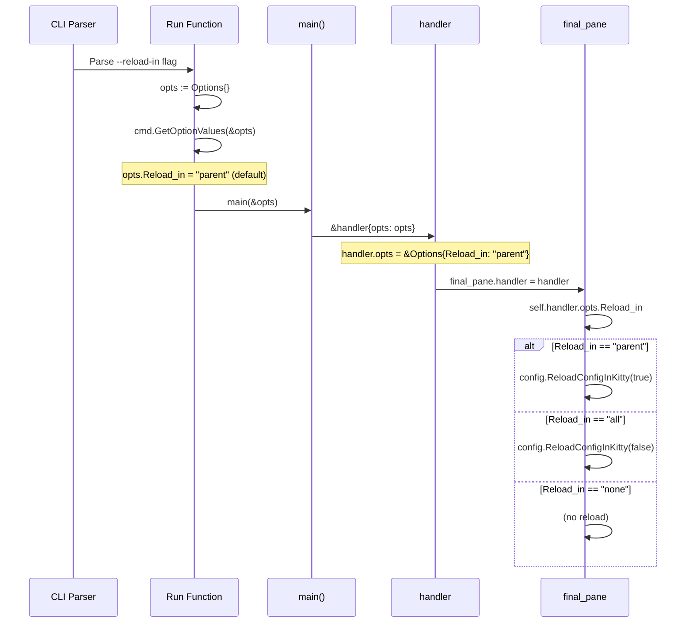
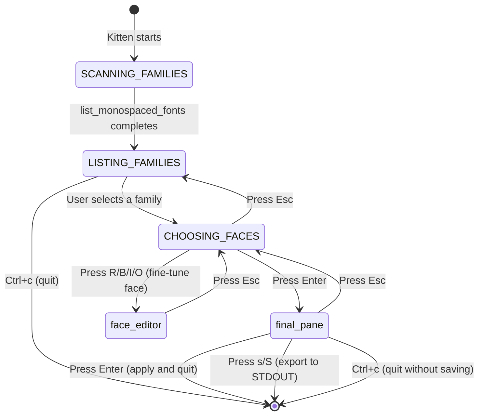
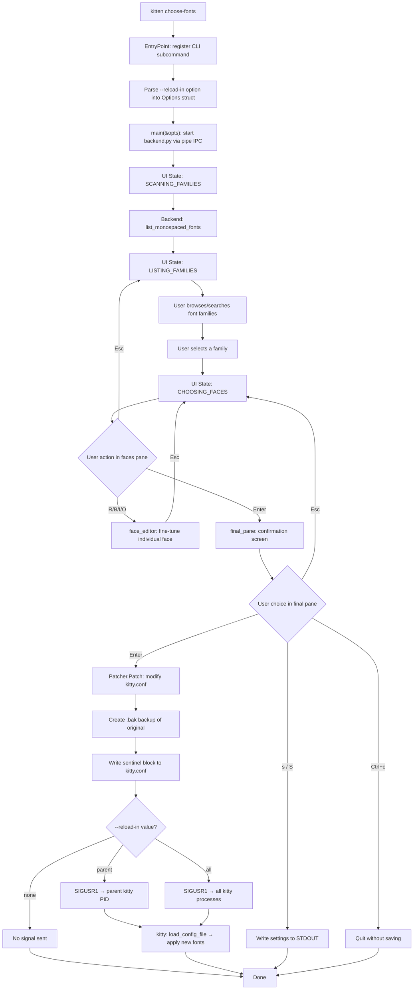

# Investigative Q&A: The `choose-fonts` Kitten in kitty

## Introduction

This document is a comprehensive investigative Q&A and onboarding reference for the **`choose-fonts` kitten** in the [kovidgoyal/kitty](https://github.com/kovidgoyal/kitty) terminal emulator repository. It answers six specific behavioral questions about the font-selection workflow, tracing every answer directly to the source code.

**Key context:**

- The `choose-fonts` kitten is a **Go-native TUI** with a **Python companion backend process** for font enumeration and rendering.
- As of this writing, there is **no existing documentation page** for this kitten in the Sphinx docs tree (`docs/kittens/`). Of the 20+ built-in kittens, only 14 have dedicated documentation pages; `choose-fonts` is among the undocumented ones.
- All answers below are grounded exclusively in source code analysis. Every behavioral claim cites a specific file and line number. No assumptions are made about undocumented behavior.

**Terminology conventions:**

| Term | Meaning |
|------|---------|
| kitten | A kitty sub-program (not "plugin") |
| `kitty.conf` | The kitty configuration file (not "config file") |
| sentinel block | The `# BEGIN_KITTY_FONTS ... # END_KITTY_FONTS` marker pair |

---

## Q1: Building and Launching Kitty

### Build Procedure

**Prerequisites:** A C compiler and the Go compiler (>= 1.22, per `go.mod`).

> Source: `docs/build.rst:14-16`

**Build commands:**

```bash
git clone https://github.com/kovidgoyal/kitty.git && cd kitty
./dev.sh build
```

> Source: `docs/build.rst:18-19`

**What `./dev.sh build` does:**

The `./dev.sh build` command downloads all major dependencies of kitty as pre-built binaries for the current platform and builds kitty to use these rather than system libraries. This includes C extensions, Go code compilation, and Python packaging.

> Source: `docs/build.rst:24-26`

**Rebuilding after changes:**

Simply re-run `./dev.sh build` to rebuild with changes. Periodically run `./dev.sh deps` to refresh dependencies.

> Source: `docs/build.rst:28-29`, `docs/build.rst:33-34`

### Binary Location

The built kitty binary is located at:

```
kitty/launcher/kitty
```

> Source: `docs/build.rst:22`

The companion `kitten` binary is located alongside `kitty` in the same directory.

### Launching with Default Settings

To start a single kitty instance with default (uncustomized) settings:

```bash
kitty/launcher/kitty
```

Run with no arguments for default settings. Alternatively, create symlinks to `kitty` and `kitten` from somewhere in your `PATH` for convenient launching.

> Source: `docs/build.rst:37-39`

**Debug build:**

```bash
./dev.sh build --debug
```

> Source: `docs/build.rst:54`

**Rationale:** The build system uses `./dev.sh build` as the single entry point that orchestrates dependency download, C extension compilation, Go code compilation, and Python packaging. The resulting binary at `kitty/launcher/kitty` is the complete, self-contained application. Launching it with no arguments uses default settings because no `--config` flag is passed and the default `kitty.conf` (if it exists) is loaded from the standard config directory.

---

## Q2: Invoking choose-fonts

Two invocation routes exist, both converging on the same Go `EntryPoint` function.

### Primary Invocation: `kitten choose-fonts`

The `kitten` binary is a Go-compiled executable. The `choose-fonts` subcommand is registered directly in the CLI command tree:

```go
choose_fonts.EntryPoint(root)
```

> Source: `tools/cmd/tool/main.go:82`

The `EntryPoint` function adds `"choose-fonts"` as a subcommand with `"choose_fonts"` as an alias:

```go
ans := root.AddSubCommand(&cli.Command{
    Name: "choose-fonts", ...
})
```

> Source: `kittens/choose_fonts/main.go:74-84`

This is the **direct, native Go path** — no Python intermediary is involved.

### Alternative Invocation: `kitty +kitten choose_fonts`

This route goes through the Python entry point system:

1. **Entry point routing:** `kitty/entry_points.py` defines `list_fonts()` which delegates to `kitty/fonts/list.py:main()`.

   > Source: `kitty/entry_points.py:15-17`

2. **Exec into Go binary:** The `main()` function in `kitty/fonts/list.py` immediately replaces the Python process with the Go kitten binary:

   ```python
   os.execlp(kitten_exe(), 'kitten', 'choose-fonts')
   ```

   > Source: `kitty/fonts/list.py:42`

3. **Kitten name resolution:** The `kittens/runner.py` module resolves kitten names by normalizing hyphens to underscores:

   ```python
   def resolved_kitten(k: str) -> str:
       ... # normalizes hyphens to underscores in kitten names
   ```

   > Source: `kittens/runner.py:23-27`

**Rationale:** Both routes converge on the same Go `EntryPoint` function. The `kitty +kitten` path exists for backward compatibility with the Python-based kitten runner, but it immediately `exec`s into the Go binary via `os.execlp`. The alias `choose_fonts` (with underscore) is registered at `main.go:96-98` via `root.AddClone()` so that both `kitten choose-fonts` and `kitten choose_fonts` work identically:

```go
clone := root.AddClone(ans.Group, ans)
clone.Hidden = false
clone.Name = "choose_fonts"
```

> Source: `kittens/choose_fonts/main.go:96-98`

---

## Q3: Subcommand Registration and Option Parsing

### EntryPoint Registration in the CLI Tree

The `EntryPoint` function is the top-level registration site for the `choose-fonts` kitten:

```go
func EntryPoint(root *cli.Command) {
    ans := root.AddSubCommand(&cli.Command{Name: "choose-fonts", ...})
    ...
```

> Source: `kittens/choose_fonts/main.go:74-84` (see full function at lines 74–98)

It is called from the central CLI tree assembly in `tools/cmd/tool/main.go`:

```go
// choose-fonts
choose_fonts.EntryPoint(root)
```

> Source: `tools/cmd/tool/main.go:81-82`

The `Run` function follows a three-step pattern:
1. Create an empty `Options{}` struct
2. Populate it from CLI flags via `cmd.GetOptionValues(&opts)`
3. Pass the populated struct to `main(&opts)`

### The `--reload-in` Option Definition

The sole option for this kitten is `--reload-in`:

```go
ans.Add(cli.OptionSpec{
    Name: "--reload-in", Choices: "parent, all, none", Default: "parent", ...
})
```

> Source: `kittens/choose_fonts/main.go:86-95`

| Property | Value | Description |
|----------|-------|-------------|
| `Name` | `--reload-in` | CLI flag name |
| `Dest` | `Reload_in` | Maps to `Options.Reload_in` struct field |
| `Type` | `choices` | Restricted to enumerated values |
| `Choices` | `parent, all, none` | The allowed values |
| `Default` | `parent` | Only signal the parent kitty instance |

**Behavior by value:**

| Value | Effect |
|-------|--------|
| `parent` | Sends `SIGUSR1` only to the parent kitty process (identified via `KITTY_PID` env var) |
| `all` | Sends `SIGUSR1` to **all** running kitty GUI processes |
| `none` | Does not send any reload signal |

### The `Options` Struct Population

```go
type Options struct {
    Reload_in string
}
```

> Source: `kittens/choose_fonts/main.go:70-72`

The struct is populated by `cmd.GetOptionValues(&opts)` which uses Go reflection to match the `Dest` field in `OptionSpec` to the corresponding struct field name. The `Dest: "Reload_in"` maps directly to `Options.Reload_in`.

**Rationale:** The registration uses kitty's `cli` package pattern, which is a declarative approach. The `OptionSpec` describes the flag's properties (name, type, choices, default, help text) and `GetOptionValues` uses reflection to populate the struct. The `AddClone` call at lines 96–98 creates an underscore-named alias (`choose_fonts`) so that both hyphenated and underscored forms of the subcommand name work.

---

## Q4: Option Value Flow Through the Program

This section traces the `Options` struct from CLI parse through every program layer to the final action site.

### `main()` Receives Options

The `Run` function creates and populates `opts`, then passes it by pointer to `main()`:

```go
opts := Options{}
if err = cmd.GetOptionValues(&opts); err != nil { ... }
return main(&opts)
```

> Source: `kittens/choose_fonts/main.go:79-83`

The `main` function receives `opts *Options` at line 16:

```go
func main(opts *Options) (rc int, err error) {
```

> Source: `kittens/choose_fonts/main.go:16`

### `handler` Stores `opts`

Inside `main()`, the handler is created with the opts pointer:

```go
h := &handler{lp: lp, opts: opts}
```

> Source: `kittens/choose_fonts/main.go:35`

The `handler` struct stores `opts` as a field:

```go
type handler struct {
    opts *Options  // plus lp, final_pane, and other fields
}
```

> Source: `kittens/choose_fonts/ui.go:42-62`

### `final_pane` Reads `opts.Reload_in`

The `final_pane` struct holds a back-reference to the handler:

```go
type final_pane struct {
    handler *handler; settings faces_settings; ...
}
```

> Source: `kittens/choose_fonts/final.go:15-20`

When the user presses Enter in the final pane, `opts.Reload_in` is read via the chain `self.handler.opts.Reload_in`:

```go
switch self.handler.opts.Reload_in {
case "parent": config.ReloadConfigInKitty(true)
case "all":    config.ReloadConfigInKitty(false)
```

> Source: `kittens/choose_fonts/final.go:87-92`

### Option Flow Sequence Diagram



**Rationale:** The option value flows through exactly three hops: CLI → `main()` → `handler` → `final_pane`. There is no transformation, copying, or re-parsing of the value along the way — it is always accessed via the original `*Options` pointer. The `final_pane` accesses it at the moment the user presses Enter, which means the value is always the one parsed at startup. There is no mechanism to change `--reload-in` at runtime.

---

## Q5: What Happens When You Press Enter

This section provides a step-by-step trace of the code path executed when the user presses Enter at the final confirmation step.

### Overview

When the user reaches the final pane and presses Enter, the following sequence executes:

1. Serialize the selected font settings
2. Patch `kitty.conf` with a sentinel block
3. Create a `.bak` backup of the original file
4. Optionally send `SIGUSR1` to reload config

### `faces_settings.serialized()`

The selected font settings are serialized into a multi-line string:

```go
func (self faces_settings) serialized() string {
    return strings.Join([]string{"font_family " + self.font_family, ...}, "\n")
}
```

> Source: `kittens/choose_fonts/final.go:63-70`

This produces output like:

```
font_family      family="JetBrains Mono"
bold_font        auto
italic_font      auto
bold_italic_font auto
```

### `config.Patcher.Patch()` — Sentinel Block Mechanism

The Enter key handler in `on_key_event()` creates a `Patcher` and calls `Patch()`:

```go
patcher := config.Patcher{Write_backup: true}
path := filepath.Join(utils.ConfigDir(), "kitty.conf")
updated, err := patcher.Patch(path, "KITTY_FONTS", self.settings.serialized(), ...)
```

> Source: `kittens/choose_fonts/final.go:78-82`

The `Patcher.Patch()` method in `tools/config/api.go` performs these steps:

**Step 1 — Resolve symlinks:**

```go
if q, err := filepath.EvalSymlinks(path); err == nil {
    path = q
}
```

> Source: `tools/config/api.go:315-317`

**Step 2 — Read existing file:**

```go
raw, err := os.ReadFile(path)
```

If the file doesn't exist, it starts with empty content (no error).

> Source: `tools/config/api.go:318-324`

**Step 3 — Comment out existing font settings:**

A regex pattern matches any existing `font_family`, `bold_font`, `italic_font`, or `bold_italic_font` directives and comments them out:

```go
pat := utils.MustCompile(fmt.Sprintf(`(?m)^\s*(%s)\b`,
    strings.Join(settings_to_comment_out, "|")))
text := pat.ReplaceAllString(utils.UnsafeBytesToString(raw), `# $1`)
```

> Source: `tools/config/api.go:325-326`

**Step 4 — Construct the sentinel block:**

```go
addition := fmt.Sprintf("# BEGIN_%s\n%s\n# END_%s", sentinel, content, sentinel)
```

With `sentinel = "KITTY_FONTS"`, this produces:

```
# BEGIN_KITTY_FONTS
font_family      family="JetBrains Mono"
bold_font        auto
italic_font      auto
bold_italic_font auto
# END_KITTY_FONTS
```

> Source: `tools/config/api.go:330`

**Step 5 — Replace or append:**

If a sentinel block already exists in the file, it is replaced in-place:

```go
pat = utils.MustCompile(fmt.Sprintf(`(?ms)^# BEGIN_%s.+?# END_%s`, ...))
ntext := pat.ReplaceAllStringFunc(text, func(string) string {
    replaced = true; return addition })
```

> Source: `tools/config/api.go:328-334`

If no existing sentinel block is found, the new block is appended to the end of the file:

```go
if !replaced {
    ... // append newlines if needed, then: ntext = text + addition
}
```

> Source: `tools/config/api.go:335-340`

### `kitty.conf` Modification Details

The `kitty.conf` path is resolved via:

```go
path := filepath.Join(utils.ConfigDir(), "kitty.conf")
```

> Source: `kittens/choose_fonts/final.go:81`

Where `utils.ConfigDir()` resolves the config directory (see Q6 for details).

**Before/After illustration:**

```
┌──────────────── BEFORE ────────────────┐
│ font_family monospace                  │
│ bold_font auto                         │
│ # some other setting                   │
│ font_size 12.0                         │
└────────────────────────────────────────┘

┌──────────────── AFTER ─────────────────┐
│ # font_family monospace                │
│ # bold_font auto                       │
│ # some other setting                   │
│ font_size 12.0                         │
│                                        │
│ # BEGIN_KITTY_FONTS                    │
│ font_family      family="JetBrains Mono"│
│ bold_font        auto                  │
│ italic_font      auto                  │
│ bold_italic_font auto                  │
│ # END_KITTY_FONTS                      │
└────────────────────────────────────────┘
```

Note how the original `font_family` and `bold_font` lines are commented out (prefixed with `#`), and the new sentinel block is appended at the end.

### Backup File Creation

If the file content changed AND the original file had content, a `.bak` backup is created:

```go
if !bytes.Equal(raw, nraw) {
    _ = os.WriteFile(backup_path+".bak", raw, self.Mode) // write backup
    return true, utils.AtomicUpdateFile(path, nraw, self.Mode)
```

> Source: `tools/config/api.go:342-348`

The backup file is written to `<original_path>.bak` (e.g., `~/.config/kitty/kitty.conf.bak`). The backup contains the **original, unmodified** content of `kitty.conf` before the patch was applied. This provides a recovery path if the user wants to revert the change.

Note: the backup path uses the original (pre-symlink-resolution) path, while the actual write uses the resolved path. This is intentional — the `backup_path` variable is set before symlink resolution at line 314.

> Source: `tools/config/api.go:314`

### SIGUSR1 Reload Signal Dispatch

After `kitty.conf` is updated, the kitten optionally signals kitty to reload:

```go
if updated {
    switch self.handler.opts.Reload_in { ... }  // "parent" or "all"
}
```

> Source: `kittens/choose_fonts/final.go:86-92`

The `ReloadConfigInKitty` function in `tools/config/api.go`:

**When `in_parent_only=true` (default, `--reload-in parent`):**

```go
pid, _ := strconv.Atoi(os.Getenv("KITTY_PID"))
p, _ := process.NewProcess(int32(pid))
... // verify is_kitty_gui_cmdline, then p.SendSignal(unix.SIGUSR1)
```

1. Reads the `KITTY_PID` environment variable (set by kitty for child processes)
2. Looks up the process by PID
3. Verifies it is a kitty GUI process (not `kitty @` or `kitty +launch`, etc.) via `is_kitty_gui_cmdline()`
4. Sends `SIGUSR1` to that specific process

> Source: `tools/config/api.go:353-361`

**When `in_parent_only=false` (`--reload-in all`):**

```go
for _, p := range all {  // iterate all system processes
    ... // filter for kitty GUI processes, send SIGUSR1 to each
}
```

Iterates **all** system processes, filters for kitty GUI processes, and sends `SIGUSR1` to each one.

> Source: `tools/config/api.go:363-369`

Uses `github.com/shirou/gopsutil/v3/process` for process enumeration and `golang.org/x/sys/unix` for the SIGUSR1 constant.

**On kitty's receiving end:**

When kitty receives `SIGUSR1`, it calls `load_config_file()` which reloads the configuration:

```python
def load_config_file(self, *paths: str, ...) -> None:
    ... # reloads config from disk and applies via self.apply_new_options(opts)
```

> Source: `kitty/boss.py:2691-2704`

**Rationale:** The Enter-key flow is designed for safety and atomicity. The Patcher first comments out existing font directives to prevent conflicts, then writes a clearly delimited sentinel block that can be found and replaced on subsequent runs. The backup file provides a safety net. The atomic update (`utils.AtomicUpdateFile`) ensures `kitty.conf` is never left in a partially-written state. The SIGUSR1 signal triggers a live reload so the user sees the new font immediately without restarting kitty.

---

## Q6: Persistence Verification

### Code Evidence for Persistence

The font selection is **permanent** — it is written to disk, not held in memory. The evidence:

1. **Disk write:** `Patcher.Patch()` calls `utils.AtomicUpdateFile(path, nraw, self.Mode)` which writes the modified content to the filesystem.

   > Source: `tools/config/api.go:347`

2. **The target is `kitty.conf`:** The path is constructed as `filepath.Join(utils.ConfigDir(), "kitty.conf")`.

   > Source: `kittens/choose_fonts/final.go:81`

3. **The sentinel block persists:** The `# BEGIN_KITTY_FONTS ... # END_KITTY_FONTS` block remains in the file until explicitly removed or replaced by a subsequent run of the kitten.

4. **Kitty reads `kitty.conf` on startup:** When kitty launches, it loads its configuration from `kitty.conf` in the config directory. The font directives in the sentinel block are parsed just like any other config directives.

   > Source: `kitty/options/definition.py:35-57` (defines `font_family`, `bold_font`, `italic_font`, `bold_italic_font`)

**Conclusion:** This is a **permanent change** to the configuration file, not a session-only change. The selected font will be active in all future kitty sessions.

### Config Directory Resolution

Both the Python and Go sides of kitty use the same logic to find the config directory:

**Go side — `utils.ConfigDirForName()`:**

> Source: `tools/utils/paths.go:88-130`

Resolution order:
1. If `KITTY_CONFIG_DIRECTORY` env var is set → use it (line 89)
2. Check `XDG_CONFIG_HOME` env var (line 101)
3. Check each directory in `XDG_CONFIG_DIRS` (lines 104-108)
4. Fall back to `~/.config` (line 109)
5. On macOS, also check `~/Library/Preferences` (lines 110-112)
6. For each candidate, check if `<candidate>/kitty/kitty.conf` exists and is writable (lines 113-123)
7. If none found, default to `$XDG_CONFIG_HOME/kitty` or `~/.config/kitty` (lines 124-128)

The convenience wrapper:

```go
var ConfigDir = sync.OnceValue(func() (config_dir string) {
    return ConfigDirForName("kitty.conf")
})
```

> Source: `tools/utils/paths.go:132-134`

**Python side — `_get_config_dir()`:**

> Source: `kitty/constants.py:87-128`

Resolution order:
1. If `KITTY_CONFIG_DIRECTORY` env var is set → use it (line 88)
2. Check `XDG_CONFIG_HOME` (line 92)
3. Fall back to `~/.config` (line 94)
4. On macOS, also check `~/Library/Preferences` (line 96)
5. Check each directory in `XDG_CONFIG_DIRS` (line 97)
6. For each candidate, check if `<candidate>/kitty/kitty.conf` exists and is writable (lines 99-103)
7. If none found, default to `$XDG_CONFIG_HOME/kitty` or `~/.config/kitty` (lines 116-128)

**Key takeaway for testing:** The `KITTY_CONFIG_DIRECTORY` environment variable is the **first thing checked** on both sides. This makes it ideal for creating isolated test environments without affecting the user's real config.

### Runtime Verification Procedure

The following procedure demonstrates that `choose-fonts` persistently modifies `kitty.conf`. It uses a temporary config directory to avoid touching the user's real configuration.

**Step 1 — Create a temporary config directory:**

```bash
tmpdir=$(mktemp -d)
echo "# Empty test config" > "$tmpdir/kitty.conf"
cat "$tmpdir/kitty.conf"  # verify initial content
```

Expected output:

```
# Empty test config
```

**Step 2 — Launch kitty with the temporary config:**

```bash
KITTY_CONFIG_DIRECTORY="$tmpdir" kitty/launcher/kitty
```

This starts kitty using the temporary directory as its config home.

**Step 3 — Inside kitty, invoke the kitten:**

```bash
kitten choose-fonts
```

Navigate the TUI:
1. The kitten scans the system for monospaced fonts (you'll see "Scanning system for fonts, please wait...")
2. Select a font family from the list
3. Review the face previews, then press **Enter** to proceed to the final pane
4. At the final pane, press **Enter** to apply

**Step 4 — Inspect the modified `kitty.conf`:**

```bash
cat "$tmpdir/kitty.conf"
```

Expected output (example):

```
# Empty test config

# BEGIN_KITTY_FONTS
font_family      family="JetBrains Mono"
bold_font        auto
italic_font      auto
bold_italic_font auto
# END_KITTY_FONTS
```

Note the sentinel block has been appended to the file.

**Step 5 — Verify a backup was created:**

```bash
cat "$tmpdir/kitty.conf.bak"
```

Expected output:

```
# Empty test config
```

This is the original file content before modification.

**Step 6 — Verify persistence across restart:**

Close kitty and relaunch with the same config directory:

```bash
KITTY_CONFIG_DIRECTORY="$tmpdir" kitty/launcher/kitty
```

The new font should be active immediately, proving the change persisted to disk.

**Step 7 — Cleanup:**

```bash
rm -rf "$tmpdir"
```

### Before/After kitty.conf Inspection

**Before (`kitty.conf` with existing font settings):**

```conf
font_family monospace
bold_font auto
font_size 12.0  # ... other settings like background ...
```

**After running `kitten choose-fonts` and selecting "Fira Code":**

```conf
# font_family monospace  # ← commented out by Patcher
... # unchanged settings preserved (font_size, background, etc.)
# BEGIN_KITTY_FONTS ... # END_KITTY_FONTS  # ← sentinel block appended
```

Observe:
- The original `font_family` and `bold_font` lines are now commented out
- `font_size` and `background` are untouched (they're not in the `settings_to_comment_out` list)
- The sentinel block is appended at the end
- A `.bak` file contains the original content

**Rationale:** The persistence model is simple and robust: the kitten writes directly to `kitty.conf` using a sentinel block pattern. Since kitty reads `kitty.conf` on every startup, the font choice survives across restarts. The `KITTY_CONFIG_DIRECTORY` override makes it safe to test this behavior in isolation. The backup file provides an easy recovery path.

---

## Supplementary: Architecture Deep Dive

### Go↔Python IPC Protocol (Backend Architecture)

The `choose-fonts` kitten uses a unique companion-process architecture. The Go TUI spawns a Python backend process for font enumeration and rendering.

**Go side — starting the backend:**

```go
k.cmd = exec.Command(exe, "+runpy",
    "from kittens.choose_fonts.backend import main; main()")
```

> Source: `kittens/choose_fonts/backend.go:41`

The Go process creates stdin/stdout pipes to communicate with the Python backend:

```go
k.r, k.to, err = os.Pipe()   // Go → Python (stdin)
k.from, k.w, err = os.Pipe() // Python → Go (stdout)
... // pipes assigned to k.cmd.Stdin and k.cmd.Stdout
```

> Source: `kittens/choose_fonts/backend.go:44-52`

**Communication protocol:**

- **Requests:** Go sends newline-delimited JSON objects via stdin, each containing an `"action"` field
- **Responses:** Python sends newline-delimited JSON responses via stdout
- **Timeout:** 60 seconds per request

> Source: `kittens/choose_fonts/backend.go:57`, `backend.go:100-131`

**Go side — sending queries:**

```go
cmd["action"] = action
k.send(cmd)                   // JSON-encode and write to pipe
k.json_decoder.Decode(result) // read JSON response from Python
```

> Source: `kittens/choose_fonts/backend.go:100-131`

**Python side — command dispatch:**

```python
def main() -> None:
    for line in sys.stdin.buffer:
        cmd = json.loads(line)  # dispatch on cmd["action"]
```

> Source: `kittens/choose_fonts/backend.py:150-168`

**Available backend actions:**

| Action | Purpose | Response |
|--------|---------|----------|
| `list_monospaced_fonts` | Enumerate all monospaced font families on the system | `{fonts: {...}, resolved_faces: {...}}` |
| `read_variable_data` | Get variable font axis data for descriptors | Array of variable data objects |
| `render_family_samples` | Render preview bitmaps of font faces | Map of face name → rendered sample metadata |

**Rationale:** This two-process architecture exists because font enumeration and rendering require kitty's Python font infrastructure (`kitty.fonts.*`), while the TUI is implemented in Go for performance. The Go process handles all terminal I/O and user interaction, while the Python process handles platform-specific font operations (fontconfig on Linux, CoreText on macOS). Communication is synchronous JSON over pipes, with the Go side using goroutines and timeouts to prevent blocking.

### UI State Machine

The handler has an explicit `State` enum and an implicit `final_pane` state:

```go
const (
    SCANNING_FAMILIES State = iota  // then LISTING_FAMILIES, CHOOSING_FACES
)
```

> Source: `kittens/choose_fonts/ui.go:17-23`

**State transitions:**



**Transition details:**

1. **`SCANNING_FAMILIES` → `LISTING_FAMILIES`:** When the background goroutine completes `list_monospaced_fonts`, the wakeup handler sets `h.current_pane = &h.listing`:

   > Source: `kittens/choose_fonts/ui.go:172-174`

2. **`LISTING_FAMILIES` → `CHOOSING_FACES`:** When the user selects a font family from the list, `faces.on_enter(family)` is called which sets `self.handler.current_pane = self`:

   > Source: `kittens/choose_fonts/faces.go:145-158`

3. **`CHOOSING_FACES` → `final_pane`:** When the user presses Enter in the faces pane, `self.handler.final_pane.on_enter(...)` is called:

   > Source: `kittens/choose_fonts/faces.go:118-121`

4. **`final_pane` → `CHOOSING_FACES`:** When the user presses Esc in the final pane:

   ```go
   self.handler.current_pane = &self.handler.faces
   ```

   > Source: `kittens/choose_fonts/final.go:73-76`

5. **`CHOOSING_FACES` → `face_editor`:** When the user presses R, B, I, or O to fine-tune a specific face:

   > Source: `kittens/choose_fonts/faces.go:125-141`

### The `s` / `S` Export Alternative

In addition to pressing Enter (persist to `kitty.conf`), the final pane supports pressing `s` or `S` to write the font settings to STDOUT instead:

```go
case "s", "S":
    output_on_exit = self.settings.serialized() + "\n"
    self.lp.Quit(0)
```

> Source: `kittens/choose_fonts/final.go:101-111`

The `output_on_exit` string is written to STDOUT after the TUI loop exits:

```go
if output_on_exit != "" {
    os.Stdout.WriteString(output_on_exit)
}
```

> Source: `kittens/choose_fonts/main.go:64-66`

**Use case:** This enables piping the selected font settings to a file or another command:

```bash
kitten choose-fonts > my_font_settings.conf
```

Or appending to a specific `kitty.conf`:

```bash
kitten choose-fonts >> /path/to/custom/kitty.conf
```

**Key difference from Enter:** Pressing `s` does **not** modify `kitty.conf` and does **not** send a SIGUSR1 reload signal. It only writes to STDOUT.

### Complete Keybinding Reference for the Final Pane

| Key | Action | Modifies `kitty.conf`? | Sends SIGUSR1? |
|-----|--------|----------------------|----------------|
| Enter | Apply font settings, patch `kitty.conf`, signal reload, quit | ✅ Yes | ✅ Yes (if `--reload-in` ≠ `none`) |
| Esc | Return to face selection (CHOOSING_FACES state) | ❌ No | ❌ No |
| s / S | Write settings to STDOUT, quit | ❌ No | ❌ No |
| Ctrl+c | Quit without saving (handled by parent handler) | ❌ No | ❌ No |

> Source: `kittens/choose_fonts/final.go:72-111`, `kittens/choose_fonts/ui.go:196-199`

---

## End-to-End Flow Diagram



---

## Summary and Key Takeaways

1. **`choose-fonts` is a Go-native kitten with a Python companion backend process.** The Go side handles the TUI and config patching; the Python side handles font enumeration and rendering via platform-specific APIs (fontconfig on Linux, CoreText on macOS). They communicate via newline-delimited JSON over stdin/stdout pipes.

2. **Font selection modifies `kitty.conf` on disk using a sentinel block pattern — changes are permanent.** The `# BEGIN_KITTY_FONTS ... # END_KITTY_FONTS` block is written to `kitty.conf` via `config.Patcher.Patch()`, which uses atomic file updates for safety. The change survives across kitty restarts.

3. **The `--reload-in` option controls whether and how many kitty instances reload after changes.** The default (`parent`) signals only the parent kitty process via `SIGUSR1`. Setting it to `all` signals every running kitty GUI process. Setting it to `none` skips the signal entirely.

4. **A `.bak` backup of the original config is always created** (when the file had existing content). This is written to `<path>.bak` before the atomic update, providing a recovery path.

5. **The font selection can be exported to STDOUT instead via the `s` key.** This alternative path does not modify `kitty.conf` or send any reload signal, making it useful for piping settings to arbitrary files.

6. **Config location follows standard XDG conventions and can be overridden with `KITTY_CONFIG_DIRECTORY`.** Both the Go and Python sides check this environment variable first, making it ideal for isolated testing. The default location is `~/.config/kitty/kitty.conf`.

7. **The kitten is currently undocumented** in kitty's Sphinx documentation tree. There is no page for it in `docs/kittens/`, making this Q&A document the first comprehensive reference for its behavior.

8. **All existing font directives are commented out** (not deleted) when the sentinel block is written. This means the user's original settings are preserved in commented form within the file, in addition to the `.bak` backup.
