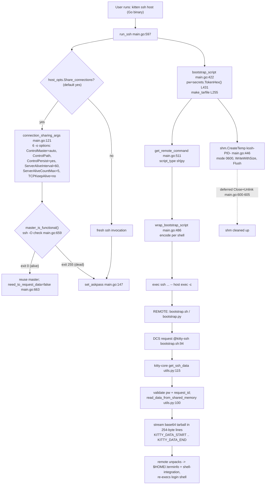

# How the Kitty SSH Kitten Works, End to End

*A runtime-grounded walkthrough of `kitten ssh <host>` — from local initiation, through the
secure credential handoff and shell-integration archive transfer, to the generated bootstrap
script executing on the remote host.*

Every factual claim below is backed by **captured runtime output** and a `file:line` citation.
Statements are explicitly labelled **[OBSERVED]** (captured from a running program),
**[CODE]** (read directly from the named source line), or **[INFERRED]** (a conclusion drawn
from observed evidence). Anything not produced by the real `kitten ssh` build is labelled
**[NON-CANONICAL]** with the reason.

---

## 0. Scope — three cooperating code bases

The SSH kitten is **not** a single program. Understanding it end-to-end requires following the
data across **three** distinct code bases, and an explanation that covers only one side is
incomplete:

1. **The local Go kitten** — `kittens/ssh/*.go`. This is the *canonical, user-facing runtime
   entry point*. When you type `kitten ssh host`, a **Go** binary runs. This is the single most
   important convention to internalise: although kitty's kitten *framework* is Python
   (`kittens/runner.py`), the SSH kitten's user-facing path is the compiled Go binary. The file
   `kittens/ssh/main.py` exists but is **only the options/configuration schema** (it defines
   `ssh.conf` option text), *not* the runtime.
2. **The remote bootstrap scripts** — `shell-integration/ssh/bootstrap.sh` (POSIX sh) and
   `shell-integration/ssh/bootstrap.py` (Python). SSH executes one of these *on the server*.
3. **The kitty-core Python responder** — `kittens/ssh/utils.py`, invoked from `kitty/window.py`.
   This runs inside the **local** kitty GUI process (the terminal emulator itself) and answers the
   remote bootstrap's request for data by streaming the archive back over the TTY.

The flow, at a glance, is: the **Go kitten** builds an `ssh` command line and a bootstrap script,
stashes a tarball + one-time password in **local shared memory**, and `exec`s `ssh`. On the
server, the **bootstrap script** decodes itself and asks — over the terminal — for the setup data.
The **kitty-core Python responder** validates that request against the shared-memory password and
streams the tarball back over the same terminal. The bootstrap unpacks it, installs terminfo and
shell integration, and re-execs your login shell.



For the default configuration on this host (OpenSSH ≥ 8.4), one nuance the diagram simplifies: the
DCS request is actually sent by the **local kitten** immediately after spawning `ssh`
(`main.go:761`), rather than by the remote bootstrap — see [Q10](#q10--terminal-requestresponse-protocol-the-dcs-handshake).

---

## 1. Environment and build (the default, canonical configuration)

All observations were produced from a canonical build of the binaries on this host. Exact facts:

**Repository state** (command → output):

```
$ git rev-parse HEAD
815df1e210e0a9ab4622f5c7f2d6891d7dbeddf1
```

The document is named after the source branch `kitty_815df1e210e0`; the working branch is
`blitzy-c0111083-82c0-4e78-990d-87d434a60e48`.

**Toolchain** (the "default canonical configuration" facts):

| Tool | Version (observed) | Command |
|------|--------------------|---------|
| Go | `go1.22.12 linux/amd64` | `go version` |
| Python | `Python 3.13.7` | `python3 --version` |
| OpenSSH client | `OpenSSH_10.0p2 Ubuntu-5ubuntu5.4, OpenSSL 3.5.3` | `ssh -V` |
| C compiler | `gcc (Ubuntu 15.2.0)` | `gcc --version` |

**Build command** (this is exactly what the `Makefile`'s `all:` target runs — `python3 setup.py $(VVAL)`):

```
$ python3 setup.py --ignore-compiler-warnings
```

This produces `kitty/launcher/kitten` (the Go kitten binary), `kitty/launcher/kitty` (the launcher),
and `kitty/fast_data_types.so` (the C extension). **[OBSERVED]** exit code 0.

> **Build caveat (honest, per the run-first rule).** The `--ignore-compiler-warnings` flag is
> required *on this host only* because Ubuntu 25.10 ships `wayland-protocols` 1.45, whose new
> `XDG_TOPLEVEL_STATE_CONSTRAINED_*` enums trip `-Werror=switch` in `glfw/wl_window.c` — a **GUI
> backend** file entirely unrelated to the SSH kitten. On the canonical Docker image
> (`ghcr.io/scaleapi/swe-atlas`, older `wayland-protocols`) the plain `python3 setup.py` builds
> clean. The flag does not touch the Go kitten or any SSH code path.

**Smoke tests** (complete, unedited):

```
$ ./kitty/launcher/kitten --version
kitten 0.35.2 created by Kovid Goyal
```

```
$ ./kitty/launcher/kitten ssh --help | head -5
usage: ssh [options] [host]

Copy files and run kitty over SSH.
...
```

### 1.1 Reaching the real entry point — the guards

`kitten ssh` refuses to run outside a kitty window. The real entry `main()`
(`kittens/ssh/main.go:800`) enforces two guards before `run_ssh`:

- `main.go:825` — requires the `KITTY_WINDOW_ID` **and** `KITTY_PID` environment variables.
  Without them **[OBSERVED]**:
  ```
  $ ./kitty/launcher/kitten ssh testhost
  Error: The SSH kitten is meant to run inside a kitty window
  ```
- `main.go:829` — requires `stdin` to be a terminal (`tty.IsTerminal`). With the env vars set but a
  pipe on stdin **[OBSERVED]**:
  ```
  Error: The SSH kitten is meant for interactive use only, STDIN must be a terminal
  ```

To exercise the **real** entry point (`kitten ssh`), the observations below use a small harness
that satisfies both guards honestly: `/tmp/blitzy_ssh_obs/run_kitten_ssh.py` calls `os.forkpty()`
(providing a real PTY on stdin), sets `KITTY_WINDOW_ID=1` and `KITTY_PID=<pid>`, and prepends a
directory containing a **fake `ssh`** to `PATH`. The kitten resolves `ssh` via
`FindExe("ssh")` (`kittens/ssh/utils.go:22`), which honours `PATH`, so the fake `ssh` is invoked.
The fake records its full argv, answers `ssh -V` with the real OpenSSH banner, returns exit 0 or
255 for `ssh -O check` (controlled by `FAKE_MASTER_ALIVE`), and snapshots the local
`/dev/shm/kssh-*` object on the main `exec`. This exercises the genuine
`run_ssh → connection_sharing_args → set_askpass → master_is_functional → bootstrap_script →
get_remote_command → exec ssh` chain.

**What is canonical vs. not.** The `ssh` *command line*, the shared-memory object, the DCS bytes
the kitten writes, and the connection-reuse decision are all captured through the **real**
`kitten ssh` path — canonical. Where a value is produced by the in-repo test harnesses
(`kitten __pytest__ ssh`, the Go `*_test.go`, or a temporary in-package test), the bootstrap
script / tarball / encoding are still produced by the **real functions** (`bootstrap_script`,
`make_tarfile`, `wrap_bootstrap_script`) — those outputs are canonical; only the outer
`run_ssh` orchestration is bypassed, which is noted where relevant. One value is explicitly
**[NON-CANONICAL]**: the `SSH_ASKPASS` path printed by a temporary Go test is that test binary's
path, because `os.Executable()` returns the test binary — in a real run it is the kitten
executable. That is called out at its use site.

---

## 2. The full initiation-to-execution trace (Q8)

This is the spine of the document: a single narrative from `kitten ssh host` to your shell prompt
on the remote. Each step cites the responsible `file:line` and the evidence captured in the
per-question sections that follow.

1. **You run `kitten ssh testhost`.** The Go binary's `main()` (`main.go:800`) checks the two
   guards (§1.1) and calls `run_ssh` (`main.go:597`).

2. **The `ssh` command line is assembled.** `run_ssh` builds `cmd = [ssh, <args>]`; because there
   is no remote command it adds `-t` (`main.go` around L620). Since `Share_connections` defaults
   to `yes` (`main.py:183`), `connection_sharing_args` (`main.go:121`) inserts six `-o` options for
   OpenSSH multiplexing. **[OBSERVED]** the full line ([Q1](#q1--secure-session-setup--connection-sharing)):
   ```
   ssh -t -o ControlMaster=auto -o ControlPath=/root/.cache/kitty/run/kssh-47284-%C \
       -o ControlPersist=yes -o ServerAliveInterval=60 -o ServerAliveCountMax=5 \
       -o TCPKeepAlive=no -- testhost exec sh -c '<unwrap>' '<encoded bootstrap>'
   ```

3. **Askpass delegation is configured.** `set_askpass` (`main.go:147`) decides whether the kitten
   must request data over the TTY (`need_to_request_data`) and exports `SSH_ASKPASS`,
   `KITTY_KITTEN_RUN_MODULE=ssh_askpass`, and (when OpenSSH ≥ 8.4) `SSH_ASKPASS_REQUIRE=force`
   ([Q1](#q1--secure-session-setup--connection-sharing)).

4. **The connection-reuse decision.** If a shared master is already alive, `master_is_functional()`
   runs `ssh -O check` (`main.go:659`); on exit 0 the kitten sets `need_to_request_data = false`
   (`main.go:663`) and piggybacks on the master; on exit 255 it proceeds fresh
   ([Q6](#q6--connection-reuse-decision-fresh-vs-piggyback-on-an-existing-master)).

5. **The payload is built and stashed in local shared memory.** `bootstrap_script` (`main.go:422`)
   generates a one-time password with `secrets.TokenHex()` (`main.go:431`), builds the archive with
   `make_tarfile` (`main.go:255`), packs a JSON blob `{tarfile(base64), pw, hostname, username}`,
   and writes it to a POSIX shared-memory object named `kssh-<pid>-…` created at mode `0600` via
   `shm.CreateTemp` (`main.go:446`) ([Q2](#q2--shared-memory-credential-passing),
   [Q9](#q9--shared-memory-security-model)).

6. **The remote command is generated and encoded.** `get_remote_command` (`main.go:511`) selects
   `script_type` (`py` if the interpreter name contains `python`, else `sh`), templates the
   bootstrap script, and `wrap_bootstrap_script` (`main.go:486`) encodes it for the target shell.
   The result is `rcmd = [exec, <Interpreter>, -c, <unwrap>, <encoded>]`
   ([Q3](#q3--bootstrap-script-generation), [Q7](#q7--per-shell-bootstrap-encoding-sh-vs-py)).

7. **`ssh` is executed.** `run_ssh` appends `rcmd` and spawns the process (`main.go:751-755`).

8. **The DCS data request.** In the default config (OpenSSH ≥ 8.4, `need_to_request_data=false`),
   the **local kitten** immediately writes the DCS request itself (`main.go:761`); in the
   fallback config the **remote bootstrap** issues it (`bootstrap.sh:94`). Either way the frame is
   `\x1bP@kitty-ssh|<base64 of "id=…:pwfile=…:pw=…">\x1b\\`
   ([Q10](#q10--terminal-requestresponse-protocol-the-dcs-handshake)).

9. **kitty-core answers.** The DCS reaches the local kitty GUI process, is dispatched by
   `vt-parser.c:608` to `handle_remote_ssh` (`kitty/window.py:1289`), which calls
   `get_ssh_data(msg, f'{os.getpid()}-{self.id}')` (`window.py:1290-1291`). `get_ssh_data`
   (`utils.py:115`) validates the password and request id against the shared-memory object
   (`read_data_from_shared_memory`, `utils.py:100`) and streams the base64 tarball back framed
   between `KITTY_DATA_START` and `KITTY_DATA_END`, chunked into 254-byte lines
   ([Q10](#q10--terminal-requestresponse-protocol-the-dcs-handshake)).

10. **The remote unpacks and re-execs.** The bootstrap discards any `leading_data` received before
    `KITTY_DATA_START`, base64-decodes the stream, `tar xpzf`s it into a temp dir, installs
    `$HOME/.terminfo` and the shell-integration files, then execs the login shell with shell
    integration enabled ([Q4](#q4--shell-integration-archive-tarball-build--transmission),
    [Q10](#q10--terminal-requestresponse-protocol-the-dcs-handshake)).

11. **Cleanup.** The `defer`red `data_shm.Close()` + `Unlink()` in `run_ssh` (`main.go:600-605`)
    removes the local shared-memory object; the responder's `read_data_from_shared_memory` also
    unlinks it on read (single-use) ([Q9](#q9--shared-memory-security-model)).

This exact narrative is corroborated verbatim by the shipped user docs
(`docs/kittens/ssh.rst:134-146`): *"SSH transmit and execute a POSIX sh (or optionally Python)
bootstrap script … reads setup data over the TTY device, which kitty sends as a Base64 encoded
compressed tarball … The data is requested by the kitten over the TTY with a random one time
password … if the password matches a password pre-stored in shared memory on the localhost … the
transmission is allowed. If your local OpenSSH version is >= 8.4 then the data is transmitted
instantly without any roundtrip delay."*

---

## Q1 — Secure session setup & connection sharing

**Direct answer.** The kitten assembles a standard `ssh` command line and, because
`share_connections` defaults to `yes`, injects **six** `-o` options that turn on OpenSSH
connection multiplexing plus keepalives. It also wires up askpass delegation so kitty can answer
SSH's password/passphrase/fingerprint prompts. On OpenSSH ≥ 8.4 it additionally sets
`SSH_ASKPASS_REQUIRE=force`, which lets it deliver the setup data with no extra round trip.

**Functions:** `run_ssh` (`kittens/ssh/main.go:597`), `connection_sharing_args`
(`kittens/ssh/main.go:121`), `set_askpass` (`kittens/ssh/main.go:147`).

### The assembled command line — [OBSERVED] through the real `kitten ssh`

Command:
```
$ KITTY_WINDOW_ID=1 KITTY_PID=$$  python3 /tmp/blitzy_ssh_obs/run_kitten_ssh.py  ssh testhost
```
(The harness forkpty's a PTY onto stdin and puts a fake `ssh` on `PATH`; see §1.1.) The fake `ssh`
logged its full argv:
```
FULL_CMDLINE: ssh -t -o ControlMaster=auto -o ControlPath=/root/.cache/kitty/run/kssh-47284-%C -o ControlPersist=yes -o ServerAliveInterval=60 -o ServerAliveCountMax=5 -o TCPKeepAlive=no -- testhost exec sh -c '<unwrap>' '<encoded>'
argv[0]=-t
argv[1]=-o  argv[2]=ControlMaster=auto
argv[3]=-o  argv[4]=ControlPath=/root/.cache/kitty/run/kssh-47284-%C
argv[5]=-o  argv[6]=ControlPersist=yes
argv[7]=-o  argv[8]=ServerAliveInterval=60
argv[9]=-o  argv[10]=ServerAliveCountMax=5
argv[11]=-o argv[12]=TCPKeepAlive=no
argv[13]=--  argv[14]=testhost
argv[15]=exec argv[16]=sh argv[17]=-c argv[18]=<unwrap> argv[19]=<encoded>
```

- `-t` is added because there is no remote command to run (`run_ssh`, ~`main.go:620`).
- `--` terminates option parsing before the hostname.
- `exec sh -c <unwrap> <encoded>` is the remote command (`rcmd`, [Q3](#q3--bootstrap-script-generation)).

### The six connection-sharing options — [OBSERVED] in isolation

To confirm `connection_sharing_args` emits *exactly* these six pairs and nothing else, it was
called directly (temporary in-package Go test, since the function is unexported):
```
$ go test -run TestBlitzyObserve -v ./kittens/ssh/
### BLITZY_MARK connection_sharing_args ###
  [0] -o
  [1] ControlMaster=auto
  [2] -o
  [3] ControlPath=/root/.cache/kitty/run/kssh-12345-%C
  [4] -o
  [5] ControlPersist=yes
  [6] -o
  [7] ServerAliveInterval=60
  [8] -o
  [9] ServerAliveCountMax=5
  [10] -o
  [11] TCPKeepAlive=no
```

**Cause → effect for each option** (`connection_sharing_args`, `main.go:121`):

| Option | Effect | Source of truth |
|--------|--------|-----------------|
| `ControlMaster=auto` | Reuse an existing master connection if present, else create one. | `ssh_config(5)`; the reuse probe is [Q6](#q6--connection-reuse-decision-fresh-vs-piggyback-on-an-existing-master). |
| `ControlPath=<RuntimeDir>/kssh-{kitty_pid}-%C` | Unix-socket path for the master. `{kitty_pid}` → `KITTY_PID` (`47284` observed); `%C` is OpenSSH's own hash of localhost/host/port/user. | template `kssh-{kitty_pid}-{ssh_placeholder}` (`kitty.SSHControlMasterTemplate`, `constants_generated.go:12`); `{ssh_placeholder}` → literal `%C`. |
| `ControlPersist=yes` | Keep the master alive in the background after the client exits. | `ssh_config(5)`. |
| `ServerAliveInterval=60` | Send a keepalive every 60 s of inactivity. | `main.go:121`. |
| `ServerAliveCountMax=5` | Drop the connection after 5 missed keepalives. | `main.go:121`. |
| `TCPKeepAlive=no` | Rely on the SSH-level keepalives above rather than TCP-level ones. | `main.go:121`. |

> If the runtime directory path is longer than 35 characters, `connection_sharing_args` first
> creates a short symlink `/tmp/kssh-rdir-<euid>` and uses that, because the `ControlPath` (a Unix
> socket) must fit inside the ~104-byte `sun_path` limit **[CODE]** `main.go:121`. On this host the
> runtime dir is `/root/.cache/kitty/run` (23 chars), so the symlink path is not taken.

### Askpass delegation — [OBSERVED]

`set_askpass` (`main.go:147`) returns `need_to_request_data` and mutates the environment. Called in
isolation:
```
### BLITZY_MARK set_askpass ###
  need_to_request_data=false
  SSH_ASKPASS="/tmp/go-build.../ssh.test"      <- [NON-CANONICAL] path (test binary via os.Executable();
                                                  the real kitten sets this to the kitten exe)
  KITTY_KITTEN_RUN_MODULE="ssh_askpass"
  SSH_ASKPASS_REQUIRE="force"
```

Logic (`main.go:147`): `need_to_request_data` starts **true**; if either the sentinel file
`<CacheDir>/openssh-is-new-enough-for-askpass` exists **or**
`GetSSHVersion().SupportsAskpassRequire()` is true (OpenSSH major ≥ 9, or 8.4+), it flips to
**false** and writes the sentinel. It always sets `SSH_ASKPASS=<kitten exe>` and
`KITTY_KITTEN_RUN_MODULE=ssh_askpass`; and when `need_to_request_data` is false it additionally
sets `SSH_ASKPASS_REQUIRE=force`.

On this host **[OBSERVED]** OpenSSH is `10.0p2`, so `SupportsAskpassRequire()` is true and the
sentinel `/root/.cache/kitty/openssh-is-new-enough-for-askpass` exists — hence
`need_to_request_data=false` in the default configuration. (`KITTY_KITTEN_RUN_MODULE=ssh_askpass`
is how the same kitten binary, when re-invoked by `ssh` as the askpass helper, dispatches into
`RunSSHAskpass` — see [Q9](#q9--shared-memory-security-model).)

**Web-corroborated authoritative behaviour** (so these are recognisably standard OpenSSH, not kitty
inventions): `ControlMaster`/`ControlPath`/`ControlPersist` are the standard multiplexing options
documented in `ssh_config(5)`, and `SSH_ASKPASS_REQUIRE=force` was introduced in **OpenSSH 8.4** to
force use of the askpass helper even when a TTY is present. Kitty's own addition is the
shared-memory + one-time-password layer for the *local* handoff ([Q9](#q9--shared-memory-security-model)).

---


## Q2 — Shared-memory credential passing

**Direct answer.** The kitten packs everything the remote needs — the base64 tarball, a one-time
password, the hostname and username — into a single JSON blob and writes it to a **POSIX
shared-memory object** on the local host, created at mode `0600` and named `kssh-<pid>-…`. The
password (not the payload) is what the remote later presents over the TTY to authorise the
transfer; the shared memory is purely a *local* stash that the kitty-core responder reads back.

**Functions:** `bootstrap_script` (`kittens/ssh/main.go:422`) → `shm.CreateTemp`
(`tools/utils/shm/shm.go:91`); read back by `read_data_from_shared_memory`
(Go `main.go:72`; the responder uses the Python one, `utils.py:100`).

### The object, its name, mode, and contents — [OBSERVED] through the real `kitten ssh`

When the fake `ssh` reached the main `exec`, it stat'd and copied the live `/dev/shm/kssh-*` object:
```
SHM object: /dev/shm/kssh-47285-QMDFN3CQZ2QNM
  perm=0600  uid=0  gid=0  size=31438
```

Parsing the copied bytes (`shm_copy.bin`):
```
$ head -c4 shm_copy.bin | od -An -tu4 --endian=big     # 4-byte big-endian size prefix
      31430
$ tail -c +5 shm_copy.bin | python3 -c "import sys,json; d=json.load(sys.stdin); print(sorted(d))"
['hostname', 'pw', 'tarfile', 'username']
  hostname = testhost
  username = root
  pw       = d4c2a73cdedb3073e42aabf85e755e9cf3a1d68590156f217db782fecfaaec35   (64 hex = 32 bytes)
  tarfile  = <base64, length 31304> -> decodes to gzip (magic 1f8b), 23478 bytes
```

**Cause → effect, grounded in code:**

- The JSON is `{tarfile: base64(tarball), pw, hostname, username}`, assembled at `main.go:438-442`
  **[CODE]**. The four observed keys match exactly.
- `pw` is `secrets.TokenHex()` (`main.go:431`) — a 32-byte random hex string (64 chars observed).
  Its randomness and role are detailed in [Q9](#q9--shared-memory-security-model).
- The object is created by `shm.CreateTemp(fmt.Sprintf("kssh-%d-", os.Getpid()), …)` at
  `main.go:446` **[CODE]**, then written with `shm.WriteWithSize` + `Flush`. The 4-byte size
  prefix (`31430`) is what `WriteWithSize` prepends; the file is slightly larger (`31438`) due to
  page rounding.

> **Important distinction (do not confuse two PIDs).** The shared-memory name uses the *kitten's
> own* `os.Getpid()` — here `47285` — **not** `KITTY_PID` (`47284`, which appears in the
> `ControlPath`). **[OBSERVED]** `kssh-47285-…` vs `ControlPath=…/kssh-47284-%C`. The `request_id`
> is separately `KITTY_PID-KITTY_WINDOW_ID` (`47284-1`, [Q10](#q10--terminal-requestresponse-protocol-the-dcs-handshake)).

### Reading it back — [OBSERVED]

The Go `read_data_from_shared_memory` (`main.go:72`) reads via `shm.ReadWithSizeAndUnlink` with a
validation callback. Exercised directly (temporary Go test), a correct object reads back cleanly:
```
### BLITZY_MARK read_data_from_shared_memory rejection ###
  correct 0600 owner-self: data="{\"pw\":\"x\"}" err=<nil>
```
The security-critical *responder* path uses the **Python** `read_data_from_shared_memory`
(`utils.py:100`), whose validation is demonstrated in [Q9](#q9--shared-memory-security-model). The
object is **single-use** — unlinked on read plus a deferred `Close`+`Unlink`
([Q9](#q9--shared-memory-security-model)); after the run, the object is gone from `/dev/shm`
**[OBSERVED]**.

The shared memory is **local only** — the remote host has no access to the localhost `/dev/shm`, so
the tarball must travel back over the terminal ([Q10](#q10--terminal-requestresponse-protocol-the-dcs-handshake)). This is the crux the security model relies on.

---

## Q3 — Bootstrap script generation

**Direct answer.** `get_remote_command` picks a script *type* — `py` if the interpreter's basename
contains `python`, otherwise `sh` — then `bootstrap_script` fills the corresponding template
(`bootstrap.sh` or `bootstrap.py`) by substituting a fixed set of placeholders, and finally
`wrap_bootstrap_script` encodes it. The remote command that `ssh` runs is
`[exec, <Interpreter>, -c, <unwrap_script>, <encoded_script>]`.

**Functions:** `get_remote_command` (`kittens/ssh/main.go:511`), `bootstrap_script`
(`kittens/ssh/main.go:422`), `prepare_script` (`kittens/ssh/main.go:407`).

### Type selection — [CODE] `main.go:511`

```
is_python := strings.Contains(strings.ToLower(path.Base(interpreter)), "python")
cd.script_type = "sh"; if is_python { cd.script_type = "py" }
```
Default interpreter is `sh` (`main.py:87`), so the default script type is `sh`.

### The templated placeholders — [OBSERVED]

`prepare_script` (`main.go:407`) replaces whole-word placeholders (`\bKEY\b`) in the template.
The full set (`bootstrap_script`, `main.go:422`): `REQUEST_ID`, `DATA_PASSWORD`,
`PASSWORD_FILENAME` (the "sensitive" trio, merged **only** when `request_data` is true),
`EXPORT_HOME_CMD`, `EXEC_CMD`, `TEST_SCRIPT`, `REQUEST_DATA` (`"0"`/`"1"`), `ECHO_ON` (`"0"`/`"1"`).
`request_id` itself is `KITTY_PID-KITTY_WINDOW_ID` (`main.go:420`).

Captured `connection_data.replacements` for a real (request_data=true) build (temporary Go test):
```
  replacements:
      REQUEST_ID = "PID-WINID"
      DATA_PASSWORD = "8a70208e5ec0d86b6f66c8118d78e1d3b5902d84d166f691552c135175195ecf"
      PASSWORD_FILENAME = "kssh-50679-NS3PK7CB3XJMA"
      REQUEST_DATA = "1"
      ECHO_ON = "0"
      EXPORT_HOME_CMD = ""
      EXEC_CMD = ""
      TEST_SCRIPT = ""
```

### The remote command — [OBSERVED]

Driving the canonical `kitten __pytest__ ssh` harness with `interpreter=python3`
(the harness runs the *real* `get_remote_command`/`bootstrap_script`/`wrap_bootstrap_script`):
```
$ printf 'interpreter python3\n' | ./kitty/launcher/kitten __pytest__ ssh /bin/true  # (conf on stdin)
cmd[0]=exec
cmd[1]=python3
cmd[2]=-c
cmd[3]="import base64, sys; eval(compile(base64.standard_b64decode(sys.argv[-1]), 'bootstrap.py', 'exec'))"
cmd[4]=<base64, length 13580>          # the encoded bootstrap.py
shm_name=kssh-50952-4CIBEZDRLKSEA
```
Decoding `cmd[4]` (base64) reveals the templated `bootstrap.py`, including the substituted values:
```
request_data = int('1')
leading_data = b''
def send_data_request():
    ...
if request_data:
    send_data_request()
```
The `sh` variant is identical in structure but wrapped differently
([Q7](#q7--per-shell-bootstrap-encoding-sh-vs-py)). The exact `unwrap`/`encoded` byte forms for
both variants are in [Q7](#q7--per-shell-bootstrap-encoding-sh-vs-py).

---

## Q4 — Shell-integration archive (tarball) build & transmission

**Direct answer.** `make_tarfile` builds a **gzip** tar (best compression) containing `data.sh`
(the serialised environment), the shell-integration files for bash/zsh/fish, the compiled
`terminfo` database, and — when `Remote_kitty` is enabled — the `kitty`/`kitten` remote wrappers.
It deliberately **excludes** the `shell-integration/ssh/*` files (those ride along as command-line
args) and `shell-integration/zsh/kitty.zsh` (a backward-compat file the kitten does not need), and
includes `bootstrap-utils.sh` **only** for the `sh` variant. The archive is streamed to the remote
over the TTY by `get_ssh_data` ([Q10](#q10--terminal-requestresponse-protocol-the-dcs-handshake)).

**Functions:** `make_tarfile` (`kittens/ssh/main.go:255`); streamed by `get_ssh_data`
(`kittens/ssh/utils.py:115`).

### The real tarball — [OBSERVED]

Both variants were produced by the real `make_tarfile` (temporary Go test writing to `/tmp`):
```
### BLITZY_TAR sh  size=23569 sha256=ade8f8bb...e8c3 magic=1f8b file=/tmp/blitzy_ssh_obs/tarball_sh.tgz
### BLITZY_TAR py  size=21228 sha256=34e86568...6875 magic=1f8b file=/tmp/blitzy_ssh_obs/tarball_py.tgz
```
`magic=1f8b` confirms gzip. Listing the sh variant:
```
$ tar -tvzf tarball_sh.tgz
-rw-r--r-- 0/0    195  data.sh
-rw-r--r-- 0/0   8468  bootstrap-utils.sh
-rw-r--r-- 0/0  10409  home/.local/share/kitty-ssh-kitten/shell-integration/fish/vendor_conf.d/kitty-shell-integration.fish
-rw-r--r-- 0/0    294  home/.local/share/kitty-ssh-kitten/shell-integration/fish/vendor_completions.d/clone-in-kitty.fish
-rw-r--r-- 0/0  17363  home/.local/share/kitty-ssh-kitten/shell-integration/bash/kitty.bash
-rw-r--r-- 0/0    280  home/.local/share/kitty-ssh-kitten/shell-integration/zsh/completions/_kitty
-rw-r--r-- 0/0    286  home/.local/share/kitty-ssh-kitten/shell-integration/fish/vendor_completions.d/kitten.fish
-rw-r--r-- 0/0   1880  home/.local/share/kitty-ssh-kitten/shell-integration/zsh/.zshenv
-rw-r--r-- 0/0  22557  home/.local/share/kitty-ssh-kitten/shell-integration/zsh/kitty-integration
-rw-r--r-- 0/0    285  home/.local/share/kitty-ssh-kitten/shell-integration/fish/vendor_completions.d/kitty.fish
-rw-r--r-- 0/0      6  home/.local/share/kitty-ssh-kitten/kitty/version
-rwxr-xr-x 0/0   4377  home/.local/share/kitty-ssh-kitten/kitty/bin/kitty
-rwxr-xr-x 0/0   2761  home/.local/share/kitty-ssh-kitten/kitty/bin/kitten
-rw-r--r-- 0/0   4271  home/.terminfo/kitty.terminfo
-rw-r--r-- 0/0   3711  home/.terminfo/x/xterm-kitty
```

### The edge cases — each named and [OBSERVED]

- **`bootstrap-utils.sh` — sh-only.** Present in the sh tarball (1 entry, 8468 B), absent in the py
  tarball (0). **[OBSERVED]** counts `sh=1, py=0`. **[CODE]** `main.go:324-328`:
  `if cd.script_type == "sh" { add_data(fe{"bootstrap-utils.sh", …}) }`.
- **`shell-integration/ssh/.+` — excluded.** `tar -tzf … | grep 'shell-integration/ssh/'` → *no
  matches* in either tarball. **[CODE]** exclusion list in `FilesMatching(...)` at `main.go:330-336`
  with the comment *"bootstrap files are sent as command line args"*.
- **`shell-integration/zsh/kitty.zsh` — excluded.** The zsh directory contains `.zshenv`,
  `kitty-integration`, and `completions/_kitty`, but **not** `kitty.zsh` (grep count 0)
  **[OBSERVED]**. **[CODE]** same exclusion list, comment *"backward compat file not needed by ssh
  kitten"*.
- **`data.sh` — always present** (`main.go:321`); it carries the serialised environment
  (`serialize_env`).
- **terminfo — present.** `home/.terminfo/kitty.terminfo` and `home/.terminfo/x/xterm-kitty`
  **[OBSERVED]**, added at `main.go:351-354`.
- **remote kitty/kitten — present** (`kitty/version` + `bin/kitty` + `bin/kitten`), because
  `Remote_kitty` defaults to `if-needed` (`main.py:164`); added at `main.go:338-349`.

### The `0o600` mode claim — a RUN-FIRST correction

The mode line in the code is `h.Mode |= 0o600` (`main.go:266-268`) with the comment *"ensure files
are at least readable and writable by owning user"*. This is a **bitwise-OR floor**, not a forced
value: it *guarantees* owner read+write but preserves the file's group/other bits. The observed
modes prove this — text files are `0o644` and the `kitty`/`kitten` executables are `0o755`, **not**
`0o600`:
```
$ python3 - <<'PY'   # numeric modes from the real tarball
0o644  data.sh
0o644  bootstrap-utils.sh
...
0o755  home/.local/share/kitty-ssh-kitten/kitty/bin/kitty
0o755  home/.local/share/kitty-ssh-kitten/kitty/bin/kitten
0o644  home/.terminfo/kitty.terminfo
PY
```
So the precise statement is: **every entry is at least owner-rw (`0o600`); it is not forced to
exactly `0o600`.** The canonical Go test `TestSSHTarfile` checks exactly this — it fails only if
`Perm() & 0o600 == 0` (i.e. owner lacks rw), not if the mode differs from `0o600`
**[CODE]** `main_test.go:126-128`.

The transmission of this tarball (base64 over the TTY, framed, in 254-byte lines) is covered in
[Q10](#q10--terminal-requestresponse-protocol-the-dcs-handshake), where the streamed bytes are
shown to base64-decode back to this exact archive (`sha256 ade8f8bb…`).

---


## Q5 — Per-connection state tracking

**Direct answer.** Two structures hold the per-connection state. Locally, the Go
`connection_data` struct (16 fields) carries everything needed to build and run one connection.
Separately, the kitty-core `SSHConnectionData` named-tuple — produced by `get_connection_data`
while *parsing* the `ssh` command line — records the parsed connection identity (binary, hostname,
port, identity file, extra args).

**Structures:** `connection_data` (`kittens/ssh/main.go:171`); `SSHConnectionData`
(a `NamedTuple` in `kitty/utils.py:953`) produced by `get_connection_data`
(`kittens/ssh/utils.py:258`, constructed at `utils.py:338`).

### The `connection_data` struct, all 16 fields — [OBSERVED]

Dumped for a real (request_data=true) connection via a temporary in-package Go test:
```
### BLITZY_MARK connection_data dump ###
  remote_args = []
  host_opts   = {Interpreter:"sh" Share_connections:true Remote_dir:".local/share/kitty-ssh-kitten"
                 Askpass:unless-set Forward_remote_control:false ...}
  hostname_for_match = "host.test"
  username    = "testuser"
  echo_on     = false
  request_data= true
  literal_env = nil
  listen_on   = ""
  test_script = ""
  dont_create_shm = false
  shm_name    = "kssh-50679-NS3PK7CB3XJMA"
  script_type = "sh"
  request_id  = "PID-WINID"
  replacements= { PASSWORD_FILENAME, DATA_PASSWORD, REQUEST_ID, REQUEST_DATA=1, ECHO_ON=0,
                  EXPORT_HOME_CMD="", EXEC_CMD="", TEST_SCRIPT="" }   (see Q3)
  rcmd        = [exec, sh, -c, <unwrap>, <encoded len 5264>]
  bootstrap_script = <len 5262>
```
The 16 field names, verbatim from the struct definition (`main.go:171`) **[CODE]**:
`remote_args, host_opts, hostname_for_match, username, echo_on, request_data, literal_env,
listen_on, test_script, dont_create_shm, shm_name, script_type, rcmd, replacements, request_id,
bootstrap_script`.

### `SSHConnectionData` via `get_connection_data` — [OBSERVED], canonical

This is exactly what the canonical test `test_ssh_connection_data` (`kitty_tests/ssh.py:45`)
exercises. Driving `get_connection_data` directly:
```
'ssh main'                                  -> SSHConnectionData(binary='ssh', hostname='main',  port=None, identity_file='',            extra_args=())
'ssh un@ip -i ident -p34'                   -> SSHConnectionData(binary='ssh', hostname='un@ip', port=34,   identity_file='<abs>/ident', extra_args=())
'ssh -p 33 main'                            -> SSHConnectionData(binary='ssh', hostname='main',  port=33,   identity_file='',            extra_args=())
'ssh --kitten=one -p 12 --kitten two -ix main'
     -> SSHConnectionData(binary='ssh', hostname='main', port=12, identity_file='<abs>/x',
        extra_args=(('--kitten','one'), ('--kitten','two')))
```
The five fields — `binary, hostname, port, identity_file, extra_args` — are the `NamedTuple`
members from `kitty/utils.py:953` **[CODE]**; `get_connection_data` returns
`SSHConnectionData(found_ssh, host_name, port, identity_file, tuple(found_extra_args))` at
`utils.py:338` **[CODE]**. Note it correctly parses `-p 33` (spaced) and `-p34` (joined), collects
`-i` identity files as absolute paths, and pulls `--kitten` pairs into `extra_args`.

---

## Q6 — Connection-reuse decision (fresh vs. piggyback on an existing master)

**Direct answer.** When connection sharing is on, the kitten probes for a live master with
`ssh -O check`. If that returns 0 (a master is alive), it *reuses* it and sets
`need_to_request_data = false` — the setup data does not need to be re-requested over this new
channel. If it returns non-zero (255 observed — no master), the kitten proceeds with a fresh
connection and keeps `need_to_request_data = true`.

**Functions:** the `Share_connections` branch (`kittens/ssh/main.go:637`); `master_is_functional()`
running `ssh -O check` (`main.go:659`); the decision (`main.go:663`); `run_control_master`
(`main.go:666`).

### The decision — [CODE] `main.go:663`

```
if need_to_request_data && host_opts.Share_connections && master_is_functional() {
    need_to_request_data = false
}
```
`master_is_functional()` inserts `-O`, `check` into the ssh args at index 1 and runs it, caching
the boolean `exit code == 0` (`main.go:653-659`).

### Both branches — [OBSERVED] cross-product through the real `kitten ssh`

The two states were forced with the fake `ssh` honouring `FAKE_MASTER_ALIVE`, using
`--kitten askpass=ssh` to route through the request-data path so the effect is visible in the
generated script:

- **FRESH** (`FAKE_MASTER_ALIVE=0`): the first ssh invocation is the probe
  ```
  ssh -O check -t -o ControlMaster=auto -o ControlPath=/root/.cache/kitty/run/kssh-48090-%C \
      -o ControlPersist=yes -o ServerAliveInterval=60 -o ServerAliveCountMax=5 \
      -o TCPKeepAlive=no -- testhost
  ```
  → fake returns **exit 255** (no master). `need_to_request_data` stays true → the generated
  script has `request_data="1"`.
- **REUSE** (`FAKE_MASTER_ALIVE=1`): the same `ssh -O check … -- testhost` probe → fake returns
  **exit 0** (live master). The decision at `main.go:663` fires → the generated script has
  `request_data="0"`.

So the observable consequence of the reuse decision is precisely the `request_data` value baked
into the bootstrap ([Q10](#q10--terminal-requestresponse-protocol-the-dcs-handshake) shows how
`request_data` on/off changes who sends the DCS request).

### `run_control_master` — [OBSERVED]

When sharing is needed and no master is alive, `run_control_master` (`main.go:666`) starts one with
`ssh <sharing args> -N -f -- host`. Forced via `--kitten forward_remote_control=yes` (with
`KITTY_LISTEN_ON` set and no live master), the fake `ssh` recorded, after the failed probe:
```
ssh -t -o ControlMaster=auto -o ControlPath=/root/.cache/kitty/run/kssh-51133-%C \
    -o ControlPersist=yes -o ServerAliveInterval=60 -o ServerAliveCountMax=5 \
    -o TCPKeepAlive=no -N -f -- testhost
```
`-N` (no remote command) + `-f` (background) is the classic "start a master" invocation.

### `Forward_remote_control` requires sharing — [OBSERVED]

`forward_remote_control` relies on the control master, so it cannot be used without sharing.
`--kitten forward_remote_control=yes --kitten share_connections=no` **[OBSERVED]**:
```
Error: Cannot use forward_remote_control=yes without share_connections=yes as it relies on SSH Controlmasters
```
**[CODE]** the guard is `main.go:681-683`.

---

## Q7 — Per-shell bootstrap encoding (`sh` vs `py`)

**Direct answer.** The two variants use completely different encodings. For **`py`**, the bootstrap
is plain base64, unwrapped remotely by `eval(compile(base64.standard_b64decode(sys.argv[-1]), …))`.
For **`sh`**, base64 cannot be assumed present, so the script is quoted by replacing four bytes —
`'`, `\`, newline, `!` — with `\v`, `\f`, `\r`, `\b`, wrapped in single quotes, and reversed
remotely with `tr`. Both round-trip to the exact original bytes.

**Function:** `wrap_bootstrap_script` (`kittens/ssh/main.go:486`); remote decode via `detect_python`
(`shell-integration/ssh/bootstrap.sh:30`) and the base64 fallback chain (`bootstrap.sh:57-72`).

### The two encodings — [OBSERVED], byte-exact

Captured in isolation (temporary Go test), with sha256 of the *original* bootstrap for round-trip
proof:
```
### BLITZY_ENC sh orig_len=5205 orig_sha256=bb129cab...36dee enc_len=5207
   unwrap = 'eval "$(echo "$0" | tr \\\v\\\f\\\r\\\b \\\047\\\134\\\n\\\041)"'    (+ trailing space)
### BLITZY_ENC py orig_len=10113 orig_sha256=fff3e32c...3ac1c enc_len=13484
   unwrap = "import base64, sys; eval(compile(base64.standard_b64decode(sys.argv[-1]), 'bootstrap.py', 'exec'))"
```
`sh` encoded length = 5205 + 2 (the wrapping single quotes); `py` encoded length = 13484 = base64
of 10113 bytes. **[CODE]** the `py` branch is `base64.StdEncoding.EncodeToString(...)`; the `sh`
branch is `"'" + strings.NewReplacer("'","\v","\\","\f","\n","\r","!","\b").Replace(...) + "'"`
(`main.go:497-506`).

The `sh` byte substitutions, visible with `od -c` on the head of the original vs. the encoded:
```
original: #  !  /  b  i  n  /  s  h \n  #     C  o  p  y ...
encoded : '  #  \b /  b  i  n  /  s  h \r  #     C  o  p ...
          ^          ^                 ^
          |          |(0x08 \b, was ! 0x21)  |(0x0d \r, was \n 0x0a)
          |(leading single-quote 0x27)
```
First and last bytes of the encoded blob are `0x27` (`'`) **[OBSERVED]**. The four substitutions
are: `'`(0x27)→`\v`(0x0b), `\`(0x5c)→`\f`(0x0c), `\n`(0x0a)→`\r`(0x0d), `!`(0x21)→`\b`(0x08).

### Round-trip decode — [OBSERVED], byte-identical

- **py**: `base64 -d encoded_py.txt` → sha256 `fff3e32c…` == original → **BYTE-IDENTICAL**.
- **sh (reverse table)**: strip the outer quotes, then `tr '\013\014\015\010' '\047\134\012\041'`
  (octal: `\v\f\r\b` → `'` `\` newline `!`) → sha256 `bb129cab…` == original → **BYTE-IDENTICAL**.
- **sh (the *real* remote mechanism)**: running the exact `tr` expression from the `unwrap` through
  a real `sh` (`echo "$0" | tr \\\v\\\f\\\r\\\b \\\047\\\134\\\n\\\041`) recovers the original
  **plus a single trailing `\n`** that `echo` appends (5206 vs 5205 bytes). After trimming that one
  newline, sha256 `bb129cab…` == original. The extra `\n` is harmless — `eval` treats it as an
  empty statement. This is the kind of nuance only running the code reveals.

### Secondary paths — [OBSERVED]

**`detect_python`** (`bootstrap.sh:30`) tries `python3`, then `python2`, then `python`:
```
CASE 1 (normal, python3 present):   detect_python -> success, python=/usr/bin/python3
CASE 2 (only python2 in PATH):      detect_python -> success, python=.../python2   [Python-2 fallback CONFIRMED]
```
Case 2 was produced with `env -i PATH=<dir with only sh + a fake python2>`, proving the ordered
fallback to `python2` when `python3` is absent.

**The base64 fallback chain** (`bootstrap.sh:57-72`) — six branches in priority order, each
[OBSERVED] where reachable on this host:
```
1. base64     -> base64_decode() { command base64 -d; }                         (default; decodes "aGVsbG8=" -> hello)
2. openssl    -> openssl enc -A -d -base64
3. b64encode  -> base64_decode() { command fold -w 76 | command b64decode -r; } (BSD)
4. python     -> pybase64 'decode' (base64.standard_b64decode)                  (PATH={sh,python3}: decodes -> hello)
5. perl       -> perl -MMIME::Base64 decode_base64
6. (none)     -> die "base64 executable not present on remote host, ssh kitten cannot function."   (PATH={sh}: DIE fired)
```
The `pybase64` branch (#4) and the `die` branch (#6) were forced with isolated `PATH`s and both
behaved as coded; the `die` message was emitted verbatim when no base64 tool, python, or perl was
on `PATH`.

---


## Q8 — Full initiation-to-execution trace

**Direct answer.** See [§2, The full initiation-to-execution trace](#2-the-full-initiation-to-execution-trace-q8)
above — it is the document's spine and ties every other question together with `file:line`
citations and cross-references to the captured evidence. In one sentence: the **Go kitten**
(`run_ssh`, `main.go:597`) assembles the `ssh` command line, stashes a tarball + one-time password
in a local `kssh-<pid>-` shared-memory object, and execs `ssh`; the **remote bootstrap**
(`bootstrap.{sh,py}`) decodes itself and (in the fallback config) requests the data over the TTY;
the **kitty-core responder** (`get_ssh_data`, `utils.py:115`) validates the password and streams
the archive back framed `KITTY_DATA_START … KITTY_DATA_END`; the remote unpacks it, installs
terminfo + shell integration, and re-execs the login shell; finally the shared-memory object is
unlinked. In the default OpenSSH ≥ 8.4 configuration on this host, step 8 is performed by the
**local** kitten (`main.go:761`) rather than the remote, so the data arrives with no extra round
trip.

The following independent, canonical evidence confirms the *whole* pipeline works, not just its
parts — the Python suite drives a full PTY round-trip (bootstrap → DCS request → `get_ssh_data`
stream → untar → login shell):
```
$ ./kitty/launcher/kitty +launch test.py --module ssh
test_basic_pty_operations ... ok
test_ssh_bootstrap_with_different_launchers ... ok
test_ssh_connection_data ... ok
test_ssh_copy ... ok
test_ssh_env_vars ... ok
test_ssh_leading_data ... ok
test_ssh_login_shell_detection ... ok
test_ssh_shell_integration ... ok
----------------------------------------------------------------------
Ran 8 tests in 5.421s
OK
```

---

## Q9 — Shared-memory security model

**Direct answer.** The handoff is safe because of four layered invariants: (1) a fresh random
one-time password per connection (`secrets.TokenHex()`); (2) the shared-memory object is created
`0600` (owner-only) so no other local user can read it; (3) on read, the kitty-core responder
**re-validates** both the owner (uid/gid) and the `0600` permissions before releasing the tarball;
and (4) the object is **single-use** — unlinked on read and again via a deferred cleanup. Crucially,
the shared memory is **local-only**: the remote never touches it; it only ever presents the
password back over the TTY, which the responder checks against the stored password.

**Functions/anchors:** `secrets.TokenHex()` (`main.go:431`); `shm.CreateTemp` →
`os.OpenFile(..., O_EXCL|O_CREATE|O_RDWR, 0600)` (`tools/utils/shm/shm_fs.go:130`);
`read_data_from_shared_memory` (Go `main.go:72`; **Python responder** `utils.py:100`); deferred
`Close`+`Unlink` (`main.go:600-605`).

### (1) Random one-time password — [OBSERVED], ≥ 2 runs

`secrets.TokenHex()` (`main.go:431`) produces a fresh 32-byte (64-hex) value each call. Four
distinct values observed across runs (two from an isolated Go test, two from real `kitten ssh`):
```
5b8e88d4caf737a2fcd554fdb3625dffdf3045f411555ee959a580bbc0361edb   (run 1, isolated)
045a9ee145f761f84fc8ea4ecfd387f1fe0294e858f8c24eeb82aea657422644   (run 2, isolated)
d4c2a73cdedb3073e42aabf85e755e9cf3a1d68590156f217db782fecfaaec35   (real kitten ssh, request_data=0)
c70ed246c27eb3c13a7bf8d2cd0b880d832515d3c9582b4f36c3229e390e7435   (real kitten ssh, request_data=1)
```
All 64 hex chars, all distinct → non-repeating per-invocation. This is the `pw` stored in the
shared memory ([Q2](#q2--shared-memory-credential-passing)) and echoed in the DCS request
([Q10](#q10--terminal-requestresponse-protocol-the-dcs-handshake)).

### (2) `0600` at creation — [OBSERVED]

Both shared-memory *regions* are created via the same `shm.CreateTemp` path
(`shm.go:91` → `shm_fs.go:130` `os.OpenFile(path, O_EXCL|O_CREATE|O_RDWR, 0600)`):
```
### BLITZY_SHMMODE prefix="kssh-blitzy-*"    name="kssh-blitzy-3GBNCV6OA3KY6"    created_mode=0o600 is0600=true
### BLITZY_SHMMODE prefix="askpass-blitzy-*" name="askpass-blitzy-EK2R7LGBDVQT4" created_mode=0o600 is0600=true
```
The Python side (`kitty.shm.SharedMemory`) defaults to the same mode
(`stat.S_IREAD | S_IWRITE`, `shm.py:17`) — a freshly created object read back as `0o600`
**[OBSERVED]**. And the *real* `kitten ssh` object was `perm=0600 uid=0 gid=0`
([Q2](#q2--shared-memory-credential-passing)).

### (3) Owner + permission re-validation on read — [OBSERVED]; a Go/Python asymmetry

This is where running the code beats reading it. There are **two** `read_data_from_shared_memory`
implementations, and they are **not** equally strict:

**Python responder** (`utils.py:100`) — the security-critical path that actually serves the tarball
via `get_ssh_data`. It explicitly checks owner then permissions (`utils.py:107-111`). Exercised as
root (euid 0):
```
CASE A  correct 0600, owner-self : ACCEPT (keys ['pw','tarfile','hostname','username'])
CASE B  wrong permissions 0644   : REJECT  ValueError: Incorrect permissions on pwfile: 0o644
CASE C  wrong owner uid/gid 65534 : REJECT  ValueError: Incorrect owner on pwfile: uid=65534 gid=65534
```
Both the owner check and the permission check **fire** — this is the path that gates the actual
data transmission, and it is sound.

**Go implementation** (`main.go:72`) — used only by the `clone_env` feature (not the tarball
handoff). Exercised directly:
```
correct 0600 owner-self       : ACCEPT (err=<nil>)
wrong perms 0644              : REJECT ("Incorrect permissions on SHM file")
wrong owner uid/gid 65534 0600 : ACCEPT (err=<nil>)   <-- owner check did NOT fire
```
**[OBSERVED + INFERRED]** The Go owner check is a **runtime no-op**: the callback asserts
`s.Sys().(unix.Stat_t)` (a *value* type), but `os.File.Stat().Sys()` returns `*syscall.Stat_t`
(a *pointer*); the type assertion fails silently (`ok == false`), so the uid/gid branch is skipped
and only the `0o600` permission check actually guards. This is a real, observed gap — but it does
**not** affect the SSH data handoff, because that handoff is gated by the **Python** responder
(which does enforce owner). The Go path guards only `clone_env`, and even there the `0600`
permission still limits access to the owning user on a normally-configured system. *(Labelled
carefully: the no-op is observed; the precise type-assertion cause is inferred from the Go standard
library's documented return type.)*

### (4) Single-use — [OBSERVED]

The Python responder unlinks the object *before* reading it (`utils.py:105` `shm.unlink()`):
```
object present before 1st read : True
1st read : ACCEPT (keys ['pw','tarfile','hostname','username'])
object present after 1st read  : False        <- unlinked on read
2nd read : REJECT  FileNotFoundError: [Errno 2] No such file ... /kssh-once-...
```
On the Go side, `run_ssh` additionally `defer`s `data_shm.Close()` + `Unlink()` (`main.go:600-605`);
after a real `kitten ssh` run, the freshly-created `kssh-*` objects were **gone** from `/dev/shm`
**[OBSERVED]** (only a pre-existing object from before the session remained).

### Two distinct shared-memory regions — do NOT conflate

- **`kssh-<pid>-…`** — the *data* handoff. JSON `{tarfile, pw, hostname, username}`
  ([Q2](#q2--shared-memory-credential-passing)). Read by `get_ssh_data` → Python
  `read_data_from_shared_memory`.
- **`askpass-*`** — the *interactive authentication* helper. JSON `{message, type, is_password}`
  plus a 1-byte status flag at offset 0 (`askpass.go:55, 62-63`). Read/written by
  `handle_remote_askpass` (`window.py:1351`).

They travel over **different DCS channels** too: `@kitty-ssh|` for data
(`vt-parser.c:608` → `handle_remote_ssh`) vs. `@kitty-ask|` for auth
(`askpass.go:30` `\x1bP@kitty-ask|…`; `vt-parser.c:609` → `handle_remote_askpass`).

### The askpass channel — [OBSERVED] + [CODE]

`RunSSHAskpass` (`askpass.go:37`) is what runs when `ssh` invokes the kitten as its
`SSH_ASKPASS` helper (dispatched by `KITTY_KITTEN_RUN_MODULE=ssh_askpass`, set in
[Q1](#q1--secure-session-setup--connection-sharing)). It: reads the prompt from argv; builds a JSON
query `{message, type: get_line|confirm, is_password}`; creates the `askpass-*` shm object
(`askpass.go:55`); sets the status byte to 0 and writes the query at offset 1
(`askpass.go:62-63`); sends the `@kitty-ask` DCS (`askpass.go:69`); **polls** the status byte every
50 ms until kitty sets it to 1 (`askpass.go:70-75`); then reads and prints the response.
On the kitty side, `handle_remote_askpass` (`window.py:1351`) reads the `askpass-*` object *by
name*, prompts the user (`get_boss().confirm/choose/get_line`), and the callback writes the answer
back plus the status byte `0x01`. **[OBSERVED]** the shm is created `0600`. Notably,
`handle_remote_askpass` performs **no** owner/permission re-check (unlike `get_ssh_data`) — its
safety rests on the `0600` creation mode plus the status-byte handshake **[OBSERVED from code]**.
The password-*validation* rejection paths (wrong password / wrong permissions) are on the **data**
channel and are demonstrated above and in
[Q10](#q10--terminal-requestresponse-protocol-the-dcs-handshake); the askpass channel does not
validate a password — it is the prompt relay itself.

---

## Q10 — Terminal request/response protocol (the DCS handshake)

**Direct answer.** The remote bootstrap (or, on OpenSSH ≥ 8.4, the local kitten) asks for the setup
data by emitting a DCS escape sequence `\x1bP@kitty-ssh|<base64>\x1b\\`, where the base64 decodes to
`id=<request_id>:pwfile=<shm name>:pw=<one-time password>`. kitty-core's `get_ssh_data` answers by
first emitting `\nKITTY_DATA_START\n` (so the remote can discard any leading junk), validating the
password and request id against the shared-memory object, then streaming the base64 tarball in
**254-byte** lines, and finally `KITTY_DATA_END\n`. If validation fails, an error line is sent
instead of the data.

**Functions/anchors:** DCS request `bootstrap.sh:94` (remote) / `main.go:761` (local);
`get_ssh_data` (`utils.py:115`), invoked from `window.py:1290-1291`; `KITTY_DATA_START`
(`utils.py:117`), 254-byte chunking (`utils.py:143-147`), `KITTY_DATA_END` (`utils.py:148`);
`leading_data` (`bootstrap.sh:86, 147` / `bootstrap.py:23, 181`).

### The DCS request bytes — [OBSERVED], byte-exact

From the real `kitten ssh` (default config), the bytes the kitten wrote to the PTY
(`pty_default.bin`, full `od -c`):
```
033 [ ? s   033 [ ? 1 9 9 9 7 h   033 P @ k i t t y - s s h | <base64...> 033 \
033 P @ k i t t y - e c h o | <base64...> 033 \   033 [ ? r   033 [ ? 1 9 9 9 7 l
```
i.e. save private modes (`\x1b[?s`), set kitty's DCS-gating mode 19997 (`\x1b[?19997h`), the two DCS
frames, then restore (`\x1b[?r`, `\x1b[?19997l`). Decoding the two payloads:
```
@kitty-ssh| -> id=47284-1:pwfile=kssh-47285-QMDFN3CQZ2QNM:pw=d4c2a73cdedb3073e42aabf85e755e9cf3a1d68590156f217db782fecfaaec35
@kitty-echo| -> cbf7937237c801e1af7470765379fe446adf1eed2519d5c8a761d3b018173111   (a drain-canary; see below)
```
The `@kitty-ssh` payload matches the documented format `id=REQUEST_ID:pwfile=PASSWORD_FILENAME:pw=DATA_PASSWORD`
exactly: `id=47284-1` is `KITTY_PID-KITTY_WINDOW_ID`, `pwfile` is the shm name from
[Q2](#q2--shared-memory-credential-passing) (kitten's own pid `47285`), and `pw` matches the shm
password. The `@kitty-echo` frame is the `drain_potential_tty_garbage` canary
(`main.go:534` area) — a random token kitty echoes back so the kitten can find the end of any
pre-existing TTY garbage.

### `get_ssh_data`'s framed response — [OBSERVED], canonical responder

`get_ssh_data` was driven with the **real** tarball (`tarball_sh.tgz` from
[Q4](#q4--shell-integration-archive-tarball-build--transmission)) placed in a `0600` shm object,
then called exactly as `window.py:1290-1291` does:
```
chunk[0]  = b'\nKITTY_DATA_START\n'     (utils.py:117 — "to discard leading data")
chunk[1]  = b'OK\n'                     (utils.py:138 — validation passed)
... 124 data lines, each followed by b'\n' ...
chunk[-1] = b'KITTY_DATA_END\n'         (utils.py:148)
total chunks yielded = 251   (START + OK + 124 lines + 124 newline separators + END)
```
Line-length check (proving `line_sz = 254`, `utils.py:143`):
```
number of data lines = 124
all-but-last line length == 254 ?  True
last line length = 186
```
And the streamed payload round-trips to the **exact** archive:
```
reassembled base64 length            = 31428  (== original tar base64 length)
reassembled-decoded sha256           = ade8f8bbf5356d13ba5508c86942adb07c5edce0c479d43a62d2e43fea84e8c3
original tarball (Q4 sh)   sha256    = ade8f8bbf5356d13ba5508c86942adb07c5edce0c479d43a62d2e43fea84e8c3
=> BYTE-IDENTICAL tarball recovered through the DCS stream
```
The 254-byte limit is deliberate: the code comment (`utils.py:140-142`) notes macOS has a 255-byte
input-queue limit per `man stty`, so lines stay under it.

### Validation rejections — [OBSERVED]

`get_ssh_data` still yields `KITTY_DATA_START` first (so the remote's state machine is consistent),
then an error line instead of `OK`+data:
```
wrong password     -> chunk[1] = b'Incorrect password\n'                                    (utils.py:130)   [2 chunks total]
wrong request_id   -> chunk[1] = b"Incorrect request id: '99999-9' expecting the KITTY_PID-KITTY_WINDOW_ID for the current kitty window\n"  (utils.py:132)
malformed message  -> chunk[1] = b'invalid ssh data request message\n'                       (utils.py:124)
```

### Stateful `leading_data` — before / after — [OBSERVED] (both variants)

The remote must discard anything received *before* `KITTY_DATA_START` (MOTD, prompts, echoed
bytes). The `leading_data` buffer captures this.

**`sh`** (`get_data`, `bootstrap.sh:137-153`; init `bootstrap.sh:86`, accumulate `bootstrap.sh:147`).
Feeding `Welcome to Ubuntu\nLast login: today\nKITTY_DATA_START\nOK`:
```
[BEFORE] leading_data = []                                                (empty, bootstrap.sh:86)
[ACCUM ] pre-START line 'Welcome to Ubuntu' -> leading_data=[Welcome to Ubuntu]
[ACCUM ] pre-START line 'Last login: today' -> leading_data=[Welcome to UbuntuLast login: today]
[TRANS ] saw KITTY_DATA_START -> started=y (stop accumulating)
[AFTER ] leading_data = [Welcome to UbuntuLast login: today]              (populated, bootstrap.sh:147)
```

**`py`** (`iter_base64_data`, `bootstrap.py:172`; init `bootstrap.py:23`, accumulate
`bootstrap.py:181`; consumed in `get_data`, `bootstrap.py:203`):
```
[BEFORE] leading_data = b''                                               (empty, bootstrap.py:23)
[ACCUM ] pre-START line b'Welcome MOTD'      -> leading_data=b'Welcome MOTD'
[ACCUM ] pre-START line b'Last login line'   -> leading_data=b'Welcome MOTDLast login line'
[TRANS ] saw KITTY_DATA_START -> started=1
[TRANS ] saw OK -> started=2 (data streaming)
[AFTER ] leading_data = b'Welcome MOTDLast login line'                    (populated, bootstrap.py:181)
[AFTER ] get_data emits '\r\033[K' to clear echoed leading bytes          (bootstrap.py:209-211)
```
Both confirm the required before → transition → after states, not just the end state.

### `request_data` on/off — [OBSERVED] (both, and *who* sends the request)

The generated `sh` bootstrap differs by exactly the `request_data` value, and this changes which
side emits the DCS request:
```
request_data = 0 (DEFAULT, OpenSSH >= 8.4):
    script L90:  request_data="0"
    script L94:  dcs_to_kitty "ssh" "id="REQUEST_ID":pwfile="PASSWORD_FILENAME":pw="DATA_PASSWORD""
                 ^ placeholders REMAIN LITERAL — the `[ "$request_data" = "1" ]` guard is false, so
                   this block is dead code. Instead the LOCAL kitten sends the DCS (main.go:761).
request_data = 1:
    script L90:  request_data="1"
    script L92:  [ "$request_data" = "1" ] && {
    script L94:  dcs_to_kitty "ssh" "id="123-123":pwfile="...":pw="5e453b0c...""
                 ^ placeholders SUBSTITUTED — the guard is true, so the REMOTE bootstrap sends it.
```
Cause → effect: `set_askpass`/reuse set `need_to_request_data` ([Q1](#q1--secure-session-setup--connection-sharing),
[Q6](#q6--connection-reuse-decision-fresh-vs-piggyback-on-an-existing-master)); `run_ssh` copies it
to `cd.request_data` (`main.go:730`); `bootstrap_script` only merges the sensitive trio
(REQUEST_ID/PASSWORD_FILENAME/DATA_PASSWORD) into the script when `request_data` is true — hence the
literal-vs-substituted placeholders above; and `run_ssh`'s tail (`main.go:761`,
`if !cd.request_data`) makes the **local** kitten send the request when the remote won't. This is
exactly the docs' "OpenSSH >= 8.4 → transmitted instantly without any roundtrip delay".

---


## 3. Coverage matrix

Each of the ten questions, mapped to the functions/files/flags it touches and the concrete observed
value, so a reviewer can confirm nothing is missing.

| # | Question | Key functions (`file:line`) | Concrete observed value |
|---|----------|------------------------------|-------------------------|
| Q1 | Secure setup & connection sharing | `run_ssh` main.go:597; `connection_sharing_args` main.go:121; `set_askpass` main.go:147 | 6 `-o` options (ControlMaster=auto, ControlPath=…/kssh-47284-%C, ControlPersist=yes, ServerAliveInterval=60, ServerAliveCountMax=5, TCPKeepAlive=no); `SSH_ASKPASS_REQUIRE=force`; `need_to_request_data=false` |
| Q2 | Shared-memory credential passing | `bootstrap_script` main.go:422; `shm.CreateTemp` shm.go:91; `read_data_from_shared_memory` main.go:72 | `/dev/shm/kssh-47285-QMDFN3CQZ2QNM` perm=0600; JSON `{hostname,pw,tarfile,username}`; 4-byte size prefix 31430 |
| Q3 | Bootstrap script generation | `get_remote_command` main.go:511; `bootstrap_script` main.go:422; `prepare_script` main.go:407 | `script_type` sh/py; `rcmd=[exec, <interp>, -c, <unwrap>, <encoded>]`; 8 replacements incl. REQUEST_DATA, ECHO_ON |
| Q4 | Archive build & transmission | `make_tarfile` main.go:255; `get_ssh_data` utils.py:115 | gzip (1f8b), sh 23569 B / py 21228 B; modes 0644/0755 (floor `h.Mode\|=0o600`); bootstrap-utils.sh sh-only; ssh/* & zsh/kitty.zsh excluded |
| Q5 | Per-connection state | `connection_data` main.go:171; `get_connection_data` utils.py:258 → `SSHConnectionData` utils.py:338 | 16 struct fields dumped; `SSHConnectionData(binary,hostname,port,identity_file,extra_args)` for 4 command lines |
| Q6 | Connection-reuse decision | `Share_connections` branch main.go:637; `master_is_functional` main.go:659; decision main.go:663 | `ssh -O check` → exit 255 (fresh, request_data=1) vs exit 0 (reuse, request_data=0); `run_control_master` = `ssh … -N -f -- host` |
| Q7 | Per-shell encoding | `wrap_bootstrap_script` main.go:486; `detect_python` bootstrap.sh:30; base64 chain bootstrap.sh:57-72 | py=base64 (sha256 fff3e32c…); sh=`'`+replacer+`'` (sha256 bb129cab…); round-trips byte-identical; python2 fallback + 6-branch base64 chain |
| Q8 | Full trace | §2 (all of the above) | Whole pipeline; 8/8 Python tests pass in 5.421 s |
| Q9 | Shared-memory security model | `secrets.TokenHex` main.go:431; `0600` shm_fs.go:130; Python `read_data_from_shared_memory` utils.py:100; deferred Close+Unlink main.go:600-605 | 4 distinct pw; 0600 at creation (both regions); Python REJECTS wrong perms 0644 & wrong owner 65534; single-use (2nd read FileNotFoundError); Go owner-check no-op |
| Q10 | Terminal request/response (DCS) | `bootstrap.sh:94` / `main.go:761`; `get_ssh_data` utils.py:115; `leading_data` bootstrap.sh:86,147 | DCS `\x1bP@kitty-ssh\|<b64>\x1b\\` → `id=47284-1:pwfile=…:pw=d4c2a73c…`; START/OK/254-byte lines(124)/END; tarball byte-identical (ade8f8bb…); leading_data before=empty/after=populated; request_data 0 vs 1 |

## 4. Methodology, labels, and corroboration

### 4.1 Observed vs. inferred vs. non-canonical

- **[OBSERVED]** values were captured from a running program: the real `kitten ssh` (via the
  forkpty + fake-ssh harness), the canonical `kitten __pytest__ ssh` harness, the canonical Go
  `*_test.go` suites, direct Python calls into `kittens.ssh.utils` / `kitty.shm`, and small
  temporary in-package tests for unexported functions.
- **[INFERRED]** appears in exactly one substantive place — the *root cause* of the Go
  owner-check no-op (`unix.Stat_t` value assertion vs `*syscall.Stat_t` pointer). The no-op itself
  is observed (wrong-owner object is accepted); the type-assertion explanation is inferred from the
  Go standard library's documented return type.
- **[NON-CANONICAL]** appears once: the `SSH_ASKPASS` path printed by the temporary Go test is the
  test binary's path (`os.Executable()` inside `go test`); in a real `kitten ssh` run this is the
  kitten executable. The *behaviour* (that `SSH_ASKPASS` is set, and `SSH_ASKPASS_REQUIRE=force`
  when OpenSSH ≥ 8.4) is canonical; only that one path string is not.

### 4.2 Which entry point produced which evidence

| Entry point | Canonical for | Used for |
|-------------|---------------|----------|
| `kitten ssh <host>` (real, forkpty + fake ssh) | the full `run_ssh` orchestration | Q1 command line, Q2/Q9 shm object, Q6 reuse decision, Q10 local DCS bytes |
| `kitten __pytest__ ssh` (real functions, harness driver) | `bootstrap_script`, `make_tarfile`, `wrap_bootstrap_script` outputs | Q3 py bootstrap, Q4 tarball |
| `go test ./kittens/ssh/ ./tools/utils/shm/` | unexported functions & tar invariants | Q4 `TestSSHTarfile`, corroboration |
| `kitty +launch test.py --module ssh` | full PTY round-trip | Q8, Q10, `leading_data`, shell integration |
| direct Python (`kittens.ssh.utils`, `kitty.shm`) | the kitty-core responder | Q5 `SSHConnectionData`, Q9 owner/perm rejection & single-use, Q10 `get_ssh_data` stream |
| temporary in-package Go test *(removed after use)* | unexported `connection_sharing_args`, `set_askpass`, `wrap_bootstrap_script`, `read_data_from_shared_memory` | Q1, Q7 hashes, Q9 rejection |

### 4.3 Canonical test corroboration — all green

```
$ go test -run 'TestSSHConfigParsing|TestCloneEnv|TestSSHBootstrapScriptLimit|TestSSHTarfile|TestGetSSHOptions|TestParseSSHArgs|TestRelevantKittyOpts' -v ./kittens/ssh/
--- PASS: TestSSHConfigParsing / TestCloneEnv / TestSSHBootstrapScriptLimit / TestSSHTarfile /
          TestGetSSHOptions / TestParseSSHArgs / TestRelevantKittyOpts        (7/7)
ok  	kitty/kittens/ssh

$ go test -v ./tools/utils/shm/
--- PASS: TestSHM
ok  	kitty/tools/utils/shm

$ ./kitty/launcher/kitty +launch test.py --module ssh
Ran 8 tests in 5.421s  ->  OK
```

### 4.4 Cross-check against the shipped user docs

`docs/kittens/ssh.rst` (the authoritative 213-line narrative) matches every runtime observation:
its "How it works" section (L134-146) describes the sh/Python bootstrap, the base64 gzip tarball
sent over the TTY, the random one-time password stored in localhost shared memory, and the
"OpenSSH ≥ 8.4 → no roundtrip delay" behaviour — exactly what Q1–Q10 observe. The BSD note
recommends the `python` interpreter (the Q7 fallback), and the multiplexer note references
`KITTY_PID`/`KITTY_WINDOW_ID` (the two halves of the Q10 `request_id`).

---

*End of document.*

