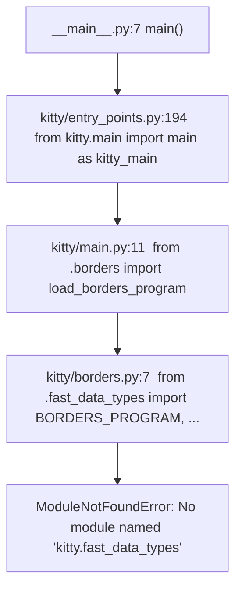

# kitty: What Actually Does the Heavy Lifting — An Evidence-Grounded Investigation

> A code-forensics answer to four architectural questions about the **kitty** terminal emulator,
> written from **observed runtime behavior**, not from assumptions about how the architecture is
> *meant* to work.

## Introduction — the weave, and the method

kitty is often described as a "GPU-accelerated terminal emulator." Opening the tree, that slogan
resolves into a tight **weave of four languages**: **C** (the performance core), **Python** (the
orchestration layer), **GLSL** (the GPU shaders that actually paint the screen), and **Go** (the
standalone `kitten` tools). The four questions below ask *which strand is load-bearing* — and the
only honest way to answer is to **exercise the code and watch what it does**.

### Method: run first, narrate second

Every behavioral claim in this document is paired with **the exact command run** and the **verbatim
output** it produced (one claim → one evidence line). Statements derived only from *reading* code
(not running it) are labeled **(inferred)**. Values obtained from a non-real path or a non-default
configuration are labeled **(non-canonical)**.

### The exact investigation environment

- **Repository under investigation (read-only):** the working tree at
  `/tmp/blitzy/kitty/blitzy-9c2d02b8-f915-4bb9-9b5a-f4f809a35c60_df1353`. The **source baseline under
  investigation** — the kitty checkout whose behavior these answers describe — is commit
  `815df1e210e0a9ab4622f5c7f2d6891d7dbeddf1` (*"Wire up applying of font config"*). That baseline is
  **distinct from the current destination-branch `HEAD`**: the destination branch carries one
  additional commit that adds *this* answer document under `blitzy/documentation/` (and its `HEAD`
  hash changes again each time the document is re-committed), so `git rev-parse HEAD` here is **not**
  the baseline hash. What stays invariant is that the **source tree is byte-for-byte unchanged**
  versus the baseline — the *only* path ever added under the repo is `blitzy/documentation/`, verified
  below with `git diff --name-status` against the fixed baseline commit.
- **Canonical interpreter used for all runtime probes:** **Python 3.12.3**, from the prepared build
  venv `/opt/kitty-venv`. This matches the version kitty is canonically built/run with.
- **Observed environment deviations (reported honestly, per "observe, don't assume"):**
  - The default `python3` on this shell is **Python 3.13.7**, *not* 3.12.3 — so all probes were run
    with the 3.12.3 venv explicitly to stay canonical.
  - `go` **is present** here (`go version go1.24.4 linux/amd64`), and so are `cc`/`gcc` 15.2.0 — this
    shell *is* the user-provided canonical build/run environment. The Q1–Q4 *failure* observations are
    nevertheless captured against the **uncompiled** checkout (with `kitty/fast_data_types*.so`
    absent), because that missing-extension state is the exact condition the questions ask about.
- **Canonical build / version banner:** the compiled startup banner is a genuinely **observed** value,
  not an attributed one. A default, canonical build was performed **in this environment** — which is
  the user-provided Docker build/run image
  `andrewparkscaleai/coding-agent:kovidgoyal__kitty__815df1e210e0a9ab4622f5c7f2d6891d7dbeddf1`
  (from `ghcr.io/scaleapi/swe-atlas:swe_atlas_QnA_kovidgoyal_kitty_1.0`) — to produce the launcher +
  `fast_data_types` extension and read the banner verbatim (see the *Version & default configuration*
  section). The transient build artifacts were then removed (`git clean -dfx -e blitzy`) to restore
  the uncompiled state, so the source tree stays byte-for-byte unchanged and the Q3/Q4 failures below
  reproduce exactly.

The environment facts, captured verbatim:

```text
$ /opt/kitty-venv/bin/python3 --version   (canonical interpreter used for probes)
Python 3.12.3
$ python3 --version   (default shell interpreter)
Python 3.13.7
$ go version
go version go1.24.4 linux/amd64
$ cc --version | head -1
cc (Ubuntu 15.2.0-4ubuntu4) 15.2.0
$ gcc --version | head -1
gcc (Ubuntu 15.2.0-4ubuntu4) 15.2.0
$ git log --oneline -1 815df1e210e0a9ab4622f5c7f2d6891d7dbeddf1   (source baseline under investigation)
815df1e21 Wire up applying of font config
$ git diff --name-status 815df1e210e0a9ab4622f5c7f2d6891d7dbeddf1 -- . ':(exclude)blitzy'   (source tree vs baseline; empty ⇒ unchanged)
$ git diff --name-status 815df1e210e0a9ab4622f5c7f2d6891d7dbeddf1   (full diff vs baseline; only the deliverable)
A	blitzy/documentation/kitty_815df1e210e0.md
```

A single unifying thread runs through all four answers: **one missing compiled artifact,
`kitty/fast_data_types*.so`**, is simultaneously the reason the main entry point dies (Q3), the
reason "independent" kittens die (Q4), and — surprisingly — the reason even *shader compilation*
cannot proceed (Q2). That artifact is the CPython C-extension where kitty's real work lives (Q1).

---

## Q1 — Which language does the heavy lifting, and where does performance come from?

**Question:** *"It calls itself GPU accelerated yet the codebase feels like a tight weave of Python
and C. Which language is really doing the heavy lifting once everything is running, and what does
that say about where performance actually comes from?"*

**Answer (up front):** once running, the performance-critical work is done by **compiled C** — the
`kitty.fast_data_types` CPython extension, the bundled **glfw**, and the **SIMD** string routines —
together with the **GPU shaders**. **Python is the orchestration layer**: startup, configuration,
layout, kittens, and remote control. Performance comes from **C + GPU + SIMD, not from Python.**

### 1.1 The raw language footprint (verbatim counts)

```text
$ ls kitty/*.c | wc -l                                             # top-level C sources in kitty/
49
$ find kitty -name '*.c' | wc -l                                   # recursive; +2 under kitty/launcher/
51
$ find kitty/launcher -name '*.c' | wc -l
2
$ find . -path ./.git -prune -o -name '*.py' -print | wc -l        # Python, repo-wide
214
$ find . -path ./.git -prune -o -name '*.go' -print | wc -l        # Go, repo-wide
258
$ ls kitty/*.glsl | wc -l                                          # GLSL shaders
13
$ grep -rl "fast_data_types" --include=*.py . | wc -l              # Python files touching the native bridge
80
$ ls kitty/*.py | wc -l                                            # top-level Python files in kitty/
44
$ find glfw -name '*.c' | wc -l                                    # bundled glfw C sources
31
```

The headline is the last-but-two number: **80 Python files import or reference
`fast_data_types`** — i.e. the majority of the Python layer reaches *down into C* rather than doing
the work itself. The `kitty/` package holds **51 C sources** against **44 top-level Python files**,
and ships **31** more C files as a bundled `glfw`.

### 1.2 Where the C work actually lives (hot-path source sizes)

The compiled extension is assembled from the hot-path C sources below. Their sizes (verbatim
`stat -c %s`) are a rough proxy for how much engine logic each carries:

```text
$ for f in vt-parser.c vt-parser.h screen.c state.c graphics.c fonts.c line.c \
           child-monitor.c gl.c data-types.c shaders.c \
           simd-string.c simd-string-128.c simd-string-256.c; do
      printf "kitty/%-22s = %s bytes\n" "$f" "$(stat -c %s kitty/$f)"; done
kitty/vt-parser.c             = 55306 bytes
kitty/vt-parser.h             = 967 bytes
kitty/screen.c                = 199784 bytes
kitty/state.c                 = 53813 bytes
kitty/graphics.c              = 101377 bytes
kitty/fonts.c                 = 76153 bytes
kitty/line.c                  = 36131 bytes
kitty/child-monitor.c         = 76612 bytes
kitty/gl.c                    = 11656 bytes
kitty/data-types.c            = 22594 bytes
kitty/shaders.c               = 62093 bytes
kitty/simd-string.c           = 9272 bytes
kitty/simd-string-128.c       = 199 bytes
kitty/simd-string-256.c       = 199 bytes
```

Mapping each to the runtime job it performs:

| C source | Bytes | Runtime responsibility |
|----------|-------|------------------------|
| `kitty/vt-parser.c` (+`.h` 967 B) | 55306 | Parses the incoming VT/escape-sequence byte stream |
| `kitty/screen.c` | 199784 | The screen/grid model — the single largest engine file |
| `kitty/state.c` | 53813 | Global OS-window / render state |
| `kitty/graphics.c` | 101377 | The graphics/image protocol (image placement, storage) |
| `kitty/fonts.c` | 76153 | Font rasterization / glyph shaping |
| `kitty/line.c` | 36131 | Per-line cell storage and manipulation |
| `kitty/child-monitor.c` | 76612 | The PTY read loop that pulls child-process output |
| `kitty/gl.c` | 11656 | OpenGL binding/plumbing |
| `kitty/data-types.c` | 22594 | The extension's core data types / module glue |
| `kitty/shaders.c` | 62093 | C-side GL program & shader compilation |

The **SIMD** routines make the CPU-side parsing explicitly vector-accelerated. `simd-string-128.c`
and `simd-string-256.c` are tiny **199-byte wrappers** that compile the shared implementation at two
different instruction-set widths — observed verbatim:

```text
$ cat kitty/simd-string-128.c   (comment header trimmed)
#define KITTY_SIMD_LEVEL 128
#include "simd-string-impl.h"
$ cat kitty/simd-string-256.c   (comment header trimmed)
#define KITTY_SIMD_LEVEL 256
#include "simd-string-impl.h"
```

### 1.3 Why the C is *always* present in a real run

All of the above C is compiled into one CPython extension. In the build system, `find_c_files()`
[setup.py:906] gathers the sources and the extension is assembled under the name
`kitty/fast_data_types` [setup.py:1091]:

```text
$ sed -n '1090,1093p' setup.py
    compile_c_extension(
        kitty_env(args), 'kitty/fast_data_types', args.compilation_database, sources, headers,
        build_dsym=args.build_dsym,
    )
```

Critically, the real program is **not** launched by a bare `python3`; it is launched by a native C
launcher that *embeds* CPython, via `#include <Python.h>` [kitty/launcher/main.c:21]:

```text
$ sed -n '21p' kitty/launcher/main.c
#include <Python.h>
```

**(inferred, from reading the build + launcher)** Because the launcher embeds the interpreter and
the build always produces `fast_data_types`, a canonical compiled run *always* has the C extension
present — so Python never has to do the parsing/rendering itself. The bare-interpreter failure in
Q3 is precisely what happens when that C layer is *missing*.

**Q1 conclusion:** the heavy lifting is C (`fast_data_types` + `glfw` + SIMD) plus the GPU shaders;
Python orchestrates. The "GPU-accelerated" slogan and the "tight weave of Python and C" observation
are both correct, and they describe *complementary* layers: C/SIMD parse and model on the CPU, the
GPU shaders draw, and Python wires it all together.

---

## Q2 — What role do the GLSL shader files play, and how central are they?

**Question:** *"The presence of scattered GLSL files only deepens the mystery. Shader code inside a
terminal is not something I expected, so what role do those files play and how central are they to
the system?"*

**Answer (up front):** the `.glsl` files are kitty's **rendering path**. kitty draws its grid of
cells, its images, its window borders, and its background image **on the GPU**, and these shaders are
the programs the GPU runs. **(inferred, from reading `kitty/shaders.py` + the render code)** they are
in fact the **entire** rendering path — there is **no CPU text-drawing fallback** — so they are not
an optional extra but *the* way pixels reach the screen. (This "sole path / no fallback" claim is
labeled inferred because it derives from reading the render code, not from exercising the GL
pipeline; the supporting basis is in §2.5–§2.6.)

### 2.1 Full inventory — all 13 `kitty/*.glsl` files

```text
$ ls kitty/*.glsl | wc -l
13
```

| GLSL file | Program / role | Kind | `void main`? |
|-----------|----------------|------|--------------|
| `cell_vertex.glsl` | Cell (text/background grid) | Vertex | yes |
| `cell_fragment.glsl` | Cell (text/background grid) | Fragment | yes |
| `cell_defines.glsl` | Shared `#define PHASE_*` for the cell program | Include | **no** |
| `border_vertex.glsl` | Window borders | Vertex | yes |
| `border_fragment.glsl` | Window borders | Fragment | yes |
| `graphics_vertex.glsl` | Graphics/image protocol | Vertex | yes |
| `graphics_fragment.glsl` | Graphics/image protocol | Fragment | yes |
| `bgimage_vertex.glsl` | Background image | Vertex | yes |
| `bgimage_fragment.glsl` | Background image | Fragment | yes |
| `tint_vertex.glsl` | Color tint overlay | Vertex | yes |
| `tint_fragment.glsl` | Color tint overlay | Fragment | yes |
| `alpha_blend.glsl` | Alpha-blending helper | Utility | **no** |
| `linear2srgb.glsl` | Linear→sRGB color helper | Utility | **no** |

### 2.2 Observed split: 10 shader stages + 3 non-stage includes (not "12")

The honest way to tell a *compiled shader stage* from a *helper include* is whether the file has a
`void main` entry point. Counted directly:

```text
$ for f in kitty/*.glsl; do echo "$(grep -c 'void main' "$f")  $(basename "$f")"; done
0  alpha_blend.glsl
1  bgimage_fragment.glsl
1  bgimage_vertex.glsl
1  border_fragment.glsl
1  border_vertex.glsl
0  cell_defines.glsl
1  cell_fragment.glsl
1  cell_vertex.glsl
1  graphics_fragment.glsl
1  graphics_vertex.glsl
0  linear2srgb.glsl
1  tint_fragment.glsl
1  tint_vertex.glsl
```

So the **observed** reconciliation of the 13 files is:

- **10 shader-stage files** that have `void main` — exactly **5 vertex/fragment program pairs**:
  `cell`, `border`, `graphics`, `bgimage`, `tint`.
- **3 non-stage files** with no `void main`: `cell_defines.glsl` (a shared include) plus
  `alpha_blend.glsl` and `linear2srgb.glsl` (color-space utility includes).
- **10 + 1 + 2 = 13.**

The non-stage files are not standalone programs; they are pulled into the stage files via a
custom `#pragma kitty_include_shader` directive, observed here:

```text
$ grep -rn kitty_include_shader kitty/*.glsl
kitty/cell_fragment.glsl:1:#pragma kitty_include_shader <alpha_blend.glsl>
kitty/cell_fragment.glsl:2:#pragma kitty_include_shader <linear2srgb.glsl>
kitty/cell_fragment.glsl:3:#pragma kitty_include_shader <cell_defines.glsl>
kitty/cell_vertex.glsl:2:#pragma kitty_include_shader <cell_defines.glsl>
kitty/graphics_fragment.glsl:1:#pragma kitty_include_shader <alpha_blend.glsl>
```

`cell_defines.glsl` (0 `void main`) is included by both `cell_vertex.glsl:2` and
`cell_fragment.glsl:3` — which is exactly why it is a shared include and not counted among the
compiled stages.

### 2.3 Build-time pipeline: GLSL → generated C header

At build time, `setup.py`'s `build_uniforms_header()` [setup.py:1025] turns the shader files into a
generated C header, `kitty/uniforms_generated.h` [setup.py:1026]. It globs the shaders
[setup.py:1040] and keeps only those whose name's second `_`-part is `fragment` or `vertex`
[setup.py:1043] — i.e. exactly the 10 stage files → 5 programs:

```text
$ sed -n '1040,1046p' setup.py
    for x in sorted(glob.glob('kitty/*.glsl')):
        name = os.path.basename(x).partition('.')[0]
        name, sep, shader_type = name.partition('_')
        if not sep or shader_type not in ('fragment', 'vertex'):
            continue
        class_names[name] = f'{name.capitalize()}Uniforms'
        function_names[name] = f'get_uniform_locations_{name}'
```

For each program it parses `uniform` declarations (regex `^uniform\s+\S+\s+(.+?);`
[setup.py:1036]) and emits a `{Name.capitalize()}Uniforms` C struct
(e.g. `CellUniforms`, `BorderUniforms`, `GraphicsUniforms`, `BgimageUniforms`, `TintUniforms`)
plus a `get_uniform_locations_{name}` accessor that calls `get_uniform_location(program, "<uniform>")`
per uniform [setup.py:1057-1060].

### 2.4 Runtime pipeline: read → `#version` → resolve includes → `compile_program`

At runtime, `kitty/shaders.py` assembles and compiles each program. It reads each shader via
`read_kitty_resource` [kitty/shaders.py:9,68], prepends a `#version` line [kitty/shaders.py:63],
resolves the `#pragma kitty_include_shader` includes with the regex at [kitty/shaders.py:53], and
finally calls `compile_program(...)` [kitty/shaders.py:90]:

```text
$ sed -n '61,68p' kitty/shaders.py
    def _load_sources(self, name: str, seen: Set[str], level: int = 0) -> Iterator[str]:
        if level == 0:
            yield f'#version {GLSL_VERSION}\n'
        if name in seen:
            return
        seen.add(name)
        self.filename_map[name] = fnum = next(self.filename_number_counter)
        src = read_kitty_resource(name).decode('utf-8')
```

### 2.5 The crucial Q2 → Q3 cross-link: shader compilation itself needs the C core

The most surprising observation: **GPU rendering in kitty is not a "pure Python + OpenGL" story —
it is gated by the C extension.** `kitty/shaders.py` imports its GL primitives *from the native
bridge*. The import block begins at [kitty/shaders.py:10] and pulls in, among others, `GLSL_VERSION`
[kitty/shaders.py:19] and `compile_program` [kitty/shaders.py:29]:

```text
$ sed -n '10,32p' kitty/shaders.py
from .fast_data_types import (
    BGIMAGE_PROGRAM,
    CELL_BG_PROGRAM,
    CELL_FG_PROGRAM,
    CELL_PROGRAM,
    CELL_SPECIAL_PROGRAM,
    DECORATION,
    DECORATION_MASK,
    DIM,
    GLSL_VERSION,
    GRAPHICS_ALPHA_MASK_PROGRAM,
    GRAPHICS_PREMULT_PROGRAM,
    GRAPHICS_PROGRAM,
    MARK,
    MARK_MASK,
    NUM_UNDERLINE_STYLES,
    REVERSE,
    STRIKETHROUGH,
    TINT_PROGRAM,
    compile_program,
    get_options,
    init_cell_program,
)
```

So the very function that prepends `#version {GLSL_VERSION}` and the function that compiles the GL
program both live in `fast_data_types` — the same missing `.so` that breaks Q3. The runtime GL
programs include `CELL_PROGRAM` (with sub-programs `CELL_BG_PROGRAM`, `CELL_FG_PROGRAM`,
`CELL_SPECIAL_PROGRAM`), `GRAPHICS_PROGRAM` (with `GRAPHICS_ALPHA_MASK_PROGRAM`,
`GRAPHICS_PREMULT_PROGRAM`), `BGIMAGE_PROGRAM`, `TINT_PROGRAM` (all above), and `BORDERS_PROGRAM`
imported in [kitty/borders.py:7]. **(inferred)** The count of runtime GL programs therefore
*exceeds* the 5 GLSL source pairs, because the cell/graphics sources are compiled multiple times
with different `#define`s drawn from `cell_defines.glsl`.

### 2.6 Centrality

**How central are the shaders?** Totally central. **(inferred, from reading `kitty/shaders.py` and
the render code)** they are the **sole rendering path**: glyphs, images, borders, and the background
all reach the screen only through these GL programs, and there is **no CPU text-drawing fallback** —
the drawing code routes exclusively through the compiled GL programs listed above, with no
alternative "draw text with the CPU" branch. So if the shaders (or the C extension that compiles
them) are unavailable, nothing is drawn at all.


---

## Q3 — Why does the main entry point fail immediately, and what is missing?

**Question:** *"When I try to run the main entry point directly, it fails almost immediately with a
cryptic error. What exactly is missing at that moment, and what does that tell us about how Python
is wired into the native core? There seems to be one critical piece that everything depends on."*

**Answer (up front):** the "one critical piece" is the **compiled C extension `kitty.fast_data_types`**.
Running the real entry point with a bare interpreter dies with
`ModuleNotFoundError: No module named 'kitty.fast_data_types'`, because the checkout contains only
the type stub `kitty/fast_data_types.pyi` — the compiled `*.so` has not been built.

### 3.1 The verbatim failure (real entry point, bare interpreter)

```text
$ PYTHONDONTWRITEBYTECODE=1 /opt/kitty-venv/bin/python3 -B __main__.py
Traceback (most recent call last):
  File "/tmp/blitzy/kitty/blitzy-9c2d02b8-f915-4bb9-9b5a-f4f809a35c60_df1353/__main__.py", line 7, in <module>
    main()
  File "/tmp/blitzy/kitty/blitzy-9c2d02b8-f915-4bb9-9b5a-f4f809a35c60_df1353/kitty/entry_points.py", line 194, in main
    from kitty.main import main as kitty_main
  File "/tmp/blitzy/kitty/blitzy-9c2d02b8-f915-4bb9-9b5a-f4f809a35c60_df1353/kitty/main.py", line 11, in <module>
    from .borders import load_borders_program
  File "/tmp/blitzy/kitty/blitzy-9c2d02b8-f915-4bb9-9b5a-f4f809a35c60_df1353/kitty/borders.py", line 7, in <module>
    from .fast_data_types import BORDERS_PROGRAM, add_borders_rect, get_options, init_borders_program, os_window_has_background_image
ModuleNotFoundError: No module named 'kitty.fast_data_types'
```

This is **stable**: the identical traceback (exit code `1`) was produced on two consecutive runs.
(The absolute path prefix is this checkout's repo root; the relative import chain is what matters.)

### 3.2 The import chain, as a diagram



Reading the chain: the root `__main__.py` calls `main()` [__main__.py:7]; the dispatcher falls
through to `from kitty.main import main as kitty_main` [kitty/entry_points.py:194]; importing
`kitty.main` triggers `from .borders import load_borders_program` [kitty/main.py:11]; and importing
`kitty.borders` hits the **first hard native import**, `from .fast_data_types import ...`
[kitty/borders.py:7]. That import has nothing to resolve against, so Python raises the error.

### 3.3 Root cause: the `.so` is absent; only the `.pyi` stub exists

```text
$ ls kitty/fast_data_types*
kitty/fast_data_types.pyi
$ find kitty -name '*.so'
```

The first command shows **only** `kitty/fast_data_types.pyi` — a *type stub*, useful to type
checkers and editors but not importable as a runtime module. The second command prints **nothing**:
there is no compiled extension anywhere under `kitty/`. That single absent artifact is the "one
critical piece that everything depends on."

**What this says about how Python is wired to the native core:** kitty's Python layer is not a
self-contained program that *optionally* accelerates with C. From the very first screen-related
import, Python expects the C extension to already exist as `kitty.fast_data_types`. In a canonical
install this is guaranteed because the native launcher embeds CPython [kitty/launcher/main.c:21] and
the build always assembles the extension [setup.py:1091]; a bare `python3 __main__.py` skips the
launcher and the build, so the wiring has nothing to connect to.

### 3.4 A distinct, non-canonical contrast: `/opt/kitty-venv/bin/python3 -m kitty`

**(non-canonical)** Invoking the *package* with `-m` is **not** the real entry point and fails
*differently* — before it can even reach the native import:

```text
$ /opt/kitty-venv/bin/python3 -B -m kitty
/opt/kitty-venv/bin/python3: No module named kitty.__main__; 'kitty' is a package and cannot be directly executed
```

The `kitty` package has no package-level `__main__.py`, so `-m kitty` cannot execute it. The real
entry point is the **repo-root** `__main__.py` (used in §3.1), which is why that path gets all the
way down to `fast_data_types` before failing. (The interpreter prefix shown is this shell's venv
python; the message itself is what matters.)

### 3.5 The dispatch logic that routed us there (exact literals)

The dispatcher `def main() -> None:` [kitty/entry_points.py:183] reads the first argument and routes:

```text
$ sed -n '188,195p' kitty/entry_points.py
    first_arg = '' if len(sys.argv) < 2 else sys.argv[1]
    func = entry_points.get(first_arg)
    if func is None:
        if first_arg.startswith('+'):
            namespaced(['+', first_arg[1:]] + sys.argv[2:])
        else:
            from kitty.main import main as kitty_main
            kitty_main()
```

With no arguments, `first_arg = ''` [kitty/entry_points.py:188], it does **not** start with `'+'`
[kitty/entry_points.py:191], so control reaches the `else` branch
`from kitty.main import main as kitty_main` [kitty/entry_points.py:194] — the exact line at the top
of the traceback. (A `+`-prefixed argument instead routes to `namespaced(...)`
[kitty/entry_points.py:192], which is the path exercised in Q4 Mode B; `namespaced` is defined at
[kitty/entry_points.py:138] and calls `func(args[1:])` at [kitty/entry_points.py:146], and
`run_kitten` is defined at [kitty/entry_points.py:118], doing
`from kittens.runner import run_kitten as rk` at [kitty/entry_points.py:126].)


---

## Q4 — Are the kittens really independent, or do they rely on the same native bridge?

**Question:** *"These look like small, self-contained tools, but are they really independent, or do
they quietly rely on the same native bridge to function? If I try to run one on its own, what
actually happens, and what does that reveal about how modular the system really is?"*

**Answer (up front):** the Python kittens are **not** independent. Whether launched as a bare
script, through the real `+kitten` dispatcher, or imported transitively, they end up depending on
the `kitty` package and — directly or via the shared `kittens/tui/*` framework — on the **same
native `fast_data_types` bridge** that breaks Q3 (all three modes are run and captured below).
Modularity is real at the *source-organization* level, but **(inferred, from reading — the Go
`kitten` binary was not built or run standalone in the failure probes)** *runtime* standalone
execution belongs to the compiled **Go `kitten` binary**, not the Python kittens.

Exercised three distinct ways, a kitten fails three distinct ways:

### 4.1 Mode A — bare script (`kittens/hints/main.py`)

```text
$ PYTHONDONTWRITEBYTECODE=1 /opt/kitty-venv/bin/python3 -B kittens/hints/main.py
Traceback (most recent call last):
  File "/tmp/blitzy/kitty/blitzy-9c2d02b8-f915-4bb9-9b5a-f4f809a35c60_df1353/kittens/hints/main.py", line 8, in <module>
    from kitty.cli_stub import HintsCLIOptions
ModuleNotFoundError: No module named 'kitty'
```

Run directly, the script fails at [kittens/hints/main.py:8] on `from kitty.cli_stub import
HintsCLIOptions` — it cannot even find the **`kitty` package**. When you execute a file directly,
Python puts *the script's own directory* (`kittens/hints/`) on `sys.path[0]`, not the repo root, so
`import kitty` has nowhere to resolve. The kitten is not standalone: it assumes the `kitty` package
is importable.

### 4.2 Mode B — the real `+kitten` entry (canonical dispatcher)

```text
$ PYTHONDONTWRITEBYTECODE=1 /opt/kitty-venv/bin/python3 -B __main__.py +kitten hints
Traceback (most recent call last):
  File "/tmp/blitzy/kitty/blitzy-9c2d02b8-f915-4bb9-9b5a-f4f809a35c60_df1353/__main__.py", line 7, in <module>
    main()
  File "/tmp/blitzy/kitty/blitzy-9c2d02b8-f915-4bb9-9b5a-f4f809a35c60_df1353/kitty/entry_points.py", line 192, in main
    namespaced(['+', first_arg[1:]] + sys.argv[2:])
  File "/tmp/blitzy/kitty/blitzy-9c2d02b8-f915-4bb9-9b5a-f4f809a35c60_df1353/kitty/entry_points.py", line 146, in namespaced
    func(args[1:])
  File "/tmp/blitzy/kitty/blitzy-9c2d02b8-f915-4bb9-9b5a-f4f809a35c60_df1353/kitty/entry_points.py", line 126, in run_kitten
    from kittens.runner import run_kitten as rk
  File "/tmp/blitzy/kitty/blitzy-9c2d02b8-f915-4bb9-9b5a-f4f809a35c60_df1353/kittens/runner.py", line 14, in <module>
    from kitty.utils import resolve_abs_or_config_path
  File "/tmp/blitzy/kitty/blitzy-9c2d02b8-f915-4bb9-9b5a-f4f809a35c60_df1353/kitty/utils.py", line 45, in <module>
    from .fast_data_types import WINDOW_FULLSCREEN, WINDOW_MAXIMIZED, WINDOW_MINIMIZED, WINDOW_NORMAL, Color, Shlex, get_options, monotonic, open_tty
ModuleNotFoundError: No module named 'kitty.fast_data_types'
```

Through the canonical path, `kitty` *is* importable (repo root is on the path), so the dispatcher
runs further: `main()` → `namespaced(...)` [kitty/entry_points.py:192] →
`func(args[1:])` [kitty/entry_points.py:146] → `run_kitten` →
`from kittens.runner import run_kitten as rk` [kitty/entry_points.py:126] → the kitten runner
[kittens/runner.py:14] imports `kitty.utils`, which at [kitty/utils.py:45] performs
`from .fast_data_types import ...`. **Result: the same `ModuleNotFoundError: No module named
'kitty.fast_data_types'`** — the kitten path lands on the identical native bridge as the main app.

### 4.3 Mode C — transitive import (`kittens.unicode_input.main`)

```text
$ PYTHONDONTWRITEBYTECODE=1 /opt/kitty-venv/bin/python3 -B -c "import kittens.unicode_input.main"
Traceback (most recent call last):
  File "<string>", line 1, in <module>
  File "/tmp/blitzy/kitty/blitzy-9c2d02b8-f915-4bb9-9b5a-f4f809a35c60_df1353/kittens/unicode_input/main.py", line 8, in <module>
    from ..tui.handler import result_handler
  File "/tmp/blitzy/kitty/blitzy-9c2d02b8-f915-4bb9-9b5a-f4f809a35c60_df1353/kittens/tui/handler.py", line 10, in <module>
    from kitty.fast_data_types import monotonic
ModuleNotFoundError: No module named 'kitty.fast_data_types'
```

Merely *importing* a kitten pulls in the shared TUI framework: [kittens/unicode_input/main.py:8]
does `from ..tui.handler import result_handler`, and [kittens/tui/handler.py:10] does
`from kitty.fast_data_types import monotonic` — the native bridge again. A kitten cannot even be
imported without the C extension.

### 4.4 Why: the runner and the whole TUI framework depend on the bridge

The kitten runner is not standalone — it imports the `kitty` package at module load:
`import importlib` [kittens/runner.py:5], `from kitty.constants import list_kitty_resources`
[kittens/runner.py:12], `from kitty.types import run_once` [kittens/runner.py:13], and
`from kitty.utils import resolve_abs_or_config_path` [kittens/runner.py:14]. And **every one** of
the 8 shared TUI modules imports `fast_data_types`:

```text
$ grep -rl fast_data_types kittens/tui/*.py
kittens/tui/handler.py
kittens/tui/images.py
kittens/tui/line_edit.py
kittens/tui/loop.py
kittens/tui/operations.py
kittens/tui/path_completer.py
kittens/tui/spinners.py
kittens/tui/utils.py
```

Any kitten built on the TUI framework therefore inherits the native dependency transitively.

### 4.5 The genuinely standalone path: the Go `kitten` binary

The source *is* well-organized into per-tool folders, and 14 kittens carry a **parallel Go
implementation** alongside the Python one:

```text
$ ls kittens/*/main.py | wc -l
18
$ ls kittens/*/main.go | wc -l
14
```

- **18 Python kitten entry points:** `ask`, `broadcast`, `choose_fonts`, `clipboard`, `diff`,
  `hints`, `hyperlinked_grep`, `icat`, `pager`, `panel`, `query_terminal`, `remote_file`,
  `resize_window`, `show_key`, `ssh`, `themes`, `transfer`, `unicode_input`.
- **14 with a parallel `main.go`:** `ask`, `choose_fonts`, `clipboard`, `diff`, `hints`,
  `hyperlinked_grep`, `icat`, `pager`, `query_terminal`, `show_key`, `ssh`, `themes`, `transfer`,
  `unicode_input`.
- **The 4 Python-only kittens** (no `main.go`), confirmed by set difference:

```text
$ comm -23 <(ls kittens/*/main.py | sed 's#kittens/##; s#/main.py##' | sort) \
           <(ls kittens/*/main.go | sed 's#kittens/##; s#/main.go##' | sort)
broadcast
panel
remote_file
resize_window
```

**(inferred, from reading the Go sources — the compiled `kitten` was produced by the canonical build
above, but was not *exercised standalone* in these probes)** The Go `kitten` binary does *not* import
`kitty.fast_data_types` — it is Go, not Python, and links none of the CPython extension — so it is a
self-contained native executable and the genuinely standalone artifact. Concretely, it was built as
`kitty/launcher/kitten` (a ~16 MB native binary) during the canonical build in the *Version* section,
then removed with the other transient artifacts via `git clean -dfx -e blitzy`; running it in
isolation was outside this read-only failure investigation, so the "standalone" claim is labeled
inferred rather than observed.

**Q4 conclusion:** the Python kittens are modular in *layout* but not *runtime-independent* — all
three invocation modes converge on the `kitty` package and its native `fast_data_types` bridge.
True standalone execution is the Go binary's domain.


---

## Version & default configuration

The default version reported by this checkout is **`kitty 0.35.2`**. It is defined as a pure-Python
constant in `kitty/constants.py`:

```text
$ sed -n '23p;25p;26p' kitty/constants.py
appname: str = 'kitty'
version: Version = Version(0, 35, 2)
str_version: str = '.'.join(map(str, version))
```

That value is `appname='kitty'` [kitty/constants.py:23] and `version=Version(0, 35, 2)`
[kitty/constants.py:25], joined into `str_version` [kitty/constants.py:26]. Notably, the version is
**observable at runtime *without* the native extension** — `kitty/constants.py` imports cleanly on
the bare interpreter:

```text
$ PYTHONDONTWRITEBYTECODE=1 /opt/kitty-venv/bin/python3 -B -c "from kitty.constants import appname, str_version; print(appname, str_version)"
kitty 0.35.2
```

This is a genuine runtime observation of the version string (exit code `0`), confirming the pure-
Python configuration layer is intact even while `fast_data_types` is missing.

The full **compiled startup banner** — what `kitty --version` prints from the native launcher — was
**observed directly** by performing the project's **default, canonical build** in this environment
(which *is* the user-provided Docker build/run image
`andrewparkscaleai/coding-agent:kovidgoyal__kitty__815df1e210e0a9ab4622f5c7f2d6891d7dbeddf1`, from
`ghcr.io/scaleapi/swe-atlas:swe_atlas_QnA_kovidgoyal_kitty_1.0`) and then running the produced
launcher binary. The **exact build command**, the **exact invocation**, and the **verbatim** banner:

```text
$ source /opt/kitty-venv/bin/activate
$ python setup.py build --verbose --ignore-compiler-warnings
[... compiler output elided; builds the kitty/fast_data_types.so C extension, the bundled glfw,
     the native launcher kitty/launcher/kitty, and the Go kitten binary kitty/launcher/kitten ...]
$ ./kitty/launcher/kitty --version
kitty 0.35.2 created by Kovid Goyal
```

This is a **genuine runtime observation** of the compiled banner — exit code `0`, **stable across two
consecutive runs**, and `./kitty/launcher/kitty -v` prints the identical line. The running banner's
`0.35.2` matches the pure-Python `str_version` constant above, so the compiled launcher and the
source constant agree. (As a corroborating aside, once the extension is built,
`/opt/kitty-venv/bin/python3 -c "import kitty.fast_data_types"` succeeds — importing from the
freshly produced `kitty/fast_data_types.so` — which is the exact piece whose absence causes the Q3/Q4
failures below.)

> **Why `--ignore-compiler-warnings`?** It is required for a clean default build in *this* toolchain
> because the installed `wayland-protocols` (1.45) adds `XDG_TOPLEVEL_STATE_CONSTRAINED_*` enum values
> that kitty 0.35.2's `switch` in `glfw/wl_window.c` predates, tripping the default `-Werror=switch`.
> This is a toolchain/library-version mismatch, **not** a kitty source defect, and **no source file
> was edited** to accommodate it.

> **Read-only discipline for this build.** The build writes only Git-ignored artifacts (e.g.
> `kitty/fast_data_types.so`, `kitty/launcher/kitty`, `kitty/launcher/kitten`, `build/`) and modifies
> **no tracked source file**. After capturing the banner, every artifact was removed with
> `git clean -dfx -e blitzy` (154 ignored entries), restoring the uncompiled state — which is why the
> `fast_data_types`-missing failures in Q3/Q4 reproduce exactly as shown and the source tree is left
> byte-for-byte unchanged.

Runtime manifests that pin the toolchains:

```text
$ sed -n '2p' pyproject.toml
requires-python = ">=3.8"
$ sed -n '3p' go.mod
go 1.22
```

- `requires-python = ">=3.8"` [pyproject.toml:2] — the Python layer.
- `go 1.22` [go.mod:3] — the Go module for the standalone `kitten` binary and `tools/`.

---

## Coverage pass

Every named item and every "such as / including / like" example from the four questions,
checked off against observed evidence:

**Q1 — language / performance**
- [x] Top-level C sources in `kitty/`: **49**; recursive: **51**; launcher: **2**.
- [x] Python repo-wide: **214**; Go repo-wide: **258**; GLSL: **13**; bundled glfw C: **31**.
- [x] Python files touching `fast_data_types`: **80**; top-level Python in `kitty/`: **44**.
- [x] Hot-path C source sizes mapped (vt-parser 55306, screen 199784, state 53813, graphics 101377,
  fonts 76153, line 36131, child-monitor 76612, gl 11656, data-types 22594, shaders 62093).
- [x] SIMD routines (`simd-string.c` 9272; `-128.c`/`-256.c` 199 each) shown as instruction-width wrappers.
- [x] Extension assembled as `kitty/fast_data_types` [setup.py:1091]; launcher embeds CPython [kitty/launcher/main.c:21].
- [x] Conclusion: C + GPU + SIMD do the heavy lifting; Python orchestrates.

**Q2 — GLSL shaders**
- [x] All **13** `.glsl` files inventoried in a table.
- [x] Observed **10** files with `void main` / **3** without (`alpha_blend`, `cell_defines`, `linear2srgb`) — reported as observed, not "12".
- [x] 5 vertex/fragment program pairs named: cell, border, graphics, bgimage, tint.
- [x] `#pragma kitty_include_shader` include lines shown (5 lines).
- [x] Build-time pipeline: `build_uniforms_header` [setup.py:1025], glob [setup.py:1040], `uniforms_generated.h`, per-program struct + accessor.
- [x] Runtime pipeline: `read_kitty_resource` [kitty/shaders.py:9,68], `#version` [kitty/shaders.py:63], include regex [kitty/shaders.py:53], `compile_program` [kitty/shaders.py:90].
- [x] Q2→Q3 cross-link: `GLSL_VERSION` [kitty/shaders.py:19] + `compile_program` [kitty/shaders.py:29] imported from `.fast_data_types`.
- [x] Centrality: sole rendering path, no CPU text-drawing fallback **(inferred)**.

**Q3 — main entry-point failure**
- [x] Verbatim command + verbatim traceback, stable across 2 runs, exit 1.
- [x] Full import chain: `__main__.py:7` → `entry_points.py:194` → `main.py:11` → `borders.py:7` → `fast_data_types`.
- [x] Mermaid diagram of the chain included.
- [x] Root cause: `.so` absent, only `kitty/fast_data_types.pyi` present.
- [x] Non-canonical `/opt/kitty-venv/bin/python3 -m kitty` contrast, labeled **(non-canonical)**.
- [x] Dispatch literals: L183, L188, L191, L192, L194 (plus L138/L146/L118/L126).

**Q4 — kitten modularity**
- [x] Mode A (bare script) → `No module named 'kitty'` at `kittens/hints/main.py:8`.
- [x] Mode B (`+kitten hints`) → full 6-hop chain to `kitty/utils.py:45` → `No module named 'kitty.fast_data_types'`.
- [x] Mode C (transitive import) → `kittens/tui/handler.py:10` → `No module named 'kitty.fast_data_types'`.
- [x] Runner depends on `kitty` package [kittens/runner.py:5,12,13,14].
- [x] All **8** `kittens/tui/*.py` import `fast_data_types` (listed).
- [x] Go-binary contrast: **18** Python `main.py` vs **14** Go `main.go`; 4 Python-only enumerated.
- [x] Conclusion: not runtime-independent; Go binary is the standalone path **(inferred)**.

**Cross-cutting**
- [x] Version **`0.35.2`** reported [kitty/constants.py:25], observed at runtime; full compiled banner `kitty 0.35.2 created by Kovid Goyal` **observed verbatim** from a default build (`./kitty/launcher/kitty --version`).
- [x] Manifests: `requires-python = ">=3.8"` [pyproject.toml:2], `go 1.22` [go.mod:3].
- [x] Unifying thread: the single missing `kitty/fast_data_types*.so` drives Q3, Q4 (Modes B & C), and gates Q2's shader compilation.

---

## Environment & exact commands

**Interpreter / toolchain (verbatim), observed in this shell:**

```text
$ /opt/kitty-venv/bin/python3 --version   # canonical interpreter used for ALL runtime probes
Python 3.12.3
$ python3 --version                        # default shell interpreter (NOT used for canonical probes)
Python 3.13.7
$ go version
go version go1.24.4 linux/amd64
$ cc --version | head -1
cc (Ubuntu 15.2.0-4ubuntu4) 15.2.0
$ gcc --version | head -1
gcc (Ubuntu 15.2.0-4ubuntu4) 15.2.0
$ git log --oneline -1 815df1e210e0a9ab4622f5c7f2d6891d7dbeddf1   # source baseline under investigation (NOT the current HEAD)
815df1e21 Wire up applying of font config
$ git diff --name-status 815df1e210e0a9ab4622f5c7f2d6891d7dbeddf1   # only the deliverable differs from baseline
A	blitzy/documentation/kitty_815df1e210e0.md
```

**Complete list of commands run for this investigation** (all Python probes used
`PYTHONDONTWRITEBYTECODE=1` with the canonical `/opt/kitty-venv/bin/python3 -B` interpreter to avoid
writing bytecode, keeping the tree clean):

- Footprint counts (Q1): `ls kitty/*.c | wc -l`; `find kitty -name '*.c' | wc -l`;
  `find kitty/launcher -name '*.c' | wc -l`; `find . -path ./.git -prune -o -name '*.py' -print | wc -l`;
  `find . -path ./.git -prune -o -name '*.go' -print | wc -l`; `ls kitty/*.glsl | wc -l`;
  `grep -rl "fast_data_types" --include=*.py . | wc -l`; `ls kitty/*.py | wc -l`;
  `find glfw -name '*.c' | wc -l`.
- Hot-path sizes (Q1): `stat -c %s kitty/<file>` for the engine sources; `cat kitty/simd-string-128.c` / `-256.c`.
- Shaders (Q2): `for f in kitty/*.glsl; do echo "$(grep -c 'void main' "$f") $(basename "$f")"; done`;
  `grep -rn kitty_include_shader kitty/*.glsl`; `sed -n '1040,1046p' setup.py`;
  `sed -n '61,68p' kitty/shaders.py`; `sed -n '10,32p' kitty/shaders.py`.
- Entry-point failure (Q3): `PYTHONDONTWRITEBYTECODE=1 /opt/kitty-venv/bin/python3 -B __main__.py` (×2);
  `ls kitty/fast_data_types*`; `find kitty -name '*.so'`;
  `/opt/kitty-venv/bin/python3 -B -m kitty` **(non-canonical)**;
  `sed -n '188,195p' kitty/entry_points.py`.
- Kittens (Q4): `PYTHONDONTWRITEBYTECODE=1 /opt/kitty-venv/bin/python3 -B kittens/hints/main.py`;
  `PYTHONDONTWRITEBYTECODE=1 /opt/kitty-venv/bin/python3 -B __main__.py +kitten hints`;
  `PYTHONDONTWRITEBYTECODE=1 /opt/kitty-venv/bin/python3 -B -c "import kittens.unicode_input.main"`;
  `grep -rl fast_data_types kittens/tui/*.py`; `ls kittens/*/main.py | wc -l`;
  `ls kittens/*/main.go | wc -l`; `comm -23 <(...) <(...)`.
- Version (Q3.5): `sed -n '23p;25p;26p' kitty/constants.py`;
  `/opt/kitty-venv/bin/python3 -B -c "from kitty.constants import appname, str_version; print(appname, str_version)"`;
  `sed -n '2p' pyproject.toml`; `sed -n '3p' go.mod`.
- Canonical compiled banner (default build in the Docker build/run environment):
  `source /opt/kitty-venv/bin/activate && python setup.py build --verbose --ignore-compiler-warnings`;
  `./kitty/launcher/kitty --version` (×2); `./kitty/launcher/kitty -v`; then
  `git clean -dfx -e blitzy` to remove the transient build artifacts.

**Canonical build/run environment (for the compiled banner):** the user-provided Docker build/run
image `andrewparkscaleai/coding-agent:kovidgoyal__kitty__815df1e210e0a9ab4622f5c7f2d6891d7dbeddf1`
(from `ghcr.io/scaleapi/swe-atlas:swe_atlas_QnA_kovidgoyal_kitty_1.0`) — the environment this
investigation ran in. The `kitty 0.35.2 created by Kovid Goyal` startup banner was **observed
verbatim** from a default build there. Build: `source /opt/kitty-venv/bin/activate && python setup.py
build --verbose --ignore-compiler-warnings`. Invocation: `./kitty/launcher/kitty --version`
(exit `0`, identical across two runs; `-v` prints the same line). Artifacts were then removed with
`git clean -dfx -e blitzy`.

**Read-only discipline:** no tracked source file was ever modified. Every Python probe wrote no
bytecode (`find . -name __pycache__ -not -path './.git/*'` and `find . -name '*.pyc' -not -path
'./.git/*'` both returned nothing), all temporary observation scripts lived outside the repository,
and the one transient canonical build (used solely to read the compiled banner) produced only
Git-ignored artifacts that were removed with `git clean -dfx -e blitzy` — leaving the source tree
byte-for-byte unchanged versus the baseline commit. `git status --porcelain` is empty except for this
document.

