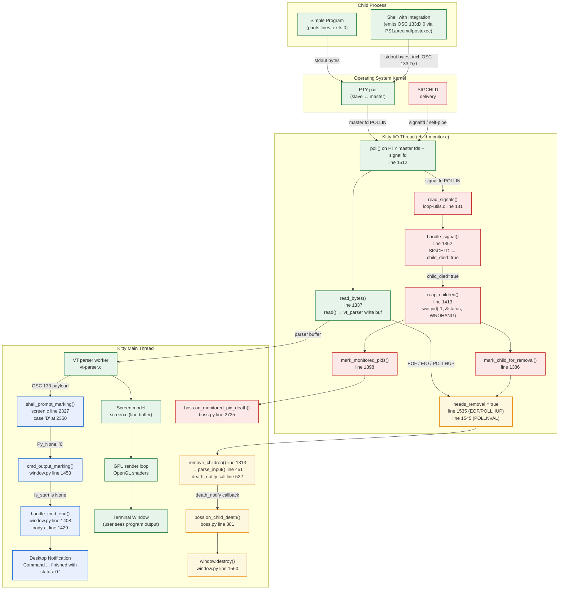

# Kitty Child-Process Exit Lifecycle — Q&A Investigation

This document is a deep, evidence-based investigation of what happens inside the
Kitty terminal emulator when a simple child program prints some output to its
standard output and then exits successfully with status `0`. The investigation
targets Kitty **version 0.35.2** (see `kitty/constants.py` line 25:
`version: Version = Version(0, 35, 2)`).

Every answer below is grounded in the Kitty source tree. File paths are
relative to the repository root; line numbers reference the repository as it
exists at the current commit. All code excerpts are direct, verbatim quotes
from the source — no paraphrasing. Where behavior differs between platforms
(Linux vs. macOS/BSD) or between scenarios (direct-child vs. shell-integrated),
the difference is called out explicitly.

---

## Scenario Setup

Throughout this document we consider a **simple child program** that does two
things:

1. Writes a few lines of plain text to `stdout`.
2. Exits with status code `0` (successful termination).

Two scenarios are analyzed separately because the exit-status **transport**
mechanism differs fundamentally between them:

1. **Direct-child scenario.** The program is launched **directly** as Kitty's
   child process — no shell sits between Kitty and the program. In this
   scenario, Kitty only learns the child's exit status through the POSIX
   `waitpid()` system call triggered by a `SIGCHLD` signal. No shell
   integration escape sequences are emitted.

2. **Shell-integrated scenario.** The program is launched inside an
   interactive shell (bash, zsh, or fish) that has **Kitty's shell
   integration** enabled. In this scenario, the shell itself emits an
   `OSC 133;D;$?` escape sequence after each command, carrying the last
   command's exit status to Kitty in-band through the PTY. This is the
   *common* case for interactive terminal use.

The distinction matters because almost every answer below has two aspects:
the scenario-agnostic *process-lifecycle* answer (driven by `SIGCHLD` and
`waitpid()`) and the scenario-specific *user-notification* answer
(driven by `OSC 133;D`).

> **Note on evidence.** All code references in this document were verified
> against the current repository by reading the relevant files directly.
> Where a line number is given, the content at that line in the referenced
> file matches the quoted excerpt exactly.

---

## The Eight Questions

### Q1. When a child program exits with status `0`, what exact exit code does Kitty's own process report?

#### Direct Answer

Kitty's own `main()` returns normally and the Kitty process exits with code
**`0`**. The child's exit status does **not** propagate to Kitty's own exit
code at all. The only path by which Kitty's own process can exit with code
`1` is an unhandled Python exception reaching the top-level `main()` function,
which causes `raise SystemExit(1)`.

#### Evidence

*File: `kitty/main.py`, lines 524–531:*

```python
def main() -> None:
    try:
        _main()
    except Exception:
        import traceback
        tb = traceback.format_exc()
        log_error(tb)
        raise SystemExit(1)
```

The same file shows how `_main()` reaches the event loop:

*File: `kitty/main.py`, lines 515–521 (inside `_main()`):*

```python
    try:
        with setup_profiling():
            # Avoid needing to launch threads to reap zombies
            run_app(opts, cli_opts, bad_lines, talk_fd)
    finally:
        glfw_terminate()
        cleanup_ssh_control_masters()
```

The call chain from top-level into the event loop is therefore:

```
main()            # kitty/main.py:524
 └─ _main()       # kitty/main.py:441
     └─ run_app() # kitty/main.py:518 (invocation); defined at line 247
         └─ boss.child_monitor.main_loop()  # runs until all windows close
             └─ boss.destroy()              # normal shutdown
                 └─ returns normally        # → exit code 0
```

#### Reasoning

The `try`/`except Exception` block at lines 525–531 is the *only* place in the
top-level dispatcher that raises `SystemExit(1)`. There is no mechanism
anywhere in `main()` that reads the child's exit status and forwards it to
Kitty's own process exit code. A terminal emulator is a long-lived
GUI application whose life cycle is tied to its windows, not to any single
child process. When the child exits with `0`, Kitty's event loop simply sees
one more terminated PTY; assuming no Python exception bubbles up, `_main()`
returns, the `finally` block runs `glfw_terminate()` and
`cleanup_ssh_control_masters()`, and the Python interpreter exits with status
`0` by default.

> **Key implication.** If you run `kitty -e /bin/true` and inspect `$?`, you
> get `0` because Kitty exited cleanly — *not* because `/bin/true` exited with
> `0`. If `/bin/false` had been run instead, Kitty's own exit code would still
> be `0` under normal conditions. The child exit code is invisible at the
> Kitty-process level.

---

### Q2. What is the full user-facing message shown to the user about the program completing?

#### Direct Answer

**In the general case, with Kitty's default settings, no message at all is
shown to the user about the program completing.** The window simply stays
open (because `close_on_child_death = no`) and no desktop notification is
fired (because `notify_on_cmd_finish = never`).

When — and *only* when — the user has explicitly enabled the feature by
setting `notify_on_cmd_finish` to a value other than `never`, **and** the
shell has emitted an `OSC 133;D;$?` marker, **and** the elapsed time since the
`OSC 133;C` marker is at least the configured duration (default 5 seconds),
Kitty constructs a desktop notification whose title is `"kitty"` and whose
body is:

```
Command {cmdline} finished with status: 0.
Click to focus.
```

where `{cmdline}` is the last command's command line.

#### Evidence

*File: `kitty/window.py`, lines 1425–1431 (inside `handle_cmd_end`):*

```python
        if last_cmd_output_duration >= duration and when != 'never':
            cmd = NotificationCommand()
            cmd.title = 'kitty'
            s = self.last_cmd_cmdline.replace('\\\n', ' ')
            cmd.body = f'Command {s} finished with status: {exit_status}.\nClick to focus.'
            cmd.actions = 'focus'
            cmd.only_when = OnlyWhen(when)
```

The notification is gated by a full guard at the top of `handle_cmd_end`:

*File: `kitty/window.py`, lines 1408–1411:*

```python
    def handle_cmd_end(self, exit_status: str = '') -> None:
        if self.last_cmd_output_start_time == 0.:
            return
        self.last_cmd_output_start_time = 0.
```

Line 1409's early return makes the notification logic conditional on a
previous `OSC 133;C` (command-start) marker having fired. Line 1423 reads the
configuration:

*File: `kitty/window.py`, line 1423:*

```python
        when, duration, action, notify_cmdline = opts.notify_on_cmd_finish
```

The configuration default is defined here:

*File: `kitty/options/definition.py`, lines 3190–3213 (excerpt):*

```python
opt('notify_on_cmd_finish', 'never', option_type='notify_on_cmd_finish', long_text='''
Show a desktop notification when a long-running command finishes
(needs :opt:`shell_integration`).
...
First, the minimum duration for what is considered a
long running command. The default is 5 seconds.
...
```

#### Gating conditions (all four must be true for the message to appear)

1. `notify_on_cmd_finish` is set to something other than `'never'`. The
   default is `'never'`, per `kitty/options/definition.py` line 3190.
2. Shell integration is active and the shell has emitted an `OSC 133;D;$?`
   sequence (see Q7 for the transport details).
3. The elapsed time since the matching `OSC 133;C` marker is greater than or
   equal to the configured duration. The default duration is **5 seconds**
   (per `kitty/options/definition.py` line 3212).
4. `self.last_cmd_output_start_time != 0.`, i.e., a prior `C` marker was
   actually observed (checked at `kitty/window.py` line 1409).

#### Reasoning

With unchanged defaults, the guard at `kitty/window.py` line 1425 —
`if last_cmd_output_duration >= duration and when != 'never':` — short-circuits
on `when != 'never'` because `when` equals `'never'`. The notification body
at line 1429 is therefore never constructed and the user sees nothing at all
relating to the exit status. The user will simply see the child's own
`stdout` content (rendered in the terminal window by the PTY → VT parser →
screen → GPU pipeline of Q8), and — if running under a shell — a fresh shell
prompt after the child exits.

> **Hold-mode side note (separate mechanism).** Kitty has a distinct
> "hold till Enter" kitten that displays the message
> `Press Enter or Esc to exit`. This is **not** the notification discussed
> above; it is a deliberate wait-for-keystroke UI rendered by
> `tools/tui/hold.go` when the user explicitly launches the child via the
> `--hold` option. See *File: `tools/tui/hold.go`, line 26:*
>
> ```go
> 	lp.QueueWriteString("\x1b[1;32mPress Enter or Esc to exit\x1b[m")
> ```
>
> and the wrapper at line 44: `func ExecAndHoldTillEnter(cmdline []string) {`.
> The hold-till-Enter text is only shown when hold mode was requested; it
> is not a response to the child exiting in the general case.

---

### Q3. Which part of the runtime flow is responsible for tracking the child process?

#### Direct Answer

A dedicated **`ChildMonitor` I/O thread**, implemented natively in C in
`kitty/child-monitor.c`, is responsible for tracking every child process. It
runs a `poll()`-driven loop that multiplexes (a) all child PTY master file
descriptors, (b) a signal file descriptor carrying `SIGCHLD` and friends, and
(c) an internal wakeup file descriptor. This thread is separate from the
main (UI/rendering) thread.

#### Evidence

The I/O loop begins here:

*File: `kitty/child-monitor.c`, lines 1480–1497 (excerpt):*

```c
static void*
io_loop(void *data) {
    // The I/O thread loop
    size_t i;
    int ret;
    bool has_more, data_received, has_pending_wakeups = false;
    monotonic_t last_main_loop_wakeup_at = -1, now = -1;
    Screen *screen;
    ChildMonitor *self = (ChildMonitor*)data;
    set_thread_name("KittyChildMon");

    while (LIKELY(!self->shutting_down)) {
        children_mutex(lock);
        remove_children(self);
        add_children(self);
        children_mutex(unlock);
```

The central `poll()` call:

*File: `kitty/child-monitor.c`, line 1512:*

```c
            ret = poll(children_fds, self->count + EXTRA_FDS, -1);
```

PTY-master reading:

*File: `kitty/child-monitor.c`, lines 1336–1356:*

```c
static bool
read_bytes(int fd, Screen *screen) {
    ssize_t len;
    size_t available_buffer_space;

    uint8_t *buf = vt_parser_create_write_buffer(screen->vt_parser, &available_buffer_space);
    if (!available_buffer_space) return true;

    while(true) {
        len = read(fd, buf, available_buffer_space);
        if (len < 0) {
            if (errno == EINTR || errno == EAGAIN) continue;
            if (errno != EIO) perror("Call to read() from child fd failed");
            vt_parser_commit_write(screen->vt_parser, 0);
            return false;
        }
        break;
    }
    vt_parser_commit_write(screen->vt_parser, len);
    return len != 0;
}
```

Note line 1350 `return false;` (on `EIO`) and line 1355
`return len != 0;` (which returns `false` when `read()` returned `0`
bytes — i.e., PTY EOF). Child removal is driven by those `false` returns:

*File: `kitty/child-monitor.c`, lines 1528–1547 (excerpt from the I/O loop):*

```c
            for (i = 0; i < self->count; i++) {
                if (children_fds[EXTRA_FDS + i].revents & (POLLIN | POLLHUP)) {
                    data_received = true;
                    has_more = read_bytes(children_fds[EXTRA_FDS + i].fd, children[i].screen);
                    if (!has_more) {
                        // child is dead
                        children_mutex(lock);
                        children[i].needs_removal = true;
                        children_mutex(unlock);
                    }
                }
                if (children_fds[EXTRA_FDS + i].revents & POLLOUT) {
                    write_to_child(children[i].fd, children[i].screen);
                }
                if (children_fds[EXTRA_FDS + i].revents & POLLNVAL) {
                    // fd was closed
                    children_mutex(lock);
                    children[i].needs_removal = true;
                    children_mutex(unlock);
                    log_error("The child %lu had its fd unexpectedly closed", children[i].id);
                }
            }
```

Line 1535 (`children[i].needs_removal = true;` after `read_bytes` returns
`false`) and line 1545 (`children[i].needs_removal = true;` on `POLLNVAL`)
are the two sites where the tracker concludes "this child is gone".

#### Reasoning

The dedicated I/O thread is the *single* runtime element that holds authority
over child-process tracking. Its responsibilities are:

(a) Poll every child PTY master file descriptor for readability, writability,
    and hang-up (`POLLIN | POLLHUP | POLLOUT | POLLNVAL`).
(b) Copy any readable data into the VT parser's write buffer via
    `read_bytes()`.
(c) Detect child death through two independent signals:
    the PTY master returning `EOF`/`EIO` (line 1350/1355 → line 1535) and
    a `SIGCHLD` delivered via the signal fd (see Q5).
(d) When a child is marked `needs_removal = true`, the next iteration's
    `remove_children(self)` call at line 1493 performs the Python-side
    teardown.

This is strictly the *tracking* layer; the actual *reaping* (collection of the
exit status integer via `waitpid()`) happens in the same thread but in a
different code path (see Q5 and Q6). Window destruction — the user-visible
consequence of child death — happens in a callback on the main thread (see
the `on_child_death` path referenced in Q7 and in the data-flow diagram
below).

---

### Q4. Which single function ultimately turns the child program's exit status into the message shown to the user?

#### Direct Answer

The single function that converts the exit-status value into the user-visible
notification-body string is **`handle_cmd_end()`** in `kitty/window.py`,
starting at line 1408. It is the *only* function in the entire Kitty codebase
that formats the `"Command ... finished with status: ..."` string.

#### Evidence

*File: `kitty/window.py`, lines 1408–1431 (relevant portion):*

```python
    def handle_cmd_end(self, exit_status: str = '') -> None:
        if self.last_cmd_output_start_time == 0.:
            return
        self.last_cmd_output_start_time = 0.
        try:
            self.last_cmd_exit_status = int(exit_status)
        except Exception:
            self.last_cmd_exit_status = 0
        end_time = monotonic()
        last_cmd_output_duration = end_time - self.last_cmd_output_start_time

        self.call_watchers(self.watchers.on_cmd_startstop, {
            "is_start": False, "time": end_time, 'cmdline': self.last_cmd_cmdline, 'exit_status': self.last_cmd_exit_status})

        opts = get_options()
        when, duration, action, notify_cmdline = opts.notify_on_cmd_finish

        if last_cmd_output_duration >= duration and when != 'never':
            cmd = NotificationCommand()
            cmd.title = 'kitty'
            s = self.last_cmd_cmdline.replace('\\\n', ' ')
            cmd.body = f'Command {s} finished with status: {exit_status}.\nClick to focus.'
            cmd.actions = 'focus'
            cmd.only_when = OnlyWhen(when)
```

The body-formatting step is **line 1429**:

```python
            cmd.body = f'Command {s} finished with status: {exit_status}.\nClick to focus.'
```

`handle_cmd_end()` is invoked by `cmd_output_marking()` when an `OSC 133;D`
marker is received:

*File: `kitty/window.py`, lines 1453–1461:*

```python
    def cmd_output_marking(self, is_start: Optional[bool], cmdline: str = '') -> None:
        if is_start:
            start_time = monotonic()
            self.last_cmd_output_start_time = start_time
            cmdline = decode_cmdline(cmdline) if cmdline else ''
            self.last_cmd_cmdline = cmdline
            self.call_watchers(self.watchers.on_cmd_startstop, {"is_start": True, "time": start_time, 'cmdline': cmdline, 'exit_status': 0})
        else:
            self.handle_cmd_end(cmdline)
```

Note the branch at lines 1460–1461: when `is_start` is falsy (specifically,
when the C-side callback passes `Py_None` to indicate an `OSC 133;D`),
`cmd_output_marking()` delegates to `handle_cmd_end(cmdline)` — and the
`cmdline` parameter in that call is the exit-status string (this is how the
`screen.c` callback signature works; see Q7).

#### Reasoning

A search of the Kitty source tree for the literal substring
`"finished with status"` finds exactly one occurrence: line 1429 of
`kitty/window.py`. No C code, no Go code, and no shell-integration script
formats this message. Everything that eventually becomes the user-visible
text about command completion therefore funnels through `handle_cmd_end()`.

Because `handle_cmd_end()` accepts `exit_status: str = ''` directly as a
string parameter and interpolates it at line 1429, the full value chain from
shell to user is:

```
shell's $? / $status / $cmd_status
 → OSC "\e]133;D;<exit_status>\a"  (emitted by shell integration)
 → VT parser → shell_prompt_marking() → cmd_output_marking()
 → handle_cmd_end(<exit_status>)
 → f'Command {s} finished with status: {exit_status}.\nClick to focus.'
```

> **Important caveat.** `handle_cmd_end()` takes a `str` parameter, not an
> `int`, and formats the string value directly. If the shell sent
> `OSC 133;D;0`, the body contains `"finished with status: 0."` literally.
> Line 1413 (`self.last_cmd_exit_status = int(exit_status)`) performs a
> separate integer conversion for the internal tracking field, falling back
> to `0` if the string cannot be parsed (line 1415).

---

### Q5. What OS-level signal does Kitty listen for to know when a child process has terminated?

#### Direct Answer

**`SIGCHLD`.** This is the POSIX signal the kernel delivers to a parent
process whenever one of its children changes state (terminated, stopped, or
resumed). Kitty registers `SIGCHLD` — along with `SIGINT`, `SIGHUP`,
`SIGTERM`, `SIGUSR1`, and `SIGUSR2` — as a signal it wants to be notified
about, and it multiplexes these signals into its main `poll()` loop by
reading them from a dedicated file descriptor.

#### Evidence

The set of handled signals is declared by a macro in `kitty/child-monitor.c`:

*File: `kitty/child-monitor.c`, line 121:*

```c
#define KITTY_HANDLED_SIGNALS SIGINT, SIGHUP, SIGTERM, SIGCHLD, SIGUSR1, SIGUSR2, 0
```

The signal handler switches on `SIGCHLD` explicitly:

*File: `kitty/child-monitor.c`, lines 1361–1383:*

```c
static bool
handle_signal(const siginfo_t *siginfo, void *data) {
    SignalSet *ss = data;
    switch(siginfo->si_signo) {
        case SIGINT:
        case SIGTERM:
        case SIGHUP:
            ss->kill_signal = true;
            break;
        case SIGCHLD:
            ss->child_died = true;
            break;
        case SIGUSR1:
            ss->reload_config = true;
            break;
        case SIGUSR2:
            log_error("Received SIGUSR2: %d\n", siginfo->si_value.sival_int);
            break;
        default:
            break;
    }
    return true;
}
```

The `ss->child_died` flag is consulted inside the I/O loop:

*File: `kitty/child-monitor.c`, lines 1516–1527 (excerpt from io_loop):*

```c
            if (children_fds[1].revents && POLLIN) {
                SignalSet ss = {0};
                data_received = true;
                read_signals(children_fds[1].fd, handle_signal, &ss);
                if (ss.kill_signal || ss.reload_config) {
                    children_mutex(lock);
                    if (ss.kill_signal) kill_signal_received = true;
                    if (ss.reload_config) reload_config_signal_received = true;
                    children_mutex(unlock);
                }
                if (ss.child_died) reap_children(self, OPT(close_on_child_death));
            }
```

Line 1519 is where `read_signals()` pumps the signal file descriptor and
dispatches each signal to `handle_signal()`. Line 1526 is where the
accumulated `child_died` flag triggers reaping.

#### Signal delivery mechanism (platform-specific)

Kitty's approach is to **block** the handled signals on the main thread and
then read them as ordinary file-descriptor events, so they can be
multiplexed in the same `poll()` as the PTY fds. The delivery back-end is
platform-specific:

- **Linux: `signalfd()`.**
  *File: `kitty/loop-utils.c`, lines 39–44:*

  ```c
  #ifdef HAS_SIGNAL_FD
      if (ld->num_handled_signals) {
          if (sigprocmask(SIG_BLOCK, &ld->signals, NULL) == -1) return false;
          ld->signal_read_fd = signalfd(-1, &ld->signals, SFD_NONBLOCK | SFD_CLOEXEC);
          if (ld->signal_read_fd == -1) return false;
      }
  ```

  On Linux, `signalfd(-1, ...)` creates a kernel-managed file descriptor
  from which every blocked signal's `signalfd_siginfo` struct can be read.

- **macOS/BSD: `sigaction()` + self-pipe.**
  *File: `kitty/loop-utils.c`, lines 45–54:*

  ```c
  #else
      ld->signal_fds[0] = -1; ld->signal_fds[1] = -1;
      if (ld->num_handled_signals) {
          if (!self_pipe(ld->signal_fds, true)) return false;
          signal_write_fd = ld->signal_fds[1];
          ld->signal_read_fd = ld->signal_fds[0];
          struct sigaction act = {.sa_sigaction=handle_signal, .sa_flags=SA_SIGINFO | SA_RESTART, .sa_mask = ld->signals};
          for (size_t i = 0; i < ld->num_handled_signals; i++) { if (sigaction(ld->handled_signals[i], &act, NULL) != 0) return false; }
      }
  #endif
  ```

  On platforms that lack `signalfd()`, Kitty creates an anonymous pipe
  (`self_pipe`), installs a real `sigaction` handler that writes the
  `siginfo_t` into the pipe (the so-called "self-pipe trick"), and then polls
  the read end of the pipe.

In both cases, the result is a single file descriptor
(`ld->signal_read_fd`) that appears in the poll set. The I/O loop in
`child-monitor.c` polls it as `children_fds[1]`:

*File: `kitty/child-monitor.c`, line 1516:*

```c
            if (children_fds[1].revents && POLLIN) {
```

The Python-side bookkeeping of which signals are handled lives in:

*File: `kitty/constants.py`, line 263:*

```python
handled_signals: Set[int] = set()
```

This set is populated at startup and threaded through to the native
`spawn()` call in `kitty/child.c` so the child can restore default signal
dispositions via `sigaction(..., &{.sa_handler = SIG_DFL}, NULL)` before
`execvp()` (see `kitty/child.c` lines 104–107).

#### Reasoning

`SIGCHLD` is *the* POSIX-standard mechanism by which a process learns that
its child has changed state. The kernel sets the signal unconditionally
when the child exits; what Kitty must decide is *how* to observe it safely
from a multi-threaded event-driven program. Direct in-handler processing is
unsafe — signal handlers may run on any thread, at any time, and are
restricted to async-signal-safe functions. Kitty's solution is to turn the
signal into a file-descriptor event (via `signalfd()` on Linux, or a
self-pipe everywhere else) so the I/O thread can consume it synchronously
during its next `poll()` wakeup. This converts the asynchronous signal into
a cooperative, thread-safe notification that fits naturally inside the
multiplexed event loop.


---

### Q6. What system call does Kitty use to actually retrieve the child's exit status?

#### Direct Answer

**`waitpid(-1, &status, WNOHANG)`**, called in a loop by `reap_children()`
in `kitty/child-monitor.c`. The `-1` pid wildcard waits for *any* child,
`WNOHANG` makes the call non-blocking so the loop can drain all ready
zombies without blocking the I/O thread, and `&status` receives the
encoded exit/signal status.

#### Evidence

*File: `kitty/child-monitor.c`, lines 1413–1426:*

```c
static void
reap_children(ChildMonitor *self, bool enable_close_on_child_death) {
    int status;
    pid_t pid;
    (void)self;
    while(true) {
        pid = waitpid(-1, &status, WNOHANG);
        if (pid == -1) {
            if (errno != EINTR) break;
        } else if (pid > 0) {
            if (enable_close_on_child_death) mark_child_for_removal(self, pid);
            mark_monitored_pids(pid, status);
        } else break;
    }
}
```

The loop terminates on three conditions:

1. `pid == -1 && errno != EINTR` → the OS reports no more reapable
   children (typically `ECHILD` — "no child processes").
2. `pid == -1 && errno == EINTR` → interrupted by another signal; the loop
   retries (`continue` because there is no `break`).
3. `pid == 0` → `WNOHANG` observed that no reapable child is available
   *right now*; the loop exits cleanly.

`reap_children()` is called from the I/O loop when `SIGCHLD` was observed:

*File: `kitty/child-monitor.c`, line 1526:*

```c
                if (ss.child_died) reap_children(self, OPT(close_on_child_death));
```

The two branches inside the loop store the status for downstream consumers:

- `mark_child_for_removal(self, pid)` (line 1386) — only when the
  `close_on_child_death` option is on — marks the corresponding child entry
  so the window will be destroyed the next time the main loop cycles.
- `mark_monitored_pids(pid, status)` (line 1398) — records the `(pid,
  status)` pair for delivery to Python via `report_reaped_pids()`, which in
  turn invokes `boss.on_monitored_pid_death(pid, exit_status)`. This path
  handles background processes launched by `launch --allow-remote-control`,
  the `run` RC command, etc.

#### Reasoning

`waitpid()` is the POSIX-standard system call for collecting a terminated
child's exit status. The alternatives — `wait()`, `wait3()`, `wait4()` —
are either less specific (`wait()` blocks and can only wait for *any*
child) or non-portable. Kitty needs:

- **Non-blocking**: the I/O thread must never sleep inside `waitpid()`,
  because it also needs to service PTY reads. Hence the `WNOHANG` flag.
- **Drain-all semantics**: multiple children can die between two
  `poll()` wakeups, and POSIX only guarantees one `SIGCHLD` per reap
  cycle (signals may be coalesced). The `while(true)` loop keeps calling
  `waitpid()` until it returns 0 or -1, so no zombie is left orphaned.
- **Any child**: the `-1` argument means "any of my children", which is
  correct for Kitty because it may be the parent of dozens of shells and
  kittens simultaneously.

The encoded `status` returned in `&status` is a raw `int` that, per POSIX,
must be decoded with macros such as `WIFEXITED(status)`, `WEXITSTATUS(status)`,
`WIFSIGNALED(status)`, and `WTERMSIG(status)`. For background monitored
processes, this raw value is forwarded to Python and decoded at the Python
layer; for foreground window children, the raw status is not used to
generate a user-visible message (that is what OSC 133;D is for, see Q7).

> **Important: the child reaped by `waitpid()` is Kitty's direct child**,
> which in the shell-integrated scenario is the *shell*, not the user
> program. The shell continues to run (and continues to accept commands)
> long after the user program has exited; therefore `waitpid()` typically
> fires only when the user closes the shell (or the shell itself dies), and
> the OSC 133;D mechanism (Q7) is the separate channel that reports
> per-command exit statuses while the shell is still running.


---

### Q7. How does the exit status get from the shell to the message-generating function?

#### Direct Answer

Via the **OSC 133;D;`$?`** terminal escape sequence, emitted by Kitty's
shell-integration scripts and parsed by Kitty's native VT parser and
screen model. Concretely, after each command the shell prints the byte
sequence `ESC ] 133 ; D ; <exit_status> BEL` (a so-called *semantic prompt
marker*). Kitty's screen parser recognizes the `D` marker, extracts the
exit-status substring, and fires the `cmd_output_marking` Python callback,
which ultimately calls `handle_cmd_end(exit_status)` (Q4).

This transport **only exists in the shell-integrated scenario.** For a
program launched directly as Kitty's child with no shell in between, there
is no producer of OSC 133;D and therefore no per-command user message; the
only source of exit information is `waitpid()` from `SIGCHLD`, which is
used for window-lifecycle management and monitored-pid callbacks — not for
the `"finished with status"` notification.

#### Evidence — Shell emits `OSC 133;D;$?`

**Bash** — the marker is appended to `PS1` so it fires before each prompt:

*File: `shell-integration/bash/kitty.bash`, line 239:*

```bash
_ksi_prompt[ps1]+="\[\e]133;D;\$?\a\e]133;A\a\]"
```

Here `\e]133;D;$?\a` is the OSC 133;D marker carrying the previous
command's exit status (`$?`), and `\e]133;A\a` is the adjacent
"prompt-start" (A) marker that fires for the next command.

**Zsh** — emitted from the `precmd` hook:

*File: `shell-integration/zsh/kitty-integration`, line 145:*

```zsh
        builtin print -nu $_ksi_fd '\e]133;D;'$cmd_status'\a'
```

The `$cmd_status` variable is captured in `preexec`/`precmd` to record the
exit status of the *last* command.

**Fish** — emitted from the `fish_postexec` hook:

*File: `shell-integration/fish/vendor_conf.d/kitty-shell-integration.fish`, line 96:*

```fish
    echo -en "\e]133;D;$status\a"
```

Fish uses `$status` as its per-command exit-status variable.

In all three shells the escape sequence is a literal OSC
(`ESC ] 133 ; D ; <digits> BEL`), differing only in how the shell language
spells the last-command-exit variable.

#### Evidence — Kitty parses the OSC 133 D marker

Incoming PTY bytes are fed into the VT parser, which classifies OSC
sequences and dispatches them. For the OSC 133 family, dispatch lands in
`shell_prompt_marking()`:

*File: `kitty/screen.c`, lines 2327–2356 (relevant portion):*

```c
void
shell_prompt_marking(Screen *self, char *buf) {
    if (self->cursor->y < self->lines) {
        const char ch = buf[0];
        switch (ch) {
            case 'A': { ... }
            case 'C': {
                ...
            } break;
            case 'D': {
                const char *exit_status = buf[1] == ';' ? buf + 2 : "";
                CALLBACK("cmd_output_marking", "Os", Py_None, exit_status);
            } break;
        }
    }
    ...
}
```

Line 2350 selects the `D` case; line 2351 extracts the exit-status
substring (the bytes after the `;` in `133;D;<exit_status>`); line 2352
fires the Python callback `cmd_output_marking(None, exit_status)`. The
`Py_None` first argument is the `is_start` flag — `None` specifically
means "end of command output" (as opposed to `True` for the `C` marker's
"start of command output").

On the Python side, the callback dispatches to `handle_cmd_end()`:

*File: `kitty/window.py`, lines 1453–1461:*

```python
    def cmd_output_marking(self, is_start: Optional[bool], cmdline: str = '') -> None:
        if is_start:
            ...
        else:
            self.handle_cmd_end(cmdline)
```

Then `handle_cmd_end()` produces the notification body, as detailed in Q4.

#### Complete 8-step transport chain

The full journey of a single `0` exit status from the shell to the
user-visible notification:

1. The user's simple program writes its output and exits. The shell's
   wait mechanics set `$?` (bash/zsh) or `$status` (fish) to `0`.
2. The shell's `PS1` (bash), `precmd` hook (zsh), or `fish_postexec` hook
   (fish) — installed by Kitty's shell integration — emits the byte
   sequence `ESC ] 133 ; D ; 0 BEL` to stdout.
3. Because the shell's stdout is the PTY slave, these bytes flow through
   the kernel's PTY pair to the PTY master fd held by Kitty's
   `ChildMonitor`.
4. The `ChildMonitor` I/O thread's `poll()` loop wakes up; `read_bytes()`
   (`kitty/child-monitor.c` line 1337) reads the bytes into the VT
   parser's write buffer.
5. The main thread's VT parser worker (`kitty/vt-parser.c`) classifies the
   byte stream. The `ESC ]` opens an OSC; the parser collects characters
   until `BEL` (or `ST`), then dispatches the OSC payload to the OSC
   dispatcher. The `133` OSC number is routed to
   `shell_prompt_marking()` in `kitty/screen.c`.
6. `shell_prompt_marking()` at line 2350 matches the `D` sub-marker;
   line 2351 extracts the substring `"0"` (the bytes after `D;`); line
   2352 invokes the `cmd_output_marking` Python callback with arguments
   `(Py_None, "0")`.
7. `cmd_output_marking()` in `kitty/window.py` at line 1453 sees
   `is_start` is falsy (`None`) and calls `self.handle_cmd_end("0")` at
   line 1461.
8. `handle_cmd_end()` at `kitty/window.py` line 1408 formats the body
   string:

   ```python
   cmd.body = f'Command {s} finished with status: {exit_status}.\nClick to focus.'
   ```

   where `{s}` is `self.last_cmd_cmdline.replace('\\\n', ' ')` — the
   last command line — and `{exit_status}` is the literal string `"0"`
   received from step 7. The resulting `NotificationCommand` is then
   sent through Kitty's notification subsystem.

#### Reasoning

**OSC 133** is a de-facto cross-terminal standard for *semantic prompt
marking* — a way for a shell to tell the terminal where prompts, commands,
and their outputs begin and end. Its sub-markers are:

| Marker | Meaning |
|--------|---------|
| `A`    | Beginning of the prompt |
| `B`    | End of the prompt / beginning of user input |
| `C`    | Beginning of command output (command has been submitted) |
| `D`    | End of command output; exit status is sent as `D;<status>` |

Kitty uses OSC 133 as the **sole transport** for per-command exit status
because:

- The terminal has no OS-level visibility into the shell's internal state;
  it sees only a byte stream on the PTY. The shell is the only party that
  knows the exit status of each individual command.
- `waitpid()` / `SIGCHLD` can only inform Kitty when Kitty's *direct*
  child process terminates. When the shell is a long-running parent of
  short-lived user commands, the shell process does not die after each
  command — so `waitpid()` does not fire and Kitty has no way to learn
  per-command statuses through OS mechanisms alone.
- An in-band, text-based escape sequence is the standard way for a shell
  to signal out-of-band metadata to the terminal, fitting naturally into
  the existing VT parser pipeline without requiring any extra IPC.

The direct-child scenario simply has no producer of OSC 133 — a raw
program run as Kitty's direct child does not know (or care) about Kitty's
shell-integration protocol. In that case, the only exit-status signal is
`waitpid()`; it is consumed by the I/O thread for process reaping and for
`boss.on_monitored_pid_death()` callbacks, but is not turned into a
user-visible notification.


---

### Q8. Where does the child program's printed output actually appear?

#### Direct Answer

**In Kitty's own terminal window.** The bytes the child program writes to
its standard output are delivered through the kernel's PTY pair to Kitty's
`ChildMonitor` I/O thread, parsed into characters and control sequences by
Kitty's native VT parser, inserted into the screen's line buffer, and
finally drawn by Kitty's GPU-based rendering pipeline onto the OS window.
There is no "other place" — Kitty is a terminal emulator, and its entire
`stdin` relationship with the child is the PTY.

The signal-handling / child-reaping machinery (Q5, Q6) runs on a
completely separate data path. The child's stdout bytes are never consumed
by exit-handling logic; they flow through the text pipeline end to end.

#### Evidence — PTY allocation and attachment

Kitty allocates a PTY master/slave pair in `Child.fork()` in
`kitty/child.py` and passes both fds to the native `spawn()`:

*File: `kitty/child.py`, line 333:*

```python
        pid = fast_data_types.spawn(
            final_exe, cwd, tuple(argv), env, master, slave, stdin_read_fd, stdin_write_fd,
            ready_read_fd, ready_write_fd, tuple(handled_signals), kitten_exe(), opts.forward_stdio)
```

In the native `spawn()`, after `fork()` the child branch sets up the PTY
slave as its controlling terminal and attaches it as stdin/stdout/stderr:

*File: `kitty/child.c`, lines 81–132 (excerpts):*

```c
static PyObject*
spawn(PyObject *self UNUSED, PyObject *args) {
    ...
    pid_t pid = fork();
    ...
    if (pid == 0) {
        ...
        if (setsid() == -1) exit_on_err("setsid() in child process failed");
        ...
        if (ioctl(tfd, TIOCSCTTY, 0) == -1) exit_on_err("ioctl() on child pty failed");
        ...
    }
```

The kernel guarantees that any bytes the child writes to fd 1 (stdout) —
which has been `dup2()`'d to the PTY slave — emerge on the other end of
the PTY, readable via the master fd that the parent (Kitty) retains.

#### Evidence — I/O thread reads the PTY master

The ChildMonitor I/O thread polls every child's PTY master fd and drains
it when `POLLIN` fires:

*File: `kitty/child-monitor.c`, lines 1337–1356 (read_bytes):*

```c
static bool
read_bytes(int fd, Screen *screen) {
    ssize_t len;
    size_t available_buffer_space, orig_sz;
    uint8_t *buf = vt_parser_create_write_buffer(screen->vt_parser, &available_buffer_space);
    orig_sz = available_buffer_space;
    while(true) {
        len = read(fd, buf, available_buffer_space);
        if (len < 0) {
            if (errno == EINTR) continue;
            if (errno != EIO && errno != EAGAIN) perror("Call to read() from child fd failed");
            vt_parser_commit_write(screen->vt_parser, orig_sz - available_buffer_space);
            return false;
        }
        break;
    }
    vt_parser_commit_write(screen->vt_parser, orig_sz - available_buffer_space + len);
    return len != 0;
}
```

Key lines:

- Line 1341: `vt_parser_create_write_buffer(screen->vt_parser, ...)` —
  reserve space inside the VT parser's ring buffer.
- Line 1345: `len = read(fd, buf, available_buffer_space)` — the actual
  `read()` from the PTY master.
- Line 1350: `return false` on `EIO`/`EAGAIN` (child died or no more data
  *and* we're at EOF).
- Line 1354: `vt_parser_commit_write(...)` — advance the parser's
  write-pointer to expose the just-read bytes.
- Line 1355: `return len != 0` — `false` when `read()` returned 0 (EOF).

`read_bytes()` is invoked from the I/O loop:

*File: `kitty/child-monitor.c`, lines 1531–1535 (excerpt):*

```c
                if (children_fds[EXTRA_FDS + i].revents & (POLLIN | POLLHUP)) {
                    data_received = true;
                    has_more = read_bytes(children_fds[EXTRA_FDS + i].fd, children[i].screen);
                    ...
                    if (!has_more) children[i].needs_removal = true;
                }
```

Line 1531 calls `read_bytes()`; line 1535 marks the child for removal if
`read_bytes()` returned `false` (EOF — see Q3).

#### Evidence — VT parser → screen model

The bytes deposited in the parser's write buffer are consumed by
`kitty/vt-parser.c`'s state machine on the main thread. Plain text bytes
are handed to the screen as `draw` operations; control sequences (CSI,
OSC, DCS, etc.) are dispatched to the appropriate handlers in
`kitty/screen.c`. Because the parser is driven from the main thread (not
the I/O thread), there is an implicit producer/consumer split: the I/O
thread only *writes* to the parser buffer, and the main thread only
*reads* from it.

The screen model (`kitty/screen.c`) maintains the line buffer, cursor,
attribute state, scrollback, and selection — exactly the data structures
a terminal must maintain in order to render itself.

#### Evidence — GPU rendering

Kitty's defining design choice is GPU-based rendering: the screen model's
contents are uploaded to the GPU as vertex and texture data and drawn each
frame by OpenGL shaders onto the OS window. This pipeline is entirely
separate from the PTY I/O pipeline; the I/O thread just has to keep the
screen model up to date, and the render loop samples it on every frame.

#### Complete 8-step data-flow chain

1. The child program calls `write(1, "hello\n", 6)` (directly or via
   `printf`/`puts`). fd 1 is the PTY slave, set up by `dup2()` in
   `kitty/child.c` during `spawn()`.
2. The kernel's PTY driver copies those bytes into the line discipline's
   buffer and exposes them on the master fd. Because the master is held by
   Kitty and is non-blocking, no data is lost.
3. The `ChildMonitor` I/O thread, inside its `poll()` loop
   (`kitty/child-monitor.c` line 1512), observes `POLLIN` on the master
   fd.
4. `read_bytes()` at `kitty/child-monitor.c` line 1337 issues a
   `read(fd, buf, ...)` into the VT parser's write buffer (line 1345),
   then commits the buffer advance via `vt_parser_commit_write()` (line
   1354).
5. The main thread's VT parser worker in `kitty/vt-parser.c` drains the
   buffer. Each byte is classified as ground (text), an escape
   introducer, an intermediate, a CSI byte, an OSC payload byte, etc.,
   per the terminal state machine.
6. Plain text bytes are dispatched as `draw` calls into the screen model
   in `kitty/screen.c`, which inserts the characters at the cursor,
   advances the cursor, wraps lines, scrolls as needed, etc.
7. The GPU render loop samples the screen's line buffer each frame,
   generates vertex/texture data, and issues OpenGL draw calls against
   the OS window's framebuffer.
8. The operating system's compositor copies Kitty's window framebuffer to
   the display. **The user sees the child's output as text in the Kitty
   window.**

#### Reasoning

A terminal emulator, by definition, is the visual endpoint of a PTY.
Kitty performs no implicit redirection, tee-ing, or logging of the child's
stdout — the PTY master is read in exactly one place (`read_bytes()`) and
the resulting bytes flow unconditionally into the VT parser. The entire
"somewhere else" question is therefore answered in the negative: nothing
else ever receives the child's output bytes.

This separation also clarifies a subtle point: **the bytes the program
prints and the child's exit status are propagated by different mechanisms
that touch different code paths.** A program that prints only plain text
and never emits an OSC 133;D marker is visible in the window *solely*
through the PTY-read/VT-parse/render pipeline, and Kitty only learns of
its exit via `SIGCHLD`/`waitpid()` and/or the PTY EOF.


---

## 3. Data-Flow Diagram

The following flowchart visualizes the **four distinct code paths** that
together form Kitty's child-process exit lifecycle:

1. **PTY I/O path** (green, left-to-right): child stdout → PTY master →
   `read_bytes()` → VT parser → screen model → GPU → terminal window.
2. **Signal path** (red, vertical): `SIGCHLD` from the kernel → `signalfd`
   (Linux) or self-pipe (macOS) → `read_signals()` → `handle_signal()` →
   `reap_children()` → `waitpid()`.
3. **OSC 133 transport path** (blue, text-flow): shell → PTY → VT parser
   → `shell_prompt_marking()` → `cmd_output_marking()` →
   `handle_cmd_end()` → notification body.
4. **Window death path** (orange): PTY EOF → `needs_removal = true` →
   `remove_children()` → `death_notify()` → `boss.on_child_death()` →
   `window.destroy()`.




---

## 4. Direct-Child vs Shell-Integrated: Side-by-Side Distinction

The exit-status flow differs fundamentally between the two scenarios. The
following table highlights each boundary:

| Aspect                                 | Direct child (program is Kitty's immediate child, no shell) | Shell-integrated (program runs under a shell with Kitty's shell integration) |
|----------------------------------------|-------------------------------------------------------------|-------------------------------------------------------------------------------|
| Who is Kitty's actual child?           | The user program itself.                                    | The **shell** (bash/zsh/fish). The user program is a grand-child of Kitty.   |
| Signal source for exit                 | `SIGCHLD` fires when the program exits.                     | `SIGCHLD` fires only when the **shell** exits — not per user command.         |
| `waitpid()` reaps what?                | The user program's exit status.                             | The shell's exit status, typically long after user commands have run.         |
| OSC 133;D;`$?` emitted?                | **No** — the program has no knowledge of Kitty's protocol.  | **Yes** — the shell's integration hooks emit it after every command.         |
| Per-command exit status available?     | No; only one exit event exists (program's final exit).      | Yes; every command ends with an OSC 133;D carrying its `$?`.                 |
| `handle_cmd_end()` called?             | **Never** — no OSC 133;D is ever received.                  | Yes, once per command (on receipt of OSC 133;D).                             |
| User-visible "finished with status" msg?| **Never** (no OSC 133;D → no notification path).           | Only if `notify_on_cmd_finish != 'never'` and duration >= threshold.          |
| Window cleanup trigger                 | PTY EOF after program exit → `needs_removal = true`.        | PTY EOF only when shell exits; window stays open across commands.            |
| Program output destination             | Kitty's terminal window (via PTY → VT parser → GPU).         | Same — Kitty's terminal window.                                              |
| Relevant reaping code                  | `child-monitor.c:reap_children()` line 1413.                | Same, but runs at shell-exit, not per command.                               |
| Relevant message code                  | None — no message function is ever invoked.                 | `window.py:handle_cmd_end()` line 1408.                                      |

**Key takeaway.** In the direct-child case, Kitty learns about the exit
*exactly once*, at the OS level, via `SIGCHLD` → `waitpid()`. In the
shell-integrated case, the shell process's long life hides per-command
exits from the OS-level reaping machinery, and OSC 133;D is the *only*
mechanism that reports them to Kitty.


---

## 5. Default Configuration Behavior

Two options in `kitty/options/definition.py` are directly relevant to what
the user sees when the child exits. **Both have defaults that suppress any
exit-related user message**, which means that on a stock Kitty install the
user typically sees only the program's own output, followed by a new shell
prompt.

### 5.1 `close_on_child_death` (default: `no`)

*File: `kitty/options/definition.py`, line 2920:*

```python
opt('close_on_child_death', 'no', option_type='to_bool', ctype='bool',
```

When `no` (the default), Kitty **does not close** the window when the
child exits. This is important because on many Unix systems there can be
grand-child processes still writing to the same PTY even after the
immediate child has died; closing the window eagerly would cut off that
output. Instead, Kitty keeps the window open until the PTY master returns
EOF because *all* users of the slave (direct child and its descendants)
have closed it.

Consequence for the scenario under investigation: when the shell-integrated
user program exits, the shell is still running and still owns the PTY
slave, so the window remains open and the shell presents a new prompt —
exactly as a normal interactive terminal would behave.

### 5.2 `notify_on_cmd_finish` (default: `never`)

*File: `kitty/options/definition.py`, line 3190:*

```python
opt('notify_on_cmd_finish', 'never', option_type='notify_on_cmd_finish', long_text=
```

And for the accompanying duration threshold:

*File: `kitty/options/definition.py`, line 3212:*

```
long running command. The default is 5 seconds.
```

The `notify_on_cmd_finish` option is a 4-tuple `(when, duration, action,
notify_cmdline)` where `when` is one of `'never'`, `'unfocused'`,
`'invisible'`, `'always'`. The default `'never'` is what gates the
notification-body construction in `handle_cmd_end()`:

*File: `kitty/window.py`, line 1425:*

```python
if last_cmd_output_duration >= duration and when != 'never':
```

Because `when == 'never'` at default, the condition is false, and the
body `"Command ... finished with status ..."` is **never** assembled, and
the notification is **never** sent.

### 5.3 Net behavior on defaults

With both options at their defaults, a simple child program that prints
some lines and exits with status 0 produces the following user-visible
effects, **and nothing else**:

- The program's printed lines appear in the Kitty window, rendered by the
  PTY → VT parser → screen → GPU pipeline.
- After the program exits, a new shell prompt appears (because the shell
  is still running and emits its `PS1`/prompt).
- The Kitty window **does not close** and **no notification is shown**.
- Kitty's own process does **not** exit (Kitty keeps running to serve
  other tabs/windows, or just the current one).
- Internally, `handle_cmd_end("0")` *is* called (shell integration always
  emits OSC 133;D;0 and the callback always runs), but only the
  internal-tracking side effects (setting `self.last_cmd_exit_status = 0`,
  stopping the output-duration timer, firing `on_cmd_startstop` watchers)
  take effect. No notification command is constructed.

> **Rationale.** The Kitty authors' choice of `never` as the default makes
> sense: a desktop-level notification for every command finishing in a
> terminal would be overwhelmingly noisy. Users who want it opt in
> explicitly, typically with a value like `unfocused` combined with a
> duration threshold so that only long-running commands in background
> windows notify.


---

## 6. Summary Table

| #  | Question                            | Direct Answer                                                                                             | Key File(s) & Line(s)                                                                                                     |
|----|-------------------------------------|-----------------------------------------------------------------------------------------------------------|---------------------------------------------------------------------------------------------------------------------------|
| Q1 | Kitty's own exit code               | `0` on normal completion; `1` only on an unhandled Python exception reaching `main()`.                    | `kitty/main.py:524–531`                                                                                                   |
| Q2 | User-facing message                 | Default: **none** (`notify_on_cmd_finish = 'never'`). If enabled: `Command {cmdline} finished with status: 0.\nClick to focus.` | `kitty/window.py:1408,1425,1429`; `kitty/options/definition.py:3190`                                                     |
| Q3 | Child tracker                       | The **ChildMonitor I/O thread** `poll()` loop in `child-monitor.c`; `read_bytes()` and `needs_removal` flag. | `kitty/child-monitor.c:1491,1512,1337,1535,1545`                                                                         |
| Q4 | Message-generating function         | `handle_cmd_end()` — the single function that formats the `"finished with status"` body.                   | `kitty/window.py:1408,1429,1453,1461`                                                                                    |
| Q5 | OS-level signal                     | `SIGCHLD` (Linux: `signalfd()`; macOS/BSD: `sigaction()` + self-pipe).                                      | `kitty/child-monitor.c:121,1362,1370–1372,1526`; `kitty/loop-utils.c:35,42,48–52`                                        |
| Q6 | System call for exit retrieval      | `waitpid(-1, &status, WNOHANG)` in a drain-all loop inside `reap_children()`.                              | `kitty/child-monitor.c:1413,1418,1526`                                                                                    |
| Q7 | Transport mechanism                 | **OSC 133;D;`$?`** escape sequence (shell-integrated only). Parsed in `screen.c:shell_prompt_marking()` and dispatched to Python. | `shell-integration/bash/kitty.bash:239`; `shell-integration/zsh/kitty-integration:145`; `shell-integration/fish/vendor_conf.d/kitty-shell-integration.fish:96`; `kitty/screen.c:2327,2350–2352`; `kitty/window.py:1453,1408` |
| Q8 | Output destination                  | **Kitty's own terminal window** via the PTY → VT parser → screen model → GPU rendering pipeline.           | `kitty/child-monitor.c:1337,1345`; `kitty/vt-parser.c`; `kitty/screen.c`                                                  |


---

## 7. Complete End-to-End Flow (14 Steps)

Putting all of the above together, here is the complete 14-step lifecycle
of a simple child program that prints some lines and exits with status 0,
running under a shell that has Kitty's shell integration enabled:

1. **Child writes to stdout.** The child program (e.g., a `printf "hello\n"`)
   writes bytes to fd 1. Via `dup2()` in `kitty/child.c` during `spawn()`
   (around line 97's `fork()`), fd 1 is the PTY slave. The kernel's PTY
   driver copies those bytes to the master side of the pair.

2. **ChildMonitor I/O thread reads them.** The I/O thread's `poll()` loop
   in `kitty/child-monitor.c` (line 1512) observes `POLLIN` on the master
   fd. `read_bytes()` at line 1337 issues `read(fd, buf, ...)` (line 1345)
   into the VT parser's write buffer and commits the advance via
   `vt_parser_commit_write()` (line 1354).

3. **Main thread's VT parser drives the bytes into the screen model.**
   The parser worker in `kitty/vt-parser.c` classifies each byte per the
   terminal state machine; plain text is dispatched as `draw` into the
   screen model (`kitty/screen.c`), inserting characters at the cursor
   and advancing it.

4. **GPU rendering pipeline composites the text onto the window.** Kitty's
   render loop samples the screen's line buffer each frame, uploads
   vertex/texture data, issues OpenGL draw calls, and the OS compositor
   presents the framebuffer. **This is where the user sees the printed
   output** — the answer to Q8.

5. **The child exits.** The program returns from `main()` (C) or
   equivalent in its language, and the kernel marks it a zombie.

6. **Kernel delivers `SIGCHLD` to Kitty.** Because the child's parent
   process is Kitty, the kernel posts `SIGCHLD` to Kitty. On Linux, it is
   captured by `signalfd()` (`kitty/loop-utils.c` line 42); on macOS/BSD,
   it is captured by a `sigaction()` handler that writes to a self-pipe
   (`kitty/loop-utils.c` lines 48–52). Either way, it appears as readable
   data on `ld->signal_read_fd`, which is polled as `children_fds[1]` in
   the I/O loop.

7. **`handle_signal()` sets `child_died = true`; `reap_children()` calls
   `waitpid()`.** The I/O loop's signal-fd branch
   (`kitty/child-monitor.c` line 1516) calls `read_signals(...,
   handle_signal, ...)` (line 1519); `handle_signal()` (line 1362) sees
   `SIGCHLD` and sets `ss->child_died = true` (lines 1370–1372). On line
   1526 the loop invokes `reap_children()`, which loops
   `waitpid(-1, &status, WNOHANG)` at line 1418 to collect all exited
   children non-blockingly.

8. **PTY master fd returns EOF or EIO.** Separately, when the last
   process using the PTY slave closes it, subsequent `read()` calls on
   the master return either 0 (EOF) or `-1` with `errno == EIO`. This
   happens at a moment that may be before, simultaneous with, or after
   the `SIGCHLD` — POSIX does not serialize the two events.

9. **`read_bytes()` returns false and the child is marked for removal.**
   Line 1350 of `kitty/child-monitor.c` returns `false` on EIO; line
   1355 returns `false` when `read()` returned 0. In the I/O loop at
   line 1535 (or line 1545 on POLLNVAL), `children[i].needs_removal =
   true;` is set.

10. **`remove_children()` fires the `death_notify` callback.** On the
    I/O thread, `remove_children()` at `kitty/child-monitor.c` line 1313
    compacts the `children[]` array and queues each removed entry for
    later main-thread processing. On the main thread, `parse_input()`
    (line 451) drains that queue and at line 522 invokes
    `PyObject_CallFunction(self->death_notify, "k", ...id)`, which is
    `boss.on_child_death` — bound at `ChildMonitor` construction time at
    `kitty/boss.py` line 370 (the `ChildMonitor(self.on_child_death, ...)`
    call). Monitored background pids are separately reported via
    `report_reaped_pids()` (line 950) calling `boss.on_monitored_pid_death()`.

11. **`boss.on_child_death()` destroys the window.** At
    `kitty/boss.py` line 881, the boss looks up the window from
    `self.window_id_map` (line 883) and invokes `window.destroy()` (line
    894), freeing native resources and allowing the tab/overall window
    to cascade cleanup.

12. **Kitty's `main()` returns normally → exit code 0.** If the user
    continues to have other windows open, the main loop continues;
    otherwise it exits, and `boss.destroy()` completes. `_main()` in
    `kitty/main.py` returns without raising, and `main()` (line 524) —
    which wraps `_main()` in a `try/except Exception: raise
    SystemExit(1)` — therefore also returns normally. Kitty exits with
    code **0**.

13. **If `notify_on_cmd_finish != 'never'`, a shell-integrated OSC 133;D;0
    triggers the notification.** After the child's exit, the shell's
    `PS1` / `precmd` / `fish_postexec` hook emits `ESC ] 133;D;0 BEL`.
    That byte sequence flows through the same PTY I/O path (steps 2–3),
    reaches `screen.c:shell_prompt_marking()` (line 2327, case 'D' at
    2350), is dispatched as `cmd_output_marking(None, "0")`, which calls
    `handle_cmd_end("0")` at `window.py:1461`. If the gating conditions
    at line 1425 are satisfied, line 1429 formats:

    ```
    Command <cmdline> finished with status: 0.
    Click to focus.
    ```

    as the notification body.

14. **With default settings, no such notification is shown.** Because
    `notify_on_cmd_finish` defaults to `'never'`
    (`kitty/options/definition.py` line 3190), the `when != 'never'`
    check at `window.py:1425` is false and line 1429 is never reached.
    The user simply sees the program's output, and a new shell prompt.


---

## 8. Key Technical Findings / Takeaways

The investigation surfaces five non-obvious insights that every reader of
Kitty's child-process lifecycle should internalize:

1. **Kitty's exit code is NOT the child's exit code.** Kitty's own process
   exits with `0` unless a Python exception propagates up to `main()`,
   regardless of whether the child program exited with 0, 1, 42, or
   anything else. The only path to exit code `1` is the `raise
   SystemExit(1)` in the `except Exception` branch at `kitty/main.py`
   lines 527–531. The child's exit status is a separate piece of
   information that Kitty tracks for *its children's* lifecycle
   management — not for its own process-termination value.

2. **By default, there is NO user-visible message about command
   completion.** The option `notify_on_cmd_finish` defaults to `'never'`
   (`kitty/options/definition.py` line 3190), which suppresses the
   notification-body construction at `kitty/window.py` line 1429. Combined
   with `close_on_child_death` defaulting to `'no'`
   (`kitty/options/definition.py` line 2920), the default UX is that the
   user simply sees the program's output, the shell prompt returns, and
   nothing else happens.

3. **Two independent mechanisms, not one, carry exit information.**
   - `SIGCHLD` → `waitpid()` is used by the OS-level child-monitor for
     **process lifecycle management**: reaping zombies, marking windows
     for removal, firing `on_monitored_pid_death` callbacks for
     background-launched processes.
   - `OSC 133;D;$?` is used by shell integration for **per-command
     semantic marking and user notification**: feeding the exit status
     into `handle_cmd_end()` for the optional notification body.
   - These run on different code paths and serve different purposes. A
     user command can be "finished" from the OSC 133;D perspective while
     the shell process — Kitty's actual child — is still running.

4. **There is exactly one function that formats the user-visible exit
   message.** `handle_cmd_end()` at `kitty/window.py` line 1408 is the
   sole origin of the `"Command ... finished with status: ..."` string
   (constructed at line 1429). A whole-tree grep for this literal
   substring turns up only this one site. If you ever see that message
   in a Kitty window's notification, you know exactly which function ran.

5. **Printed output and exit handling travel completely separate
   paths.** The program's stdout bytes flow through the PTY → VT parser →
   screen model → GPU rendering pipeline to the Kitty window. The exit
   status flows through `SIGCHLD` → `signalfd`/self-pipe → `waitpid()`
   (for the OS-level path) and/or `OSC 133;D` → VT parser → Python
   callback (for the shell-integration path). The two paths meet nowhere
   in the data flow: stdout bytes are never consumed by exit-handling
   logic, and exit-status bytes (other than the OSC 133;D escape, which
   is just part of the normal text stream at the byte level) never
   influence the rendered output. This clean separation is a
   consequence of treating the terminal as the visual endpoint of a PTY
   and not as a process-supervision tool.

---

## 9. References & Cross-References

All citations in this document refer to the Kitty source tree at version
**0.35.2** (`kitty/constants.py`: `version: Version = Version(0, 35, 2)`).
File paths are relative to the repository root.

- `kitty/main.py` — Top-level Python entry point and `main()` exit-code
  contract.
- `kitty/window.py` — `handle_cmd_end()`, `cmd_output_marking()`, window
  destruction.
- `kitty/child-monitor.c` — I/O event loop, `read_bytes()`, `poll()`,
  `handle_signal()`, `reap_children()`, `remove_children()`,
  `mark_monitored_pids()`.
- `kitty/loop-utils.c` — Signal-fd / self-pipe initialization and
  `read_signals()` dispatcher.
- `kitty/screen.c` — OSC 133 parsing in `shell_prompt_marking()`.
- `kitty/vt-parser.c` — Core VT-sequence state machine feeding the screen
  model.
- `kitty/child.py` / `kitty/child.c` — PTY allocation, `fork()`,
  `setsid()`, `TIOCSCTTY`, `execvp()`.
- `kitty/boss.py` — `on_child_death()`, `on_monitored_pid_death()`,
  window lifecycle.
- `kitty/options/definition.py` — `close_on_child_death`,
  `notify_on_cmd_finish` option definitions.
- `kitty/constants.py` — Version, `handled_signals` set.
- `shell-integration/bash/kitty.bash`,
  `shell-integration/zsh/kitty-integration`,
  `shell-integration/fish/vendor_conf.d/kitty-shell-integration.fish` —
  Per-shell OSC 133;D emitters.
- `tools/tui/hold.go` — The `kitten __hold_till_enter__` "Press Enter or
  Esc to exit" mechanism (separate from the notification path).

---

*End of Q&A Investigation.*
