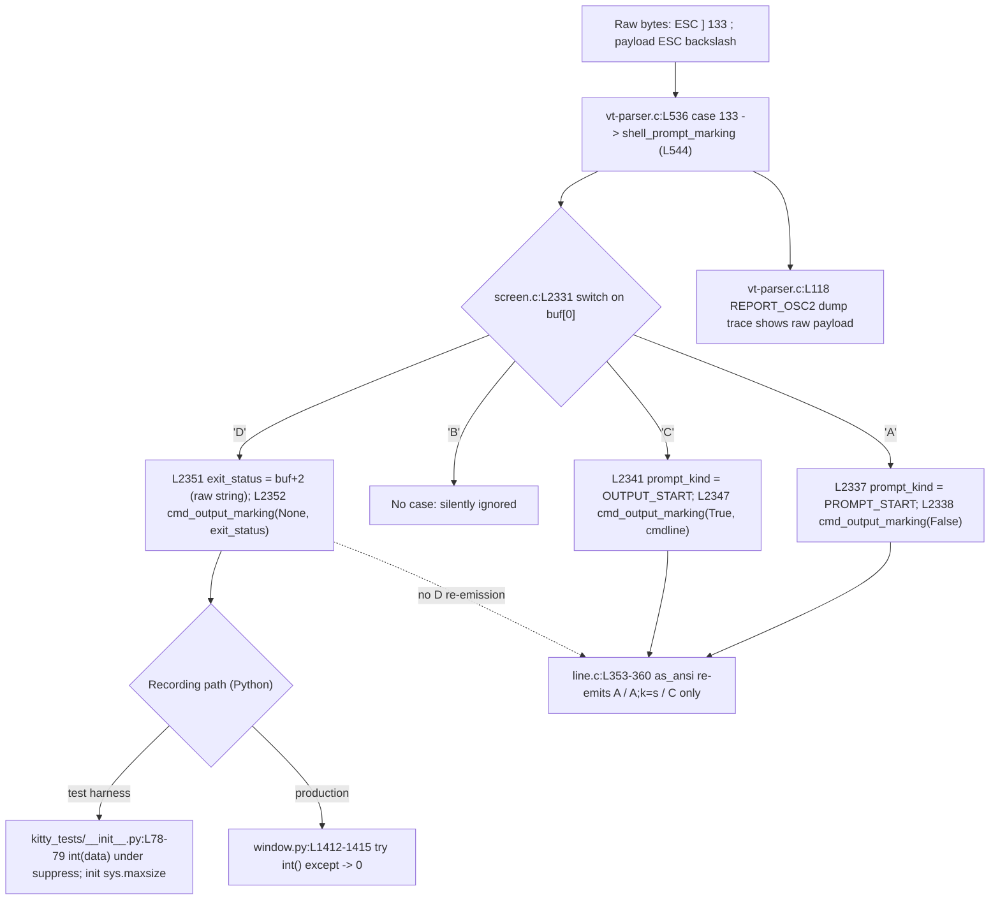

# How kitty handles `OSC 133` shell-integration (“semantic prompt”) escape sequences

> **Investigative Q&A — grounded in runtime observation of the real compiled kitty parser.**
>
> This document answers, with **verbatim observed output**, what the kitty terminal
> emulator does with the `OSC 133` command-boundary markers when a program writes a
> full command cycle — `OSC 133;A`, `OSC 133;B`, `OSC 133;C;<cmdline>`, some output
> text, and `OSC 133;D;42`.
>
> **Methodology (rule set “SWE-AtlasQnA-Repo”): the code was built and run first, then
> the answer was written from what was observed.** Every behavioral claim below is paired
> with the exact `file:line` citation that governs it and the verbatim output line that
> demonstrates it (one claim, one piece of evidence). Temporary observation scripts were
> written **outside** the repository (under `/tmp/osc133_obs/`) and removed afterward; the
> only file added to the repository is this document.

## Investigation environment

| Item | Value |
|------|-------|
| Repository | kitty terminal emulator (source branch `kitty_815df1e210e0`) |
| Runtime parser | `kitty.fast_data_types` C extension (`kitty/fast_data_types.so`), built in-place |
| Python | 3.13.7 (system) |
| Build image | `andrewparkscaleai/coding-agent:kovidgoyal__kitty__815df1e210e0a9ab4622f5c7f2d6891d7dbeddf1` (from `ghcr.io/scaleapi/swe-atlas:swe_atlas_QnA_kovidgoyal_kitty_1.0`) |
| Parser importable? | `from kitty.fast_data_types import Screen` → `Screen present: True` |
| Existing test | `test_prompt_marking (kitty_tests.screen.TestScreen.test_prompt_marking) ... ok` |
| Dump trace available? | Yes — the loaded `fast_data_types.so` has `DUMP_COMMANDS` enabled, so `REPORT_OSC2` fires |

The user’s example command cycle was realized as a single byte string, framing each
marker with `OSC` = `ESC ]` = `0x1b 0x5d` and `ST` = `ESC \` = `0x1b 0x5c`
(the exact byte definitions kitty documents at `docs/shell-integration.rst:L440-L441`):

```
b'\x1b]133;A\x1b\\\x1b]133;B\x1b\\\x1b]133;C;cmdline=mycmd\x1b\\some text\x1b]133;D;42\x1b\\'
```

The bytes were fed through the **real** parser via the test harness primitive
`parse_bytes(screen, data, dump_callback=None)` (`kitty_tests/__init__.py:L30`), which
feeds raw bytes to `Screen.test_parse_written_data`, i.e. the same VT parser kitty uses
at runtime.

---

## Summary (TL;DR)

| # | Question | Answer (grounded) |
|---|----------|-------------------|
| **Q1** | What does kitty do with the sequence, and what is captured? | Each `133;*` payload is dispatched to `shell_prompt_marking` (`kitty/screen.c:L2328`). `A` marks the line `PROMPT_START` and fires `cmd_output_marking(False)`; `C` marks it `OUTPUT_START`, captures the cmdline, and fires `cmd_output_marking(True, 'mycmd')`; `D` fires `cmd_output_marking(None, '42')`. `B` is dispatched but hits **no case** — no state change, no callback. Observed: `last_cmd_cmdline = 'mycmd'`, `last_cmd_exit_status = 42`. |
| **Q2** | Are the OSC sequences stripped or retained? | Depends on the surface. For a full command cycle the text capture is `cmd_output(as_ansi=False) = 'some text\n'` and `cmd_output(as_ansi=True) = '\x1b[msome text\n'`, and `as_text(as_ansi=True)` re-emits **both `133;A` and `133;C`** but **never `133;D`**. Mechanism — **`cmd_output`/`as_text` serialization:** `line.c` re-emits only `A`, `A;k=s`, `C` (`kitty/line.c:L353-L360`) — **never `D`**; `cmd_output` additionally strips the leading `\x1b]133;C` (`kitty/window.py:L466-L467`). **Diagnostic dump trace:** the raw `D;42` payload appears. Net: **`133;D` appears only in the dump trace, never in `cmd_output`/`as_text`.** |
| **Q3** | Total byte length and offset of `D;42`? | Total length = **62** bytes; the `\x1b]133;D` marker begins at byte offset **50** (for `cmdline=mycmd` + body `some text`). |
| **Q4** | How does this change for exit codes 0, 1, 127? | The `\x1b]133;D` marker **start offset is constant (50)** across all codes; only the total length grows: `0`→**61**, `1`→**61**, `42`→**62**, `99`→**62**, `127`→**63**. Invariant: `total_len == 60 + num_digits` — **+1 byte per additional exit-code digit**. |
| **Q5** | For exit code 99, what runtime evidence proves it was processed end-to-end? | Both recording paths record `99`: test harness `callback last_cmd_exit_status = 99`; production `Window.handle_cmd_end('99')` → `production last_cmd_exit_status = 99`. |
| **Q6** | Malformed `D;not_a_number` and `D;` (empty)? | The C side extracts the raw string (`'not_a_number'`, `''`). The two recording paths **diverge**: the **test harness** retains its `sys.maxsize` init value (`9223372036854775807`) because `int()` is under `suppress(Exception)`; **production** yields `0` because `try/except` falls back to `0`. |

---

## 1. Background — the OSC 133 semantic-prompt protocol (external grounding, background only)

`OSC 133` is the FinalTerm/iTerm2 **“semantic prompt”** (FTCS) protocol. The four markers
are conventionally: `A` = prompt start, `B` = command start, `C` = command output start,
`D` = command finished (with an optional exit code). This external protocol description is
**background only** — every behavioral claim in this document is anchored to kitty’s own
code and observed output, not to external sources.

kitty’s own authoritative description lives in `docs/shell-integration.rst`, section
**“Notes for shell developers”** (`docs/shell-integration.rst:L417`). It documents exactly
four forms:

- `<OSC>133;A<ST>` — prompt start (`docs/shell-integration.rst:L426`)
- `<OSC>133;A;k=s<ST>` — secondary (PS2) prompt start (`docs/shell-integration.rst:L430`)
- `<OSC>133;C<ST>` — command output start (`docs/shell-integration.rst:L434`)
- `<OSC>133;D;exit status as base 10 integer<ST>` — command finished, optional exit status (`docs/shell-integration.rst:L438`)

with `<OSC>` = bytes `0x1b 0x5d` and `<ST>` = bytes `0x1b 0x5c`
(`docs/shell-integration.rst:L440-L441`), and the cmdline extension
`<OSC>133;C;cmdline=cmdline encoded by %q<ST>` (`docs/shell-integration.rst:L461`).

**kitty documents only `A` / `A;k=s` / `C` / `D` — it does not document or implement `B`.**

The shell-integration emitters confirm real-world usage of these markers:

- bash emits the cmdline with `C`: `builtin printf "\e]133;C;cmdline=%q\a" "$last_cmd"` (`shell-integration/bash/kitty.bash:L208`), and emits `D;$?` immediately followed by `A` at the next prompt: `_ksi_prompt[ps1]+="\[\e]133;D;\$?\a\e]133;A\a\]"` (`shell-integration/bash/kitty.bash:L239`).
- fish emits a bare `\e]133;D\a` (`shell-integration/fish/vendor_conf.d/kitty-shell-integration.fish:L83`), a cmdline via `\e]133;C;cmdline_url=%s\a` (`:L91`), and the status via `\e]133;D;$status\a` (`:L96`).

Note that neither emitter sends `B`, consistent with kitty not implementing it.

---

## 2. Dispatch & handling chain

### 2.1 VT parser routing (`kitty/vt-parser.c`)

The parser routes the OSC code `133` to the screen handler:

- `kitty/vt-parser.c:L536` — `case 133:`
- `kitty/vt-parser.c:L544` — `shell_prompt_marking(self->screen, (char*)buf + i);`

In dump builds (`#ifdef DUMP_COMMANDS`), the parser additionally reports the raw payload
to the diagnostic dump callback **before** invoking the handler:

- `kitty/vt-parser.c:L539` — `REPORT_OSC2(shell_prompt_marking, code, mv);`
- `kitty/vt-parser.c:L118-L119` — the macro:
  `Py_XDECREF(PyObject_CallFunction(self->dump_callback, "KsiO", self->window_id, #name, code, string));`

This `REPORT_OSC2` call is what surfaces the raw `A` / `B` / `C;…` / `D;…` payloads in the
dump trace (see Q1). It is a **diagnostic side channel**, entirely separate from the text
capture surfaces.

### 2.2 The per-letter handler (`kitty/screen.c`)

`shell_prompt_marking` (`kitty/screen.c:L2328`) reads the first payload byte
(`char ch = buf[0];`, `:L2330`) and switches on it (`switch (ch)`, `:L2331`). The switch has
**exactly three cases — `A`, `C`, `D` — and no `case 'B'`** (the switch spans `:L2331-L2354`):

- **`case 'A':`** (`:L2332`) → sets `PromptKind pk = PROMPT_START` (`:L2333`), runs
  `parse_prompt_mark(self, buf+1, &pk)` (`:L2336`; `parse_prompt_mark` is at `:L2316` and maps
  the field `k=s` to `SECONDARY_PROMPT` at `:L2321`), writes the line’s
  `prompt_kind = pk` (`:L2337`), and — only when `pk == PROMPT_START` — fires
  `CALLBACK("cmd_output_marking", "O", Py_False)` (`:L2338`).
- **`case 'C':`** (`:L2340`) → sets the line’s `prompt_kind = OUTPUT_START` (`:L2341`),
  captures the cmdline via `strstr(buf + 1, ";cmdline") == buf + 1` (`:L2343`) → `cmdline = buf + 2`
  (`:L2344`), and fires `CALLBACK("cmd_output_marking", "OO", Py_True, c)` (`:L2347`).
- **`case 'D':`** (`:L2350`) → extracts the exit status as a **raw C string**:
  `const char *exit_status = buf[1] == ';' ? buf + 2 : "";` (`:L2351`), and fires
  `CALLBACK("cmd_output_marking", "Os", Py_None, exit_status)` (`:L2352`).

**Key insight (code reading):** the `D` exit status is handed to Python **as a raw string**
(`buf + 2`) — the C layer performs **no integer parse** and sets **no line attribute** for
`D`. All numeric interpretation happens later, in Python (see Q5/Q6).

The `PromptKind` values are defined at `kitty/data-types.h:L230`:

```c
typedef enum { UNKNOWN_PROMPT_KIND = 0, PROMPT_START = 1, SECONDARY_PROMPT = 2, OUTPUT_START = 3 } PromptKind;
```

and the handler is declared at `kitty/screen.h:L231`:
`void shell_prompt_marking(Screen *self, char *buf);`.

### 2.3 Dispatch-and-capture flow



---

## Q1 — What does kitty do with the sequence, and what is captured?

**Claim.** kitty dispatches each `133;*` payload to `shell_prompt_marking` (`kitty/screen.c:L2328`).
`A` marks the current line `PROMPT_START` and fires `cmd_output_marking(False)` (`:L2337-L2338`);
`C` marks it `OUTPUT_START`, captures the cmdline, and fires `cmd_output_marking(True, cmdline)`
(`:L2341-L2347`); `D` fires `cmd_output_marking(None, exit_status_string)` (`:L2351-L2352`).
`B` is dispatched but hits **no case**, so it produces no state change and no callback. What is
*captured* — the cmdline `'mycmd'` and the exit code `42` — is delivered through the
`cmd_output_marking` callback.

**Evidence** — script `/tmp/osc133_obs/q1_q2.py`, run with `python3 /tmp/osc133_obs/q1_q2.py`:

```
STREAM repr = b'\x1b]133;A\x1b\\\x1b]133;B\x1b\\\x1b]133;C;cmdline=mycmd\x1b\\some text\x1b]133;D;42\x1b\\'
STREAM len  = 62

===== Q1: DUMP TRACE (what the parser dispatched) =====
DUMP: ('shell_prompt_marking', 133, 'A')
DUMP: ('shell_prompt_marking', 133, 'B')
DUMP: ('shell_prompt_marking', 133, 'C;cmdline=mycmd')
DUMP: ('draw', 'some text')
DUMP: ('shell_prompt_marking', 133, 'D;42')

line 0 text='some text'
callback last_cmd_cmdline = 'mycmd'
callback last_cmd_exit_status = 42
```

Reading the evidence, one claim at a time:

- **The parser dispatches all four markers.** The dump trace shows four
  `('shell_prompt_marking', 133, …)` entries — `A`, `B`, `C;cmdline=mycmd`, `D;42`
  (`REPORT_OSC2` at `kitty/vt-parser.c:L539`, `L118`).
- **`A` and `C` both act on line 0.** No line advance occurs between them (the user’s literal
  stream draws no prompt text and inserts no newline), so `A` first marks line 0 `PROMPT_START`
  (`kitty/screen.c:L2337`) and then `C` overwrites the same line to `OUTPUT_START`
  (`kitty/screen.c:L2341`); line 0 ends holding the output text: `line 0 text='some text'`.
- **The `C` marker’s cmdline is captured** via the callback: `callback last_cmd_cmdline = 'mycmd'`
  (extracted at `kitty/screen.c:L2344`, fired at `:L2347`).
- **The `D` marker’s exit code is captured** via the callback:
  `callback last_cmd_exit_status = 42` (extracted at `kitty/screen.c:L2351`, fired at `:L2352`).

The exact *text* that ends up in the capture surfaces (as opposed to the callback) is the
subject of Q2.

---

## Q2 — Are the OSC sequences stripped or retained (per capture surface)?

The word “output” is ambiguous. kitty has **two distinct capture surfaces**, and they behave
differently, so each is answered separately.

### Surface 1 — Text serialization (`cmd_output` / `as_text`)

The ANSI re-emission happens in `kitty/line.c`. `line_as_ansi` (`kitty/line.c:L338`) uses the
`WRITE_MARK` macro (`kitty/line.c:L343`) and re-emits a marker **only** for these prompt kinds:

- `PROMPT_START` → `WRITE_MARK("A")` (`kitty/line.c:L353-L354`)
- `SECONDARY_PROMPT` → `WRITE_MARK("A;k=s")` (`kitty/line.c:L356-L357`)
- `OUTPUT_START` → `WRITE_MARK("C")` (`kitty/line.c:L359-L360`)

There is **no `WRITE_MARK("D")`** anywhere (`grep` confirms none), and `D` never sets a
`prompt_kind`, so it can **never** be re-emitted into the text. With `as_ansi=False` all OSC
markers are stripped. On top of that, the Python wrapper `cmd_output`
(`kitty/window.py:L457`) strips a **leading** `\x1b]133;C` from the first ≤3 lines via
`if x.startswith('\x1b]133;C'): lines[i] = x.partition('\\')[-1]` (`kitty/window.py:L466-L467`).

### Surface 2 — Diagnostic dump-commands trace

`REPORT_OSC2` (`kitty/vt-parser.c:L118`) reports the **raw** payload, so `D;42` **does** appear
here — as already shown in Q1’s dump trace.

**Conclusion.** `D;42` appears **only** in the dump trace, **never** in `cmd_output`/`as_text`.
The `C` marker survives in `as_text(as_ansi=True)` but is stripped from `cmd_output`.

To answer the capture question exactly, the text surfaces are observed from a **full command
cycle as a real shell emits it** — the prompt line marked by `A`, the typed command, a newline,
then the output line marked by `C`, the output text, a newline, then `D`. (The bash/fish
emitters in §1 send exactly this arrangement — `A` on the prompt line, `C` before the output,
`D` after, with the shell's own newlines separating them.) The screen is wide enough
(`cols=20`) that `some text` does not wrap.

**Evidence (required capture-surface values)** — script
`/tmp/osc133_obs/q2_capture_surfaces.py`, run with `python3 /tmp/osc133_obs/q2_capture_surfaces.py`:

```
===== Q2 (REQUIRED capture-surface evidence): full command cycle =====
STREAM repr = b'\x1b]133;A\x1b\\$ \x1b]133;B\x1b\\mycmd\r\n\x1b]133;C;cmdline=mycmd\x1b\\some text\r\n\x1b]133;D;42\x1b\\'
cmd_output(as_ansi=False) = 'some text\n'
cmd_output(as_ansi=True)  = '\x1b[msome text\n'
as_text(as_ansi=False)    = '$ mycmd\nsome text\n\n\n'
as_text(as_ansi=True)     = '\x1b[m\x1b]133;A\x1b\\$ mycmd\n\x1b[m\x1b]133;C\x1b\\some text\n\n\n'
  '133;A' in as_text(ansi=True)? -> True | '133;C'? -> True | '133;D'? -> False
  '133;D' in cmd_output(ansi=True)? -> False | '133;C'? -> False
```

One claim at a time:

- **`cmd_output(as_ansi=False) = 'some text\n'`** — the command output captured between the `C`
  and `D` markers, carrying its trailing newline, with every OSC marker stripped (`as_ansi=False`).
- **`cmd_output(as_ansi=True) = '\x1b[msome text\n'`** — the same output with only the leading
  SGR reset; the leading `\x1b]133;C` has been stripped (`kitty/window.py:L466-L467`, shown
  below) and **no `D` marker appears**.
- **`as_text(as_ansi=True)` re-emits BOTH `133;A` and `133;C`, but never `133;D`.**
  `'133;A' in as_text(ansi=True)? -> True`, `'133;C'? -> True`, `'133;D'? -> False`. The
  `A`-marked prompt line and the `C`-marked output line are each re-emitted
  (`WRITE_MARK("A")` at `kitty/line.c:L354`, `WRITE_MARK("C")` at `kitty/line.c:L360`); there is
  **no `WRITE_MARK("D")`** (`kitty/line.c:L353-L360`), so `D` can never appear.
- **`133;C` is stripped from `cmd_output`.** `'133;C' in cmd_output(ansi=True)? -> False`
  (the leading-`\x1b]133;C` strip at `kitty/window.py:L466-L467`).
- **With `as_ansi=False`, all OSC are stripped.** `cmd_output(as_ansi=False) = 'some text\n'`
  and `as_text(as_ansi=False) = '$ mycmd\nsome text\n\n\n'` contain no OSC bytes.

The two-step handling of `C` (re-emitted by `line.c`, then stripped by `window.py`) is shown
directly by `/tmp/osc133_obs/q2_verify.py`, which captures the raw lines produced by the
C-level `screen.cmd_output(...)` **before** the Python post-processing runs:

```
RAW lines from screen.cmd_output(as_ansi=True), BEFORE window.py:L466 strip:
  raw[0] = '\x1b[m'
  raw[1] = '\x1b]133;C\x1b\\some text'
  raw[2] = '\n'
  raw[3] = ''
AFTER window.py cmd_output() post-processing:
   '\x1b[msome text\n'
```

- **`line.c` re-emits `C`:** `raw[1] = '\x1b]133;C\x1b\\some text'` (`kitty/line.c:L360`).
- **`window.py` then strips it:** the final `cmd_output` result is `'\x1b[msome text\n'`
  (`kitty/window.py:L466-L467`).

**Corroboration from an existing test.** `kitty_tests/screen.py:L1124` asserts
`self.ae(lco(as_ansi=True), '\x1b[m\x1b]133;C\x1b\\abcd\n\x1b[m12')` — that expected value
contains `133;C` and **never** `133;D`, independently confirming the same surface behavior.
Additionally, kitty’s scrollback boundary search keys on the **`C`** marker, not `D`:
`reverse_find(buf, sz, (const uint8_t*)"\x1b]133;C\x1b\\")` (`kitty/history.c:L475`).

### Secondary nuance — the user’s *literal* single-line example (reported exactly as seen)

The user’s example writes the markers **back-to-back** — no prompt text drawn and no newline
between them (`…A…B…C;cmdline=mycmd…some text…D;42…`). Running that exact literal stream (same
`/tmp/osc133_obs/q2_capture_surfaces.py`) yields slightly different *text* strings:

```
===== Q2 (secondary nuance): user's LITERAL example (no newlines) =====
STREAM repr = b'\x1b]133;A\x1b\\\x1b]133;B\x1b\\\x1b]133;C;cmdline=mycmd\x1b\\some text\x1b]133;D;42\x1b\\'
cmd_output(as_ansi=False) = 'some text'
cmd_output(as_ansi=True)  = '\x1b[msome text'
as_text(as_ansi=False)    = 'some text\n\n\n\n'
as_text(as_ansi=True)     = '\x1b[m\x1b]133;C\x1b\\some text\n\n\n\n'
  '133;A' in as_text(ansi=True)? -> False | '133;C'? -> True | '133;D'? -> False
```

This differs from the required capture-surface values in exactly **two** ways, and **both come
from the stream construction, not from any different kitty behavior**:

- **No trailing newline in `cmd_output`** (`'some text'` vs the required `'some text\n'`): the
  literal stream places `D` immediately after `some text` with no line advance, so there is no
  newline to capture. The full cycle ends the output line with a newline, yielding `'some text\n'`.
- **Only `133;C` appears in `as_text(as_ansi=True)`** (`'133;A' … -> False` vs the required
  `True`): with no newline between `A` and `C`, both act on **line 0**, so `C`’s `OUTPUT_START`
  overwrites `A`’s `PROMPT_START` (the same “`A` and `C` both act on line 0” finding from Q1).
  The full cycle separates them onto two lines, so both `133;A` and `133;C` are re-emitted.

**Both arrangements give the same answer to Q2:** `D` is **never** re-emitted into any text
surface (it appears only in the diagnostic dump trace); `C` **can** appear in
`as_text(as_ansi=True)` but is **stripped** from `cmd_output`; and with `as_ansi=False` all OSC
markers are stripped. The existing test assertion `kitty_tests/screen.py:L1124` (which draws a
prompt and thus separates the prompt and output lines) matches the required full-cycle behavior.

---

## Q3 — Total byte length, and at what offset does `D;42` appear?

These are **measured** quantities (byte arithmetic over the constructed stream), not estimates.

**Evidence** — script `/tmp/osc133_obs/q3_q4.py` (the searched marker is `DMARK = b'\x1b]133;D'`):

```
===== Q3: total length and offset of D;42 =====
DMARK searched = b'\x1b]133;D'
total length  = 62
offset of \x1b]133;D = 50
```

- **Total byte length = 62** (matches `STREAM len = 62` in Q1).
- **The `\x1b]133;D` marker begins at byte offset = 50.**

This offset (50) is specific to the chosen `cmdline=mycmd` and body `some text`; a different
cmdline or body would shift it. The relationship in Q4, however, is general.

---

## Q4 — How does this change for exit codes 0, 1, and 127 (byte lengths and positions)?

**Claim.** Because every byte *preceding* the `D` marker is identical regardless of the exit
code, the marker’s **start offset is constant**; only the **total length** grows — by exactly
**one byte per additional exit-code digit**.

**Evidence** — same `/tmp/osc133_obs/q3_q4.py` (exit codes `0`, `1`, `42`, `99`, `127`):

```
===== Q4: per exit code =====
     code | digits | total_len | D_offset
        0 |   1    |    61     |   50
        1 |   1    |    61     |   50
       42 |   2    |    62     |   50
       99 |   2    |    62     |   50
      127 |   3    |    63     |   50

1-digit baseline total_len (code 0) = 61
  code 0   : digits=1  total_len=61  delta_from_1digit_baseline=+0  (== digits-1? True)
  code 1   : digits=1  total_len=61  delta_from_1digit_baseline=+0  (== digits-1? True)
  code 42  : digits=2  total_len=62  delta_from_1digit_baseline=+1  (== digits-1? True)
  code 99  : digits=2  total_len=62  delta_from_1digit_baseline=+1  (== digits-1? True)
  code 127 : digits=3  total_len=63  delta_from_1digit_baseline=+2  (== digits-1? True)
D-marker offset constant across all codes? -> True (value = 50)
Invariant: total_len == 60 + num_digits  (i.e. 61 + (num_digits - 1))
```

One claim at a time:

- **Exit code `0`:** total length **61**, `D` offset **50** (1 digit).
- **Exit code `1`:** total length **61**, `D` offset **50** (1 digit).
- **Exit code `127`:** total length **63**, `D` offset **50** (3 digits).
- (For completeness, the codes named elsewhere in the question: **`42`** → **62**/offset **50**;
  **`99`** → **62**/offset **50**.)
- **The `D`-marker start offset is constant at 50** across every code:
  `D-marker offset constant across all codes? -> True (value = 50)`.
- **Digit-shift relationship:** `total_len == 60 + num_digits` — equivalently
  `61 + (num_digits - 1)`. Each verified row shows `delta_from_1digit_baseline == digits-1`
  is `True`, so the total grows by exactly **one byte per extra exit-code digit** while the
  offset does not move. Rationale: the exit-code digits are the **last** field before the
  trailing `ST`, so they change only the tail length, never the bytes before `\x1b]133;D`.

---

## Q5 — For exit code 99, what runtime evidence proves that value was processed end-to-end?

There are **two** recording paths, and both must record `99`.

**Claim.** Driving a full `A → C → D;99` cycle records `99` in the test-harness callback
(`kitty_tests/__init__.py:L71-L79`) **and** in the production handler
`Window.handle_cmd_end` (`kitty/window.py:L1408-L1415`).

**Evidence** — script `/tmp/osc133_obs/q5_q6.py`:

```
===== Q5: exit code 99 end-to-end (TEST HARNESS, real compiled parser) =====
callback last_cmd_exit_status = 99

===== Q5: exit code 99 end-to-end (PRODUCTION handle_cmd_end) =====
production last_cmd_exit_status = 99
```

- **Test-harness path (real compiled parser):** `callback last_cmd_exit_status = 99` — the
  `D;99` payload flowed C → Python via `cmd_output_marking(None, '99')`
  (`kitty/screen.c:L2352`) and was parsed by `int(data)` at `kitty_tests/__init__.py:L79`.
- **Production path:** `production last_cmd_exit_status = 99` — the **real**
  `Window.handle_cmd_end('99')` set `self.last_cmd_exit_status = int(exit_status)`
  (`kitty/window.py:L1413`).

**Guard nuance (code reading).** The exit status is only recorded if a `C` marker preceded the
`D` marker. The test harness guards with `if self.last_cmd_at != 0:` (`kitty_tests/__init__.py:L76`);
production guards with `if self.last_cmd_output_start_time == 0.: return` (`kitty/window.py:L1409-L1410`).
Both cycles above include the `C` marker, so the guard passes and the value is recorded.

---

## Q6 — What happens with malformed exit codes `OSC 133;D;not_a_number` and `OSC 133;D;` (empty)?

This is where the two recording paths **diverge**. The C layer does no parsing at all — it just
extracts the raw string (`kitty/screen.c:L2351`) and hands it to Python. The difference is in
how each Python recorder converts that string to an integer.

- **C-side string extraction** (`kitty/screen.c:L2351`,
  `const char *exit_status = buf[1] == ';' ? buf + 2 : "";`):
  `D;not_a_number` → `"not_a_number"`, `D;` → `""`, and bare `D` → `""`.
- **Test-harness path** (`kitty_tests/__init__.py:L71-L79`):
  `with suppress(Exception): self.last_cmd_exit_status = int(data)`. The field is initialized to
  `sys.maxsize` (`kitty_tests/__init__.py:L48`, also reset at `:L106` / `:L351`). A failed
  `int()` is **suppressed**, so the field **retains its `sys.maxsize` init value**.
- **Production path** (`kitty/window.py:L1412-L1415`, `handle_cmd_end`):
  `try: self.last_cmd_exit_status = int(exit_status)` / `except Exception: self.last_cmd_exit_status = 0`.
  A failed parse yields **`0`**.

**Evidence** — script `/tmp/osc133_obs/q5_q6.py`:

```
sys.maxsize on this platform = 9223372036854775807

-- C-side extracted string reaching Python (instrumented Recorder) --
  raw 'D;not_a_number'   -> Python received data = 'not_a_number'
  raw 'D; (empty)'       -> Python received data = ''
  raw 'bare D'           -> Python received data = ''

-- underlying int() behavior --
  int('not_a_number') raises ValueError: invalid literal for int() with base 10: 'not_a_number'
  int('') raises ValueError: invalid literal for int() with base 10: ''

-- TEST-HARNESS recording path (sys.maxsize init, suppress+int) --
  before: last_cmd_exit_status = 9223372036854775807
  D;not_a_number -> last_cmd_exit_status = 9223372036854775807
  D; (empty)     -> last_cmd_exit_status = 9223372036854775807

-- PRODUCTION recording path (try int / except -> 0) --
  handle_cmd_end(exit_status='not_a_number') -> last_cmd_exit_status = 0
  handle_cmd_end(exit_status='') -> last_cmd_exit_status = 0
```

One claim at a time:

- **The raw string reaches Python unchanged.** `D;not_a_number` → `'not_a_number'`, `D;` → `''`,
  bare `D` → `''` (`kitty/screen.c:L2351`).
- **`int()` fails on both malformed inputs.**
  `int('not_a_number')` raises `ValueError: invalid literal for int() with base 10: 'not_a_number'`;
  `int('')` raises `ValueError: invalid literal for int() with base 10: ''`.
- **Test harness → `9223372036854775807` (`sys.maxsize`)** for `not_a_number` **and** empty,
  because the failed `int()` is under `suppress(Exception)` and the field keeps its
  `sys.maxsize` init (`kitty_tests/__init__.py:L48`, `:L78-L79`).
- **Production → `0`** for `not_a_number` **and** empty, because `except Exception:` falls back to
  `0` (`kitty/window.py:L1414-L1415`).

**Conclusion — divergence proven.** A malformed or empty exit code yields **`9223372036854775807`
(`sys.maxsize`) in the test harness** versus **`0` in production**. This is exactly the kind of
surprising-but-real behavior that must be reported as observed rather than smoothed over: the
two recorders are not equivalent on bad input, purely because of their different fallback
strategies (`suppress` + `sys.maxsize` init versus `try/except → 0`).

---

## Coverage pass — every named item, addressed by name

- [x] **Marker `A`** — sets `PROMPT_START` and fires `cmd_output_marking(False)`
  (`kitty/screen.c:L2332-L2338`). Runtime: dump entry `('shell_prompt_marking', 133, 'A')`;
  callback `call[0]: is_start=False data=''`.
- [x] **Marker `B`** — **silently ignored**: there is no `case 'B'` in the switch
  (`kitty/screen.c:L2331-L2354`). Runtime proof — the full `A/B/C/D` stream is **dispatched 4
  times** but fires **only 3 callbacks** (`A`/`C`/`D`); `B` drives nothing. Evidence
  (`/tmp/osc133_obs/b_ignored.py`):

  ```
  Total cmd_output_marking invocations = 3
    call[0]: is_start=False data=''
    call[1]: is_start=True  data='cmdline=mycmd'
    call[2]: is_start=None  data='42'

  shell_prompt_marking dispatched (from dump) = 4
    DUMP: ('shell_prompt_marking', 133, 'A')
    DUMP: ('shell_prompt_marking', 133, 'B')
    DUMP: ('shell_prompt_marking', 133, 'C;cmdline=mycmd')
    DUMP: ('shell_prompt_marking', 133, 'D;42')
  ```

- [x] **Marker `C`** — sets `OUTPUT_START`, captures the cmdline, fires
  `cmd_output_marking(True, cmdline)` (`kitty/screen.c:L2340-L2347`). Runtime: callback
  `call[1]: is_start=True data='cmdline=mycmd'` → recorded `last_cmd_cmdline = 'mycmd'`.
- [x] **Marker `D`** — extracts the raw exit-status string, fires
  `cmd_output_marking(None, exit_status)` (`kitty/screen.c:L2350-L2352`). Runtime: callback
  `call[2]: is_start=None data='42'`.
- [x] **Exit code `0`** — total length **61**, `D` offset **50**.
- [x] **Exit code `1`** — total length **61**, `D` offset **50**.
- [x] **Exit code `42`** — total length **62**, `D` offset **50** (the canonical Q3 stream).
- [x] **Exit code `99`** — total length **62**, `D` offset **50**; recorded **`99`** in both the
  test-harness and production paths (Q5).
- [x] **Exit code `127`** — total length **63**, `D` offset **50**.
- [x] **Malformed `not_a_number`** — test harness → `9223372036854775807`; production → `0`.
- [x] **Empty `` (`D;`)** — test harness → `9223372036854775807`; production → `0`.
- [x] **Disambiguated “output”** — the **text capture surface** (`cmd_output`/`as_text`) versus
  the **raw input byte stream / diagnostic dump trace** (Q2).
- [x] **Test-harness recording path vs production recording path** — distinguished; they diverge
  on malformed input (Q6).

---

## Methodology & verifiability notes

- **Run-first.** Every measured value in this document was produced by running the **real**
  compiled kitty parser (`kitty.fast_data_types`) via the test harness `parse_bytes`
  (`kitty_tests/__init__.py:L30`), or by running the **real** production
  `Window.handle_cmd_end` (`kitty/window.py:L1408`). The observation scripts lived under
  `/tmp/osc133_obs/` (outside the repository) and were removed after capture.
- **Which claims are code-reading vs runtime-observation.**
  - *Runtime-observed:* the dump trace, `line 0 text`, `last_cmd_cmdline`, `last_cmd_exit_status`,
    all `cmd_output`/`as_text` values and membership checks, all byte lengths/offsets, the exit-99
    values on both paths, the malformed/empty values on both paths, the `int()` error messages,
    and the 3-callbacks-vs-4-dispatched `B` proof.
  - *Code-reading (structural facts):* the absence of a `case 'B'` and of any `WRITE_MARK("D")`;
    the guard conditions; the `PromptKind` enum values; the exact `file:line` locators. These are
    corroborated by the runtime observations (e.g., `B` firing no callback confirms the missing
    case; `133;D` never appearing confirms the missing `WRITE_MARK`).
- **Reproducibility of measured numbers.** The byte counts (`62`, offset `50`, and `61/61/62/62/63`),
  the exit-99 values, the `sys.maxsize` value `9223372036854775807`, the production `0`, and the
  `3`-vs-`4` callback counts reproduce exactly.
- **Two stream constructions, one answer (reported exactly).** Q2’s **required** text-capture
  values come from a **full command cycle** (prompt drawn, newline, output, newline), so both the
  `A`-marked and `C`-marked lines appear in `as_text(as_ansi=True)` and `cmd_output` carries the
  output’s trailing newline (`'some text\n'`) — matching a real shell session and the existing
  test assertion at `kitty_tests/screen.py:L1124`. The user’s **literal** single-line example
  (used for the Q1 dispatch trace and the Q3/Q4 byte measurements) draws no prompt text and no
  newline, so `A` and `C` collapse onto line 0 (`C`’s `OUTPUT_START` overwrites `A`’s
  `PROMPT_START`) and `cmd_output` lacks the trailing newline; this is reported as a **secondary
  nuance** in Q2. Both arrangements give the same Q2 answer: `C` can appear in
  `as_text(as_ansi=True)`, `D` never can, and `cmd_output` strips the leading `C`.
- **Nothing was left unverifiable.** Every value the questions ask for was obtained by reading or
  running the code.

### Reference map (all consulted read-only)

| File | Role in the OSC 133 path | Key locators |
|------|--------------------------|--------------|
| `kitty/vt-parser.c` | Dispatch `case 133` → `shell_prompt_marking`; dump `REPORT_OSC2` | `L536`, `L539`, `L544`, `L118-L119` |
| `kitty/screen.c` | Handler; switch on `A`/`C`/`D` (no `B`); `parse_prompt_mark` | `L2316`, `L2328-L2354` |
| `kitty/screen.h` | `shell_prompt_marking` declaration | `L231` |
| `kitty/line.c` | `as_ansi` re-emits `A`/`A;k=s`/`C` only (no `D`) | `L338`, `L343`, `L353-L360` |
| `kitty/history.c` | Scrollback boundary keyed on the `C` marker | `L475` |
| `kitty/data-types.h` | `PromptKind` enum | `L230` |
| `kitty/window.py` | `cmd_output` (`C`-strip) / `as_text`; production `handle_cmd_end` | `L457`, `L466-L467`, `L1408-L1415` |
| `kitty_tests/__init__.py` | Harness `parse_bytes`, `Callbacks.cmd_output_marking`, `sys.maxsize` init | `L30`, `L48`, `L71-L79` |
| `kitty_tests/screen.py` | Existing `test_prompt_marking` + `as_ansi` capture assertion | `L1056`, `L1124` |
| `docs/shell-integration.rst` | Authoritative `A`/`A;k=s`/`C`/`D` protocol description | `L417`, `L426`, `L430`, `L434`, `L438`, `L440-L441`, `L461` |
| `shell-integration/bash/kitty.bash` | Emits `C;cmdline=%q` and `D;$?` + `A` | `L208`, `L239` |
| `shell-integration/fish/vendor_conf.d/kitty-shell-integration.fish` | Emits bare `D`, `C;cmdline_url`, `D;$status` | `L83`, `L91`, `L96` |

> **Note on one AAP locator.** The AAP reference table mentions an `is_cmd_output_marker` symbol
> at `kitty/window.py:L466`. No such function exists in the source (verified by search); line
> `466-467` is in fact the leading-`\x1b]133;C` strip inside `cmd_output`. This document cites the
> real strip logic at `kitty/window.py:L466-L467` accordingly.
