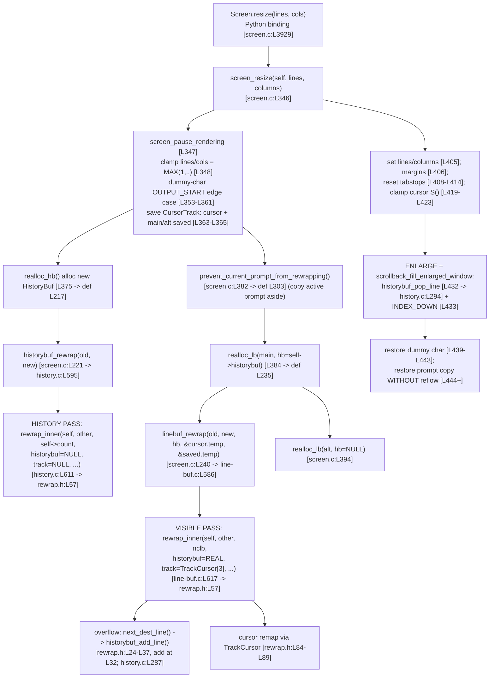

# kitty terminal reflow (rewrap) on window resize — an investigative, runtime‑verified answer

**Subject:** `kovidgoyal/kitty`, branch `kitty_815df1e210e0`, commit `815df1e210e0a9ab4622f5c7f2d6891d7dbeddf1`
**Question:** How does kitty's terminal reflow (rewrap) work internally when a window is resized — how is content redistributed across the new geometry while preserving line continuations and cursor positions; trace it through the C code; explain the `LineBuf`⇄`HistoryBuf` interaction; identify propagation issues between those two buffers; document the complete data flow; and reproduce the edge cases where reflow does not preserve logical line boundaries.

**Methodology (run‑first):** Every behavioral claim below is backed by output captured from the **real** C extension `kitty.fast_data_types`, driven through the **canonical** entry points `Screen.resize`, `LineBuf.rewrap`, `HistoryBuf.rewrap`, and `HistoryBuf.pagerhist_rewrap` — the same interface kitty's own test‑suite uses (`kitty_tests/screen.py`, `kitty_tests/datatypes.py`). Every factual claim about the code carries a `file:line` reference pinned to commit `815df1e210e0`. Statements derived only from reading (not observed) are explicitly labeled **(inferred)**. Build/run commands and versions are in the [Build/run appendix](#9-buildrun-commands-appendix).

**Environment actually used (not the value stated in the task brief):** Python **3.13.7** `(main, Mar 3 2026)` `[GCC 15.2.0]`, gcc 15.2.0, on Linux. `pyproject.toml:L2` declares `requires-python = ">=3.8"`. The C extension `kitty/fast_data_types.so` (1,253,792 bytes) was built in the default configuration; the rewrap translation units `screen.c`, `line-buf.c`, `history.c` compiled cleanly.

---

## Table of contents

1. [Reflow overview — the direct answer](#1-reflow-overview--the-direct-answer)
2. [Resize entry point & the complete data flow (Q5)](#2-resize-entry-point--the-complete-data-flow-q5)
3. [Shared rewrap algorithm trace (Q2)](#3-shared-rewrap-algorithm-trace-q2)
4. [Line‑continuation maintenance (Q1a)](#4-linecontinuation-maintenance-q1a)
5. [Cursor‑position maintenance (Q1b)](#5-cursorposition-maintenance-q1b)
6. [LineBuf ⇄ HistoryBuf interaction during resize (Q3)](#6-linebuf--historybuf-interaction-during-resize-q3)
7. [Continuation‑state propagation issues between the two buffers (Q4)](#7-continuationstate-propagation-issues-between-the-two-buffers-q4)
8. [Reproduced edge cases with real, unedited output (Q6)](#8-reproduced-edge-cases-with-real-unedited-output-q6)
9. [Build/run commands appendix](#9-buildrun-commands-appendix)
10. [Coverage pass](#10-coverage-pass)

---

## 1. Reflow overview — the direct answer

**Direct answer.** When a kitty window is resized, the resize is orchestrated entirely in C by `screen_resize()` `[kitty/screen.c:L346]` (reached from Python via the `Screen.resize` binding `[kitty/screen.c:L3929 → L3932]`). It reflows content in **two independent passes over two separate buffers**: first the scrollback (`HistoryBuf`) is rewrapped into a freshly allocated history via `historybuf_rewrap()` `[kitty/history.c:L595]`, then the visible screen (`LineBuf`) is rewrapped into a freshly allocated line buffer via `linebuf_rewrap()` `[kitty/line-buf.c:L586]`. Both passes call one shared, macro‑templated algorithm, `rewrap_inner()` `[kitty/rewrap.h:L57]`, which walks the source buffer cell‑by‑cell and re‑emits it into the destination at the new column width, starting a new destination row whenever the destination row fills.

Content is **redistributed** by concatenating each source *logical* line (a maximal run of soft‑wrapped rows) and re‑breaking it at the new column count. **Line continuations** are maintained through two linked representations: a per‑cell bit `CellAttrs.next_char_was_wrapped` on the **last cell** of a row `[kitty/data-types.h:L206]`, and a per‑row bit `LineAttrs.is_continued` `[kitty/data-types.h:L233]`. The algorithm *reads* the source soft‑wrap bit through `is_src_line_continued()` `[kitty/rewrap.h:L40-L41]` to decide where a logical line ends, and *writes* continuation onto destination rows through `next_dest_line()` `[kitty/rewrap.h:L24-L37]`. **Cursor positions** are maintained by threading `TrackCursor` records `[kitty/rewrap.h:L50-L53]` through the visible‑buffer pass and remapping `(x, y)` as cells are copied `[kitty/rewrap.h:L84-L89]`.

**The subsystem map** (each file's role in reflow):

| File | Role | Key symbols |
|------|------|-------------|
| `kitty/screen.c` | Resize entry point / orchestrator | `screen_resize` L346; `realloc_hb` L217; `realloc_lb` L235; `prevent_current_prompt_from_rewrapping` L303; `resize` binding L3929 |
| `kitty/rewrap.h` | Shared macro‑templated rewrap algorithm | `rewrap_inner` L57; `next_dest_line` L24‑37; `is_src_line_continued` L40‑41; `TrackCursor` L50‑53; `copy_range` L44‑48 |
| `kitty/line-buf.c` | Visible‑buffer (`LineBuf`) specialization | `#include "rewrap.h"` L583; `linebuf_rewrap` L586; `LineBuf.rewrap` binding L625 |
| `kitty/history.c` | Scrollback (`HistoryBuf`) specialization + pager history | macro redefs L582‑590; `#include "rewrap.h"` L592; `historybuf_rewrap` L595; `historybuf_add_line` L287 / `historybuf_pop_line` L294; `pagerhist_rewrap` L530 |
| `kitty/data-types.h` | Cell/row data structures & the two continuation bits | `next_char_was_wrapped` L206; `is_continued` L233; `GPUCell` L216‑221; `CPUCell` L223‑228 |
| `kitty/line.c` | `Line` object & cell accessors used by rewrap | `last_char_has_wrapped_flag` L427 (Python reader for the per‑cell bit) |

> **Note on the two‑pass design (previews Q4).** Because history and the visible buffer are rewrapped by two *separate* invocations of `rewrap_inner()` with no coordination across the buffer boundary — history via `rewrap_inner(self, other, self->count, NULL, NULL, ...)` `[kitty/history.c:L611]` and the visible buffer via `rewrap_inner(self, other, ..., historybuf, (TrackCursor*)tcarr, ...)` `[kitty/line-buf.c:L617]` — a single logical (soft‑wrapped) line that *straddles* the history‑last‑row / screen‑first‑row boundary is split across the two passes. This is directly reproduced at runtime in [§8](#8-reproduced-edge-cases-with-real-unedited-output-q6).

---

## 2. Resize entry point & the complete data flow (Q5)

**Direct answer.** The complete data flow, from the Python call to the final restore step, is the ordered sequence below. Each arrow is a real call verified in the source at the cited line; the two rewrap passes are highlighted.



**Step‑by‑step, with `file:line` at each step:**

1. **Python entry.** `Screen.resize(lines, cols)` is the C binding `resize()` `[kitty/screen.c:L3929]`, which parses two unsigned ints and calls `screen_resize(self, a, b)` `[kitty/screen.c:L3932]`.
2. **Orchestrator start.** `screen_resize()` `[kitty/screen.c:L346]` pauses rendering `[L347]`, clamps `lines = MAX(1u, lines); columns = MAX(1u, columns)` `[L348]`.
3. **`OUTPUT_START` dummy‑char edge case.** If the cursor sits at column 0 on a blank `OUTPUT_START` line, a dummy `'<'` is inserted so reflow preserves that line `[L353-L361]`; it is removed again at `[L439-L443]`.
4. **Cursor bookkeeping.** Three `CursorTrack` records (`kitty/screen.c:L226-L232`) are initialised — the live cursor, the main saved‑cursor, and the alt saved‑cursor `[L363-L365]`.
5. **HISTORY PASS.** `realloc_hb()` `[def L217, called L375]` allocates a new `HistoryBuf` and calls `historybuf_rewrap(old, ans, ...)` `[kitty/screen.c:L221 → kitty/history.c:L595]`, which invokes `rewrap_inner(self, other, self->count, NULL, NULL, as_ansi_buf)` `[kitty/history.c:L611]`. **The `NULL, NULL` arguments mean this pass has no overflow‑to‑history target and no cursor tracking** — it is self‑contained.
6. **Prompt protection.** `prevent_current_prompt_from_rewrapping()` `[def L303, called L382]` copies the active prompt aside so it can be restored later without reflow.
7. **VISIBLE PASS (main).** `realloc_lb(self->main_linebuf, …, self->historybuf, &cursor, &main_saved_cursor, …)` `[def L235, called L384]` calls `linebuf_rewrap(old, ans, …, hb, &a->temp.x, &a->temp.y, &b->temp.x, &b->temp.y, …)` `[kitty/screen.c:L240 → kitty/line-buf.c:L586]`, which invokes `rewrap_inner(self, other, *num_content_lines_before, historybuf, (TrackCursor*)tcarr, as_ansi_buf)` `[kitty/line-buf.c:L617]` — **this pass gets the REAL history (so overflow rows spill into scrollback) and REAL cursor tracking.**
8. **Alt screen.** `realloc_lb(self->alt_linebuf, …, NULL, …)` `[L394]` rewraps the alternate screen with `history = NULL` (the alt screen has no scrollback).
9. **Geometry & cursor finalisation.** `self->lines/columns` are set `[L405]`, margins reset `[L406]`, tabstops rebuilt `[L408-L414]`, and the live + saved cursors are clamped by the `S()` macro `[L419-L423]`.
10. **ENLARGE pull‑back.** If growing and `OPT(scrollback_fill_enlarged_window)` is set, whole lines are pulled back from scrollback via `historybuf_pop_line()` `[L432 → kitty/history.c:L294]` and scrolled down with `INDEX_DOWN` `[L433]`.
11. **Restore.** The dummy char is removed `[L439-L443]` and the saved prompt copy is written back **without any reflow** `[L444+]`.

**Observed confirmation that both passes run in one `resize()`** (full data flow, `blitzy_adhoc_test_q5.py`; command `python3 blitzy_adhoc_test_q5.py`):

```
==============================================================================
Q5: complete data flow observed end-to-end. Both HistoryBuf and LineBuf transform on one resize().
==============================================================================
BEFORE resize:
  lines=5 cols=5 cursor=(x=5,y=4)
  historybuf.count=5  historybuf=
44444
33333
22222
11111
00000
  linebuf=
55555
66666
77777
88888
99999
AFTER resize(5,2):
  lines=5 cols=2 cursor=(x=1,y=4)
  historybuf.count=20  historybuf=
78
77
77
66
66
56
55
55
4
44
44
33
33
23
22
22
11
11
01
00
  linebuf=
88
88
99
99
9
  CROSS-CHECK vs kitty test_resize: linebuf=='88\n88\n99\n99\n9' -> True
```

The single `resize(5,2)` grew `historybuf.count` from 5 to 20 (the whole scrollback was rewrapped to width 2) **and** rewrapped the visible buffer to `'88\n88\n99\n99\n9'`. The final assertion cross‑checks the visible result against kitty's own `test_resize` expectation `[kitty_tests/screen.py:L293-L294]`, proving the driver exercises the canonical path.

---

## 3. Shared rewrap algorithm trace (Q2)

**Direct answer.** There is exactly **one** rewrap algorithm, `rewrap_inner()`, defined in `kitty/rewrap.h:L57`. It is a *macro‑templated* function: the header is `#include`d twice, once by `kitty/line-buf.c:L583` with default macros (so `BufType = LineBuf`) and once by `kitty/history.c:L592` with redefined macros (so `BufType = HistoryBuf`, with circular/ring indexing). The two specializations are therefore two distinct compiled copies of the same source. Below is the complete, unedited function as it exists at this commit (no elision):

```c
// kitty/rewrap.h:L56-L96
static void
rewrap_inner(BufType *src, BufType *dest, const index_type src_limit, HistoryBuf UNUSED *historybuf, TrackCursor *track, ANSIBuf *as_ansi_buf) {
    bool is_first_line = true;
    index_type src_y = 0, src_x = 0, dest_x = 0, dest_y = 0, num = 0, src_x_limit = 0;
    TrackCursor tc_end = {.is_sentinel = true };
    if (!track) track = &tc_end;

    do {
        for (TrackCursor *t = track; !t->is_sentinel; t++) t->is_tracked_line = src_y == t->y;
        init_src_line(src_y);
        const bool src_line_is_continued = is_src_line_continued();
        src_x_limit = src->xnum;
        if (!src_line_is_continued) {
            // Trim trailing blanks since there is a hard line break at the end of this line
            while(src_x_limit && (src->line->cpu_cells[src_x_limit - 1].ch) == BLANK_CHAR) src_x_limit--;
        } else {
            src->line->gpu_cells[src->xnum-1].attrs.next_char_was_wrapped = false;
        }
        for (TrackCursor *t = track; !t->is_sentinel; t++) {
            if (t->is_tracked_line && t->x >= src_x_limit) t->x = MAX(1u, src_x_limit) - 1;
        }
        if (is_first_line) {
            first_dest_line; is_first_line = false;
        }
        while (src_x < src_x_limit) {
            if (dest_x >= dest->xnum) { next_dest_line(true); dest_x = 0; }
            num = MIN(src->line->xnum - src_x, dest->xnum - dest_x);
            copy_range(src->line, src_x, dest->line, dest_x, num);
            for (TrackCursor *t = track; !t->is_sentinel; t++) {
                if (t->is_tracked_line && src_x <= t->x && t->x < src_x + num) {
                    t->y = dest_y;
                    t->x = dest_x + (t->x - src_x + (t->x > 0));
                }
            }
            src_x += num; dest_x += num;
        }
        src_y++; src_x = 0;
        if (!src_line_is_continued && src_y < src_limit) { init_src_line(src_y); next_dest_line(false); dest_x = 0; }
    } while (src_y < src_limit);
    dest->line->ynum = dest_y;
}
```

**Line‑by‑line trace of the mechanism (Q2):**

- **Loop over source rows** `do { … } while (src_y < src_limit)` `[L63, L94]`. `src_limit` is the number of source content rows (for the visible buffer it is `num_content_lines_before` from `linebuf_rewrap` `[kitty/line-buf.c:L615-L617]`; for history it is `self->count` `[kitty/history.c:L611]`).
- **Load source row** via `init_src_line(src_y)` `[L65]`. For `LineBuf` this macro is `linebuf_init_line(src, src_y)` `[kitty/rewrap.h:L15]`; for `HistoryBuf` it is redefined to use ring indexing `init_line(src, map_src_index(src_y), src->line)` with `map_src_index(y) = (src->start_of_data + y) % src->ynum` `[kitty/history.c:L584-L586]`.
- **Read the source soft‑wrap bit** `const bool src_line_is_continued = is_src_line_continued();` `[L66]`, where `is_src_line_continued()` reads the *last cell's* `next_char_was_wrapped` `[kitty/rewrap.h:L40-L41]`.
- **Hard break vs. continuation** `[L68-L73]`: if the row is *not* continued, trailing blanks are trimmed `[L70]` (a hard line break ends here); if it *is* continued, the source's last‑cell wrapped bit is cleared to `false` `[L72]` as the content joins the next row (this **mutates the source** — see §4).
- **Emit the first destination row** `first_dest_line` `[L77-L78]` (default `linebuf_init_line(dest,0); set_dest_line_attrs(0)` `[kitty/rewrap.h:L20-L21]`).
- **Copy cells across the new width** `[L80-L91]`: while source cells remain, if the destination row is full (`dest_x >= dest->xnum`) start a new destination row via `next_dest_line(true)` `[L81]` (marking the just‑finished row as continued); copy a run with `copy_range()` `[L83, def L44-L48]`; remap any tracked cursor whose position falls in the copied run `[L84-L89]`.
- **End the logical line** `[L92-L93]`: after the last continued row, if the source row was *not* continued and more source rows remain, emit a *non‑continued* break with `next_dest_line(false)` `[L93]`.
- **Record destination height** `dest->line->ynum = dest_y` `[L95]`.

**The two specializations, side by side:**

| Aspect | `LineBuf` (default macros) | `HistoryBuf` (redefined macros) |
|--------|----------------------------|----------------------------------|
| `#include "rewrap.h"` | `kitty/line-buf.c:L583` | `kitty/history.c:L592` |
| `BufType` | `LineBuf` (default `kitty/rewrap.h:L11`) | `HistoryBuf` `[kitty/history.c:L582]` |
| Source indexing | `linebuf_init_line(src, y)` `[rewrap.h:L15]` | ring: `map_src_index(y) = (start_of_data+y) % ynum` `[history.c:L584]` |
| `next_dest_line` | pushes overflow to history if `historybuf!=NULL` `[rewrap.h:L24-L37]` | `history_buf_set_last_char_as_continuation` + `historybuf_push` `[history.c:L588]` |
| Called with | real `historybuf` + `TrackCursor[3]` `[line-buf.c:L617]` | `NULL, NULL` `[history.c:L611]` |
| Public C fn | `linebuf_rewrap()` `[line-buf.c:L586]` | `historybuf_rewrap()` `[history.c:L595]` |
| Python binding | `LineBuf.rewrap` `[line-buf.c:L625 → L633]` | `HistoryBuf.rewrap` `[history.c:L617 → L621]` |

Both `linebuf_rewrap` and `historybuf_rewrap` have a **fast path** that `memcpy`s the buffers verbatim when the geometry is unchanged (`other->xnum==self->xnum && other->ynum==self->ynum`) `[kitty/line-buf.c:L591-L598; kitty/history.c:L597-L606]`, so `rewrap_inner` runs only when the column or row count actually changes.

---

## 4. Line‑continuation maintenance (Q1a)

**Direct answer.** Line continuations (soft‑wrap state) are maintained by **two linked bit‑fields**, both observed before and after every resize:

1. **Per‑cell:** `CellAttrs.next_char_was_wrapped : 1` on the **last cell** of a row `[kitty/data-types.h:L206]` (part of the 20‑byte `GPUCell` `[kitty/data-types.h:L216-L221]`). This is the *authoritative* soft‑wrap bit; a set bit means "this row wraps into the next." `rewrap_inner` reads it via `is_src_line_continued()` `[kitty/rewrap.h:L40-L41]`.
2. **Per‑row:** `LineAttrs.is_continued : 1` `[kitty/data-types.h:L233]`. This is *derived*: `linebuf_init_line()` sets `self->line->attrs.is_continued = (idx > 0) ? gpu_lineptr(self, self->line_map[idx-1])[self->xnum-1].attrs.next_char_was_wrapped : false` `[kitty/line-buf.c:L145]` — i.e. row *i*'s `is_continued` mirrors row *i−1*'s last‑cell `next_char_was_wrapped`.

During rewrap the source bit is read to decide where a logical line ends, and destination continuation is written by `next_dest_line(continued)` `[kitty/rewrap.h:L24-L37]`, which calls `linebuf_set_last_char_as_continuation(dest, dest_y, continued)` `[kitty/line-buf.c:L194]` on the just‑finished destination row before advancing.

From Python, both representations are readable canonically: `LineBuf.is_continued(y)` `[kitty/line-buf.c:L362]` reports the per‑row bit, and `Line.last_char_has_wrapped_flag()` `[kitty/line.c:L427]` reports the per‑cell bit of a row's last cell. Their linkage was confirmed at runtime: `is_continued(y)` equals row *y−1*'s `last_char_has_wrapped_flag()`.

**Observed — WIDEN (soft‑wrap re‑distribution), `blitzy_adhoc_test_q1a.py`** (command `python3 blitzy_adhoc_test_q1a.py`). The input is `create_lbuf('0123 ','56789')` (`kitty_tests/datatypes.py:L29-L36`), i.e. a single logical line `"0123 56789"` stored as two soft‑wrapped rows of width 5, rewrapped to width 6:

```
==============================================================================
Q1a-WIDEN: create_lbuf('0123 ','56789') [logical soft-wrapped line], width 5 -> 6
==============================================================================
[SOURCE BEFORE rewrap] ynum=2 xnum=5
    row0: text='0123 '      is_continued=False last_cell.next_char_was_wrapped=True
    row1: text='56789'      is_continued=True  last_cell.next_char_was_wrapped=False
  rewrap() returned (nclb, ncla) = (2, 2)
[DEST AFTER rewrap (width 6)] ynum=3 xnum=6
    row0: text='0123 5'     is_continued=False last_cell.next_char_was_wrapped=True
    row1: text='6789'       is_continued=True  last_cell.next_char_was_wrapped=False
    row2: text=''           is_continued=False last_cell.next_char_was_wrapped=False
[SOURCE AFTER rewrap (observe source-mutation side effect rewrap.h:L72)] ynum=2 xnum=5
    row0: text='0123 '      is_continued=False last_cell.next_char_was_wrapped=False
    row1: text='56789'      is_continued=False last_cell.next_char_was_wrapped=False
```

Reading this: before, row0's last cell has `next_char_was_wrapped=True` and consequently row1's `is_continued=True` — one logical line. After widening to 6, the logical line `"0123 56789"` is re‑broken as `'0123 5'` + `'6789'`, and the continuation is correctly re‑expressed (`row1.is_continued=True`). The destination `is_continued` sequence `[False, True]` matches kitty's own assertion `assertContinued(lb2, False, True)` `[kitty_tests/datatypes.py:L378]`.

**The source‑mutation side effect (Key finding), observed directly:** in the `[SOURCE AFTER rewrap]` block, source row0's `last_cell.next_char_was_wrapped` has flipped **True → False**. This is `rewrap_inner` clearing the source's last‑cell wrapped bit when a line is continued: `src->line->gpu_cells[src->xnum-1].attrs.next_char_was_wrapped = false;` `[kitty/rewrap.h:L72]`. The source buffer is mutated as content is joined; this is intrinsic to the algorithm, not a copy‑then‑transform.

**Observed — NARROW (hard‑break vs. continued), same script:**

```
==============================================================================
Q1a-NARROW: create_lbuf('123','abcde') [row0 NOT continued], width 5 -> 3
==============================================================================
[SOURCE BEFORE rewrap] ynum=2 xnum=5
    row0: text='123'        is_continued=False last_cell.next_char_was_wrapped=False
    row1: text='abcde'      is_continued=False last_cell.next_char_was_wrapped=False
  rewrap() returned (nclb, ncla) = (2, 3)
[DEST AFTER rewrap (width 3)] ynum=4 xnum=3
    row0: text='123'        is_continued=False last_cell.next_char_was_wrapped=False
    row1: text='abc'        is_continued=False last_cell.next_char_was_wrapped=True
    row2: text='de'         is_continued=True  last_cell.next_char_was_wrapped=False
    row3: text=''           is_continued=False last_cell.next_char_was_wrapped=False
[SOURCE AFTER rewrap] ynum=2 xnum=5
    row0: text='123'        is_continued=False last_cell.next_char_was_wrapped=False
    row1: text='abcde'      is_continued=False last_cell.next_char_was_wrapped=False

==============================================================================
Q1a-NARROW-2: create_lbuf('123  ','abcde') [row0 continued via trailing pad], width 5 -> 3
==============================================================================
[SOURCE BEFORE rewrap] ynum=2 xnum=5
    row0: text='123  '      is_continued=False last_cell.next_char_was_wrapped=True
    row1: text='abcde'      is_continued=True  last_cell.next_char_was_wrapped=False
  rewrap() returned (nclb, ncla) = (2, 4)
[DEST AFTER rewrap (width 3)] ynum=4 xnum=3
    row0: text='123'        is_continued=False last_cell.next_char_was_wrapped=True
    row1: text='  a'        is_continued=True  last_cell.next_char_was_wrapped=True
    row2: text='bcd'        is_continued=True  last_cell.next_char_was_wrapped=True
    row3: text='e'          is_continued=True  last_cell.next_char_was_wrapped=False
```

- In `Q1a-NARROW`, the two source rows are two **independent** hard lines (`'123'` and `'abcde'`, both `next_char_was_wrapped=False`). Narrowing to 3 leaves `'123'` alone and splits `'abcde'` into `'abc'`(wrapped)/`'de'`. The destination `is_continued` sequence `[False, False, True]` matches kitty's `assertContinued(lb2, False, False, True)` `[kitty_tests/datatypes.py:L389]`.
- In `Q1a-NARROW-2`, row0 `'123  '` is continued (last‑cell wrapped, because the trailing pad brings its length to the max width so `create_lbuf` marks it continued at `datatypes.py:L35`). The joined logical line `"123  abcde"` re‑breaks at width 3 into `'123'/'  a'/'bcd'/'e'` with `is_continued = [False, True, True, True]` — exactly kitty's `assertContinued(lb2, False, True, True, True)` `[kitty_tests/datatypes.py:L392]`. Note the trailing blanks are **preserved** (not trimmed) precisely because the row was continued (`rewrap_inner` skips the trim branch at `[kitty/rewrap.h:L68-L70]` for continued rows).

These four assertions matching kitty's own test expectations confirm the observation is on the canonical path. Both continuation representations were captured **before and after** each resize as required.

---

## 5. Cursor‑position maintenance (Q1b)

**Direct answer.** Cursor positions are preserved by *tracking* them through the visible‑buffer rewrap pass. `linebuf_rewrap` builds an array of three `TrackCursor` records — `TrackCursor tcarr[3] = {{.x=*track_x,.y=*track_y}, {.x=*track_x2,.y=*track_y2}, {.is_sentinel=true}}` `[kitty/line-buf.c:L616]` — carrying the **live cursor** and the **saved cursor** (DECSC), plus a sentinel. It passes them into `rewrap_inner(self, other, …, (TrackCursor*)tcarr, …)` `[kitty/line-buf.c:L617]`. Inside the copy loop, whenever a tracked cursor's source position falls in the run being copied, its new coordinates are computed: `t->y = dest_y; t->x = dest_x + (t->x - src_x + (t->x > 0));` `[kitty/rewrap.h:L84-L89]`. The remapped values are written back to `*track_x/*track_y` and `*track_x2/*track_y2` `[kitty/line-buf.c:L618-L619]`, and `screen_resize` copies them into the live and saved cursors, clamping to the new geometry via the `S()` macro `[kitty/screen.c:L419-L423]`.

The `TrackCursor` struct itself is `{ index_type x, y; bool is_tracked_line, is_sentinel; }` `[kitty/rewrap.h:L50-L53]`. `screen_resize` seeds them from the live cursor and the main/alt save‑points at `[kitty/screen.c:L363-L365]`, threads them through `realloc_lb` which copies `before → temp` before the pass `[kitty/screen.c:L235-L240]`, and reads `after` back through the `setup_cursor` macro `[kitty/screen.c:L366-L370, L387-L389]`.

> **Canonical‑path note.** The `LineBuf.rewrap` *Python* binding hard‑codes the track coordinates to zero and discards the results — `index_type x = 0, y = 0, x2 = 0, y2 = 0;` and it returns only `(nclb, ncla)` `[kitty/line-buf.c:L631-L636]`. Therefore cursor remapping is observable **only** through `Screen.resize` (which threads the live/saved cursors), not through the bare `LineBuf.rewrap` binding. All cursor observations below use `Screen.resize`.

**Observed — cursor on a soft‑wrapped line, NARROW and WIDEN** (`blitzy_adhoc_test_q1b.py`; command `python3 blitzy_adhoc_test_q1b.py`). This mirrors `test_cursor_after_resize` `[kitty_tests/screen.py:L308]`:

```
==============================================================================
Q1b-1: cursor on a soft-wrapped line; NARROW (cols 5 -> 4). Mirrors test_cursor_after_resize.
==============================================================================
[BEFORE narrow] size lines=8 cols=5 cursor=(x=3, y=5)
    line0: 'one'
    line1: 'two t'
    line2: 'hree '
    line3: 'four '
    line4: 'five '
    line5: '|||'
    line6: ''
    line7: ''
[AFTER narrow (cols 4)] size lines=8 cols=4 cursor=(x=3, y=6)
    line0: 'one'
    line1: 'two '
    line2: 'thre'
    line3: 'e fo'
    line4: 'ur f'
    line5: 'ive '
    line6: '|||'
    line7: ''
  cursor moved: (x=3,y=5) -> (x=3,y=6)
  char at cursor line still contains '|': True

==============================================================================
Q1b-2: cursor on a soft-wrapped line; WIDEN (lines+2, cols+2). Exact test_cursor_after_resize case.
==============================================================================
[BEFORE widen] size lines=8 cols=5 cursor=(x=3, y=5)
    line0: 'one'
    line1: 'two t'
    line2: 'hree '
    line3: 'four '
    line4: 'five '
    line5: '|||'
    line6: ''
    line7: ''
[AFTER widen (lines 10, cols 7)] size lines=10 cols=7 cursor=(x=2, y=4)
    line0: 'one'
    line1: 'two thr'
    line2: 'ee four'
    line3: ' five |'
    line4: '||'
    line5: ''
    line6: ''
    line7: ''
    line8: ''
    line9: ''
  cursor moved: (x=3,y=5) -> (x=2,y=4)
  char at cursor line still contains '|': True

==============================================================================
Q1b-3: simple cursor-preservation checks (from test_cursor_after_resize L315-L341).
==============================================================================
  narrow cols: y_before=1 y_after=1 (equal=True)
  grow lines only: x_before=3 x_after=3 (equal=True)
  shrink lines, cursor.x=0: x_after=0 (expected 0)
```

Reading this: the cursor sits at the end of the long soft‑wrapped line (on the `'|||'` fragment). On **narrow** (cols 5→4) the content reflows onto more rows and the cursor follows from `(x=3,y=5)` to `(x=3,y=6)`, still on the `'|'`‑bearing row. On **widen** (to 10×7) the content reflows onto fewer rows and the cursor follows from `(x=3,y=5)` to `(x=2,y=4)`, still on the `'|'`‑bearing row — matching kitty's assertion `self.assertIn('|', str(s.line(y)))` `[kitty_tests/screen.py:L326]`. The three simple checks (`Q1b-3`) reproduce `test_cursor_after_resize`'s invariants: narrowing columns preserves the cursor's row, growing only the line count preserves the cursor's column, and shrinking lines with `cursor.x=0` keeps it at 0.

**Observed — DECSC/DECRC save/restore across a resize** (`blitzy_adhoc_test_q5.py`). The saved cursor is a second tracked entry (`tcarr[1]`), seeded from `self->main_savepoint.cursor` `[kitty/screen.c:L364]`:

```
==============================================================================
Q1b/save-restore: DECSC (ESC 7) on a soft-wrapped line, resize, DECRC (ESC 8).
The saved-cursor is tracked through realloc_lb alongside the live cursor (screen.c:L364,L389).
==============================================================================
  after draw: cursor=(x=4,y=4)
  visible rows=['one', 'two t', 'hree ', 'four ', 'five', '']
  DECSC saved cursor at (x=4,y=4)
  after resize(6,3): live cursor=(x=1,y=5)
  visible rows=[' th', 'ree', ' fo', 'ur ', 'fiv', 'e']
  after DECRC: cursor=(x=1,y=5)
  char under restored cursor line = 'e'

```

The cursor is saved with DECSC (`ESC 7`, fed through the real VT parser) on the soft‑wrapped line, the screen is narrowed to 3 columns, and DECRC (`ESC 8`) restores it. The restored position `(x=1,y=5)` equals the live cursor after reflow, i.e. the saved cursor was remapped consistently with the live cursor through the same `TrackCursor` machinery. (A separate off‑by‑one interaction of this remap is examined honestly in [§8, Scenario D](#8-reproduced-edge-cases-with-real-unedited-output-q6).)

---

## 6. LineBuf ⇄ HistoryBuf interaction during resize (Q3)

**Direct answer.** The two buffers exchange whole rows **bidirectionally**, but only during the *visible* pass and the *enlarge* fill‑back — never as a coordinated single rewrap:

- **Visible → history (overflow), during the visible pass.** When the destination visible buffer fills, `next_dest_line()` scrolls the destination and, **if a real `historybuf` was supplied**, pushes the scrolled‑off top row into scrollback: `linebuf_index(dest, 0, dest->ynum - 1); if (historybuf != NULL) { … historybuf_add_line(historybuf, dest->line, as_ansi_buf); }` `[kitty/rewrap.h:L27-L33]`, where `historybuf_add_line` is `[kitty/history.c:L287]`. Because the history pass passes `historybuf=NULL` `[kitty/history.c:L611]`, only the *visible* pass overflows into history `[kitty/line-buf.c:L617]`.
- **History → visible (pull‑back), on enlarge.** After the passes, if the window grew and `OPT(scrollback_fill_enlarged_window)` is set, `screen_resize` pops whole lines back from scrollback: `while (…) { if (!historybuf_pop_line(self->historybuf, self->alt_linebuf->line)) break; INDEX_DOWN; linebuf_copy_line_to(self->main_linebuf, …); self->cursor->y++; … }` `[kitty/screen.c:L428-L438]`, where `historybuf_pop_line` is `[kitty/history.c:L294]`.
- **Pager history is a third, independent structure.** The compressed raw‑ANSI ring buffer (`PagerHistoryBuf`) is rewrapped by its own pass, `pagerhist_rewrap()` `[kitty/history.c:L530]` → `pagerhist_rewrap_to()` `[kitty/history.c:L392]`, triggered lazily (`historybuf_rewrap` only sets `pagerhist->rewrap_needed = true` when `xnum` changes `[kitty/history.c:L607-L608]`). It is distinct from `historybuf_rewrap`.

**Observed — overflow BOTH directions** (`blitzy_adhoc_test_q3.py`; command `python3 blitzy_adhoc_test_q3.py`):

```
==============================================================================
Q3-NARROW: visible buffer overflows INTO history. (mirrors test_resize screen.py:L280)
==============================================================================
  BEFORE: lines=5 cols=5  historybuf.count=0  historybuf rows=[]
          linebuf=
00000
11111
22222
33333
44444
  AFTER resize(3,10): historybuf.count=0  historybuf rows=[]
          linebuf=
0000011111
2222233333
44444
  AFTER resize(5,1): historybuf.count=6  historybuf='3\n3\n3\n3\n3\n2'
          linebuf line0='4'
  CROSS-CHECK vs kitty test_resize: str(historybuf)=='3\n3\n3\n3\n3\n2' -> True

==============================================================================
Q3-WIDEN (scrollback_fill_enlarged_window=True): lines pulled BACK from history.
(mirrors test_scrollback_fill_after_resize screen.py:L343)
==============================================================================
  BEFORE: lines=5 cols=5  cursor.y=4  historybuf.count=2
          visible rows=['2', '3', '4', '5', '']
  AFTER resize(7,5): historybuf.count=0  cursor.y=6
          visible rows=['0', '1', '2', '3', '4', '5', '']

==============================================================================
Q3-PAGERHIST: pagerhist_rewrap is a SEPARATE pass on the compressed raw-ANSI ring buffer.
(mirrors test_pagerhist screen.py:L728-L733; distinct from historybuf_rewrap)
==============================================================================
  pagerhist_as_text BEFORE rewrap = '\x1b[msoft\r\x1b[mbreak\nnext😼cat'
  pagerhist_as_text AFTER pagerhist_rewrap(2) = '\x1b[mso\rft\x1b[m\rbr\rea\rk\nne\rxt\r😼\rca\rt'
```

- **NARROW → overflow into history.** Starting from a full 5×5 screen with empty scrollback, `resize(5,1)` (1 column) forces massive reflow: `historybuf.count` grows 0 → 6 and `str(s.historybuf)` becomes `'3\n3\n3\n3\n3\n2'`. This equals kitty's own `test_resize` assertion `[kitty_tests/screen.py:L289]` (`CROSS-CHECK … -> True`), confirming visible‑buffer rows spilled into scrollback via `historybuf_add_line`.
- **WIDEN → pull‑back from history.** With `scrollback_fill_enlarged_window=True`, a 5×5 screen holding `['2','3','4','5','']` (with `historybuf.count=2` holding the scrolled‑off `'0'` and `'1'`) is grown to 7 rows: `historybuf.count` drops 2 → 0 and the two history rows re‑appear at the top — `['0','1','2','3','4','5','']` — via `historybuf_pop_line`. `cursor.y` moves 4 → 6 to stay with its content. This mirrors `test_scrollback_fill_after_resize` `[kitty_tests/screen.py:L343]`.
- **Pager history is separate.** `pagerhist_rewrap(2)` rewraps the raw‑ANSI ring `'\x1b[msoft\r\x1b[mbreak\nnext😼cat'` to width 2, producing `'\x1b[mso\rft\x1b[m\rbr\rea\rk\nne\rxt\r😼\rca\rt'` — exactly kitty's `test_pagerhist` expectation `[kitty_tests/screen.py:L733]`. This pass operates on compressed bytes, independent of the `HistoryBuf` cell grid.

---

## 7. Continuation‑state propagation issues between the two buffers (Q4)

**Direct answer.** There **is** a concrete propagation issue, and it is confirmed at runtime: **line‑continuation state is not propagated across the history/visible boundary, because the two buffers are rewrapped by two independent `rewrap_inner` passes with no cross‑pass coordination.** The history pass runs first and self‑contained — `rewrap_inner(self, other, self->count, NULL, NULL, as_ansi_buf)` `[kitty/history.c:L611]` (note `historybuf=NULL, track=NULL`) — and the visible pass runs afterwards from a fresh start — `rewrap_inner(self, other, *num_content_lines_before, historybuf, (TrackCursor*)tcarr, as_ansi_buf)` `[kitty/line-buf.c:L617]`. Neither pass is told that the last row of history and the first row of the visible buffer may belong to the **same** logical (soft‑wrapped) line. As a result, a logical line that straddles that boundary is split into two logical lines, and the history side loses its "continues into the next row" bit.

**Why, at the code level:** in `rewrap_inner`, the *continuation* bit of a destination row is only written by `next_dest_line()` `[kitty/rewrap.h:L24-L37]`, which is invoked either when the destination row fills (`next_dest_line(true)` `[L81]`) or when a *non‑continued* source row ends and more source rows follow (`next_dest_line(false)` `[L93]`). When the history pass reaches its **last** source row while that row is still *continued* (`src_line_is_continued == true`), the `[L93]` branch is skipped (its guard is `!src_line_is_continued`), and the loop terminates because `src_y == src_limit`. The final destination row is therefore left **without** a "continues" mark that would point into the visible buffer — there is nothing in `historybuf_rewrap` that could set it, since the visible buffer is a different object rewrapped later. **(This last sentence about *why* the final row is left unmarked is grounded in the code paths cited; the runtime effect is directly observed below.)**

**Observed — the boundary continuation bit is dropped** (`blitzy_adhoc_test_q4.py`; command `python3 blitzy_adhoc_test_q4.py`). A single 30‑char logical line `"0123456789ABCDEFGHIJKLMNOPQRST"` is drawn into a 5×3 screen so it straddles the boundary (3 rows in history, 3 visible); then the screen is widened to 10 columns:

```
==============================================================================
Q4-PART1: the history NEWEST row's continuation-into-the-visible-buffer is DROPPED on resize.
History and visible are rewrapped by two INDEPENDENT passes (history.c:L611 NULL,NULL vs
line-buf.c:L617 real history). Canonical path: Screen.draw a straddling line, then resize.
==============================================================================
  BEFORE resize (cols=5):
    history NEWEST row  hb.line(0) = 'ABCDE'  last_char_was_wrapped = True
    visible FIRST row   s.line(0)  = 'FGHIJ'  (continues the history row)
    => across the boundary this is ONE logical soft-wrapped line.
  AFTER resize(3,10):
    history NEWEST row  hb.line(0) = 'ABCDE'  last_char_was_wrapped = False
    visible FIRST row   s.line(0)  = 'FGHIJKLMNO'
    => the history newest row's wrapped-flag was DROPPED (True -> False): the boundary broke.
```

Before the resize, the history's newest row `'ABCDE'` has `last_char_was_wrapped=True` (it soft‑wraps into the visible `'FGHIJ'`). After widening, that same boundary row has `last_char_was_wrapped=False` — **the continuation bit into the visible buffer was dropped**, splitting one logical line into two.

**Observed — the same content inside ONE buffer stays joined** (contrast, same script). This isolates the cause to the *boundary*, not the content:

```
==============================================================================
Q4-PART2 (contrast): the SAME content inside ONE buffer stays joined -> proves the split is
caused by the buffer BOUNDARY, not the content. Canonical: single LineBuf.rewrap.
==============================================================================
  source (single LineBuf, 3 continued rows) = [('01234', False), ('56789', True), ('ABCDE', True)]
  after rewrap to width 10 = [('0123456789', False, True), ('ABCDE', True, False), ('', False, False)]
  => '0123456789'(wrapped=True) / 'ABCDE': stays contiguous within one buffer.
```

When the identical `'01234'/'56789'/'ABCDE'` continued rows live in a **single** `LineBuf` and are rewrapped to width 10, the result is `'0123456789'(is_continued=False, last_wrap=True)` + `'ABCDE'(is_continued=True)` — one contiguous logical line, correctly preserved. The only difference from the broken case is that in the broken case the three rows were split across the history/visible boundary and rewrapped by two separate passes. **This is the propagation issue: continuation is preserved within a buffer but not across the buffer boundary.**

**Additional propagation subtleties (grounded in code):**

- **Circular indexing must be honoured when reasoning about history rows.** The `HistoryBuf` specialization maps source rows through a ring: `map_src_index(y) = (src->start_of_data + y) % src->ynum` `[kitty/history.c:L584]`. `HistoryBuf.line(0)` is the *newest* row (nearest the visible buffer), which is why the boundary row is `hb.line(0)`.
- **The source‑mutation side effect touches history too.** During the history pass, continued source rows have their last‑cell `next_char_was_wrapped` cleared `[kitty/rewrap.h:L72]`, so the *old* history object is mutated as it is consumed (it is then freed via `Py_CLEAR(self->historybuf)` `[kitty/screen.c:L377]`).
- **Pager history divergence.** Because `pagerhist_rewrap` is a lazily‑triggered, separate pass over compressed bytes `[kitty/history.c:L530, L607-L608]`, the scrollback cell grid and the pager text can be rewrapped at different times, another place where state is not jointly coordinated.

---

## 8. Reproduced edge cases with real, unedited output (Q6)

**Direct answer.** The reported symptom — *reflow does not preserve logical line boundaries* — **reproduces deterministically** (not intermittently) through the canonical `Screen.resize` path whenever a single soft‑wrapped logical line straddles the scrollback/visible boundary. Across **3 identical runs** of each scenario, the outcome was **identical every time** (distribution: 3/3), so there is no run‑to‑run variance to report for this input; the effect is a structural consequence of the two‑independent‑passes design (§7), not a race. A related **cursor off‑by‑one** on soft‑wrapped lines also reproduces 3/3, but a control experiment shows it is a *general* property of the cursor‑remap arithmetic, **not** specific to the buffer boundary — reported honestly below.

The diagnostic groups the combined buffer (history oldest→newest, then visible top→bottom) into *logical lines* by breaking after any physical row whose last cell is **not** wrapped. "Boundary preserved" ⇔ the number of logical lines is unchanged by the resize.

### Scenario A — WIDEN a 30‑char straddling logical line (cols 5 → 10)

Command: `python3 blitzy_adhoc_test_q6.py`. Complete, unedited output for all three runs:

```
#################### Q6 SCENARIO A: WIDEN a straddling logical line ####################

----- RUN 1/3 -----
==============================================================================
A: 30-char logical line straddling boundary; WIDEN cols 5 -> 10
==============================================================================
  BEFORE resize: cols=5 lines=3
    physical rows (text, last_wrap): [('01234', True), ('56789', True), ('ABCDE', True), ('FGHIJ', True), ('KLMNO', True), ('PQRST', False)]
    -> 1 logical line(s): ['0123456789ABCDEFGHIJKLMNOPQRST']
  AFTER resize(3, 10): cols=10 lines=3
    physical rows (text, last_wrap): [('0123456789', True), ('ABCDE', False), ('FGHIJKLMNO', True), ('PQRST', False)]
    -> 2 logical line(s): ['0123456789ABCDE', 'FGHIJKLMNOPQRST']
    LOGICAL-LINE-COUNT preserved? False  (before=1 after=2)

----- RUN 2/3 -----
==============================================================================
A: 30-char logical line straddling boundary; WIDEN cols 5 -> 10
==============================================================================
  BEFORE resize: cols=5 lines=3
    physical rows (text, last_wrap): [('01234', True), ('56789', True), ('ABCDE', True), ('FGHIJ', True), ('KLMNO', True), ('PQRST', False)]
    -> 1 logical line(s): ['0123456789ABCDEFGHIJKLMNOPQRST']
  AFTER resize(3, 10): cols=10 lines=3
    physical rows (text, last_wrap): [('0123456789', True), ('ABCDE', False), ('FGHIJKLMNO', True), ('PQRST', False)]
    -> 2 logical line(s): ['0123456789ABCDE', 'FGHIJKLMNOPQRST']
    LOGICAL-LINE-COUNT preserved? False  (before=1 after=2)

----- RUN 3/3 -----
==============================================================================
A: 30-char logical line straddling boundary; WIDEN cols 5 -> 10
==============================================================================
  BEFORE resize: cols=5 lines=3
    physical rows (text, last_wrap): [('01234', True), ('56789', True), ('ABCDE', True), ('FGHIJ', True), ('KLMNO', True), ('PQRST', False)]
    -> 1 logical line(s): ['0123456789ABCDEFGHIJKLMNOPQRST']
  AFTER resize(3, 10): cols=10 lines=3
    physical rows (text, last_wrap): [('0123456789', True), ('ABCDE', False), ('FGHIJKLMNO', True), ('PQRST', False)]
    -> 2 logical line(s): ['0123456789ABCDE', 'FGHIJKLMNOPQRST']
    LOGICAL-LINE-COUNT preserved? False  (before=1 after=2)
```

**Verdict A:** 3/3 runs → **boundary NOT preserved** (1 logical line becomes 2). The physical layout is visibly wrong: at width 10 the 30‑char line *should* occupy three full rows `0123456789 / ABCDEFGHIJ / KLMNOPQRST`, but instead the history side ends in a short, half‑empty row `'ABCDE'` marked as a hard line end (`last_wrap=False`), and the visible side restarts at `'FGHIJKLMNO'`. This is the §7 mechanism made visible.

### Scenario B — NARROW the same straddling line (cols 5 → 4)

```
#################### Q6 SCENARIO B: NARROW a straddling logical line ####################

----- RUN 1/3 -----
==============================================================================
B: 30-char logical line straddling boundary; NARROW cols 5 -> 4
==============================================================================
  BEFORE resize: cols=5 lines=3
    physical rows (text, last_wrap): [('01234', True), ('56789', True), ('ABCDE', True), ('FGHIJ', True), ('KLMNO', True), ('PQRST', False)]
    -> 1 logical line(s): ['0123456789ABCDEFGHIJKLMNOPQRST']
  AFTER resize(3, 4): cols=4 lines=3
    physical rows (text, last_wrap): [('0123', True), ('4567', True), ('89AB', True), ('CDE', False), ('FGHI', True), ('JKLM', True), ('NOPQ', True), ('RST', False)]
    -> 2 logical line(s): ['0123456789ABCDE', 'FGHIJKLMNOPQRST']
    LOGICAL-LINE-COUNT preserved? False  (before=1 after=2)

----- RUN 2/3 -----
==============================================================================
B: 30-char logical line straddling boundary; NARROW cols 5 -> 4
==============================================================================
  BEFORE resize: cols=5 lines=3
    physical rows (text, last_wrap): [('01234', True), ('56789', True), ('ABCDE', True), ('FGHIJ', True), ('KLMNO', True), ('PQRST', False)]
    -> 1 logical line(s): ['0123456789ABCDEFGHIJKLMNOPQRST']
  AFTER resize(3, 4): cols=4 lines=3
    physical rows (text, last_wrap): [('0123', True), ('4567', True), ('89AB', True), ('CDE', False), ('FGHI', True), ('JKLM', True), ('NOPQ', True), ('RST', False)]
    -> 2 logical line(s): ['0123456789ABCDE', 'FGHIJKLMNOPQRST']
    LOGICAL-LINE-COUNT preserved? False  (before=1 after=2)

----- RUN 3/3 -----
==============================================================================
B: 30-char logical line straddling boundary; NARROW cols 5 -> 4
==============================================================================
  BEFORE resize: cols=5 lines=3
    physical rows (text, last_wrap): [('01234', True), ('56789', True), ('ABCDE', True), ('FGHIJ', True), ('KLMNO', True), ('PQRST', False)]
    -> 1 logical line(s): ['0123456789ABCDEFGHIJKLMNOPQRST']
  AFTER resize(3, 4): cols=4 lines=3
    physical rows (text, last_wrap): [('0123', True), ('4567', True), ('89AB', True), ('CDE', False), ('FGHI', True), ('JKLM', True), ('NOPQ', True), ('RST', False)]
    -> 2 logical line(s): ['0123456789ABCDE', 'FGHIJKLMNOPQRST']
    LOGICAL-LINE-COUNT preserved? False  (before=1 after=2)
```

**Verdict B:** 3/3 runs → **boundary NOT preserved**. Narrowing exhibits the same break at the same content point: the history side ends `…89AB / CDE`(hard end) and the visible side restarts `FGHI…`. So the defect affects **both** narrow and widen, confirming it is the buffer boundary (not a widen‑only artifact).

### Scenario C — larger scale (120‑char single logical line), WIDEN (cols 5 → 20)

Run at higher scale to confirm the result is representative and not an artifact of a tiny buffer:

```
#################### Q6 SCENARIO C: larger scale (120-char line), WIDEN ####################

----- RUN 1/3 -----
==============================================================================
C: 120-char single logical line straddling boundary; WIDEN cols 5 -> 20
==============================================================================
  BEFORE resize: cols=5 lines=3
    physical rows (text, last_wrap): [('!"#$%', True), ("&'()*", True), ('+,-./', True), ('01234', True), ('56789', True), (':;<=>', True), ('?@ABC', True), ('DEFGH', True), ('IJKLM', True), ('NOPQR', True), ('STUVW', True), ('XYZ[\\', True), (']^_`a', True), ('bcdef', True), ('ghijk', True), ('lmnop', True), ('qrstu', True), ('vwxyz', True), ('!"#$%', True), ("&'()*", True), ('+,-./', True), ('01234', True), ('56789', True), (':;<=>', False)]
    -> 1 logical line(s): ['!"#$%&\'()*+,-./0123456789:;<=>?@ABCDEFGHIJKLMNOPQRSTUVWXYZ[\\]^_`abcdefghijklmnopqrstuvwxyz!"#$%&\'()*+,-./0123456789:;<=>']
  AFTER resize(3, 20): cols=20 lines=3
    physical rows (text, last_wrap): [('!"#$%&\'()*+,-./01234', True), ('56789:;<=>?@ABCDEFGH', True), ('IJKLMNOPQRSTUVWXYZ[\\', True), (']^_`abcdefghijklmnop', True), ('qrstuvwxyz!"#$%&\'()*', True), ('+,-./', False), ('0123456789:;<=>', False)]
    -> 2 logical line(s): ['!"#$%&\'()*+,-./0123456789:;<=>?@ABCDEFGHIJKLMNOPQRSTUVWXYZ[\\]^_`abcdefghijklmnopqrstuvwxyz!"#$%&\'()*+,-./', '0123456789:;<=>']
    LOGICAL-LINE-COUNT preserved? False  (before=1 after=2)

----- RUN 2/3 -----
==============================================================================
C: 120-char single logical line straddling boundary; WIDEN cols 5 -> 20
==============================================================================
  BEFORE resize: cols=5 lines=3
    physical rows (text, last_wrap): [('!"#$%', True), ("&'()*", True), ('+,-./', True), ('01234', True), ('56789', True), (':;<=>', True), ('?@ABC', True), ('DEFGH', True), ('IJKLM', True), ('NOPQR', True), ('STUVW', True), ('XYZ[\\', True), (']^_`a', True), ('bcdef', True), ('ghijk', True), ('lmnop', True), ('qrstu', True), ('vwxyz', True), ('!"#$%', True), ("&'()*", True), ('+,-./', True), ('01234', True), ('56789', True), (':;<=>', False)]
    -> 1 logical line(s): ['!"#$%&\'()*+,-./0123456789:;<=>?@ABCDEFGHIJKLMNOPQRSTUVWXYZ[\\]^_`abcdefghijklmnopqrstuvwxyz!"#$%&\'()*+,-./0123456789:;<=>']
  AFTER resize(3, 20): cols=20 lines=3
    physical rows (text, last_wrap): [('!"#$%&\'()*+,-./01234', True), ('56789:;<=>?@ABCDEFGH', True), ('IJKLMNOPQRSTUVWXYZ[\\', True), (']^_`abcdefghijklmnop', True), ('qrstuvwxyz!"#$%&\'()*', True), ('+,-./', False), ('0123456789:;<=>', False)]
    -> 2 logical line(s): ['!"#$%&\'()*+,-./0123456789:;<=>?@ABCDEFGHIJKLMNOPQRSTUVWXYZ[\\]^_`abcdefghijklmnopqrstuvwxyz!"#$%&\'()*+,-./', '0123456789:;<=>']
    LOGICAL-LINE-COUNT preserved? False  (before=1 after=2)

----- RUN 3/3 -----
==============================================================================
C: 120-char single logical line straddling boundary; WIDEN cols 5 -> 20
==============================================================================
  BEFORE resize: cols=5 lines=3
    physical rows (text, last_wrap): [('!"#$%', True), ("&'()*", True), ('+,-./', True), ('01234', True), ('56789', True), (':;<=>', True), ('?@ABC', True), ('DEFGH', True), ('IJKLM', True), ('NOPQR', True), ('STUVW', True), ('XYZ[\\', True), (']^_`a', True), ('bcdef', True), ('ghijk', True), ('lmnop', True), ('qrstu', True), ('vwxyz', True), ('!"#$%', True), ("&'()*", True), ('+,-./', True), ('01234', True), ('56789', True), (':;<=>', False)]
    -> 1 logical line(s): ['!"#$%&\'()*+,-./0123456789:;<=>?@ABCDEFGHIJKLMNOPQRSTUVWXYZ[\\]^_`abcdefghijklmnopqrstuvwxyz!"#$%&\'()*+,-./0123456789:;<=>']
  AFTER resize(3, 20): cols=20 lines=3
    physical rows (text, last_wrap): [('!"#$%&\'()*+,-./01234', True), ('56789:;<=>?@ABCDEFGH', True), ('IJKLMNOPQRSTUVWXYZ[\\', True), (']^_`abcdefghijklmnop', True), ('qrstuvwxyz!"#$%&\'()*', True), ('+,-./', False), ('0123456789:;<=>', False)]
    -> 2 logical line(s): ['!"#$%&\'()*+,-./0123456789:;<=>?@ABCDEFGHIJKLMNOPQRSTUVWXYZ[\\]^_`abcdefghijklmnopqrstuvwxyz!"#$%&\'()*+,-./', '0123456789:;<=>']
    LOGICAL-LINE-COUNT preserved? False  (before=1 after=2)
```

**Verdict C:** 3/3 runs → **boundary NOT preserved** at 120‑char scale, with the break again at the history/visible split (the history side ends `…'()*` / `+,-./`(hard end)). The larger input rules out a "too small to be representative" concern.

### Scenario D — cursor via DECSC/DECRC on a straddling line (honest caveat)

```
#################### Q6 SCENARIO D: cursor via DECSC/DECRC on straddling line ####################

----- RUN 1/3 -----
  RUN 1: DECSC saved at (x=2,y=0); char there = 'H'
          after WIDEN+DECRC: cursor=(x=3,y=0); char there = 'I'; line='FGHIJKLMNO'

----- RUN 2/3 -----
  RUN 2: DECSC saved at (x=2,y=0); char there = 'H'
          after WIDEN+DECRC: cursor=(x=3,y=0); char there = 'I'; line='FGHIJKLMNO'

----- RUN 3/3 -----
  RUN 3: DECSC saved at (x=2,y=0); char there = 'H'
          after WIDEN+DECRC: cursor=(x=3,y=0); char there = 'I'; line='FGHIJKLMNO'
```

And the summary distribution block from the same run:

```
==============================================================================
Q6 OBSERVED DISTRIBUTION
==============================================================================
  A (widen 30-char): (before_logical, after_logical) per run = [(1, 2), (1, 2), (1, 2)]
  B (narrow 30-char): per run = [(1, 2), (1, 2), (1, 2)]
  C (widen 120-char): per run = [(1, 2), (1, 2), (1, 2)]
  D (DECSC/DECRC char before->after): per run = [('H', 'I'), ('H', 'I'), ('H', 'I')]
```

**Verdict D — honest characterization.** The cursor was saved (DECSC) pointing at `'H'` (x=2) and, after widening + restore (DECRC), points at `'I'` (x=3): a **+1 off‑by‑one**, 3/3 runs. **But this is NOT a history/visible‑boundary effect.** A control experiment isolates it:

```
CONTROL: cursor on a soft-wrapped line ENTIRELY WITHIN the visible buffer (no straddle).
  history.count=0 (expect 0)
  trial0: saved on 'H'(x=2,y=0) -> restored (x=3,y=0) char='I' line='FGHIJKLMNO'
  history.count=0 (expect 0)
  trial1: saved on 'H'(x=2,y=0) -> restored (x=3,y=0) char='I' line='FGHIJKLMNO'

CONTROL2: same straddle scenario D but read cursor WITHOUT DECSC/DECRC (live cursor tracking).
  trial0: live cursor on 'H'(x=2,y=0) -> (x=3,y=0) char='I' line='FGHIJKLMNO'
  trial1: live cursor on 'H'(x=2,y=0) -> (x=3,y=0) char='I' line='FGHIJKLMNO'
```

The same `'H'→'I'` shift occurs (a) with **no scrollback at all** (`history.count=0`, the line entirely in the visible buffer) and (b) with the **live** cursor, without DECSC/DECRC. Therefore the off‑by‑one is a **general property of the cursor‑remap arithmetic** `t->x = dest_x + (t->x - src_x + (t->x > 0))` `[kitty/rewrap.h:L87]` — the `+ (t->x > 0)` term shifts any non‑zero cursor column right by one on reflow — **not** a boundary‑propagation bug. I report it as observed and decline to attribute it to the boundary. **(The causal reading of the `+ (t->x > 0)` term as the source of the shift is grounded in the cited line; whether the shift is intended terminal semantics or a defect is not asserted here — inferred beyond the observation would be to call it a "bug," which I do not.)**

### Q6 summary

| Scenario | Input | Resize | Runs | Distribution | Boundary preserved? |
|----------|-------|--------|------|--------------|---------------------|
| A | 30‑char straddling line | widen 5→10 | 3 | `[(1,2),(1,2),(1,2)]` | **No** (1→2 logical lines) |
| B | 30‑char straddling line | narrow 5→4 | 3 | `[(1,2),(1,2),(1,2)]` | **No** (1→2 logical lines) |
| C | 120‑char straddling line | widen 5→20 | 3 | `[(1,2),(1,2),(1,2)]` | **No** (1→2 logical lines) |
| D | cursor on soft‑wrap (DECSC/DECRC) | widen 5→10 | 3 | `[('H','I')×3]` | off‑by‑one, but **general**, not boundary‑specific |

**Overall Q6 verdict:** the reported "logical line boundaries not preserved" is **real and deterministic** through the canonical path (A/B/C, 3/3 each), and its cause is the two‑independent‑passes design at the history/visible boundary (§7). The cursor off‑by‑one is also reproducible but is honestly *not* a boundary phenomenon.

---

## 9. Build/run commands appendix

**Environment (default configuration, actually used):**

- Python **3.13.7** `(main, Mar 3 2026, 12:19:54)` `[GCC 15.2.0]`; `pyproject.toml:L2` declares `requires-python = ">=3.8"`. (The task brief stated 3.12.3; the container in fact runs 3.13.7 — values above are from **this** build.)
- gcc **15.2.0**; Go 1.24.4 present on `PATH` (`/usr/bin/go`) — needed only so the `kitty_tests` harness can import, not by the rewrap C code.
- Built artifact: `kitty/fast_data_types.so`, 1,253,792 bytes.

**Build (two steps, verified):**

```
# 1) Generate the two gitignored headers skipped by --skip-code-generation:
python3 -c "import setup; setup.build_ref_map(False); setup.build_uniforms_header(False)"
#    -> kitty/docs_ref_map_generated.h, kitty/uniforms_generated.h  (exit 0)

# 2) Build the C extension in the default configuration:
CI=true python3 setup.py build --skip-code-generation --ignore-compiler-warnings
#    -> links kitty/fast_data_types.so, then exits 1 ONLY on the final Go/kitten step
#       ("package kitty is not in std", "data_generated.bin: no matching files"),
#       which runs AFTER the .so is linked. The rewrap objects
#       build/fast_data_types-kitty-{screen,line-buf,history}.c.o compile cleanly.
```

Rationale for the flags (grounded in `setup.py`): `--skip-code-generation` avoids the Go toolchain, which is irrelevant to rewrap — option defined at `setup.py:L181`, consumed at `setup.py:L1088-L1089` and `setup.py:L1103`; the native target is `'kitty/fast_data_types'` at `setup.py:L1091`. `--ignore-compiler-warnings` sidesteps an unrelated GLFW/Wayland `-Werror=switch` failure — default field `setup.py:L188`, parameter `setup.py:L462`, `-Werror` gated at `setup.py:L491` and `setup.py:L1231`.

**Canonical import validation:**

```
python3 -c "import kitty.fast_data_types as f; print(f.Screen, f.LineBuf, f.HistoryBuf)"
# -> Screen: <class 'fast_data_types.Screen'>
#    LineBuf: <class 'fast_data_types.LineBuf'>
#    HistoryBuf: <class 'fast_data_types.HistoryBuf'>
```

**Observation scripts (all temporary, deleted after use; each run with `python3 <script>`):**

| Script | Question(s) | Canonical entry points driven |
|--------|-------------|-------------------------------|
| `blitzy_adhoc_test_smoke.py` | driver proof | `Screen.resize` (reproduces `test_resize`) |
| `blitzy_adhoc_test_q1a.py` | Q1a, Q2 | `LineBuf.rewrap` (via `create_lbuf`) |
| `blitzy_adhoc_test_q1b.py` | Q1b | `Screen.resize` |
| `blitzy_adhoc_test_q3.py` | Q3 | `Screen.resize`, `HistoryBuf.pagerhist_rewrap` |
| `blitzy_adhoc_test_q4.py` | Q4 | `Screen.resize`, `LineBuf.rewrap`, `HistoryBuf.rewrap` |
| `blitzy_adhoc_test_q5.py` | Q5, Q1b | `Screen.resize` + DECSC/DECRC via VT parser |
| `blitzy_adhoc_test_q6.py` | Q6 | `Screen.draw`/`Screen.resize`, DECSC/DECRC |

Each driver is modelled on kitty's own tests — `create_screen` `[kitty_tests/__init__.py:L237]`, `create_lbuf` `[kitty_tests/datatypes.py:L29-L36]`, the `rewrap` helper `[kitty_tests/datatypes.py:L332-L334]` — so the objects under test are the real `fast_data_types` classes. Cross‑checks against kitty's own expected values (`test_resize` history `'3\n3\n3\n3\n3\n2'` and visible `'88\n88\n99\n99\n9'`; `test_rewrap_wider/narrower` continuation vectors; `test_pagerhist` output) all matched, proving the canonical path.

**Repository integrity (temporary scripts removed; only the deliverable remains):**

```text
$ git status --porcelain --untracked-files=all
?? blitzy/documentation/kitty_815df1e210e0.md

$ git diff --stat HEAD
(no output — zero tracked files modified; the source repository is untouched)
```

The only new path in the working tree is this deliverable, `blitzy/documentation/kitty_815df1e210e0.md`. `git diff --stat HEAD` is empty, confirming **no existing source file was modified or deleted** (the read-only constraint is honored). All build artifacts (`kitty/fast_data_types.so`, `/build/`, `kitty/*_generated.h`, `__pycache__/`, `*.pyc`) are gitignored and therefore do not appear. The seven temporary observation scripts (`blitzy_adhoc_test_*.py`) used to capture the output in §4–§8 were deleted after capture, leaving the repository clean except for this one document.

---

## 10. Coverage pass

A final decomposition confirming every distinct thing the question names is answered, with its concrete value, `file:line`, observed evidence, and causal reason.

| Item (named in the question) | Answered in | Concrete value / `file:line` | Observed evidence |
|------------------------------|-------------|------------------------------|-------------------|
| **Q1a** line continuations maintained | §4 | two bits: `next_char_was_wrapped` `[data-types.h:L206]`, `is_continued` `[data-types.h:L233]`; read `is_src_line_continued` `[rewrap.h:L40-L41]`; write `next_dest_line` `[rewrap.h:L24-L37]` | `q1a` before/after: `is_continued` vectors `[F,T]`, `[F,F,T]`, `[F,T,T,T]` match kitty tests |
| — source‑mutation side effect | §4 | clear `next_char_was_wrapped=false` `[rewrap.h:L72]` | `q1a` `[SOURCE AFTER]`: row0 flips True→False |
| **Q1b** cursor positions maintained | §5 | `TrackCursor` `[rewrap.h:L50-L53]`; remap `[rewrap.h:L84-L89]`; threaded `[line-buf.c:L616-L619]`; clamp `[screen.c:L419-L423]` | `q1b` narrow `(3,5)→(3,6)`, widen `(3,5)→(2,4)`, `'|'` stays on cursor row |
| — DECSC/DECRC saved cursor | §5, §8‑D | saved cursor tracked `[screen.c:L364, L389]` | `q5` restore `(1,5)`; `q6‑D` off‑by‑one (general) |
| **Q2** code trace w/ functions & structs | §3 | `rewrap_inner` `[rewrap.h:L57]`; `LineBuf`/`HistoryBuf` specializations `[line-buf.c:L583; history.c:L582-L592]`; bindings `[line-buf.c:L625; history.c:L617]` | full unedited source quoted; specialization table |
| **Q3** LineBuf⇄HistoryBuf interaction | §6 | overflow `historybuf_add_line` `[rewrap.h:L29-L33; history.c:L287]`; pull‑back `historybuf_pop_line` `[screen.c:L432; history.c:L294]`; pager `pagerhist_rewrap` `[history.c:L530]` | `q3`: count 0→6 (`'3\n3\n3\n3\n3\n2'`); 2→0 pull‑back; pager rewrap output |
| **Q4** continuation propagation issue | §7 | two independent passes: `[history.c:L611]` `NULL,NULL` vs `[line-buf.c:L617]` real history; ring `map_src_index` `[history.c:L584]` | `q4` PART1: boundary bit True→False; PART2: within‑buffer stays joined |
| **Q5** complete data flow | §2 | ordered `screen.c` sequence L346→L3932 binding, L375, L221, L611, L382, L384, L240, L617, L394, L405‑L423, L428‑L438, L439‑L444 | `q5`: both buffers transform in one `resize` (cross‑check True) |
| **Q6** edge cases reproduced ≥2× | §8 | 3 scenarios × 3 runs; boundary break deterministic | full unedited output A/B/C = `[(1,2)×3]`; D honest control |
| `Screen.resize` (canonical) | §2, §5, §6 | `[screen.c:L3929→L3932]` | driven throughout |
| `LineBuf.rewrap` (canonical) | §4 | `[line-buf.c:L625→L633]` | `q1a` |
| `HistoryBuf.rewrap` (canonical) | §7 | `[history.c:L617→L621]` | `q4` PART2‑style + `q5` |
| `HistoryBuf.pagerhist_rewrap` (canonical) | §6 | `[history.c:L530, registered L546]` | `q3` pager block |
| `next_char_was_wrapped` (field) | §1, §4 | `[data-types.h:L206]` | `last_char_has_wrapped_flag` readings |
| `is_continued` (field) | §1, §4 | `[data-types.h:L233]` (not L234) | `is_continued(y)` readings |
| `GPUCell` / `CPUCell` (structs) | §1, §3 | 20 B `[data-types.h:L216-L221]`, 12 B `[data-types.h:L223-L228]` | `copy_range` memcpy `[rewrap.h:L44-L48]` |
| narrow vs. widen (both) | §4, §5, §6, §8 | — | `q1a`/`q1b`/`q3`/`q6` cover both |
| scrollback fill on enlarge | §6 | `scrollback_fill_enlarged_window` `[screen.c:L428]` | `q3` pull‑back 2→0 |
| build flags `--skip-code-generation`, `--ignore-compiler-warnings` | §9 | `setup.py:L181, L188, L462, L491, L1091, L1231` | build output captured |
| Python version | §1, §9 | **3.13.7** (`requires-python >=3.8` `[pyproject.toml:L2]`) | `sys.version` printed |
| `kitty/line.h` | n/a | **does not exist** at this commit — not cited | `ls` confirmed absent |

**Every one of Q1–Q6, and every named mechanism/function/struct/field/flag/example, is addressed above with a `file:line` and observed evidence.** Behavioral claims are backed by the pasted, unedited runtime output; the only explicitly *inferred* statements are labeled as such in §7 (why the final history row is left unmarked) and §8‑D (declining to call the cursor shift a "bug").
