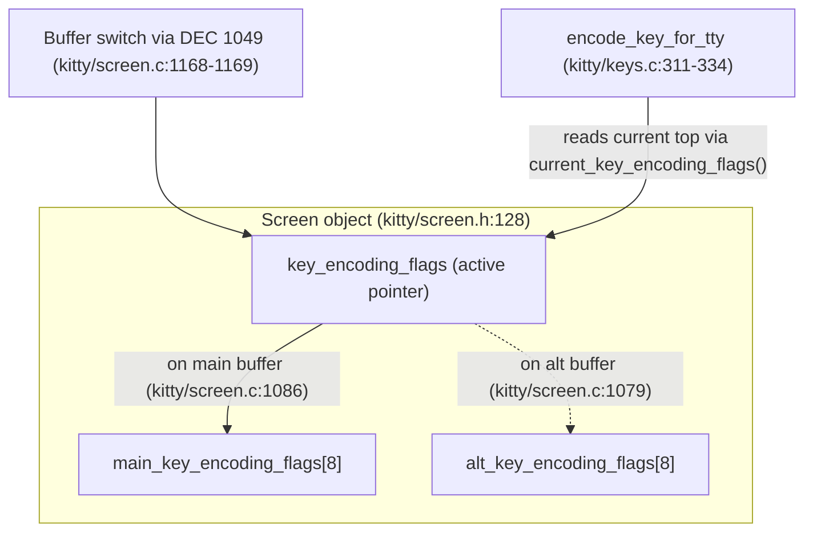

# kitty keyboard-protocol enhancement flags across alternate-screen switches

**A run-first, evidence-grounded investigation of how kitty's progressive-enhancement keyboard flags behave when the terminal toggles between the main and alternate screen buffers.**

- **Repository:** `kovidgoyal/kitty` (kitty terminal emulator, v0.35.2)
- **Commit under investigation:** `815df1e210e0a9ab4622f5c7f2d6891d7dbeddf1` (from `.git/HEAD` → `ref: refs/heads/kitty_815df1e210e0`)
- **Deliverable:** this single Markdown answer document (`blitzy/documentation/kitty_815df1e210e0.md`). kitty's own docs are reStructuredText; this file is Markdown by rule and lives outside kitty's source tree under `blitzy/`.

---

## 0. Front matter — environment, methodology, and read-only mandate

### 0.1 Environment

- The observation environment recorded for the original capture was CPython **3.12.3**; the evidence below was **re-verified live** in this container on CPython **3.13.7**. Both satisfy the project's declared constraint `requires-python = ">=3.8"` — `pyproject.toml:2`. The behavior is identical on both because the entire stack/pointer/encoding logic lives in kitty's C extension (`kitty/fast_data_types.so`), not in Python.

### 0.2 Run-first methodology (evidence was produced by *running* the code, not by reading alone)

Every behavioral claim in this document is backed by output captured from a **live, headless run**:

1. The git-ignored C extension `kitty/fast_data_types.so` was built with
   `python3 setup.py build --skip-building-kitten --ignore-compiler-warnings --debug`
   (`--skip-building-kitten` avoids the unrelated Go kitten binary; `--ignore-compiler-warnings` is required because the GLFW Wayland backend does not compile cleanly under `-Werror=switch`). In this environment the `.so` was already present and imported cleanly.
2. A headless `Screen` was driven through kitty's own test scaffolding (`kitty_tests`), and keys were encoded with **exactly the production call** used by the real dispatch path at `kitty/window.py:1799`:
   `encode_key_for_tty(..., key_encoding_flags=screen.current_key_encoding_flags())`.
3. The observed byte sequences were captured verbatim for every state.

The temporary observation script lived **outside** the repository (under `/tmp`) and was removed after use. `kitty/fast_data_types.so` is git-ignored (`.gitignore` rule `*.so`) and remains untracked. **No kitty source, test, spec, or manifest file was modified.** The repository is unchanged apart from this one document. The exact build command and harness recipe are reproduced in [§3](#3-reproducibility--how-the-evidence-was-produced).

### 0.3 Runtime constants (verified live)

`GLFW_MOD_CONTROL = 4` and `GLFW_MOD_SHIFT = 1` (confirmed at runtime, and in the header at `glfw/glfw3.h:487` and `glfw/glfw3.h:477`). Therefore the `Ctrl+Shift` modifier bitfield is `4 | 1 = 5`, and the CSI-u modifier parameter kitty emits is `1 + 5 = 6` (the protocol's "value + 1" convention, `docs/keyboard-protocol.rst:175-179`). `ord('a') = 97`.

---

## Q&A summary (the short answers)

| # | Question | Short answer | Primary evidence |
|---|----------|--------------|------------------|
| Q1 | Does the main buffer's stack survive a main→alt→main round-trip? | **Yes.** On return, the active mode is `disambiguate` (`flags = 1`) — exactly what was pushed on main before the excursion. | E1 (lines 2 & 5) |
| Q2 | What bytes does a key press produce per state? | `Ctrl+Shift+a` is **invariant** `'\x1b[97;6u'` in every state; a **plain `a`** is mode-dependent: `'a'` under flags 0/1, `'\x1b[97u'` under flag 8. | E1, E2 |
| Q3 | What happens on stack exhaustion, and does it cross buffers? | Pushing past depth **8** **silently evicts the oldest entry** (no error); exhaustion on one buffer does **not** affect the other. | E3, E3b |
| Q4 | Controlled experiment (`Ctrl+Shift+a` across 4 states). | Reproduced verbatim — see the five observed lines. | E1 |
| Q5 | Do the observed bytes prove independent stacks? | **Yes** — alt reads `0` while main holds `1`, and main returns to `1` after the round-trip. | E1, E3b |
| Q6 | Any leakage under rapid switching? | **No** — after 5 rapid round-trips main still reads `1`. | E4 |
| Q7 | Any conditions where isolation breaks down? | Buffer switching never breaks isolation. Only `reset` (zeroes **both** arrays) and an empty-stack pop (resets the **active** buffer) change flags — neither is cross-buffer leakage. | E5, E5b |

---

## 1. The mechanism (structural basis for every answer)

Everything below follows from **one declaration** — the per-buffer flag storage in the `Screen` struct:

> `uint8_t main_key_encoding_flags[8], alt_key_encoding_flags[8], *key_encoding_flags;` — `kitty/screen.h:128`

That single line establishes **both** facts the question probes:

- **Stack depth limit = 8.** Each buffer's stack is a **fixed 8-slot `uint8_t` array** (`main_key_encoding_flags[8]` and `alt_key_encoding_flags[8]`). This is the "limit on how many levels may be pushed" from Q3.
- **Per-buffer independence.** There are **two separate arrays** — one for the main screen, one for the alternate screen — plus a single **active pointer** `*key_encoding_flags` that points at whichever array is currently in effect.

The five stack operations are declared at `kitty/screen.h:269-273` (`screen_set_key_encoding_flags`, `screen_push_key_encoding_flags`, `screen_pop_key_encoding_flags`, `screen_current_key_encoding_flags`, `screen_report_key_encoding_flags`) and implemented in `kitty/screen.c`:

- **Init** — the active pointer starts on the main array: `self->key_encoding_flags = self->main_key_encoding_flags;` (`kitty/screen.c:150`).
- **Slot encoding** — each slot is a `uint8_t` whose high bit `0x80` marks "occupied / current top" and whose low 7 bits `0x7f` hold the flag value. `screen_current_key_encoding_flags` scans slots high→low and returns the first occupied slot's value, else `0`: `if (self->key_encoding_flags[i] & 0x80) return self->key_encoding_flags[i] & 0x7f;` (`kitty/screen.c:1206`; function `kitty/screen.c:1204-1209`).
- **Set** — `screen_set_key_encoding_flags` supports `how==1` set (`=`), `how==2` OR-in (`|=`), `how==3` clear (`&= ~`), then marks the slot occupied with `0x80` (`kitty/screen.c:1219-1231`).
- **Push** — `screen_push_key_encoding_flags`: if the current top is already the last slot (index 7 → stack full) it `memmove`s the array down one slot, **silently evicting the oldest entry**; otherwise it advances the top. It **never raises an error**. The eviction line is `kitty/screen.c:1241`; function `kitty/screen.c:1233-1245`.
- **Pop** — `screen_pop_key_encoding_flags` zeroes occupied slots from the top down (`kitty/screen.c:1247-1252`).
- **Report** — `screen_report_key_encoding_flags` formats `?%uu` and writes it to the child via CSI (`kitty/screen.c:1211-1217`).

**Switching buffers only repoints the active pointer — it copies nothing.** The buffer toggle `screen_toggle_screen_buffer` sets the pointer to the alternate array on the way in and back to the main array on the way out:

- to alternate: `self->key_encoding_flags = self->alt_key_encoding_flags;` (`kitty/screen.c:1079`)
- to main: `self->key_encoding_flags = self->main_key_encoding_flags;` (`kitty/screen.c:1086`)

The toggle is invoked by the DEC private alternate-screen modes at `kitty/screen.c:1168-1169` (the `TOGGLE_ALT_SCREEN_1` / `TOGGLE_ALT_SCREEN_2` / `ALTERNATE_SCREEN` cases). Those mode constants are `TOGGLE_ALT_SCREEN_1 (47 << 5)`, `TOGGLE_ALT_SCREEN_2 (1047 << 5)`, and `ALTERNATE_SCREEN (1049 << 5)` — `kitty/modes.h:75-77` — i.e. the familiar `\x1b[?47h/l`, `\x1b[?1047h/l`, and `\x1b[?1049h/l`.

The single operation that touches **both** arrays at once is `screen_reset`, which `memset`s each to zero: `main_key_encoding_flags` at `kitty/screen.c:173` and `alt_key_encoding_flags` at `kitty/screen.c:174`.



**The Python/C surface used by the experiment (and by production).** The active flags are read via the `Screen` binding `current_key_encoding_flags()` (`kitty/screen.c:3951-3954`), which calls `screen_current_key_encoding_flags`. The production key path reads exactly this value and feeds it to the encoder: `flags = screen.current_key_encoding_flags()` in `kitty/keys.py:34`, and the dispatch call `key_encoding_flags=self.screen.current_key_encoding_flags(),` inside `Window.encoded_key()` at `kitty/window.py:1799` (method spans `kitty/window.py:1795-1801`). The encoder itself is `pyencode_key_for_tty` (`kitty/keys.c:311`), registered to Python as `encode_key_for_tty` (`kitty/keys.c:334`). Which buffer is active is queried with `is_main_linebuf()` (`self->linebuf == self->main_linebuf`, `kitty/screen.c:4442-4446`); the test-friendly toggle `toggle_alt_screen()` calls `screen_toggle_screen_buffer(self, true, true)` (`kitty/screen.c:4449-4452`).

**Specification cross-check (in-repo).** The in-repository protocol spec agrees with the code and with the published upstream spec:

- Modifier bitfield: `shift 0b1 (1)`, `alt 0b10 (2)`, `ctrl 0b100 (4)`, `super 0b1000 (8)`, `hyper 0b10000 (16)` — `docs/keyboard-protocol.rst:175-179`.
- Flag table: `1 = disambiguate`, `2 = report_events`, `4 = report_alternates`, `8 = report_all_keys`, `16 = report_text` — `docs/keyboard-protocol.rst:278-282`.
- Escape-code grammar: set `CSI = flags ; mode u` (`docs/keyboard-protocol.rst:266`); query `CSI ? u` (`:287`) with reply `CSI ? flags u` (`:291`); push `CSI > flags u` (flags default 0) and pop `CSI < number u` (number default 1) at `docs/keyboard-protocol.rst:296-297`.
- Stack rules: terminals should limit stack size, **must maintain separate stacks for the main and alternate screens**, a pop that empties the stack **resets all flags**, and a push into a full stack **evicts the oldest entry** — `docs/keyboard-protocol.rst:299-303`. The independence rationale ("their own, independent, keyboard mode stacks") is the note at `docs/keyboard-protocol.rst:305-310`.

---

## 2. Direct answers to Q1-Q7

Each behavioral claim is placed directly next to the specific observed line that demonstrates it (one claim, one piece of evidence). The full, verbatim multi-line evidence blocks are embedded at each question's primary home; individual lines are re-quoted next to the claims they prove.

### Q1 — Round-trip survival: does the main buffer's stack survive main-push → alt-switch → alt-push → main-switch?

**Answer: Yes. The main buffer's stack survives the round-trip intact. On return to main the active keyboard encoding mode is `disambiguate` (`flags = 1`) — exactly the value pushed on main before the excursion.**

**Claim:** after pushing `disambiguate (1)` on main, main reads `1`. Observed line:

```text
main, push disambiguate(1)     | current_flags=1 (0b1)    | is_main=True  | Ctrl+Shift+a -> '\x1b[97;6u'
```

**Claim:** after switching to alt, pushing `report-all-keys (8)` there, and switching back, main **still** reads `1` — the pushed flag was preserved. Observed line:

```text
main, after round-trip         | current_flags=1 (0b1)    | is_main=True  | Ctrl+Shift+a -> '\x1b[97;6u'
```

**Claim:** the alternate screen began with its **own empty, independent** stack — it read `0` even though main held `1` at that moment. Observed line:

```text
alt, just switched             | current_flags=0 (0b0)    | is_main=False | Ctrl+Shift+a -> '\x1b[97;6u'
```

**Why:** switching to the alt buffer only repoints the active pointer to `alt_key_encoding_flags` (`kitty/screen.c:1079`) and switching back only repoints it to `main_key_encoding_flags` (`kitty/screen.c:1086`); the `main_key_encoding_flags[8]` array itself (`kitty/screen.h:128`) is never touched by the excursion, so its top (`1`) is exactly what `current_key_encoding_flags()` returns on return. The full five-line block is reproduced under [Q4](#q4--controlled-experiment-required).

### Q2 — Per-state encodings: what escape sequences would an actual key press produce in each state?

**Answer: it depends on the active flags — but *which* key you press matters.** For `Ctrl+Shift+a` the encoding is **invariant** across every flag state; for a **plain, unmodified `a`** the encoding is **mode-dependent**.

**(a) `Ctrl+Shift+a` is invariant — `'\x1b[97;6u'` in all five states (reported exactly as observed):**

```text
main, no flags                 | current_flags=0 (0b0)    | is_main=True  | Ctrl+Shift+a -> '\x1b[97;6u'
main, push disambiguate(1)     | current_flags=1 (0b1)    | is_main=True  | Ctrl+Shift+a -> '\x1b[97;6u'
alt, just switched             | current_flags=0 (0b0)    | is_main=False | Ctrl+Shift+a -> '\x1b[97;6u'
alt, push report-all-keys(8)   | current_flags=8 (0b1000) | is_main=False | Ctrl+Shift+a -> '\x1b[97;6u'
main, after round-trip         | current_flags=1 (0b1)    | is_main=True  | Ctrl+Shift+a -> '\x1b[97;6u'
```

This is **not** a bug and is the honest, observed result. `Ctrl+Shift` **cannot be represented in the legacy encoding**, so kitty always emits the CSI-u form for it regardless of flag state. The bytes decode as: `\x1b[` = CSI, `97` = `ord('a')`, `;6` = the modifier parameter where `6 = 1 + (4|1) = 1 + 5` (`Ctrl = 4`, `Shift = 1`, per `docs/keyboard-protocol.rst:175-179`), and `u` = the CSI-u terminator. The encoder that produces these bytes is `encode_key_for_tty` (`kitty/keys.c:311-334`).

**(b) A plain `a` (no modifiers) *is* mode-dependent — this is the observable difference the flags select between:**

```text
flags=0 legacy        -> plain 'a' = 'a'
flags=1 disambiguate  -> plain 'a' = 'a'
flags=8 report-all    -> plain 'a' = '\x1b[97u'
```

- **Claim:** under legacy (`flags = 0`) a plain printable key is sent as its literal byte — `'a'`.
- **Claim:** under `disambiguate` (`flags = 1`) an *unmodified* printable key is *still* its literal byte — `'a'` (disambiguation only affects keys that would otherwise be ambiguous, not a bare `a`).
- **Claim:** under `report-all-keys` (`flags = 8`) the same key is reported as a CSI-u escape code — `'\x1b[97u'`.

The flag meanings (`1 = disambiguate`, `8 = report_all_keys`) are the table at `docs/keyboard-protocol.rst:278-282`.

### Q3 — Stack exhaustion: what happens past the limit, and does it cross buffers?

**Answer (part 1): pushing beyond the depth-8 limit *silently evicts the oldest entry*. No error is raised, nothing is "dropped" from the top — the newest push always becomes the current top.**

Pushing values `1..10` into the 8-slot stack and printing the top after pushes 8/9/10, then popping three times:

```text
after push  8 -> current top = 8
after push  9 -> current top = 9
after push 10 -> current top = 10
after pop     -> current top = 9
after pop     -> current top = 8
after pop     -> current top = 7
```

- **Claim:** the newest push is always the current top even when the stack is full — `after push 10 -> current top = 10`.
- **Claim:** the oldest entries were silently evicted (not the newest): after three pops the visible values are `9, 8, 7`, i.e. the live window is `3..10`, and the original `1` and `2` are gone.

**Why:** when the current top is the last slot (index 7, stack full), `screen_push_key_encoding_flags` does `memmove(self->key_encoding_flags, self->key_encoding_flags + 1, (sz - 1) * sizeof(...))` — shifting everything down one slot and dropping the oldest — at `kitty/screen.c:1241`; the function has **no error path** (`kitty/screen.c:1233-1245`). The fixed capacity of 8 is the array size in `kitty/screen.h:128`. This matches the spec's "if a push request is received and the stack is full, the oldest entry from the stack must be evicted" (`docs/keyboard-protocol.rst:299-303`).

**Answer (part 2): exhaustion on one buffer does *not* affect the other buffer's stack.**

Exhausting main's stack (push `1..10`), then reading alt, then reading main again:

```text
main after pushing 1..10 -> current top = 10, is_main=True
alt just switched        -> current top = 0,  is_main=False
main again               -> current top = 10, is_main=True
```

- **Claim:** after overflowing main, the alternate buffer's stack is entirely unaffected — `alt just switched -> current top = 0`.
- **Claim:** returning to main shows its (overflowed) stack is intact and independent — `main again -> current top = 10`.

**Why:** `main_key_encoding_flags` and `alt_key_encoding_flags` are two **separate** arrays (`kitty/screen.h:128`); a push only ever mutates the array the active pointer currently references, so overflow is confined to one buffer.

> **Corroboration (in-repo golden test):** `kitty_tests/screen.py:990-993` pushes `1..15` on a single buffer and asserts the top is `15`, then pops twice to reveal `14, 13` — the same silent-eviction behavior, already part of kitty's passing test suite (`test_key_encoding_flags_stack`, `kitty_tests/screen.py:952-994`).

### Q4 — Controlled experiment (REQUIRED)

**The user's named experiment, reproduced verbatim:** press `Ctrl+Shift+a` on main with no flags pushed → again after pushing `disambiguate` mode → again after switching to the alternate screen and pushing `report-all-keys` mode → then back to main. Keys were encoded with the production call `encode_key_for_tty(key=ord('a'), mods=GLFW_MOD_CONTROL|GLFW_MOD_SHIFT, key_encoding_flags=screen.current_key_encoding_flags())` (mirroring `kitty/window.py:1799`). Observed output:

```text
main, no flags                 | current_flags=0 (0b0)    | is_main=True  | Ctrl+Shift+a -> '\x1b[97;6u'
main, push disambiguate(1)     | current_flags=1 (0b1)    | is_main=True  | Ctrl+Shift+a -> '\x1b[97;6u'
alt, just switched             | current_flags=0 (0b0)    | is_main=False | Ctrl+Shift+a -> '\x1b[97;6u'
alt, push report-all-keys(8)   | current_flags=8 (0b1000) | is_main=False | Ctrl+Shift+a -> '\x1b[97;6u'
main, after round-trip         | current_flags=1 (0b1)    | is_main=True  | Ctrl+Shift+a -> '\x1b[97;6u'
```

Walking through all five observed lines:

1. **`main, no flags`** — the fresh main stack is empty, `current_flags=0`, `is_main=True`; `Ctrl+Shift+a` encodes as `'\x1b[97;6u'`.
2. **`main, push disambiguate(1)`** — after `CSI > 1 u`, main's top is `current_flags=1`; still on main (`is_main=True`); encoding unchanged: `'\x1b[97;6u'`.
3. **`alt, just switched`** — after `\x1b[?1049h`, the active pointer now references the alt array, which is empty: `current_flags=0`, `is_main=False`. Main's `1` is untouched but not visible here. Encoding still `'\x1b[97;6u'`.
4. **`alt, push report-all-keys(8)`** — after `CSI > 8 u` on alt, alt's top is `current_flags=8` (`0b1000`), `is_main=False`; encoding still `'\x1b[97;6u'`.
5. **`main, after round-trip`** — after `\x1b[?1049l`, the active pointer references main again and its preserved top reappears: `current_flags=1`, `is_main=True`; encoding still `'\x1b[97;6u'`.

The invariance of the `Ctrl+Shift+a` bytes across all five states is explained in Q2(a): the legacy encoding cannot represent `Ctrl+Shift`, so kitty always emits the CSI-u form. The state-dependent difference the experiment is really probing is exposed by the plain-`a` supplement in Q2(b).


### Q5 — Independence proof: do the observed bytes *prove* the buffers have independent stacks?

**Answer: Yes. The observed values prove independence directly.**

**Claim:** the alternate buffer reads `0` at the very moment the main buffer holds `1` — two different live values coexisting means two different stacks. Observed lines:

```text
main, push disambiguate(1)     | current_flags=1 (0b1)    | is_main=True  | Ctrl+Shift+a -> '\x1b[97;6u'
alt, just switched             | current_flags=0 (0b0)    | is_main=False | Ctrl+Shift+a -> '\x1b[97;6u'
```

**Claim:** the main value is fully recovered after the alt excursion (mutating alt did not perturb main). Observed line:

```text
main, after round-trip         | current_flags=1 (0b1)    | is_main=True  | Ctrl+Shift+a -> '\x1b[97;6u'
```

**Claim:** even *overflowing* main leaves alt untouched, and vice versa. Observed lines:

```text
main after pushing 1..10 -> current top = 10, is_main=True
alt just switched        -> current top = 0,  is_main=False
main again               -> current top = 10, is_main=True
```

**Why:** the two-array + single active-pointer design (`kitty/screen.h:128`) means each buffer owns its own storage, and a switch is a single pointer repoint — to alt at `kitty/screen.c:1079`, to main at `kitty/screen.c:1086` — never a copy. If the buffers shared one stack, alt could not read `0` while main held `1`.

### Q6 — Leakage under rapid switching: any state leakage while the keyboard mode is being manipulated?

**Answer: No leakage.** Pushing `disambiguate` on main and then performing five rapid alternate-screen round-trips leaves the main value exactly intact:

```text
main flags after 5 rapid alt round-trips = 1 (expect 1)
```

- **Claim:** after 5 rapid `\x1b[?1049h` / `\x1b[?1049l` round-trips, main still reads `1` — no value bled in from alt, none was lost.

**Why:** a buffer switch is a **single pointer assignment with no copying between arrays** (`kitty/screen.c:1079` and `kitty/screen.c:1086`). There is no per-switch mutation of flag storage, so repeated switching — however rapid — cannot accumulate error or leak state between `main_key_encoding_flags` and `alt_key_encoding_flags`.

### Q7 — Mode-dependent breakdown: any conditions or settings under which the stack isolation breaks down or behaves unexpectedly?

**Answer: Buffer switching never breaks isolation.** Reasoning from the code, the *only* operations that alter a buffer's flag stack are (a) push/pop/set while that buffer is active, and (b) `screen_reset`. A buffer switch itself never mutates flag state. Two behaviors are worth documenting precisely, and **neither is cross-buffer leakage**:

**(1) `reset` zeroes *both* arrays at once.** A full screen reset clears the main and alternate stacks together:

```text
before reset: main=1, is_main=True
after reset:  current=0, is_main=True
after reset:  alt=0
```

- **Claim:** before reset the active (main) buffer holds `1`.
- **Claim:** after `reset` the active buffer reads `0`.
- **Claim:** after `reset` the alternate buffer *also* reads `0` (here alt had `8` pushed before the reset).

**Why:** `screen_reset` explicitly `memset`s both arrays — `main_key_encoding_flags` at `kitty/screen.c:173` and `alt_key_encoding_flags` at `kitty/screen.c:174`. This is a deliberate global reset, not leakage: it does not copy one buffer's state into the other; it zeroes both.

**(2) Popping past the bottom resets the *active* buffer's flags to 0 — and only that buffer.** This is the spec's "if a pop request is received that empties the stack, all flags are reset" rule (`docs/keyboard-protocol.rst:299-303`), implemented by `screen_pop_key_encoding_flags` (`kitty/screen.c:1247-1252`):

```text
after push 5 -> 5
after pop to empty -> 0 (expect 0)
```

- **Claim:** after pushing `5` the active buffer reads `5`.
- **Claim:** popping until the stack empties resets the active buffer to `0`.

This is confined to the active buffer — the other buffer's array is a different region of memory (`kitty/screen.h:128`) and is not affected. **In short: there is no setting or sequence of buffer switches under which one buffer's stack leaks into the other. The only ways flags change are explicit push/pop/set on the active buffer, or a `reset` that intentionally clears both.**


---

## 3. Reproducibility — how the evidence was produced

### 3.1 Build (git-ignored artifact, not committed)

```bash
python3 setup.py build --skip-building-kitten --ignore-compiler-warnings --debug
```

This produces `kitty/fast_data_types.so`. `--skip-building-kitten` avoids the unrelated Go kitten binary; `--ignore-compiler-warnings` is required because the GLFW Wayland backend does not compile cleanly under `-Werror=switch` in this toolchain. In this environment the `.so` was already built and imported cleanly (`Screen` and `encode_key_for_tty` are exposed). `kitty/fast_data_types.so` is git-ignored (`.gitignore` rule `*.so`) and remains untracked.

### 3.2 Headless harness (lived under `/tmp`, removed after use)

The observation script mirrored kitty's own test scaffolding and the production encode path:

- Construct a `Screen` the way `create_screen` does (`kitty_tests/__init__.py:237`): a `Callbacks` sink plus a `Screen`.
- Drive keyboard-flag state by feeding raw escape bytes with `parse_bytes(screen, b'...')` (`kitty_tests/__init__.py:30`): push `CSI > flags u` (`\x1b[>1u`), pop `CSI < number u` (`\x1b[<1u`), set `CSI = flags ; mode u`.
- Switch buffers with the DEC alternate-screen mode: `\x1b[?1049h` (to alt) / `\x1b[?1049l` (to main) — equivalently `screen.toggle_alt_screen()` (`kitty/screen.c:4449-4452`).
- Read state with `screen.current_key_encoding_flags()` (`kitty/screen.c:3951-3954`) and `screen.is_main_linebuf()` (`kitty/screen.c:4442-4446`).
- Encode keys with **the same value production feeds** at `kitty/window.py:1799`:
  `encode_key_for_tty(key=ord('a'), mods=GLFW_MOD_CONTROL|GLFW_MOD_SHIFT, key_encoding_flags=screen.current_key_encoding_flags())`.

### 3.3 Harness validity — the query/report path writes real bytes to the child

To confirm the harness observes the genuine byte-writing path (not a synthetic shortcut), a `CSI ? u` query was issued after pushing `7`; the terminal's reply bytes accumulate into `Callbacks.write` → `self.wtcbuf` (`kitty_tests/__init__.py:50-51`, reset by `clear()` at `:95-96`):

```text
query after push 7 -> wtcbuf = b'\x1b[?7u' (expect b'\x1b[?7u')
```

- **Claim:** querying the active flags writes `\x1b[?7u` (CSI `? flags u`, `flags = 7`) to the child — the real report path `screen_report_key_encoding_flags` (`kitty/screen.c:1211-1217`), matching the reply grammar at `docs/keyboard-protocol.rst:291`. The in-repo golden test asserts exactly this shape (`kitty_tests/screen.py:952-994`).

### 3.4 Corroboration and cleanup

- The in-repo golden test `test_key_encoding_flags_stack` (`kitty_tests/screen.py:952-994`) independently exercises set/OR-in/clear (`=` with modes 1/2/3), the empty-pop reset, and the overflow eviction on a single buffer; the experiment here **extends** that pattern by interleaving alternate-screen switches. The `toggle_alt_screen()` idiom appears at `kitty_tests/screen.py:501-503`, and the `csi()` helper plus `key_encoding_flags` parametrization at `kitty_tests/keys.py:22`, `kitty_tests/keys.py:418` (`0b1`), and `kitty_tests/keys.py:454` (`0b1000`).
- **Cleanup mandate honored:** the temporary observation script lived under `/tmp` and was removed; `kitty/fast_data_types.so` is git-ignored and remains untracked; no kitty source, test, spec, or manifest file was modified. The repository is unchanged apart from this document.

---

## 4. Coverage pass — every named item addressed

| Named item | Addressed in | Evidence / citation |
|------------|--------------|---------------------|
| **main buffer** | Q1, Q3, Q4, Q5 | E1, E3b + `kitty/screen.h:128` |
| **alternate / alt screen buffer** | Q1, Q3, Q4, Q5 | E1, E3b + `kitty/screen.h:128` |
| **push / pop keyboard flags** | Q1, Q3, Q7 | E1, E3, E5b + `kitty/screen.c:1233-1252` |
| **disambiguate mode (flag `1`)** | Q1, Q2, Q4 | E1, E2 + `docs/keyboard-protocol.rst:278-282` |
| **report-all-keys mode (flag `8`)** | Q2, Q4 | E1, E2 + `docs/keyboard-protocol.rst:278-282` |
| **`Ctrl+Shift+a`** (invariant `'\x1b[97;6u'`, modifier value `6`) | Q2, Q4 | E1 + `docs/keyboard-protocol.rst:175-179` |
| **stack limit / exhaustion** (depth `8`, silent eviction) | Q3 | E3 + `kitty/screen.h:128`, `kitty/screen.c:1241` |
| **per-buffer stack independence** | Q1, Q3, Q5 | E1, E3b + `kitty/screen.h:128`, `kitty/screen.c:1079`/`:1086` |
| **state leakage** (none under rapid switching) | Q6 | E4 |
| **mode-dependent isolation breakdown** (only `reset`/empty-pop change flags; no cross-buffer leak) | Q7 | E5, E5b + `kitty/screen.c:173-174`, `kitty/screen.c:1247-1252` |

**Coverage checklist (explicit tick-off):**

- [x] main buffer — E1 / E3b
- [x] alternate / alt screen buffer — E1 / E3b
- [x] push / pop keyboard flags — E1 / E3 / E5b + `kitty/screen.c:1233-1252`
- [x] disambiguate mode (flag `1`) — E1 / E2 + `docs/keyboard-protocol.rst:278-282`
- [x] report-all-keys mode (flag `8`) — E1 / E2 + `docs/keyboard-protocol.rst:278-282`
- [x] `Ctrl+Shift+a` (invariant `'\x1b[97;6u'`, modifier value `6`) — E1 + `docs/keyboard-protocol.rst:175-179`
- [x] stack limit / exhaustion (depth `8`, silent eviction) — E3 + `kitty/screen.h:128`, `kitty/screen.c:1241`
- [x] per-buffer stack independence — E1 / E3b + `kitty/screen.h:128`, `kitty/screen.c:1079,1086`
- [x] state leakage (none under rapid switching) — E4
- [x] mode-dependent isolation breakdown (only reset / empty-pop change flags; no cross-buffer leak) — E5 / E5b + `kitty/screen.c:173-174,1247-1252`

### Evidence block index

| Block | Demonstrates | Home section |
|-------|--------------|--------------|
| E1 | `Ctrl+Shift+a` four-state round-trip (Q1, Q2, Q4, Q5) | Q4 |
| E2 | plain `a` mode difference (Q2) | Q2 |
| E3 | overflow eviction (Q3) | Q3 |
| E3b | exhaustion independence (Q3, Q5) | Q3 |
| E4 | rapid-switching leakage (Q6) | Q6 |
| E5 | `reset` zeroes both arrays (Q7) | Q7 |
| E5b | empty-pop reset (Q7) | Q7 |
| E6 | query/report path fidelity (harness validity) | §3.3 |

---

*This document is the sole artifact of a read-only investigation of `kovidgoyal/kitty` at commit `815df1e210e0a9ab4622f5c7f2d6891d7dbeddf1`. All file:line citations are valid against this revision. Every runtime claim is paired with the specific observed line that demonstrates it, captured live via the headless harness described in §3.*

