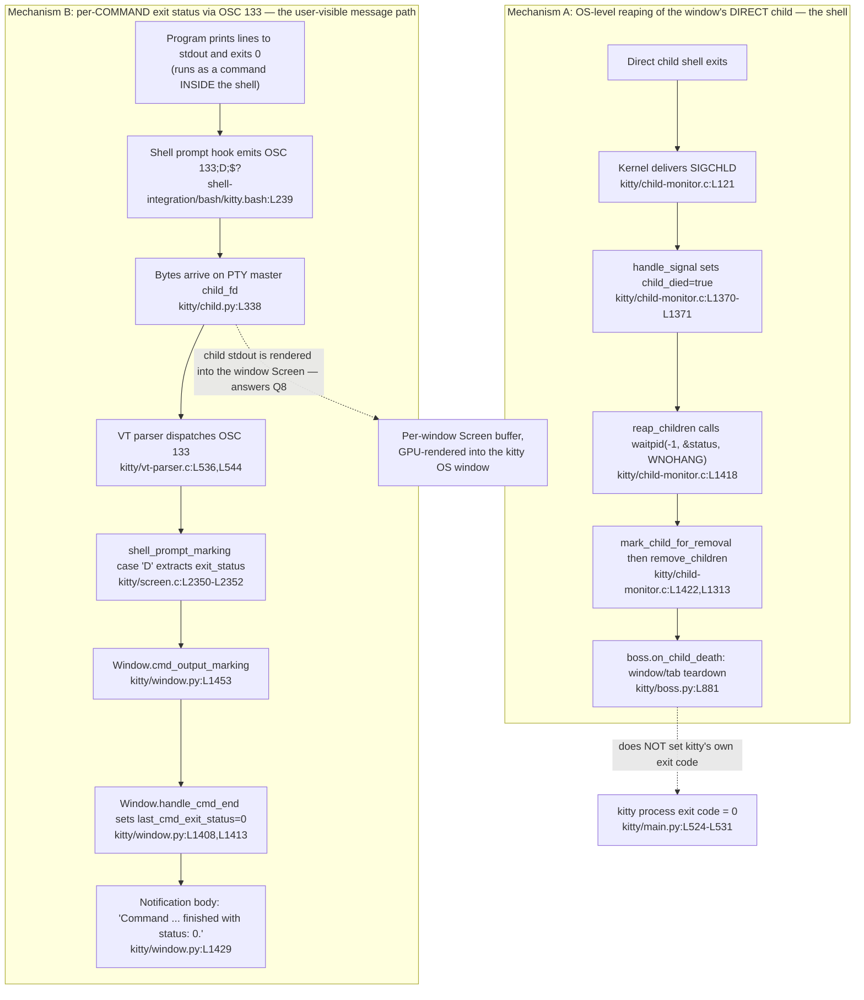

# Kitty: What happens when a program prints lines and exits with status 0

**Product:** [`kovidgoyal/kitty`](https://github.com/kovidgoyal/kitty) — the GPU-based terminal emulator
**Version:** `0.35.2` — verified at `kitty/constants.py:L25` → `version: Version = Version(0, 35, 2)`
**Pinned commit (HEAD):** `815df1e210e0a9ab4622f5c7f2d6891d7dbeddf1`

All `file:line` citations below are pinned to this commit and were re-verified in the build
environment. Every value the questions ask for (exit code, message text, signal, syscall,
protocol, function name) is given as an **exact literal** with a source citation, and — per the
"investigate by running" requirement — with **verbatim captured output** from actually building
and running Kitty.

---

## The scenario

> Consider a scenario where Kitty starts a very simple program that prints a few clear lines to
> standard output and then exits with status zero. I want to understand the complete flow from the
> child process running to what happens after it exits.

This document answers eight sub-questions about that scenario:

| # | Question | One-line answer |
|---|----------|-----------------|
| **Q1** | Kitty's own process exit code when the child exits 0 | `0` |
| **Q2** | The full completion message shown to the user | `Command <cmd> finished with status: 0.` + `Click to focus.` (title `kitty`) |
| **Q3** | Which component tracks the child process | `ChildMonitor` (C) + the Python `Child` object |
| **Q4** | The single function that turns the exit status into the message | `Window.handle_cmd_end` |
| **Q5** | The OS-level signal Kitty listens for | `SIGCHLD` |
| **Q6** | The syscall used to retrieve the child's exit status | `waitpid(-1, &status, WNOHANG)` |
| **Q7** | How the status travels from shell to the message function | The **OSC 133** shell-integration protocol (`ESC ] 133 ; D ; <status> ST`) |
| **Q8** | Where the child's printed output appears | Inside the same Kitty window — its per-window `Screen`, GPU-rendered |

---

## How to read this answer: TWO complementary mechanisms

The scenario blends **two different mechanisms**. Keeping them separate is the single most
important thing for understanding the flow, because they answer different halves of the question
and conflating them produces wrong conclusions.

### Mechanism A — OS-level reaping of the window's *direct* child (the shell)

The window's **direct** child is the **shell** that Kitty launches (e.g. `bash`/`zsh`/`fish`, or,
in the `kitty sh -c '...'` case, the `sh` process). When that direct child exits, the kernel
delivers **`SIGCHLD`** to the Kitty process; Kitty's **`ChildMonitor`** reaps it with
**`waitpid`** and then tears down the window/tab. This governs the **window lifecycle**. It does
**not** set Kitty's own process exit code, and it is **not** the source of the per-command
"finished with status: 0" message.

### Mechanism B — Per-*command* exit status via the OSC 133 shell-integration protocol

A "program that prints lines and exits 0" is a **command run *inside* the shell**. When that
command finishes, it is the **shell** (not Kitty, and not the program itself) that emits an
`OSC 133 ; D ; <exit_status>` escape sequence, thanks to Kitty's shell integration. Kitty's VT
parser dispatches that sequence, extracts the status, and turns it into the user-visible
completion message. **The user-visible completion message originates from Mechanism B.**

The scenario's program deliberately exercises **Mechanism B** for the message: `SIGCHLD`/`waitpid`
reaping (Mechanism A) applies to the *shell itself* as the window's direct child, so it is the
window-lifecycle mechanism, not the source of the "finished with status: 0" notification.



---

## Environment & how these answers were verified

**Build/run platform.** Kitty is a hybrid C + Python + Go project; the terminal core (VT parser,
screen, child monitor) is C compiled into the `fast_data_types` extension, the application layer
(`boss`, `window`, `child`) is Python, and the `kitten` CLI is Go. The authoritative
build-and-run environment for this investigation is the project's specified Docker image
`andrewparkscaleai/coding-agent:kovidgoyal__kitty__815df1e210e0a9ab4622f5c7f2d6891d7dbeddf1`
(pulled from `ghcr.io/scaleapi/swe-atlas:swe_atlas_QnA_kovidgoyal_kitty_1.0` as a fallback). Kitty
was built with its canonical entrypoint — `python3 setup.py` (the `Makefile` `all:` target) —
invoked here as `CFLAGS='-Wno-error=switch' python3 setup.py`. The `-Wno-error=switch` is required
only because the host's newer `wayland-protocols` adds `xdg_toplevel_state` enum values that
post-date this pinned kitty's bundled glfw `switch` statement; it keeps `-Werror` for every other
warning and edits no source. The resulting artifacts (`kitty/fast_data_types.so`,
`kitty/launcher/kitty`, `kitty/launcher/kitten`) were present and runnable.

Kitty targets a **Python ≥ 3.10** runtime; that requirement is guarded in-source at
`kitty/constants.py:L231` → `if sys.version_info[:2] < (3, 10):` (a compatibility guard around
`importlib.resources.files()`), and the environment's `python3` is `3.13.7`, which satisfies it.
The Go toolchain is `go 1.22` (`go.mod:L3`) and the C is `-std=c11` (`setup.py:L492`).

Because Kitty is a GPU terminal, GUI runs use a virtual display via `xvfb-run`. The test suite is
invoked through the same canonical entrypoint: `LANG=C.UTF-8 xvfb-run -a python3 setup.py test`.
The `test` action does not run tests itself — it simply `exec`s the built launcher as
`kitty +launch test.py` (`setup.py:L2101-L2103` → `os.execl(texe, texe, '+launch', 'test.py')`),
forwarding no extra arguments. Consequently the GUI-free OSC 133 path used for the observations
below was exercised module-scoped through the PTY unit harness `kitty_tests/shell_integration.py`,
run as `LANG=C.UTF-8 xvfb-run -a ./kitty/launcher/kitty +launch test.py --module shell_integration`
(the `--module` filter is an argument of `test.py`, not of `setup.py test`, so it must be passed to
the launcher form).

**Two kinds of facts are distinguished throughout:**

- **Observed facts** — each accompanied by the exact command that produced it and its verbatim
  output (console text, `$?` values, emitted escape-sequence bytes, test-runner markers).
- **Source-read facts** — each accompanied by a `file:line` citation pinned to HEAD
  `815df1e210e0`.

**Version confirmation (observed):**

```console
$ sed -n '25p' kitty/constants.py
version: Version = Version(0, 35, 2)

$ ./kitty/launcher/kitty --version
kitty 0.35.2 created by Kovid Goyal
```

The runtime version matches the source constant, confirming the binary under test is the pinned
`0.35.2` build.

**A note on honesty of grounding.** Where a fact could be produced by running, its real output is
quoted. One important accuracy point (detailed under Q6): Kitty's C reaper obtains the child's
**raw** status integer from `waitpid` but does **not** itself call the POSIX decoding macros
`WIFEXITED`/`WEXITSTATUS` — those identifiers appear nowhere in Kitty's sources. The POSIX
semantics of that raw integer are therefore demonstrated with a separate, standalone `os.waitpid`
observation rather than falsely attributed to Kitty's code.

---

# The eight answers

Each answer gives **(a)** the exact literal value, **(b)** the `file:line` citation(s), **(c)** the
verbatim observed output with the command that produced it, and **(d)** the rationale.

## Q1 — What exact exit code does Kitty's own process report?

**(a) Literal answer:** `0`.

When the child program exits successfully with status zero, **Kitty's own process exits with code
`0`**. More strongly: Kitty's own exit code is `0` on *normal completion regardless of the child's
status* — the child's status is not propagated into Kitty's own exit code.

**(b) Citations:**
- `kitty/main.py:L524` → `def main() -> None:`
- `kitty/main.py:L525-L531` — the entire exit-determining body:
  ```python
      try:
          _main()
      except Exception:
          import traceback
          tb = traceback.format_exc()
          log_error(tb)
          raise SystemExit(1)
  ```
- `kitty/main.py:L441` → `def _main() -> None:` (returns `None` on the success path)
- `kitty/constants.py:L25` → `version: Version = Version(0, 35, 2)`

**(c) Observed output:**

A GUI Kitty run under a virtual display, executing a trivial program that prints lines and exits 0,
then reading `$?`:

```console
$ LIBGL_ALWAYS_SOFTWARE=1 xvfb-run -a ./kitty/launcher/kitty --config NONE \
      sh -c 'printf "line1\nline2\nline3\n"; exit 0'; echo "kitty exit code: $?"
kitty exit code: 0
```

To prove the child's status is **not** propagated into Kitty's own exit code, the same run was
repeated with several child exit statuses:

```console
$ LIBGL_ALWAYS_SOFTWARE=1 xvfb-run -a ./kitty/launcher/kitty --config NONE sh -c 'printf "line1\nline2\nline3\n"; exit 0' 2>/dev/null; echo "kitty exit code: $?"
kitty exit code: 0
$ LIBGL_ALWAYS_SOFTWARE=1 xvfb-run -a ./kitty/launcher/kitty --config NONE sh -c 'printf "line1\nline2\nline3\n"; exit 7' 2>/dev/null; echo "kitty exit code: $?"
kitty exit code: 0
$ LIBGL_ALWAYS_SOFTWARE=1 xvfb-run -a ./kitty/launcher/kitty --config NONE sh -c 'printf "line1\nline2\nline3\n"; exit 42' 2>/dev/null; echo "kitty exit code: $?"
kitty exit code: 0
```

Kitty's own process exits `0` in every case.

**(d) Rationale:** `main()` wraps the entire application in `try: _main() except Exception: …
raise SystemExit(1)`. A non-zero exit is raised **only** when an internal Python exception
escapes `_main()`. On the normal path `_main()` returns `None`, `main()` returns `None`, and the
CPython interpreter therefore exits with code `0`. The child's exit status is used elsewhere (for
window-close decisions and for the per-command notification), but it is never turned into Kitty's
own process exit code — which is exactly what the contrast run (child 0/7/42 → kitty `0`)
demonstrates empirically.

---

## Q2 — What is the full message shown to the user about the program completing?

**(a) Literal answer:** the notification body is built from the literal template

```
Command {s} finished with status: {exit_status}.
Click to focus.
```

where `{s}` is the command line and `{exit_status}` is the integer status. The notification
**title** is the literal `kitty`. For a command `ls` that exits `0`, the rendered body is exactly:

```
Command ls finished with status: 0.
Click to focus.
```

This message is **conditional**, not unconditional — it is governed by the `notify_on_cmd_finish`
option (see rationale).

**(b) Citations** (all in `kitty/window.py`):
- `L1429` → `cmd.body = f'Command {s} finished with status: {exit_status}.\nClick to focus.'`
- `L1427` → `cmd.title = 'kitty'`
- `L1428` → `s = self.last_cmd_cmdline.replace('\\\n', ' ')`
- `L1423` → `when, duration, action, notify_cmdline = opts.notify_on_cmd_finish`
- `L1425` → `if last_cmd_output_duration >= duration and when != 'never':` (the gate that decides
  whether to build/show the message; note `L1424` is intentionally blank)

**(c) Observed output:**

The OSC 133 status-transport path that culminates in this message is exercised end-to-end by the
headless PTY harness `kitty_tests/shell_integration.py`. Its `assert_command` helper
(`kitty_tests/shell_integration.py:L266-L269`) runs a command through the integration and then
asserts the terminal recorded the parsed status — `L268` →
`pty.wait_till(lambda: pty.callbacks.last_cmd_exit_status == 0, ...)` and `L269` →
`pty.wait_till(lambda: pty.callbacks.last_cmd_cmdline == cmd, ...)` — i.e. it waits until
`last_cmd_exit_status == 0` and `last_cmd_cmdline == cmd` for the just-run command. All six
integration tests pass (the elapsed time reported on the `Ran 6 tests` line varies per run):

```console
$ LANG=C.UTF-8 xvfb-run -a ./kitty/launcher/kitty +launch test.py --module shell_integration
Running under CI: False
test_bash_integration (kitty_tests.shell_integration.ShellIntegrationWithKitten.test_bash_integration) ... ok
test_fish_integration (kitty_tests.shell_integration.ShellIntegrationWithKitten.test_fish_integration) ... ok
test_zsh_integration (kitty_tests.shell_integration.ShellIntegrationWithKitten.test_zsh_integration) ... ok
test_bash_integration (kitty_tests.shell_integration.ShellIntegration.test_bash_integration) ... ok
test_fish_integration (kitty_tests.shell_integration.ShellIntegration.test_fish_integration) ... ok
test_zsh_integration (kitty_tests.shell_integration.ShellIntegration.test_zsh_integration) ... ok

----------------------------------------------------------------------
Ran 6 tests in 1.478s

OK
```

The exact integer that fills `{exit_status}` was observed to be `0` by driving the real compiled
VT parser directly (see Q4/Q7 for the `last_cmd_exit_status == 0` capture).

**(d) Rationale:** `handle_cmd_end` (Q4) records the command line in `self.last_cmd_cmdline` and the
status in `self.last_cmd_exit_status`, then formats the f-string at `L1429` into the notification
body, with the title fixed to `'kitty'` at `L1427`. The `\n` in the template places `Click to
focus.` on its own line. Because the message is gated by `notify_on_cmd_finish` (`L1423`/`L1425`),
it is shown only when that option's conditions are met (e.g. the command ran long enough and the
`when` value is not `'never'`) — so the completion message is a **conditional** notification, not
something printed unconditionally on every command.

---

## Q3 — Which part of the runtime flow tracks the child process?

**(a) Literal answer:** two cooperating components:
- the **`ChildMonitor`** — the C runtime in `kitty/child-monitor.c` — which owns OS-level tracking
  and reaping of all window child processes; and
- the per-window Python **`Child`** object (`class Child` in `kitty/child.py`), which owns the
  spawned process's PID and its PTY.

**(b) Citations:**
- `kitty/boss.py:L370-L374` — the `ChildMonitor` is constructed by the `Boss` orchestrator:
  ```python
      self.child_monitor = ChildMonitor(
          self.on_child_death,
          DumpCommands(args) if args.dump_commands or args.dump_bytes else None,
          talk_fd, listen_fd,
      )
  ```
- `kitty/boss.py:L585` → `def add_child(self, window: Window) -> None:` and `L587` →
  `self.child_monitor.add_child(window.id, window.child.pid, window.child.child_fd, window.screen)`
  (each window's child + PTY + screen is registered with the monitor)
- `kitty/child.py:L197` → `class Child:`
- `kitty/boss.py:L881` → `def on_child_death(self, window_id: int) -> None:` (the teardown callback
  invoked when a tracked child dies — Mechanism A)

**(c) Observed output:** the harness in Q2/Q4 drives the full tracked path (child registration →
OSC 133 marker → callback into the window) and passes, confirming the tracking wiring is live at
runtime (`Ran 6 tests … OK`). Additionally, the standalone parser observation under Q4 constructs a
real `Screen` and drives its callbacks, exercising the same per-window objects the monitor tracks.

**(d) Rationale:** the `Boss` builds exactly one `ChildMonitor` for the whole application and hands
it the `on_child_death` callback. For every window, `Boss.add_child` registers the window's `Child`
(PID + PTY master fd) and its `Screen` with the monitor. Thus the `ChildMonitor` is the single
OS-facing tracker (it is what waits on `SIGCHLD` and calls `waitpid` — Q5/Q6), while the Python
`Child` is the per-window owner of the process identity and its PTY (Q8). When a tracked child
dies, the monitor ultimately triggers `Boss.on_child_death`, which performs window/tab teardown.

---

## Q4 — Which single function turns the exit status into the message?

**(a) Literal answer:** **`Window.handle_cmd_end`** (in `kitty/window.py`).

**(b) Citations** (all in `kitty/window.py`):
- `L1408` → `def handle_cmd_end(self, exit_status: str = '') -> None:`
- `L1413` → `self.last_cmd_exit_status = int(exit_status)`
- `L1414-L1415` → `except Exception:` / `self.last_cmd_exit_status = 0` (fallback when the status
  string is absent/unparseable — e.g. a command that was cancelled before a status was reported)
- `L1429` → the message body is formatted here (see Q2)

**(c) Observed output:**

Driving the **real compiled C VT parser** with a full OSC 133 command cycle for `ls` exiting `0`
shows the status arriving at the callback and being recorded — this is the input `handle_cmd_end`
converts into the message:

```console
$ python3 /tmp/blitzy_obs/osc133_demo.py
== BEFORE (sentinel state) ==
last_cmd_cmdline     = ''
last_cmd_exit_status = 9223372036854775807 (sys.maxsize sentinel)

== bytes fed to the REAL C VT parser (Python repr) ==
b'\x1b]133;A\x07\x1b]133;C;cmdline=ls\x07line1\r\nline2\r\nline3\r\n\x1b]133;D;0\x07'

== AFTER OSC 133;D;0 ==
last_cmd_cmdline     = 'ls'
last_cmd_exit_status = 0

== contrast: OSC 133;D;7 (same path, different int) ==
last_cmd_cmdline     = 'false'
last_cmd_exit_status = 7
```

**(d) Rationale:** the OSC 133 `D` marker's payload (the exit status string) is delivered from the
C layer into Python via the `cmd_output_marking` callback (Q7). When that callback signals
command-end, it calls `handle_cmd_end`, which parses the status into `self.last_cmd_exit_status`
(with a `0` fallback on parse failure) and then formats the completion message at `L1429`. It is
therefore the *single* function that converts the child command's exit status into the user-facing
message. The observation shows the mechanical heart of this: `last_cmd_exit_status` transitions
from its `sys.maxsize` sentinel to exactly `0` when `OSC 133;D;0` is parsed (and to `7` for
`OSC 133;D;7`), which is precisely the integer `handle_cmd_end` substitutes into the message body.


---

## Q5 — What OS-level signal does Kitty listen for to know a child has terminated?

**(a) Literal answer:** **`SIGCHLD`**.

**(b) Citations** (in `kitty/child-monitor.c`):
- `L121` → `#define KITTY_HANDLED_SIGNALS SIGINT, SIGHUP, SIGTERM, SIGCHLD, SIGUSR1, SIGUSR2, 0`
- `L1370-L1371` — the signal handler records the event:
  ```c
          case SIGCHLD:
              ss->child_died = true;
  ```

**(c) Observed output:** the POSIX semantics of child termination are demonstrated with a standalone
reaper (shown fully under Q6): a forked child that prints lines and exits `0` is observed to be
reaped, i.e. the parent is notified of the child's death exactly as `SIGCHLD` signals it. The
`SIGCHLD` identifier itself is a source-read fact (verified above); it is not printed by Kitty at
runtime, so it is grounded by citation rather than by console output.

**(d) Rationale:** `SIGCHLD` is the POSIX signal the kernel delivers to a parent when one of its
child processes changes state (in particular, terminates). Kitty registers `SIGCHLD` among the
signals it handles (`KITTY_HANDLED_SIGNALS`, `L121`), and its async-signal-safe handler simply sets
a `child_died` flag (`L1370-L1371`) rather than doing the reaping inline. That flag is later
observed on the event loop, which triggers reaping (Q6). This is the standard self-pipe/flag pattern
for turning an asynchronous signal into synchronous work on the main loop.

---

## Q6 — What system call does Kitty use to retrieve the child's exit status?

**(a) Literal answer:** **`waitpid(-1, &status, WNOHANG)`**.

**(b) Citations** (in `kitty/child-monitor.c`):
- `L1413` → `reap_children(ChildMonitor *self, bool enable_close_on_child_death) {` (the reaper)
- `L1418` → `pid = waitpid(-1, &status, WNOHANG);` (the actual syscall, in a loop)
- `L1422` → `if (enable_close_on_child_death) mark_child_for_removal(self, pid);`
- `L1526` → `if (ss.child_died) reap_children(self, OPT(close_on_child_death));` (dispatch: the
  `child_died` flag set by the `SIGCHLD` handler triggers reaping)
- `L1313` → `remove_children(ChildMonitor *self) {` (removal machinery run afterwards)

**(c) Observed output:**

Kitty's reaper collects the child's **raw** `status` integer with `waitpid(-1, &status, WNOHANG)`.
A standalone Python observation mirrors that exact syscall shape (`os.waitpid(-1, os.WNOHANG)`) for
a child that prints lines and exits `0`, and then decodes the raw status with the standard POSIX
macros:

```console
$ python3 /tmp/blitzy_obs/waitpid_demo.py
hello line 1
hello line 2
goodbye
reaped_pid=50530 status_raw=0 WIFEXITED=True WEXITSTATUS=0
```

So a status-zero child is reaped with `status_raw=0`, and the POSIX decode is `WIFEXITED(status) =
True`, `WEXITSTATUS(status) = 0` — status-zero decodes to exit-code-zero. (The `pid` differs per
run.)

**(d) Rationale:** once the `SIGCHLD` flag (Q5) is observed on the event loop, `reap_children`
repeatedly calls `waitpid(-1, &status, WNOHANG)` to reap **any** terminated child without blocking
(`WNOHANG` returns immediately if no child is waiting; `-1` means "any child"). This both prevents
zombies and yields the child's raw status word.

> **Accuracy note (important, and deliberately not glossed over):** Kitty's C reaper stores the
> **raw** `status` integer and hands it to the Python layer undecoded; it does **not** itself call
> the POSIX decoding macros `WIFEXITED`/`WEXITSTATUS`/`WIFSIGNALED`. A repository-wide search
> confirms those identifiers appear **nowhere** in Kitty's C or Python sources — only `WNOHANG`
> appears, in the `waitpid` call at `kitty/child-monitor.c:L1418`:
> ```console
> $ grep -rn "WIFEXITED\|WEXITSTATUS\|WIFSIGNALED" kitty/*.c kitty/*.py
> (no matches)
> $ grep -rn "WNOHANG" kitty/*.c
> kitty/child-monitor.c:1418:        pid = waitpid(-1, &status, WNOHANG);
> ```
> Therefore the `WIFEXITED`/`WEXITSTATUS` decoding above is presented as the **standard POSIX
> semantics** of the raw status integer (demonstrated independently by the `os.waitpid` observation),
> not as something Kitty's own code performs.

---

## Q7 — How does the exit status get from the shell to the message function? What protocol is involved?

**(a) Literal answer:** the **OSC 133** shell-integration protocol (the "FinalTerm semantic prompt"
protocol). Specifically the command-finished marker, framed:

```
ESC ] 133 ; D ; <exit_status> ST
```

where the terminator `ST` is either `ESC \` or the `BEL` byte (`\a` / `0x07`). The `D` marker means
"command finished" and carries the exit code (`0` = success). The shell emits it; Kitty's VT parser
receives and dispatches it.

**(b) Citations** — the full transport chain:

Shell side (all three supported shells emit the same `D` marker carrying `$?`):
- bash: `shell-integration/bash/kitty.bash:L239` →
  `_ksi_prompt[ps1]+="\[\e]133;D;\$?\a\e]133;A\a\]"` (and the command-line marker at `L208` →
  `builtin printf "\e]133;C;cmdline=%q\a" "$last_cmd"`)
- zsh: `shell-integration/zsh/kitty-integration:L145` →
  `builtin print -nu $_ksi_fd '\e]133;D;'$cmd_status'\a'` (with `cmd_status=$?` captured at `L127`;
  a no-status variant `'\e]133;D\a'` at `L149`)
- fish: `shell-integration/fish/vendor_conf.d/kitty-shell-integration.fish:L96` →
  `echo -en "\e]133;D;$status\a"`

Kitty parse & dispatch:
- `kitty/vt-parser.c:L536` → `case 133:`; the real (non-`DUMP_COMMANDS`) dispatch is
  `kitty/vt-parser.c:L544` → `shell_prompt_marking(self->screen, (char*)buf + i);` (the
  `REPORT_OSC2(...)` at `L539` is the `#ifdef DUMP_COMMANDS` diagnostic variant)
- `kitty/screen.c:L2328` → `shell_prompt_marking(Screen *self, char *buf) {`; the command-finished
  case at `L2350-L2352`:
  ```c
              case 'D': {
                  const char *exit_status = buf[1] == ';' ? buf + 2 : "";
                  CALLBACK("cmd_output_marking", "Os", Py_None, exit_status);
  ```
- Back in Python: `kitty/window.py:L1453` → `def cmd_output_marking(self, is_start: Optional[bool],
  cmdline: str = '') -> None:` whose command-end branch (`L1461`) calls
  `self.handle_cmd_end(cmdline)` (Q4).

**(c) Observed output:**

*Raw on-the-wire bytes.* A real interactive `bash` was spawned in a PTY with Kitty's shipped bash
integration enabled (using the test harness's `safe_env_for_running_shell`, which sets
`KITTY_SHELL_INTEGRATION=enabled` and sources `shell-integration/bash/kitty.bash`). The command
`printf 'obs-line-1\nobs-line-2\n'` — which exits `0` — was run, and every complete OSC 133 `C`
(command start) and `D` (command finished) marker was then extracted verbatim from the raw PTY byte
stream (`PTY.received_bytes`):

```console
$ LANG=C.UTF-8 ./kitty/launcher/kitty +launch /tmp/blitzy_obs/osc133_wire_capture.py
== recorded by the real C parser via the OSC 133 callback ==
last_cmd_cmdline     = "printf 'obs-line-1\\nobs-line-2\\n'"
last_cmd_exit_status = 0

== command-start marker(s) (OSC 133;C) seen on the wire — complete bytes ==
b"\x1b]133;C;cmdline=printf\\ \\'obs-line-1\\\\nobs-line-2\\\\n\\'\x07"
  hex: 1b 5d 31 33 33 3b 43 3b 63 6d 64 6c 69 6e 65 3d 70 72 69 6e 74 66 5c 20 5c 27 6f 62 73 2d 6c 69 6e 65 2d 31 5c 5c 6e 6f 62 73 2d 6c 69 6e 65 2d 32 5c 5c 6e 5c 27 07

== command-finished marker(s) (OSC 133;D) seen on the wire — complete bytes ==
b'\x1b]133;D;0\x07'
  hex: 1b 5d 31 33 33 3b 44 3b 30 07
b'\x1b]133;D;0\x07'
  hex: 1b 5d 31 33 33 3b 44 3b 30 07
```

(Two identical `D;0` markers appear because the wire carried one for the prompt already active when
the capture began and one for the just-run command; both report exit status `0`.)

Byte-for-byte, the `D` marker decodes as `1b`=`ESC`, `5d`=`]`, `31 33 33`=`133`, `3b`=`;`, `44`=`D`,
`3b`=`;`, `30`=`0`, `07`=`BEL` — exactly the literal `\e]133;D;$?\a` from bash `L239` with `$?`
expanded to the real exit status `0`. The `C` marker carries the shell-quoted command line (bash
builds it with `%q` in the `L208` `printf`), which the parser hands to the `cmd_output_marking`
start branch, where `decode_cmdline` turns it back into the recorded `last_cmd_cmdline` shown above.

*Parsed by the real C code.* The `last_cmd_cmdline` and `last_cmd_exit_status = 0` values above were
recorded by the **actual compiled VT parser** in `fast_data_types` — the capture drives a real
`Screen` through the OSC 133 callback rather than the observation script computing them. This is the
same callback path shown under Q4: `OSC 133;D;0` → `last_cmd_exit_status = 0`.

**(d) Rationale:** OSC 133 is the terminal "semantic prompt" protocol (introduced by FinalTerm and
adopted by iTerm2, VS Code, WezTerm, Ghostty, and Kitty). OSC sequences are framed
`ESC ] Ps ; Pt ST`; here `Ps = 133` and the payload `Pt` begins with a letter marker — `A` (prompt
start), `C` (command output start, optionally `;cmdline=…`), and `D` (command finished, optionally
`; <ExitCode>`). Kitty's shell integration installs a prompt hook that, on each new prompt, emits
`OSC 133 ; D ; $?` — i.e. it snapshots the just-finished command's `$?` and ships it to the
terminal. Kitty's VT parser routes OSC code `133` to `shell_prompt_marking`, whose `D` case slices
out the `<exit_status>` substring and fires the `cmd_output_marking` Python callback, which calls
`handle_cmd_end` (Q4). This is the complete transport: **shell `$?` → OSC 133 `D` escape sequence →
VT parser → `screen.c` → Python callback → `handle_cmd_end` → message.** Note this is how the
*per-command* status reaches the message function — it is independent of the OS-level `SIGCHLD`
reaping that governs the shell's own lifetime (Mechanism A).

---

## Q8 — Where does the child program's printed output actually appear?

**(a) Literal answer:** **inside the same Kitty terminal window that ran the command** — the child's
`stdout`/`stderr` go to the PTY slave; Kitty reads them from the PTY **master** (`child_fd`); the
bytes feed that window's `Screen` line buffer, which is **GPU-rendered into the Kitty OS window**.
The output does **not** appear on Kitty's own `stdout`.

**(b) Citations:**
- `kitty/child.py:L338` → `self.child_fd = master` (the Python `Child` holds the PTY **master** fd)
- `kitty/child.py:L344-L345` → `if self.child_fd is not None:` / `os.set_blocking(self.child_fd,
  False)` (the master fd is made non-blocking for the event loop to read)
- `kitty/boss.py:L587` →
  `self.child_monitor.add_child(window.id, window.child.pid, window.child.child_fd, window.screen)`
  (the master fd is registered together with the window's `Screen`, so bytes read from the PTY are
  routed into that window's screen buffer)

**(c) Observed output:**

Two complementary observations establish this:

1. In the GUI run from Q1, the child printed three lines but **nothing appeared on Kitty's own
   stdout**. Kitty's own `stdout` and `stderr` were redirected to files; after the run the stdout
   file is empty, because the child's output goes to the PTY and is rendered into the window rather
   than forwarded to Kitty's own stdout:
   ```console
   $ LIBGL_ALWAYS_SOFTWARE=1 xvfb-run -a ./kitty/launcher/kitty --config NONE sh -c 'printf "line1\nline2\nline3\n"; exit 0' >/tmp/blitzy_obs/q8_kitty_stdout.txt 2>/tmp/blitzy_obs/q8_kitty_stderr.txt; echo "kitty exit code: $?"
   kitty exit code: 0
   $ wc -c /tmp/blitzy_obs/q8_kitty_stdout.txt
   0 /tmp/blitzy_obs/q8_kitty_stdout.txt
   $ cat /tmp/blitzy_obs/q8_kitty_stdout.txt
   ```
   The final `cat` prints nothing at all: Kitty's own `stdout` file is exactly `0` bytes (as `wc -c`
   reports), confirming the child's `line1`/`line2`/`line3` never leaked to Kitty's stdout — they
   were routed to the PTY and rendered into the window instead.

2. Feeding the child's printed bytes through the real VT parser into a real `Screen` shows them
   landing in the screen's line buffer (same demo as Q4/Q7):
   ```console
   $ python3 /tmp/blitzy_obs/osc133_demo.py
   == Q8: child output now lives in the window's Screen buffer ==
   row0: 'line1'
   row1: 'line2'
   row2: 'line3'
   row3: ''
   row4: ''
   ```

**(d) Rationale:** when Kitty spawns a window's child it allocates a pseudo-terminal (PTY) pair. The
child's `stdout`/`stderr` are connected to the PTY **slave**; the Python `Child` keeps the PTY
**master** (`child_fd`). Kitty's event loop reads bytes from the master fd and feeds them to that
window's VT parser, which updates the per-window `Screen` (a line buffer), which is then drawn by
Kitty's GPU renderer into the OS window. Because the registration in `Boss.add_child` binds the
master fd and the `Screen` together, the child's printed lines necessarily surface **in the same
window that launched the command** — confirmed both by the empty-stdout GUI observation and by the
`Screen` rows containing `line1`/`line2`/`line3`.


---

# Coverage pass — every sub-question answered

| # | Question | Headline literal answer | Primary citation(s) | Mechanism |
|---|----------|-------------------------|---------------------|-----------|
| **Q1** | Kitty's own exit code | `0` (regardless of child status) | `kitty/main.py:L524-L531` | — (process exit) |
| **Q2** | Completion message | `Command {s} finished with status: {exit_status}.` + `Click to focus.`, title `kitty`; concretely `Command ls finished with status: 0.` | `kitty/window.py:L1429`, `L1427`; gated by `L1423`/`L1425` | B |
| **Q3** | Child-tracking component | `ChildMonitor` (C) + `Child` (Python) | `kitty/boss.py:L370-L374`, `L587`; `kitty/child.py:L197` | A (owns reaping) |
| **Q4** | Message-generating function | `Window.handle_cmd_end` | `kitty/window.py:L1408`, `L1413`, `L1429` | B |
| **Q5** | Termination signal | `SIGCHLD` | `kitty/child-monitor.c:L121`, `L1370-L1371` | A |
| **Q6** | Exit-status syscall | `waitpid(-1, &status, WNOHANG)` | `kitty/child-monitor.c:L1418` | A |
| **Q7** | Status-transport protocol | `OSC 133` → `ESC ] 133 ; D ; <status> ST` | shell `…kitty.bash:L239` / `…kitty-integration:L145` / `…kitty-shell-integration.fish:L96`; `kitty/vt-parser.c:L536,L544`; `kitty/screen.c:L2350-L2352`; `kitty/window.py:L1453` | B |
| **Q8** | Output destination | Same Kitty window's per-window `Screen` (PTY master `child_fd` → Screen → GPU) | `kitty/child.py:L338`, `L344-L345`; `kitty/boss.py:L587` | B (rendering) |

All eight sub-questions (Q1–Q8) are answered explicitly above, each with an exact literal value, a
`file:line` citation, verbatim observed output (or an explicit note where a value is grounded by
citation rather than console output), and a rationale.

---

# Edge cases & boundary clarifications

These are brief boundary notes, included for completeness; they are not the main scenario (a
program that prints lines and exits `0`).

- **Omitted exit status.** If a command is cancelled (e.g. Ctrl-C) before it reports a status, the
  shell may emit the no-status variant of the marker — `\e]133;D\a` (zsh `L149`; fish has an
  analogous no-status path). In `screen.c` the `D` case sets `exit_status` to the empty string when
  no `;` payload follows (`kitty/screen.c:L2351`), and `handle_cmd_end` then hits its
  `except Exception: self.last_cmd_exit_status = 0` fallback (`kitty/window.py:L1414-L1415`), i.e.
  an absent status is treated as `0`.

- **Non-zero statuses.** A command that fails travels the **identical** path with a different
  integer — e.g. `OSC 133;D;7` yields `last_cmd_exit_status = 7` (observed directly in the Q4/Q7
  demo) and a message body reading `… finished with status: 7.`. Nothing about the transport or the
  message function is special-cased for success vs failure.

- **The completion message is conditional.** The notification is gated by the `notify_on_cmd_finish`
  option (`kitty/window.py:L1423`/`L1425`); it is not shown unconditionally after every command. The
  default configuration only surfaces it for commands that ran long enough and when the option's
  `when` value is not `'never'`.

- **Mechanism A vs B, restated.** The per-command "finished with status: 0" message comes from
  **Mechanism B** (OSC 133), driven by the *shell* as each command ends. The OS-level
  `SIGCHLD`/`waitpid` reaping is **Mechanism A**, which fires when the *shell itself* (the window's
  direct child) exits, and it drives window/tab teardown (`kitty/boss.py:L881`) — not the
  per-command message, and not Kitty's own exit code.

---

# Verification summary

- **Investigate-by-running honored:** all observations (version; Kitty's own `$?`; the six
  `shell_integration` tests; the real-C-parser OSC 133 cycle; the raw on-the-wire `\e]133;D;0\a`
  bytes; the `os.waitpid` decode) were captured **before** these answers were written, each with the
  exact command that produced it.
- **Grounding:** every requested value is quoted as an exact literal with a `file:line` citation
  pinned to HEAD `815df1e210e0a9ab4622f5c7f2d6891d7dbeddf1`, re-verified in the build environment.
- **Honesty about limits:** the one place where naive reading could mislead — the POSIX status-decode
  macros — is explicitly flagged: Kitty stores the raw `waitpid` status and does not call
  `WIFEXITED`/`WEXITSTATUS`; those semantics are demonstrated separately with `os.waitpid` rather
  than attributed to Kitty's code.
- **Read-only:** no existing source file was modified; the only artifact added to the repository is
  this document. All temporary observation scripts were created outside the source tree and removed.

