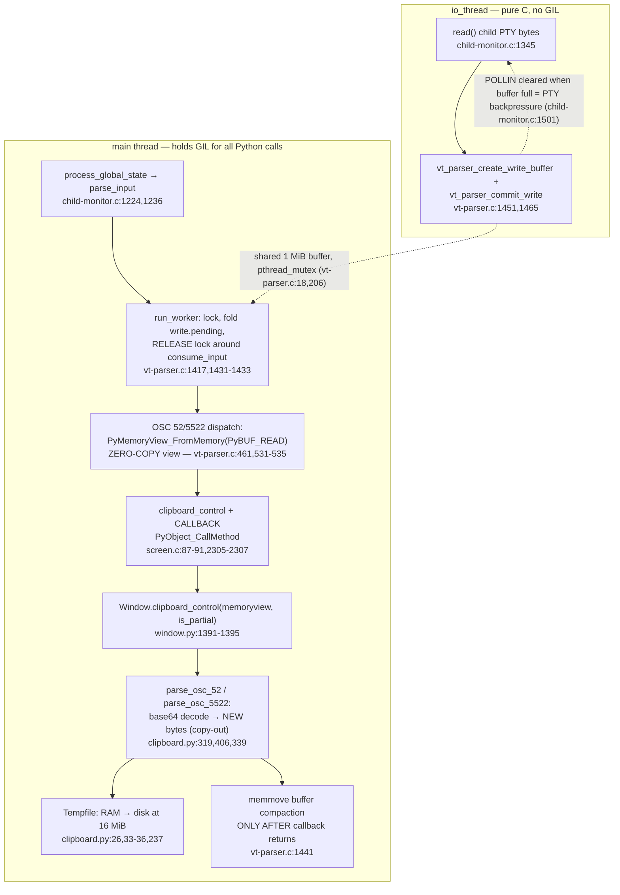

# How kitty Moves Data Between Its C Core and Its Embedded CPython Layer Under Concurrent Load

> **Scope & provenance.** This document is an evidence-based source-code analysis of the
> [`kovidgoyal/kitty`](https://github.com/kovidgoyal/kitty) terminal emulator, anchored to branch
> `kitty_815df1e210e0`, **HEAD commit `815df1e210e0a9ab4622f5c7f2d6891d7dbeddf1`**. Every substantive
> claim carries an inline `path:line` citation (e.g. `kitty/vt-parser.c:461`) that you can verify against
> that exact revision. Where a runtime behavior cannot be read directly off the code, it is explicitly
> labeled **reasoned inference**. The code is the authority; narrative docs and tests are cited only as
> corroboration. A consolidated **Citations / Evidence Appendix** appears at the end (Section 9).

---

## Section 1 — The question, restated, and an executive summary

### 1.1 The question

The question asks, in essence: **how does kitty shuttle data across the boundary between its C core and
the CPython interpreter it embeds, while many things are happening at once?** Concretely it decomposes into
five investigation targets:

1. **The clipboard data path (C → Python)** for *both* small *and* very large payloads — where the bytes
   are parsed, how they are buffered, and exactly how they cross from internal C structures into Python
   objects (chunking, base64 framing, buffer growth/limits).
2. **The concurrency model** — kitty's thread topology, where the embedded-CPython Global Interpreter Lock
   (GIL) is held versus where pure-C work proceeds, and how Python callbacks are dispatched from C.
3. **Event delivery to "kittens"** — how the core delivers events/data to kittens, and the architectural
   difference between *in-process* Python callbacks and *separate-process* kittens.
4. **The impact of an expensive C-side operation** (the canonical example: scanning a large scrollback) —
   whether long C work blocks Python callbacks, holds the GIL, or stalls the I/O thread.
5. **Timing, concurrency, and object ownership** — where `PyObject` reference counting and buffer ownership
   across the C↔Python boundary matter, and the precise windows where subtle races could emerge under real
   runtime conditions.

The remainder of this document answers each target with code citations and, crucially, the **reasoning**
("thinking") behind *why* the design works the way it does.

### 1.2 Executive summary (the whole story in one page)

kitty is a **single operating-system process** that **embeds the CPython interpreter**. Within that process:

- A **main thread** runs the event loop and performs **all** VT/escape-sequence parsing and **all** Python
  callbacks. Because it touches Python objects, it holds the **GIL** whenever it does so. The dispatch chain
  is `process_global_state` → `parse_input` → `do_parse` → `parse_worker` → `run_worker`
  (`kitty/child-monitor.c:1224`, `:1236`, `:438`, `:181`; `kitty/vt-parser.c:1417`).
- A background **`io_thread`** is a pure-C `poll()`/`read()`/`write()` loop that moves raw bytes between the
  child PTYs and a shared parser buffer. It **never calls the Python C API** and therefore never needs the
  GIL (`kitty/child-monitor.c:1481`, reading via `kitty/child-monitor.c:1337`, `:1345`).
- A background **`talk_thread`** does pure-C socket I/O for the remote-control/peer protocol; it enqueues
  messages and lets the **main** thread dispatch them into Python (`kitty/child-monitor.c:1805`, drain at
  `:485`–`:515`). Both background threads are declared together at `kitty/child-monitor.c:55`.

**Inbound clipboard bytes cross C → Python as a zero-copy, read-only `memoryview`** that points *directly*
into the C parser buffer (`PyMemoryView_FromMemory(..., PyBUF_READ)` at `kitty/vt-parser.c:461`). The Python
side is contractually required to **consume it synchronously** — it base64-decodes into brand-new `bytes`
inside the same callback (`kitty/clipboard.py:319`) — because the parser only compacts/reuses that buffer
*after* the callback returns (`kitty/vt-parser.c:1441`).

**Small vs. very large payloads** are handled in two tiers. The C parser caps a single escape code at
`MAX_ESCAPE_CODE_LENGTH = 256 KiB` inside a fixed `BUF_SZ = 1 MiB` buffer
(`kitty/vt-parser.c:21`, `:18`); for OSC 52 specifically it streams the payload in **partial 256 KiB
chunks** by synthesizing a fresh `52;;` header and recursing (`kitty/vt-parser.c:395`, `:386`). On the
Python side the decoded bytes accumulate into a `Tempfile` that begins life as an in-memory `BytesIO` and
**rolls over to a disk-backed temporary file** once it would exceed 16 MiB (`kitty/clipboard.py:26`, `:237`).
So memory is bounded on *both* sides of the boundary.

**Under load**, a `pthread_mutex` guards the shared buffer (`kitty/vt-parser.c:206`). The consumer holds the
lock only to advance cursors, then **releases it around the Python-calling `consume_input`** and reacquires
it to compact (`kitty/vt-parser.c:1431`–`:1433`). This is safe **only** because the producer (`io_thread`)
always writes *ahead* of the consumed region. When the buffer fills, the `io_thread` simply stops asking for
input — `... events = vt_parser_has_space_for_input(...) ? POLLIN : 0` (`kitty/child-monitor.c:1501`) — which
applies **PTY backpressure**: the kernel PTY buffer fills, and the child process blocks on `write()`. That is
how kitty bounds memory instead of growing buffers without limit.

**An expensive C-side operation** such as a large scrollback scan runs on the **main thread while holding the
GIL**. Neither `kitty/history.c` nor `kitty/screen.c` contains any `Py_BEGIN_ALLOW_THREADS` /
`PyGILState_Ensure` GIL-release macros (verified by their absence). The consequence — **reasoned inference
grounded in that absence** — is a "GIL convoy": while the scan runs, *no* other Python-visible event can be
delivered (neither further input parsing nor remote-control dispatch), although nothing is corrupted and the
background threads keep buffering until backpressure engages.

**Object ownership** is explicit and directional. Inbound clipboard data is *borrowed* (the `memoryview`
does not own the C buffer) and must be consumed before the buffer moves. Outbound clipboard data instead
**transfers a strong reference** of a Python `bytes` to GLFW (`ans.free_data = ret` with `.free =
decref_pyobj` at `kitty/glfw.c:2159`, `:2133`) because GLFW may hold the data past the producing call.
Remote-control/peer messages are **copied** with the `"y#"` format (`kitty/child-monitor.c:504`) precisely
because their C buffer is `free()`d immediately afterward (`:505`).

Finally, **kittens are separate processes**. They do *not* receive in-process callbacks in their own address
space; they exchange data with the parent kitty over **terminal escape codes / the remote-control protocol**.
A kitten returns its result by writing a DCS escape sequence to its stdout (`kittens/runner.py:102-105`); the
parent reads those bytes off the PTY and the **VT parser** dispatches them (`kitty/vt-parser.c:603-605`) into
the in-process callback `Window.handle_kitten_result` (`kitty/window.py:1294-1302`). Escape-code remote
control (`@kitty-cmd`) travels the same parser path to `Window.handle_remote_cmd` → `Boss.handle_remote_cmd`
(`kitty/window.py:1279-1280`, `kitty/boss.py:849-852`). A *separate* transport — the single-instance
**socket** drained off the `talk_thread` — is what feeds peer messages into `Boss.peer_message_received`
(`kitty/boss.py:776`); it is **not** the path a kitten's terminal escape codes take. This is the
architectural crux that distinguishes "events to kittens" from "in-process Python callbacks."

---

## Section 2 — Process and thread topology (the mental model to hold first)

Every later answer depends on knowing **which code runs on which thread**, so we establish that first.

### 2.1 One process, one embedded interpreter, three threads

kitty runs as a single OS process that embeds CPython. Inside it, two background threads are declared
side-by-side on the child monitor object:

```c
// kitty/child-monitor.c:55
pthread_t io_thread, talk_thread;
```

They are created with `pthread_create`: the talk thread runs `talk_loop` (`kitty/child-monitor.c:256` and
`:286`, depending on which listening socket is configured), and the I/O thread runs `io_loop`:

```c
// kitty/child-monitor.c:291
ret = pthread_create(&self->io_thread, NULL, io_loop, self);
```

That gives us three execution contexts: the **main thread**, the **`io_thread`**, and the **`talk_thread`**.

### 2.2 The main thread: parsing + every Python callback (under the GIL)

The main thread runs the platform event loop. `main_loop` hands `process_global_state` to the platform's
`run_main_loop`:

```c
// kitty/child-monitor.c:1259  (main_loop)
// kitty/child-monitor.c:1262
run_main_loop(process_global_state, self);
```

`process_global_state` (`kitty/child-monitor.c:1224`) calls `parse_input` and then `render`:

```c
// kitty/child-monitor.c:1236
if (parse_input(self)) input_read = true;
render(now, input_read);
```

`parse_input` (`kitty/child-monitor.c:451`) carries the revealing comment *"Parse all available input that
was read in the I/O thread."* — i.e., the bytes were *read* elsewhere but are *parsed here*. It calls
`do_parse` (`kitty/child-monitor.c:438`), which invokes the installed parse function:

```c
// kitty/child-monitor.c:440
self->parse_func(screen, &pd, flush);
```

`parse_func` is wired to `parse_worker` (`kitty/child-monitor.c:181`; the `_dump` variant at `:180` is only
for command-dump debug builds), and `parse_worker` is a thin shim over `run_worker`:

```c
// kitty/vt-parser.c:1496
parse_worker(void *p, ParseData *pd, bool flush) { run_worker(p, pd, flush); }
```

`run_worker` (`kitty/vt-parser.c:1417`) is where parsing — and therefore **every C→Python callback** —
executes. **This is all on the main thread, holding the GIL** (it freely constructs and calls Python
objects; see Sections 3 and 5).

### 2.3 The `io_thread`: pure-C byte transport, no Python, no GIL

`io_loop` (`kitty/child-monitor.c:1481`) is a classic `poll()` loop. When a child PTY is readable it calls
`read_bytes`:

```c
// kitty/child-monitor.c:1531  (inside io_loop)
has_more = read_bytes(children_fds[EXTRA_FDS + i].fd, children[i].screen);
```

`read_bytes` (`kitty/child-monitor.c:1337`) obtains a write window into the shared parser buffer and reads
raw bytes into it:

```c
// kitty/child-monitor.c:1345
len = read(fd, buf, available_buffer_space);
```

Crucially, **scanning the entire body of `io_loop` (`kitty/child-monitor.c:1481`–`:1600`) reveals no calls
into the Python C API at all** — no `PyObject_*`, no `Py_DECREF`, no `PyGILState_Ensure`, no
`Py_BEGIN_ALLOW_THREADS`. The thread only manipulates raw C buffers and the parser's lock-guarded
producer interface (`vt_parser_create_write_buffer` / `vt_parser_commit_write`, Section 5). Because it never
touches a Python object, it **does not need and does not acquire the GIL**.

**Rationale.** Splitting *raw byte reading* (which needs no Python) from *parsing* (which builds Python
objects and therefore must hold the GIL) keeps the latency-sensitive read path entirely free of GIL
contention. The `io_thread` can keep draining child output into the buffer even while the main thread is busy
inside a Python callback, smoothing throughput. This is exactly the design the project documents narratively:
*"Interaction with child programs takes place in a separate thread from rendering, to improve smoothness"*
(`docs/performance.rst:8`, non-authoritative background).

### 2.4 The `talk_thread`: pure-C socket I/O for remote control / peers

`talk_loop` (`kitty/child-monitor.c:1805`) is the analogous pure-C loop for the remote-control / peer
sockets. Scanning its body (`kitty/child-monitor.c:1805`–`:1900`) again shows **no Python C API calls**: it
accepts connections, reads peer bytes, and enqueues `Message` records. The actual delivery into Python is
performed later, on the **main** thread, by draining that queue (Section 8). So like the `io_thread`, the
`talk_thread` is GIL-free pure C; only the main thread crosses into Python.

### 2.5 Topology summary

| Thread | Entry point | Touches Python / GIL? | Responsibility |
|---|---|---|---|
| **main** | `process_global_state` (`kitty/child-monitor.c:1224`) → `run_worker` (`kitty/vt-parser.c:1417`) | **Yes** — holds the GIL | VT parsing + **all** C→Python callbacks + rendering + draining peer queue |
| **`io_thread`** | `io_loop` (`kitty/child-monitor.c:1481`) | **No** — pure C | `read()`/`write()` child PTY bytes into the shared parser buffer; apply PTY backpressure |
| **`talk_thread`** | `talk_loop` (`kitty/child-monitor.c:1805`) | **No** — pure C | Accept/read remote-control & peer sockets; enqueue messages for the main thread |

Hold this table in mind: the clipboard crossing (Section 3), the GIL discipline (Section 5), the
expensive-operation analysis (Section 6), and the kitten-event story (Section 8) are all just consequences of
*which thread runs what*.

---

## Section 3 — Inbound clipboard path (C → Python): small vs. very large

This section answers the literal question: *how do clipboard bytes cross "from internal screen structures
into Python objects," and how does that differ for small vs. very large payloads?*

### 3.1 Protocol framing (background)

A program running inside kitty sets/queries the clipboard with an **OSC** (Operating System Command) escape
sequence. **OSC 52** is the standard, plain-text clipboard escape; kitty additionally defines **OSC 5522**, an
extension of OSC 52 (`docs/clipboard.rst:12`) that supports arbitrary, MIME-typed data, permission prompts
and a multiplexer `id`. Its wire format is `<OSC>5522;metadata;payload<ST>` (`docs/clipboard.rst:15`),
where the payload is base64-encoded. For large reads the protocol recommends the emulator chunk the data —
"a recommended size for each chunk is 4096 bytes" (`docs/clipboard.rst:50`). These docs are
background; the behavior below is read from the code.

### 3.2 The fixed buffer and the zero-copy crossing

The parser reads into a **single fixed-size ring-like buffer**:

```c
// kitty/vt-parser.c:18
#define BUF_SZ (1024u*1024u)            // 1 MiB
// kitty/vt-parser.c:21
#define MAX_ESCAPE_CODE_LENGTH (BUF_SZ / 4u)   // 256 KiB
```

When an OSC sequence is dispatched, `dispatch_osc` (`kitty/vt-parser.c:457`) exposes the payload to Python as
a **zero-copy, read-only `memoryview`** that points *directly into the C buffer*:

```c
// kitty/vt-parser.c:460-462  (START_DISPATCH)
#define START_DISPATCH {\
    RAII_PyObject(mv, PyMemoryView_FromMemory((char*)buf + i, limit - i, PyBUF_READ)); \
    if (mv) {
```

Two details matter enormously:

- **`PyBUF_READ` + `PyMemoryView_FromMemory`** means no bytes are copied — `mv` is a window onto the existing
  C memory. (Per the CPython C-API contract, `PyMemoryView_FromMemory` does **not** take ownership of that
  memory; it merely points at it. Cited as background — the code is the authority.)
- **`RAII_PyObject(mv, ...)`** ties the view's lifetime to the enclosing C scope: when `START_DISPATCH`'s
  block ends, the view is released. The matching `END_DISPATCH` is literally
  `}; PyErr_Clear(); break; }` (`kitty/vt-parser.c:464`) — so any Python exception raised during dispatch is
  **cleared**, not propagated into C control flow.

The clipboard codes are dispatched here:

```c
// kitty/vt-parser.c:531-535
case 52: case 5522:
    START_DISPATCH
    if (is_extended_osc && code == 52) code = -52;
    DISPATCH_OSC_WITH_CODE(clipboard_control);
    END_DISPATCH
```

Note the `code = -52` trick: a *partial* OSC 52 chunk is signaled to the C callback by negating the code
(explained in §3.5). `DISPATCH_OSC_WITH_CODE(clipboard_control)` expands to a direct call
`clipboard_control(self->screen, code, mv)`.

### 3.3 The C → Python bridge: `clipboard_control` + the `CALLBACK` macro

`clipboard_control` lives in the screen model and immediately forwards to Python:

```c
// kitty/screen.c:2305-2307
clipboard_control(Screen *self, int code, PyObject *data) {
    if (code == 52 || code == -52) { CALLBACK("clipboard_control", "OO", data, code == -52 ? Py_True: Py_False); }
    else { CALLBACK("clipboard_control", "OO", data, Py_None);}
}
```

The `CALLBACK` macro is the canonical C→Python bridge for a `Screen`:

```c
// kitty/screen.c:87-91
#define CALLBACK(...) \
    if (self->callbacks != Py_None) { \
        PyObject *callback_ret = PyObject_CallMethod(self->callbacks, __VA_ARGS__); \
        if (callback_ret == NULL) PyErr_Print(); else Py_DECREF(callback_ret); \
    }
```

Three things to read off this macro:

1. It calls a **method on `self->callbacks`**, passing the `memoryview` straight through as the `"O"`
   argument — so Python receives the *borrowed view*, not a copy.
2. On success it does **`Py_DECREF(callback_ret)`** — the return value's reference is released, so there is no
   leak.
3. On failure (`callback_ret == NULL`) it does **`PyErr_Print()`** — the exception is printed and cleared,
   **never** propagated into C. This is deliberate graceful degradation: a malformed clipboard escape can
   never crash or unwind the C parser.

What *is* `self->callbacks`? It is the bound Python `Window`. The `Screen` is constructed with the `Window`
as its first argument:

```python
# kitty/window.py:604
self.screen: Screen = Screen(self, 24, 80, opts.scrollback_lines, cell_width, cell_height, self.id)
```

and the C struct stores it as `PyObject *callbacks` (`kitty/screen.h:104`). (The C-extension surface is
declared for type-checkers as `class Screen:` in `kitty/fast_data_types.pyi:1109`.) So
`PyObject_CallMethod(self->callbacks, "clipboard_control", ...)` invokes `Window.clipboard_control`.

### 3.4 The Python receiver and the `is_partial` **tri-state**

The Python entry point is:

```python
# kitty/window.py:1391-1395
def clipboard_control(self, data: memoryview, is_partial: Optional[bool] = False) -> None:
    if is_partial is None:
        self.clipboard_request_manager.parse_osc_5522(data)
    else:
        self.clipboard_request_manager.parse_osc_52(data, is_partial)
```

`is_partial` is **not a boolean — it is a tri-state**, and getting this exactly right is essential:

| Wire input | C code passed | `is_partial` in Python | Routed to |
|---|---|---|---|
| Complete OSC 52 | `52` | `False` (`Py_False`) | `parse_osc_52(data, False)` |
| Partial OSC 52 chunk | `-52` | `True` (`Py_True`) | `parse_osc_52(data, True)` |
| Genuine OSC 5522 | `5522` | `None` (`Py_None`) | `parse_osc_5522(data)` |

This mapping is produced by the `code == -52 ? Py_True : Py_False` / else-`Py_None` logic in
`clipboard_control` (`kitty/screen.c:2306-2307`) and consumed by the `is_partial is None` check in
`Window.clipboard_control` (`kitty/window.py:1392`).

### 3.5 SMALL payload: the synchronous copy-out (why zero-copy is safe)

For a small, complete OSC 52, `parse_osc_52` runs once with `is_partial=False`:

```python
# kitty/clipboard.py:406-425  (parse_osc_52, abridged)
idx = find_in_memoryview(data, ord(b';'))
...                                   # split "where;payload" on ';'
if len(data) == 1 and data.tobytes() == b'?':
    rr = ReadRequest(...)             # a lone '?' is a READ request
    self.handle_read_request(rr)
else:
    wr = self.in_flight_write_request or WriteRequest(...)
    wr.add_base64_data(data)          # feed payload bytes
    if is_partial:
        return                        # wait for more chunks
    self.in_flight_write_request = None
    self.handle_write_request(wr)     # finalize on the LAST chunk
```

The all-important **copy-out** happens inside `add_base64_data` → `write_saving_leftover_bytes`
(`kitty/clipboard.py:280-301`). Base64 decodes 4 input characters → 3 output bytes, so any trailing
`len % 4` characters cannot yet be decoded and must be carried to the next chunk. They are copied into a
**brand-new `bytes`** object:

```python
# kitty/clipboard.py:286
self.current_leftover_bytes = memoryview(bytes(mv[-extra:]))
# kitty/clipboard.py:296  (joining leftover with the next chunk — also a fresh bytes)
self.write_base64_data(memoryview(bytes(self.current_leftover_bytes) + data[:extra]))
```

and the decodeable prefix is decoded — again into a **fresh `bytes`** — and written out:

```python
# kitty/clipboard.py:319
d = standard_b64decode(b)
self.tempfile.write(d)
```

**This is the single most important safety invariant in the whole inbound path.** The borrowed `memoryview`
points into the C buffer, which the parser is free to reuse the instant `consume_input` returns
(`memmove` compaction at `kitty/vt-parser.c:1441`, Section 5). `parse_osc_52` therefore **never retains the
view** — every byte it needs to keep is `bytes(...)`-copied or `standard_b64decode`-decoded *synchronously,
inside the callback, before control returns to C*. If Python instead stashed the raw `memoryview` for later,
it would become a dangling pointer the moment the buffer compacted — a classic use-after-free. The design is
correct precisely because the consume-out is synchronous.

**Behavioral corroboration (tests).** `kitty_tests/clipboard.py` exercises exactly this leftover logic: after
`WriteRequest(max_size=64).add_base64_data('bGlnaHQgd29yaw')` the object holds
`current_leftover_bytes == b'aw'` (`kitty_tests/clipboard.py:14`), and after `flush_base64_data()` the
decoded result is `data_for() == b'light work'` (`kitty_tests/clipboard.py:16`). Feeding the same base64
**one byte at a time** reassembles correctly (`kitty_tests/clipboard.py:21-24`) — proving the
chunk-boundary/leftover machinery is robust.

### 3.6 VERY LARGE payload: C-side 256 KiB streaming + Python-side disk spillover

A multi-megabyte clipboard paste cannot fit in a single 256 KiB escape code, let alone be held in memory
whole. kitty handles this with a **two-tier** strategy.

**Tier 1 — C side: stream in 256 KiB partial chunks through the fixed 1 MiB buffer.** The accumulator that
waits for the escape terminator is `accumulate_st_terminated_esc_code` (`kitty/vt-parser.c:395`). If it finds
the ST terminator it dispatches the whole code (partial flag `false`). Otherwise, once the accumulated length
exceeds `MAX_ESCAPE_CODE_LENGTH` (256 KiB), it special-cases OSC 52:

```c
// kitty/vt-parser.c:381  (is the in-flight code an OSC 52?)
is_osc_52(PS *self) { return memcmp(self->buf + self->read.consumed, "52;", 3) == 0; }
```

```c
// kitty/vt-parser.c:413  (dispatch a PARTIAL chunk: note the trailing 'true')
dispatch(self, self->buf + self->read.consumed, self->read.pos - self->read.consumed, true);
// kitty/vt-parser.c:416-417
continue_osc_52(self);
return accumulate_st_terminated_esc_code(self, dispatch);
```

`continue_osc_52` (`kitty/vt-parser.c:386`) rewinds the cursor by four bytes and writes a **synthetic `52;;`
header** so the parser can keep treating the remaining bytes as a fresh OSC 52, then recurses:

```c
// kitty/vt-parser.c:389-390
self->buf[self->read.pos++] = '5'; self->buf[self->read.pos++] = '2';
self->buf[self->read.pos++] = ';'; self->buf[self->read.pos++] = ';';
```

The net effect: **arbitrarily large OSC 52 payloads stream through the fixed 1 MiB buffer**, 256 KiB at a
time, each chunk delivered to Python as `is_partial=True` and the final one as `is_partial=False`. Notably,
this generosity is **specific to OSC 52** — any *other* over-long escape code is simply dropped:

```c
// kitty/vt-parser.c:419
REPORT_ERROR("%s escape code too long (%zu bytes), ignoring it", vte_state_name(self->vte_state), pos);
```

**Tier 2 — Python side: spill from RAM to disk.** Each decoded chunk is written into a `Tempfile`
(`kitty/clipboard.py:26`) that starts as an in-memory buffer and transparently rolls over to a real
on-disk temporary file once it grows past a threshold:

```python
# kitty/clipboard.py:29   self.file: Union[io.BytesIO, IO[bytes]] = io.BytesIO()
# kitty/clipboard.py:33-36  (rollover_if_needed)
if isinstance(self.file, io.BytesIO) and self.file.tell() + sz > self.max_size:
    before = self.file.getvalue()
    self.file = TemporaryFile()
    self.file.write(before)
```

The rollover threshold defaults to **16 MiB**:

```python
# kitty/clipboard.py:237
rollover_size: int = 16 * 1024 * 1024, max_size: int = -1,
```

So small clipboard data lives entirely in RAM; very large data spills to disk and is later streamed back out
in `io.DEFAULT_BUFFER_SIZE` pieces by `create_chunker` (`kitty/clipboard.py:52-65`, the `chunker()` at
`:57`). An overall cap is also enforced — `write_base64_data` stops accepting data, logs, and sets
`max_size_exceeded` once the configured `clipboard_max_size` is hit (`kitty/clipboard.py:321-323`).

The OSC 5522 path (`is_partial=None`) is the structured analog: `parse_osc_5522`
(`kitty/clipboard.py:339-405`) parses `type=read|write|wdata|walias` metadata and accumulates `wdata` chunks
through the same `add_base64_data` machinery, finalizing on the terminating empty-MIME packet.

**Rationale.** The system never grows the C parse buffer without bound. It caps a single code at 256 KiB,
streams OSC 52 in partial chunks, and applies PTY backpressure (Section 5) if the consumer falls behind;
meanwhile the Python side bounds its own memory by spilling to disk at 16 MiB. That is the complete,
end-to-end answer to "what happens with a huge clipboard paste": bounded memory on both sides, no unbounded
buffer growth, and a zero-copy hand-off that is safe because Python copies out synchronously.


---

## Section 4 — Outbound clipboard path (system pastes *from* kitty) + `PyObject` ownership transfer

The inbound path *borrows* memory from C into Python. The **outbound** path — when another application asks
the windowing system for the data kitty has on the clipboard — is the mirror image: it **transfers a strong
reference of a Python object to C (GLFW)**. This is the clearest example of cross-boundary `PyObject`
ownership in the codebase.

### 4.1 The GLFW data-chunk callback

GLFW pulls clipboard data from kitty by repeatedly calling `get_clipboard_data` (`kitty/glfw.c:2138`). The
function returns a `GLFWDataChunk` whose `.free` hook is a small wrapper around `Py_XDECREF`:

```c
// kitty/glfw.c:2133
decref_pyobj(void *x) { Py_XDECREF(x); }

// kitty/glfw.c:2138-2139
get_clipboard_data(const char *mime_type, void *iter, GLFWClipboardType ct) {
    GLFWDataChunk ans = {.iter=iter, .free=decref_pyobj};
```

On the **first** call (`iter == NULL`) it lazily fetches the Python producer — `boss.clipboard` or
`boss.primary_selection` — and calls it to obtain a Python **iterator**, which it stores as `ans.iter`
(`kitty/glfw.c:2142-2147`). On each **subsequent** call it advances that iterator and hands the resulting
`bytes` chunk back to GLFW:

```c
// kitty/glfw.c:2155-2159
PyObject *ret = PyObject_CallFunctionObjArgs(iter, NULL);
if (ret == NULL) return ans;
ans.data = PyBytes_AS_STRING(ret);   // BORROWED pointer into the bytes' storage
ans.sz   = PyBytes_GET_SIZE(ret);
ans.free_data = ret;                 // hand the PyObject itself to GLFW
```

### 4.2 Why ownership is *transferred*, not borrowed

`ans.data = PyBytes_AS_STRING(ret)` is a **borrowed** raw pointer into the `bytes` object's internal storage;
it is valid only as long as `ret` is alive. But GLFW may consume `ans.data` *after* `get_clipboard_data`
returns. If kitty merely `Py_DECREF`-ed `ret` before returning, that pointer would dangle.

The code avoids this by setting **`ans.free_data = ret`** (`kitty/glfw.c:2159`): the `bytes` object is handed
to GLFW, and the `GLFWDataChunk.free` hook (`decref_pyobj`, `kitty/glfw.c:2133`) is what eventually releases
it. In other words, ownership of that one outbound `bytes` object is **transferred from Python to GLFW** for
the lifetime of the chunk; GLFW promises to call `.free` when done, balancing the reference. No leak, no
dangle.

The Python producer side is `Clipboard.__call__` (`kitty/clipboard.py:138`), which returns a chunker, and the
`Tempfile.create_chunker` generator (`kitty/clipboard.py:52-65`) that yields the data in
`io.DEFAULT_BUFFER_SIZE` pieces — so even a multi-megabyte paste *out* of kitty streams chunk-by-chunk rather
than materializing as one giant buffer.

Inbound writes (the system handing data *to* kitty) take the simpler **copying** route via the `"y#"`
format — `write_clipboard_data` (`kitty/glfw.c:2180`) — because there is no need to keep a Python object
alive across the call.

**Rationale.** The direction of data flow dictates the ownership strategy. Inbound clipboard data is
*borrowed* (zero-copy `memoryview`) because Python consumes it immediately and synchronously. Outbound data
must survive past the C call that produced it, so kitty *transfers a strong reference* and pairs it with a
matching decref `free` hook. Both are correct; each is tailored to its lifetime requirement.

---

## Section 5 — Concurrency under load: producer/consumer handshake, the GIL, and backpressure

This section answers the concurrency target directly: how the three threads cooperate over the shared buffer,
where the GIL is and is not held, and how memory stays bounded under a flood of input.

### 5.1 The shared buffer and its mutex

The 1 MiB parser buffer (`BUF_SZ`, `kitty/vt-parser.c:18`) is shared between the producer (`io_thread`) and
the consumer (main thread). It is guarded by a single mutex:

```c
// kitty/vt-parser.c:206
pthread_mutex_t lock;
// kitty/vt-parser.c:1413-1414
#define with_lock pthread_mutex_lock(&self->lock);
#define end_with_lock pthread_mutex_unlock(&self->lock);
```

The buffer is logically divided into a **consumed/readable region** (`read`) and a **pending write region**
(`write`). The producer always appends to the write region *ahead* of the read region; the consumer turns
pending writes into readable bytes and then parses them.

### 5.2 The consumer: hold the lock briefly, **release it around the Python callback**

`run_worker` (`kitty/vt-parser.c:1417`) is the heart of the handshake:

```c
// kitty/vt-parser.c:1420  (acquire)
with_lock {
    self->read.sz += self->write.pending; self->write.pending = 0;   // publish pending writes
    ...
    do {
        // kitty/vt-parser.c:1431-1433  (RELEASE the lock around the Python-calling consume_input)
        end_with_lock; {
            consume_input(self, pd->dump_callback, screen->window_id);
        } with_lock;
        self->read.sz += self->write.pending; self->write.pending = 0;
    } while (self->read.pos < self->read.sz);
    ...
    // kitty/vt-parser.c:1441  (compact ONLY after callbacks have returned)
    if (self->read.sz) memmove(self->buf, self->buf + self->read.consumed, self->read.sz);
} end_with_lock;
```

The structure is precise and deliberate:

1. **Under the lock**, fold `write.pending` into the readable size and zero `write.pending` — a quick cursor
   update.
2. **Release the lock** (`end_with_lock`) and run `consume_input`, which parses and **calls into Python**
   (this is where the OSC 52 dispatch and the zero-copy `memoryview` of Section 3 happen).
3. **Reacquire the lock** (`with_lock`), pick up any newly pending writes, and loop until drained.
4. Only **after** all callbacks have returned, **compact** the buffer with `memmove` (`:1441`), discarding
   the consumed prefix so future writes have room.

### 5.3 The producer: always write *ahead* of the consumed region

The `io_thread` uses the parser's producer interface, all under the same lock:

```c
// kitty/vt-parser.c:1451  (carve out a write window past the current data)
vt_parser_create_write_buffer(Parser *p, size_t *sz) { ... self->write.offset = self->read.sz + self->write.pending; ... }
// kitty/vt-parser.c:1465  (publish the bytes just read)
vt_parser_commit_write(Parser *p, size_t sz) { ... self->write.pending += sz; ... }
// kitty/vt-parser.c:1477,1481  (is there any room left at all?)
vt_parser_has_space_for_input(const Parser *p) { ... ans = self->read.sz + self->write.pending < BUF_SZ; ... }
```

The key invariant: `vt_parser_create_write_buffer` always positions the write window at
`self->read.sz + self->write.pending` — i.e. **strictly beyond** the bytes the consumer is reading.

### 5.4 Why releasing the lock around the callback is safe (the core correctness invariant)

Releasing a mutex while another thread can take it is normally where races live. Here it is **safe**, and the
reason is the write-ahead invariant:

- While the main thread is inside `consume_input` (lock released), the `io_thread` may take the lock and
  append more bytes. But `vt_parser_create_write_buffer` only ever hands out space **ahead of** the consumed
  region (`kitty/vt-parser.c:1451`), so the producer **physically cannot overwrite the bytes the consumer is
  currently parsing** — including the bytes behind the live zero-copy `memoryview`.
- The consumer defers the only operation that *moves* existing bytes — the `memmove` compaction
  (`kitty/vt-parser.c:1441`) — until **after** `consume_input` returns, i.e. after every borrowed
  `memoryview` for this batch has already been released by `RAII_PyObject` and consumed by Python.

So the lock protects only the small cursor updates; the large parse-and-callback work runs lock-free, and the
borrowed view stays valid for its entire (synchronous) lifetime. **This is the invariant that makes both the
concurrency and the zero-copy design correct simultaneously.**

### 5.5 PTY backpressure: the memory-bounding strategy

What if the child program produces bytes faster than the main thread can parse them (for instance, because
the main thread is stuck in an expensive operation — Section 6)? kitty does **not** grow the buffer. Instead,
the `io_thread` simply stops polling that child for input once the buffer is full:

```c
// kitty/child-monitor.c:1501
children_fds[EXTRA_FDS + i].events = vt_parser_has_space_for_input(screen->vt_parser) ? POLLIN : 0;
```

When `vt_parser_has_space_for_input` returns false (`read.sz + write.pending >= BUF_SZ`), `POLLIN` is cleared,
the `io_thread` stops `read()`-ing, the kernel PTY buffer fills, and **the child process blocks on its next
`write()`**. This is classic backpressure: throughput is throttled at the source rather than absorbed by
unbounded memory growth. When the consumer catches up and frees space, `POLLIN` is restored and reads resume.

### 5.6 Wakeup batching

To avoid waking the main loop on every byte, the `io_thread` coalesces wakeups using the configurable
`input_delay`:

```c
// kitty/child-monitor.c:1562-1567
#define WAKEUP { wakeup_main_loop(); last_main_loop_wakeup_at = now; has_pending_wakeups = false; }
// we only wakeup the main loop after input_delay as wakeup is an expensive operation ...
if (data_received) {
    if ((now = monotonic()) - last_main_loop_wakeup_at > OPT(input_delay)) WAKEUP
    else has_pending_wakeups = true;
}
```

`input_delay` defaults to **3 ms** (`kitty/options/definition.py:878`; documented at `docs/performance.rst:48`).
So bursts of child output are parsed in batches a few milliseconds apart rather than one wakeup per read —
fewer GIL acquisitions, smoother throughput.

### 5.7 GIL discipline, summarized

Putting it together: the `io_thread` and `talk_thread` are **pure C** and call no Python C API (verified by
the absence of any `PyObject_*` / `PyGILState_Ensure` / `Py_BEGIN_ALLOW_THREADS` in their loop bodies,
`kitty/child-monitor.c:1481`-`:1600` and `:1805`-`:1900`), so they neither hold nor need the GIL. **All**
parsing and **all** Python callbacks happen on the **main thread**, which holds the GIL throughout
`run_worker` → `consume_input` → the `CALLBACK` dispatch. The mutex coordinates *byte ownership* between
threads; the GIL coordinates *Python-object access* — and only one thread (main) ever needs the latter.


---

## Section 6 — Expensive C-side operations (e.g., large scrollback scans): effect on events & memory

The question singles out an expensive C operation — scanning a large scrollback history — and asks whether it
affects event delivery or memory management. The answer follows directly from the topology (Section 2) and
the GIL discipline (Section 5).

### 6.1 Where scrollback lives, and the proof by absence

The scrollback ring buffer is implemented in `kitty/history.c` — e.g. `add_segment`
(`kitty/history.c:18`) grows the segmented backing store, and `historybuf_cpu_cells`
(`kitty/history.c:190`) returns the cells for a given line. A scan over a large history walks many such
segments.

The decisive observation is a **proof by absence**: neither `kitty/history.c` nor `kitty/screen.c` contains
**any** GIL-releasing macro. Searching both files for `Py_BEGIN_ALLOW_THREADS` and `PyGILState_Ensure`
returns **zero matches** in each. Because these routines are reached only from the main thread's
`run_worker` → `consume_input` path (Section 2), and because they never release the GIL, **a large
scrollback scan necessarily runs on the main thread while holding the GIL**.

### 6.2 Consequence: the "GIL convoy" (reasoned inference, grounded in the cited code)

> **Label: reasoned inference grounded in the cited absence of GIL-release macros.** The following is the
> logical consequence of "the scan holds the GIL and does not release it," not a separately observed runtime
> trace. It can be corroborated by building/running in the container (Section 9.3); it is presented here as
> reasoning, as the task requires.

While that scan executes:

- **No other Python code can run.** The GIL is held by the main thread for the duration of the scan, so any
  work that requires Python — *further input parsing and OSC/clipboard dispatch* (Section 3), *and*
  *remote-control / peer-message delivery* (Section 8) — is **deferred** until the scan returns. Events are
  not lost; they are **delayed**. This is the classic single-threaded "GIL convoy": one long C computation
  that builds/uses Python objects serializes every Python-visible event behind it.
- **The background threads keep running.** The `io_thread` and `talk_thread` are pure C (Section 2), so they
  are **not** blocked by the held GIL. The `io_thread` keeps `read()`-ing child output into the 1 MiB buffer
  and the `talk_thread` keeps enqueuing peer messages.
- **Memory stays bounded by backpressure, not by buffer growth.** As the main thread is busy and the buffer
  fills, `vt_parser_has_space_for_input` goes false and the `io_thread` clears `POLLIN`
  (`kitty/child-monitor.c:1501`). The child then blocks on `write()`. So even a long stall cannot blow up
  memory — it converts into backpressure on the child instead.

### 6.3 What does *not* happen

Equally important is what an expensive C op does **not** do:

- It does **not corrupt** anything. There is no second thread mutating Python objects, so there is no data
  race on Python state; the GIL guarantees that.
- It does **not stall the `io_thread`'s `read()`** directly; the `io_thread` keeps reading until the shared
  buffer is full, at which point backpressure (not a crash, not unbounded growth) is the outcome.
- It does **not** silently drop clipboard/remote-control events; they queue and are delivered once the main
  thread is free.

**Rationale.** kitty trades latency for simplicity and correctness here. By keeping all Python interaction on
one GIL-holding thread, it avoids an entire class of concurrency bugs — at the cost that a genuinely
expensive *synchronous* C operation on the main thread adds latency to every subsequent Python-visible event.
Backpressure ensures that latency never turns into a memory blow-up.

---

## Section 7 — Object ownership, reference counting, and the subtle race surfaces

This is the analytical payoff: a synthesis of the ownership contracts that cross the C↔Python boundary and
the precise windows where timing/ownership become subtle. Each is a place where a naive change would
introduce a race or a memory error.

### 7.1 Borrowed inbound `memoryview` lifetime (the synchronous-consume contract)

`PyMemoryView_FromMemory(..., PyBUF_READ)` (`kitty/vt-parser.c:461`) creates a view that **does not own** the
backing C memory — it only points at it. The buffer it points into is reused by the parser: the consumer
compacts it with `memmove` (`kitty/vt-parser.c:1441`) after the callback, and the producer overwrites the
freed space on subsequent reads. **If Python retained the view past the dispatch, it would become a dangling
pointer → crash or memory corruption.**

Safety comes entirely from the contract that Python **consumes the view synchronously**: `parse_osc_52` copies
out leftovers into fresh `bytes` (`kitty/clipboard.py:286`, `:296`) and `standard_b64decode`s the rest into a
new `bytes` (`kitty/clipboard.py:319`) — all *before* returning to C, and the parser only compacts *after*
`consume_input` returns. The borrowed view never outlives the dispatch.

### 7.2 The lock-release-during-callback window

`run_worker` releases the mutex around `consume_input` (`kitty/vt-parser.c:1431-1433`). This is a real
concurrency window — another thread *can* take the lock and append — but it is correct **only** because the
producer writes strictly *ahead* of the consumed region (`kitty/vt-parser.c:1451`) and the buffer-moving
`memmove` is deferred until after the callback (`kitty/vt-parser.c:1441`). Remove either condition and the
borrowed `memoryview` of §7.1 could be overwritten mid-parse. The two invariants are co-dependent.

### 7.3 Outbound strong-reference transfer

On the outbound path, the lifetime requirement is reversed: GLFW may read the chunk after the producing call
returns. kitty therefore **transfers ownership** of the `bytes` to GLFW — `ans.free_data = ret`
(`kitty/glfw.c:2159`) — paired with the releasing hook `.free = decref_pyobj` (`kitty/glfw.c:2133`). The
subtle point: `ans.data` is a *borrowed* `PyBytes_AS_STRING(ret)` pointer (`kitty/glfw.c:2157`), valid only
while `ret` lives; the explicit ownership transfer is what keeps `ret` — and therefore `ans.data` — alive.

### 7.4 Zero-copy vs. copy: a deliberate, contrasting choice

Why is the clipboard path zero-copy but the peer/remote-control path copied? Compare:

- **Clipboard (zero-copy):** the source bytes live in the parser buffer that stays valid through the
  synchronous callback, so a borrowed `memoryview` is safe and cheap (`kitty/vt-parser.c:461`).
- **Peer / remote control (copied):** the message is dispatched with the **`"y#"`** format, which makes
  CPython **copy** the bytes into a fresh `bytes` object:

  ```c
  // kitty/child-monitor.c:504
  resp = PyObject_CallMethod(global_state.boss, "peer_message_received", "y#KO",
                             msg->data, (int)msg->sz, msg->peer_id, ...);
  // kitty/child-monitor.c:505
  free(msg->data);
  ```

  The reason the copy is *necessary* is on the very next line: `free(msg->data)` releases the C buffer
  **immediately** after the call. A borrowed/zero-copy view would dangle the instant `free` runs, so the data
  **must** be copied into a Python-owned object during the call. The `"y#"` format does exactly that.

This contrast is the crux of the ownership story: **the lifetime of the source memory dictates whether kitty
borrows (zero-copy) or copies/transfers.** Clipboard source memory outlives the synchronous callback → borrow.
Peer source memory is freed right after → copy. Outbound clipboard memory must outlive the call → transfer.

### 7.5 Callback-result reference counting

Finally, the `CALLBACK` macro itself is reference-count-correct: on success it `Py_DECREF`s the return value,
and on failure it `PyErr_Print()`s rather than leaking or propagating
(`kitty/screen.c:90-91`). The peer-dispatch path similarly clears its response with `Py_CLEAR` after use.
There is no reference leak and no exception leaks into C control flow.

### 7.6 Where a naive change would break things (summary of race surfaces)

| Surface | Invariant that keeps it safe | What breaks it |
|---|---|---|
| Inbound `memoryview` (`kitty/vt-parser.c:461`) | Python copies out **synchronously**; compaction deferred (`kitty/clipboard.py:319`, `kitty/vt-parser.c:1441`) | Retaining the view past the callback → dangling pointer |
| Lock released around `consume_input` (`kitty/vt-parser.c:1431-1433`) | Producer writes **ahead** of consumed region (`kitty/vt-parser.c:1451`) | Letting the producer write *into* the consumed region |
| Outbound `bytes` to GLFW (`kitty/glfw.c:2157-2159`) | Strong-reference **transfer** + `decref_pyobj` free hook | `Py_DECREF`-ing before GLFW is done → dangling `ans.data` |
| Peer message (`kitty/child-monitor.c:504-505`) | `"y#"` **copies** before `free(msg->data)` | Switching to zero-copy → use-after-free |
| Expensive main-thread C op (Section 6) | Single GIL-holding thread → no Python data race | Mutating Python state from a background thread without the GIL |

---

## Section 8 — In-process Python callbacks vs. the separate-process kitten model

The final target: how do events/data reach "kittens," and how is that different from the in-process callbacks
discussed so far? The short answer: **they are two architecturally distinct mechanisms.**

### 8.1 In-process callbacks (inside the main kitty process, on the main thread, under the GIL)

**Three** kinds of events are delivered as **in-process C→Python calls**, all on the main thread under the
GIL. Two of them ride the *terminal byte stream* (and so arrive through the `io_thread` → parser pipeline of
Sections 2–3); the third rides a *socket* (and so arrives through the `talk_thread`):

- **Clipboard (terminal byte stream)** — `clipboard_control` → `Window.clipboard_control` (Section 3), via
  the `CALLBACK` macro (`kitty/screen.c:87-91`).
- **Terminal DCS dispatch (terminal byte stream): kitten results + escape-code remote control.** When the
  parser encounters a kitty DCS sequence (`\x1bP@kitty-…`), `dispatch_dcs` strips the leading `@` and hands
  the rest to `parse_kitty_dcs` (`kitty/vt-parser.c:654-655`, `:586`), which matches the `kitty-` prefix
  (`kitty/vt-parser.c:600-601`) and routes by sub-prefix: `cmd{` → `handle_remote_cmd`
  (`kitty/vt-parser.c:603`) and `kitten-result|` → `handle_kitten_result` (`kitty/vt-parser.c:605`). The
  dispatch macro wraps the payload in a **zero-copy** `memoryview` and calls `screen_handle_kitty_dcs`
  (`kitty/vt-parser.c:595`), which fires the `CALLBACK` into the bound `Window` (`kitty/screen.c:2441-2442`).
  On the Python side these land as `Window.handle_remote_cmd` → `get_boss().handle_remote_cmd`
  (`kitty/window.py:1279-1280`) — which calls `_handle_remote_command` and returns a response
  (`kitty/boss.py:849-852`, defined at `:590`) — and `Window.handle_kitten_result`, which base85-decodes the
  JSON result and runs its processors (`kitty/window.py:1294-1302`). **This is the path a kitten's escape-code
  output actually takes.**
- **Socket peer / single-instance remote-control messages (socket).** The `talk_thread` only *enqueues* peer
  messages arriving on kitty's single-instance/remote-control **socket**; the **main** thread drains the queue
  (`kitty/child-monitor.c:485-515`) and dispatches each one into Python with a **copy** (`y#`), freeing the C
  buffer immediately afterward:

  ```c
  // kitty/child-monitor.c:504-505
  resp = PyObject_CallMethod(global_state.boss, "peer_message_received", "y#KO", ...);
  free(msg->data);
  ```

  The canonical C→Python "boss" dispatch macro generalizes the call pattern:

  ```c
  // kitty/state.h:284-288
  #define call_boss(name, ...) if (global_state.boss) { \
      PyObject *cret_ = PyObject_CallMethod(global_state.boss, #name, __VA_ARGS__); \
      if (cret_ == NULL) { PyErr_Print(); } else Py_DECREF(cret_); }
  ```

  The Python handler is `Boss.peer_message_received` (`kitty/boss.py:776`). For a remote-control peer message
  it recognizes the DCS-framed command — prefix `b'\x1bP@kitty-cmd'` (`kitty/boss.py:781`) and terminator
  `b'\x1b\\'` (`kitty/boss.py:782`) — strips the framing, and calls `_handle_remote_command`
  (`kitty/boss.py:785`, defined at `:590`). **This socket path is distinct from the terminal-DCS path above:**
  it is how a *separate process* speaking the remote-control protocol over the socket reaches the boss — not
  how a kitten's stdout escape codes reach it.

All three execute **inside the main kitty process** on the main thread, holding the GIL.

### 8.2 Separate-process kittens (escape codes / remote-control protocol)

**Kittens are independent processes**, not in-process callbacks. They are launched and resolved by
`kittens/runner.py` — `launch` (`kittens/runner.py:87`), `run_kitten` (`:110`), and `main` (`:194`). Because a
kitten is a *different process*, it cannot receive a C→Python callback in kitty's address space. Instead it
communicates with the parent kitty over the **terminal byte stream**: it reads/writes escape codes and uses
the remote-control protocol.

Concretely, a kitten returns its result to the parent by writing a **DCS escape code to its stdout**, which
the parent terminal then parses:

```python
# kittens/runner.py:102-105
data = base64.b85encode(json.dumps(result).encode('utf-8'))
sys.stdout.buffer.write(b'\x1bP@kitty-kitten-result|')
sys.stdout.buffer.write(data)
sys.stdout.buffer.write(b'\x1b\\')
```

That is: serialize the result to JSON → base85-encode → wrap in a `\x1bP@kitty-kitten-result|...\x1b\\` DCS
sequence. The parent kitty receives those bytes through the very same `io_thread` → parser → main-thread
pipeline described in Sections 2–3: the **VT parser** recognizes the `@kitty-kitten-result|` DCS sub-prefix
(`kitty/vt-parser.c:605`), `screen_handle_kitty_dcs` fires the in-process callback
(`kitty/screen.c:2441-2442`), and `Window.handle_kitten_result` base85-decodes the result and runs its
processors (`kitty/window.py:1294-1302`). Remote-control commands that a kitten (or any program) emits **as
terminal escape codes** — `\x1bP@kitty-cmd…\x1b\\`, built by `kitty.remote_control.encode_send`
(`kitty/remote_control.py:308-310`) — travel the identical parser path (`kitty/vt-parser.c:603`) to
`Window.handle_remote_cmd` (`kitty/window.py:1279-1280`) → `Boss.handle_remote_cmd` (`kitty/boss.py:849-852`).
This is **not** the `talk_thread` / `Boss.peer_message_received` socket route (Section 8.1): that route serves
the single-instance **socket**, whereas a kitten's bytes arrive over the **terminal byte stream**.

### 8.3 The architectural distinction, stated plainly

- **Delivery mechanism vs. transport.** Every event ultimately reaches Python through a **direct C→Python
  function call** on the main thread, under the GIL (`kitty/screen.c:87-91`, `kitty/state.h:284`). What
  differs is the **transport** that carries the event to that call:
  - **Terminal byte stream** (clipboard, and kitten results / escape-code remote control): bytes are read by
    the `io_thread`, parsed on the main thread, and dispatched as `Window` callbacks
    (`kitty/screen.c:2305-2307` for clipboard; `kitty/vt-parser.c:603-605` → `kitty/screen.c:2441-2442` →
    `kitty/window.py:1279-1280` / `:1294-1302` → `kitty/boss.py:849-852` for the kitten/DCS path).
  - **Socket** (single-instance / peer remote control): bytes are read by the `talk_thread`, enqueued, and
    drained on the main thread into `Boss.peer_message_received` (`kitty/child-monitor.c:504`,
    `kitty/boss.py:776`).
- **Kittens are separate processes.** A kitten cannot be *called* in-process in kitty's address space; it
  runs out-of-process (`kittens/runner.py:87`, `:110`, `:194`) and communicates **only** over the terminal
  byte stream / remote-control protocol (`kittens/runner.py:102-105`). The parent then turns those received
  bytes into the in-process `Window.handle_kitten_result` / `Window.handle_remote_cmd` callbacks above — it
  never invokes the kitten's own code in-process, and a kitten's escape codes are **never** routed through the
  socket `Boss.peer_message_received` handler.

**Rationale.** Running kittens out-of-process isolates them: a crash, a slow operation, or arbitrary
third-party kitten code cannot corrupt kitty's address space, block its main thread directly, or interfere
with the GIL. The price is that all kitten ↔ core communication is serialized through the byte stream/socket,
which is exactly the protocol kitty already speaks. This is the complete answer to "how does the core deliver
events and data to kittens": **it doesn't call the kitten in-process — it talks to it over escape codes /
remote control, process to process, and turns the bytes it receives back into in-process `Window` callbacks
on the main thread.**


---

## Section 9 — Conclusions, data-flow diagram, and citations appendix

### 9.1 Synthesis: the five targets answered

1. **Clipboard data transfer (C → Python), small vs. large.** OSC 52/5522 payloads are parsed in
   `kitty/vt-parser.c` and handed to Python as a **zero-copy `memoryview`** into the 1 MiB parser buffer
   (`kitty/vt-parser.c:461`). `Window.clipboard_control` → `parse_osc_52`/`parse_osc_5522`
   (`kitty/window.py:1391`, `kitty/clipboard.py:406`, `:339`) **copy out synchronously** (base64-decode into
   fresh `bytes`, `kitty/clipboard.py:319`). **Small** payloads are one shot; **very large** payloads stream
   in **256 KiB partial chunks** through the fixed 1 MiB buffer (`kitty/vt-parser.c:395`, `:386`) and spill
   from RAM to **disk at 16 MiB** on the Python side (`kitty/clipboard.py:26`, `:237`).
2. **Concurrency / GIL.** One process embeds CPython; the **main thread** parses and runs **all** Python
   callbacks under the GIL (`kitty/vt-parser.c:1417`), while the pure-C **`io_thread`** and **`talk_thread`**
   never touch Python (`kitty/child-monitor.c:55`, `:1481`, `:1805`). A mutex guards the buffer and is
   **released around the callback** (`kitty/vt-parser.c:1431-1433`), safe because the producer writes ahead.
3. **Event delivery to kittens.** Every event reaches Python as a **direct C→Python call** on the main
   thread; what differs is the **transport**. Clipboard and **kitten results / escape-code remote control**
   ride the **terminal byte stream** — the parser dispatches kitty DCS sequences (`kitty/vt-parser.c:603-605`)
   via `screen_handle_kitty_dcs` (`kitty/screen.c:2441-2442`) into `Window.handle_kitten_result`
   (`kitty/window.py:1294-1302`) and `Window.handle_remote_cmd` → `Boss.handle_remote_cmd`
   (`kitty/window.py:1279-1280`, `kitty/boss.py:849-852`). Single-instance/peer remote control rides the
   **socket**, drained on the main thread into `Boss.peer_message_received` (`kitty/child-monitor.c:504`,
   `kitty/boss.py:776`). **Kittens are separate processes** (`kittens/runner.py:102-105`) — kitty never calls
   them in-process; it exchanges bytes with them and turns those bytes into the `Window` callbacks above.
4. **Expensive C-side operation (scrollback scan).** It runs on the **main thread holding the GIL**
   (no GIL-release macros in `kitty/history.c` or `kitty/screen.c`), so it **defers every Python-visible
   event** (input + remote control) until it returns — a "GIL convoy" (reasoned inference) — while
   **memory stays bounded by PTY backpressure** (`kitty/child-monitor.c:1501`), never unbounded growth.
5. **Ownership / races.** Inbound clipboard data is **borrowed** (must be consumed synchronously,
   `kitty/vt-parser.c:461` + `kitty/clipboard.py:319`); outbound clipboard data **transfers a strong
   reference** to GLFW (`kitty/glfw.c:2159`, `:2133`); peer messages are **copied** because their buffer is
   freed immediately (`kitty/child-monitor.c:504-505`). The subtle race surfaces are the borrowed-view
   lifetime, the lock-release window (safe via write-ahead), and the GIL convoy.

### 9.2 Verified inbound data-flow diagram



**ASCII fallback** (same flow):

```
io_thread (pure C, no GIL)                         main thread (GIL held for Python)
  read() PTY bytes  -- child-monitor.c:1345
        |                                            process_global_state -> parse_input  -- child-monitor.c:1224,1236
        v                                                       |
  vt_parser_commit_write -- vt-parser.c:1465                    v
        |                                            run_worker: lock; RELEASE around consume_input  -- vt-parser.c:1417,1431-1433
        |  shared 1 MiB buf (mutex vt-parser.c:206)              |
        +--------------------------------------------->          v
        ^                                            OSC 52 zero-copy PyMemoryView_FromMemory  -- vt-parser.c:461
        |  POLLIN cleared when full (backpressure)               v
        |  child-monitor.c:1501                       clipboard_control + CALLBACK  -- screen.c:87-91,2305
        |                                                        v
        |                                            Window.clipboard_control  -- window.py:1391
        |                                                        v
        |                                            parse_osc_52 base64 copy-out  -- clipboard.py:319,406
        |                                                        v
        +------ child blocks on write() <----------- memmove compaction AFTER callback  -- vt-parser.c:1441
```

### 9.3 How this was verified

Every `path:line` reference above was confirmed by reading the file at HEAD
`815df1e210e0a9ab4622f5c7f2d6891d7dbeddf1` (the same checkout the reader has). **Static read/grep analysis is
the authoritative basis** of this document. The two GIL-convoy statements in Section 6 are explicitly labeled
**reasoned inference**, derived from the *absence* of `Py_BEGIN_ALLOW_THREADS` / `PyGILState_Ensure` in
`kitty/history.c` and `kitty/screen.c` (a fact that *is* directly observable). Optional runtime corroboration
may be performed by building/running kitty inside the provided container
(`andrewparkscaleai/coding-agent:kovidgoyal__kitty__815df1e210e0...`, which bundles a C compiler + Go 1.22);
any such scratch scripts are temporary and are not part of the repository.

### 9.4 Citations / Evidence appendix

All line numbers anchored to HEAD `815df1e210e0a9ab4622f5c7f2d6891d7dbeddf1`.

**Inbound clipboard / parser buffer / zero-copy crossing**

| Claim | Evidence |
|---|---|
| Fixed 1 MiB parser buffer | `kitty/vt-parser.c:18` (`#define BUF_SZ (1024u*1024u)`) |
| Single escape code capped at 256 KiB | `kitty/vt-parser.c:21` (`#define MAX_ESCAPE_CODE_LENGTH (BUF_SZ / 4u)`) |
| Buffer mutex | `kitty/vt-parser.c:206` (`pthread_mutex_t lock;`) |
| Zero-copy `memoryview` into C buffer | `kitty/vt-parser.c:460-462` (`PyMemoryView_FromMemory(... PyBUF_READ)`); `END_DISPATCH` clears errors `:464` |
| Clipboard OSC dispatch + partial `code=-52` | `kitty/vt-parser.c:531-535` |
| OSC 52 large-payload streaming | `kitty/vt-parser.c:381` (`is_osc_52`), `:386` (`continue_osc_52`), `:395` (`accumulate_st_terminated_esc_code`), partial dispatch `:413`, recursion `:417`, "escape code too long" `:419` |
| C→Python `CALLBACK` macro (DECREF / PyErr_Print) | `kitty/screen.c:87-91` |
| `clipboard_control` (52/-52 → True/False, else None) | `kitty/screen.c:2305-2307` |
| `Screen.callbacks` member | `kitty/screen.h:104` |
| `Window` wired as callbacks target | `kitty/window.py:604` (`Screen(self, ...)`) |
| `Window.clipboard_control` + `is_partial` tri-state | `kitty/window.py:1391-1395` |
| `parse_osc_52` flow (read req / write req / partial early-return) | `kitty/clipboard.py:406-425` |
| `parse_osc_5522` (read/write/wdata/walias) | `kitty/clipboard.py:339-405` |
| Copy-out of leftover bytes (fresh `bytes`) | `kitty/clipboard.py:286`, `:296` |
| Synchronous base64 decode into new `bytes` | `kitty/clipboard.py:319` |
| `clipboard_max_size` truncation guard | `kitty/clipboard.py:321-323` |
| `Tempfile` RAM→disk rollover | `kitty/clipboard.py:26`, `:33-36`; default `rollover_size=16 MiB` `:237` |
| Outbound chunker (DEFAULT_BUFFER_SIZE) | `kitty/clipboard.py:52-65` |
| C-extension `Screen` stub | `kitty/fast_data_types.pyi:1109` |

**Threads / producer-consumer / GIL / backpressure**

| Claim | Evidence |
|---|---|
| `io_thread`, `talk_thread` declared | `kitty/child-monitor.c:55` |
| `pthread_create` of `talk_loop` / `io_loop` | `kitty/child-monitor.c:256`, `:286`, `:291` |
| Main loop entry | `kitty/child-monitor.c:1259` (`main_loop`), `:1262` (`run_main_loop`) |
| `process_global_state` → `parse_input` → `render` | `kitty/child-monitor.c:1224`, `:1236` |
| `parse_input` def ("read in the I/O thread") | `kitty/child-monitor.c:451` |
| `do_parse` → `parse_func` | `kitty/child-monitor.c:438`, `:440`; wiring `:181` |
| `parse_worker` → `run_worker` | `kitty/vt-parser.c:1496`, `:1417` |
| Lock macros | `kitty/vt-parser.c:1413-1414` |
| Lock **released** around `consume_input` | `kitty/vt-parser.c:1431-1433` |
| Buffer compaction (`memmove`) after callback | `kitty/vt-parser.c:1441` |
| Producer writes ahead of consumed region | `kitty/vt-parser.c:1451`, `:1465`, `:1477`/`:1481` |
| `io_loop` pure C (PTY read) | `kitty/child-monitor.c:1481`; `read_bytes` `:1337`; `read()` `:1345` |
| `talk_loop` pure C | `kitty/child-monitor.c:1805` |
| PTY backpressure via `POLLIN` toggle | `kitty/child-monitor.c:1501` |
| Wakeup batching by `input_delay` (default 3 ms) | `kitty/child-monitor.c:1562-1567`; `kitty/options/definition.py:878` |

**Expensive operation / scrollback**

| Claim | Evidence |
|---|---|
| Scrollback ring buffer | `kitty/history.c:18` (`add_segment`), `:190` (`historybuf_cpu_cells`) |
| No GIL-release macros (proof by absence) | `kitty/history.c` (0 matches), `kitty/screen.c` (0 matches) |

**Outbound clipboard ownership**

| Claim | Evidence |
|---|---|
| `decref_pyobj` = `Py_XDECREF` | `kitty/glfw.c:2133` |
| `get_clipboard_data` + `GLFWDataChunk{.free=decref_pyobj}` | `kitty/glfw.c:2138`, `:2139` |
| Borrowed data pointer into `bytes` | `kitty/glfw.c:2157` (`PyBytes_AS_STRING(ret)`) |
| Strong-reference transfer to GLFW | `kitty/glfw.c:2159` (`ans.free_data = ret`) |
| Inbound write copies (`y#`) | `kitty/glfw.c:2180` (`write_clipboard_data`) |
| Python producer | `kitty/clipboard.py:138` (`Clipboard.__call__`) |

**Event delivery — terminal byte-stream / DCS (kitten results + escape-code remote control)**

| Claim | Evidence |
|---|---|
| Kitten launched as a separate process | `kittens/runner.py:87` (`launch`), `:110` (`run_kitten`), `:194` (`main`) |
| Kitten result emitted as a `@kitty-kitten-result` DCS escape to stdout | `kittens/runner.py:102-105` |
| Escape-code remote-control framing (`@kitty-cmd`) | `kitty/remote_control.py:308-310` (`encode_send`) |
| DCS entry: leading `@` stripped, routed to `parse_kitty_dcs` | `kitty/vt-parser.c:654-655`, `:586` |
| `kitty-` prefix match | `kitty/vt-parser.c:600-601` |
| Sub-prefix `cmd{` → `handle_remote_cmd` | `kitty/vt-parser.c:603` |
| Sub-prefix `kitten-result` (pipe-terminated) → `handle_kitten_result` | `kitty/vt-parser.c:605` |
| Zero-copy `memoryview` built + `screen_handle_kitty_dcs` invoked | `kitty/vt-parser.c:595` |
| `screen_handle_kitty_dcs` → `CALLBACK` into the bound `Window` | `kitty/screen.c:2441-2442` |
| `Window.handle_remote_cmd` → `get_boss().handle_remote_cmd` | `kitty/window.py:1279-1280` |
| `Boss.handle_remote_cmd` → `_handle_remote_command` + response | `kitty/boss.py:849-852` (`_handle_remote_command` `:590`) |
| `Window.handle_kitten_result` (base85-decode JSON, run processors) | `kitty/window.py:1294-1302` |

**Event delivery — socket / peer (single-instance) remote control**

| Claim | Evidence |
|---|---|
| Peer-message drain on main thread | `kitty/child-monitor.c:485-515` |
| Peer dispatch copies via `y#`; buffer freed after | `kitty/child-monitor.c:504`, `:505` |
| `call_boss` macro | `kitty/state.h:284-288` |
| `Boss.peer_message_received` + DCS framing | `kitty/boss.py:776`, prefix `:781`, terminator `:782`, `_handle_remote_command` `:785`/`:590` |

**Background corroboration (non-authoritative)**

| Topic | Evidence |
|---|---|
| OSC 52 / OSC 5522 protocol + format + 4096-byte chunk | `docs/clipboard.rst:5`, `:12`, `:15`, `:50` |
| "separate thread from rendering"; `input_delay` default 3 ms | `docs/performance.rst:8`, `:48` |
| Clipboard leftover / incremental base64 behavior | `kitty_tests/clipboard.py:14`, `:16`, `:21-24` |

---

*End of document. Anchored to `kovidgoyal/kitty` @ `815df1e210e0a9ab4622f5c7f2d6891d7dbeddf1`.*

