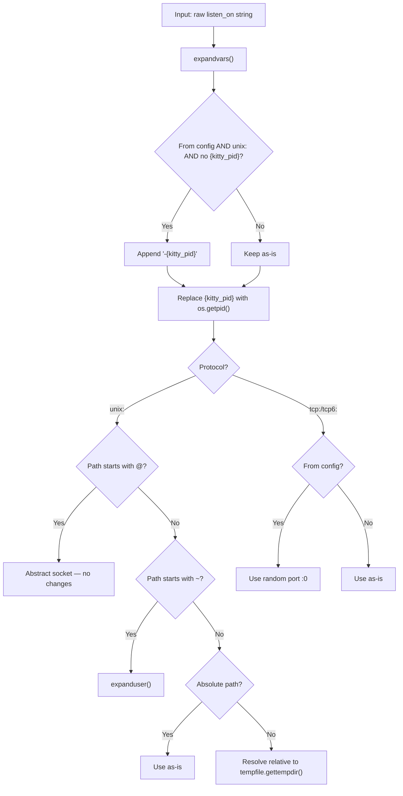
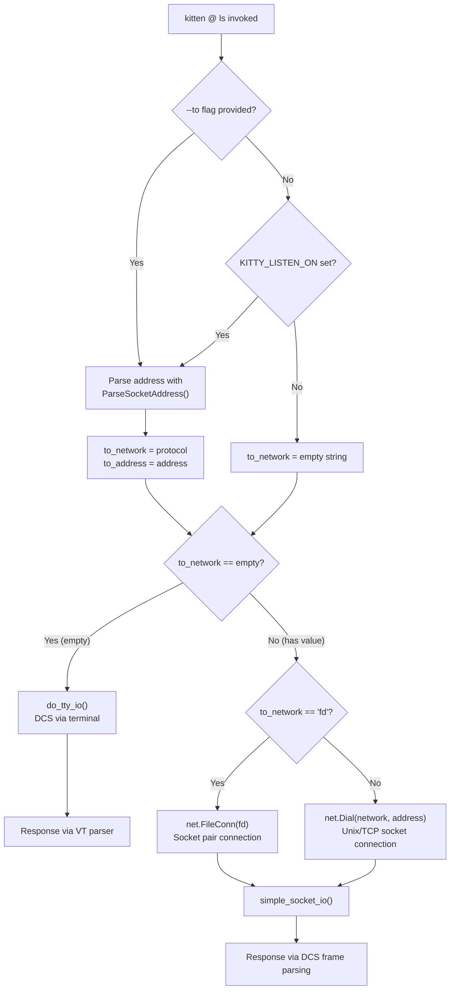
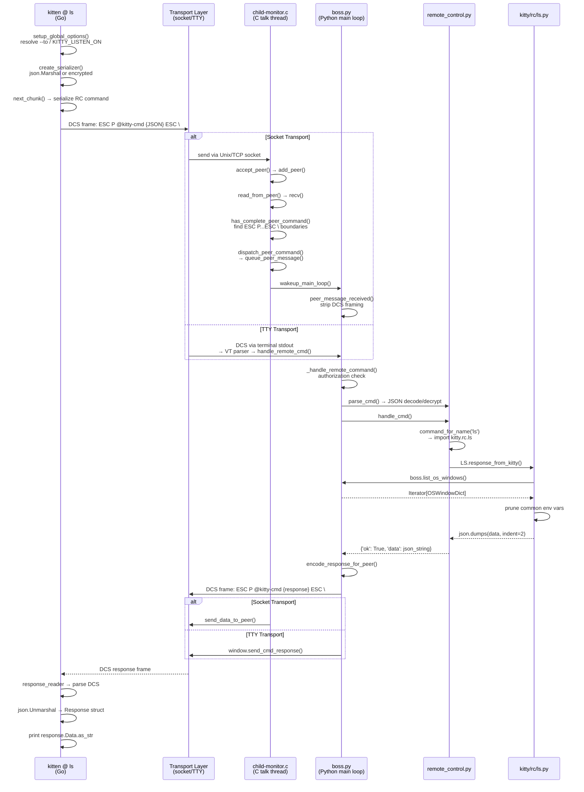
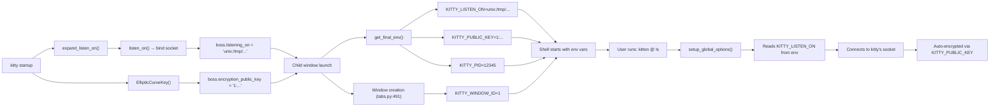
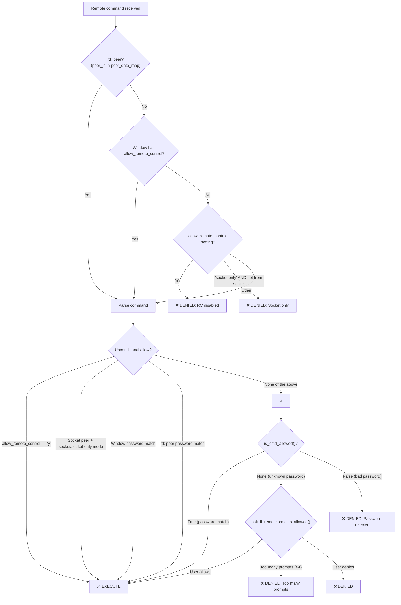

# Kitty Remote Control System: Technical Deep-Dive

> A Q&A-style reference tracing the end-to-end lifecycle of kitty's remote control system — from `kitten @ ls` invocation through to JSON response.

## About This Document

This document provides a comprehensive, code-traced analysis of how kitty's remote control (RC) system works. It answers specific technical questions about the architecture, transport mechanisms, protocol formats, and code paths involved when a `kitten @` command is issued.

**Scope:** Transport discovery, end-to-end command trace, shell integration, protocol wire format, authorization, logging/debugging, and the `RemoteCommand` framework for adding new commands.

**Methodology:** Every technical claim in this document is backed by direct source code evidence, cited as `Source: <file>:<line>`. The code is the source of truth — no assumptions are made.

---

## Table of Contents

- [1. Transport Discovery: How `kitten @` Finds Kitty](#1-transport-discovery-how-kitten--finds-kitty)
  - [1.1 The `--to` Flag and `KITTY_LISTEN_ON`](#11-the---to-flag-and-kitty_listen_on)
  - [1.2 Socket Path Generation (`expand_listen_on`)](#12-socket-path-generation-expand_listen_on)
  - [1.3 Socket vs TTY: Transport Selection Logic](#13-socket-vs-tty-transport-selection-logic)
  - [1.4 The `fd:` Socket Pair Mechanism](#14-the-fd-socket-pair-mechanism)
- [2. End-to-End Command Trace: `kitten @ ls`](#2-end-to-end-command-trace-kitten--ls)
  - [2.1 Go Client: Command Construction](#21-go-client-command-construction)
  - [2.2 Serialization and DCS Framing](#22-serialization-and-dcs-framing)
  - [2.3 Socket Transport Path](#23-socket-transport-path)
  - [2.4 TTY Transport Path](#24-tty-transport-path)
  - [2.5 C-Level Peer Management](#25-c-level-peer-management)
  - [2.6 Python Server Dispatch](#26-python-server-dispatch)
  - [2.7 The `ls` Handler](#27-the-ls-handler)
  - [2.8 Response Serialization](#28-response-serialization)
- [3. Shell Integration and Remote Control](#3-shell-integration-and-remote-control)
  - [3.1 Environment Variable Injection](#31-environment-variable-injection)
  - [3.2 `KITTY_PUBLIC_KEY` and Encryption](#32-kitty_public_key-and-encryption)
  - [3.3 Why It Works "Without Configuration"](#33-why-it-works-without-configuration)
- [4. Protocol Wire Format](#4-protocol-wire-format)
  - [4.1 DCS Frame Structure](#41-dcs-frame-structure)
  - [4.2 JSON Command Schema](#42-json-command-schema)
  - [4.3 Real `ls` Request/Response Example](#43-real-ls-requestresponse-example)
  - [4.4 Encrypted Command Format](#44-encrypted-command-format)
- [5. Authorization and Security](#5-authorization-and-security)
  - [5.1 Authorization Decision Tree](#51-authorization-decision-tree)
  - [5.2 Password-Based and Custom Auth](#52-password-based-and-custom-auth)
- [6. Logging and Debugging](#6-logging-and-debugging)
  - [6.1 DumpCommands and `--dump-bytes`](#61-dumpcommands-and---dump-bytes)
  - [6.2 Error Logging Points](#62-error-logging-points)
- [7. Adding a New Remote Control Command](#7-adding-a-new-remote-control-command)
  - [7.1 The RemoteCommand Framework](#71-the-remotecommand-framework)
  - [7.2 Step-by-Step Checklist](#72-step-by-step-checklist)
  - [7.3 Code Generation Pipeline](#73-code-generation-pipeline)

---

## 1. Transport Discovery: How `kitten @` Finds Kitty

The first question anyone asks about remote control is: *"How does `kitten @ ls` locate the running kitty instance?"* The answer involves a two-step process: **address resolution** (where to connect) and **transport selection** (how to connect).

### 1.1 The `--to` Flag and `KITTY_LISTEN_ON`

When you run `kitten @ ls`, the Go client needs to figure out where to send the command. This happens in `setup_global_options()`.

**The resolution chain** (`Source: tools/cmd/at/main.go:363-387`):

1. **First**, check the `--to` CLI flag (`rc_global_opts.To`)
2. **If empty**, fall back to the `KITTY_LISTEN_ON` environment variable
3. **If found**, parse the address using `utils.ParseSocketAddress()`

The key code:

```go
// Source: tools/cmd/at/main.go:371-381
if rc_global_opts.To == "" {
    rc_global_opts.To = os.Getenv("KITTY_LISTEN_ON")
    global_options.to_address_is_from_env_var = true
}
if rc_global_opts.To != "" {
    network, address, err := utils.ParseSocketAddress(rc_global_opts.To)
    // ...
    global_options.to_network = network
    global_options.to_address = address
}
```

**Rationale:** If no `--to` is specified AND no `KITTY_LISTEN_ON` environment variable exists, `global_options.to_network` remains an empty string `""`. This is the critical signal that determines whether to use TTY-based or socket-based transport (see Section 1.3).

`Source: tools/cmd/at/main.go:40-45` — The `GlobalOptions` struct holds `to_network` and `to_address` as the parsed results.

### 1.2 Socket Path Generation (`expand_listen_on`)

When kitty starts with `--listen-on` or `listen_on` in the config, the raw address string goes through `expand_listen_on()` before any socket is created. This function is **why sockets appear in `/tmp`** even when you specify a relative path.

**The expansion logic** (`Source: kitty/main.py:325-343`):

```python
# Source: kitty/main.py:325-343
def expand_listen_on(listen_on: str, from_config_file: bool) -> str:
    if from_config_file and listen_on == 'none':
        return ''
    listen_on = expandvars(listen_on)                          # Step 1: expand $ENV_VARS
    if '{kitty_pid}' not in listen_on and from_config_file and listen_on.startswith('unix:'):
        listen_on += '-{kitty_pid}'                            # Step 2: auto-append PID suffix
    listen_on = listen_on.replace('{kitty_pid}', str(os.getpid()))  # Step 3: substitute PID
    if listen_on.startswith('unix:'):
        path = listen_on[len('unix:'):]
        if not path.startswith('@'):                           # Not abstract socket
            if path.startswith('~'):
                listen_on = f'unix:{os.path.expanduser(path)}' # Step 4a: expand ~
            elif not os.path.isabs(path):
                import tempfile
                listen_on = f'unix:{os.path.join(tempfile.gettempdir(), path)}'  # Step 4b: relative → /tmp
    elif listen_on.startswith('tcp:') or listen_on.startswith('tcp6:'):
        if from_config_file:
            listen_on = ':'.join(listen_on.split(':', 2)[:2]) + ':0'  # Random port
    return listen_on
```

**Concrete example:** If your `kitty.conf` has `listen_on unix:mykitty` and kitty's PID is `12345`:

| Step | Value |
|------|-------|
| Input | `unix:mykitty` |
| After `expandvars` | `unix:mykitty` (no env vars) |
| After PID suffix (from config, `unix:`, no `{kitty_pid}`) | `unix:mykitty-{kitty_pid}` |
| After PID substitution | `unix:mykitty-12345` |
| Relative path → tempdir | `unix:/tmp/mykitty-12345` |

**This is why the socket ends up in `/tmp`** — the function resolves relative Unix socket paths against `tempfile.gettempdir()`, which is typically `/tmp` on Linux.

**Special cases:**
- `@` prefix → Abstract socket (Linux only), no path changes (`Source: kitty/main.py:334`)
- `~` prefix → Home directory expansion (`Source: kitty/main.py:335-336`)
- Absolute path → Used as-is
- `tcp:`/`tcp6:` from config → Random port `:0` assigned (`Source: kitty/main.py:341-342`)



### 1.3 Socket vs TTY: Transport Selection Logic

The transport decision is made in a single line of code that determines the entire communication pathway.

**The critical transport selection** (`Source: tools/cmd/at/main.go:280`):

```go
response, err = get_response(utils.IfElse(global_options.to_network == "", do_tty_io, do_socket_io), io_data)
```

This is an inline conditional:
- **If `to_network` is empty** (no `--to`, no `KITTY_LISTEN_ON`) → uses `do_tty_io` (TTY transport)
- **If `to_network` is non-empty** → uses `do_socket_io` (socket transport)

**TTY transport (`do_tty_io`):** Calls `do_chunked_io()` in `tools/cmd/at/tty_io.go:28`. This creates a `loop.Loop` (kitty's terminal event loop) and writes DCS escape sequences directly to the terminal. The kitty instance *running this terminal* parses the escape codes through its VT parser and dispatches them internally.  `Source: tools/cmd/at/tty_io.go:28-170`

**Socket transport (`do_socket_io`):** In `tools/cmd/at/socket_io.go:163-184`:
- If `to_network == "fd"` → wraps the file descriptor in a `net.Conn` via `net.FileConn()` (`Source: tools/cmd/at/socket_io.go:165-175`)
- Otherwise → dials the parsed network/address via `net.Dial()` (`Source: tools/cmd/at/socket_io.go:177`)
- Then calls `simple_socket_io()` for the actual framed command exchange (`Source: tools/cmd/at/socket_io.go:183`)



### 1.4 The `fd:` Socket Pair Mechanism

The `fd:` protocol enables **per-window remote control** without requiring a global listen socket. This is how kitty grants remote control permissions to individual windows.

**Address parsing** (`Source: tools/utils/sockets.go:14-50`):

`ParseSocketAddress()` supports these protocols:

| Protocol | Network | Example |
|----------|---------|---------|
| `unix:` | `"unix"` | `unix:/tmp/mykitty-12345` |
| `tcp:` | `"tcp"` or `"ip"` | `tcp:localhost:12345` |
| `tcp4:` | `"tcp4"` or `"ip"` | `tcp4:localhost:12345` |
| `tcp6:` | `"tcp6"` or `"ip"` | `tcp6:[::1]:12345` |
| `ip:` | `"ip"` | `ip:192.168.1.1:12345` |
| `ip4:` | `"ip4"` | `ip4:192.168.1.1:12345` |
| `ip6:` | `"ip6"` | `ip6:[::1]:12345` |
| `fd:` | `"fd"` | `fd:7` |

> **Note:** For `tcp:`, `tcp4:`, and `tcp6:` protocols, if the address portion is a valid IP address, the network is resolved to `"ip"` (`Source: tools/utils/sockets.go:27-32`). For `ip:`, `ip4:`, and `ip6:` protocols, the address must be a valid IP address or an error is returned (`Source: tools/utils/sockets.go:34-39`). The `tcp4:`, `ip:`, `ip4:`, and `ip6:` schemes are uncommon in remote control usage but are fully supported by the parser.

For `fd:`, the address part is parsed as an integer file descriptor (`Source: tools/utils/sockets.go:41-46`):

```go
if network == "fd" {
    fd := -1
    if fd, err = strconv.Atoi(addr); err != nil || fd < 0 {
        err = fmt.Errorf("Not a valid file descriptor number: ...")
    }
    return
}
```

**Server-side mechanism:**
1. When kitty needs to grant per-window remote control, `kitty/boss.py` creates a `socket.socketpair()`
2. One end of the pair is passed to the child process as `KITTY_LISTEN_ON=fd:N`
3. The other end is injected into the child monitor's talk thread via `inject_peer()` (`Source: kitty/child-monitor.c:248-280`)
4. `inject_peer()` calls `add_peer_to_injection_queue()` which wakes up the talk loop to register the new peer (`Source: kitty/child-monitor.c:266-277`)
5. The peer is marked as `is_remote_control_peer = true` (the assignment `p->is_remote_control_peer = is_remote_control_peer` occurs in `add_peer()` at `Source: kitty/child-monitor.c:1623`, called from the talk loop at line 1826 with `add_peer(fd, true)`) and assigned a unique `peer_id`

This mechanism allows per-window remote control permissions — a child process can only control the kitty instance through its specific socket pair, and the peer_id links back to window-level authorization data in `boss.peer_data_map`.

---

## 2. End-to-End Command Trace: `kitten @ ls`

This section traces the complete journey of a `kitten @ ls` command from invocation to JSON output. We'll follow the data through five language boundaries: **Go → escape codes → C → Python → JSON**.

### 2.1 Go Client: Command Construction

**Entry point** (`Source: tools/cmd/at/main.go:390-410`):

`EntryPoint()` creates the `@` root command and registers all subcommands:

```go
// Source: tools/cmd/at/main.go:390-398
func EntryPoint(tool_root *cli.Command) *cli.Command {
    at_root_command := tool_root.AddSubCommand(&cli.Command{
        Name: "@",
        Run:  shell_main,
    })
    // ...
    for _, reg_func := range all_commands {
        c := reg_func(at_root_command)
        // ...
    }
}
```

Each command is registered via `register_at_cmd()` (`Source: tools/cmd/at/main.go:359-361`). When the `ls` subcommand is invoked, its generated `Run` function calls `send_rc_command()`.

**`send_rc_command()` flow** (`Source: tools/cmd/at/main.go:266-299`):

1. **Resolve transport:** `setup_global_options(io_data.cmd)` (line 267)
2. **Set window ID:** Reads `KITTY_WINDOW_ID` from env and sets `io_data.rc.KittyWindowId` (lines 271-273):
   ```go
   wid, err := strconv.Atoi(os.Getenv("KITTY_WINDOW_ID"))
   if err == nil && wid > 0 {
       io_data.rc.KittyWindowId = uint(wid)
   }
   ```
3. **Create serializer:** `create_serializer(global_options.password, "", io_data)` (line 275) — defaults to `simple_serializer` (just `json.Marshal`), or encrypted if password is set
4. **Execute I/O:** `get_response(do_tty_io or do_socket_io, io_data)` (line 280)
5. **Process response:** Checks `response.Ok`, prints `response.Data.as_str`, handles errors (lines 284-298)

### 2.2 Serialization and DCS Framing

All remote control commands — whether sent via socket or TTY — are wrapped in DCS (Device Control String) escape sequences.

**DCS framing constants** (`Source: tools/cmd/at/socket_io.go:82-83`):

```go
const cmd_escape_code_prefix = "\x1bP@kitty-cmd"
const cmd_escape_code_suffix = "\x1b\\"
```

**How chunks are framed** (`Source: tools/cmd/at/socket_io.go:138`):

```go
err = write_many_to_conn(conn, []byte(cmd_escape_code_prefix), chunk, []byte(cmd_escape_code_suffix))
```

Where `chunk` comes from `io_data.next_chunk()` → `io_data.serializer(io_data.rc)` → `json.Marshal(rc)` (`Source: tools/cmd/at/main.go:205-221`).

**The serializer selection** (`Source: tools/cmd/at/main.go:144-163`):

```go
func create_serializer(password password, encoded_pubkey string, io_data *rc_io_data) (err error) {
    io_data.serializer = simple_serializer  // Default: just json.Marshal
    if password.is_set {
        // Encrypted serializer: wraps in crypto.Encrypt_cmd()
        io_data.serializer = func(rc *utils.RemoteControlCmd) (ans []byte, err error) {
            ec, err := crypto.Encrypt_cmd(rc, global_options.password.val, pubkey, encryption_version)
            // ...
            return json.Marshal(ec)
        }
    }
    return nil
}
```

**Python-side encoding** (used when Python code sends RC commands) (`Source: kitty/remote_control.py:308-310`):

```python
def encode_send(send: Any) -> bytes:
    es = ('@kitty-cmd' + json.dumps(send)).encode('ascii')
    return b'\x1bP' + es + b'\x1b\\'
```

### 2.3 Socket Transport Path

When a target address is known (socket transport), `do_socket_io()` handles the connection.

**Connection establishment** (`Source: tools/cmd/at/socket_io.go:163-184`):

```go
func do_socket_io(io_data *rc_io_data) (serialized_response []byte, err error) {
    var conn net.Conn
    if global_options.to_network == "fd" {
        fd, _ := strconv.Atoi(global_options.to_address)
        f := os.NewFile(uintptr(fd), "fd:"+global_options.to_address)
        conn, err = net.FileConn(f)       // Wrap FD as net.Conn
        defer f.Close()
    } else {
        conn, err = net.Dial(global_options.to_network, global_options.to_address)  // Dial socket
    }
    defer conn.Close()
    return simple_socket_io(&conn, io_data)
}
```

**Data exchange via `simple_socket_io()`** (`Source: tools/cmd/at/socket_io.go:120-161`):

1. Gets chunks via `io_data.next_chunk()` (line 127)
2. Writes DCS-framed data to connection (line 138)
3. If streaming: reads initial streaming acknowledgment (lines 144-154)
4. When all chunks are sent: calls `r.read_response_from_conn()` (line 160)

**Response parsing via `response_reader`** (`Source: tools/cmd/at/socket_io.go:47-80`):

The `response_reader` uses kitty's `EscapeCodeParser` to find DCS frames. It looks for the `@kitty-cmd` prefix in the DCS data and extracts the JSON payload:

```go
r.parser.HandleDCS = func(data []byte) error {
    if bytes.HasPrefix(data, []byte("@kitty-cmd")) {
        r.pending_responses = append(r.pending_responses, append([]byte{}, data[len("@kitty-cmd"):]...))
        keep_going = false
    }
    return nil
}
```

### 2.4 TTY Transport Path

When no target address is known (running inside a kitty window without explicit `--to`), the TTY transport is used.

**`do_tty_io` → `do_chunked_io()`** (`Source: tools/cmd/at/tty_io.go:28-170`):

The TTY transport uses kitty's terminal event loop (`loop.Loop`) with a state machine:

```go
const (
    BEFORE_FIRST_ESCAPE_CODE_SENT = iota
    WAITING_FOR_STREAMING_RESPONSE
    SENDING
    WAITING_FOR_RESPONSE
)
```

Key mechanisms:
- **Writing:** `queue_escape_code()` writes DCS-framed data via the loop (line 79-83):
  ```go
  queue_escape_code := func(data []byte) {
      lp.QueueWriteString(cmd_escape_code_prefix)
      lp.UnsafeQueueWriteBytes(data)
      lp.QueueWriteString(cmd_escape_code_suffix)
  }
  ```
- **Reading:** `lp.OnRCResponse` callback receives parsed responses from kitty's VT parser (line 154-162)
- **Timeout:** `check_for_timeout` monitors for `io_data.timeout` expiry (lines 51-63)

The flow: DCS escape codes are written to stdout → kitty's terminal emulator parses them → routes to `handle_remote_cmd()` → response is sent back through the terminal → `OnRCResponse` receives it.

### 2.5 C-Level Peer Management

For socket-based connections, the C layer in `kitty/child-monitor.c` handles the low-level socket I/O on a dedicated talk thread.

**Accepting connections — `accept_peer()`** (`Source: kitty/child-monitor.c:1632-1639`):

```c
static bool
accept_peer(int listen_fd, bool shutting_down, bool is_remote_control_peer) {
    int peer = accept(listen_fd, NULL, NULL);
    if (UNLIKELY(peer == -1)) { /* error handling */ }
    add_peer(peer, is_remote_control_peer);
    return true;
}
```

**Registering peers — `add_peer()`** (`Source: kitty/child-monitor.c:1614-1628`):

```c
static id_type
add_peer(int peer, bool is_remote_control_peer) {
    if (talk_data.num_peers < PEER_LIMIT) {  // PEER_LIMIT = 256
        Peer *p = talk_data.peers + talk_data.num_peers++;
        p->fd = peer;
        p->id = ++peer_id_counter;
        p->is_remote_control_peer = is_remote_control_peer;
    } else {
        log_error("Too many peers want to talk, ignoring one.");
    }
}
```

**Reading data — `read_from_peer()`** (`Source: kitty/child-monitor.c:1714-1737`):

```c
ssize_t n = recv(peer->fd, peer->read.data + peer->read.used, ...);
// ... on data received:
while (has_complete_peer_command(peer)) dispatch_peer_command(self, peer);
```

**Command boundary detection — `has_complete_peer_command()`** (`Source: kitty/child-monitor.c:1684-1694`):

The function checks if the buffered data starts with `KITTY_CMD_PREFIX = "\x1bP@kitty-cmd{"` (`Source: kitty/child-monitor.c:1650`) and scans for the `\x1b\\` terminator:

```c
if (peer->read.used > sizeof(KITTY_CMD_PREFIX) &&
    memcmp(peer->read.data, KITTY_CMD_PREFIX, sizeof(KITTY_CMD_PREFIX)-1) == 0) {
    for (size_t i = sizeof(KITTY_CMD_PREFIX)-1; i < peer->read.used - 1; i++) {
        if (peer->read.data[i] == 0x1b && peer->read.data[i+1] == '\\') {
            peer->read.command_end = i + 2;
            break;
        }
    }
}
```

**Dispatching to Python — `dispatch_peer_command()` → `queue_peer_message()`** (`Source: kitty/child-monitor.c:1699-1711, 1653-1669`):

When a complete command is found, `dispatch_peer_command()` slices the buffer and calls `queue_peer_message()`, which:

1. Copies the message data to the main thread's message queue under `talk_mutex` (line 1655-1664)
2. Records the `peer_id` and `is_remote_control_peer` flag
3. Calls `wakeup_main_loop()` to notify Python's event loop (line 1668)

**FD injection — `inject_peer()`** (`Source: kitty/child-monitor.c:248-280`):

Used for the `fd:` socket pair mechanism. When called from Python, it:
1. Starts the talk thread if not running
2. Creates a self-pipe for synchronization
3. Adds the peer FD to an injection queue
4. Wakes up the talk loop to register the peer
5. Returns the assigned `peer_id` to Python

### 2.6 Python Server Dispatch

Once the C layer wakes up the Python event loop, the message reaches `peer_message_received()`.

**Message reception — `peer_message_received()`** (`Source: kitty/boss.py:776-793`):

```python
def peer_message_received(self, msg_bytes, peer_id, is_remote_control):
    if peer_id > 0 and msg_bytes == b'peer_death':
        self.peer_data_map.pop(peer_id, None)     # Cleanup on peer disconnect
        return False
    if is_remote_control:
        cmd_prefix = b'\x1bP@kitty-cmd'
        terminator = b'\x1b\\'
        if msg_bytes.startswith(cmd_prefix) and msg_bytes.endswith(terminator):
            cmd = memoryview(msg_bytes)[len(cmd_prefix):-len(terminator)]  # Strip DCS framing
            response = self._handle_remote_command(cmd, peer_id=peer_id)
            # ... encode and return response
        log_error('Malformatted remote control message received from peer, ignoring')
```

**Authorization and dispatch — `_handle_remote_command()`** (`Source: kitty/boss.py:590-645`):

1. Checks authorization chain (detailed in [Section 5](#5-authorization-and-security))
2. Calls `parse_cmd()` to deserialize/decrypt the JSON (line 603)
3. If authorized, calls `_execute_remote_command()` (line 632)

**Command execution — `_execute_remote_command()`** (`Source: kitty/boss.py:700-711`):

```python
def _execute_remote_command(self, pcmd, window=None, peer_id=0, self_window=None):
    from .remote_control import handle_cmd
    try:
        response = handle_cmd(self, window, pcmd, peer_id, self_window)
    except Exception as err:
        import traceback
        response = {'ok': False, 'error': str(err)}
        if not getattr(err, 'hide_traceback', False):
            response['tb'] = traceback.format_exc()
    return response
```

**Command dispatch — `handle_cmd()`** (`Source: kitty/remote_control.py:213-263`):

```python
def handle_cmd(boss, window, cmd, peer_id, self_window):
    v = cmd['version']
    if tuple(v)[:2] > version[:2]:           # Version check
        return {'ok': False, 'error': '...'}
    c = command_for_name(cmd['cmd'])          # Dynamic import: kitty.rc.ls
    payload = cmd.get('payload') or {}
    payload['peer_id'] = peer_id
    # ... handle async_id, stream_id ...
    ans = c.response_from_kitty(boss, self_window or window, PayloadGetter(c, payload))
    # ... wrap result ...
    response = {'ok': True}
    if ans is not None:
        response['data'] = ans
    return response
```

**TTY-path entry point** (`Source: kitty/boss.py:849-852`):

For TTY transport, the VT parser routes the DCS data to `handle_remote_cmd()`:

```python
def handle_remote_cmd(self, cmd, window=None):
    response = self._handle_remote_command(cmd, window)
    if response is not None and not isinstance(response, AsyncResponse) and window is not None:
        window.send_cmd_response(response)
```

### 2.7 The `ls` Handler

**Dynamic command resolution — `command_for_name()`** (`Source: kitty/rc/base.py:449-456`):

```python
def command_for_name(cmd_name: str) -> RemoteCommand:
    from importlib import import_module
    cmd_name = cmd_name.replace('-', '_')
    try:
        m = import_module(f'kitty.rc.{cmd_name}')
    except ImportError:
        raise KeyError(f'Unknown kitty remote control command: {cmd_name}')
    return cast(RemoteCommand, getattr(m, cmd_name))
```

For `cmd_name='ls'`, this imports `kitty.rc.ls` and returns the module-level `ls` singleton (the last line of `kitty/rc/ls.py`: `ls = LS()`).

**The `LS` class** (`Source: kitty/rc/ls.py:15-79`):

```python
class LS(RemoteCommand):
    protocol_spec = __doc__ = '''
    all_env_vars/bool: Whether to send all environment variables ...
    match/str: Window to change colors in
    match_tab/str: Tab to change colors in
    self/bool: Boolean indicating whether to list only the window the command is run in
    '''
    short_desc = 'List tabs/windows'
```

**Client-side — `message_to_kitty()`** (`Source: kitty/rc/ls.py:45-46`):

```python
def message_to_kitty(self, global_opts, opts, args):
    return {'all_env_vars': opts.all_env_vars, 'match': opts.match, 'match_tab': opts.match_tab}
```

**Server-side — `response_from_kitty()`** (`Source: kitty/rc/ls.py:48-76`):

1. Applies window/tab filtering if match patterns provided (lines 52-56)
2. Calls `boss.list_os_windows(window, tab_filter, window_filter)` (line 57)
3. Prunes common environment variables across windows for readability (lines 58-75)
4. Returns `json.dumps(data, indent=2, sort_keys=True)` (line 76)

**`list_os_windows()`** (`Source: kitty/boss.py:432-455`):

Iterates `self.os_window_map` and yields `OSWindowDict` structures (`Source: kitty/boss.py:165-175`):

```python
class OSWindowDict(TypedDict):
    id: int
    platform_window_id: Optional[int]
    is_focused: bool
    is_active: bool
    last_focused: bool
    tabs: List[TabDict]
    wm_class: str
    wm_name: str
    background_opacity: float
```

### 2.8 Response Serialization

**Python → DCS frame** (`Source: kitty/remote_control.py:52-53`):

```python
def encode_response_for_peer(response: Any) -> bytes:
    return b'\x1bP@kitty-cmd' + json.dumps(response).encode('utf-8') + b'\x1b\\'
```

**Go client response parsing** (`Source: tools/cmd/at/socket_io.go:47-80`):

The `response_reader` uses its `EscapeCodeParser` to find DCS frames containing `@kitty-cmd`. The JSON payload between prefix and terminator is extracted and unmarshalled into the `Response` struct (`Source: tools/cmd/at/main.go:185-190`):

```go
type Response struct {
    Ok        bool         `json:"ok"`
    Data      ResponseData `json:"data,omitempty"`
    Error     string       `json:"error,omitempty"`
    Traceback string       `json:"tb,omitempty"`
}
```

### End-to-End Sequence Diagram



---

## 3. Shell Integration and Remote Control

A frequent question is: *"How does shell integration enable remote control without explicit configuration?"* The answer lies in environment variable propagation.

### 3.1 Environment Variable Injection

Every child window spawned by kitty receives environment variables that enable automatic remote control discovery. This happens in `get_final_env()`.

**Environment setup** (`Source: kitty/child.py:233-267`):

```python
def get_final_env(self) -> Dict[str, str]:
    env = default_env().copy()
    opts = fast_data_types.get_options()
    boss = fast_data_types.get_boss()
    # ...
    env['TERM'] = opts.term                                    # Line 242
    env['COLORTERM'] = 'truecolor'                             # Line 243
    env['KITTY_PID'] = getpid()                                # Line 244
    env['KITTY_PUBLIC_KEY'] = boss.encryption_public_key       # Line 245
    if self.add_listen_on_env_var and boss.listening_on:
        env['KITTY_LISTEN_ON'] = boss.listening_on             # Lines 246-247
    else:
        env.pop('KITTY_LISTEN_ON', None)                       # Line 249
    # ...
```

**Key variables injected:**

| Variable | Source | Purpose |
|----------|--------|---------|
| `KITTY_LISTEN_ON` | `boss.listening_on` | Socket address for RC connection |
| `KITTY_PUBLIC_KEY` | `boss.encryption_public_key` | Public key for encrypted RC commands |
| `KITTY_PID` | `os.getpid()` | PID of the kitty instance |
| `KITTY_WINDOW_ID` | Set elsewhere during window creation | ID of the specific window |

**Note:** The `add_listen_on_env_var` flag (default `True`) controls whether `KITTY_LISTEN_ON` is propagated. This is set to `False` when creating windows that shouldn't have socket-based remote control access.

`boss.listening_on` is set during kitty startup from the result of `expand_listen_on()` → `listen_on()` (`Source: kitty/boss.py:362-368`):

```python
self.listening_on = ''
if args.listen_on and self.allow_remote_control in ('y', 'socket', 'socket-only', 'password'):
    listen_fd, self.listening_on = listen_on(args.listen_on)
```

### 3.2 `KITTY_PUBLIC_KEY` and Encryption

The `KITTY_PUBLIC_KEY` environment variable is the bridge between shell integration and encrypted remote control. It's formatted as `VERSION:BASE85_ENCODED_KEY`.

**Server-side key generation** (`Source: kitty/boss.py:340-341`):

```python
self.encryption_key = EllipticCurveKey()
self.encryption_public_key = f'{RC_ENCRYPTION_PROTOCOL_VERSION}:{base64.b85encode(self.encryption_key.public).decode("ascii")}'
```

Where `RC_ENCRYPTION_PROTOCOL_VERSION = '1'` (`Source: kitty/constants.py:31`).

**Go client key decoding — `get_pubkey()`** (`Source: tools/cmd/at/main.go:72-94`):

```go
func get_pubkey(encoded_key string) (encryption_version string, pubkey []byte, err error) {
    if encoded_key == "" {
        encoded_key = os.Getenv("KITTY_PUBLIC_KEY")     // Read from env
    }
    encryption_version, encoded_key, _ = strings.Cut(encoded_key, ":")  // Split version:key
    if encryption_version != kitty.RC_ENCRYPTION_PROTOCOL_VERSION {
        err = fmt.Errorf("KITTY_PUBLIC_KEY has unknown version...")
        return
    }
    pubkey = make([]byte, base85.DecodedLen(len(encoded_key)))
    n, err := base85.Decode(pubkey, []byte(encoded_key))  // Base85 decode
    pubkey = pubkey[:n]
    return
}
```

**Python client key decoding — `get_pubkey()`** (`Source: kitty/remote_control.py:516-524`):

```python
def get_pubkey() -> Tuple[str, bytes]:
    raw = os.environ.get('KITTY_PUBLIC_KEY', '')
    version, pubkey = raw.split(':', 1)
    if version != RC_ENCRYPTION_PROTOCOL_VERSION:
        raise SystemExit('...')
    from base64 import b85decode
    return version, b85decode(pubkey)
```

**Encryption with `CommandEncrypter`** (`Source: kitty/remote_control.py:414-437`):

```python
class CommandEncrypter:
    def __init__(self, pubkey, encryption_version, password):
        skey = EllipticCurveKey()                    # Generate ephemeral keypair
        self.secret = skey.derive_secret(pubkey)     # ECDH shared secret
        self.pubkey = skey.public
        self.password = password

    def __call__(self, cmd):
        encrypter = AES256GCMEncrypt(self.secret)    # AES-256-GCM with shared secret
        cmd['timestamp'] = time_ns()                 # Add nanosecond timestamp
        cmd['password'] = self.password              # Add password
        raw = json.dumps(cmd).encode('utf-8')
        encrypted = encrypter.add_data_to_be_encrypted(raw, True)
        return {
            'version': version,
            'iv': encode_as_base85(encrypter.iv),
            'tag': encode_as_base85(encrypter.tag),
            'pubkey': encode_as_base85(self.pubkey),
            'encrypted': encode_as_base85(encrypted),
        }
```

**Server-side decryption in `parse_cmd()`** (`Source: kitty/remote_control.py:56-86`):

1. Parse JSON, check for `encrypted` field (line 68)
2. Validate `enc_proto` matches `RC_ENCRYPTION_PROTOCOL_VERSION` (line 69)
3. Derive shared secret from sender's public key (line 75)
4. Decrypt using `AES256GCMDecrypt` (lines 75-76)
5. Validate timestamp within 5-minute window (lines 80-85):
   ```python
   delta = time_ns() - pcmd.pop('timestamp')
   if abs(delta) > 5 * 60 * 1e9:
       log_error('Ignoring encrypted rc command with timestamp ... Could be an attempt at a replay attack')
       return {}
   ```

### 3.3 Why It Works "Without Configuration"

The "magic" of shell integration enabling remote control is a simple chain of environment variable propagation:



**The complete chain:**

1. User starts kitty with `--listen-on` or `listen_on` in config
2. `expand_listen_on()` generates the socket path (`Source: kitty/main.py:325-343`)
3. `listen_on()` creates and binds the socket (`Source: kitty/boss.py:177-188`)
4. `EllipticCurveKey()` generates the encryption keypair (`Source: kitty/boss.py:340`)
5. Every child window receives `KITTY_LISTEN_ON` and `KITTY_PUBLIC_KEY` via `get_final_env()` (`Source: kitty/child.py:245-247`)
6. When `kitten @` runs inside that window, `setup_global_options()` reads `KITTY_LISTEN_ON` from the environment (`Source: tools/cmd/at/main.go:371-372`)
7. If a password is configured, encryption is automatically available via `KITTY_PUBLIC_KEY` (`Source: tools/cmd/at/main.go:72-94`)
8. **Result:** Zero-configuration remote control from within any kitty window

---

## 4. Protocol Wire Format

### 4.1 DCS Frame Structure

Every remote control message — both request and response — is wrapped in a DCS (Device Control String) escape sequence.

**Wire format** (`Source: docs/rc_protocol.rst:6-8`):

```text
<ESC>P@kitty-cmd<JSON object><ESC>\
```

Where `<ESC>` is byte `0x1b` (decimal 27).

**Implementations across languages:**

| Language | Constant/Code | Source |
|----------|--------------|--------|
| Go (prefix) | `"\x1bP@kitty-cmd"` | `tools/cmd/at/socket_io.go:82` |
| Go (suffix) | `"\x1b\\"` | `tools/cmd/at/socket_io.go:83` |
| Python (encode) | `b'\x1bP' + ('@kitty-cmd' + json).encode('ascii') + b'\x1b\\'` | `kitty/remote_control.py:308-310` |
| Python (response) | `b'\x1bP@kitty-cmd' + json.dumps(resp).encode('utf-8') + b'\x1b\\'` | `kitty/remote_control.py:52-53` |
| C (detect prefix) | `"\x1bP@kitty-cmd{"` | `kitty/child-monitor.c:1650` |

**Note:** The C detection prefix includes the opening `{` brace — this is an optimization to quickly filter out non-JSON DCS data. `Source: kitty/child-monitor.c:1650`

### 4.2 JSON Command Schema

**Request format** (`Source: docs/rc_protocol.rst:10-21`, `Source: kitty/remote_control.py:456-463`):

```json
{
    "cmd": "command name",
    "version": [0, 35, 2],
    "no_response": false,
    "kitty_window_id": 1,
    "payload": { }
}
```

**Field descriptions:**

| Field | Type | Required | Description |
|-------|------|----------|-------------|
| `cmd` | string | Yes | Command name (e.g., `"ls"`, `"send-text"`) |
| `version` | array[3] | Yes | Client's kitty version as `[major, minor, patch]` |
| `no_response` | bool | No | If `true`, kitty won't send a response |
| `kitty_window_id` | int | No | `KITTY_WINDOW_ID` value for self-identification |
| `payload` | object | No | Command-specific parameters |
| `async` | string | No | Random UUID for async requests |
| `stream` | bool | No | Whether this is a streaming request |
| `stream_id` | string | No | Stream identifier (same across chunks) |
| `cancel_async` | bool | No | Cancel a pending async request |
| `password` | string | No | Password for authentication |

The `create_basic_command()` function constructs this schema (`Source: kitty/remote_control.py:456-463`):

```python
def create_basic_command(name, payload=None, no_response=False, is_asynchronous=False):
    ans = {'cmd': name, 'version': version, 'no_response': no_response}
    if payload is not None:
        ans['payload'] = payload
    if is_asynchronous:
        ans['async'] = uuid4()
    return ans
```

**Response format** (`Source: tools/cmd/at/main.go:185-190`):

```json
{
    "ok": true,
    "data": "...",
    "error": "...",
    "tb": "..."
}
```

| Field | Type | Description |
|-------|------|-------------|
| `ok` | bool | Whether the command succeeded |
| `data` | string/any | Response data (command-specific) |
| `error` | string | Error message (when `ok` is `false`) |
| `tb` | string | Python traceback (when `ok` is `false`) |

### 4.3 Real `ls` Request/Response Example

**Request JSON:**

```json
{
    "cmd": "ls",
    "version": [0, 35, 2],
    "no_response": false,
    "kitty_window_id": 1,
    "payload": {
        "all_env_vars": false,
        "match": null,
        "match_tab": null
    }
}
```

**On the wire (DCS-framed):**

```text
\x1bP@kitty-cmd{"cmd":"ls","version":[0,35,2],"no_response":false,"kitty_window_id":1,"payload":{"all_env_vars":false}}\x1b\\
```

**Response JSON:**

```json
{
    "ok": true,
    "data": "[{\n  \"background_opacity\": 1.0,\n  \"id\": 1,\n  \"is_active\": true,\n  \"is_focused\": true,\n  \"last_focused\": true,\n  \"platform_window_id\": 12345678,\n  \"tabs\": [\n    {\n      \"id\": 1,\n      \"is_focused\": true,\n      \"layout\": \"stack\",\n      \"title\": \"~\",\n      \"windows\": [\n        {\n          \"cmdline\": [\"/bin/zsh\"],\n          \"columns\": 120,\n          \"cwd\": \"/home/user\",\n          \"env\": {},\n          \"id\": 1,\n          \"is_focused\": true,\n          \"is_self\": true,\n          \"lines\": 45,\n          \"pid\": 54321,\n          \"title\": \"zsh\"\n        }\n      ]\n    }\n  ],\n  \"wm_class\": \"kitty\",\n  \"wm_name\": \"kitty\"\n}]"
}
```

**Important note about the `data` field:** The `data` value is a **JSON string** containing the serialized array — it's double-encoded because `LS.response_from_kitty()` returns `json.dumps(data, indent=2, sort_keys=True)` (a string), which then gets wrapped in `{'ok': True, 'data': that_string}` and serialized again. The Go client prints `response.Data.as_str` directly, giving the pretty-printed JSON output. `Source: kitty/rc/ls.py:76`, `Source: tools/cmd/at/main.go:296-297`

### 4.4 Encrypted Command Format

When a password is used, the command is encrypted and wrapped in an envelope.

**Encrypted envelope** (`Source: docs/rc_protocol.rst:76-84`, `Source: kitty/remote_control.py:425-437`):

```json
{
    "version": [0, 35, 2],
    "iv": "<base85 encoded IV>",
    "tag": "<base85 encoded AEAD tag>",
    "pubkey": "<base85 encoded ECDH public key>",
    "encrypted": "<base85 encoded encrypted command>"
}
```

If the encryption protocol version is not `"1"`, an additional `enc_proto` field is included (`Source: kitty/remote_control.py:435-436`).

**Encryption flow:**

1. **Key generation:** Client generates ephemeral X25519 keypair via `EllipticCurveKey()` (`Source: kitty/remote_control.py:419`)
2. **Shared secret:** Derives via ECDH with server's public key from `KITTY_PUBLIC_KEY` (`Source: kitty/remote_control.py:420`)
3. **Symmetric key:** SHA-256 hash of shared secret → AES-256-GCM key (`Source: docs/rc_protocol.rst:70-71`)
4. **Augment command:** Adds `timestamp` (nanoseconds since epoch) and `password` to the JSON command (`Source: kitty/remote_control.py:427-428`)
5. **Encrypt:** AES-256-GCM with ≥96-bit CSPRNG IV, ≥128-bit authentication tag (`Source: docs/rc_protocol.rst:71-72`)
6. **Encode:** Base85-encode `iv`, `tag`, `pubkey`, `encrypted` (`Source: kitty/remote_control.py:431-434`)
7. **Server decrypts:** Validates timestamp within 5-minute window, rejects replays (`Source: kitty/remote_control.py:80-85`)

---

## 5. Authorization and Security

### 5.1 Authorization Decision Tree

The authorization logic in `_handle_remote_command()` is a multi-layered chain that evaluates several conditions before deciding whether to execute a command.

**Full authorization chain** (`Source: kitty/boss.py:590-645`):

```python
def _handle_remote_command(self, cmd, window=None, peer_id=0):
    from_socket = peer_id > 0
    is_fd_peer = from_socket and peer_id in self.peer_data_map       # Line 595
    window_has_remote_control = bool(window and window.allow_remote_control)  # Line 596

    # Phase 1: Global deny checks
    if not window_has_remote_control and not is_fd_peer:
        if self.allow_remote_control == 'n':                         # Line 598
            return {'ok': False, 'error': 'Remote control is disabled'}
        if self.allow_remote_control == 'socket-only' and not from_socket:  # Line 600
            return {'ok': False, 'error': 'Remote control is allowed over a socket only'}

    # Phase 2: Parse and decrypt the command
    pcmd = parse_cmd(cmd, self.encryption_key)                       # Line 603

    # Phase 3: Unconditional allow checks
    allowed_unconditionally = (
        self.allow_remote_control == 'y' or                          # Line 624
        (from_socket and not is_fd_peer and
         self.allow_remote_control in ('socket-only', 'socket')) or  # Line 625
        (window and window.remote_control_allowed(pcmd, extra_data)) or  # Line 626
        (is_fd_peer and remote_control_allowed(pcmd, self.peer_data_map.get(peer_id), None, extra_data))  # Line 627
    )

    if allowed_unconditionally:
        return self._execute_remote_command(pcmd, ...)               # Line 632

    # Phase 4: Password-based allow
    q = is_cmd_allowed(pcmd, window, from_socket, extra_data)        # Line 633
    if q is True:
        return self._execute_remote_command(pcmd, ...)               # Line 635

    # Phase 5: User prompt
    if q is None:
        if self.ask_if_remote_cmd_is_allowed(pcmd, ...):             # Line 637
            return AsyncResponse()

    # Phase 6: Deny
    return {'ok': False, 'error': 'Remote control is disabled...'}   # Line 639
```



### 5.2 Password-Based and Custom Auth

**`is_cmd_allowed()`** (`Source: kitty/remote_control.py:177-202`):

This function is the entry point for password-based authorization:

1. **Stream continuation:** Active streams are always allowed (line 179)
2. **Async cancellation:** Always allowed (they can only cancel, not execute) (lines 181-187)
3. **Empty password:** Checks against `remote_control_password` config for the `''` key (lines 189-194)
4. **Provided password:** Looks up in config and validates via `PasswordAuthorizer` (lines 195-202)

**`PasswordAuthorizer` class** (`Source: kitty/remote_control.py:134-166`):

The `PasswordAuthorizer` supports two types of authorization items:
- **Glob patterns:** Matched against command names using `fnmatch` (line 145, 153-155)
- **Custom Python scripts:** Files ending in `.py` are loaded and called (lines 141-143, 156-165)

```python
class PasswordAuthorizer:
    def __init__(self, auth_items):
        for item in auth_items:
            if item.endswith('.py'):
                path = os.path.abspath(resolve_custom_file(item))
                self.function_checkers.append(is_cmd_allowed_loader(path))
            else:
                self.command_patterns.append(fnmatch_pattern(item))

    def is_cmd_allowed(self, pcmd, window, from_socket, extra_data):
        cmd_name = pcmd.get('cmd')
        if not self.function_checkers and not self.command_patterns:
            return True  # No restrictions = allow all
        for x in self.command_patterns:
            if x.match(cmd_name) is not None:
                return True
        for f in self.function_checkers:
            ret = f(pcmd, window, from_socket, extra_data)
            if ret is not None:
                return ret
        return False
```

**`remote_control_allowed()`** (`Source: kitty/remote_control.py:113-131`):

Used for per-window and per-fd-peer password-based authorization. It validates the password against the `remote_control_passwords` dictionary and delegates to `PasswordAuthorizer`:

```python
def remote_control_allowed(pcmd, remote_control_passwords, window, extra_data):
    if not remote_control_passwords:
        return True  # No passwords configured = allow all
    pw = pcmd.get('password', '')
    auth_items = remote_control_passwords.get(pw)
    if pw == '!':
        auth_items = None  # '!' is a special deny marker
    if auth_items is None:
        if '!' in remote_control_passwords:
            raise PermissionError()  # Explicit deny
        return False
    pa = password_authorizer(auth_items)
    if not pa.is_cmd_allowed(pcmd, window, False, extra_data):
        raise PermissionError()
    return True
```

---

## 6. Logging and Debugging

### 6.1 DumpCommands and `--dump-bytes`

The `DumpCommands` class provides diagnostic output for all terminal I/O events, including remote control commands.

**`DumpCommands` class** (`Source: kitty/boss.py:232-253`):

```python
class DumpCommands:
    def __init__(self, args):
        self.draw_dump_buf = []
        if args.dump_bytes:
            self.dump_bytes_to = open(args.dump_bytes, 'wb')

    def __call__(self, window_id, what, *a):
        if what == 'draw':
            self.draw_dump_buf.append(a[0])      # Buffer draw events
        elif what == 'bytes':
            self.dump_bytes_to.write(a[0])       # Write raw bytes to file
            self.dump_bytes_to.flush()
        elif what == 'error':
            log_error(*a)
        else:
            if self.draw_dump_buf:
                safe_print('draw', ''.join(self.draw_dump_buf))
                self.draw_dump_buf = []
            safe_print(what, *a)                 # Print event to stdout
```

**Initialization** (`Source: kitty/boss.py:372`):

```python
self.child_monitor = ChildMonitor(
    self.on_child_death,
    DumpCommands(args) if args.dump_commands or args.dump_bytes else None,
    talk_fd, listen_fd,
)
```

**Usage:**

```shell
# Print all parsed terminal commands to stdout
kitty --dump-commands

# Write raw bytes to a file for analysis
kitty --dump-bytes /path/to/output.bin
```

When `--dump-commands` is active, every DCS remote control command will appear in the output as it's parsed by the VT emulator. When `--dump-bytes` is active, the raw bytes including the DCS escape sequences are written to the specified file.

### 6.2 Error Logging Points

The following `log_error()` calls are present in the remote control code path. These are valuable for debugging RC issues:

**In `kitty/remote_control.py`:**

| Line | Message | Trigger |
|------|---------|---------|
| 62 | `"Failed to parse JSON payload of remote command, ignoring it"` | Malformed JSON in received command |
| 65 | `"JSON payload of remote command is invalid, must be an object with a version field"` | Valid JSON but wrong structure |
| 70 | `"Ignoring encrypted rc command with unsupported protocol: {proto}"` | Encryption version mismatch |
| 74 | `"Ignoring encrypted rc command without a public key"` | Encrypted command missing pubkey |
| 82-84 | `"Ignoring encrypted rc command with timestamp...Could be an attempt at a replay attack"` | Timestamp > 5 minutes from current time |
| 102 | `"Failed to load cmd check function from {path} with error: {e}"` | Custom auth script load failure (e.g., missing `is_cmd_allowed` function or import error) |
| 162 | `"There was an error using a custom RC auth function, blocking..."` | Custom auth script raised exception during execution |

**In `kitty/boss.py`:**

| Line | Message | Trigger |
|------|---------|---------|
| 605 | `"Failed to parse remote command with error: {e}"` | Exception during `parse_cmd()` |
| 656 | `"Denying remote command permission as there are too many existing permission requests"` | More than 4 concurrent permission dialogs |
| 792 | `"Malformatted remote control message received from peer, ignoring"` | DCS frame doesn't have proper prefix/suffix |

**In `kitty/child-monitor.c`:**

| Line | Message | Trigger |
|------|---------|---------|
| 1625 | `"Too many peers want to talk, ignoring one."` | Exceeds `PEER_LIMIT` (256) connections |
| 1717 | `"Reading from peer failed: Ignoring too large message from peer"` (formatted via the `failed()` macro at line 1715 which prepends `"Reading from peer failed: "`) | Message exceeds 64KB buffer limit |

---

## 7. Adding a New Remote Control Command

### 7.1 The RemoteCommand Framework

All remote control commands follow a consistent pattern defined by the `RemoteCommand` base class.

**`RemoteCommand` base class** (`Source: kitty/rc/base.py:319-429`):

```python
class RemoteCommand:
    name: str = ''                      # Auto-derived from module name
    short_desc: str = ''                # One-line description
    desc: str = ''                      # Full description
    options_spec: Optional[str] = None  # CLI option definitions
    protocol_spec: str = ''             # Payload field definitions
    response_timeout: float = 10.       # Seconds
    string_return_is_error: bool = False
    is_asynchronous: bool = False
    reads_streaming_data: bool = False

    def __init__(self):
        self.desc = self.desc or self.short_desc
        self.name = self.__class__.__module__.split('.')[-1].replace('_', '-')  # e.g., 'send_text' → 'send-text'

    def message_to_kitty(self, global_opts, opts, args) -> PayloadType:
        """Client-side: construct payload dict from CLI options"""
        raise NotImplementedError()

    def response_from_kitty(self, boss, window, payload_get) -> ResponseType:
        """Server-side: execute command and return result"""
        raise NotImplementedError()
```

**Key attributes:**

| Attribute | Purpose |
|-----------|---------|
| `name` | Auto-derived from module name: `my_command.py` → `"my-command"` (`Source: kitty/rc/base.py:341`) |
| `protocol_spec` | Defines payload fields as `field_name/type: description` |
| `options_spec` | Standard kitty CLI option spec (same format as `--help`) |
| `response_timeout` | How long to wait for a response (default 10 seconds) |
| `is_asynchronous` | Whether the command uses async response pattern |
| `reads_streaming_data` | Whether the command accepts chunked data |

**Helper methods for matching:**

| Method | Purpose | Source |
|--------|---------|--------|
| `windows_for_payload()` | Match windows by `match_window`/`match_tab` | `kitty/rc/base.py:390-410` |
| `windows_for_match_payload()` | Match windows by `match`/`self`/`all` | `kitty/rc/base.py:356-370` |
| `tabs_for_match_payload()` | Match tabs by `match`/`self`/`all` | `kitty/rc/base.py:372-388` |

**Command discovery:**

- `command_for_name()` dynamically imports the command module (`Source: kitty/rc/base.py:449-456`)
- `all_command_names()` scans the `kitty.rc` package for all `.py` files (excluding `base.py` and `__init__.py`) (`Source: kitty/rc/base.py:459-465`)

### 7.2 Step-by-Step Checklist

To add a new remote control command named `my-command`:

1. **Create `kitty/rc/my_command.py`** — the module name uses underscores

2. **Define your command class:**
   ```python
   from .base import (
       MATCH_WINDOW_OPTION, ArgsType, Boss, PayloadGetType,
       PayloadType, RCOptions, RemoteCommand, ResponseType, Window
   )

   class MyCommand(RemoteCommand):
       protocol_spec = __doc__ = '''
       some_field/str: Description of this field
       another_field/bool: Description of this boolean field
       '''

       short_desc = 'One-line description'
       desc = 'Full description of what the command does'
       options_spec = '''\
   --some-option
   default=value
   Description of the option.
   ''' + '\n\n' + MATCH_WINDOW_OPTION

       def message_to_kitty(self, global_opts: RCOptions, opts: 'CLIOptions', args: ArgsType) -> PayloadType:
           """Client-side: construct payload from CLI options"""
           return {'some_field': opts.some_option}

       def response_from_kitty(self, boss: Boss, window: Window, payload_get: PayloadGetType) -> ResponseType:
           """Server-side: execute and return result"""
           value = payload_get('some_field')
           # ... do work with boss, window ...
           return 'result string'
   ```

3. **Create the module-level singleton** (last line of file):
   ```python
   my_command = MyCommand()
   ```
   The variable name must match the module name (`my_command` for `my_command.py`).

4. **Set `protocol_spec`** with field definitions using the `field_name/type: description` format. Supported types include `str`, `bool`, `int`, `list.str`, `dict.str`, and `choices.opt1.opt2`.

5. **Run the code generation pipeline** — kitty uses a code generation step that reads the Python command definitions and generates the corresponding Go code. This is triggered by running kitty's build/setup process.

6. **Test via CLI:**
   ```shell
   kitten @ my-command --some-option value
   ```
   Note: underscores in the Python module name become hyphens in the CLI command name (`Source: kitty/rc/base.py:341`).

### 7.3 Code Generation Pipeline

The Go-side command code is auto-generated from the Python command definitions.

**Template file:** `tools/cmd/at/template.go` (tagged `//go:build exclude`) serves as the code generation template. It defines standard patterns:
- Payload struct with fields matching `protocol_spec`
- `Run` function that calls `send_rc_command()`
- Option parsing wired to the struct fields
- Subcommand setup and registration

**Registration mechanism** (`Source: tools/cmd/at/main.go:357-361`):

```go
var all_commands []func(*cli.Command) *cli.Command = make([]func(*cli.Command) *cli.Command, 0, 64)

func register_at_cmd(f func(*cli.Command) *cli.Command) {
    all_commands = append(all_commands, f)
}
```

Each generated Go file calls `register_at_cmd()` with its setup function. During `EntryPoint()`, all registered commands are iterated and added as subcommands (`Source: tools/cmd/at/main.go:402-408`).

**Generated files:** Each command gets its own `.go` file in `tools/cmd/at/` following the patterns defined in `template.go`. The Go build tag `//go:build exclude` on the template prevents it from being compiled directly.

---

*Document generated from kitty source code analysis. All citations reference the kitty repository at version 0.35.2 (`Source: kitty/constants.py:25`).*
