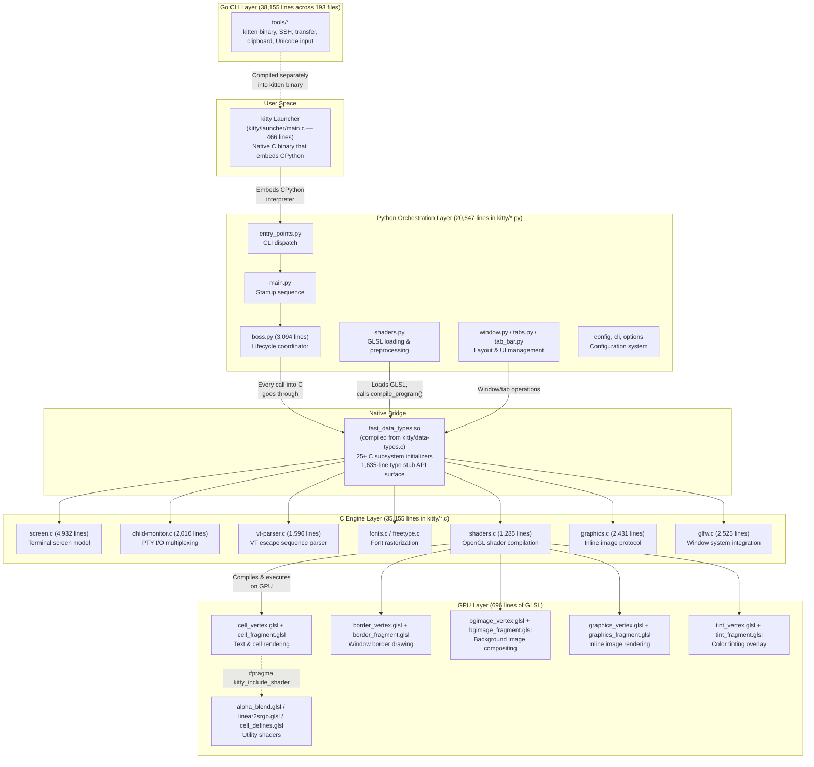
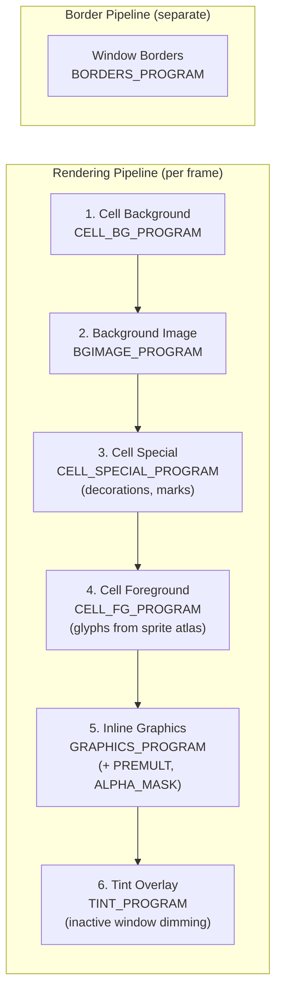
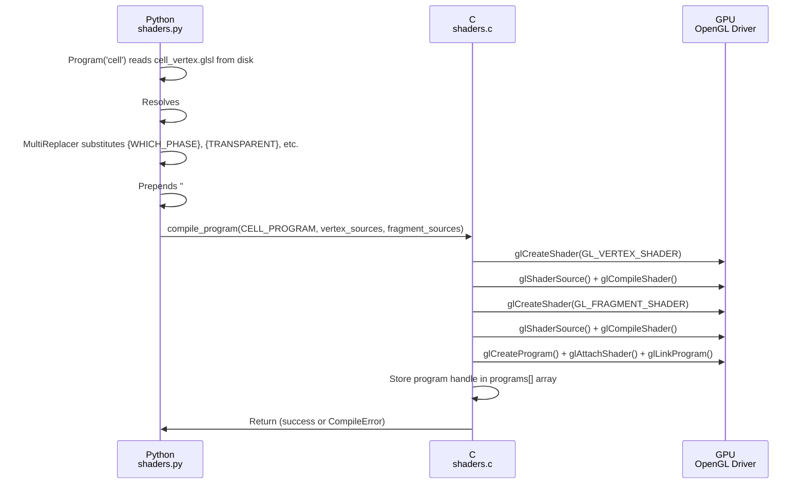
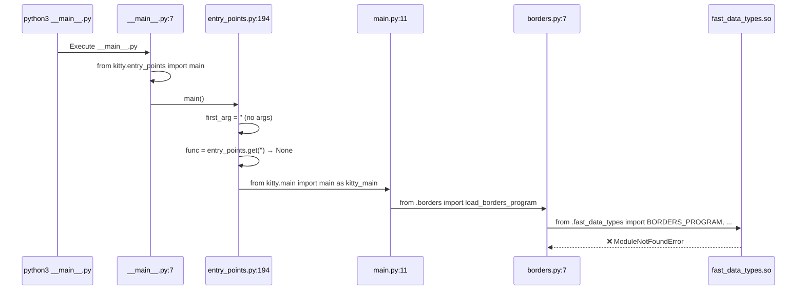
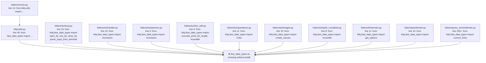

# Kitty Terminal Emulator — Architecture Exploration

## An Evidence-Based Investigation into Language Roles, Shader Centrality, the Native Bridge, and Kittens Modularity

**Repository:** kitty (version 0.35.2)  
**Commit:** `815df1e210e0`  
**Date of Analysis:** Based on the repository state at the above commit  
**Approach:** Observational — all conclusions derived from exercising the code and inspecting source, not from assumptions about intended architecture

---

## Table of Contents

1. [Introduction and Methodology](#1-introduction-and-methodology)
2. [Q1: Language Role Distribution at Runtime](#2-q1-language-role-distribution-at-runtime)
3. [Q2: The Role of GLSL Shaders in a Terminal](#3-q2-the-role-of-glsl-shaders-in-a-terminal)
4. [Q3: The Entry Point Failure and the Native Bridge](#4-q3-the-entry-point-failure-and-the-native-bridge)
5. [Q4: Kittens — Modularity vs. Native Dependency](#5-q4-kittens--modularity-vs-native-dependency)
6. [Conclusions and Architectural Insights](#6-conclusions-and-architectural-insights)

---

## 1. Introduction and Methodology

### 1.1 What This Document Is

This document answers five interconnected architectural questions about the kitty terminal emulator by observing how the code actually behaves — not by reading documentation about how it is supposed to work. Every claim is supported by direct evidence: source file references with line numbers, actual command output, or traceback captures from running code in the repository.

### 1.2 The Five Questions

1. **Language Role Distribution:** Which language does the runtime heavy lifting — Python or C — and what does that reveal about where performance actually comes from?
2. **Shader Centrality:** What role do the 13 GLSL shader files play, and how central are they to a terminal emulator?
3. **Entry Point Failure:** When running `python3 __main__.py` directly, it fails. What is missing, and what does the failure reveal about how Python is wired into the native C core?
4. **Kittens Independence:** Are kittens truly self-contained tools, or do they depend on the same native bridge?
5. **Observational Method:** All answers derived from exercising the code and observing actual behavior.

### 1.3 Methodology

The investigation used exclusively read-only operations against the repository:

- **Static analysis:** `grep`, `find`, `wc -l`, `cat`, `head`, `sed` to inspect source code
- **Behavioral experiments:** `python3 __main__.py` and `python3 -c "..."` to observe runtime failures
- **Quantitative measurements:** Line counts by language, import chain tracing, pattern matching across files
- **No repository modifications:** The source tree remains unchanged. All observations are non-destructive.

### 1.4 Architecture Diagram — The Three-Language Runtime

Before diving into individual questions, here is the architectural relationship between kitty's three language layers, as revealed by the investigation:



---

## 2. Q1: Language Role Distribution at Runtime

### 2.1 Quantitative Code Breakdown

The first step is to measure the codebase by language. These numbers come from direct `wc -l` measurements on the repository:

| Language | Location | Files | Lines of Code | Percentage of Total |
|---|---|---|---|---|
| **C** | `kitty/*.c` | 50 | **35,155** | 37.1% |
| **Go** | `tools/*.go` | 193 | **38,155** | 40.3% |
| **Python** | `kitty/*.py` | ~70 | **20,647** | 21.8% |
| **GLSL** | `kitty/*.glsl` | 13 | **696** | 0.7% |
| **Total** | — | ~326 | **94,653** | 100% |

> **Source:** `wc -l kitty/*.c` → 35,155 total; `wc -l kitty/*.py` → 20,647 total; `find tools/ -name "*.go" -exec wc -l {} + | tail -1` → 38,155 total; `wc -l kitty/*.glsl` → 696 total

**Observation:** By raw line count, Go actually has the most code — but it lives in the `tools/` directory and compiles into a separate `kitten` binary for CLI operations (SSH, file transfer, clipboard, Unicode input). The core terminal emulator runtime is the C + Python + GLSL combination, where C dominates at 35,155 lines vs. Python's 20,647 lines.

### 2.2 What C Owns: The Performance-Critical Hot Paths

The C layer is not a helper library — it is the engine. Every subsystem that touches data at terminal speed (keystrokes, screen updates, rendering frames) is implemented in C. Here is the evidence, organized by the largest C files:

| C File | Lines | Subsystem | What It Does |
|---|---|---|---|
| `screen.c` | 4,932 | Terminal screen model | Manages the cell grid, scrollback, selection, line operations — the core data structure of the terminal |
| `unicode-data.c` | 3,088 | Unicode tables | Character width calculation, bidirectional text, emoji handling — generated lookup tables |
| `glfw.c` | 2,525 | Window system | GLFW event loop integration, window creation, input handling, Wayland/X11 abstraction |
| `graphics.c` | 2,431 | Image protocol | kitty's inline image display protocol — image upload, placement, compositing, animation |
| `child-monitor.c` | 2,016 | PTY I/O | The I/O multiplexer that reads from child process PTYs and feeds data to the VT parser — the single hottest I/O path |
| `fonts.c` | 1,761 | Font management | Font loading, fallback resolution, glyph caching strategy |
| `vt-parser.c` | 1,596 | VT parsing | Parses incoming terminal escape sequences (CSI, OSC, DCS, APC) character by character |
| `state.c` | 1,492 | Global state | OS window state, tab/window tree management, global rendering state |
| `shaders.c` | 1,285 | GPU rendering | OpenGL shader compilation, uniform management, draw call orchestration |
| `line.c` | 1,194 | Line buffer | Individual terminal line storage with color attributes, hyperlinks, marks |

> **Source:** `wc -l kitty/*.c | sort -rn | head -10`

**Rationale:** The C layer owns every subsystem that runs on the "hot path" — the tight loop that reads bytes from a child process (`child-monitor.c`), parses them into terminal commands (`vt-parser.c`), updates the screen model (`screen.c`), and renders the result through the GPU (`shaders.c`). This is where performance comes from. Python never touches raw bytes flowing from a PTY, never parses an escape sequence, and never issues a draw call.

### 2.3 What Python Owns: The Orchestration Layer

Python's 20,647 lines serve a fundamentally different role. The largest Python files reveal the pattern:

| Python File | Lines | Role | What It Does |
|---|---|---|---|
| `boss.py` | 3,094 | Lifecycle coordinator | Manages the overall application lifecycle: creating OS windows, handling signals, dispatching remote control commands, coordinating tabs and windows (223 methods/classes) |
| `window.py` | 1,998 | Window abstraction | High-level window management, resize logic, keyboard shortcut dispatch |
| `tabs.py` | 1,268 | Tab management | Tab creation, switching, layout selection, tab groups |
| `file_transmission.py` | 1,248 | File transfer protocol | The file transfer kitten's protocol implementation |
| `utils.py` | 1,246 | Utility functions | Screen size detection, path resolution, string helpers — all of which immediately import `fast_data_types` at line 45 |
| `cli.py` | 1,093 | CLI parsing | Command-line argument parsing, help text generation, completion specs |
| `launch.py` | 949 | Window launching | New window/tab creation with environment setup, working directory resolution |
| `rgb.py` | 856 | Color definitions | Named color constants (CSS color names to RGB values) |
| `tab_bar.py` | 722 | Tab bar rendering | Tab bar layout, drawing, formatting — delegates actual rendering to C |

> **Source:** `wc -l kitty/*.py | sort -rn | head -10`

**Rationale:** Python handles everything that benefits from expressiveness over speed: configuration parsing, CLI argument handling, layout algorithms, tab/window lifecycle management, user-facing UI logic. It never parses terminal escape sequences, never rasterizes fonts, and never composites pixels. When Python needs to do anything performance-sensitive, it calls into `fast_data_types` — which routes to the C engine.

### 2.4 What Go Owns: The CLI Tooling Layer

The `tools/` directory contains 193 Go files totaling 38,155 lines. These compile into a separate `kitten` binary (distinct from the Python kittens framework) that handles:

- SSH integration (`tools/ssh/`)
- File transfer (`tools/transfer/`)
- Clipboard operations (`tools/clipboard/`)
- Unicode input
- Various CLI subcommands

> **Source:** `go.mod` line 3: `go 1.22`; `find tools/ -name "*.go" | wc -l` → 193 files

**Rationale:** Go exists because certain operations (especially SSH and file transfer) benefit from being a single statically-linked binary that can be copied to remote hosts without dependencies. The Go layer is architecturally separate from the terminal emulator's core runtime — it does not participate in the rendering pipeline or terminal emulation.

### 2.5 Answer to Q1

**Where does performance actually come from?** Performance comes from C. The 35,155-line C engine owns every hot path: PTY I/O, VT parsing, screen model, font rasterization, and GPU rendering. Python's 20,647 lines are the orchestration layer — they configure, coordinate, and manage lifecycle, but never touch the data paths that determine terminal speed. The Go layer is an independent CLI tooling concern. GLSL handles the final visual output on the GPU.

The architecture is a deliberate division: **C for throughput, Python for expressiveness, GLSL for pixels, Go for portability.**

---

## 3. Q2: The Role of GLSL Shaders in a Terminal

### 3.1 Why Shaders in a Terminal?

Finding 13 GLSL shader files in a terminal emulator is unexpected. Terminals are traditionally thought of as text-mode applications — why would one need GPU shaders? The answer, as the code reveals, is that kitty is not a traditional terminal. It is a GPU-accelerated terminal that renders every visible pixel through OpenGL shaders. There is no CPU-based rendering fallback.

### 3.2 Inventory of All 13 Shader Files

| Shader File | Lines | Role | Description |
|---|---|---|---|
| `cell_vertex.glsl` | 233 | Cell rendering (vertex) | The most complex shader. Transforms cell grid coordinates into screen positions, computes foreground/background colors, handles cursor rendering, selection highlights, and sprite atlas coordinates for glyph textures |
| `cell_fragment.glsl` | 204 | Cell rendering (fragment) | Composites the final pixel color for each cell: blends background, foreground (from the sprite atlas), decorations (underlines, strikethrough), and cursor — with multi-pass logic for transparency |
| `border_vertex.glsl` | 48 | Border drawing (vertex) | Computes vertex positions for window border rectangles, applies gamma-corrected color lookup from a 9-color palette, and handles tint/opacity blending |
| `bgimage_vertex.glsl` | 48 | Background image (vertex) | Positions a fullscreen quad and computes texture coordinates for tiled or scaled background images |
| `cell_defines.glsl` | 31 | Compile-time macros | Defines the four rendering phases (`PHASE_BOTH`, `PHASE_BACKGROUND`, `PHASE_SPECIAL`, `PHASE_FOREGROUND`) and all compile-time substitution placeholders (`{WHICH_PHASE}`, `{TRANSPARENT}`, `{DECORATION_SHIFT}`, etc.) |
| `graphics_fragment.glsl` | 27 | Inline graphics (fragment) | Renders inline images with three modes: simple (passthrough), premultiplied alpha, and alpha mask (for colored text over images) |
| `graphics_vertex.glsl` | 24 | Inline graphics (vertex) | Positions image quads with viewport clipping (using `gl_ClipDistance` for left/right/top/bottom bounds) |
| `alpha_blend.glsl` | 22 | Utility: alpha blending | Implements `alpha_blend()` and `alpha_blend_premul()` — the standard alpha compositing formula from the Wikipedia Porter-Duff model |
| `tint_vertex.glsl` | 18 | Tint overlay (vertex) | Positions a fullscreen quad for the color tint overlay (used for dimming inactive windows) |
| `linear2srgb.glsl` | 15 | Utility: color space | Converts between linear light and sRGB color space — `srgb2linear()` and `linear2srgb()` using the standard piecewise transfer function |
| `bgimage_fragment.glsl` | 14 | Background image (fragment) | Samples the background image texture and applies opacity, with a premultiplied alpha toggle |
| `border_fragment.glsl` | 6 | Border drawing (fragment) | A pass-through: receives interpolated color from the vertex shader and outputs it directly |
| `tint_fragment.glsl` | 6 | Tint overlay (fragment) | Outputs the uniform tint color (set from Python/C) as the fragment color |

> **Source:** `wc -l kitty/*.glsl | sort -rn` and direct inspection of each file

### 3.3 The Six Rendering Stages

The shaders implement six distinct visual pipelines, each compiled as a separate OpenGL program:



> **Source:** `kitty/shaders.c` line 20 defines the program enum: `enum { CELL_PROGRAM, CELL_BG_PROGRAM, CELL_SPECIAL_PROGRAM, CELL_FG_PROGRAM, BORDERS_PROGRAM, GRAPHICS_PROGRAM, GRAPHICS_PREMULT_PROGRAM, GRAPHICS_ALPHA_MASK_PROGRAM, BGIMAGE_PROGRAM, TINT_PROGRAM, NUM_PROGRAMS };`

The cell shader is the most critical — it is compiled four times with different macro substitutions from `cell_defines.glsl`:

| Phase | Constant | What It Renders |
|---|---|---|
| `PHASE_BOTH` | `CELL_PROGRAM` | Full cell rendering (backgrounds + foregrounds) |
| `PHASE_BACKGROUND` | `CELL_BG_PROGRAM` | Cell backgrounds only |
| `PHASE_SPECIAL` | `CELL_SPECIAL_PROGRAM` | Decorations (underlines, strikethrough, marks) |
| `PHASE_FOREGROUND` | `CELL_FG_PROGRAM` | Glyph foregrounds only (from sprite texture atlas) |

> **Source:** `kitty/shaders.py` lines 146–159 — the `LoadShaderPrograms.__call__()` method iterates over `{'BOTH': CELL_PROGRAM, 'BACKGROUND': CELL_BG_PROGRAM, 'SPECIAL': CELL_SPECIAL_PROGRAM, 'FOREGROUND': CELL_FG_PROGRAM}` and compiles each variant

### 3.4 How Shaders Are Loaded and Compiled

The shader compilation pipeline crosses all three language layers:



**Step-by-step walkthrough:**

1. **Python reads GLSL from disk:** `kitty/shaders.py` line 68 — `src = read_kitty_resource(name).decode('utf-8')` loads the raw GLSL source.

2. **Python resolves includes:** `kitty/shaders.py` lines 62–81 — The `_load_sources()` method processes `#pragma kitty_include_shader <filename>` directives, recursively loading included shaders (e.g., `cell_fragment.glsl` includes `alpha_blend.glsl`, `linear2srgb.glsl`, and `cell_defines.glsl`).

3. **Python substitutes macros:** `kitty/shaders.py` lines 113–126 — The `MultiReplacer` class finds `{PLACEHOLDER}` patterns in the GLSL source and replaces them with computed values. For example, `{WHICH_PHASE}` becomes `PHASE_FOREGROUND`, `{TRANSPARENT}` becomes `0` or `1`, `{DECORATION_SHIFT}` becomes the actual bit shift value from the C constants.

4. **Python calls into C:** `kitty/shaders.py` line 92 — `compile_program(program_id, self.vertex_sources, self.fragment_sources, allow_recompile)` crosses the native bridge into `kitty/shaders.c`.

5. **C compiles on GPU:** `kitty/shaders.c` handles the actual OpenGL API calls — `glCreateShader`, `glShaderSource`, `glCompileShader`, `glCreateProgram`, `glAttachShader`, `glLinkProgram` — and stores the resulting program handles.

> **Source:** `kitty/shaders.py` (complete file, 205 lines) and `kitty/shaders.c` lines 1–30

### 3.5 Why There Is No CPU Fallback

The evidence that shaders are the sole rendering path, with no CPU fallback:

1. **`shaders.c` defines `NUM_PROGRAMS` (10 programs)** — all rendering passes are shader-based. There is no `draw_cell_software()` or `render_text_cpu()` function anywhere in the codebase.

2. **The cell shader reads from a sprite texture atlas** — `cell_fragment.glsl` line 10: `uniform sampler2DArray sprites;`. Glyphs are rasterized by FreeType into a GPU texture atlas, and the fragment shader samples from this atlas to render text. Without shaders, there is no mechanism to display text.

3. **Background images, inline graphics, borders, and tints all go through shaders** — every visual element has a corresponding shader program. There is no software compositing path.

4. **OpenGL 3.3+ is a hard requirement** — the shaders use `#version` directives (set via `GLSL_VERSION` constant from `fast_data_types`), `layout(std140)` uniform blocks, `sampler2DArray`, and `gl_ClipDistance` — all features requiring OpenGL 3.3 or later. A machine without GPU support cannot run kitty.

### 3.6 Answer to Q2

**How central are shaders to a terminal emulator?** In kitty, they are absolutely central — there is no rendering without them. The 13 GLSL files (696 lines) are the final stage of the rendering pipeline through which every pixel passes. Despite their small line count, they are the single irreplaceable component for visual output. The cell shader alone is compiled four times for four rendering phases. Without the GPU shader pipeline, kitty literally cannot display anything — not text, not borders, not backgrounds, not images. This is why kitty requires OpenGL 3.3+ and cannot fall back to a CPU-only renderer.

---

## 4. Q3: The Entry Point Failure and the Native Bridge

### 4.1 Reproducing the Failure

Running kitty directly from source without building the C extension produces an immediate crash:

```bash
$ python3 __main__.py
```

```
Traceback (most recent call last):
  File "__main__.py", line 7, in <module>
    main()
  File "kitty/entry_points.py", line 194, in main
    from kitty.main import main as kitty_main
  File "kitty/main.py", line 11, in <module>
    from .borders import load_borders_program
  File "kitty/borders.py", line 7, in <module>
    from .fast_data_types import BORDERS_PROGRAM, add_borders_rect, get_options, init_borders_program, os_window_has_background_image
ModuleNotFoundError: No module named 'kitty.fast_data_types'
```

> **Source:** Actual output from running `python3 __main__.py` in the repository root

### 4.2 Tracing the Import Chain

The traceback reveals the exact import chain that leads to the failure:



**Step-by-step trace:**

1. **`__main__.py` line 7:** `from kitty.entry_points import main; main()` — This succeeds because `entry_points.py` only imports standard library modules at the top level.

2. **`entry_points.py` line 194:** `from kitty.main import main as kitty_main` — This is a deferred import inside the `main()` function, triggered only when no specific subcommand is given. The function checks `sys.argv` and falls through to the default kitty launcher.

3. **`main.py` line 11:** `from .borders import load_borders_program` — This is a top-level import, executed at module load time. The moment Python tries to import `kitty.main`, it must immediately import `kitty.borders`.

4. **`borders.py` line 7:** `from .fast_data_types import BORDERS_PROGRAM, add_borders_rect, get_options, init_borders_program, os_window_has_background_image` — This is where the chain breaks. `fast_data_types` is a compiled C extension module (a `.so` file) that does not exist in the source tree — it must be built.

### 4.3 What `fast_data_types` Actually Contains

The `fast_data_types` module is not a small helper — it is the entire C engine packaged as a single CPython extension. Examining `kitty/data-types.c` lines 525–612, the `PyInit_fast_data_types()` function initializes **25+ subsystems**:

| Initializer | C Source File | Subsystem |
|---|---|---|
| `init_LineBuf(m)` | `line-buf.c` | Terminal line buffer management |
| `init_HistoryBuf(m)` | `history.c` | Scrollback history buffer |
| `init_Line(m)` | `line.c` | Individual terminal line with attributes |
| `init_Cursor(m)` | `cursor.c` | Cursor state and movement |
| `init_Shlex(m)` | `shlex.c` | Shell-like lexer for parsing |
| `init_Parser(m)` | `vt-parser.c` | VT escape sequence parser |
| `init_DiskCache(m)` | `disk-cache.c` | On-disk cache for scrollback |
| `init_child_monitor(m)` | `child-monitor.c` | PTY I/O multiplexing event loop |
| `init_ColorProfile(m)` | `colors.c` | 256-color + true-color profile management |
| `init_Screen(m)` | `screen.c` | Terminal screen model (4,932-line file) |
| `init_glfw(m)` | `glfw.c` | Window system integration (GLFW wrapper) |
| `init_child(m)` | `child.c` | Child process management |
| `init_state(m)` | `state.c` | Global application state |
| `init_keys(m)` | `keys.c` | Keyboard input handling |
| `init_graphics(m)` | `graphics.c` | Inline image protocol |
| `init_shaders(m)` | `shaders.c` | OpenGL shader compilation & rendering |
| `init_mouse(m)` | `mouse.c` | Mouse event handling |
| `init_kittens(m)` | `kittens.c` | Native kitten support functions |
| `init_png_reader(m)` | `png-reader.c` | PNG image decoding |
| `init_fonts(m)` | `fonts.c` | Font loading and management |
| `init_utmp(m)` | `utmp.c` | utmp/wtmp login record management |
| `init_loop_utils(m)` | `loop-utils.c` | Event loop utility functions |
| `init_crypto_library(m)` | `crypto.c` | Cryptographic operations |
| `init_systemd_module(m)` | `systemd.c` | systemd integration |
| `init_logging(m)` | `logging.c` | Logging infrastructure |

**Platform-specific initializers:**

| Platform | Initializers |
|---|---|
| **macOS** | `init_macos_process_info`, `init_CoreText`, `init_cocoa` |
| **Linux/FreeBSD** | `init_freetype_library`, `init_fontconfig_library`, `init_desktop`, `init_freetype_render_ui_text` |

> **Source:** `kitty/data-types.c` lines 525–612 (the `PyInit_fast_data_types` function) and lines 430–524 (the `module_methods` table and `extern` declarations)

Additionally, the module exposes a set of top-level functions directly callable from Python:

- `wcwidth()`, `wcswidth()` — Unicode character width calculation
- `open_tty()`, `raw_tty()`, `normal_tty()`, `close_tty()` — TTY control
- `base64_encode()`, `base64_decode()` — Fast base64 operations
- `monotonic()` — High-resolution monotonic clock
- `thread_write()` — Thread-safe write operations
- `shm_open()`, `shm_unlink()` — POSIX shared memory
- And numerous constants: cursor shapes, terminal modes, escape sequence types, etc.

> **Source:** `kitty/data-types.c` lines 430–469 (the `module_methods[]` array)

The complete API surface of `fast_data_types` is documented in its type stub: `kitty/fast_data_types.pyi` (1,635 lines).

### 4.4 Why the Build Step Is a Runtime Necessity

The C extension is compiled by `setup.py`:

```
compile_c_extension(
    kitty_env(args), 'kitty/fast_data_types', args.compilation_database, sources, headers,
    build_dsym=args.build_dsym,
)
```

> **Source:** `setup.py` line 1090–1092

This is not a development convenience or an optional optimization. Without `fast_data_types.so`:

1. **No Python file in `kitty/` can be imported.** As demonstrated by the traceback, the very first import in the startup chain (`kitty/borders.py` line 7) requires `fast_data_types`. But it is not just `borders.py` — a grep across all Python files in `kitty/` reveals that `fast_data_types` is imported in virtually every module:

   ```
   kitty/borders.py:7   kitty/boss.py:63     kitty/child.py:26
   kitty/cli.py:15      kitty/clipboard.py:13 kitty/constants.py:154
   kitty/debug_config.py:20  kitty/entry_points.py:132
   kitty/file_transmission.py:23  kitty/key_encoding.py:9
   kitty/keys.py:8      kitty/launch.py:15   kitty/main.py:11 (indirect)
   kitty/shaders.py:10  kitty/utils.py:45    kitty/window.py:...
   ```

   > **Source:** `grep -rn "from .fast_data_types import\|from kitty.fast_data_types import" kitty/*.py | head -20`

2. **There is no Python-only fallback.** The architecture does not have a "degraded mode" where Python reimplements what C provides. The Python code is structurally incapable of functioning without the C engine.

3. **The build is also a runtime dependency for constants.** Even simple constants like `BORDERS_PROGRAM` (an enum value defined in `kitty/shaders.c` line 20) are only available through `fast_data_types`. Python cannot even define its own rendering pipeline without the C extension telling it the program IDs.

### 4.5 The Launcher Bypass

In production, users never run `python3 __main__.py`. Instead, kitty ships a native C launcher (`kitty/launcher/main.c`, 466 lines) that:

1. Resolves its own binary path and the library directory
2. Initializes the Python interpreter using `Py_InitializeFromConfig()`
3. Sets up `kitty_run_data` (a Python dict with runtime paths and configuration)
4. Calls into `kitty.main.main()` from C

> **Source:** `kitty/launcher/main.c` lines 1–60

This launcher binary is compiled alongside `fast_data_types.so`, so by the time it invokes Python, the C extension is already available in the library path. The `ModuleNotFoundError` only occurs when attempting to bypass the build system and run Python source directly.

### 4.6 Answer to Q3

**What does the entry point failure reveal?** It reveals that kitty's Python layer is architecturally dependent on a single C extension module — `fast_data_types` — which bundles 25+ C subsystems (screen model, VT parser, font engine, GPU renderer, PTY monitor, etc.) into one `.so` file. This is not an optional accelerator: it is the application's entire engine. The Python code cannot even finish importing its first module without it. The build step (`setup.py` → `compile_c_extension`) is a prerequisite for any execution whatsoever, and the native C launcher ensures this is transparent to end users.

---

## 5. Q4: Kittens — Modularity vs. Native Dependency

### 5.1 What Are Kittens?

Kittens are sub-applications within kitty: diff viewer, image viewer (icat), hints mode, SSH, clipboard manager, theme browser, etc. They are organized as subpackages under `kittens/`:

| Kitten | Directory | Purpose |
|---|---|---|
| `ask` | `kittens/ask/` | Prompt user for input |
| `broadcast` | `kittens/broadcast/` | Broadcast input to multiple windows |
| `choose_fonts` | `kittens/choose_fonts/` | Interactive font selector |
| `clipboard` | `kittens/clipboard/` | Clipboard operations |
| `diff` | `kittens/diff/` | Side-by-side diff viewer |
| `hints` | `kittens/hints/` | URL/path/word hints mode |
| `hyperlinked_grep` | `kittens/hyperlinked_grep/` | Grep with clickable results |
| `icat` | `kittens/icat/` | Inline image viewer |
| `pager` | `kittens/pager/` | Scrollback pager |
| `panel` | `kittens/panel/` | Desktop panel integration |
| `query_terminal` | `kittens/query_terminal/` | Query terminal capabilities |
| `remote_file` | `kittens/remote_file/` | Remote file editing |
| `resize_window` | `kittens/resize_window/` | Interactive window resizing |
| `show_key` | `kittens/show_key/` | Keyboard key display |
| `ssh` | `kittens/ssh/` | Enhanced SSH integration |
| `themes` | `kittens/themes/` | Theme browser and switcher |
| `transfer` | `kittens/transfer/` | File transfer protocol |
| `unicode_input` | `kittens/unicode_input/` | Unicode character picker |

> **Source:** `find kittens/ -maxdepth 1 -type d | grep -v __pycache__ | sort`

The question is: are these truly independent tools, or are they bound to the native core?

### 5.2 Attempting to Run a Kitten Standalone

Running a kitten outside of kitty fails immediately at the same `fast_data_types` boundary:

```bash
$ python3 -c "from kittens.runner import run_kitten; run_kitten('diff')"
```

```
Traceback (most recent call last):
  File "<string>", line 1, in <module>
  File "kittens/runner.py", line 14, in <module>
    from kitty.utils import resolve_abs_or_config_path
  File "kitty/utils.py", line 45, in <module>
    from .fast_data_types import WINDOW_FULLSCREEN, WINDOW_MAXIMIZED, WINDOW_MINIMIZED, WINDOW_NORMAL, Color, Shlex, get_options, monotonic, open_tty
ModuleNotFoundError: No module named 'kitty.fast_data_types'
```

> **Source:** Actual output from running the command in the repository

**Observation:** The failure occurs not inside the diff kitten itself, but in the kitten runner (`kittens/runner.py`). The runner imports `kitty.utils` at line 14, and `kitty.utils` imports `fast_data_types` at line 45. The kitten framework cannot even discover which kittens exist without the native bridge.

### 5.3 The Import Dependency Chain

Every kitten reaches `fast_data_types` through multiple paths:



> **Source:** `grep -rn "from kitty.fast_data_types import" kittens/ | grep -v __pycache__`

**Key finding:** The TUI foundation (`kittens/tui/`) — which provides the event loop, input handling, drawing operations, and handler base class for all interactive kittens — has **hard, top-level imports** from `fast_data_types`:

- **`loop.py` line 19:** `from kitty.fast_data_types import FILE_TRANSFER_CODE, close_tty, normal_tty, open_tty, parse_input_from_terminal, raw_tty` — The TUI event loop cannot function without C-implemented TTY control functions.
- **`handler.py` line 10:** `from kitty.fast_data_types import monotonic` — The handler base class needs the C monotonic clock.
- **`line_edit.py` line 6:** `from kitty.fast_data_types import truncate_point_for_length, wcswidth` — Text editing requires C-implemented Unicode width calculation.

This means every kitten that uses the TUI framework (which is most of them) is transitively dependent on the native bridge.

### 5.4 Kittens That Explicitly Reject Standalone Execution

Beyond the import dependency, many kittens contain explicit guards that reject direct execution. These `SystemExit` guards are the kittens' own declaration that they are not standalone tools:

| Kitten | File:Line | Guard Message |
|---|---|---|
| `diff` | `kittens/diff/main.py:14` | `"Must be run as kitten diff"` |
| `icat` | `kittens/icat/main.py:172` | `"This should be run as kitten icat"` |
| `ask` | `kittens/ask/main.py:76` | `"This must be run as kitten ask"` |
| `clipboard` | `kittens/clipboard/main.py:83` | `"This should be run as kitten clipboard"` |
| `hints` | `kittens/hints/main.py:259` | `"Should be run as kitten hints"` |
| `pager` | `kittens/pager/main.py:31` | `"Must be run as kitten pager"` |
| `show_key` | `kittens/show_key/main.py:22` | `"This should be reun as kitten show_key"` |
| `hyperlinked_grep` | `kittens/hyperlinked_grep/main.py:7` | `"This should be run as kitten hyperlinked_grep"` |
| `query_terminal` | `kittens/query_terminal/main.py:265` | `"Should be run as kitten hints"` |
| `ssh` | `kittens/ssh/main.py:225` | `"This should be run as kitten ssh"` |
| `themes` | `kittens/themes/main.py:50` | `"This must be run as kitten themes"` |
| `transfer` | `kittens/transfer/main.py:125` | `"This should be run as kitten transfer"` |
| `unicode_input` | `kittens/unicode_input/main.py:38` | `"This should be run as kitten unicode_input"` |

> **Source:** `grep -rn "raise SystemExit" kittens/*/main.py | grep -i "must be run\|should be run\|run as\|kitten "`

**Observation:** 13 out of 18 kittens have explicit standalone rejection guards. They do not merely fail due to missing imports — they actively refuse to run outside the kitty framework.

### 5.5 How Kittens Are Actually Launched

The kitten execution model works as follows:

1. The user runs `kitty +kitten <name>` from the command line, or kitty triggers a kitten internally.
2. The `main()` function in `kitty/entry_points.py` detects the `+kitten` prefix and dispatches to `kittens/runner.py`.
3. `runner.py` uses `runpy.run_module()` to execute the kitten's `main.py` within the already-initialized kitty process.
4. The kitten inherits the fully initialized `fast_data_types` module, the TUI framework, and the entire kitty runtime.

> **Source:** `kittens/runner.py` lines 110–133 — the `run_kitten()` function

Kittens are not executables — they are plugins that run inside the kitty process. The "kitten" abstraction provides organizational modularity (separate directories, separate config definitions, separate CLI options) but not runtime independence.

### 5.6 Answer to Q4

**Are kittens truly self-contained tools?** No. Kittens are organizationally modular but architecturally dependent on the native core. Every kitten reaches `fast_data_types` through at least two paths: (1) the kitten runner itself imports `kitty.utils` which imports `fast_data_types`, and (2) the TUI framework (`kittens/tui/loop.py`) directly imports C-implemented TTY functions from `fast_data_types`. Additionally, 13 of 18 kittens contain explicit `SystemExit` guards rejecting standalone execution. A kitten cannot run outside of a fully initialized kitty process with the compiled C extension loaded.

---

## 6. Conclusions and Architectural Insights

### 6.1 The `fast_data_types` Singularity

The single most important architectural fact about kitty is that **every runtime component ultimately depends on one C extension module: `fast_data_types`**. This module is not a utility library — it is the entire native engine, containing 25+ subsystems compiled from 35,155 lines of C into a single `.so` file. It is the gravitational center of the architecture: Python cannot import its first module without it, kittens cannot discover themselves without it, and rendering cannot produce a single pixel without it.

### 6.2 The Three-Language Contract

Each language has a strict, non-overlapping role:

| Language | Role | Replaceability |
|---|---|---|
| **C** (35,155 lines) | Engine: PTY I/O, VT parsing, screen model, font rasterization, GPU rendering, window management | Irreplaceable — the entire hot path |
| **Python** (20,647 lines) | Orchestration: configuration, lifecycle, layout, UI logic, kitten framework, remote control | Could theoretically be replaced by another scripting language, but would require rewriting all orchestration |
| **GLSL** (696 lines) | Pixels: every visible element passes through GPU shaders — text, borders, images, tints | Irreplaceable — no CPU rendering fallback exists |
| **Go** (38,155 lines) | CLI tools: SSH, file transfer, clipboard — compiled into a separate standalone binary | Architecturally independent from the terminal runtime |

### 6.3 Why This Architecture Works

The architecture achieves a specific optimization:

- **C handles throughput:** Terminal emulators must process thousands of lines per second. The VT parser, screen model, and I/O multiplexer run at C speed.
- **Python handles complexity:** Configuration systems, layout algorithms, and kitten orchestration benefit from Python's expressiveness without performance cost, because they execute infrequently (once per keypress, once per resize, once per config reload).
- **GLSL handles parallelism:** GPU shaders composite thousands of cells simultaneously. A CPU renderer would bottleneck on the same operations.
- **Go handles portability:** The SSH kitten needs a single binary that can be copied to remote hosts. Go's static linking makes this trivial.

### 6.4 What the Entry Point Failure Teaches

The `ModuleNotFoundError` when running `python3 __main__.py` is not a bug — it is a design revelation. It tells you that kitty's Python code is a **control plane**, not a **data plane**. The Python source files are instructions for orchestrating the C engine, not standalone programs. Without the engine, the instructions are meaningless — like a conductor's score without an orchestra.

### 6.5 What Kittens Teach About Modularity

Kittens demonstrate that **organizational modularity** (separate directories, separate configs, separate CLIs) does not require **runtime independence**. The kittens are plugins, not programs. This is a practical design choice: by sharing the native bridge, kittens get access to high-performance TTY control, Unicode rendering, and image display without reimplementing any of it. The cost is that they cannot exist outside kitty — but that is by design, not by accident.

---

*This document was generated through observational analysis of the kitty repository at commit `815df1e210e0`. All claims are supported by direct source code references and behavioral experiments conducted without modifying any repository files.*
