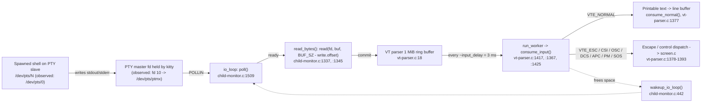

# How kitty's C code communicates with the spawned shell over a PTY

> **Repository:** `kovidgoyal/kitty` (terminal emulator)
> **Source branch:** `kitty_815df1e210e0`
> **HEAD commit:** `815df1e210e0a9ab4622f5c7f2d6891d7dbeddf1` (kitty v0.35.2)

This document answers four questions about how kitty reads data from the shell it
spawns over a pseudo‑terminal (PTY), and how it then separates printable text from
escape sequences:

- **Q1** — When kitty starts a shell, what process is spawned, what is its PID, what is the
  exact command line in the process list, and what PTY device path connects kitty to the shell?
- **Q2** — When you type `echo test123`, what system call(s) does kitty use to read that data
  from the PTY, what read‑buffer size is used, and how many bytes come back?
- **Q3** — When you run `yes hello` (continuous output), how does kitty's reading behavior
  change, how frequently does it read, what is the typical byte count per read, and what is the
  integer file descriptor kitty uses to read the PTY master?
- **Q4** — In the C code, which function reads from the PTY file descriptor, and which function
  parses the incoming data to separate printable text from escape sequences?

## Methodology and how to read this document

This investigation treats **the source code as the ultimate source of truth**. kitty was built
from source and run, and its behavior was observed empirically. Accordingly, **every factual
claim below pairs three things**:

1. **(a) An empirical observation** — the exact command/method used to obtain it.
2. **(b) A code citation** in `file:line` form — the line of source that produces the behavior.
3. **(c) Rationale** — *why* the behavior is what it is, not merely *what* it is.

Every value is explicitly **LABELED** as one of:

- **🔧 Code‑derived constant** — a value/identifier fixed in the source (e.g. the buffer cap, the
  function names, the default `input_delay`). These are the same on any machine.
- **📈 Runtime‑observed value** — a value that depends on this particular run (e.g. the PID, the
  exact argv, the `/dev/pts/N` number, the integer file descriptor, the per‑read byte counts).
  These are reported *as observed, with the method used*, and will differ on other machines/runs.

### Environment used for runtime observation

All build and runtime observation was performed inside the user‑specified Docker container
`andrewparkscaleai/coding-agent:kovidgoyal__kitty__815df1e210e0a9ab4622f5c7f2d6891d7dbeddf1`
(from `ghcr.io/scaleapi/swe-atlas:swe_atlas_QnA_kovidgoyal_kitty_1.0`). kitty is a windowed GPU
terminal, so it was launched against a headless X server (`Xvfb`) with software OpenGL.

The observation tools used were:

| Tool | Purpose |
|------|---------|
| `ps -o pid,ppid,tty,args` | Process identity, exact command line, controlling tty |
| `ls -l /proc/<pid>/fd` + `cat /proc/<pid>/fdinfo/<n>` | Map file descriptors to devices (PTY master/slave) |
| `strace -f -y -tt -e trace=read,poll,write` | Syscall sequence, per‑`read()` byte counts, read frequency |
| `gdb -p <pid>` | Confirm the C functions are actually invoked at runtime |

The exact launch used for observation was (kitty PID and child PID below are this run's values):

```bash
# headless display
Xvfb :99 -screen 0 1280x800x24 &
export DISPLAY=:99 LIBGL_ALWAYS_SOFTWARE=1 LANG=C.UTF-8

# launch kitty with remote control so input can be injected for observation
./kitty/launcher/kitty --config NONE -o allow_remote_control=yes \
    --listen-on unix:/tmp/kitty.sock &
# kitty PID (this run) = 50827 ; spawned shell child PID = 50896
```

> **Note on the deliverable filename.** Per the task rule, the document name equals the *source*
> branch name, which resolves to `kitty_815df1e210e0` (the branch tracking HEAD
> `815df1e210e0a9ab4622f5c7f2d6891d7dbeddf1`); hence this file is
> `blitzy/documentation/kitty_815df1e210e0.md`.

---

## The end‑to‑end byte path (architecture overview)

kitty uses a **decoupled producer/consumer design** for talking to the shell:

- **Producer — a dedicated I/O thread** runs `io_loop()` (`kitty/child-monitor.c:1481`). It
  `poll()`s the PTY master file descriptor and, when data is ready, calls `read_bytes()`
  (`kitty/child-monitor.c:1337`) which issues a POSIX `read()` (`kitty/child-monitor.c:1345`).
- **Consumer — the main thread** parses the bytes. `do_parse()` drives `parse_worker()`
  (`kitty/vt-parser.c:1496`) → `run_worker()` (`kitty/vt-parser.c:1417`) → `consume_input()`
  (`kitty/vt-parser.c:1367`), which classifies the bytes and updates the `Screen`.
- **Decoupling buffer — a 1 MiB ring buffer.** The two threads are decoupled by a write buffer
  whose capacity is `BUF_SZ = 1024*1024` (1 MiB) (`kitty/vt-parser.c:18`).
- **Back‑pressure / flow control.** The I/O thread only requests `POLLIN` for a child *when the
  parser has space*: `children_fds[EXTRA_FDS + i].events = vt_parser_has_space_for_input(...) ?
  POLLIN : 0` (`kitty/child-monitor.c:1501`). When parsing later frees space, `do_parse()` calls
  `wakeup_io_loop()` (`kitty/child-monitor.c:442`) to resume reading.

This separation is corroborated by kitty's own documentation, which states that interaction with
child programs runs in a separate thread from rendering to improve smoothness (kitty Performance
page) — see **External corroboration** below.



**Reading the diagram:** the shell writes its output to the PTY **slave** (`/dev/pts/N`); the
kernel tty layer makes those bytes readable on the PTY **master**, which kitty holds as an integer
file descriptor. kitty's I/O thread polls that fd, reads available bytes into the 1 MiB ring
buffer, and the main thread periodically (throttled by `input_delay`, default 3 ms) parses the
buffer, splitting `VTE_NORMAL` printable text from escape/control sequences and applying them to
the on‑screen model in `kitty/screen.c`.

---

## Q1 — Shell‑spawn identity and PTY linkage

**How the spawn works (code path, the basis for all four sub‑answers).** kitty creates the PTY
pair in Python and delegates the `fork`/`exec` to C:

1. The shell to run is chosen by `resolved_shell()` (`kitty/utils.py:768`), which returns
   `[shell_path]` — the user's login shell — when the `shell` option is its default value `'.'`.
2. `Child.fork()` creates the PTY pair with `master, slave = os.openpty()`
   (`kitty/child.py:171`, also invoked inside `fork()` at `kitty/child.py:281`), records
   `self.final_argv0 = argv[0]` (`kitty/child.py:328`), and calls
   `fast_data_types.spawn(...)` (`kitty/child.py:333`).
3. kitty keeps the **master** end as `self.child_fd = master` (`kitty/child.py:338`) and sets it
   non‑blocking with `os.set_blocking(self.child_fd, False)` (`kitty/child.py:345`).
4. In C, `spawn()` resolves the **slave** device path via `ttyname_r(slave, name, ...)`
   (`kitty/child.c:88`), then `fork()`s (`kitty/child.c:97`); in the child it calls `setsid()`
   (`kitty/child.c:123`), makes the slave the controlling terminal with `ioctl(tfd, TIOCSCTTY, 0)`
   (`kitty/child.c:129`), `dup2`s the slave onto stdout/stderr/stdin
   (`kitty/child.c:138`, `:139`, `:145`), and finally `execvp(exe, argv)` (`kitty/child.c:159`).

The child monitor is wired up in `kitty/boss.py`: the `ChildMonitor` is created
(`kitty/boss.py:370`), the child is registered with `add_child(window.id, window.child.pid,
window.child.child_fd, window.screen)` (`kitty/boss.py:587`), and the I/O thread is started with
`self.child_monitor.start()` (`kitty/boss.py:1183`).

### Q1(a) — What process is spawned

- **Answer (📈 runtime‑observed):** the user's **login shell**, observed here as **`/bin/bash`**.
- **Observation method:** `ps --ppid 50827 -o pid,ppid,tty,args` (50827 = kitty's PID) showed a
  single child process running `/bin/bash`.
- **Code citation / rationale:** the identity comes from `resolved_shell()`
  (`kitty/utils.py:768`) returning the login shell, which `Child.fork()` passes to
  `fast_data_types.spawn(...)` (`kitty/child.py:333`) and the C `spawn()` ultimately runs via
  `execvp(exe, argv)` (`kitty/child.c:159`). In this container the default login shell is
  `/bin/bash`, hence bash is what gets `execvp`'d. The *mechanism* (login shell → `execvp`) is
  code‑derived; the *concrete shell* (`/bin/bash`) is runtime‑observed and would differ if the
  user's shell were `zsh`/`dash`/etc.

### Q1(b) — Its PID

- **Answer (📈 runtime‑observed):** **PID `50896`** (parent PID `50827` = kitty).
- **Observation method:** `ps --ppid 50827 -o pid,ppid,tty,args` — the spawned bash appeared as
  PID `50896` with PPID `50827`.
- **Rationale:** the PID is assigned by the kernel to the process created by `fork()`
  (`kitty/child.c:97`) and returned to Python as the value stored on the `Child` object and handed
  to `add_child(..., window.child.pid, ...)` (`kitty/boss.py:587`). It is inherently a
  per‑run value.

### Q1(c) — The exact command line in the process list

- **Answer (📈 runtime‑observed):** **`/bin/bash --posix`** (argv = `["/bin/bash", "--posix"]`).
- **Observation method:** two independent methods agreed —
  - `ps -o pid,ppid,tty,args -p 50896` → `... pts/0  /bin/bash --posix`
  - `tr '\0' ' ' < /proc/50896/cmdline` → `/bin/bash --posix`
- **Rationale (two important nuances, both code‑grounded):**
  1. **No leading `-` on Linux.** `argv[0]` is the bare path `/bin/bash`, *not* `-/bin/bash`. The
     login‑shell leading‑`-` argv0 convention in kitty lives **only** in the macOS `run-shell`
     kitten branch, guarded by `self.should_run_via_run_shell_kitten = is_macos and
     self.is_default_shell` (`kitty/child.py:230`) with the wrapping at
     `kitty/child.py:295-326`. Because `is_macos` is false in this Linux container, that branch is
     **not exercised**; the shell is `execvp`'d directly (`kitty/child.c:159`) with the argv from
     `resolved_shell()`. This is why Q1(c) is reported strictly **as observed from `ps`**, with no
     assumed `-` prefix.
  2. **Where `--posix` comes from.** It is *not* something you typed; it is appended by kitty's
     **bash shell integration**. On Linux, `Child.fork()` calls `modify_shell_environ(...)`
     (`kitty/child.py:266`), which routes to `setup_bash_env()`
     (`kitty/shell_integration.py:70`); that function does `argv.insert(1, '--posix')`
     (`kitty/shell_integration.py:146`) and points `ENV` at kitty's `kitty.bash` integration
     script so bash sources it in POSIX mode. Hence the observed argv `["/bin/bash", "--posix"]`.

  The macOS path is documented here from code only (it is not exercised at runtime on Linux); the
  precise argv on this host is the runtime‑observed `/bin/bash --posix`.

### Q1(d) — The PTY device path linking kitty ↔ shell

- **Answer:** the connection is a PTY pair. The **slave** is **`/dev/pts/0`** (the shell's
  controlling terminal); kitty retains the **master**, observed as integer file descriptor
  **`10`** pointing at `/dev/pts/ptmx`. (📈 both the `pts/0` number and the master fd integer are
  runtime‑observed.)
- **Observation methods and evidence:**
  - `ls -l /proc/50896/fd/0`, `.../fd/1`, `.../fd/2` → all three symlink to **`/dev/pts/0`**
    (the shell's stdin/stdout/stderr are the slave).
  - `ps -o tty= -p 50896` → **`pts/0`** (the controlling terminal column).
  - `ls -l /proc/50827/fd/` → **`10 -> /dev/pts/ptmx`** — exactly one `ptmx` (master) held by
    kitty.
  - `cat /proc/50827/fdinfo/10` → `tty-index: 0`, proving master fd `10` is paired with slave
    `/dev/pts/0`; its `flags: 02104002` (octal) decode to `O_RDWR | O_NONBLOCK | O_LARGEFILE |
    O_CLOEXEC` — and the `O_NONBLOCK` bit directly **corroborates**
    `os.set_blocking(self.child_fd, False)` (`kitty/child.py:345`).
- **Code citation / rationale:** the pair is created by `os.openpty()` (`kitty/child.py:171`); the
  slave path `/dev/pts/N` is resolved in C by `ttyname_r(slave, name, ...)`
  (`kitty/child.c:88`); the slave becomes the child's controlling terminal via `setsid()`
  (`kitty/child.c:123`) + `ioctl(TIOCSCTTY)` (`kitty/child.c:129`) + `dup2` onto the standard
  descriptors (`kitty/child.c:138-145`); and kitty keeps the master as `self.child_fd`
  (`kitty/child.py:338`). This is the standard Unix98 PTY master/slave split (see External
  corroboration): the emulator holds `/dev/ptmx` (master) and the shell sees `/dev/pts/N` (slave).

---

## Q2 — Low‑volume read of `echo test123`

The verbatim command **`echo test123`** was typed into the running kitty window (injected with
`kitten @ send-text $'echo test123\r'` and confirmed on screen). kitty was traced with:

```bash
strace -f -y -tt -s 200 -e trace=read,poll,write -p 50827 -o trace_echo.log
```

The reading happens on kitty's **I/O thread**, observed as **LWP `50895`** inside kitty PID
`50827`.

### Q2(a) — The system call(s) used to read PTY data

- **Answer:** a **`poll()`** to detect readiness, followed by a single POSIX **`read()`** on the
  PTY master fd.
- **Observation method (📈 runtime‑observed sequence):** the trace shows the I/O thread calling
  `poll([{fd=7<eventfd>}, {fd=8<signalfd>}, {fd=10</dev/pts/ptmx>}], 3, <timeout>)` and, once
  `fd 10` reports `POLLIN`, issuing `read(10, ..., <size>)`. The poll set of exactly three fds is
  itself a runtime confirmation of the code (see rationale).
- **Code citation / rationale:** `io_loop()` (`kitty/child-monitor.c:1481`) builds the poll set
  and calls `poll()` (`kitty/child-monitor.c:1509`, or blocking `poll(..., -1)` at `:1512`); for
  each ready child it calls `read_bytes(children_fds[EXTRA_FDS + i].fd, ...)`
  (`kitty/child-monitor.c:1531`), and `read_bytes()` issues `read(fd, buf, available_buffer_space)`
  (`kitty/child-monitor.c:1345`). The three‑fd poll set matches `#define EXTRA_FDS 2`
  (`kitty/child-monitor.c:35`): slots `0` and `1` are kitty's wakeup eventfd and signal fd, and
  the child PTY master occupies index `EXTRA_FDS + 0 = 2` (here `fd 10`). So the syscall pair is
  `poll()` → `read()`, exactly as the code dictates.

### Q2(b) — The read buffer size

- **Answer (🔧 code‑derived cap):** the `read()` is asked for **up to `BUF_SZ - write.offset`
  bytes**, where **`BUF_SZ = 1 MiB`** (`1024*1024`). The very first read of an idle buffer requests
  the full **`1048576`** bytes.
- **Observation method:** in the trace, the request size (3rd argument of `read`) was `1048576`
  for the first read, then `1048553`, `1048506`, `1048392` for the subsequent reads — i.e.
  `BUF_SZ` minus the bytes already buffered.
- **Code citation / rationale:** `BUF_SZ (1024u*1024u)` is defined at `kitty/vt-parser.c:18`. The
  request size is computed in `vt_parser_create_write_buffer()` as `*sz = BUF_SZ -
  self->write.offset` (`kitty/vt-parser.c:1457`); `read_bytes()` obtains that buffer
  (`kitty/child-monitor.c:1341`) and passes its size straight to `read()`
  (`kitty/child-monitor.c:1345`). **Key distinction:** this is the *requested* (maximum) size —
  up to ~1 MiB — which is **not** the same as the number of bytes that actually come back.

### Q2(c) — How many bytes come back

- **Answer (📈 runtime‑observed):** a **small** amount — here **4 reads returning 23, 47, 114, and
  194 bytes** (~378 bytes total) — far below the ~1 MiB requested.
- **Observation method:** the `read()` return values in `trace_echo.log`. The 23‑byte read carried
  the echoed input and a bracketed‑paste‑off sequence (`"echo test123\r\n\033[?2004l\r"`); a
  114‑byte read literally contained the command's output `test123\r\n` plus the OSC 133
  shell‑integration prompt markers; the others carried the window‑title (OSC) update and the
  prompt redraw. After the reads, the `poll()` timeout was observed to shrink to `1` then `0` ms.
- **Code citation / rationale:** the small count is inherent to a low‑volume command. The `read()`
  at `kitty/child-monitor.c:1345` returns whatever the kernel tty layer currently has buffered;
  for `echo test123` that is only the echoed line plus a few control/escape bytes, so each `read()`
  returns tens to low‑hundreds of bytes even though up to 1 MiB was offered. This is the expected
  behavior of a blocking‑free `read()` on a PTY master when little data is available — the request
  size (`BUF_SZ - offset`) is a cap, while the return value tracks actual kernel‑buffered bytes.

---

## Q3 — High‑volume read of `yes hello`

The verbatim command **`yes hello`** (which prints `hello\n` endlessly) was run in the kitty
window via `kitten @ send-text $'yes hello\r'`, traced for ~1 second with the same
`strace -f -y -tt -e trace=read,poll,write` attachment, and then terminated by sending **Ctrl‑C**
(`kitten @ send-text $'\x03'`). The numbers below come from analyzing `trace_yes.log`.

### Q3(a) — How the reading behavior changes

- **Answer:** kitty switches from a handful of isolated `poll()`/`read()` pairs to a **tight,
  continuous `poll()`/`read()` cycle**, and the read‑buffer *request* size **shrinks** as unparsed
  data accumulates in the 1 MiB ring buffer.
- **Observation method (📈 runtime‑observed):** the trace showed **10,258 `read(10, ...)` calls in
  ~1.05 s**, with the request size starting at `1048576` and falling to as low as `869145` bytes
  as the buffer filled — visibly demonstrating the 1 MiB ring absorbing the burst.
- **Code citation / rationale:** the cycle is `io_loop()` (`kitty/child-monitor.c:1481`) repeatedly
  calling `poll()` (`kitty/child-monitor.c:1509`) and dispatching `read_bytes()`
  (`kitty/child-monitor.c:1531`). The shrinking request size is `*sz = BUF_SZ - self->write.offset`
  (`kitty/vt-parser.c:1457`): as the producer outruns the consumer, `write.offset` grows so each
  subsequent `read()` asks for less. This is exactly the producer/consumer buffer at work.

### Q3(b) — The read frequency

- **Answer (📈 runtime‑observed):** **very high** — about **9,340 reads/second** *under strace's
  ptrace overhead* (the un‑traced rate is higher), with a **median inter‑read gap of ~76 µs**
  (mean ~107 µs).
- **Observation method:** timestamps (`-tt`) on consecutive `read(10, ...)` lines in
  `trace_yes.log`, differenced and aggregated.
- **Code citation / rationale:** as long as the parser reports space, `io_loop()` keeps the child's
  poll slot armed with `POLLIN` (`kitty/child-monitor.c:1501`) and immediately re‑reads on the next
  loop iteration (`kitty/child-monitor.c:1531`). There is no artificial delay on the *read* side —
  the only throttle is on the *parse* side (Q3 back‑pressure, below) — so reads recur as fast as
  the kernel makes bytes available.

### Q3(c) — Typical bytes per read during the stream

- **Answer (📈 runtime‑observed):** a few hundred bytes to a couple of KB — **median 667 bytes**,
  mean ~827, min 2, max 19,346; **8,182 of 9,769 streaming reads returned < 1 KB**. This is far
  below the ~0.87–1 MiB *requested*.
- **Observation method:** the distribution of `read(10, ...)` return values in `trace_yes.log`.
- **Code citation / rationale (the crucial distinction):** kitty always *requests* up to its own 1
  MiB cap. `read_bytes()` (`kitty/child-monitor.c:1337`) reads into the buffer returned by
  `vt_parser_create_write_buffer()`, whose size is `*sz = BUF_SZ - self->write.offset`
  (`kitty/vt-parser.c:1457`) with `BUF_SZ = 1 MiB` (`kitty/vt-parser.c:18`), and passes that size
  straight to `read(fd, buf, available_buffer_space)` (`kitty/child-monitor.c:1345`). The number of
  bytes that actually *come back*, however, is not chosen by kitty: a `read()` on the PTY master
  returns whatever the kernel tty/PTY stack happens to have buffered at that instant. Because kitty
  drains the master very frequently (Q3b), little tends to accumulate between successive reads, so
  in this run the returns *clustered* in the hundreds-of-bytes-to-few-KB range (median 667; 8,182 of
  9,769 reads < 1 KB). That clustering is a *typical distribution*, not a hard limit: when more had
  accumulated between reads, a single `read()` returned as much as 19,346 bytes (~19 KB). The Linux
  `N_TTY` line discipline keeps its *canonical read buffer* small (`N_TTY_BUF_SIZE = 4096`; see
  External corroboration), which helps explain why the *typical* per-read amounts are small, but
  4096 is the line-discipline read-buffer size, not a ceiling on a PTY-master `read()`: total
  PTY/driver buffering is delivered in tty buffer chunks, so a single read can exceed it (as the
  19,346-byte read shows). The throughput is therefore achieved by reading *often* (Q3b), not by
  reading *huge* chunks.

### Q3(d) — The integer file descriptor kitty uses for the PTY master

- **Answer (📈 runtime‑observed):** integer fd **`10`**.
- **Observation method:** every streaming `read()` in `trace_yes.log` was on `read(10, ...)`, and
  `ls -l /proc/50827/fd/` showed **`10 -> /dev/pts/ptmx`** (cross‑checked with
  `/proc/50827/fdinfo/10` → `tty-index: 0`, matching slave `/dev/pts/0`).
- **Code citation / rationale:** this is the master returned by `os.openpty()`
  (`kitty/child.py:171`) and stored as `self.child_fd` (`kitty/child.py:338`); it is handed to the
  child monitor via `add_child(..., window.child.child_fd, ...)` (`kitty/boss.py:587`) and is the
  `fd` argument of `read_bytes()`/`read()` (`kitty/child-monitor.c:1337`, `:1345`). The specific
  integer (`10`) is assigned by the kernel at `openpty()` time and is therefore per‑run.

### Back‑pressure — the heart of the high‑volume case

- **Mechanism (🔧 code‑derived):** the I/O thread arms a child's `POLLIN` **only** when
  `vt_parser_has_space_for_input(...)` is true (`kitty/child-monitor.c:1501`). That predicate is
  `read.sz + write.pending < BUF_SZ` (`kitty/vt-parser.c:1481`, inside
  `vt_parser_has_space_for_input()` at `kitty/vt-parser.c:1477`), i.e. "is there still room in the 1
  MiB buffer?". When parsing later frees room, `do_parse()` calls `wakeup_io_loop(...)`
  (`kitty/child-monitor.c:442`) to resume reads.
- **What was actually observed (📈 runtime‑observed, reported honestly):** in this run the buffer
  never came close to full — `write.offset` **peaked at 179,431 bytes (~17 % of 1 MiB)**; 7,618
  reads saw an offset > 16 KB but **none** exceeded 256 KB, and `fd 10` stayed armed with `POLLIN`
  in **all 10,294** `io_loop` polls. In other words, the 3 ms parser kept draining fast enough that
  the back‑pressure gate **did not fully close** during this ~1 s sample.
- **Rationale:** the *visible* evidence of back‑pressure here is the **shrinking `read()` request
  size** (Q3a) — the ring buffer absorbing bursts — rather than a full stall. Complete `POLLIN`
  suppression followed by a `wakeup_io_loop()` resume (`kitty/child-monitor.c:442`) would engage
  only if the consumer fell far enough behind to fill the entire 1 MiB; `yes hello` on this host
  did not saturate the vectorized parser to that point.
- **Bidirectional use of the same fd (📈 observed):** the trace also showed exactly two writes on
  fd 10 — `write(10, "yes hello\r", 10)` (the injected command) and `write(10, "\3", 1)` (the
  Ctrl‑C) — confirming kitty **writes input to** and **reads output from** the *same* PTY master
  fd `10`.

---

## Q4 — Code-level functions

### Q4(a) — The function that reads from the PTY file descriptor

- **Answer (CODE-DERIVED):** **`read_bytes()`** in `kitty/child-monitor.c:1337`.
- **Code citation / rationale:** `read_bytes(int fd, Screen *screen)` (`kitty/child-monitor.c:1337`)
  obtains a write buffer from the parser via `vt_parser_create_write_buffer(...)`
  (`kitty/child-monitor.c:1341`), issues the actual POSIX `read(fd, buf, available_buffer_space)`
  (`kitty/child-monitor.c:1345`) with an `EINTR`/`EAGAIN` retry loop (`:1347`), commits the bytes
  back to the parser with `vt_parser_commit_write(..., len)` (`:1354`), and returns `len != 0` so a
  zero-byte read signals that the child closed. It is called from the I/O thread's `io_loop()` at
  `kitty/child-monitor.c:1531`.
- **Runtime confirmation (RUNTIME-OBSERVED, via `gdb -p 50827`):** this build uses link-time
  optimization (LTO), so the `static` `read_bytes` is **inlined into `io_loop`** (no standalone
  symbol survives — only `io_loop`, `run_worker.lto_priv.*`, and `parse_worker` appear in
  `nm`/`readelf`). A backtrace of the I/O thread (LWP `50895`) showed it parked in `io_loop` ->
  `__GI___poll` (`#4 io_loop (fast_data_types.so)` -> `#3 __GI___poll`), i.e. exactly the `poll()`
  at `kitty/child-monitor.c:1509`/`:1512` from which `read_bytes` (`:1345`) is driven.

### Q4(b) — The function that separates printable text from escape sequences

- **Answer (CODE-DERIVED):** **`consume_input()`** in `kitty/vt-parser.c:1367`.
- **Code citation / rationale:** `consume_input()` (`kitty/vt-parser.c:1367`) switches on the VT
  state machine — `switch (self->vte_state)` (`kitty/vt-parser.c:1375`). The `VTE_NORMAL` case
  handles **printable text** via `consume_normal(self)` (`kitty/vt-parser.c:1377`), while the
  escape/control states route to dedicated consumers: `VTE_ESC`, `VTE_CSI`, and
  `VTE_OSC`/`VTE_APC`/`VTE_PM`/`VTE_DCS`/`VTE_SOS` across `kitty/vt-parser.c:1378-1393` (the state
  enum itself is at `kitty/vt-parser.c:161`). That `switch` is precisely where printable bytes are
  separated from escape/control sequences. The classifier is driven on the **main thread** by
  `run_worker()` (`kitty/vt-parser.c:1417`) via the public `parse_worker()`
  (`kitty/vt-parser.c:1496`, declared in `kitty/vt-parser.h:37`), and is **throttled** by
  `input_delay`: `if (flush || pd->time_since_new_input >= OPT(input_delay) || self->read.sz + 16 *
  1024 > BUF_SZ)` (`kitty/vt-parser.c:1425`), with the default of **3 ms** at
  `kitty/options/definition.py:878`.
- **Runtime confirmation (RUNTIME-OBSERVED, via `gdb -p 50827`):** as with the reader, LTO inlines
  the `static` `consume_input` **into `run_worker`**. A breakpoint on the public `parse_worker` was
  **hit**, and its backtrace was `#0 parse_worker (fast_data_types.so)` <- `#1 do_parse`
  (`kitty/child-monitor.c:437-448`), confirming the live call chain
  `do_parse -> parse_worker -> run_worker -> consume_input`. The `run_worker.lto_priv.*` symbols
  also resolved to breakpoints, consistent with `consume_input` being inlined there.
- **Contract corroboration:** the reader<->parser API is declared in `kitty/vt-parser.h`
  (`vt_parser_create_write_buffer` `:34`, `vt_parser_commit_write` `:35`,
  `vt_parser_has_space_for_input` `:36`, `parse_worker` `:37`), and the screen test hooks
  `test_create_write_buffer` (`kitty/screen.c:4755`), `test_commit_write_buffer`
  (`kitty/screen.c:4762`), and `test_parse_written_data` (`kitty/screen.c:4772`) exercise exactly
  this create-buffer -> commit-write -> parse contract used by the read loop.

---

## Code-derived vs runtime-observed — summary

In the table, **CODE** = a constant/identifier fixed in source (same on any machine; cited as
`file:line`); **RUNTIME** = a value observed in this particular run (with the method shown).

| Aspect | CODE-derived (cite `file:line`) | RUNTIME-observed (method) |
|---|---|---|
| Buffer cap | `BUF_SZ` = 1 MiB (`kitty/vt-parser.c:18`); read request = `BUF_SZ - write.offset` (`kitty/vt-parser.c:1457`) | first `read()` request `1048576`, shrinking to `869145` under load (`strace`) |
| Parse throttle | `input_delay` default = **3 ms** (`kitty/options/definition.py:878`); throttle test (`kitty/vt-parser.c:1425`) | parser kept up; `write.offset` peaked ~179 KB / 1 MiB (`strace` analysis) |
| Reader fn | `read_bytes()` (`kitty/child-monitor.c:1337`); `read()` (`:1345`) | invoked on I/O thread LWP `50895`; inlined into `io_loop` (`gdb` backtrace) |
| Parser fn | `consume_input()` (`kitty/vt-parser.c:1367`); `switch` (`:1375`) | `parse_worker`<-`do_parse` breakpoint hit; inlined into `run_worker` (`gdb`) |
| Poll slots | `EXTRA_FDS` = 2 (`kitty/child-monitor.c:35`); `POLLIN` gate (`:1501`) | 3-fd poll set `[7 eventfd, 8 signalfd, 10 ptmx]` (`strace`) |
| Shell process | login shell via `resolved_shell()` (`kitty/utils.py:768`) -> `execvp` (`kitty/child.c:159`) | `/bin/bash` (`ps`) |
| Shell PID | assigned by `fork()` (`kitty/child.c:97`) | `50896` (`ps --ppid 50827`) |
| Exact argv | direct `execvp` on Linux (no `-`); macOS `run-shell` branch (`kitty/child.py:230,295-326`); `--posix` from shell integration (`kitty/shell_integration.py:146`) | `/bin/bash --posix` (`ps`, `/proc/50896/cmdline`) |
| PTY slave path | `os.openpty()` (`kitty/child.py:171`); `ttyname_r` (`kitty/child.c:88`); controlling tty via `setsid`/`TIOCSCTTY`/`dup2` (`kitty/child.c:123,129,138-145`) | `/dev/pts/0` (`/proc/50896/fd/*`, `ps -o tty=`) |
| PTY master fd | kept as `self.child_fd` (`kitty/child.py:338`), non-blocking (`:345`) | integer **`10`** -> `/dev/pts/ptmx`; flags incl. `O_NONBLOCK` (`/proc/50827/fd`, `fdinfo/10`) |
| Per-read bytes | bounded by kernel tty buffer, not kitty | Q2: 23/47/114/194 B; Q3: median 667 B (`strace`) |
| Read frequency | unthrottled on read side; only parse side is delayed | ~9,340 reads/s under `strace`; median gap ~76 us |

---


## External corroboration

The conclusions above are grounded in kitty's source (cited inline as `file:line`) and the runtime
observations described with each answer. The external sources below are used **only as
corroboration**, never as a substitute for the code.

- **`input_delay` default = 3 ms.** kitty's official Performance page (`sw.kovidgoyal.net`) states
  this value is the default, corroborating the code constant at `kitty/options/definition.py:878`.
- **`input_delay` is bypassed when the buffer is nearly full.** kitty's `kitty.conf` reference
  (`sw.kovidgoyal.net`, also mirrored in the Debian `kitty.conf(5)` manpage) notes the setting is
  ignored when the input buffer is almost full — corroborating the third clause of the throttle
  test, `self->read.sz + 16 * 1024 > BUF_SZ`, at `kitty/vt-parser.c:1425`.
- **Reading runs in a separate thread from rendering.** The same Performance page notes that
  interaction with child programs happens in a thread separate from rendering, corroborating the
  decoupled producer/consumer design (I/O thread `io_loop` at `kitty/child-monitor.c:1481` vs the
  main parse/render thread).
- **Unix98 PTY master/slave architecture.** The Linux `pty(7)` manual page (`man7.org`), the
  `devpts` references, and the kernel TTY documentation (`docs.kernel.org`) describe that a process
  opens `/dev/ptmx` to obtain the **master** and the matching **slave** appears as `/dev/pts/N`,
  with the terminal emulator holding the master and the shell's controlling terminal being the
  slave. This corroborates Q1(d): kitty held the master (`fd 10 -> /dev/pts/ptmx`) while the shell
  used `/dev/pts/0`.
- **Line-discipline buffering (small, ~4 KB canonical buffer).** The Linux `N_TTY` line discipline
  keeps its canonical read buffer small (`N_TTY_BUF_SIZE` is 4096). This corroborates Q3(c) only in
  the limited sense that line-discipline buffering is *small*, which is why the per-`read()` returns
  *typically* stayed in the hundreds-of-bytes-to-few-KB range (observed median 667 bytes) rather
  than approaching kitty's ~1 MiB request cap. It is not a hard upper bound on what a single
  PTY-master `read()` can return: total PTY/driver buffering is delivered in tty buffer chunks and
  can exceed 4 KB; in this run a single `read()` returned as much as 19,346 bytes. The number of
  bytes returned is governed by what the kernel tty/PTY stack has buffered at read time, not by
  kitty's buffer.

---

## Conclusion

When kitty starts, it creates a PTY pair (`os.openpty()`, `kitty/child.py:171`), forks, makes the
slave the child's controlling terminal (`setsid`/`TIOCSCTTY`/`dup2`, `kitty/child.c:123-145`), and
`execvp`s the user's login shell (`kitty/child.c:159`). In this run the shell was **`/bin/bash`**,
PID **`50896`**, observed in the process list as **`/bin/bash --posix`** (the `--posix` added by
kitty's bash shell integration, `kitty/shell_integration.py:146`; no leading `-` because that is a
macOS-only path), connected via slave **`/dev/pts/0`** while kitty retained the **master** as
integer fd **`10`**.

kitty then talks to the shell through a **decoupled producer/consumer** pipeline: a dedicated I/O
thread `poll()`s the master fd and reads it with plain POSIX `read()` in **`read_bytes()`**
(`kitty/child-monitor.c:1337,1345`), depositing bytes into a **1 MiB ring buffer**
(`BUF_SZ`, `kitty/vt-parser.c:18`); the main thread then parses that buffer, throttled to roughly
every **3 ms** (`input_delay`, `kitty/options/definition.py:878`), in **`consume_input()`**
(`kitty/vt-parser.c:1367`), whose `switch (self->vte_state)` separates `VTE_NORMAL` printable text
from `VTE_ESC/CSI/OSC/DCS/APC/PM/SOS` escape and control sequences (`kitty/vt-parser.c:1375-1393`).

For a low-volume command (**`echo test123`**) kitty issued a few small `read()` calls (four in
this run, returning 23/47/114/194 bytes, tens to low-hundreds of bytes each); for a high-volume
stream (**`yes hello`**) it entered a tight
`poll()`/`read()` loop reading ~9,000+ times per second with per-read counts in the hundreds of
bytes (kernel-tty-bounded), while the 1 MiB buffer plus the `vt_parser_has_space_for_input` gate
(`kitty/child-monitor.c:1501`) provided back-pressure — visible here as the shrinking `read()`
request size rather than a full stall, since the vectorized parser kept up. Throughout, the
**request size** (up to ~1 MiB = `BUF_SZ - write.offset`) is distinct from the **bytes returned**
(bounded by the kernel tty buffer), and **code-derived constants** (buffer size, function names,
default `input_delay`) are distinct from **runtime-observed values** (PID, exact argv,
`/dev/pts/0`, fd `10`, and the per-read byte counts) — the latter reported as observed, with the
method used to obtain each.

