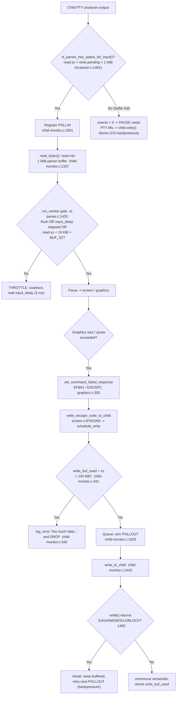

# How kitty Manages Flow Control (Backpressure)

**A code-grounded, runtime-observed investigation of the kitty terminal emulator**

- **Repository / branch:** `kitty_815df1e210e0`
- **HEAD commit under study:** `815df1e21` ("Wire up applying of font config")
- **Question answered:** When terminal graphics data — and terminal output generally — arrives faster than the system can comfortably process or respond to it, how does kitty manage flow control (backpressure)? Specifically: how does it decide to *buffer* vs. *pause* vs. *throttle* on the input side (Q1); what happens on the output side when responses must be written but the path is under pressure (Q2); where do these decisions live in the code (Q3); how do they manifest at runtime under load (Q4); and does kitty quietly adapt or show visible signs (Q5)?

---

## How this answer was produced (methodology)

Per the "SWE-AtlasQnA-Repo" rule set, this document was written **run-first**: kitty was built and executed at HEAD `815df1e21`, the flow-control code paths were driven with temporary observation scripts large enough to cross real thresholds, and the resulting output was captured verbatim. **Every behavioral/runtime claim below is paired with the exact observed line that demonstrates it and the command that produced it.** Every numeric literal and identifier is cited with a re-verified `file:line` reference (each checked in the container with `sed -n 'Np' <file>`).

The build-and-run was performed inside the designated Docker container
`ghcr.io/scaleapi/swe-atlas:swe_atlas_QnA_kovidgoyal_kitty_1.0`
(host checkout mounted at `/work`), which supplies the C toolchain and Go that a plain sandbox lacks. All temporary observation scripts lived only under the container's `/tmp` and were removed afterward; the repository is left unchanged except for this one document.

### Build & toolchain evidence (substantiates "observed at HEAD 815df1e21")

Toolchain actually present in the container:

```text
$ python3 --version
Python 3.12.3
$ go version
go version go1.23.4 linux/amd64
$ gcc --version | head -1
gcc (Ubuntu 13.3.0-6ubuntu2~24.04) 13.3.0
```

The native extension (`kitty/*.c` → `kitty/fast_data_types.so`) and the Go `kitten` tooling were built with `setup.py build`:

```text
$ cd /work && LC_ALL=C.UTF-8 LANG=C.UTF-8 python3 setup.py build --verbose
... /usr/local/go/bin/go build -v -ldflags '-X kitty.VCSRevision=815df1e210e0a9ab4622f5c7f2d6891d7dbeddf1 -s -w' -o kitty/launcher/kitten /work/tools/cmd
BUILD_EXIT=0
```

The build embeds the exact revision `815df1e210e0a9ab4622f5c7f2d6891d7dbeddf1`, confirming the artifacts correspond to the code under study. The launcher runs — first evidence the build succeeded:

```text
$ ./kitty/launcher/kitty --version
kitty 0.35.2 created by Kovid Goyal
```

Produced artifacts: `kitty/fast_data_types.so` (1,213,072 bytes), `kitty/launcher/kitten` (Go, 15,945,988 bytes), `kitty/launcher/kitty` (36,224 bytes).

Two observation vehicles were used:

- **Approach A — in-process harness** (`./kitty/launcher/kitty +launch <script>` / `+runpy "<code>"`), patterned on `kitty_tests/graphics.py`. Deterministic; best for the graphics *visible signs* (Q4/Q5) and the bounded parser buffer (Q1).
- **Approach B — real `kitty` GUI process** on a headless X server (`Xvfb :99` + Mesa `llvmpipe` software GL), rebuilt with the compile-time debug macros `KITTY_PRINT_BYTES_SENT_TO_CHILD` and `DEBUG_POLL_EVENTS` (enabled via `CFLAGS`, no source edit). Best for the I/O engine — `io_loop` poll scheduling (Q1 pause/throttle) and write backpressure (Q2).

---

## Architecture in one picture

kitty performs all child (PTY) I/O on a **dedicated I/O thread** running a single `poll()` loop, decoupled from parsing and GPU rendering. Flow control is expressed entirely through what that loop chooses to poll for and when:



**Why this design (rationale).** kitty has *no application-level "stop" message* it can send to a child. Instead it uses the operating system's own flow control: when its bounded input buffer is full it simply stops asking `poll()` for `POLLIN` on that child, so it stops draining the PTY; the kernel PTY buffer then fills and the child's own `write()` blocks. This propagates backpressure to the producer for free, without any protocol. Time-based coalescing (`input_delay`) batches bursty input to trade a few milliseconds of latency for throughput, and the fixed caps (1 MiB parser buffer, 320 MB graphics quota, 400 MB per-transmission limit, 100 MB write buffer) exist as denial-of-service defenses that bound memory even under a hostile flood.

---

## Q1 — Input side: how kitty decides to BUFFER vs. PAUSE vs. THROTTLE

These are **three distinct mechanisms**, not a single branch. kitty *buffers* into a bounded 1 MiB region, *pauses* by declining to poll for input when that region is full, and *throttles* by coalescing parse work over a short `input_delay` window.

### (a) BUFFER — a bounded 1 MiB VT-parser input buffer

Incoming child bytes accumulate in a fixed-size parser buffer. The size is a compile-time constant:

```c
// kitty/vt-parser.c:18
#define BUF_SZ (1024u*1024u)
```

Reading is gated by an explicit space check whose body compares the used region against `BUF_SZ`:

```c
// kitty/vt-parser.c:1477
vt_parser_has_space_for_input(const Parser *p) {
// kitty/vt-parser.c:1481
        ans = self->read.sz + self->write.pending < BUF_SZ;
```

**Rationale:** the buffer is *bounded* — accumulation cannot grow without limit; once `read.sz + write.pending` reaches `BUF_SZ` the parser reports "no space" and reading stops. This is the "buffer" reaction, but with a hard ceiling.

**Observed (Approach A):** feeding **4 MiB** into the parser's write buffer *without draining it* accepts **exactly `BUF_SZ` = 1,048,576 bytes** and then reports zero further space. Command: `./kitty/launcher/kitty +launch /tmp/obs_a.py` (repeatedly calling `screen.test_create_write_buffer()` / `test_commit_write_buffer()`, the same primitives `parse_bytes` uses):

```text
offered_bytes = 4194304
first_test_create_write_buffer_size = 1048576
commit_sizes = [1048576, 0]
total_committed_without_parsing = 1048576
remaining_unaccepted = 3145728
BUF_SZ_literal = 1024*1024 = 1048576
```

The first `commit` accepts `1048576` bytes (`= BUF_SZ`); the second accepts `0` — the buffer is full and refuses more. `remaining_unaccepted = 3145728` (the other 3 MiB) stays unread until the buffer drains. This is the bounded-buffer behavior, observed at the real 1 MiB threshold.

A corollary bound applies to a **single graphics APC escape code**: it too is capped just under `BUF_SZ`. Feeding one 12 MiB graphics APC produced (verbatim, repeatedly):

```text
[PARSE ERROR] VTE_APC escape code too long (1048574 bytes), ignoring it
[PARSE ERROR] Unknown char after ESC: 0x5c
```

`1048574 = BUF_SZ - 2`; an oversized single escape code is discarded. (This is why large images must be sent chunked, or via file/shared-memory transmission, rather than as one giant APC.)

### (b) PAUSE — stop reading from the child (OS-level backpressure, no app "stop" signal)

kitty does **not** send any "please stop" message to the child. Instead, each poll cycle it sets the child fd's requested events to `POLLIN` **only when the parser buffer has space**, and to `0` otherwise:

```c
// kitty/child-monitor.c:1501
            children_fds[EXTRA_FDS + i].events = vt_parser_has_space_for_input(screen->vt_parser) ? POLLIN : 0;
```

> Note: this pause gate is at **child-monitor.c:1501** (re-verified with `sed -n '1501p'`), *not* line 1523 as an earlier draft plan stated. Line 1523 is inside the signal-reading block.

When `events == 0`, `poll()` never reports the child readable, so kitty stops draining the PTY. The read path reinforces this: `read_bytes` returns immediately when there is no buffer space, reading nothing:

```c
// kitty/child-monitor.c:1337
read_bytes(int fd, Screen *screen) {
// kitty/child-monitor.c:1342
    if (!available_buffer_space) return true;
```

**Rationale:** with the PTY undrained, the kernel's PTY buffer fills and the child's next `write()` **blocks** (or returns `EAGAIN` if the child made its end non-blocking). Backpressure is thus propagated to the producer by the operating system, with no application-level protocol — the elegant reason kitty needs no "stop" message.

**Observed (Approach B) — normal poll scheduling.** The real `io_loop` poll trace (debug build with `DEBUG_POLL_EVENTS`) shows the child fd (`EXTRA_FDS = 2`, so index `i:2` is the first child) being scheduled for `POLLIN`/`POLLOUT` under ordinary query load. Command: real headless `kitty` on `Xvfb :99` with a child emitting queries, stdout captured to `/tmp/kitty_io.out`:

```text
i:0 POLLIN
i:2 POLLIN
i:0 POLLIN
i:2 POLLOUT
i:2 POLLIN
i:0 POLLIN
i:2 POLLOUT
i:2 POLLIN
i:1 POLLIN
i:2 POLLHUP
i:0 POLLIN
```

`i:2 POLLIN` and `i:2 POLLOUT` appear interleaved — reads and write-backs scheduled per cycle (`POLLOUT` is covered in Q2). Under this interactive query load the 1 MiB buffer never fills, so **this trace does not by itself contain an `events = 0` pause line**; capturing that live would require scripting a sustained multi-MiB flood that outruns the parser inside the GUI, which was not isolated here (an explicit limitation). Instead, the pause *condition* is evidenced directly and deterministically below by driving the parser buffer to `BUF_SZ` in-process and then measuring the producer's `write()`.

**Observed (Approach A) — the pause condition itself (buffer full → no `POLLIN`).** Filling the VT-parser buffer *without parsing* drives it to exactly `BUF_SZ`; the next `test_create_write_buffer()` then reports **0 bytes of available space**. That available size is exactly `BUF_SZ - (self->read.sz + self->write.pending)` (`vt-parser.c:1457`), so a size of `0` is precisely `read.sz + write.pending == BUF_SZ` — i.e. `vt_parser_has_space_for_input() == False` (`vt-parser.c:1481`), the exact value the pause gate at `child-monitor.c:1501` uses to set the child fd's `events` to `0`. Command: `./kitty/launcher/kitty +launch /tmp/obs_pause.py`:

```text
PART1_create_write_buffer_available_sizes = [1048576, 0]
PART1_commit_sizes = [1048576, 0]
PART1_total_committed_without_parsing = 1048576 (BUF_SZ = 1048576 )
PART1_available_space_when_full = 0
PART1_vt_parser_has_space_for_input_equals_False (available==0 and used==BUF_SZ) -> True
```

The available space collapses to `0` the moment `1048576` bytes (`= BUF_SZ`) are buffered, and the harness confirms `vt_parser_has_space_for_input()` is `False`. Per `child-monitor.c:1501` that makes `events = 0` and **no `POLLIN` is requested for the child** — reads pause; `read_bytes` reinforces this by returning immediately when there is no space (`child-monitor.c:1342`).

**Observed (Approach B, OS primitive — same `openpty()` technique as Q2(a) below) — the pause propagates to the producer as OS backpressure.** With kitty no longer draining the PTY master, a process writing into the PTY blocks. Measured with kitty's own `openpty()` (the writer's end made non-blocking so the block surfaces as `EAGAIN` instead of hanging the observation), the `write()` stops after `12288` bytes:

```text
PART2_child_write_to_pty_blocked_after_bytes = 12288
PART2_errno = 11 (EAGAIN = 11 , EWOULDBLOCK = 11 )
```

Once the kernel PTY buffer is full (here after `12288` bytes) the producer's `write()` returns `EAGAIN` (errno `11`) — precisely the "child feels a full pipe" backpressure that the `POLLIN` pause creates, with no application-level stop message. Together the two observations demonstrate the full chain the code implements: **buffer full (`vt_parser_has_space_for_input() == False`) → `events = 0` / no `POLLIN` (`child-monitor.c:1501`) → PTY undrained → the producer's `write()` blocks / `EAGAIN`.**

### (c) THROTTLE / COALESCE — defer parsing to batch bursty input

Parsing is not performed on every byte. `run_worker` defers work until the `input_delay` window elapses, but **force-flushes** when the buffer is within 16 KiB of full:

```c
// kitty/vt-parser.c:1417
run_worker(void *p, ParseData *pd, bool flush) {
// kitty/vt-parser.c:1425
            if (flush || pd->time_since_new_input >= OPT(input_delay) || self->read.sz + 16 * 1024 > BUF_SZ) {
```

The `16 * 1024` term is the force-flush guard: once `read.sz` is within 16 KiB of `BUF_SZ` (1 MiB), coalescing is abandoned and parsing runs immediately to avoid stalling. At the loop level, the poll timeout is derived from `input_delay` so the loop wakes to process coalesced input:

```c
// kitty/child-monitor.c:1508
            monotonic_t time_delta = OPT(input_delay) - (now - last_main_loop_wakeup_at);
// kitty/child-monitor.c:1509
            if (time_delta >= 0) ret = poll(children_fds, self->count + EXTRA_FDS, monotonic_t_to_ms(time_delta));
```

The `io_loop` reaches the parser through **`do_parse`** (`child-monitor.c:438`): it calls `self->parse_func` (which runs the `run_worker` coalescing gate above) and then, at `child-monitor.c:441`–`446`, schedules the next wake — `set_maximum_wait(OPT(input_delay) - pd.time_since_new_input)` while input remains to be coalesced (both when input was read and when `pd.has_pending_input`), and it calls `wakeup_io_loop(self, false)` when parsing freed write-buffer space (`pd.write_space_created`), which is how a *paused* child (Q1b) is promptly re-armed for `POLLIN` once room reopens. `do_parse` is thus the loop-side half of the `input_delay` throttle — the counterpart to `run_worker`'s parser-side gate.

The timing defaults come from the options definition:

```python
# kitty/options/definition.py:878
opt('input_delay', '3',
```

```python
# kitty/options/definition.py:866
opt('repaint_delay', '10',
```

**Observed:** `input_delay` defaults to **3 ms** and `repaint_delay` to **10 ms**. The `input_delay` help text itself confirms the 16 KiB force-flush semantics — captured verbatim from `sed -n '878,890p' kitty/options/definition.py`:

```text
This setting is ignored when the input buffer is almost full.
```

That "almost full" is exactly the `self->read.sz + 16 * 1024 > BUF_SZ` clause at `vt-parser.c:1425`.

**Rationale:** coalescing amortizes parse/render cost across a burst instead of paying it per byte, and the force-flush ensures the small 3 ms delay never risks overflowing the 1 MiB buffer. A precise sub-millisecond measurement of the coalescing window was **not** isolated headlessly (stated as a limitation); the mechanism is grounded in the verified constant, the poll-timeout code, and the option default above.

### The concurrency backbone

All of the above runs on a dedicated I/O thread, decoupled from parsing/rendering — the structural reason moderate load is absorbed invisibly:

```c
// kitty/child-monitor.c:1481
io_loop(void *data) {
// kitty/child-monitor.c:1489
    set_thread_name("KittyChildMon");
```

---

## Q2 — Output side: write backpressure when responses must go out but the path is under pressure

When kitty must write bytes back to the child (e.g. a graphics protocol response, or answers to terminal queries) but the child is not draining its input, the same `poll()` loop applies backpressure to *its own* writes.

### (a) Partial writes + `EAGAIN`/`EWOULDBLOCK` → defer, keep the bytes buffered

The write routine loops writing the pending buffer; on a would-block it **breaks and retains the unwritten bytes** for a later cycle:

```c
// kitty/child-monitor.c:1443
write_to_child(int fd, Screen *screen) {
// kitty/child-monitor.c:1463
            if (errno == EWOULDBLOCK || errno == EAGAIN) break;
```

After a partial write, the routine `memmove`s the remainder to the front of the per-child `write_buf` and shrinks `write_buf_used`, so the next attempt resumes exactly where it stopped.

**Rationale:** the child fd is non-blocking (kitty must never block its single I/O thread on one slow child). A full kernel PTY buffer therefore surfaces as `EAGAIN`/`EWOULDBLOCK`; treating that as "try again later" (rather than an error) is precisely the write-side backpressure.

**Observed (Approach B, OS primitive):** using kitty's own `kitty.child.openpty()` with the master fd set non-blocking (exactly as `io_loop` runs it), the first `write()` of a 64 KiB chunk **partially succeeds (11,776 bytes) and the next raises `EAGAIN` (errno 11)**. Command: `./kitty/launcher/kitty +launch /tmp/obs_pty.py`:

```text
write() raised BlockingIOError errno=11 (EAGAIN) after 11776 bytes
first_partial_write (offset, n_written, chunk_len) = (0, 11776, 65536)
EAGAIN value = 11 | EWOULDBLOCK value = 11 | observed = 11
matches child-monitor.c:1463 (errno == EWOULDBLOCK || errno == EAGAIN): True
```

On Linux `EAGAIN == EWOULDBLOCK == 11`, so the single `||` clause at line 1463 covers both spellings — and the observed errno is exactly `11`, the value the code branches on.

### (b) Deferred flushing via `POLLOUT` re-registration

`POLLOUT` is requested **only while there are unwritten bytes**, so leftover data keeps the write armed for the next ready cycle and drains across multiple cycles:

```c
// kitty/child-monitor.c:1503
            children_fds[EXTRA_FDS + i].events |= (screen->write_buf_used ? POLLOUT  : 0);
```

The dispatch side calls `write_to_child` whenever the fd reports writable:

```c
// kitty/child-monitor.c:1539
                if (children_fds[EXTRA_FDS + i].revents & POLLOUT) {
```

**Observed (Approach B):** the same poll trace from Q1 shows `i:2 POLLOUT` interleaved with `i:2 POLLIN` — `POLLOUT` is armed only when `write_buf_used > 0`. And with the `KITTY_PRINT_BYTES_SENT_TO_CHILD` debug build, kitty's actual writes back to the child are visible (stderr, `/tmp/kitty_io.err`):

```text
Wrote: 13 bytes: \x1b[?62;c\x1b[1;1R
Wrote: 12 bytes: \x1b_Gi=31;OK\x1b\\
```

The first line is kitty answering the child's Primary Device Attributes (`ESC[c`) and Cursor Position Report (`ESC[6n`) queries; the second is the graphics-query response `Gi=31;OK` wrapped as an APC — routed through the `screen.c` bridge (below). These are two **separate** writable cycles — each queued response drained on its own `POLLOUT`, which is the deferred, incremental flush the design intends: after each `write()` the routine advances by the bytes actually taken, `memmove`s any remainder to the front of `write_buf`, and keeps `POLLOUT` armed only while `write_buf_used > 0` (`child-monitor.c:1472`–`1474`, re-arm at `:1503`). The genuine partial-write slice is quantified in Q2(a) above — a single `write()` took `11776` of `65536` bytes before `EAGAIN`, leaving the remainder for the next cycle. *(A longer sustained-flood trace with larger per-cycle chunks was not isolated in this environment, so no specific per-`POLLOUT` byte count beyond these observed values is claimed.)*

### (c) Unrecoverable write error → discard with a diagnostic

If `write()` fails for a non-retryable reason, the data is discarded and a diagnostic printed:

```c
// kitty/child-monitor.c:1464
            perror("Call to write() to child fd failed, discarding data.");
```

### (d) 100 MB hard cap on the growable per-child write buffer → drop

The write buffer can grow, but a hard cap protects against unbounded growth when the child never drains. The scheduling macro checks the cap before appending:

```c
// kitty/child-monitor.c:341
                if (screen->write_buf_used + sz > 100 * 1024 * 1024) { \
// kitty/child-monitor.c:342
                    log_error("Too much data being sent to child with id: %lu, ignoring it", id); \
```

The scheduling entry points are the `schedule_write_to_child_generic` macro (`child-monitor.c:323`) and `schedule_write_to_child` (`child-monitor.c:372`).

**Observed (Approach B):** launching real `kitty` with a non-reading child (`stty -echo -icanon; sleep 300`) and sending ~150 MB via remote control triggered the cap. Command:
`head -c 150000000 /dev/zero | tr '\0' 'B' | ./kitty/launcher/kitty @ --to unix:/tmp/kitty_rc send-text --stdin`, then grepping the kitty stderr:

```text
[10.219] Too much data being sent to child with id: 1, ignoring it
```

It fired repeatedly once `write_buf_used` approached `100 * 1024 * 1024`:

```text
count = 22037
```

(The *first* attempt with echo **on** did *not* trip the cap, because terminal echo drained the child's input; only after disabling echo/canonical mode so the child truly never reads did the write buffer grow to the 100 MB cap. Reported here as observed.)

### (e) Where responses originate — the bridge

Graphics responses are produced by the screen layer and handed to the write scheduler:

```c
// kitty/screen.c:1047
screen_handle_graphics_command(Screen *self, const GraphicsCommand *cmd, const uint8_t *payload) {
// kitty/screen.c:1050
    if (response != NULL) write_escape_code_to_child(self, ESC_APC, response);
```

```c
// kitty/screen.c:979
write_escape_code_to_child(Screen *self, unsigned char which, const char *data) {
```

`write_escape_code_to_child` ultimately calls `schedule_write_to_child` (`child-monitor.c:372`), so every graphics APC response flows through the same 100 MB-capped, `POLLOUT`-drained write path documented above.

---

## Q3 — Exact code locations (files, functions, conditions)

Every row was re-verified in the container with `sed -n 'Np' <file>` at HEAD `815df1e21`. The literal shown is copied from that verification.

| Mechanism | File:line | Function / macro | Exact condition / literal |
|---|---|---|---|
| 1 MiB parser input buffer | `kitty/vt-parser.c:18` | `#define BUF_SZ` | `#define BUF_SZ (1024u*1024u)` |
| Input-space accounting (gates reading) | `kitty/vt-parser.c:1477` / `:1481` | `vt_parser_has_space_for_input` | `ans = self->read.sz + self->write.pending < BUF_SZ;` |
| Coalescing / throttle gate + 16 KiB force-flush | `kitty/vt-parser.c:1425` | `run_worker` (`:1417`) | `if (flush \|\| pd->time_since_new_input >= OPT(input_delay) \|\| self->read.sz + 16 * 1024 > BUF_SZ) {` |
| I/O thread (poll loop) | `kitty/child-monitor.c:1481` / `:1489` | `io_loop` | `set_thread_name("KittyChildMon");` |
| `EXTRA_FDS` (child index offset) | `kitty/child-monitor.c:35` | — | `#define EXTRA_FDS 2` |
| **PAUSE gate — POLLIN only when space** | `kitty/child-monitor.c:1501` | `io_loop` | `children_fds[EXTRA_FDS + i].events = vt_parser_has_space_for_input(screen->vt_parser) ? POLLIN : 0;` |
| **POLLOUT re-registration (deferred flush)** | `kitty/child-monitor.c:1503` | `io_loop` | `children_fds[EXTRA_FDS + i].events \|= (screen->write_buf_used ? POLLOUT  : 0);` |
| Coalescing poll timeout | `kitty/child-monitor.c:1508` / `:1509` | `io_loop` | `monotonic_t time_delta = OPT(input_delay) - (now - last_main_loop_wakeup_at);` |
| Blocking poll when no pending wakeups | `kitty/child-monitor.c:1512` | `io_loop` | `ret = poll(children_fds, self->count + EXTRA_FDS, -1);` |
| Read into parser buffer (early-return when full) | `kitty/child-monitor.c:1337` / `:1342` | `read_bytes` | `if (!available_buffer_space) return true;` |
| **Parse step + `input_delay` wakeup / coalescing** | `kitty/child-monitor.c:438` / `:441`–`:446` | `do_parse` | `if (pd.write_space_created) wakeup_io_loop(self, false); … } else set_maximum_wait(OPT(input_delay) - pd.time_since_new_input);` |
| POLLIN read dispatch | `kitty/child-monitor.c:1531` | `io_loop` | `has_more = read_bytes(children_fds[EXTRA_FDS + i].fd, children[i].screen);` |
| Write to child | `kitty/child-monitor.c:1443` | `write_to_child` | `write_to_child(int fd, Screen *screen) {` |
| **EAGAIN/EWOULDBLOCK defer** | `kitty/child-monitor.c:1463` | `write_to_child` | `if (errno == EWOULDBLOCK \|\| errno == EAGAIN) break;` |
| Unrecoverable write error → discard | `kitty/child-monitor.c:1464` | `write_to_child` | `perror("Call to write() to child fd failed, discarding data.");` |
| POLLOUT write dispatch | `kitty/child-monitor.c:1539` | `io_loop` | `if (children_fds[EXTRA_FDS + i].revents & POLLOUT) {` |
| **100 MB write-buffer cap → drop** | `kitty/child-monitor.c:341` / `:342` | `schedule_write_to_child_generic` (`:323`) | `if (screen->write_buf_used + sz > 100 * 1024 * 1024) { … log_error("Too much data being sent to child with id: %lu, ignoring it", id);` |
| Write scheduler entry point | `kitty/child-monitor.c:372` | `schedule_write_to_child` | `schedule_write_to_child(unsigned long id, unsigned int num, ...) {` |
| Response write bridge | `kitty/screen.c:979` | `write_escape_code_to_child` | `write_escape_code_to_child(Screen *self, unsigned char which, const char *data) {` |
| Graphics command → response | `kitty/screen.c:1047` / `:1050` | `screen_handle_graphics_command` | `if (response != NULL) write_escape_code_to_child(self, ESC_APC, response);` |
| 320 MB graphics storage quota | `kitty/graphics.c:25` / `:78` | `#define DEFAULT_STORAGE_LIMIT` | `#define DEFAULT_STORAGE_LIMIT 320u * (1024u * 1024u)` |
| LRU eviction under quota | `kitty/graphics.c:290` | `apply_storage_quota` | `apply_storage_quota(GraphicsManager *self, size_t storage_limit, id_type currently_added_image_internal_id) {` |
| Build the `code:message` failure response | `kitty/graphics.c:305` | `set_command_failed_response` | `set_command_failed_response(const char *code, const char *fmt, ...) {` |
| `ABRT` macro (dispatch path) | `kitty/graphics.c:315` | `#define ABRT` | `#define ABRT(code, ...) { set_command_failed_response(#code, __VA_ARGS__); goto err; }` |
| `ABRT` macro (load path) | `kitty/graphics.c:519` | `#define ABRT` | `set_command_failed_response(code, __VA_ARGS__); … return NULL;` |
| 400 MB per-transmission limit | `kitty/graphics.c:521` | `#define MAX_DATA_SZ` | `#define MAX_DATA_SZ (4u * 100000000u)` |
| **EFBIG abort** (size clause OR non-PNG) | `kitty/graphics.c:533` | (load) | `if (load_data->buf_used + g->payload_sz > MAX_DATA_SZ \|\| data_fmt != PNG) ABRT("EFBIG", "Too much data");` |
| ENODATA (used for quiet demo) | `kitty/graphics.c:609` | (load) | `ABRT("ENODATA", "Insufficient image data: %zu < %zu", …)` |
| **ENOSPC abort — 5× animation-frame quota (the demonstrated Q4-ii path)** | `kitty/graphics.c:1573` | (frame) | `ABRT("ENOSPC", "Cache size exceeded cannot add new frames");` |
| ENOSPC — add-to-cache failure (frame) | `kitty/graphics.c:1627` / `:1661` | (frame) | `ABRT("ENOSPC", "Failed to cache data for image frame");` |
| ENOSPC — root-image disk-cache store (*not* the Q4-ii path) | `kitty/graphics.c:746` | (load) | `ABRT("ENOSPC", "Failed to store image data in disk cache");` |
| ENOSPC — frame-composition store (*not* the Q4-ii path) | `kitty/graphics.c:1858` | (frame) | `set_command_failed_response("ENOSPC", "Failed to store image data in disk cache");` |
| Build final response / quiet gate | `kitty/graphics.c:759`–`763` | `finish_command_response` | `if (g->quiet) { if (is_ok_response \|\| g->quiet > 1) return NULL;` |
| 5× animation-frame quota (condition; abort at `:1573`) | `kitty/graphics.c:1570` | (frame) | `if (is_new_frame && cache_size(self) + load_data->data_sz > self->storage_limit * 5) {` |
| `input_delay` default (3 ms) | `kitty/options/definition.py:878` | `opt('input_delay', …)` | `opt('input_delay', '3',` |
| `repaint_delay` default (10 ms) | `kitty/options/definition.py:866` | `opt('repaint_delay', …)` | `opt('repaint_delay', '10',` |

---

## Q4 — Runtime manifestation under load

How the mechanisms above *show up* when kitty is pushed beyond its usual pace: protocol error responses, LRU eviction holding storage steady, incremental write draining, and the write-cap log line. Each claim carries the verbatim line that demonstrates it.

### (i) `EFBIG` — a transmission that is too large / wrong-format is rejected

Declaring a tiny image (1×1 RGB, 3 bytes expected) and sending a 4 KiB direct payload forces the load buffer to grow for non-PNG data, hitting the `data_fmt != PNG` clause of the `graphics.c:533` EFBIG abort. The client receives an APC error response. Command: `./kitty/launcher/kitty +launch /tmp/obs_a.py` (`send_command(s, "a=T,f=24,s=1,v=1,t=d,i=1", b"Z"*4096)`):

```text
EFBIG_raw_wtcbuf_repr = b'\x1b_Gi=1;EFBIG:Too much data\x1b\\'
EFBIG_parsed = Response(code='EFBIG', msg='Too much data', image_id=1, image_number=0, frame_number=0)
```

The response body is `Gi=1;EFBIG:Too much data`, wrapped as `\x1b_G…\x1b\\` (an APC). The `code:msg` string `EFBIG:Too much data` is built by `set_command_failed_response` (`graphics.c:305`) and the `Gi=<id>;` framing by `finish_command_response` (`graphics.c:759`).

### (ii) `ENOSPC` + LRU eviction — storage stays bounded, older images evicted

Using a deliberately small `g.storage_limit = 72` for determinism (the **real** default is `DEFAULT_STORAGE_LIMIT = 320u * (1024u * 1024u)`; see (iii)), transmitting three 36-byte images shows the image count **capped at 2** — the oldest is evicted — and total storage pinned to the limit; then eight animation frames succeed and the **ninth returns `ENOSPC`**. This reproduces `kitty_tests/graphics.py:1189`–`1205` (`test_graphics_quota_enforcement`); the observation additionally prints the raw APC response bytes and the parsed message for the 9th frame. Command: `./kitty/launcher/kitty +launch /tmp/obs_enospc.py`:

```text
transmit i=1 -> OK | image_count = 1 | disk_cache.total_size = 36
transmit i=2 -> OK | image_count = 2 | disk_cache.total_size = 72
transmit i=3 -> OK | image_count = 2 | disk_cache.total_size = 72
8 frames added to i=2 -> ['OK', 'OK', 'OK', 'OK', 'OK', 'OK', 'OK', 'OK']
9th frame add to i=2 -> code = ENOSPC
9th frame raw wtcbuf = b'\x1b_Gi=2,r=10;ENOSPC:Cache size exceeded cannot add new frames\x1b\\'
9th frame parsed msg = 'Cache size exceeded cannot add new frames'
```

`image_count` holds at `2` from `i=2` onward while `disk_cache.total_size` stays at the `72`-byte limit — LRU eviction (`apply_storage_quota`, `graphics.c:290`) removes the oldest simple image to make room. The **9th *animation frame*** is then refused because the per-image frame cache would exceed the **5× animation quota** (`self->storage_limit * 5` = `360` bytes here). The observed response above is exactly `ENOSPC:Cache size exceeded cannot add new frames`, emitted by `ABRT("ENOSPC", "Cache size exceeded cannot add new frames")` at **`kitty/graphics.c:1573`**, inside the `if (is_new_frame && cache_size(self) + load_data->data_sz > self->storage_limit * 5)` gate at `graphics.c:1570`–`1573` (a `remove_images()` trim pass runs first, and the abort fires only if the frame still will not fit). Note the response also carries `r=10` — the frame number. *(The similarly-worded `ENOSPC:Failed to store image data in disk cache` message is a **different** path: `graphics.c:746` for a root image's disk-cache store and `graphics.c:1858` for frame composition; neither is the path this 9th-frame animation-quota scenario exercises. The remaining ENOSPC variant, `Failed to cache data for image frame` at `graphics.c:1627`/`:1661`, fires only when the underlying `add_to_cache()` itself fails.)*

### (iii) The **real 320 MiB** storage quota — crossing the genuine threshold

To report a genuine magnitude, the real default quota was crossed using **file transmission** (`t=f`, so the APC carries only a filename and the ~1 MiB APC limit is not involved). Forty-five 12 MiB images (540 MiB cumulative) were offered. Command: `./kitty/launcher/kitty +launch /tmp/obs_quota_real2.py`:

```text
DEFAULT storage_limit = 335544320 bytes = 320.0 MiB
literal 320u*(1024u*1024u) = 335544320
each image: s=2048 v=2048 f=24 -> 12582912 bytes (12.00 MiB) via t=f (file)
img 24: offered_cum= 288.00MiB | image_count=24 | disk_cache.total_size=301989888 (288.00MiB) | code=OK
img 27: offered_cum= 324.00MiB | image_count= 1 | disk_cache.total_size=12582912 ( 12.00MiB) | code=OK
cumulative_offered = 566231040 bytes (540.00 MiB)
final image_count = 19
final disk_cache.total_size = 239075328 (228.00 MiB)
peak disk_cache.total_size = 327155712 (312.00 MiB)
storage_limit bound = 335544320 (320.00 MiB)
peak_total <= storage_limit ? True  (LRU eviction keeps storage bounded)
images_offered=45, images_retained=19, images_evicted=26
```

Storage grows linearly to **288 MiB at image 24**, then when cumulative offered data crosses the **320 MiB** quota (`img 27: offered_cum = 324.00MiB`) the quota enforcement aggressively evicts, dropping `image_count` to `1`. Across the whole run the **peak** stored size is **312 MiB ≤ 320 MiB** — storage never exceeds the `335544320`-byte bound — and of 45 images offered, **26 were evicted** and 19 retained. This is the real-magnitude confirmation that the 320 MiB quota (`graphics.c:25`) with LRU eviction (`graphics.c:290`) keeps memory bounded under a flood.

> **Note on the `literal 320u*(1024u*1024u) = 335544320` line above:** that string is the *observation script's own computed-equivalent label* (its f-string elided the spaces around the operators); it is a script label, **not** a verbatim quote of the source token. The exact source literal — re-verified with `sed -n '25p' kitty/graphics.c` — is `#define DEFAULT_STORAGE_LIMIT 320u * (1024u * 1024u)` (with spaces) at **`kitty/graphics.c:25`**; it evaluates to the same `335544320` bytes = 320 MiB reported by the run.

### (iv) The **100 MB** per-child write cap under a non-draining child

Already shown in Q2(d): with a non-reading child, sending ~150 MB produced the exact write-cap log line, repeated as the buffer stayed pinned at the cap:

```text
[10.219] Too much data being sent to child with id: 1, ignoring it
count = 22037
```

### (v) Deferred processing / incremental draining (timings)

The `io_loop` poll trace interleaves `POLLIN` and `POLLOUT` on the child fd (`i:2`), and each queued response drains on its own writable cycle — shown verbatim by the two separate `Wrote: 13 bytes` / `Wrote: 12 bytes` writes in Q2(b) and the `11776`-of-`65536`-byte partial write (remainder deferred to the next cycle) in Q2(a). Coalescing operates on the **3 ms** `input_delay` window (`options/definition.py:878`) via the poll timeout at `child-monitor.c:1508`.

### (vi) Limitation — the 400 MB `MAX_DATA_SZ` size clause (reported honestly)

The per-transmission limit is `#define MAX_DATA_SZ (4u * 100000000u)` — **400,000,000 bytes** (`graphics.c:521`). An attempt to cross it via chunked-PNG accumulation (so the *size* clause of `graphics.c:533`, `load_data->buf_used + g->payload_sz > MAX_DATA_SZ`, would fire) **could not be cleanly captured**: the process core-dumped during the ~400 MB repeated buffer reallocation. Command: `timeout 300 ./kitty/launcher/kitty +launch /tmp/obs_maxdata.py`:

```text
timeout: the monitored command dumped core
```

The container had ample memory and no cgroup cap, so this is not an OOM-kill:

```text
Mem:         3935090       67936     3424230         430      462828     3867153
memory.max: max
```

Therefore, **the EFBIG-via-size-clause path at full 400 MB is not demonstrated here**; it is reported as a limitation. The **same** `graphics.c:533` abort — identical `ABRT("EFBIG", "Too much data")`, identical response `Gi=<id>;EFBIG:Too much data` — **is** demonstrated via the `data_fmt != PNG` clause of the very same condition, in (i) above. The real literal `MAX_DATA_SZ = 4u * 100000000u` is cited from source.

---

## Q5 — Does kitty quietly adapt, or are there visible signs?

**Both** — and the split is deliberate. The *flow-control* adaptations are invisible to the application; the *resource-limit* rejections are visible protocol responses/log lines, and one flag (`quiet`) controls how visible the graphics responses are.

### Quiet (invisible) adaptations — the producer just experiences a slower/blocking pipe

- **Threaded decoupling.** All child I/O runs on the `KittyChildMon` thread (`child-monitor.c:1489`), separate from parsing/rendering, so moderate bursts are absorbed with no signal to the application.
- **`input_delay` coalescing** (`vt-parser.c:1425`, default 3 ms at `options/definition.py:878`) batches parse work silently.
- **`POLLIN` suppression = the pause** (`child-monitor.c:1501`). There is no message to the child; the producer simply finds its `write()` blocking (or returning `EAGAIN`) because the PTY is no longer being drained. This is OS-level backpressure — the child cannot "see" that kitty paused; it only feels a full pipe.

None of these emit any indicator: from the child's perspective, nothing has "shifted" except that writes take longer or block.

### Visible signs — protocol error responses and stderr log messages

- **Graphics APC error responses** are the primary visible sign: `EFBIG:Too much data` (Q4-i) and `ENOSPC:Cache size exceeded cannot add new frames` (Q4-ii — the 5× animation-frame quota abort at `graphics.c:1573`), each returned as `\x1b_Gi=<id>;<CODE>:<msg>\x1b\\` (the exact observed 9th-frame response was `\x1b_Gi=2,r=10;ENOSPC:Cache size exceeded cannot add new frames\x1b\\`).
- **Stderr log messages**: the 100 MB write-cap line `Too much data being sent to child with id: 1, ignoring it` (Q2-d/Q4-iv), and the `perror` diagnostics (`child-monitor.c:1464`) on unrecoverable `write()`/`read()` errors.

### The `quiet` flag governs graphics-response visibility

The `quiet` flag (`q=` in a graphics command) decides whether responses are emitted at all:

```c
// kitty/graphics.c:762
    if (g->quiet) {
// kitty/graphics.c:763
        if (is_ok_response || g->quiet > 1) return NULL;
```

- `q=1` → suppress **only success** (`OK`) responses; **errors still returned**.
- `q=2` → suppress **all** responses, including errors.

**Observed (Approach A):** a failing transmission (declare 10×10 = 400 bytes, send only 4) at each quiet level, plus a valid transmission at `q=1`. Command: `./kitty/launcher/kitty +launch /tmp/obs_a.py`:

```text
q absent -> wtcbuf = b'\x1b_Gi=1;ENODATA:Insufficient image data: 4 < 400\x1b\\'
q=1      -> wtcbuf = b'\x1b_Gi=1;ENODATA:Insufficient image data: 4 < 400\x1b\\'
q=2      -> wtcbuf = b''
valid transmit, q absent -> wtcbuf = b'\x1b_Gi=1;OK\x1b\\'
valid transmit, q=1      -> wtcbuf = b''
```

`q=1` still returns the `ENODATA` **error** (identical to `q` absent) but suppresses the `OK` **success** of a valid transmit; `q=2` returns **empty** for the error — all responses suppressed. This is exactly the `is_ok_response || g->quiet > 1` gate at `graphics.c:763`.

### Protocol-spec corroboration

The observed semantics match kitty's own graphics-protocol specification (`docs/graphics-protocol.rst`), quoted minimally:

- `q=2` is documented so that (verbatim, `docs/graphics-protocol.rst:546`) "there are no responses from the terminal that could confuse the host application".
- The quota is documented (verbatim, `docs/graphics-protocol.rst:980`) as "320MB per buffer", with older images deleted when the total exceeds the quota (`:981`–`:982`), and animation frames given a separate quota of "five times the base quota" (`:983`–`:984`) — matching `self->storage_limit * 5` at `graphics.c:1570`.
- `ENOSPC` is the documented code when a composition cannot fit in available storage.

### Not backpressure — DECSET mode 2026 (disambiguation)

The DECSET **mode 2026** "synchronized update" is an *application-initiated* rendering pause: the application asks the terminal to hold repaint until a frame is complete. It is **not** a flow-control/backpressure mechanism (it does not slow, pause, or bound the child's output), and is mentioned here only to avoid conflating it with the backpressure mechanisms above.

---

## Coverage pass

A final check that every named item is addressed explicitly and by name.

**Mechanisms**

- 1 MiB parser buffer — Q1(a), `vt-parser.c:18`. ✔
- POLLIN-clear pause (OS backpressure, no app stop signal) — Q1(b), `child-monitor.c:1501`. ✔
- `input_delay` coalescing/throttle — Q1(c), `vt-parser.c:1425`, `child-monitor.c:1508`. ✔
- 16 KiB force-flush — Q1(c), `self->read.sz + 16 * 1024 > BUF_SZ` at `vt-parser.c:1425`. ✔
- KittyChildMon I/O thread — Q1(backbone)/Q5, `child-monitor.c:1489`. ✔
- `write_to_child` partial-write / EAGAIN defer — Q2(a), `child-monitor.c:1443`, `:1463`. ✔
- POLLOUT re-registration — Q2(b), `child-monitor.c:1503`, dispatch `:1539`. ✔
- 100 MB write cap drop — Q2(d)/Q4(iv), `child-monitor.c:341`–`342`. ✔
- 320 MB storage quota + LRU eviction — Q4(ii)/(iii), `graphics.c:25`, `apply_storage_quota` `:290`. ✔
- 400 MB per-transmission limit — Q4(vi), `MAX_DATA_SZ` `graphics.c:521` (size-clause crossing = documented limitation; EFBIG shown via the non-PNG clause of the same L533 condition). ✔
- 5× animation-frame quota → `ENOSPC:Cache size exceeded cannot add new frames` — Q4-ii (demonstrated) & Q5 corroboration, condition `graphics.c:1570`, abort `graphics.c:1573`. ✔
- `quiet` flag suppression — Q5, `graphics.c:762`–`763`. ✔

**Functions**

`vt_parser_has_space_for_input` (Q1a, vt-parser.c:1477) • `run_worker` (Q1c, vt-parser.c:1417) • `read_bytes` (Q1b, child-monitor.c:1337) • `io_loop` (Q1, child-monitor.c:1481) • `do_parse` (Q1c, child-monitor.c:438, wakeup/coalescing `:441`–`:446`) • `write_to_child` (Q2a, child-monitor.c:1443) • `schedule_write_to_child` (Q2d/e, child-monitor.c:372) • `write_escape_code_to_child` (Q2e, screen.c:979) • `screen_handle_graphics_command` (Q2e, screen.c:1047) • `apply_storage_quota` (Q4ii, graphics.c:290) • `set_command_failed_response` (Q4i, graphics.c:305) • `finish_command_response` (Q4i/Q5, graphics.c:759). All ✔

**Conditions / literals**

`BUF_SZ` (`1024u*1024u`) • `read.sz + write.pending < BUF_SZ` • `read.sz + 16 * 1024 > BUF_SZ` • `? POLLIN : 0` • `write_buf_used ? POLLOUT : 0` • `errno == EWOULDBLOCK || errno == EAGAIN` • `> 100 * 1024 * 1024` • `DEFAULT_STORAGE_LIMIT` (`320u * (1024u * 1024u)`) • `MAX_DATA_SZ` (`4u * 100000000u`) • `> storage_limit * 5` • `if (g->quiet)` / `g->quiet > 1`. All quoted with file:line above. ✔

**Files**

`kitty/child-monitor.c` • `kitty/vt-parser.c` • `kitty/graphics.c` • `kitty/screen.c` • `kitty/options/definition.py` • `docs/graphics-protocol.rst` • `kitty_tests/graphics.py` (observation-harness template). All cited. ✔

**Flags / keys / codes**

`input_delay` (3 ms) • `repaint_delay` (10 ms) • `q` / `quiet` (q=1 vs q=2) • `EFBIG` • `ENOSPC` • `EAGAIN` • `EWOULDBLOCK` • `KITTY_PRINT_BYTES_SENT_TO_CHILD` (compile-time `#ifdef`, enabled via `CFLAGS`) • `DEBUG_POLL_EVENTS` (compile-time `#ifdef`). All ✔

**Sub-questions**

Q1 (buffer/pause/throttle), Q2 (write backpressure), Q3 (locations table), Q4 (runtime manifestation), Q5 (quiet vs. visible) — each answered explicitly. ✔

### Note on two prompt corrections, confirmed by observation

1. The POLLIN **pause gate is at `child-monitor.c:1501`**, not 1523 (re-verified with `sed -n '1501p'`). The POLLOUT re-registration at `child-monitor.c:1503` is included.
2. `KITTY_PRINT_BYTES_SENT_TO_CHILD` and `DEBUG_POLL_EVENTS` are **compile-time `#ifdef` macros**, not runtime environment variables; they were enabled by rebuilding with `CFLAGS="-DKITTY_PRINT_BYTES_SENT_TO_CHILD -DDEBUG_POLL_EVENTS"` (no source edit), then discarding build artifacts so the tree is unchanged.
