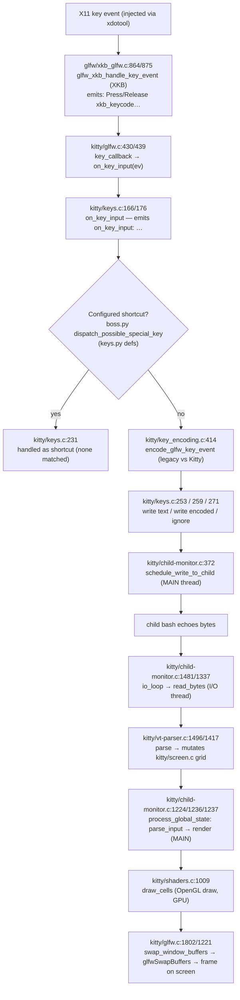

# How Keyboard Input Flows Through Kitty — A Runtime-Observation-Driven Investigation

This document answers, **from captured runtime observation**, how a keypress made inside
Kitty's default shell travels through Kitty's core components until the screen updates. It
was produced by building Kitty from this repository in its default configuration, launching
the built binary under its own tracing flags (`--debug-input` and `--debug-rendering`),
pressing a small set of simple keys inside a real `bash` child, and attributing every trace
line that consistently appeared to the exact source file and line that emits it.

- **Source branch:** `kitty_815df1e210e0` (git `HEAD` `815df1e21`).
- **Built binary:** `kitty 0.35.2 created by Kovid Goyal`.
- **Method:** real X11 key events injected into the real Kitty window (**not** remote control,
  **not** any debug/injection hook), captured twice and confirmed byte-for-byte identical.
- **Evidence discipline:** every behavioral claim below sits next to the observed output that
  supports it and carries an exact `file:line` locator. Anything that comes from reading the
  code rather than from a captured trace is explicitly marked **(inferred from code)**.

> **A note on the embedded evidence.** All trace blocks in this document are the *actual,
> unedited* output captured from the running binary in this environment (ANSI color codes
> stripped for readability; the `[N.NNN]` timestamps are wall-clock-relative and vary
> run-to-run — only the line *content* is deterministic). The investigation was reproduced
> independently and the key-event content matched byte-for-byte across two runs (see
> **Stability / Determinism**).

---

## Short Answer

Pressing a key in Kitty produces a consistent **two-line-per-key signature** in the
`--debug-input` trace: a *reception* line, immediately followed by a *processing* line. That
ordering is the empirical spine of the whole answer.

- **RECEIVE FIRST:** the vendored **GLFW X11 backend** sees the key first. Its XKB translation
  routine `glfw_xkb_handle_key_event` (`glfw/xkb_glfw.c:864`) converts the raw X11 hardware
  keycode into a keysym/text via `libxkbcommon` and emits the `Press`/`Release … xkb_keycode …`
  line (`glfw/xkb_glfw.c:875`). Kitty's GLFW keyboard callback `key_callback`
  (`kitty/glfw.c:430`) then forwards the translated event into Kitty core via `on_key_input`
  (`kitty/glfw.c:439`).
- **INTERMEDIATE PROCESSING:** `on_key_input` (`kitty/keys.c:166`) emits the `on_key_input: …`
  line (`kitty/keys.c:176`), runs a shortcut check through the Python `Boss`, encodes the event
  with `encode_glfw_key_event` (`kitty/key_encoding.c:414`), and either writes bytes to the
  child PTY via `schedule_write_to_child` (`kitty/child-monitor.c:372`) or ignores the event.
  The shell echoes those bytes; the **I/O thread** reads them (`io_loop`
  `kitty/child-monitor.c:1481` → `read_bytes` `kitty/child-monitor.c:1337`) and the VT parser
  (`kitty/vt-parser.c:1496`) mutates the in-memory screen grid (`kitty/screen.c`).
- **DISPLAY UPDATE:** on the **main thread**, the loop tick `process_global_state`
  (`kitty/child-monitor.c:1224`) calls `parse_input` (`kitty/child-monitor.c:1236`)
  **immediately before** `render` (`kitty/child-monitor.c:1237`); rendering issues OpenGL draw
  calls via `draw_cells` (`kitty/shaders.c:1009`) and presents the frame by swapping buffers,
  `swap_window_buffers` (`kitty/glfw.c:1802`) → `glfwSwapBuffers` (`kitty/glfw.c:1221`). The GL
  context itself is validated in `kitty/gl.c:72`.

Concrete observed values (default legacy keyboard mode): `a`/`b`/`c` are sent as their literal
UTF-8 text; `Shift+b` is sent as `B`; `Enter` is sent as the carriage-return byte `0x0d`;
`Ctrl+a` is sent as the C0 control byte `0x1`; every key *release* and every standalone
*modifier* press is ignored. Of the 16 `on_key_input` events captured, **6 were sent** to the
child and **10 were ignored**.

---

## How This Was Observed (Observation Setup)

### Environment and branch

| Item | Value (as observed in this environment) |
|------|------------------------------------------|
| Source branch / HEAD | `kitty_815df1e210e0` / `815df1e21` |
| Built version banner | `kitty 0.35.2 created by Kovid Goyal` |
| C compiler | gcc 15.2.0 |
| Python (build/runtime interpreter) | 3.12.7 |
| Go | 1.23.10 (satisfies `go 1.22` in `go.mod:3`) |
| Display | Xvfb `:99`, 1280x800x24 (headless) |
| OpenGL | `4.5 (Core Profile) Mesa 25.2.8-0ubuntu0.25.10.2`, renderer `llvmpipe (LLVM 20.1.8, 256 bits)` |

> The AAP recorded a slightly different capture host (gcc 13.3.0 / Python 3.12.3 / Go 1.22.2,
> Mesa suffix `0.24.04.2`). This document reports the toolchain and GL string **actually
> observed here**; the trace *content* is identical (see Stability / Determinism). Only the
> distro package suffix of Mesa and the wall-clock timestamps differ — both expected and
> immaterial to the pipeline behavior.

### Build (default configuration)

Kitty ships source only; the runnable launcher must be built from source. The build is run in
its default, canonical configuration:

```sh
CI=true python3 setup.py build
```

This produces the launcher documented in `docs/build.rst:22` (`:file:` `kitty/launcher/kitty`).
The launcher starts the Python runtime, which loads the compiled C core as
`kitty/fast_data_types.so` (the child-monitor, VT parser, screen model, and shaders are all
compiled into that extension module). The version banner:

```text
kitty 0.35.2 created by Kovid Goyal
```

### Headless GPU context

Kitty is GPU-first and has **no CPU text-drawing fallback**, so it needs a real window and an
OpenGL context to run at all. A headless context is provided with Xvfb plus Mesa software
OpenGL (llvmpipe):

```sh
Xvfb :99 -screen 0 1280x800x24 -ac +extension GLX +render -noreset &
export DISPLAY=:99 LIBGL_ALWAYS_SOFTWARE=1 GALLIUM_DRIVER=llvmpipe
```

### Launch commands (canonical, legacy default keyboard mode)

```sh
# input tracing:
./kitty/launcher/kitty --debug-input --config NONE -o confirm_os_window_close=0 bash --norc --noprofile
# separately, for the display lifecycle:
./kitty/launcher/kitty --debug-rendering --config NONE -o confirm_os_window_close=0 bash --norc --noprofile
```

`--config NONE` means no `kitty.conf` is read, so the observed behavior is canonical (the
default *legacy* keyboard mode: `mDECCKM` and the key-encoding flags are unset). The child is a
real `bash --norc --noprofile`, so the typed bytes are consumed and echoed by an actual shell.

`--debug-input` is aliased `--debug-keyboard`; `--debug-rendering` is aliased `--debug-gl`
(confirmed from `kitty --help`). The trace lines are emitted by `debug()` / `printf` calls
gated on `OPT(debug_keyboard)` / `global_state.debug_rendering`, so **no source change is
needed** to observe them.

### Injecting real X11 key events (the genuine reception path)

```sh
WID=$(xdotool search --class kitty | head -1)
xdotool windowactivate --sync "$WID"; xdotool windowfocus --sync "$WID"
for k in a b c Return ctrl+a shift+b; do xdotool key --window "$WID" "$k"; sleep 0.5; done
```

Keys exercised: `a`, `b`, `c` (unmodified printable keys); `Enter` (a control key that produces
no text); and `Ctrl+a` and `Shift+b` (modifier combinations). Injecting via `xdotool` delivers
genuine X11 key events into the window, so they travel Kitty's **real reception path**
(X11 → XKB → GLFW → `keys.c`) rather than any bypass.

### The two-line-per-key trace signature (the empirical spine)

Every key press consistently produces two lines, in this order — a *reception* line from the
XKB/GLFW layer followed by a *processing* line from `kitty/keys.c`. For the `a` press:

```text
[2.202] Press xkb_keycode: 0x26 clean_sym: a composed_sym: a text: a mods: none glfw_key: 97 (a) xkb_key: 97 (a)
[2.202] on_key_input: glfw key: 0x61 native_code: 0x61 action: PRESS mods: none text: 'a' state: 0 sent key as text to child: a
```

The first line is emitted by `glfw/xkb_glfw.c:875`; the second by `kitty/keys.c:176`. This
ordering — reception first, processing second — is exactly what the runtime reveals about
"which parts receive input first" versus "which parts handle intermediate processing." The
complete 32-line trace for all six keys (press + release) is in **Appendix A**.

---

## 1. RECEIVE FIRST — which parts of the system receive the input first

**Observed answer:** the first component to see each key is the **vendored GLFW X11 backend's
XKB translation**, and the second is **Kitty's GLFW keyboard callback**. This is proven by the
fact that the *reception* line always appears before the `on_key_input` processing line for
every key (see the two-line signature above and the full trace in Appendix A).

### 1.1 XKB translation in the GLFW backend — `glfw/xkb_glfw.c`

The routine `glfw_xkb_handle_key_event` (`glfw/xkb_glfw.c:864`) receives the raw X11 hardware
keycode and translates it — via `libxkbcommon` — into a keysym and, where applicable, text. It
emits the reception line at `glfw/xkb_glfw.c:875`:

```c
debug("%s xkb_keycode: 0x%x ", action == GLFW_RELEASE ? "…Release…" : "…Press…", xkb_keycode);
```

The observed reception lines for the four representative keys (from the same run; full set in
Appendix A):

```text
[2.202] Press xkb_keycode: 0x26 clean_sym: a composed_sym: a text: a mods: none glfw_key: 97 (a) xkb_key: 97 (a)
[3.751] Press xkb_keycode: 0x24 clean_sym: Return composed_sym: Return mods: none glfw_key: 57345 (ENTER) xkb_key: 65293 (Return)
[4.275] Press xkb_keycode: 0x26 clean_sym: a composed_sym: a mods: ctrl glfw_key: 97 (a) xkb_key: 97 (a)
[4.806] Press xkb_keycode: 0x38 clean_sym: b composed_sym: B text: B mods: shift glfw_key: 98 (b) xkb_key: 98 (b) shifted_key: 66 (B)
```

Cause → effect that this layer is demonstrably responsible for:

- **Hardware keycode → keysym/text happens here.** The line reports the raw `xkb_keycode`
  (e.g. `0x26` for the physical `a` key) alongside the resolved `clean_sym`, `composed_sym`,
  `text`, and the GLFW key number. That resolution is XKB's job, done before Kitty core is
  ever called.
- **Shift resolution happens here, at reception.** For `Shift+b` the reception line already
  shows `composed_sym: B … text: B … shifted_key: 66 (B)`. The uppercase `B` is produced by the
  XKB layer, not by later processing — the evidence is that `text: B` is present on the
  *reception* line itself.
- **Modifier state is attached here.** For the `a` press that follows `Ctrl` being held, the
  reception line reports `mods: ctrl`; the plain `a` reception line reports `mods: none`.

### 1.2 Handoff into Kitty core — `kitty/glfw.c`

Kitty registers `key_callback` (`kitty/glfw.c:430`) as GLFW's keyboard callback. Once the
window is ready, it forwards the translated event into Kitty's core at `kitty/glfw.c:439`:

```c
if (is_window_ready_for_callbacks() && !ev->fake_event_on_focus_change) on_key_input(ev);
```

The observable proof of this handoff is temporal: the `on_key_input:` line (emitted inside
`on_key_input`) appears on the very next line after each reception line, with matching key data
(e.g. reception `glfw_key: 97 (a)` → processing `glfw key: 0x61`, which is `97`).

### 1.3 IME / IBus — present in code but **not** on this path (inferred from code)

`glfw/ibus_glfw.c` provides the IME (IBus) hook on the Linux input path. In this default run no
input method is active, so it never fires — there is no IME line in the captured trace. Its
existence and role are noted for completeness and are **(inferred from code, not observed)**.

---

## 2. INTERMEDIATE PROCESSING — which parts handle the intermediate processing

**Observed answer:** the second trace line of every key comes from `on_key_input` in
`kitty/keys.c`, which is the decision point. It logs the event, checks for a configured
shortcut through the Python `Boss`, encodes the event according to the current keyboard mode
via `kitty/key_encoding.c`, and then either writes the resulting bytes to the child PTY or
ignores the event. The child echoes the bytes back; Kitty's I/O thread reads them and the VT
parser turns them into screen-model mutations.

### 2.1 The dispatch decision — `kitty/keys.c`

`on_key_input` (`kitty/keys.c:166`) emits the `on_key_input:` line at `kitty/keys.c:176`, then
proceeds through a fixed sequence:

1. **No-active-window guard** (`kitty/keys.c:182`) — skipped here (a window is active).
2. **IME state switch** (`kitty/keys.c:187`–`215`). In this run the state is `GLFW_IME_NONE`
   (visible as `state: 0` in every `on_key_input` line), so the switch simply breaks through to
   normal processing.
3. **Shortcut check** — on `PRESS`/`REPEAT` the macro `dispatch_key_event(dispatch_possible_special_key)`
   calls into the Python `Boss` (`kitty/boss.py` → `dispatch_possible_special_key`; the key-map
   and action definitions live in `kitty/keys.py`). If a shortcut matches, `kitty/keys.c:231`
   prints `handled as shortcut` and returns. **None of the six simple keys matched**, so every
   one fell through — there is no `handled as shortcut` line anywhere in the capture.
4. **Encoding** (`kitty/keys.c:251`):

   ```c
   int size = encode_glfw_key_event(ev, screen->modes.mDECCKM, screen_current_key_encoding_flags(screen), encoded_key);
   ```

5. **Delivery branch**, one of three:
   - `kitty/keys.c:253` — `schedule_write_to_child(...)` then `debug("sent key as text to child: %s")`;
   - `kitty/keys.c:259` — `schedule_write_to_child(...)` then `debug("sent encoded key to child: …")`;
   - `kitty/keys.c:271` — otherwise `debug("ignoring as keyboard mode does not support encoding this event")`.

### 2.2 Encoding: legacy vs. Kitty protocol — `kitty/key_encoding.c`

`encode_glfw_key_event` (`kitty/key_encoding.c:414`) performs the legacy-vs-Kitty-protocol
encoding. In the default *legacy* mode the progressive-enhancement flags are all `0`
(`disambiguate=1, report_all_event_types=2, report_alternate_key=4, report_text=8,
embed_text=16` — **none set**). The following branches, read from the source, explain every
observed value **(cause → effect, corroborated by the observed decision lines below)**:

- `if (!ev.report_text && is_modifier_key(e->key)) return 0;` (`kitty/key_encoding.c:425`)
  ⇒ standalone `Control_L` / `Shift_L` presses **encode to nothing** and are ignored.
- `send_text_standalone = !ev.report_text` is `true` (`kitty/key_encoding.c:428`), so
  `if (send_text_standalone && ev.has_text && (PRESS||REPEAT)) return SEND_TEXT_TO_CHILD;`
  (`kitty/key_encoding.c:437`) ⇒ printable text keys (`a`, `b`, `c`, and the shifted `B`) are
  sent as **literal UTF-8 text**. (`SEND_TEXT_TO_CHILD` is `INT_MIN`, `kitty/keys.h:15`.)
- Otherwise `return encode_key(&ev, output);` (`kitty/key_encoding.c:439`) ⇒ `Enter` →
  `0x0d`, `Ctrl+a` → `0x1` (a C0 control byte).
- For `RELEASE`, `encode_key` short-circuits: `if (!ev->report_all_event_types && ev->action == RELEASE) return 0;`
  (`kitty/key_encoding.c:368`) ⇒ every release **encodes to nothing** and is ignored.
- The structured `CSI u` "Kitty keyboard protocol" path is `serialize()`
  (`kitty/key_encoding.c:65`) — the opt-in enhanced encoding, **not exercised** by this default
  run.

### 2.3 The observed encoding outcomes (the six events that produced child output)

These are the six `PRESS` events whose decision was to send bytes to the child. This block is
**verbatim** from the run (note that the two *encoded* lines end with a trailing space, exactly
as the source's per-byte `0x%x ` formatting loop produces it):

```text
[2.202] on_key_input: glfw key: 0x61 native_code: 0x61 action: PRESS mods: none text: 'a' state: 0 sent key as text to child: a
[2.715] on_key_input: glfw key: 0x62 native_code: 0x62 action: PRESS mods: none text: 'b' state: 0 sent key as text to child: b
[3.233] on_key_input: glfw key: 0x63 native_code: 0x63 action: PRESS mods: none text: 'c' state: 0 sent key as text to child: c
[3.751] on_key_input: glfw key: 0xe001 native_code: 0xff0d action: PRESS mods: none text: '' state: 0 sent encoded key to child: 0xd 
[4.275] on_key_input: glfw key: 0x61 native_code: 0x61 action: PRESS mods: ctrl text: '' state: 0 sent encoded key to child: 0x1 
[4.806] on_key_input: glfw key: 0x62 native_code: 0x62 action: PRESS mods: shift text: 'B' state: 0 sent key as text to child: B
```

| Key pressed | What Kitty sent to the child | Why (cause → effect) |
|-------------|------------------------------|----------------------|
| `a` | UTF-8 text `a` | printable text key; `send_text_standalone` path (`kitty/key_encoding.c:437`) |
| `b` | UTF-8 text `b` | same as `a` |
| `c` | UTF-8 text `c` | same as `a` |
| `Shift+b` | UTF-8 text `B` | XKB already produced `text: B`; sent as text (`kitty/key_encoding.c:437`) |
| `Enter` | byte `0x0d` (carriage return) | no text; legacy `encode_key` (`kitty/key_encoding.c:439`) |
| `Ctrl+a` | byte `0x1` (C0 control) | no text; legacy `encode_key` maps Ctrl+letter to its control code (`kitty/key_encoding.c:439`) |

This matches Kitty's documented legacy behavior. `docs/keyboard-protocol.rst:110` states that
in **"legacy compatibility mode (the default)"** non-text key events use legacy escape codes,
while text-producing keys are "sent directly as UTF-8 encoded bytes" (`docs/keyboard-protocol.rst:107`).
The structured `CSI u` protocol is described there as an opt-in progressive enhancement — i.e.
what we observed is the canonical default, not an environment artifact.

### 2.4 Delivery to the child PTY — `kitty/child-monitor.c` (main thread)

Both send branches call `schedule_write_to_child` (`kitty/child-monitor.c:372`), which queues
the bytes to the child's pseudo-terminal on the **main thread**. The child process and its PTY
are created by `kitty/child.c`; the Python `Window` object (`kitty/window.py`) logs
`Child launched` at `kitty/window.py:871` (gated on `debug_rendering`; see the display section).

### 2.5 Reading the echo and parsing into the screen model

The shell writes the typed/echoed bytes back through the PTY. Kitty's **I/O thread** reads them:
`io_loop` (`kitty/child-monitor.c:1481`, whose source comment is literally `// The I/O thread
loop`) calls `read_bytes` (`kitty/child-monitor.c:1337`). The bytes are then parsed by the VT
parser — `parse_worker` (`kitty/vt-parser.c:1496`) → `run_worker` (`kitty/vt-parser.c:1417`) —
which turns them into terminal operations that mutate the in-memory grid in `kitty/screen.c`
(backed by `kitty/line.c` / `kitty/line-buf.c`). **(The parser/screen-model internals are
inferred from code; `--debug-input` proves the bytes were sent, and the display section proves
a frame is subsequently produced.)**

---

## 3. DISPLAY UPDATE — how the updated display is ultimately produced

**Observed answer:** the display is produced by the GPU render path. `--debug-rendering`
reports the window/GL/child lifecycle that underlies frame production; the per-frame draw is
driven by the main-loop tick, which parses any pending child output and then renders each OS
window, issuing OpenGL draw calls and swapping the window's buffers to present the frame.

### 3.1 Observed lifecycle evidence

Running the binary with `--debug-rendering` produced these lines (verbatim, ANSI stripped,
shown in timestamp order):

```text
[0.136] GL version string: '4.5 (Core Profile) Mesa 25.2.8-0ubuntu0.25.10.2' Detected version: 4.5
[0.162] OS Window created
[0.175] Child launched
```

The command that produced it:

```sh
./kitty/launcher/kitty --debug-rendering --config NONE -o confirm_os_window_close=0 bash --norc --noprofile
```

(The run also emitted `Failed to open systemd user bus with error: Connection refused` — this
is unrelated **environment noise** from the headless container's missing systemd user bus, not
part of Kitty's render pipeline.)

### 3.2 Attribution (with `file:line`)

- **GL context established and validated — `kitty/gl.c`.** The `GL version string …` line is
  printed at `kitty/gl.c:72`:

  ```c
  if (global_state.debug_rendering) printf("[%.3f] GL version string: %s\n", …);
  ```

  and the `'…' Detected version: X.Y` portion is formatted by `gl_version_string()`
  (`kitty/gl.c:47`). The observed `4.5 (Core Profile)` is comfortably above Kitty's `3.3`
  minimum, so the render path exercised is **representative**, not a degraded fallback.
- **Window created — `kitty/glfw.c`.** `OS Window created` is printed at `kitty/glfw.c:1321`.
- **Child launched — `kitty/window.py`.** The Python `Window` logs `Child launched` at
  `kitty/window.py:871` (gated on `boss.args.debug_rendering`).
- **The render tick — `kitty/child-monitor.c`.** The main-loop tick `process_global_state`
  (`kitty/child-monitor.c:1224`) calls `parse_input` (`kitty/child-monitor.c:1236`)
  **immediately before** `render` (`kitty/child-monitor.c:1237`); `render` in turn calls
  `render_os_window` (`kitty/child-monitor.c:833`) for each OS window. **(This internal call
  chain is inferred from code, corroborated by the observed lifecycle above — `--debug-rendering`
  reports the lifecycle, not each per-frame draw.)**
- **GPU draw — `kitty/shaders.c`.** `draw_cells` (`kitty/shaders.c:1009`) issues the OpenGL
  draw calls that rasterize the cell grid (using the glyph atlas in `kitty/glyph-cache.c`).
  **(inferred from code.)**
- **Present the frame — `kitty/glfw.c`.** `swap_window_buffers` (`kitty/glfw.c:1802`) calls
  `glfwSwapBuffers` (`kitty/glfw.c:1221`), putting the rendered frame on screen.
  **(inferred from code.)**

### 3.3 The "before the screen updates" boundary + threading note

The precise moment at which processed input becomes a new frame is the adjacency of
`parse_input` (`kitty/child-monitor.c:1236`) and `render` (`kitty/child-monitor.c:1237`) inside
`process_global_state`:

```c
if (parse_input(self)) input_read = true;   // kitty/child-monitor.c:1236
render(now, input_read);                     // kitty/child-monitor.c:1237
```

This matters because of Kitty's three-thread Child-Monitor architecture (Main, I/O, Talk): the
child's echoed bytes are **read on the I/O thread** (`io_loop` / `read_bytes`, section 2.5),
but they are **parsed and rendered on the main thread** here. So "before the screen updates" is
concretely this `parse_input` → `render` step on the main thread. **(The thread split is
observed via the I/O-thread `read_bytes` path under `--debug-input` and the main-thread render
lifecycle under `--debug-rendering`; the exact function adjacency is inferred from code.)**

---

## Release and modifier-only events (the edge / ignored path)

Not every observed event produces child output. Every key **release**, and every standalone
**modifier** press (`Control_L`, `Shift_L`), printed:

```text
ignoring as keyboard mode does not support encoding this event
```

which is emitted at `kitty/keys.c:271`. The cause is exactly the encoding logic from section
2.2: in default legacy mode, `encode_glfw_key_event` returns `0` for releases
(`kitty/key_encoding.c:368`) and for standalone modifier keys
(`kitty/key_encoding.c:425`), so `on_key_input` takes the "ignore" branch.

**Quantified from the captured run:** of the **16** `on_key_input` events, **6 were sent** to
the child and **10 were ignored**. The 10 ignored break down as **8 releases + 2 modifier-only
presses**. The verbatim ignored lines:

```text
[2.204] on_key_input: glfw key: 0x61 native_code: 0x61 action: RELEASE mods: none text: '' state: 0 ignoring as keyboard mode does not support encoding this event
[2.723] on_key_input: glfw key: 0x62 native_code: 0x62 action: RELEASE mods: none text: '' state: 0 ignoring as keyboard mode does not support encoding this event
[3.239] on_key_input: glfw key: 0x63 native_code: 0x63 action: RELEASE mods: none text: '' state: 0 ignoring as keyboard mode does not support encoding this event
[3.757] on_key_input: glfw key: 0xe001 native_code: 0xff0d action: RELEASE mods: none text: '' state: 0 ignoring as keyboard mode does not support encoding this event
[4.269] on_key_input: glfw key: 0xe062 native_code: 0xffe3 action: PRESS mods: ctrl text: '' state: 0 ignoring as keyboard mode does not support encoding this event
[4.281] on_key_input: glfw key: 0xe062 native_code: 0xffe3 action: RELEASE mods: none text: '' state: 0 ignoring as keyboard mode does not support encoding this event
[4.287] on_key_input: glfw key: 0x61 native_code: 0x61 action: RELEASE mods: none text: '' state: 0 ignoring as keyboard mode does not support encoding this event
[4.800] on_key_input: glfw key: 0xe061 native_code: 0xffe1 action: PRESS mods: shift text: '' state: 0 ignoring as keyboard mode does not support encoding this event
[4.813] on_key_input: glfw key: 0xe061 native_code: 0xffe1 action: RELEASE mods: none text: '' state: 0 ignoring as keyboard mode does not support encoding this event
[4.819] on_key_input: glfw key: 0x62 native_code: 0x62 action: RELEASE mods: none text: '' state: 0 ignoring as keyboard mode does not support encoding this event
```

Note the two modifier-only presses (`[4.269]` `Control_L`, `native_code: 0xffe3`, and
`[4.800]` `Shift_L`, `native_code: 0xffe1`) are `PRESS` actions yet still ignored — proving
the ignore rule is not merely "ignore releases" but "the legacy keyboard mode has no encoding
for this event," which for modifier keys is enforced by the `is_modifier_key` guard at
`kitty/key_encoding.c:425`.

---

## Stability / Determinism

The identical, unchanged input (`a b c Return ctrl+a shift+b`) was run **twice**. After
stripping the `[N.NNN]` timestamps and ANSI color codes, the **32-line key-event sequence was
byte-for-byte identical** across both runs (verified with `diff`, which reported no
differences; both normalized captures hashed to the same MD5). The reported behavior is
therefore **deterministic**, not incidental. Only the wall-clock timestamps differ between
runs, as expected.

---

## Not Observed / Inferred

The following were **not exercised** by this default X11 run and any mention of them is
**inferred from code, not observed**:

- **Wayland input backend** — this run used the X11 backend (keys arrived as X11 events and
  were translated by XKB). The Wayland path was not exercised.
- **macOS / Cocoa input backend** — this is a Linux run; the Cocoa path was not exercised.
- **IME composition via `glfw/ibus_glfw.c`** — no input method was active; every
  `on_key_input` line reports `state: 0` (`GLFW_IME_NONE`), so no IME composition occurred.

Additionally, the following pipeline internals are **inferred from code** (their *upstream* and
*downstream* effects are observed, but the specific functions do not each emit a trace line in
this run): the VT parser turning bytes into screen mutations (`kitty/vt-parser.c`,
`kitty/screen.c`); the per-frame `parse_input` → `render` → `render_os_window` call chain
(`kitty/child-monitor.c:1236`/`1237`/`833`); the GPU draw in `kitty/shaders.c:1009`; and the
buffer swap in `kitty/glfw.c:1802`/`1221`. Each is labeled inline where it appears above.

---

## End-to-End Pipeline Summary

The full path reconstructed from the observations, from an X11 key event to a frame on screen:



As an ASCII trace of the same path:

```text
X11 key
  → glfw/xkb_glfw.c:864/875   (XKB translate; emits reception line)          [OBSERVED]
  → kitty/glfw.c:430/439      (key_callback → on_key_input)                  [OBSERVED handoff]
  → kitty/keys.c:166/176      (on_key_input; emits processing line)          [OBSERVED]
  → boss.py / keys.py         (shortcut check — none matched)                [OBSERVED: no "handled as shortcut"]
  → kitty/key_encoding.c:414  (encode; legacy mode)                          [OBSERVED via decision values]
  → kitty/keys.c:253/259/271  (send text / send encoded / ignore)           [OBSERVED]
  → kitty/child-monitor.c:372 (schedule_write_to_child, MAIN)                [OBSERVED: bytes sent]
  → bash echoes bytes
  → kitty/child-monitor.c:1481/1337 (io_loop / read_bytes, I/O thread)       [OBSERVED path]
  → kitty/vt-parser.c:1496/1417 (parse) → kitty/screen.c (grid)             [inferred from code]
  → kitty/child-monitor.c:1224/1236/1237 (parse_input → render, MAIN)        [inferred; render lifecycle OBSERVED]
  → kitty/shaders.c:1009      (draw_cells, GPU)                              [inferred from code]
  → kitty/glfw.c:1802/1221    (swap buffers → frame on screen)               [inferred from code]
```

---

## Coverage Checklist

- **All three named sub-parts answered by name:** RECEIVE FIRST (§1), INTERMEDIATE PROCESSING
  (§2), DISPLAY UPDATE (§3). ✔
- **All six keys covered:** `a`, `b`, `c` (UTF-8 text), `Enter` (`0x0d`), `Ctrl+a` (`0x1`),
  `Shift+b` (`B`). ✔
- **Press + release + ignored paths shown:** 16 `on_key_input` events = 6 sent + 10 ignored
  (8 releases + 2 modifier-only presses). ✔
- **Exact values reported with reasons:** `Enter` → `0x0d` and `Ctrl+a` → `0x1` via legacy
  `encode_key` (`kitty/key_encoding.c:439`); `Shift+b` → `B` via the send-text path
  (`kitty/key_encoding.c:437`), with `B` resolved by XKB at reception. ✔
- **Determinism stated:** identical 32-line sequence across two runs (`diff` clean, equal MD5). ✔
- **Inferred items labeled:** Wayland, macOS/Cocoa, and IME/IBus are labeled inferred/not
  observed, as are the VT-parser/screen internals, the per-frame render call chain, the GPU
  draw, and the buffer swap. ✔
- **Every behavioral claim carries adjacent observed output and a `file:line` locator, or is
  explicitly marked (inferred from code).** ✔

---

## Appendix A — Complete captured `--debug-input` trace (32 lines)

Produced by:

```sh
./kitty/launcher/kitty --debug-input --config NONE -o confirm_os_window_close=0 bash --norc --noprofile
# with: xdotool key --window <wid> a b c Return ctrl+a shift+b
```

The complete, unedited, ordered key-event sequence — 16 reception lines interleaved with 16
`on_key_input` lines, so that both `PRESS` and `RELEASE` transitions and the ignored
modifier-only presses are all present. ANSI color codes were stripped for readability;
timestamps are preserved as captured (the two encoded `on_key_input` lines end with a trailing
space, exactly as the binary emits them):

```text
[2.202] Press xkb_keycode: 0x26 clean_sym: a composed_sym: a text: a mods: none glfw_key: 97 (a) xkb_key: 97 (a)
[2.202] on_key_input: glfw key: 0x61 native_code: 0x61 action: PRESS mods: none text: 'a' state: 0 sent key as text to child: a
[2.204] Release xkb_keycode: 0x26 clean_sym: a mods: none glfw_key: 97 (a) xkb_key: 97 (a)
[2.204] on_key_input: glfw key: 0x61 native_code: 0x61 action: RELEASE mods: none text: '' state: 0 ignoring as keyboard mode does not support encoding this event
[2.715] Press xkb_keycode: 0x38 clean_sym: b composed_sym: b text: b mods: none glfw_key: 98 (b) xkb_key: 98 (b)
[2.715] on_key_input: glfw key: 0x62 native_code: 0x62 action: PRESS mods: none text: 'b' state: 0 sent key as text to child: b
[2.723] Release xkb_keycode: 0x38 clean_sym: b mods: none glfw_key: 98 (b) xkb_key: 98 (b)
[2.723] on_key_input: glfw key: 0x62 native_code: 0x62 action: RELEASE mods: none text: '' state: 0 ignoring as keyboard mode does not support encoding this event
[3.233] Press xkb_keycode: 0x36 clean_sym: c composed_sym: c text: c mods: none glfw_key: 99 (c) xkb_key: 99 (c)
[3.233] on_key_input: glfw key: 0x63 native_code: 0x63 action: PRESS mods: none text: 'c' state: 0 sent key as text to child: c
[3.239] Release xkb_keycode: 0x36 clean_sym: c mods: none glfw_key: 99 (c) xkb_key: 99 (c)
[3.239] on_key_input: glfw key: 0x63 native_code: 0x63 action: RELEASE mods: none text: '' state: 0 ignoring as keyboard mode does not support encoding this event
[3.751] Press xkb_keycode: 0x24 clean_sym: Return composed_sym: Return mods: none glfw_key: 57345 (ENTER) xkb_key: 65293 (Return)
[3.751] on_key_input: glfw key: 0xe001 native_code: 0xff0d action: PRESS mods: none text: '' state: 0 sent encoded key to child: 0xd 
[3.757] Release xkb_keycode: 0x24 clean_sym: Return mods: none glfw_key: 57345 (ENTER) xkb_key: 65293 (Return)
[3.757] on_key_input: glfw key: 0xe001 native_code: 0xff0d action: RELEASE mods: none text: '' state: 0 ignoring as keyboard mode does not support encoding this event
[4.269] Press xkb_keycode: 0x25 clean_sym: Control_L composed_sym: Control_L mods: none glfw_key: 57442 (LEFT_CONTROL) xkb_key: 65507 (Control_L)
[4.269] on_key_input: glfw key: 0xe062 native_code: 0xffe3 action: PRESS mods: ctrl text: '' state: 0 ignoring as keyboard mode does not support encoding this event
[4.275] Press xkb_keycode: 0x26 clean_sym: a composed_sym: a mods: ctrl glfw_key: 97 (a) xkb_key: 97 (a)
[4.275] on_key_input: glfw key: 0x61 native_code: 0x61 action: PRESS mods: ctrl text: '' state: 0 sent encoded key to child: 0x1 
[4.281] Release xkb_keycode: 0x25 clean_sym: Control_L mods: ctrl glfw_key: 57442 (LEFT_CONTROL) xkb_key: 65507 (Control_L)
[4.281] on_key_input: glfw key: 0xe062 native_code: 0xffe3 action: RELEASE mods: none text: '' state: 0 ignoring as keyboard mode does not support encoding this event
[4.287] Release xkb_keycode: 0x26 clean_sym: a mods: none glfw_key: 97 (a) xkb_key: 97 (a)
[4.287] on_key_input: glfw key: 0x61 native_code: 0x61 action: RELEASE mods: none text: '' state: 0 ignoring as keyboard mode does not support encoding this event
[4.800] Press xkb_keycode: 0x32 clean_sym: Shift_L composed_sym: Shift_L mods: none glfw_key: 57441 (LEFT_SHIFT) xkb_key: 65505 (Shift_L)
[4.800] on_key_input: glfw key: 0xe061 native_code: 0xffe1 action: PRESS mods: shift text: '' state: 0 ignoring as keyboard mode does not support encoding this event
[4.806] Press xkb_keycode: 0x38 clean_sym: b composed_sym: B text: B mods: shift glfw_key: 98 (b) xkb_key: 98 (b) shifted_key: 66 (B)
[4.806] on_key_input: glfw key: 0x62 native_code: 0x62 action: PRESS mods: shift text: 'B' state: 0 sent key as text to child: B
[4.813] Release xkb_keycode: 0x32 clean_sym: Shift_L mods: shift glfw_key: 57441 (LEFT_SHIFT) xkb_key: 65505 (Shift_L)
[4.813] on_key_input: glfw key: 0xe061 native_code: 0xffe1 action: RELEASE mods: none text: '' state: 0 ignoring as keyboard mode does not support encoding this event
[4.819] Release xkb_keycode: 0x38 clean_sym: b mods: none glfw_key: 98 (b) xkb_key: 98 (b)
[4.819] on_key_input: glfw key: 0x62 native_code: 0x62 action: RELEASE mods: none text: '' state: 0 ignoring as keyboard mode does not support encoding this event
```

---

## Appendix B — Exact commands used

```sh
# 1) Build the launcher from source (default configuration)
CI=true python3 setup.py build          # → kitty/launcher/kitty  (kitty 0.35.2)

# 2) Headless GPU context (Kitty is GPU-first; no CPU text-draw fallback)
Xvfb :99 -screen 0 1280x800x24 -ac +extension GLX +render -noreset &
export DISPLAY=:99 LIBGL_ALWAYS_SOFTWARE=1 GALLIUM_DRIVER=llvmpipe

# 3) Launch with input tracing (canonical / legacy default keyboard mode)
./kitty/launcher/kitty --debug-input --config NONE -o confirm_os_window_close=0 bash --norc --noprofile

# 4) Inject REAL X11 key events into the real window (not remote control)
WID=$(xdotool search --class kitty | head -1)
xdotool windowactivate --sync "$WID"; xdotool windowfocus --sync "$WID"
for k in a b c Return ctrl+a shift+b; do xdotool key --window "$WID" "$k"; sleep 0.5; done

# 5) Separately, capture the display lifecycle
./kitty/launcher/kitty --debug-rendering --config NONE -o confirm_os_window_close=0 bash --norc --noprofile
```

All observation scripts and logs were temporary and were removed after the investigation; the
only change this task makes to the repository is the addition of this one Markdown document.
