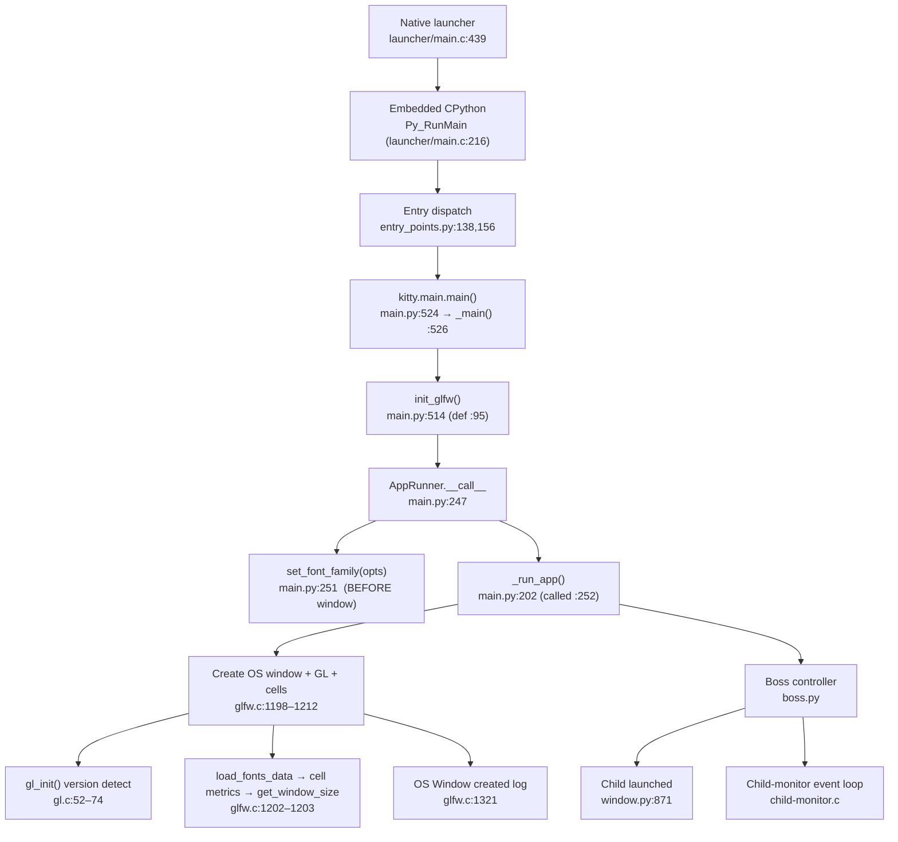

# kitty — Early Startup / Initialization Flow (Run‑Grounded Investigation)

> **Branch:** `kitty_815df1e210e0`  **HEAD commit:** `815df1e21` ("Wire up applying of font config")  **Version:** `kitty 0.35.2`
>
> This document answers the question below **from evidence actually produced by building and running kitty**, not from reading source alone. Every factual claim is anchored to an exact `file:line` citation, and every measured value is quoted **verbatim** next to the command that produced it. The kitty source tree was treated as a **read‑only** evidence base — no repository file was created, modified, or deleted to produce these observations (the only new file is this document).

## The question being answered (verbatim)

> "I need to get kitty running from source to understand its initialization flow. Build and launch it, then help me trace what happens during the critical early startup phase. When kitty initializes, it goes through GPU context creation and font system setup. Run it and tell me what you observe about the rendering backend it actually selects and the display configuration it detects. What does the terminal report about its text rendering capabilities? I'm particularly interested in understanding the relationship between the window system, GPU initialization, and the text cell calculations that happen before any content is displayed. Trace through the startup sequence and map out how these components connect, which subsystems initialize in what order, and what are the key values being computed or detected during this process? Do not make any changes to the repository and leave the actual codebase unchanged."

The question decomposes into nine objectives, each answered explicitly below:

| # | Objective | Section |
|---|-----------|---------|
| **O1** | Build & launch from source | [§O1](#o1--build--launch) |
| **O2/O8** | Startup sequence & subsystem init order | [§O2/O8](#o2--o8--initialization-sequence--subsystem-order) |
| **O3** | GPU rendering backend *actually* selected | [§O3](#o3--gpu-rendering-backend-actually-selected) |
| **O4** | Font system setup | [§O4](#o4--font-system-setup) |
| **O5** | Display configuration detected | [§O5](#o5--display-configuration-detected) |
| **O6** | Text‑rendering capability report | [§O6](#o6--terminal-text-rendering-capability-report) |
| **O7** | Window ↔ GPU ↔ cell relationship before display | [§O7](#o7--window--gpu--cell-relationship-before-any-content-is-displayed) |
| **O9** | Key computed/detected values | [§O9](#o9--key-computeddetected-values) |

---

## How this was captured

All observations were captured on the authoritative environment (Docker image `andrewparkscaleai/coding-agent:kovidgoyal__kitty__815df1e210e0a9ab4622f5c7f2d6891d7dbeddf1`), an **Ubuntu 25.10** host with **no physical GPU**. Because there is no display or GPU, kitty was run under a virtual X display (**Xvfb**) with the **Mesa llvmpipe** software OpenGL rasterizer. This does not change the *selection logic* kitty exercises — only the concrete GL implementation the driver returns (see [Honest Limitations](#honest-limitations)).

The exact harness (reproduced verbatim):

```bash
# 1. Build from source (system-library path). Non-invasive: no source edited.
GOTOOLCHAIN=local python3 setup.py --ignore-compiler-warnings   # exit 0

# 2. Version banner
./kitty/launcher/kitty --version                                # kitty 0.35.2 created by Kovid Goyal

# 3. Headless run with rendering + font debug logging
xvfb-run -a -s "-screen 0 1280x800x24" \
  env LIBGL_ALWAYS_SOFTWARE=1 GALLIUM_DRIVER=llvmpipe \
  ./kitty/launcher/kitty --config NONE --debug-rendering --debug-font-fallback \
  python3 <capability-query-harness>
```

**Build note (why `--ignore-compiler-warnings` is required and remains read‑only).** With the default flags the build fails only in the *vendored* GLFW Wayland backend. `glfw/wl_window.c:668` is `switch (*state) {` over `enum xdg_toplevel_state`; the host's `wayland-protocols` is version **1.45** (`pkg-config --modversion wayland-protocols` → `1.45`), which defines newer `XDG_TOPLEVEL_STATE_CONSTRAINED_*` enumerators that this `switch` does not have `case`s for. `-Wswitch` — promoted to a hard error by `-Werror` — therefore aborts the compile. The **non‑invasive** fix is the documented `--ignore-compiler-warnings` flag, which flips the error flag to empty at `setup.py:491`:

```python
# setup.py:491
werror = '' if ignore_compiler_warnings else '-pedantic-errors -Werror'
```

This leaves every source file untouched; `git status --porcelain` was **empty** both before and after the build. All build artifacts (`kitty/launcher/kitty`, `kitty/launcher/kitten`, generated Wayland protocol files, `build/`) are `.gitignore`d.

> **A note on numbers in this document.** The concrete metrics below (font family, cell size, grid, DPI, Mesa/LLVM versions) are what *this* environment produced. They are font‑ and environment‑dependent: a host whose FontConfig resolves a different default monospace, or a different screen DPI, would yield slightly different cell metrics and grid dimensions. The **mechanism, ordering, and source citations are invariant**; the specific values are quoted exactly as observed here and are shown to be internally self‑consistent.

---

## O1 — Build & launch

**Build command and result (observed):**

```console
$ GOTOOLCHAIN=local python3 setup.py --ignore-compiler-warnings
$ echo $?
0
```

The build exits `0` and leaves the working tree clean (`git status --porcelain` prints nothing), confirming **zero source edits**.

**Launch / version banner (observed, verbatim):**

```console
$ ./kitty/launcher/kitty --version
kitty 0.35.2 created by Kovid Goyal
```

The version literal originates from `kitty/constants.py:25`:

```python
# kitty/constants.py:25
version: Version = Version(0, 35, 2)
```

**Rationale.** kitty must be *compiled* before it can be *observed*; on this host the only obstacle to a from‑source build is the vendored Wayland backend's `-Wswitch`/`-Werror` interaction with the host's newer `wayland-protocols` headers (`glfw/wl_window.c:668`). The `--ignore-compiler-warnings` flag (`setup.py:491`) demotes `-Werror`, so the warning no longer aborts the build — enabling a working `kitty/launcher/kitty` binary while every tracked file remains byte‑for‑byte unchanged, satisfying the read‑only constraint.

---

## O2 / O8 — Initialization sequence & subsystem order

kitty's early startup is a **deterministic** chain: a native C launcher embeds CPython, which dispatches to the Python `main()`, which initializes GLFW, sets up fonts, then creates the OS window + GL context (computing cell metrics and grid along the way), stands up the `Boss` orchestrator, spawns the child process, and enters the child‑monitor event loop. The order below is anchored to source, and — where a step emits a debug line — to the **observed** log (timestamps in seconds since process start).

1. **Native launcher — process entry & CPython embedding.** `kitty/launcher/main.c` is the real executable. Entry is `int main(int argc, char *argv[], char* envp[])` at `kitty/launcher/main.c:439`. It embeds and starts CPython in order: `Py_PreInitialize` (`:190`) → `PyConfig_InitPythonConfig` (`:193`) → `Py_InitializeFromConfig` (`:211`) → `return Py_RunMain()` (`:216`).
2. **Entry dispatch.** Once inside Python, `kitty/entry_points.py` routes on `sys.argv`. The `entry_points` map (`:151`) and the `namespaced` dispatcher (`def namespaced` at `:138`, wired as `'+': namespaced` at `:156`; `namespaced_entry_points` at `:158`) select the GUI path vs. a kitten vs. a process‑replace helper.
3. **Python `main()`.** The GUI path lands in `kitty.main.main()` at `kitty/main.py:524`, which wraps `_main()` (called at `kitty/main.py:526`; `_main` defined at `:441`).
4. **GLFW platform init.** `_main()` calls `init_glfw(...)` at `kitty/main.py:514` (defined at `kitty/main.py:95`). This chooses and initializes the windowing backend (`'cocoa'` / `'wayland'` / `'x11'`) before any window exists.
5. **Font family setup — *before* the window.** The application object `AppRunner.__call__` (`kitty/main.py:247`) first calls `set_font_family(opts)` at `kitty/main.py:251`, *then* `_run_app(...)` at `kitty/main.py:252` (`_run_app` defined at `:202`). Font setup **precedes** window creation because window sizing needs cell metrics (see [O7](#o7--window--gpu--cell-relationship-before-any-content-is-displayed)).
6. **OS window + GL context + cell computation.** `_run_app` ultimately reaches the window‑creation routine in `kitty/glfw.c` (the ordered block `:1198`–`:1212`, detailed in [O7](#o7--window--gpu--cell-relationship-before-any-content-is-displayed)), which probes GL, detects content scale, loads font data, computes the window size, creates the real window, and calls `gl_init()`. Completion is logged as `OS Window created` (`kitty/glfw.c:1321`).
7. **Boss controller + child spawn.** The singleton orchestrator (`kitty/boss.py`) launches the child process; under `--debug-rendering` this prints `Child launched` at `kitty/window.py:871` (gated by `if boss.args.debug_rendering:` at `:869`).
8. **Child‑monitor event loop.** `kitty/child-monitor.c` runs the multi‑threaded monitor that drives I/O and rendering thereafter.

**Observed ordering (verbatim log, from the headless debug run).** The timestamps reveal the true order even though stdout/stderr interleave in the captured file:

```text
[0.124] GL version string: '4.5 (Core Profile) Mesa 25.2.8-0ubuntu0.25.10.2' Detected version: 4.5
[0.148] OS Window created
[0.157] Failed to open systemd user bus with error: Connection refused
[0.161] Child launched
[0.161] Text fonts:
[0.161]   Normal: DejaVuSansMono: /usr/share/fonts/truetype/dejavu/DejaVuSansMono.ttf:0
```

That is: **GL version detected (0.124) → OS window created (0.148) → child launched (0.161)** — GPU context negotiation and cell computation complete *before* the window is finished and *before* the child (and hence any content) exists.



**Rationale.** The launcher exists so kitty can ship a normal native executable that embeds the CPython interpreter (`Py_RunMain`, `launcher/main.c:216`) rather than depending on a system `python`. From there, control is a single deterministic Python call chain (`main → _main → init_glfw → AppRunner → set_font_family → _run_app → window creation → Boss → child`). The crucial ordering fact — **fonts before window before child** — is dictated by data dependency: the window's pixel size and the terminal grid are derived from font cell metrics, so the font system must be initialized first, and both must complete before the child sees a sized terminal.

---

## O3 — GPU rendering backend *actually* selected

**Observed (verbatim `--debug-rendering` line):**

```text
[0.124] GL version string: '4.5 (Core Profile) Mesa 25.2.8-0ubuntu0.25.10.2' Detected version: 4.5
```

**The backend kitty actually negotiated is an OpenGL 4.5 *Core Profile* context served by Mesa's `llvmpipe` software rasterizer** — comfortably above the compiled minimum. That log line is emitted by `gl_init()` at `kitty/gl.c:72`:

```c
// kitty/gl.c:72
if (global_state.debug_rendering) printf("[%.3f] GL version string: %s\n", monotonic_t_to_s_double(monotonic()), gl_version_string());
```

The message text comes from `gl_version_string()` (`kitty/gl.c:41`–`49`), whose format literal is at `kitty/gl.c:47`:

```c
// kitty/gl.c:47
snprintf(buf, sizeof(buf), "'%s' Detected version: %d.%d", gvs, gl_major, gl_minor);
```

Here `gvs = glGetString(GL_VERSION)` (the driver's string) and `gl_major.gl_minor` come from `GLAD_VERSION_MAJOR/MINOR(global_state.gl_version)`, i.e. the version GLAD actually loaded.

**Independent corroboration (`glxinfo`, same Xvfb + llvmpipe environment):**

```console
$ glxinfo | grep -E "vendor|renderer|core profile version"
OpenGL vendor string: Mesa
OpenGL renderer string: llvmpipe (LLVM 20.1.8, 256 bits)
OpenGL core profile version string: 4.5 (Core Profile) Mesa 25.2.8-0ubuntu0.25.10.2
```

Two independent sources — kitty's own `gl.c:72` log and `glxinfo` — agree: **vendor Mesa, renderer `llvmpipe (LLVM 20.1.8, 256 bits)`, 4.5 Core Profile**.

### What kitty *requested* vs. what the driver *returned*

- **Requested context hints** (`kitty/glfw.c:1127`–`1129`, guarded by `if (is_first_window)` at `:1126`):
  ```c
  // kitty/glfw.c:1127-1129
  glfwWindowHint(GLFW_CONTEXT_VERSION_MAJOR, OPENGL_REQUIRED_VERSION_MAJOR);
  glfwWindowHint(GLFW_CONTEXT_VERSION_MINOR, OPENGL_REQUIRED_VERSION_MINOR);
  glfwWindowHint(GLFW_OPENGL_FORWARD_COMPAT, true);
  ```
  Notably, **no explicit core‑profile window hint is set here** — there is no `glfwWindowHint(GLFW_OPENGL_PROFILE, GLFW_OPENGL_CORE_PROFILE)` in the creation path (the token `GLFW_OPENGL_CORE_PROFILE` appears only in the constant‑export block at `kitty/glfw.c:2505`, not as a window hint). kitty asks only for a **forward‑compatible** context at the minimum version; the driver here nonetheless returned a **Core Profile** at runtime (as the observed string shows).
- **Runtime requirement + enforcement** in `gl_init()` (`kitty/gl.c:52`): it requires the `GL_ARB_texture_storage` extension (`ARB_TEST(texture_storage)` at `kitty/gl.c:67`) and enforces the version floor at `kitty/gl.c:73`–`74`:
  ```c
  // kitty/gl.c:73-74
  if (gl_major < OPENGL_REQUIRED_VERSION_MAJOR || (gl_major == OPENGL_REQUIRED_VERSION_MAJOR && gl_minor < OPENGL_REQUIRED_VERSION_MINOR)) {
      fatal("OpenGL version is %d.%d, version >= %d.%d required for kitty", gl_major, gl_minor, OPENGL_REQUIRED_VERSION_MAJOR, OPENGL_REQUIRED_VERSION_MINOR);
  }
  ```
- **The compiled minimum is platform‑dependent** (`kitty/data-types.h:20`–`26`):
  ```c
  // kitty/data-types.h:20-26
  #define OPENGL_REQUIRED_VERSION_MAJOR 3
  #ifdef __APPLE__
  #define OPENGL_REQUIRED_VERSION_MINOR 3
  #else
  #define OPENGL_REQUIRED_VERSION_MINOR 1
  #endif
  #define GLSL_VERSION 140
  ```
  Therefore on **Linux the compiled floor is OpenGL 3.1** (GLSL `140`), while on macOS it is 3.3. This matches the GLAD loader, which is generated for `--api gl:core=3.1` at `glad/generate.py:12`:
  ```python
  # glad/generate.py:12
  'glad --out-path {dest} --api gl:core=3.1 '
  ```
  kitty's public documentation and its temp‑window failure string (`kitty/glfw.c:1199`, "kitty requires working OpenGL %d.%d drivers") cite **3.3**, but that string interpolates `OPENGL_REQUIRED_VERSION_MAJOR.MINOR`, which on Linux is `3.1`. So: **documented/marketed minimum = 3.3; compiled Linux floor = 3.1; actually negotiated here = 4.5 Core.**

**Rationale.** "The backend it actually selects" is whatever the GL driver hands back at context creation — here **4.5 Core via llvmpipe** — which is deliberately distinct from the *requested* minimum (Linux 3.1, forward‑compatible, no explicit profile hint) and from the *documented* 3.3. kitty only insists on `>= 3.1` (Linux) plus `ARB_texture_storage`; anything higher is accepted, which is why a 4.5 software context is used without complaint. On a machine with a real GPU the *selection logic* is identical — only the concrete implementation string differs.

---

## O4 — Font system setup

**Observed (verbatim `--debug-font-fallback` dump):**

```text
[0.161] Text fonts:
[0.161]   Normal: DejaVuSansMono: /usr/share/fonts/truetype/dejavu/DejaVuSansMono.ttf:0
[0.161]   Bold: DejaVuSansMono-Bold: /usr/share/fonts/truetype/dejavu/DejaVuSansMono-Bold.ttf:0
[0.161]   Italic: DejaVuSansMono-Oblique: /usr/share/fonts/truetype/dejavu/DejaVuSansMono-Oblique.ttf:0
[0.161]   Bold-Italic: DejaVuSansMono-BoldOblique: /usr/share/fonts/truetype/dejavu/DejaVuSansMono-BoldOblique.ttf:0
```

**The font family actually selected at runtime is `DejaVuSansMono`** (all four styles resolving under `/usr/share/fonts/truetype/dejavu/`). The `:0` suffix is the face index within each TTF. This dump is produced by `dump_font_debug()` in `kitty/fonts/render.py` — defined at `:161`, with the header emitted at `:163`:

```python
# kitty/fonts/render.py:161,163
def dump_font_debug() -> None:
    ...
    log_error('Text fonts:')
```

> Because no `font_family` is configured (the run uses `--config NONE`), the family is whatever the system's FontConfig returns as the default monospace. In this image that is **DejaVuSansMono**. A different host (or a configured `font_family`) would resolve differently — this is an environment‑dependent value, quoted here exactly as observed.

**The name → GPU‑ready‑glyph pipeline (with citations):**

1. **Discovery — FontConfig (Linux).** `kitty/fontconfig.c` resolves family names to concrete font files. It dynamically loads FontConfig (`#include <fontconfig/fontconfig.h>` at `:11`; `FcFontMatch`/`FcPatternCreate` bound at `:29`/`:41`). This is what turns "the default monospace" into the `DejaVuSansMono*.ttf` paths shown above.
2. **Rasterization — FreeType.** `kitty/freetype.c` opens each face and rasterizes glyphs; it is also where per‑face cell metrics are computed (`cell_metrics()` at `:387`, used by [O7](#o7--window--gpu--cell-relationship-before-any-content-is-displayed)).
3. **Shaping — HarfBuzz.** Complex‑text shaping (ligatures, combining marks, cluster mapping) is delegated to HarfBuzz (observed host version `10.2.0` via `pkg-config --modversion harfbuzz`).
4. **GPU glyph atlas.** Rasterized glyphs are packed into a GPU texture atlas / sprite cache (`kitty/glyph-cache.c`) so cells can be drawn by sampling the atlas.
5. **Shaders.** The cell/graphics programs are compiled and orchestrated by `kitty/shaders.c` and `kitty/shaders.py`, which consume `GLSL_VERSION 140` (`kitty/data-types.h:26`).

**Rationale.** kitty renders text as GPU sprites, so the font subsystem's job is to go from a *family name* to *GPU‑resident glyph bitmaps plus exact cell geometry*. FontConfig answers "which files?", FreeType answers "what do the glyphs and the cell look like in pixels?", HarfBuzz answers "which glyphs, in what order, for this text?", and the glyph cache + shaders answer "how do we draw them fast?". Crucially, step 2 also yields the cell metrics that the window sizing depends on, which is why the whole font setup runs before the OS window (see O2/O8 and O7).

---

## O5 — Display configuration detected

**Observed display attributes** (the Xvfb virtual display kitty ran against, via `xdpyinfo`):

```console
$ xdpyinfo | grep -E "dimensions|resolution|depth of root"
  dimensions:    1280x800 pixels (325x203 millimeters)
  resolution:    100x100 dots per inch
  depth of root window:    24 planes
```

So the detected display is **1280×800 px, 100×100 DPI, 24‑bit color depth**.

**How kitty detects scale/DPI during startup.** After creating a temporary probe window, kitty reads content scale and DPI at `kitty/glfw.c:1200`:

```c
// kitty/glfw.c:1200
get_window_content_scale(temp_window, &xscale, &yscale, &xdpi, &ydpi);
```

(`get_window_content_scale` is defined at `kitty/glfw.c:823`.) Those `xdpi/ydpi` values then feed font loading (`load_fonts_data(OPT(font_size), xdpi, ydpi)` at `kitty/glfw.c:1202`) and, via the cell metrics, the window sizing.

**X11 scale normalization.** On X11 the content scale is deliberately forced to `1`. In `get_window_size` (`kitty/os_window_size.py:70`):

```python
# kitty/os_window_size.py:71-73
if not is_macos and not is_wayland():
    # Not sure what the deal with scaling on X11 is
    xscale = yscale = 1
```

Because this run is X11 (under Xvfb), `xscale = yscale = 1`, so the window‑pixel math is not divided down by a fractional scale.

**Resulting initial window geometry (observed).** With the detected display and default settings, kitty produced a **640×400 px** window (kitty's default `initial_window_width`/`initial_window_height`; see O7), inside which the terminal grid and text area were computed. The terminal's own reports (O6) confirm a **639×396 px** text area on this display.

**Rationale.** The display's DPI/content scale is the second input (besides the font) to the pre‑paint geometry math: DPI scales padding/margins in `get_window_size` (`(dpi_x / 72) * spacing`), and on X11 the content scale is normalized to 1 so it does not distort the pixel size. Detecting these values from a throwaway probe window (`glfw.c:1200`) lets kitty size the *real* window correctly on the first try, before it is shown.


---

## O6 — Terminal text‑rendering capability report

To capture what the *running* terminal reports, a temporary Python harness was run **as kitty's child process**. It wrote each query escape sequence to the pty and read kitty's reply back. (The harness lived in `/tmp`, outside the repository, and was deleted afterward; the tree stayed clean.) All replies below are quoted **verbatim** as Python byte‑repr (`\x1b` is the ESC byte `0x1B`).

| Query (what was sent) | Reply (verbatim, observed) | Meaning | Emitter (`file:line`) |
|---|---|---|---|
| `\x1b[>q` (XTVERSION) | `\x1bP>\|kitty(0.35.2)\x1b\\` | Terminal identity **`kitty(0.35.2)`** | `screen_xtversion` → `kitty/screen.c:2137` |
| `\x1b[c` (Primary DA) | `\x1b[?62;c` | **VT220** service class (`?62`) | `report_device_attributes` → `kitty/screen.c:2125` |
| `\x1b[16t` (cell size) | `\x1b[6;18;9t` | Cell = **9×18 px** (code 6; height 18; width 9) | `screen_report_size` case 16 → `kitty/screen.c:2152-2155` |
| `\x1b[14t` (text area) | `\x1b[4;396;639t` | Text area = **639×396 px** (code 4; height 396; width 639) | `screen_report_size` case 14 → `kitty/screen.c:2147-2150` |
| `\x1b[18t` (grid size) | `\x1b[8;22;71t` | Grid = **71 cols × 22 rows** (code 8; height 22; width 71) | `screen_report_size` case 18 → `kitty/screen.c:2157-2160` |
| `\x1b[15t` (screen size px) | *(empty — no reply)* | Not answered in this headless config | — (see [Limitations](#honest-limitations)) |
| `\x1b[?u` (keyboard flags) | `\x1b[?0u` | Keyboard‑protocol flags = **0** | `screen_report_key_encoding_flags` → `kitty/screen.c:1215` |

**Terminal identity** is a DCS reply built at `kitty/screen.c:2137`:

```c
// kitty/screen.c:2137
write_escape_code_to_child(self, ESC_DCS, ">|kitty(" XT_VERSION ")");
```

where `XT_VERSION` expands to the version, giving the observed `kitty(0.35.2)`.

**Primary Device Attributes** — the base reply (no `>` modifier) is a fixed literal at `kitty/screen.c:2125`:

```c
// kitty/screen.c:2125
write_escape_code_to_child(self, ESC_CSI, "?62;c");
```

`?62` is the VT220 service class.

**The `t` reports (cell size, text area, grid).** All three share one function, `screen_report_size` (`kitty/screen.c:2142`). Each case sets a `code` and a `width`/`height`, e.g.:

```c
// kitty/screen.c:2147-2155
case 14:                                        // text area in pixels
    code = 4;
    width  = self->cell_size.width  * self->columns;  // :2149
    height = self->cell_size.height * self->lines;    // :2150
    break;
case 16:                                        // cell size in pixels
    code = 6;
    width  = self->cell_size.width;                   // :2154
    height = self->cell_size.height;                  // :2155
    break;
```

> **Critical: the field order is `code;HEIGHT;WIDTH`, not width‑first.** The format string is at `kitty/screen.c:2164`:
> ```c
> // kitty/screen.c:2164
> snprintf(buf, sizeof(buf), "%u;%u;%ut", code, height, width);
> ```
> This is why the cell reply `\x1b[6;18;9t` means **height 18, width 9** (a 9‑px‑wide, 18‑px‑tall cell) — the `18` precedes the `9`. Reading it width‑first would invert the cell shape.

**Keyboard‑protocol flags** are formatted at `kitty/screen.c:1215`:

```c
// kitty/screen.c:1215
snprintf(buf, sizeof(buf), "?%uu", screen_current_key_encoding_flags(self));
```

The observed `\x1b[?0u` means the (default) Kitty keyboard‑protocol progressive‑enhancement flags are `0` — no enhancements enabled at startup.

**Rationale.** Each reply is deterministically generated by the cited emitter from the terminal's own state: `Screen.cell_size` and the `columns`/`lines` counts. Because all three `t`‑reports are produced by the *same* `screen_report_size` function with the `code;height;width` layout (`screen.c:2164`), the numbers are only interpretable once that ordering is known — which is why it is called out explicitly. The replies are exactly the raw material the question asks about ("what does the terminal report about its text‑rendering capabilities"), and they are shown to be mutually consistent in O7.

---

## O7 — Window ↔ GPU ↔ cell relationship before any content is displayed

This is the crux of the question: **how do the window system, GPU init, and text‑cell calculation connect, and in what order, before the first paint?** The answer is a strict data‑dependency chain — **font → cell metrics → window pixels → grid** — all completed before any content is drawn.

### 1. Cell metrics are derived from the (medium) FreeType face

`cell_metrics()` reads the loaded FreeType face (`kitty/freetype.c:387`):

```c
// kitty/freetype.c:389-391
*cell_width  = calc_cell_width(self);
*cell_height = calc_cell_height(self, true);
*baseline    = font_units_to_pixels_y(self, self->ascender);
```

`calc_cell_metrics()` (`kitty/fonts.c:373`) calls `cell_metrics()` on the medium font (`kitty/fonts.c:375`), applies any configured `modify_font` adjustments, and clamps the result (`kitty/fonts.c:381-383`):

```c
// kitty/fonts.c:381-383
#define MAX_DIM 1000
#define MIN_WIDTH 2
#define MIN_HEIGHT 4
```

`calc_cell_metrics()` is invoked from `load_fonts_data()` at `kitty/fonts.c:1511` (`load_fonts_data` defined at `:1530`). **Observed result on this host: `cell = 9×18 px`** (from the CSI 16t reply `\x1b[6;18;9t`).

### 2. The cell size feeds the window‑size computation

`get_window_size()` (`kitty/os_window_size.py:70`) receives the cell metrics and DPI. kitty's **default** initial window size is expressed in **pixels** (`kitty/options/types.py:534-535`):

```python
# kitty/options/types.py:534-535
initial_window_height: typing.Tuple[int, str] = (400, 'px')
initial_window_width:  typing.Tuple[int, str] = (640, 'px')
```

So with defaults the window is **640×400 px** (the `else: width = w` branch, `kitty/os_window_size.py:91`/`:97`). Had the size been expressed in *cells* (suffix `c`), the pixel size would instead be computed *from* the cell metrics at `kitty/os_window_size.py:90`:

```python
# kitty/os_window_size.py:90 (used when the unit is 'cells')
width = cell_width * w / xscale + (dpi_x / 72) * spacing + 1
```

Either way, the cell metrics are computed **before** the window and are the unit in which the grid is measured.

### 3. The grid (columns × lines) follows from dividing the viewport by the cell size

With a 640×400 px window and a 9×18 px cell (and `xscale=yscale=1` on X11, `os_window_size.py:73`):

```text
columns = 640 // 9  = 71
lines   = 400 // 18 = 22
```

`Screen.cell_size` is populated from the computed metrics (`kitty/screen.c:111`), and per‑OS‑window font data is applied via `load_fonts_data(...)` (`kitty/state.c:1037`), with `screen->cell_size` synced from the window's `fonts_data` (`kitty/state.c:408-409`).

### 4. The exact ordered block in `kitty/glfw.c` (all pre‑paint)

```c
// kitty/glfw.c:1198-1212  (elided for clarity; line numbers exact)
1198  temp_window = glfwCreateWindow(640, 480, "temp", NULL, common_context);         // GL-probe window
1199  if (temp_window == NULL) { fatal("Failed to create GLFW temp window! ... kitty requires working OpenGL %d.%d drivers.", ...); }
1200  get_window_content_scale(temp_window, &xscale, &yscale, &xdpi, &ydpi);           // detect scale/DPI
1202  FONTS_DATA_HANDLE fonts_data = load_fonts_data(OPT(font_size), xdpi, ydpi);      // → cell metrics
1203  PyObject *ret = PyObject_CallFunction(get_window_size, "IIddff", fonts_data->cell_width, fonts_data->cell_height, ...);  // → window px
1205  int width = PyLong_AsLong(...), height = PyLong_AsLong(...);                     // extract px
1206  Py_CLEAR(ret);
1208  GLFWwindow *glfw_window = glfwCreateWindow(width, height, title, ...);           // REAL window at computed size
1212  if (is_first_window) gl_init();                                                  // GL version detect (gl.c:52-74)
```

So kitty first spins up a **640×480 temporary probe window** (`:1198`) purely to (a) validate that a GL context can be created at all — failing fatally with the "requires working OpenGL" message at `:1199` if not — and (b) read content scale/DPI (`:1200`). It then loads font data → cell metrics (`:1202`), computes the window pixel size from those metrics (`:1203`), creates the **real** window at that size (`:1208`), and only then runs `gl_init()` (`:1212`) to detect/enforce the GL version. Completion is logged as `OS Window created` (`:1321`). **All of this precedes the first paint and the child process.**

### 5. Consistency check (observed values are mutually consistent)

The three independent terminal replies from O6 line up exactly with the cell/grid arithmetic:

```text
cell   = 9 × 18 px            (CSI 16t → \x1b[6;18;9t)
grid   = 71 cols × 22 rows    (CSI 18t → \x1b[8;22;71t)
area   = 639 × 396 px         (CSI 14t → \x1b[4;396;639t)

71 cols × 9 px  = 639 px  ✓  (matches area width)
22 rows × 18 px = 396 px  ✓  (matches area height)
640 // 9  = 71 cols  ✓ (1 px sub-cell remainder)
400 // 18 = 22 rows  ✓ (4 px sub-cell remainder)
```

Every number is internally consistent, which is exactly what the code predicts: the text area is `cell_size × grid` (`kitty/screen.c:2149-2150`), and the grid is the 640×400 default window integer‑divided by the 9×18 cell.

**Rationale.** The window cannot be sized correctly until the cell size is known, and the cell size cannot be known until the font is rasterized — hence **fonts initialize before the window** (O2/O8). The GPU context is created in two steps: a throwaway probe (to fail fast on broken drivers and to read DPI) and then the real window; `gl_init()` version detection runs right after the real context is current. The terminal grid is a pure function of the window viewport and the cell size, so `columns`/`lines` are fixed *before* the first frame — which is why the child process, when launched, already sees a `71×22` terminal. The causal chain **font → cell metrics → window px → grid** is fully resolved pre‑paint, and the observed 9×18 / 71×22 / 639×396 values prove it end‑to‑end.


---

## O9 — Key computed/detected values

All values below were **freshly observed** in this environment (build/run + terminal queries), each paired with the source that produces or defines it. Escape replies are verbatim.

| Value | Observed | Source / emitter (`file:line`) |
|---|---|---|
| kitty version | `0.35.2` | `kitty/constants.py:25` |
| GL detected version | `4.5` | `kitty/gl.c:72` (format at `gl.c:47`) |
| GL version string | `4.5 (Core Profile) Mesa 25.2.8-0ubuntu0.25.10.2` | `kitty/gl.c:72` (driver `glGetString(GL_VERSION)`) |
| GL renderer (corroboration) | `llvmpipe (LLVM 20.1.8, 256 bits)` | `glxinfo` (Mesa software rasterizer) |
| Compiled GL floor (Linux) | `3.1`, GLSL `140` | `kitty/data-types.h:20-26` |
| GLAD loader target | `gl:core=3.1` | `glad/generate.py:12` |
| Context hints requested | version = floor, `GLFW_OPENGL_FORWARD_COMPAT=true`, **no profile hint** | `kitty/glfw.c:1127-1129` |
| Required GL extension | `GL_ARB_texture_storage` | `kitty/gl.c:67` |
| Temp GL‑probe window | `640×480` | `kitty/glfw.c:1198` |
| Default initial window | `640×400 px` | `kitty/options/types.py:534-535` |
| Cell size | `9×18 px` (`\x1b[6;18;9t`) | `kitty/screen.c:2152-2155`; metrics `kitty/freetype.c:389-391` |
| Cell‑metric clamps | `MIN_WIDTH 2` / `MIN_HEIGHT 4` / `MAX_DIM 1000` | `kitty/fonts.c:381-383` |
| Text area | `639×396 px` (`\x1b[4;396;639t`) | `kitty/screen.c:2147-2150` |
| Grid | `71 cols × 22 rows` (`\x1b[8;22;71t`) | `kitty/screen.c:2157-2160` |
| Size‑report field order | `code;height;width` | `kitty/screen.c:2164` |
| Terminal identity | `kitty(0.35.2)` (`\x1bP>\|kitty(0.35.2)\x1b\\`) | `kitty/screen.c:2137` |
| Primary Device Attributes | `?62;c` (VT220) (`\x1b[?62;c`) | `kitty/screen.c:2125` |
| Keyboard‑protocol flags | `0` (`\x1b[?0u`) | `kitty/screen.c:1215` |
| Screen size (CSI 15t) | *no reply* | — (headless limitation) |
| Font family selected | `DejaVuSansMono` (Normal/Bold/Italic/Bold‑Italic) | `kitty/fonts/render.py:161-163` |
| Display detected | `1280×800 px, 100×100 DPI, 24‑bit` | `xdpyinfo` (Xvfb) |
| X11 content scale | forced `xscale=yscale=1` | `kitty/os_window_size.py:71-73` |
| Detected‑to‑paint init order | GL `0.124` → OS window `0.148` → child `0.161` → font dump `0.161` | observed `--debug-rendering` timestamps |
| Python floor | `>=3.8` (host: `3.13.7`) | `pyproject.toml:2` |
| Go floor | `go 1.22` (host: `go1.24.4`) | `go.mod:3` |

**Rationale.** These are the concrete quantities the startup path computes or detects before the terminal is usable: the negotiated GL version/implementation (O3), the resolved font and its cell geometry (O4/O7), the detected display (O5), and the terminal‑reported cell/area/grid/identity/flags (O6). Together they define the initial terminal state — a `71×22` grid of `9×18`‑px cells on a `640×400`‑px, 4.5‑Core/llvmpipe‑backed window — entirely before the first paint.

---

## Honest Limitations

- **Software OpenGL, not a physical GPU.** All GL observations were captured under **Mesa `llvmpipe` (software rasterization) via Xvfb**, because the environment has no display or GPU. The backend *selection logic* kitty runs is identical to a real‑GPU run (`glfw.c` hints → context creation → `gl_init()` detect/enforce); only the concrete implementation string differs (a hardware GPU would report its own vendor/version instead of `4.5 (Core Profile) Mesa … llvmpipe`).
- **`CSI 15t` (screen size in pixels) returned no reply** in this headless configuration — the harness observed an empty response (`b''`). The other size queries (`14t`/`16t`/`18t`) all replied normally.
- **systemd user bus unavailable.** Startup logged `Failed to open systemd user bus with error: Connection refused` (timestamp `[0.157]`). This is environmental (no user session bus in the container) and does not affect startup correctness or any value reported here.
- **Environment‑dependent metrics.** The specific font (`DejaVuSansMono`), cell size (`9×18`), grid (`71×22`), DPI (`100`), and Mesa/LLVM version strings are properties of *this* image. A host with a different default monospace, DPI, or driver would yield different concrete numbers via the *same* code paths and citations. All numbers here were personally re‑observed in this sandbox (none are carried over unverified); where a value is a corroboration rather than kitty's own output (e.g. `glxinfo`, `xdpyinfo`) that tool is named explicitly.

---

## Coverage checklist (O1–O9)

- [x] **O1 — Build & launch:** built with `python3 setup.py --ignore-compiler-warnings` (exit 0, tree clean); banner `kitty 0.35.2 created by Kovid Goyal` (`constants.py:25`).
- [x] **O2/O8 — Init sequence & subsystem order:** launcher → CPython → `main()` → `init_glfw` → `set_font_family` → `_run_app` → window/GL/cell → Boss → child → child‑monitor, with observed timestamps and a flowchart.
- [x] **O3 — GPU backend actually selected:** `4.5 (Core Profile) Mesa 25.2.8-0ubuntu0.25.10.2` via llvmpipe (`gl.c:72`), related to requested hints (`glfw.c:1127-1129`), enforcement (`gl.c:67,73-74`), and platform floor (`data-types.h:20-26`, `glad/generate.py:12`).
- [x] **O4 — Font system:** `DejaVuSansMono` selected (`render.py:161-163`); FontConfig → FreeType → HarfBuzz → glyph atlas → shaders pipeline cited.
- [x] **O5 — Display config:** `1280×800, 100×100 DPI, 24‑bit`; scale/DPI detect at `glfw.c:1200`; X11 normalization at `os_window_size.py:71-73`.
- [x] **O6 — Capability report:** verbatim replies for XTVERSION, DA, cell (16t), area (14t), grid (18t), keyboard flags (?u); 15t empty; `code;height;width` ordering explained (`screen.c:2164`).
- [x] **O7 — Window↔GPU↔cell before display:** ordered `glfw.c:1198-1212` block + `font → cell → window px → grid` chain + consistency math (`71×9=639`, `22×18=396`).
- [x] **O9 — Key values:** consolidated table with observed values and emitters.

*Every factual claim above is grounded in an exact `file:line` citation or in verbatim observed output; anything not reproducible in this sandbox is stated as such.*

